# FiBu‑Buch 2: Microsoft Dynamics 365 Business Central (BC) – Blaupause (Blueprint) gängiger ERP End‑to‑End (durchgängiger) Prozesse (Key‑User (Schlüsselanwender)-Tiefe)

Stand: `15.03.2026`
Geltungsbereich: **BC Standard** (SaaS/On‑Prem, soweit prozessual identisch). Menüpfade/Bezeichnungen können je Version/Localization (Lokalisierung) abweichen.  
Leitprinzip: **Process first (Prozess statt Feature (Funktion))** – dieses Buch beschreibt zuerst das **Zielbild (E2E (End-to-End (durchgängig)) Prozess)**, dann die **Kontrollen/Nachweise**, und erst danach die **BC‑Abbildung** (Stammdaten/Einrichtung (Setup)/Posten (Entries)/Diagnose).  
Ziel: Eine **einheitliche Blaupause (Blueprint)** pro Prozess, die (a) den End‑to‑End (durchgängigen) Ablauf beschreibt, (b) die **kritischen Stammdaten & Einrichtung (Setup)‑Hebel** nennt, (c) den **Datenfluss über Posten (Entries)** erklärt, (d) die **IKS‑Kontrollen & Nachweis (Evidence)‑Artefakte** benennt, und (e) einen **Diagnosepfad** für typische Fehler liefert. IKS = Internes Kontrollsystem (organisatorische Maßnahmen zur Fehlervermeidung).

---

## Inhaltsverzeichnis (Kurz)

- 0. BC-Blaupause (Blueprint) – Standardblock (Vorlage (Template))
- 1. Querschnitt: Grundsetup, das alle Prozesse tragen müssen
- 2. O2C – Order‑to‑Cash (Auftrag-bis-Zahlung) (Angebot → Auftrag → Lieferung → Rechnung → Zahlung)
- 3. P2P – Procure‑to‑Pay (Beschaffung-bis-Zahlung) (Bestellung → Wareneingang → Eingangsrechnung → Zahlung)
- 4. Bank & Cash (Bank und Kasse) – Bankimport, Zahlungsausgleich, Bankabstimmung
- 5. Steuern – VAT/USt (Buchungsmatrix → VAT Posten (Entries) → Auswertung/Meldung)
- 6. R2R – Record‑to‑Report (Journale → Abstimmungen → Periodenabschluss)
- 7. Inventory (Lager) – Lager & Bewertung (Bewegungen → Kosten → G/L)
- 8. Fixed Assets (Anlagen) – Anlagen (Zugang → Abschreibung → Abgang)
- 9. Projects/Jobs (Projekte/Aufträge) – Projektgeschäft (Budget → Verbrauch → Faktura → Ergebnis)
- 10. Intercompany – konzerninterne Prozesse (IC‑Partner → IC‑Belege → Abstimmung)
- 11. Intrastat/Foreign Trade (Außenhandel) – Meldungen (Einrichtung (Setup) → Vorschlag → Abgabe)
- 12. Payroll (Lohn/Gehalt) – Abrechnung (Buchung (Posting) → G/L) → Abschluss
- 13. Anhang: Glossar „Posten (Entries)”, Checklisten, Quellen

---

## 0. BC-Blaupause (Blueprint) – Standardblock (Vorlage (Template))

> Dies ist die **immer gleiche Struktur**, die du pro Prozess ausfüllst (Key‑User‑Standard).  
> Optional kannst du pro Prozess noch „AL‑Objekte“ ergänzen, wenn du Developer (Entwickler)-Tiefe willst.

### Zweck (fachlich + Abschlusskontrolle)
- Was ist das fachliche Ziel (Zeit, Qualität, Compliance (Regelkonformität))?
- Welche Abschluss‑/IKS‑Kontrolle beweist „Prozess stimmt“?
- Welche **Nachweise (Evidence Pack (Nachweispaket))** müssen am Ende existieren (Belegkette, Arbeitsablauf (Workflow)‑Historie, Protokolle, Abstimmblatt)?

### Module & Prozesskette (End‑to‑End)
- Welche BC‑Module sind beteiligt?
- Welche Schritte laufen durchgängig (inkl. Ausnahmen)?
- Welche **Entscheidungspunkte** gibt es (z. B. Teilrechnung, Gutschrift, Fremdwährung, Abgrenzung)?

### Pflicht‑Stammdaten (inkl. kritischer Felder)
- **Je Objekt** (Kunde/Lieferant/Artikel/Anlage/Sachkonto/Bank/…): Pflichtfelder & „kritische Felder“ (die Einrichtung (Setup)/Buchung (Posting) steuern).

### Pflicht‑Setup (Einrichtung)
- Buchungsgruppen, Buchungsmatrix (z. B. **VAT Buchung (Posting) Einrichtung (Setup)**), Nummernkreise, Periodensperren, Arbeitsabläufe (Workflows), Dimensionen, Benutzer/Rollen.
- Governance: Wer darf welches Einrichtung (Setup) ändern (SoD (Segregation of Duties (Funktionstrennung))/4‑Augen/Change‑Prozess)?

### BC Umsetzung (konkret, Key‑User (Schlüsselanwender))
- Einrichtung (Setup) setzen: relevante Setup‑Seiten konfigurieren (z. B. *Sales & Receivables Setup* (Einrichtung Verkauf & Debitoren), *Purchases & Payables Setup* (Einrichtung Einkauf & Kreditoren), *General Posting Setup* (Allgemeine Buchungsmatrix), *VAT Buchung (Posting) Einrichtung (Setup)* (USt‑Buchungsmatrix), Buchungsgruppen).
- Stammdaten pflegen: Karten/Listen pro Objekt (z. B. *Customer Card* (Debitorenkarte), *Vendor Card* (Kreditorenkarte), *Item Card* (Artikelkarte), *Bank Account Card* (Bankkonto‑Karte), *Fixed Asset Card* (Anlagenkarte)) inkl. kritischer Felder.
- E2E buchen: Happy Path (Standardpfad) + Top‑Ausnahmen einmal sauber durchspielen.
- Abstimmen/Reporten: Posten (Entries) prüfen (Ledger Entries (Posten), Registers (Register), *Navigate* (Navigieren)) + Berichte (Reports (Berichte))/Meldungen erzeugen.
- Nachweispaket (Evidence Pack (Nachweispaket)) ablegen: Belegkette + Protokolle + Abstimmblätter + Sign‑off (Abzeichnung) (projekt-/prüfungsabhängig).

### Datenfluss & Abhängigkeiten
- Welche Buchung erzeugt welche **Entries/Posten**?
- Welche Posten (Entries) speisen welche Auswertungen/Meldungen?
- Welche Einrichtung (Setup)‑Fehler erzeugen systematische Falschbuchungen?

### Kerntabellen & Beziehungen
- Minimales Datenmodell (z. B. `Customer` (Kunde) → `Customer Ledger Posten (Entry)` → `Detailed Cust. Ledg. Posten (Entry)` → `G/L Posten (Entry)`).

### Typische Fehlerbilder + Diagnosepfad
- „Wie sieht der Fehler aus?“
- „Welche Seite/Bericht (Report)/Posten (Entry) zeigt die Ursache?“
- **Prüfungsfalle**: Welcher Nachweis fehlt typischerweise trotz „es läuft“?
- **UAT (User Acceptance Test (Abnahmetest))‑Minimaltests**: 3–5 Testfälle (Happy Path (Standardpfad) + Top‑Ausnahmen), die Nachweisfähigkeit beweisen.

### Optional: AL‑Objekte (Developer‑Tiefe)
- `Table`, `Page`, `Bericht (Report)`, `Codeunit`, Events/Subscriber, Extensions – **nur wenn nötig**.

---

## 0A. Process first – so nutzt du dieses Buch (Kurz)

1) **Prozessziel** klären (Was ist „fertig“? Welche Kontrollen müssen bestehen?)  
2) **E2E‑Ablauf** inkl. Ausnahmen definieren (wo dürfen keine Prozessbrüche passieren?)  
3) **Evidence Pack (Nachweispaket)** festlegen (welche Artefakte sind in Prüfung (Audit)/Monatsabschluss „vorzeigbar“?)  
4) **BC‑Abbildung**: Stammdaten → Einrichtung (Setup) → Buchung (Posting) → Posten (Entries) → Bericht (Report)/Meldung  
5) **UAT‑Tests** definieren und als Regression wiederholen (insb. nach Änderungen/Release‑Waves)

## 1. Querschnitt: Grundsetup, das alle Prozesse tragen müssen

### 1.1 Zweck (fachlich + Abschlusskontrolle)
- Zweck: Einheitliche Buchungslogik, saubere Periodensteuerung, reproduzierbare Berichte (Reports).
- Abschlusskontrolle: **SUSA/Summen- und Saldenliste (Trial Balance)** plausibel, **G/L Register** vollständig, **Dimensions‑Auswertungen** stimmen, **Buchung (Posting) Periods** korrekt.
- Evidence Pack (Nachweispaket): Periodensperren‑Screenshot/Protokoll, Monatsabschluss‑Checkliste, Abstimmblätter (AR (Accounts Receivable = Forderungen)/AP (Accounts Payable = Verbindlichkeiten)/Bank/VAT (Umsatzsteuer)).

### 1.2 Module & Prozesskette (End‑to‑End)
- Finance‑Grundlagen: Kontenplan → Buchungsgruppen → Dimensionen → Nummernkreise → Perioden/Locks → Journale → Reporting.

### 1.3 Pflicht‑Stammdaten (kritische Felder)
- `G/L Account` (Sachkonto): Kontoart, Direktbuchung, Bilanz/GuV (Gewinn- und Verlustrechnung)‑Zuordnung, (falls genutzt) Default‑Dimensionen.
- `Buchung (Posting) Group`‑Stammdaten (je nach Einrichtung (Setup)‑Muster): Gen. Bus./Prod. Buchung (Posting) Groups, Customer/Vendor Buchung (Posting) Groups, Inventory Buchung (Posting) Groups.
- `Dimension`/`Dimension Value`: Pflichtdimensionen, Blockiert‑Status, Default‑Dimensionen pro Stammsatz.
- `Bank Account` (Bankkonto): Währung, IBAN/BIC, Zahlungs-/Importformate (je Land), ggf. Bank‑Buchung (Posting)‑Group.

### 1.4 Pflicht‑Setup (Einrichtung)
- Nummernserien (Belege, Buchungen, Stammdaten) – eindeutige, auditierbare Sequenzen.
- Buchungsgruppen/Buchung (Posting)‑Setup (Gen. Buchung (Posting) Einrichtung (Setup), Customer/Vendor Buchung (Posting) Groups, Inventory Buchung (Posting) Einrichtung (Setup)).
- VAT‑Grundsetup (siehe Kapitel 5).
- Periodensteuerung: Accounting Periods, erlaubte Buchungszeiträume, Closing‑Prozess (siehe Kapitel 6).
- Rollen/Berechtigungen + (optional) Approval Arbeitsabläufe (Workflows).
- Governance (Process first): Änderungen an Buchung (Posting)/VAT/Dimension‑Einrichtung (Setup) sind **Change‑pflichtig** (Ticket/4‑Augen/Testnachweis).

### 1.4A BC Umsetzung (konkret, Key‑User (Schlüsselanwender))
- Einrichtung (Setup): Nummernserien, Buchungsgruppen/Posting‑Setup (Buchungsmatrix), VAT‑Grundsetup (USt‑Grundsetup), Dimensionen, Allowed Posting Dates (Zulässige Buchungsdaten)/Perioden.
- Betrieb: Abschlusskalender definieren (wer macht was wann?) + Nachweise (Evidence Pack (Nachweispaket)) als Standardablage.

### 1.5 Datenfluss & Abhängigkeiten (Musterlogik)
- **Stammdaten/Einrichtung (Setup)** steuern **Buchung (Posting)** → Buchung (Posting) erzeugt **Posten (Entries)** → Posten (Entries) speisen **Berichte (Reports)/Meldungen**.
- Wenn Einrichtung (Setup) falsch ist, sind Posten (Entries) systematisch falsch (und Berichte (Reports) automatisch auch).

### 1.6 Kerntabellen & Beziehungen (Minimum)
- `G/L Account` → `G/L Posten (Entry)` → `G/L Register` (Sachpostenregister) → Summen- und Saldenliste (Trial Balance) / Detail Summen- und Saldenliste (Trial Balance).
- `Dimension`/`Default Dimension` → Dimension Set → Auswertungen (z. B. nach Kostenstelle/Projekt).

### 1.7 Typische Fehlerbilder + Diagnosepfad
- Symptom: „Bericht (Report) stimmt nicht“ → Diagnose: `G/L Posten (Entry)` (Filter/Dimension) → `G/L Register` (Sachpostenregister) → Buchungsquelle (Beleg) → Setup (Buchungsgruppen/VAT/Dimension Defaults).
Prüfungsfalle:
- „Wir haben Zahlen“ ohne nachvollziehbares Abschlussprotokoll (wer hat wann gesperrt / welche Checks wurden gemacht?).
UAT‑Minimaltests:
- Test 1: Buchung mit Pflichtdimension (muss erzwungen sein).
- Test 2: Buchung außerhalb erlaubter Perioden (muss verhindert/sauber gesteuert sein).
- Test 3: Einrichtung (Setup)‑Änderung (z. B. Buchung (Posting) Einrichtung (Setup)) mit Nachweis (Ticket/4‑Augen).

### 1.8 Optional: AL‑Objekte
- Relevante Standard‑Buchung (Posting) Codeunits (nur bei Anpassung (Customization)‑Bedarf): Gen. Journal Buchung (Posting) / Sales‑Post / Purch.‑Post / VAT‑Logik.

---

## 2. O2C – Order‑to‑Cash (Angebot → Auftrag → Lieferung → Rechnung → Zahlung)

### Zweck (fachlich + Abschlusskontrolle)
- Zweck: Umsatzprozess mit sauberer Belegkette (Vertrieb → Buchhaltung) inkl. Forderung, Steuer, Zahlungsausgleich.
- Abschlusskontrolle: **OP‑Liste Debitoren** (Aged AR (Fälligkeitenliste Debitoren)) + Abstimmung `Customer Ledger Posten (Entry)` ↔ `G/L Posten (Entry)` (Debitorenkonto), stichprobenweise Belegkette bis Posted Sales Invoice (Gebuchte Verkaufsrechnung).
- Evidence Pack (Nachweispaket): Posted Sales Invoice (Gebuchte Verkaufsrechnung) + ggf. Shipment (Lieferung), Zahlungsbeleg/Bankauszugzeile, Ausgleichsdokumentation (Applied (Ausgeglichen) Posten (Entries)), USt‑Nachweis (VAT Posten (Entries)).

### Module & Prozesskette (End‑to‑End)
- Sales (Quotes/Orders/Shipments/Invoices) → Finance (Receivables) → Bank/Cash.
- Typischer Standardpfad (Happy Path (Standardpfad)): Angebot → Auftrag → (optional) Lieferung → Rechnung → Zahlungseingang → Ausgleich → Bankabstimmung.
- Häufige Varianten: Direkt‑Rechnung (Sales Invoice), Teil‑Lieferung/Teil‑Rechnung, Gutschrift (Sales Credit Memo), Mahnwesen.
- Entscheidungspunkte (process first): Lieferung vor Rechnung? Teilrechnung? Fremdwährung? Skonto? Retoure/Gutschrift?

**O2C-Prozessfluss in BC:**

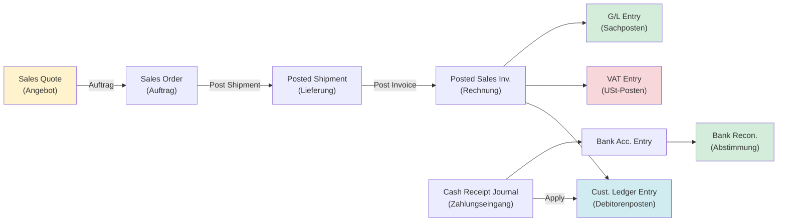

### Pflicht‑Stammdaten (kritische Felder)
- Kunde (`Customer` (Kunde)): Buchung (Posting) Group (Debitorenkonto), Gen. Bus. Buchung (Posting) Group, VAT Bus. Buchung (Posting) Group, Payment Terms, Payment Method, Currency Code, Bill‑to/Ship‑to, (optional) Credit Limit/Blocked.
- Artikel/Leistung (`Item` (Artikel)/G/L Account/Resource): Gen. Prod. Buchung (Posting) Group, VAT Prod. Buchung (Posting) Group, Inventory Buchung (Posting) Group (bei Items), Unit of Measure.
- Verkaufsdokument‑Defaults: Preise/Rabatte, Lieferbedingungen (wenn genutzt), Dimensionen.

### Pflicht‑Setup (Einrichtung)
- Sales & Receivables Setup (Nummernkreise, Buchung (Posting)‑Policies).
- Customer Buchung (Posting) Groups (Debitorensammelkonto), Gen. Buchung (Posting) Setup (Bus×Prod → Erlöskonten), VAT Buchung (Posting) Setup (siehe Kap. 5).
- Payment Terms/Methods; ggf. Reminder/Finance Charge Einrichtung (Setup).
- Pflichtdimensionen (z. B. Kostenstelle/Profitcenter/Projekt) + Default‑Dimensionen.
- Governance: Konditionen/Steuer/Buchung (Posting)‑Einrichtung (Setup) und Debitorenbankdaten nicht „ad‑hoc“ ändern (Freigabe/Protokoll).

### BC Umsetzung (konkret, Key‑User (Schlüsselanwender))
- Einrichtung (Setup): *Sales & Receivables Setup* (Einrichtung Verkauf & Debitoren), Customer Buchung (Posting) Groups (Debitorenbuchungsgruppen), *General Posting Setup* (Allgemeine Buchungsmatrix), VAT Buchung (Posting) Einrichtung (Setup) (USt‑Buchungsmatrix), Nummernserien.
- Stammdaten: *Customer Card* (Debitorenkarte) (Posting/VAT/Payment (Zahlung)‑Felder), *Item Card* (Artikelkarte) bzw. *G/L Account* (Sachkonto) (Gen./VAT Prod. Groups (Allg./USt‑Produktbuchungsgruppen)), Default‑Dimensionen.
- Buchen: *Sales Order* (Verkaufsauftrag) → *Post Shipment* (Lieferung buchen) (falls genutzt) → *Post Invoice* (Rechnung buchen); alternativ *Sales Invoice* (Verkaufsrechnung) direkt.
- Zahlung/Ausgleich: Zahlungseingang (Journal/Bankimport) → *Apply Entries* (Posten ausgleichen) auf `Customer Ledger Posten (Entries)`.
- Kontrolle: `Customer Ledger Posten (Entries)` (Open/Closed (Offen/Geschlossen)) + `VAT Posten (Entries)` + `G/L Posten (Entries)` (Debitor/Umsatz/Steuer).

#### BC Schritt für Schritt (Einrichtung → Prozess → Kontrolle)

**Einrichtung (Setup) – Tell Me – Suchbegriffe: `Sales & Receivables Setup`, `Customer Posting Groups`, `General Posting Setup`, `VAT Posting Setup`, `Customers`**
1. Tell Me → `Sales & Receivables Setup` → Reiter „Nummerierung": Nummernserien für `Invoice Nos.`, `Shipment Nos.` setzen → Reiter „Allgemein": `Credit Warnings` = `Both Warnings` (empfohlen)
2. Tell Me → `Customer Posting Groups` → New → Code: `INLAND` → Feld `Receivables Account` (Debitorensammelkonto): `1200` → speichern
3. Tell Me → `General Posting Setup` → Kombination `Bus. Posting Group` × `Prod. Posting Group` → Feld `Sales Account` (Erlöskonto): z. B. `4000` (Umsatzerlöse Inland) → Feld `Sales Credit Memo Account`: `4000`
4. Tell Me → `VAT Posting Setup` → Kombination `DOM` × `WARE-STD` → `VAT %`: `19`, `Sales VAT Account`: `1776`, `Purchase VAT Account`: `1576` → speichern
5. Tell Me → `Customers` → Kundenkarte öffnen → Reiter „Fakturierung": `Customer Posting Group` = `INLAND`, `Gen. Bus. Posting Group` = `DOM`, `VAT Bus. Posting Group` = `DOM` → Reiter „Zahlungen": `Payment Terms Code` = `30T` (30 Tage netto)

**Prozess (Happy Path (Standardpfad)) – nummerierte Klick-Schritte:**
1. Tell Me → `Sales Orders` → New → Feld `Customer Name`: Debitor auswählen → Kopfdaten prüfen (Posting Group, Datum)
2. Reiter „Zeilen" → Feld `Type` = `Item` oder `G/L Account` → Feld `No.` (Artikelnummer/Kontonummer) → Feld `Quantity` + `Unit Price` eingeben → VAT Amount in der Zeile prüfen: muss z. B. 19% zeigen
3. Aktion `Post` (F9) → Auswahl `Ship and Invoice` → Bestätigen → Ergebnis: `Posted Sales Invoice` wird erzeugt + `Customer Ledger Entry` (offen) angelegt
4. Tell Me → `Cash Receipt Journals` → Batch „BANK" auswählen → New Line → `Account Type` = `Customer`, `Account No.` = Debitor → Betrag eingeben → Aktion `Apply Entries` → offenen Posten auswählen → `Set Applies-to ID` → `Post`
5. Ergebnis nach Post: `Customer Ledger Entry` wechselt auf `Open` = No (ausgeglichen) ✓

**Kontrolle:**
- `Customer Ledger Entries` → Filter `Open` = `Yes` → Liste sollte nur wirklich offene Posten zeigen ✓
- `VAT Entries` → Filter `Document No.` = Rechnungsnummer → `VAT %` = 19, `Base` + `Amount` korrekt ✓
- `G/L Entries` → Filter `G/L Account No.` = `1200` → Summe = Aged AR Saldo ✓

### Datenfluss & Abhängigkeiten
- Buchen der Verkaufsrechnung erzeugt typischerweise: `Customer Ledger Posten (Entry)` (Forderung), `Detailed Cust. Ledg. Posten (Entry)` (Applikationsdetail), `G/L Posten (Entry)` (Debitor, Umsatz, Steuer), `VAT Posten (Entry)` (USt), ggf. `Item Ledger Posten (Entry)` + `Value Posten (Entry)` (bei Lagerartikeln).
- Abhängigkeit: falsche Buchung (Posting) Groups/VAT Groups → falsche `G/L Posten (Entry)`/`VAT Posten (Entry)` → falsche Umsatz-/USt‑Auswertung.

### Kerntabellen & Beziehungen
- `Customer` (Kunde) → `Customer Ledger Posten (Entry)` → `Detailed Cust. Ledg. Posten (Entry)` → (Ausgleich/Applikation) → `G/L Posten (Entry)`.
- `Sales Header`/`Sales Line` → `Sales Invoice Header`/`Sales Invoice Line` (Posted) → Posten (Entries).

### EUR‑Testfall: O2C komplett durchgebucht
- **Sachverhalt:** Kunde bestellt Ware 10.000 EUR netto → Lieferung → Rechnung → Zahlung mit 2 % Skonto
- **Buchungskette:**
  - Rechnung buchen → `Customer Ledger Entry` offen: **11.900 EUR** (10.000 + 1.900 USt)
  - Zahlungseingang nach 8 Tagen (Skontofrist 10 Tage) → Eingang: **11.662 EUR**
  - Skontobetrag: 11.900 × 2 % = **238 EUR** → davon Netto-Skonto **200 EUR** + USt-Korrektur **38 EUR**
- **Entries nach Buchung:**

| Posten‑Typ | Konto | Soll EUR | Haben EUR |
|---|---|---|---|
| G/L Entry (Rechnung) | 1200 Forderungen | 11.900 | |
| G/L Entry (Rechnung) | 4000 Erlöse | | 10.000 |
| G/L Entry (Rechnung) | 1776 USt 19 % | | 1.900 |
| VAT Entry | USt 19 % | Base 10.000 | Amount 1.900 |
| G/L Entry (Zahlung) | 1800 Bank | 11.662 | |
| G/L Entry (Zahlung) | 4730 Skontoaufwand | 200 | |
| G/L Entry (Zahlung) | 1776 USt-Korrektur | 38 | |
| G/L Entry (Zahlung) | 1200 Forderungen | | 11.900 |

- **Kontrollpunkt:** `Customer Ledger Entry` → `Open` = No ✓ | `Aged AR` Saldo Kunde = 0 ✓ | `VAT Entry` Base = 10.000 − 200 = 9.800 (nach Korrektur) ✓

### Typische Fehlerbilder + Diagnosepfad
- Fehlerbild: falsches Erlöskonto → Diagnose: Posted Sales Invoice (Gebuchte Verkaufsrechnung) → Lines (Zeilen) (Gen. Prod. Buchung (Posting) Group) → Gen. Buchung (Posting) Einrichtung (Setup).
- Fehlerbild: falsche Steuer → Diagnose: `VAT Posten (Entry)` (Link zur Buchung) → VAT Buchung (Posting) Einrichtung (Setup) → Stammdaten (VAT Bus./Prod. Groups).
- Fehlerbild: Zahlung nicht ausgeglichen → Diagnose: `Customer Ledger Posten (Entries)` (Open) → Ausgleich (Apply) Entries / Detailed Posten (Entries) → Bank/Cash‑Beleg prüfen.
Prüfungsfalle:
- Lieferschein/Leistungsnachweis existiert, ist aber nicht sauber mit der Rechnung verknüpft (Belegkette bricht).
UAT‑Minimaltests:
- Test 1: Auftrag → Lieferung → Rechnung (Happy Path (Standardpfad)) inkl. korrekter Kontierung/VAT.
- Test 2: Teilrechnung/Teillieferung (Ausnahme) und korrekte OP‑Darstellung.
- Test 3: Gutschrift gegen Rechnung + Ausgleich (Applikation) nachvollziehbar.
- Test 4: Zahlungseingang importiert und automatisch/halbautomatisch ausgeglichen.

### Optional: AL‑Objekte (Developer‑Tiefe)
- Sales Buchung (Posting) Erweiterungen (Events rund um Sales‑Post), Belegvalidierung (z. B. Pflichtfelder/Dimensionen).

---

## 3. P2P – Procure‑to‑Pay (Bestellung → Wareneingang → Eingangsrechnung → Zahlung)

### Zweck (fachlich + Abschlusskontrolle)
- Zweck: Beschaffungsprozess mit sauberer Belegkette (Bestellung/WE → Rechnung → Verbindlichkeit → Zahlung).
- Abschlusskontrolle: **OP‑Liste Kreditoren** (Aged AP) + Abstimmung `Vendor Ledger Posten (Entry)` ↔ `G/L Posten (Entry)` (Kreditorenkonto), Stichprobe: „Bestellung/WE/Invoice match“ (3‑Way‑Match organisatorisch/technisch).
- Evidence Pack (Nachweispaket): Bestellung + Wareneingang (bei Ware) + gebuchte Eingangsrechnung + Zahlungsbeleg + Ausgleichsdokumentation + VAT Entries (USt‑Posten/Vorsteuer).

### Module & Prozesskette (End‑to‑End)
- Purchasing → Inventory (bei Artikeln) → Finance (Payables) → Payments/Bank.
- Typischer Standardpfad (Happy Path (Standardpfad)): Purchase Order (Einkaufsbestellung) → (optional) Receipt (Wareneingang) → Purchase Invoice (Einkaufsrechnung) → Vendor Payment (Lieferantenzahlung) → Bankabstimmung.
- Varianten: Direkt‑Eingangsrechnung, Teil‑WE/Teil‑Rechnung, Credit Memo, Anzahlungen (prozess-/landabhängig).
- Entscheidungspunkte (process first): 2‑Way vs. 3‑Way‑Match, Mengen-/Preisabweichung, Skonto, Fremdwährung, Gutschrift.

**P2P-Prozessfluss in BC:**

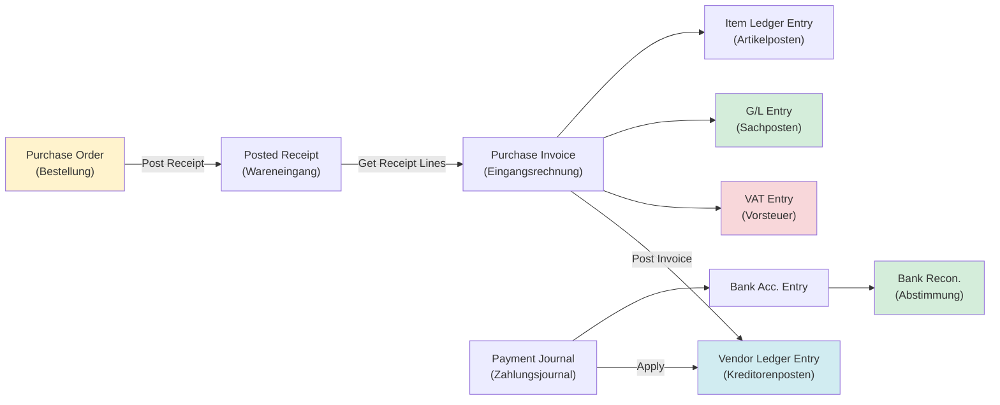

### Pflicht‑Stammdaten (kritische Felder)
- Lieferant (`Vendor` (Lieferant)): Vendor Buchung (Posting) Group (Kreditorensammelkonto), Gen. Bus. Buchung (Posting) Group, VAT Bus. Buchung (Posting) Group, Payment Terms/Method, Bankdaten/IBAN, Currency Code, Blocked.
- Artikel/Leistung (`Item` (Artikel)/G/L Account/Resource): Gen. Prod. Buchung (Posting) Group, VAT Prod. Buchung (Posting) Group, Inventory Buchung (Posting) Group (bei Items).
- Einkaufskonditionen: Preise, Lieferbedingungen, Dimensionen (Default/Required).

### Pflicht‑Setup (Einrichtung)
- Purchases & Payables Setup (Nummernkreise, Buchung (Posting)‑Policies).
- Vendor Buchung (Posting) Groups, Gen. Buchung (Posting) Setup (Bus×Prod → Aufwands-/Bestandskonten), VAT Buchung (Posting) Setup (Kap. 5).
- Payment Journal Setup (Batches, Nummern, Bankkonten), ggf. Zahlungsformate/SEPA (Single Euro Payments Area – einheitlicher europäischer Zahlungsraum) (landabhängig).
- Governance: Lieferantenbankdaten/IBAN nur über kontrollierten Änderungsprozess (Betrugsprävention).

### BC Umsetzung (konkret, Key‑User (Schlüsselanwender))
- Einrichtung (Setup): *Purchases & Payables Setup* (Einrichtung Einkauf & Kreditoren), Vendor Buchung (Posting) Groups (Kreditorenbuchungsgruppen), *General Posting Setup* (Allgemeine Buchungsmatrix), VAT Buchung (Posting) Einrichtung (Setup) (USt‑Buchungsmatrix), Zahlungsjournal‑Vorlagen/Batches (Stapel).
- Stammdaten: *Vendor Card* (Kreditorenkarte) (Posting/VAT/Payment (Zahlung)/Bank‑Felder), *Item Card* (Artikelkarte) bzw. *G/L Account* (Sachkonto) (Gen./VAT Prod. Groups (Allg./USt‑Produktbuchungsgruppen)).
- Buchen (Ware): *Purchase Order* (Einkaufsbestellung) → *Post Receipt* (Wareneingang buchen) → *Purchase Invoice* (Einkaufsrechnung) (Receipt Lines (WE‑Zeilen) holen) → posten.
- Buchen (Dienstleistung): *Purchase Invoice* (Einkaufsrechnung) direkt → posten.
- Zahlung/Ausgleich: *Payment Journal* (Zahlungsjournal) posten → `Vendor Ledger Posten (Entries)` ausgleichen (Apply (Ausgleich)) → Bankabstimmung.
- Kontrolle: `Vendor Ledger Posten (Entries)` + `VAT Posten (Entries)` + `G/L Posten (Entries)` (Kreditor/Aufwand/Steuer) + Aged AP (Fälligkeitenliste Kreditoren).

#### BC Schritt für Schritt (Einrichtung → Prozess → Kontrolle)

**Einrichtung (Setup) – Tell Me – Suchbegriffe: `Purchases & Payables Setup`, `Vendor Posting Groups`, `General Posting Setup`, `VAT Posting Setup`, `Vendors`**
1. Tell Me → `Purchases & Payables Setup` → Reiter „Nummerierung": Nummernserien für `Order Nos.`, `Invoice Nos.`, `Receipt Nos.` setzen → Reiter „Allgemein": `Ext. Doc. No. Mandatory` = `Yes` (externe Belegnummer Pflicht – GoBD-relevant)
2. Tell Me → `Vendor Posting Groups` → New → Code: `INLAND` → Feld `Payables Account` (Kreditorensammelkonto): `1600` → speichern
3. Tell Me → `General Posting Setup` → Kombination `DOM` × `WARE-STD` → Feld `Purch. Account` (Wareneinkaufskonto): `3000` → Feld `COGS Account` (Wareneinsatz): `6800` → speichern
4. Tell Me → `VAT Posting Setup` → Kombination `DOM` × `WARE-STD` → `VAT %`: `19`, `Purchase VAT Account` (Vorsteuerkonto): `1576` → speichern
5. Tell Me → `Vendors` → Kreditorenkarte öffnen → Reiter „Fakturierung": `Vendor Posting Group` = `INLAND`, `Gen. Bus. Posting Group` = `DOM`, `VAT Bus. Posting Group` = `DOM` → Reiter „Zahlungen": `Payment Terms Code` = `14T` (14 Tage 2% Skonto oder 30T netto)

**Prozess (Happy Path (Standardpfad)) – nummerierte Klick-Schritte:**
1. Tell Me → `Purchase Orders` → New → Feld `Vendor Name`: Lieferant auswählen → Feld `Vendor Invoice No.` (externe Belegnr.): Rechnungsnummer des Lieferanten eintragen
2. Reiter „Zeilen" → Feld `Type` = `Item` → Feld `No.` → Feld `Quantity` + `Direct Unit Cost` → Vorsteuer in Zeile prüfen: 19% ✓
3. Aktion `Post` → Auswahl `Receive` (nur Wareneingang) → Ergebnis: `Posted Purchase Receipt` wird erzeugt, `Item Ledger Entry` angelegt, Bestand steigt
4. Tell Me → `Purchase Invoices` → New → Feld `Vendor Name` → Aktion `Get Receipt Lines` → gebuchten Wareneingang auswählen → Zeilen werden übernommen → `Vendor Invoice No.` prüfen → Aktion `Post` → Ergebnis: `Posted Purchase Invoice` + `Vendor Ledger Entry` (offen)
5. Tell Me → `Payment Journals` → Batch „BANK" → Aktion `Suggest Vendor Payments` → Filter: `Last Payment Date` + `Vendor No.` → Zeilen vorgeschlagen → Prüfen → Aktion `Export Payment File` (SEPA-CT) → Datei an Bank senden → nach Bankbestätigung: `Post` → Ergebnis: `Vendor Ledger Entry` ausgeglichen ✓

**Kontrolle:**
- `Vendor Ledger Entries` → Filter `Open` = `Yes` → nur wirklich offene Verbindlichkeiten ✓
- 3-Way-Match: `Posted Purchase Receipts` ↔ `Posted Purchase Invoice` → `Navigate` auf Invoice → alle drei Belege (Order/Receipt/Invoice) in Belegkette sichtbar ✓
- `VAT Entries` → Filter `Document No.` = Rechnungsnummer → `VAT %` = 19, `VAT Calculation Type` = `Normal VAT` ✓

### Datenfluss & Abhängigkeiten
- Buchen der Eingangsrechnung erzeugt typischerweise: `Vendor Ledger Posten (Entry)` (Verbindlichkeit), `Detailed Vendor Ledg. Posten (Entry)`, `G/L Posten (Entry)` (Kreditor, Aufwand/Bestand, Steuer), `VAT Posten (Entry)`; bei Artikeln zusätzlich `Item Ledger Posten (Entry)`/`Value Posten (Entry)` (WE/Invoice‑Kosten).
- Abhängigkeit: falsche Gen./VAT Buchung (Posting) Groups → falsche `G/L Posten (Entry)`/`VAT Posten (Entry)` → falsche Aufwands-/Vorsteuer‑Auswertung.

### Kerntabellen & Beziehungen
- `Vendor` (Lieferant) → `Vendor Ledger Posten (Entry)` → `Detailed Vendor Ledg. Posten (Entry)` → `G/L Posten (Entry)`.
- `Purchase Header`/`Purchase Line` → Posted Purch. Invoice → Posten (Entries).

### EUR‑Testfall: P2P komplett durchgebucht
- **Sachverhalt:** Einkauf Rohstoffe 10.000 EUR netto → Bestellung → Wareneingang → Eingangsrechnung → Zahlungslauf mit 2 % Skonto
- **Buchungskette:**
  - Wareneingang buchen → `Item Ledger Entry` + `Value Entry` (Expected Cost 10.000 EUR)
  - Eingangsrechnung buchen → `Vendor Ledger Entry` offen: **11.900 EUR** (10.000 + 1.900 VSt (Vorsteuer))
  - 3-Way-Match: Bestellung ↔ Lieferschein ↔ Rechnung → Mengen und Preise stimmen ✓
  - Zahlungslauf (Skontofrist) → Zahlung: **11.662 EUR** → Skonto **238 EUR** (200 netto + 38 VSt-Korrektur)
- **Entries nach Zahlung:**

| Posten‑Typ | Konto | Soll EUR | Haben EUR |
|---|---|---|---|
| G/L Entry (Rechnung) | 3400 Wareneinkauf | 10.000 | |
| G/L Entry (Rechnung) | 1576 Vorsteuer 19 % | 1.900 | |
| G/L Entry (Rechnung) | 1600 Verbindlichkeiten | | 11.900 |
| G/L Entry (Zahlung) | 1600 Verbindlichkeiten | 11.900 | |
| G/L Entry (Zahlung) | 1800 Bank | | 11.662 |
| G/L Entry (Zahlung) | 4730 Skontoertrag | | 200 |
| G/L Entry (Zahlung) | 1576 VSt-Korrektur | | 38 |

- **Kontrollpunkt:** `Vendor Ledger Entry` → `Open` = No ✓ | `Item Ledger Entry` → `Cost Amount (Actual)` = 10.000 ✓

### Typische Fehlerbilder + Diagnosepfad
- Fehlerbild: Rechnung „landet” auf falschem Aufwand → Diagnose: Posted Purch. Invoice Lines → Gen. Prod. Buchung (Posting) Group → Gen. Buchung (Posting) Einrichtung (Setup).
- Fehlerbild: Vorsteuer falsch/fehlt → Diagnose: `VAT Posten (Entry)` → VAT Buchung (Posting) Einrichtung (Setup) → Vendor/Item VAT Groups.
- Fehlerbild: Zahlung doppelt/fehlt → Diagnose: `Vendor Ledger Posten (Entries)` (Open/Closed) → Applied Posten (Entries) → Payment Journal/Bank.
Prüfungsfalle:
- Rechnung wird gebucht, obwohl die fachliche Prüfung (Freigabe/Zuordnung/Abgleich (Matching)) außerhalb des Systems passiert und nicht nachweisbar ist.
UAT‑Minimaltests:
- Test 1: Bestellung → WE → Rechnung (Happy Path (Standardpfad)) und korrekte Kontierung/VAT.
- Test 2: Rechnung ohne WE (Dienstleistung) mit dokumentierter Freigabe.
- Test 3: Preis-/Mengenabweichung (Ausnahme) und definierter Klärungsprozess.
- Test 4: Lieferantenbankdatenänderung: 4‑Augen + Prüfung (Audit)‑Nachweis.

### Optional: AL‑Objekte (Developer‑Tiefe)
- Purch. Buchung (Posting) Erweiterungen, Validierungen (z. B. Pflicht‑Dimensionen), Zahlungsdatei‑Erweiterungen.

---

## 4. Bank & Cash – Bankimport, Zahlungsausgleich, Bankabstimmung

### Zweck (fachlich + Abschlusskontrolle)
- Zweck: Vollständige Abbildung der Bankbewegungen, schneller OP‑Ausgleich, saubere Bankabstimmung.
- Abschlusskontrolle: Bankabstimmung je Bankkonto (Saldo Bank ↔ BC) + Stichprobe „jede Zahlung hat Belegkette“.
- Evidence Pack (Nachweispaket): Bankabstimmungsprotokoll je Konto/Periode, Importprotokolle, Liste ungeklärter Positionen + Klärungsvermerke.

### Module & Prozesskette (End‑to‑End)
- Payments (Payment Journal) → Bank Statement Import → (auto) Zuordnung/Abgleich (Matching)/Ausgleich (Apply) → Bank Reconciliation → Buchung (Posting).

### Pflicht‑Stammdaten (kritische Felder)
- `Bank Account` (Bankkonto): Bankkonto‑Nr., IBAN/BIC, Währung, ggf. Bank Buchung (Posting) Group/contra account, Importformat‑Parameter.
- `Customer` (Kunde)/`Vendor` (Lieferant): Payment Method/Terms, Bankdaten (bei Zahlungen), Referenzen (z. B. Debitorennummer auf Kontoauszug, sofern genutzt).

### Pflicht‑Setup (Einrichtung)
- Payment Journal Templates/Batches + Nummernserien.
- Bank Import/Statement Setup (Format, Zuordnungslogik je Land/Bank).
- Regeln/Mapping für automatisches Matching (prozess- und formatabhängig).
- Governance: Zuordnung/Abgleich (Matching)‑Regeln sind **buchungsrelevant** → Änderungen nur versioniert + Testnachweis.

### BC Umsetzung (konkret, Key‑User)
- Setup: *Bank Account Card* + Importformat/Statement‑Setup (je Bank/Land), Zahlungsjournal‑Konfiguration.
- E2E: Kontoauszug importieren → Auto‑Matching/Zuordnung → manuelle Klärung → *Bank Reconciliation* abschließen/posten.
- Ausgleich: OP‑Ausgleich über *Apply Entries* (`Customer/Vendor Ledger Posten (Entries)`) bzw. über Matching‑Logik.
- Kontrolle: `Bank Account Ledger Posten (Entries)` + Bankabstimmungsstatus + Liste ungeklärter Auszugszeilen.

#### BC Schritt für Schritt (Einrichtung → Prozess → Kontrolle)

**Einrichtung (Setup) – Tell Me – Suchbegriffe: `Bank Accounts`, `Payment Methods`, `Payment Terms`, `Bank Export/Import Setup`**
1. Tell Me → `Bank Accounts` → Bankkontokarte öffnen → Feld `IBAN`: DE-IBAN eintragen → Feld `Currency Code`: leer (= EUR) → Reiter „Übertragung": `Bank Account Posting Group` → Feld `G/L Account No.` = `1200` (Bankkonto G/L) → speichern
2. Tell Me → `Payment Methods` → New → Code: `SEPA-CT` → Feld `Bal. Account Type` = `Bank Account`, `Bal. Account No.` = Bankkontonummer → `Payment Processor` leer (Standard)
3. Tell Me → `Payment Terms` → Nummernserien für Zahlungsziele: Code `30T` → `Due Date Calculation` = `30D` (30 Tage) → optional: `Discount %` = `2`, `Discount Date Calculation` = `10D`
4. Tell Me → `Bank Export/Import Setup` → Importformat: Code `CAMT053` (CAMT = Cash Management, ISO-20022-Bankformat für Kontoauszüge) → `Direction` = `Import` → `Processing Codeunit ID` = 1267 (SEPA CAMT Standard) → speichern

**Prozess (Happy Path (Standardpfad)) – nummerierte Klick-Schritte:**
1. Tell Me → `Payment Journals` → Batch auswählen → Aktion `Suggest Vendor Payments` → Felder: `Last Payment Date`, `Summarize per Vendor` = Yes → Zeilen erscheinen → prüfen (Betrag, Fälligkeit, IBAN)
2. Aktion `Export Payment File` → SEPA-XML-Datei wird erzeugt → Datei an Bank übermitteln → Bestätigung abwarten
3. Nach Bankausführung: Tell Me → `Bank Account Reconciliations` → New → `Bank Account No.` auswählen → Feld `Statement Date` + `Statement Ending Balance` aus Kontoauszug eintragen
4. Aktion `Import Bank Statement` → CAMT.053-Datei hochladen → Auszugszeilen erscheinen → Aktion `Match Automatically` → Matching-Quote prüfen (Ziel ≥ 85%)
5. Nicht-automatisch gematche Zeilen: manuell zuordnen über `Apply Entries` oder neue G/L-Buchung (Klärposten auf Konto `1299`) → wenn alle Zeilen zugeordnet: Feld `Difference` = 0 → Aktion `Post` → Bankabstimmung abgeschlossen ✓

**Kontrolle:**
- `Bank Account Ledger Entries` → Filter `Bank Account No.` + Zeitraum → alle Einträge haben `Statement No.` gefüllt ✓
- `Bank Account Reconciliations` → Status = `Posted` für abgeschlossene Perioden ✓
- Ungeklärte Positionen: Klärpostenkonto `1299` → Saldo sollte 0 sein (oder dokumentierte Übergangspositionen) ✓

### Datenfluss & Abhängigkeiten
- Bankabstimmung/Buchung (Posting) erzeugt `Bank Account Ledger Posten (Entry)` und `G/L Posten (Entry)` (Bankkonto/Abstimmkonten) und wirkt auf Ausgleich von `Customer/Vendor Ledger Posten (Entry)`.
- Abhängigkeit: schlechte Referenzqualität (Verwendungszweck, Belegnummern) → Matchingquote sinkt → manueller Aufwand/Fehlerrisiko.

### Kerntabellen & Beziehungen
- `Bank Account` (Bankkonto) → `Bank Account Ledger Posten (Entry)` → `G/L Posten (Entry)`.
- `Payment Journal Line` → Posted Zahlung → Ausgleich (Apply) → `Detailed Cust./Vendor Ledg. Posten (Entry)`.

### EUR‑Testfall: Kontoauszug 5 Positionen abstimmen
- **Sachverhalt:** Kontoauszug vom 30.11.2025 mit 5 Positionen:

| Nr. | Auszugsposition | Betrag EUR | Match‑Ergebnis |
|---|---|---|---|
| 1 | Miete Büro (Dauerauftrag) | −1.200 | Auto‑Match → G/L 6310 Mietaufwand ✓ |
| 2 | Kundeneingang Müller GmbH | +5.000 | Auto‑Match → Customer Ledger Entry RE-2025-042 ✓ |
| 3 | Gehaltsüberweisung | −3.500 | Auto‑Match → G/L 4120 Gehälter ✓ |
| 4 | Bankgebühren | −25 | Manuell → G/L 6855 Bankgebühren (neu anlegen) |
| 5 | Unbekannter Eingang „Ref XY” | +150 | Klärposten → G/L 1590 Interimskonto |

- **Ergebnis nach Abstimmung:** Alle 5 Zeilen zugeordnet → Statement Ending Balance = BC Bank Account Balance → Differenz = **0 EUR** → `Post` ✓
- **Nacharbeiten:** Position 5 (Klärposten 150 EUR) in Folgeperiode klären → umbuchbar auf korrektes Konto

### Typische Fehlerbilder + Diagnosepfad
- Fehlerbild: Bankabstimmung „geht nicht auf” → Diagnose: Bankkontoauszugzeilen → gematchte/unmatched Zeilen → `Bank Account Ledger Posten (Entries)` (Filter Zeitraum) → Gegenkonten.
- Fehlerbild: Zahlung ist gebucht, aber OP bleibt offen → Diagnose: `Customer/Vendor Ledger Posten (Entries)` → Applied Entries / Detailed Posten (Entries).
Prüfungsfalle:
- „Auto‑Zuordnung/Abgleich (Matching)” wird genutzt, aber Regeln/Änderungen sind nicht nachvollziehbar (wer hat wann was verändert?).
UAT‑Minimaltests:
- Test 1: Kontoauszugimport (Happy Path (Standardpfad)) mit Auto‑Match (Automatisches Matching)‑Quote.
- Test 2: Manuelle Klärung (Ausnahme) mit dokumentiertem Grund.
- Test 3: Bankabstimmung abgeschlossen, Saldo stimmt, Nachweis abgelegt.
- Test 4: Klärposten (ungeklärte Zeile) – korrekt auf Interimskonto gebucht, in Folgeperiode aufgelöst.

### Bank & Cash – Prozessfluss (End‑to‑End)

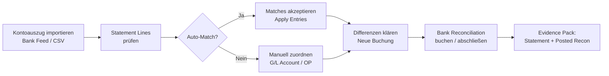

### Optional: AL‑Objekte (Developer‑Tiefe)
- Importformat‑Erweiterungen, Zuordnung/Abgleich (Matching)‑Regel‑Logik (Events), Validierung von Referenzen.

---

## 5. Steuern – VAT/USt (Buchungsmatrix → VAT Posten (Entries) → Auswertung/Meldung)

### Zweck (fachlich + Abschlusskontrolle)
- Zweck: Steuerlogik wird **systemisch** über Buchung (Posting) Groups + VAT Buchung (Posting) Einrichtung (Setup) erzwungen (statt „manuell“).
- Abschlusskontrolle: USt‑Abstimmung `VAT Posten (Entry)` ↔ Steuer‑Sachkonten (`G/L Posten (Entry)`) ↔ VAT Statement/Return (je Land).
- Evidence Pack (Nachweispaket): VAT‑Abstimmblatt, Export/Meldeprotokoll, Liste von Korrekturbuchungen (inkl. Begründung).

### Module & Prozesskette (End‑to‑End)
- Stammdaten (VAT Bus./Prod. Groups) → VAT Buchung (Posting) Setup (Matrix) → Posting (Sales/Purchase/Journal) → `VAT Posten (Entry)` → VAT Statement/Return → Meldung.

### Pflicht‑Stammdaten (kritische Felder)
- Kunde/Lieferant: **VAT Bus. Buchung (Posting) Group**, Land/Region, USt‑ID (falls relevant).
- Artikel/Leistung/Sachkonto: **VAT Prod. Buchung (Posting) Group**, (bei Sonderfällen) steuerliche Leistungsart/Mappinglogik.

### Pflicht‑Setup (Einrichtung)
- VAT Buchung (Posting) Einrichtung (Setup): (Bus‑Gruppe × Prod‑Gruppe) → Steuersatz/Calculation Type + Steuerkonten (Vorsteuer/Umsatzsteuer) + Reporting‑Zuordnung (Statement).
- VAT Statement/Return Setup (landabhängig).
- Governance: Wer darf VAT Einrichtung (Setup) ändern? (Berechtigung/Change‑Prozess).
  - Process first: VAT‑Einrichtung (Setup) ist „Systemgesetz“ → Änderungen nur per CR‑ID + UAT‑Nachweis (sonst systematische Falschmeldungen).

### BC Umsetzung (konkret, Key‑User)
- Setup: VAT Bus./Prod. Buchung (Posting) Groups definieren → *VAT Buchung (Posting) Einrichtung (Setup)* (Matrix) pflegen → Steuerkonten/Statement‑Zeilen zuordnen.
- Stammdaten: VAT Bus. Buchung (Posting) Group am *Customer/Vendor*; VAT Prod. Buchung (Posting) Group an *Item/Service/G/L Account*.
- E2E: je Szenario eine Testbuchung (Sales/Purchase/Journal) posten → `VAT Posten (Entries)` prüfen → VAT Statement/Return erzeugen → Abstimmung gegen Steuerkonten (`G/L Posten (Entries)`).

#### BC Schritt für Schritt (Einrichtung → Prozess → Kontrolle)

**Einrichtung (Setup) – Tell Me – Suchbegriffe: `VAT Business Posting Groups`, `VAT Product Posting Groups`, `VAT Posting Setup`, `VAT Statements`**
1. Tell Me → `VAT Business Posting Groups` → Codes anlegen: `DOM` (Inland), `EU` (innergemeinschaftlich), `NON-EU` (Drittland) → je mit aussagekräftiger Beschreibung
2. Tell Me → `VAT Product Posting Groups` → Codes anlegen: `UST19` (Normalsteuersatz), `UST7` (ermäßigt), `UST0` (steuerfrei), `REVERSE` (Reverse Charge) → je mit Beschreibung
3. Tell Me → `VAT Posting Setup` → je Kombination Bus × Prod ausfüllen:
   - `DOM` × `UST19`: `VAT %` = `19`, `VAT Calculation Type` = `Normal VAT`, `Sales VAT Account` = `1776`, `Purchase VAT Account` = `1576`
   - `DOM` × `UST7`: `VAT %` = `7`, `Sales VAT Account` = `1771`, `Purchase VAT Account` = `1571`
   - `EU` × `UST19`: `VAT %` = `0`, `VAT Calculation Type` = `Reverse Charge VAT`, `Sales VAT Account` = `1788`, `Purchase VAT Account` = `1588`
   - `NON-EU` × `UST19`: `VAT %` = `0`, `VAT Calculation Type` = `No Taxable VAT`
4. Tell Me → `VAT Statements` → Statement-Name = `DE-UVA` → Zeilen konfigurieren: z. B. Kennziffer `81` (steuerpflichtige Umsätze 19%) → `Row Totaling` = Sachkontenbereich Umsatz → `Amount Type` = `Base`; Kennziffer `66` (Vorsteuer) → Vorsteuerkonto `1576`

**Prozess (Happy Path (Standardpfad)) – nummerierte Klick-Schritte:**
1. Tell Me → `VAT Return Periods` → Periode auswählen (z. B. Januar) → Aktion `Create VAT Return` → neuer VAT Return-Beleg wird angelegt
2. Im VAT Return: Aktion `Suggest Lines` → alle `VAT Entries` der Periode werden aggregiert nach Kennziffern → Werte erscheinen
3. Abstimmung: Tell Me → `Trial Balance` → Saldo Konto `1776` (Umsatzsteuer) vergleichen mit VAT Return Zeile Kennziffer `81` → müssen übereinstimmen ✓
4. Zahllast berechnen: Ausgangsteuer − Vorsteuer = Zahllast → in VAT Return sichtbar
5. Meldung abgeben: ELSTER-Schnittstelle (falls konfiguriert): Aktion `Submit` → oder manuell über ELSTER-Portal (Werte aus VAT Statement übertragen) → Zahlungsbeleg erstellen: `General Journal` → Finanzamt-Zahlung buchen

**Kontrolle:**
- `VAT Entries` → Filter `Posting Date` = Periode → Summe `Base` Ausgangsteuer − Summe `Base` Vorsteuer = gemeldete Zahllast ✓
- `G/L Entries` Konto `1776` Saldo = `VAT Entries` Ausgangsteuer-Summe ✓
- `G/L Entries` Konto `1576` Saldo = `VAT Entries` Vorsteuer-Summe ✓

### Datenfluss & Abhängigkeiten (Muster – „wie Abhängigkeiten wirklich aussehen”)
- **Stammdaten**: Customer/Vendor mit VAT Bus. Buchung (Posting) Group; Item/Service mit VAT Prod. Buchung (Posting) Group; Land/Region; USt‑ID.
- **Einrichtung (Setup)**: VAT Buchung (Posting) Einrichtung (Setup) verknüpft Bus×Prod → Steuersatz/Konten → erzeugt `VAT Posten (Entry)` und beeinflusst `G/L Posten (Entry)`.
- **Abhängigkeit**: falsche Gruppen → falscher `VAT Posten (Entry)` → falscher VAT Statement/Return → falsche Meldung.

### Kerntabellen & Beziehungen
- `Customer` (Kunde)/`Vendor` (Lieferant) + `Item` (Artikel)/`G/L Account` → Buchung (Posting) → `VAT Posten (Entry)` + `G/L Posten (Entry)` → VAT Statement/Return.

### EUR‑Testfall: Monats‑Voranmeldung November 2025
- **Sachverhalt:** UStVA für November mit Ausgangs- und Eingangsseite:

| Position | Betrag EUR | Quelle |
|---|---|---|
| USt auf Ausgangsrechnungen (19 %) | 5.000 | 6 Ausgangsrechnungen, VAT Entries Sum |
| USt auf Ausgangsrechnungen (7 %) | 200 | 2 Lebensmittel-Rechnungen |
| ig. (innergemeinschaftliche) Lieferung (steuerfrei, Meldepflicht) | 0 (Bemessungsgrundlage 15.000) | 1 EU-Lieferung, KZ 41 |
| **Summe USt** | **5.200** | |
| − VSt auf Eingangsrechnungen (19 %) | −3.200 | 8 Eingangsrechnungen |
| − VSt ig. Erwerb (19 %, Nullsumme) | 0 (−1.900 + 1.900) | 1 EU-Einkauf, KZ 66/89 |
| **Summe VSt** | **−3.200** | |
| **= Zahllast** | **2.000** | An Finanzamt bis 10.01.2026 |

- **BC‑Ablauf:** Tell Me → `VAT Return` → Period = November 2025 → `Suggest Lines` → BC füllt alle Kennzahlen automatisch → prüfen: KZ 81 = 5.000, KZ 86 = 200, KZ 41 = 15.000, KZ 66 = 1.900 → `Release` → `Submit` → `Post`
- **Abstimmung:** `VAT Entries` Summe November ↔ `G/L Entries` auf Konto 1776 (USt) und 1576 (VSt) → Differenz = **0 EUR** ✓
- **Buchungssatz Zahlung:** Verbindlichkeit Finanzamt (Soll) 2.000 | Bank (Haben) 2.000

### Typische Fehlerbilder + Diagnosepfad
- Fehlerbild: „Steuer wurde gezogen, aber falscher Satz” → Diagnose: `VAT Posten (Entries)` (Beleglink) → VAT Buchung (Posting) Einrichtung (Setup) → Bus/Prod Groups am Beleg.
- Fehlerbild: „Steuerkonto stimmt nicht” → Diagnose: `G/L Posten (Entries)` auf Steuerkonto → Navigate (Navigieren) zum Beleg → VAT Buchung (Posting) Einrichtung (Setup).
Prüfungsfalle:
- Steuerlogik wird über manuelle Journalbuchungen „repariert”, statt die Ursache (Stammdaten/Matrix) zu korrigieren → Wiederholfehler.
UAT‑Minimaltests:
- Test 1: Sales + Purchase mit Standardfällen (Inland).
- Test 2: Ausnahmen (z. B. steuerfrei/Reverse Charge – je nach Einrichtung (Setup)) mit korrekter Ausweisung.
- Test 3: VAT Statement/Return erzeugen und Abstimmung VAT Posten (Entry) ↔ G/L durchführen.
- Test 4: VAT-Korrekturbuchung (z. B. Reverse Charge manuell) – VAT Entry korrekt, Buchung (Posting) Group nachvollziehbar.

### Steuern/VAT – Prozessfluss (End‑to‑End)

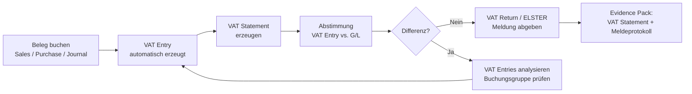

### Optional: AL‑Objekte (Developer‑Tiefe)
- Erweiterte Tax‑Determination (Events) oder zusätzliche Validierungen bei Buchung.

---

## 6. R2R – Record‑to‑Report (Journale → Abstimmungen → Periodenabschluss)

### Zweck (fachlich + Abschlusskontrolle)
- Zweck: Standardisierte Monatsabschlussroutine (Buchen, Abgrenzen, Abstimmen, Sperren, Berichten).
- Abschlusskontrolle: Checkliste „Close“ (OP‑Abstimmung, Bankabstimmung, VAT‑Abstimmung, SUSA plausibel, Periodensperre gesetzt).
- Evidence Pack (Nachweispaket): Abschlusscheckliste (Sign-off (Abzeichnung)), Abstimmblätter, Sperrprotokoll/Allowed Buchung (Posting) Dates, Ausnahme-/Nachbuchungslog.

### Module & Prozesskette (End‑to‑End)
- Journale (General Journal, Recurring) → Abstimmungen (AR/AP/Bank/VAT) → Periodenabschluss → Reporting.

**R2R-Monatlicher Abschlussablauf in BC:**

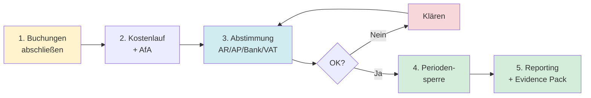

### Pflicht‑Stammdaten (kritische Felder)
- Sachkonten (Direktbuchung, Abschlusskontenlogik), Dimensionen (Pflichtwerte), Abgrenzungs‑/Wiederkehrlogik (wenn genutzt).

### Pflicht‑Setup (Einrichtung)
- Journal Templates/Batches, Nummernserien, (optional) Recurring Journals.
- Accounting Periods / Allowed Buchung (Posting) Dates / Benutzerrollen für Abschluss.
- Reporting Setups (Summen- und Saldenliste (Trial Balance) Varianten, Dimensions‑Berichte (Reports)), ggf. Konsolidierung (wenn genutzt).
- Governance: Abschlussrollen getrennt von Einrichtung (Setup)‑Rollen (SoD), Abschlusskalender verbindlich.

### BC Umsetzung (konkret, Key‑User (Schlüsselanwender))
- Einrichtung (Setup): *General Journal Templates/Batches* (Sachjournal‑Vorlagen/Stapel) + Nummernserien, *Accounting Periods* (Buchungsperioden) + *Allowed Posting Dates* (Zulässige Buchungsdaten), Abschlussrollen/Berechtigungen.
- Abschlusslauf: Abschlussbuchungen im *General Journal* (Sachjournal) (und ggf. *Recurring General Journal* (Wiederkehrendes Sachjournal)) → posten → Abstimmungen (AR/AP/Bank/VAT (Debitoren/Kreditoren/Bank/USt)) → Periodensperre setzen.
- Reporting: Trial Balance/Detail Trial Balance (Summen‑ und Saldenliste/Detail‑SuSa) (mit Dimensionen) + OP‑Listen + VAT Statement/Return (USt‑Auswertung/Meldung) + Bankabstimmung.

#### BC Schritt für Schritt (Einrichtung → Prozess → Kontrolle)

**Einrichtung (Setup) – Tell Me – Suchbegriffe: `Accounting Periods`, `General Ledger Setup`, `Financial Reports`, `Recurring General Journals`**
1. Tell Me → `Accounting Periods` → für neues Geschäftsjahr: Aktion `Create Year` → Startdatum eingeben (z. B. `01.01.2026`) → Anzahl Perioden `12` → Periodenlänge `1M` → Perioden werden automatisch angelegt
2. Tell Me → `General Ledger Setup` → Feld `Allow Posting From`: z. B. `01.01.2026` → Feld `Allow Posting To`: z. B. `31.01.2026` (nach Monatsabschluss: Datum vorwärts rollen) → speichern
3. Tell Me → `Financial Reports` → New → Name: `BILANZ-HGB` → Aktion `Edit Row Definition` → Sachkontenbereiche für Bilanzstruktur eintragen → Aktion `Edit Column Definition` → Spalten `Aktuell` + `Vorjahr` → speichern
4. Tell Me → `Recurring General Journals` → Batch `ABGRENZ` → Zeilen für Abgrenzungsbuchungen: `Recurring Method` = `F Fixed` (fixiert) oder `RF Reversing Fixed` (Umkehrbuchung) → Konten, Betrag, Buchungsperiode eintragen

**Prozess (Happy Path (Standardpfad)) – nummerierte Klick-Schritte:**
1. Tell Me → `Recurring General Journals` → Batch `ABGRENZ` → Datum auf Monatsende setzen → Aktion `Post` → Abgrenzungsbuchungen gebucht
2. Tell Me → `General Journals` → laufende Buchungen des Monats nacherfassen (falls noch offen) → `Post`
3. Abstimmungsrunde: AR: `Customer Ledger Entries` Open-Summe = `G/L Entries` Konto `1200` ✓ / AP: `Vendor Ledger Entries` Open-Summe = `G/L Entries` Konto `1600` ✓ / Bank: `Bank Account Reconciliation` abgeschlossen ✓ / VAT: VAT Return stimmt mit G/L überein ✓
4. Jahresende: Tell Me → `Close Income Statement` → Geschäftsjahr auswählen → Gegenkonto (Gewinn/Verlust-Vortragskonto) angeben → Buchungsdatum (letzter Tag des GJ) → Aktion `OK` → GuV-Konten werden auf 0 gesetzt, Jahresergebnis auf Eigenkapitalkonto gebucht
5. Tell Me → `General Ledger Setup` → `Allow Posting From` auf `01.02.2026` setzen → Vorperiode gesperrt ✓
6. Tell Me → `Financial Reports` → Bericht `BILANZ-HGB` aufrufen → Aktion `Print/Export` → PDF oder Excel → ablegen als Evidence Pack (Nachweispaket)

**Kontrolle:**
- `Accounting Periods` → Spalte `New Fiscal Year` + `Closed` → abgeschlossene Periode zeigt `Closed` = `Yes` ✓
- `Financial Reports` → GuV-Werte stimmen mit `Trial Balance` (Summen- und Saldenliste) überein ✓
- `G/L Registers` → letzte Buchungen je Periode sichtbar + Source Code für Abschluss (`CLOSINCST`) vorhanden ✓

### Datenfluss & Abhängigkeiten
- Journal Buchung (Posting) erzeugt `G/L Posten (Entry)` (und ggf. `VAT Posten (Entry)` bei steuerrelevanten Journalen).
- Abschlussrelevante Berichte (Reports) ziehen direkt aus `G/L Posten (Entry)` (und ggf. aus AR/AP/Bank/VAT Posten (Entries)).
- Abhängigkeit: fehlende Periodensperre/Allowed Buchung (Posting) Dates → Nachbuchungen in alte Perioden → Abschlusszahlen kippen.

### Kerntabellen & Beziehungen
- `Gen. Journal Line` → Buchung (Posting) → `G/L Posten (Entry)` → Summen- und Saldenliste (Trial Balance) / Financial Statements.
- AR/AP/Bank/VAT Posten (Entries) als Nebenbücher → Abstimmung auf Summenkonten.

### EUR‑Testfall: Monatsabschluss November 2025
- **Sachverhalt:** 5 Abschlussbuchungen zum 30.11.2025:

| Nr. | Buchung | Soll‑Konto | Haben‑Konto | Betrag EUR |
|---|---|---|---|---|
| 1 | Monatliche AfA Maschinen | 6220 AfA | 0411 kum. AfA | 10.000 |
| 2 | Urlaubsrückstellung Nov. | 6300 Personalaufwand | 0970 Rückst. Urlaub | 2.000 |
| 3 | Versicherung RAP (12 Monate, anteilig) | 0980 aRAP | 6400 Versicherung | 500 |
| 4 | Gehaltsabgrenzung Nov. (Gehalt 25.11. für Dez.) | 4120 Gehälter | 1740 sonst. VB | 3.500 |
| 5 | Zinsabgrenzung Darlehen Nov. | 7310 Zinsaufwand | 1740 sonst. VB | 200 |

- **BC‑Ablauf:** Buchungen 1, 3, 5 via `Recurring General Journal` (Batch ABGRENZ) → Post | Buchung 2 via `General Journal` (manuell) | Buchung 4 automatisch via Payroll-Schnittstelle
- **Trial Balance vorher → nachher:**
  - AfA-Konto 6220: vorher 100.000 → nachher **110.000** ✓
  - Rückstellungskonto 0970: vorher 18.000 → nachher **20.000** ✓
  - Gesamtaufwand November: +16.200 EUR → JÜ sinkt um 16.200 EUR
- **Periodensperre:** `General Ledger Setup` → `Allow Posting To` = `30.11.2025` → Dezember-Buchungen ab 01.12. möglich

### Typische Fehlerbilder + Diagnosepfad
- Fehlerbild: „SUSA passt nicht zu OP‑Liste” → Diagnose: Summenkonten (`G/L Posten (Entry)`) vs. Offene Posten (`Cust/Vendor Ledger Posten (Entry)`) → (fehlende) Periodenabgrenzung/Fehlbuchung.
- Fehlerbild: „Vorperiode verändert” → Diagnose: `G/L Register` (Sachpostenregister) + Buchung (Posting) Date/Source Code → Allowed Buchung (Posting) Dates prüfen.
Prüfungsfalle:
- Periodensperre fehlt oder wird umgangen (Admin/Power‑User) → Zahlen nicht „final“.
UAT‑Minimaltests:
- Test 1: Monatsabschlusslauf (mini): Bank + AR + AP + VAT abstimmen, dann sperren.
- Test 2: Nach Sperre: Buchung in Vorperiode (muss verhindert oder kontrolliert erlaubt und dokumentiert sein).

### Optional: AL‑Objekte (Developer‑Tiefe)
- Abschlussautomatisierung (z. B. Checklisten/Blocking), zusätzliche Buchungsprüfungen.

---

## 7. Inventory – Lager & Bewertung (Bewegungen → Kosten → G/L)

### Zweck (fachlich + Abschlusskontrolle)
- Zweck: Lagerbewegungen und Bewertung nachvollziehbar, Kosten sauber in die GuV/Bilanz.
- Abschlusskontrolle: Inventurbewertung plausibel, `Item Ledger Posten (Entry)` ↔ `Value Posten (Entry)` ↔ `G/L Posten (Entry)` konsistent (insb. bei Monatsabschluss).
- Evidence Pack (Nachweispaket): Protokoll „Adjust Cost“/„Post Inventory Cost to G/L“ (oder gleichwertig), Bewertungsauswertungen, Differenzanalyse.

### Module & Prozesskette (End‑to‑End)
- Einkauf/Verkauf/Lager (Bewegungen) → Kostenrechnung/Inventory Costing → Buchung (Posting) to G/L → Reporting.

### Pflicht‑Stammdaten (kritische Felder)
- `Item` (Artikel): Costing Method, Inventory Buchung (Posting) Group, Gen. Prod. Buchung (Posting) Group, VAT Prod. Buchung (Posting) Group, Unit of Measure, ggf. Lagerorte.
- Lagerorte/Locations: Buchung (Posting)/Handling‑Parameter (wenn genutzt).

### Pflicht‑Setup (Einrichtung)
- Inventory Buchung (Posting) Setup (Bestands-/Wareneinsatz‑Konten je Gruppe/Location).
- Gen. Buchung (Posting) Setup (wenn Sales/Purchase über Items läuft), VAT Buchung (Posting) Setup (Kap. 5).
- Costing/Adjust Cost/Buchung (Posting) to G/L Prozesse (periodisch).
- Governance: Costing/Buchung (Posting)‑Jobs sind Abschlussbestandteil → Verantwortlicher + Terminplan (Job Queue).

### BC Umsetzung (konkret, Key‑User (Schlüsselanwender))
- Einrichtung (Setup): *Item Card* (Artikelkarte) (Costing Method (Bewertungsmethode), Posting Groups (Buchungsgruppen)) + *Inventory Buchung (Posting) Einrichtung (Setup)* (Lagerbuchungsmatrix) (Bestand/COGS (Umsatzkosten)) + (falls genutzt) Locations (Lagerorte).
- E2E: Purchase (Einkauf) (Receipt/Invoice (WE/Rechnung)) → Sales (Verkauf) (Shipment/Invoice (Lieferung/Rechnung)) → periodisch: *Adjust Cost – Item Entries* (Kosten anpassen) → *Post Inventory Cost to G/L* (Lagerkosten ins Hauptbuch buchen).
- Kontrolle: `Item Ledger Posten (Entries)` + `Value Posten (Entries)` (Cost/Posting (Kosten/Buchungs) Status) + `G/L Posten (Entries)` auf Bestands-/COGS‑Konten.

#### BC Schritt für Schritt (Einrichtung → Prozess → Kontrolle)

**Einrichtung (Setup) – Tell Me – Suchbegriffe: `Inventory Setup`, `Inventory Posting Groups`, `Inventory Posting Setup`, `Items`**
1. Tell Me → `Inventory Setup` → Feld `Automatic Cost Posting` = `Yes` (Lagerbuchungen werden sofort in G/L gebucht) → Feld `Expected Cost Posting to G/L` = `Yes` (Erwartete Kosten bei Wareneingang) → Feld `Automatic Cost Adjustment` = `Always` → speichern
2. Tell Me → `Inventory Posting Groups` → New → Code: `WARE` (Handelswaren) → Beschreibung: `Handelsware Standard`
3. Tell Me → `Inventory Posting Setup` → Kombination `Location` (leer = alle) × `Inventory Posting Group` = `WARE` → Feld `Inventory Account` (Bestandskonto): `1140` → Feld `Inventory Account (Interim)` (Zwischenkonto Wareneingang): `1141` → speichern
4. Tell Me → `Items` → Artikelkarte öffnen → Reiter „Kosten & Buchung": `Costing Method` = `FIFO` (oder `Average`) → `Inventory Posting Group` = `WARE` → `Gen. Prod. Posting Group` = `WARE-STD` → `VAT Prod. Posting Group` = `UST19`

**Prozess (Happy Path (Standardpfad)) – nummerierte Klick-Schritte:**
1. Wareneinkauf: Tell Me → `Purchase Orders` → New → Lieferant + Zeilen (Artikel, Menge) → Aktion `Post` → `Receive` → `Item Ledger Entry` (Zugang) wird angelegt, Bestand steigt um Menge
2. Eingangsrechnung: `Purchase Invoice` → Get Receipt Lines → Post → `Value Entry` mit tatsächlichen Kosten wird erzeugt, G/L Bestandskonto wird belastet
3. Verkauf: Tell Me → `Sales Orders` → Post → `Ship and Invoice` → `Item Ledger Entry` (Abgang) + automatische COGS-Buchung auf G/L-Konto `6800`
4. Periodisch (monatlich): Tell Me → `Adjust Cost - Item Entries` → Aktion `Run` → Kostenkorrekturen werden berechnet (z. B. Nachbelastungen, Frachtzuschläge)
5. Tell Me → `Post Inventory Cost to G/L` → Aktion `Run` → alle `Value Entries` mit `Posting to G/L` = `No` werden in G/L übertragen → Protokoll prüfen

**Kontrolle:**
- `Item Ledger Entries` → Filter `Item No.` + Zeitraum → Summe `Quantity` = aktueller Bestand ✓
- `Value Entries` → Filter `Item No.` → Feld `Cost Posted to G/L` = `Cost Amount (Actual)` für alle abgeschlossenen Bewegungen ✓
- `G/L Entries` Konto `1140` (Bestand) → Saldo = Inventory Valuation Report-Wert ✓

### Datenfluss & Abhängigkeiten
- Bewegungen erzeugen `Item Ledger Posten (Entry)`; Bewertung/Kostenlauf erzeugt/aktualisiert `Value Posten (Entry)`; Buchung (Posting) to G/L erzeugt `G/L Posten (Entry)`.
- Abhängigkeit: kein/zu seltener Kostenlauf → G/L weicht von Lagerbewertung ab (Timing‑Differenzen, Abschlussstress).

### Kerntabellen & Beziehungen
- `Item` (Artikel) → `Item Ledger Posten (Entry)` → `Value Posten (Entry)` → `G/L Posten (Entry)`.

### EUR‑Testfall: Lagerbewegung + Inventur + COGS
- **Sachverhalt:** Artikel „Bauteil Z”, Costing Method FIFO
  - Zugang: 100 Stk. × 50 EUR = **5.000 EUR** (Purchase Order → Receive → Invoice)
  - Verkauf: 60 Stk. → COGS: 60 × 50 = **3.000 EUR** (Sales Order → Ship & Invoice)
  - Inventur: Sollbestand 40 Stk., Istbestand 38 Stk. → Differenz **−100 EUR** (2 × 50)
- **Entries:**

| Bewegung | Item Ledger Entry | Value Entry (Actual) | G/L Konto |
|---|---|---|---|
| Zugang 100 Stk. | +100, Remaining Qty 40 | 5.000 EUR | 1140 Bestand (Soll) |
| Verkauf 60 Stk. | −60 | 3.000 EUR COGS | 6800 COGS (Soll) / 1140 (Haben) |
| Inventurdifferenz −2 Stk. | −2 | 100 EUR | 6810 Bestandsänderung (Soll) / 1140 (Haben) |

- **Kontrollpunkt:** Bestandskonto 1140 Saldo = 38 × 50 = **1.900 EUR** ✓ | `Inventory Valuation Report` = 1.900 EUR ✓

### Typische Fehlerbilder + Diagnosepfad
- Fehlerbild: „Bestand in G/L stimmt nicht” → Diagnose: `Value Posten (Entries)` (Buchung (Posting) to G/L Status) → Inventory Buchung (Posting) Einrichtung (Setup) → Adjust Cost/Buchung (Posting) to G/L Läufe.
- Fehlerbild: „Wareneinsatz sprunghaft” → Diagnose: Costing Method + Wertposten + Korrekturbuchungen.
Prüfungsfalle:
- Lager wird operativ bewegt, aber Kostenläufe/Buchung (Posting) to G/L werden unregelmäßig gefahren → Abschlussdifferenzen.
UAT‑Minimaltests:
- Test 1: Einkauf → Verkauf eines Items, Kostenlauf, Buchung (Posting) to G/L, Ergebnis plausibel.
- Test 2: Rückgabe/Storno (Ausnahme) und Korrektheit in Value/G/L Posten (Entries).
- Test 3: Inventur (Physical Inventory Journal) – Differenz buchen, G/L-Buchung (Posting) auf Differenzkonto nachvollziehen.
- Test 4: Kostenlauf + Post Inventory Cost to G/L via Job Queue – Protokoll abrufbar, G/L stimmt.

### Inventory – Prozessfluss (End‑to‑End)

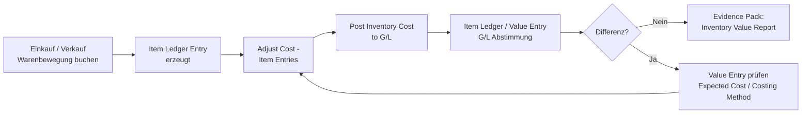

### Optional: AL‑Objekte (Developer‑Tiefe)
- Bewertungslogik‑Erweiterungen, zusätzliche Validierungen an Lagerbelegen.

---

## 8. Fixed Assets – Anlagen (Zugang → Abschreibung → Abgang)

### Zweck (fachlich + Abschlusskontrolle)
- Zweck: Anlagenbuchhaltung mit nachvollziehbarem Anlagespiegel, korrekten Abschreibungen und sauberer Kontierung.
- Abschlusskontrolle: Anlagespiegel/FA Ledger Auswertung plausibel; Abschreibungen je Periode vollständig; Abstimmung Anlagen‑Konten in G/L.
- Evidence Pack (Nachweispaket): Anlagenspiegel, Abschreibungsbuch‑Protokoll, Abgangsnachweise, Abstimmblatt G/L‑Konten.

### Module & Prozesskette (End‑to‑End)
- Anlage anlegen → Zugang (Kauf/Herstellung) → Abschreibungsläufe → Umbuchung/Verkauf/Abgang → Reporting.

### Pflicht‑Stammdaten (kritische Felder)
- `Fixed Asset`: Klasse/Unterklasse (wenn genutzt), Abschreibungsbuch(e), Verantwortlicher, Dimensionen.
- `FA Depreciation Book`: Methode, Nutzungsdauer/Startdatum, (optional) Sonder‑/außerplanmäßig.

### Pflicht‑Setup (Einrichtung)
- FA Buchung (Posting) Groups (Konten: Anschaffung, kum. Abschreibung, Abschreibungsaufwand, Abgang/Ergebnis).
- Depreciation Books/FA Einrichtung (Setup), Nummernserien, Dimensions‑Defaults.
- Periodische Jobs: Abschreibung berechnen/buchen (Prozess/Termin).
- Governance: Abschreibungen sind periodisch zu fahren (Owner + Cutoff‑Regel).

### BC Umsetzung (konkret, Key‑User (Schlüsselanwender))
- Einrichtung (Setup): *FA Buchung (Posting) Groups* (Anlagenbuchungsgruppen) + *Depreciation Books* (Abschreibungsbuecher) (Methode/Nutzungsdauer/Start) + Nummernserien.
- Stammdaten: *Fixed Asset Card* (Anlagenkarte) anlegen, Depreciation Book (Abschreibungsbuch) zuweisen.
- E2E: Zugang buchen (FA‑Journal oder Einkauf mit FA‑Zuordnung – je Prozessdesign) → *Calculate Depreciation* (Abschreibung berechnen) → *Post Depreciation* (Abschreibung buchen) → (Ausnahme) Abgang/Verkauf buchen.
- Kontrolle: `FA Ledger Posten (Entries)` + `G/L Posten (Entries)` auf Anlagen-/Abschreibungskonten + Anlagespiegel‑Auswertung.

#### BC Schritt für Schritt (Einrichtung → Prozess → Kontrolle)

**Einrichtung (Setup) – Tell Me – Suchbegriffe: `FA Posting Groups`, `Depreciation Books`, `Fixed Asset Setup`**
1. Tell Me → `FA Posting Groups` → New → Code: `MASCH` (Maschinen) → Felder ausfüllen: `Acquisition Cost Account` = `0410` (AHK (Anschaffungs-/Herstellungskosten) Maschinen), `Accum. Depreciation Account` = `0411` (kumulierte AfA (Absetzung für Abnutzung = jährliche Abschreibung)), `Depreciation Expense Acc.` = `6220` (AfA-Aufwand), `Gains Acc. on Disposal` = `4855`, `Losses Acc. on Disposal` = `6855` → speichern
2. Tell Me → `Depreciation Books` → New → Code: `HANDEL` (Handelsbilanz) → Feld `Depreciation Method` = `Straight-Line` (linear) → Feld `Fiscal Year Starting Date` = `01.01.2026` → Feld `No. of Days in Fiscal Year` = `360` → `G/L Integration` (alle Haken): `Acquisition Cost`, `Depreciation`, `Disposal` = `Yes` → speichern; zweites Buch `STEUER` analog für Steuerbilanz anlegen
3. Tell Me → `Fixed Asset Setup` → Feld `Default Depreciation Book` = `HANDEL` → Nummernserien für `Fixed Asset Nos.` setzen

**Prozess (Happy Path (Standardpfad)) – nummerierte Klick-Schritte:**
1. Tell Me → `Fixed Assets` → New → Feld `Description`: Maschinenbeschreibung → Reiter „Abschreibung": `FA Posting Group` = `MASCH` → `Depreciation Book Code` = `HANDEL` → `Depreciation Starting Date` = `01.01.2026` → `No. of Depreciation Years` = `5` (5 Jahre Nutzungsdauer)
2. Tell Me → `Fixed Asset G/L Journals` → New Line → `FA No.` = Anlagennummer → `FA Posting Type` = `Acquisition Cost` → `Amount` = `50.000` (AHK) → `Posting Date` = Zugangsdatum → Aktion `Post` → Ergebnis: `FA Ledger Entry` (Zugang) + `G/L Entry` Konto `0410`
3. Monatliche AfA: Tell Me → `Calculate Depreciation` → Felder: `Depreciation Book` = `HANDEL`, `FA Posting Date` = letzter Monatstag, `Posting Date` = letzter Monatstag, `Document No.` = lfd. Nummer → Aktion `OK` → Vorschlagszeilen erscheinen → prüfen → Aktion `Post` → `FA Ledger Entry` (Abschreibung) + `G/L Entry` Konto `6220`
4. Abgang/Verkauf: Tell Me → `Fixed Asset G/L Journals` → `FA Posting Type` = `Disposal` → `Amount` = Verkaufserlös → `Post` → BC berechnet Buchwert und bucht Gewinn/Verlust automatisch auf Konto `4855`/`6855`

**Kontrolle:**
- `FA Ledger Entries` → Filter `FA No.` → Summe `Acquisition Cost` − Summe `Depreciation` = aktueller Buchwert ✓
- Anlagenspiegel: Tell Me → `Fixed Asset – Book Value 01` Report → Werte = G/L-Konten `0410`/`0411` ✓
- `G/L Entries` Konto `6220` (AfA) → Summe je Periode = Calculate Depreciation Protokoll ✓

### Datenfluss & Abhängigkeiten
- Zugang/Abschreibung/Abgang erzeugt `FA Ledger Posten (Entry)` und `G/L Posten (Entry)` (über Buchung (Posting) Groups).
- Abhängigkeit: falsche FA Buchung (Posting) Group → falsche Konten → Anlagespiegel vs. Bilanz passt nicht.

### Kerntabellen & Beziehungen
- `Fixed Asset` → `FA Ledger Posten (Entry)` ↔ `G/L Posten (Entry)` (über FA Buchung (Posting) Group).

### EUR‑Testfall: Anlagenlebenszyklus 3 Jahre
- **Sachverhalt:** CNC-Maschine, AHK **60.000 EUR**, Nutzungsdauer 10 Jahre linear → AfA **6.000 EUR/Jahr** (500/Monat)
  - 01.03.2023: Zugang 60.000 EUR
  - 01.03.2023–28.02.2026: 36 Monate AfA = **18.000 EUR** kumuliert → Buchwert **42.000 EUR**
  - 01.03.2026: Verkauf für **35.000 EUR** → Verlust **7.000 EUR**
- **Entries beim Abgang:**

| FA Posting Type | Betrag EUR | G/L Konto |
|---|---|---|
| Disposal (AHK ausbuchend) | −60.000 | 0410 Maschinen (Haben) |
| Disposal (kum. AfA ausbuchend) | +18.000 | 0411 kum. AfA (Soll) |
| Disposal (Erlös) | +35.000 | 1800 Bank (Soll) |
| Disposal (Verlust) | −7.000 | 6855 Verlust Anlagenabgang (Soll) |

- **Kontrollpunkt:** Anlage zeigt `Disposed` = Yes ✓ | Konto 0410 um 60.000 reduziert ✓ | GuV: Verlust 7.000 EUR ✓

### Typische Fehlerbilder + Diagnosepfad
- Fehlerbild: Abschreibung fehlt → Diagnose: Depreciation Book (Start/Ende, Methode) → Abschreibungsvorschau/Posten (Entries).
- Fehlerbild: falsches Konto → Diagnose: `G/L Posten (Entries)` auf Anlagenkonten → Navigate (Navigieren) zum FA‑Beleg → FA Buchung (Posting) Group prüfen.
Prüfungsfalle:
- Anlagezugänge werden „irgendwie” direkt auf G/L gebucht ohne saubere FA‑Belegkette → Anlagenspiegel nicht belastbar.
UAT‑Minimaltests:
- Test 1: Anlagezugang + Abschreibung 1 Periode.
- Test 2: Abgang/Verkauf (Ausnahme) inkl. Ergebnisbuchung.
- Test 3: Umbuchung Anlagenklasse – FA Ledger Entry korrekt, Konten aus neuer FA Posting Group.
- Test 4: Anlagespiegel-Report – Buchwerte stimmen mit G/L-Konten überein (Traceability FA → G/L).

### Fixed Assets – Prozessfluss (End‑to‑End)

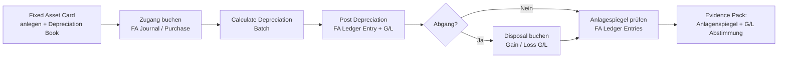

### Optional: AL‑Objekte (Developer‑Tiefe)
- Automatische Klassifizierung/Dimensionierung bei Anlagezugang, Validierungen bei FA‑Buchungen.

---

## 9. Projects/Jobs – Projektgeschäft (Budget → Verbrauch → Faktura → Ergebnis)

### Zweck (fachlich + Abschlusskontrolle)
- Zweck: Projektkosten/-erlöse transparent steuern, Ergebnis je Projekt belastbar auswerten.
- Abschlusskontrolle: Projekt‑Soll/Ist (Kosten & Erlöse) plausibel; Abstimmung Projektposten ↔ G/L.
- Evidence Pack (Nachweispaket): Projektstatusreport, Budget vs. Ist, Faktura‑Nachweise, Dimension‑Reporting (Projekt).

### Module & Prozesskette (End‑to‑End)
- Job anlegen → Budget/Plan → Verbrauch (Zeit/Material/Fremdleistung) → Faktura → Reporting.

### Pflicht‑Stammdaten (kritische Felder)
- `Job`: Status, Bill‑to Customer, Währung, Dimensionen, (optional) Abrechnungsregeln.
- Job Task/Planning (wenn genutzt): Budgetlinien, Leistungstypen, Preise.
- Ressourcen/Artikel/Lieferanten: Buchung (Posting)/VAT/DIM Defaults.

### Pflicht‑Setup (Einrichtung)
- Projekt-/Job‑Setup (Nummern, Default‑Dimensionen).
- Buchung (Posting)‑Einrichtung (Setup) für Kosten/Erlöse (Gen. Buchung (Posting), VAT, ggf. interne Verrechnung).
- Governance: Pflichtdimension „Projekt“ (oder Job‑Bezug) muss systemisch erzwungen sein, sonst bricht das Prozessziel.

### BC Umsetzung (konkret, Key‑User (Schlüsselanwender))
- Einrichtung (Setup): Job/Projekt‑Einrichtung (Setup) + Pflichtdimension „Projekt/Job“ (Default/Required (Standard/Erforderlich)) + Posting/VAT‑Grundlogik.
- Stammdaten: *Job Card* (Projektkarte) + Job Tasks/Budget (Projektaufgaben/Budget) (wenn genutzt); Ressourcen/Artikel mit passenden Buchung (Posting)/VAT Groups (Buchungs-/USt‑Gruppen) + Default‑Dimensionen.
- E2E: Verbrauch buchen (Zeit/Material/Einkauf auf Job) → Projektstatus/Cost‑Berichte (Reports (Berichte)) prüfen → Faktura (z. B. Job Planning Lines (Projektplanzeilen) → Sales Invoice (Verkaufsrechnung)) → Ergebnisreporting.

#### BC Schritt für Schritt (Einrichtung → Prozess → Kontrolle)

**Einrichtung (Setup) – Tell Me – Suchbegriffe: `Resources`, `Job Posting Groups`, `Jobs Setup`**
1. Tell Me → `Resources` → New → Code: `MAX-M` (Mitarbeiter Max Müller) → Feld `Type` = `Person` → Reiter „Fakturierung": `Unit Cost` = `80` EUR/Std (interne Kosten), `Unit Price` = `150` EUR/Std (Fakturierungssatz) → `Gen. Prod. Posting Group` = `DL-STD` → speichern
2. Tell Me → `Job Posting Groups` → New → Code: `PROJ-STD` → Felder: `WIP Costs Account` = `2880` (Unfertige Leistungen), `Job Costs Applied Account` = `6900` (Projektkosten), `Job Sales Applied Account` = `4900` (Projekterlöse), `Recognized Costs Account` = `6901` → speichern
3. Tell Me → `Jobs Setup` → Feld `Default Job Posting Group` = `PROJ-STD` → `WIP Method` = `Percentage of Completion` (POC, Fertigstellungsgrad) oder `Completed Contract` → Feld `Default Job Nos.` = Nummernserie

**Prozess (Happy Path (Standardpfad)) – nummerierte Klick-Schritte:**
1. Tell Me → `Jobs` → New → Feld `Description`: Projektname → Feld `Bill-to Customer No.` = Debitor → Feld `Job Posting Group` = `PROJ-STD` → Reiter „Aufgaben": Projektaufgaben (Task Lines) mit `Job Task No.` und `Description` anlegen
2. Budget: In Job-Zeilen → `Job Planning Lines` → Feld `Line Type` = `Budget` → Ressource/Artikel + Menge + Kosten eintragen → Gesamtbudget sichtbar
3. Verbrauch buchen: Tell Me → `Job Journals` → Batch `DEFAULT` → Zeilen: `Job No.` = Projektnummer, `Job Task No.`, `Type` = `Resource`, `No.` = `MAX-M`, `Quantity` = 8 (Stunden) → `Post` → `Job Ledger Entry` + `G/L Entry` werden angelegt
4. Faktura: In Job → Aktion `Create Sales Invoice` → `Job Planning Lines` mit `Line Type` = `Billable` werden zu `Sales Invoice` → prüfen → Post → `Customer Ledger Entry` offen
5. Periodenabschluss: Tell Me → `Job Calculate WIP` → Job auswählen → Posting Date → `OK` → WIP-Buchungen auf Konto `2880` → Tell Me → `Job Post WIP to G/L` → G/L-Buchungen für Periodenabgrenzung

**Kontrolle:**
- `Job Ledger Entries` → Filter `Job No.` → Summe `Total Cost` vs. Budget: Abweichungsanalyse ✓
- WIP-Konto `2880` → Saldo = 0 nach Projektabschluss (`Job Post Completion`) ✓
- `Customer Ledger Entries` → alle Fakturen ausgeglichen ✓

### Datenfluss & Abhängigkeiten
- Projektbuchungen erzeugen typischerweise Projekt-/Job Entries (modulabhängig) und `G/L Posten (Entry)`; Faktura erzeugt zusätzlich AR‑Entries/VAT.
- Abhängigkeit: fehlende Pflichtdimension „Projekt“ → Kosten/Erlöse nicht sauber auswertbar (Reporting‑Bruch).

### Kerntabellen & Beziehungen
- `Job` → (Job/Project Posten (Entries)) → `G/L Posten (Entry)` → Projekt‑Berichte (Reports); plus `Sales Invoice` (Verkaufsrechnung)/`Customer Ledger Posten (Entry)` bei Faktura.

### EUR‑Testfall: Kundenprojekt Budget → Ist → Faktura → WIP
- **Sachverhalt:** Kundenprojekt „Website-Relaunch”, Budget **100.000 EUR**
  - Ist-Kosten (Ressourcen + Material): **85.000 EUR** (170 Stunden × 400 + 17.000 Material)
  - Faktura an Kunden: **90.000 EUR** (Teilrechnung 60.000 + Schlussrechnung 30.000)
  - WIP-Berechnung (Percentage of Completion): 85 % fertig → Erlösanerkennung **85.000 EUR** → WIP **5.000 EUR**
- **Entries:**

| Schritt | G/L Konto | Soll EUR | Haben EUR |
|---|---|---|---|
| Verbrauch Ressourcen (170h × 400) | 6100 Projektaufwand | 68.000 | |
| Verbrauch Material | 6100 Projektaufwand | 17.000 | |
| Faktura Teilrechnung | 1200 Forderungen | 60.000 | |
| Faktura Teilrechnung | 4000 Erlöse | | 60.000 |
| WIP-Buchung (Job Post WIP to G/L) | 2880 WIP-Aktiv | 5.000 | |
| WIP-Buchung | 4100 Erlöse nicht abgerechnet | | 5.000 |

- **Kontrollpunkt:** `Job Ledger Entries` Summe Total Cost = 85.000 ✓ | Faktura-Summe = 90.000 ✓ | WIP-Konto 2880 Saldo = 5.000 ✓ | Nach Projektabschluss: WIP = 0 ✓

### Typische Fehlerbilder + Diagnosepfad
- Fehlerbild: Kosten laufen „ohne Projekt” → Diagnose: `G/L Posten (Entries)` (Dimension Set) → Default Dimension am Stammsatz/Journal.
- Fehlerbild: Faktura stimmt nicht mit Plan → Diagnose: Job Planning Lines vs. gebuchte Projektposten vs. Sales Invoice.
Prüfungsfalle:
- Projekt wird als „Dimension” genutzt, aber nicht als Pflichtfeld erzwungen → Auswertung nicht vollständig.
UAT‑Minimaltests:
- Test 1: Verbrauch (Zeit/Material) auf Job, Auswertung, Faktura, Ergebnis.
- Test 2: Ausnahme ohne Projektzuordnung (muss verhindert/eskaliert werden).
- Test 3: Mehrere Jobs parallel – Dimension-Auswertung nach Projekt korrekt getrennt (kein Mischsaldo).
- Test 4: Projektabschluss – Status auf „Completed" setzen, weitere Buchungen (Postings) werden blockiert.

### Projects/Jobs – Prozessfluss (End‑to‑End)

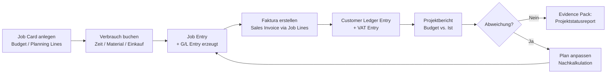

### Optional: AL‑Objekte (Developer‑Tiefe)
- Pflichtfeld-/Dimension‑Enforcement, automatisches Mapping von Einkaufsbelegen auf Job Tasks.

---

## 10. Intercompany – konzerninterne Prozesse (IC‑Partner → IC‑Belege → Abstimmung)

### Zweck (fachlich + Abschlusskontrolle)
- Zweck: Konzerninterne Leistungen/Warenflüsse pro Einheit nachvollziehbar, Intercompany‑Abstimmung effizient.
- Abschlusskontrolle: IC‑Saldenabstimmung (Company A ↔ Company B), offene IC‑Posten, Eliminierungs‑Vorbereitung (falls Konsolidierung).
- Evidence Pack (Nachweispaket): IC‑Abstimmblatt, IC‑Transaktionsliste (gesendet/angenommen), Mapping‑Dokumentation.

### Module & Prozesskette (End‑to‑End)
- IC‑Partner/Einrichtung (Setup) → IC‑Dokumente/Buchungen → Transfer/Annahme → Buchung (Posting) in Ziel‑Company → Abstimmung.

### Pflicht‑Stammdaten (kritische Felder)
- IC‑Partner (Identität, Mapping), Kunden/Lieferanten‑Spiegel (wenn genutzt), Dimensionen (z. B. Konzernbereich).

### Pflicht‑Setup (Einrichtung)
- Intercompany Einrichtung (Setup) je Company (Kontenmapping, Nummern, Kommunikationsweg).
- Rollen/Berechtigungen: Wer darf IC senden/annehmen?
- Governance: Konten-/Dimensions‑Mapping versionieren, Änderungen testen (sonst Abstimmungsbrüche).

### BC Umsetzung (konkret, Key‑User (Schlüsselanwender))
- Einrichtung (Setup): IC‑Partner anlegen, Konten-/Dimensions‑Mapping je Company (Firma) pflegen, Nummern/Kommunikation konfigurieren.
- E2E: IC‑Transaktion erzeugen/senden → in Ziel‑Company (Zielfirma) annehmen → lokale Belege buchen (posten) → IC‑Abstimmung (Salden/Offene Posten).
- Kontrolle: IC‑Transaktionsstatus + lokale `G/L Posten (Entries)`/AR/AP Posten (Entries) (Filter IC‑Partner/Dimension) + Abstimmblatt.

#### BC Schritt für Schritt (Einrichtung → Prozess → Kontrolle)

**Einrichtung (Setup) – Tell Me – Suchbegriffe: `Intercompany Setup`, `IC Partners`, `IC Chart of Accounts`, `IC Dimensions`**
1. Tell Me → `Intercompany Setup` (in jeder Company separat) → Feld `IC Partner Code` = eigener IC-Code (z. B. `DE-GMBH` in DE-Company, `CH-AG` in CH-Company) → `IC Inbox Type` = `Database` (direkt in BC) oder `File Location` (bei unterschiedlichen BC-Systemen) → speichern
2. Tell Me → `IC Partners` → New → Code: `CH-AG` → Feld `Name`: CH-Tochterfirma → `Inbox Type` = `Database` → `Company Name` = Name der CH-Company in BC → Felder `Customer No.` + `Vendor No.`: Intercompany-Debitor/-Kreditor (bereits in Stammdaten angelegt) → speichern
3. Tell Me → `IC Chart of Accounts` → gemeinsamen IC-Kontenplan anlegen: Konten mit `Map-to G/L Acc. No.` für DE-Company (z. B. IC-Konto `IC-3000` → G/L `3000`) → in CH-Company analog mit CH-Konten mappen
4. Tell Me → `IC Dimensions` → gemeinsame IC-Dimensionen definieren (z. B. `KOSTENST`) → je Company auf lokale Dimension mappen

**Prozess (Happy Path (Standardpfad)) – nummerierte Klick-Schritte:**
1. Mandant A (DE): Tell Me → `IC Outbox Transactions` → Aktion `New` → oder: normalen `Sales Invoice` anlegen mit Debitor = IC-Partner `CH-AG` → `Post` → Beleg landet automatisch in IC Outbox
2. Mandant A: `IC Outbox Transactions` → Transaktion prüfen → Aktion `Send to IC Partner` → Transaktion wird in IC Inbox von Mandant B übertragen
3. Mandant B (CH): Tell Me → `IC Inbox Transactions` → neue Transaktion sichtbar → prüfen (Konten, Beträge, Dimensionen) → Aktion `Accept` → BC erzeugt automatisch `Purchase Invoice` in CH-Company
4. Mandant B: erzeugte `Purchase Invoice` öffnen → Aktion `Post` → `Vendor Ledger Entry` angelegt, G/L-Buchung auf gemapptem CH-Konto
5. IC-Abstimmung: Mandant A `Customer Ledger Entry` (IC-Debitor `CH-AG`) Saldo = Mandant B `Vendor Ledger Entry` (IC-Kreditor `DE-GMBH`) Saldo → müssen spiegelbildlich sein

**Kontrolle:**
- `IC Inbox Transactions` (beide Companies) → Status = `Handled` für alle Transaktionen (leere Inbox) ✓
- IC-Saldenabstimmung: `Customer Ledger Entries` DE-Company Filter `Customer No.` = IC-Partner ↔ `Vendor Ledger Entries` CH-Company Filter `Vendor No.` = IC-Partner → Nettosaldo = 0 ✓
- `G/L Entries` IC-Verrechnungskonto je Company → Saldo = 0 nach Ausgleich ✓

### Datenfluss & Abhängigkeiten
- IC‑Buchungen erzeugen je Company die üblichen `G/L Posten (Entry)`/AR/AP Posten (Entries); zusätzlich IC‑Nachricht/Transaktionsdaten.
- Abhängigkeit: schlechtes Konten-/Dimension‑Mapping → Abweichungen in Abstimmung/Eliminierung.

### Kerntabellen & Beziehungen
- IC‑Transaktionen ↔ lokale Belege/Entries (G/L, AR/AP) – je nach Implementierung.

### EUR‑Testfall: IC‑Dienstleistung DE → CH + Eliminierung
- **Sachverhalt:** DE-GmbH erbringt IT-Beratung an CH-AG für **10.000 EUR** (kein Lagerbestand, reine Dienstleistung → Reverse Charge / Bezugsteuer in CH)
- **Buchungen in beiden Companies:**

| Company | Konto | Soll EUR | Haben EUR |
|---|---|---|---|
| **DE-GmbH** (Verkäufer) | 1200 IC-Forderung CH-AG | 10.000 | |
| DE-GmbH | 4000 IC-Erlöse DL | | 10.000 |
| DE-GmbH | USt | 0 (§ 3a Abs. 2 UStG: Empfängerort CH) | |
| **CH-AG** (Käufer, IC-Inbox → Accept → Post) | 6100 IT-Beratungsaufwand | 10.000 | |
| CH-AG | 1600 IC-Verbindlichkeit DE-GmbH | | 10.000 |
| CH-AG | Bezugsteuer 8,1 % (810 CHF) | Soll 810 / Haben 810 (Nullsumme) | |

- **IC-Abstimmung:** DE-Forderung 10.000 = CH-Verbindlichkeit 10.000 → Differenz **0 EUR** ✓
- **Eliminierung (Konsolidierung):** IC-Erlös DE 10.000 ↔ IC-Aufwand CH 10.000 → eliminieren | IC-Forderung ↔ IC-Verbindlichkeit → eliminieren → Konzernabschluss zeigt weder Umsatz noch Aufwand aus IC-Geschäft

### Typische Fehlerbilder + Diagnosepfad
- Fehlerbild: Salden differieren → Diagnose: IC‑Transaktionsstatus + lokale Entries (Filter IC‑Partner/Dimension) + Mapping‑Tabellen.
Prüfungsfalle:
- „Wir schicken IC” ohne sauberes Mapping/Abstimmverfahren → Differenzen werden manuell „weggebucht”.
UAT‑Minimaltests:
- Test 1: IC‑Beleg senden/annehmen, Buchung (Posting) in beiden Companies, Salden stimmen.
- Test 2: Mapping‑Änderung (Ausnahme) mit Regressionstest.
- Test 3: IC‑Transaktion stornieren – Stornobuchung in beiden Companies korrekt, Abstimmblatt sauber.
- Test 4: Differenz-Simulation (bewusst falsches Mapping) → Diagnose über IC‑Transaktionsstatus + G/L Entries.

### IC‑Prozessfluss – Konzerninterne Transaktion (End‑to‑End)

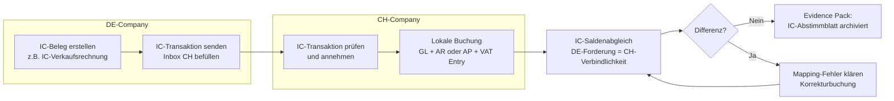

### Optional: AL‑Objekte (Developer‑Tiefe)
- Erweiterte IC‑Validierungen, automatisches Mapping/Enrichment beim Import/Annahme.

---

## 11. Intrastat/Foreign Trade – Meldungen (Einrichtung (Setup) → Vorschlag → Abgabe)

### Zweck (fachlich + Abschlusskontrolle)
- Zweck: Intrastat‑/Außenhandelsmeldungen vollständig und korrekt (Daten aus Liefer-/Warentransaktionen).
- Abschlusskontrolle: Vollständigkeitscheck (Zeitraum/Belege) + Plausibilität nach Ländern/Werten.
- Evidence Pack (Nachweispaket): Intrastat‑Vorschlagsliste, Korrekturliste/Begründungen, Abgabe-/Exportprotokoll.

### Module & Prozesskette (End‑to‑End)
- Stammdaten (Tarifnummern/Intrastat Einrichtung (Setup)) → Belege (Shipment/Receipt/Invoice (Lieferung/Wareneingang/Rechnung)) → Intrastat‑Vorschlag → Prüfung/Korrektur → Meldedatei/Abgabe.

### Pflicht‑Stammdaten (kritische Felder)
- `Item` (Artikel): Herkunftsland, Gewicht, Tarifnummer (wenn genutzt), statistische Warennummern/Parameter.
- Partner (Customer/Vendor): Länder/Regionen, Lieferadresse.

### Pflicht‑Setup (Einrichtung)
- Intrastat Setup (Definitionen, Perioden/Schwellen/Regeln je Land).
- Mapping‑Regeln, ggf. Verantwortliche/Prozesskalender.
- Governance: Stammdatenpflichten (Tarifnummer/Gewicht/Land) sind operativ abzusichern (z. B. Blockieren, wenn Pflichtfelder fehlen).

### BC Umsetzung (konkret, Key‑User (Schlüsselanwender))
- Einrichtung (Setup): *Intrastat Setup* (Intrastat‑Einrichtung) je Land/Company (Firma) + Perioden/Regeln; Verantwortliche/Prozesskalender definieren.
- Stammdaten: *Item Card* (Artikelkarte) (Gewicht/Herkunftsland/Tarifnummer – je Pflicht) + Partnerländer.
- E2E: *Intrastat Journal* (Intrastat‑Journal) öffnen → *Get Entries/Suggest Lines* (Posten holen/Zeilen vorschlagen) (je BC‑Variante) → Plausibilitätscheck/Korrektur → Export/Abgabe.
- Kontrolle: Vollständigkeitsliste (Belege/Zeitraum) + Fehlermeldungen auf fehlende Stammdaten zurückführen.

#### BC Schritt für Schritt (Einrichtung → Prozess → Kontrolle)

**Einrichtung (Setup) – Tell Me – Suchbegriffe: `Intrastat Setup`, `Items`, `Shipment Methods`**
1. Tell Me → `Intrastat Setup` → Reiter „Allgemein": Feld `Company VAT No.` = USt-ID des Unternehmens → Feld `Report Receipts` = `Yes`, `Report Shipments` = `Yes` → Feld `Default Trans. Type` = `11` (Kauf/Verkauf) → Felder Schwellenwerte (`Nil Threshold Receipts`, `Nil Threshold Shipments`) = z. B. `500.000` EUR (jährliche Meldeschwelle DE)
2. Tell Me → `Items` → Artikelkarte öffnen → Reiter „Artikel": Feld `Tariff No.` (Warenverzeichnisnummer/CN-Code) = 8-stellige CN-Nummer, z. B. `84715000` (Drucker) → Feld `Country/Region of Origin Code` = `DE` (oder Herkunftsland) → Feld `Net Weight` (Nettogewicht in kg) = z. B. `2,5` → speichern
3. Tell Me → `Shipment Methods` → Lieferbedingungscode z. B. `DDP` → Feld `Intrastat Transport Method` = `3` (Straße) → als statistisches Merkmal für Intrastat-Zeile → speichern

**Prozess (Happy Path (Standardpfad)) – nummerierte Klick-Schritte:**
1. Tell Me → `Intrastat Journals` → New → Feld `Statistics Period` = `2601` (Januar 2026 = YYMM-Format) → Batch anlegen
2. Aktion `Suggest Lines` → Felder: `Start Date` = `01.01.2026`, `End Date` = `31.01.2026` → `OK` → BC liest alle gebuchten EU-Warenbewegungen (Posted Shipments + Receipts) aus und schlägt Zeilen vor
3. Zeilen prüfen: jede Zeile muss haben → `Tariff No.` ✓, `Country/Region Code` ✓, `Net Weight` ✓, `Statistical Value` ✓ → fehlende Felder: direkt in Zeile ergänzen oder Stammdaten korrigieren
4. Aktion `Export` (INSTAT-XML oder CSV je nach Format DE/AT) → Datei erzeugt → Download → Meldung über Statistik-Amt-Portal (destatis.de/IDEV) einreichen
5. Nach Abgabe: Intrastat Journal → Aktion `Mark as Reported` oder manuell dokumentieren (Abgabedatum + Referenznummer)

**Kontrolle:**
- Alle Zeilen im Intrastat Journal: Feld `Tariff No.` gefüllt ✓ (leere Felder = Stammdatenfehler)
- Werte in Intrastat Journal ↔ `Item Ledger Entries` Filter Periode + EU-Länder → Gesamtwert stimmt überein ✓
- Abgabeprotokoll archiviert (Evidence Pack) ✓

### Datenfluss & Abhängigkeiten
- Intrastat zieht i. d. R. aus gebuchten Warenbewegungen/Versand-/Eingangsbelegen; fehlende Artikelstammdaten → Meldelinien unvollständig/fehlerhaft.

### Kerntabellen & Beziehungen
- Posted Shipments/Receipts/Invoices → Intrastat Journal/Lines → Meldedatei.

### Typische Fehlerbilder + Diagnosepfad
- Fehlerbild: Zeilen fehlen → Diagnose: Zeitraum/Filter + welche Belegarten berücksichtigt → fehlende Stammdaten (Gewicht/Land/Tarifnummer).
- Fehlerbild: Werte falsch → Diagnose: Wertbasis (Invoice/Cost) + Currency/Exchange Einrichtung (Setup).
Prüfungsfalle:
- Meldung wird „am Monatsende“ manuell korrigiert, weil Stammdatenpflichten nicht upstream abgesichert sind.
UAT‑Minimaltests:
- Test 1: Monat mit typischen Lieferungen/Belegen → Vorschlag → Plausibilitätscheck.
- Test 2: Artikel ohne Pflichtfelder (Ausnahme) → muss blockieren/eskalieren.
- Test 3: Periode mit Exporten und Importen gleichzeitig – korrekte Trennung in Versendung/Eingang im Intrastat Journal.
- Test 4: Korrektur einer bereits abgegebenen Periode – Korrektur-Journal erstellen, Begründung dokumentiert.

### Intrastat/Foreign Trade – Prozessfluss (End‑to‑End)

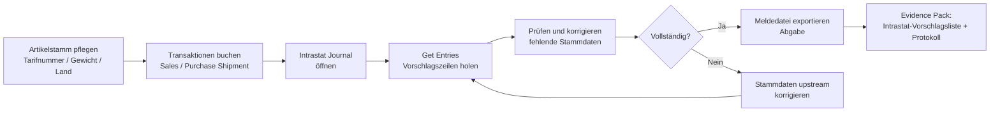

### Optional: AL‑Objekte (Developer‑Tiefe)
- Stammdaten‑Validierung (Blockieren, wenn Intrastat‑Pflichtfelder fehlen), automatisches Enrichment.

---

## 12. Payroll (Lohn/Gehalt) ‑ Abrechnung (Buchung (Posting) → G/L (Sachkonto)) → Abschluss

### Zweck (fachlich + Abschlusskontrolle)
- Zweck: Lohn- und Gehaltsabrechnungen periodengerecht in BC verbuchen; Lohnsteuer‑ (LSt) und Sozialversicherungs‑ (SV)-Verbindlichkeiten korrekt darstellen; Periodenabgrenzung (Dezember-Gehalt, Urlaubsrückstellung) abschlusskritisch abdecken.
- Abschlusskontrolle: Abstimmung `Employee Ledger` / `G/L`‑Konto Lohn/Gehalt → Vergleich mit Payroll‑Abrechnungs-Summenblatt (Happy Path (Standardpfad)).
- Evidence Pack (Nachweispaket): Abrechnungs-Summenblatt (externe Lohnbuchhaltung), Buchungsjournal (Posted General Journal), LSt‑Anmeldungsbeleg, SV‑Beitragsnachweise, Lohnkonto je Mitarbeiter.

### Module & Prozesskette (End‑to‑End)
- Externe Lohnbuchhaltung (DATEV / SAP HR / Sage) → Buchungsexport (Summenblatt oder Datei) → BC General Journal → Buchung (Posting) → G/L Posten (Entry) + Employee Ledger → Bank/Zahlung (Nettolohn) → SV-/LSt‑Zahlung (Behörden) → Bankabstimmung → Abschluss (Urlaubsrückstellung, 13. Monatsgehalt).

### Pflicht‑Stammdaten (kritische Felder)
- `Employee` (Mitarbeiter): Personalnummer, Name, Bankverbindung (IBAN), Abrechnungsperiode.
- `G/L Account` (Sachkonto): je Lohnart (Bruttolohn, Arbeitnehmer-SV, Arbeitgeber-SV, LSt, Urlaubsrückstellung) separates Konto; Kostenstellenzuordnung via Dimensionen.
- Posting Groups für Mitarbeiter: `Employee Posting Group` → steuert `Employee Ledger` und G/L‑Automatik.

### Pflicht‑Setup (Einrichtung)
- `Employee Posting Groups` – Konto-Mapping je Lohnkategorie.
- Dimensionen (z. B. Kostenstelle = Abteilung) als Pflichtfelder für G/L‑Buchungen.
- Journal Template/Batch für Lohnbuchungen (eigener Journal‑Typ: „Payroll Journal" – kein Mischen mit Standardjournalen).
- Governance: SoD (Segregation of Duties (Funktionstrennung)): Lohnbuchung ≠ Zahlungsfreigabe ≠ Stammdatenpflege (Mitarbeiter/Bankdaten).

### BC Umsetzung (konkret, Key‑User (Schlüsselanwender))
- Einrichtung (Setup): `Employee Posting Groups` → `General Ledger Setup` → Dimensionen.
- E2E buchen: General Journal (`Payroll`‑Batch) → Zeilen manuell oder per Import (CSV/Schnittstelle Lohnbuchhaltung) → Buchungsvorschau prüfen → Posting → `Posted General Journal` sichern.
- Zahlungen: Nettolohn‑Batch per `Payment Journal` (Kreditoren- oder Employee‑Zahlung) → Bankausgleich.
- Nachweis: `G/L Account` Detail-Ansicht je Lohnkonto → Abstimmung gegen Summenblatt → Periodensperre setzen.

Prozesskette (Happy Path (Standardpfad)):
Summenblatt prüfen → General Journal befüllen → Buchung (Posting) → G/L‑Abstimmung → Nettolohn zahlen → LSt‑/SV‑Zahlungen → Bankabstimmung → Periodensperre

#### BC Schritt für Schritt (Einrichtung → Prozess → Kontrolle)

**Einrichtung (Setup) – Tell Me – Suchbegriffe: `Chart of Accounts`, `General Journal Templates`, `Dimensions`**
1. Tell Me → `Chart of Accounts` → folgende G/L-Konten anlegen/prüfen:
   - `6000`: Bruttolöhne und -gehälter (Aufwand, GuV)
   - `6010`: Arbeitgeber-SV (AG-Anteil Sozialversicherung, Aufwand, GuV)
   - `1742`: Lohnsteuer-Verbindlichkeit (Bilanz, Passiva)
   - `1740`: SV-Verbindlichkeit AN+AG (Bilanz, Passiva)
   - Alle Konten: `Direct Posting` = `Yes`
2. Tell Me → `General Journal Templates` → New → Name: `PAYROLL` → `Type` = `General` → `Bal. Account Type` = `G/L Account`, `Bal. Account No.` leer (wird je Zeile gesetzt) → `No. Series` = Nummernserie Lohnbuchungen → speichern → Batch `JAN2026` anlegen
3. Tell Me → `Dimensions` → Dimension `ABTEILUNG` prüfen → Dimension Values: `VERTRIEB`, `VERWALTUNG`, `PRODUKTION` → als `Default Dimension` an G/L-Konto `6000` hinterlegen (`Value Posting` = `Code Mandatory`)

**Prozess (Happy Path (Standardpfad)) – nummerierte Klick-Schritte:**
1. Externes Lohnprogramm (DATEV/Sage) liefert Summenblatt für Januar 2026: Bruttolohn 4.000 EUR, Nettolohn 2.650 EUR, LSt 850 EUR, SV-AN 500 EUR, SV-AG 520 EUR
2. Tell Me → `General Journals` → Template `PAYROLL` → Batch `JAN2026` → Buchungszeilen eingeben:
   - Zeile 1: `Account Type` = `G/L Account`, `Account No.` = `6000`, `Debit Amount` = `4.000`, Dimension `ABTEILUNG` = `VERWALTUNG`, Beschreibung: `Bruttolohn Jan 2026`
   - Zeile 2: `Account Type` = `G/L Account`, `Account No.` = `6010`, `Debit Amount` = `520`, Beschreibung: `SV-AG Jan 2026`
   - Zeile 3: `Account No.` = `1742`, `Credit Amount` = `850` (LSt-Verbindlichkeit)
   - Zeile 4: `Account No.` = `1740`, `Credit Amount` = `1.000` (SV-AN 500 + SV-AG 500, restliche 20 EUR Differenz aus Rundung prüfen)
   - Zeile 5: `Account No.` = `1200` (Bankverrechnungskonto), `Credit Amount` = `2.650` (Nettolohn-Vorbereitung)
   - Gesamtsaldo der Zeilen: Soll = Haben → Differenz = 0 ✓
3. Aktion `Post` → `Posted General Journal` wird erzeugt → `G/L Entries` auf allen Konten angelegt
4. Nettolohn-Zahlung: Tell Me → `Payment Journals` → Zeilen für jeden Mitarbeiter (oder Summenzahlung) → Banküberweisung von `1200` → `Post` → Bankabstimmung
5. LSt-/SV-Zahlung: Finanzamt und Krankenkasse → `General Journal` → Konto `1742`/`1740` Debit + Bankkonto Credit → `Post` → Verbindlichkeit auf 0 ✓

**Kontrolle:**
- `G/L Entries` Konto `6000` (Bruttolohn) → Summe = Summenblatt Bruttolohn ✓
- `G/L Entries` Konto `1742` (LSt) nach Zahlung → Saldo = 0 ✓
- `G/L Entries` Konto `1740` (SV) nach Zahlung → Saldo = 0 ✓
- `Posted General Journal` abrufbar und mit Summenblatt abgestimmt (Evidence Pack) ✓

### Datenfluss & Abhängigkeiten
- Payroll Posting erzeugt `G/L Posten (Entry)` + `Employee Ledger Entry` + `Detailed Employee Ledger Entry` + `VAT Posten (Entry)` (wenn zutreffend).
- Fehlende/falsche Dimensionen → Auswertung nach Kostenstelle/Kostenträger unvollständig.
- LSt-/SV-Konten werden als Verbindlichkeit gebucht (bis Zahlung an Behörden/SV-Träger) → Abstimmung gegen `G/L Posten (Entry)` dieser Konten.

### Kerntabellen & Beziehungen
- `Employee` → `Employee Ledger Entry` → `Detailed Employee Ledg. Entry` → `G/L Entry`.
- `General Journal` → `Posted General Journal` → `G/L Entry` (Hauptnachweis für Prüfer).

### Typische Fehlerbilder + Diagnosepfad
- Fehlerbild: Lohnkonto stimmt nicht mit Summenblatt überein → Diagnose: `G/L Account` Detailbuchungen prüfen → Rückfrage Lohnbuchhaltung (fehlende Zeile/Rundung/Schnittstelle).
- Fehlerbild: Mitarbeiter-Zahlung falsch (Betrag/IBAN) → Diagnose: `Employee Ledger Entry` / `Detailed Cust. Ledg. Entry` → Zahlungsauftrag und IBAN-Stammdaten prüfen.
- Fehlerbild: Urlaubsrückstellung fehlt im Abschluss → Diagnose: General Journal für Abgrenzungsbuchung erstellen (manuelle Rückstellung je Mitarbeiter oder Pauschale).
Prüfungsfalle:
- „Payroll in BC ist vollständig abgebildet." BC Standard hat nur rudimentäre HR/Payroll‑Funktionen – in DACH wird Lohn extern abgerechnet (DATEV Lohn, SAP HCM) und nur das **Buchungsergebnis** nach BC übergeben.
UAT‑Minimaltests:
- Test 1 (Happy Path): Monats-Payroll aus Summenblatt → Buchung → G/L‑Abstimmung → korrekte Salden.
- Test 2 (Abgrenzung): Urlaubsrückstellung/Dezembergehalt für Januar buchen → Buchung in richtiger Periode → Umkehrbuchung (Reversal) im Folgemonat.
- Test 3 (SoD): Mitarbeiter ohne Zahlungsberechtigung kann Nettolohn‑Batch nicht freigeben.
- Test 4 (Nachweis): `Posted General Journal` + `G/L Entry` abrufbar und mit Summenblatt abgestimmt.

### Payroll – Prozessfluss (End‑to‑End)

```mermaid
flowchart LR
    A[Externes Lohnprogramm<br/>DATEV / SAP HR] --> B[Summenblatt<br/>prüfen]
    B --> C[General Journal<br/>Payroll-Batch befüllen]
    C --> D[Buchungsvorschau<br/>prüfen]
    D --> E[Posting<br/>G/L + Employee Ledger]
    E --> F[Nettolohn zahlen<br/>Payment Journal]
    F --> G[LSt / SV Zahlungen<br/>an Behörden]
    G --> H[Bankabstimmung<br/>abschließen]
    H --> I[Evidence Pack:<br/>Posted General Journal]
```

### Optional: AL‑Objekte (Developer‑Tiefe)
- Payroll‑Import‑Interface (Codeunit): CSV/XML‑Datei von DATEV/SAP → automatische Journal‑Zeilen.
- Employee Ledger Extensions: Felder für Steuerklasse, Eintrittsdatum, SV-Schlüssel.
- Report: Monatlicher Lohnkostenbericht nach Kostenstelle (Dimension‑Auswertung).
- Microsoft Learn – Manage employees: https://learn.microsoft.com/en-us/dynamics365/business-central/hr-manage-human-resources
- Microsoft Learn – Pay employees: https://learn.microsoft.com/en-us/dynamics365/business-central/payables-how-post-payments-refunds

---

## 13. Anhang

### 12.1 Glossar: „Posten (Entries)“ (Kurz)
- `G/L Posten (Entry)`: Sachposten – Basis für Abschlussreports.
- `Customer Ledger Posten (Entry)` / `Vendor Ledger Posten (Entry)`: OP‑Posten Debitor/Kreditor.
- `Detailed Cust./Vendor Ledg. Posten (Entry)`: Applikations-/Ausgleichsdetails.
- `VAT Posten (Entry)`: Steuerposten (USt/MWSt‑Logik).
- `Bank Account Ledger Posten (Entry)`: Bankposten.
- `Item Ledger Posten (Entry)` / `Value Posten (Entry)`: Lagerbewegung und Bewertung/Kosten.
- `FA Ledger Posten (Entry)`: Anlagenposten.

### 12.2 Checklisten (Minimal)
- Monatlich: Bankabstimmung, AR/AP‑OP‑Abstimmung, VAT‑Abstimmung, Adjust Cost/Buchung (Posting) to G/L (bei Inventory), Abschreibungen (bei FA), Periodensperre.
- Quartalsweise: Rollen/Berechtigungsreview, Einrichtung (Setup)‑Änderungsreview (VAT/Buchung (Posting) Groups), Stichprobe Belegkette.

### 12.3 Quellen (primär, Auswahl)
- Microsoft Learn – Business Central (E2E‑Bausteine, Einrichtung (Setup)/Prozesse):  
  - Sales invoices (Umsatz erfassen): https://learn.microsoft.com/en-us/dynamics365/business-central/sales-how-invoice-sales  
  - Purchase invoices (Einkauf erfassen): https://learn.microsoft.com/en-us/dynamics365/business-central/purchasing-how-record-purchases  
  - Pay vendors (Zahlungen an Lieferanten): https://learn.microsoft.com/en-us/dynamics365/business-central/payables-make-payments  
  - Bank reconciliation (Bankabstimmung): https://learn.microsoft.com/en-us/dynamics365/business-central/bank-how-reconcile-bank-accounts-separately  
  - Set up VAT (USt‑Einrichtung (Setup)): https://learn.microsoft.com/en-us/dynamics365/business-central/finance-setup-vat  
  - Set up Intrastat reporting: https://learn.microsoft.com/en-us/dynamics365/business-central/finance-how-setup-report-intrastat
  - Track inventory costs / Post Inventory Cost to G/L (Lagerkosten → G/L): https://learn.microsoft.com/en-us/dynamics365/business-central/finance-track-inventory-costs
  - Schedule cost adjustment & posting (Job Queue): https://learn.microsoft.com/en-us/dynamics365/business-central/finance-adjust-reconcile-inventory-cost-job-queue
  - Fixed Assets – depreciation setup: https://learn.microsoft.com/en-us/dynamics365/business-central/fa-how-setup-depreciation
  - Fixed Assets – depreciate/amortize: https://learn.microsoft.com/en-us/dynamics365/business-central/fa-how-depreciate-amortize
  - Intercompany setup: https://learn.microsoft.com/en-us/dynamics365/business-central/intercompany-how-setup
  - Manage intercompany transactions: https://learn.microsoft.com/en-au/dynamics365/business-central/intercompany-manage
  - Walkthrough – managing projects with jobs: https://learn.microsoft.com/en-us/dynamics365/business-central/walkthrough-managing-projects-with-jobs
  - Work with recurring revenue (recurring project/job invoicing): https://learn.microsoft.com/en-us/dynamics365/business-central/finance-recurring-invoicing
  - Use job queues to schedule tasks: https://learn.microsoft.com/en-us/dynamics365/business-central/admin-job-queues-schedule-tasks
