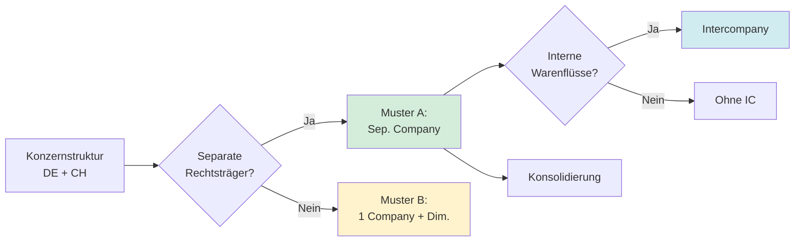
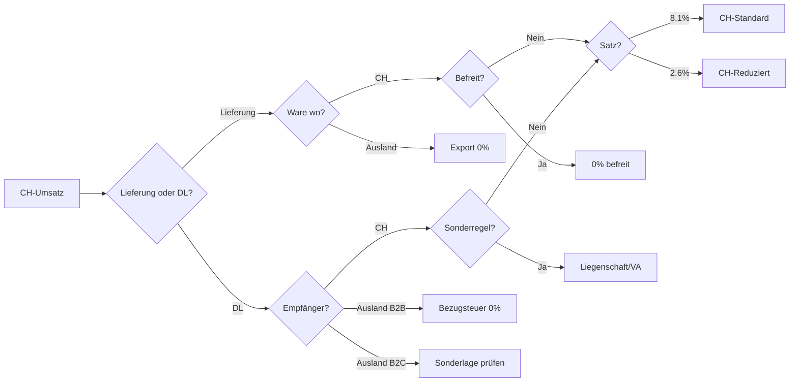
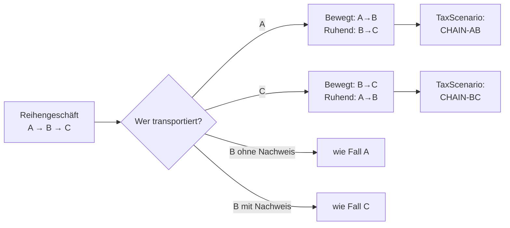
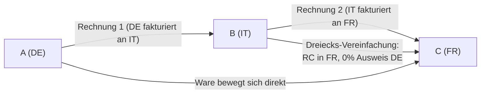
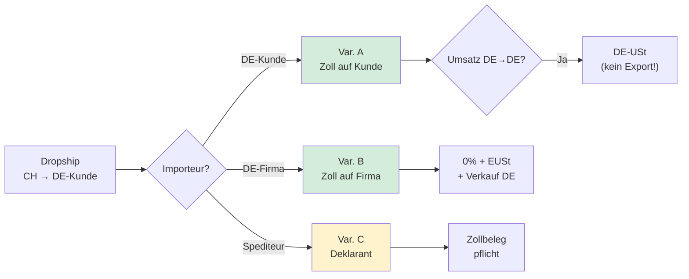
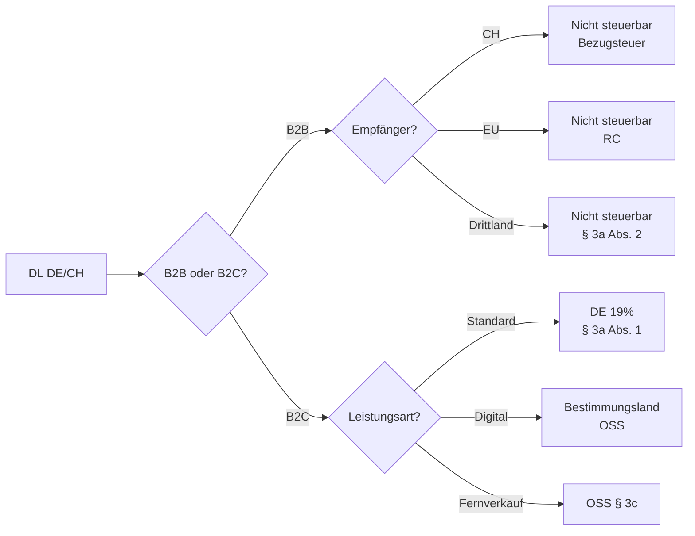
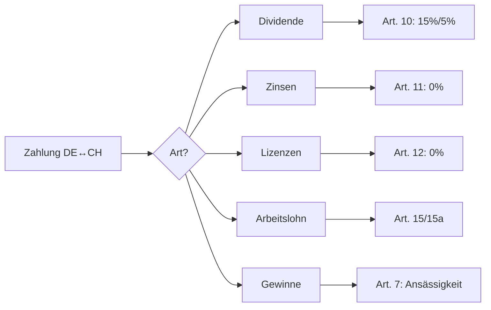
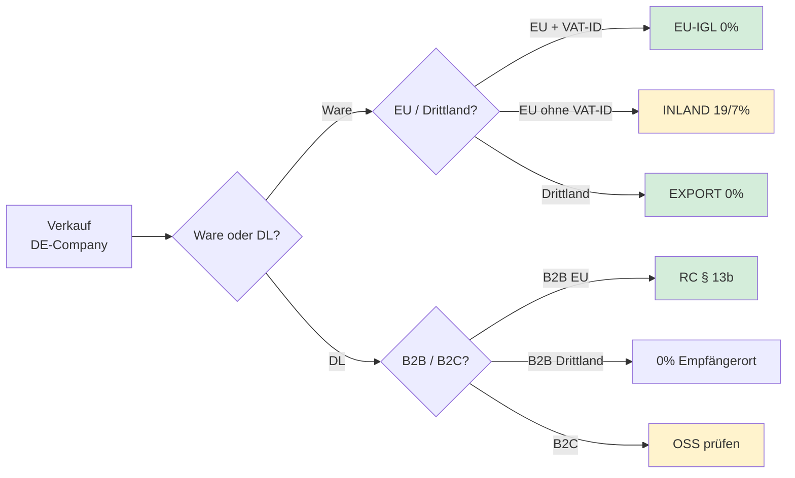
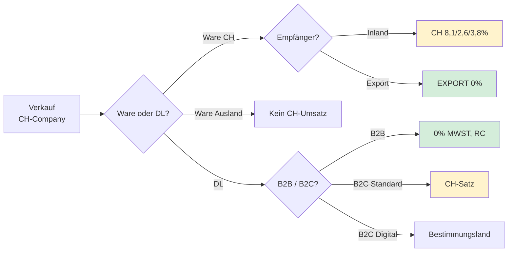

# FiBu-Buch 3: Business Central (BC) – Einführung Schweiz (separate Firma) & USt/MWST DE–CH inkl. Dreiecks-/Reihengeschäften

Stand: `15.03.2026` (Lern- und Umsetzungsstand).  
Hinweis: Dieses Dokument ist **keine Rechts- oder Steuerberatung**. Es ist ein Lern- und Projektleitfaden für die Umsetzung in **Microsoft Dynamics 365 Business Central**. Für Einzelfälle (Lieferketten, Incoterms (Internationale Handelsklauseln), Zoll/Import, Betriebsstätten, Registrierungs-/Vertreterpflichten) ist eine steuerliche Prüfung erforderlich.

---

## Inhaltsverzeichnis (Kurz)

- 1. Ziel, Zielgruppe, Lern-/Projektpfad
- 2. Firmengerüste (DE/CH getrennte Companies, Intercompany (Konzernintern), Governance)
- 3. Einrichtung in BC (CH-Company, DE-Company Multi-Country, prüfungsfeste Checklisten)
- 4–7. Steuerlogik & Szenarien (CH MWST, DE USt, EU vs. Drittland, Waren & Dienstleistungen, IT-Beispiele)
- 7A. DBA (Doppelbesteuerungsabkommen) DE-CH – Ertragsteuerliche Aspekte (Quellensteuer, Grenzgänger Art. 15a, Betriebsstätte)
- 8. BC-Umsetzung (Code-System, Matrix, Guardrails (Leitplanken), Reporting (Berichtswesen), Blueprints)
- 9. Testkatalog + Go-Live (Produktivstart) + Betrieb/Prüfungskalender
- 10. Quellen
- 11–12. Glossar + technischer Anhang (Tabellen/Pages/Codeunits)

## 1. Ziel und Zielgruppe

Ziel:
- Eine **Schweizer Gesellschaft als separate Firma/Company** in Business Central sauber aufsetzen (Stammdaten, Kontenlogik, MWST-Setup (Einrichtung), Prozesse).
- Die wichtigsten **DE/CH-USt-/MWST-Konstellationen** erklären (Waren + Dienstleistungen), inkl. **Dreiecksgeschäft (EU)** vs. **Reihengeschäft** und **Drittland (Schweiz)**.
- Das Ganze **prüfungs- und prozessfest** in BC abbilden (VAT/MWST-Codes, Kontenfindung, Beleganforderungen, Kontrollen, Testszenarien).

Zielgruppe:
- Finance-Leitung / Accounting (DE/CH)
- Key User (Schlüsselanwender) Einkauf/Vertrieb/Logistik
- BC-Consultants (Fit-Gap (Passungsanalyse), Design (Ausgestaltung), Test, Go-Live (Produktivstart))
- Tax-/Compliance (Regeltreue)-nahe Rollen (Kontrollen, Audit Trail (Prüfspur))

### 1.1 Wie du dieses Buch nutzt (Lernpfad + Projektpfad)

**Lernpfad (Verstehen)**
1) Kapitel 5 (DE-Grundlogik) + Kapitel 4 (CH-Grundlogik) lesen → Begriffe sauber trennen (EU vs Drittland, Ware vs Dienstleistung).  
2) Kapitel 6/7 szenariobasiert durcharbeiten (jeweils: Einordnung → Nachweise → BC-Umsetzung).  
3) Kapitel 8 (Setup (Einrichtung)/Guardrails (Leitplanken)/Reporting (Berichtswesen)) lesen → „wie verhindere ich Fehler systemisch?“  

**Projektpfad (Umsetzen in BC)**
1) Kapitel 2/3 (Company-Struktur + Basis-Setup (Einrichtung)).  
2) Kapitel 8.10–8.15 (TaxScenario, Länder-Matrix, Cookbook, Umsetzungsreihenfolge, Kontrollen, Evidence Pack (Nachweispaket)).  
3) Kapitel 9 (Tests) + 9A (Go-Live (Produktivstart) Checkliste) als Abnahmegrundlage.  

Praxisregel:
- Sobald du nicht sicher bist, ob es **EU** oder **Drittland** ist, oder ob es **Ware** oder **Dienstleistung** ist, geh zurück zu den „5 Fragen“ in Kapitel 8.11.

---

## 2. Schweiz als separate Firma in BC: „Firmengerüste“ (System- und Organisationsmodelle)

Dieses Kapitel beschreibt **Strukturmuster**, nicht „die eine richtige Lösung“. Entscheidend ist: **rechtliche Einheit**, **USt/MWST-Registrierungen**, **Reporting (Berichtswesen)** und **Prozess-/Kontrollbedarf**.

### 2.1 Begriffsklärung: Firma/Company, Mandant/Tenant, Umgebung/Environment

BC trennt organisatorisch u. a. über:
- **Company (Firma)**: eigene Buchungen, eigene Stammdaten in vielen Bereichen (z. B. Kontenplan je nach Design (Ausgestaltung)), eigene MwSt-/USt-Setups.
- **Environment**: getrennte Umgebungen (z. B. PROD/TEST) oder auch fachlich getrennte Instanzen.
- **Tenant**: oberste Daten-/Lizenzgrenze.

Microsoft-Primärquellen:
- Company anlegen/verwenden (BC): Microsoft Learn „About new companies“: https://learn.microsoft.com/en-us/dynamics365/business-central/about-new-company  
- VAT-Setup (Einrichtung) in BC: Microsoft Learn „Set up VAT“: https://learn.microsoft.com/en-us/dynamics365/business-central/finance-setup-vat

### 2.2 Typische Firmengerüste (praktisch)

| Muster | Wann sinnvoll | Umsetzung in BC | Typische Risiken |
|---|---|---|---|
| **A) Separate Company pro juristische Einheit** (DE GmbH + CH AG) | Standard in Konzern/Gruppe | 2 Companies, ggf. Intercompany (Konzernintern) | Doppeltes Setup (Einrichtung), Abstimmung, interne Verrechnung |
| **B) Eine Company + Dimensionen** (nur wenn wirklich 1 Rechtsträger!) | Nur bei 1 Rechtsträger mit Bereichen | 1 Company, Dimension „Bereich“ | **Nicht geeignet** für separate Rechtsträger/Registrierungen |
| **C) Separate Environments** (DE vs CH getrennt) | starke Trennung, unterschiedliche Release-/Add-on-Landschaft, Outsourcing | 2 Environments | Integrationsaufwand, Reporting (Berichtswesen) übergreifend schwieriger |
| **D) Hybrid** (Company je Rechtsträger, zentraler Shared-Service Prozess) | Konzern mit zentralem Accounting/Payments | Multi-Company + Freigaben + IC (Intercompany = konzerninterne Transaktionen) | Rollen/Berechtigungen, Prozessdesign (Wer darf wo?) |

**Firmengerüst-Optionen auf einen Blick:**



Merksatz:
- **USt/MWST ist rechtskreis- und registrierungsbezogen.** Sobald unterschiedliche Registrierungen/Steuerregime relevant sind, ist eine Trennung als **separate Company** meistens die robusteste Basis.

### 2.3 Intercompany (Konzernintern) als Baustein (wenn konzerninterne Leistungen/Warenflüsse bestehen)

Wenn DE und CH **konzernintern** liefern/leisten, plane Intercompany (Konzernintern):
- Debitor/Kreditor-Spiegel je Company
- IC-Abstimmung, Eliminierung (falls Konsolidierung)
- klare Preise/Verrechnungslogik (Transfer Pricing ist ein eigenes Thema)

Microsoft-Primärquelle:
- Intercompany (Konzernintern) in BC (Microsoft Learn „Set up intercompany (Konzernintern)“): https://learn.microsoft.com/en-us/dynamics365/business-central/intercompany-how-setup

### 2.4 Governance (RACI (Responsible/Accountable/Consulted/Informed – Verantwortlichkeitsmatrix)): Wer entscheidet „Tax” im Projekt?

Multi-Country scheitert selten am System, sondern an fehlender Verantwortungsklarheit. Eine einfache RACI-Matrix verhindert „Default-VAT” und spätere Re-Work-Kaskaden.

Empfehlung (minimal):

| Entscheidung/Prozess | Responsible (R) | Accountable (A) | Consulted (C) | Informed (I) |
|---|---|---|---|---|
| TaxScenario-Definitionen (EU-IGL, Export, Import, RC (Reverse Charge = Umkehr der Steuerschuldnerschaft), Bezugsteuer, Dreieck, Reihe) | Tax Lead | CFO/Head of Finance | BC Consultant, Logistik | Buchhaltung |
| VAT-Code/Posting-Setup (Einrichtung) (Matrix + Konten) | BC Consultant + Finance Key User (Schlüsselanwender) | Finance Lead | Tax Lead, WP/Prüfung | Stakeholder |
| VAT-ID-Validierung SOP (VIES/BC Log) | Finance Ops | Finance Lead | Tax Lead | Sales |
| Export-/Transportnachweise (EU/Non-EU) | Logistik/Shipping | Operations Lead | Finance, Tax | Sales |
| Importeur-Entscheidung + Importbelege (EUSt/Einfuhrsteuer) | Logistik + Finance Ops | Operations/Finance Lead | Tax Lead | Einkauf |
| Intercompany (Konzernintern)-Services (Leistungsnachweise + RC/Bezugsteuer) | Shared Service / Finance Ops | Finance Lead | Tax Lead | Controlling |

Praxisregel:
- Wenn `TaxScenario` unklar ist, wird **nicht gebucht** (Freigabe-/Review-Pfad).

---

## 3. Basis-Setup (Einrichtung): Schweizer Company in Business Central (Projekt-Checkliste)

### 3.1 Minimal-Entscheidungen vor dem Setup (Einrichtung)

1) **Währung** (CHF als Hauswährung; ggf. EUR-Zweitwährung)  
2) **Kontenplan-Strategie**  
- eigener Schweizer Kontenrahmen (z. B. KMU-Logik) vs. Konzernkontenplan  
- mapping für Group Reporting (Berichtswesen)/Consolidation  
3) **Dimensionen** (Kostenstelle/Profitcenter/Projekt, ggf. Land/Region)  
4) **Nummernserien** (Belegnummern je Company, keine Überschneidung)  
5) **MWST-Logik** (Sätze, Codes, Konten, Ausnahmen, Bezugsteuer)  

### 3.2 MWST-Sätze (Schweiz) als Ausgangspunkt (Stand prüfen!)

Die ESTV veröffentlicht die gültigen MWST-Sätze (z. B. Normalsatz/Reduzierter Satz/Sondersatz Beherbergung).  
Primärquelle: ESTV „Steuersätze“ (MWST) – inkl. Hinweis auf Gültigkeit seit `01.01.2024`: https://www.estv.admin.ch/estv/de/home/mehrwertsteuer/mwst-steuersätze.html

BC-Umsetzung:
- Lege pro MWST-Satz **VAT/MWST-Produktbuchungsgruppen** (oder Code-System) an, die zu deiner Konten-/Prozesslogik passt.
- Lege **VAT Posting Setup (Einrichtung)** (MwSt.-Buchungsmatrix) so an, dass sie
  - die korrekte Steuerberechnung,
  - die korrekte Kontierung (Umsatzsteuer/Vorsteuer/Bezugsteuer),
  - und die richtige Ausweisung in Auswertungen
  sicherstellt.

Microsoft-Primärquelle:
- „Set up VAT“ (VAT Posting Setup (Einrichtung), VAT Bus./Prod. Posting Groups): https://learn.microsoft.com/en-us/dynamics365/business-central/finance-setup-vat

### 3.3 Dokumente & Pflichttexte: „VAT Clauses“ als Standardbaustein

Gerade bei grenzüberschreitenden Fällen sind wiederkehrende Hinweis-/Textbausteine wichtig (z. B. „Export“/„Steuerbefreiung“/„Reverse charge“ etc.). In BC lässt sich das über **VAT Clauses** standardisieren.

Microsoft-Primärquelle:
- „Set up VAT“ (inkl. VAT Clauses): https://learn.microsoft.com/en-us/dynamics365/business-central/finance-setup-vat

### 3.4 BC-Seitenlandkarte (wo wird was gepflegt?)

Diese „Landkarte“ ist bewusst kurz gehalten, damit man im Projekt schnell die richtigen Stellen findet:
- **Company anlegen**: „About new companies“: https://learn.microsoft.com/en-us/dynamics365/business-central/about-new-company
- **Company Information**: Firmendaten (Adresse, MWST/USt-Registrierungsnummer, Bankdaten, Dokumentenlayout-Basics)
- **VAT Business Posting Groups**: Kundentyp-/Ländertyp-Logik (z. B. CH-domestic, DE/EU, Drittland)
- **VAT Product Posting Groups**: Leistungsart-/Satz-Logik (Ware, Dienstleistung, Satzklassen)
- **VAT Posting Setup (Einrichtung)**: die eigentliche Matrix (Satz, Konten, Berechnungstyp, VAT Clause)

Praxisregel:
- Alles, was später schwer zu auditieren ist (falscher Code, falscher Satz, falsches Konto), gehört in **Posting Setup (Einrichtung) + Guardrails (Leitplanken)**, nicht in „manuelle Buchungsdisziplin“.

### 3.5 Einrichtung in BC (Schritt-für-Schritt): CH-Company als separate Firma

Diese Schrittfolge ist bewusst „klickbar“ formuliert. Die Seiten heißen je nach Spracheinstellung ähnlich; Microsoft Learn referenziert i. d. R. die englischen Bezeichnungen.

**Schritt 1: Company anlegen**
- Microsoft Learn: „About new companies“: https://learn.microsoft.com/en-us/dynamics365/business-central/about-new-company

**Schritt 2: Company Information pflegen (CH)**
- Ziel: Adresse, MWST‑Registrierungsnummer, Basisdaten je Company sind korrekt und getrennt von DE.
- Microsoft Learn (Objekte):
  - Table „Company Information“: https://learn.microsoft.com/en-us/dynamics365/business-central/application/base-application/table/microsoft.foundation.company.company-information
  - Page „Company Information“: https://learn.microsoft.com/en-us/dynamics365/business-central/application/base-application/page/microsoft.foundation.company.company-information

**Schritt 3: Länder sauber pflegen**
- Ziel: `Country/Region Code` ist verlässlich (CH, DE, EU‑Länder, Drittland).
- Microsoft Learn: Table „Country/Region“: https://learn.microsoft.com/en-us/dynamics365/business-central/application/base-application/table/microsoft.foundation.address.country-region

**Schritt 4: VAT/MWST Setup (Einrichtung)-Grundlage anlegen**
- VAT Business Posting Groups (z. B. `DOM`, `EU-B2B`, `NON-EU`, `IC`)
- VAT Product Posting Groups (z. B. `WARE-STD`, `DL-STD`, `IMPORT`, `BEZUG/RC`)
- VAT Posting Setup (Einrichtung) (Matrix) + Konten je Kombination
- Microsoft Learn:
  - Page „VAT Business Posting Groups“: https://learn.microsoft.com/en-us/dynamics365/business-central/application/base-application/page/microsoft.finance.vat.setup.vat-business-posting-groups
  - Page „VAT Product Posting Groups“: https://learn.microsoft.com/en-us/dynamics365/business-central/application/base-application/page/microsoft.finance.vat.setup.vat-product-posting-groups
  - Page „VAT Posting Setup (Einrichtung)“: https://learn.microsoft.com/en-us/dynamics365/business-central/application/base-application/page/microsoft.finance.vat.setup.vat-posting-setup
  - Table „VAT Posting Setup (Einrichtung)“: https://learn.microsoft.com/en-us/dynamics365/business-central/application/base-application/table/microsoft.finance.vat.setup.vat-posting-setup

**Schritt 5: VAT Clauses (Rechnungstexte) standardisieren**
- Ziel: wiederkehrende Hinweise (Export/RC/Bezugsteuer) kommen konsistent auf Dokumente.
- Microsoft Learn:
  - Page „VAT Clauses“: https://learn.microsoft.com/en-us/dynamics365/business-central/application/base-application/page/microsoft.finance.vat.clause.vat-clauses

**Schritt 6: Nummernserien (Belegnummern) getrennt je Company**
- Ziel: keine Nummernüberschneidungen zwischen DE und CH; Auditpfad bleibt sauber.
- Microsoft Learn: „Create number series“: https://learn.microsoft.com/en-us/dynamics365/business-central/ui-create-number-series

**Schritt 7: Guardrails (Leitplanken) aktivieren**
- Workflows/Freigaben für grenzüberschreitende Belege (Kap. 8.14).
- Dokumentenanhänge als Nachweis-Pflicht (Kap. 8.15/12.6).

**Schritt 8: Smoke Tests**
- Buche 2–3 Testfälle (CH Inland, CH Export, CH Bezugsteuer) und prüfe:
  - `VAT Entry` (USt./MWST‑Posten) ist korrekt: https://learn.microsoft.com/en-us/dynamics365/business-central/application/base-application/table/microsoft.finance.vat.ledger.vat-entry
  - Kontierung ist korrekt (Sachposten): https://learn.microsoft.com/en-us/dynamics365/business-central/application/base-application/table/microsoft.finance.generalledger.ledger.g-l-entry

### 3.6 Einrichtung in BC (Schritt-für-Schritt): DE-Company Multi-Country (EU + Drittland)

Dieses Setup (Einrichtung) ist der „Alltag“ in DACH-Projekten: Deutschland (DE) als operative Company, Lieferungen/Leistungen in mehrere EU‑Länder und Drittländer (CH/UK/NO/TR/US/CN …).

**Schritt 1: Company Information pflegen (DE)**
- Ziel: USt‑Registrierungsdaten und Adressdaten sind korrekt je Company.
- Microsoft Learn: Page „Company Information“: https://learn.microsoft.com/en-us/dynamics365/business-central/application/base-application/page/microsoft.foundation.company.company-information

**Schritt 2: Länder- und Partnerklassifikation festlegen**
- Ziel: Jeder Kunde/Lieferant ist eindeutig EU‑B2B, EU‑B2C oder NON‑EU (Drittland).
- Technische Basis: `Country/Region Code` am Debitor/Kreditor.
- Microsoft Learn: Table „Country/Region“: https://learn.microsoft.com/en-us/dynamics365/business-central/application/base-application/table/microsoft.foundation.address.country-region

**Schritt 3: VAT (USt)-Setup (Einrichtung) – die Matrix bauen**
- Ziel: `EU-B2B` ≠ `NON-EU` ≠ `DOM` ist systemisch abgebildet.
- Setup (Einrichtung):
  - VAT Business Posting Groups: `DOM`, `EU-B2B`, `EU-B2C` (falls nötig), `NON-EU`, `IC`
  - VAT Product Posting Groups: `WARE-STD`, `DL-STD`, `IMPORT`, `BEZUG/RC`
  - VAT Posting Setup (Einrichtung): jede Kombination bewusst prüfen (Satz/Konten/Berechnung)
- Microsoft Learn (How‑to):
  - „Set up value-added tax“: https://learn.microsoft.com/en-us/dynamics365/business-central/finance-setup-vat

**Schritt 4: VAT Clauses (USt‑Hinweise) pflegen**
- Ziel: Rechnungstexte (Export/Reverse-Charge/… je Szenario) sind standardisiert.
- Microsoft Learn: Page „VAT Clauses“: https://learn.microsoft.com/en-us/dynamics365/business-central/application/base-application/page/microsoft.finance.vat.clause.vat-clauses

**Schritt 5: USt-IdNr.-Prüfung (EU) aktiv nutzen**
- Ziel: EU‑B2B‑Kunden werden geprüft und die Prüfung ist protokolliert (statt „nur Screenshot“).
- Microsoft Learn: „Validate VAT Registration Numbers“: https://learn.microsoft.com/en-us/dynamics365/business-central/finance-how-validate-vat-registration-number
- Optionaler Standardreport:
  - Report „VAT Registration No. Check“: https://learn.microsoft.com/en-us/dynamics365/business-central/application/base-application/report/microsoft.finance.vat.registration.vat-registration-no.-check

**Schritt 6: Nummernserien (Belegnummern)**
- Ziel: saubere Nummernkreise pro Dokumentart (und keine „handgemachten“ Nummernlogiken).
- Microsoft Learn: „Create number series“: https://learn.microsoft.com/en-us/dynamics365/business-central/ui-create-number-series

**Schritt 7: Workflows/Freigaben (Guardrails (Leitplanken))**
- Ziel: EU‑0%/Export‑0%/RC/Bezugsteuer/Import sind Freigabefälle (TaxScenario + Nachweise + Whitelist).
- Microsoft Learn:
  - „Set up approval users“: https://learn.microsoft.com/en-us/dynamics365/business-central/across-how-to-set-up-approval-users
  - „Set up approval workflows“: https://learn.microsoft.com/en-us/dynamics365/business-central/across-set-up-workflows

**Schritt 8: Nachweise (Anhänge/Links) verbindlich machen**
- Ziel: EU‑Transportnachweise, Exportbelege, Importbelege und Leistungsnachweise sind am Beleg/Entry verknüpft (Evidence Pack (Nachweispaket)).
- Microsoft Learn: „Add attachments, links, and notes on records“: https://learn.microsoft.com/en-us/dynamics365/business-central/ui-how-add-link-to-record

**Schritt 9: Intrastat (falls relevant) separat einrichten**
- Ziel: Intrastat ist ein eigener Stream (statistisch) und wird nicht mit ZM verwechselt.
- Microsoft Learn: „Intrastat reporting“: https://learn.microsoft.com/en-us/dynamics365/business-central/finance-how-setup-report-intrastat

**Schritt 10: Smoke Tests (DE Multi-Country)**
- Buche je einen Testfall:
  - EU‑IGL (DE → IT)
  - EU‑ICA (IT → DE)
  - Drittland‑Export (DE → CH/UK)
  - Import (CH → DE, inkl. separatem EUSt‑Pfad)
- Prüfe immer:
  - VAT Entries (USt.-Posten): https://learn.microsoft.com/en-us/dynamics365/business-central/application/base-application/table/microsoft.finance.vat.ledger.vat-entry
  - G/L Entries (Sachposten): https://learn.microsoft.com/en-us/dynamics365/business-central/application/base-application/table/microsoft.finance.generalledger.ledger.g-l-entry
  - Evidence Pack (Nachweispaket) (Anhänge + Freigaben) nach Kap. 8.15

### 3.7 Prüfungsfeste Setup (Einrichtung)-Checklisten (Copy-Paste): „Was genau muss ich wo pflegen?“

Diese Checklisten sind bewusst so geschrieben, dass du sie direkt in ein Projekttemplate übernehmen kannst.

Grundprinzip:
- **Stammdaten** liefern die Klassifikation (Land, B2B/B2C, VAT‑ID, Gruppen).
- **Setup (Einrichtung)** liefert die Matrix (Partnergruppe × Produktgruppe → Satz/Konten/Text).
- **Guardrails (Leitplanken)** verhindern das „Durchrutschen“ (Workflows, Whitelists, Anhänge, Berechtigungen).
- **Evidence Pack (Nachweispaket)** macht es prüfbar (Kap. 8.15).

#### 3.7.1 Country/Region (Land/Region) – Basis für EU vs. Drittland

Wo:
- Table „Country/Region“: https://learn.microsoft.com/en-us/dynamics365/business-central/application/base-application/table/microsoft.foundation.address.country-region

Checkliste (pro Land, minimal):
- Land-Code ist eindeutig (z. B. `DE`, `CH`, `IT`, `FR`, `UK`, `US`).
- Ländername ist eindeutig (keine Dubletten durch Tippfehler).
- Projektregel: **EU‑Land ≠ Drittland** wird nicht „im Kopf“ entschieden, sondern über Land/Partnerklassifikation + `TaxScenario`.

Abschlusskontrolle:
- Stichprobe: 3 EU‑Kunden + 3 Drittland‑Kunden → korrekte Standardgruppen (siehe 3.7.2/3.7.3).

#### 3.7.2 Customer (Debitor) – Pflichtfelder für EU‑B2B / Export / B2C

Wo:
- Customer Card: https://learn.microsoft.com/en-us/dynamics365/business-central/application/base-application/page/microsoft.sales.customer.customer-card

Checkliste (pro Customer):
- `Country/Region Code` gesetzt (Pflicht für Multi‑Country).
- `VAT Registration No.` (USt‑IdNr.) gepflegt **wenn EU‑B2B** (sonst leer/anders, je Policy).
- `VAT Business Posting Group` (USt.-Geschäftsbuchungsgruppe) gesetzt:
  - `DOM` für Inland
  - `EU-B2B` für EU‑Unternehmer
  - `EU-B2C` für EU‑Privat (nur wenn ihr Fernverkauf/OSS wirklich nutzt)
  - `NON-EU` für Drittland
- Prozess: VAT‑ID‑Validierung/Protokoll (Kap. 6.12):
  - „Validate VAT Registration Numbers“: https://learn.microsoft.com/en-us/dynamics365/business-central/finance-how-validate-vat-registration-number
  - optional Report „VAT Registration No. Check“: https://learn.microsoft.com/en-us/dynamics365/business-central/application/base-application/report/microsoft.finance.vat.registration.vat-registration-no.-check

Abschlusskontrolle:
- EU‑B2B‑Kunde: VAT‑ID ist geprüft + im Log nachvollziehbar.
- EU‑B2C‑Kunde: niemals EU‑B2B‑0% Default.

#### 3.7.3 Vendor (Kreditor) – Pflichtfelder für Import / RC / Bezugsteuer

Wo:
- Vendor Card: https://learn.microsoft.com/en-us/dynamics365/business-central/application/base-application/page/microsoft.purchases.vendor.vendor-card

Checkliste (pro Vendor):
- `Country/Region Code` gesetzt.
- `VAT Business Posting Group` gesetzt (z. B. `EU-B2B`, `NON-EU`, `DOM`).
- Für RC/Bezugsteuer‑Lieferanten: klare Policy, welche Belegarten immer Freigabe + Nachweis brauchen (Kap. 8.14/8.15).

Abschlusskontrolle:
- Import‑Vendor (CH/UK/NO/…): darf nicht als `EU-B2B` klassifiziert sein.

#### 3.7.4 Artikel/Leistung/Sachkonto – VAT Product Posting Group (USt.-Produktbuchungsgruppe)

Ziel:
- Ware/Dienstleistung/Import/RC wird nicht „pro Beleg“ erfunden, sondern ist über Produktgruppe vordefiniert.

Checkliste:
- Für typische Verkaufsartikel: `VAT Prod. Posting Group = WARE-STD`
- Für Dienstleistungen: `VAT Prod. Posting Group = DL-STD`
- Für Import-/Clearingpfade: `VAT Prod. Posting Group = IMPORT` (falls ihr so arbeitet)
- Für RC/Bezugsteuer: `VAT Prod. Posting Group = BEZUG/RC` (falls ihr darüber steuert)

Hinweis:
- In BC hängen die verfügbaren Felder davon ab, ob du mit Items/Resources/G/L Accounts arbeitest. Entscheidend ist: **Produktklassifikation muss stabil sein**.

#### 3.7.5 VAT Posting Setup (Einrichtung) (USt-Buchungsmatrix) – „Single Source of Truth“

Wo:
- Page „VAT Posting Setup (Einrichtung)“: https://learn.microsoft.com/en-us/dynamics365/business-central/application/base-application/page/microsoft.finance.vat.setup.vat-posting-setup
- Table „VAT Posting Setup (Einrichtung)“: https://learn.microsoft.com/en-us/dynamics365/business-central/application/base-application/table/microsoft.finance.vat.setup.vat-posting-setup

Checkliste (pro relevante Kombination):
- Für `EU-B2B × WARE-STD`:
  - VAT‑% / Berechnungstyp so, dass EU‑IGL‑Logik abbildbar ist (0% wenn Voraussetzungen erfüllt).
  - VAT Clause zugeordnet (Hinweistext).
- Für `NON-EU × WARE-STD`:
  - Export‑0% (mit Nachweispflicht).
- Für `NON-EU × IMPORT` (oder euer Importpfad):
  - Lieferantenrechnung ohne inländische USt; Importsteuer/EUSt separat (Kap. 6.2/4.4).
- Für `EU-B2B × DL-STD`:
  - B2B‑Service‑Logik (RC‑Prinzip, je Fall).
- Für `NON-EU × BEZUG/RC` (CH‑Company):
  - Bezugsteuer‑Logik (Art. 45 ff. MWSTG) – je Abzugsrecht.

Abschlusskontrolle:
- Testbuchung je Kombination → `VAT Entry` + `G/L Entry` geprüft:
  - VAT Entry (USt.-Posten): https://learn.microsoft.com/en-us/dynamics365/business-central/application/base-application/table/microsoft.finance.vat.ledger.vat-entry
  - G/L Entry (Sachposten): https://learn.microsoft.com/en-us/dynamics365/business-central/application/base-application/table/microsoft.finance.generalledger.ledger.g-l-entry

#### 3.7.6 VAT Clauses (Rechnungstexte) – „immer derselbe Hinweis“

Wo:
- Page „VAT Clauses“: https://learn.microsoft.com/en-us/dynamics365/business-central/application/base-application/page/microsoft.finance.vat.clause.vat-clauses

Checkliste:
- EU‑B2B (0% / IGL) Hinweistext standardisiert.
- Export (Drittland, 0%) Hinweistext standardisiert.
- RC/Bezugsteuer Hinweistexte standardisiert (je Rechtskreis/Company).

Abschlusskontrolle:
- Stichprobe: 5 Rechnungen → Text erscheint korrekt und konsistent.

#### 3.7.7 VAT Statement (USt-Auswertung/MWST-Auswertung) – Setup (Einrichtung) + Proof

Wo:
- „Set up a VAT statement“: https://learn.microsoft.com/en-us/dynamics365/business-central/finance-how-setup-vat-statement
- Page „VAT Statement“: https://learn.microsoft.com/en-us/dynamics365/business-central/application/base-application/page/microsoft.finance.vat.reporting.vat-statement

CH-Hinweis (lokale Funktion):
- „Create and print a Swiss VAT statement [CH]“: https://learn.microsoft.com/en-us/dynamics365/business-central/localfunctionality/switzerland/how-to-create-and-print-a-swiss-vat-statement

Checkliste:
- VAT Statement Name + Lines sind so aufgebaut, dass sie eure Codes/Sätze eindeutig aggregieren.
- Abstimmungspfad dokumentiert: VAT Statement ↔ VAT Entries ↔ Steuerkonten.

#### 3.7.8 Workflows/Freigaben (prüfungsfest)

Wo:
- Approval Users: https://learn.microsoft.com/en-us/dynamics365/business-central/across-how-to-set-up-approval-users
- Workflow Setup (Einrichtung): https://learn.microsoft.com/en-us/dynamics365/business-central/across-set-up-workflows
- Using approval workflows: https://learn.microsoft.com/en-us/dynamics365/business-central/across-use-workflows

Checkliste (minimum viable control):
- Cross-border Belege sind Freigabefälle:
  - EU‑0% (IGL)
  - Drittland‑0% (Export)
  - RC/Bezugsteuer
  - Import (weil Nachweis-/Clearingpfad)
- Freigabe prüft mindestens:
  - `TaxScenario` gesetzt
  - Nachweise als Anhänge vorhanden
  - VAT‑Code passt zur Whitelist des Szenarios

#### 3.7.9 Dokumentenanhänge (Nachweise) – Evidence Pack (Nachweispaket) erzwingen

Wo:
- „Add attachments, links, and notes on records“: https://learn.microsoft.com/en-us/dynamics365/business-central/ui-how-add-link-to-record
- Table „Document Attachment“: https://learn.microsoft.com/en-us/dynamics365/business-central/application/base-application/table/microsoft.foundation.attachment.document-attachment

Checkliste:
- EU‑IGL: Transportnachweise (Kap. 6.11/6.14) am Shipment/Invoice verknüpft.
- Export: Ausfuhr-/Zollnachweise am Beleg verknüpft (Kap. 6.1A).
- Import: Importbelege (EUSt/Einfuhrsteuer) + Spediteurbelege verknüpft.
- Services/IC: Leistungsnachweise (Tickets/Timesheets/SLA) verknüpft.

#### 3.7.10 Nummernserien (Belegnummern) – Auditpfad

Wo:
- „Create number series“: https://learn.microsoft.com/en-us/dynamics365/business-central/ui-create-number-series

Checkliste:
- Nummernserien pro Company getrennt.
- Keine „manuellen Nummern“ als Standardprozess.

#### 3.7.11 Berechtigungen & Audit (Setup (Einrichtung)-Schutz)

Wo:
- „Define granular permissions“: https://learn.microsoft.com/en-us/dynamics365/business-central/ui-define-granular-permissions
- „Auditing changes“: https://learn.microsoft.com/en-us/dynamics365/business-central/across-log-changes

Checkliste:
- VAT Posting Setup (Einrichtung) Änderungen nur für wenige Rollen.
- Änderungen sind nachvollziehbar (wer/was/wann) und im Projekt dokumentiert.

---

## 4. MWST Schweiz – Grundlogik (für BC-Design (Ausgestaltung))

Dieses Kapitel fasst die Logik in „prüfbarer Projektform“ zusammen: Definitionen → typische Fälle → BC-Umsetzung.

### 4.1 Ort der Lieferung/Leistung (Schweiz): Kernartikel (MWSTG)

Für die Frage „Schweizer MWST ja/nein?“ ist zentral, ob der Umsatz als inländisch gilt. Das MWSTG definiert u. a.:
- Ort der Lieferung (Art. 7 MWSTG)
- Ort der Dienstleistung (Art. 8 MWSTG)

Primärquelle (Gesetzestext, PDF):
- MWSTG (SR 641.20), Stand `01.01.2024`: https://www.fedlex.admin.ch/filestore/fedlex.data.admin.ch/eli/cc/2009/615/20240101/de/pdf-a/fedlex-data-admin-ch-eli-cc-2009-615-20240101-de-pdf-a.pdf

Lernauszug (verkürzt; Hervorhebung nur zur Orientierung):
> **Art. 7 MWSTG (Ort der Lieferung)**: Ort der Lieferung ist „wo sich der Gegenstand … zur Zeit der Verschaffung der Befähigung, über ihn wirtschaftlich zu verfügen, befindet …“ bzw. bei Beförderung/Versendung „wo die Beförderung oder Versendung … beginnt“.  
> **Art. 8 MWSTG (Ort der Dienstleistung)**: Grundsatz u. a. „am Ort, an dem der Empfänger den Sitz seiner wirtschaftlichen Tätigkeit hat …“ (mit Ausnahmen).

BC-Umsetzung:
- Diese Logik wird in der Praxis über **MWST-Codes** (VAT Bus./Prod. Posting Groups + VAT Posting Setup (Einrichtung)) und über **Beleg-/Stammdatensteuerung** abgebildet:
  - Debitor/Kreditor-Land (CH, DE, EU, Drittland)
  - Liefer-/Leistungsart (Ware vs Dienstleistung)
  - Versand-/Lieferbedingungen (Belegnachweise, Export/Import)
  - ggf. Dreiecks-/Reihengeschäft-Flagging (organisatorisch + Prüfpfad)

### 4.1a CH‑MWST‑Entscheidungsbaum: Ort der Leistung und MWST‑Code‑Findung



BC‑Konfiguration je MWST‑Fall:
- **CH‑Standard (8.1%)**: `VAT Bus. Posting Group` = `CH-INLAND`, `VAT Prod. Posting Group` = `STANDARD`, `VAT Calc. Type` = `Normal VAT`
- **CH‑Reduziert (2.6%)**: `VAT Prod. Posting Group` = `REDUZIERT`, gleiche Bus.-Gruppe, Type `Normal VAT`
- **Export / 0%**: `VAT Prod. Posting Group` = `EXPORT`, Type `Normal VAT`, kein Steuerausweis; Nachweis-Pflicht (Zoll, Spediteurbeleg) im Archiv
- **Bezugsteuer** (Einkauf aus Ausland): `VAT Calc. Type` = `Reverse Charge VAT`, getrennte Kontierung Steuer / Vorsteuer
- **0% befreit** (Art. 23 MWSTG): separater Code mit Bezeichnung, damit MWST‑Abrechnung Schweiz (Formular 102 / 103) korrekt befuellt wird

Merksätze:
- „**CH dabei?** → **kein** EU‑Dreieck – aber eigene Orts‑ und Befreiungslogik nach MWSTG, nicht nach EU‑MwStSystRL"
- „**Bezugsteuer** = Schweizer Reverse‑Charge: Empfänger schuldet MWST auf Auslands‑Dienstleistung"
- „**Export** ist in CH steuerbefreit – aber Nachweispflicht ist hart: kein Nachweis = keine Befreiung"

### 4.2 Steuerbefreiung bei Exporten (Schweiz)

Aus Schweizer Sicht sind u. a. Ausfuhren ins Ausland typischerweise steuerbefreit (mit Nachweisen). Das MWSTG enthält dazu Regelungen zur Steuerbefreiung, u. a. Art. 23 MWSTG (Steuerbefreite Leistungen).

Lernauszug (verkürzt):
> **Art. 23 MWSTG** nennt u. a. „die Ausfuhr von Gegenständen“ und „Leistungen von Vermittlern, die in eigenem Namen, aber für Rechnung Dritter handeln“ als steuerbefreite Leistungen (mit Detailvoraussetzungen/Abgrenzungen im Gesetz).

BC-Umsetzung:
- Für CH-Verkäufe ins Ausland:
  - Sales-VAT-Code „Export/0%“ (logisch getrennt nach Ware/Dienstleistung, wenn du unterschiedliche Nachweise brauchst).
  - Prozesskontrolle: **kein Buchen ohne Exportnachweis** (z. B. Zolldokumente/Spediteurbelege) + Dokumentenanhänge.

### 4.3 Bezugsteuer (Schweiz) als „Reverse-Charge“-Äquivalent

Die Schweiz kennt in bestimmten Fällen eine **Bezugsteuer** (u. a. für Leistungen aus dem Ausland; Details und Ausnahmen sind gesetzlich geregelt). Relevante Normen finden sich u. a. in Art. 45 ff. MWSTG (Bezugsteuer; z. B. Art. 45a MWSTG).

Lernauszug (verkürzt):
> **Art. 45 MWSTG**: Der Empfänger schuldet u. a. die Steuer „für Leistungen von Unternehmen mit Sitz im Ausland …“ (Ausnahmen im Gesetz).  
> **Art. 45a MWSTG** regelt u. a. die Steuerforderung (Zeitpunkt) für die Bezugsteuer.

Praxisquelle (Behörde, CH):
- MWSTG (SR 641.20), Bezugsteuer Art. 45-49 (Bundesrecht, PDF; Fedlex): https://www.fedlex.admin.ch/filestore/fedlex.data.admin.ch/eli/cc/2009/615/20240101/de/pdf-a/fedlex-data-admin-ch-eli-cc-2009-615-20240101-de-pdf-a.pdf

BC-Umsetzung (Muster):
- Für CH-Einkaufsrechnungen „Dienstleistung aus Ausland mit Bezugsteuer“:
  - Purchase-VAT-Code „Bezugsteuer“ mit gleichzeitiger Steuer-/Vorsteuerbuchung (je nach Abzugsberechtigung).
  - getrennte Konten für Bezugsteuer (Steuer und ggf. Vorsteuer) zur Abstimmung/Reporting (Berichtswesen).
- Kontrollpunkt: Lieferant = Ausland, Leistung = Dienstleistung, Vertrag/Leistungsort prüfen → Code-Pflicht.

### 4.4 Einfuhrsteuer (Schweiz): wenn Ware in die Schweiz importiert wird

Wenn Ware in die Schweiz eingeführt wird, ist die **Einfuhrsteuer** (MWST auf Import) ein eigenes Regelwerk im MWSTG (Kapitel „Einfuhrsteuer“, Art. 52 ff. MWSTG; in der PDF-Fassung u. a. Art. 56–58 sichtbar).

Lernauszug (verkürzt):
> **Art. 56 MWSTG**: „Steuerschuldner ist: a. wer die Verfügungsmacht über den Gegenstand hat und die Steuer schuldet oder schulden würde …“ (weitere Buchstaben/Details im Gesetz).  
> **Art. 58 MWSTG**: Die Steuer wird mit dem **Annehmen der Zollanmeldung** fällig (mit Präzisierungen im Gesetz).

BC-Umsetzung (praxisnah):
- Trenne „Lieferantenrechnung“ (ohne CH-MWST) von „Import-/Zollbeleg“ (Einfuhrsteuer) – damit bleibt die Abstimmung prüfbar.
- Baue ein Matching: Wareneingang ↔ Lieferantenrechnung ↔ Spediteur/Zollabrechnung.

---

## 5. USt Deutschland – Grundlogik (für DE/CH-Fälle)

### 5.1 Drittland Schweiz: Export/Import statt „innergemeinschaftlich“

Wichtig für die Begriffswelt:
- Schweiz ist **Drittland** (nicht EU).  
- Viele Vereinfachungen im EU-Binnenmarkt (z. B. **innergemeinschaftliches Dreiecksgeschäft**) sind deshalb **nicht** anwendbar, sobald die Schweiz als beteiligter Staat „mitspielt“.

Primärquellen (Gesetzestext, DE):
- UStG § 1 (u. a. Einfuhrumsatzsteuer als Steuergegenstand): https://www.gesetze-im-internet.de/ustg_1980/__1.html
- UStG § 6 (Ausfuhrlieferung): https://www.gesetze-im-internet.de/ustg_1980/__6.html

### 5.2 Reihengeschäft (DE): bewegte Lieferung und § 3 Abs. 6a UStG

Für Lieferketten (A verkauft an B verkauft an C, Ware bewegt sich einmal) ist die korrekte Zuordnung der **bewegten Lieferung** entscheidend. Deutschland regelt Reihengeschäfte in § 3 Abs. 6a UStG.

Primärquelle (Gesetzestext, DE):
- UStG § 3 (inkl. Abs. 6a): https://www.gesetze-im-internet.de/ustg_1980/__3.html

Lernauszug (verkürzt):
> **§ 3 Abs. 6a UStG** konkretisiert, wie in einer Lieferkette mit nur einer Warenbewegung die Beförderung/Versendung einer Lieferung zugeordnet wird (Zwischenhändler-/Zuordnungslogik).

BC-Umsetzung:
- Reihengeschäfte sind in BC selten „ein Häkchen”; es ist ein **Szenario-Design (Ausgestaltung)**:
  - klare Rollen (Lieferer, Zwischenhändler, Abnehmer)
  - klare Incoterms (Internationale Handelsklauseln)/Transportverantwortung
  - eindeutige Dokumentation, welchem Umsatz die Beförderung/Versendung zugeordnet ist
- In BC: arbeite mit **Szenario-Codes** (z. B. Dimensionswert „TaxScenario” oder Pflichtfeld via Validierung) und hinterlege dazu:
  - verpflichtende Belegnachweise
  - verpflichtende MWST/USt-Codes
  - Abstimmberichte (Umsatz je Code je Periode)

**Reihengeschäft – Entscheidungsdiagramm (vereinfacht):**



### 5.3 Innergemeinschaftliches Dreiecksgeschäft (EU): § 25b UStG / Art. 141 MwStSystRL

Das **innergemeinschaftliche Dreiecksgeschäft** ist eine EU-spezifische Vereinfachung (3 Unternehmer, 3 verschiedene Mitgliedstaaten). In Deutschland ist es u. a. in § 25b UStG geregelt; auf EU-Ebene u. a. in Art. 141 der MwStSystRL.

Primärquellen:
- UStG § 25b: https://www.gesetze-im-internet.de/ustg_1980/__25b.html
- MwStSystRL (konsolidiert), Art. 141: https://eur-lex.europa.eu/legal-content/DE/TXT/?uri=CELEX:02006L0112-20240101

Lernauszug (verkürzt):
> **Art. 141 MwStSystRL** setzt u. a. voraus, dass die Vereinfachung einen Umsatz betrifft, „an dem **drei Steuerpflichtige**, die **in drei verschiedenen Mitgliedstaaten** … identifiziert sind, beteiligt sind …“.

Lernauszug (verkürzt, DE):
> **§ 25b UStG** ist an Voraussetzungen geknüpft, die typischerweise eine **Dreiecksbeziehung innerhalb der EU** (3 Unternehmer, 3 Mitgliedstaaten, innergemeinschaftliche Lieferungen/Erwerbe) abbildet.

Konsequenz für DE/CH:
- Sobald die Schweiz beteiligt ist, handelt es sich **nicht** um ein innergemeinschaftliches Dreiecksgeschäft i. S. d. § 25b UStG/Art. 141 MwStSystRL.
- Du musst stattdessen i. d. R. über **Export/Import** und/oder **Reihengeschäft-/Kettenlogik** (inkl. Zoll) denken.

**Zahlenbeispiel: EU-Dreiecksgeschäft (nur EU, ohne CH)**

Sachverhalt: DE-GmbH (A) verkauft Ware für 10.000 EUR an IT-Srl (B), IT-Srl verkauft weiter an FR-SAS (C) für 12.000 EUR. Ware geht direkt DE → FR. Alle drei haben gültige USt-IdNr. → Vereinfachungsregel § 25b UStG greift.

| Unternehmen | Buchung Soll | Betrag EUR | Buchung Haben | Betrag EUR | USt |
|---|---|---:|---|---:|---|
| A (DE) | `1400 Forderung IT-Srl` | 10.000 | `4100 Erlöse ig. Lieferung 0%` | 10.000 | 0% (ig. (innergemeinschaftliche) Lieferung § 4 Nr. 1b UStG) |
| B (IT) | `5100 Wareneinkauf` | 10.000 | `3300 Verbindlichkeit DE-GmbH` | 10.000 | **Kein igE**, da § 25b: Steuerschuldnerschaft geht auf C über |
| B (IT) | `1400 Forderung FR-SAS` | 12.000 | `4100 Erlöse Dreiecksgeschäft` | 12.000 | 0% (§ 25b Abs. 2: Hinweis auf Rechnung an C) |
| C (FR) | `5100 Wareneinkauf` | 12.000 | `3300 Verbindlichkeit IT-Srl` | 12.000 | Reverse Charge (C schuldet FR-USt 20%) |

**Gegenbeispiel: CH statt IT beteiligt → kein EU-Dreiecksgeschäft**

Sobald CH-AG statt IT-Srl als Zwischenhändler agiert: § 25b greift **nicht**. DE-GmbH muss als Export an CH buchen (0% + Ausfuhrnachweis), CH-AG importiert mit Einfuhrsteuer und exportiert wieder nach FR (mit CH-Zollabwicklung + FR-Import). Drei getrennte Vorgänge statt einer Vereinfachung.

BC-Umsetzung:
- Trenne in deinem VAT-Code-System sauber:
  - EU-Dreiecksgeschäft (nur EU): `VAT Bus. Posting Group` = `EU-DREIECK`, VAT-Code `DE-EU-IGL-DREIECK-0`
  - Reihengeschäft mit Drittlandbezug (DE/CH): Separate Codes `DE-EXPORT-CH-0` + `CH-IMPORT-WARE`
- Baue Testfälle, die exakt diese Abgrenzung prüfen (siehe Kapitel 9).

### 5.4 Dreieck vs. Reihe vs. Drittland: die 30‑Sekunden-Abgrenzung

Dieses Kapitel ist absichtlich „didaktisch“. Es verhindert den häufigsten Projektfehler: **„Dreieck“ sagen, aber etwas anderes meinen.**

**A) EU‑Dreiecksgeschäft (Vereinfachung, nur EU)**
- Spielt in einer Lieferkette mit 3 Unternehmern in 3 **EU-Mitgliedstaaten**.
- Primärnormen: § 25b UStG (DE), Art. 141 MwStSystRL (EU).  

**B) Reihengeschäft / Kettenumsatz (Zuordnung bewegte Lieferung)**
- Es gibt mehrere Lieferungen, aber nur **eine** Warenbewegung.
- Primärnormen: § 3 Abs. 6a UStG (DE), Art. 36a MwStSystRL (EU).  

**C) Drittland-Fall (z. B. Schweiz, UK, NO, TR, US, CN)**
- Sobald ein Drittland beteiligt ist, bist du i. d. R. in Export/Import-/Zolllogik (und gerade **nicht** automatisch in § 25b).

Merksätze:
- „**CH dabei?** → **kein** EU‑Dreieck nach § 25b/Art. 141.“  
- „**Nur einmal Transport?** → immer prüfen: **welcher Umsatz ist die bewegte Lieferung?**“  

Visualisierung (vereinfachend):



Prüfpfad in BC:
- Du brauchst für solche Fälle **TaxScenario** (`EU-TRIANGLE` oder `EU-CHAIN`) + ein Evidence Pack (Nachweispaket) (Kap. 8.15), sonst wird die Einordnung später nicht mehr nachvollziehbar.

---

## 6. Typische DE/CH-Szenarien (Waren) – Lernlogik → BC-Abbildung

Dieses Kapitel ist bewusst „szenariobasiert“. Für jedes Szenario:
1) Umsatzsteuerliche Einordnung (DE) / MWST-Logik (CH) (hochlevel)  
2) Beleg-/Nachweispflichten (praktisch)  
3) BC-Umsetzung (Codes, Konten, Prozesse)  

### 6.1 DE verkauft Ware an CH-Kunde (Lieferung DE → CH)

Lernpunkte:
- Aus deutscher Sicht typischerweise **Ausfuhrlieferung** (steuerfrei), wenn die Voraussetzungen erfüllt und Nachweise vorhanden sind.

Primärquelle (Gesetzestext, DE):
- UStG § 6 (Ausfuhrlieferung): https://www.gesetze-im-internet.de/ustg_1980/__6.html

BC-Umsetzung (Muster):
- Debitor-Land = CH
- Verkaufs-VAT-Code = „DE-Export Ware 0%” (oder vergleichbar)
- Pflichtanhänge: Ausfuhr-/Zollnachweise, Spediteurbeleg (prozessual)
- Abstimmung: Umsätze „Export 0%” je Periode vs. Versand-/Zollstatistik

**BC-Umsetzung Schritt für Schritt (Einrichtung → Prozess → Kontrolle):**

Schritt 1 – Debitor-Stammdaten: Tell Me → `Customers` → CH-AG-Debitorenkarte öffnen → Reiter „Fakturierung”: Feld `VAT Bus. Posting Group` = `NON-EU` → Feld `Country/Region Code` = `CH` → Feld `VAT Registration No.` = CH-UID des Kunden eintragen (z. B. `CHE-123.456.789`) → speichern

Schritt 2 – VAT Posting Setup: Tell Me → `VAT Posting Setup` → Kombination `NON-EU` × `WARE-STD` öffnen → Felder setzen: `VAT %` = `0`, `VAT Calculation Type` = `No Taxable VAT`, `Sales VAT Account` = `1776` (oder leer, da 0%), `VAT Clause Code` = `EXPORT-0` → Beschreibungstext der VAT Clause (Tell Me → `VAT Clauses`): „Steuerfreie Ausfuhrlieferung gem. § 4 Nr. 1a i. V. m. § 6 UStG” → speichern

Schritt 3 – Verkaufsauftrag erstellen: Tell Me → `Sales Orders` → New → Feld `Customer Name`: CH-AG auswählen → im Kopf prüfen: `VAT Bus. Posting Group` = `NON-EU` ✓, `Ship-to Country/Region Code` = `CH` ✓ → Reiter „Zeilen”: Artikel hinzufügen → Feld `VAT Prod. Posting Group` = `WARE-STD` → Prüfen: Feld `VAT Amount` in der Zeile = `0,00 EUR` ✓

Schritt 4 – Buchen: Aktion `Post` → `Ship and Invoice` → Ergebnis: `Posted Sales Invoice` mit USt = 0 EUR → Rechnungstext enthält automatisch VAT-Clause-Text: „Steuerfreie Ausfuhrlieferung gem. § 4 Nr. 1a i. V. m. § 6 UStG” ✓

Schritt 5 – Nachweis anhängen: In `Posted Sales Invoice` → Aktion `Attachments` → Dokumente hochladen: Zollanmeldung/MRN (Ausgangsvermerk), Spediteurbeleg mit Bestimmungsland CH → Anhänge sind revisionssicher mit Beleg verknüpft ✓

Kontrolle: Tell Me → `VAT Entries` → Filter `Document No.` = Rechnungsnummer → `VAT %` = `0`, `VAT Calculation Type` = `No Taxable VAT` ✓ → Tell Me → `VAT Statement` → Export-0%-Zeile zeigt Umsatz ✓

**Zahlenbeispiel mit Buchungssätzen: Warenexport DE → CH, 10.000 EUR**

Sachverhalt: DE-GmbH verkauft Maschine an CH-AG für 10.000 EUR netto. Ware wird per Spedition von Stuttgart nach Zürich geliefert.

Buchungssatz DE-GmbH (Verkäufer):

| Konto | Soll EUR | Haben EUR |
|---|---|---|
| Forderungen LuL (CH-AG) | 10.000 | |
| Erlöse Ausfuhrlieferung steuerfrei | | 10.000 |
| USt | **0** (§ 4 Nr. 1a i. V. m. § 6 UStG) | |

→ Nachweis zwingend: Gelangensbestätigung, Ausgangsvermerk (MRN), Speditionsbeleg. Ohne Nachweis → Steuerfreiheit wird versagt → 1.900 EUR USt nachträglich fällig.

Buchungssatz CH-AG (Käufer, in CH-Company):

| Konto | Soll CHF | Haben CHF |
|---|---|---|
| Wareneinkauf (zum Tageskurs, z. B. 1 EUR = 0,94 CHF → 9.400 CHF) | 9.400 | |
| EUSt (Einfuhrsteuer, via Spediteur) 7,7 % auf Zollwert | 724 | |
| Verbindlichkeiten LuL (DE-GmbH) | | 9.400 |
| Verbindlichkeiten Zoll/EUSt | | 724 |

→ In BC: Die EUSt wird als separate Buchung erfasst (nicht auf der DE-Rechnung). Die CH-Company verbucht den Import mit lokalem MWST-Code „Import Einfuhrsteuer”.

Konsequenz für DE/CH:
- **DE-Company**: Ausfuhrlieferung steuerfrei (0% USt), aber **nur mit Nachweis** (UStDV §§ 8–13). Fehlt der Nachweis, schuldet DE-GmbH die USt nachträglich. In BC muss der Export-VAT-Code an eine Pflichtdokumentation (Anhang) geknüpft sein.
- **CH-Company** (als Käufer): Aus CH-Sicht ist das ein Import → Einfuhrsteuer (MWSTG Art. 52 ff.) entsteht, oft über den Spediteur abgewickelt. Die CH-Company muss die Einfuhrsteuer als separaten Buchungsvorgang abbilden (nicht als Teil der DE-Rechnung).

UAT (User Acceptance Testing = Benutzerabnahmetest)-Minimaltests:
1. Verkaufsrechnung CH-Kunden, VAT-Code „Export 0%”: VAT Entry 0%, Export-Anhang verknüpft, Umsatz im Export-Bucket.
2. Export ohne Nachweis-Anhang: Systemseitig blockieren oder Warnung zeigen (Guardrail-Kontrolle).
3. Abstimmung Periode: Export-0%-Umsätze vs. Zoll-/Versandstatistik – Differenz = 0.

### 6.1A Export-Nachweise (DE) prüfbar machen: UStDV-Ausfuhrnachweis in BC abbilden

Wenn du in DE Umsätze als steuerfreie Ausfuhrlieferung behandelst, ist der beleg- und buchmäßige Nachweis praktisch „Go-Live (Produktivstart)-kritisch“. Maßgeblich sind u. a. die §§ 8–13 UStDV (Ausfuhrnachweis/Buchnachweis).  

Primärquellen (Gesetzestext, DE):
- UStDV § 8 (Grundsätze Ausfuhrnachweis): https://www.gesetze-im-internet.de/ustdv_1980/__8.html
- UStDV § 9 (Beförderungsfälle; u. a. elektronischer Ausgangsvermerk): https://www.gesetze-im-internet.de/ustdv_1980/__9.html
- UStDV § 10 (Versendungsfälle): https://www.gesetze-im-internet.de/ustdv_1980/__10.html
- UStDV § 13 (Buchmäßiger Nachweis): https://www.gesetze-im-internet.de/ustdv_1980/__13.html

BC-Umsetzung (Minimalstandard):
- Pro Export-Rechnung/Shipment eine „Export-Nachweis“-Checkliste mit Pflichtfeldern (oder Pflichtanhängen):
  - Referenz auf Ausfuhranmeldung / MRN (sofern vorhanden)
  - Ausgangsvermerk/Alternativ-Ausgangsvermerk (Datei/Link)
  - Spediteur-/Frachtbelege
  - Versanddatum, Bestimmungsland, Incoterm
- Guardrail: „Export-0% VAT-Code“ nur zulässig, wenn die Nachweisdokumente verknüpft sind (workflow-/freigabeseitig erzwingen).

Hinweis:
- In BC-Standard ist das meistens eine Kombination aus **Dokumentenanhängen** + **Freigabeprozess**; wenn du Pflichtfelder technisch erzwingen willst, ist oft eine kleine Extension sinnvoll.

### 6.2 DE kauft Ware von CH-Lieferant (Lieferung CH → DE)

Lernpunkte:
- Deutschland: Einfuhr/Import → Einfuhrumsatzsteuer (EUSt) entsteht grundsätzlich bei der Einfuhr.
- Abzugsfähigkeit als Vorsteuer hängt von den Voraussetzungen ab (UStG § 15; steuerliche Prüfung im Einzelfall).

Primärquelle (Gesetzestext, DE):
- UStG § 1 (Einfuhrumsatzsteuer als Tatbestand): https://www.gesetze-im-internet.de/ustg_1980/__1.html
- UStG § 21 (Einfuhrumsatzsteuer): https://www.gesetze-im-internet.de/ustg_1980/__21.html
- UStG § 15 (Vorsteuerabzug): https://www.gesetze-im-internet.de/ustg_1980/__15.html

BC-Umsetzung (Musterprozess):
- Einkaufsrechnung CH-Lieferant: i. d. R. ohne deutsche USt (Code „Import ohne USt”)
- EUSt: über Zoll-/Importbeleg als separater Buchungsschritt (z. B. Einkaufskosten/Einfuhrabgaben-Konten + Vorsteuerkonto), abhängig von eurem Prozess (Spediteurabrechnung, Zollkonto, etc.)
- Kontrollpunkt: Matching „Wareneingang/Invoice/Importbeleg” (3-Way-Match erweitert)

**BC-Umsetzung Schritt für Schritt (Einrichtung → Prozess → Kontrolle):**

Schritt 1 – Lieferanten-Stammdaten: Tell Me → `Vendors` → Kreditorenkarte des CH-Lieferanten öffnen → Reiter „Fakturierung”: Feld `VAT Bus. Posting Group` = `NON-EU` → Feld `Country/Region Code` = `CH` → Feld `VAT Registration No.` = CH-UID (falls vorhanden) → speichern

Schritt 2 – VAT Posting Setup für Import: Tell Me → `VAT Posting Setup` → Kombination `NON-EU` × `IMPORT` öffnen (ggf. neu anlegen) → Felder setzen: `VAT %` = `0`, `VAT Calculation Type` = `No Taxable VAT` (Lieferantenrechnung trägt keine DE-USt) → Beschreibung: „Import Drittland, keine DE-USt” → speichern

Schritt 3 – Einkaufsrechnung CH-Lieferant: Tell Me → `Purchase Invoices` → New → Feld `Vendor Name` = CH-Lieferant → `Vendor Invoice No.` = Lieferantenrechnungsnummer → Reiter „Zeilen”: Artikel/G/L-Konto → `VAT Prod. Posting Group` = `IMPORT` → Betrag = 10.000 EUR → Prüfen: `VAT Amount` = `0,00 EUR` ✓ → Aktion `Post`

Schritt 4 – EUSt separat buchen: Spediteur/Zoll stellt Einfuhrabgaben in Rechnung → Tell Me → `Purchase Invoices` → New → Kreditor = Spediteur → G/L-Zeile: Konto `1588` (EUSt-Vorsteuerkonto) Debit + Konto `1787` (EUSt-Verbindlichkeit) Credit → Betrag = 19% des Zollwerts (z. B. 1.900 EUR bei Zollwert 10.000 EUR) → Feld `VAT Bus. Posting Group` = `IMPORT-EUST`, `VAT Calc. Type` = `Normal VAT` → `Post` → EUSt als abzugsfähige Vorsteuer in VAT Entries ✓

Kontrolle: Tell Me → `VAT Entries` → EUSt-Beleg vorhanden: `VAT Calculation Type` = `Normal VAT`, `VAT %` = `19`, `Base` = Zollwert ✓ → `VAT Entries` CH-Lieferantenrechnung: `No Taxable VAT`, `VAT %` = `0` ✓ → EUSt-Clearing-Konto `1787` → Saldo = 0 nach Zahlung ✓

**Zahlenbeispiel mit Buchungssätzen: Import CH → DE, 10.000 EUR**

Sachverhalt: DE-GmbH kauft Elektronikbauteile von CH-Lieferant für 10.000 EUR. Ware wird per Spedition von Zürich nach Stuttgart geliefert. Zollwert = 10.000 EUR. Zollsatz 0 % (Freihandelsabkommen). EUSt 19 % = 1.900 EUR.

Buchungssatz 1 – Eingangsrechnung CH-Lieferant (in DE-Company):

| Konto | Soll EUR | Haben EUR |
|---|---|---|
| Wareneinkauf (Rohstoffe) | 10.000 | |
| Verbindlichkeiten LuL (CH-Lieferant) | | 10.000 |
| USt/VSt (Vorsteuer) | **0** (Import – keine DE-USt auf CH-Rechnung) | |

Buchungssatz 2 – EUSt separat (Spediteur/Zoll-Rechnung):

| Konto | Soll EUR | Haben EUR |
|---|---|---|
| EUSt-Vorsteuer (abzugsfähig, § 15 Abs. 1 Nr. 2 UStG) | 1.900 | |
| EUSt-Verbindlichkeit (Clearingkonto Zoll) | | 1.900 |

→ In der UStVA: EUSt 1.900 EUR in Kennzahl 62 (Vorsteuer aus Einfuhr). Zahllast sinkt um 1.900 EUR.

Gesamtkosten Import: 10.000 EUR (Ware) + 0 EUR (Zoll bei 0 %) = 10.000 EUR Einstandswert. EUSt ist durchlaufender Posten (Vorsteuerabzug).

Typischer Fehler:
- EUSt „irgendwo” als Aufwand buchen → später keine Abstimmung, keine Prüfbarkeit. Richtig: immer als Vorsteuer auf separatem Konto mit Clearing.

Konsequenz für DE/CH:
- **DE-Company**: Einkauf von CH-Lieferant ist umsatzsteuerlich „Import” – die Einkaufsrechnung trägt keine deutsche USt. Stattdessen entsteht EUSt beim Eingang in DE (§ 21 UStG). In BC braucht die DE-Company einen eigenen Einkaufs-VAT-Code für Importe (kein normaler Inlandscode!).
- **CH-Company** (als Verkäufer): Aus CH-Sicht Export → 0% MWST mit Exportnachweis. Kein CH-MWST-Ausweis auf der Rechnung an DE-Kunden.
- Praxisregel: Immer zuerst klären, wer die Zollanmeldung abgibt (Importeur of Record) – diese Person schuldet die EUSt.

UAT-Minimaltests:
1. Einkaufsrechnung CH-Lieferant (0% USt): VAT-Code „Import ohne USt”, kein Vorsteuerabzug auf DE-Basis.
2. EUSt-Beleg Spediteur: Separater Journal-Buchung auf Einfuhrumsatzsteuer-Konto + Vorsteuer-Konto.
3. 3-Way-Match erweitert: Wareneingang + Eingangsrechnung + Importbeleg (Einfuhranmeldung) stimmen überein.

### 6.3 Dropship / Direktlieferung: DE verkauft an DE-Kunden, Ware kommt aus CH

Lernpunkte:
- Hier treffen **Lieferkette + Zoll/Import + Leistungsort** zusammen; „Dreieck“ ist umgangssprachlich, aber nicht automatisch § 25b UStG.

Kernentscheidung (für korrekte Steuerlogik):
- **Wer ist Importeur (Importer of Record)?** (wer gibt die Zollanmeldung ab / auf wen lautet die Einfuhr?)  
- **Wohin wird eingeführt?** (DE vs. anderes Land)  
- **Wer schuldet EUSt und wer kann sie als Vorsteuer abziehen?** (Einzelfallprüfung; Prozess-/Belegdokumentation ist zwingend)

BC-Umsetzung (Design (Ausgestaltung)-Hinweis):
- Erzwinge ein Tax-Review (Workflow/Checkliste) bevor gebucht wird:
  - Wer ist Importeur?
  - Wer hat die Zollanmeldung?
  - Welche Rechnungskette existiert (DE→DE, CH→DE, ggf. CH→DE-Kunde)?
  - Welche Umsatz ist die bewegte Lieferung (Reihengeschäft)?
- Systemisch: setze einen verpflichtenden Szenario-Code und verhindere „Default-VAT”.

Konsequenz für DE/CH:
- Bei DE/CH-Dropship-Konstellationen ist die **Importeur-Frage** die steuerlich kritischste Entscheidung – und sie muss **vor der Buchung** getroffen sein. Wer einfach „CH-Lieferant → 0% Import” bucht, ohne zu klären, wer EUSt schuldet, riskiert eine Betriebsprüfungs-Nachforderung. In BC muss ein Tax-Review-Prozess (Checkliste/Workflow) systemisch erzwungen werden.

UAT-Minimaltests:
1. Dropship Variante B (DE ist Importeur): CH-Rechnung ohne USt + EUSt-Beleg korrekt, Verkauf DE-Kunde mit DE-USt.
2. Dropship ohne Importeur-Entscheidung: BC blockiert Buchung (Pflichtfeld TaxScenario fehlt).
3. Abstimmung: EUSt-Clearing-Konto nach Spediteurbeleg ausgeglichen (Saldo = 0).

### 6.4 Dropship-Varianten (DE-Sicht): Importeur-Entscheidungsbaum

Nutze diese Varianten als Standard-Szenario-Katalog, damit Fachbereich + BC-Setup (Einrichtung) dieselbe Sprache sprechen:



**Variante A: Kunde ist Importeur (CH → DE-Kunde, Import auf Kundenname)**
- Risiko: DE-Firma fakturiert ggf. DE-USt (Inland) oder kann falsch als „Export“ behandelt werden.
- Pflichtnachweise: Zollbeleg auf Kundenname, Lieferkette/Vertragslage, Incoterms (Internationale Handelsklauseln).
- BC-Guardrails (Leitplanken): VAT-Code darf nicht „Export 0%“ sein, nur weil Lieferant CH ist; entscheidend ist der **eigene Umsatz** (DE→DE).

**Variante B: DE-Firma ist Importeur (CH → DE, Import auf DE-Firma; Weiterverkauf an DE-Kunde)**
- Prozess: CH-Lieferantenrechnung (ohne DE-USt) + EUSt aus Zollbeleg + Verkauf DE→DE (typisch mit DE-USt, je nach Fall).
- BC-Guardrails (Leitplanken):
  - „Import ohne USt“ auf der CH-Einkaufsrechnung
  - EUSt als separater Importbeleg (prüfbar, abstimmbar)
  - Verkauf mit korrektem Inlands-VAT-Code

**Variante C: Importeur ist eine dritte Partei (z. B. Logistikdienstleister im Auftrag)**
- Risiko: Belege liegen „außerhalb“ (Spediteurabrechnung) → fehlender Prüfpfad.
- BC-Guardrails (Leitplanken): Pflichtanhänge/Linking (Spediteur-/Zollabrechnung), sonst keine Buchung.

Wichtig:
- Diese Varianten sind **nicht** automatisch „Dreiecksgeschäft“ i. S. d. § 25b UStG (weil Schweiz Drittland).
- Reihengeschäft-/Zuordnungslogik (§ 3 Abs. 6a UStG) bleibt trotzdem relevant, wenn mehrere Lieferungen bei nur einer Warenbewegung vorliegen.

### 6.5 Dropship in BC „baubar“ machen: Pflichtdaten + Buchungslogik

Empfohlene Pflichtdaten (als Checkliste + ggf. Validierung):
- `ImporterOfRecord` (Ja/Nein; wer ist Importeur)
- `Incoterm` / Lieferbedingung (wer trägt Transport/Zollrisiko)
- `CustomsDocRef` (Zollbeleg-Referenz / MRN/Spediteurbeleg)
- `TaxScenario` (A/B/C aus 6.4)

Empfohlene Buchungslogik (robust, auditierbar):
- CH-Lieferantenrechnung: **keine** DE-USt (Import-Setup (Einrichtung)), aber zwingend Wareneingang/Bezug zu Bestellung/Shipment.
- EUSt/Importabgaben: **separater** Import-/Spediteurbeleg (Clearingkonto + Vorsteuerkonto nach Prozess).
- Verkauf: abhängig von Variante und Leistungsort (Tax-Review bestätigt; dann korrekter VAT-Code).

**Zahlenbeispiel: Dropship DE-GmbH → CH-Lieferant → DE-Endkunde, 8.000 EUR**

Sachverhalt: DE-GmbH (Händler) verkauft Ware für 8.000 EUR netto an DE-Endkunden (B2B, 19% USt). Der CH-Lieferant liefert direkt an den Endkunden. Ware wird in die EU importiert (EUSt beim Importeur = DE-GmbH). Einkaufspreis CH-Lieferant: 5.000 EUR.

`TaxScenario`: **A)** DE-GmbH ist Importeur → Import-EUSt + Inlandsverkauf.

Buchungssätze DE-GmbH:

| Schritt | Soll | Betrag EUR | Haben | Betrag EUR |
|---|---|---:|---|---:|
| 1. Einkauf CH (ohne USt) | `5000 Wareneinkauf` | 5.000 | `3300 Verbindlichkeit CH-Lieferant` | 5.000 |
| 2. EUSt Spediteur | `1576 VSt Einfuhr 19%` | 950 | `3310 Verbindlichkeit Spediteur` | 950 |
| 3. Verkauf Inland | `1400 Forderung DE-Kunde` | 9.520 | `4400 Erlöse Inland 19%` | 8.000 |
|  |  |  | `4800 USt 19%` | 1.520 |

UStVA-Auswirkung: KZ 62 (EUSt) = 950 EUR (Vorsteuer) + KZ 81 (steuerpflichtige Lieferung) = 8.000 EUR + KZ 66 (USt) = 1.520 EUR.

Prüfpfad in BC:
- Einkaufsrechnung CH: VAT-Code `DE-IMPORT-CH-OHNE-UST` → keine DE-USt auf Eingangsrechnung
- EUSt-Beleg: separates Purchase Journal mit VAT-Code `DE-EUST-IMPORT-19` → Vorsteuerabzug
- Verkaufsrechnung Inland: VAT-Code `DE-DOM-WARE-19` → Normalsatz

### 6.6 BC-Standardprozess „Drop Shipment” richtig einordnen (Prozess ≠ Steuerlogik)

BC hat einen Standardprozess für Drop Shipments (Verknüpfung Sales Order ↔ Purchase Order; Lieferung direkt vom Lieferanten zum Kunden).

Microsoft-Primärquelle:
- „Make drop shipments“ (BC): https://learn.microsoft.com/en-us/dynamics365/business-central/sales-how-drop-shipment

Projektregel:
- Nutze Drop Shipment als **Logistik-/Belegfluss-Mechanik**, aber entscheide die Steuerlogik immer über deinen **TaxScenario** (Kap. 6.4) + Importeur-/Zollbelege.  
- Verhindere, dass „Drop Shipment = Export“ oder „Lieferant CH = Export“ als Denkfehler in die Defaults rutscht.

### 6.7 Geschäfte mit Italien (DE ↔ IT, Waren, EU-Binnenmarkt)

Italien ist EU-Mitgliedstaat. Für die deutsche Firma sind typische Fälle mit Italien **innergemeinschaftliche Lieferungen/Erwerbe** (nicht Drittland-Export/Import).

Primärquellen (DE/EU):
- UStG § 6a (innergemeinschaftliche Lieferung): https://www.gesetze-im-internet.de/ustg_1980/__6a.html
- UStDV § 17a (Buch- und Belegnachweise für innergemeinschaftliche Lieferungen): https://www.gesetze-im-internet.de/ustdv_1980/__17a.html
- UStG § 18a (Zusammenfassende Meldung/ZM): https://www.gesetze-im-internet.de/ustg_1980/__18a.html
- MwStSystRL (konsolidiert; u. a. Art. 138 innergemeinschaftliche Lieferung): https://eur-lex.europa.eu/legal-content/DE/TXT/?uri=CELEX:02006L0112-20240101

**DE → IT (B2B, Ware) – innergemeinschaftliche Lieferung (typisch steuerfrei)**
- Lernpunkte:
  - Voraussetzungen und Nachweise sind entscheidend (VAT-ID des italienischen Abnehmers, Warenbewegungsnachweis, korrekte Meldungen).
  - „Steuerfrei“ ist ein Ergebnis aus **Tatbestand + Nachweis**, nicht ein Default.
- BC-Umsetzung (Muster):
  - VAT Business Posting Group: `EU-B2B` (Kundengruppe EU-Unternehmer)
  - VAT-Code: `DE-EU-IGL-WARE-0` (oder analog)
  - Pflichtnachweise gemäß UStDV § 17a (Beleg-/Buchnachweis) als Anhänge/Referenzen
  - ZM-Prozess (UStG § 18a): Reporting (Berichtswesen) je VAT-Code je Periode (Abstimmung mit ZM)

**IT → DE (B2B, Ware) – innergemeinschaftlicher Erwerb (DE)**
- Lernpunkte:
  - Erwerb führt in DE typischerweise zu Erwerbsteuer (mit Vorsteuerabzug nach Voraussetzungen; Prozess-/Kontenlogik muss das sauber abbilden).
- BC-Umsetzung (Muster):
  - Purchase-VAT-Code: `DE-EU-ICA-WARE` (Erwerbsteuer-Logik: Steuer und Vorsteuer in VAT Entries)
  - Guardrail: IT-Lieferant mit EU-VAT-ID → nicht als „Import“ behandeln

Primärquelle (IT, Gesetzestext; EU-Binnenmarkt aus IT-Sicht):
- D.L. 331/1993, Art. 41 (Cessioni intracomunitarie): https://www.normattiva.it/uri-res/N2Ls?urn:nir:stato:decreto.legge:1993-08-30;331~art41-com2bis=

Mini-Beispiel (DE → IT, IGL):
- Du verkaufst Ware 5.000 EUR von DE nach IT an einen Unternehmer.
- Erwartetes „sichtbares“ Ergebnis in BC:
  - Debitor hat IT als Land und eine gültige VAT-ID (geprüft via VIES/BC Log; Kap. 6.12).
  - Sales Shipment / Sales Invoice hat Transportnachweise als Anhänge (Kap. 6.11/6.14).
  - VAT-Code ist EU-IGL (nicht „Export 0%“).
- Monatsabschluss:
  - Report „EU-IGL Umsätze je Land“ ↔ ZM-Abstimmung (UStG § 18a; Kap. 8.9A).

Typischer Fehler:
- EU-Lieferung wird wie Drittland-Export behandelt (falscher Code, falsche Meldelogik).

### 6.8 Geschäfte mit Italien (CH ↔ IT, Waren, Drittland)

Aus Schweizer Sicht ist Italien EU-Ausland, d. h. jeder Warenhandel mit IT ist ein Export oder Import über die Drittlandsgrenze – keine IGL/ICA. Aus italienischer Sicht gilt: Wareneingang aus CH = Import in die EU (Einfuhrumsatzsteuer IVA + Zoll).

Primärquellen (Gesetzestexte):
- MWSTG Art. 23 (CH, Steuerbefreiung Exporte): https://www.fedlex.admin.ch/eli/cc/2009/615/20240101/de/html
- MWSTG Art. 52 ff. (CH, Einfuhrsteuer): https://www.fedlex.admin.ch/eli/cc/2009/615/20240101/de/html
- DPR 633/1972, Art. 67 ff. (IT, Einfuhr und Ausfuhr IVA): https://www.normattiva.it/uri-res/N2Ls?urn:nir:stato:decreto.del.presidente.della.repubblica:1972-10-26;633

**A) CH → IT (Export der CH-Company nach Italien)**

Lernpunkte:
- CH-Company exportiert Ware nach IT. Aus CH-Sicht: steuerbefreiter Export (MWSTG Art. 23, wenn Exportnachweis vorhanden).
- Aus IT-Sicht: Einfuhr in die EU → IVA (Einfuhr-IVA) + Zoll fällt beim IT-Importeur an.

BC-Umsetzung (CH-Company):
- Debitor-Land = IT, Kundentyp = `EU-Ausland` (für CH ist IT = Drittland)
- VAT-Code = `CH-EXPORT-WARE-0` (0% MWST, Export steuerbefreit)
- Pflichtanhänge: Exportnachweis (Ausfuhrdeklaration), Spediteurbeleg, Zollquittung
- Kontrolle: Umsätze im „Export 0%”-Bucket, Abstimmung gegen Ausfuhrstatistik

Mini-Beispiel CH → IT:
- CH AG verkauft Maschine CHF 15.000 an IT-Firma → Verkaufsrechnung: `CH-EXPORT-WARE-0`, 0% MWST.
- Anhang: Zoll-Exportdeklaration mit Bestätigungsvermerk.
- Posted Sales Invoice: CHF 15.000 netto, MWST 0, VAT Entry mit Code `CH-EXPORT-WARE-0`.

**B) IT → CH (Import der CH-Company aus Italien)**

Lernpunkte:
- CH-Company kauft Ware von IT → Import in die Schweiz. Einfuhrsteuer (MWSTG Art. 52 ff.) entsteht bei Einfuhr.
- Die Einfuhrsteuer wird i. d. R. vom Spediteur/Zolldeklaranten abgewickelt und separat fakturiert.

BC-Umsetzung (CH-Company):
- Einkaufsrechnung IT-Lieferant: VAT-Code = `CH-IMPORT-OHNE-MWST` (keine CH-MWST auf der Auslandsrechnung)
- Separater Importbeleg (Spediteur/Zoll): Einfuhrsteuer auf Vorsteuer-/Einfuhrsteuer-Konto (Ziffer 400 Deklaration ESTV)
- Clearing-Konto für Einfuhrsteuer: Abstimmung je Periode gegen Zolldekos

Mini-Beispiel IT → CH:
- IT-Lieferant stellt CHF 10.000 (ohne MWST) → Einkaufsrechnung mit Code `CH-IMPORT-OHNE-MWST`.
- Spediteur stellt Einfuhrsteuer CHF 810 (10.000 × 8,1%) → separates Journal auf Vorsteuerkonto.
- Abstimmung: Einfuhrsteuer-Konto Soll = 810, Vorsteuerkonto Haben = 810.

Konsequenz für DE/CH:
- Die **CH-Company** behandelt IT-Geschäfte vollständig als Drittland (kein IGL-Code, kein EU-Reporting). Exportnachweise sind nach MWSTG Pflicht. Einfuhrsteuer muss als separater Prozesspfad (Clearing-Konto) abgebildet werden – nicht als Aufwand einfach „mitbuchen”.
- Ein häufiger Fehler: CH-Company verwendet EU-IGL-Codes für Ware nach IT → falsche MWST-Deklaration.

UAT-Minimaltests:
1. CH → IT Export: Verkaufsrechnung `CH-EXPORT-WARE-0` buchen, Exportnachweis anhängen, VAT Statement zeigt 0%.
2. IT → CH Import: Einkaufsrechnung + Spediteurbeleg korrekt auf Einfuhrsteuer-Konto, Abstimmung ergibt 0 Differenz.
3. Ausnahme: IT-Lieferant stellt Ware ohne Zollpapiere → Systemseitig muss Pflichtfeld „Importbeleg” blockieren oder eskalieren.

### 6.9 EU-Dreiecksgeschäft mit Italien (Beispiel: DE → IT → FR, Ware DE → FR)

Das ist der Klassiker, bei dem die Begriffe schnell durcheinandergehen:
- **EU-Dreiecksgeschäft** = Vereinfachung innerhalb der EU (3 Unternehmer, 3 EU-Mitgliedstaaten).  
- **Reihengeschäft** = Lieferkette mit nur einer Warenbewegung (Zuordnung bewegte Lieferung).

Primärquellen:
- UStG § 25b (DE): https://www.gesetze-im-internet.de/ustg_1980/__25b.html
- MwStSystRL (konsolidiert), Art. 141: https://eur-lex.europa.eu/legal-content/DE/TXT/?uri=CELEX:02006L0112-20240101

Szenario (fachlich):
- A (DE) verkauft an B (IT).
- B (IT) verkauft an C (FR).
- Ware wird **direkt** von DE nach FR transportiert (eine Warenbewegung).

Lernpunkte:
- Ob die Vereinfachung greift, hängt an den **Voraussetzungen** (Identifizierung in drei Mitgliedstaaten, Rechnungstellung/Meldung, Reverse-Charge beim letzten Abnehmer usw.).  
- Wenn eine Voraussetzung nicht erfüllt ist, fällt man in die „normale“ Ketten-/Registrierungslogik zurück (Einzelfallprüfung).

BC-Umsetzung (prozess- und prüfungsorientiert):
- Lege ein eigenes `TaxScenario = EU-TRIANGLE` an (oder analog), damit:
  - die Umsatzsteuerlogik bewusst gewählt wird,
  - die ZM/Reporting (Berichtswesen)-Anforderungen sauber zugeordnet werden,
  - Beleg-/Transportnachweise verpflichtend sind.
- Baue VAT-Codes so, dass man Dreieck und „normale“ EU-Lieferung/Erwerb klar trennt (keine Mischcodes).

Mini-Beispiel (EU-Dreieck, nur als Lernbild):
- A (DE) fakturiert an B (IT), B fakturiert an C (FR), Ware geht DE → FR.
- In BC brauchst du mindestens:
  - `TaxScenario = EU-TRIANGLE`
  - Transportnachweise am Shipment/Invoice
  - saubere Ausweisung in EU-Reports (Land/Code) zur ZM-/Abstimmung
- Projektregel: Wenn ihr nicht sicher seid, ob die Vereinfachung greift, behandelt es als **Tax-Review-Pflichtfall** (nicht „Default”).

Konsequenz für DE/CH:
- Das EU-Dreiecksgeschäft setzt voraus, dass alle drei Unternehmer in **EU-Mitgliedstaaten** registriert sind. Ist die **Schweiz** einer der drei Beteiligten, fällt die Vereinfachung sofort weg – es gilt dann Export/Import-Logik kombiniert mit Reihengeschäft-Analyse. In BC bedeutet das: `TaxScenario = EU-TRIANGLE` darf nie für CH-beteiligte Transaktionen verwendet werden (Guardrail nötig).

UAT-Minimaltests:
1. EU-Dreieck DE-IT-FR: `TaxScenario = EU-TRIANGLE`, ZM-Meldung DE enthält den IT-Kunden, VAT Entry 0%.
2. Versuch EU-Dreieck mit CH-Beteiligung: BC-Validierung verhindert EU-TRIANGLE-Code → muss auf EU-CHAIN/NON-EU eskalieren.

### 6.10 EU-Reihengeschäft mit Italien (Kettenumsätze): Art. 36a MwStSystRL + § 3 Abs. 6a UStG

Für EU-Kettenumsätze ist auf EU-Ebene u. a. Art. 36a MwStSystRL relevant; in DE die Zuordnungslogik in § 3 Abs. 6a UStG.

Primärquellen:
- UStG § 3 (inkl. Abs. 6a): https://www.gesetze-im-internet.de/ustg_1980/__3.html
- MwStSystRL (konsolidiert; Art. 36a): https://eur-lex.europa.eu/legal-content/DE/TXT/?uri=CELEX:02006L0112-20240101

BC-Umsetzung (Empfehlung):
- Reihengeschäfte sind kein „VAT-Code-Thema allein“: du brauchst
  - saubere Rollen (Zwischenhändler),
  - Transportzuordnung,
  - und eine dokumentierte Entscheidung, welcher Umsatz die bewegte Lieferung ist.
- In BC: zwingend `TaxScenario = EU-CHAIN` (oder analog) + Freigabeprozess durch Tax/Finance.

Mini-Beispiel (EU-Kette, Lernbild):
- A (DE) → B (IT) → C (ES), Ware bewegt sich einmal (z. B. DE → ES).
- Kernaussage: Du brauchst eine dokumentierte Zuordnung „bewegte Lieferung” (Kap. 5.2/6.10), sonst ist jede 0%-Logik später angreifbar.
- BC-Umsetzung: `TaxScenario = EU-CHAIN` + Pflichtanhänge (Transport/Verträge) + Freigabe.

Konsequenz für DE/CH:
- Bei EU-Reihengeschäften mit CH-Beteiligung (z. B. A = DE, B = CH-Zwischenhändler, C = ES) **fällt die EU-Vereinfachung weg** – es gelten Drittland-Regeln für den DE/CH-Abschnitt. In BC muss die `TaxScenario`-Architektur exakt zwischen EU-Kette und Drittland-Kette unterscheiden. Wer das nicht tut, riskiert falsche ZM-Meldungen und eine Betriebsprüfungsschwachstelle.

UAT-Minimaltests:
1. EU-Kette DE-IT-ES: Bewegte Lieferung dokumentiert, `TaxScenario = EU-CHAIN`, Pflichtanhänge vorhanden.
2. Drittland-Kette (DE-CH-IT): Kein EU-CHAIN-Code, stattdessen NON-EU-EXPORT + Import-Logik CH.
3. Ausnahme: Transportverantwortung wechselt (neue Incoterms) → Tax-Review-Prozess ausgelöst, Neueinordnung dokumentiert.

### 6.11 Nachweise EU-Warenbewegung (Quick-Fix-Logik): Art. 45a VO (EU) 282/2011

Für innergemeinschaftliche Lieferungen existiert eine EU-weit relevante Nachweisvermutung über Art. 45a der Durchführungsverordnung (EU) Nr. 282/2011 (eingeführt/angepasst durch „Quick Fixes“).

Primärquelle (EUR-Lex, konsolidiert):
- VO (EU) Nr. 282/2011, Art. 45a (Beweismittel für innergemeinschaftliche Beförderung/Versendung): https://eur-lex.europa.eu/legal-content/DE/TXT/?uri=CELEX:02011R0282-20200101

BC-Umsetzung (praktisch):
- Egal ob du die Vermutung exakt nutzt oder „nur“ Nachweise sammelst: bau die Belegkette im System:
  - CMR/Frachtbrief, Spediteurbestätigung, Tracking, Lieferschein mit Empfangsbestätigung, etc. (je nach Fall)
  - referenziert am Sales Shipment / Sales Invoice
- Guardrail: EU-0%-Code nur bei vorhandenen Transportnachweisen + gültiger USt-IdNr.-Prüfung (siehe 6.12).

### 6.12 USt-IdNr.-Prüfung (EU) als Pflichtkontrolle (DE ↔ IT)

Für EU-B2B-Fälle ist die Prüfung/Validierung der USt-IdNr. ein Kernprozessschritt.

Primärquelle (EU-Kommission, VIES):
- VIES (VAT number validation): https://ec.europa.eu/taxation_customs/vies/

Primärquelle (BC, Microsoft Learn):
- „Validate VAT Registration Numbers“ (EU VAT Reg. No. Validation Service, VAT Registration Log): https://learn.microsoft.com/en-us/dynamics365/business-central/finance-how-validate-vat-registration-number

BC-Umsetzung:
- Lege eine SOP fest, wann die VAT-ID geprüft wird (Onboarding + periodisch + vor steuerfreien EU-Lieferungen).
- Dokumentiere das Prüfergebnis (Screenshot/PDF/Referenz), oder nutze eine Integration/Extension, die das Prüfdatum im Stammsatz protokolliert.
- Nutze (wenn möglich) den BC-Service „EU VAT Reg. No. Validation Service“, damit Prüfungen **protokolliert** werden (VAT Registration Log) und nicht nur „irgendwo als Screenshot“ liegen.

### 6.13 Mehrere Länder: „EU vs. Drittland“ sauber trennen (Skalierungslogik)

Sobald mehrere Länder im Spiel sind (z. B. DE liefert nach IT/FR/NL und zusätzlich nach CH/UK/US), brauchst du eine **skalierbare Tax-Architektur**:

1) **Einheitliche Länderlogik**
- EU-Mitgliedstaaten (EU) vs. Drittland (NON-EU)
- Sonderfall: Nordirland (für Warenverkehr historisch relevant; Einzelfallprüfung)

Wichtig (häufige Fehlerquelle):
- „EU-Mitgliedstaat“ ist nicht automatisch gleich „EU-Mehrwertsteuergebiet“ in jedem Teilgebiet. Es gibt **Gebiete mit Sonderstatus** (z. B. bestimmte Insel-/Sondergebiete), bei denen die territoriale Anwendung abweichen kann.

Primärquelle (EU-Recht, territorialer Anwendungsbereich – Einstieg):
- MwStSystRL (konsolidiert; Definitionen zum territorialen Anwendungsbereich und Sondergebieten sind im Richtlinientext geregelt): https://eur-lex.europa.eu/legal-content/DE/TXT/?uri=CELEX:02006L0112-20240101

2) **Trennung nach B2B vs. B2C**
- B2B (Unternehmer) ist i. d. R. VAT-ID-/Empfängerstatus-getrieben.
- B2C (Privat) kann zu „Distance Sales“/Registrierungsthemen führen (insb. EU-weit).

3) **Trennung nach Ware vs. Dienstleistung**
- Waren = Bewegungs- und Nachweisthema (Transport/Incoterms (Internationale Handelsklauseln)/Einfuhr/innergemeinschaftlich).
- Dienstleistungen = Ort der Leistung (Art. 44 MwStSystRL / § 3a UStG) + Reverse-Charge/Registrierung je Land.

Primärquellen (DE/EU, Einstieg):
- UStG § 6a (innergemeinschaftliche Lieferung): https://www.gesetze-im-internet.de/ustg_1980/__6a.html
- UStG § 3c (Ort der Lieferung bei Fernverkäufen; B2C EU): https://www.gesetze-im-internet.de/ustg_1980/__3c.html
- MwStSystRL (konsolidiert; u. a. Art. 44, Art. 138, Art. 196): https://eur-lex.europa.eu/legal-content/DE/TXT/?uri=CELEX:02006L0112-20240101

BC-Umsetzung (skalierbar):
- Lege VAT Business Posting Groups so an, dass sie die Länderwelt tragen, z. B.:
  - `EU-B2B`, `EU-B2C`, `NON-EU`, `DOM` (je Company)
  - optional granularer: `EU-B2B` + Ländergruppe (z. B. `EU-SOUTH`, `EU-NORTH`) nur wenn du echte Sonderlogik hast.
- Steuere Sonderfälle nicht über 200 Business Groups, sondern über:
  - `TaxScenario` (z. B. `EU-IGL`, `EU-ICA`, `EU-TRIANGLE`, `EU-CHAIN`, `NON-EU-EXPORT`, `NON-EU-IMPORT`)
  - Pflichtnachweise/Workflows
  - klare VAT-Codes (Kap. 8.1)

### 6.14 Mehrere EU-Länder (Waren, B2B): „IGL/ICA + Nachweise + Meldungen“ als Standardpaket

Wenn du in mehrere EU-Länder lieferst (IT, FR, AT, NL …), ist dein Standardpaket:
- korrekter IGL-Code (steuerfrei, wenn Voraussetzungen erfüllt)
- Transportnachweise (UStDV § 17a / Art. 45a VO 282/2011)
- korrekte Zusammenfassende Meldung (ZM) (UStG § 18a)
- ggf. Intrastat (wenn meldepflichtig; fachlich separat zu prüfen)

BC-Umsetzung (Muster):
- Pro EU-Kunde:
  - Land = EU-Staat
  - VAT-ID gepflegt + VIES geprüft (Kap. 6.12)
  - Default `TaxScenario = EU-IGL` (wenn wirklich Standardfall)
- Pro EU-Lieferung:
  - Shipment/Invoice hat Transportnachweise als Anhänge
  - Report: Umsätze je EU-Land je Periode (ZM-Abstimmung)

**Zahlenbeispiel: DE-GmbH liefert Ware an 3 EU-Kunden im Januar 2026**

| Nr. | Kunde | Land | Netto EUR | USt DE | Meldung |
|---|---|---|---:|---|---|
| R-101 | IT-Srl (B2B, VAT-ID IT12345) | IT | 25.000 | 0% (ig. Lieferung § 4 Nr. 1b) | ZM: IT, 25.000 |
| R-102 | FR-SAS (B2B, VAT-ID FR67890) | FR | 15.000 | 0% (ig. Lieferung § 4 Nr. 1b) | ZM: FR, 15.000 |
| R-103 | AT-GmbH (B2B, VAT-ID ATU1111) | AT | 8.000 | 0% (ig. Lieferung § 4 Nr. 1b) | ZM: AT, 8.000 |

Buchungssatz DE-GmbH (alle drei Rechnungen gleichartig):

| Soll | Betrag EUR | Haben | Betrag EUR |
|---|---:|---|---:|
| `1400 Forderungen` | 48.000 | `4100 Erlöse ig. Lieferungen 0%` | 48.000 |

UStVA Januar: KZ 41 (ig. Lieferungen steuerfrei) = 48.000 EUR. ZM: 3 Zeilen (IT 25.000, FR 15.000, AT 8.000).

Kontrollpunkt: Summe KZ 41 in UStVA = Summe aller ZM-Meldungen = Summe `VAT Entries` mit Code `DE-EU-IGL-0` → alle drei Werte müssen identisch sein.

### 6.15 Mehrere Drittländer (Waren, Export/Import): „Zoll/Importeur” als Pflichtachse

Drittländer sind alle Länder außerhalb der EU: Schweiz, UK, USA, Norwegen, Türkei, China usw. Das Gemeinsamste ist: **kein IGL/ICA-Regime** – jeder Export/Import läuft über Zollanmeldung und Einfuhrsteuer-Logik.

Primärquellen (DE/CH, Einstieg):
- UStDV §§ 8–13 (DE, Ausfuhr-/Buchnachweis): https://www.gesetze-im-internet.de/ustdv_1980/__8.html
- MWSTG Art. 23 (CH, Export-Befreiung): https://www.fedlex.admin.ch/eli/cc/2009/615/20240101/de/html
- MWSTG Art. 52 (CH, Einfuhrsteuer): https://www.fedlex.admin.ch/eli/cc/2009/615/20240101/de/html

**Drittland-Systematik (Waren):**

| Richtung | DE-Company | CH-Company |
|---|---|---|
| Export (DE/CH → Drittland) | 0% USt (§ 6 UStG), Ausfuhrnachweis Pflicht | 0% MWST (Art. 23 MWSTG), Exportdeklaration Pflicht |
| Import (Drittland → DE/CH) | EUSt (§ 21 UStG) + Zollanmeldung | Einfuhrsteuer (Art. 52 MWSTG) + Zolldeklaration |
| Importeur of Record | Wer ist Zollanmelder? → Klärung vor Go-Live | Wer zahlt Einfuhrzoll/Einfuhrsteuer? → Prozessdesign |

BC-Umsetzung:
- Drittländer **niemals** in EU-Gruppen mitlaufen lassen: eigenen `VAT Bus. Posting Group`-Pfad `NON-EU` anlegen.
- Je Drittland eigene VAT-Codes (Verkauf 0% + Einkauf Importlogik): z. B. `DE-EXPORT-NON-EU-0`, `CH-EXPORT-NON-EU-0`.
- Importe: Importeur-Entscheidung (Kap. 6.3/6.5) als Pflichtfeld + Pflichtanhänge (Zolldeklaration, Spediteurbeleg).
- Clearing-Konto für Einfuhrabgaben/EUSt: periodengerechte Abstimmung gegen Zolldekos.

**Zahlenbeispiel: DE-GmbH exportiert Waren in 3 Drittländer (Januar 2026)**

| Nr. | Kunde | Land | Netto EUR | USt DE | Nachweis |
|---|---|---|---:|---|---|
| R-201 | UK-Ltd | UK | 30.000 | 0% (§ 6 UStG Ausfuhr) | Ausfuhranmeldung ATLAS + CMR |
| R-202 | NO-AS | Norwegen | 12.000 | 0% (§ 6 UStG Ausfuhr) | Ausfuhranmeldung + Spediteursbestätigung |
| R-203 | CH-AG | Schweiz | 20.000 | 0% (§ 6 UStG Ausfuhr) | Ausfuhranmeldung + Zolldeklaration CH |

Buchungssatz DE-GmbH:

| Soll | Betrag EUR | Haben | Betrag EUR |
|---|---:|---|---:|
| `1400 Forderungen` | 62.000 | `4120 Erlöse Export Drittland 0%` | 62.000 |

UStVA: KZ 43 (Ausfuhrlieferungen) = 62.000 EUR. Keine ZM (ZM nur für EU!).

BC-Umsetzung: je Land ein `TaxScenario` (`NON-EU-EXPORT-UK`, `NON-EU-EXPORT-NO`, `NON-EU-EXPORT-CH`), damit Reporting-Buckets korrekt getrennt werden. Alle drei Codes buchen auf dasselbe Erlöskonto, aber VAT Entries erlauben Auswertung je Land.

Konsequenz für DE/CH:
- DE- und CH-Company müssen **jeden Drittland-Code separat einrichten** – es gibt keine einheitliche „NON-EU = 0%”-Lösung, weil die Nachweisanforderungen und Importprozesse je Drittland unterschiedlich sind (UK = VAT Act, NO = MVA, CH = MWSTG). Der häufigste Fehler ist, alle Drittländer über einen einzigen 0%-Code zu steuern und damit Reporting-Buckets zu vermischen.

UAT-Minimaltests:
1. Export DE → UK: VAT-Code `DE-EXPORT-NON-EU-0`, Ausfuhrnachweis angehängt, VAT Statement 0%.
2. Import aus US nach DE: EUSt-Beleg separat, Clearing-Konto stimmt nach Spediteurrechnung.
3. Ausnahme: Drittland-Kunde ohne vollständige Zollangaben → Pflichtfeld-Validierung muss greifen.

### 6.16 EU-B2C (Waren): Fernverkäufe, OSS und warum das ein eigenes Teilprojekt ist

Sobald du aus DE (oder einem EU-Lager) an **Privatkunden** in andere EU-Länder lieferst, greift das **Bestimmungslandprinzip** (UStG § 3c): Die USt entsteht im Land des Endkunden – nicht in DE. Unterhalb der EU-weiten Schwelle von **10.000 EUR netto** p.a. (Gesamtumsatz alle EU-B2C-Fernverkäufe) darf noch Ursprungslandprinzip gelten, danach ist das Bestimmungslandprinzip Pflicht.

Primärquellen (DE/EU, Einstieg):
- UStG § 3c (Ort der Lieferung, Fernverkäufe): https://www.gesetze-im-internet.de/ustg_1980/__3c.html
- UStG §§ 18i–18k (OSS-Verfahren): https://www.gesetze-im-internet.de/ustg_1980/__18i.html
- MwStSystRL (konsolidiert; OSS-Logik Art. 369a ff.): https://eur-lex.europa.eu/legal-content/DE/TXT/?uri=CELEX:02006L0112-20240101

**Kernsystematik EU-B2C Fernverkäufe:**

| Umsatz EU-B2C (kumuliert) | Steuerlogik | Meldepflicht |
|---|---|---|
| < 10.000 EUR p.a. | DE-USt (Ursprungsland) | Normal-USt-Meldung DE |
| > 10.000 EUR p.a. | USt je Bestimmungsland | OSS (One-Stop-Shop) in DE oder Einzelregistrierung je Land |

**BC-Umsetzung (Projektregel):**
- Behandle EU-B2C-Fernverkäufe als **eigenes Projektmodul** (Design + Test + Reporting), nicht als „noch ein VAT-Code”.
- In BC brauchst du:
  - Eigene `VAT Bus. Posting Group` `EU-B2C` (getrennt von `EU-B2B`)
  - Länderspezifische VAT-Codes und -Sätze je Bestimmungsland (z. B. `B2C-FR-20`, `B2C-NL-21`, `B2C-PL-23`)
  - OSS-Reporting: Auswertung `VAT Entry` je Land/Steuersatz/Periode → Grundlage für OSS-Quartalsmeldung
  - Schwellenmonitor: Kumulierter B2C-Umsatz über alle EU-Länder (Alert wenn > 9.000 EUR → Vorbereitung OSS)

**Zahlenbeispiel: EU-B2C-Fernverkäufe DE → 3 EU-Länder (Q1 2026, kumuliert > 10.000 EUR)**

| Nr. | Kunde (Privat) | Land | Netto EUR | Steuersatz (Bestimmungsland) | Steuer EUR | Brutto EUR |
|---|---|---|---:|---|---:|---:|
| W-01 | Privatkunde Paris | FR | 500 | 20% TVA | 100 | 600 |
| W-02 | Privatkunde Amsterdam | NL | 300 | 21% BTW | 63 | 363 |
| W-03 | Privatkunde Warschau | PL | 200 | 23% VAT | 46 | 246 |

Buchungssatz DE-GmbH (Beispiel W-01, Frankreich):

| Soll | Betrag EUR | Haben | Betrag EUR |
|---|---:|---|---:|
| `1400 Forderung Privatkunde FR` | 600 | `4110 Erlöse B2C-Fernverkauf EU` | 500 |
|  |  | `4810 USt OSS FR 20%` | 100 |

OSS-Quartalsmeldung Q1: FR 500 netto / 100 Steuer + NL 300 / 63 + PL 200 / 46 = **Zahllast 209 EUR** an BZSt (eine Zahlung für alle Länder).

BC-Umsetzung:
- **Tell Me** → `VAT Posting Setup` (MwSt-Buchungsmatrix): je Bestimmungsland eine Zeile (Bus. Group `EU-B2C` × Prod. Group `B2C-FR-20` / `B2C-NL-21` / `B2C-PL-23`)
- **Tell Me** → `VAT Statement` (Umsatzsteuervoranmeldung): separater OSS-Report (nicht in der normalen UStVA!)
- Kontrollpunkt: Summe `VAT Entries` mit Bus. Group `EU-B2C` je Land = Summe OSS-Meldung

Konsequenz für DE/CH:
- Die **DE-Company** ist bei Überschreitung der 10.000-EUR-Schwelle verpflichtet, entweder OSS-Registrierung in DE zu nutzen oder sich in jedem Bestimmungsland einzeln zu registrieren. Für BC bedeutet das: B2C-Umsätze müssen je Bestimmungsland (Land + Steuersatz) auswertbar sein. Die CH-Company ist von OSS nicht betroffen (OSS gilt nur für EU-Unternehmen).

UAT-Minimaltests:
1. B2C-Verkauf DE → FR > 10.000 EUR Schwelle: VAT-Code `B2C-FR-20`, VAT Entry korrekt 20%.
2. B2C-Verkauf unterhalb Schwelle: VAT-Code `DE-B2C-19`, Ursprungsland-USt korrekt.
3. OSS-Report erzeugen: VAT Entry-Auswertung je Land/Steuersatz stimmt mit Meldeformular überein.

### 6.17 EU-Waren in mehreren Ländern: Lager/Verbringen, Konsignations-/Call-off-Stock (Hinweis)

Sobald du Ware in mehreren EU-Ländern lagerst (z. B. DE + NL + PL), entstehen **steuerlich relevante Warenbewegungen**: Das Verbringen eigener Ware über die Grenze (ohne Verkauf) ist in DE ein „innergemeinschaftliches Verbringen” (§ 3 Abs. 1a UStG) und muss steuerlich abgebildet werden. Das Konsignationslager/Call-off-Stock-Regime (Art. 17a MwStSystRL, § 6b UStG) erlaubt unter Bedingungen eine vereinfachte Behandlung.

Primärquellen (DE/EU):
- UStG § 3 Abs. 1a (Verbringen, innergemeinschaftlich): https://www.gesetze-im-internet.de/ustg_1980/__3.html
- UStG § 6b (Call-off-Stock-Vereinfachung): https://www.gesetze-im-internet.de/ustg_1980/__6b.html
- MwStSystRL (konsolidiert; Art. 17a Call-off-Stock): https://eur-lex.europa.eu/legal-content/DE/TXT/?uri=CELEX:02006L0112-20240101

**Szenarien und steuerliche Konsequenz:**

| Szenario | Steuerliche Einordnung | BC-Anforderung |
|---|---|---|
| DE-Lager → NL-Lager (eigene Ware) | Innergemeinschaftliches Verbringen (§ 3 Abs. 1a UStG) + IGA in DE, IGB in NL | Transfer-Order oder manuelle Verbringensbuchung mit eigenem VAT-Code + ZM-Meldung |
| DE liefert an NL-Lager des Kunden (Call-off-Stock) | Vereinfachung Art. 17a MwStSystRL / § 6b UStG: kein Verbringen bei Erfüllung aller Bedingungen | Tracking der Call-off-Stock-Lagermengen + Fristen (12 Monate) + Meldepflicht |
| DE-Lager → NL-Lager → Weiterverkauf | Steuer entsteht erst bei Entnahme durch Kunden | Eigenes TaxScenario + Lagerstandort-Tracking in BC |

BC-Umsetzung:
- Plane je Lagerland eine eigene **Location** in BC (mit entsprechenden Buchungs-/Posting-Gruppen).
- Verbringen: eigener VAT-Code für innergemeinschaftliches Verbringen (technisch: Verkauf zu 0% an eigene Filiale).
- Call-off-Stock: Zusatzfelder (Extension oder manuelle Checkliste) für Fristentracking (12-Monats-Regel).
- Intrastat-Meldung je Land: Warenbewegungen über Location-Shipments auswertbar machen.
- Reporting: je Location-Standort separater VAT-Filter → Abstimmung je Land.

Konsequenz für DE/CH:
- Multi-Lager-Szenarien sind ein **eigenständiges Steuer- und Logistikprojekt** – kein reines FiBu-Thema. In BC müssen Locations, VAT-Codes und Intrastat-Reporting von Beginn an koordiniert eingerichtet werden. Falsch ist der Ansatz, alle Lager-Transfers „neutral” zu buchen – dadurch fehlen ZM-/Intrastat-Daten und entstehen Steuerlücken.

UAT-Minimaltests:
1. Verbringen DE → NL: Transfer-Auftrag korrekt, ZM-Kennzeichen in VAT Entry gesetzt.
2. Call-off-Stock: Lagerbestand je Location nachvollziehbar, 12-Monats-Frist trackbar.
3. Intrastat-Meldung: Warenbewegungen aus Transfers erscheinen im Intrastat Journal als „Versendung”.

### 6.18 Drittländer konkret (Beispiele): UK/US/NO – „nicht einfach nur NON-EU“

Nicht-EU ist nicht gleich Nicht-EU:
- **UK**: eigene VAT-Regeln (nach Brexit), aber konzeptionell VAT-System (ähnlich, nicht identisch).
- **US**: i. d. R. kein VAT-System, sondern **Sales Tax** (bundesstaatlich, nexus-getrieben) – komplett anderes Projekt.
- **NO** (Norwegen): VAT-System, Drittland für EU.

Projektregel:
- Lege für „wichtige“ Drittländer eigene `TaxScenario`-Varianten an (`NON-EU-EXPORT-UK`, `NON-EU-EXPORT-NO`, `US-SALES-TAX`), damit Reporting (Berichtswesen)/Belegpflichten nicht verwischen.

#### 6.18A UK (Vereinigtes Königreich): VAT + Zoll (Drittland aus EU-Sicht)

BC-Logik (DE/CH-Company, hochlevel):
- Behandle UK als `NON-EU`.
- Warenlieferungen: Export-/Importpfad (Nachweise/Zoll), nicht IGL/ICA.
- Services: Ort/RC/Registrierung je Use-Case prüfen (eigener Service-TaxScenario).

Primärquellen (UK):
- VAT Act 1994 (Gesetzestext): https://www.legislation.gov.uk/ukpga/1994/23/contents
- HMRC VAT (Behörde, Einstieg): https://www.gov.uk/topic/business-tax/vat

#### 6.18B Norwegen (NO): Merverdiavgift (VAT) + Import/Export

BC-Logik (DE/CH-Company, hochlevel):
- Norwegen ist Drittland (aus EU-Sicht): Export-/Importpfad.
- Norwegen hat eigenes VAT-Regime (MVA): beachte Registrierungs-/Meldepflichten (Einzelfall).

Primärquellen (NO):
- Merverdiavgiftsloven (Gesetzestext, Lovdata): https://lovdata.no/lov/2009-06-19-58
- Norwegian Tax Administration – VAT (Behörde, EN): https://www.skatteetaten.no/en/business-and-organisation/vat-and-duties/vat/

#### 6.18C Türkei (TR): KDV (Katma Değer Vergisi) + Import/Export

BC-Logik (DE/CH-Company, hochlevel):
- Türkei ist Drittland: Export-/Importpfad + Zollbelege.
- Türkei hat VAT-ähnliches System (KDV); bei lokalen Pflichten/Registrierungen: Einzelfallprüfung.

Primärquelle (TR, Gesetzestext):
- Katma Değer Vergisi Kanunu (3065) (Resmi, mevzuat.gov.tr): https://www.mevzuat.gov.tr/mevzuat?MevzuatNo=3065&MevzuatTur=1&MevzuatTertip=5

#### 6.18D China (CN): VAT-Law seit 01.01.2026 (hohe Relevanz, hohe Komplexität)

Hinweis:
- China hat seit `01.01.2026` ein neues VAT-Gesetz („增值税法“) und dazu Umsetzungsregeln. Für grenzüberschreitende Waren/Dienstleistungen (Exporte, 0%-Sätze, input tax credits, invoicing) ist lokale Expertise praktisch Pflicht.

Primärquellen (CN, offiziell):
- Präsidentenerlass zur VAT Law (gov.cn, 25.12.2024; wirksam ab 01.01.2026): https://www.gov.cn/yaowen/liebiao/202412/content_6994477.htm
- State Taxation Administration (chinatax.gov.cn, EN – News zur Implementierung): https://www.chinatax.gov.cn/eng/c101269/c5246628/content.html

#### 6.18E USA: Sales Tax statt VAT (eigenes Projektmodul)

Wichtig:
- In den USA gibt es typischerweise **staatliche/kommunale Sales Taxes**, keine nationale VAT. Das ist ein anderes Setup (Einrichtung)- und Compliance (Regeltreue)-Thema als EU-VAT.

Primärquelle (US, offiziell):
- USA.gov „state and local taxes“ (inkl. Sales Tax): https://www.usa.gov/state-taxes

### 6.19 „Neues Land kommt dazu“: Onboarding-Checkliste (EU oder Drittland)

Diese Checkliste verhindert, dass du Länder „per Stammdaten“ live nimmst und später im Steuerreporting aufwachst:

1) Landklassifikation:
- EU vs. NON-EU, B2B vs. B2C, Ware vs. Dienstleistung

2) Registrierungs-/Meldepflichten (Einzelfallprüfung):
- Lokale VAT-Registrierung? OSS? Intrastat? ZM? Importeurrolle?

3) Nachweise:
- EU: Transportnachweise + VAT-ID-Checks
- Drittland: Zoll-/Export-/Importbelege + Importeurentscheidung

4) BC-Setup (Einrichtung):
- VAT Business Posting Group + VAT Codes + VAT Clauses
- Nummernserien/Belegpflichten/Workflows
- Reports (je Land/Code/Satz)

### 6.20 Zusammenfassung Kapitel 6 (Waren) + Mini‑Quiz

**Die 6 wichtigsten Merksätze (Waren)**
1) EU ≠ Drittland (IGL/ICA vs. Export/Import).  
2) 0% ist kein „Default“, sondern ein Ergebnis aus Tatbestand + Nachweis.  
3) Import ist ein eigener Pfad: Lieferantenrechnung ≠ EUSt/Einfuhrsteuer-Beleg.  
4) Dropship ist Logistik – steuerlich entscheidet der Importeur + Zollbelege.  
5) „Dreieck“ ist EU‑Vereinfachung; mit CH ist es meist **kein** § 25b.  
6) Wenn nur eine Warenbewegung existiert: Reihengeschäft-/Zuordnung immer dokumentieren.  

**Mini‑Quiz (zur Selbstkontrolle)**
- Q1: Welche 5 Fragen aus Kap. 8.11 klärst du, bevor du einen VAT-Code setzt?  
- Q2: Welche Belege brauchst du mindestens, um EU‑IGL „0%“ prüfbar zu machen?  
- Q3: Welche 2 Buchungsbestandteile trennst du bei Importen (DE/CH) und warum?  
- Q4: Warum ist „CH beteiligt“ ein Warnsignal für § 25b UStG?  
- Q5: Was muss in BC sichtbar sein, damit ein Dropship-Fall später prüfbar bleibt?  

---

## 7. Typische DE/CH-Szenarien (Dienstleistungen) – Lernlogik → BC-Abbildung

Dienstleistungen folgen anderen Ort-der-Leistung-Regeln als Waren. Kein Zoll, keine Warenbewegung – stattdessen entscheiden Empfänger-Status (B2B vs. B2C) und Empfänger-Land über die Steuerlogik. Die folgende Übersicht zeigt das Entscheidungsschema für DE/CH-Konstellationen:



### 7.1 DE erbringt Dienstleistung an CH-Unternehmen (B2B)

Das ist eines der häufigsten Szenarien in DE/CH-Strukturen: eine deutsche GmbH erbringt IT-Beratung, Managementleistungen oder Lizenzen an die Schweizer Schwestergesellschaft. Die steuerliche Einordnung folgt der **B2B-Grundregel nach § 3a Abs. 2 UStG**: Ort der sonstigen Leistung ist beim Empfänger – also in der Schweiz. Die Leistung ist damit in DE **nicht steuerbar** (keine DE-USt auf der Rechnung).

Primärquellen (Gesetzestexte):
- UStG § 3a Abs. 2 (B2B-Grundregel, Ort beim Empfänger): https://www.gesetze-im-internet.de/ustg_1980/__3a.html
- MWSTG Art. 8 Abs. 1 (CH, Ort der Dienstleistung): https://www.fedlex.admin.ch/eli/cc/2009/615/20240101/de/html
- MWSTG Art. 45 ff. (CH, Bezugsteuer): https://www.fedlex.admin.ch/eli/cc/2009/615/20240101/de/html

**Lernlogik – die 30-Sekunden-Abgrenzung:**

> „B2B-Dienstleistung DE → CH: Ort der Leistung = CH (§ 3a Abs. 2 UStG). DE-USt = **nicht steuerbar**. Beim CH-Empfänger kann **Bezugsteuer** (Art. 45 MWSTG) entstehen.”

**Steuerlogik im Detail:**

| Seite | Einordnung | Steuerfolge |
|---|---|---|
| DE-Company (Leistender) | Ort der Leistung = CH → in DE nicht steuerbar | Keine DE-USt auf der Rechnung; kein Vorsteuerabzug-Problem |
| CH-Company (Empfänger) | Bezug ausländischer Dienstleistung | Bezugsteuer nach Art. 45 MWSTG (je MWST-Satz: 8,1% / 2,6%) |

BC-Umsetzung (DE-Company):
- `VAT Bus. Posting Group` des CH-Kunden = `NON-EU-B2B`
- `VAT Prod. Posting Group` der Leistung = `SERVICE-B2B`
- VAT-Code aus Matrix: `DE-SVC-NONEU-B2B-0` (0% USt, Bezeichnung: „Nicht steuerbar § 3a UStG”)
- VAT Clause: Rechnungstext „Leistung erbracht an Unternehmer im Drittland, nicht steuerbar gem. § 3a Abs. 2 UStG”
- Kontrollpunkt: Unternehmerstatus des Kunden muss in Stammdaten dokumentiert sein (Schweizer UID oder Handelsregisternummer)

**BC-Umsetzung Schritt für Schritt (Einrichtung → Prozess → Kontrolle):**

Schritt 1 – Debitor-Stammdaten: Tell Me → `Customers` → CH-Unternehmen-Debitorenkarte öffnen → Reiter „Fakturierung”: Feld `VAT Bus. Posting Group` = `NON-EU` → Feld `Country/Region Code` = `CH` → Feld `VAT Registration No.` = CH-UID des Unternehmens (z. B. `CHE-456.789.012`) → speichern (Unternehmerstatus dokumentiert)

Schritt 2 – VAT Posting Setup für DL-Export B2B: Tell Me → `VAT Posting Setup` → Kombination `NON-EU` × `DL-STD` anlegen/öffnen → Felder setzen: `VAT %` = `0`, `VAT Calculation Type` = `No Taxable VAT`, `VAT Clause Code` = `DL-EXPORT-B2B` → Tell Me → `VAT Clauses` → Klausel `DL-EXPORT-B2B`: Beschreibungstext = „Nicht steuerbar gem. § 3a Abs. 2 UStG – Empfänger schuldet ggf. Bezugsteuer im Empfängerland” → speichern

Schritt 3 – Verkaufsrechnung: Tell Me → `Sales Invoices` → New → Feld `Customer Name` = CH-Unternehmen → im Kopf: `VAT Bus. Posting Group` = `NON-EU` ✓ → Reiter „Zeilen”: G/L-Konto oder Ressource für Dienstleistungsposition → `VAT Prod. Posting Group` = `DL-STD` → Betrag z. B. 10.000 EUR → Prüfen: `VAT Amount` = `0,00 EUR` ✓, VAT Clause sichtbar: „Nicht steuerbar gem. § 3a Abs. 2 UStG…” ✓ → Aktion `Post`

Kontrolle: Tell Me → `VAT Entries` → Filter `Document No.` = Rechnungsnummer → `VAT %` = `0`, `VAT Calculation Type` = `No Taxable VAT` ✓ → `Posted Sales Invoice` → Rechnungstext enthält VAT-Clause ✓ → `VAT Statement` → Nicht-steuerbare Umsätze in separater Zeile ausgewiesen ✓

Mini-Beispiel (IT-Beratung 10.000 EUR):
- DE GmbH stellt CH AG: IT-Beratungsleistung 10.000 EUR, 0% USt (nicht steuerbar).
- Sales Invoice: Nettobetrag 10.000, USt 0, VAT Entry: DE-SVC-NONEU-B2B-0.
- CH AG bucht Eingangsrechnung 10.000 + berechnet Bezugsteuer 810 (8,1%) → separater Journal in CH-Company.

Konsequenz für DE/CH:
- Die **DE-Company** stellt die Rechnung **ohne USt** aus. Die **CH-Company** muss eigenverantwortlich prüfen, ob Bezugsteuer anfällt (Art. 45 MWSTG). Vergisst die CH-Company die Bezugsteuer, ist das ein MWST-Compliance-Risiko in der Schweiz – nicht in Deutschland. In BC muss deshalb die CH-Company einen eigenen Purchase-VAT-Code für Bezugsteuer haben.

UAT-Minimaltests:
1. DE-Company: Verkaufsrechnung an CH B2B, VAT-Code `DE-SVC-NONEU-B2B-0`, VAT Entry 0% korrekt, Rechnungstext mit VAT Clause.
2. CH-Company (Spiegel): Einkaufsrechnung buchen, Bezugsteuer-Code aktiv, VAT Entry zeigt 8,1% Bezugsteuer.
3. Kontrollpunkt: Kunde ohne UID/Handelsregisternummer → System muss warnen oder blockieren.

### 7.2 CH bezieht Dienstleistung aus DE (B2B)

Dies ist die Spiegelseite zu 7.1 – aus Sicht der **CH-Company als Empfänger** einer deutschen Dienstleistung. Die DE-Company stellt ohne USt, aber die CH-Company muss prüfen, ob **Bezugsteuer** nach MWSTG Art. 45 entsteht.

Primärquellen (Gesetzestexte, CH):
- MWSTG Art. 45 ff. (Bezugsteuer: wann, wie viel, Ausnahmen): https://www.fedlex.admin.ch/eli/cc/2009/615/20240101/de/html
- MWSTV Art. 69 ff. (Ausführungsbestimmungen Bezugsteuer): https://www.fedlex.admin.ch/eli/cc/2009/7/20240101/de/html

**Bezugsteuer-Logik CH (Art. 45 MWSTG):**

Die Bezugsteuer entsteht, wenn die CH-Company eine Leistung aus dem Ausland bezieht, die **in der Schweiz steuerbar** wäre, wenn sie von einem inländischen Anbieter erbracht würde.

| Bezugsteuer entsteht wenn… | Bezugsteuer entsteht NICHT wenn… |
|---|---|
| Dienstleistung = steuerbar in CH, Leistungsort CH | Leistung ist in CH steuerbefreit (Art. 21 MWSTG) |
| CH-Unternehmen ist steuerpflichtig | CH-Unternehmen bezieht ausschließlich steuerbefreite Leistungen |
| Dienstleistung = B2B-Grundregel greift (Art. 8 Abs. 1 MWSTG) | Leistung ist Grundstücksleistung mit Ort außerhalb CH |

BC-Umsetzung (CH-Company):
- Einkaufsrechnung aus DE: VAT-Code = `CH-BEZUGSTEUER-81` (Bezugsteuer 8,1%) oder `CH-BEZUGSTEUER-26` (2,6% für reduziert besteuerte Leistungen)
- Das VAT Posting Setup (Einrichtung) muss für Bezugsteuer so konfiguriert sein, dass **Steuer und Vorsteuer gleichzeitig gebucht werden** (Self-Assessed Tax: Konto USt + Konto Vorsteuer, i. d. R. saldenneutral bei vollem Vorsteuerabzug).
- Reporting: `VAT Statement` muss Bezugsteuer in separaten Zeilen ausweisen (Deklarationsziffer 381/400 ESTV).
- Pflichtbelege: Original-Eingangsrechnung + Buchungsbeleg mit Bezugsteuer-Code.

**BC-Umsetzung Schritt für Schritt (Einrichtung → Prozess → Kontrolle):**

Schritt 1 – Lieferanten-Stammdaten (CH-Company): Tell Me → `Vendors` → DE-Lieferant-Kreditorenkarte öffnen → Reiter „Fakturierung": Feld `VAT Bus. Posting Group` = `EU-DL` (oder `AUSLAND` je nach gewähltem Gruppenmodell) → Feld `Country/Region Code` = `DE` → `VAT Registration No.` = DE-USt-IdNr. → speichern

Schritt 2 – VAT Posting Setup für Bezugsteuer (CH-Company): Tell Me → `VAT Posting Setup` → Kombination `EU-DL` × `BEZUG-RC` anlegen → Felder setzen: `VAT %` = `8.1` (aktueller CH-MWST-Normalsatz), `VAT Calculation Type` = `Reverse Charge VAT`, `Sales VAT Account` = `2200` (Bezugsteuer-Schuld / Ausgangsteuer CH), `Purchase VAT Account` = `1170` (Bezugsteuer-Vorsteuer CH) → beide Konten werden bei jeder Buchung gleichzeitig angesteuert → bei vollem Vorsteuerabzug: Netto-MWST-Effekt = 0 CHF → speichern

Schritt 3 – Einkaufsrechnung (CH-Company): Tell Me → `Purchase Invoices` → New → Feld `Vendor Name` = DE-Lieferant → `Vendor Invoice No.` = Rechnungsnummer → Reiter „Zeilen": G/L-Konto Dienstleistungsaufwand → `VAT Bus. Posting Group` = `EU-DL`, `VAT Prod. Posting Group` = `BEZUG-RC` → Betrag: 10.000 CHF → Prüfen in Buchungsvorschau: Aufwand 10.000 CHF + Bezugsteuer-Schuld 810 CHF (Konto `2200`) + Bezugsteuer-Vorsteuer −810 CHF (Konto `1170`) = Netto-Steuereffekt 0 CHF ✓ → Aktion `Post`

Kontrolle: Tell Me → `VAT Entries` → Filter `Document No.` = Rechnungsnummer → zwei Einträge sichtbar: Typ `Output` 810 CHF + Typ `Input` 810 CHF (= Netto 0) ✓ → Tell Me → `VAT Statement` (CH) → Bezugsteuer erscheint in Ziffer `381` (Bezugsteuerdeklaration ESTV) ✓ → Konto `2200` Saldo = Konto `1170` Saldo (gegenseitig ausgeglichen) ✓

Mini-Beispiel (Management Fee, CHF 20.000):
- DE-Mutter stellt CH-Tochter: Management Fee CHF 20.000, 0% DE-USt.
- CH-Company bucht: Aufwand 20.000, Bezugsteuer-USt 1.620 (8,1%), Vorsteuer-Abzug 1.620 → Netto-Steuereffekt = 0 (wenn voller Vorsteuerabzug).
- VAT Entry: Code `CH-BEZUGSTEUER-81`, Base 20.000, Amount 1.620.

Konsequenz für DE/CH:
- Die **CH-Company** ist für die korrekte Selbstveranlagung der Bezugsteuer eigenverantwortlich. In BC muss der Bezugsteuer-Code so eingerichtet sein, dass Steuer und Vorsteuer automatisch gegenläufig gebucht werden – andernfalls entsteht ein falscher USt-Saldo in der MWST-Abrechnung. Vergisst die CH-Company die Bezugsteuer, droht eine ESTV-Nachforderung inkl. Verzugszins.

UAT-Minimaltests:
1. Einkaufsrechnung aus DE, Code `CH-BEZUGSTEUER-81`: VAT Entry zeigt Base 20.000, Amount 1.620, Gegenbuchung Vorsteuer 1.620.
2. VAT Statement CH: Bezugsteuer erscheint in Ziffer 381 der MWST-Abrechnung.
3. Ausnahme: Leistung = steuerbefreite Bildungsleistung → kein Bezugsteuer-Code, Kommentar in Beleg dokumentiert.

### 7.3 Konzerninterne Dienstleistungen DE ↔ CH (Shared Services, Management Fees, IT, Lizenzen)

Warum das kritisch ist:
- Intercompany (Konzernintern)-Dienstleistungen sind häufig, wiederkehrend und betragsstark → **Prüfungsfokus**.
- Falsch ist oft nicht die Rechnung, sondern der **falsche Standard-VAT-Code** und fehlende Nachweisführung (Vertrag/Leistungsbeschreibung/Leistungsort).

Primärquellen (Gesetzestext, DE):
- UStG § 3a (Ort der sonstigen Leistung): https://www.gesetze-im-internet.de/ustg_1980/__3a.html
- UStG § 13b (Steuerschuldnerschaft des Leistungsempfängers / Reverse Charge): https://www.gesetze-im-internet.de/ustg_1980/__13b.html

Primärquelle (Gesetzestext, CH; PDF):
- MWSTG (SR 641.20), Stand `01.01.2024`: https://www.fedlex.admin.ch/filestore/fedlex.data.admin.ch/eli/cc/2009/615/20240101/de/pdf-a/fedlex-data-admin-ch-eli-cc-2009-615-20240101-de-pdf-a.pdf

Lernlogik (hochlevel, typische B2B-Fälle – Einzelfallprüfung bleibt nötig):
- **DE → CH (B2B):** Ort der Leistung richtet sich i. d. R. nach § 3a UStG; CH kann beim Empfänger Bezugsteuer auslösen (Art. 45 ff. MWSTG).
- **CH → DE (B2B):** Ort der Leistung richtet sich i. d. R. nach § 3a UStG; in DE kann Reverse-Charge nach § 13b UStG relevant sein (Steuerschuld geht auf den Leistungsempfänger über, wenn Voraussetzungen erfüllt sind).

BC-Umsetzung (Muster, pro Company sauber trennen):
- In **DE-Company** (Empfang CH-Leistung):
  - Purchase-VAT-Code „Reverse Charge (DE)“ (so, dass Steuer und Vorsteuer korrekt im VAT Entry und auf Konten abgebildet werden – abhängig von Abzugsrecht).
  - Pflichtanhänge: IC-Vertrag/Leistungsbeschreibung, Leistungszeitraum, Leistungsnachweis (Tickets, Timesheets, SLA).
- In **CH-Company** (Empfang DE-Leistung):
  - Purchase-VAT-Code „Bezugsteuer“ (wie 7.2) + gleiche Nachweisanforderungen.

**Zahlenbeispiel mit Buchungssätzen: IC-IT-Beratung DE → CH, 10.000 EUR**

Sachverhalt: DE-GmbH erbringt IT-Beratungsleistung (B2B) an CH-AG für 10.000 EUR. Leistungsort = Empfängerort CH (§ 3a Abs. 2 UStG) → nicht steuerbar in DE → 0 % DE-USt. In CH löst der Empfang Bezugsteuer aus (Art. 45 Abs. 1 lit. a MWSTG).

Buchungssatz DE-GmbH (Leistungserbringer):

| Konto | Soll EUR | Haben EUR |
|---|---|---|
| IC-Forderung CH-AG | 10.000 | |
| IC-Erlöse Dienstleistung | | 10.000 |
| USt | **0** (§ 3a Abs. 2 UStG: Empfängerort) | |

→ Rechnung ohne USt-Ausweis, aber mit Hinweis: „Steuerschuldnerschaft des Leistungsempfängers (Reverse Charge)."
→ In UStVA: Kennzahl 21 (nicht steuerbare sonstige Leistung).

Buchungssatz CH-AG (Leistungsempfänger, in CHF zum Tageskurs 0,94):

| Konto | Soll CHF | Haben CHF |
|---|---|---|
| IT-Beratungsaufwand | 9.400 | |
| IC-Verbindlichkeit DE-GmbH | | 9.400 |
| Bezugsteuer-Schuld (8,1 % × 9.400) | | 762 |
| Bezugsteuer-Vorsteuer (8,1 % × 9.400) | 762 | |

→ Netto-MWST-Effekt = **0 CHF** (bei vollem Vorsteuerabzug). In MWST-Abrechnung: Bezugsteuer in Ziffer 381 deklarieren.

IC-Abstimmung: DE-Forderung 10.000 EUR = CH-Verbindlichkeit 9.400 CHF (= 10.000 EUR × 0,94) → Währungskurs-Differenzen separat behandeln.

Wiederkehrende IC-Services in BC (Abrechnung/Periodisierung):
- Für wiederkehrende Verrechnungen (z. B. monatliche IT-Services) nutze in BC ein wiederkehrendes Verfahren, das zur Belegdokumentation passt:
  - Recurring General Journal / Recurring Lines (wenn „Buchung ohne Rechnung“ organisatorisch zulässig ist)
  - oder wiederkehrende Rechnungsprozesse (wenn du zwingend Ausgangs-/Eingangsrechnungen als Belegkette willst)

Microsoft-Primärquelle (Methodenüberblick):
- „Work with recurring revenue“ (BC): https://learn.microsoft.com/en-us/dynamics365/business-central/finance-recurring-invoicing

Intercompany (Konzernintern)-Prozess in BC:
- Wenn du Intercompany (Konzernintern) nutzt: Definiere je IC-Partner ein **Tax-Szenario pro Leistungsart** (z. B. IT-Services, Management Fee), damit beim Erstellen der IC-Belege nicht „Default-VAT” greift.
- Kontrollen: IC-Abstimmung (Saldo + Leistungsperioden), Freigaben (Vier-Augen), Ausnahmeliste „VAT-Code manuell überschrieben”.

Konsequenz für DE/CH:
- Konzerninterne Dienstleistungen DE ↔ CH sind ein **Doppel-Compliance-Risiko**: In DE muss der VAT-Code korrekt „nicht steuerbar” signalisieren (keine DE-USt auf Rechnung). In CH muss der Empfänger Bezugsteuer selbst deklarieren. Fehlt einer der beiden Schritte, drohen in zwei Jurisdiktionen Nachforderungen. In BC: **beide Companies** müssen UAT-getestet werden – nicht nur eine Seite.

UAT-Minimaltests:
1. IC-Management Fee DE → CH: DE-Seite bucht Rechnung 0% USt, CH-Seite bucht Eingangsrechnung + Bezugsteuer.
2. IC-Rechnungsabstimmung: Saldo DE-Forderung = CH-Verbindlichkeit nach IC-Buchung.
3. Ausnahme: Manueller VAT-Code-Wechsel → Ausnahmeliste protokolliert, Vier-Augen-Freigabe ausgelöst.

### 7.4 Geschäfte mit Italien (Dienstleistungen: DE ↔ IT und CH ↔ IT)

Dienstleistungen sind steuerlich oft „Ort der Leistung“-getrieben (nicht Warenbewegung). Für EU-Fälle ist die MwStSystRL (u. a. Art. 44, Art. 196) maßgeblich; in DE gilt UStG § 3a; in Italien enthält DPR 633/1972 u. a. Art. 7-ter Regelungen zum Leistungsort.

Primärquellen:
- UStG § 3a (DE, Ort der sonstigen Leistung): https://www.gesetze-im-internet.de/ustg_1980/__3a.html
- MwStSystRL (konsolidiert; u. a. Art. 44, Art. 196 Reverse Charge): https://eur-lex.europa.eu/legal-content/DE/TXT/?uri=CELEX:02006L0112-20240101
- DPR 633/1972, Art. 7-ter (IT, Ort der Dienstleistung): https://www.normattiva.it/uri-res/N2Ls?urn:nir:stato:decreto.del.presidente.della.repubblica:1972-10-26;633~art7ter=

DE → IT (B2B, Dienstleistung):
- Lernpunkte:
  - Ort der Leistung i. d. R. beim Empfänger (B2B-Grundregel) → häufig Reverse-Charge im Bestimmungsland.
- BC-Umsetzung:
  - VAT-Code: `DE-IT-SVC-B2B-RC` (oder analog)
  - Pflicht: Empfänger-Unternehmerstatus (Stammdaten, VAT-ID, Nachweisprozess)
  - Rechnungstext via VAT Clause (Reverse-Charge-Hinweis)

IT → DE (B2B, Dienstleistung):
- Lernpunkte:
  - Reverse-Charge in DE kann über § 13b UStG relevant sein (wenn Voraussetzungen erfüllt).
- BC-Umsetzung:
  - Purchase-VAT-Code „Reverse Charge (DE)“ (wie in Kap. 7.3), Auswertung/Abstimmung je Code.

CH ↔ IT (Dienstleistungen):
- Lernpunkte:
  - CH: Bezugsteuer (Art. 45 ff. MWSTG) kann relevant sein, wenn CH Empfänger ist.
  - IT: Leistungsortregeln + ggf. Reverse-Charge/Registrierungspflichten (Einzelfallprüfung).
- BC-Umsetzung:
  - In CH-Company: „Bezugsteuer”-Code für eingekaufte IT-Services (wenn zutreffend).

Konsequenz für DE/CH:
- **DE/IT**: Ort der Leistung beim IT-Unternehmer (B2B-Grundregel) → Reverse-Charge in IT. DE-Company stellt 0% USt. In BC: VAT-Code `DE-EU-SVC-B2B-RC` + VAT Clause mit RC-Hinweis auf Rechnung.
- **CH/IT**: Aus CH-Sicht ist IT EU-Ausland. Leistung von CH nach IT: je Leistungsort-Regel → 0% MWST oder CH-MWST. Eingehende IT-Leistung in CH: Bezugsteuer prüfen.

UAT-Minimaltests:
1. DE → IT B2B Dienstleistung: VAT-Code RC, ZM-Meldung enthält IT-Empfänger, 0% USt auf Rechnung.
2. IT → DE B2B: DE-Company bucht § 13b RC-Code, Steuer + Vorsteuer beide im VAT Entry.
3. CH ← IT Service: CH-Company Bezugsteuer-Code aktiv, MWST-Abrechnung korrekt.

### 7.5 Mehrere Länder (Dienstleistungen): EU-weit vs. Drittland (B2B/B2C) als Systematik

Wenn eine Gesellschaft Dienstleistungen in mehrere Länder erbringt, ist die zentrale Entscheidungsachse immer: **Wo ist der Ort der Leistung?** Für B2B-Dienstleistungen gilt die **Empfänger-Grundregel** (§ 3a Abs. 2 UStG / Art. 44 MwStSystRL / Art. 8 Abs. 1 MWSTG).

Primärquellen (DE/EU/CH):
- UStG § 3a (DE, Ort der sonstigen Leistung, alle Absätze): https://www.gesetze-im-internet.de/ustg_1980/__3a.html
- MwStSystRL Art. 44 (EU, B2B-Grundregel) + Art. 196 (Reverse-Charge): https://eur-lex.europa.eu/legal-content/DE/TXT/?uri=CELEX:02006L0112-20240101
- MWSTG Art. 8 (CH, Ort der Dienstleistung): https://www.fedlex.admin.ch/eli/cc/2009/615/20240101/de/html

**Multi-Länder-Systematik Dienstleistungen (B2B):**

| Empfänger-Land | DE-Company (Leistender) | CH-Company (Leistender) |
|---|---|---|
| EU-Land B2B | 0% USt, Reverse-Charge im EU-Land | 0% MWST (Export Dienstleistung), RC im EU-Land |
| CH (Drittland) | 0% USt, nicht steuerbar | Ort in CH = steuerbar, CH-MWST auf Rechnung |
| DE (für CH-Company) | DE-Company als Empfänger: ggf. RC nach § 13b | 0% MWST, RC in DE (§ 13b UStG) |
| Drittland (US, UK …) | 0% USt, nicht steuerbar | 0% MWST, Ort beim Empfänger |

**BC-Umsetzung (skalierbar – TaxScenario-Ansatz):**
- Steuere Services über `TaxScenario` (z. B. `SVC-B2B-EU-RC`, `SVC-B2B-NON-EU`, `SVC-B2B-CH`) + passende VAT-Codes:
  - EU B2B: `DE-EU-SVC-B2B-RC` (0% USt, Reverse-Charge-Klausel auf Rechnung)
  - Drittland B2B: `DE-NON-EU-SVC-B2B-0` (0% USt, nicht steuerbar)
  - CH: `DE-SVC-NONEU-B2B-0` (spezifischer Code für CH als Drittland)
- VAT Clauses: Rechnungstexte je Code standardisieren (z. B. „Steuerschuldnerschaft des Leistungsempfängers" für EU-RC).
- Für B2C-Services in mehrere EU-Länder: frühzeitig klären, ob OSS/Meldelogik/Registrierung relevant ist (Einzelfallprüfung; eigenes Projektmodul, vgl. Kap. 6.16).

Konsequenz für DE/CH:
- **DE-Company**: je Empfänger-Land eigener TaxScenario-Code – sonst verwischen EU-RC und Drittland-Codes im VAT Statement. Das ist ein typisches Audit-Risiko (falscher Code → falsche ZM-Meldung).
- **CH-Company**: Leistung ins EU-Ausland → 0% MWST, aber im EU-Land des Empfängers entsteht RC. Die CH-Company ist nicht für die RC-Abführung im EU-Land verantwortlich – aber der Rechnungstext muss den Hinweis auf RC enthalten.

UAT-Minimaltests:
1. DE → FR B2B Service: VAT-Code `DE-EU-SVC-B2B-RC`, ZM-Kennzeichen gesetzt, Rechnungstext mit RC-Hinweis.
2. DE → US B2B Service: VAT-Code `DE-NON-EU-SVC-B2B-0`, kein ZM-Kennzeichen, VAT Statement 0%.
3. CH → DE B2B Service: DE-Company bucht Eingangsrechnung mit RC-Code § 13b; CH-Company bucht 0% MWST.

### 7.6 Digitale Dienstleistungen/Elektronische Leistungen (EU-B2C): eigener Komplex

Digitale Leistungen an **Privatkunden** (B2C) in mehreren EU-Ländern folgen dem **Bestimmungslandprinzip ab dem ersten Euro** (keine 10.000-EUR-Schwelle wie bei Waren!). Elektronische/digitale Leistungen sind z. B.: Streaming, Software-Downloads, Cloud-Services, Online-Kurse, E-Books – wenn vollständig automatisiert erbracht.

Primärquellen (DE/EU):
- UStG § 3a Abs. 5 (DE, Ort elektronischer Dienstleistungen an Nichtunternehmer): https://www.gesetze-im-internet.de/ustg_1980/__3a.html
- UStG § 18j (OSS-Verfahren, Union-Scheme): https://www.gesetze-im-internet.de/ustg_1980/__18j.html
- MwStSystRL (konsolidiert; Art. 58, Art. 369a ff.): https://eur-lex.europa.eu/legal-content/DE/TXT/?uri=CELEX:02006L0112-20240101
- EU-DVO 282/2011 (was gilt als „elektronisch erbrachte Dienstleistung”): https://eur-lex.europa.eu/legal-content/DE/TXT/?uri=CELEX:02011R0282-20220701

**Warum ein eigener Komplex?**

| Aspekt | B2B-Dienstleistung | Digitale B2C-Dienstleistung |
|---|---|---|
| Ort der Leistung | Beim Empfänger (§ 3a Abs. 2) | Beim Empfänger (§ 3a Abs. 5) |
| Steuerschuld | RC beim Empfänger | Leistungserbringer! (kein RC für Privatkunden) |
| Schwelle | Keine | 0 EUR (ab erstem Euro OSS-Bestimmungslandprinzip) |
| Meldeverfahren | ZM + lokale USt-Meldung | OSS (One-Stop-Shop, Quartalsmeldung) |
| BC-Komplexität | Moderat | Hoch (je EU-Land eigener Steuersatz) |

BC-Umsetzung:
- Eigenes `TaxScenario` = `EU-DIGITAL-B2C` für alle digitalen B2C-Leistungen in EU.
- Je EU-Land **separate VAT-Codes** mit lokalem Steuersatz (z. B. `DIGITAL-B2C-FR-20`, `DIGITAL-B2C-AT-20`, `DIGITAL-B2C-IT-22`).
- OSS-Reporting: `VAT Entry` muss je Land/Steuersatz/Quartal auswertbar sein → Grundlage für die Quartalsmeldung beim BZSt (Bundeszentralamt für Steuern).
- Kundenstandort ermitteln (zwei nicht widersprechende Nachweise): IP-Adresse, Rechnungsadresse, Zahlungsmittel-Land.

Mini-Beispiel (Online-Kurs an EU-Privatkunden):
- DE GmbH verkauft Online-Kurs EUR 100 netto an IT-Privatperson.
- Bestimmungsland IT: IVA 22% → Steuer EUR 22.
- VAT-Code `DIGITAL-B2C-IT-22`, VAT Entry: Base 100, Amount 22.
- OSS-Meldung Q1: IT-Umsatz, 22%, EUR 22.

Konsequenz für DE/CH:
- **DE-Company**: Ab dem ersten Euro an EU-Privatkunden ist OSS oder Einzelregistrierung je Land Pflicht. Fehlt das OSS-Setup in BC, kann das Unternehmen digitale B2C-Umsätze nicht korrekt deklarieren → signifikantes Compliance-Risiko in allen EU-Ländern. Die **CH-Company** unterliegt nicht dem EU-OSS, kann aber über MWSTG Art. 10 steuerpflichtig werden (je Umsatzschwelle 100.000 CHF weltweit).
- Praxisregel: Vor Go-Live die vollständige Liste der Bestimmungsländer und Steuersätze ermitteln und in BC vorkonfigurieren.

UAT-Minimaltests:
1. Verkauf Online-Kurs an FR-Privatkunde: VAT-Code `DIGITAL-B2C-FR-20`, VAT Entry 20% korrekt.
2. OSS-Report Q1: Alle EU-Länder mit Steuersatz und Betrag korrekt auswertbar.
3. Ausnahme: Widersprüchliche Standort-Nachweise → Eskalationsprozess dokumentiert und in BC vermerkt.

---

## 7A. DBA DE-CH – Ertragsteuerliche Aspekte der DE/CH-Unternehmensstruktur

Dieses Kapitel erganzt die MWST/USt-Szenarien aus §6/§7 um die **ertragsteuerliche Dimension**: Was passiert mit Unternehmensgewinnen, Dividenden, Zinsen, Lizenzgebühren und Arbeitslohn zwischen Deutschland und der Schweiz? Rechtsgrundlage ist das **DBA DE-CH** (SR 0.672.913.62 / BGBl. II 1972, 1022), zuletzt geändert durch das **Änderungsprotokoll vom 21.08.2023** (in Kraft getreten am 27.11.2025, anwendbar ab 01.01.2026). Die Revision setzt BEPS (Base Erosion and Profit Shifting = OECD-Maßnahmen gegen Gewinnverlagerung)-Ergebnisse um, ergänzt Missbrauchsklauseln und präzisiert die Grenzgängerregelung (Art. 15a).

Wichtig für die Begriffswelt:
- Die Schweiz ist **kein EU-Mitglied**. EU-Mutter-Tochter-Richtlinie (2011/96/EU) und EU-Zins-/Lizenzgebühren-Richtlinie (2003/49/EG) gelten **nicht**. Die einzige Grundlage für Quellensteuerreduzierung ist das **DBA**. [Q10.4C]



### 7A.1 DBA DE-CH: Zuweisung Besteuerungsrecht – Schnellübersicht

| Einkunftsart | DBA-Artikel | Besteuerungsrecht | Quellensteuer-Limit |
|---|---|---|---|
| Unternehmensgewinne | Art. 7 | Ansässigkeitsstaat (außer BS) | — |
| Betriebsstätte (BS) | Art. 5 | Betriebsstättenstaat | — |
| Dividenden (Streubesitz) | Art. 10 Abs. 2 lit. b | Quellensteuer max. 15% | DE: 15%; CH: 35% → Erstattung auf 15% via BZSt |
| Dividenden (Schachteldividende ≥ 10%) | Art. 10 Abs. 2 lit. a | Quellensteuer max. 5% | Voraussetzung: mind. 10% Beteiligung |
| Zinsen | Art. 11 | Ausschließlich Ansässigkeitsstaat | 0% |
| Lizenzgebühren | Art. 12 | Ausschließlich Ansässigkeitsstaat | 0% |
| Arbeitslohn (Tätigkeitsstaat) | Art. 15 | Tätigkeitsstaat (mit Ausnahmen) | — |
| Grenzgänger | Art. 15a | Wohnsitzstaat (mit 4,5% Rückbehalt) | — |
| Kapitalgewinne (Beteiligung) | Art. 13 | Ansässigkeitsstaat | — |

Merksätze:
„**Zinsen und Lizenzgebühren im DBA DE-CH: 0% Quellensteuer** – kein Steuerabzug an der Quelle → Bruttoauszahlung möglich."
„**Dividenden: nie 0%** – Minimum 5% (Schachtel) oder 15% (Streubesitz) im DBA DE-CH."

### 7A.2 Betriebsstätte (Art. 5 DBA DE-CH) – das größte Risiko im DE-CH-Alltag

Lernlogik → BC-Abbildung:

Primärquelle(n):
- Art. 5 DBA DE-CH (Fedlex): https://www.fedlex.admin.ch/eli/cc/1972/3226_3334_3080/de
- § 12 AO (gesetze-im-internet.de): https://www.gesetze-im-internet.de/ao_1977/__12.html

Lernauszug (verkürzt):
> Art. 5 Abs. 1 DBA DE-CH: „Im Sinne dieses Abkommens bedeutet der Ausdruck ‚Betriebsstätte' eine feste Geschäftseinrichtung, in der die Tätigkeit des Unternehmens ganz oder teilweise ausgeübt wird."

Typische Betriebsstätten-Trigger im DE-CH-Kontext:

A) **Feste Einrichtung** (klassisch):
- Büro, Fabrik, Lager in CH (wenn DE-Unternehmen) oder in DE (wenn CH-Unternehmen)
- Konsequenz: Betriebsstätte in CH → CH besteuert anteiligen Gewinn; DE rechnet an (Freistellungsmethode Art. 23 Abs. 1 DBA)

B) **Vertreter-Betriebsstätte** (Art. 5 Abs. 5 DBA DE-CH):
- Handelsvertreter, der **abschlussberechtigte Vollmacht** hat und diese regelmäßig nutzt
- Praxisfalle: Vertriebsmitarbeiter mit Vollmacht, der in CH regelmäßig Verträge abschließt

C) **Homeoffice-Betriebsstätte** (Grauzone):
- Mitarbeiter arbeitet dauerhaft von zu Hause in CH für DE-Arbeitgeber
- Risiko: Homeoffice könnte als feste Einrichtung des DE-Arbeitgebers qualifiziert werden
- Status `2025`: OECD-Kommentar legt höhere Schwelle an; DE-CH Praxis: Einzelfallprüfung notwendig
- Vorsichtsmaßnahme: „Keine Abschlussvollmacht", „Homeoffice als persönliche Wahl des Mitarbeiters" dokumentieren

Konsequenz für DE/CH:
- Jede neue Tätigkeitsform (Außendienstmitarbeiter, Projektbüro, Servicetechniker mit eigenem Büro) vor Aufnahme auf BS-Risiko prüfen.
- Ohne BS: Gewinn wird nur im Sitzstaat besteuert. Mit BS: Gewinnaufteilungspflicht → Verrechnungspreisdokumentation (Art. 7 OECD-MA, § 1 AStG) beachten.

### 7A.3 Quellensteuer auf Dividenden – DE-CH-Konstellation

die 30-Sekunden-Abgrenzung:

**Szenario A) DE-Mutter schüttet an CH-Tochter aus:**
- DE erhebt Kapitalertragsteuer (KapErtSt) 25% + Soli = effektiv 26,375%
- DBA-Reduktion: auf 5% (wenn CH-Gesellschaft ≥ 10% an DE hält, Art. 10 Abs. 2 lit. a) oder 15% (Streubesitz)
- Erstattung: CH-Gesellschaft stellt Antrag beim BZSt (Bundeszentralamt für Steuern)
- Voraussetzung: Anti-Missbrauchsregel (§ 50d Abs. 3 EStG) → keine reine Holding-Shell ohne Substanz

**Szenario B) CH-Tochter schüttet an DE-Mutter aus:**
- CH erhebt Verrechnungssteuer (VS) 35% (VSTG Art. 4)
- DBA-Reduktion: auf 5% oder 15% möglich (Erstattungsantrag bei ESTV Formular 86)
- Wichtig: Meldefrist Verrechnungssteuer beachten (30 Tage nach Fälligkeit der Dividende)
- EU-Mutter-Tochter-RL gilt nicht (CH kein EU-Mitglied) → kein 0%-Weg ohne DBA

Konsequenz für DE/CH:
- Quellensteuer-Erstattungsverfahren dauert Monate. Liquiditätsplanung beachten: Einbehalt erfolgt sofort, Erstattung später.
- In BC: Quellensteuer-Buchung als durchlaufenden Posten abbilden (Forderung gegenüber BZSt/ESTV bis Erstattung).

**Durchrechnungsbeispiel A): CH-AG schüttet 100.000 CHF Dividende an DE-GmbH aus (≥ 10% Beteiligung)**

```
Bruttodividende:                     100.000 CHF
CH-Verrechnungssteuer (35%):         −35.000 CHF
Netto-Bankeingang CH-Bank:            65.000 CHF

DBA-Reduktion Art. 10 Abs. 2 lit. a:  max. 5%
Erstattungsfähig (35% − 5%):          30.000 CHF (Antrag ESTV Formular 86)
Endgültige CH-Quellensteuer:            5.000 CHF
```

Buchungssätze DE-GmbH (Umrechnung Kurs 1 CHF = 0,94 EUR):

| Schritt | Soll | Betrag EUR | Haben | Betrag EUR |
|---|---|---:|---|---:|
| 1. Dividendeneingang | `1200 Bank CHF` | 61.100 | `2600 Beteiligungsertrag CH` | 94.000 |
|  | `1780 QSt-Erstattung ESTV` | 28.200 |  |  |
|  | `7690 QSt-Aufwand CH (endgültig 5%)` | 4.700 |  |  |
| 2. Erstattung ESTV (nach 6–12 Mon.) | `1200 Bank CHF` | 28.200 | `1780 QSt-Erstattung ESTV` | 28.200 |

**Durchrechnungsbeispiel B): DE-GmbH schüttet 200.000 EUR an CH-AG aus (≥ 10% Beteiligung)**

```
Bruttodividende:                     200.000 EUR
DE-KapErtSt (25% + 5,5% SolZ (Solidaritätszuschlag)):  −52.750 EUR (= 26,375%)
Netto-Banküberweisung:               147.250 EUR

DBA-Reduktion Art. 10 Abs. 2 lit. a:  max. 5%
Erstattungsfähig (26,375% − 5%):      42.750 EUR (Antrag BZSt)
Endgültige DE-Quellensteuer:           10.000 EUR (= 5% von 200.000)
```

Buchungssätze CH-AG (Umrechnung Kurs 1 EUR = 1,064 CHF):

| Schritt | Soll | Betrag CHF | Haben | Betrag CHF |
|---|---|---:|---|---:|
| 1. Dividendeneingang | `1020 Bank EUR` | 156.672 | `6950 Beteiligungsertrag DE` | 212.800 |
|  | `1485 QSt-Erstattung BZSt` | 45.487 |  |  |
|  | `6980 QSt-Aufwand DE (endgültig 5%)` | 10.641 |  |  |
| 2. Erstattung BZSt (nach 6–18 Mon.) | `1020 Bank EUR` | 45.487 | `1485 QSt-Erstattung BZSt` | 45.487 |

Merksätze:
„**Liquiditätsfalle Quellensteuer**: Einbehalt sofort – Erstattung 6–18 Monate später. Bei 200.000 EUR Dividende bindet das bis zu 42.750 EUR Working Capital."
„**Streubesitz (< 10%)**: DBA reduziert nur auf 15% statt 5% → Erstattungsanteil sinkt erheblich."

Prüfpfad in BC:
- `G/L Account` für Quellensteuer-Forderung anlegen (Aktivkonto, z. B. `1780 Quellensteuer-Erstattungsforderung CH-VS` / `1485 QSt-Erstattung BZSt`)
- Buchung bei Dividendeneingang: Nettobetrag auf Bankkonto, Bruttobetrag als Ertrag, Differenz als Forderung
- Monatliches Monitoring: offene Quellensteuer-Forderungen als eigener `Financial Reports` (Finanzberichte)-Report (ehemals `Account Schedules`)

### 7A.4 Grenzgänger (Art. 15a DBA DE-CH) – Arbeitslohn im DE-CH-Grenzbereich

Primärquelle(n):
- Art. 15a DBA DE-CH (Fedlex): https://www.fedlex.admin.ch/eli/cc/1972/3226_3334_3080/de

Lernauszug (verkürzt):
> Art. 15a Abs. 1 DBA DE-CH: „Einkünfte aus unselbständiger Arbeit einer natürlichen Person, die im Grenzgebiet eines Vertragsstaates ihren Wohnsitz und im Grenzgebiet des anderen Vertragsstaates ihren Arbeitsort hat [...], werden in dem Vertragsstaat besteuert, in dem die Person ansässig ist."

Grenzgänger-Definition (Art. 15a Abs. 2):
- Wohnsitz **im Grenzgebiet** DE (20-km-Zone) und Tätigkeit **im Grenzgebiet** CH (oder umgekehrt)
- **Pendeln**: muss täglich oder regelmäßig pendeln (max. 60 Rückkehrtage pro Jahr erlaubt)

A) **Grenzgänger CH arbeitet in DE:**
- Besteuerung in CH (Wohnsitzstaat)
- DE erhebt 4,5% Quellensteuer (Art. 15a Abs. 1 Satz 2) → Vergütung an CH
- Lohnsteuereinbehalt durch DE-Arbeitgeber: nur 4,5%; Rest: CH-Steuerpflicht

B) **Grenzgänger DE arbeitet in CH:**
- Besteuerung in DE (Wohnsitzstaat)
- CH darf 4,5% einbehalten (Abgeltungswirkung für CH; Rückerstattung an DE)
- Nicht-Grenzgänger (>60 Rückkehrtage): Tätigkeitsstaatsprinzip (Art. 15 Abs. 1) → CH besteuert

Konsequenz für DE/CH:
- Grenzgänger-Regelung gilt nur im definierten Grenzgebiet. Mitarbeiter, die außerhalb der Grenzgebiete wohnen, fallen unter Art. 15 (Tätigkeitsort).
- Homeoffice-Tage zählen als Arbeitstage im Wohnsitzstaat → bei vielen Homeoffice-Tagen kann Grenzgänger-Status verloren gehen.

**Zahlenbeispiel: Grenzgänger DE arbeitet in CH – Bruttogehalt 120.000 CHF/Jahr**

```
Bruttogehalt (CH-Arbeitgeber):    120.000 CHF
CH-Quellensteuerrückbehalt (4,5%): −5.400 CHF
Auszahlung an Mitarbeiter:        114.600 CHF
```

Besteuerung in DE (Wohnsitzstaat):
- Mitarbeiter erklärt 120.000 CHF (umgerechnet ~112.800 EUR bei Kurs 0,94) in deutscher Einkommensteuererklärung
- DE-ESt lt. Tarif (angenommen ~25% effektiv): ~28.200 EUR
- Anrechnung CH-Quellensteuer (5.400 CHF = ~5.076 EUR): DE-ESt-Zahllast ~23.124 EUR
- Ergebnis: Gesamtsteuerbelastung ~28.200 EUR (DE + CH zusammen)

Konsequenz für BC:
- CH-Arbeitgeber bucht nur 4,5% Quellensteuer (nicht volle CH-Steuer)
- DE-Mitarbeiter muss eigenständig DE-ESt-Erklärung abgeben
- In BC (Lohnabrechnung extern): Nettolohn 114.600 CHF auf Bankkonto, Quellensteuer 5.400 CHF auf Verbindlichkeit Steuerbehörde CH

Merksätze:
„**Grenzgänger = Wohnsitzstaatbesteuerung + 4,5% Rückbehalt** durch den anderen Staat – aber nur bei Grenzgebiet + regelmäßigem Pendeln."
„**>60 Rückkehrtage oder Homeoffice-Übergewicht = kein Grenzgänger mehr** → Tätigkeitsstaatsbesteuerung greift."

### 7A.5 BC-Abbildung – Ertragsteuerliche Transaktionen

BC (Business Central (ERP-System))-Bezug:
- **Quellensteuer Dividenden**: Kein nativer Quellensteuer-Mechanismus in BC Standard. Abbildung über manuelle General Journal-Buchung (Brutto → Ertrag + Quellensteuer-Forderung).
- **Verrechnungssteuer CH**: Analog – separate G/L-Konten je Steuerart, klar benannt (z. B. `Verrechnungssteuer CH 35%`, `KapErtSt DE 25%`).
- **Grenzgänger-Quellensteuer**: In der Lohnbuchhaltung (extern) abgewickelt; in BC nur der Nettolohn und SV-Beiträge gebucht (Kap. 5.x Payroll-Integration).
- **TaxScenario** für Intercompany-Dividenden: `IC-DIV-DE-CH` als eigenes `TaxScenario` anlegen – trennt steuerliche Behandlung klar von operativen Buchungen.
- **Dimensionen**: Land (`DE` / `CH`) als Pflichtdimension bei intercompany Transaktionen → ermöglicht DBA-bezogene Auswertungen.

Prüfpfad in BC:
1. Dividendenzahlung einbuchen → `General Journal`
2. Quellensteuer-Forderung auf Konto `1780 / 1785` → separates Monitoring
3. Nach Erstattung: Forderungskonto ausbuchen, Zahlungseingang buchen
4. Jährliche Abstimmung: Quellensteuer-Konten gegen BZSt/ESTV-Bescheide

---

## 8. Business Central: Umsetzungsmuster für MWST/USt (DE–CH) – Setup (Einrichtung), Kontrollen, Reporting (Berichtswesen)

Dieses Kapitel ist das „Werkzeugkapitel“: Wie setze ich die Szenarien aus 6/7 in BC so um, dass es skalierbar bleibt?

### 8.1 Code-Systematik (Empfehlung)

Baue deine VAT/MWST-Codes so, dass man sie ohne Kopfakrobatik lesen kann:
- Präfix je Rechtskreis: `DE-...`, `CH-...`
- Bei Multi-Country: ISO-Ländercode im Code (z. B. `DE-IT-...`, `DE-FR-...`) **oder** bewusst länderneutral (`DE-EU-...`) + Auswertung nach Debitorenland (entscheide pro Reporting (Berichtswesen)-Bedarf).
- Suffix je Art: `WARE`, `DL`, `IMPORT`, `EXPORT`, `RC/BEZUG`
- „Default vermeiden“: lieber 10 klare Codes als 3 generische, die Fehlbuchungen erzeugen

Beispiel (konzeptionell):
- `DE-EXPORT-WARE-0`
- `DE-IMPORT-WARE-EUST`
- `DE-DL-CH-B2B`
- `CH-EXPORT-WARE-0`
- `CH-BEZUG-DL-AUSLAND`

### 8.2 VAT Posting Setup (Einrichtung): Kontenfindung und Auditierbarkeit

Zielzustand:
- Jede Steuerlogik führt zu **eindeutigen Konten** (Umsatzsteuer, Vorsteuer, Bezugsteuer, Durchlauf-/Clearingkonten).
- Jede Buchung ist über VAT Entries auswertbar (Code, Satz, Bemessungsgrundlage).

Microsoft-Primärquelle:
- „Set up VAT“ (VAT Posting Setup (Einrichtung)): https://learn.microsoft.com/en-us/dynamics365/business-central/finance-setup-vat

### 8.2A Minimal-Matrix (didaktisch): Welche „Achsen“ brauchst du?

In Projekten scheitert MWST/USt selten an „fehlenden Feldern“, sondern an einer Matrix, die die Realität nicht abbildet. Minimal brauchst du meist:
- **Achse 1 (Business)**: CH-inland / EU / Drittland / Konzern-IC (je nach Bedarf)
- **Achse 2 (Product)**: Ware / Dienstleistung / Sonderfälle (z. B. Beherbergung, reduziert, etc.)
- **Achse 3 (Szenario)**: Export / Import / Bezugsteuer / Reihengeschäft-Flag (wenn nötig)

Hinweis:
- Die „Achse 3“ bildet man in BC häufig nicht rein über VAT Posting Setup (Einrichtung) ab, sondern über Prozess-/Dokumenttypen + Pflichtfelder (z. B. „Importeur ja/nein“).

### 8.3 Pflichtfelder & Guardrails (Leitplanken) (Fehlerprävention)

Empfohlene Guardrails (Leitplanken):
- „Kein Buchen ohne VAT-Code” (organisatorisch + systemisch)
- Pflichtprüfung bei CH/Drittland:
  - Liefer-/Leistungsart
  - Import-/Exportnachweise (Anhänge/Link)
  - Szenario-Code (Reihe/Dropship/Importeur)

**Guardrail-Checkliste (10 Kontrollen für Multi-Country DE/CH):**

| Nr. | Guardrail | Typ | BC-Umsetzung | Risiko ohne Kontrolle |
|---|---|---|---|---|
| G-01 | VAT-Code ist Pflichtfeld | Systemisch | `General Ledger Setup` → Feld `Allow Posting Without VAT` = `No` | Buchungen ohne Steuercode → falsche UStVA |
| G-02 | VAT-ID bei EU-B2B prüfen | Systemisch | `Customer Card` → Feld `VAT Registration No.` + VIES-Check (Kap. 6.12) | ig. Lieferung 0% ohne gültige VAT-ID = Steuerausfallrisiko |
| G-03 | Drittland-Beleg braucht Anhang | Workflow | Approval Workflow: `Sales Invoice` mit Land ∈ {CH, UK, NO, US …} → Freigabe nur mit Attachment | Ausfuhrlieferung ohne Nachweis → § 6 UStG-Befreiung verloren |
| G-04 | EUSt-Beleg separat buchen | Prozess | Spediteurrechnung als eigenes Purchase Journal, VAT-Code `DE-EUST-IMPORT-19` | EUSt auf Aufwand statt Vorsteuer → 19% Verlust |
| G-05 | IC-Belege nur mit IC-VAT-Codes | Systemisch | `Intercompany Setup`: erlaubte VAT-Codes als Whitelist | Konzern-DL mit Inlands-USt-Code → falsche Steuerlast |
| G-06 | Reverse-Charge-Schwelle prüfen (DE) | Manuell/Report | Monatsreport: `VAT Entries` mit RC-Code → Plausibilitätsprüfung gegen Eingangsrechnungen | Bezugsteuer nicht erklärt → UStVA-Fehler |
| G-07 | Bezugsteuer CH buchen | Systemisch | VAT-Code `CH-BEZUG-8.1` bucht Steuer + Vorsteuer in einem Schritt → Nullsumme | Fehlende Bezugsteuer → ESTV-Nachforderung |
| G-08 | ZM-Daten vollständig | Report | Monatlicher Abstimmreport: KZ 41 UStVA = Summe ZM = Summe `VAT Entries` Code `DE-EU-IGL-0` | ZM-Differenz → Nachfrage BZSt → Betriebsprüfungsrisiko |
| G-09 | OSS-Umsätze getrennt | Systemisch | Eigene VAT Bus. Posting Group `EU-B2C` → OSS-Report je Land/Satz | B2C-Umsätze in normaler UStVA → doppelt gemeldet |
| G-10 | Quellensteuer-Forderung monitoren | Report | Monatlicher `Financial Reports` (Finanzberichte)-Report: offene Salden Konto `1780` / `1485` → Mahnfristen ESTV/BZSt | Erstattungsforderung verjährt → Cash-Verlust |

**Zahlenbeispiel: Kosten einer fehlenden Kontrolle (G-03)**

DE-GmbH exportiert Ware 50.000 EUR an CH-AG. Ausfuhrnachweis wird vergessen.
- Ohne Nachweis: § 6 UStG-Befreiung entfällt → Finanzamt setzt 19% USt nach = **9.500 EUR** Steuernachzahlung + Zinsen (§ 233a AO, 0,5% p.M.).
- Bei 6 Monaten Verzug: Zinsen = 50.000 × 19% × 0,5% × 6 = **285 EUR** zusätzlich.
- Gesamtrisiko: **9.785 EUR** – durch ein angehängtes PDF vermeidbar.

BC-Bausteine:
- **Tell Me** → `Approval Workflow` (Genehmigungsworkflow): Freigaberegeln für Einkaufs-/Verkaufsbelege mit Bedingungen (Land, Betrag, VAT-Code)
- **Tell Me** → `General Ledger Setup` (Finanzbuchhaltung Einrichtung): Feld `Allow Posting Without VAT` → `No`
- Pflichtfelder/Validierungen (ggf. per Extension, falls Standard nicht reicht)
- Microsoft Learn: https://learn.microsoft.com/en-us/dynamics365/business-central/across-how-use-approval-workflows

### 8.4 Reporting (Berichtswesen): Standardauswertungen + Steuerkontenabstimmung

Minimum-Reporting (Berichtswesen) je Company (DE/CH):
- Umsatz je VAT-Code je Periode
- Steuerkontenabstimmung (USt/MWST) vs. VAT Entries
- Ausnahmeliste: Buchungen mit „manuellem“ VAT-Override oder fehlenden Anhängen

### 8.5 „Belegpflicht“ technisch machen: Anhänge + Prüfpfad

Ziel:
- Jede grenzüberschreitende Buchung muss auf den Nachweis verweisen können (Export/Import/Spediteur/Zoll).

BC-Umsetzung (ohne bestimmte DMS-Extension):
- nutze **Dokumentenanhänge** konsequent (Beleg/Entry verknüpft)
- definiere einen Freigabeprozess, der „ohne Nachweis kein Posting“ erzwingt
- erstelle eine kurze Prüfliste pro Szenario (Export, Import, Bezugsteuer)

### 8.6 Intercompany (Konzernintern) (DE↔CH): Steuerlogik stabil halten (Services + Waren)

Ziel:
- Intercompany (Konzernintern)-Belege sollen **nicht** über Standard-VAT „durchrutschen“, sondern konsistent je Szenario gebucht werden.

Empfehlung (praxisnah):
- Definiere eine **kleine IC-Szenario-Matrix** (z. B. `IC-WARE-EXPORT`, `IC-WARE-IMPORT`, `IC-SVC-DE2CH`, `IC-SVC-CH2DE`).
- Hinterlege je IC-Szenario:
  - erlaubte VAT-Codes (Whitelist)
  - Pflichtanhänge (Vertrag/Leistungsnachweis/Zollbeleg)
  - Verantwortlichen (Tax-Owner) und Freigabegrenze

Abstimmreports (monatlich):
- IC-Saldenabstimmung DE↔CH (Debitor/Kreditor bzw. IC-Ledger)
- Umsatz je VAT-Code (IC separat auswertbar)
- Ausnahmeliste: manuelles VAT-Override, fehlende Anhänge, fehlende Szenario-Kennzeichnung

### 8.7 BC Intercompany (Konzernintern) Setup (Einrichtung): Konten-/Dimensions-Mapping als „Steuer-Stabilitätsfaktor“

Intercompany (Konzernintern) scheitert häufig nicht an „Senden/Empfangen“, sondern an inkonsistenten Konten-/Dimensions-Mappings, die später Abstimmung und Audit erschweren.

Microsoft-Primärquelle:
- „Set up intercompany transactions“ (BC): https://learn.microsoft.com/en-us/dynamics365/business-central/intercompany-how-setup

Praxisregeln:
- Definiere eine Intercompany (Konzernintern)-COA (oder Synchronisationspartner-COA) und mappe sauber je Company.
- Mappe Dimensionen so, dass Steuer-/Szenario-Kennzeichnungen (z. B. `TaxScenario`) auch in IC-Belegen nicht verloren gehen.

### 8.8 Konfigurations-Template (Startpunkt): Gruppen & Codes, die sich bewährt haben

Ziel:
- Ein Setup (Einrichtung), das **erweiterbar** ist, ohne später hunderte Kombinationen anfassen zu müssen.

**VAT Business Posting Groups (Beispiele)**
| Gruppe | Bedeutung | Typische Verwendung |
|---|---|---|
| `DOM` | Inland | Inlandsgeschäfte (je Company) |
| `EU-B2B` | EU (B2B) | EU-Unternehmer (IGL/ICA bzw. EU-Services) |
| `EU-B2C` | EU (B2C) | EU-Privatkunden (Fernverkauf/OSS – nur wenn relevant) |
| `NON-EU` | Drittland | CH/UK/NO/TR/US/CN … (Export/Import/Services) |
| `IC` | Intercompany (Konzernintern) | konzerninterne Belege (zusätzlich zu obigen Gruppen, je Design (Ausgestaltung)) |

Hinweis:
- Die Business Posting Groups sollen primär die **Länder-/Kundenart** steuern (EU-B2B vs EU-B2C vs NON-EU), nicht „jedes Land“ abbilden. Reporting (Berichtswesen) nach Land erfolgt über das Debitor/Kreditor-Land.

**VAT Product Posting Groups (Beispiele)**
| Gruppe | Bedeutung | Typische Verwendung |
|---|---|---|
| `WARE-STD` | Ware Normalsatz | Standard-Waren |
| `WARE-RED` | Ware reduziert | nur wenn relevant |
| `DL-STD` | Dienstleistung | Standard-Services |
| `IMPORT` | Import-Abbildung | EUSt/Einfuhrsteuer-Prozess |
| `BEZUG/RC` | Bezugsteuer/Reverse Charge | Services mit Empfängersteuer |

Praxisregel:
- Halte Product Groups eher **fachlich** (Ware/DL/Import/RC) und steuere Sonderfälle über **Szenario** + Freigaben, statt 50 Produktgruppen zu bauen.

### 8.9 Multi-Country Reporting (Berichtswesen)-Blueprint: „Umsatz je Land je Code“ als Basis

Wenn du mehrere Länder abdeckst, brauchst du mindestens diese Auswertungen je Company:
- Umsatz je **Debitorenland** je VAT-Code je Periode
- VAT Entries je Land/Code/Satz (Stichprobenfähigkeit)
- Ausnahmeliste für EU-0%-Codes ohne Nachweise (Art. 45a / UStDV § 17a) oder ohne VAT-ID-Prüfung

BC-Primärquelle (Setup (Einrichtung)-Entry):
- „Intrastat reporting“ (BC): https://learn.microsoft.com/en-us/dynamics365/business-central/finance-how-setup-report-intrastat

### 8.9A DE-Meldelogik (Praxis): ZM + Intrastat sauber trennen

**Zusammenfassende Meldung (ZM)**
- Die ZM ist eine umsatzsteuerliche Meldung (DE: u. a. § 18a UStG).  
- In der Praxis brauchst du eine Abstimmung: „Umsätze, die als EU-B2B steuerfrei gebucht wurden“ ↔ „was in der ZM landet“.

Primärquelle (DE, Gesetzestext):
- UStG § 18a (Zusammenfassende Meldung): https://www.gesetze-im-internet.de/ustg_1980/__18a.html

Hinweis (Praxis):
- Die technische Abgabe der ZM erfolgt über behördliche Portale/Verfahren (die sich ändern können). Für dieses Buch ist entscheidend: **welche Umsätze** in BC in die ZM-Abstimmung einfließen und dass die Abstimmung prüfbar dokumentiert ist.

**Intrastat**
- Intrastat ist statistisch (Warenverkehr) und ist **nicht** die ZM. Meldepflichten hängen von Schwellen/Regeln ab (Einzelfallprüfung; häufig Logistik/Statistik-Abteilung involviert).
- In BC ist Intrastat ein eigener Setup (Einrichtung)-/Reporting (Berichtswesen)-Stream (Microsoft Learn: Intrastat reporting).

BC-Umsetzung (Guardrail):
- Baue zwei Monats-Abstimmungen:
  1) „EU-IGL-Umsatz“ ↔ ZM
  2) „Warenausgang/-eingang EU“ ↔ Intrastat (falls relevant)

### 8.10 TaxScenario-Dictionary (Empfehlung): standardisierte Szenario-Codes

Ziel:
- Jeder Buchhalter/Consultant versteht „was ist das?“ sofort, und das Reporting (Berichtswesen) ist stabil.

Empfohlene Basiscodes:
- `DOM` (Inland)
- `EU-IGL` (innergemeinschaftliche Lieferung, B2B)
- `EU-ICA` (innergemeinschaftlicher Erwerb, B2B)
- `EU-TRIANGLE` (EU-Dreieck)
- `EU-CHAIN` (EU-Reihengeschäft)
- `NON-EU-EXPORT`
- `NON-EU-IMPORT`
- `NON-EU-DROPSHIP` (mit Importeur-Angabe)
- `SVC-B2B-EU-RC` (Dienstleistung B2B EU, Reverse-Charge-Prinzip)
- `SVC-B2B-NON-EU` (Dienstleistung B2B Drittland)
- `EU-B2C-DISTANCE` (Fernverkauf)
- `EU-DIGITAL-B2C` (digitale Leistungen B2C)
- `IC-SVC-DE2CH`, `IC-SVC-CH2DE` (Intercompany (Konzernintern)-Services)
- `US-SALES-TAX` (USA Sales/Use Tax Review – kein VAT-Regime)

Praxisregel:
- `TaxScenario` ist **Pflicht** für alle grenzüberschreitenden Belege; für Inland optional.

### 8.11 Länder-Matrix (1 Seite): EU + Drittland – Standardpfade, Nachweise, BC-Pattern

Ziel:
- Eine kompakte Matrix, die im Projekt als „Default-Entscheidung“ dient. Sie ersetzt keine Einzelfallprüfung, verhindert aber die häufigsten Fehlklassifikationen (EU wie Drittland behandeln oder umgekehrt).

**0) Quick-Decision (5 Fragen, immer gleich)**

1) **Welche Company?** (DE-Company oder CH-Company)
2) **Ware oder Dienstleistung?**
3) **B2B oder B2C?** (Unternehmerstatus nachweisbar?)
4) **EU oder Drittland?** (Landklassifikation)
5) **Gibt es eine Warenbewegung/Einfuhr?** (Importeur/Zollbelege ja/nein?)

**Entscheidungsbaum: TaxScenario-Auswahl (DE-Company, Verkauf)**



**Entscheidungsbaum: TaxScenario-Auswahl (CH-Company, Verkauf)**



BC-Umsetzung: diese 5 Antworten müssen im System „sichtbar” sein, sonst ist später keine Prüfung/Abstimmung möglich:
- Company (klar)
- Debitor/Kreditor `Country/Region Code`
- Belegart (Sales/Purchase + Item vs. G/L/Resource)
- `TaxScenario` (Pflicht für cross-border)
- Nachweis-Paket als **Dokumentenanhänge** (pflichtig je Szenario)

**A) Waren (B2B, Standardfälle)**

| Land/Gruppe | Klassifikation | Standardpfad (DE-Company) | `TaxScenario` | Mindest-Nachweise (Prinzip) | Typische Meldungen (DE) |
|---|---|---|---|---|---|
| EU (z. B. IT/FR/NL/AT/ES/PL) | EU | IGL/ICA (EU-Binnenmarkt) | `EU-IGL` / `EU-ICA` | VAT-ID geprüft (VIES) + Transportnachweise (UStDV § 17a / Art. 45a VO 282/2011) | ZM (`§ 18a UStG`), ggf. Intrastat |
| Schweiz (CH) | Drittland | Export/Import | `NON-EU-EXPORT` / `NON-EU-IMPORT` | Exportnachweis (DE: UStDV §§ 8–13) / Importbelege (EUSt, § 21 UStG) | Zoll-/Importbelege + steuerliche Abstimmung |
| UK | Drittland | Export/Import | `NON-EU-EXPORT-UK` / `NON-EU-IMPORT-UK` | wie Drittland + UK-spezifische Prozesse/Registrierung (Einzelfall) | je nach Setup (Einrichtung) |
| Norwegen (NO) | Drittland | Export/Import | `NON-EU-EXPORT-NO` / `NON-EU-IMPORT-NO` | wie Drittland | je nach Setup (Einrichtung) |
| Türkei (TR) | Drittland | Export/Import | `NON-EU-EXPORT-TR` / `NON-EU-IMPORT-TR` | wie Drittland | je nach Setup (Einrichtung) |
| USA | Drittland (kein VAT) | Export/Import (DE) + Sales-Tax-Review (US) | `NON-EU-EXPORT` + `US-SALES-TAX` | Exportnachweis (DE) | US: Sales Tax ist eigenes Modul |
| China (CN) | Drittland | Export/Import + lokale VAT-Komplexität (CN) | `NON-EU-EXPORT-CN` / `NON-EU-IMPORT-CN` | Export-/Importbelege; CN VAT Law ab 01.01.2026 beachten | je nach Setup (Einrichtung) |

**Nachweis-Pakete (praktisch, minimal)**

- EU-IGL (0% nur mit Nachweisen):
  - VAT-ID (VIES-Check dokumentiert)
  - 2 unabhängige Transportnachweise (oder äquivalente Dokumentation; Art. 45a)
  - Lieferschein/Proof of delivery (je Prozess)
- Drittland-Export (0% nur mit Nachweisen):
  - Ausfuhranmeldung/MRN bzw. Ausgangsvermerk/Spediteurbelege (UStDV §§ 8–13)
- Import (DE):
  - Zoll-/Einfuhrbelege + EUSt-Logik (UStG § 21) als separater Abstimmungspfad (Kap. 6.2 / 4.4)

Primärquellen (für die „Achsen“ der Matrix, seriöse Primärstellen):
- EU-Nachweis (Art. 45a VO 282/2011): https://eur-lex.europa.eu/legal-content/DE/TXT/?uri=CELEX:02011R0282-20200101
- DE EU-Nachweis (UStDV § 17a): https://www.gesetze-im-internet.de/ustdv_1980/__17a.html
- DE Export-Nachweis (UStDV §§ 8–13): https://www.gesetze-im-internet.de/ustdv_1980/__8.html
- DE Einfuhrumsatzsteuer (§ 21 UStG): https://www.gesetze-im-internet.de/ustg_1980/__21.html
- VIES VAT-ID-Prüfung (EU): https://ec.europa.eu/taxation_customs/vies/

**B) Dienstleistungen (B2B, Standardfälle)**

| Land/Gruppe | Klassifikation | Standardpfad (Prinzip) | `TaxScenario` | Primärnorm (Einstieg) |
|---|---|---|---|---|
| EU (z. B. IT/FR/NL/AT/ES/PL) | EU | Ort i. d. R. beim Empfänger (B2B) + RC im Empfängerland möglich | `SVC-B2B-EU-RC` | Art. 44/196 MwStSystRL + § 3a UStG |
| Schweiz (CH) | Drittland | Ort/Bezugsteuer prüfen | `SVC-B2B-NON-EU` / `CH-BEZUG-DL-AUSLAND` | Art. 8 / Art. 45 ff. MWSTG |
| UK/NO/TR/CN | Drittland | Ort/RC/Registrierung je Land (Einzelfall) | `SVC-B2B-NON-EU` (ggf. länderspezifisch) | lokale Regelungen + § 3a UStG (DE-Sicht) |
| USA | Drittland (kein VAT) | Services: US Sales/Use Tax je Staat (anderes System) | `US-SALES-TAX` | usa.gov (Einstieg) |

**Nachweis-Pakete (Services, minimal)**
- Vertrag/Leistungsbeschreibung (was wurde geliefert?)
- Leistungszeitraum (Cut-off-fähig)
- Leistungsnachweis (Tickets/Timesheets/SLA) – insb. Intercompany (Konzernintern)

Primärquellen (Einstieg):
- § 3a UStG: https://www.gesetze-im-internet.de/ustg_1980/__3a.html
- MwStSystRL konsolidiert: https://eur-lex.europa.eu/legal-content/DE/TXT/?uri=CELEX:02006L0112-20240101
- MWSTG (CH, PDF): https://www.fedlex.admin.ch/filestore/fedlex.data.admin.ch/eli/cc/2009/615/20240101/de/pdf-a/fedlex-data-admin-ch-eli-cc-2009-615-20240101-de-pdf-a.pdf

### 8.12 VAT-Code-Patterns (DE-Company): „Cookbook“ für Multi-Country

Diese Patterns sind **interne System-Codes** (keine „gesetzlichen Begriffe“). Ziel ist: eindeutige, prüfbare Steuerlogik.

Waren (DE-Company, Muster):
- EU-B2B Lieferung (IGL): `DE-EU-IGL-WARE-0` → Nachweise + ZM/Intrastat ggf.
- EU-B2B Erwerb (ICA): `DE-EU-ICA-WARE` → Erwerbsteuer-Logik (Steuer + Vorsteuer, je Abzugsrecht)
- Drittland Export: `DE-NON-EU-EXPORT-WARE-0` → UStDV-Nachweise
- Drittland Import (Lieferantenrechnung): `DE-NON-EU-IMPORT-NO-VAT` → Importbeleg separat (`EUSt`)

Dienstleistungen (DE-Company, Muster):
- EU-B2B Service (RC): `DE-EU-SVC-B2B-RC`
- Non-EU-B2B Service: `DE-NON-EU-SVC-B2B` (mit separaten CH-„Bezugsteuer“-Codes in der CH-Company)

Waren/Dienstleistungen (CH-Company, Muster):
- Export Ware: `CH-EXPORT-WARE-0` → MWSTG Art. 23 + Exportnachweise
- Import Ware: `CH-IMPORT-NO-MWST` + separater Importbeleg „Einfuhrsteuer“ (Kap. 4.4)
- Bezugsteuer Services aus Ausland: `CH-BEZUG-DL-AUSLAND` → Art. 45 ff. MWSTG + Leistungsnachweise

BC-Implementationshinweis:
- Entscheide, ob du länderspezifische Codes (`DE-IT-...`) brauchst oder ob `DE-EU-...` reicht und du nach Debitorenland auswertest (Kap. 8.1). Wichtig ist Konsistenz für Reporting (Berichtswesen).
- Baue eine kleine „Allowed VAT Codes“-Whitelist pro `TaxScenario`, sonst wird das Cookbook in der Praxis nicht eingehalten.

### 8.13 Umsetzungsreihenfolge (Multi-Country): Setup (Einrichtung) → Guardrails (Leitplanken) → Reporting (Berichtswesen) → Tests

Wenn du „viele Länder“ einführst, lohnt sich eine feste Reihenfolge, damit du nicht 100 Belege buchst und erst danach merkst, dass Nachweise/Reporting (Berichtswesen) fehlen:

1) **Country/Region & Stammdaten-Standards**
- Länder sauber klassifizieren (EU vs NON-EU) und in Onboarding-SOP verankern (Kap. 6.19).
- Debitor/Kreditor Pflichtdaten: `Country/Region Code`, VAT-ID (wenn EU-B2B), Standard-Zahlungsbedingungen, Incoterms (Internationale Handelsklauseln)/Shipment-Defaults (wenn genutzt).

2) **VAT Business Posting Groups / VAT Product Posting Groups**
- Business Groups: `DOM`, `EU-B2B`, `EU-B2C` (falls relevant), `NON-EU`.
- Product Groups: `WARE`, `DL`, `IMPORT`, `RC/BEZUG` (Kap. 8.8).

3) **VAT Posting Setup (Einrichtung) (Matrix) + Konten**
- Pro Kombination Satz/Berechnungstyp/Konto sauber definieren.
- Clearingkonten für Import/EUSt/Einfuhrsteuer einplanen (Abstimmung).

4) **`TaxScenario` als Pflichtfeld (cross-border)**
- Cross-border Belege müssen `TaxScenario` haben (Whitelist je Szenario, Kap. 8.10/8.12).

5) **Nachweis-Pakete technisch erzwingen**
- Anhänge/Referenzen als Pflicht im Freigabeprozess (EU-Transport, Export, Import, Services).
- Ausnahmereport „0% ohne Nachweis“ als täglicher/monatlicher Check (Kap. 8.9).

6) **Reporting (Berichtswesen)**
- Umsatz je Land je VAT-Code je Periode (ZM-/Intrastat-Abstimmung, falls relevant).
- Steuerkontenabstimmung: VAT Entries ↔ Konten ↔ Meldungen.

7) **Go-Live (Produktivstart) Tests**
- Erst Smoke Tests (T29/T30), dann Fachtests (T1–T28), dann Länder-Matrix-Tests (T19–T24).

### 8.14 Kontrollen in BC (Multi-Country): Berechtigungen, Audit, Workflows, Nachweise

Wenn viele Länder abgedeckt werden, ist „Fehlbuchung verhindern“ wichtiger als „Fehlbuchung korrigieren“.

**A) Berechtigungen (Wer darf Steuer-Setup (Einrichtung) ändern?)**
- Schütze diese Bereiche konsequent:
  - VAT Posting Setup (Einrichtung)
  - VAT Business/Product Posting Groups
  - VAT Clauses
  - Company Information (USt/MWST-Registrierungsdaten)
- Praxisregel: Steuer-Setup (Einrichtung)-Änderungen nur mit Vier-Augen-Freigabe + dokumentiertem Change Ticket.

Microsoft-Primärquelle:
- „Define granular permissions“ (BC): https://learn.microsoft.com/en-us/dynamics365/business-central/ui-define-granular-permissions

**B) Audit/Änderungsprotokoll (Was wurde wann von wem geändert?)**

Microsoft-Primärquelle:
- „Auditing changes“ (BC): https://learn.microsoft.com/en-us/dynamics365/business-central/across-log-changes

**C) Workflows als Guardrail (Freigabe statt Hoffnung)**
- Für grenzüberschreitende Belege (EU-0%, Export 0%, Import, Bezugsteuer/RC) sollte ein Freigabeprozess existieren, der mindestens prüft:
  - `TaxScenario` gesetzt
  - Nachweisanhänge vorhanden
  - VAT-Code aus Whitelist des Szenarios

Microsoft-Primärquellen:
- „Workflows in Business Central“: https://learn.microsoft.com/en-us/dynamics365/business-central/across-workflow
- „Set up approval workflows“: https://learn.microsoft.com/en-us/dynamics365/business-central/across-set-up-workflows
- „Approve or reject documents in workflows“: https://learn.microsoft.com/en-us/dynamics365/business-central/across-how-use-approval-workflows

**D) Nachweise im System verankern (Anhänge/Links/Notizen)**

Microsoft-Primärquelle:
- „Add attachments, links, and notes on records“ (BC): https://learn.microsoft.com/en-us/dynamics365/business-central/ui-how-add-link-to-record

### 8.15 Evidence Pack (Nachweispaket) (Prüfung/Tax Review): Welche BC-Outputs je Szenario?

Ziel:
- Für jede Steuerlogik soll ein reproduzierbares „Evidence Pack (Nachweispaket)“ existieren (für interne Tax Reviews, Abschluss, Prüfung).

Minimaler Evidence Pack (Nachweispaket) je Buchung/Beleg (Multi-Country):
- Posted Sales Invoice / Posted Purchase Invoice (Original)
- VAT Entries (Code, Satz, Bemessungsgrundlage)
- G/L Entries (Kontierung)
- Nachweisanhänge (EU-Transport, Export, Import, Service-Nachweise)
- Freigabe-/Workflow-Historie (wenn genutzt)
- VAT-ID-Prüfprotokoll (VIES/BC Log), falls EU-B2B

Praxisregel:
- Ein Evidence Pack (Nachweispaket) ist nur dann wertvoll, wenn es **ohne Personengedächtnis** verständlich ist („Warum 0%?“ / „Warum RC/Bezugsteuer?“).

### 8.16 Zusammenfassung Kapitel 8 (BC-Umsetzung) – die 12 Projektregeln

1) Kein grenzüberschreitender Beleg ohne `TaxScenario`.  
2) Kein EU‑0% ohne VAT-ID‑Prüfung + Transportnachweise.  
3) Kein Export‑0% ohne Exportnachweise (DE: UStDV §§ 8–13).  
4) Import immer zweigeteilt abbilden (Rechnung vs. EUSt/Einfuhrsteuer).  
5) Dropship = Importeurentscheidung + Zollbelege, nicht „VAT nach Gefühl“.  
6) Reihengeschäft/Dreieck sind **Szenarien**, die dokumentiert und freigegeben werden müssen.  
7) VAT Posting Setup (Einrichtung) ist „Single Source of Truth“: keine manuellen Ausnahmen als Standard.  
8) Guardrails (Leitplanken) (Workflow/Whitelist/Anhänge) sind wichtiger als Schulung allein.  
9) Reporting (Berichtswesen) ist Teil des Designs (ZM/Intrastat/Steuerkontenabstimmung), nicht „nach Go-Live (Produktivstart)“.  
10) Berechtigungen/Change Log schützen das Setup (Einrichtung) (Wer darf was ändern?).  
11) Evidence Pack (Nachweispaket) pro Szenario macht Prüfungen und Tax Reviews reproduzierbar.  
12) Neue Länder nur über Onboarding-Checkliste live nehmen (Kap. 6.19 + Tests T24).  

### 8.17 BC Blueprint (BC-Blaupause): Template (immer gleiche Struktur)

Die folgenden Blueprints sind bewusst **wiederholbar** aufgebaut. Du kannst sie 1:1 für neue Länder/Szenarien kopieren.

Blueprint-Struktur:
1) Zweck (fachlich + Abschlusskontrolle)  
2) Module & Prozesskette (End-to-End)  
3) Pflicht-Stammdaten (Kunde/Lieferant/Artikel/Anlage/Sachkonto; kritische Felder)  
4) Pflicht-Setup (Einrichtung) (Buchungsgruppen, VAT Posting Setup (Einrichtung), Nummernkreise, …)  
5) Datenfluss & Abhängigkeiten (welche Buchung erzeugt welche Entries; welche Entries speisen welche Auswertung)  
6) Kerntabellen & Beziehungen (Beziehungsgraph)  
7) Typische Fehlerbilder + Diagnosepfad (welcher Report/Entry zeigt den Fehler)  
8) Optional: AL‑Objekte (Tables/Pages/Codeunits/Events/Extensions)  

### 8.18 Blueprint: USt/VAT/MWST (Steuerlogik als „Matrix“)

#### Zweck (fachlich + Abschlusskontrolle)
- Zweck: korrekte Steuerfindung (Satz/Konten/Belegtext) je Szenario (EU/Drittland, Ware/DL, RC/Bezugsteuer, Import/Export).
- Abschlusskontrolle: VAT Entries und Steuerkonten passen zu den gebuchten Umsätzen/Belegen; 0%-Fälle haben Nachweise; RC/Bezugsteuer ist nachvollziehbar.

#### Module & Prozesskette (End-to-End)
- Sales/Purchases → Posting (Rechnung/Shipment/Receipt) → VAT Entry + G/L Entry → VAT Statement/Reports → Meldungen/Abstimmungen.

#### Pflicht-Stammdaten (kritische Felder)
- Customer (EU‑B2B):
  - `Country/Region Code`
  - `VAT Registration No.` (VAT-ID) + Validierungsprozess (Kap. 6.12)
  - `VAT Bus. Posting Group` (z. B. `EU-B2B`, `NON-EU`, `DOM`)
- Vendor:
  - `Country/Region Code`
  - VAT-ID/Registrierungsnummer (wenn relevant)
  - `VAT Bus. Posting Group` (insb. für RC/Bezugsteuer/Import)
- Artikel/Leistung (Item/Resource/G/L Account):
  - `VAT Prod. Posting Group` (Ware/DL/Import/RC)

Microsoft Learn (Stammdaten-Tabellen):
- Customer: https://learn.microsoft.com/en-us/dynamics365/business-central/application/base-application/table/microsoft.sales.customer.customer
- Vendor: https://learn.microsoft.com/en-us/dynamics365/business-central/application/base-application/table/microsoft.purchases.vendor.vendor
- Country/Region: https://learn.microsoft.com/en-us/dynamics365/business-central/application/base-application/table/microsoft.foundation.address.country-region

#### Pflicht-Setup (Einrichtung) (Einrichtung)
- VAT Business Posting Groups / VAT Product Posting Groups:
  - Page „VAT Business Posting Groups“: https://learn.microsoft.com/en-us/dynamics365/business-central/application/base-application/page/microsoft.finance.vat.setup.vat-business-posting-groups
  - Page „VAT Product Posting Groups“: https://learn.microsoft.com/en-us/dynamics365/business-central/application/base-application/page/microsoft.finance.vat.setup.vat-product-posting-groups
- VAT Posting Setup (Einrichtung) (Matrix Partnergruppe × Produktgruppe → Satz/Konten/Berechnung):
  - Table „VAT Posting Setup (Einrichtung)“: https://learn.microsoft.com/en-us/dynamics365/business-central/application/base-application/table/microsoft.finance.vat.setup.vat-posting-setup
  - Page „VAT Posting Setup (Einrichtung)“: https://learn.microsoft.com/en-us/dynamics365/business-central/application/base-application/page/microsoft.finance.vat.setup.vat-posting-setup
- VAT Clauses (Rechnungstexte) + Guardrails (Leitplanken) (`TaxScenario`, Whitelists, Workflows) gemäß Kap. 8.10–8.15.

**Einrichtung in BC (Schrittfolge, kompakt)**
1) VAT Business Posting Groups anlegen (z. B. `DOM`, `EU-B2B`, `EU-B2C`, `NON-EU`, `IC`).  
2) VAT Product Posting Groups anlegen (z. B. `WARE-STD`, `DL-STD`, `IMPORT`, `BEZUG/RC`).  
3) VAT Posting Setup (Einrichtung) füllen (jede Kombination bewusst prüfen: Satz/Konten/Berechnung).  
4) VAT Clauses pflegen (Textbausteine je Szenario).  
5) Testbuchungen + Abgleich `VAT Entry` ↔ `G/L Entry` ↔ VAT Statement.  

Microsoft Learn (Pages):
- VAT Posting Setup (Einrichtung): https://learn.microsoft.com/en-us/dynamics365/business-central/application/base-application/page/microsoft.finance.vat.setup.vat-posting-setup
- VAT Clauses: https://learn.microsoft.com/en-us/dynamics365/business-central/application/base-application/page/microsoft.finance.vat.clause.vat-clauses

#### Datenfluss & Abhängigkeiten
- Stammdaten (VAT Bus/Prod Posting Groups) + VAT Posting Setup (Einrichtung) bestimmen:
  - ob und wie Steuer berechnet wird,
  - auf welche Konten gebucht wird,
  - welche VAT Entries entstehen.
- Abhängigkeit (Muster):
  - falsche Gruppen → falsches VAT Posting Setup (Einrichtung) → falscher `VAT Entry` → falscher `VAT Statement`/Auswertung → falsche Meldung/Abstimmung.

#### Kerntabellen & Beziehungen
- (ungebuchter Beleg) → Posting → VAT Entry + G/L Entry
- Table „VAT Entry“ (USt.-Posten): https://learn.microsoft.com/en-us/dynamics365/business-central/application/base-application/table/microsoft.finance.vat.ledger.vat-entry
- Table „G/L Entry“ (Sachposten): https://learn.microsoft.com/en-us/dynamics365/business-central/application/base-application/table/microsoft.finance.generalledger.ledger.g-l-entry
- Link: Table „G/L Entry - VAT Entry Link“: https://learn.microsoft.com/en-us/dynamics365/business-central/application/base-application/table/microsoft.finance.vat.ledger.g-l-entry---vat-entry-link
- Auswertung: Page „VAT Statement“: https://learn.microsoft.com/en-us/dynamics365/business-central/application/base-application/page/microsoft.finance.vat.reporting.vat-statement

#### Typische Fehlerbilder + Diagnosepfad
- Fehler: EU‑Lieferung als Export gebucht (falscher VAT-Code).
  - Diagnose: `VAT Entry` filter nach Periode/Code + Debitorenland; Prüfe Stammdaten `Country/Region Code` + `VAT Bus. Posting Group`.
- Fehler: RC/Bezugsteuer fehlt.
  - Diagnose: Purchase Invoice VAT-Code + `VAT Entry` (kein Eintrag/anderer Eintrag) → Vendor‑Stammdaten + `VAT Posting Setup (Einrichtung)`.
- Fehler: Steuerkonto stimmt nicht.
  - Diagnose: `G/L Entry - VAT Entry Link` → prüfe Konten im `VAT Posting Setup (Einrichtung)`.

#### Optional: AL‑Objekte (Developer‑Tiefe)
- Tables: VAT Business/Product Posting Group, VAT Posting Setup (Einrichtung), VAT Entry
- Codeunits (Posting): „Sales-Post“, „Purch.-Post“, „Gen. Jnl.-Post“
  - Sales-Post: https://learn.microsoft.com/en-us/dynamics365/business-central/application/base-application/codeunit/microsoft.sales.posting.sales-post
  - Purch.-Post: https://learn.microsoft.com/en-us/dynamics365/business-central/application/base-application/codeunit/microsoft.purchases.posting.purch.-post
  - Gen. Jnl.-Post: https://learn.microsoft.com/en-us/dynamics365/business-central/application/base-application/codeunit/microsoft.finance.generalledger.posting.gen.-jnl.-post
- Events/Extensions: setze Guardrails (Leitplanken) möglichst vor Posting (Validation/Workflow), nicht „nachträglich“.

### 8.19 Blueprint: Order-to-Cash (O2C) – Debitorenprozess + Steuer + Nachweise

#### Zweck (fachlich + Abschlusskontrolle)
- Zweck: korrekte Forderungen/Umsätze, korrekte VAT Entries, vollständige Nachweise (EU-Transport/Export) pro Beleg.
- Abschlusskontrolle: AR (Accounts Receivable = Forderungen)‑Offene Posten + Umsatz je Land/Code stimmen; Evidence Pack (Nachweispaket) pro 0%-Fall vorhanden.

#### Module & Prozesskette (End-to-End)
- Customer → Sales Order → (Sales Shipment) → Sales Invoice → Customer Ledger Entries → Ausgleich/Zahlung → Abschluss/Reporting (Berichtswesen).

#### Pflicht-Stammdaten (kritische Felder)
- Customer:
  - `Country/Region Code`
  - `VAT Registration No.` (EU‑B2B)
  - `VAT Bus. Posting Group` (`EU-B2B`/`NON-EU`/`DOM`)
- Sales Dokument:
  - `TaxScenario` (Pflicht cross-border)
  - Nachweisanhänge (EU‑Transport/Export)

#### Pflicht-Setup (Einrichtung) (Einrichtung)
- VAT Setup (Einrichtung) (Kap. 8.18) + Nummernserien/Posting Policies je Company.
- Workflows für EU‑0%/Export‑0% (Kap. 8.14).

**Einrichtung in BC (Schrittfolge, O2C – minimal)**
1) Nummernserien für Sales‑Dokumente prüfen/setzen (Sales Orders, Sales Invoices): https://learn.microsoft.com/en-us/dynamics365/business-central/ui-create-number-series  
2) Customer‑Stammdaten standardisieren (Land/Region, USt‑IdNr., VAT Business Posting Group): Customer Card: https://learn.microsoft.com/en-us/dynamics365/business-central/application/base-application/page/microsoft.sales.customer.customer-card  
3) VAT Setup (Einrichtung) (Kap. 8.18) + VAT Clauses (Rechnungstexte): https://learn.microsoft.com/en-us/dynamics365/business-central/application/base-application/page/microsoft.finance.vat.clause.vat-clauses  
4) VAT‑ID‑Validierung (EU‑B2B) aktiv nutzen (Log/Protokoll): https://learn.microsoft.com/en-us/dynamics365/business-central/finance-how-validate-vat-registration-number  
5) Freigaben für EU‑0%/Export‑0% aktivieren (Approval Users + Workflow):  
   - Approval Users: https://learn.microsoft.com/en-us/dynamics365/business-central/across-how-to-set-up-approval-users  
   - Workflow Setup (Einrichtung): https://learn.microsoft.com/en-us/dynamics365/business-central/across-set-up-workflows  
6) Nachweise als Anhänge/Links verpflichtend (EU‑Transport/Export): https://learn.microsoft.com/en-us/dynamics365/business-central/ui-how-add-link-to-record  
7) Smoke‑Test: EU‑IGL buchen → `VAT Entry` + `Cust. Ledger Entry` + Evidence Pack (Nachweispaket) prüfen.  

#### Datenfluss & Abhängigkeiten
- Sales Posting erzeugt:
  - `Cust. Ledger Entry` (Debitorenposten/Forderung)
  - `Detailed Cust. Ledg. Entry` (detaillierte Debitorenposten; Detail/Anwendung)
  - `G/L Entry` (Sachposten: Umsatz/Steuerkonten)
  - `VAT Entry` (USt.-Posten/Steuerlogik)
- Abhängigkeit: falsches `TaxScenario`/fehlende Anhänge → 0% zwar gebucht, aber nicht prüfbar → Risiko in Tax Review/Prüfung.

#### Kerntabellen & Beziehungen
- Customer → Cust. Ledger Entry → Detailed Cust. Ledg. Entry → G/L Entry (+ VAT Entry)
- Table „Cust. Ledger Entry“ (Debitorenposten): https://learn.microsoft.com/en-us/dynamics365/business-central/application/base-application/table/microsoft.sales.receivables.cust.-ledger-entry
- Table „Detailed Cust. Ledg. Entry“ (detaillierte Debitorenposten): https://learn.microsoft.com/en-us/dynamics365/business-central/application/base-application/table/microsoft.sales.receivables.detailed-cust.-ledg.-entry
- Page „Customer Ledger Entries“: https://learn.microsoft.com/en-us/dynamics365/business-central/application/base-application/page/microsoft.sales.receivables.customer-ledger-entries
- Table „Sales Header“: https://learn.microsoft.com/en-us/dynamics365/business-central/application/base-application/table/microsoft.sales.document.sales-header
- Table „Sales Line“: https://learn.microsoft.com/en-us/dynamics365/business-central/application/base-application/table/microsoft.sales.document.sales-line
- Table „Sales Invoice Header“: https://learn.microsoft.com/en-us/dynamics365/business-central/application/base-application/table/microsoft.sales.history.sales-invoice-header

#### Typische Fehlerbilder + Diagnosepfad
- Offene Posten stimmen nicht / Ausgleich fehlt:
  - Diagnose: `Customer Ledger Entries` + `Detailed Cust. Ledg. Entry` (Anwendung/Unapply).
- 0% EU/Export ohne Nachweise:
  - Diagnose: filter Sales Invoices nach VAT-Code/TaxScenario und prüfe `Document Attachment` (Kap. 8.15/12.6).

#### Optional: AL‑Objekte
- Codeunit „Sales-Post“ (Posting-Engine): https://learn.microsoft.com/en-us/dynamics365/business-central/application/base-application/codeunit/microsoft.sales.posting.sales-post

### 8.20 Blueprint: Purchase-to-Pay (P2P) – Kreditorenprozess + Import/RC/Bezugsteuer

#### Zweck (fachlich + Abschlusskontrolle)
- Zweck: korrekte Verbindlichkeiten, korrekte Vorsteuer/RC/Bezugsteuer, Importpfad prüfbar (Rechnung vs. EUSt/Einfuhrsteuer).
- Abschlusskontrolle: AP (Accounts Payable = Verbindlichkeiten)‑Offene Posten stimmen; Import-Clearing ist abgestimmt; RC/Bezugsteuer ist vollständig.

#### Module & Prozesskette (End-to-End)
- Vendor → Purchase Order → Receipt → Purchase Invoice → Vendor Ledger Entries → Zahlung → Abschluss/Reporting (Berichtswesen).

#### Pflicht-Stammdaten (kritische Felder)
- Vendor:
  - `Country/Region Code`
  - `VAT Bus. Posting Group` (NON‑EU / EU‑B2B / DOM)
- Purchase Dokument:
  - `TaxScenario` (Pflicht cross-border)
  - Importeur-/Zollbelege (Anhänge/Referenzen) bei Importen

#### Pflicht-Setup (Einrichtung) (Einrichtung)
- VAT Setup (Einrichtung) (Kap. 8.18) + Import-Clearingkonten/Prozess für EUSt/Einfuhrsteuer (Kap. 6.2/4.4).
- Workflows: RC/Bezugsteuer/Import als Freigabefälle (Kap. 8.14).

**Einrichtung in BC (Schrittfolge, P2P – minimal)**
1) Nummernserien für Purchase‑Dokumente prüfen/setzen: https://learn.microsoft.com/en-us/dynamics365/business-central/ui-create-number-series  
2) Vendor‑Stammdaten standardisieren (Land/Region, VAT Business Posting Group, ggf. USt‑IdNr.): Vendor Card: https://learn.microsoft.com/en-us/dynamics365/business-central/application/base-application/page/microsoft.purchases.vendor.vendor-card  
3) VAT Setup (Einrichtung) (Kap. 8.18): Import/RC/Bezugsteuer‑Kombinationen im VAT Posting Setup (Einrichtung) explizit testen.  
4) Purchase‑Freigabeprozess (Approval Users + Purchase Workflow) aktivieren:  
   - Approval Users: https://learn.microsoft.com/en-us/dynamics365/business-central/across-how-to-set-up-approval-users  
   - Workflow Setup (Einrichtung): https://learn.microsoft.com/en-us/dynamics365/business-central/across-set-up-workflows  
   - Walkthrough Purchase Approval Workflow: https://learn.microsoft.com/en-us/dynamics365/business-central/walkthrough-setting-up-and-using-a-purchase-approval-workflow  
5) Nachweise verpflichtend (Importbelege, RC/Bezugsteuer‑Leistungsnachweise): https://learn.microsoft.com/en-us/dynamics365/business-central/ui-how-add-link-to-record  
6) Smoke‑Test: Importfall buchen (Lieferantenrechnung + separater Importbeleg) → `VAT Entry` + `Vendor Ledger Entry` + Clearing‑Abstimmung prüfen.  

#### Datenfluss & Abhängigkeiten
- Purchase Posting erzeugt:
  - `Vendor Ledger Entry` (Kreditorenposten/Verbindlichkeit)
  - `Detailed Vendor Ledg. Entry` (detaillierte Kreditorenposten; Detail/Anwendung)
  - `G/L Entry` (Sachposten: Aufwand/Bestand/Steuer/Clearing)
  - `VAT Entry` (USt.-Posten: Vorsteuer/RC/Bezugsteuer)
- Abhängigkeit: „Import“ ohne separaten Importbeleg → EUSt/Einfuhrsteuer verschwindet in Aufwand → keine Abstimmung möglich.

#### Kerntabellen & Beziehungen
- Vendor → Vendor Ledger Entry → Detailed Vendor Ledg. Entry → G/L Entry (+ VAT Entry)
- Table „Vendor Ledger Entry“ (Kreditorenposten): https://learn.microsoft.com/en-us/dynamics365/business-central/application/base-application/table/microsoft.purchases.payables.vendor-ledger-entry
- Table „Detailed Vendor Ledg. Entry“ (detaillierte Kreditorenposten): https://learn.microsoft.com/en-us/dynamics365/business-central/application/base-application/table/microsoft.purchases.payables.detailed-vendor-ledg.-entry
- Page „Vendor Ledger Entries“: https://learn.microsoft.com/en-us/dynamics365/business-central/application/base-application/page/microsoft.purchases.payables.vendor-ledger-entries
- Table „Purchase Header“: https://learn.microsoft.com/en-us/dynamics365/business-central/application/base-application/table/microsoft.purchases.document.purchase-header
- Table „Purchase Line“: https://learn.microsoft.com/en-us/dynamics365/business-central/application/base-application/table/microsoft.purchases.document.purchase-line
- Table „Purch. Inv. Header“: https://learn.microsoft.com/en-us/dynamics365/business-central/application/base-application/table/microsoft.purchases.history.purch.-inv.-header

#### Typische Fehlerbilder + Diagnosepfad
- RC/Bezugsteuer fehlt:
  - Diagnose: `VAT Entry` filter (RC/Bezugsteuer‑Codes) + Vendor‑Stammdaten + VAT Posting Setup (Einrichtung).
- Import-Clearing stimmt nicht:
  - Diagnose: G/L Entries auf Clearingkonto + Verknüpfung zu Importbelegen/Attachments (Evidence Pack (Nachweispaket)).

#### Optional: AL‑Objekte
- Codeunit „Purch.-Post“: https://learn.microsoft.com/en-us/dynamics365/business-central/application/base-application/codeunit/microsoft.purchases.posting.purch.-post

---

## 9. Testkatalog (Pflichtfälle) für Go-Live (Produktivstart): DE–CH MWST/USt

Baue ein Testpaket, das **Steuerlogik + Prozessnachweise** prüft (nicht nur „bucht“):

Waren:
- T1: DE → CH Export (0%) inkl. Exportnachweis
- T2: CH → DE Import inkl. EUSt-Buchung (separater Beleg)
- T3: Dropship mit CH-Ursprung (Tax-Review-Workflow greift; kein Default-VAT)

Dienstleistungen:
- T4: DE Dienstleistung an CH B2B (Ort/RC-Logik; Invoice-Hinweis)
- T5: CH Bezug Dienstleistung aus DE (Bezugsteuer-Logik)

Reihe/Dreieck:
- T6: EU-Dreieck (nur wenn relevant) → § 25b UStG/Art. 141 MwStSystRL erfüllt
- T7: „Dreieck“ mit CH-Beteiligung → **nicht** § 25b; alternative Abbildung (Import/Export/Reihe)

Dropship/Importeur:
- T8: Dropship Variante A (Kunde Importeur) → Guardrails (Leitplanken) verhindern „Export 0%“; Nachweise vollständig
- T9: Dropship Variante B (DE Importeur) → CH-Rechnung ohne DE-USt + EUSt-Importbeleg + Verkauf mit DE-USt

Intercompany (Konzernintern)-Services:
- T10: CH → DE Service (Reverse Charge, § 13b) → korrekte Steuer-/Vorsteuerbuchung + Leistungsnachweis
- T11: DE → CH Service (Bezugsteuer, Art. 45 ff. MWSTG) → korrekte Bezugsteuer-Logik + Leistungsnachweis

BC Drop Shipment (Prozess + Steuer):
- T12: Drop Shipment (Sales↔Purchase verknüpft) → TaxScenario erzwingt korrekten VAT-Code + Importeur-/Zollbeleg-Kette vollständig

Italien (EU-Waren + Services):
- T13: DE → IT Ware (innergemeinschaftliche Lieferung) → VAT-ID/Nachweise nach UStDV § 17a + ZM-Abstimmung
- T14: IT → DE Ware (innergemeinschaftlicher Erwerb) → Erwerbsteuer-Logik + Vorsteuerabzug nach Voraussetzungen
- T15: DE → IT Dienstleistung (B2B) → VAT-Code „RC“ + VAT Clause + Empfängerstatus-Nachweis

EU-Kette/Dreieck (mit IT beteiligt):
- T16: EU-Dreieck (DE → IT → FR; Ware DE → FR) → Voraussetzungen geprüft; korrekte Codes + Meldungen + Rechnungstexte
- T17: EU-Reihengeschäft (mit IT als Zwischenhändler) → Zuordnung bewegte Lieferung dokumentiert; TaxScenario `EU-CHAIN`
- T18: Nachweise EU-Warenbewegung → Transportbelege nach Art. 45a VO (EU) 282/2011 verknüpft; VAT-ID via VIES geprüft und dokumentiert

Multi-Country (EU + Drittland):
- T19: DE → FR/NL/ES Ware (IGL) → je Land korrektes Reporting (Berichtswesen) (ZM/Intrastat wenn relevant) + Nachweise
- T20: DE → UK/US Ware (Drittland-Export) → Exportnachweise (UStDV §§ 8–13) verknüpft
- T21: IT/FR → DE Ware (ICA) → Erwerbsteuer-Logik je Lieferant + Vorsteuerabzug nach Voraussetzungen
- T22: EU-Services (DE ↔ EU, B2B) → RC-Logik, VAT-ID/Empfängerstatus-Nachweis, VAT Clause

EU-B2C / OSS (wenn relevant):
- T23: EU-Fernverkauf B2C (DE → AT/FR) → `EU-B2C-DISTANCE` + korrektes Länder-/Satz-Reporting (Berichtswesen)

Land-Onboarding:
- T24: Neues Land (z. B. NO) → Country/Posting Groups/Codes/Reports vollständig; keine „Default-VAT“-Buchungen möglich

Gängige Drittländer (DACH-Praxis – Waren):
- T25: DE → UK Ware (Drittland-Export) → Exportnachweise + `NON-EU-EXPORT-UK`
- T26: DE → NO Ware (Drittland-Export) → Exportnachweise + `NON-EU-EXPORT-NO`
- T27: DE → TR Ware (Drittland-Export) → Exportnachweise + `NON-EU-EXPORT-TR`
- T28: DE → US Ware (Drittland-Export) → Exportnachweise; **keine** „VAT“-Logik für US, Sales-Tax-Review separat

Länder-Matrix (Smoke Tests):
- T29: EU vs. NON-EU Klassifikation → Debitor/Kreditor-Land führt in die richtigen Business Posting Groups (EU ≠ NON-EU)
- T30: `TaxScenario`-Pflicht greift → grenzüberschreitend kein Posting ohne Szenario + Nachweise

Kontrollen/Audit:
- T31: Berechtigungen → nur definierte Rollen dürfen VAT Posting Setup (Einrichtung) ändern; Änderung ist im Audit nachvollziehbar
- T32: Workflow-Guardrail → EU-0% / Export-0% / RC-/Bezugsteuer-Belege müssen freigegeben sein (kein Direkt-Posting)
- T33: Evidence Pack (Nachweispaket) → pro Testfall sind VAT Entries, G/L Entries, Anhänge und Freigabehistorie exportierbar/prüfbar

Abnahmekriterium (praktisch):
- Jeder Testfall liefert am Ende:
  - korrektes **VAT/MWST Entry** (Code, Satz, Betrag)
  - korrekte **Kontierung** (Steuer-/Vorsteuer-/Clearingkonto)
  - vollständige **Nachweisanhänge**
  - reproduzierbare **Auswertung** (Umsatz je Code / Steuerkontenabstimmung)

### 9A Go-Live (Produktivstart) Checkliste (Tax/Finance) – „No Surprises“

Vor Go-Live (Produktivstart) pro Company (DE und CH) abhaken:
- VAT/MWST-Code-Matrix ist final (keine „temporären“ Codes)
- Steuerkonten sind abgestimmt (Trial Balance ↔ VAT Entries ↔ Reports)
- Export/Import/Bezugsteuer/RC haben definierte **Nachweispakete** (welche Dateien/Referenzen müssen an den Beleg)
- Workflows/Freigaben sind aktiv (insb. grenzüberschreitende Belege, IC-Services)
- Ausnahmereports existieren (manueller VAT-Override, fehlende Anhänge, fehlender `TaxScenario`)
- Testfälle `T1–T12` sind dokumentiert bestanden (inkl. Screenshots/Exports für Verfahrensdoku)

### 9B Betriebs- und Prüfungskalender (prüfungsfest): Monatlicher Abschluss als Standardprozess

Ziel:
- Nach Go-Live (Produktivstart) bleibt die Steuerlogik stabil, Änderungen sind nachvollziehbar, und du kannst jederzeit ein Evidence Pack (Nachweispaket) liefern.

**Monatlich (DE-Company)**
- EU‑B2B Waren:
  - Umsatzliste `EU-IGL` je Land ↔ ZM‑Abstimmung (UStG § 18a)
  - Stichprobe: EU‑0%‑Belege → VAT‑ID‑Prüfprotokoll + Transportnachweise vorhanden
- Drittland Waren:
  - Export‑0% Stichprobe → Exportnachweise vorhanden (DE: UStDV §§ 8–13)
  - Importfälle:
    - Import‑Clearing/EUSt‑Pfad abgestimmt (Lieferantenrechnung ≠ EUSt‑Beleg)
- Services:
  - RC‑Belege (DE) / Bezugsteuer‑Belege (CH) stichprobenfähig (Leistungsnachweise vorhanden)
- Setup (Einrichtung)-Schutz:
  - Review: Änderungen an VAT Posting Setup (Einrichtung) / Gruppen / VAT Clauses sind nachvollziehbar (Audit/Change Logging).

**Monatlich (CH-Company)**
- MWST‑Auswertungen/Voranmeldung:
  - MWST‑Codes/Sätze je Periode plausibilisiert (Umsatz je Code)
  - Bezugsteuer‑Fälle stichprobenfähig (Leistung + Zeitraum + Beleg)
  - Import (Einfuhrsteuer) als separater Pfad: Zoll-/Spediteurbelege vorhanden

Microsoft Learn (BC‑Bausteine für „prüfungsfest“):
- VAT Statement Setup (Einrichtung): https://learn.microsoft.com/en-us/dynamics365/business-central/finance-how-setup-vat-statement
- Auditing changes: https://learn.microsoft.com/en-us/dynamics365/business-central/across-log-changes
- Approval workflows: https://learn.microsoft.com/en-us/dynamics365/business-central/across-set-up-workflows
- Attachments/Links: https://learn.microsoft.com/en-us/dynamics365/business-central/ui-how-add-link-to-record

**Quartalsweise**
- VAT‑ID‑Revalidierung wichtiger EU‑B2B‑Kunden (VIES/BC‑Log; Kap. 6.12)
- Review: neue Länder/Partner → Onboarding‑Checkliste (Kap. 6.19) + Smoke Tests (T24/T29/T30)

**Definition of Done (Betrieb)**
- Es gibt keine „0%‑Belege ohne Nachweise“ in den Ausnahmenlisten.
- Jede grenzüberschreitende Buchung trägt `TaxScenario`.
- Jede Änderung am Steuer‑Setup (Einrichtung) ist auditierbar und fachlich freigegeben.

---

## 10. Quellen (Primär/maßgeblich)

### 10.0 Quellenstandard (Seriosität / Verlässlichkeit)

Dieses Buch nutzt (wo immer möglich) **Primärquellen** und **amtliche Seiten**:
- **Deutschland**: gesetze-im-internet.de (amtliche Gesetzesverkündung im Internet)
- **EU**: EUR-Lex (amtliches EU-Recht, konsolidierte Fassungen)
- **Schweiz**: Fedlex (Bundesrecht), ESTV (Eidg. Steuerverwaltung)
- **Italien**: Normattiva (amtliche Gesetzesdatenbank)
- **UK**: legislation.gov.uk (amtlicher Gesetzestext), HMRC (Behörde)
- **Norwegen**: Lovdata (Gesetz), Skatteetaten (Behörde)
- **Türkei**: mevzuat.gov.tr (amtliche Gesetzestexte)
- **China**: gov.cn / mof.gov.cn / chinatax.gov.cn (amtliche Stellen)
- **USA**: usa.gov (offizielle Einstiegsseite; Sales Tax ist dennoch bundesstaatlich/kommunal)
- **Business Central**: learn.microsoft.com (Microsoft Learn)

Regel:
- Inhalte aus nicht-amtlichen Blogs/Foren werden hier **nicht** als Rechtsgrundlage verwendet. Wenn im Projekt Sekundärliteratur nötig ist, wird sie als „Sekundärquelle“ klar gekennzeichnet und immer gegen Primärquellen gegengeprüft.

### 10.1 Deutschland (UStG)
- UStG § 1 (u. a. Einfuhrumsatzsteuer): https://www.gesetze-im-internet.de/ustg_1980/__1.html
- UStG § 3 (inkl. Abs. 6a Reihengeschäft): https://www.gesetze-im-internet.de/ustg_1980/__3.html
- UStG § 3a (Ort der sonstigen Leistung): https://www.gesetze-im-internet.de/ustg_1980/__3a.html
- UStG § 3c (Fernverkauf/Ort der Lieferung in bestimmten Fällen): https://www.gesetze-im-internet.de/ustg_1980/__3c.html
- UStG § 6 (Ausfuhrlieferung): https://www.gesetze-im-internet.de/ustg_1980/__6.html
- UStG § 6a (innergemeinschaftliche Lieferung): https://www.gesetze-im-internet.de/ustg_1980/__6a.html
- UStG § 13b (Reverse Charge): https://www.gesetze-im-internet.de/ustg_1980/__13b.html
- UStG § 15 (Vorsteuerabzug): https://www.gesetze-im-internet.de/ustg_1980/__15.html
- UStG § 18a (Zusammenfassende Meldung): https://www.gesetze-im-internet.de/ustg_1980/__18a.html
- UStG § 21 (Einfuhrumsatzsteuer): https://www.gesetze-im-internet.de/ustg_1980/__21.html
- UStG § 25b (innergemeinschaftliches Dreiecksgeschäft): https://www.gesetze-im-internet.de/ustg_1980/__25b.html

### 10.1A Deutschland (UStG – OSS)
- UStG § 18i (OSS – Einstieg): https://www.gesetze-im-internet.de/ustg_1980/__18i.html
- UStG § 18j (OSS – weitere Regelungen): https://www.gesetze-im-internet.de/ustg_1980/__18j.html
- UStG § 18k (OSS – weitere Regelungen): https://www.gesetze-im-internet.de/ustg_1980/__18k.html

### 10.2 EU (MwStSystRL)
- Richtlinie 2006/112/EG (MwStSystRL) konsolidiert (u. a. Art. 36a Kettenumsätze, Art. 141 Dreiecksgeschäft): https://eur-lex.europa.eu/legal-content/DE/TXT/?uri=CELEX:02006L0112-20240101

### 10.2A EU (Durchführungsrecht / Nachweise)
- VO (EU) Nr. 282/2011 (Durchführungsverordnung), Art. 45a (Nachweise innergemeinschaftliche Beförderung/Versendung): https://eur-lex.europa.eu/legal-content/DE/TXT/?uri=CELEX:02011R0282-20200101
- EU-Kommission VIES (USt-IdNr.-Validierung): https://ec.europa.eu/taxation_customs/vies/

### 10.3 Schweiz (MWSTG)
- MWSTG (SR 641.20), Stand `01.01.2024`, PDF (Bundesrecht): https://www.fedlex.admin.ch/filestore/fedlex.data.admin.ch/eli/cc/2009/615/20240101/de/pdf-a/fedlex-data-admin-ch-eli-cc-2009-615-20240101-de-pdf-a.pdf

### 10.4 Schweiz (MWST-Sätze)
- ESTV „Steuersätze“ (MWST): https://www.estv.admin.ch/estv/de/home/mehrwertsteuer/mwst-steuersätze.html

### 10.4A Schweiz (ESTV-Fachinfos)
- MWSTG (SR 641.20), Bezugsteuer Art. 45-49 (Bundesrecht, PDF; Fedlex): https://www.fedlex.admin.ch/filestore/fedlex.data.admin.ch/eli/cc/2009/615/20240101/de/pdf-a/fedlex-data-admin-ch-eli-cc-2009-615-20240101-de-pdf-a.pdf

### 10.4B Schweiz (MWSTV – Mehrwertsteuerverordnung)
- MWSTV (SR 641.201) – Mehrwertsteuerverordnung, konsolidierte Fassung (Fedlex, amtliche Rechtssammlung der Schweiz): https://www.fedlex.admin.ch/eli/cc/2009/616/de
  - Rechtsstand: `01.01.2025`
  - Relevanz: Konkretisiert MWSTG; enthält Formvorschriften für MWST-Abrechnungen, Vorsteuerkorrekturmethoden (Art. 65, 68), Meldeverfahren (Art. 38) und Vereinfachungen für KMU.
  - Abgrenzung: MWSTG (SR 641.20) = Stammgesetz; MWSTV (SR 641.201) = Ausführungsverordnung des Bundesrates.

### 10.4C Doppelbesteuerungsabkommen DE-CH
- DBA DE-CH (SR 0.672.913.62) – Abkommen zwischen der Schweizerischen Eidgenossenschaft und der Bundesrepublik Deutschland zur Vermeidung der Doppelbesteuerung auf dem Gebiete der Steuern vom Einkommen und vom Vermögen, konsolidierte Fassung (Fedlex): https://www.fedlex.admin.ch/eli/cc/1972/3226_3334_3080/de
  - Rechtsstand: `26.08.1971`, letzte Änderung: **Änderungsprotokoll vom 21.08.2023** (in Kraft getreten am `27.11.2025`, anwendbar ab `01.01.2026`). Vorgänger-Änderung: 04.10.2011.
  - Inhalt der Revision 2023/2025: BEPS-Umsetzung, Anpassungen an OECD-Musterabkommen, Klarstellungen Grenzgängerregelung (Art. 15a), Missbrauchsklauseln, Rechtssicherheit.
  - Relevanz: Zuweisung Besteuerungsrecht für Arbeitslohn (Art. 15), Unternehmensgewinne (Art. 7), Betriebsstätte (Art. 5), Dividenden/Zinsen/Lizenzgebühren (Art. 10–12), Schachtelprivileg (Art. 24 Abs. 1 Ziff. 1).
  - Wichtig: Schweiz ist **kein** EU-Mitglied – EU-Mutter-Tochter-RL (2011/96/EU) gilt nicht; Quellensteuerreduzierung nur über DBA (Kap. 7.x).
- BMF – Staatenbezogene Informationen Schweiz inkl. DBA-Texte, Protokolle und BMF-Schreiben (DE-seitig, Bundesministerium der Finanzen): https://www.bundesfinanzministerium.de/Web/DE/Themen/Steuern/Internationales_Steuerrecht/Staatenbezogene_Informationen/Länder_A_Z/Schweiz/Schweiz.html

### 10.5 Business Central (Microsoft Learn)
- „About new companies“ (BC): https://learn.microsoft.com/en-us/dynamics365/business-central/about-new-company
- „Set up VAT“ (BC): https://learn.microsoft.com/en-us/dynamics365/business-central/finance-setup-vat
- „Set up intercompany (Konzernintern)“ (BC): https://learn.microsoft.com/en-us/dynamics365/business-central/intercompany-how-setup
- „Set up intercompany transactions“ (BC): https://learn.microsoft.com/en-us/dynamics365/business-central/intercompany-how-setup
- „Make drop shipments“ (BC): https://learn.microsoft.com/en-us/dynamics365/business-central/sales-how-drop-shipment
- „Work with recurring revenue“ (BC): https://learn.microsoft.com/en-us/dynamics365/business-central/finance-recurring-invoicing
- „Intrastat reporting“ (BC): https://learn.microsoft.com/en-us/dynamics365/business-central/finance-how-setup-report-intrastat
- „Validate VAT Registration Numbers“ (BC): https://learn.microsoft.com/en-us/dynamics365/business-central/finance-how-validate-vat-registration-number
- „Define granular permissions“ (BC): https://learn.microsoft.com/en-us/dynamics365/business-central/ui-define-granular-permissions
- „Auditing changes“ (BC): https://learn.microsoft.com/en-us/dynamics365/business-central/across-log-changes
- „Workflows in Business Central“ (BC): https://learn.microsoft.com/en-us/dynamics365/business-central/across-workflow
- „Set up approval workflows“ (BC): https://learn.microsoft.com/en-us/dynamics365/business-central/across-set-up-workflows
- „Using approval workflows“ (BC): https://learn.microsoft.com/en-us/dynamics365/business-central/across-use-workflows
- „Set up approval users“ (BC): https://learn.microsoft.com/en-us/dynamics365/business-central/across-how-to-set-up-approval-users
- „Approve or reject documents in workflows“ (BC): https://learn.microsoft.com/en-us/dynamics365/business-central/across-how-use-approval-workflows
- „Walkthrough: Set up and use a purchase approval workflow“ (BC): https://learn.microsoft.com/en-us/dynamics365/business-central/walkthrough-setting-up-and-using-a-purchase-approval-workflow
- „Add attachments, links, and notes on records“ (BC): https://learn.microsoft.com/en-us/dynamics365/business-central/ui-how-add-link-to-record
- Page „VAT Clauses“ (BC): https://learn.microsoft.com/en-us/dynamics365/business-central/application/base-application/page/microsoft.finance.vat.clause.vat-clauses
- „Create number series“ (BC): https://learn.microsoft.com/en-us/dynamics365/business-central/ui-create-number-series
- „Set up value-added tax“ (BC): https://learn.microsoft.com/en-us/dynamics365/business-central/finance-setup-vat
- „How to work with VAT on sales and purchases“ (BC): https://learn.microsoft.com/en-us/dynamics365/business-central/finance-work-with-vat
- Report „VAT Registration No. Check“ (BC): https://learn.microsoft.com/en-us/dynamics365/business-central/application/base-application/report/microsoft.finance.vat.registration.vat-registration-no.-check
- „Set up a VAT statement“ (BC): https://learn.microsoft.com/en-us/dynamics365/business-central/finance-how-setup-vat-statement
- „Create and print a Swiss VAT statement [CH]“ (BC): https://learn.microsoft.com/en-us/dynamics365/business-central/localfunctionality/switzerland/how-to-create-and-print-a-swiss-vat-statement

### 10.6 Deutschland (UStDV – Nachweise Export)
- UStDV § 8 (Grundsätze Ausfuhrnachweis): https://www.gesetze-im-internet.de/ustdv_1980/__8.html
- UStDV § 9 (Beförderungsfälle): https://www.gesetze-im-internet.de/ustdv_1980/__9.html
- UStDV § 10 (Versendungsfälle): https://www.gesetze-im-internet.de/ustdv_1980/__10.html
- UStDV § 13 (Buchmäßiger Nachweis): https://www.gesetze-im-internet.de/ustdv_1980/__13.html

### 10.7 Deutschland (UStDV – Nachweise EU-Binnenmarkt)
- UStDV § 17a (Nachweise innergemeinschaftliche Lieferung): https://www.gesetze-im-internet.de/ustdv_1980/__17a.html


### 10.8 Italien (IVA – Gesetzestexte)
- DPR 633/1972, Art. 7-ter (Ort der Dienstleistung): https://www.normattiva.it/uri-res/N2Ls?urn:nir:stato:decreto.del.presidente.della.repubblica:1972-10-26;633~art7ter=
- D.L. 331/1993, Art. 41 (Cessioni intracomunitarie): https://www.normattiva.it/uri-res/N2Ls?urn:nir:stato:decreto.legge:1993-08-30;331~art41-com2bis=

### 10.9 Vereinigtes Königreich (VAT)
- VAT Act 1994 (Gesetzestext): https://www.legislation.gov.uk/ukpga/1994/23/contents
- HMRC VAT (Behörde, Einstieg): https://www.gov.uk/topic/business-tax/vat

### 10.10 Norwegen (VAT / Merverdiavgift)
- Merverdiavgiftsloven (Lovdata): https://lovdata.no/lov/2009-06-19-58
- Skatteetaten (VAT, EN): https://www.skatteetaten.no/en/business-and-organisation/vat-and-duties/vat/

### 10.11 Türkei (KDV)
- Katma Değer Vergisi Kanunu (3065) (mevzuat.gov.tr): https://www.mevzuat.gov.tr/mevzuat?MevzuatNo=3065&MevzuatTur=1&MevzuatTertip=5

### 10.12 China (VAT)
- VAT Law – Präsidentenerlass (gov.cn): https://www.gov.cn/yaowen/liebiao/202412/content_6994477.htm
- STA News (chinatax.gov.cn, EN): https://www.chinatax.gov.cn/eng/c101269/c5246628/content.html

### 10.13 USA (Sales Tax)
- USA.gov „state and local taxes“ (inkl. Sales Tax): https://www.usa.gov/state-taxes

---

## 11. Glossar (kurz, projektpraktisch)

- **B2B / B2C**: Business-to-Business (Unternehmer) / Business-to-Consumer (Privatkunde). Entscheidend für Ort/Steuerschuld/OSS.
- **Drittland**: Nicht-EU-Staat (z. B. CH, UK, NO, TR, US, CN). Typisch: Export/Import + Zollbelege.
- **EUSt**: Einfuhrumsatzsteuer (DE) – entsteht bei der Einfuhr; in Prozessen i. d. R. über Zoll-/Importbelege abbilden (UStG § 21).
- **Einfuhrsteuer (CH)**: MWST auf Import in die Schweiz (MWSTG Art. 52 ff.; praxisrelevant: Art. 56–58).
- **IGL / ICA**: Innergemeinschaftliche Lieferung / innergemeinschaftlicher Erwerb (EU-Binnenmarkt, Waren, B2B; DE: u. a. UStG § 6a, ZM § 18a).
- **Reihengeschäft / Kettenumsatz**: Lieferkette mit nur einer Warenbewegung; Zuordnung der bewegten Lieferung ist entscheidend (DE: § 3 Abs. 6a UStG; EU: Art. 36a MwStSystRL).
- **EU-Dreiecksgeschäft**: EU-Vereinfachung (3 Unternehmer, 3 Mitgliedstaaten) – nicht anwendbar, wenn CH/Drittland beteiligt ist (DE: § 25b UStG; EU: Art. 141 MwStSystRL).
- **Reverse Charge (RC)**: Steuerschuldnerschaft verlagert sich auf Leistungsempfänger (EU-/DE-/IT-abhängig; DE z. B. § 13b UStG).
- **Bezugsteuer (CH)**: Empfänger schuldet Steuer für bestimmte Leistungen aus dem Ausland (MWSTG Art. 45 ff.).
- **VAT Posting Setup (Einrichtung)**: BC-Matrix, die aus Business-/Product Posting Groups Steuerlogik (Satz/Konten) ableitet.
- **VAT Clause**: Standardisierte Rechnungshinweise/Steuertexte in BC.
- **TaxScenario**: Projektinterner Szenario-Code (z. B. `EU-IGL`, `NON-EU-EXPORT`, `SVC-B2B-EU-RC`) als Pflichtkennzeichen für cross-border.
- **Evidence Pack (Nachweispaket)**: Bündel aus Beleg, VAT Entries, Kontierung und Nachweisen/Freigaben, das eine Steuerlogik ohne „Wissen aus dem Kopf” erklärt.
- **OSS (One-Stop-Shop)**: EU-Verfahren für B2C-Fernverkäufe und digitale Leistungen. Ermöglicht zentrale Meldeabgabe in einem EU-Mitgliedstaat statt Einzelregistrierungen je Bestimmungsland (UStG §§ 18i–18k; MwStSystRL Art. 369a ff.).
- **ZM (Zusammenfassende Meldung)**: Periodische Meldung an das Bundeszentralamt für Steuern über innergemeinschaftliche Lieferungen und Leistungen an EU-B2B-Kunden (UStG § 18a). Grundlage für den VIES-Abgleich.
- **VIES (VAT Information Exchange System)**: EU-Datenbank zur Prüfung der Gültigkeit von USt-IdNrn. In BC über die USt-ID-Validierung am Debitor abfragbar. Pflicht-Guardrail für IGL-Buchungen.
- **Intrastat**: Statistische Meldepflicht für Warenbewegungen zwischen EU-Mitgliedstaaten (kein Steuerrecht, aber Compliance). In BC über das Intrastat Journal abzubilden (Kap. 8, Buch 2).
- **Incoterms (International Commercial Terms)**: Standardisierte Lieferbedingungen (ICC, aktuell Incoterms® 2020). Regeln Transportverantwortung, Risikoübergang und – indirekt – wer Exporteur/Importeur ist. Relevant für Drittland-Geschäfte und Reihengeschäfte.
- **Konsignationslager / Call-off-Stock**: Lager, bei dem der Lieferant Ware beim Kunden lagert, Eigentumsübergang erst bei Entnahme. Vereinfachungsregelung in Art. 17a MwStSystRL / § 6b UStG vermeidet das Verbringen. In BC: eigenes Locations-/Tracking-Konzept erforderlich.
- **Warenbewegungsprinzip (Movement Principle)**: Im EU-Binnenmarkt bestimmt die **Warenbewegung** den Leistungsort und damit die Steuerbarkeit. Bei Reihengeschäften: nur eine Lieferung ist die „bewegte” – sie bestimmt die 0%-Berechtigung.
- **Betriebsstätte (Permanent Establishment)**: Feste Geschäftseinrichtung, durch die eine Gesellschaft in einem anderen Staat tätig wird (Art. 5 OECD-MA, Art. 5 DBA DE-CH). Kann Ertrag- und Umsatzsteuerpflicht in diesem Staat auslösen.
- **UID (Unternehmens-Identifikationsnummer, CH)**: Schweizerische Unternehmens-ID (ersetzt frühere MWST-Nummer; Format: CHE-123.456.789). Ist de facto die Schweizer Entsprechung zur DE-USt-IdNr. und muss in BC-Stammdaten für CH-Unternehmen gepflegt werden.
- **Ort der Leistung (Place of Supply)**: Gesetzlich definierter Ort, an dem eine Lieferung oder Dienstleistung steuerlich als erbracht gilt. Bestimmt: Welches Land hat Steuerhoheit? Grundregeln: Waren = Abgangsort (oder Bestimmungsland bei B2C-Fernverkäufen); Dienstleistungen = Empfängerort (B2B) oder Sitz des Leistenden (B2C – Ausnahmen beachten).

---

## 12. Technischer Anhang (BC): Daten, Module, Felder, Tabellen, „Klassen“

Dieses Kapitel beantwortet die Frage: **„Wo steckt das in Business Central?“**  
Es ist bewusst praxisnah (Key User (Schlüsselanwender) + Consultant + Dev). Für Customizing/Extensions gilt: immer erst Standard-Prozess + Standard-Objekte verstehen, dann gezielt erweitern.

### 12.0 Begriffsmapping in BC (Deutsch ↔ Englisch)

In BC sind die Objekt-/Feldnamen in Microsoft Learn häufig **englisch** (Base Application). In deutschsprachigen Projekten ist es wichtig, die **deutschen Fachbegriffe** konsistent zu nennen. Dieses Mapping hilft beim Lesen und beim Suchen in BC.

| Fachbegriff (DE) | Typischer BC-Begriff (EN in Learn) | Hinweis |
|---|---|---|
| Umsatzsteuer (DE) / Mehrwertsteuer (CH) | VAT (Value Added Tax) | In BC heißt das Setup (Einrichtung) meist „VAT …“, auch wenn UI lokalisiert ist. |
| USt.-Geschäftsbuchungsgruppe | VAT Business Posting Group | steuert „Partner-/Gebiets“-Logik (EU‑B2B, Drittland, Inland). |
| USt.-Produktbuchungsgruppe | VAT Product Posting Group | steuert „Ware/Dienstleistung/Import/RC“-Logik. |
| USt.-Buchungsmatrix / USt.-Buchungseinrichtung | VAT Posting Setup (Einrichtung) | Matrix Partnergruppe × Produktgruppe → Satz/Konten. |
| USt.-Posten | VAT Entry | Ergebnis der Steuerfindung nach dem Buchen. |
| Sachposten | G/L Entry | Ergebnis in der Finanzbuchhaltung (Kontierung). |
| Debitorenposten | Cust. Ledger Entry | Forderungen/OPs auf Debitorenebene. |
| Detaillierte Debitorenposten | Detailed Cust. Ledg. Entry | Detail/Anwendung (Ausgleich) der Debitorenposten. |
| Kreditorenposten | Vendor Ledger Entry | Verbindlichkeiten/OPs auf Kreditorenebene. |
| Detaillierte Kreditorenposten | Detailed Vendor Ledg. Entry | Detail/Anwendung (Ausgleich) der Kreditorenposten. |
| USt-IdNr. | VAT Registration No. | EU‑B2B‑Prüfung (VIES/BC Log) ist ein Guardrail, kein „Nice‑to‑have“. |
| Zusammenfassende Meldung | EC Sales List / Recapitulative Statement (Konzept) | In diesem Buch: maßgeblich § 18a UStG + Abstimmung aus BC-Reports. |
| Intrastat-Meldung | Intrastat reporting | statistische Meldung, getrennt von ZM. |
| Genehmigungsworkflow / Freigabe | Approval workflow | Guardrail für 0%/RC/Bezugsteuer/Import. |
| Beleganhänge / Nachweise | Document Attachments | Evidence Pack (Nachweispaket): Nachweise müssen am Beleg/Entry verlinkt sein. |

### 12.1 Module (welche BC‑Bereiche du tatsächlich nutzt)

In diesem Buch sind besonders relevant:
- **Sales** (Verkauf): Angebote/Aufträge/Lieferungen/Rechnungen, EU-/Exportnachweise am Beleg
- **Purchases** (Einkauf): Bestellungen/Wareneingänge/Rechnungen, Importbelege (EUSt/Einfuhrsteuer) als separater Prozesspfad
- **Finance / G/L**: Kontenfindung, Journalbuchungen, Abstimmungen
- **VAT/MWST**: VAT Posting Setup (Einrichtung), VAT Entries, VAT Clauses, VAT-ID‑Validierung
- **Intercompany (Konzernintern)**: IC-Outbox/Inbox, Mapping/Abstimmung
- **Workflows / Approvals**: Guardrails (Leitplanken) (Freigaben statt Hoffnung)
- **Attachments**: Nachweise am Beleg/Entry verankern (Evidence Pack (Nachweispaket))
- **Audit/Change Logging**: Setup (Einrichtung)-Änderungen nachvollziehbar machen
- **Intrastat** (falls meldepflichtig): separater Reporting (Berichtswesen)-Stream (nicht gleich ZM)

### 12.2 Pflichtdaten (Stammdaten), damit Steuerlogik nicht „aus dem Kopf“ kommt

**Customer (Debitor)**
- Muss (für Multi‑Country) mindestens tragen:
  - `Country/Region Code` (Land/Region; EU vs. Drittland ist daraus ableitbar)
  - `VAT Registration No.` (USt-IdNr.; EU‑B2B: Prüfprozess; Kap. 6.12)
  - Default‑Gruppen für VAT‑Logik (VAT Business Posting Group)

Microsoft Learn (Objekte):
- Table „Customer“: https://learn.microsoft.com/en-us/dynamics365/business-central/application/base-application/table/microsoft.sales.customer.customer
- Page „Customer Card“: https://learn.microsoft.com/en-us/dynamics365/business-central/application/base-application/page/microsoft.sales.customer.customer-card

**Vendor (Kreditor)**
- analog:
  - `Country/Region Code` (Land/Region)
  - `VAT Registration No.` (USt-IdNr./Registrierungsnummer, wenn relevant)
  - VAT Business Posting Group / Steuerlogik für RC/Bezugsteuer/Import

Microsoft Learn (Objekte):
- Table „Vendor“: https://learn.microsoft.com/en-us/dynamics365/business-central/application/base-application/table/microsoft.purchases.vendor.vendor
- Page „Vendor Card“: https://learn.microsoft.com/en-us/dynamics365/business-central/application/base-application/page/microsoft.purchases.vendor.vendor-card

**Country/Region**
- ist die „Länderbasis“ – ohne saubere Länderpflege ist alles andere nur Workaround.

Microsoft Learn (Objekt):
- Table „Country/Region“: https://learn.microsoft.com/en-us/dynamics365/business-central/application/base-application/table/microsoft.foundation.address.country-region

**Company Information**
- enthält u. a. eure Firmendaten/Registrierungsinfos (DE/CH getrennt je Company).

Microsoft Learn (Objekte):
- Table „Company Information“: https://learn.microsoft.com/en-us/dynamics365/business-central/application/base-application/table/microsoft.foundation.company.company-information
- Page „Company Information“: https://learn.microsoft.com/en-us/dynamics365/business-central/application/base-application/page/microsoft.foundation.company.company-information

### 12.3 Steuer-Setup (Einrichtung) (die „Matrix“): Seiten, Tabellen, zentrale Konzepte

**Zentrale Tabellen (VAT/MWST)**
- VAT Business Posting Group: https://learn.microsoft.com/en-us/dynamics365/business-central/application/base-application/table/microsoft.finance.vat.setup.vat-business-posting-group
- VAT Product Posting Group: https://learn.microsoft.com/en-us/dynamics365/business-central/application/base-application/table/microsoft.finance.vat.setup.vat-product-posting-group
- VAT Posting Setup (Einrichtung): https://learn.microsoft.com/en-us/dynamics365/business-central/application/base-application/table/microsoft.finance.vat.setup.vat-posting-setup
- VAT Entry (Ergebnis der Buchung): https://learn.microsoft.com/en-us/dynamics365/business-central/application/base-application/table/microsoft.finance.vat.ledger.vat-entry

**Zentrale Seiten (Setup (Einrichtung)/Listen)**
- Page „VAT Posting Setup (Einrichtung)“: https://learn.microsoft.com/en-us/dynamics365/business-central/application/base-application/page/microsoft.finance.vat.setup.vat-posting-setup
- Page „VAT Business Posting Groups“: https://learn.microsoft.com/en-us/dynamics365/business-central/application/base-application/page/microsoft.finance.vat.setup.vat-business-posting-groups
- Page „VAT Product Posting Groups“: https://learn.microsoft.com/en-us/dynamics365/business-central/application/base-application/page/microsoft.finance.vat.setup.vat-product-posting-groups

Merksatz:
- **Business Group** = „Wer ist der Partner / aus welchem Gebiet?“  
- **Product Group** = „Was ist es (Ware/DL/Import/RC)?“  
- **Posting Setup (Einrichtung)** = „Was passiert daraus (Satz/Konten/Berechnung)?“

### 12.4 Belegfluss (Waren/Dienstleistungen): welche Tabellen du im Alltag „siehst“

**Sales (ungebucht)**
- Table „Sales Header“: https://learn.microsoft.com/en-us/dynamics365/business-central/application/base-application/table/microsoft.sales.document.sales-header
- Table „Sales Line“: https://learn.microsoft.com/en-us/dynamics365/business-central/application/base-application/table/microsoft.sales.document.sales-line

**Sales (gebucht)**
- Table „Sales Invoice Header“: https://learn.microsoft.com/en-us/dynamics365/business-central/application/base-application/table/microsoft.sales.history.sales-invoice-header

**Purchases (ungebucht)**
- Table „Purchase Header“: https://learn.microsoft.com/en-us/dynamics365/business-central/application/base-application/table/microsoft.purchases.document.purchase-header
- Table „Purchase Line“: https://learn.microsoft.com/en-us/dynamics365/business-central/application/base-application/table/microsoft.purchases.document.purchase-line

**Purchases (gebucht)**
- Table „Purch. Inv. Header“: https://learn.microsoft.com/en-us/dynamics365/business-central/application/base-application/table/microsoft.purchases.history.purch.-inv.-header

### 12.5 Von der Rechnung zur Steuerbuchung: wie du „prüfbar“ verlinkst

Wenn jemand fragt „Warum 0%?“ oder „Warum RC/Bezugsteuer?“, willst du in BC schnell:
- Beleg (Posted Invoice) → VAT Entries → G/L Entries → Nachweisanhänge

Wichtige Linktabelle:
- Table „G/L Entry - VAT Entry Link“: https://learn.microsoft.com/en-us/dynamics365/business-central/application/base-application/table/microsoft.finance.vat.ledger.g-l-entry---vat-entry-link

### 12.6 Nachweise im System (Evidence Pack (Nachweispaket)): Attachments/Links

Für EU‑Transportnachweise, Exportbelege, Importbelege, Leistungsnachweise:
- Table „Document Attachment“: https://learn.microsoft.com/en-us/dynamics365/business-central/application/base-application/table/microsoft.foundation.attachment.document-attachment
- Page „Document Attachment Factbox“: https://learn.microsoft.com/en-us/dynamics365/business-central/application/base-application/page/microsoft.foundation.attachment.document-attachment-factbox
- How‑to „Add attachments, links, and notes on records“: https://learn.microsoft.com/en-us/dynamics365/business-central/ui-how-add-link-to-record

### 12.7 Workflows/Approvals (Guardrails (Leitplanken)): Standardstellen in BC

Microsoft Learn:
- „Workflows in Business Central“: https://learn.microsoft.com/en-us/dynamics365/business-central/across-workflow
- „Set up approval workflows“: https://learn.microsoft.com/en-us/dynamics365/business-central/across-set-up-workflows
- „Approve or reject documents in workflows“: https://learn.microsoft.com/en-us/dynamics365/business-central/across-how-use-approval-workflows

### 12.8 Audit/Änderungen (Setup (Einrichtung)-Schutz): „wer hat was geändert?“

Microsoft Learn:
- „Auditing changes“: https://learn.microsoft.com/en-us/dynamics365/business-central/across-log-changes

### 12.9 „Klassen“ (AL/Extensions): welche Posting‑Codeunits in der Praxis relevant sind

Wenn du Extensions baust (Pflichtfelder, Validierungen, Szenario-Whitelists), ist wichtig zu verstehen, welche Posting‑Routinen betroffen sind:

Microsoft Learn (Base App Codeunits):
- Codeunit „Sales-Post“: https://learn.microsoft.com/en-us/dynamics365/business-central/application/base-application/codeunit/microsoft.sales.posting.sales-post
- Codeunit „Purch.-Post“: https://learn.microsoft.com/en-us/dynamics365/business-central/application/base-application/codeunit/microsoft.purchases.posting.purch.-post
- Codeunit „Gen. Jnl.-Post“: https://learn.microsoft.com/en-us/dynamics365/business-central/application/base-application/codeunit/microsoft.finance.generalledger.posting.gen.-jnl.-post

Praxisregel:
- Guardrails (Leitplanken) (TaxScenario Pflicht, Attachment Pflicht, VAT-Code Whitelist) sollten möglichst **vor** dem Posting greifen (Belegprüfung/Freigabe), nicht erst „nachträglich“.
