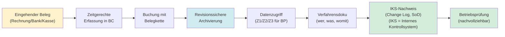
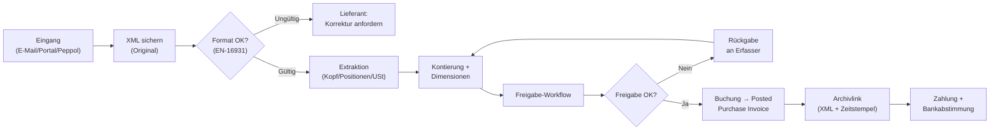
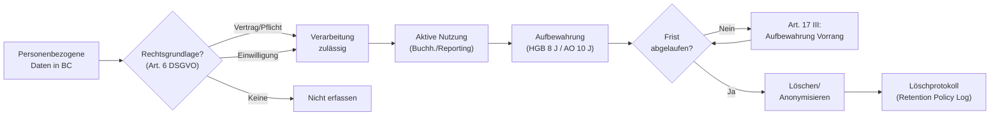
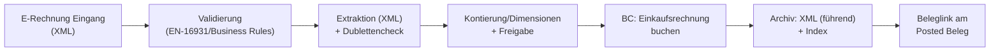
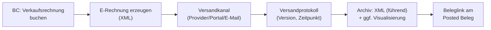
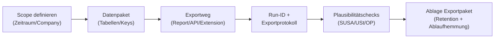
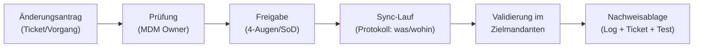

```mermaid
flowchart LR
  A["Rechnungseingang\n(PDF/Scan)"] --> B["Document Capture:\nOCR & Validierung"]
  B --> C["Kontierung &\nDimensionen"]
  C --> D["Freigabe-Workflow"]
  D --> E["BC: Einkaufsrechnung\nbuchen"]
  E --> F["Zahlungsvorschlag\n& Freigabe"]
  F --> G["Bank: Zahlungsdatei/\nÜbermittlung"]
  G --> H["Bankauszug\nimportieren"]
  H --> I["Automatischer\nOP-Ausgleich"]
  I --> J["Bankabstimmung\nabgeschlossen"]
```

# FiBu-Buch 4: Business Central (BC) – Finance-Prozesse & Extension-Landschaft (DACH)

Stand: `15.03.2026` (Struktur und Prozesslogik).  
Hinweis: Funktionsumfang, Bezeichnungen und Lizenzmodelle von Extensions können je nach Version/Release-Wave, Deployment (Auslieferung) (SaaS/On-Prem) und Anbieter-Paket abweichen. Dieses Dokument beschreibt **prozessuale Zielbilder** und **Entscheidungskriterien** – kein verbindliches Produktversprechen.

**Verlässlichkeitsstandard und Rechtsstand**
- Rechtsstand und Link-Prüfung der Primärquellen: `15.03.2026`.
- GoBD-Grundlage: BMF-Schreiben (2. Änderung vom `14.07.2025`, Anwendung ab Veröffentlichung; Vorgängerfassung: 1. Änderung 11.03.2024) berücksichtigt.
- Aufbewahrungsfristen: Verkürzung der Aufbewahrungsfrist für Buchungsbelege auf **8 Jahre** ab `01.01.2025` berücksichtigt (inkl. Hinweis auf Ablaufhemmung und Übergangsregel).
- Für prüfungsrelevante Aussagen werden vorrangig **Primärquellen** genutzt (Gesetze/BMF).
- Quellenstandard (seriös): Rechts-/Pflicht-/Fristen-Aussagen werden nur mit **Gesetzen** (`gesetze-im-internet.de`) und **BMF** belegt; Anbieter-/Produktangaben werden nur aus **offiziellen Herstellerquellen** (z. B. AppSource/Hersteller-Doku/Release Notes) übernommen.
- Bei Abweichungen zwischen Lernskript und Normtext gilt immer der **aktuelle Normtext**.
- Dieses Skript ist eine Lernunterlage und ersetzt keine individuelle Steuer- oder Rechtsberatung.

## Inhaltsverzeichnis (Kurz)
- 1. Ziel dieses Buchs
- 2. Prüfungslogik: Betriebsprüfung & ERP-Compliance (Regeltreue)
- 3. Grundprinzip: Prozess statt Feature (Funktion)
- 4. Recht/GoBD in BC (DACH) [inkl. §4.9A DSGVO, §4.12 E-Rechnung & Quellen]
- 5. Standard-BC Finance (P2P/O2C/R2R + Datenmodell)
- 6. Extension-Auswahl (Fit-Gap (Passungsanalyse))
- 7. Extensions (Continia, COSMO, Integro, OPplus, DATEV)
- 8. Ende-zu-Ende Prozessketten (auditfest)
- 9. Vergleichsmatrix (Continia/OPplus/DATEV/Standard)
- 10. Implementierung (inkl. Cutover (Systemumstellung), Monitoring (Überwachung))
- 11. Anhang (Checklisten, Vorlagen, Verfahrensdoku, Z3 (GoBD-Datenexport für Betriebsprüfung), E‑Rechnung)
- 12. BC Blueprint (BC‑Blaupause) – Template (Vorlage)
- 13. BC Lernpfade (Labs) – Setup → Buchung → Nachweis

## 1. Ziel dieses Buchs

### 1.1 Was du mit diesem Buch kannst

Dieses zweite Buch ergänzt das IHK-orientierte FiBu-Buch um die **ERP- und Prüfungs-/Audit (Prüfung)-Perspektive**:
- Wie laufen typische Finance-Prozesse in **Microsoft Dynamics 365 Business Central**?
- Wo reichen Standardfunktionen – und wann sind **Extensions** sinnvoll?
- Wie sehen End-to-End (Ende-zu-Ende)-Prozesse aus mit:
  - Continia Banking
  - Continia Finance
  - Continia Document Capture
  - Continia Expense Management
  - Continia Document Output
- sowie ergänzend:
  - COSMO Advance Payment (Anzahlungsverwaltung)
  - Integro MDMS (mandantenübergreifende Stammdatensynchronisierung)
  - OPplus (Klasse: Banking/Payments)
  - Sievers/DATEV-Extensions (Klasse: DATEV-Übergabe)
- Wie lassen sich diese Lösungen **vergleichend** zu OPplus, Sievers (DATEV) und ähnlichen DACH-Extensions bewerten?

Ziel ist nicht nur „Feature (Funktion) verstehen“, sondern „in Audit (Prüfung)/Prüfung sauber liefern“: Prozess, Kontrolle, Nachweis.

### 1.2 Zielgruppe
- Bilanzbuchhaltung / Leitung Rechnungswesen (Prozessverantwortung)
- Key User (Schlüsselanwender) (FiBu, Einkauf, Vertrieb)
- BC-Consultants (Fit-Gap (Passungsanalyse), Design (Ausgestaltung), Test, Go-Live (Produktivstart))
- Wirtschaftsprüfer-nahe Rollen (Kontrollen, Nachvollziehbarkeit, Audit Trail (Prüfspur))

### 1.3 Quickstart (Schnellstart): Minimum-Viable-Compliance (Regeltreue) (MVC) in 60 Minuten

Wenn du nur wenig Zeit hast, fokussiere auf diese 10 Nachweise. Wenn die stehen, sind viele Prüfungsfragen „automatisch“ beantwortbar:
1. **Belegkette**: Posted-Belege haben Archivlink/Beleg (Kap. 4.7.2, 11.3, 11.13).
2. **Unveränderbarkeit**: Archiv/DMS-Konzept + Retention (Aufbewahrung)/Legal Hold (Aufbewahrungssperre) (Kap. 7.11, 11.12).
3. **Freigaben/SoD**: Erstellen ≠ Freigeben ≠ Ausführen (Kap. 7.12, 11.6).
4. **Stammdaten-Änderungen**: IBAN/MwSt-Setup nur per Änderungsprozess (Change Process) + Nachweis (Kap. 4.7.2, 11.6).
5. **Z3-Konzept**: Exportpfad + Probeexport + Exportprotokoll (Kap. 11.7, 11.10).
6. **USt-Abstimmung**: VAT Entry ↔ Steuerkonten ↔ UStVA-Paket (Kap. 7.13, 11.13).
7. **E‑Rechnung**: XML führend validiert/archiviert/verlinkt (Kap. 4.9, 7.10, 11.11).
8. **Rules Catalog (Regelverzeichnis)**: Regeländerungen versioniert + Testfälle (Kap. 11.9).
9. **Cutover (Systemumstellung)-Nachweise**: Alt-System-Belegzugriff/Exports gesichert (Kap. 10.3, 11.13).
10. **Quellenlog**: Rechtsstand/Links monatlich nachvollziehbar (Kap. 11.16).

### 1.4 So liest du dieses Buch (Kapitel-Pattern)

Damit es in Projekten schnell nutzbar ist, sind viele Kapitel nach dem gleichen Muster aufgebaut:
- **Zweck**: Was löst das Modul/der Prozess?
- **Prozess (Zielbild)**: End-to-End (Ende-zu-Ende) Schrittfolge.
- **Kontrollen**: Was muss aus GoBD/Prüfungssicht „sitzen“?
- **Einrichtungsobjekte (Setup-Objekte)**: Welche Arten von Einstellungen/Regeln sind typisch (ohne menü-/versionskritische Pfade)?
- **Prüfungsfalle / Prüfungstipp**: Was knallt in der BP am häufigsten – und wie vermeidest du es?
- **UAT (User Acceptance Testing = Benutzerabnahmetest)-Tests**: Minimale Testfälle, die Nachweisfähigkeit beweisen.
- **Nachweise**: Welche Artefakte werden abgelegt (Kap. 4.7.3, Kap. 11.13)?

## 2. Prüfungslogik: So denken Betriebsprüfung & ERP-Compliance (Regeltreue)

Die Betriebsprüfung prüft nicht „Feature (Funktion)-Listen“, sondern **Nachweise**:
- Ist der Belegfluss vollständig und plausibel?
- Sind Änderungen nachvollziehbar (Wer/Was/Wann/Warum)?
- Sind Daten unveränderbar bzw. korrekt über Storno/Neu-Buchung korrigierbar?
- Könnt ihr Z1/Z2/Z3 organisatorisch und technisch erfüllen?

Merksatz:
- Eine GoBD-taugliche Lösung ist immer das Zusammenspiel aus **Prozess + BC-Setup (BC-Einrichtung) + Rollen + Archiv + Exportkonzept**.

Typische Prüfungsfalle:
- „Wir haben ein Tool/Extension“ wird mit „wir haben Nachweise“ verwechselt.

Prüfungstipp:
- Denke in Artefakten: **Beleg**, **Workflow-Historie**, **Protokoll/Log**, **Exportpaket**, **Abstimmblatt** (Kap. 11.13).

Arbeitsprinzip für Bewertungen im Projekt:
1. Juristische Einordnung (HGB/AO/UStG).
2. Frist & Pflicht (6/8/10 Jahre, Ablaufhemmung, Sonderfälle).
3. GoBD-Anforderung (Nachvollziehbarkeit, Unveränderbarkeit, Verfahrensdoku, Datenzugriff).
4. BC-Systemperspektive (Belegfluss, Audit-Trail (Prüfspur)/Change Log (Änderungsprotokoll), Archiv, Nummernserien, Berechtigungen).
5. Risikobewertung (Prüfungsrisiko, Manipulations-/Fehlerrisiko, Prozessbruch).
6. Konkrete Maßnahmen (Setup, Rollen, Workflows, DMS/Archiv, Tests, Verfahrensdoku).

## 3. Grundprinzip: Prozess statt Feature (Funktion)

Dieses Kapitel legt den gedanklichen Rahmen für das gesamte Buch fest. Bevor du eine Extension einführst, brauchst du ein klares Bild davon, welchen Prozess sie verbessern soll – und wie du beweist, dass das gelungen ist.

**Arbeitsprinzip (6 Schritte):**
1. **Recht und Pflicht:** Welche gesetzliche Anforderung (GoBD, HGB, AO, UStG) oder welches Compliance (Regeltreue)-Risiko treibt den Bedarf?
2. **Frist und Frequenz:** Wie oft tritt der Prozess auf? Monats-/Tagesgeschäft oder Ausnahmefall?
3. **GoBD-Linse:** Was muss nachvollziehbar, unveränderbar, vollständig und exportierbar sein?
4. **BC-Systembild:** Welche Standard-Objekte (Tables, Pages, Reports) deckt BC bereits ab – und wo sind die Lücken?
5. **Risikoprofil:** Was ist der worst case, wenn der Prozess falsch läuft (Betriebsprüfung, Haftung, Falschbuchung)?
6. **Maßnahmenset:** Welche Extension + Konfiguration + Kontrollen + Nachweise schließen die Lücke?

**Was eine Extension leisten muss – die 4 Kriterien:**
- Sie löst einen **klaren Prozessschmerz** (Zeit, Fehler, Compliance (Regeltreue), Transparenz).
- Sie **verbessert Kontrollen** (Vier-Augen-Prinzip, Freigaben, Protokolle, Prüfspuren).
- Sie **erhöht Datenqualität** (Stammdaten, Belegdaten, Zuordnungen konsistent).
- Sie **überlebt SaaS-Upgrades** (saubere Integration, wenig Custom-Code, klare Objektstrategie).

**Praxisbeispiel – „Wir brauchen Continia Document Capture”:**

| Schritt | Antwort |
|---|---|
| 1. Recht/Pflicht | GoBD: Belegkette lückenlos + unveränderbar; AO § 147: Aufbewahrung 8 Jahre |
| 2. Frist/Frequenz | täglich, ca. 80 Eingangsrechnungen/Monat |
| 3. GoBD-Linse | PDF-Original nachvollziehbar am Posted-Beleg, Freigabe protokolliert, OCR (Optical Character Recognition = automatische Texterkennung)-Log vorhanden |
| 4. BC-Systembild | `Vendor Ledger Entry`, `VAT Entry`, `G/L Entry` → vorhanden; Belegkette → Lücke ohne Extension |
| 5. Risikoprofil | BP kann Belegkette nicht nachvollziehen → Versagung Vorsteuerabzug möglich |
| 6. Maßnahmenset | Document Capture + Dublettenregel + Workflow + DMS-Archivlink + Kontrollpunkte (Kap. 7.1) |

Praxisregel:
- Starte immer mit dem Prozess und dem GoBD-Nachweis-Ziel. Die Extension ist das Werkzeug – nicht das Ziel.

Prüfungsfalle:
- Extension wird eingeführt, weil „der Anbieter es empfohlen hat” – ohne Prozessdokumentation, ohne Testfall, ohne Nachweisstrategie. Das Ergebnis: System läuft, aber Betriebsprüfung findet keine Belegkette.

## 4. Recht, GoBD & Prüfungslogik in BC (DACH)

Dieses Kapitel ist die „Compliance (Regeltreue)-Schablone“ für alle folgenden Prozesskapitel.

### 4.1 Rechtsgrundlagen (Kurz)
- **HGB §257**: Aufbewahrung von Handelsbüchern, Inventaren, Eröffnungsbilanz, Jahresabschlüssen, Lageberichten, Buchungsbelegen und Handelsbriefen.  
- **AO §147**: Steuerliche Aufbewahrungspflichten und **Datenzugriff** der Finanzverwaltung.  
- **GoBD** (BMF-Schreiben vom 28.11.2019, 2. Änderung vom 14.07.2025; Vorgänger: 1. Änderung 11.03.2024): Anforderungen an Ordnungsmäßigkeit, Nachvollziehbarkeit, Unveränderbarkeit, Verfahrensdokumentation und Datenzugriff im digitalen Umfeld. Die 2. Änderung adressiert insbesondere E-Rechnungs-XML-Archivierung, OCR-Daten, Z2-Zugriff (§ 147 Abs. 6 AO) und Zahlungsdienstleister.

Grundsatz für die Praxis:
- Wenn mehrere Normen greifen, wird i. d. R. **die strengere Anforderung** (längere Frist / höheres Schutzniveau) umgesetzt.

### 4.2 Aufbewahrungsfristen: 6 / 8 / 10 Jahre (Praxis-Matrix)

> Fristen sind inhaltlich ähnlich, aber nicht deckungsgleich. Für FiBu- und Prüfungsdesign ist entscheidend: **Welche Belegart?** und **welcher Rechtskreis?**

Seit **01.01.2025** gelten in Deutschland verkürzte Aufbewahrungsfristen für **Buchungsbelege** (von 10 auf **8 Jahre**) – sowohl im Handelsrecht (HGB) als auch im Steuerrecht (AO). Die Regel gilt grundsätzlich für Unterlagen, deren alte 10-Jahres-Frist am **31.12.2024** noch nicht abgelaufen war.

| Kategorie (vereinfachend) | Typische Beispiele | Handelsrecht (HGB §257) | Steuerrecht (AO §147) | Praxisregel |
|---|---|---:|---:|---|
| Jahresabschluss-Unterlagen | Eröffnungsbilanz, Jahresabschluss, Lagebericht | 10 Jahre | (i. d. R. ebenfalls 10 Jahre, soweit steuerlich relevant) | **10 Jahre** |
| Bücher/Grundaufzeichnungen/Orga-Unterlagen | Hauptbuch/Nebenbücher, Journale, Arbeits-/Organisationsanweisungen | 10 Jahre | 10 Jahre | **10 Jahre** |
| Buchungsbelege | Eingangs-/Ausgangsrechnungen, Kassenbelege, Bankbelege, Buchungsanweisungen | 8 Jahre | 8 Jahre | **8 Jahre**, aber „Ablaufhemmung“ beachten (z. B. laufende BP/Einspruch) |
| Handels-/Geschäftsbriefe | Korrespondenz mit Kunden/Lieferanten, E-Mails mit Geschäftsinhalt | 6 Jahre | 6 Jahre | **6 Jahre** |
| Rechnungen (USt) | Ein- und Ausgangsrechnungen i. S. d. UStG | i. d. R. als Buchungsbeleg 8 Jahre | i. d. R. als Buchungsbeleg 8 Jahre | **8 Jahre** nach §14b UStG (aber ggf. länger wegen §147 AO) |

Wichtig für digitale Belege:
- Aufzubewahren ist nicht nur „das PDF“, sondern der **ursprüngliche Beleginhalt** im **revisionssicheren Kontext** (Index/Metadaten, Belegkette, Nachvollziehbarkeit).
- Für **E‑Rechnungen** (z. B. XRechnung/ZUGFeRD) ist die **strukturierte Komponente (XML)** i. d. R. der maßgebliche „Rechnungsinhalt“. Eine bildhafte Darstellung (PDF/Viewer) kann zusätzlich zur Lesbarkeit aufbewahrt werden; enthält sie zusätzliche steuerlich relevante Informationen, sind diese ebenfalls aufzubewahren (BMF‑FAQ E‑Rechnung i. V. m. GoBD/UStG).

Ablaufhemmung (prüfungspraktisch kritisch):
- Die Aufbewahrungsfrist läuft steuerlich **nicht ab**, soweit und solange Unterlagen für Steuern von Bedeutung sind, für die die Festsetzungsfrist noch nicht abgelaufen ist (AO §147 Abs. 3 Satz 5). Das betrifft typischerweise laufende Außenprüfungen, offene Bescheide, Einsprüche/Klagen – und kann im Einzelfall dazu führen, dass du faktisch wieder **> 8 Jahre** aufbewahren musst.

Sonderfälle:
- Bestimmte Unternehmen unter BaFin-Aufsicht haben teils abweichende/zeitversetzte Regeln; prüfe dies im Projekt (HGB §257 Abs. 4; Übergangsvorschriften im Steuerrecht).

### 4.3 „Buchungsbeleg“ vs. „Handelsbrief“ (prüfungs- und systemrelevant)
Für BC-Design (Ausgestaltung) (Archiv, Workflows, DMS) brauchst du eine klare Klassifikation:
- **Buchungsbelege**: Alles, was **eine Buchung begründet/nachweist** (Rechnung, Bankbeleg, Kassenbeleg, interne Buchungsanweisung).
- **Handelsbriefe**: Korrespondenz zur **Anbahnung, Durchführung, Rückabwicklung** eines Geschäfts (inkl. E-Mail-Verkehr mit Geschäftsbezug).

Typischer Fehler:
- „Wir archivieren nur gebuchte Rechnungen.“ → Risiko, wenn Freigaben/Abstimmungen/Belegkette außerhalb des Systems passieren und nicht als Nachweis mitgesichert werden.

### 4.4 GoBD-Kernanforderungen (als Prüfliste)

**GoBD-Compliance-Kreislauf in BC:**



Minimal, prüfungsfest:
- **Nachvollziehbarkeit/Nachprüfbarkeit**: Wer hat was wann erfasst/geändert/freigegeben/gebucht?
- **Vollständigkeit**: Keine „Schattenbuchführung” (Excel, E-Mail-Workflows) ohne dokumentierten Kontrollprozess.
- **Richtigkeit/zeitgerechte Erfassung**: Prozesse für zeitnahe Erfassung und klare Abgrenzungen.
- **Unveränderbarkeit**: Belege dürfen nicht stillschweigend überschrieben werden; Änderungen müssen **protokolliert** und der Originalzustand muss rekonstruierbar sein.
- **Verfahrensdokumentation**: Soll-Ist-Abgleich, Systembeschreibung, Kontrollen, Verantwortlichkeiten, Archiv/Export.

#### 4.4.1 Ersetzendes Scannen (Praxislogik, GoBD-nah)

Ziel: Papierbelege werden nach dem Scan vernichtet, ohne dass Beweiskraft/Nachvollziehbarkeit verloren geht.

Mini-Schema (bewährt):
1. **Eingang** (Post, Übergabe, Kasse) → Verantwortlicher + Eingangsstempel/Index
2. **Scan** (Qualität, Vollständigkeit, Lesbarkeit) → Datei erzeugen (PDF/TIFF, ggf. mit OCR)
3. **Indexierung** (Belegart, Belegdatum, Partner, Betrag, Rechnungsnr., Company, ggf. Leistungsdatum)
4. **Qualitätskontrolle** (Stichprobe oder 4‑Augen je nach Risiko)
5. **Unveränderbarkeit** sicherstellen (Archiv/DMS, WORM/gleichwertig, Protokoll)
6. **Verknüpfung** zum Prozess: Beleglink am Posted-Beleg/Entry in BC
7. **Vernichtung** Papier nach dokumentierter Freigabe (mit Ausnahmeprozess)

Kontrollen (Minimum):
- Scan ist vollständig (alle Seiten, Anlagen) und lesbar (auch Stempel/Handnotizen, sofern steuerlich relevant).
- Index ist eindeutig und auffindbar (Suche nach Rechnungsnr./Partner/Betrag möglich).
- Originaldatei ist unveränderbar archiviert; Änderungen erfolgen nur über neue Version mit Protokoll.
- Vernichtung passiert erst nach erfolgreicher Archivierung + Qualitätskontrolle.

Prüfungsfalle:
- Papier wird vernichtet, obwohl Scan/Index/Archivierung nicht sauber abgeschlossen ist → Beleglücke.

Prüfungstipp:
- Nutze das SOP-Template (Vorlage) Kap. 11.26 und lege monatlich eine Scan-Stichprobe als Nachweis im Monatsordner ab (Kap. 11.13).

### 4.5 Datenzugriff der Finanzverwaltung (Z1 / Z2 / Z3)
AO §147 Abs. 6 beschreibt drei Zugriffsmöglichkeiten:
- **Z1 (unmittelbarer Zugriff)**: Prüfer greift im System lesend auf Daten zu (typisch: Rollen/Benutzer, Auswertungen).
- **Z2 (mittelbarer Zugriff)**: Unternehmen führt Auswertungen im System nach Vorgabe des Prüfers aus.
- **Z3 (Datenträgerüberlassung)**: Export/Übergabe der steuerrelevanten Daten in einem auswertbaren Format (IDEA (Interactive Data Extraction and Analysis = Prüfsoftware der Finanzverwaltung)/GDPdU (Grundsätze zum Datenzugriff und zur Prüfbarkeit digitaler Unterlagen)-Logik).

Mini-Schema Z3 (prüfungsfest, unabhängig vom Tool):
1. **Scope (Geltungsbereich)** definieren (welche Prozesse/Daten sind steuerlich relevant?).
2. **Datenpaket** definieren (Tabellen/Views/Reports, Zeitraum, Felder, Schlüssel).
3. **Exportweg** festlegen (BC-Export/Report/API/Extension) + Reproduzierbarkeit sichern.
4. **Datenbeschreibung** erstellen (Keys, Feldlogik, Mapping, USt-Setup).
5. **Integrität** sichern (vollständige Extraktion, Plausibilitätschecks; ggf. Hash/Signatur auf Exportdateien).
6. **Probeexport** durchführen und dokumentieren (mind. 1x vor der Prüfung).

Prüfungstaugliche BC-Fragen:
1. Welche Daten gelten bei euch als „steuerlich relevant“ (Scope (Geltungsbereich))?
2. Wie erfüllt ihr Z1/Z2 in SaaS (Rollen, Auswertungen, Protokolle)?
3. Wie erfüllt ihr Z3 (Exportkonzept, Format, Vollständigkeit, Nachvollziehbarkeit)?

### 4.6 Verfahrensdokumentation: Mindestinhalte (GoBD-tauglich)

Eine belastbare Verfahrensdokumentation ist kein Roman, sondern ein **prüfbarer Bauplan**. Die GoBD (BMF-Schreiben, 2. Änderung 14.07.2025, Rz. 30–38) fordern, dass jedes IT-gestützte Buchführungssystem durch eine aktuelle, vollständige Verfahrensdokumentation beschrieben ist. Fehlt sie oder ist sie veraltet, gilt das als **formaler Mangel** – mit Folgen für die Beweiskraft der Buchführung (§ 158 AO).

**Fünf Pflichtbestandteile (GoBD Rz. 31):**

1. **Allgemeine Beschreibung**: Prozesslandkarte (P2P (Procure-to-Pay (Beschaffen-bis-Zahlen))/O2C (Order-to-Cash (Auftrag-bis-Zahlung))/R2R (Record-to-Report (Buchen-bis-Melden))), eingesetzte Systeme (BC, DMS, OCR, DATEV), Organisations- und Verantwortungsstruktur (RACI (Responsible, Accountable, Consulted, Informed)).
2. **Anwenderdokumentation**: Schrittfolgen je Prozess (mit Screenshots oder Ablaufschemas), Freigaberegeln, Ausnahmebehandlung, Vertretungsregelungen, Schulungsstand.
3. **Technische Systemdokumentation**: Schnittstellen (Bank-EBICS (Electronic Banking Internet Communication Standard (Bankprotokoll)), DMS-Connector, OCR-API, DATEV-Export), Datenflüsse (Richtung, Format, Frequenz), Protokolle und Fehlermanagement.
4. **Betriebsdokumentation**: Betriebsverantwortung (SaaS-Modell → Microsoft-Betrieb + eigenes Berechtigungskonzept), Monitoring (Überwachung), Release-/Change-Management (CR-ID-Pflicht (Kap. 10.2)), Datensicherung (On-Prem) bzw. SLA-Nachweis (SaaS).
5. **Internes Kontrollsystem (IKS)**: Kontrollen je Prozess, Frequenzen (täglich/monatlich/jährlich), Nachweisform (Log, Screenshot, 4-Augen-Protokoll), Eskalationsweg bei Abweichung.

**Praxisbeispiel – Dokumentenstruktur für ein mittelständisches Unternehmen:**

| Dokument | Inhalt | Aktualisierungspflicht |
|---|---|---|
| `VD-01-Prozesslandkarte.pdf` | Übersicht P2P/O2C/R2R mit Systemgrenzen | Bei jedem Releaseupgrade |
| `VD-02-BC-Konfiguration.xlsx` | VAT Posting Setup, Buchungsgruppen, Nummernserien | Bei jeder Konfigurationsänderung |
| `VD-03-Benutzer-Rollen.pdf` | Rollenbeschreibung, SoD-Matrix, aktive Benutzer | Quartalsmäßig + bei Personalwechsel |
| `VD-04-Schnittstellen.pdf` | EBICS-Verbindung, OCR-API, DATEV-Exportweg | Bei Schnittstellenänderung |
| `VD-05-IKS-Katalog.xlsx` | Alle Kontrollen mit Frequenz, Nachweis, Verantwortlichem | Jährlich + bei Prozessänderung |
| `VD-06-Änderungshistorie.md` | CR-ID, Datum, Beschreibung, Tester, Freigeber | Bei jedem Change |

> **MVC (Minimum-Viable-Compliance (Regeltreue)):** Für kleine Unternehmen genügt als Sofortmaßnahme: (1) eine Systemübersicht auf einer DIN-A4-Seite, (2) je Hauptprozess ein bebildertes Schrittdokument, (3) ein IKS-Minimallog mit Datum + Prüfer + OK/NOK.

**BC (Business Central (ERP-System))-Bezug:**

Tell Me – Suchbegriffe: `Change Log Setup`, `User Setup`, `Permission Sets`, `Dimension Setup`, `VAT Posting Setup`, `No. Series`

- **Schritt 1 – Change Log aktivieren:** `Change Log Setup` → Felder für Kreditoren-Bankdaten, VAT-Setup, Nummernserien auf Protokollierung setzen (Kap. 5.1).
- **Schritt 2 – Berechtigungskonzept dokumentieren:** `User Setup` → alle aktiven Benutzer mit zugewiesenen `Permission Sets` exportieren (Excel-Export via `Users`-Liste) → als `VD-03-Benutzer-Rollen.xlsx` ablegen.
- **Schritt 3 – Konfigurationsexport:** `Configuration Packages` (`Konfigurationspakete`) → relevante Tabellen (VAT Posting Setup, General Posting Setup, No. Series) als `.rapidstart`-Datei exportieren und datiert archivieren.
- **Schritt 4 – Versionierung sichern:** Jede Konfigurationsänderung mit CR-ID (Kap. 10.2) versehen; Änderungshistorie in `VD-06-Änderungshistorie.md` fortschreiben.

Prüfungsfalle:
- Verfahrensdokumentation ist vorhanden, aber **veraltet** (z. B. noch auf BC 20, Unternehmen betreibt BC 24). Prüfer wertet das als lückenhaft → Beweiskraft gefährdet. Faustregel: **Versionsnummer und Datum** in jedes Dokument.

Prüfungstipp:
- Die Verfahrensdokumentation muss **vor Ort** (physisch oder per gesichertem Netzwerkzugriff) innerhalb von Minuten vorzeigbar sein (GoBD Rz. 35). Ein Link auf einen Sharepoint-Ordner ohne Zugangsdaten beim Prüfer reicht nicht.

Kontrollpunkte:
- [ ] Verfahrensdokumentation vollständig vorhanden: alle 5 Pflichtbestandteile (Rz. 31) abgedeckt?
- [ ] Aktualität gesichert: Versionsnummer + Datum in jedem Dokument, jünger als letzter Release-Stand?
- [ ] Change Log aktiv auf kritischen Feldern: Kreditoren-IBAN, VAT-Setup, Nummernserien?
- [ ] Benutzer-Rollen-Dokumentation aktuell: letzte Prüfung nicht älter als 3 Monate?
- [ ] IKS-Katalog vollständig: jede Kontrolle mit Frequenz + Nachweis + Verantwortlichem?
- [ ] Verfahrensdokumentation sofort vorlegbar: Speicherort bekannt, Zugang ohne IT-Ticket möglich?

Systemspur (Datenobjekte, i. d. R. relevant für Z3/IDEA-Logik):
- `Change Log Entry` (Table 405): Protokoll jeder Stammdaten-/Konfigurationsänderung – Kernobjekt der Verfahrensdokumentation
- `User` (Table 2000000120) + `Permission Set` (Table 2000000004): Benutzer-Rollen-Dokumentation in BC
- `Config. Package` / `Config. Package Table` (Tables 8623/8614): Konfigurationsexport für Versionierungsnachweis
- `No. Series` (Table 308) + `No. Series Line` (Table 309): Nummernserien-Setup – Vollständigkeitsnachweis

### 4.7 BC-Systemperspektive: Welche Standardfunktionen stützen GoBD-Anforderungen?

> BC ist ein ERP – GoBD-Konformität entsteht durch **Konfiguration + Rollen + Prozessdisziplin + DMS/Archive**.

| GoBD-Anforderung | BC-Mechanik (Standard) | Typische Lücke | Praxis-Maßnahme |
|---|---|---|---|
| Nachvollziehbarkeit | Benutzer-/Zeitstempel in Einträgen, Beleg-/Buchungsnummern, Protokolle/Workflows (je nach Nutzung) | Freigaben passieren „neben dem System“ | Freigaben strikt im Workflow + Archivlink am Beleg |
| Unveränderbarkeit | „Posted“ Daten sind grundsätzlich nicht „einfach editierbar“; Korrekturen über Storno/Neu-Buchung | Anhänge/Belege liegen in Mailbox/Sharepoint ohne Schutz | DMS/Archiv mit WORM-/Unveränderbarkeitskonzept + klare Ablagepflicht |
| Vollständigkeit | Nummernserien, Buchungsperioden, Pflichtfelder/Validierungen | Nummernserien „Lücken“ durch manuelle Nummern/Abbrüche | Nummernserien-Policy + Monitoring (Überwachung) + begründete Lückenführung |
| Zeitgerechte Erfassung | Journale/Stapelerfassung, definierte Perioden/Posting-Policies | „Buchen auf Zuruf“ am Monatsende ohne Belegkette | Cut-off-Regeln + Abschlusskalender + Checklisten |
| Datenzugriff Z1/Z2/Z3 | Rollen, Auswertungen, Exportkonzept (je nach Lösung) | Kein standardisiertes IDEA/GDPdU-Exportpaket „out of the box“ | Z3-Konzept: definierte Datenpakete + Exportweg (Extension/BI/API) + Test mit Prüfszenario |

#### 4.7.1 Kritische BC-Bausteine (praxisnah, prüfungsorientiert)

**A) Belegfluss & Korrekturlogik (Posted vs. Unposted)**
- Prüfer erwarten: „Was ist der **Originalbeleg**, was ist die **Buchung**, und wie werden **Korrekturen** gemacht?“
- GoBD-tauglich ist i. d. R.: Korrekturen über **Storno-/Gegenbuchung** und erneute korrekte Buchung – nicht über „Überschreiben“.
- Verfahrensdoku-Pflicht: Beschreibung, wie ihr mit
  - Storno/Cancel,
  - Gutschriften,
  - nachträglichen Skonti/Rabatten,
  - Periodenabschluss-Sperren
  umgeht.

**B) Audit-Trail (Prüfspur) im Tagesgeschäft (Wer? Was? Wann? Warum?)**
- Kritische Bereiche, die in der Praxis oft Change-Log (Änderungsprotokoll)/Protokollierung brauchen:
  - Kreditoren/Debitoren-Stamm (Bankverbindungen, Zahlungsbedingungen, USt-Setup)
  - Nummernserien-/Belegnummern-Setup
  - Buchungsgruppen / MwSt.-Setup / Kontenfindung
  - Dimensionen/Default-Dimensionen
  - Benutzer/Rollen (Berechtigungen)
- Prüfungsrisiko: „Master-Data-Manipulation“ (z. B. IBAN geändert kurz vor Zahlung) ohne nachvollziehbare Freigabe/Protokoll.

**C) Nummernserien und „Lücken“**
- Lückenfreie Nummernserien sind nicht automatisch „GoBD = erfüllt“, aber Nummernlogik ist ein zentraler Prüfpfad für Vollständigkeit.
- Praxis-Maßnahmen:
  - Nummernserien-Policy (wer darf, wann, wie) + Monitoring (Überwachung)
  - definierter Prozess zur Begründung und Dokumentation von Abbrüchen/Lücken (z. B. stornierte Entwürfe)

**D) Dokumentenanhänge / Incoming Documents / Archiv-Verlinkung**
- Ziel: Jede Buchung soll auf einen **unveränderbaren Beleg** zurückführbar sein (inkl. Genehmigungshistorie).
- Praxis-Maßnahmen:
  - „Kein Buchen ohne Beleg“ als Regel (systemisch oder organisatorisch)
  - klare Ablage: Wo liegt das Original (DMS/Archiv), wie ist die Verknüpfung im BC-Beleg/Eintrag?
  - E‑Rechnung: XML als führender Rechnungsinhalt (BMF‑FAQ E‑Rechnung; UStG/GoBD) + konsistente Indexierung

**E) Periodenabschluss & Buchungszeiträume**
- Prüfer mögen klare Sperren: „Bis wann darf gebucht werden?“
- Praxis-Maßnahmen:
  - definierte Buchungszeiträume / Cut-off-Prozess
  - Abschlusskalender + Checklisten (R2R)
  - dokumentierte Ausnahmeprozesse („Nachbuchungen“)

**F) Z3-/IDEA-/GDPdU-Exportkonzept (SaaS vs. On-Prem)**
- Erwartung aus Prüfungssicht: Ein **reproduzierbarer** Export steuerlich relevanter Daten, inkl. Datenmodellbeschreibung.
- Minimaler Datenumfang (typisch, je nach Scope (Geltungsbereich)):
  - Hauptbuch: `G/L Entry`, `G/L Register`
  - Debitoren/Kreditoren: Ledger Entries + ggf. detaillierte Ausgleichstabellen
  - Umsatzsteuer: `VAT Entry` (inkl. Setups/Mappings)
  - Bank: `Bank Account Ledger Entry`, Bankabstimmungen/Auszüge (je nach Lösung)
  - Waren/Bestände: `Item Ledger Entry`, `Value Entry` (falls relevant)
  - Anlagen: `FA Ledger Entry` (falls relevant)
  - Stammdaten/Setup: Kontenplan, Posting Setups, Dimensionen, Benutzer/Rollen (nach Prüfumfang)
- Betriebsmodell:
  - **On-Prem**: Datenbank-/Backup- und Exportpfade sind anders als in SaaS.
  - **SaaS**: Export erfolgt typischerweise über standardisierte Exporte, Berichte, APIs/OData oder geprüfte Add-ons; der Exportweg muss dokumentiert und getestet sein.

#### 4.7.2 Kritische BC-Einstellungen (Checkliste, auditnah)

Merksatz:
- Prüfungsrisiko entsteht selten durch „falsche Software“, sondern durch **falsche Defaults**, zu breite Rechte und fehlende Nachweise.

**A) Buchungssteuerung**
- Buchungszeiträume/Posting-Policies definiert (wer darf in welche Perioden buchen?)
- Ausnahmeprozess „Nachbuchung“ dokumentiert (Begründung, Freigabe, Nachweisablage)

**B) Nummernserien & Beleglogik**
- Nummernserien-Strategie dokumentiert (Belegarten, Verantwortliche, Lückenhandling)
- Manuelle Nummernvergabe nur begründet und kontrolliert (sonst Vollständigkeitsrisiko)

**C) Kontenfindung & Steuer**
- Kontenplan, Buchungsgruppen, MwSt.-Setup/Steuerschlüssel sind versioniert und nur mit Änderungsprozess (Change Process) änderbar
- USt-Abstimmungspfad dokumentiert: `VAT Entry` ↔ Steuerkonten ↔ UStVA-Prozess

**D) Dimensionen & Kostenrechnung**
- Pflichtdimensionen definiert (wo muss Kostenstelle/Projekt gesetzt sein?)
- Default-Dimensionen dokumentiert (Stamm/Beleg) + Ausnahmen geregelt

**E) Berechtigungen & SoD**
- Rollenmodell dokumentiert (Erfassen vs. Freigeben vs. Ausführen)
- Admin-/Superuser-Zugänge minimiert + Notfallzugang geregelt (Break-Glass-Prozess)
- Regelmäßiger Berechtigungsreview (mind. quartalsweise) inkl. Nachweis

**F) Änderungsnachweise (Audit Trail (Prüfspur))**
- Kritische Stammdatenänderungen sind nachvollziehbar (insb. IBAN, Zahlungsbedingungen, MwSt.-Setups)
- Regelwerke (Matching, Kontierung, Output, Export) werden mit Datum/Owner (Verantwortlicher)/Begründung geändert

**G) Belegablage & Archiv**
- Klar geregelt, was „führend“ ist (E‑Rechnung: XML) und wie es verlinkt wird
- Archiv/DMS erfüllt Unveränderbarkeit + Retention (Aufbewahrung) (6/8/10 Jahre + Ablaufhemmung)
- Alt-System-Belegzugriff für Fristen gesichert (Cutover (Systemumstellung)-Risiko)

#### 4.7.3 Nachweisartefakte (Map): Was du wirklich brauchst

Merksatz:
- In der Prüfung zählt nicht „wir haben es so gemacht“, sondern „wir können es **zeigen**“.

| Artefakt | Wofür gebraucht? | Wo im Buch? | Praxisablage |
|---|---|---|---|
| Archivlink am Posted-Beleg | Belegkette / Unveränderbarkeit | Kap. 7.11, 11.3 | Kap. 11.13 |
| Workflow-/Freigabehistorie | SoD, Genehmigungen | Kap. 7.12 | Kap. 11.13 |
| Rules Catalog (Regelverzeichnis) | Nachvollziehbarkeit von Regeländerungen | Kap. 11.9 | Kap. 11.13 |
| USt-Paket (Report + Abstimmung) | USt-Prüfung, Plausibilitäten | Kap. 7.13 | Kap. 11.13 |
| E‑Rechnung-Check (XML + Validierung) | E‑Rechnung Nachweisfähigkeit | Kap. 4.9, 7.10, 11.11 | Kap. 11.13 |
| Z3-Exportpaket + Protokoll | Datenzugriff (Z3) | Kap. 11.7, 11.10 | Kap. 11.13 |
| Cutover (Systemumstellung)-Nachweisordner | Alt-System/Fristen, Übergang | Kap. 10.3 | Kap. 11.13 |

#### 4.7.4 BC-Standard-Nachweise (ohne Extensions, ohne Menüpfade)

Ziel: Du weißt, welche **Systemspuren** es in BC typischerweise gibt – und wie du daraus auditfeste Nachweise machst.

Merksatz:
- **Entries sind die Wahrheit** (Buchungsfußabdruck). Dokumente/Layouts sind nur die Hülle.

**A) Bewegungsdaten („Entries“ – prüfbarer Fußabdruck)**
- Hauptbuch: `G/L Entry`, `G/L Register` (Buchungsnummernlogik/Posting-Chargen)
- Debitor/Kreditor: `Customer Ledger Entry`, `Vendor Ledger Entry` + detaillierte Ausgleichsdaten
- Umsatzsteuer: `VAT Entry` (inkl. Setup-Logik/MwSt.-Posting)
- Bank: `Bank Account Ledger Entry` + Bankabstimmungen/Auszüge (prozessabhängig)
- Lager/Anlagen/Projekte: je nach Scope (Geltungsbereich) (`Item Ledger Entry`, `Value Entry`, `FA Ledger Entry`, Projekt-/Job-Entries)

Was du daraus ableitest:
- Vollständigkeit (Register/Nummernlogik, Zeiträume)
- Nachvollziehbarkeit (Dokumentnummern, Gegenkontenlogik, Buchungsdatum)
- Abstimmungen (SUSA (Summen- und Saldenliste), OP (Offene Posten = unbezahlte Rechnungen), VAT-Logik)

**B) Änderungsnachweise (Stammdaten/Setup)**
- BC kann (konfiguriert) Änderungen protokollieren (typisch: **Change Log (Änderungsprotokoll) Entries** für ausgewählte Tabellen/Felder).
- Audit (Prüfung)-tauglicher Mindestinhalt eines Änderungsnachweises:
  - Objekt (Tabelle/Datensatz/Primärschlüssel)
  - Feld/Alter Wert/Neuer Wert
  - User/Datum/Uhrzeit
  - Ticket (Vorgang)/CR‑ID als Begründungslink (Kap. 11.19)

Prüfungsfalle:
- Change Log (Änderungsprotokoll) ist entweder gar nicht aktiv oder protokolliert „zu viel/zu wenig“ → entweder keine Nachweise oder Datenflut ohne Relevanz.

Prüfungstipp:
- Protokolliere mindestens: IBAN/Zahlungsdaten, MwSt.-Setup/Posting-Gruppen, Nummernserien-relevantes Setup, Rollen/Admin.

**C) Freigaben (Workflow-Historie)**
- Für Freigabeprozesse ist entscheidend, dass du eine **Freigabehistorie** exportieren/ablegen kannst:
  - wer genehmigt hat,
  - wann,
  - welchen Betrag/Beleg,
  - und ob Stellvertretung/Eskalation genutzt wurde.

**D) Belegverknüpfung (Archivlink)**
- Minimalnachweis je Posted-Beleg:
  - führendes Dokument (bei E‑Rechnung: XML),
  - Index (Auffindbarkeit),
  - Link vom Posted-Beleg/Entry zum Archiv.

**E) Export-/Reproduzierbarkeit**
- Ein Export ist auditfest, wenn er:
  - Scope (Geltungsbereich)/Filter offenlegt,
  - wiederholbar ist,
  - und Checks (SUSA/USt/OP) dokumentiert (Kap. 11.10).

#### 4.7.5 Einrichtung in BC (praktisch): „Tell Me“ statt Menüpfade

Ziel: Jede Einrichtung ist auch ohne perfekte Menükenntnis nachvollziehbar – selbst wenn sich Oberflächen zwischen Versionen ändern.

Merksatz:
- In BC arbeitest du im Projektalltag über **Tell Me** (Suche) mit stabilen Objekt-/Seitennamen, nicht über Menüpfade.

Praxis:
1. Öffne die BC‑Suche („Tell Me“) und suche nach dem Objekt/Seitennamen (z. B. „VAT Posting Setup“).
2. Dokumentiere Setup-Änderungen als **CR‑ID** (Kap. 11.19) + Update im Rules Catalog (Regelverzeichnis) (Kap. 11.9) + Nachweisablage (Kap. 11.13).
3. Teste Änderungen immer mit einem **UAT‑Testfall** (Kap. 11.2), bevor du produktiv buchst.

Typische Suchbegriffe (DACH‑Finance):
- `General Ledger Setup` (Buchungszeiträume/Grundlagen)
- `User Setup` (buchen in Perioden, Berechtigungssteuerung)
- `VAT Posting Setup` (USt‑Buchungsmatrix)
- `VAT Statements` / USt‑Reports (Auswertung, je nach Setup)
- `No. Series` (Nummernkreise)
- `Dimensions` / `Default Dimensions`
- `Customer Posting Groups`, `Vendor Posting Groups`, `General Posting Setup`
- `Bank Accounts`, `Payment Methods`, `Payment Terms`

### 4.8 Extension-Perspektive: Continia / OPplus / Sievers (DATEV) – Compliance (Regeltreue)-Linse

| Prozessbereich | Prüfungsrelevanter Nachweis | Continia-Ansatz (typisch) | OPplus-Klasse (typisch) | Sievers/DATEV-Klasse (typisch) |
|---|---|---|---|---|
| Eingangsrechnungen | Belegkette (Eingang → OCR → Kontierung → Freigabe → Buchung), Dubletten | Document Capture: Eingangskorb, OCR-Daten, Workflow-Historie, Archivlinks | nicht Kernfokus | nicht Kernfokus |
| Banking/Zahlungen | Vier-Augen, Sende-/Importprotokolle, Matchingregeln | Banking: Auszüge, Matching, Protokolle | stark im Zahlungsverkehr/Bankprozessen | nicht Kernfokus |
| Reisekosten | Policy-Checks, Genehmigungshistorie, Belegarchiv | Expense Management: Policy/Genehmigung/Archiv | nicht Kernfokus | nicht Kernfokus |
| Dokumentausgabe | Versandprotokoll („wer hat was wann wohin geschickt?“) | Document Output: Regeln, Protokolle, Ablage | nicht Kernfokus | nicht Kernfokus |
| Steuerberater/DATEV | Nachvollziehbarer Export (Mapping, Abstimmung, Wiederholbarkeit) | möglich, aber nicht Kernfokus | nicht Kernfokus | häufig Kernfokus (DATEV-Export/Integration) |

Klares Prüfungsrisiko (häufig):
- Dokumente sind zwar „im System“, aber **nicht revisionssicher archiviert**.
- Genehmigungen passieren per Mail/Teams → **kein Audit Trail (Prüfspur)** im System.
- Kein getestetes **Z3-Exportkonzept** (der Export wird „erst bei Prüfung“ erfunden).

### 4.9 E‑Rechnung (B2B Deutschland): Prozess, Aufbewahrung, BC-Design (Ausgestaltung)

**Begriffe (UStG/GoBD-relevant):**
- **E‑Rechnung** (neues Verständnis ab `01.01.2025`): Rechnung in einem **strukturierten elektronischen Format**, das eine **elektronische Verarbeitung** ermöglicht (EN‑16931-konform).  
- **Sonstige Rechnung**: z. B. PDF, Papier – elektronisch „bildhaft“, aber nicht strukturiert.

**Zeitachse (prüfungspraktisch, Stand `15.03.2026`):**
- Ab `01.01.2025`: Rechnungsempfänger müssen im B2B-Grundfall grundsätzlich **E‑Rechnungen empfangen können** (keine Übergangsregelung für den Empfang; BMF-Schreiben/FAQ).
- `2025–2026`: Rechnungsaussteller dürfen für B2B-Umsätze weiterhin **Papierrechnungen** verwenden; „sonstige elektronische Rechnungen“ (z. B. PDF) nur **mit Zustimmung** des Empfängers. (BMF-FAQ)
- `2027`: „Sonstige Rechnungen“ sind nur noch in begrenzten Übergangsfällen zulässig (u. a. Umsatzschwelle **800.000 EUR** im Vorjahr – Details/Definition siehe BMF-FAQ).
- Ab `01.01.2028`: Im inländischen B2B-Grundfall ist die E‑Rechnung grundsätzlich **verpflichtend** auszustellen. (BMF-FAQ)

**Ausnahmen (typisch, Stand BMF-FAQ):**
- B2C-Umsätze (Endverbraucher) sind nicht vom B2B-Pflichtregime erfasst.
- Bestimmte steuerfreie Umsätze (UStG §4 Nr. 8–29) sind ausgenommen.
- **Kleinbetragsrechnungen** (bis 250 EUR) und **Fahrausweise** können weiterhin „sonstige Rechnungen“ sein.
- **Kleinunternehmer** müssen für ihre Leistungen grundsätzlich keine E‑Rechnungen ausstellen, müssen aber E‑Rechnungen empfangen und archivieren können. (BMF-FAQ)

**Zulässige E‑Rechnungsformate (BMF-FAQ, Stand Oktober 2025):**
- EN‑16931-konforme Formate, insb. **XRechnung** und **ZUGFeRD ab Version 2.0.1** (außer Profile **MINIMUM** und **BASIC‑WL**).

**Aufbewahrung (GoBD-/UStG-Sicht):**
- Aufzubewahren ist der **ursprüngliche Rechnungsinhalt**. Bei E‑Rechnungen ist das i. d. R. die **strukturierte Datei (XML)**.  
- Eine bildhafte Darstellung (PDF/Viewer) kann zur Lesbarkeit sinnvoll sein; sie ersetzt den strukturierten Inhalt nicht, sofern sie zusätzliche steuerlich relevante Informationen enthält. (BMF‑FAQ E‑Rechnung; GoBD)
- Index/Metadaten müssen die Rechnung **auffindbar** machen (Rechnungsnummer, Datum, Geschäftspartner, Betrag, Steuersatz, Beleglink).

**Prüfungsfalle:**
- „Wir speichern nur das PDF der E‑Rechnung.“ → Risiko, wenn das führende XML nicht unverändert und vollständig aufbewahrt wird.
- E‑Rechnung kommt per Portal/E-Mail, wird verarbeitet, aber der **Eingangsnachweis** (Originaldatei + Zeitstempel/Message) ist nicht reproduzierbar.

**Prüfungstipp:**
- Definiere eine **E‑Rechnungs-Akte** je Beleg: `XML (führend)` + ggf. `PDF/Visualisierung` + Prüf-/Freigabeprotokoll + Buchungslink.

**BC-Prozessdesign (Inbound E‑Rechnung – Zielbild):**
1. Eingangskanal (E‑Mail/Portal/Peppol/Provider) → Eingangskorb
2. Validierung (Format/Business Rules; Dubletten; Lieferant)
3. Extraktion (aus XML statt OCR, soweit möglich) → Kontierung/Dimensionen
4. Freigabe-Workflow (Betrag/Kostenstelle/Anzahlungs-/Projektbezug)
5. Buchung (Posted Purchase Invoice) + Belegverlinkung (XML/Archiv)
6. Bank/Zahlung → Ausgleich → Bankabstimmung

**BC-Prozessdesign (Outbound E‑Rechnung – Zielbild):**
1. Sales Invoice buchen
2. E‑Rechnungsformat erzeugen (EN‑16931-konform) + Versandkanal
3. Versandprotokoll (welche Version, wann, wohin)
4. Archivierung (führendes XML + ggf. Visualisierung) + Link auf gebuchte Rechnung

**E‑Rechnung Inbound‑Prozessfluss (Buchung bis Evidence Pack):**



**Extension-Mapping (typisch):**
- Document Capture-Klasse: Fokus auf Eingangskorb, Extraktion, Freigaben, Belegkette (für E‑Rechnung idealerweise XML-Parsing statt reines OCR).
- Document Output-Klasse: Fokus auf standardisierten Versand, Protokolle, Template (Vorlage)-/Kanalsteuerung (E‑Rechnung-Output je nach Add-on/Provider).
- DATEV-Connector-Klasse: Fokus auf export-/abstimmfähige Übergabe (E‑Rechnung als Beleglink/Belegarchiv im Idealfall mitgeführt).

### 4.9A DSGVO (Datenschutz-Grundverordnung) im BC Finance-Kontext

#### BC Blueprint (Kurz)
- **Zweck (fachlich + Compliance):** Personenbezogene Daten in BC rechtskonform verarbeiten, schutzen und löschen – ohne Konflikte mit Aufbewahrungspflichten (§ 257 HGB / § 147 AO) zu erzeugen.
- **Rechtsgrundlage:** DSGVO Art. 5 (Grundsätze), Art. 17 (Löschrecht), Art. 28 (Auftragsverarbeitung), Art. 30 (Verzeichnis), Art. 32 (techn. Maßnahmen); BDSG 2018 §26 (Beschaeftigte) (Kap. 4.12).
- **Betroffene BC-Daten:** `Customer`, `Vendor`, `Contact`, `Employee`, `User Setup`, `Bank Account` (personenbezogene Felder), E-Mail-Adressen, IBAN, Geburtsdatum.
- **Minimum-Viable-Compliance (MVC):** Datenschutzbeauftragter (DSB) benannt + Verzeichnis der Verarbeitungstaetigkeiten (VVT) gepflegt + AVV mit Microsoft abgeschlossen + Change Log aktiviert + Löschkonzept dokumentiert.
- **Kontrollnachweis:** DSB-Bericht, VVT-Auszug, AVV (Microsoft), Löschprotokoll, Data Classification-Einstellungen in BC.

Tell Me – Suchbegriffe:
`Data Classification`, `Delete Personal Data`, `Privacy Notice`, `User Setup`, `Change Log Setup`, `Customer`, `Contact`

---

**DSGVO‑Datenlebenszyklus in BC Finance (Überblick):**



**A. DSGVO-Grundprinzipien (Art. 5) – im ERP-Kontext**

| Grundsatz | DSGVO Art. | BC-Praxisimplikation |
|---|---|---|
| Rechtmäßigkeit, Verarbeitung nach Treu und Glauben | Art. 5 Abs. 1 lit. a | Verarbeitung braucht Rechtsgrundlage (Vertrag, gesetzl. Pflicht, Einwilligung) |
| Zweckbindung | Art. 5 Abs. 1 lit. b | Kundendaten nur für vertragl./steuerl. Zwecke – nicht für Werbung ohne Einwilligung |
| Datensparsamkeit | Art. 5 Abs. 1 lit. c | Nur notwendige Felder befullen – kein „Daten sammeln für später" |
| Richtigkeit | Art. 5 Abs. 1 lit. d | Veraltete Adressen/Kontakte löschen oder sperren |
| Speicherbegrenzung | Art. 5 Abs. 1 lit. e | Löschfristen definieren – aber: Konflikt mit §257 HGB/§147 AO beachten |
| Integrität und Vertraulichkeit | Art. 5 Abs. 1 lit. f | Zugriffsrechte (Permission Sets), Verschluesselung, Change Log |
| Rechenschaftspflicht | Art. 5 Abs. 2 | Dokumentationspflicht: VVT, AVV, Risikoabwaegungen |

**B. Typische personenbezogene Daten in BC Finance:**

| BC-Objekt | Personenbezogene Felder (Beispiele) | Rechtsgrundlage Verarbeitung |
|---|---|---|
| `Customer` | Name, Adresse, E-Mail, USt-IdNr. (juristische Person: u. U. kein PB) | Vertragserfüllung Art. 6 Abs. 1 lit. b DSGVO |
| `Contact` | Name, Telefon, E-Mail, Position | Vertragserfüllung / berechtigtes Interesse Art. 6 Abs. 1 lit. f |
| `Vendor` | Name, IBAN, Ansprechpartner | Vertragserfüllung Art. 6 Abs. 1 lit. b |
| `Employee` | Name, Adresse, Bankverbindung, Gehalt, Sozialversicherung | § 26 BDSG (Beschaeftigtendatenschutz) |
| `User Setup` | E-Mail, Rollen, Audit-Trail | Art. 6 Abs. 1 lit. c (gesetzl. Pflicht GoBD) |

**C. DSGVO-Lösch-Pflicht vs. Aufbewahrungspflicht – der zentrale Konflikt:**

> **Kernkonflikt:** DSGVO Art. 17 fordert Löschung auf Antrag. HGB §257 / AO §147 fordern Aufbewahrung von Handelsbuecher, Belegen, Buchungsunterlagen bis zu 10 Jahre.

Praxisregel:
- Solange steuerrechtliche oder handelsrechtliche Aufbewahrungspflicht besteht, darf die Löschung verweigert werden (Art. 17 Abs. 3 lit. b DSGVO: Löschung nicht erforderlich, soweit Verarbeitung zur Erfüllung rechtlicher Verpflichtung notwendig). [Q12]
- Nach Ablauf der Aufbewahrungsfrist greift die DSGVO-Löschpflicht wieder – daher: **Löschkonzept mit Stufenplan** (nach Ablauf Aufbewahrungsfrist → Daten anonymisieren oder löschen, nicht „vergessen"). [Q12]

Löschkonzept-Stufenplan (Beispiel):

| Datenkategorie | Aufbewahrung | Löschzeitpunkt |
|---|---|---|
| Buchungsbelege (Rechnungen) | 10 Jahre (§147 Abs. 3 AO) | Ende Aufbewahrungsfrist + 1 Monat |
| Kundenstammdaten (ohne Buchungen) | Kein Handelsrecht → DSGVO direkt | Nach Ende Geschäftsbeziehung + max. 3 Jahre |
| Mitarbeiterdaten (Gehalt/Sozial) | 6 Jahre steuerlich, ggf. 10 Jahre HGB | Ende Aufbewahrungsfrist + 1 Monat |
| Kontaktdaten (Interessenten) | Kein Vertrag → nur mit Einwilligung | Bei Widerruf oder nach 2 Jahren ohne Aktivität |

**D. Auftragsverarbeitung (Art. 28 DSGVO) bei Microsoft BC Cloud (SaaS):**

- Microsoft ist **Auftragsverarbeiter** – BC-Betreiber (Unternehmen) ist **Verantwortlicher** im Sinne der DSGVO.
- Pflicht: **Auftragsverarbeitungsvertrag (AVV)** mit Microsoft abschließen – der Microsoft Online Services Data Protection Addendum (DPA) gilt standardmäßig für Microsoft 365 / BC Online.
- Wichtig: Der AVV regelt, in welchen Rechenzentren (EU-Rechenzentren in DE, IR, NL) die Daten liegen. Prüfe Tenant-Standort in Microsoft Admin Center. [Q12]
- Kontrollnachweis: Microsoft DPA herunterladen und im Datenschutzdokumentation-Ordner ablegen.

**E. Verzeichnis der Verarbeitungstaetigkeiten (VVT) – Pflicht ab 250 Mitarbeitern:**

DSGVO Art. 30 verlangt ein schriftliches VVT. Inhalt je Verarbeitungstatigkeit:
1. Name und Kontakt Verantwortlicher + DSB
2. Zwecke der Verarbeitung
3. Kategorien betroffener Personen und Daten
4. Empfänger (intern + extern, Drittländer)
5. Löschfristen
6. Technische und organisatorische Maßnahmen (TOM)

BC Finance-typische Verarbeitungstaetigkeiten für das VVT:
- Debitorenbuchhaltung (Kunden, Rechnungen, Zahlungen)
- Kreditorenbuchhaltung (Lieferanten, Zahlungen, Bankdaten)
- Lohn- und Gehaltsabrechnung (wenn in BC)
- Benutzer- und Zugriffsmanagement (User Setup, Berechtigungen)

**F. BC-Systemmassnahmen für DSGVO-Konformität:**

Tell Me – Suchbegriffe:
`Data Classification`, `Delete Personal Data`, `Privacy Notice Setup`, `Change Log Setup`

| BC-Funktion | Zweck | Aktivierung |
|---|---|---|
| `Data Classification Worksheet` | Felder als Sensitiv/Persoenlich klassifizieren | Standardmäßig vorhanden; klassifizieren und dokumentieren |
| `Delete Personal Data` | Personenbezogene Daten auf Löschanfrage entfernen | Report 1440 / via Privacy Notice |
| `Change Log Setup` | Änderungen an PB-Daten protokollieren (Wer? Wann? Was?) | Tabellen aktivieren (Kap. 8.3.1) |
| `Permission Sets` | Zugriff auf PB-Daten auf Mindestnotwendiges begrenzen | SoD-Konzept + DSGVO Datensparsamkeit |
| `Retention Policies` | Automatische Bereinigung veralteter Daten nach Frist | BC-Standard: Retention Policy Setup |

Systemspur (Datenobjekte, relevant für Z3/IDEA-Logik):
- `Change Log Entry` (Table 403) – Änderungen an Stammdaten, auditierbar
- `Retention Policy Log Entry` – Ausgeführte Löschungen (auditierbar, DSGVO-Nachweis)
- `Data Privacy Entities` – Registered Privacy Notices je Entität

**G. AVV / Technisch-Organisatorische Maßnahmen (TOM) – Minimalanforderungen BC:**

| TOM-Kategorie | Maßnahme in BC |
|---|---|
| Zugangskontrolle | Azure AD / Entra ID MFA + Permission Sets |
| Zugriffskontrolle | Rollenbasierte Berechtigung (Permission Sets, User Groups) |
| Weitergabekontrolle | Keine Daten-Exporte ohne Freigabe; SFTP/API verschluesselt |
| Eingabekontrolle | Change Log auf Stammdaten aktiviert (Kap. 8.3.1) |
| Verfügbarkeitskontrolle | Microsoft SLA + Backup-Konzept (BC Online: automatisch) |
| Trennungskontrolle | Mandantentrennung (Companies), Production vs. Sandbox getrennt |

Kontrollpunkte:
1. AVV mit Microsoft vorhanden und aktuell (Microsoft DPA)?
2. VVT gepflegt und mindestens jährlich aktualisiert?
3. Change Log für personenbezogene Tabellen (Customer, Vendor, Employee, Contact) aktiviert?
4. Löschkonzept dokumentiert – mit Stufenplan nach Ablauf Aufbewahrungsfristen?
5. Data Classification Worksheet ausgefuellt (Felder als „Personal" / „Sensitive" klassifiziert)?
6. Retention Policies konfiguriert?

Prüfungsfalle:
- „BC ist in Deutschland gehostet – damit ist DSGVO erledigt." Falsch: Hosting-Standort ist nur ein TOM-Element. AVV, VVT, Löschkonzept, Betroffenenrechte und DSB bleiben Pflicht. [Q12]
- Auf Löschanfrage einfach den Kunden archivieren (Blocked = Yes), ohne Daten zu entfernen: **kein** DSGVO-konformes Vorgehen. Die Daten müssen tatsächlich entfernt oder anonymisiert werden – soweit keine Aufbewahrungspflicht entgegensteht. [Q12]

Prüfungstipp:
- Die Konfliktlösung DSGVO vs. Aufbewahrungspflicht ist das Kernthema: Solange Aufbewahrungspflicht läuft, Löschung verweigern (Art. 17 Abs. 3 lit. b DSGVO). Nach Ablauf der Frist: Löschkonzept greifen lassen. Diesen Satz auswendig können. [Q12]

Merksatz:
- DSGVO löscht – AO bewahrt auf. Beide haben Recht – nacheinander, nicht gleichzeitig. [Q12]

### 4.10 Begriffe & Historie: GoB / GoBS / GDPdU / GoBD (Kurz, prüfungsorientiert)

Merksatz:
- **GoB** sind die Grundsätze ordnungsmäßiger Buchführung (Leitplanken für Ordnungsmäßigkeit).
- **GoBS** („Grundsätze ordnungsmäßiger DV-gestützter Buchführungssysteme“) und **GDPdU** („Grundsätze zum Datenzugriff und zur Prüfbarkeit digitaler Unterlagen“) sind **historische** BMF-Rahmenwerke.
- **GoBD** bündelt/konkretisiert die Anforderungen für das digitale Umfeld (inkl. Verfahrensdoku, Unveränderbarkeit, Datenzugriff).

Prüfungs-/Projektlogik:
- In BC-Projekten geht es praktisch nicht um die Begriffs-Historie, sondern um die **Nachweisfähigkeit** (Belegkette, Protokolle, Export, Archiv).
- In der Verfahrensdokumentation darfst du GoBS/GDPdU als „historisch aufgegangen in GoBD“ einordnen, um Missverständnisse zu vermeiden.

### 4.11 Prüfungsfrageklassiker (Betriebsprüfung/ERP)
- „Wie stellen Sie die **Unveränderbarkeit** digitaler Belege sicher (Archiv, Berechtigungen, Protokolle)?“
- „Wie ist der **Belegfluss** von Eingang bis Buchung dokumentiert (inkl. Freigaben)?“
- „Wie wird sichergestellt, dass **Stammdatenänderungen** (z. B. IBAN) nachvollziehbar und freigegeben sind?“
- „Wie liefern Sie den **Datenzugriff nach AO §147 Abs. 6** (Z1/Z2/Z3) konkret – und wurde das getestet?“
- „Wie behandeln Sie **Korrekturen** (Storno/Neubuchung, Periodensperren, Ausnahmeprozesse)?“

### 4.12 Quellen (Primär/maßgeblich)

**Aufbewahrung & Buchführung:**
- HGB §257 – Aufbewahrung von Unterlagen, Aufbewahrungsfristen (gesetze-im-internet.de): https://www.gesetze-im-internet.de/hgb/__257.html
- AO §147 – Ordnungsvorschriften für die Aufbewahrung von Unterlagen (gesetze-im-internet.de): https://www.gesetze-im-internet.de/ao_1977/__147.html
- EGAO Art. 97 §19a – Übergangsvorschrift Aufbewahrungsfristen (gesetze-im-internet.de): https://www.gesetze-im-internet.de/aoeg_1977/art_97__19a.html

**GoBD:**
- GoBD – BMF-Schreiben vom 28.11.2019, 2. Änderung vom 14.07.2025 (BStBl I 2019 S. 1269; Vorgänger: 1. Änderung 11.03.2024; amtlicher Volltext BMF): https://ao.bundesfinanzministerium.de/ao/2025/Anhänge/BMF-Schreiben-und-gleichlautende-Ländererlasse/Anhang-33/inhalt.html

**E-Rechnung (Rechnungsstellung & Pflichten):**
- UStG §14 – Ausstellung von Rechnungen, insbesondere Abs. 1–3: strukturierte E-Rechnung B2B ab 01.01.2025 (gesetze-im-internet.de): https://www.gesetze-im-internet.de/ustg_1980/__14.html
- UStG §14b – Aufbewahrung von Rechnungen, 10-Jahres-Frist (gesetze-im-internet.de): https://www.gesetze-im-internet.de/ustg_1980/__14b.html
- Jahressteuergesetz 2024 (JStG 2024) – Gesetz zur Änderung u. a. des UStG (E-Rechnungspflicht B2B; BGBl. I 2024 Nr. 387 vom 05.12.2024; amtliche Verkündung): https://www.bgbl.de/xaver/bgbl/start.xav#__bgbl__%2F%2F*%5B%40attr_id%3D'bgbl124s0387.pdf'%5D__1733184000000
- BMF-Schreiben vom 15.10.2024 – Einführungsschreiben zur E-Rechnung im B2B-Bereich (§ 14 UStG); Übergangspflichten und Formatvorgaben (EN 16931, XRechnung, ZUGFeRD ab v2.0.1): https://www.bundesfinanzministerium.de/Content/DE/Downloads/BMF_Schreiben/Steuerarten/Umsatzsteuer/2024-10-15-einführung-der-e-rechnung-b2b.html
- BMF-Schreiben vom 15.10.2025 – Zweites Verwaltungsschreiben zur E-Rechnung im B2B-Bereich; Konkretisierungen zu Übergangsfristen (bis 31.12.2026: Papier/sonstige Formate mit Zustimmung; bis 31.12.2027: nur bei Vorjahresumsatz ≤ 800.000 EUR; ab 01.01.2028: E-Rechnung EN 16931 für alle Pflicht), Empfangspflicht ab 01.01.2025, XML-Archivierung und Formatvalidierung.
- BMF E-Rechnung – FAQ und Übersichtsseite (Stand Oktober 2025, inkl. Links zu allen BMF-Schreiben): https://www.bundesfinanzministerium.de/Content/DE/FAQ/e-rechnung.html

**Datenschutz (DSGVO / BDSG):**
- DSGVO – Verordnung (EU) 2016/679 (Datenschutz-Grundverordnung), konsolidierte Fassung (EUR-Lex): https://eur-lex.europa.eu/legal-content/DE/TXT/?uri=CELEX:02016R0679-20160504
  - Relevanz: Datensparsamkeit (Art. 5 Abs. 1 lit. c), Zweckbindung (Art. 5 Abs. 1 lit. b), Auftragsverarbeitung (Art. 28), Rechte der betroffenen Personen (Art. 15–22), Löschpflichten vs. handels-/steuerrechtliche Aufbewahrungspflichten (Konfliktzone §257 HGB / §147 AO vs. Art. 17 DSGVO).
- BDSG 2018 – Bundesdatenschutzgesetz (nationales Ausführungsgesetz zur DSGVO), insbesondere §26 (Beschäftigtendatenschutz), §34–37 (Auskunfts-/Löschrechte), §88 (TK-Datenschutz im Unternehmen) (gesetze-im-internet.de): https://www.gesetze-im-internet.de/bdsg_2018/
  - Relevanz BC: Personenbezogene Daten in `Customer`-, `Vendor`-, `Employee`-Tabellen; Zugriffsprotokollierung (Change Log) für DSGVO-Nachweise; Löschanfragen vs. Aufbewahrungspflichten (Kap. 4.9).

### 4.13 Compliance (Regeltreue)-Risikomatrix (BC Finance) – Priorisierung

Ziel: Risiken priorisieren, Maßnahmen fokussieren, Nachweise auditfest ablegen.

Bewertungsskala:
- **Eintritt (E)**: 1 = selten, 5 = häufig
- **Auswirkung (A)**: 1 = gering, 5 = kritisch (Verwerfung/Hinzuschätzung/hohe Findings)
- **Score** = E × A (max. 25)

| Risikofeld | Typischer Auslöser | E | A | Sofortmaßnahme (Minimum) | Nachweis |
|---|---|---:|---:|---|---|
| Belegkette bricht | Belege liegen nur in E-Mail/SharePoint | 4 | 5 | Archiv/DMS + Pflichtverlinkung am Posted-Beleg | Archivlink + Prozessregel |
| Stammdaten-Manipulation | IBAN/USt-Setup geändert ohne Freigabe | 3 | 5 | SoD + Änderungsprozess (Change Process) + Protokollierung | Change Log (Änderungsprotokoll) + Freigabe |
| Unsaubere Korrekturen | „Umbuchen“ statt Storno/Neubuchung | 3 | 4 | Korrekturleitfaden + Periodensperren + Ausnahmeprozess | Journalbeleg + Begründung |
| Z3 nicht lieferbar | Export erst im Prüfungsfall „gebaut“ | 3 | 5 | Z3-Blueprint + Probeexport + Exportprotokoll | Run‑ID + Checks |
| E‑Rechnung XML fehlt | nur PDF archiviert/keine Validierung | 3 | 4 | XML als führend + Validierungs-/Archivcheck | Validierungslog + Link |
| Matching ohne Nachweis | Regeländerungen ohne Dokumentation | 4 | 3 | Rules Catalog (Regelverzeichnis) + versionierte Änderungen (Kap. 11.9) | Rule‑Eintrag + Testfall |
| Cutover (Systemumstellung) ohne Alt-Zugriff | Alt-System abgeschaltet | 2 | 5 | Alt-System-Belegzugriff/Export sichern | Cutover (Systemumstellung)-Nachweisordner |

Prüfungstipp:
- Alles mit Score **≥ 15** wird zum „Top-Findings“-Thema. Diese Punkte müssen im Projektplan zuerst stabilisiert werden.

## 5. Standard-BC Finance: Referenzprozesse (ohne Extensions)

### 5.0 BC-Finance Begriffe (Kurz, prüfungsorientiert)

Merksatz:
- In Prüfungen zählt nicht „wo man klickt“, sondern ob du **Belegfluss** und **Entries** erklären kannst.

| Begriff | Kurzdefinition | Prüfungsrelevanz |
|---|---|---|
| Unposted Document | Entwurf/Beleg „in Arbeit“ (noch keine Buchung) | zeigt Prozess, aber ist nicht der Buchungsnachweis |
| Posted Document | Gebuchter Beleg; erzeugt Entries | Grundlage für Nachvollziehbarkeit/Export/Abstimmung |
| Entries | Bewegungsdaten (z. B. `G/L Entry`, `VAT Entry`) | auditfester Buchungsfußabdruck |
| Dimensions | Zusatzmerkmale (Kostenstelle, Kostenträger, Projekt) | entscheidend für Auswertungen/IKS/Pflichtfelder |
| Posting Groups / Setup | Kontenfindung/Steuerlogik (z. B. MwSt.) | Hotspot für Prüfungsrisiken bei Änderungen |
| Number Series | Nummernlogik für Belege/Entries | Vollständigkeits-/Nachvollziehbarkeitsprüfung |

### 5.1 Purchase-to-Pay (P2P) – Einkauf → Rechnung → Zahlung

#### BC Blueprint (Kurz)
- **Zweck (fachlich + Abschlusskontrolle):** Verbindlichkeiten/Skonto/USt sauber; Abschlusskontrolle über OP‑Abstimmung + USt‑Abstimmung + Belegkette (Kap. 11.17).
- **Module & Prozesskette (End‑to‑End):** Bestellung/WE (Wareneingang) (optional) → Rechnung → Freigabe (optional) → Posting → Zahlung → Bankausgleich → Bankabstimmung.
- **Pflicht‑Stammdaten:** Vendor (Zahlungsbedingungen, Bankdaten, Posting Groups, VAT Bus. Posting Group), Konten/Dimensionen, ggf. Artikel/Leistung (VAT Prod. Posting Group).
- **Pflicht‑Setup:** Buchungsgruppen, VAT Posting Setup, Nummernkreise, Zahlungsarten/Banksetup, Pflichtdimensionen (Kap. 4.7.2, Kap. 12.4/12.9).
- **Einrichtung in BC (Tell Me – Suchbegriffe):** `Vendors`, `Vendor Posting Groups`, `Payment Terms`, `Payment Methods`, `Bank Accounts`, `VAT Posting Setup`, `No. Series`, `User Setup`.
- **Datenfluss & Abhängigkeiten:** Posting erzeugt `Vendor Ledger Entry` + `G/L Entry` + `VAT Entry`; Zahlung/Ausgleich schreibt detaillierte Ausgleichsdaten; Reports lesen diese Entries (Kap. 5.4).
- **Kerntabellen & Beziehungen:** `Vendor` → `Vendor Ledger Entry` → `Detailed Vendor Ledg. Entry` → `G/L Entry` (+ `VAT Entry`).
- **Typische Fehlerbilder + Diagnosepfad:** OP/Differenzen/USt falsch → `Vendor Ledger Entry`/`VAT Entry`/`G/L Entry` prüfen → Stammdaten/Setup → Korrektur via CR‑ID (Kap. 11.19).
- **Optional AL‑Objekte:** Standardobjekte; Extensions im Objektinventar (Kap. 11.28).

Ziel: saubere Verbindlichkeiten, Vorsteuer, Skontosteuerung, Abstimmung.

Minimalprozess:
1. Bestellung (optional) → Wareneingang (optional)
2. Eingangsrechnung (Kreditor) erfassen/buchen
3. OP-Verwaltung (Fälligkeiten, Skonto)
4. Zahlungsvorschlag / Zahlung ausführen
5. Bankkontoauszug importieren und ausgleichen

BC-Belegfluss (prüfungsfest):
- Unposted: Einkaufsbestellung / Einkaufskreditorenrechnung (Entwurf)
- Posted: Gebuchte Einkaufsrechnung (Belegnummer, Buchungsdatum, Erfassungs-/Genehmigungsspur)
- Nachweisobjekte: Beleganhang/Archivlink + Freigabe-/Workflow-Historie (sofern genutzt)

Systemspur (Datenobjekte, i. d. R. relevant für Z3/IDEA-Logik):
- Verbindlichkeit/OP: `Vendor Ledger Entry` (+ `Detailed Vendor Ledger Entry` für Ausgleich/Teilzahlungen)
- Hauptbuch: `G/L Entry` (inkl. Gegenkontenlogik)
- Umsatzsteuer: `VAT Entry` (Vorsteuer) + Setup-/Kontenfindung aus MwSt.-Konfiguration

Kontrollpunkte:
- Pflichtfelder (Belegdatum, Leistungsdatum, USt-Setup, Dimensionslogik)
- Freigaben (Betragsgrenzen, Lieferant/IBAN-Änderungen)
- OP-Abstimmung (Nebenbuch ↔ Hauptbuch)

Typische Prüfungsfalle:
- Rechnung liegt in E-Mail/SharePoint, aber **kein revisionssicherer Beleglink** an der gebuchten Rechnung → Belegkette reißt.
- Skonto-/Zahlungsbedingungen uneinheitlich → „unerklärliche“ Differenzen in OP-Listen und Bankausgleich.
- Lieferantenbankdaten werden geändert ohne Freigabe/Protokoll → erhöhtes Manipulationsrisiko.

Prüfungstipp:
- Halte eine Standardauswertung bereit: „Offene Kreditorenposten + Alter“ und „Gebuchte Einkaufsrechnungen mit Beleglink“ – damit kannst du Vollständigkeit und Nachvollziehbarkeit schnell belegen.

### 5.2 Order-to-Cash (O2C) – Auftrag → Rechnung → Zahlungseingang

#### BC Blueprint (Kurz)
- **Zweck (fachlich + Abschlusskontrolle):** Forderungen/USt sauber; Abschlusskontrolle über OP‑Abstimmung, Mahnwesen/Alter, USt‑Abstimmung, Versandnachweise (Kap. 11.17, 11.13).
- **Module & Prozesskette (End‑to‑End):** Auftrag/Leistung (optional) → Rechnung → Versand/Protokoll → Posting → Zahlungseingang/Matching → Mahnung (optional) → Abstimmung.
- **Pflicht‑Stammdaten:** Customer (Zahlungsbedingungen, Mahnparameter, VAT Bus. Posting Group, USt‑ID), Artikel/Leistung (VAT Prod. Posting Group), Kontakte/Versandpräferenzen.
- **Pflicht‑Setup:** VAT Posting Setup, Nummernkreise, Zahlungs-/Mahnsetup, Output/E‑Rechnung‑Setup (falls genutzt).
- **Einrichtung in BC (Tell Me – Suchbegriffe):** `Customers`, `Customer Posting Groups`, `Payment Terms`, `Reminder Terms`, `VAT Posting Setup`, `No. Series`, `Document Sending Profiles` (falls genutzt).
- **Datenfluss & Abhängigkeiten:** Posting erzeugt `Customer Ledger Entry` + `G/L Entry` + `VAT Entry`; Zahlung/Matching erzeugt Ausgleichsdaten; falsche Gruppen → falsche USt.
- **Kerntabellen & Beziehungen:** `Customer` → `Customer Ledger Entry` → `Detailed Cust. Ledg. Entry` → `G/L Entry` (+ `VAT Entry`).
- **Typische Fehlerbilder + Diagnosepfad:** falsches Leistungsdatum/Versandnachweis fehlt → Posted Doc/Versandlog + Entries prüfen → Stammdaten/Setup → CR‑ID.
- **Optional AL‑Objekte:** Standardobjekte; Output/E‑Rechnung‑Provider im Objektinventar (Kap. 11.28).

Ziel: saubere Forderungen, Umsatzsteuer, Mahnwesen, Zahlungseingang.

Minimalprozess:
1. Angebot/Auftrag (optional) → Lieferung (optional)
2. Ausgangsrechnung buchen
3. OP-Verwaltung / Mahnwesen
4. Zahlungseingang importieren und ausgleichen

BC-Belegfluss (prüfungsfest):
- Unposted: Verkaufsauftrag / Verkaufsrechnung (Entwurf)
- Posted: Gebuchte Verkaufsrechnung (Belegnummer, Buchungsdatum, Versand-/Output-Protokoll je nach Lösung)
- Nachweisobjekte: Beleganhang/Archivlink + Versandprotokoll (falls Output-Lösung) + Mahn-/Zinsbelege (falls genutzt)

Systemspur (Datenobjekte, i. d. R. relevant für Z3/IDEA-Logik):
- Forderung/OP: `Customer Ledger Entry` (+ `Detailed Customer Ledger Entry` für Ausgleich/Teilzahlungen)
- Hauptbuch: `G/L Entry`
- Umsatzsteuer: `VAT Entry` (Umsatzsteuer)

Kontrollpunkte:
- Debitorenstammdaten (Zahlungsbedingungen, USt-ID, Mahnmethoden)
- Ausgleichslogik (Teilzahlungen, Gebühren, Skonto)

Typische Prüfungsfalle:
- Versand/Leistung und Rechnungsstellung sind nicht sauber dokumentiert (fehlender Nachweis, falsches Datum) → Risiko bei USt-/Cut-off-Prüfungen.
- Rechnungsversand passiert manuell ohne Protokoll („Welche Version wurde verschickt?“) → Nachvollziehbarkeit leidet.

Prüfungstipp:
- Dokumentiere im Prozess eindeutig: „Leistungsdatum/Steuertatbestand“ und „Wie wird Rechnungsversand nachgewiesen?“ – das ist in Prüfungen oft relevanter als Layout/Design (Ausgestaltung).

### 5.3 Record-to-Report (R2R) – Periodenabschluss

#### BC Blueprint (Kurz)
- **Zweck (fachlich + Abschlusskontrolle):** Periodengerechter Abschluss + Abstimmungen; Abschlusskontrolle über Closing‑Checkliste/Nachweiscontainer (Kap. 11.17, 11.13).
- **Module & Prozesskette (End‑to‑End):** Cut‑off → Abgrenzungen/Journale → OP‑Abstimmung → Bankabstimmung → USt‑Abstimmung → Abschlussfreigabe → Reporting.
- **Pflicht‑Stammdaten:** Kontenplan, Dimensionen/Defaults, Closing‑Owner (Verantwortlicher)/Vertretung.
- **Pflicht‑Setup:** Posting Periods, Journalstandards, Abgrenzungslogik, Reports/Abstimmblätter, Berechtigungen/SoD.
- **Einrichtung in BC (Tell Me – Suchbegriffe):** `General Ledger Setup`, `User Setup`, `No. Series`, `Dimensions`, `Recurring General Journals` (falls genutzt), `VAT Statements`/USt‑Reports (je nach Lösung).
- **Datenfluss & Abhängigkeiten:** Abschlussbuchungen erzeugen `G/L Entry`/Register; Abstimmungen müssen Entries erklären (SUSA/USt/OP/Bank).
- **Kerntabellen & Beziehungen:** Journale/Belege → `G/L Entry`/`G/L Register` (+ OP/Bank/VAT Entries je Scope (Geltungsbereich)).
- **Typische Fehlerbilder + Diagnosepfad:** Nachbuchungen ohne Spur/Differenzen → Entries + Nachweisordner prüfen → Ausnahmeprozess/CR‑ID.
- **Optional AL‑Objekte:** ggf. Abschlussautomation/Add‑ons (Kap. 11.28).

Ziel: periodengerechter Abschluss, Abstimmung, Reporting.

Kernpaket:
- Abgrenzungen / Rückstellungen (je nach Organisation via Journale/Erfassungslogik)
- Bankabstimmung
- OP-Abstimmung Debitoren/Kreditoren
- Anlagenbuchhaltung (AfA (Absetzung für Abnutzung = jährliche Abschreibung), Abgänge)
- USt/VSt (Vorsteuer)-Abstimmung (Voranmeldung, Kontenklärung)
- Abschlussbuchungen, Sperren, Reporting (Bilanz/GuV (Gewinn- und Verlustrechnung), Kostenstellen/Dimensionen)

Typische Prüfungsfalle:
- Abschluss wird „auf Zuruf“ gemacht (Excel/Teams), aber es gibt keine systemische Checkliste/Owner (Verantwortlicher) → IKS schwach, Nachweise schwer.
- Buchungen nach Periodensperre ohne dokumentierten Ausnahmeprozess → Nachvollziehbarkeitsrisiko.
- USt/VSt-Konten werden nicht mit `VAT Entry`-Logik abgestimmt → Differenzen bleiben unaufgelöst.

Prüfungstipp:
- Baue einen Closing-Ordner (digital) als Nachweiscontainer: Abschlusskalender, OP-Abstimmungen, Bankabstimmungen, USt-Abstimmung, wesentliche Journalbelege – jeweils mit Owner (Verantwortlicher) und Datum.

### 5.4 BC-Finance Datenmodell: „Was will der Prüfer sehen?“ (Kurz)

Merksatz:
- **Beleg** (Dokument) ist die fachliche Hülle.
- **Einträge (Entries)** sind der prüfbare „Buchungsfußabdruck“.

Wichtige Datenobjekte (typisch im Prüf-/Exportscope):
- Hauptbuch: `G/L Entry`, `G/L Register`
- Debitoren/Kreditoren: `Customer Ledger Entry`, `Vendor Ledger Entry` + detaillierte Ausgleichseinträge
- Umsatzsteuer: `VAT Entry` + MwSt.-Setup (Kontenfindung/Steuerschlüssel)
- Bank: `Bank Account Ledger Entry` + Bankabstimmungen/Auszüge (je nach Prozess)
- Lager/Wareneinsatz: `Item Ledger Entry`, `Value Entry` (wenn Warenfluss relevant ist)
- Anlagen: `FA Ledger Entry` (wenn Anlagenbuchhaltung genutzt wird)

Audit (Prüfung)-Nachweis (GoBD-Logik) entsteht, wenn zusätzlich klar ist:
- Wo liegt der **Originalbeleg** revisionssicher?
- Wie ist er **verknüpft** (Belegkette)?
- Wer hat was wann **geändert/freigegeben** (Audit Trail (Prüfspur))?

## 6. Extension-Auswahl: Fit-Gap (Passungsanalyse) Leitplanken (praktisch)

### 6.1 Checkliste (Kurzform)
Bewerte jede Extension nach:
- **Prozessabdeckung** (welcher Teil der Kette wird wirklich besser?)
- **Integrationstiefe** (Belegarten, Journale, OP-Ausgleich, Bank, Workflow)
- **DACH-Fit** (USt, SEPA (Single Euro Payments Area = einheitlicher europäischer Zahlungsraum), EBICS/Bankformate, GoBD/Audit (Prüfung), DATEV)
- **Upgrade-/SaaS-Fit** (AppSource, Extensions statt Modifikationen, Release-Kompatibilität)
- **Betrieb** (Monitoring (Überwachung), Fehlersuche, Logs, Supportmodell)
- **Daten** (Archivierung, OCR-Daten, Export/Import, Datenhoheit)

Mini-Schema Fit‑Gap (Workshop (Arbeitsworkshop)-tauglich):
1. **Use Cases** sammeln (Top‑20 Ausnahmen).
2. **Sollprozess** + Kontrollen definieren (welcher Nachweis muss existieren?).
3. **Standard BC** dagegenhalten (was geht schon „out of the box“?).
4. **Extension-Kandidaten** vergleichen (A/B/C) mit Bewertungsmatrix.
5. **K.O.-Kriterien** prüfen (SaaS-Fit, Audit Trail (Prüfspur), Datenhoheit, Support).
6. **UAT** gegen echte Belege fahren (nicht nur Demo-Daten).

Bewertungsmatrix (Template (Vorlage), 1–5 Punkte):
| Kriterium | Gewicht | Kandidat A | Kandidat B | Kandidat C |
|---|---:|---:|---:|---:|
| Prozessabdeckung (Top‑20 Ausnahmen) | 30 |  |  |  |
| Compliance (Regeltreue)/Audit Trail (Prüfspur)/Unveränderbarkeit | 25 |  |  |  |
| DACH-Fit (Bank/SEPA/DATEV/USt/E‑Rechnung) | 20 |  |  |  |
| Betrieb (Monitoring (Überwachung), Support, Fehlerbilder) | 15 |  |  |  |
| Daten (Archiv/Export/Datenhoheit) | 10 |  |  |  |

K.O.-Kriterien (Beispiele):
- Kein belastbarer Audit Trail (Prüfspur) / keine nachvollziehbaren Protokolle für kritische Aktionen.
- Keine saubere Upgrade-Strategie im SaaS-Betrieb (häufige Breaking Changes, unklare Release-Kompatibilität).
- Datenexport/Belegexport nicht möglich oder nur mit unverhältnismäßigem Aufwand (Z3-Risiko).

### 6.2 Typische Anti-Patterns
- „Wir kaufen Feature (Funktion) X“ statt „Wir stabilisieren Prozess Y“.
- Zu viele überlappende Add-ons (Banking + Payments + Output + OCR) ohne Ownership.
- Freigabeprozess „irgendwo“ (E-Mail/Excel) statt im System mit Audit Trail (Prüfspur).

### 6.3 Anbieter-/Extension-Due-Diligence (seriös, auditnah)

Ziel: Minimiert Upgrade-/Betriebs- und Compliance (Regeltreue)-Risiken – bevor ihr kauft/implementiert.

**A) Quellenprüfung (Seriosität)**
- Rechts-/Pflichtfragen: nur Gesetz/BMF (Kap. 4.12).
- Produkt-/Funktionsfragen: Herstellerdoku, AppSource-Listing, Release Notes, Support Statements.
- Keine „Feature (Funktion)“-Behauptungen aus Marketingfolien ohne belastbare Doku/Changelog übernehmen.

**B) SaaS-/Upgrade-Fit**
- App/Extension-Architektur: keine Modifikationen, klare Upgrade-Story.
- Release-Kompatibilität: Wie wird mit BC Release Waves umgegangen? (Testfenster, Hotfix-Prozess)
- Breaking-Changes-Management: Gibt es Release Notes mit Impact?

**C) Audit Trail (Prüfspur) & Nachweisfähigkeit**
- Welche Aktionen erzeugen Logs? (Versand, Import, Freigaben, Regeländerungen)
- Sind Protokolle exportierbar (für Nachweisordner Kap. 11.13)?
- Können Belege/Exports Run‑IDs bekommen (Kap. 11.10)?

**D) Daten & Archiv**
- Wo liegen Belege/Metadaten? (Datenhoheit, Exportfähigkeit)
- Retention (Aufbewahrung)/Legal Hold (Aufbewahrungssperre): Kann die Lösung Aufbewahrungsfristen und Ablaufhemmung unterstützen? (Kap. 11.12)
- Belegkette: Kann das führende Dokument (XML/PDF) stabil am Posted-Beleg verlinkt werden?

**E) Betrieb & Support**
- Supportmodell (Zeiten, Eskalation, SLA) + typische Fehlerbilder/Logs.
- Monitoring (Überwachung): Welche KPIs/Alerts sind möglich (Kap. 10.4)?

Prüfungsfalle:
- Entscheidung wird auf Basis einer Demo getroffen, aber Logging/Export/Retention (Aufbewahrung) ist ungeklärt → spätes BP-Risiko.

Prüfungstipp:
- Nutze das Template (Vorlage) „Vendor Due Diligence (Lieferantenprüfung)“ (Kap. 11.15) und dokumentiere Entscheidungen inkl. Quellen.

## 7. Extensions – Zielbildprozesse & Inhalte (Continia, COSMO, Integro)

> Struktur je Modul: Zweck → Rollen → Prozessablauf → Kontrollen → Einrichtungsobjekte (Setup-Objekte) → typische Stolpersteine → Tests/Go-Live (Produktivstart).

### 7.0 Nutzung & Einrichtung (Pattern, für alle Extensions)

Ziel: Jede Extension ist so eingeführt, dass Prozess + Audit Trail (Prüfspur) + Daten/Export + Archivierung zusammenpassen.

Mini-Schema (bewährt):
1. **Use Cases** (Top-20 Ausnahmen) + Zielbildprozess (Kap. 6.1).
2. **Rollen/SoD** + Freigaben/Workflows (Kap. 7.12, Kap. 11.20).
3. **Setup** (Regelwerke, Mapping, Pflichtfelder) + Rules Catalog (Regelverzeichnis) (Kap. 11.9).
4. **Daten & Objekte** dokumentieren (Objektinventar Kap. 11.28; steuerlicher Scope (Geltungsbereich) Kap. 11.25).
5. **Archiv/Retention (Aufbewahrung)** (Kap. 7.11, Kap. 11.12) + Beleglink-Prinzip.
6. **UAT** mit echten Belegen (Kap. 11.2) + Nachweise im Monatsordner (Kap. 11.13).
7. **Go‑Live** + Monitoring (Überwachung) (Kap. 10.4) + Change/Release-Prozess (Kap. 10.5).

Prüfungsfalle:
- Extension läuft „fachlich“, aber niemand kann erklären, welche Daten/Objekte sie verändert/ablagepflichtig macht.

Prüfungstipp:
- Erstelle pro Extension ein 1‑Pager: Zweck, Prozess, Kontrollen, Objektinventar, Export/Archiv, Owner (Verantwortlicher).

### 7.1 Continia Document Capture (Eingangsrechnungen)

#### BC Blueprint (Kurz)
- **Zweck (fachlich + Abschlusskontrolle):** Schnellere, fehlerärmere Eingangsrechnungsverarbeitung; Abschlusskontrolle über OP‑Abstimmung + Belegkette‑Stichprobe (Kap. 11.17, 11.3).
- **Module & Prozesskette (End‑to‑End):** Eingang (PDF/Scan/XML) → Validierung/Dubletten → Kontierung/Dimensionen → Freigabe → Posting → Archivlink → Zahlung/Bankausgleich (Kap. 5.1, Kap. 8.1/8.2).
- **Pflicht‑Stammdaten:** Vendor (Zahlungsbedingungen, Bankdaten, USt‑/Posting‑Gruppen), G/L Accounts, Dimensionen/Defaults, ggf. Kostenstellen-/Projektlogik.
- **Pflicht‑Setup:** Eingangskanäle, Validierungen, Kontierungs-/Dimensionsregeln, Workflow, Archivlink/DMS‑Anbindung (siehe Setup‑Objekte).
- **Einrichtung in BC (Tell Me – Suchbegriffe):** `Incoming Documents`, `Document Attachments`, `Vendors`, `Dimensions`, `Approval User Setup` (falls genutzt), plus Extension‑Setupseiten laut Herstellerdoku.
- **Datenfluss & Abhängigkeiten:** Posting erzeugt `Vendor Ledger Entry` + `G/L Entry` + `VAT Entry`; OP‑Listen/Alter und USt‑Abstimmung lesen diese Entries (Kap. 5.4, Kap. 7.13).
- **Kerntabellen & Beziehungen:** `Vendor` → `Vendor Ledger Entry` → `Detailed Vendor Ledg. Entry` → `G/L Entry` (+ `VAT Entry`).
- **Typische Fehlerbilder + Diagnosepfad:** Dublette/fehlende Dimension/Steuerlogik → Entries prüfen (`VAT Entry`, `G/L Entry`) → Stammdaten/Setup → Rules Catalog (Regelverzeichnis)/CR‑ID (Kap. 11.9, 11.19).
- **Optional AL‑Objekte:** Extension‑Objekte im Objektinventar (Kap. 11.28) dokumentieren; Objektliste aus `.app` (Kap. 11.29).

**Zweck:** Automatisierte Erfassung, OCR/Extraktion, Kontierungsvorschläge, Freigaben, nachvollziehbare Belegkette.

**Rollen:**
- Posteingang/Scan (oder E-Mail-Import)
- Kreditorenbuchhaltung (Prüfung/Kontierung)
- Fachabteilung (Sachliche Prüfung/Freigabe)
- Einkauf (3-Way-Match, falls genutzt)

**Prozess (Zielbild):**
1. Rechnungseingang (PDF/Scan/E-Mail) → Eingangskorb
2. OCR/Extraktion → Zuordnung Lieferant, Rechnungsdaten, Positionen
3. Validierungen (Pflichtfelder, IBAN/VAT, Dubletten)
4. Kontierungsvorschläge (G/L, Dimensionen, MwSt, Kostenstellen)
5. Freigabeworkflow (Betrags-/Kostenstellenregeln)
6. Übergabe an BC-Beleg (z. B. Einkaufsrechnung) → Buchen
7. Archivierung/Beleglink (Audit (Prüfung))

**Kontrollen (Minimum):**
- Dublettenprüfung (Rechnungsnummer/Lieferant/Betrag)
- Lieferantenbankdaten-Änderungen gesondert freigeben
- Pflicht: Leistungsdatum/Steuerlogik, falls relevant

Kontrollpunkte:
- [ ] Belegkette nachweisbar: PDF/Scan → `Incoming Document` → `Posted Purchase Invoice` (mit Archivlink)?
- [ ] Dublettenprüfung aktiv: gleiche Rechnungsnummer + Lieferant + Betrag = Block?
- [ ] Freigabeprozess dokumentiert: Genehmigungshistorie am gebuchten Beleg sichtbar?
- [ ] Lieferantenbankdaten-Änderungen protokolliert: Change Log aktiv auf `Vendor` IBAN-Feld?
- [ ] `VAT Entry` je Eingangsrechnung korrekt: Steuersatz + Konto aus `VAT Posting Setup`?
- [ ] Z3-Export-Fähigkeit: alle Extension-Tabellen im Daten-Scope-Register (Kap. 11.25)?

Systemspur (Datenobjekte, i. d. R. relevant für Z3/IDEA-Logik):
- `Vendor Ledger Entry` (Table 25): OP-Verwaltung, Zahlungsausgleich Kreditoren
- `Detailed Vendor Ledg. Entry` (Table 60): Ausgleichsdetails je Kreditorenposten
- `G/L Entry` (Table 17): Sachbuchung je Rechnungsposition
- `VAT Entry` (Table 254): Steuerbuchung je Rechnung – Basis der UStVA-Abstimmung
- `Incoming Document` (Table 130): Originalbeleg-Verknüpfung (Standard-Feature)
- `Document Attachment` (Table 1173): Dateianhänge am gebuchten Beleg
- Extension-eigene Tabellen (anbieter-spezifisch): OCR-Ergebnisse, Workflow-History, Validierungslog → in Kap. 11.28 dokumentieren

**Einrichtungsobjekte (Setup-Objekte) (typisch, zur Einordnung)**
- Eingangskanäle (E-Mail/Scan/Portal) + Zuordnungsregeln (Lieferant, Belegart)
- Validierungsregeln (Pflichtfelder, Dublettenlogik)
- Kontierungsvorlagen/Regelwerke (G/L, Dimensionen, MwSt)
- Workflow/Freigaben (Betragsgrenzen, Stellvertretung)
- Archivlink-/DMS-Integration (Belegkette auf Posted-Beleg)

**Daten & BC-Objekte (typisch, zur Einordnung)**
- Standard-Belege/Entries: Einkaufsrechnungen (unposted/posted), `Vendor Ledger Entry`, `G/L Entry`, `VAT Entry`
- Belegverknüpfung: `Incoming Document` / `Document Attachment` / Archivlink-Konzept (je nach Architektur)
- Extension-eigene Objekte: OCR-/Erfassungs-/Workflowtabellen (anbieter-spezifisch; dokumentieren in Kap. 11.28)

Prüfungsfalle:
- OCR-Daten werden genutzt, aber Originalbeleg/Index/Genehmigungshistorie ist nicht konsistent archiviert → „Belegkette” nicht beweisbar.

Prüfungstipp:
- Definiere eine einheitliche Regel: „Welche Belege gelten als führend (PDF, XML, Scan)?“ und „Wo liegt die revisionssichere Ablage?“ – und verlinke das konsequent am gebuchten Beleg.

**Typische Stolpersteine:**
- Unklare Dimensionspflichten (wer setzt Kostenstelle, wann?)
- Freigaben ohne Stellvertretung (Urlaub/Abwesenheit blockiert)
- Mischbelege (mehrere Kostenstellen) ohne klare Splitting-Regeln

**UAT-Tests (Beispiele):**
- Rechnung mit Skonto, Gutschrift, Teilrechnung, Fremdwährung
- Rechnung mit Positionssplit auf 3 Kostenstellen
- Dublette (gleiche Rechnungsnummer) → Block

#### Einrichtung: Schritt für Schritt

Tell Me – Suchbegriffe: `Document Capture Setup`, `Incoming Documents`, `Approval User Setup`, `Dimensions`

**Schritt 1: Grundeinrichtung**
- Tell Me → `Document Capture Setup`
- Feld `Default Import Method`: `Email` oder `Folder` (je nach Infrastruktur)
- Feld `Auto Create Incoming Document`: ✓ aktivieren
- Feld `Default Vendor`: leer lassen (wird durch Erkennungsregel gefüllt)

**Schritt 2: Eingangskanal anlegen**
- Tell Me → `Document Capture Import Methods` (Extension-Setupseite)
- `New` → Typ: `Email`
- Feld `Email Address`: `rechnungen@meinefirma.de`
- Feld `Active`: ✓
- Alternativ Typ: `Folder` → Feld `Path`: `\\server\eingang`

**Schritt 3: Lieferanten-Erkennungsregeln**
- Tell Me → `Document Capture Vendors` (oder Lieferantenkarte → Document Capture-Tab)
- Pro Lieferant: MwSt-Registrierungsnr. oder IBAN eintragen → Continia erkennt automatisch
- Beispiel: Lieferant „Müller GmbH" → USt-IdNr. `DE123456789` hinterlegen

**Schritt 4: Kontierungsregeln (Coding Rules)**
- Tell Me → `Document Capture Coding Rules`
- `New` → Bedingung: `Vendor No.` = `MÜLLER001` → Aktion: `G/L Account No.` = `6300`, `Dimension Shortcut Code 1` = `KST-10`
- Weitere Regel: Lieferant = `MIETGMBH001` → G/L Account = `6100` (Raummiete)

**Schritt 5: Validierungsregeln**
- Tell Me → `Document Capture Validation Rules`
- Pflichtfelder setzen: `Vendor No.`, `Document No.`, `Amount`, `VAT %`, `Document Date` = Pflicht

**Schritt 6: Freigabe-Workflow**
- Tell Me → `Approval User Setup`
- Zeile für Benutzer „Max Mustermann": `Approver ID` = `CHEF`, `Purchase Amount Approval Limit` = `5000`
- Tell Me → `Workflows` → Template „Purchase Invoice Approval Workflow" → `Enable`

**Schritt 7: Archivlink testen**
- Tell Me → `Incoming Documents` → Testbeleg anlegen → `Post` → `Posted Purchase Invoice` öffnen → FactBox `Attachments` → Originalbeleg-Link sichtbar ✓

**Praxisbeispiel – Kontierungsregel:**

| Feld | Wert (Beispiel) |
|---|---|
| Bedingung: `Vendor No.` | `MÜLLER001` |
| Aktion: `G/L Account No.` | `6300` (Wareneinkauf) |
| Aktion: `VAT Prod. Posting Group` | `VST19` |
| Aktion: `Shortcut Dimension 1 Code` | `KST-10` (Einkauf) |

#### Prozess: Schritt für Schritt (Happy Path (Standardpfad))

**Vorbedingung:** Schritte 1–7 abgeschlossen, Lieferant „Müller GmbH" mit Erkennungsregel hinterlegt.

1. **Rechnungseingang:** PDF landet per E-Mail auf `rechnungen@meinefirma.de` → Continia importiert automatisch in `Incoming Documents`
2. **OCR-Prüfung:** Tell Me → `Incoming Documents` → Beleg öffnen → extrahierte Felder prüfen: Lieferant, Betrag 2.380 EUR, Rechnungsnr. R-2026-001, Datum 05.03.2026 ✓
3. **Kontierungsvorschlag:** Coding Rule greift → G/L Account `6300`, Dimension `KST-10`, VAT `VST19` vorbelegt → ggf. manuell anpassen
4. **Freigabe anfordern:** Actions → `Send Approval Request` → Workflow startet → Genehmiger „CHEF" erhält E-Mail
5. **Genehmigung:** Genehmiger → Tell Me → `Requests to Approve` → Rechnung prüfen → `Approve`
6. **Buchen:** Tell Me → `Purchase Invoices` → freigegebene Rechnung → `Post` → BC erzeugt: `Vendor Ledger Entry` 2.380 EUR + `G/L Entry` Konto 6300 / 2.000 EUR + `VAT Entry` 19% / 380 EUR
7. **Archivlink prüfen:** `Posted Purchase Invoice` → FactBox `Incoming Document` → Link auf Original-PDF sichtbar ✓
8. **Zahlung:** Läuft über Kap. 7.3 Banking (Zahlungsvorschlag → SEPA-Datei → Kontoauszug → Matching)

**Kontrolle:** Tell Me → `VAT Entries` → Buchungsdatum 05.03.2026, Steuersatz 19%, Betrag 380 EUR → korrekt ✓

### 7.2 Continia Expense Management (Reisekosten/Spesen)

#### BC Blueprint (Kurz)
- **Zweck (fachlich + Abschlusskontrolle):** Policy‑konforme Spesenprozesse inkl. Genehmigung; Abschlusskontrolle über Stichproben/Policy‑Ausnahmen + Buchungsabstimmung (Kap. 11.17).
- **Module & Prozesskette (End‑to‑End):** Einreichen (Beleg) → Policy‑Checks → Genehmigung → Posting → Erstattung/Zahlung → Archiv (Beleg + Historie).
- **Pflicht‑Stammdaten:** Mitarbeitende/Zuordnung, Dimensionen (Kostenstelle/Projekt), Kategorien/Spesenarten, ggf. Kreditor-/Zahlungsdaten je Prozess.
- **Pflicht‑Setup:** Policy‑Regeln, Pflichtfelder, Genehmigungsworkflow, Kontierung/Steuerschlüssel, Erstattungsprozess (siehe Setup‑Objekte).
- **Einrichtung in BC (Tell Me – Suchbegriffe):** `Dimensions`, `Default Dimensions`, `G/L Accounts`, `VAT Posting Setup` (wenn Steuerschlüssel betroffen), `Approval User Setup`/`Workflows` (falls genutzt) + Extension‑Setupseiten.
- **Datenfluss & Abhängigkeiten:** Posting erzeugt i. d. R. `G/L Entry` (+ ggf. `VAT Entry`); Auswertungen laufen über Dimensionen/Konten.
- **Kerntabellen & Beziehungen:** Spesenbeleg (Extension) → Posting‑Beleg/Journal → `G/L Entry` (+ `VAT Entry`).
- **Typische Fehlerbilder + Diagnosepfad:** fehlende Pflichtangaben/Steuerlogik → Beleg/Policy‑Status prüfen → Posting‑Entries prüfen → Setup/Policy nachschärfen (CR‑ID, Kap. 11.19).
- **Optional AL‑Objekte:** Kap. 11.28/11.29.

**Zweck:** Mitarbeiter-Erfassung (mobil/web), Richtlinienprüfung, Genehmigung, Buchung und (je nach Modell) Auszahlung/Erstattung.

**Rollen:**
- Mitarbeitende (Einreichen)
- Vorgesetzte (Genehmigung)
- HR/FiBu (Policy, Buchung, Auszahlung)

**Prozess (Zielbild):**
1. Belegerfassung (Foto/PDF) + Spesendaten
2. Policy-Checks (Limits, Kategorien, Pflichtangaben)
3. Genehmigung (Kostenstellen-/Projektverantwortliche)
4. Buchung (Sachkonto, Dimensionen, ggf. Kreditor/Mitarbeiterkonto)
5. Erstattung (Zahlung) + Ausgleich
6. Archivierung (Beleg + Genehmigungshistorie)

**Kontrollen:**
- Pflichtfelder je Kategorie (Bewirtung: Teilnehmer/Anlass, etc.)
- Mehrwertsteuerlogik (insb. bei Auslandsbelegen)
- Doppelte Einreichung (Belegfingerprint/Nummer) verhindern

Kontrollpunkte:
- [ ] Pflichtfelder je Spesenart konfiguriert: Bewirtung = Anlass + Teilnehmerliste (§ 4 Abs. 5 EStG)?
- [ ] Genehmigungshistorie am Beleg archiviert: Wer/wann/was genehmigt?
- [ ] Doppeleinreichung blockiert: Dublettenerkennung aktiv (Betrag + Datum + Kategorie)?
- [ ] Vorsteuerabzug nur bei vorliegender ordnungsgemäßer Rechnung (§ 15 UStG) – Policy prüfen?
- [ ] Auslandsbelege: Währungsumrechnung + ggf. ausländische VSt (VSt-Erstattungsverfahren) korrekt?
- [ ] `G/L Entry` + `VAT Entry` je gebuchtem Spesenbeleg vorhanden und mit Archivlink am Beleg verknüpft?

Systemspur (Datenobjekte, i. d. R. relevant für Z3/IDEA-Logik):
- `G/L Entry` (Table 17): Sachbuchung je Spesenbuchung
- `VAT Entry` (Table 254): Vorsteuer-/Steuerbuchung (insb. Auslandsbelege, Bewirtung)
- `Vendor Ledger Entry` (Table 25): falls Erstattung über Kreditorenbuchhaltung abgewickelt
- `Document Attachment` (Table 1173): Belegfoto/-scan am Spesenbeleg
- Extension-eigene Tabellen: Spesenberichte, Policy-Checks, Genehmigungshistorie, Reisekostenabrechnungen → in Kap. 11.28 dokumentieren

**Einrichtungsobjekte (Setup-Objekte) (typisch, zur Einordnung)**
- Policy-Regeln (Limits, Kategorien, Pflichtangaben)
- Genehmigungsworkflow (Vorgesetzte, Kostenstellen-/Projektverantwortliche)
- Kontierungslogik (Sachkonten, Dimensionen, Steuerschlüssel)
- Erstattungsprozess (Zahlungsweg, Ausgleich, Nachweis/Ablage)
- Archiv-/Belegablage inkl. Genehmigungshistorie

**Daten & BC-Objekte (typisch, zur Einordnung)**
- Standard-Entries: `G/L Entry`, ggf. `Vendor Ledger Entry`/Mitarbeiter-Logik (prozessabhängig)
- Steuer: `VAT Entry` (insb. bei Auslandsbelegen/Steuerlogik)
- Extension-eigene Objekte: Spesenbeleg, Policy, Genehmigungen (anbieter-spezifisch; Kap. 11.28)

Prüfungsfalle:
- Bewirtungs-/Reisebelege werden genehmigt, aber Pflichtangaben fehlen (Anlass/Teilnehmer) → bei Prüfung nicht abziehbar/angreifbar.

Prüfungstipp:
- Hinterlege Pflichtfelder/Policy-Checks so, dass ein „unvollständiger” Beleg nicht durch den Prozess rutscht (oder zumindest als Ausnahme dokumentiert wird).

#### Einrichtung: Schritt für Schritt

Tell Me – Suchbegriffe: `Employees`, `Approval User Setup`, `Workflows`

**Schritt 1: Spesenarten (Expense Categories) anlegen**
- Tell Me → `Expense Categories` (Continia-Setupseite)
- `New` → Code: `MAHLZEIT`, Name: `Mahlzeit/Verpflegung`
- Feld `G/L Account No.`: `6650` (Reisekosten Verpflegung)
- Feld `VAT Prod. Posting Group`: `VST7` (Restaurantbelege)
- Feld `Maximum Amount per Receipt`: `24,00` (steuerliche Pauschale)
- Weitere Kategorien: `ÜBERNACHTUNG` → G/L `6640`, `KFZ` → G/L `6660`, `ÖPNV` → G/L `6670`

**Schritt 2: Spesenrichtlinie (Policy) konfigurieren**
- Tell Me → `Expense Policy` (Continia-Setupseite)
- Regel 1: Betrag > `50 EUR` → `Receipt Required` = ✓ (Originalbeleg Pflicht)
- Regel 2: Kategorie = `BEWIRTUNG` → `Pflichtfelder`: Anlass + Teilnehmerliste (§ 4 Abs. 5 EStG)
- Regel 3: Auslandsreise → Tagespauschale Feld `Country Code` prüfen

**Schritt 3: Mitarbeiter verknüpfen**
- Tell Me → `Employees`
- Mitarbeiterkarte öffnen → Tab `Continia Expense`
- Feld `Expense User E-Mail`: `m.mustermann@meinefirma.de` (für App-Zugang)
- Feld `Default Dimension`: Abteilung / Kostenstelle (z. B. `KST-20`)

**Schritt 4: Genehmiger einrichten**
- Tell Me → `Approval User Setup`
- Zeile Benutzer `M.MUSTERMANN`: `Approver ID` = `VORGESETZTE`, Limit = `2.000 EUR`
- Tell Me → `Workflows` → Template „Expense Approval Workflow” → `Enable`

**Schritt 5: Erstattungsweg festlegen**
- Tell Me → `Payment Methods`
- Methode `EXPENSE-ERSTATTUNG`: G/L Account = `1740` (Verbindlichkeiten Mitarbeiter) oder direkte Bankzahlung

**Praxisbeispiel – Spesenart:**

| Feld | Wert (Beispiel) |
|---|---|
| Code | `HOTEL` |
| G/L Account No. | `6640` (Reisekosten Übernachtung) |
| VAT Prod. Posting Group | `VST19` |
| Maximum Amount | `200,00 EUR` |
| Receipt Required | ✓ (ab 1 EUR) |

#### Prozess: Schritt für Schritt (Happy Path (Standardpfad))

**Vorbedingung:** Spesenarten, Policy und Genehmiger eingerichtet. Mitarbeiter hat Continia Expense App.

1. **Ausgabe erfassen:** Mitarbeiter fotografiert Hotelrechnung 185 EUR mit der Continia Expense App → Kategorie `HOTEL` wählen → Betrag wird per OCR extrahiert
2. **Policy-Check:** App prüft automatisch: Betrag 185 EUR < 200 EUR Limit ✓, Originalbeleg vorhanden ✓
3. **Einreichen:** App → `Submit Report` → Spesenbericht geht an Vorgesetzte/n
4. **Genehmigung:** Vorgesetzte/r → Tell Me → `Requests to Approve` → Spesenbericht prüfen → `Approve` → Kommentar optional
5. **Buchen:** FiBu-Mitarbeiter → Tell Me → `Expense Reports` (Continia) → genehmigten Bericht → `Post` → BC erzeugt: `G/L Entry` Konto 6640 / 155,46 EUR (netto) + `VAT Entry` 19% / 29,54 EUR
6. **Erstattung:** Tell Me → `Payment Journal` → Zeile für Mitarbeiter M. Mustermann → Betrag 185,00 EUR → `Post` → Zahlung auf Mitarbeiter-Konto
7. **Nachweis:** `Posted General Journal Lines` → Speseneintrag mit Archivlink auf Belegfoto ✓

**Kontrolle:** Tell Me → `G/L Entries` → Filter Konto `6640` + Monat → alle Hotelbuchungen mit Archivlink ✓

### 7.3 Continia Banking (Bankintegration, Auszüge, Abstimmung)

#### BC Blueprint (Kurz)
- **Zweck (fachlich + Abschlusskontrolle):** Zahlungsverkehr + Bankabstimmung beschleunigen und revisionssicher machen; Abschlusskontrolle über Bankabstimmung + Matchingquote (Kap. 10.4, Kap. 11.17).
- **Module & Prozesskette (End‑to‑End):** Zahlungsvorschlag → Freigabe (SoD) → Übermittlung/Export → Auszugimport → Matching → Klärposten → Bankabstimmung.
- **Pflicht‑Stammdaten:** Bankkonten, Gegenkonten/Clearing, Zahlungsarten, Kreditor-/Debitorbankdaten.
- **Pflicht‑Setup:** Formate/Kommunikation, Freigaben, Matchingregeln, Klärposten-/Clearingdesign, Protokollierung (siehe Setup‑Objekte).
- **Einrichtung in BC (Tell Me – Suchbegriffe):** `Bank Accounts`, `Payment Journals`, `Payment Methods`, `Payment Terms`, `Bank Reconciliation`, `Data Exchange Definitions` (je nach Ansatz) + Extension‑Setupseiten.
- **Datenfluss & Abhängigkeiten:** Auszüge/Matching führen zu Ausgleich in Debitor/Kreditor‑Entries und erzeugen `Bank Account Ledger Entry` + `G/L Entry`; falsche Regeln → falscher Ausgleich → OP/Bankabstimmung bricht.
- **Kerntabellen & Beziehungen:** Zahlungsbeleg → `Bank Account Ledger Entry` ↔ Debitor/Kreditor Ledger Entries ↔ `G/L Entry`.
- **Typische Fehlerbilder + Diagnosepfad:** ungeklärte Differenzen/Sammelzahlungen → Bank‑Entries + Ausgleichsdaten prüfen → Matchingregeln/Clearingkonten → Rules Catalog (Regelverzeichnis) (Kap. 11.9).
- **Optional AL‑Objekte:** Kap. 11.28/11.29.

**Zweck:** Bankdatenaustausch, Import von Kontoauszügen, automatischer Ausgleich, bessere Bankabstimmung.

**Prozess (Zielbild):**
1. Zahlungsverkehr vorbereiten (Zahlungsvorschläge, Freigabe, Export)
2. Bankauszüge importieren (Format/Channel abhängig) in definierter Frequenz
3. Automatisches Matching (OP-Ausgleich, Regeln, Referenzen)
4. Klärposten-Handling (Gebühren, Differenzen, Sammelbuchungen)
5. Abschluss: Bankkontoabstimmung + Nachvollziehbarkeit

**Kontrollen:**
- Trennung von Aufgaben (Erstellen vs. Freigeben vs. Senden)
- Bankkonten-Setup sauber (Währung, Ausgleichskonto, Formate)
- Revisionssichere Protokolle (was wurde wann importiert/gesendet?)

Kontrollpunkte:
- [ ] SoD-Nachweis: Zahlung erstellen ≠ Zahlung freigeben ≠ Zahlung senden – Berechtigungen getrennt?
- [ ] Zahlungsübermittlungsprotokoll vorhanden: wann/was/von wem gesendet?
- [ ] Bankauszug-Importprotokoll: jeder Import dokumentiert (Datum, Kontoauszug-Nr., Saldo)?
- [ ] Matchingregeln change-controlled: Rules Catalog (Kap. 11.9) mit Datum/Begründung je Regeländerung?
- [ ] Bankabstimmung abgeschlossen: kein offener Klärposten > 30 Tage ohne Kommentar?
- [ ] `Bank Account Ledger Entry` ↔ Debitor/Kreditor-Ausgleich: Differenzen erklärbar?

Systemspur (Datenobjekte, i. d. R. relevant für Z3/IDEA-Logik):
- `Bank Account Ledger Entry` (Table 271): jede Bankbewegung mit Buchungsdatum + Betrag
- `G/L Entry` (Table 17): korrespondierende Sachbuchung
- `Customer Ledger Entry` (Table 21): OP-Ausgleich auf Debitorenseite
- `Vendor Ledger Entry` (Table 25): OP-Ausgleich auf Kreditorenseite
- `Detailed Cust. Ledg. Entry` (Table 379) / `Detailed Vendor Ledg. Entry` (Table 60): Ausgleichsdetails
- `Bank Acc. Reconciliation` + `Bank Acc. Reconciliation Line` (Tables 273/274): Bankabstimmungsbelege (Tell Me: `Bank Reconciliation`)
- Extension-eigene Tabellen: Matchingregeln, Sende-/Importlogs, Klärpostenhistorie → in Kap. 11.28 dokumentieren

**Einrichtungsobjekte (Setup-Objekte) (typisch, zur Einordnung)**
- Bankkonten + Import-/Exportformate (DACH: SEPA/EBICS je nach Setup)
- Payment-Prozess (Zahlungsvorschlag, Freigabe, Versand/Export)
- Ausgleichs-/Matchingregeln (Referenzen, Beträge, Gebührenlogik)
- Klärposten-/Clearing-Design (Ausgestaltung) (PSP, Sammelzahlungen)
- Protokollierung/Logs (Sende-/Importprotokolle, Regeländerungen)

**Daten & BC-Objekte (typisch, zur Einordnung)**
- Standard-Entries: `Bank Account Ledger Entry`, `G/L Entry`, Debitor/Kreditor Ledger Entries (Ausgleich)
- Bankabstimmung: bankbezogene Abstimmobjekte (prozessabhängig)
- Extension-eigene Objekte: Matchingregeln, Bankkommunikationslogs (anbieter-spezifisch; Kap. 11.28)

Prüfungsfalle:
- Matchingregeln werden laufend geändert, aber nicht dokumentiert/protokolliert → „Warum wurde dieser Posten so ausgeglichen?” nicht rekonstruierbar.

Prüfungstipp:
- Pflege ein „Rules Catalog (Regelverzeichnis)” (Deliverable Kap. 10.2, Template (Vorlage) Kap. 11.9) und versioniere Regeländerungen mit Datum/Owner (Verantwortlicher)/Begründung.

#### Einrichtung: Schritt für Schritt

Tell Me – Suchbegriffe: `Bank Accounts`, `Payment Methods`, `Data Exchange Definitions`, `Bank Account Reconciliation`

**Schritt 1: Bankkonto einrichten**
- Tell Me → `Bank Accounts` → `New`
- Feld `No.`: `BANKHAUPTK` (interne Kennung)
- Feld `Name`: `Commerzbank Girokonto`
- Feld `Bank Account No.`: IBAN `DE89 3704 0044 0532 0130 00`
- Feld `Currency Code`: leer (= Hauswährung EUR)
- Feld `Last Statement No.`: `001` (Startnummer für Kontoauszüge)
- Feld `Bank Acc. Posting Group`: `BANK-EUR` (verknüpft G/L-Konto `1200`)

**Schritt 2: EBICS/Bankverbindung konfigurieren (Continia-Tab)**
- Bankkonto öffnen → Tab `Continia Banking`
- Feld `Bank Communication Method`: `EBICS` oder `FinTS`
- Feld `EBICS Host URL`: (URL der Bank, z. B. `https://ebics.commerzbank.de`)
- Feld `EBICS User ID`: Ihr EBICS-Nutzer-ID
- Feld `Signature Class`: `A006` (für Zahlungen) / `T` (für Kontoauszüge)
- Schaltfläche `Test Connection` → Antwort der Bank: ✓ Verbindung OK

**Schritt 3: Import-/Exportformat festlegen**
- Tell Me → `Data Exchange Definitions` (Standard-BC)
- Format für Auszüge: `CAMT053DE` (CAMT = Cash Management, ISO-20022-Bankformat; SEPA-Standard Deutschland)
- Format für Zahlungen: `SEPACT` (SEPA Credit Transfer)

**Schritt 4: Matchingregeln anlegen**
- Tell Me → `Payment Matching Rules` (Continia/Extension-Setupseite) oder `Bank Pmt. Appl. Rules` (Standard-BC)
- Regel 1 (Score 100): Verwendungszweck enthält exakte Rechnungsnummer → direkter Ausgleich
- Regel 2 (Score 80): Betrag identisch + Lieferant/Debitor bekannt → Vorschlag
- Regel 3 (Score 50): Betrag ± 2% (Skonto-Toleranz) → Vorschlag mit Skontobuchung

**Schritt 5: Clearing-Konto für PSP/Sammelzahlungen**
- Tell Me → `Chart of Accounts` → `New`
- Konto `120099` „Bank Clearing / PSP”
- `Account Type`: `Posting`, `Gen. Posting Type`: leer, `VAT`: kein

**Schritt 6: SoD-Berechtigungen setzen**
- Tell Me → `Permission Sets`
- Benutzer Gruppe 1 (Kreditorenbuchhalter): kann `Payment Journal` anlegen, aber NICHT `Payment File Export`
- Benutzer Gruppe 2 (Kassierer/CFO): kann `Payment File Export` ausführen

**Praxisbeispiel – Matchingregel:**

| Score | Bedingung | Aktion |
|---|---|---|
| 100 | Verwendungszweck = Rechnungsnr. exakt | Direkter Ausgleich |
| 80 | Betrag identisch + Kreditor bekannt | Vorschlag zur Bestätigung |
| 50 | Betrag −2% (Skonto) | Vorschlag + Skontobuchung |
| 0 | Kein Match | Klärposten G/L 120099 |

#### Prozess: Schritt für Schritt (Happy Path (Standardpfad))

**Vorbedingung:** Bankkonto, EBICS und Matchingregeln eingerichtet (Schritte 1–6).

1. **Zahlungsvorschlag erstellen:** Tell Me → `Payment Journal` → Aktion `Suggest Vendor Payments` → Fälligkeitsdatum: `15.03.2026`, Summenfilter: Kreditoren mit offenen Posten → Journal füllt sich mit Vorschlägen
2. **Prüfen:** Jede Zeile kontrollieren: Lieferant, Betrag, IBAN, Fälligkeitsdatum → ggf. Zeilen löschen oder Betrag anpassen
3. **Freigabe (SoD):** anderer Benutzer (CFO) → Tell Me → `Payment Journals` → `Approve Payment File` (oder Workflow) → Freigabeprotokoll entsteht
4. **SEPA-Datei erzeugen:** Actions → `Export Payment File` → `SEPACT.xml` wird erzeugt → Datei an Bank übermittelt (EBICS-Protokoll automatisch)
5. **Buchung:** `Post` → `Vendor Ledger Entries` offen markiert als „gezahlt” + `Bank Account Ledger Entry` erzeugt
6. **Kontoauszug importieren:** Tell Me → `Bank Account Reconciliation` → `New` → Feld `Bank Account No.`: `BANKHAUPTK` → Actions → `Import Bank Statement` → CAMT.053-Datei laden
7. **Automatisches Matching:** `Match Automatically` → Matchingquote prüfen (Ziel: ≥ 85%) → gematchte Zeilen grün markiert
8. **Manuelle Nacharbeit:** ungeklärte Differenzen → Zeile auswählen → `Apply Entries` manuell oder → Konto `120099` (Klärposten)
9. **Abschluss:** `Post` → Bankabstimmung abgeschlossen → `Bank Account Ledger Entry` mit Auszugsnr. gestempelt ✓

**Kontrolle:** Tell Me → `Bank Account Ledger Entries` → Filter: Bankkonto + Monat → alle Einträge haben `Statement No.` → kein offener Posten ohne Zuordnung ✓

**Stolpersteine:**
- Uneinheitliche Verwendungszwecke (schwache Matchquote) → Regelwerk nötig
- Sammelzahlungen (Payment Service Provider) → Clearing-Design (Ausgestaltung) erforderlich

### 7.4 Continia Finance (Finanz- & Abschlussautomatisierung)

#### BC Blueprint (Kurz)
- **Zweck (fachlich + Abschlusskontrolle):** Abschlussarbeiten standardisieren/beschleunigen; Abschlusskontrolle über Closing‑Checkliste + Nachweiscontainer (Kap. 11.17, 11.13).
- **Module & Prozesskette (End‑to‑End):** Closing Calendar → Tasks/Owner (Verantwortlicher) → Journale/Abgrenzungen → Checks/Abstimmungen → Freigabe → Archiv der Nachweise.
- **Pflicht‑Stammdaten:** Kontenplan, Dimensionen/Defaults, Owner (Verantwortlicher)/Verantwortlichkeiten (Closing).
- **Pflicht‑Setup:** Closing‑Tasks, Wiederkehr/Periodisierung, Journalstandards, Freigaben/Nachweise (siehe Setup‑Objekte).
- **Einrichtung in BC (Tell Me – Suchbegriffe):** `General Ledger Setup`, `Accounting Periods`, `General Journals`, `Recurring General Journals` (falls genutzt), `Dimensions`, `User Setup` + ggf. Extension‑Setupseiten.
- **Datenfluss & Abhängigkeiten:** Journale erzeugen `G/L Entry`/Register; Reports/Abstimmungen lesen Entries; fehlender Task‑Nachweis = IKS‑Lücke.
- **Kerntabellen & Beziehungen:** Closing‑Task (Tool/Checkliste) → Journalbeleg → `G/L Entry`/`G/L Register`.
- **Typische Fehlerbilder + Diagnosepfad:** fehlende Nachweise/unerklärte Abweichungen → Taskliste/Journalbelege/Entries prüfen → Nachweise im Monatsordner ergänzen.
- **Optional AL‑Objekte:** Kap. 11.28/11.29.

**Zweck:** Abschlussnahe Funktionen (z. B. Abgrenzungen, interne Kontrollen, Workflows) strukturieren und beschleunigen.

**Zielbild-Anwendungsfälle (typisch):**
- Wiederkehrende Abgrenzungen mit Nachvollziehbarkeit
- Abschluss-Checklisten und Verantwortlichkeiten
- Standardisierte Journale/Posting-Routinen mit Freigabespuren

**Erfolgsfaktor:**
- Ein gemeinsamer „Closing Calendar“ + klare Owner (Verantwortlicher) pro Arbeitspaket.

Kontrollpunkte:
- [ ] Closing Calendar vollständig: alle Tasks haben Owner (Verantwortlicher) + Fälligkeitsdatum + Nachweis-Anforderung?
- [ ] Jeder Closing-Task mit Nachweis abgeschlossen: Report/Journalbeleg/Log im Closing-Ordner (Kap. 11.13)?
- [ ] Wiederkehrende Buchungen (Abgrenzungen): Betrag/Periode dokumentiert, Freigabe vorhanden?
- [ ] Nachweise im Closing-Ordner vollständig: Saldenabstimmung, Abgrenzungen, Bankabstimmung, USt-Paket?
- [ ] `G/L Register` für jede Abschluss-Buchungsroutine aufrufbar: Buchungskreis nachvollziehbar?
- [ ] Periodensperre nach Abschluss gesetzt (`Accounting Periods` → gesperrt für Buchungen)?

Systemspur (Datenobjekte, i. d. R. relevant für Z3/IDEA-Logik):
- `G/L Entry` (Table 17): alle Sachbuchungen aus Abschluss-Journalen
- `G/L Register` (Table 45): Buchungsgruppen-Protokoll (welche Buchungen in einem Lauf)
- `Accounting Periods` (Table 50): Periodenstatus + Sperren
- `Gen. Journal Line` / `Gen. Journal Batch` (Table 81/232): Journalstandards und Abgrenzungsvorlagen
- Extension-eigene Tabellen: Closing-Tasklisten, Freigabehistorie, Nachweis-Links → in Kap. 11.28 dokumentieren

**Einrichtungsobjekte (Setup-Objekte) (typisch, zur Einordnung)**
- Closing Calendar/Tasklisten (Owner (Verantwortlicher), Fälligkeit, Nachweis)
- Abgrenzungs-/Wiederkehrlogik (Templates, Periodisierung)
- Journal-Standards (Posting-Routinen, Freigaben, Nachweisobjekte)

**Daten & BC-Objekte (typisch, zur Einordnung)**
- Standard-Entries: `G/L Entry`, `G/L Register`, Abgrenzungs-/Journalbelege (prozessabhängig)
- Nachweise: Closing-Checkliste + Abschlussbelege im Nachweisordner (Kap. 11.13, 11.17)

Prüfungsfalle:
- Es gibt „Tools”, aber keine verbindliche Abschlussroutine → am Ende fehlen Nachweise (wer hat was geprüft?).

Prüfungstipp:
- Schließe jede Abschluss-Task mit einem klaren Nachweis ab (Report, Journalbeleg, Log, Checklisten-Status) und archiviere diesen im Closing-Ordner.

#### Einrichtung: Schritt für Schritt

Tell Me – Suchbegriffe: `Recurring General Journals`, `Accounting Periods`, `Financial Reports`, `Continia Finance Setup`

**Schritt 1: Closing-Checkliste konfigurieren**
- Tell Me → `Continia Finance Setup` (oder `Closing Checklist Setup`, je nach Version)
- `New` → Checklisten-Name: `MONATSABSCHLUSS`
- Aufgaben anlegen (je Zeile):

| Nr. | Aufgabe | Verantwortlicher | Fällig (Formel) |
|---|---|---|---|
| 1 | Bankabstimmung durchführen | FiBu-Team | Monat+3T |
| 2 | GRNI-Klärung (offene Wareneingänge) | Einkauf | Monat+2T |
| 3 | Abgrenzungsjournale buchen | FiBu-Team | Monat+3T |
| 4 | USt-Abstimmung (`VAT Entry` ↔ Steuerkonten) | FiBu-Leitung | Monat+5T |
| 5 | Finanzberichte (GuV + Bilanz) exportieren | Controller | Monat+7T |
| 6 | Periode sperren | FiBu-Leitung | Monat+7T |

**Schritt 2: Wiederkehrende Journale (Recurring Journals) anlegen**
- Tell Me → `Recurring General Journals`
- `New` → Batch-Name: `RECURRING-MO`
- Zeile: Konto `6100` (Miete), Betrag `5.000,00`, Dimension `KST-ALL`
- Feld `Recurring Method`: `Fixed` (= immer gleiches Datum und Betrag)
- Feld `Recurring Frequency`: `1M` (monatlich)
- Feld `Expiration Date`: leer (läuft unbegrenzt)

**Schritt 3: Finanzbericht konfigurieren**
- Tell Me → `Financial Reports`
- Bericht: `GUVM` (Monats-GuV) → Row Definition: Ertragskonten, Aufwandskonten → Column Definition: `Ist Monat` / `Plan Monat` / `Vorjahr Monat`
- Bericht: `BILANZM` (Monatsbilanz) → Row Definition nach HGB-Gliederung

**Schritt 4: Periodensperre einrichten**
- Tell Me → `Accounting Periods`
- Für laufenden Monat: nach Abschluss Feld `Closed` = ✓ setzen
- Tell Me → `General Ledger Setup` → Feld `Allow Posting From`: aktuellen Monat eintragen (verhindert Rückbuchungen)

**Praxisbeispiel – Recurring Journal:**

| Feld | Wert |
|---|---|
| Konto | `6100` (Raummiete) |
| Betrag | `-5.000,00` (Aufwand = negativ) |
| Gegenkonto | `1740` (Verb. Vermieter) |
| Recurring Frequency | `1M` |
| Allocation: Dim. 1 | `KST-ALL` |

#### Prozess: Schritt für Schritt (Happy Path (Standardpfad))

**Vorbedingung:** Checkliste, Recurring Journal und Finanzberichte eingerichtet.

1. **Checkliste öffnen:** Tell Me → `Closing Checklists` (Continia Finance) → Monat `03/2026` → Status: alle Aufgaben „Offen"
2. **Bankabstimmung (Aufgabe 1):** Durchführen gemäß Kap. 7.3 → danach Aufgabe 1 auf „Erledigt" setzen + Nachweis-Link auf Bankabstimmungsbeleg
3. **Recurring Journals buchen (Aufgabe 3):** Tell Me → `Recurring General Journals` → Batch `RECURRING-MO` → `Post` → Miete 5.000 EUR gebucht ✓
4. **USt-Abstimmung (Aufgabe 4):** Tell Me → `VAT Statement` → Monat wählen → Berechnen → Ergebnis mit Steuerkonten-Saldo vergleichen → Differenz = 0 ✓
5. **Periode sperren (Aufgabe 6):** Tell Me → `Accounting Periods` → Monat `03/2026` → `Closed` = ✓ → Tell Me → `General Ledger Setup` → `Allow Posting From` = `01.04.2026`
6. **Berichte exportieren:** Tell Me → `Financial Reports` → Bericht `GUVM` → `Print/Send to PDF` → Monatsordner (Kap. 11.13)
7. **Checkliste abschließen:** alle 6 Aufgaben erledigt → Status → `Completed` → Checkliste als PDF exportieren → Monatsordner

**Kontrolle:** Kein Buchung mehr auf Periode `03/2026` möglich (Sperre aktiv) ✓ + Bericht `GUVM` stimmt mit `Trial Balance` überein ✓

### 7.5 Continia Document Output (Dokumente erzeugen/versenden)

#### BC Blueprint (Kurz)
- **Zweck (fachlich + Abschlusskontrolle):** Konsistenter Versand + Protokollierung von Belegen; Abschlusskontrolle über Versandprotokoll‑Stichprobe und „Single Source of Truth“ (Kap. 11.13).
- **Module & Prozesskette (End‑to‑End):** Posted Document → Output‑Regeln → Versandkanal → Versandprotokoll → Archiv (gesendete Version) + Beleglink.
- **Pflicht‑Stammdaten:** Debitor‑Kontakte/Empfängerlogik, Sprache, Versandpräferenzen, ggf. E‑Rechnungs‑Identitäten.
- **Pflicht‑Setup:** Layouts, Kanalsteuerung, Protokollierung, Archivlink, Fehlerworkflow (siehe Setup‑Objekte).
- **Einrichtung in BC (Tell Me – Suchbegriffe):** `Document Sending Profiles`, `Report Layout Selection`, `Email Accounts`/E‑Mail‑Setup (je nach BC‑Betrieb), `Customers` (Kontakte) + Output‑Extension‑Setupseiten.
- **Datenfluss & Abhängigkeiten:** Versand erzeugt Protokoll/Status; fehlende Protokolle → Nachweisproblem „welche Version?“
- **Kerntabellen & Beziehungen:** Posted Sales Invoice → Output/Log (lösungsabhängig) → Archiv.
- **Typische Fehlerbilder + Diagnosepfad:** falscher Empfänger/fehlende Version → Versandlog prüfen → Stammdaten/Regeln → Rules Catalog (Regelverzeichnis)/CR‑ID.
- **Optional AL‑Objekte:** Kap. 11.28/11.29.

**Zweck:** Professionelle Ausgabe/Versand von Belegen (Rechnungen, Mahnungen, Bestellungen) mit Layout, Kanälen und ggf. Archivierung.

**Prozess (Zielbild):**
1. Beleg wird erstellt (z. B. Verkaufsrechnung)
2. Ausgabe-Regeln bestimmen Kanal (E-Mail/PDF/Portal/Print)
3. Layout/Template (Vorlage) wählen (Mandant, Sprache, Kunde, Marke)
4. Versand + Logging (Sendeprotokoll, Fehlermeldungen)
5. Ablage/Archiv-Link am Beleg

**Kontrollen:**
- Empfängersteuerung (Debitor-Kontakt, Rollen, CC/BCC Regeln)
- „Single Source of Truth”: Welche Version wurde verschickt?

Kontrollpunkte:
- [ ] Versandprotokoll vorhanden: Empfänger + Zeitpunkt + Version für jede gesendete Rechnung?
- [ ] „Single Source of Truth” definiert: Regel dokumentiert, welche Version „maßgeblich” ist (PDF, XML oder beides)?
- [ ] Bounce-/Fehlerfall-Prozess dokumentiert: was passiert bei unzustellbarer Rechnung?
- [ ] Layout-Änderungen change-controlled: wer genehmigt Layoutänderungen, ab wann gelten sie?
- [ ] E-Rechnung-Versand (falls im Scope): führendes XML archiviert und eindeutig am Posted-Beleg verlinkt?
- [ ] Versandprotokoll aufbewahrungspflichtig: Archivierung im Nachweisordner (Kap. 11.13)?

Systemspur (Datenobjekte, i. d. R. relevant für Z3/IDEA-Logik):
- `Sales Invoice Header` (Table 112): gebuchte Verkaufsrechnung als Basis des Versands
- `Sales Cr. Memo Header` (Table 114): gebuchte Gutschrift (falls Versand auch für Gutschriften)
- `Reminder Header` (Table 297): Mahnung (falls im Scope)
- `Document Sending Profile` (Table 60): Kanalsteuerung je Debitor
- Extension-eigene Tabellen: Versandlogs, Fehlerprotokolle, Layoutversionen → in Kap. 11.28 dokumentieren

**Einrichtungsobjekte (Setup-Objekte) (typisch, zur Einordnung)**
- Dokument-/Reportauswahl (welches Layout für welchen Belegtyp?)
- Kanalsteuerung (E-Mail/Print/Portal) + Fehlerhandling (Bounce, falscher Empfänger)
- Protokollierung (Versandstatus, Version, Zeitpunkt, Empfänger)
- Archivlink-/DMS-Integration (gesendete Version reproduzierbar)
- E‑Rechnung: Erzeugung/Versand/Archivierung des führenden XML (falls im Scope (Geltungsbereich))

**Daten & BC-Objekte (typisch, zur Einordnung)**
- Standard-Belege: Posted Sales Invoice / Mahnungen (je nach Nutzung)
- Logs/Protokolle: Versandstatus/Fehlerfälle (lösungsabhängig; Kap. 11.28 dokumentieren)
- Archiv: gesendete Version + Versandprotokoll im Nachweisordner (Kap. 11.13)

Prüfungsfalle:
- Rechnung wird mehrfach in unterschiedlichen Versionen versendet, ohne dass klar ist, welche Version „maßgeblich” ist → Nachvollziehbarkeitsrisiko.

Prüfungstipp:
- Versandleitweg + Versandprotokoll als Pflichtnachweis definieren; Fehlerfälle (Bounce, falscher Empfänger) als Ausnahmeprozess dokumentieren.

#### Einrichtung: Schritt für Schritt

Tell Me – Suchbegriffe: `Document Sending Profiles`, `Report Layout Selection`, `Email Accounts`, `Customers`

**Schritt 1: E-Mail-Konto einrichten (falls noch nicht geschehen)**
- Tell Me → `Email Accounts` → `New`
- Typ: `SMTP` oder `Microsoft 365`
- Feld `Email Address`: `buchhaltung@meinefirma.de`
- Feld `Sender Name`: `Meine Firma GmbH – Buchhaltung`
- Schaltfläche `Test E-Mail Connection` → Ergebnis: ✓

**Schritt 2: Report-Layout auswählen**
- Tell Me → `Report Layout Selection`
- Report `Posted Sales Invoice (1306)`: Layout → `Meine Firma – Rechnung (DE)` (angepasstes RDLC-Layout)
- Report `Posted Reminder (117)`: Layout → `Meine Firma – Mahnung (DE)`
- Layout-Dateien werden in `Report Layouts` hochgeladen (`.rdl`-Datei)

**Schritt 3: Versandprofil anlegen**
- Tell Me → `Document Sending Profiles`
- `New` → Code: `EMAIL-PDF`
- Feld `E-Mail`: `Yes (Prompt for Settings)` oder `Yes (Use Default Settings)`
- Feld `E-Mail Attachment`: `PDF`
- Feld `Printer`: `No` (kein Druck)
- Feld `Disk`: `No`

**Schritt 4: Versandprofil Debitor zuweisen**
- Tell Me → `Customers` → Debitor öffnen
- Feld `Document Sending Profile`: `EMAIL-PDF`
- Feld `E-Mail`: Rechnungsempfänger-E-Mail z. B. `ap@kundenfirma.de`

**Schritt 5: Continia Document Output – Kanalregel (falls Extension genutzt)**
- Tell Me → `Document Output Rules` (Continia-Setupseite)
- Regel: Belegart = `Sales Invoice`, Debitor-Gruppe = `EXPORT-KUNDEN` → Kanal = `E-Mail + Portal`
- Protokollierung: Feld `Log Sending`: ✓ aktivieren

**Praxisbeispiel – Versandprofil:**

| Feld | Wert |
|---|---|
| Code | `EMAIL-PDF` |
| E-Mail Attachment | `PDF` |
| E-Mail Body Layout | `Rechnungs-E-Mail (DE)` |
| Printer | `No` |
| Disk | `No` |

#### Prozess: Schritt für Schritt (Happy Path (Standardpfad))

**Vorbedingung:** E-Mail-Konto, Layout und Versandprofil eingerichtet, Debitor hat E-Mail-Adresse.

1. **Verkaufsrechnung buchen:** Tell Me → `Sales Invoices` → Rechnung prüfen → `Post and Send`
2. **Versanddialog:** BC zeigt: „Senden als E-Mail (PDF) an: ap@kundenfirma.de" → `OK`
3. **E-Mail-Versand:** BC erzeugt PDF mit Firmen-Layout → sendet via `buchhaltung@meinefirma.de` an Debitor
4. **Protokoll prüfen:** Tell Me → `Document Output Log` (Continia) oder Tell Me → `Email Outbox` (Standard-BC) → Eintrag: Rechnung 2026-00234, gesendet 08.03.2026 14:32, Empfänger: ap@kundenfirma.de ✓
5. **Archivlink:** `Posted Sales Invoice` → FactBox `Attachments` → gesendetes PDF als Anhang sichtbar ✓
6. **Fehlerfall (Bounce):** `Email Outbox` → Status `Error` → E-Mail-Adresse korrigieren → `Resend`

**Kontrolle:** Tell Me → `Posted Sales Invoices` → Filter: Buchungsmonat → alle Rechnungen haben Archivlink ✓

### 7.6 COSMO Advance Payment (Anzahlungsverwaltung)

#### BC Blueprint (Kurz)
- **Zweck (fachlich + Abschlusskontrolle):** Anzahlungen sauber buchen/verrechnen; Abschlusskontrolle über „offene Anzahlungen“ + Verrechnungshistorie (Kap. 11.17).
- **Einrichtung in BC (Tell Me – Suchbegriffe):** `Sales Orders`, `Sales Invoices`, `Posted Sales Invoices`, `Purchase Orders`, `Purchase Invoices`, `Posted Purchase Invoices`, `Payment Journals`, `Bank Accounts`, `VAT Posting Setup`, `Customer Ledger Entries`, `Vendor Ledger Entries` + Extension‑Setupseiten (Suchwort: `Advance Payment`/`Anzahlung`, je nach Sprache/Publisher).
- **Module & Prozesskette (End‑to‑End):** Anforderung/Anzahlungsrechnung → Zahlung → Zuordnung → Schlussrechnung → Verrechnung → Rest/Refund.
- **Pflicht‑Stammdaten:** Kunde/Lieferant, Zahlungsbedingungen, Projekt/Dimension, relevante Konten/Verrechnung.
- **Pflicht‑Setup:** Anzahlungskonten, Verrechnungsmechanik, Steuerlogik (USt), Auswertungen „offene Anzahlungen“ (siehe Setup‑Objekte).
- **Datenfluss & Abhängigkeiten:** Anzahlungs-/Schlussbuchungen erzeugen Ledger Entries + `G/L Entry` (+ `VAT Entry`); falsches Setup → falsche USt/Verrechnung.
- **Kerntabellen & Beziehungen:** Sales/Purchase Docs → Ledger Entries → `G/L Entry` (+ `VAT Entry`) → Auswertung „offene Anzahlungen“.
- **Typische Fehlerbilder + Diagnosepfad:** Zwischenkonto hängt/Verrechnung fehlt → Ledger Entries + Verrechnung prüfen → Setup/Steuerschlüssel → CR‑ID.
- **Optional AL‑Objekte:** Kap. 11.28/11.29.

**Zweck:** Saubere Abbildung von **Anzahlungen** (Kunden/Lieferanten) inkl. Belegfluss, Steuerlogik, Verrechnung mit Schlussrechnung und nachvollziehbarer Abstimmung.

**Typische Einsatzfälle:**
- Projekt-/Anlagenbau: Anzahlung bei Auftragserteilung, Schlussrechnung später.
- Beschaffung: Lieferanten verlangt Vorauszahlung, Rechnung/Wareneingang folgen später.
- Teil-/Abschlagsrechnungen (je nach Prozessdesign).

**Prozess (Zielbild – Kundenanzahlung):**
1. Auftrag/Projekt (optional) → Anforderungslogik „Anzahlung fällig“
2. Anzahlungsrechnung / -anforderung erzeugen (Beleg + Nummernlogik)
3. Zahlungseingang verbuchen und als **Anzahlung** zuordnen
4. Schlussrechnung buchen
5. Anzahlung **verrechnen** (automatisiert/geführt) → Restforderung/Überzahlung klären
6. Audit (Prüfung): Belegkette (Anforderung → Zahlung → Verrechnung → Schlussrechnung)

**Prozess (Zielbild – Lieferantenanzahlung):**
1. Bestellung/Bestellanforderung (optional)
2. Vorauszahlung anstoßen (Freigabe, Zahlung)
3. Zahlung als **Lieferantenanzahlung** zuordnen
4. Eingangsrechnung/Wareneingang später buchen
5. Anzahlung **verrechnen** → Restverbindlichkeit/Überzahlung klären

**Kontrollen (prüfungsrelevant):**
- **Steuerlogik** (USt/VSt): Wann entsteht Steuer? Wie wird sie in Anzahlungen behandelt? (Prozess + Setup müssen dokumentiert und testbar sein.)
- **Belegpflicht**: Keine Anzahlung ohne belegbare Anforderung (Vertrag, Auftragsbestätigung, Rechnung/Proforma – je nach Policy).
- **Abstimmung**: Separate Auswertung „offene Anzahlungen” (Saldo/Alter/Zuordnung) als Abschluss-Arbeitspaket.
- **Korrekturlogik**: Verrechnung/Refund über dokumentierten Prozess (nicht „manuell umbuchen” ohne Begründung).

Kontrollpunkte:
- [ ] Steuerlogik dokumentiert und getestet: USt auf Anzahlung nach § 13 Abs. 1 Nr. 1a S. 4 UStG (Vereinnahmung) korrekt?
- [ ] Anzahlungskonto ≠ Erlöskonto: kein direkter Buchungsfluss ohne Verrechnungsschritt?
- [ ] Abschluss-Checkliste enthält „offene Anzahlungen”-Report: Saldo = 0 oder alle Posten erklärt?
- [ ] Korrekturbuchungen über definierten Prozess: kein manuelles Umbuchen ohne CR-ID (Kap. 11.19)?
- [ ] Fremdwährungs-Anzahlungen: Kursdifferenz bei Verrechnung korrekt gebucht?
- [ ] `VAT Entry` je Anzahlungsrechnung und je Schlussrechnung vorhanden und stimmig?

Systemspur (Datenobjekte, i. d. R. relevant für Z3/IDEA-Logik):
- `Customer Ledger Entry` (Table 21): Debitorenposten Anzahlung + Ausgleich
- `Vendor Ledger Entry` (Table 25): Kreditorenposten Lieferantenanzahlung + Ausgleich
- `Detailed Cust. Ledg. Entry` (Table 379) / `Detailed Vendor Ledg. Entry` (Table 60): Ausgleichsdetails
- `G/L Entry` (Table 17): Sachbuchung auf Anzahlungs-/Verrechnungskonto
- `VAT Entry` (Table 254): Steuerbuchung auf Anzahlungsrechnung und Schlussrechnung
- Extension-eigene Tabellen: Anzahlungsstatus, Verrechnungshistorie, offene Anzahlungs-Reports → in Kap. 11.28 dokumentieren

**Einrichtungsobjekte (Setup-Objekte) (typisch, zur Einordnung)**
- Anzahlungskonten-/Verrechnungskonten-Konzept (pro Kunde/Lieferant/Projekt)
- Steuer-/Steuerschlüssel-Logik für Anzahlungen (prozessabhängig dokumentieren!)
- Verrechnungsmechanik (Anzahlung ↔ Schlussrechnung) inkl. Teilzahlungen
- Auswertungen „offene Anzahlungen” (Alter, Zuordnung, Klärfälle)

**Daten & BC-Objekte (typisch, zur Einordnung)**
- Standard-Entries: `Customer Ledger Entry`/`Vendor Ledger Entry`, `G/L Entry`, `VAT Entry` (je nach Steuerlogik)
- Auswertungen: offene Anzahlungen + Verrechnungshistorie (Nachweis im Monatsordner)

Prüfungsfalle:
- Anzahlungen werden auf Zwischenkonten geparkt, aber Verrechnung/Steuerlogik ist nicht konsistent → Abstimmung im Abschluss bricht.

Prüfungstipp:
- Lege eine klare Konten-/Steuerschlüssel-Logik fest (Anzahlungskonto, Verrechnung, USt) und teste die Standardszenarien (Kunde/Lieferant/Fremdwährung) als Regressionstest.

**UAT-Tests (Beispiele):**
- Kundenanzahlung 30% → Schlussrechnung → Verrechnung, inkl. Teilzahlung und Skonto.
- Lieferantenanzahlung in Fremdwährung → Kursdifferenzen → Verrechnung bei Rechnung.
- Storno der Schlussrechnung → Anzahlung bleibt bestehen → Re-Posting.

#### Einrichtung: Schritt für Schritt

Tell Me – Suchbegriffe: `Chart of Accounts`, `VAT Posting Setup`, `Customer Posting Groups`, `Vendor Posting Groups`

**Schritt 1: Anzahlungskonten anlegen**
- Tell Me → `Chart of Accounts`
- Konto `1700` „Erhaltene Anzahlungen Kunden" → `Account Type`: `Posting`, kein Steuer-Default
- Konto `1500` „Geleistete Anzahlungen Lieferanten" → `Account Type`: `Posting`

**Schritt 2: Steuer-Setup für Anzahlungen**
- Tell Me → `VAT Posting Setup`
- Neue Zeile: `VAT Bus. Posting Group` = `INLAND`, `VAT Prod. Posting Group` = `ANZ19`
- Feld `VAT %`: `19`, Feld `VAT Calculation Type`: `Normal VAT`
- Feld `Sales VAT Account`: `1776` (USt auf Anzahlungen), Feld `Purchase VAT Account`: `1576`
- Hinweis: Anzahlungen unterliegen dem Vereinnahmungsprinzip (§ 13 Abs. 1 Nr. 1a S. 4 UStG)

**Schritt 3: COSMO Advance Payment Setup**
- Tell Me → `Advance Payment Setup` (COSMO-Setupseite)
- Feld `Prepayment Account (Sales)`: `1700`
- Feld `Prepayment Account (Purchase)`: `1500`
- Feld `Default VAT Prod. Posting Group (AP)`: `ANZ19`
- Feld `Automatic Application`: ✓ (Anzahlung wird bei Schlussrechnung automatisch verrechnet)

**Schritt 4: Zahlungsbedingung mit Anzahlungs-%**
- Tell Me → `Payment Terms`
- `New` → Code: `ANZ30`: Name: `30% Anzahlung, Rest 30 Tage netto`
- Feld `Prepayment %`: `30`

**Schritt 5: Kunden/Lieferanten-Buchungsgruppe prüfen**
- Tell Me → `Customer Posting Groups` → Feld `Prepayment Account`: `1700` (Anzahlungskonto je Gruppe)

**Praxisbeispiel – Setup:**

| Parameter | Wert |
|---|---|
| Anzahlungskonto (Kundenseite) | `1700` |
| USt-Konto Anzahlung | `1776` (USt 19% auf Anzahlung) |
| Zahlungsbedingung | `ANZ30` (30% bei Auftragserteilung) |
| Automatische Verrechnung | ✓ aktiv |

#### Prozess: Schritt für Schritt (Happy Path (Standardpfad)) – Kundenanzahlung

**Szenario:** Auftrag 20.000 EUR netto, 30% Anzahlung = 6.000 EUR netto + 1.140 EUR USt = 7.140 EUR.

1. **Auftrag anlegen:** Tell Me → `Sales Orders` → Neuer Auftrag, Debitor „Bau-AG", Zahlungsbedingung `ANZ30`
2. **Anzahlungsrechnung erzeugen:** Actions → `Advance Payment Invoice` → COSMO errechnet 30% = 7.140 EUR → `Post` → Buchung: Debitor `1200` an USt `1776` (1.140 EUR) + Anzahlung `1700` (6.000 EUR)
3. **Zahlungseingang buchen:** Tell Me → `Cash Receipt Journal` → Zeile: Debitor „Bau-AG", Betrag `7.140,00`, Buchungsart = `Payment` → `Post` → `Customer Ledger Entry` Anzahlung ausgeglichen
4. **Leistung erbringen + Schlussrechnung buchen:** Tell Me → `Sales Orders` → `Post` (Lieferung + Rechnung) → Schlussrechnung 23.800 EUR (20.000 + 3.800 USt)
5. **Automatische Verrechnung:** COSMO erkennt offene Anzahlung 7.140 EUR → verrechnet automatisch → offener Betrag: 23.800 − 7.140 = `16.660 EUR`
6. **Restbetrag einziehen:** `Cash Receipt Journal` → Debitor „Bau-AG", 16.660 EUR → `Post` → alle Posten ausgeglichen ✓

**Kontrolle:** Tell Me → `Customer Ledger Entries` → Debitor „Bau-AG" → alle Posten Status „Closed" ✓ + `VAT Entries`: Anzahlungs-USt 1.140 EUR + Schluss-USt 3.800 EUR − Verrechnungs-USt = korrekt ✓

### 7.7 Integro MDMS (mandantenübergreifende Stammdatensynchronisierung)

#### BC Blueprint (Kurz)
- **Zweck (fachlich + Abschlusskontrolle):** Stammdaten-Governance über Companies; Abschlusskontrolle über Change‑/Sync‑Protokolle + Stichprobe kritischer Felder (Kap. 11.20, 11.13).
- **Einrichtung in BC (Tell Me – Suchbegriffe):** `Companies`, `Vendors`, `Customers`, `Items`, `G/L Accounts`, `Dimensions`, `Default Dimensions`, `Change Log (Änderungsprotokoll) Setup`, `Change Log (Änderungsprotokoll) Entries`, `User Setup`, `Workflows` (falls genutzt) + Extension‑Setupseiten (Suchwort: `MDMS`/`Master Data`/`Stammdaten`, je nach Sprache/Publisher).
- **Module & Prozesskette (End‑to‑End):** Antrag → Prüfung → Freigabe → Sync‑Lauf → Validierung → Nachweisablage.
- **Pflicht‑Stammdaten:** Golden‑Source‑Definition, kritische Felder (IBAN, MwSt‑Setup, Posting Groups, Dimensionen).
- **Pflicht‑Setup:** Scope (Geltungsbereich) (Objekt/Feld), Konfliktregeln, Protokollierung, Freigabeprozess (siehe Setup‑Objekte).
- **Datenfluss & Abhängigkeiten:** falsche Golden‑Source/Sync → systematischer Fehler in Buchungen/Reports (z. B. MwSt) → Prüfungsrisiko hoch.
- **Kerntabellen & Beziehungen:** Stammdatenobjekt (z. B. Vendor) → Sync‑Log (Extension) → Zielmandant‑Stamm → Buchungsentries.
- **Typische Fehlerbilder + Diagnosepfad:** falsche Felder überschrieben → Sync‑Log + Change‑Ticket (Vorgang) prüfen → Rollback/Fix per CR‑ID.
- **Optional AL‑Objekte:** Kap. 11.28/11.29.

**Zweck:** Governance-gestützte **Stammdatenharmonisierung** und **Synchronisierung** über mehrere BC-Mandanten/Companies (z. B. Debitoren, Kreditoren, Artikel, Konten, Dimensionen).

**Warum prüfungs-/compliance-relevant?**
- Stammdaten sind ein zentraler Prüfpfad (GoBD: Vollständigkeit/Richtigkeit/Nachvollziehbarkeit).
- Mandantenübergreifende Synchronisierung erhöht Effizienz – aber auch das Risiko, dass falsche Daten **systematisch** ausgerollt werden.

**Zielbild-Governance (bewährt):**
1. „Golden Source“ definieren (welcher Mandant/Owner (Verantwortlicher) ist führend pro Datenobjekt?)
2. Änderungsprozess (Antrag → Prüfung → Freigabe → Rollout)
3. Synchronisierung mit Protokoll (was wurde wann wohin übertragen?)
4. Rückabwicklung/Hotfix-Prozess (Rollback bzw. Korrekturpfad)

**Kontrollen (Minimum):**
- **Segregation of Duties (SoD):** Wer darf Stammdaten ändern vs. wer darf Synchronisierung freigeben/auslösen?
- **Change Log (Änderungsprotokoll) / Protokolle:** Änderungen und Sync-Läufe müssen nachvollziehbar sein (Wer/Was/Wann/Wohin).
- **Scope (Geltungsbereich)-Protection:** Black-/Whitelist (welche Felder werden synchronisiert, welche bleiben lokal?)
- **Plausibilitätschecks:** IBAN/VAT/USt-Setup, Zahlungsbedingungen, Posting Groups vor Rollout.

Kontrollpunkte:
- [ ] Golden-Source-Konzept schriftlich dokumentiert: welcher Mandant ist für welche Datenobjekte führend?
- [ ] Jede Stammdatenänderung über Ticket/CR-ID (Kap. 11.19): kein Sync ohne dokumentierten Antrag?
- [ ] SoD: Stammdaten ändern ≠ Sync freigeben ≠ Sync ausführen – Berechtigungen getrennt?
- [ ] Blacklist-Felder (lokale Felder) technisch vor Überschreiben geschützt?
- [ ] Sync-Protokoll vorhanden: was/wohin/wann – je Sync-Lauf nachvollziehbar?
- [ ] Staging-Mandant für Tests genutzt: kein Rollout direkt in Produktionsmandanten ohne Test?

Systemspur (Datenobjekte, i. d. R. relevant für Z3/IDEA-Logik):
- `Vendor` (Table 23) / `Customer` (Table 18) / `Item` (Table 27): synchronisierte Stammdatenobjekte
- `G/L Account` (Table 15) / `Dimension` (Table 348): Konten-/Dimensionssync (wenn im Scope)
- `Change Log Entry` (Table 405): Standard-BC-Änderungsprotokoll für Felddokumentation
- Extension-eigene Tabellen: Sync-Logs, Konflikttabellen, Ticket-Referenzen, Rollback-Protokolle → in Kap. 11.28 dokumentieren

**Einrichtungsobjekte (Setup-Objekte) (typisch, zur Einordnung)**
- Objekt-/Feld-Scope (Geltungsbereich) (welche Tabellen/Entitäten, welche Felder, Blacklist/Whitelist)
- „Golden Source”-Definition (führender Mandant je Datenobjekt)
- Sync-Jobs/Läufe (Zeitpunkt, Trigger, Protokollierung)
- Konfliktregeln (was passiert bei lokalen Abweichungen?)
- Freigabe-/Änderungsprozess (Change Process) (Ticket (Vorgang), Vier-Augen, Rollout)

**Daten & BC-Objekte (typisch, zur Einordnung)**
- Standard-Stammdaten: Debitor/Kreditor, Artikel, Konten, Dimensionen, Setup (projektabhängig)
- Logs: Sync-Protokolle + Änderungsprozess (Change Process)-Referenz (Ticket (Vorgang)/CR‑ID; Kap. 11.19)

Prüfungsfalle:
- Ein Fehler in der „Golden Source“ wird mandantenübergreifend ausgerollt → systematischer Fehler (z. B. falsche MwSt.-Einstellung) mit großem Prüfungsrisiko.

Prüfungstipp:
- Synchronisierung nur über dokumentierten Änderungsprozess (Change Process) (Ticket (Vorgang)/Antrag) + Testmandant + Freigabeprotokoll; Blacklist-Felder strikt schützen.

**Typische Stolpersteine:**
- „Alles synchronisieren“ ohne Feld-/Objektstrategie → lokale Anforderungen werden überfahren.
- Fehlende Ownership pro Datenbereich → keiner fühlt sich verantwortlich.
- Keine Tests in einem „Staging-Mandanten“ → Fehler direkt in Produktion verteilt.

**UAT-Tests (Beispiele):**
- Kreditor-IBAN Änderung: Antrag → Freigabe → Sync → Audit (Prüfung)-Nachweis.
- Neuer Artikel + Default-Dimensionen: Sync → Buchungstest in Zielmandanten.
- Konfliktfall: lokales Feld darf nicht überschrieben werden → korrektes Verhalten.

#### Einrichtung: Schritt für Schritt

Tell Me – Suchbegriffe: `Companies`, `MDMS Setup`, `Change Log Setup`

**Schritt 1: Mandanten-Übersicht prüfen**
- Tell Me → `Companies` → alle vorhandenen BC-Mandanten sichtbar (z. B. `DE-HAUPT`, `CH-TOCHTER`, `AT-TOCHTER`)
- Quellmandant (Golden Source) festlegen: `DE-HAUPT` → wird in Sync-Konfiguration als führend eingetragen

**Schritt 2: MDMS-Grundsetup**
- Tell Me → `MDMS Setup` (Integro-Setupseite, innerhalb des Quellmandanten `DE-HAUPT`)
- Feld `Source Company`: `DE-HAUPT`
- Feld `Active`: ✓
- Feld `Default Conflict Resolution`: `Prompt` (Änderungen werden gemeldet, nicht still überschrieben)

**Schritt 3: Sync-Objekte und Felder konfigurieren**
- Tell Me → `MDMS Object Setup`
- Zeile 1: Objekt `Vendor` (Table 23) → Felder: `Name`, `Address`, `Bank Account No.`, `VAT Registration No.`, `Gen. Bus. Posting Group`
- Zeile 2: Objekt `G/L Account` (Table 15) → Felder: `Name`, `Account Type`, `Gen. Posting Type`
- Zeile 3: Objekt `Dimension Value` (Table 349) → Felder: `Name`, `Dimension Value Type`
- Für jedes Feld: `On Conflict` → `Prompt` (kritisch: IBAN) oder `Source Wins` (unkritisch: Namensfelder)

**Schritt 4: Zielmandanten registrieren**
- Tell Me → `MDMS Target Companies`
- `New` → `Target Company`: `CH-TOCHTER` → `Active`: ✓
- `New` → `Target Company`: `AT-TOCHTER` → `Active`: ✓

**Schritt 5: Change Log auf kritische Felder aktivieren**
- Tell Me → `Change Log Setup` (in jedem Mandanten)
- Tabelle `Vendor` (23): Feld `Bank Account No.` → `Log All` ✓
- Tabelle `Vendor` (23): Feld `Gen. Bus. Posting Group` → `Log All` ✓

**Schritt 6: Erster Test-Sync**
- Tell Me → `MDMS Sync Jobs` → Objekt `Vendor` → `Run Now`
- Ergebnis: Sync-Log zeigt übertragene Felder, ggf. Konflikte → auflösen → erneut laufen lassen

**Praxisbeispiel – Sync-Scope:**

| Objekt | Felder (synchronisiert) | Konflikt-Regel |
|---|---|---|
| `Vendor` | Name, IBAN, USt-IdNr., Buchungsgruppe | `Prompt` (IBAN), `Source Wins` (Name) |
| `G/L Account` | Name, Account Type | `Source Wins` |
| `Dimension Value` | Name, Type | `Source Wins` |

#### Prozess: Schritt für Schritt (Happy Path (Standardpfad))

**Vorbedingung:** MDMS eingerichtet, Quell- und Zielmandanten aktiv, Change Log auf IBAN-Feld aktiv.

1. **Änderungsantrag:** FiBu-Key-User im Quellmandanten `DE-HAUPT` → CR-ID `CR-2026-047` anlegen (Kap. 11.19) → Lieferant „TechSupply AG", IBAN aktualisieren von `DE11...` auf `DE22...`
2. **4-Augen-Kontrolle:** zweiter Benutzer (FiBu-Leitung) prüft Lieferantenstamm und IBAN-Dokument → bestätigt Änderung in BC
3. **Sync anstoßen:** Tell Me → `MDMS Sync Jobs` → Objekt `Vendor` → `Run Now`
4. **Sync-Log prüfen:** Tell Me → `MDMS Sync Log` → Eintrag: `CH-TOCHTER` / Vendor `TECHSUPP001` / Feld `Bank Account No.` / `DE11...` → `DE22...` / Datum 08.03.2026 / Status: Übertragen ✓
5. **Validierung im Zielmandanten:** Mandant wechseln zu `CH-TOCHTER` → Tell Me → `Vendors` → „TechSupply AG" → IBAN = `DE22...` ✓
6. **Nachweis ablegen:** Sync-Log-Export (PDF/Excel) + CR-ID `CR-2026-047` → Monatsordner (Kap. 11.13)

**Kontrolle:** Tell Me → `Change Log Entries` (in `CH-TOCHTER`) → Vendor TECHSUPP001 / Feld IBAN / Datum 08.03.2026 → Eintrag vorhanden ✓

### 7.8 OPplus (Klasse: Banking/Payments für BC – DACH)

#### BC Blueprint (Kurz)
- **Zweck (fachlich + Abschlusskontrolle):** Zahlungsverkehr/Bankprozesse robust automatisieren; Abschlusskontrolle über Bankabstimmung + Protokolle + Matchingregeln (Kap. 11.13, 11.9).
- **Einrichtung in BC (Tell Me – Suchbegriffe):** `Bank Accounts`, `Bank Reconciliation`, `Bank Account Ledger Entries`, `Payment Journals`, `Payment Methods`, `Payment Terms`, `Payment File Export`, `Zahlungsdatei` (je nach Sprache/Rolle), `Data Exchange Definitions` (je nach Ansatz) + Extension‑Setupseiten (Suchwort: `OPplus`, je nach Sprache).
- **Module & Prozesskette (End‑to‑End):** Zahlungsvorschlag → Freigabe → Übermittlung → Auszüge/Status → Matching → Klärposten → Abschluss.
- **Pflicht‑Stammdaten:** Bankdaten, Zahlungsarten, Clearingkonten, Kreditor-/Debitorbankdaten.
- **Pflicht‑Setup:** Formate, Freigaben, Matching-/Selektionsregeln, Protokollierung, Clearingdesign.
- **Datenfluss & Abhängigkeiten:** falsche Regeln → falscher Ausgleich → OP/Bank stimmen nicht; Regeländerungen müssen nachweisbar sein (Kap. 11.9).
- **Kerntabellen & Beziehungen:** Payment/Bank‑Log (Add‑on) ↔ `Bank Account Ledger Entry` ↔ Ledger Entries ↔ `G/L Entry`.
- **Typische Fehlerbilder + Diagnosepfad:** Sammelzahlungen/Fees → Bank‑Entries/Logs → Clearingkonten → Rules Catalog (Regelverzeichnis).
- **Optional AL‑Objekte:** Kap. 11.28/11.29.

**Hinweis:** OPplus ist ein konkretes Produkt. Der genaue Umfang hängt von Version/Paket ab. Dieses Kapitel beschreibt die **typische Banking/Payments-Add-on-Klasse** und wie du sie prüfungsfest einordnest.

**Zweck:** Zahlungsverkehr, Bankkommunikation, Zahlungsdateien/Protokolle und OP-Ausgleich in DACH-Setups robust abbilden – insbesondere bei:
- komplexen Zahlungsströmen (Sammelzahlungen, PSP/Clearing),
- hohen Automatisierungsquoten im Matching,
- strikter Trennung von Aufgaben (SoD) und Freigaben.

**Prozess (Zielbild):**
1. Zahlungsvorschlag erzeugen (inkl. Regeln/Selektion)
2. Zahlung freigeben (4-Augen, ggf. mehrstufig)
3. Zahlungsübermittlung/Export (je nach Bankverfahren) + Protokoll
4. Bankauszüge/Statusmeldungen importieren
5. Automatisches Matching + Klärposten
6. Abschluss: Bankabstimmung + Nachweiscontainer

**Kontrollen (prüfungsrelevant):**
- Freigabe- und Rollenmodell (Erstellen ≠ Freigeben ≠ Senden)
- Protokolle: „wer hat wann was gesendet/importiert?”
- Regelwerke (Matching/Selektion) versioniert und begründet

Kontrollpunkte:
- [ ] SoD-Nachweis: Zahlungsvorschlag erstellen ≠ freigeben ≠ senden – Berechtigungen getrennt?
- [ ] Zahlungsdatei-Übermittlungsprotokoll: jede gesendete Datei mit Zeitstempel + Freigeber dokumentiert?
- [ ] Matchingregelwerk change-controlled (Rules Catalog, Kap. 11.9): Datum/Owner/Begründung je Regeländerung?
- [ ] Klärposten-Handling dokumentiert: kein offener Klärposten > 30 Tage ohne Kommentar/Owner?
- [ ] Rücklastschriften/Return-Files verarbeitet und protokolliert?
- [ ] `Bank Account Ledger Entry` ↔ `Vendor Ledger Entry`/`Customer Ledger Entry` – Ausgleich nachvollziehbar?

Systemspur (Datenobjekte, i. d. R. relevant für Z3/IDEA-Logik):
- `Bank Account Ledger Entry` (Table 271): alle Bankbewegungen
- `G/L Entry` (Table 17): Sachbuchung korrespondierend
- `Customer Ledger Entry` (Table 21) / `Vendor Ledger Entry` (Table 25): OP-Ausgleich
- `Payment Journal Line` (Table 81, Belegart Payment Journal): Zahlungszeilen vor Buchung
- `Bank Acc. Reconciliation` (Table 273): Bankabstimmungsbeleg (Tell Me: `Bank Reconciliation`)
- Extension-eigene Tabellen: Matchingregeln, Sende-/Returnlogs, Klärpostenhistorie, Freigabeprotokolle → in Kap. 11.28 dokumentieren

**Einrichtungsobjekte (Setup-Objekte) (typisch, zur Einordnung)**
- Payment-Formate/Bankkommunikation (Export/Übermittlung, Status/Return)
- Freigabe-Workflows (mehrstufig, Limitsteuerung)
- Matchingregelwerk (OP-Referenzen, Gebühren, Sammelzahlungen/PSP)
- Klärposten-/Clearing-Konten-Design (Ausgestaltung)
- Monitoring (Überwachung)/Logs (Sendeprotokolle, Regeländerungen)

**Daten & BC-Objekte (typisch, zur Einordnung)**
- Standard-Entries: `Bank Account Ledger Entry`, `G/L Entry`, Debitor/Kreditor Ledger Entries
- Logs/Protokolle: Zahlungs-/Sende-/Returnlogs (lösungsabhängig; Kap. 11.28)

Prüfungsfalle:
- Add-on erhöht Automatisierung, aber die Regeländerungen sind nicht dokumentiert → Nachvollziehbarkeit sinkt statt steigt.

Prüfungstipp:
- Für jede Regeländerung: Datum, Owner (Verantwortlicher), Grund, erwarteter Effekt (Matchquote/Fehlerquote) – und 1 Beispielbeleg als Nachweis.

#### Einrichtung: Schritt für Schritt

Tell Me – Suchbegriffe: `Bank Accounts`, `Payment Methods`, `OPplus Setup`, `General Posting Setup`

**Schritt 1: OPplus Grundsetup**
- Tell Me → `OPplus Setup` (OPplus-Setupseite)
- Feld `Company IBAN`: `DE89 3704 0044 0532 0130 00` (Haupt-IBAN)
- Feld `Creditor ID`: `DE98ZZZ09999999999` (SEPA-Lastschrift-Gläubiger-ID)
- Feld `Default Payment Format`: `SEPA-CT` (Credit Transfer / Überweisung)

**Schritt 2: Zahlungsarten konfigurieren**
- Tell Me → `Payment Methods`
- `New` → Code: `SEPA-CT`, Name: `SEPA-Überweisung`
- Feld `Bal. Account Type`: `Bank Account`, Feld `Bal. Account No.`: `BANKHAUPTK`
- `New` → Code: `SEPA-DD`, Name: `SEPA-Lastschrift`
- Feld `Direct Debit`: ✓ (aktiviert SEPA-Mandat-Logik)

**Schritt 3: Skontokonto eintragen**
- Tell Me → `General Posting Setup`
- Pro Kombination `Gen. Bus. Posting Group` / `Gen. Prod. Posting Group`:
- Feld `Sales Pmt. Discount Account`: `8736` (Skonto gewährt)
- Feld `Purch. Pmt. Discount Account`: `3736` (Skonto erhalten)
- Feld `Sales Pmt. Tol. Debit Acc.`: `8739` (Zahlungstoleranz Verkauf)

**Schritt 4: Matchingregeln (OPplus Extended)**
- Tell Me → `OPplus Payment Rules` oder `Extended Payment Matching Rules`
- Regel 1: Verwendungszweck enthält Rechnungsnr. (Regex: `RE-\d{4}-\d{5}`) → Ausgleich Score 100
- Regel 2: Betrag ± 2% (Skontobereich) + Frist eingehalten → Skonto-Buchung Score 90
- Regel 3: Sammelzahlung PSP → Splitlogik: mehrere Posten über Clearing-Konto `120099`

**Schritt 5: SEPA-Mandate (für Lastschrift)**
- Tell Me → `SEPA Direct Debit Mandates` (Standard-BC, OPplus erweitert)
- Je Debitor: `Mandate ID`, `Date of Signature`, `Sequence Type`: `FRST`/`RCUR`, `Type`: `CORE`

**Praxisbeispiel – Matchingregel:**

| Regel | Bedingung | Score | Aktion |
|---|---|---|---|
| 1 | Verwendungszweck = Rechnungsnr. | 100 | Direkter Ausgleich |
| 2 | Betrag −2% + Skontofrist | 90 | Ausgleich + Skontobuchung |
| 3 | Mehrere Rechnungen in Summe | 75 | Vorschlag (manuell bestätigen) |

#### Prozess: Schritt für Schritt (Happy Path (Standardpfad)) – Zahlungseingang mit Skonto

**Szenario:** Debitor zahlt 9.758 EUR (Rechnung 10.000 EUR netto + 19% = 11.900 EUR abzgl. 2% Skonto = 11.662 EUR). Netto-Skonto 200 EUR, USt-Korrektur 38 EUR.

1. **Kontoauszug importieren:** Tell Me → `Bank Account Reconciliation` → `Import Bank Statement` (CAMT.053) → Bankzeile: 09.03.2026 / Eingang / 11.662,00 EUR / Verwendungszweck: `RE-2026-00234`
2. **Automatisches Matching:** `Match Automatically` → OPplus-Regel 2 greift: Rechnung RE-2026-00234 (11.900 EUR), Skontobetrag 238 EUR (netto 200 + 38 USt), fristgerecht → Vorschlag ✓
3. **Skonto-Buchung prüfen:** Vorschlag zeigt: Debitor-Ausgleich 11.900 EUR + Skonto-Buchung G/L `8736` / 200 EUR + USt-Korrektur `VAT Entry` / −38 EUR (§ 17 UStG)
4. **Bestätigen:** `Apply` → Matching akzeptieren
5. **Bankabstimmung abschließen:** `Post` → `Customer Ledger Entry` ausgeglichen ✓ + `Bank Account Ledger Entry` 11.662,00 EUR ✓
6. **USt-Nachweis:** Tell Me → `VAT Entries` → Stornobuchung Skonto-USt 38 EUR vorhanden ✓

**Kontrolle:** Tell Me → `Customer Ledger Entries` → RE-2026-00234 → Status `Closed`, Zahlungsrabatt 238 EUR ✓

### 7.9 Sievers / DATEV-Extensions (Klasse: Steuerberater-/DATEV-Übergabe)

#### BC Blueprint (Kurz)
- **Zweck (fachlich + Abschlusskontrolle):** Wiederholbarer DATEV‑Export + Abstimmung; Abschlusskontrolle über Exportpaket + Run‑ID + SUSA/USt/OP‑Checks (Kap. 11.10, 11.13).
- **Einrichtung in BC (Tell Me – Suchbegriffe):** `Chart of Accounts`, `G/L Accounts`, `G/L Entries`, `VAT Posting Setup`, `VAT Entries`, `Dimensions`, `Default Dimensions`, `General Ledger Setup` + Extension‑Setupseiten (Suchwort: `DATEV`/`Export`, je nach Sprache/Publisher).
- **Module & Prozesskette (End‑to‑End):** Scope (Geltungsbereich) → Mapping → Exportlauf → Abstimmung → Übergabe → Archiv.
- **Pflicht‑Stammdaten:** Kontenplan, Steuerschlüssel/Mapping, Dimensionen/Mapping, Partnerstämme (je Scope (Geltungsbereich)).
- **Pflicht‑Setup:** Exportregeln, Mappingtabellen, Run‑ID/Protokollierung, Ablagepfad.
- **Datenfluss & Abhängigkeiten:** falsches Mapping → falsche Buchungen/Steuerlogik im Export → Nachfragen/BP‑Risiko.
- **Kerntabellen & Beziehungen:** `G/L Entry`/`VAT Entry`/Ledger Entries → Exportpaket → Abstimmreports.
- **Typische Fehlerbilder + Diagnosepfad:** Differenzen SUSA/USt → Entries prüfen → Mapping/Scope (Geltungsbereich) → Re‑Export per CR‑ID.
- **Optional AL‑Objekte:** Kap. 11.28/11.29.

**Hinweis:** „Sievers“ wird im DACH-Kontext oft mit DATEV-Integrationslösungen genannt. Auch hier gilt: Kapitel beschreibt die **typische DATEV-Connector-Klasse** (Scope (Geltungsbereich), Kontrollen, Nachweise).

**Zweck:** Buchungsdaten, Stammdaten und Auswertungen so exportieren, dass:
- das Mapping (Konten, Steuerschlüssel, Buchungsschlüssel) reproduzierbar ist,
- Abstimmung zwischen BC und Steuerberater/DATEV möglich ist,
- Korrekturen/Neuläufe nachvollziehbar bleiben.

**Prozess (Zielbild):**
1. Export-Scope (Geltungsbereich) definieren (Zeitraum, Buchungsarten, Belegtypen)
2. Mapping-Tabellen pflegen (Konten/Steuerlogik) + Freigabe
3. Export erzeugen (Version/Run-ID)
4. Abstimmung: Summen/Salden, USt-Logik, OP-Abgleich (je nach Scope (Geltungsbereich))
5. Übergabe + Protokoll + Archivierung der Exportpakete

**Kontrollen (prüfungsrelevant):**
- Export ist wiederholbar (gleicher Scope (Geltungsbereich) → gleiches Ergebnis, außer bewusst korrigiert)
- Run-Protokoll (wer/was/wann; welche Filter; welche Version)
- Aufbewahrung der Exportpakete + Datenbeschreibung (für BP/WP)

Kontrollpunkte:
- [ ] Run-ID/Exportprotokoll vorhanden: jeder Export eindeutig identifizierbar (Zeitstempel + Scope + Ersteller)?
- [ ] Abstimmung nach Export: SUSA-Vergleich BC ↔ Exportpaket durchgeführt und dokumentiert?
- [ ] Mappingtabellen change-controlled (Kap. 11.19): Konten-/Steuerschlüssel-Mapping versioniert?
- [ ] Exportpaket aufbewahrt: Dateien + Protokoll + Abstimmblatt im Monatsordner (Kap. 11.13)?
- [ ] Re-Export bei Korrekturbuchungen: Folge-Export dokumentiert und Steuerberater informiert?
- [ ] `VAT Entry`-Abstimmung: USt-Summen im Export entsprechen `VAT Entry`-Summen in BC?

Systemspur (Datenobjekte, i. d. R. relevant für Z3/IDEA-Logik):
- `G/L Entry` (Table 17): alle Sachbuchungen als Basis des Exports
- `VAT Entry` (Table 254): Steuerbuchungen – USt-Abstimmung zwischen Export und BC
- `Customer Ledger Entry` (Table 21) / `Vendor Ledger Entry` (Table 25): OP-Salden im Export
- `G/L Account` (Table 15): Kontenplan mit DATEV-Mapping
- Extension-eigene Tabellen: Mappingtabellen, Exportscope-Regeln, Run-ID-Protokolle, Exportdateien → in Kap. 11.28 dokumentieren

**Einrichtungsobjekte (Setup-Objekte) (typisch, zur Einordnung)**
- Mappingtabellen (Konten, Steuerschlüssel/Buchungsschlüssel, Kostenstellen/Dimensionen)
- Exportscope-Regeln (Filter, Buchungsarten, Zeitraum, Company)
- Run-ID/Exportprotokoll + Ablagepfad (revisionssicher)
- Abstimmreports (Summen/Salden, USt, OP – je nach Scope (Geltungsbereich))
- Belegexport/Beleglinks (PDF/XML) – wenn im Projekt gefordert

**Daten & BC-Objekte (typisch, zur Einordnung)**
- Bewegungsdaten: `G/L Entry`, `VAT Entry`, Debitor/Kreditor Ledger Entries
- Exportpakete: Dateien + Protokoll + Abstimmung (Kap. 11.10, 11.13)
- Mapping: Change-controlled (Kap. 11.19)

Prüfungsfalle:
- „Export wurde gemacht”, aber niemand kann erklären, welche Buchungen enthalten/exkludiert waren → Risiko bei Nachfragen/Beleganforderungen.

Prüfungstipp:
- Lege pro Monat einen Export-Ordner an: Exportdateien + Run-Protokoll + Abstimmblatt (Summen/Salden) + offene Punkte.

#### Einrichtung: Schritt für Schritt

Tell Me – Suchbegriffe: `Chart of Accounts`, `G/L Accounts`, `DATEV Setup`, `VAT Posting Setup`

**Schritt 1: DATEV Grundsetup**
- Tell Me → `DATEV Setup` (oder `DATEV Export Setup`, je nach Anbieter/Extension)
- Feld `Consultant Number (Beraternummer)`: `12345` (vom Steuerberater)
- Feld `Client Number (Mandantennummer)`: `67890`
- Feld `Fiscal Year Start`: `01.01.2026`
- Feld `Export Format`: `EXTF 700` (aktuelles Extensible Transfer Format)
- Feld `Export Path`: `C:\DATEV-Export\` oder Netzwerkpfad

**Schritt 2: Konten-Mapping anlegen**
- Tell Me → `DATEV G/L Account Mapping`
- Jede Zeile: BC-Konto → DATEV-Konto (SKR04)

| BC-Konto | BC-Kontoname | DATEV-Konto (SKR04) |
|---|---|---|
| `6300` | Wareneinkauf | `3400` |
| `8400` | Erlöse 19% | `4400` |
| `1200` | Forderungen | `1400` |
| `1600` | Verbindlichkeiten | `3300` |
| `1776` | USt 19% | `3806` |
| `1576` | VSt 19% | `1406` |

**Schritt 3: Buchungsschlüssel-Mapping**
- Tell Me → `DATEV VAT Posting Group Mapping`
- BC-VAT-Gruppe `UST19` → DATEV-Buchungsschlüssel `9`
- BC-VAT-Gruppe `VST19` → DATEV-Buchungsschlüssel `9` (VSt)
- BC-VAT-Gruppe `EU-ERWERB` → DATEV-Buchungsschlüssel `89` (innergemeinschaftlicher Erwerb)

**Schritt 4: Testexport durchführen**
- Tell Me → `DATEV Export` → Periode: `01.01.2026–31.01.2026`
- Schaltfläche `Check` → alle Konten gemappt? Fehlende Konten rot markiert → Mapping ergänzen
- Schaltfläche `Create Export File` → EXTF-Datei erzeugt → `Buchungsstapel_2026-01.csv`

**Schritt 5: Steuerberater-Validierung (einmalig beim ersten Export)**
- EXTF-Datei → Steuerberater → Import in DATEV → Konten/Beträge stimmen mit BC `Trial Balance` überein ✓
- Summen-/Saldenliste (SUSA): DATEV-SUSA-Werte = BC Trial Balance ✓

#### Prozess: Schritt für Schritt (Happy Path (Standardpfad))

**Vorbedingung:** Konten-Mapping vollständig, Steuerberater hat erstes Mapping validiert.

1. **Periode auswählen:** Tell Me → `DATEV Export` → Feld `Start Date`: `01.03.2026`, `End Date`: `31.03.2026`
2. **Vorprüfung:** Schaltfläche `Check` → alle Buchungsgruppen gemappt ✓, keine roten Warnungen
3. **Export starten:** `Create Export File` → Datei `Buchungsstapel_2026-03.csv` erzeugt → Run-ID: `DATEV-2026-03-001` wird im Log eingetragen
4. **SUSA-Abstimmung:** Tell Me → `Trial Balance` (BC) → Kontensalden notieren → Steuerberater importiert EXTF → DATEV-SUSA-Werte vergleichen → Differenz: EUR 0 ✓
5. **Datei übergeben:** Datei verschlüsselt per DATEV-Upload-Portal oder E-Mail (passwortgeschützt) → Übergabeprotokoll notieren
6. **Protokoll ablegen:** Run-ID `DATEV-2026-03-001` + Dateiname + Übergabedatum + Steuerberater-Bestätigung → Monatsordner (Kap. 11.13)

**Kontrolle:** BC `Trial Balance` Konto 8400 (Erlöse 19%) Saldo 150.000 EUR = DATEV-Konto 4400 Saldo 150.000 EUR ✓

### 7.10 E‑Rechnung Provider/Connector (Klasse: Empfang/Versand/Validierung, Peppol/EN‑16931)

#### BC Blueprint (Kurz)
- **Zweck (fachlich + Abschlusskontrolle):** E‑Rechnung technisch korrekt + auditfest (XML führend); Abschlusskontrolle über Validierungsstichprobe + Archivlink‑Check (Kap. 11.11, 11.17).
- **Einrichtung in BC (Tell Me – Suchbegriffe):** `Incoming Documents`, `Document Attachments`, `Posted Purchase Invoices`, `Posted Sales Invoices`, `VAT Posting Setup`, `Document Sending Profiles`, `Email Accounts`/E‑Mail‑Setup (je nach Betrieb) + Provider-/Connector‑Setupseiten (Suchwort: `E‑Rechnung`/`E-Invoicing`/`Peppol`, je nach Sprache/Publisher) + `E-Documents` (falls in deinem BC aktiv).
- **Module & Prozesskette (End‑to‑End):** Kanal/Provider → Validierung → Übergabe P2P/O2C → Protokoll → Archiv XML → Link am Posted‑Beleg.
- **Pflicht‑Stammdaten:** Partner‑Identitäten (VAT‑ID/Leitweg‑ID/GLN je Modell), Leistungs-/Steuerinformationen, Kontakte/Empfänger.
- **Pflicht‑Setup:** Provider/Kanal, Validierung, Mapping BC↔XML, Protokolle/Run‑IDs, Archivlink.
- **Datenfluss & Abhängigkeiten:** falsches Mapping/Gruppen → falsche `VAT Entry`/USt‑Meldung; fehlende Logs → Zustellnachweis fehlt.
- **Kerntabellen & Beziehungen:** Inbound/Outbound Beleg → Posted Doc → `VAT Entry`/`G/L Entry` + Archiv (XML) + Protokolle.
- **Typische Fehlerbilder + Diagnosepfad:** Reject/Validation fail → Provider‑Logs → XML/Mapping → Stammdaten/Setup → CR‑ID.
- **Optional AL‑Objekte:** Kap. 11.28/11.29.

**Zweck:** Technisch und fachlich robuste E‑Rechnungsprozesse (Inbound/Outbound) inkl. Validierung, Protokollen, Zustellnachweisen und Archivierung des **führenden XML**.

**Typische Einsatzfälle:**
- Inbound: XRechnung/ZUGFeRD kommt über Portal/Peppol/Provider → Validierung → Übergabe an P2P/OCR-Workflow.
- Outbound: Verkaufsrechnung → Erzeugung XML → Versand über Provider/Peppol/Portal → Zustell-/Fehlerprotokolle.

**Prozess (Zielbild):**
1. Kanal/Provider empfängt oder versendet E‑Rechnung (inkl. technischem Envelope/Message)
2. Validierung (EN‑16931 + Business Rules) + Dublettencheck
3. Übergabe an BC-Prozess (P2P/O2C) inkl. Freigaben
4. Protokollierung (Status, Fehler, Empfänger/Absender, Version)
5. Archiv: XML (führend) + Index + Link auf Posted-Beleg

**Kontrollen (prüfungsrelevant):**
- Führendes XML wird unverändert archiviert und ist eindeutig dem Posted-Beleg zugeordnet.
- Zustell-/Fehlerprotokolle werden aufbewahrt (Nachweis „versendet/empfangen”).
- Validierungsfehler blocken oder laufen in dokumentierten Ausnahmeprozess.

Kontrollpunkte:
- [ ] Führendes XML unverändert archiviert: Hash/Checksumme dokumentiert oder WORM-Speicher genutzt?
- [ ] Beleglink: XML eindeutig mit Posted Purchase Invoice / Posted Sales Invoice verknüpft?
- [ ] Validierungsprotokoll: jede eingehende und ausgehende E-Rechnung mit Validierungsstatus dokumentiert?
- [ ] Fehlerfall-Prozess dokumentiert: Validierungsfehler → wer bearbeitet, bis wann, mit welchem Nachweis?
- [ ] Zustellnachweis aufbewahrt: Outbound-Versandstatus + Run-ID im Monatsordner (Kap. 11.13)?
- [ ] `VAT Entry` aus E-Rechnung korrekt: Steuersatz + Leistungsdatum aus XML korrekt übernommen?

Systemspur (Datenobjekte, i. d. R. relevant für Z3/IDEA-Logik):
- `Incoming Document` (Table 130): Inbound E-Rechnung-Verknüpfung
- `Purchase Invoice Header` (Table 38) / `Posted Purchase Invoice` (Table 122): Inbound-Belegkette
- `Sales Invoice Header` (Table 36) / `Posted Sales Invoice` (Table 112): Outbound-Belegkette
- `VAT Entry` (Table 254): Steuerbuchung je E-Rechnung – Basis USt-Abstimmung
- `Document Attachment` (Table 1173): XML-Anhang am Posted-Beleg
- Extension-eigene Tabellen: Validierungslogs, Versandstatus, Provider-Kommunikationsprotokolle, Run-IDs → in Kap. 11.28 dokumentieren

**Einrichtungsobjekte (Setup-Objekte) (typisch, zur Einordnung)**
- Provider-/Kanalsetup (Peppol/Portal/E‑Mail) + Identitäten (Leitweg-ID, GLN, VAT-ID je nach Modell)
- Validierungsregeln + Fehlerworkflow
- Mapping (BC-Felder ↔ XML-Elemente) inkl. Steuerschlüssel/Leistungsdatum
- Protokollierung/Run-IDs (Versand/Empfang)
- Archivlink-/DMS-Integration (XML als führendes Dokument)

**Daten & BC-Objekte (typisch, zur Einordnung)**
- Inbound: `Incoming Document`/Belegkette + Posted Purchase Invoice + Archiv (XML führend)
- Outbound: Posted Sales Invoice + Versandprotokoll + Archiv (XML führend)
- Logs: Validierung/Versand/Status (lösungsabhängig; Kap. 11.28)

Prüfungsfalle:
- Versand/Empfang wird „technisch” gemacht, aber Zustellnachweise/Fehlerlogs werden nicht aufbewahrt → Nachweisprobleme in Prüfung/bei Streitfällen.

Prüfungstipp:
- Lege pro Monat einen Ordner `12_E‑Rechnung_XML_Validation/` (Kap. 11.13) mit Validierungsreports, Fehlerlisten und Stichprobenchecks (Kap. 11.11) an.

**UAT-Tests (Beispiele):**
- Inbound XML korrekt → automatische Extraktion → Freigabe → Posted Purchase Invoice + Archivlink.
- Inbound XML mit Validierungsfehler → Block + dokumentierte Ausnahme.
- Outbound XML → Versand → Zustellstatus „ok” + archivierte Version; Fehlerfall „Bounce/Reject”.

#### Einrichtung: Schritt für Schritt

Tell Me – Suchbegriffe: `Company Information`, `Document Sending Profiles`, `Report Layout Selection`, `E-Documents`

**Schritt 1: Leitweg-ID und Unternehmens-Identität hinterlegen**
- Tell Me → `Company Information`
- Feld `Leitweg-ID` (Extension-Feld oder Standard-BC-Feld je nach Version): z. B. `991-12345678-06`
- Feld `VAT Registration No.`: `DE123456789`
- Feld `PEPPOL Party ID`: `0088:DE123456789` (Format: `ICD:Identifier`)

**Schritt 2: E-Rechnungs-Provider verbinden**
- Tell Me → `E-Document Services` (Standard-BC ab Version 23) oder Extension-Setupseite
- `New` → Code: `PEPPOL-DE`
- Feld `Service Integration`: Peppol Access Point (z. B. Storecove, Peppol.eu)
- Feld `API Key`: `xxxxxxxx-xxxx-xxxx-xxxx-xxxxxxxxxxxx` (vom Provider)
- Schaltfläche `Test Service Connection` → Antwort: ✓ Connected

**Schritt 3: Ausgangsrechnungs-Layout (XRechnung / ZUGFeRD)**
- Tell Me → `Report Layout Selection`
- Report `Posted Sales Invoice (1306)`:
- Layout wählen: `XRechnung UBL 2.1` (für öffentliche Auftraggeber) oder `ZUGFeRD 2.3 EN16931` (für B2B)

**Schritt 4: Validierungsregeln konfigurieren**
- Tell Me → `E-Document Setup` → Feld `Validate on Send`: ✓
- Pflichtfelder-Check: Leitweg-ID, Buyer Reference, USt-IdNr., IBAN, Leistungsdatum

**Schritt 5: Inbound-Kanal einrichten**
- Tell Me → `E-Documents` → `Incoming E-Documents` → Feld `Import Channel`: Peppol-Eingang oder E-Mail-Postfach
- Feld `Auto Create Purchase Invoice`: ✓ (oder `Incoming Document` für manuelle Prüfung)

**Schritt 6: Archivierung führendes XML**
- Tell Me → `Document Attachment Setup`
- Einstellung: Gesendetes/empfangenes XML automatisch als `Document Attachment` am Posted-Beleg hinterlegen ✓

**Praxisbeispiel – Partner-Stammdaten für E-Rechnung:**

| Feld (Debitor) | Wert (Beispiel) |
|---|---|
| `GLN` / PEPPOL-ID | `0088:4012345000004` |
| `Leitweg-ID des Empfängers` | `993-45678901-03` |
| `Buyer Reference` | `Bestellnr. 2026-00045` |
| `Document Sending Profile` | `PEPPOL-XRECHNUNG` |

#### Prozess: Schritt für Schritt (Happy Path (Standardpfad)) – Outbound XRechnung

**Szenario:** Ausgangsrechnung an Bundesbehörde (Leitweg-ID erforderlich), Betrag 11.900 EUR brutto.

1. **Verkaufsrechnung anlegen:** Tell Me → `Sales Invoices` → Debitor „Bundesbehörde XY” → Feld `Buyer Reference`: `Bestellnr. 2026-00045` (Pflichtfeld!)
2. **Prüfen:** Alle XRechnung-Pflichtfelder ausgefüllt: Leitweg-ID ✓, USt-IdNr. ✓, IBAN ✓, Leistungsdatum ✓
3. **Buchen und Senden:** Actions → `Post and Send` → Versandprofil `PEPPOL-XRECHNUNG` → BC erzeugt XRechnung UBL 2.1 XML
4. **Validierung:** Provider prüft gegen EN-16931-Schema → Ergebnis: ✓ Valid (keine Fehler)
5. **Übermittlung:** XML via PEPPOL-Netz an Bundesbehörde → Zustellstatus: `Delivered` (Timestamp 08.03.2026 15:14 Uhr)
6. **Protokoll:** Tell Me → `E-Document Log` → Eintrag: Rechnung 2026-00234 / PEPPOL-ID `993-45678901-03` / Status: Delivered ✓
7. **Archiv:** `Posted Sales Invoice` → FactBox `Attachments` → XML-Datei `XRechnung-2026-00234.xml` hinterlegt ✓

**Kontrolle:** Tell Me → `Posted Sales Invoices` → Rechnung 2026-00234 → Attachment vorhanden (führendes XML) ✓ + E-Document Log: Status Delivered ✓

### 7.11 DMS/Archiv-Connector (Klasse: revisionssichere Ablage, Retention (Aufbewahrung), Legal Hold (Aufbewahrungssperre))

#### BC Blueprint (Kurz)
- **Zweck (fachlich + Abschlusskontrolle):** Revisionssichere Ablage + Retention (Aufbewahrung); Abschlusskontrolle über „Posted ohne Archivlink“ + Retention (Aufbewahrung)/Legal‑Hold‑Test (Kap. 11.3, 11.12, 11.17).
- **Module & Prozesskette (End‑to‑End):** Originalbeleg → Archiv (Index) → Link am Posted‑Beleg → Retention (Aufbewahrung)/Legal Hold (Aufbewahrungssperre) → Exportfähigkeit.
- **Pflicht‑Stammdaten:** Belegarten/Archivklassen (Kap. 11.27), Indexpflichtfelder, Owner (Verantwortlicher).
- **Pflicht‑Setup:** Archivklassen, Indexschema, Linkmechanik, Retention (Aufbewahrung)‑Policies, Legal Hold (Aufbewahrungssperre) Prozess.
- **Einrichtung in BC (Tell Me – Suchbegriffe):** `Document Attachments`, `Incoming Documents`, `Retention (Aufbewahrung)`/Archiv‑Policies (DMS‑seitig), plus Connector‑Setup laut Herstellerdoku; Belegartenkatalog Kap. 11.27 ausfüllen.
- **Datenfluss & Abhängigkeiten:** fehlender Link/Index → Beleg nicht auffindbar; falsche Retention (Aufbewahrung) → Fristenrisiko.
- **Kerntabellen & Beziehungen:** Posted Beleg/Entry → Link/Attachment → Archivindex/Metadaten.
- **Typische Fehlerbilder + Diagnosepfad:** Beleg nicht findbar → Index/Link prüfen → Archivklasse/Metadaten → SOP/CR‑ID.
- **Optional AL‑Objekte:** Kap. 11.28/11.29.

**Zweck:** Revisionssichere Belegablage (Unveränderbarkeit), konsistente Indexierung, Retention (Aufbewahrung) (6/8/10 Jahre + Ablaufhemmung) und prüfungstaugliche Belegkette aus BC heraus.

**Prozess (Zielbild):**
1. Beleg entsteht/kommt rein (Scan/PDF/XML) → DMS/Archiv übernimmt Original
2. Index (Rechnungsnr., Datum, Partner, Betrag, Steuerschlüssel, Company)
3. Link/Reference in BC am Beleg/Entry (Posted) wird gesetzt
4. Retention (Aufbewahrung)/Legal Hold (Aufbewahrungssperre) greift automatisch (Frist + Ablaufhemmung)
5. Exportfähigkeit (Z3/DATEV/Prüfung) inkl. Indexexport

**Kontrollen (prüfungsrelevant):**
- Unveränderbarkeit/WORM-Konzept oder gleichwertig dokumentiert und getestet.
- Retention (Aufbewahrung)-Matrix (Kap. 11.12) ist technisch umgesetzt; Löschungen sind nachvollziehbar und durch Legal Hold (Aufbewahrungssperre) blockierbar.
- Beleglink ist Pflicht für steuerlich relevante Buchungen („kein Buchen ohne Beleg”).

Kontrollpunkte:
- [ ] Unveränderbarkeit nachweisbar: WORM-Speicher oder gleichwertige Lösung dokumentiert und getestet?
- [ ] Retention-Matrix technisch umgesetzt (Kap. 11.12): Fristen korrekt (10 Jahre Buchungsbelege, 6 Jahre Handelsbriefe)?
- [ ] Legal Hold aktiv: Löschsperre für Belege unter Prüfung/Klage technisch implementiert?
- [ ] Beleglink-Pflicht umgesetzt: alle steuerrelevanten Posted-Belege haben Archivlink?
- [ ] Stichprobe „Posted ohne Archivlink” monatlich: Score < Schwellwert aus Kap. 4.13?
- [ ] Indexexport möglich: Belegindex als maschinell auswertbare Datei exportierbar (für Z3/IDEA)?

Systemspur (Datenobjekte, i. d. R. relevant für Z3/IDEA-Logik):
- `Document Attachment` (Table 1173): Dateianhänge mit Linkmechanik am BC-Objekt
- Posted Belege (Tables 112, 114, 122, 124, 271 etc.): alle steuerrelevanten gebuchten Belege
- `G/L Entry` (Table 17): Sachbuchungen mit Belevreferenz
- DMS-seitige Tabellen: Archivindex, Metadaten, Retention-Status, Legal-Hold-Marker → in Kap. 11.28 dokumentieren

**Einrichtungsobjekte (Setup-Objekte) (typisch, zur Einordnung)**
- Archivklassen/Belegarten (Eingang/Ausgang/Bank/Spesen/Exportpakete)
- Indexschema + Pflichtmetadaten
- Linkmechanik (BC → Archiv) + Massenverlinkung (für Migration/Altbestände)
- Retention (Aufbewahrung)-Policies + Legal Hold (Aufbewahrungssperre) / Ablaufhemmung-Prozess
- Exportpakete (Beleg + Index) für Prüfung/Steuerberater

**Daten & BC-Objekte (typisch, zur Einordnung)**
- Standard: `Document Attachment`/Linkkonzept + Posted-Belege/Entries
- Archiv: Index/Metadaten (steuerlich relevant; Kap. 11.25) + Indexexport

Prüfungsfalle:
- Archiv ist vorhanden, aber Index/Link ist inkonsistent → Belege sind „da”, aber nicht auffindbar/zuordenbar.

Prüfungstipp:
- Führe monatlich eine Stichprobe „Posted-Belege ohne Archivlink“ durch (Score 20+ in Kap. 4.13) und dokumentiere die Bereinigung.

**UAT-Tests (Beispiele):**
- Posted Invoice → Archivlink gesetzt → Beleg öffnet aus BC heraus.
- Retention (Aufbewahrung) greift korrekt (8 Jahre Buchungsbeleg, 6 Jahre Handelsbrief).
- Legal Hold (Aufbewahrungssperre) verhindert Löschung bei Prüfungsfall.

#### Einrichtung: Schritt für Schritt

Tell Me – Suchbegriffe: `Document Attachments`, `Incoming Documents`

**Schritt 1: DMS-Verbindung herstellen**
- Tell Me → `DMS Connector Setup` (Extension-Setupseite) oder `Archive Setup`
- Feld `DMS Type`: `SharePoint` / `ELO` / `DocuWare` / `d.velop` (je nach Anbieter)
- Feld `API Base URL`: `https://dms.meinefirma.de/api/v2`
- Feld `Authentication`: `OAuth2` oder `API Key`
- Schaltfläche `Test Connection` → HTTP 200 ✓

**Schritt 2: Archivklassen definieren**
- Tell Me → `Archive Document Types` (Extension)
- Klasse `EINGANGSRECHNUNG`: Aufbewahrung `10 Jahre`, Auto-Archive bei Post ✓
- Klasse `AUSGANGSRECHNUNG`: Aufbewahrung `10 Jahre`, Auto-Archive bei Post ✓
- Klasse `VERTRAG`: Aufbewahrung `6 Jahre`, Legal Hold möglich ✓
- Klasse `HANDELSBRIEF`: Aufbewahrung `6 Jahre`

**Schritt 3: Automatische Verlinkung aktivieren**
- Tell Me → `Archive Connector Setup`
- Feld `Auto Archive on Post – Purchase Invoice`: ✓
- Feld `Auto Archive on Post – Sales Invoice`: ✓
- Feld `Auto Archive on Post – Bank Reconciliation`: ✓
- Feld `Link Type`: `Incoming Document` (Standardlink) oder `Document Attachment` (direkt am Beleg)

**Schritt 4: Indexfelder festlegen**
- Pflichtfelder im DMS-Index: `Document Type`, `Document No.`, `Posting Date`, `Vendor/Customer No.`, `Amount`, `VAT Amount`, `Company`
- Ohne Indexfelder ist der Beleg nicht per Stichwortsuche (Z2) auffindbar

**Schritt 5: Retention-Policy testen**
- Testbeleg mit Posting Date `01.03.2016` archivieren → Retention-Ablaufdatum muss `01.03.2026` sein (10 Jahre) → Löschversuch → System blockiert (Retention aktiv) ✓

**Praxisbeispiel – Archivklassen:**

| Klasse | Belegart | Frist | Auto-Archive | Legal Hold |
|---|---|---|---|---|
| `EINGANGSRECHNUNG` | Purchase Invoice | 10 Jahre (§ 147 AO) | ✓ | Möglich |
| `AUSGANGSRECHNUNG` | Sales Invoice | 10 Jahre | ✓ | Möglich |
| `VERTRAG` | Vertragsdokument | 6 Jahre (§ 257 HGB) | Manuell | ✓ |
| `BANKBELEG` | Bank Reconciliation | 10 Jahre | ✓ | Möglich |

#### Prozess: Schritt für Schritt (Happy Path (Standardpfad))

**Vorbedingung:** DMS verbunden, Archivklassen und Retention-Policies konfiguriert.

1. **Eingangsrechnung buchen:** Tell Me → `Purchase Invoices` → Rechnung prüfen → `Post` → BC erzeugt `Posted Purchase Invoice` Nr. PI-2026-00567
2. **Automatisches Archivieren:** DMS-Connector sendet PDF an DMS → Archivklasse `EINGANGSRECHNUNG` → Retention: `10 Jahre` (bis 31.03.2036) → DMS gibt Archive-ID `ARC-78934` zurück
3. **Link am Beleg:** `Posted Purchase Invoice` PI-2026-00567 → FactBox `Attachments` → Link: `DMS: ARC-78934 (Eingangsrechnung)` sichtbar ✓
4. **Abruf aus BC:** Klick auf Archivlink → DMS öffnet Originalbeleg im Browser (revisionssicher, WORM-Speicher) ✓
5. **Prüfer-Zugriff (Z1/Z2):** Betriebsprüfer → Tell Me → `Posted Purchase Invoices` → Filter: Lieferant, Zeitraum → Beleg öffnen → Archivlink → Originalbeleg sofort verfügbar
6. **Stichprobe „ohne Archivlink":** Tell Me → `Posted Purchase Invoices` → Filter: `Incoming Document No.` = leer → Trefferliste: alle Belege ohne Archivlink → Bereinigen + Dokumentieren

**Kontrolle:** Monatliche Stichprobe: `Posted Purchase Invoices` ohne Archivlink = 0 ✓ (oder < Schwellwert aus Kap. 4.13)

### 7.12 Advanced Approvals/Workflow (Klasse: Freigaben, SoD, Audit Trail (Prüfspur))

#### BC Blueprint (Kurz)
- **Zweck (fachlich + Abschlusskontrolle):** Freigaben auditfest + SoD; Abschlusskontrolle über Freigabehistorie‑Stichprobe + Berechtigungsreview (Kap. 11.20, 11.17).
- **Module & Prozesskette (End‑to‑End):** Beleg → Regel (Genehmiger) → Genehmigung/Delegation/Eskalation → Status → Posting/Versand.
- **Pflicht‑Stammdaten:** Genehmigerrollen, Stellvertretungen, Limits, Dimension‑Owner (Verantwortlicher) (Kostenstellen/Projekte).
- **Pflicht‑Setup:** Matrizen, Delegation, Eskalation/SLA, No‑bypass, Export der Historie.
- **Einrichtung in BC (Tell Me – Suchbegriffe):** `Approval User Setup`, `Workflows`, `Workflow Templates`, `User Setup` (SoD), plus Extension‑Setup (falls genutzt).
- **Datenfluss & Abhängigkeiten:** ohne Historie/Bypass‑Schutz ist SoD nicht beweisbar → Prüfungsrisiko.
- **Kerntabellen & Beziehungen:** Beleg → Approval/Workflow‑Historie → Posting → Nachweisordner.
- **Typische Fehlerbilder + Diagnosepfad:** Beleg „durchgerutscht“ → Historie/Logs prüfen → Rechte/Bypass → CR‑ID + Review (Durchsicht).
- **Optional AL‑Objekte:** Kap. 11.28/11.29.

**Zweck:** Freigaben und Kontrollen so abbilden, dass sie nicht „neben dem System“ laufen: Betragsgrenzen, Kostenstellen-/Projektfreigaben, Stellvertretung, Eskalation und auditfeste Historie.

**Prozess (Zielbild):**
1. Beleg/Anforderung entsteht (Eingangsrechnung, Zahlung, Stammdatenänderung)
2. Regel ermittelt Genehmiger (Betrag, Dimension, Lieferant, Risiko)
3. Genehmigungsschritte (inkl. Stellvertretung/Eskalation)
4. Statusänderung + Protokoll (wer/wann/was)
5. Buchung/Ausführung nur bei genehmigtem Status

**Kontrollen (prüfungsrelevant):**
- SoD: Erstellen ≠ Freigeben ≠ Ausführen (Zahlungen/Stammdaten).
- Stellvertretung ist geregelt (Urlaub), Eskalation ist dokumentiert.
- Workflow-Historie ist Bestandteil der Belegkette (Archiv/Nachweisordner).

Kontrollpunkte:
- [ ] SoD-Nachweis: Beleg erstellen ≠ genehmigen ≠ buchen – Berechtigungen technisch getrennt?
- [ ] Bypass-Schutz getestet: kein Buchen/Senden ohne Freigabe-Status – auch für Admin-Accounts?
- [ ] Stellvertretungsregelung aktiv und getestet: Abwesenheit eines Genehmigers führt nicht zu Stau?
- [ ] Workflow-Historie exportierbar: Freigabehistorie als Nachweis archiviert (Kap. 11.13)?
- [ ] SoD-Review (Kap. 11.20) halbjährlich: Berechtigungen aktuell = Rollendokumentation?
- [ ] Eskalations-SLA definiert: nach X Tagen ohne Reaktion → automatische Eskalation?

Systemspur (Datenobjekte, i. d. R. relevant für Z3/IDEA-Logik):
- `Approval Entry` (Table 454): Freigabehistorie je Genehmigungsschritt
- `Workflow` (Table 1501) / `Workflow Step` (Table 1505): Workflow-Konfiguration
- `Workflow Event Queue` (Table 1509): ausstehende Workflow-Ereignisse
- `Posted Approval Entry` (Table 455): archivierte Freigabehistorie nach Buchung
- `User Setup` (Table 91): SoD-Konfiguration (Genehmigerlimite)
- Extension-eigene Tabellen: erweiterte Freigabematrizen, SLA-Protokolle, Eskalationshistorie → in Kap. 11.28 dokumentieren

**Einrichtungsobjekte (Setup-Objekte) (typisch, zur Einordnung)**
- Freigabematrizen (Betrag, Dimension, Belegtyp)
- Rollen/Delegationen/Stellvertretung
- Eskalationsregeln + SLA
- Protokollierung (Workflow-Historie exportierbar)
- „No-bypass”-Regeln (Buchen/Senden blockiert ohne Freigabe)

**Daten & BC-Objekte (typisch, zur Einordnung)**
- Standard: Workflow-/Approval-Historie (lösungs-/BC-Setup (BC-Einrichtung)-abhängig) + Belegstatus am Dokument
- Nachweise: Freigabehistorie in Monatsordner (Kap. 11.13) + SoD-Review (Durchsicht) (Kap. 11.20)

Prüfungsfalle:
- Workflow existiert, aber Admin/Key User (Schlüsselanwender) kann ihn faktisch umgehen → Kontrollen werden entwertet.

Prüfungstipp:
- Dokumentiere und teste den „Bypass-Schutz“ (Berechtigungen, Admin-Break-Glass) als eigenen UAT-Testfall.

**UAT-Tests (Beispiele):**
- Eingangsrechnung > 5.000 EUR → 2‑stufige Genehmigung → Posted.
- Zahlung > Limit → Freigabe zwingend; ohne Freigabe kein Versand.
- Stellvertretung aktiv → Genehmigung läuft nicht ins Leere.

#### Einrichtung: Schritt für Schritt

Tell Me – Suchbegriffe: `Approval User Setup`, `Workflows`, `Workflow Templates`, `Permission Sets`

**Schritt 1: Freigabelimite je Benutzer festlegen**
- Tell Me → `Approval User Setup`
- Pro Benutzer eine Zeile:

| Benutzer | Approver ID | Purchase Limit | Sales Limit |
|---|---|---|---|
| `M.MUSTERMANN` | `A.SCHMIDT` | `5.000 EUR` | `10.000 EUR` |
| `A.SCHMIDT` | `CEO` | `50.000 EUR` | `100.000 EUR` |
| `CEO` | `` (leer = final) | unbegrenzt | unbegrenzt |

- Feld `Substitute`: Stellvertreter eintragen (für Urlaub/Abwesenheit)

**Schritt 2: Workflow-Template aktivieren**
- Tell Me → `Workflow Templates`
- Template „Purchase Invoice Approval Workflow" → `New Workflow from Template`
- Bedingung: `Amount (LCY)` > `1.000` → Freigabe erforderlich
- Schritt 1: `Send Approval Request` → Genehmiger aus `Approval User Setup`
- Schritt 2 (falls abgelehnt): `Reject` → Benutzer erhält Ablehnungs-E-Mail

**Schritt 3: Workflow für Zahlung (SoD)**
- Tell Me → `Workflow Templates` → „Payment Journal Approval Workflow"
- Bedingung: Alle Zahlungen > `0 EUR` → Freigabe erforderlich (vollständige SoD)
- Schritt 1: Kreditorenbuchhalter erstellt → `Send Approval Request`
- Schritt 2: CFO genehmigt → Status: `Released` → Zahlungsdatei kann exportiert werden

**Schritt 4: Eskalationsregel**
- Tell Me → `Notification Setup`
- Feld `Notification Type`: `Approval`
- Feld `Due Date Formula`: `2T` (Frist: 2 Werktage)
- Feld `Overdue Notification Repeat Freq.`: `1T` (tägliche Eskalationserinnerung)

**Schritt 5: SoD-Berechtigungen erzwingen**
- Tell Me → `Permission Sets`
- Benutzergruppe `FIBU-KREDITOR`: kann `Purchase Invoice` erstellen, aber NICHT `Post` (erst nach Freigabe)
- Benutzergruppe `FIBU-LEITUNG`: kann `Post` nach Freigabe-Status = `Released`

**Schritt 6: Bypass-Schutz testen**
- Testrechnung ohne Freigabe → Versuch `Post` → BC zeigt Fehler: „Genehmigung ausstehend – Buchen nicht möglich" ✓

**Praxisbeispiel – Freigabematrix:**

| Belegart | Betrag | Genehmiger | Stufen |
|---|---|---|---|
| Purchase Invoice | ≤ 1.000 EUR | Keine (auto. freigegeben) | 1 |
| Purchase Invoice | 1.001–5.000 EUR | A.Schmidt | 1 |
| Purchase Invoice | 5.001–50.000 EUR | CEO | 2 |
| Payment Journal | Alle Beträge | CFO | 1 |

#### Prozess: Schritt für Schritt (Happy Path (Standardpfad))

**Szenario:** Eingangsrechnung 3.500 EUR, Genehmiger: A. Schmidt.

1. **Rechnung erfassen:** Tell Me → `Purchase Invoices` → `New` → Lieferant, Betrag 3.500 EUR, Konto `6300` → Rechnung gespeichert (Status: `Open`)
2. **Freigabe anfordern:** Actions → `Send Approval Request` → Workflow startet → A. Schmidt erhält E-Mail: „Eingangsrechnung RE-2026-00891 (3.500 EUR) wartet auf Freigabe"
3. **Prüfung durch Genehmiger:** A. Schmidt → Tell Me → `Requests to Approve` → Rechnung öffnen → Lieferant, Betrag, Kostenstelle prüfen → `Approve`
4. **Status wechselt:** Rechnung → Status `Released` → Kreditorenbuchhaltung kann jetzt buchen
5. **Buchen:** Tell Me → `Purchase Invoices` → Rechnung RE-2026-00891 → `Post` → BC erzeugt `Vendor Ledger Entry` + `G/L Entry` + `VAT Entry`
6. **Audit Trail prüfen:** Tell Me → `Posted Purchase Invoices` → Rechnung → Actions → `Approval Entries` → Eintrag: A. Schmidt / Approved / 08.03.2026 14:17 Uhr ✓

**Kontrolle:** Tell Me → `Approval Entries` → Filter Monat 03/2026 → alle gebuchten Rechnungen > 1.000 EUR haben Freigabe-Eintrag ✓

### 7.13 Steuer-/Meldewesen (Klasse: UStVA/ELSTER, DACH-Reporting)

#### BC Blueprint (Kurz)
- **Zweck (fachlich + Abschlusskontrolle):** USt‑Abstimmung + Meldungen stabil; Abschlusskontrolle über USt‑Paket (Report + Abstimmblatt + Übermittlung) (Kap. 11.13, 11.17).
- **Module & Prozesskette (End‑to‑End):** Buchung → `VAT Entry` → USt‑Report → Abstimmung ↔ Steuerkonten → Meldung/Übermittlung → Archiv.
- **Pflicht‑Stammdaten:** Partner‑/Produktgruppen (`VAT Bus./Prod. Posting Group`), Länder/Region, USt‑ID, Konten/DIM‑Defaults.
- **Pflicht‑Setup:** VAT Posting Setup (Matrix), Steuerkonten, Reports, Übermittlungsprozess, Korrekturpfad.
- **Einrichtung in BC (Tell Me – Suchbegriffe):** `VAT Business Posting Groups`, `VAT Product Posting Groups`, `VAT Posting Setup`, `VAT Statements` (bzw. USt‑Reports), `General Posting Setup`, `G/L Accounts` (Steuerkonten).
- **Datenfluss & Abhängigkeiten:** falsche Gruppen/Setup → falsches `VAT Entry` → falsche Meldung (Kap. 12.9).
- **Kerntabellen & Beziehungen:** Posting Groups → `VAT Posting Setup` → `VAT Entry` → USt‑Auswertung + `G/L Entry`.
- **Typische Fehlerbilder + Diagnosepfad:** Abweichung UStVA → `VAT Entry` prüfen → Gruppen/Setup → CR‑ID + UAT.
- **Optional AL‑Objekte:** Kap. 11.28/11.29.

**Zweck:** USt-Prozesse, Voranmeldungen und Meldelogik stabilisieren (Datenbasis, Abstimmung, Protokolle). Das ist kein „nice to have“, sondern reduziert Prüfungsrisiko bei Umsatzsteuer massiv.

**Prozess (Zielbild):**
1. Laufend: Buchungen erzeugen `VAT Entry` konsistent (Setup/Steuerschlüssel)
2. Periodisch: USt-Abstimmung (VAT Entry ↔ Steuerkonten ↔ Voranmeldung)
3. Voranmeldung erzeugen/übermitteln (ELSTER-Logik je nach Lösung)
4. Protokoll + Archiv (Voranmeldung, Summen, Abweichungen, Korrekturen)
5. Korrekturen laufen über dokumentierten Prozess (z. B. berichtigte Voranmeldung)

**Kontrollen (prüfungsrelevant):**
- Abstimmungspfad ist dokumentiert und reproduzierbar.
- Änderungen am MwSt.-Setup sind change-controlled (Kap. 4.7.2).
- Voranmeldungen/Reports werden archiviert (Kap. 11.13/11.12).

Kontrollpunkte:
- [ ] USt-Abstimmung über `VAT Entry` (nicht nur Kontensalden): `VAT Entry`-Summe = Steuerkonten-Saldo?
- [ ] `VAT Posting Setup`-Änderungen change-controlled (Kap. 4.7.2): Datum/Owner/Begründung je Änderung?
- [ ] USt-Paket je Voranmeldungsmonat vollständig: Report + Abstimmblatt + Übermittlungsnachweis?
- [ ] Reverse-Charge-Buchungen korrekt: Steuerschuldumkehr erzeugt VSt + USt gleicher Betrag im `VAT Entry`?
- [ ] Innergemeinschaftliche Erwerbe/Lieferungen korrekt abgebildet: ZM/Intrastat-Daten stimmig?
- [ ] Korrektur-/Berichtigungsprozess dokumentiert: welche Buchung in welchem Monat korrigiert was?

Systemspur (Datenobjekte, i. d. R. relevant für Z3/IDEA-Logik):
- `VAT Entry` (Table 254): zentrale Steuerbuchung – Basis jeder USt-Abstimmung
- `G/L Entry` (Table 17): korrespondierende Sachbuchung auf Steuerkonten
- `VAT Business Posting Group` (Table 320) / `VAT Product Posting Group` (Table 322): Steuergruppenmatrix
- `VAT Posting Setup` (Table 325): Steuerschlüssel-Konfiguration (change-controlled)
- `VAT Statement Line` (Table 256): Berichtszeilen für UStVA
- Extension-eigene Tabellen: ELSTER-Übermittlungsprotokolle, Abstimmblätter, Korrekturnachweise → in Kap. 11.28 dokumentieren

**Einrichtungsobjekte (Setup-Objekte) (typisch, zur Einordnung)**
- MwSt.-Setup/Posting Groups/Steuerschlüssel
- USt-Reports (VAT Entry-basiert) + Abstimmreports
- ELSTER-/Übermittlungsprozess (je nach Tool: Export/Upload/API) + Protokolle
- Korrektur-/Berichtigungsprozess

**Daten & BC-Objekte (typisch, zur Einordnung)**
- Standard: `VAT Entry` + Steuerkonten + UStVA-Reports (projektabhängig)
- Nachweise: USt-Paket je Monat (Kap. 11.13) + CR‑ID bei Setup-Änderungen (Kap. 11.19)

Prüfungsfalle:
- USt wird nur über Kontensalden „gefühlt” und nicht über `VAT Entry` abgestimmt → Differenzen sind nicht erklärbar.

Prüfungstipp:
- Lege pro Voranmeldungsmonat ein Paket ab: Report, Abstimmblatt, Export/Übermittlungsnachweis, offene Punkte.

**UAT-Tests (Beispiele):**
- Inlandsumsatz 19%/7% + Reverse Charge + innergemeinschaftlich (je nach Setup) → korrekte VAT Entries + Reportwerte.
- Korrekturbuchung im Folgemonat → USt-Abstimmung nachvollziehbar.

#### Einrichtung: Schritt für Schritt

Tell Me – Suchbegriffe: `VAT Business Posting Groups`, `VAT Product Posting Groups`, `VAT Posting Setup`, `VAT Statements`, `General Ledger Setup`

**Schritt 1: VAT-Buchungsgruppen anlegen**
- Tell Me → `VAT Business Posting Groups` → Codes prüfen/anlegen:
  - `INLAND` (inländische Kunden/Lieferanten)
  - `EU` (EU-Unternehmen mit USt-IdNr.)
  - `DRITTLAND` (nicht-EU, kein Umsatzsteuer-Pflicht)
- Tell Me → `VAT Product Posting Groups` → Codes prüfen/anlegen:
  - `UST19` (Standardsatz 19%), `UST7` (ermäßigt 7%)
  - `UST0` (steuerfrei), `REVERSE` (Steuerschuldumkehr)
  - `EU-ERWERB` (innergemeinschaftlicher Erwerb)

**Schritt 2: VAT Posting Setup – Matrix ausfüllen**
- Tell Me → `VAT Posting Setup` → jede Kombination Bus.-Gruppe × Prod.-Gruppe:

| Bus. Posting Group | Prod. Posting Group | VAT % | Sales VAT Account | Purchase VAT Account | VAT Calc. Type |
|---|---|---|---|---|---|
| `INLAND` | `UST19` | `19` | `1776` | `1576` | `Normal VAT` |
| `INLAND` | `UST7` | `7` | `1771` | `1571` | `Normal VAT` |
| `EU` | `REVERSE` | `0` | `1787` | `1787` | `Reverse Charge VAT` |
| `EU` | `EU-ERWERB` | `19` | `1787` | `1587` | `Reverse Charge VAT` |
| `DRITTLAND` | `UST0` | `0` | `` | `` | `No Taxable VAT` |

**Schritt 3: USt-Voranmeldungs-Report (VAT Statement) konfigurieren**
- Tell Me → `VAT Statements` → Statement-Name: `DE-USTVA`
- Zeile für jede Kennziffer:

| Zeile | Beschreibung | Kennziffer | Typ | VAT Bus. | VAT Prod. | Betragstyp |
|---|---|---|---|---|---|---|
| 10 | Umsätze 19% | 81 | `VAT Entry Totaling` | `INLAND` | `UST19` | `Tax Base Amount` |
| 20 | USt 19% | 81 | `VAT Entry Totaling` | `INLAND` | `UST19` | `Amount` |
| 30 | Vorsteuer 19% | 66 | `VAT Entry Totaling` | `INLAND` | `UST19` | `Amount` |

**Schritt 4: ELSTER-Zertifikat hinterlegen (falls Extension vorhanden)**
- Tell Me → `ELSTER Certificate Setup` oder `ELSTER Setup`
- Feld `Certificate File (.pfx)`: Datei hochladen (vom Finanzamt / ELSTER-Portal)
- Feld `Certificate Password`: verschlüsselt gespeichert
- Schaltfläche `Test Transmission` → Testübermittlung an Finanzamt → Antwort: Teststatus ✓

**Schritt 5: VAT-Periode einrichten**
- Tell Me → `VAT Return Periods`
- Feld `Period Frequency`: `Month` (monatliche Voranmeldung für Umsätze > 7.500 EUR/Vorjahr, § 18 Abs. 2 UStG)
- Feld `Auto Receive Periods from Tax Authority`: ✓ (sofern ELSTER-API aktiv)

#### Prozess: Schritt für Schritt (Happy Path (Standardpfad))

**Vorbedingung:** VAT Posting Setup vollständig, VAT Statement konfiguriert, ELSTER-Zertifikat hinterlegt.

1. **VAT-Periode öffnen:** Tell Me → `VAT Return Periods` → Periode `03/2026` → `Create VAT Return`
2. **Zeilen berechnen:** Actions → `Suggest Lines` → BC liest alle `VAT Entries` vom 01.03.–31.03.2026 → füllt Kennziffern automatisch
3. **Abstimmung:** Tell Me → `VAT Statement Preview` → Kennziffer 81 (Umsatz 19%): 150.000 EUR → Tell Me → `Trial Balance` → Konto `8400` Saldo 150.000 EUR → identisch ✓
4. **Vorsteuer prüfen:** Kennziffer 66 (Vorsteuer 19%): 12.000 EUR → Tell Me → `G/L Entries` → Konto `1576` Saldo 12.000 EUR ✓
5. **Zahllast berechnen:** Kennziffer 83 = USt 28.500 EUR − Vorsteuer 12.000 EUR = `Zahllast 16.500 EUR`
6. **ELSTER-Übermittlung:** Actions → `Submit VAT Return` → BC sendet UStVA an Finanzamt → ELSTER-Telenummer: `2026-03-ELST-98765` + Aktenzeichen
7. **Zahlung:** Tell Me → `Payment Journal` → Zeile: Finanzamt-Konto, Betrag `16.500 EUR`, Fälligkeit `10.04.2026` → `Post`
8. **Nachweis:** ELSTER-PDF + BC-Buchung + VAT-Statement-Ausdruck → Monatsordner (Kap. 11.13) ✓

**Kontrolle:** Tell Me → `VAT Entries` → Filter Buchungsmonat 03/2026 → Summe Typ `Output` = 28.500 EUR, Typ `Input` = 12.000 EUR → Differenz 16.500 EUR = Zahlbetrag ✓

## 8. Ende-zu-Ende Prozessketten (Beispiele, auditfest)

### 8.1 Eingangsrechnung → Zahlung → Bankausgleich
#### BC Blueprint (Kurz)
- **Zweck (fachlich + Abschlusskontrolle):** Belegkette + Zahlung + Ausgleich durchgängig; Abschlusskontrolle über OP‑Abstimmung + Bankabstimmung + Stichprobe Archivlink (Kap. 11.17, 11.13).
- **Einrichtung in BC (Tell Me – Suchbegriffe):** `Incoming Documents`, `Purchase Invoices`, `Posted Purchase Invoices`, `Vendor Ledger Entries`, `Payment Journals`, `Suggest Vendor Payments` (falls genutzt), `Bank Accounts`, `Bank Reconciliation`, `Bank Account Ledger Entries`, `Apply Vendor Entries` (je nach Sprache) + Setupseiten der genutzten Extensions (Document Capture/Banking/Approvals).
- **Module & Prozesskette (End‑to‑End):** Inbound Beleg → Validierung/Kontierung → Freigabe → Posting → Zahlung → Auszugimport → Matching → Bankabstimmung.
- **Pflicht‑Stammdaten:** Vendor/Bankdaten, Clearingkonten, Dimensionen, VAT‑Gruppen.
- **Pflicht‑Setup:** Eingang (OCR/XML), Banking/Matchingregeln, Freigaben, Archivlink, VAT Setup.
- **Datenfluss & Abhängigkeiten:** `Vendor Ledger Entry`/`G/L Entry`/`VAT Entry` + `Bank Account Ledger Entry`; Ausgleich muss nachvollziehbar sein.
- **Kerntabellen & Beziehungen:** `Vendor` → Ledger Entries → `G/L Entry` ↔ Bank Entries; Beleglink → Archiv.
- **Typische Fehlerbilder + Diagnosepfad:** Matchingfehler/Dubletten → Entries/Logs → Setup/Regeln → Rules Catalog (Regelverzeichnis)/CR‑ID.
- **Optional AL‑Objekte:** Kap. 11.28/11.29.



UAT-Minimaltests:
1. **Happy Path:** Standardrechnung PDF → OCR → Kontierung → 1-stufige Freigabe → Buchen → Zahlungsvorschlag → Bankabstimmung vollständig mit Archivlink am Posted-Beleg.
2. **Dublette:** Gleiche Rechnungsnummer + Lieferant → Extension blockiert Duplikat mit Fehlermeldung.
3. **Sammelzahlung:** Mehrere Kreditoren-OPs in einer Zahlungsdatei → Bankausgleich zeigt korrekte Einzelzuordnung.
4. **Fremdwährung (USD):** Eingangsrechnung in USD → Buchen mit Tageskurs → Bankabstimmung mit EUR-Gegenbuchung + Kursdifferenz korrekt.

### 8.2 Inbound E‑Rechnung (XML) → Buchung → Archiv (führendes XML)
#### BC Blueprint (Kurz)
- **Zweck (fachlich + Abschlusskontrolle):** Führendes XML validiert, archiviert, verlinkt; Abschlusskontrolle über Validierungsstichprobe (Kap. 11.11).
- **Einrichtung in BC (Tell Me – Suchbegriffe):** `Incoming Documents`, `Document Attachments`, `Purchase Invoices`, `Posted Purchase Invoices`, `Vendor Ledger Entries`, `VAT Entries` + Provider-/Connector‑Setupseiten (Suchwort: `E‑Rechnung`/`E-Invoicing`/`Peppol`) + `E-Documents` (falls in deinem BC aktiv).
- **Module & Prozesskette (End‑to‑End):** Empfang → Validierung → Extraktion → Freigabe → Posting → Archiv XML → Link.
- **Pflicht‑Stammdaten:** Partner‑Identitäten, VAT‑Gruppen/Leistungsdaten.
- **Pflicht‑Setup:** Provider/Kanal, Mapping, Validierungsworkflow, Archiv/Index.
- **Datenfluss & Abhängigkeiten:** falsches Setup → falsches `VAT Entry`/Meldung; fehlende Logs → fehlender Zustellnachweis.
- **Kerntabellen & Beziehungen:** Inbound XML → Posted PI → `VAT Entry`/`G/L Entry` + Archivlink.
- **Typische Fehlerbilder + Diagnosepfad:** Validation fail → Provider‑Log → XML/Mapping → Stammdaten/Setup → CR‑ID.
- **Optional AL‑Objekte:** Kap. 11.28/11.29.



UAT-Minimaltests:
1. **Happy Path:** Valide XRechnung empfangen → Validierung OK → Extraktion → Freigabe → Buchen → XML archiviert + Link am Posted-Beleg.
2. **Validierungsfehler:** XML mit fehlendem Pflichtfeld (z. B. Leitweg-ID) → Blockierung + dokumentierter Ausnahmeprozess (kein „stiller" Bypass).
3. **Dublette:** Gleiche E-Rechnungs-ID erneut empfangen → Dublettenerkennung blockiert + Protokoll.

Prüfungsfalle:
- Das XML wird verarbeitet, aber nicht unverändert und eindeutig dem Posted-Beleg zugeordnet → Nachvollziehbarkeit leidet.

### 8.3 Outbound E‑Rechnung (XML) → Versand → Versandprotokoll → Archiv
#### BC Blueprint (Kurz)
- **Zweck (fachlich + Abschlusskontrolle):** Versand + Version + Zustellnachweis; Abschlusskontrolle über Versandprotokoll‑Stichprobe.
- **Einrichtung in BC (Tell Me – Suchbegriffe):** `Sales Invoices`, `Posted Sales Invoices`, `Document Sending Profiles`, `Report Layout Selection`, `Email Accounts`/E‑Mail‑Setup (je nach Betrieb), `Document Attachments` + Provider-/Connector‑Setupseiten (Suchwort: `E‑Rechnung`/`E-Invoicing`/`Peppol`) + `E-Documents` (falls in deinem BC aktiv).
- **Module & Prozesskette (End‑to‑End):** Posted Sales Invoice → XML erzeugen → Versand → Status/Protokoll → Archiv XML → Link.
- **Pflicht‑Stammdaten:** Empfänger/Kontakte, Identitäten (Leitweg‑ID etc. je Modell), Steuer-/Leistungsdaten.
- **Pflicht‑Setup:** Mapping/Validierung, Kanal/Provider, Protokollierung, Archiv/Index.
- **Datenfluss & Abhängigkeiten:** falsche Empfänger/fehlendes Protokoll → Nachweisproblem „welche Version“.
- **Kerntabellen & Beziehungen:** Posted SI → Versandlog → Archiv.
- **Typische Fehlerbilder + Diagnosepfad:** Reject/Bounce → Versandlog/Provider‑Log → Stammdaten/Regeln → CR‑ID.
- **Optional AL‑Objekte:** Kap. 11.28/11.29.



UAT-Minimaltests:
1. **Happy Path:** Verkaufsrechnung buchen → XML erzeugen → Versand über Provider → Versandprotokoll vorhanden → XML + Protokoll am Posted-Beleg archiviert.
2. **Reject/Bounce:** Empfänger-Leitweg-ID ungültig → Fehlerprotokoll → dokumentierter Nachbearbeitungs-Prozess.
3. **Storno:** Gutschrift (Credit Memo) erzeugen → XML korrekt als Gutschrift typisiert → Versand + Archivierung.

Prüfungstipp:
- „Welche Version wurde verschickt?” muss eindeutig beantwortbar sein (Versandprotokoll + archivierte Version).

### 8.4 Z3-Export (AO §147 Abs. 6) → Exportpaket → Nachweise
#### BC Blueprint (Kurz)
- **Zweck (fachlich + Abschlusskontrolle):** Z3 jederzeit reproduzierbar; Abschlusskontrolle über Probeexport + Checks (Kap. 11.10).
- **Einrichtung in BC (Tell Me – Suchbegriffe):** `G/L Entries`, `Customer Ledger Entries`, `Vendor Ledger Entries`, `VAT Entries`, `Item Ledger Entries` (falls relevant), `Web Services`, `APIs`/`API` (je nach Rolle) + Setup/Runbook (Betriebshandbuch) der genutzten Exportlösung (Name der Extension/Tooling) inkl. Ablagepfad (Kap. 11.13).
- **Module & Prozesskette (End‑to‑End):** Scope (Geltungsbereich) → Datenpaket → Exportweg → Run‑ID/Protokoll → Checks → Ablage.
- **Pflicht‑Stammdaten:** Daten‑Scope (Geltungsbereich) Register (Kap. 11.25), Owner (Verantwortlicher)/Verantwortliche.
- **Pflicht‑Setup:** Exportweg (Report/API/Extension), Protokoll/Run‑ID, Ablage/Retention (Aufbewahrung).
- **Datenfluss & Abhängigkeiten:** falscher Scope (Geltungsbereich)/Filter → unvollständiger Export → Prüfungsrisiko.
- **Kerntabellen & Beziehungen:** Entries → Exportfiles → Protokoll → Checks.
- **Typische Fehlerbilder + Diagnosepfad:** SUSA/USt/OP Differenzen → Entries prüfen → Scope (Geltungsbereich)/Filter/Mapping → Re‑Run.
- **Optional AL‑Objekte:** Kap. 11.28/11.29.



UAT-Minimaltests:
1. **Happy Path (Probeexport):** Exportpaket für Vormonat erzeugen → Run-ID dokumentiert → SUSA-Vergleich BC ↔ Export: Differenz = 0.
2. **USt-Abstimmung:** `VAT Entry`-Summen im Export entsprechen `VAT Entry`-Summen in BC (19% + 7% + 0% getrennt).
3. **Wiederholbarkeit:** Gleichen Export nochmals erzeugen (gleicher Scope/Filter) → identisches Ergebnis (außer gezielten Korrekturen).
4. **Retention:** Exportpaket + Protokoll in Archivordner: Frist gesetzt, Legal-Hold-Markierung aktiv?

Prüfungstipp:
- Ein Probeexport (Kap. 11.7) ist das stärkste Argument gegen „wir können das im Prüfungsfall schon irgendwie”.

### 8.5 Stammdatensync (Integro MDMS) → Governance → Rollout → Nachweis
#### BC Blueprint (Kurz)
- **Zweck (fachlich + Abschlusskontrolle):** Stammdatenänderungen kontrolliert ausrollen; Abschlusskontrolle über Sync‑Protokoll + Stichprobe kritischer Felder.
- **Einrichtung in BC (Tell Me – Suchbegriffe):** `Companies`, `Vendors`, `Customers`, `Items`, `G/L Accounts`, `Dimensions`, `Default Dimensions`, `Change Log (Änderungsprotokoll) Entries`, `User Setup`, `Workflows` (falls genutzt) + Integro‑MDMS‑Setupseiten (Suchwort: `MDMS`/`Master Data`/`Stammdaten`).
- **Module & Prozesskette (End‑to‑End):** Ticket (Vorgang) → Prüfung → Freigabe → Sync → Validierung → Ablage.
- **Pflicht‑Stammdaten:** Golden Source, kritische Felder (IBAN, VAT/Posting Groups).
- **Pflicht‑Setup:** Scope (Geltungsbereich)/Blacklist, Konfliktregeln, Logging, Freigabeprozess.
- **Datenfluss & Abhängigkeiten:** falscher Sync → systematischer Buchungsfehler → USt/OP/Reports betroffen.
- **Kerntabellen & Beziehungen:** Stammdaten → Sync‑Log → Zielstamm → Buchungen/Entries.
- **Typische Fehlerbilder + Diagnosepfad:** Feld überschrieben → Sync‑Log/Ticket (Vorgang) → Rollback/CR‑ID.
- **Optional AL‑Objekte:** Kap. 11.28/11.29.



UAT-Minimaltests:
1. **Happy Path:** Kreditor-IBAN-Änderung → Ticket → Prüfung → Freigabe → Sync → Validierung im Zielmandanten → Nachweis (Log + Ticket) archiviert.
2. **Blacklist-Schutz:** Lokales Feld (z. B. Company-spezifische Bankdaten) wird nicht überschrieben – Whitelist-Schutz bestätigt.
3. **Konflikt:** Lokale Änderung im Zielmandanten kollidiert mit Sync-Wert → Konfliktregel greift (kein stilles Überschreiben).
4. **Rollback:** Fehlerhafter Sync → Rollback-Prozess dokumentiert und getestet.

### 8.6 Prüfungs-Walkthrough (30 Minuten) – „Zeig mir die Nachweise”

#### BC Blueprint (Kurz)
- **Zweck (fachlich + Abschlusskontrolle):** Wiederholbarer Prüfungsablauf; Abschlusskontrolle über Walkthrough‑Checkliste (Kap. 11.24).
- **Einrichtung in BC (Tell Me – Suchbegriffe):** `Search`/`Tell Me`, `Posted Purchase Invoices`, `Posted Sales Invoices`, `Document Attachments`, `Incoming Documents`, `Approval Entries`/`Workflow Entries` (je nach Nutzung), `VAT Entries`, `G/L Entries`, `Bank Reconciliation`, `Web Services` (für Z3‑Export, je nach Ansatz) + Zugriff auf Nachweisordner (Kap. 11.13).
- **Module & Prozesskette (End‑to‑End):** Prozesslandkarte → Nachweisordner → Belegkette → E‑Rechnung → USt → Z3.
- **Pflicht‑Stammdaten:** nicht primär; Fokus auf Artefakte/Nachweise.
- **Pflicht‑Setup:** Rollen/Leserechte, Exportpfade, Nachweisordnerstruktur.
- **Datenfluss & Abhängigkeiten:** Walkthrough hängt an Entries/Logs/Archivlinks (Kap. 4.7.4).
- **Kerntabellen & Beziehungen:** quer über alle Ketten (Kap. 12.6).
- **Typische Fehlerbilder + Diagnosepfad:** fehlender Nachweis → Artefaktmap (Kap. 4.7.3) → Monatsordner (Kap. 11.13).
- **Optional AL‑Objekte:** n/a.

Ziel: Du kannst eine typische Prüfungssituation strukturiert bedienen, ohne im System herumzusuchen.

**A) Einstieg (5 Min)**
1. Zeige die Prozesslandkarte (P2P/O2C/R2R) + Systeme (BC, Archiv, Banking, OCR/E‑Rechnung) aus der Verfahrensdoku (Kap. 11.8).
2. Zeige Nachweisordner-Struktur (Kap. 11.13) für den angefragten Monat.

**B) P2P-Belegkette (10 Min)**
1. Öffne eine gebuchte Einkaufsrechnung (Posted) → Belegnummer, Buchungsdatum.
2. Öffne Archivlink: Originalbeleg (PDF/XML) + Index (Rechnungsnr./Datum/Partner/Betrag).
3. Zeige Freigabehistorie (Workflow) oder dokumentierten Freigabenachweis.
4. Zeige OP-Ausgleich: Zahlung → Bankauszug-Matching → Bankabstimmung (falls im Scope (Geltungsbereich)).

**C) E‑Rechnung (5 Min)**
1. Zeige eine Inbound E‑Rechnung: führendes XML + Validierungsnachweis (Kap. 11.11).
2. Zeige eine Outbound E‑Rechnung: Versandprotokoll + archivierte Version.

**D) Umsatzsteuer (5 Min)**
1. Zeige USt-Paket: `VAT Entry`-Report + Abstimmblatt + UStVA-Nachweis (Kap. 7.13, Kap. 11.13).

**E) Datenzugriff Z3 (5 Min)**
1. Zeige den letzten Probeexport (Kap. 11.7) inkl. Exportprotokoll (Kap. 11.10) und Checks (SUSA/USt/OP).

Prüfungsfalle:
- Man kann Belege zeigen, aber nicht erklären, wie sie entstanden sind (fehlende Verfahrensdoku/Artefakte).

Prüfungstipp:
- Lege für den Walkthrough 3 „Beispielbelege” fest (P2P, E‑Rechnung, Banking) und halte sie als Lesezeichen/Notiz bereit.

UAT-Minimaltests:
1. **P2P-Belegkette (5 Min):** Eine gebuchte Eingangsrechnung zufällig auswählen → Archivlink öffnen (Original-PDF/XML vorhanden?) → Freigabehistorie am Beleg (Genehmiger + Datum sichtbar?) → OP-Ausgleich nachvollziehen (Zahlung + Bankabstimmung).
2. **E-Rechnung (5 Min):** Je eine Inbound- und eine Outbound-E-Rechnung vorführen → führendes XML archiviert + Beleglink + Validierungsnachweis (Inbound) / Versandprotokoll (Outbound).
3. **USt-Walkthrough (5 Min):** USt-Paket eines beliebigen Vormonats vorlegen → `VAT Entry`-Summe = Abstimmblatt = UStVA-Nachweis.
4. **Z3-Probeexport (5 Min):** Letzten Probeexport öffnen → Run-ID + Protokoll + SUSA-Check: keine unerklärten Differenzen.

## 9. Vergleich: Continia vs. OPplus vs. Sievers (DATEV) vs. „Standard BC”

Wichtig: Es gibt selten „besser/schlechter“, sondern **Passung** zur Prozesspriorität.

### 9.1 Vergleichsdimensionen (bewährt)
- **Fokusbereich**
  - Banking/Payments
  - Belegerfassung/OCR
  - E‑Rechnung/Provider
  - DMS/Archiv/Retention (Aufbewahrung)
  - Approvals/Workflow/SoD
  - USt/ELSTER/Steuerreports
  - Expense/Travel
  - Output/Distribution
  - Anzahlungen/Projektabrechnung
  - Stammdaten-Governance (MDM/MDMS)
  - DATEV-Export/Integration
- **Prozessreife**: Standardprozess vs. Sonderfälle (Sammelzahlungen, PSP, Intercompany)
- **Compliance (Regeltreue)**: Freigaben, Protokollierung, Archivierung, GoBD-nahe Anforderungen
- **DACH-Integration**: SEPA/EBICS, Bankformate, DATEV, USt-Themen
- **Betrieb**: SaaS-Fähigkeit, Upgrade-Verhalten, Support, Monitoring (Überwachung)
- **Customizing-Flexibilität**: Regeln, Workflows, Templates, Extensions-API

### 9.2 Orientierungs-Matrix (Kurzlogik)
- **Wenn das Hauptproblem „Eingangsrechnungen dauern zu lang / Fehler in Kontierung“ ist:** OCR + Workflow (Document Capture-Klasse) priorisieren.
- **Wenn das Hauptproblem „Bankabstimmung/Matching/Payment-Prozess“ ist:** Banking/Payment-Add-on priorisieren (Continia Banking / OPplus-Klasse).
- **Wenn das Hauptproblem „Reisekosten unkontrolliert, viel Papier“ ist:** Expense-Management priorisieren.
- **Wenn das Hauptproblem „DATEV-Übergabe an Steuerberater/FiBu-Tools“ ist:** DATEV-Connector (Sievers/DATEV-Extension-Klasse) priorisieren – mit klarer Datenhoheit und Abstimmkonzept.

### 9.3 Fit-Gap (Passungsanalyse) Fragen für den Vergleich (Workshop (Arbeitsworkshop)-tauglich)
1. Welche 10 Ausnahmen verursachen 80% des Aufwands? (z. B. PSP-Sammelzahlungen, Gebühren, Fremdwährung)
2. Welche Freigaben sind verpflichtend (Betrag, Kostenstelle, Lieferant, IBAN-Änderung)?
3. Wer ist Owner (Verantwortlicher) für Regelwerke (Matching-Regeln, Kontierungsvorschläge, Layout-Regeln)?
4. Welche Nachweise braucht die Prüfung (Belegkette, Genehmigung, Versandprotokoll, Änderungsverlauf)?
5. Welche Schnittstellen sind gesetzt (Bank, Steuerberater, DMS, E‑Rechnung)?

### 9.4 Grobvergleich (ohne Versions-/Paketdetails)
| Bereich | Continia (Suite) | OPplus (Klasse) | Sievers / DATEV-Extensions (Klasse) | Standard BC |
|---|---|---|---|---|
| Eingangsrechnungen (OCR + Workflow) | Stark, wenn Document Capture im Einsatz ist | i. d. R. nicht Kernfokus | i. d. R. nicht Kernfokus | Basisfunktionen vorhanden, OCR/Erfassung meist limitiert ohne Add-on |
| E‑Rechnung | je nach Setup/Provider | nicht Kernfokus | nicht Kernfokus | Empfang/Verarbeitung muss geprüft werden; Provider/Validierung oft Ergänzungsbedarf |
| DMS/Archiv/Retention (Aufbewahrung) | je nach DMS-Integration (nicht Kernfokus) | nicht Kernfokus | nicht Kernfokus | ohne DMS/Archiv meist nicht prüfungsfest (Unveränderbarkeit/Retention (Aufbewahrung)) |
| Approvals/Workflow | je nach Nutzung/Setup | nicht Kernfokus | nicht Kernfokus | Standard-Workflows vorhanden, aber oft Ausbau nötig (SoD, Eskalation, Bypass-Schutz) |
| USt/ELSTER/Steuerreports | nicht Kernfokus | nicht Kernfokus | nicht Kernfokus | Standardreports vorhanden; Übermittlung/Abstimmung oft projektindividuell zu stabilisieren |
| Reisekosten/Spesen | Stark (Expense Management) | i. d. R. nicht Kernfokus | i. d. R. nicht Kernfokus | Basis möglich, aber selten „End-to-End (Ende-zu-Ende)“ komfortabel |
| Banking/Abstimmung/Matching | Stark (Banking) | Stark (Banking/Payments-Add-on) | i. d. R. nicht Kernfokus | Bankimport/-abstimmung möglich, Matching/Automatisierung oft ausbaufähig |
| Zahlungsverkehr (SEPA etc.) | je nach Paket/Anforderungen | häufig stark, v. a. in DACH-Setups | nicht Kernfokus | Standard vorhanden, aber DACH-Sonderfälle müssen geprüft werden |
| Dokumentausgabe/Versand | Stark (Document Output) | nicht Kernfokus | nicht Kernfokus | Standard-Layouts vorhanden, Versand/Protokollierung je nach Bedarf limitiert |
| Anzahlungen | je nach Gesamtsetup (nicht Kernfokus der Suite) | nicht Kernfokus | nicht Kernfokus | Standard kann je nach Prozess lückenhaft sein; Verrechnung/Transparenz oft Ergänzungsbedarf |
| MDMS/Stammdatensync | nicht Kernfokus | nicht Kernfokus | nicht Kernfokus | Standard: eher manuell/individuell; Governance/Protokolle müssen gebaut werden |
| Steuerberater-/DATEV-Übergabe | möglich, aber nicht Kernfokus | nicht Kernfokus | häufig Kernfokus (DATEV-Export/Integration) | Standard-Exports vorhanden, DACH-Anforderungen variieren |

Faustregel:
- **„Wir wollen weniger manuelle Belegerfassung + klare Freigaben“** → Document Capture-Klasse.
- **„Wir wollen bessere Bankprozesse und Matching“** → Banking/Payments-Klasse (Continia Banking / OPplus-Klasse).
- **„Wir müssen DATEV sauber, abstimmbar und wiederholbar liefern“** → DATEV-Connector-Klasse (Sievers/DATEV-Extension).

## 10. Implementierung: Minimal-Vorgehen (praxisnah)

### 10.1 Phasen
1. **Ist-Prozess aufnehmen** (inkl. Ausnahmen)
2. **Zielbild definieren** (Prozessdiagramm + Kontrollen)
3. **Fit-Gap (Passungsanalyse) + Entscheidung** (Standard vs. Extension A/B)
4. **Konfiguration + Rollen** (Berechtigungen, Workflows, Pflichtfelder)
5. **Testkatalog** (Happy Path + Top-20-Ausnahmen)
6. **Go-Live (Produktivstart) & Hypercare (Stabilisierungsphase)** (Monitoring (Überwachung), Regelwerk-Feinschliff)

### 10.2 Deliverables (die sich bewähren)
- Prozesslandkarte (P2P, O2C, R2R)
- „Rules Catalog (Regelverzeichnis)“ (Matching-/Kontierungs-/Output-Regeln)
- UAT-Skripte (pro Ausnahme 1 Testfall)
- Kontrollmatrix (Kontrolle, Owner (Verantwortlicher), Frequenz, Nachweis)

### 10.3 Cutover (Systemumstellung) & Go‑Live (audit- und hypercarefest)

Mini-Schema Cutover (Systemumstellung) (bewährt):
1. **Stammdaten-Freeze** (ab Datum X) + Notfallprozess dokumentieren.
2. **Offene Posten** (AR (Accounts Receivable = Forderungen)/AP (Accounts Payable = Verbindlichkeiten)) final abstimmen und migrieren (Abstimmblatt aufbewahren).
3. **Bank**: letzter Auszug Alt-System / erster Auszug BC (Schnitt sauber dokumentieren).
4. **USt**: Voranmeldungslogik/Kontenabstimmung für Cutover (Systemumstellung)-Monat (Sondercheck).
5. **Belege/Archiv**: Zugriff auf Alt-Belege sicherstellen (Aufbewahrungspflichten bleiben bestehen).
6. **Berechtigungen**: produktiv gesetzt + Admin-Notfallzugang geregelt + SoD geprüft.

Typische Prüfungsfalle:
- Alt-System wird abgeschaltet, aber Belegzugriff/Export für die Aufbewahrungsfristen ist nicht gesichert → BP-Risiko.

Prüfungstipp:
- Lege einen „Cutover (Systemumstellung)-Nachweisordner“ an: OP-Abstimmungen, Bank-Schnitt, USt-Check, Migrationsprotokolle, Freigabe der Berechtigungen.

### 10.4 Betrieb & Monitoring (Überwachung) (SaaS-praktisch)

Minimal-KPIs (für Prozessqualität):
- OCR-/E‑Rechnungsquote (Anteil automatisch erfasst)
- Matchquote Bankausgleich (Auto vs. manuell)
- Durchlaufzeit Eingangsrechnung (Eingang → gebucht)
- Anteil Zahlungen mit 4‑Augen-Freigabe (sollte 100% sein, wenn Pflicht)
- Anzahl Ausnahme-/Nachbuchungen nach Periodensperre

Minimal-Routinen:
- Monatlich: IKS-Kontrollen aus Kap. 11.6 abarbeiten und Nachweise ablegen.
- Quartalsweise: Rollen-/Berechtigungsreview (Admin, Stammdaten, Zahlungsverkehr).
- Halbjährlich: Probeexport Z3 (Kap. 11.7) als Regressionstest.

### 10.5 Change- & Release-Management (SaaS) – auditfest

Ziel: Änderungen sind nachvollziehbar, getestet und verursachen keine „stillen“ Prozessbrüche.

Mini-Schema (bewährt):
1. Change-Antrag (Ticket (Vorgang)) → Risiko/Scope (Geltungsbereich)
2. Freigabe (SoD) → Verantwortliche
3. Test (UAT/Regression) → Nachweise ablegen
4. Deployment (Auslieferung)/Go-Live (Produktivstart) → Runbook (Betriebshandbuch)
5. Monitoring (Überwachung)/Hypercare (Stabilisierungsphase) → Incident (Störfall)-Prozess
6. Doku-Update → Verfahrensdoku + Rules Catalog (Regelverzeichnis) + Quellenlog

Prüfungsfalle:
- Regel-/Setup-Änderungen werden „mal schnell“ gemacht (z. B. MwSt.-Setup, Banking-Matching) → später nicht mehr rekonstruierbar.

Prüfungstipp:
- Nutze die Templates Kap. 11.9 (Rules Catalog (Regelverzeichnis)), Kap. 11.19 (Change Request (Änderungsantrag)), Kap. 11.22 (Release-Wave Regression).

### 10.6 Incident (Störfall)- & Problem-Management (Problembehandlung) (Nachweisfähigkeit)

Ziel: Fehler sind nicht nur „behoben“, sondern in Prüfung/Audit (Prüfung) erklärbar (Was war? Welche Daten betroffen? Welche Korrektur?).

Minimum:
- Incident (Störfall)-Log (Kap. 11.23): Datum, Scope (Geltungsbereich), betroffene Belege/Entries, Ursache, Fix, Korrekturbuchungen, Nachweisablage.
- Für steuerrelevante Incidents (Störfälle): zusätzliche Bewertung „Steuer-/GoBD-Risiko“ und ggf. Legal Hold (Aufbewahrungssperre) setzen (Kap. 11.12).

Prüfungsfalle:
- Daten wurden korrigiert, aber ohne dokumentierten Korrekturpfad (Storno/Neu-Buchung) und ohne Nachweise → Angreifbarkeit steigt.

### 10.7 Security & SoD im Betrieb (Kurz)

Merksatz:
- GoBD/Compliance (Regeltreue) scheitert in der Praxis am häufigsten an **zu breiten Rechten** und fehlender Trennung von Aufgaben.

Minimum:
- Quartalsweiser Berechtigungsreview (Kap. 11.20).
- Break-Glass-Prozess für Admin-Notfälle (Kap. 11.21) + Nachweisablage.

## 11. Anhang: Schnell-Vorlagen (zum Kopieren)

### 11.1 Kontrollmatrix (Template (Vorlage))
| Prozess | Kontrolle | Owner (Verantwortlicher) | Frequenz | Nachweis im System |
|---|---|---|---|---|
| P2P | Dublettenprüfung Eingangsrechnungen | FiBu | laufend | Protokoll/Status am Beleg |
| P2P | Freigabe ab 5.000 EUR | Fachabteilung | laufend | Workflow-Historie |
| Banking | Zahlung freigegeben (4-Augen) | Treasury/FiBu | täglich | Freigabestatus/Log |
| Output | Versandprotokoll Rechnung | Vertrieb | laufend | Sendeprotokoll am Beleg |
| E‑Rechnung | Führendes XML validiert + archiviert + verlinkt | FiBu/IT | laufend | Validierungsnachweis + Archivlink |
| Anzahlungen | Offene Anzahlungen abgestimmt (Kunde/Lieferant) | FiBu | monatlich | Auswertung + Verrechnungshistorie |
| Stammdaten | IBAN-/USt-Setup-Änderungen freigegeben + protokolliert | FiBu/Compliance (Regeltreue) | laufend | Change Log (Änderungsprotokoll) + Freigabeprotokoll |

### 11.2 UAT-Minimalset (Template (Vorlage))
- 5 Eingangsrechnungen (Standard, Skonto, Fremdwährung, Split, Dublette)
- 3 E‑Rechnungen (Inbound XML, Inbound mit Validierungsfehler, Outbound XML + Versandprotokoll)
- 3 Zahlungen (Einzel, Sammel, mit Gebühren)
- 3 Bankauszüge (voll matchbar, teil matchbar, nicht matchbar)
- 3 Spesen (Inland, Ausland, Bewirtung)
- 3 Anzahlungen (Kunde, Lieferant, Fremdwährung/Kursdifferenz)
- 3 Stammdaten-Sync-Fälle (Neuanlage, Änderung, Konflikt/Blacklist-Feld)
- 3 DMS/Archiv-Fälle (Link gesetzt, Retention (Aufbewahrung) korrekt, Legal Hold (Aufbewahrungssperre) aktiv)
- 3 Approval-Fälle (mehrstufig, Stellvertretung, Bypass-Schutz)
- 3 USt-Fälle (19/7, Reverse Charge, IG; + Abstimmreport)

### 11.3 BC-GoBD Checkliste (Kurz, auditfest)

Ziel: Du kannst gegenüber Betriebsprüfung/WP jederzeit belegen, dass Prozess + System + Archiv zusammenpassen.

**A) Scope (Geltungsbereich) & Verantwortlichkeiten**
- Steuerlich relevante Prozesse/Module klar abgegrenzt (P2P/O2C/R2R, Banking, Anlagen, Lager, Projekte).
- Rollen/Verantwortliche dokumentiert (Process Owner (Verantwortlicher), System Owner (Verantwortlicher), Compliance (Regeltreue) Owner (Verantwortlicher)).
- Stellvertretungsregeln für Freigaben dokumentiert und getestet.

**B) Belegkette & Belegpflicht**
- „Kein Buchen ohne Beleg“ als Regel (systemisch oder organisatorisch).
- Belegverknüpfung vorhanden: Buchung/Eintrag → Originalbeleg (inkl. E‑Rechnung XML) → Genehmigungshistorie.
- Ersetzendes Scannen: Scanprozess dokumentiert (Qualität, Vollständigkeit, Index, Freigabe, Unveränderbarkeit).

**C) Unveränderbarkeit & Korrekturen**
- Korrekturprinzip dokumentiert: Storno/Gegenbuchung + Neubuchung (kein „Überschreiben“).
- Periodenabschluss-Sperren und Ausnahmeprozesse („Nachbuchungen“) dokumentiert.

**D) Protokollierung (Audit Trail (Prüfspur))**
- Kritische Stammdatenänderungen nachvollziehbar (z. B. IBAN, Zahlungsbedingungen, USt-Setup, Posting Groups, Dimension Defaults).
- Berechtigungsänderungen nachvollziehbar (Admin/Key User (Schlüsselanwender)).
- Regelwerke (Matching, Kontierung, Output) versioniert bzw. mit Änderungsprotokoll.

**E) Datenzugriff Z1/Z2/Z3**
- Z1/Z2: Leseberechtigungen, Standardauswertungen, Filter-/Drilldown-Konzept.
- Z3: Exportpfad definiert (Format, Vollständigkeit, Reproduzierbarkeit) und mindestens 1x mit „Prüfszenario“ testweise durchgeführt.

**F) Archiv/DMS**
- Archiv ist revisionssicher (Unveränderbarkeit/WORM-Konzept oder gleichwertig) und Such-/Indexlogik ist dokumentiert.
- Lösch-/Retention (Aufbewahrung)-Regeln sind konsistent mit 6/8/10 Jahren + Ablaufhemmung.

### 11.4 Z3-Export Packliste (Minimal)
- Bewegungsdaten: `G/L Entry`, `G/L Register`, Debitor/Kreditor Ledger Entries, `VAT Entry`, Bank Ledger Entries.
- Stammdaten/Setup (nach Prüfumfang): Kontenplan, Dimensionsstamm, Posting Setup (MwSt-/Buchungsgruppen), Nummernserien-Setup.
- Nachweise/Protokolle: Workflow-/Freigabeprotokolle, Change-Log (Änderungsprotokoll)/Änderungsnachweise (wo genutzt), Archiv-/DMS-Indexexport.
- Datenbeschreibung: Kurzbeschreibung Datenfelder/Keys (damit Prüfer/IDEA die Struktur versteht).

### 11.5 Verfahrensdokumentation (BC Finance) – Gliederungsvorschlag

Ziel: Eine Verfahrensdokumentation, die nicht „theoretisch korrekt“, sondern **prüfbar** ist.

1. **Allgemeines**
   - Unternehmens-/Mandantenstruktur (Companies, Verantwortlichkeiten)
   - Systemlandschaft (BC, DMS/Archiv, Banking, OCR, Output, DATEV)
2. **Prozessdokumentation (Soll/Ist)**
   - P2P, O2C, R2R, Banking, Spesen, Anzahlungen, Stammdaten-Governance
   - je Prozess: Eingangsarten, Belegfluss, Freigaben, Ausnahmen, Korrekturpfad
3. **IKS / Kontrollen**
   - Kontrolle, Owner (Verantwortlicher), Frequenz, Nachweis (Verlinkung auf Report/Log/Beleg)
4. **Technik**
   - Schnittstellen & Datenflüsse (Formate, Trigger, Fehlerhandling)
   - Archivierungskonzept (Belegarten, Index, Unveränderbarkeit, Retention (Aufbewahrung))
   - Berechtigungskonzept (Rollen, Admin, SoD)
   - Protokollierung/Audit Trail (Prüfspur) (Change Log (Änderungsprotokoll)/Logs/Workflows)
5. **Datenzugriff & Export**
   - Z1/Z2: Rollen/Standardauswertungen
   - Z3: Exportpakete, Datenbeschreibung, Probeexport-Protokolle
6. **Betrieb & Change Management (Änderungsmanagement)**
   - Release-/Update-Prozess (SaaS), Testkonzept (Regression/UAT), Incident (Störfall)-Prozess
   - Dokumentationspflege (Wer aktualisiert wann?)

### 11.6 IKS-Kontrollkatalog (Minimal, GoBD-nah)

| Prozess | Risiko | Kontrolle | Owner (Verantwortlicher) | Nachweis |
|---|---|---|---|---|
| P2P | Dubletten/Fehlbuchung | Dublettencheck + Pflichtfelder | FiBu | Belegstatus/Protokoll |
| P2P | Manipulation Bankdaten | IBAN-Änderung nur mit Freigabe | FiBu/Compliance (Regeltreue) | Change Log (Änderungsprotokoll) + Freigabe |
| O2C | falsches Leistungsdatum/USt | Validierung Leistungsdatum/Steuerschlüssel | Vertrieb/FiBu | Belegprüfung + `VAT Entry`-Abgleich |
| Banking | unautorisierte Zahlungen | 4-Augen-Freigabe Zahlungen | Treasury/FiBu | Freigabelog/Protokoll |
| Banking | falscher Ausgleich | Regeländerungen dokumentiert | Treasury | Rules Catalog (Regelverzeichnis) + Datum |
| E‑Rechnung | fehlendes/invalides XML | Validierung + führendes XML archiviert/verlinkt | FiBu/IT | Validierungslog + Archivlink |
| Scan | ersetzendes Scannen ohne Nachweis | SOP + Stichprobenkontrolle + Archiv/Index | FiBu | Stichprobenprotokoll + Archivlink |
| R2R | Nachbuchungen ohne Spur | Ausnahmeprozess Nachbuchung | FiBu | Journalbeleg + Begründung |
| Stammdaten | systematische Fehlverteilung | Sync nur nach Test+Freigabe | MDM Owner (Verantwortlicher) | Sync-Protokoll + Ticket (Vorgang) |

### 11.7 Z3-Exportkonzept (BC SaaS) – Schritt-für-Schritt (Blueprint)

Ziel: Ein wiederholbarer, nachvollziehbarer Export steuerlich relevanter Daten (AO §147 Abs. 6) – **vor** der Prüfung getestet.

**1) Scope (Geltungsbereich) definieren**
- Zeitraum (von/bis) + betroffene Companies/Mandanten.
- Prozesse im Scope (Geltungsbereich): mindestens Hauptbuch, Debitoren/Kreditoren, USt, Bank; optional Lager/Anlagen/Projekte.
- „Out of Scope (Geltungsbereich)“ explizit dokumentieren (z. B. CRM, Drittportale).

**2) Datenpaket definieren (Data Dictionary)**
- Tabellen/Entitäten + Schlüssel + Pflichtfelder + fachliche Bedeutung.
- Beispiel-Minimum: `G/L Entry`, `G/L Register`, `Customer/Vendor Ledger Entry`, `VAT Entry`, `Bank Account Ledger Entry`.
- Setup-/Mappingtabellen nach Bedarf (Kontenplan, MwSt.-Setup, Dimensionen, Nummernserien).

**3) Exportweg festlegen (SaaS-praktisch)**
Wähle einen standardisierten, wiederholbaren Weg und dokumentiere ihn:
- **Option A (No/Low-Code):** Standardberichte/Listenexporte + definierte Filter + feste Dateiformate (CSV/Excel) + klarer Ablagepfad.
- **Option B (API/OData):** definierte Endpunkte, Filter, Paging/Delta-Logik + Exportskript (Versionierung!).
- **Option C (Extension):** „Audit (Prüfung) Export“-App, die Pakete/Metadaten automatisiert erzeugt (am robustesten, aber Entwicklungsaufwand).

Prüfungsfalle:
- Export ist nur „per Klick“ möglich und hängt vom Key User (Schlüsselanwender) ab → nicht reproduzierbar, nicht auditfest.

**4) Run-ID, Protokoll und Integrität**
- Jeder Export bekommt eine **Run-ID** (z. B. `Z3_2026-02_CompanyA_Run01`).
- Protokolliere: Datum/Uhrzeit, Verantwortlicher, Filter, Datenstand, Exportweg, Dateiliste, Hash/Checksum (optional, aber empfehlenswert).
- Speichere Exportpakete revisionssicher (Retention (Aufbewahrung) nach Fristen + Ablaufhemmung).

**5) Plausibilitätschecks (Abstimmung)**
- Summen/Salden-Abgleich: `G/L Entry` gegen Bilanz/GuV-Reports.
- USt-Abgleich: `VAT Entry` gegen UStVA-Logik/Steuerkonten.
- OP-Abgleich: Debitor/Kreditor-Listen vs. Hauptbuchkonten (Sammelkonten) – je nach Kontenplan.

**6) Probeexport (UAT für Betriebsprüfung)**
- 1 Monat „typisch“ + 1 Monat „kompliziert“ (z. B. viele Stornos, Sammelzahlungen, Fremdwährung).
- Ergebnis in einem Prüfprotokoll dokumentieren (Abweichungen, Korrekturen, Lessons Learned).

### 11.8 Muster-Verfahrensdokumentation (BC Finance) – Template (Vorlage) (ausfüllbar)

> Dieses Template (Vorlage) ist so gebaut, dass du es 1:1 übernehmen kannst. Halte es bewusst knapp, aber prüfbar (Nachweise verlinken/ablegen).

Hinweis: Die folgenden Inhalte sind als **Beispiel (ausgefuellt)** formuliert, damit dieses Buch als "endgueltige" Lernunterlage ohne Luecken nutzbar ist.
Für ein reales Unternehmen ersetzt du die Beispielwerte (Namen/Pfade/Systeme) durch eure konkreten Angaben.

**A) Dokumentsteuerung**
- Dokument: Verfahrensdokumentation „FiBu in BC“
- Version: `v1.0`
- Gültig ab: `2026-03-01`
- Verantwortlich (fachlich): `Leitung Rechnungswesen (Accounting Lead)`
- Verantwortlich (technisch): `BC System Owner (IT)`
- Freigabe (Datum/Name): `2026-03-01 / CFO (Beispiel)`

**B) System- und Prozesslandkarte**
| Bereich | System/Modul | Zweck | Owner (Verantwortlicher) | Nachweis/Link |
|---|---|---|---|---|
| ERP | Business Central | FiBu-Kernsystem | `Accounting Lead` | `BC Prozessblueprints + Monatsabschluss-Ordner (Kap. 11.13)` |
| Archiv/DMS | `Revisionssicheres DMS/Archiv (Beispiel)` | Belegablage, Unveränderbarkeit | `DMS Owner` | `Archivkonzept + Stichprobe (Kap. 11.11/11.12/11.13)` |
| OCR/Invoicing | `Eingangsrechnungsloesung (Beispiel)` | Eingangsrechnungen, E‑Rechnung | `P2P Owner` | `Workflow-Protokolle + Validierungsreports` |
| Banking | `Banking (Standard/Extension)` | Zahlungsverkehr/Bankauszuege | `Treasury Owner` | `Bankabstimmungsprotokolle (Kap. 11.13)` |
| Output | `Rechnungsversand (Standard/Extension)` | Ausgangsrechnungen, Versandprotokolle | `O2C Owner` | `Versandprotokoll + Archivlink` |
| DATEV | `DATEV Export (Standard/Extension)` | Steuerberater-UEbergabe | `Accounting Lead` | `DATEV-Exportpakete + Protokoll` |

**C) Rollen & Berechtigungen (SoD)**
| Rolle | Darf erstellen | Darf freigeben | Darf senden/ausführen | Darf Stammdaten ändern | Bemerkung |
|---|---|---|---|---|---|
| FiBu Sachbearbeitung | ja | nein/teilweise | nein | nein | `Buchen ja, kein Zahlungsversand, keine MwSt-/Buchungsmatrix-Änderung` |
| FiBu Leitung | ja | ja | ja/teilweise | eingeschränkt | `Freigaben + Abschlussrechte; Stammdaten nur kontrolliert` |
| Admin/IT | nein | nein | nein | ja (technisch) | `Technik; fachliche Regeln nur mit fachlicher Freigabe` |

**D) Prozessbeschreibung (Template (Vorlage) je Prozess)**

*D.1 P2P (Eingangsrechnung)*
- Start: `E‑Mail/Portal/EDI (Beispiel)`
- Belegarten: `Rechnung, Gutschrift, Anzahlungsrechnung (wenn genutzt)`
- Verarbeitung: `OCR + (bei E‑Rechnung) XML-Validierung + Kontierungsvorschlag`
- Freigabe: `Workflow mit Stellvertretung, Betragsgrenzen, 4-Augen`
- Buchung: `Posted Purchase Invoice (Gebuchte Einkaufsrechnung)`
- Archivierung: `Führendes XML (E‑Rechnung) + visuelle Darstellung (PDF), Index (Lieferant, Nummer, Datum, Betrag), Link am Posted-Beleg`
- Ausnahmen: `Dublette, Preis-/Mengenabweichung, fehlende Pflichtfelder, falsches TaxScenario`
- Nachweise: `Workflow-Historie, Validierungsreport, Buchungsjournal/Posted-Beleg, Archivlink`

*D.2 O2C (Ausgangsrechnung)*
- Start: `Auftrag/Leistung (Beispiel)`
- Rechnungsformat: `E‑Rechnung (wenn Pflicht) sonst PDF/Portal je Kunde`
- Versand: `E‑Mail/Portal/Provider + Versandprotokoll`
- Archivierung: `Führendes Format (E‑Rechnung: XML) revisionssicher, Link am Posted Sales Invoice`
- Nachweise: `Versandprotokoll, Posted Sales Invoice, Archivlink`

*D.3 R2R (Monatsabschluss)*
- Closing Calendar: `Monatsabschluss-Checkliste (Kap. 11.17) mit Owner je Task`
- OP-Abstimmung: `AR/AP Alterlisten + Abstimmung Sammelkonten; Abweichungen als Journalbeleg dokumentiert`
- Bankabstimmung: `Bankabstimmung je Konto/Periode inkl. Restpostenliste`
- USt-Abstimmung: `VAT Entry -> Steuerkonten -> UStVA-Paket (Report + Abstimmblatt + Übermittlung)`
- Nachbuchungen: `Nur via dokumentierten Ausnahmeprozess (Begründung + Nachweis im Monatsordner)`

**E) Archivierungskonzept (GoBD-nah)**
| Belegart | Führendes Format | Ablageort | Index/Metadaten | Retention (Aufbewahrung) (6/8/10) | Unveränderbarkeit |
|---|---|---|---|---:|---|
| Eingangsrechnung | XML (führend) + PDF | `/Archiv/2026/02/P2P/` | `Vendor, Belegnr, Datum, Betrag, Währung, Steuerkennzeichen` | `8` | `Revisionssicher (WORM/Immutable) + Löschsperre bei Legal Hold` |
| Ausgangsrechnung | XML (führend) + PDF | `/Archiv/2026/02/O2C/` | `Customer, Belegnr, Datum, Betrag, Währung, Steuerkennzeichen` | `8` | `Revisionssicher (WORM/Immutable) + Löschsperre bei Legal Hold` |
| Bankbeleg/Auszug | PDF/MT940/CAMT | `/Archiv/2026/02/Bank/` | `Bankkonto, Datum, Periode, Statement-ID` | `8` | `Revisionssicher` |
| Spesenbeleg | Bild/PDF | `/Archiv/2026/02/Spesen/` | `Mitarbeiter, Datum, Betrag, Kostenstelle, Zweck` | `8` | `Revisionssicher` |

**F) Datenzugriff (Z1/Z2/Z3)**
- Z1: `Audit-User (Read-Only) + definierte Report-Liste; kein Zahlungsversand; keine Einrichtungsänderung`
- Z2: `Auswertungsservice über FiBu/IT (festes Runbook, feste Reports, feste Ablage)`
- Z3: `Exportpakete mit Run-ID + Protokoll (Kap. 11.10) + Plausibilitätschecks`
- Probeexport-Datum: `2026-03-03 (Beispiel)`
- Ablage der Exportpakete: `/Audit (Prüfung)-Nachweise/2026/2026-02/10_Z3_Exports/`

**G) IKS / Kontrollen**
- Verweis auf Kontrollmatrix: Kap. 11.1/11.6 + Ablageort `/Audit (Prüfung)-Nachweise/IKS/Kontrollmatrix.xlsx`
- Top-10 Kontrollen (mit Nachweis): `OP Abstimmung; Bankabstimmung; USt Abstimmung; Nummernserien/Periodensperren; Berechtigungsreview; Change Log für kritische Tabellen; E‑Rechnung Stichprobe; Z3 Probeexport; Regeln/Matching versioniert; Ausnahmebuchungen begründet`

**H) Change Management (Änderungsmanagement)**
- Release-/Updateprozess (SaaS): `Release-Wave-Prüfung (2x/Jahr) + Hotfix-Prozess; Änderungen nur über Ticket/CR-ID`
- Testkonzept (UAT/Regression): `UAT-Minimalset pro Prozess + Monatsabschluss-Regression (Kap. 11.2/11.17)`
- Dokumentationspflege (wer/wann): `Accounting Lead (monatlich) + System Owner (bei Releases/Changes)`

### 11.9 Rules Catalog (Regelverzeichnis) (Template (Vorlage): Matching/Kontierung/Output)

Ziel: Regelwerke sind **nachvollziehbar**, versioniert und testbar (besonders wichtig bei Banking/Matching, OCR-Kontierung, Output-Kanalsteuerung).

| Regeltyp | Name/ID | Beschreibung | Scope (Geltungsbereich) (Company/Prozess) | Owner (Verantwortlicher) | Aktiv seit | Änderung/Grund | Testfall-ID | Nachweis |
|---|---|---|---|---|---|---|---|---|
| Banking Matching | `BANK_MATCH_001` | `Auto-Match: Verwendungszweck + IBAN + Betrag` | `DE Company / Banking` | `Treasury Owner` | `2026-02-01` | `Initial` | `UAT-BANK-01` | `Matching-Report + Screenshot` |
| OCR/Kontierung | `OCR_ACC_001` | `Kontierungsvorschlag nach Lieferantengruppe + Kostenstelle` | `DE Company / P2P` | `P2P Owner` | `2026-02-01` | `Initial` | `UAT-P2P-01` | `OCR-Log + Testbeleg` |
| Output/Versand | `OUT_INV_001` | `Kanalsteuerung: E‑Rechnung für B2B DE, sonst PDF` | `DE Company / O2C` | `O2C Owner` | `2026-02-01` | `Initial` | `UAT-O2C-01` | `Versandprotokoll + Archivlink` |
| Export/DATEV | `DATEV_EXP_001` | `Monatsexport: Kontoblätter + Buchungsstapel` | `DE Company / R2R` | `Accounting Lead` | `2026-02-01` | `Initial` | `UAT-CLOSE-01` | `Exportpaket + Protokoll` |

### 11.10 Z3-Exportprotokoll (Template (Vorlage): Run‑ID, Scope (Geltungsbereich), Checks)

| Feld | Inhalt |
|---|---|
| Run‑ID | `Z3_2026-02_CompanyA_Run01` |
| Datum/Uhrzeit | `2026-03-03 09:12` |
| Verantwortlich | `FiBu/IT – Max Mustermann` |
| Company/Mandant | `CompanyA` |
| Zeitraum | `2026-02-01 … 2026-02-29` |
| Exportweg | `API/OData Script v1.3` |
| Datenpakete/Dateien | `GL_Entry.csv; VAT_Entry.csv; Vendor_Ledger.csv; Customer_Ledger.csv; Bank_Ledger.csv` |
| Filter/Selektion | `Posting Date 2026-02-01..2026-02-29; Company=CompanyA` |
| Checks (SUSA) | `OK (Abgleich Report SUSA_2026-02.pdf)` |
| Checks (USt/VAT Entry) | `OK (Abgleich UStVA_2026-02.pdf)` |
| Checks (OP) | `OK (AR/AP Alter_2026-02.pdf)` |
| Ablageort (revisionssicher) | `/Audit (Prüfung)-Nachweise/2026/2026-02/10_Z3_Exports/Run01/` |
| Besonderheiten | `1 PSP-Sammelzahlung über Clearingkonto` |
| Freigabe | `Leitung FiBu, 2026-03-03` |

Beispiel (ausgefüllt, kurz):
| Feld | Inhalt |
|---|---|
| Run‑ID | `Z3_2026-02_CompanyA_Run01` |
| Datum/Uhrzeit | `2026-03-03 09:12` |
| Verantwortlich | `FiBu/IT – Max Mustermann` |
| Company/Mandant | `CompanyA` |
| Zeitraum | `2026-02-01 … 2026-02-29` |
| Exportweg | `API/OData Script v1.3` |
| Datenpakete/Dateien | `GL_Entry.csv; VAT_Entry.csv; Vendor_Ledger.csv; Customer_Ledger.csv; Bank_Ledger.csv` |
| Checks (SUSA) | `OK (Abgleich Report SUSA_2026-02.pdf)` |
| Checks (USt/VAT Entry) | `OK (Abgleich UStVA_2026-02.pdf)` |
| Checks (OP) | `OK (AR/AP Alter_2026-02.pdf)` |
| Ablageort (revisionssicher) | `/Audit (Prüfung)-Nachweise/2026/2026-02/10_Z3_Exports/Run01/` |
| Besonderheiten | `1 PSP-Sammelzahlung über Clearingkonto` |
| Freigabe | `Leitung FiBu, 2026-03-03` |

### 11.11 E‑Rechnung Validierungs- und Archivcheck (Template (Vorlage))

Ziel: Jede E‑Rechnung ist technisch/inhaltlich plausibel und als führendes XML auditfest archiviert.

| Check | OK/Nein | Notiz/Nachweis |
|---|---|---|
| XML vorhanden (führend) | `OK` | `Archivlink/Index vorhanden` |
| Format/Profil zulässig (EN‑16931) | `OK` | `Validierungsreport abgelegt` |
| Absender/Lieferant eindeutig zuordenbar | `OK` | `Vendor No. / VAT-ID plausibel` |
| Dublettencheck (Lieferant + Nr. + Betrag) | `OK` | `keine Treffer / begründete Ausnahme` |
| Pflichtfelder vollständig | `OK` | `Pflichtfeldercheck dokumentiert` |
| Steuerlogik plausibel (Steuersatz/Steuerbetrag) | `OK` | `Abgleich XML vs. VAT Entry` |
| Archiviert unverändert (Retention (Aufbewahrung) gesetzt) | `OK` | `Archivsystem protokolliert` |
| Beleglink am Posted-Beleg vorhanden | `OK` | `Link am Posted Purchase Invoice` |
| Freigabe-/Workflow-Historie vorhanden | `OK` | `Workflow-Protokoll im Nachweisordner` |

Beispiel (ausgefüllt, kurz):
| Check | OK/Nein | Notiz/Nachweis |
|---|---|---|
| XML vorhanden (führend) | `OK` | `Archivlink #12345` |
| Format/Profil zulässig (EN‑16931) | `OK` | `Validierungsreport 2026-02-15.pdf` |
| Dublettencheck (Lieferant + Nr. + Betrag) | `OK` | `keine Treffer` |
| Steuerlogik plausibel | `OK` | `VAT Entry stimmt mit XML` |
| Beleglink am Posted-Beleg vorhanden | `OK` | `Posted PI 106543` |

### 11.12 Aufbewahrung & Retention (Aufbewahrung)-Matrix (Template (Vorlage): Belegarten)

> Retention (Aufbewahrung) muss die Fristen (6/8/10 Jahre) + Ablaufhemmung abbilden. In Projekten wird das oft vergessen, wenn DMS/Archiv „technisch“ eingeführt wird.

| Belegart | Kategorie | Führendes Format | Retention (Aufbewahrung) | Start der Frist (Definition) | Speicherort | Löschregel/Legal Hold (Aufbewahrungssperre) |
|---|---|---|---:|---|---|---|
| Eingangsrechnung | Buchungsbeleg | XML (führend) + PDF | 8 Jahre | `Ende Kalenderjahr der Buchung` | `/Archiv/JJJJ/P2P/` | `Autom. Löschung nach Frist; Legal Hold bei BP/Einspruch` |
| Ausgangsrechnung | Buchungsbeleg | XML (führend) + PDF | 8 Jahre | `Ende Kalenderjahr der Buchung` | `/Archiv/JJJJ/O2C/` | `Autom. Löschung nach Frist; Legal Hold bei BP/Einspruch` |
| Bankauszug | Buchungsbeleg | CAMT/MT940/PDF | 8 Jahre | `Ende Kalenderjahr der Buchung` | `/Archiv/JJJJ/Bank/` | `Legal Hold bei laufender BP` |
| Handelsbrief/E‑Mail | Handelsbrief | EML/PDF | 6 Jahre | `Ende Kalenderjahr des Versands/Empfangs` | `/Archiv/JJJJ/Handelsbriefe/` | `Legal Hold bei Streitfall/Prüfung` |
| Jahresabschluss | Abschluss | PDF/A + XBRL (wenn genutzt) | 10 Jahre | `Ende Kalenderjahr der Aufstellung/Feststellung` | `/Archiv/JJJJ/Jahresabschluss/` | `Keine Löschung vor Fristende` |
| Exportpakete (Z3/DATEV) | steuerl. Unterlage | ZIP + Protokoll PDF | 10 Jahre | `Ende Kalenderjahr der Erstellung` | `/Audit (Prüfung)-Nachweise/JJJJ/` | `Legal Hold bei BP; Zugriff dauerhaft sicherstellen` |

### 11.13 Nachweisordner-Struktur (Template (Vorlage): Monatsabschluss & Prüfung)

Ziel: Nachweise sind vollständig, auffindbar, konsistent benannt – und nicht „überall verteilt“.

Namenskonvention (Beispiel):
- `YYYY-MM__Thema__Kurzbeschreibung__Owner__v01.pdf`
- Run-Ordner bekommen immer eine Run‑ID (z. B. Z3/DATEV-Exports).

Empfohlene Ordnerstruktur:
```
/Audit (Prüfung)-Nachweise/
  /2026/
    /2026-01/
      /01_P2P_Eingangsrechnungen/
      /02_O2C_Ausgangsrechnungen/
      /03_Banking_Zahlungen_Auszüge/
      /04_USt_VAT_Abstimmung/
      /05_Closing_Checkliste_Journale/
      /06_Anzahlungen/
      /07_Spesen/
      /08_Stammdaten_Changes/
      /09_Rules_Catalog/
      /10_Z3_Exports/
      /11_DATEV_Exports/
      /12_E‑Rechnung_XML_Validation/
    /2026-02/
      ...
  /Betriebsprüfung_202x/
    /Anforderungen_Prüfer/
    /Z1_Zugriffskonzept/
    /Z2_Auswertungen/
    /Z3_Exportpakete/
    /Protokolle_Besprechungen/
```

Prüfungsfalle:
- Nachweise sind vorhanden, aber nicht in einem konsistenten „Single Place“ → Aufwand explodiert, Risiko für Lücken steigt.

Prüfungstipp:
- Lege pro Monat eine **Closing-Checkliste** (Kap. 7.4/10.2) ab und verlinke auf die jeweiligen Reports/Exports/Journalbelege.

Beispiel (Monatspaket – minimal, auditfest):
- `2026-02__Closing_Checkliste__FiBu__v01.xlsx`
- `2026-02__SUSA__FiBu__v01.pdf`
- `2026-02__UStVA_Paket__FiBu__v01.zip` (Report + Abstimmblatt + Übermittlungsnachweis)
- `2026-02__AR_AP_Alter__FiBu__v01.pdf`
- `2026-02__Bankabstimmung__Treasury__v01.pdf`
- `2026-02__Z3_Export_Run01__IT__v01.zip` + `Z3_Exportprotokoll_Run01.pdf`
- `2026-02__E‑Rechnung_Validation_Stichprobe__FiBu__v01.pdf`

### 11.14 Betriebsprüfung-Runbook (Betriebshandbuch) (Template (Vorlage): Z1/Z2/Z3)

Ziel: In der Prüfung reagierst du strukturiert, schnell und ohne „Ad-hoc“-Aktionen im System.

**A) Kontakt & Rollen**
- Ansprechpartner FiBu: `Accounting Lead (Beispiel)`
- Ansprechpartner IT/BC: `BC System Owner (Beispiel)`
- Ansprechpartner DMS/Archiv: `DMS Owner (Beispiel)`
- Stellvertretung: `Deputy Accounting Lead (Beispiel)`

**B) Systemzugriff (Z1)**
- Prüfer-User/Rolle: `AUDIT_READONLY` (nur lesen; keine Stammdatenänderung; kein Zahlungsversand)
- Sichtbare Auswertungen/Reports: `SUSA/Detail SUSA, OP-Listen, VAT Statement, Bankabstimmung, Journal-Register`
- Logging/Protokollierung des Zugriffs: `Sign-in Logs (Azure/Entra) + BC Change Log für relevante Tabellen (wo aktiviert)`

**C) Auswertungsservice (Z2)**
- Standardreports (Liste):
  - Summen- und Saldenliste (SUSA): `Trial Balance (Dimensionen nach Bedarf)`
  - USt-Abstimmung (`VAT Entry`-basierend): `VAT Statement + Abstimmblatt Steuerkonten`
  - OP Debitoren/Kreditoren (Alter): `Aged AR / Aged AP`
  - Bankabstimmung: `Bank Reconciliation Statement`
- Bearbeitungszeit/SLAs: `1-3 Arbeitstage (Beispiel, je nach Umfang)`
- Ablageort der Ergebnisse: `/Audit (Prüfung)-Nachweise/JJJJ-MM/` (Monat)

**D) Datenüberlassung (Z3)**
- Exportkonzept: Kap. 11.7 (Option A/B/C) → genutzt: `Option B (API/OData) + Protokoll`
- Datenpaket-Liste: `G/L Entry, G/L Register, VAT Entry, Cust./Vend. Ledger Entry, Bank Ledger Entry (+ Setup-Tabellen nach Bedarf)`
- Run‑ID-Schema: `Z3_YYYY-MM_<Company>_RunNN`
- Exportprotokoll: Kap. 11.10 (ausgefüllt ablegen)
- Probeexport zuletzt am: `2026-03-03 (Beispiel)`

**E) Spielregeln (Compliance (Regeltreue))**
- Keine Regel-/Setup-Änderungen „für die Prüfung“ ohne Änderungsprozess (Change Process).
- Jeder Export bekommt Run‑ID + Protokoll + Checks.
- Jede Nachforderung wird im Ordner `Betriebsprüfung_202x/Anforderungen_Prüfer/` dokumentiert (Datum, Inhalt, Erledigung, Ablageort).

### 11.15 Vendor Due Diligence (Lieferantenprüfung) (Template (Vorlage): Extension/Provider)

Ziel: Entscheidung auditfest dokumentieren (Warum diese Lösung? Welche Risiken? Welche Kontrollen/Nachweise?).

| Thema | Frage | Antwort | Quelle (seriös) | Risiko | Maßnahme/Nachweis |
|---|---|---|---|---|---|
| Produkt | Version/Paket im Scope (Geltungsbereich)? | `Projektentscheidung, dokumentiert` | `Herstellerdoku/AppSource` | `Falsche Annahmen im Betrieb` | `Release Notes + Vertragsunterlagen im Nachweisordner` |
| SaaS-Fit | AppSource/Release-Kompatibilität? | `Muss je Release Wave geprüft werden` | `Hersteller Release Notes` | `Upgrade-Bruch` | `Regression/UAT pro Wave (Kap. 10.5)` |
| Audit Trail (Prüfspur) | Welche Logs/Protokolle gibt es? | `Muss in Demo/UAT nachgewiesen werden` | `Herstellerdoku + UAT-Screenshots` | `Keine Nachweise in BP` | `UAT-Minimalset + Log-Export (Kap. 11.2/11.13)` |
| Export | Daten-/Belegexport möglich (Z3/DATEV)? | `Exportfähigkeit ist K.O.-Kriterium` | `Doku/Prüfbericht` | `Z3 nicht lieferbar` | `Probeexport + Protokoll (Kap. 11.7/11.10)` |
| Archiv | Retention/Legal Hold unterstützt? | `Abhängig vom Archiv, nicht nur der Extension` | `Archivkonzept` | `Fristen/Ablaufhemmung` | `Retention-Matrix (Kap. 11.12)` |
| Sicherheit | Rollen/Berechtigungen/SoD? | `Rollenmodell erforderlich` | `Berechtigungskonzept` | `Fraud/Manipulation` | `SoD + Change Log + Freigaben` |
| Betrieb | Monitoring/Fehleranalyse/Support? | `Supportmodell definieren` | `SLA/Supportvertrag` | `Störungen ohne Nachweise` | `Incident-Log + Runbook (Kap. 10.6/11.14)` |

### 11.16 Quellenlog (Template (Vorlage): Rechtsstand & Linkprüfung)

Ziel: „Immer aktueller Stand“ wird als Prozess nachgewiesen: Wann wurde was geprüft und ggf. aktualisiert?

| Datum | Bereich | Quelle | Ergebnis | Änderung im Buch | Verantwortlich |
|---|---|---|---|---|---|
| `2026-02-27` | HGB §257 | Link Kap. 4.1 | `OK (Link erreichbar)` | `keine` | `Autor` |
| `2026-02-27` | AO §147 | Link Kap. 4.1 | `OK (Link erreichbar)` | `keine` | `Autor` |
| `2026-02-27` | GoBD | Link Kap. 4.1 | `OK (Link aktualisiert)` | `Quelle angepasst (BMF AO Portal)` | `Autor` |
| `2026-02-27` | E‑Rechnung FAQ | Link Kap. 4.9 | `OK (Link erreichbar)` | `keine` | `Autor` |

### 11.17 Monatsabschluss-Checkliste (Template (Vorlage): R2R „Nachweiscontainer“)

Ziel: Monatsabschluss ist wiederholbar, prüfbar und erzeugt automatisch den Nachweisordner (Kap. 11.13).

| Task | Owner (Verantwortlicher) | Fällig | Nachweis (Datei/Link) | Status |
|---|---|---|---|---|
| OP Debitoren/Kreditoren abgestimmt | `FiBu` | `T+3` | `AR_AP_Alter_YYYY-MM.pdf + Abstimmblatt` | `OK (Beispiel)` |
| Bankabstimmung abgeschlossen | `Treasury` | `T+3` | `Bankabstimmung_YYYY-MM.pdf` | `OK (Beispiel)` |
| USt-Abstimmung (`VAT Entry`) + UStVA-Paket | `FiBu` | `T+4` | `UStVA_Paket_YYYY-MM.zip` | `OK (Beispiel)` |
| Anzahlungen abgestimmt (Kunde/Lieferant) | `FiBu` | `T+4` | `Anzahlungen_YYYY-MM.pdf` | `OK (Beispiel)` |
| Spesenstichprobe/Policy-Ausnahmen dokumentiert | `FiBu` | `T+4` | `Spesen_Stichprobe_YYYY-MM.pdf` | `OK (Beispiel)` |
| „Posted ohne Beleglink“-Stichprobe bereinigt | `FiBu` | `T+4` | `Posted_ohne_Beleglink_YYYY-MM.xlsx` | `OK (Beispiel)` |
| Rules Catalog (Regelverzeichnis) aktualisiert (Regeländerungen) | `BC Key User` | `T+4` | `Rules_Catalog_YYYY-MM.xlsx` | `OK (Beispiel)` |
| Nachbuchungen/Ausnahmen dokumentiert | `FiBu` | `T+4` | `Nachbuchungen_YYYY-MM.pdf` | `OK (Beispiel)` |
| Closing-Freigabe | `Leitung FiBu` | `T+5` | `Closing_Signoff_YYYY-MM.pdf` | `OK (Beispiel)` |

### 11.18 Prüfungsanfragen-Log (Template (Vorlage): Anforderungen Prüfer)

Ziel: Jede Prüferanforderung ist nachvollziehbar (wann, was, wie geliefert, wo abgelegt).

| Datum | Anfrage | Rechts-/Prüfbezug | Verantwortlich | Lieferumfang | Ablageort | Status |
|---|---|---|---|---|---|---|
| `2026-03-05` | `Z3 Export Februar 2026 + Datenbeschreibung` | `AO §147 Abs. 6 (Z3)` | `FiBu/IT` | `Exportpaket + Protokoll + Checks` | `/Betriebsprüfung_2026/Z3_Exportpakete/Run01/` | `erledigt` |

### 11.19 Change Request (Änderungsantrag) (Template (Vorlage): Setup/Regel/Prozess)

Ziel: Änderungen sind nachvollziehbar, freigegeben, getestet und dokumentiert (Kap. 10.5).

| Feld | Inhalt |
|---|---|
| CR‑ID | `CR-2026-014` |
| Datum | `2026-03-02` |
| Antragsteller | `Accounting Lead` |
| Bereich | `USt/MwSt-Setup (Steuerschluessel) / VAT Posting Setup` |
| Beschreibung | `Neuer Steuercode für Reverse-Charge (Dienstleistung) + Abstimmung Steuerkonto` |
| Risiko-/Compliance (Regeltreue)-Einschätzung | `hoch (USt/GoBD)` |
| Betroffene Companies | `DE Company` |
| Freigabe (fachlich) | `Tax Lead, 2026-03-02` |
| Freigabe (IT/Admin) | `BC System Owner, 2026-03-02` |
| Testplan/UAT | `UAT-VAT-01, UAT-VAT-02 (Kap. 11.2)` |
| Ergebnis | `OK` |
| Deployment (Auslieferung)-Datum | `2026-03-03` |
| Doku-Update | `Verfahrensdoku + Rules Catalog + Quellenlog` |
| Ablageort Nachweise | `/Audit (Prüfung)-Nachweise/2026/2026-03/08_Stammdaten_Changes/CR-2026-014/` |

### 11.20 Berechtigungsreview (Template (Vorlage): Rollen, Admin, SoD)

Ziel: SoD bleibt dauerhaft wirksam (nicht nur zum Go‑Live).

| Datum | Scope (Geltungsbereich) (Company) | Rolle/Gruppe | Personen | Kritische Rechte | Review (Durchsicht)-Ergebnis | Maßnahmen | Freigabe |
|---|---|---|---|---|---|---|---|
| `2026-03-01` | `DE Company` | `ACCOUNTING` | `3 Nutzer` | `Buchen; keine Zahlungen; keine Setup-Änderungen` | `OK` | `keine` | `Accounting Lead` |

Prüfungsfalle:
- Adminrechte werden aus Bequemlichkeit „dauerhaft“ vergeben → Kontrollen werden faktisch ausgehebelt.

### 11.21 Break‑Glass (Template (Vorlage): Admin-Notfallzugang)

Ziel: Admin-Notfälle sind möglich, aber vollständig dokumentiert und zeitlich begrenzt (Kap. 10.7).

| Datum/Uhrzeit | Anlass | Nutzer | Rechteumfang | Genehmigt durch | Dauer | Aktionen/Änderungen | Nachweise/Ablage | Abschluss |
|---|---|---|---|---|---|---|---|---|
| `2026-03-06 18:20` | `Zahlungsdatei fehlgeschlagen (Hotfix)` | `BC System Owner` | `Admin (zeitlich begrenzt)` | `CFO` | `60 min` | `Job Queue neu gestartet; keine Setup-Änderung` | `/Audit (Prüfung)-Nachweise/2026/2026-03/BreakGlass/2026-03-06/` | `Rechte entzogen; Incident dokumentiert` |

### 11.22 Release‑Wave Regression (Template (Vorlage): SaaS Update)

Ziel: BC-Updates brechen keine kritischen Finance-/Compliance (Regeltreue)-Prozesse.

| Release | Datum Test | Verantwortlich | Testumfang | Ergebnis | Abweichungen | Fix/CR‑ID | Nachweisablage |
|---|---|---|---|---|---|---|---|
| `BC Release Wave (Beispiel)` | `2026-04-10` | `BC System Owner + Accounting Lead` | `UAT-Minimalset + Monatsabschluss-Regression` | `OK` | `keine` | `n/a` | `/Audit (Prüfung)-Nachweise/2026/2026-04/ReleaseWave_Test/` |

Minimal-Testumfang (empfohlen):
- P2P (inkl. OCR/E‑Rechnung Inbound) + Freigaben + Archivlink
- Banking: Zahlungsvorschlag → Freigabe → Export/Übermittlung → Auszugimport → Matching
- O2C (inkl. E‑Rechnung Outbound + Versandprotokoll)
- USt: `VAT Entry`-Report + Abstimmcheck
- Z3: Testexport eines kurzen Zeitraums + Exportprotokoll (Kap. 11.10)

### 11.23 Incident (Störfall) Log (Template (Vorlage): Betriebsstörung mit FiBu-Relevanz)

Ziel: Störungen sind prüfbar dokumentiert (Impact, Korrekturpfad, Nachweise).

| Datum | Incident (Störfall)‑ID | Bereich | Beschreibung | Impact (Belege/Zeitraum) | Ursache | Fix | Korrekturbuchungen | Nachweisablage | Closed |
|---|---|---|---|---|---|---|---|---|---|
| `2026-03-06` | `INC-2026-003` | `Banking` | `Import CAMT abgebrochen` | `Bankauszug 2026-03-05` | `Formatabweichung Bank` | `Importmapping angepasst (CR-2026-015)` | `keine` | `/Audit (Prüfung)-Nachweise/2026/2026-03/Incidents/INC-2026-003/` | `ja` |

### 11.24 Walkthrough-Checkliste (Template (Vorlage): „Prüfer fragt, wir zeigen“)

Ziel: Ein kompletter Prüfungs-Walkthrough ist in 30 Minuten reproduzierbar (Kap. 8.6).

| Block | Nachweis | OK/Nein | Ablage/Link |
|---|---|---|---|
| Prozesslandkarte | Verfahrensdoku (Kap. 11.8) | `OK` | `/Audit (Prüfung)-Nachweise/Verfahrensdoku_v1.0.pdf` |
| Nachweisordner | Monatsordner vorhanden (Kap. 11.13) | `OK` | `/Audit (Prüfung)-Nachweise/2026/2026-02/` |
| P2P | Posted Invoice + Archivlink | `OK` | `/Audit (Prüfung)-Nachweise/2026/2026-02/01_P2P_Eingangsrechnungen/` |
| P2P | Freigabehistorie/Workflow | `OK` | `/Audit (Prüfung)-Nachweise/2026/2026-02/01_P2P_Eingangsrechnungen/Workflow/` |
| Banking | Zahlung + Auszugimport + Matching | `OK` | `/Audit (Prüfung)-Nachweise/2026/2026-02/03_Banking_Zahlungen_Auszuege/` |
| E‑Rechnung inbound | XML + Validierungsnachweis (Kap. 11.11) | `OK` | `/Audit (Prüfung)-Nachweise/2026/2026-02/12_E-Rechnung_XML_Validation/` |
| E‑Rechnung outbound | Versandprotokoll + Archiv | `OK` | `/Audit (Prüfung)-Nachweise/2026/2026-02/02_O2C_Ausgangsrechnungen/` |
| USt | VAT Entry-Report + Abstimmblatt | `OK` | `/Audit (Prüfung)-Nachweise/2026/2026-02/04_USt_VAT_Abstimmung/` |
| Z3 | Exportpaket + Exportprotokoll (Kap. 11.10) | `OK` | `/Audit (Prüfung)-Nachweise/2026/2026-02/10_Z3_Exports/Run01/` |

### 11.25 Daten-Scope (Geltungsbereich) Register (Template (Vorlage): steuerlich relevant)

Ziel: Klarheit, welche Daten/Objekte im steuerlichen Scope (Geltungsbereich) sind (Z1/Z2/Z3, Archiv, Retention (Aufbewahrung)).

| Bereich | Datenobjekt/Quelle | Steuerlich relevant (Ja/Nein) | Aufbewahrung (6/8/10) | Exportweg (Z3) | Archiv/Beleglink | Owner (Verantwortlicher) |
|---|---|---|---:|---|---|---|
| Hauptbuch | `G/L Entry` | `Ja` | `10` | `API/OData` | `n/a` | `Accounting Lead` |
| Debitoren | `Customer Ledger Entry` | `Ja` | `8` | `API/OData` | `Beleglink` | `O2C Owner` |
| Kreditoren | `Vendor Ledger Entry` | `Ja` | `8` | `API/OData` | `Beleglink` | `P2P Owner` |
| USt | `VAT Entry` | `Ja` | `10` | `API/OData` | `n/a` | `Tax/Accounting` |
| Bank | `Bank Account Ledger Entry` | `Ja` | `8` | `API/OData` | `Beleglink/Auszug` | `Treasury Owner` |
| E‑Rechnung | XML + Protokolle | `Ja` | `8` | `Archivexport` | `Archiv (führend)` | `P2P/O2C Owner` |
| DMS | Index/Metadaten | `Ja` | `8-10` | `Indexexport` | `Archiv` | `DMS Owner` |

### 11.26 SOP Ersetzendes Scannen (Template (Vorlage))

Ziel: Papierbelege dürfen nach GoBD-naher Logik vernichtet werden, ohne Nachweis-/Beweiskraft zu verlieren (Kap. 4.4.1).

**A) Scope (Geltungsbereich)**
- Belegarten im Scope (Geltungsbereich): `Eingangsrechnungen, Bankbelege, Spesenbelege (Beispiel)`
- Belegarten ausgeschlossen (z. B. Sonderfälle): `Originale mit Sonderbeweisfunktion (Einzelfallprüfung)` 
- Verantwortlicher Bereich: `FiBu + DMS Owner`

**B) Prozess**
1. Eingang & Erfassung (Eingangsbuch/Index): `Eingangskanal erfassen, Beleg-ID vergeben`
2. Scan-Hardware/Software + Einstellungen (Auflösung/Farbe): `300dpi, Graustufen/Farbe nach Belegtyp, Duplex`
3. Dateiformat + Namenskonvention: `PDF/A + YYYY-MM__Belegart__Partner__Nr__Betrag.pdf`
4. Indexierung/Pflichtmetadaten: `Partner, Datum, Betrag, Währung, Steuerkennzeichen, Belegnummer`
5. Qualitätskontrolle (Stichprobe/4‑Augen): `Stichprobe + Vollständigkeit/Lesbarkeit`
6. Archivierung (Unveränderbarkeit, Retention (Aufbewahrung)): `WORM/Immutable + Retention nach Matrix (Kap. 11.12)`
7. Verknüpfung in BC (Beleglink am Posted-Beleg): `Archivlink in Posted-Belegen`
8. Vernichtung Papier (Freigabe, Zeitpunkt, Dokumentation): `Freigabe nach QC; Vernichtungsprotokoll im Monatsordner`

**C) Kontrollen & Nachweise**
- Stichprobenumfang (z. B. monatlich 10 Belege): `monatlich 10-20 Belege (risikoorientiert)`
- Fehlerklassen + Korrekturprozess: `unlesbar; falscher Index; fehlender Link -> Neu-Scan/Neu-Index + Protokoll`
- Nachweisablage: `/Audit (Prüfung)-Nachweise/2026/2026-02/` (Kap. 11.13)

### 11.27 Belegarten-/Archivklassen-Katalog (Template (Vorlage))

Ziel: Einheitliche Klassifizierung, damit Retention (Aufbewahrung), Index und Beleglinking sauber funktionieren.

| Belegart | Kategorie (Buchungsbeleg/Handelsbrief/Abschluss) | Führendes Format | Pflichtindex | Retention (Aufbewahrung) (6/8/10) | Archivklasse | BC-Linkziel | Owner (Verantwortlicher) |
|---|---|---|---|---:|---|---|---|
| Eingangsrechnung | Buchungsbeleg | XML (führend) + PDF | `Vendor, Nr, Datum, Betrag, Steuer` | 8 | `AP_INVOICE` | Posted Purchase Invoice | `P2P Owner` |
| Ausgangsrechnung | Buchungsbeleg | XML (führend) + PDF | `Customer, Nr, Datum, Betrag, Steuer` | 8 | `AR_INVOICE` | Posted Sales Invoice | `O2C Owner` |
| Bankauszug | Buchungsbeleg | CAMT/MT940/PDF | `Bankkonto, Datum, Statement-ID` | 8 | `BANK_STATEMENT` | Bank-Einträge/Abstimmung | `Treasury Owner` |
| Spesenbeleg | Buchungsbeleg | Bild/PDF | `Mitarbeiter, Datum, Betrag, Kostenstelle` | 8 | `EXPENSE` | Expense/Journal/Entry | `HR/FiBu` |
| Handelsbrief | Handelsbrief | EML/PDF | `Partner, Datum, Betreff` | 6 | `COMMUNICATION` | Partnerakte | `FiBu` |

### 11.28 Extension-Objektinventar (Template (Vorlage): Daten, Tabellen, Objekte)

Ziel: Transparenz, welche Daten/Objekte eine Extension nutzt (für Audit (Prüfung), Export, Retention (Aufbewahrung), Betrieb).

| Extension | Objektart (Table/Page/Codeunit/Report/Enum/PermissionSet/API) | Objekt (Name/ID) | Zweck | Dateninhalt (steuerl. relevant?) | Exportbedarf (Z3/DATEV) | Retention (Aufbewahrung)/Archiv | Owner (Verantwortlicher) |
|---|---|---|---|---|---|---|---|
| `Beispiel-Extension (Provider)` | `Table` | `Custom Ledger Entry (50000)` | `Zusatzposten für Banking/OCR` | `Ja (wenn Buchungsbezug)` | `Ja (Z3)` | `8-10 Jahre; Archivlink falls Beleg` | `System Owner` |

Ermittlung (praxisnah):
- Für SaaS/AL: Symbole/Objekte der App erfassen und im Inventar dokumentieren.
- Für On-Prem: App-Paket (.app) inventarisieren; Changes immer mit CR‑ID (Kap. 11.19).

### 11.29 Werkzeug: Objektliste aus App-Paket erzeugen (lokal)

Wenn du eine `.app`/Symbol-App-Datei hast, kannst du die Objektliste automatisiert erzeugen:
```bash
python3 scripts/list_bc_app_objects.py /pfad/zur/extension.app --format md
```

Hinweis:
- Das Skript liest `SymbolReference.json`, sofern in der App enthalten. Wenn die Datei fehlt, liefert es einen Hinweis und bricht ab.

## 12. BC Blueprint (BC‑Blaupause) – Template (Vorlage) (immer gleiche Struktur)

Ziel: Ein standardisiertes Dokumentationsformat, das du für **jeden Finance‑Prozess** (und je Extension) anwenden kannst – damit Setup, Datenflüsse, Diagnosen und Audit (Prüfung)‑Nachweise konsistent sind.

> Empfehlung: Lege pro Company und Prozess (z. B. P2P, O2C, Banking, USt, Anlagen) eine Blaupause an und verlinke auf Nachweise im Monatsordner (Kap. 11.13).

### 12.1 Zweck (fachlich + Abschlusskontrolle)
- Prozess: `P2P (Eingangsrechnung -> Zahlung -> Ausgleich -> Bankabstimmung)`
- Fachliches Ziel: `Lieferantenrechnungen korrekt (Kontierung/USt) verarbeiten, fristgerecht zahlen, OP sauber ausgleichen, Nachweise auditfest ablegen.`
- Abschlusskontrolle (R2R): `OP-Abstimmung Kreditoren + Bankabstimmung + USt-Abstimmung (VAT Entry -> Steuerkonten -> UStVA-Paket)`
- Owner (Verantwortlicher) (fachlich/technisch): `P2P Owner / Accounting Lead (fachlich) + BC System Owner (technisch)`
- Nachweise/Artefakte (Kap. 4.7.3): `Posted Purchase Invoice + Workflow-Historie + Archivlink; Payment Journal; Bankabstimmungsprotokoll; VAT Statement/UStVA-Paket; Ausnahme-/Korrekturjournal mit Begründung.`

### 12.2 Module & Prozesskette (End‑to‑End, durchgängig)
1. `Rechnungseingang (E-Mail/Portal/EDI) + Erfassung/Indexierung` (Start/Eingang)
2. `Formale/inhaltliche Prüfung + Workflow-Freigabe (4-Augen, Limits, Vertretung)` (Validierung/Freigabe)
3. `Buchen der Eingangsrechnung (Posted Purchase Invoice) inkl. VAT Entry` (Buchung/Posting)
4. `Zahlungsvorschlag -> Freigabe -> Ausführung (Bank) -> Apply/Ausgleich` (Zahlung/Ausgleich)
5. `OP-Liste/Alter + Abstimmung Sammelkonten; Bankabstimmung; USt-Abstimmung` (Abstimmung/Reporting)
6. `Archivlink am Posted-Beleg + Retention-Matrix + Z3-Exportpaket/Protokoll (falls angefordert)` (Archiv/Retention (Aufbewahrung)/Export)

### 12.3 Pflicht‑Stammdaten (kritische Felder je Objekt)

> Ziel: Stammdaten so definieren, dass Buchung + Steuer + Auswertungen reproduzierbar funktionieren.

**Customer (Kunde)**
| Pflichtfeld | Warum kritisch? | Owner (Verantwortlicher) | Kontrollpunkt |
|---|---|---|---|
| `Customer Posting Group` | `Sammelkonto/AR-Kontierung` | `O2C Owner` | `Stichprobe: Posted Sales Invoice -> G/L Entry` |
| `VAT Bus. Posting Group` + Land/Region | `USt-Logik/TaxScenario` | `Tax/FiBu` | `VAT Entry prüfen (Steuersatz/Gruppe)` |
| `Payment Terms` | `Fälligkeit/Skonto` | `FiBu` | `Aged AR vs. Zahlungsziel` |

**Vendor (Lieferant)**
| Pflichtfeld | Warum kritisch? | Owner (Verantwortlicher) | Kontrollpunkt |
|---|---|---|---|
| `Vendor Posting Group` | `Sammelkonto/AP-Kontierung` | `P2P Owner` | `Posted Purchase Invoice -> G/L Entry` |
| `VAT Bus. Posting Group` + Land/Region | `Vorsteuer/USt-Logik` | `Tax/FiBu` | `VAT Entry prüfen` |
| `Bank Account/IBAN (kontrolliert)` | `Betrugsschutz/Payment` | `FiBu Leitung` | `Change Log + Freigabeprozess` |

**Item/Service (Artikel/Leistung)**
| Pflichtfeld | Warum kritisch? | Owner (Verantwortlicher) | Kontrollpunkt |
|---|---|---|---|
| `Gen. Prod. Posting Group` | `Aufwands-/Bestandskonto` | `FiBu/Controlling` | `Kontierungstest pro Warengruppe` |
| `VAT Prod. Posting Group` | `USt-Satz/Logik` | `Tax/FiBu` | `VAT Posting Setup Kombinationen` |
| `Inventory Posting Group (wenn Lager)` | `Bestandskonto/COGS` | `Logistik/FiBu` | `Adjust Cost + Post Inventory Cost to G/L` |

**G/L Account (Sachkonto)**
| Pflichtfeld | Warum kritisch? | Owner (Verantwortlicher) | Kontrollpunkt |
|---|---|---|---|
| `Account Type/Income Statement/Balance` | `Abschlusslogik` | `FiBu Leitung` | `Trial Balance Plausibilität` |
| `Posting Allowed (Direct Posting)` | `Kontrollniveau` | `FiBu Leitung` | `Nur definierte Konten direkt buchbar` |
| `Default Dimensions (wenn Pflicht)` | `Reporting/IKS` | `Controlling` | `Blockieren ohne Dimension` |

**Fixed Asset (Anlage)**
| Pflichtfeld | Warum kritisch? | Owner (Verantwortlicher) | Kontrollpunkt |
|---|---|---|---|
| `FA Posting Group` | `Anlagen-/AfA-Konten` | `FiBu` | `FA Ledger Entry -> G/L Entry` |
| `Depreciation Book` | `AfA-Methode/Start/Nutzungsdauer` | `FiBu` | `Calculate/Post Depreciation` |
| `FA Class/Subclass` | `Anlagespiegel/Reporting` | `FiBu` | `Anlagespiegel Plausibilität` |

### 12.4 Pflicht‑Setup (Einrichtung)

> Ziel: Setup‑Objekte so dokumentieren, dass du erklären kannst, **warum** Entries/Auswertungen so entstehen.

| Setup‑Baustein | Inhalt | Typische Fehlerquelle | Nachweis |
|---|---|---|---|
| Buchungsgruppen (allg.) | `Customer/Vendor Posting Groups + General Posting Setup` | `Falsches Sammelkonto/Aufwandskonto` | `UAT: 1 Beleg je Posting Group` |
| VAT Posting Setup (USt‑Buchungsmatrix) | `Bus x Prod -> Steuersatz/Logik/Konten` | `Falscher Steuercode/RC/Export/IGL` | `VAT Entry Stichprobe + USt-Abstimmblatt` |
| Nummernkreise/Number Series | `lueckenfreie/definierte Nummernlogik` | `Manuelle Nummern/Umgehung` | `Nummernserie-Setup + Journal Register` |
| Dimensions/Default Dimensions | `Pflichtdimensionen + Defaults` | `Fehlende Dimension -> Reportingbruch` | `Blockierregel + Trial Balance nach Dimension` |
| Payment Terms/Methods | `Zahlungsziele, Zahlungsarten, Bankformate` | `Falsche Fälligkeit/Skonto` | `Aged AP + Skontoauswertung` |
| Posting Periods/Cut‑off | `Allowed Posting Dates, Periodensperren` | `Nachbuchungen in falscher Periode` | `Screenshot Sperre + Closing Sign-off` |

### 12.5 Datenfluss & Abhängigkeiten

> Frage, die du beantworten können musst: „Welche Buchung erzeugt welche **Entries** – und welche Auswertung liest welche Entries?“

| Auslöser (Dokument/Buchung) | Erzeugte Entries (Posten) | Speist Auswertungen | Kritische Abhängigkeit |
|---|---|---|---|
| Einkaufsrechnung buchen (Posted Purchase Invoice) | `Vendor Ledger Entry`, `Detailed Vendor Ledg. Entry`, `G/L Entry`, `VAT Entry` | OP‑Liste/Alter, SUSA, USt‑Auswertung/UStVA | `Vendor Posting Group`/`Gen. Posting Setup`/`VAT Posting Setup`, Dimension‑Pflichtfelder |
| Zahlung buchen + Ausgleich (Payment Journal/Apply) | Ausgleich in `Detailed Vendor Ledg. Entry`, ggf. `Bank Account Ledger Entry`, `G/L Entry` | OP‑Liste (ausgeglichen), Bankabstimmung, Skonto‑Reports | Matching-/Apply‑Regeln, Clearing‑Design (Ausgestaltung), Periodensperren |
| E‑Rechnung importieren/validieren (Inbound) | `Incoming Document`/Archivobjekte (je Lösung) + (bei Buchung) `VAT Entry`/`G/L Entry` | Validierungsreports, Nachweisordner, ggf. USt-Abstimmung | Pflichtfelder/Validierung, Archivlink-Pflicht, Workflow |

### 12.6 Kerntabellen & Beziehungen (Beispiel‑Ketten)

> Diese Ketten sind der Kern deiner Diagnose: Wenn die Auswertung falsch ist, gehst du zurück in die Entries und in das Setup.

Beispiel‑Kette Debitor:
- `Customer` → `Customer Ledger Entry` → `Detailed Cust. Ledg. Entry` → `G/L Entry`

Beispiel‑Kette Kreditor:
- `Vendor` → `Vendor Ledger Entry` → `Detailed Vendor Ledg. Entry` → `G/L Entry`

Beispiel‑Kette USt:
- `VAT Bus. Posting Group` + `VAT Prod. Posting Group` → `VAT Posting Setup` → `VAT Entry` → USt‑Auswertung/Voranmeldung + Steuerkonten (`G/L Entry`)

### 12.7 Typische Fehlerbilder + Diagnosepfad

> Ziel: Nicht „Rumklicken“, sondern systematisch prüfen: **Auswertung → Entries → Setup → Stammdaten → Prozessschritt**.

| Symptom | Wahrscheinliche Ursache | Diagnosepfad (Entries/Setup) | Fix/CR‑ID | Nachweis |
|---|---|---|---|---|
| USt‑Auswertung/UStVA passt nicht | falsche VAT‑Gruppen oder falsches `VAT Posting Setup` | `VAT Entries` (Belegnr.) → Gruppen/Steuersatz prüfen → `VAT Posting Setup` Kombination prüfen | Setup‑Fix via CR‑ID + UAT | USt‑Paket (Report+Abstimmblatt) + CR‑ID |
| OP bleibt offen trotz Zahlung | Zahlung nicht angewendet / falsches Matching / falsches Konto | `Vendor Ledger Entries`/`Detailed Vendor Ledg. Entry` → Apply‑Status → Bank‑Entry/Payment‑Log | Apply nachholen oder Regel/Setup korrigieren | Bankabstimmung + Apply‑Nachweis |
| Beleg nicht auffindbar / kein Archivlink | Attachment/Archivlink nicht verpflichtend oder Prozessbruch | Posted Beleg → `Document Attachments`/`Incoming Documents`/DMS‑Link prüfen | Policy + Pflichtfeld/Workflow + Nachschulung | Screenshot Link + Prozessregel |
| Bankabstimmung differiert | Auszug unvollständig, falsches Matching, manuelle Buchung ohne Referenz | Bankabstimmung -> betroffene `Bank Account Ledger Entries` -> Ursprungsposten -> Matching-Regel/Beleg | Regel/Prozess anpassen (CR-ID) | Bankabstimmungsprotokoll + CR-ID |

### 12.8 Optional: AL‑Objekte (Developer‑Tiefe)

Wenn du Developer‑Tiefe willst, dokumentiere zusätzlich:
- Tabellen/Pages/Codeunits/Reports/Enums/PermissionSets/APIs
- Erweiterungspunkte (Events)
- Datenmodelle/Keys/Relations (insb. für Export/Retention (Aufbewahrung))

Artefakte:
- Objektinventar: Kap. 11.28
- Objektliste aus App‑Paket: Kap. 11.29

### 12.9 Muster (kurz): Abhängigkeiten bei USt/VAT

**USt/VAT – Abhängigkeitskette (Kurzform)**
- **Stammdaten**
  - Customer/Vendor: `VAT Bus. Posting Group`, Land/Region, ggf. USt‑ID
  - Item/Service: `VAT Prod. Posting Group`
- **Setup**
  - `VAT Posting Setup` verknüpft **Partnergruppe × Produktgruppe** → Steuersatz/Konten/Logik
- **Datenfluss**
  - Falsche Gruppen → falsches `VAT Entry` → falsche USt‑Auswertung/Voranmeldung → falsche Meldung (und falsche Steuerkonten in `G/L Entry`)

**Diagnosepfad (praktisch, ohne Menüpfade)**
1. Abweichung in USt‑Report/UStVA festgestellt
2. In den betroffenen Belegen die zugehörigen `VAT Entry` prüfen (Steuersatz, Basis, Betrag, Gruppen)
3. Stammdaten prüfen: `VAT Bus. Posting Group` (Partner) und `VAT Prod. Posting Group` (Produkt/Leistung)
4. Setup prüfen: `VAT Posting Setup` (Matrix) für diese Kombination
5. Fix nur via Change Request (Änderungsantrag) (Kap. 11.19) + UAT‑Testfall (Kap. 11.2) + Nachweise im Monatsordner (Kap. 11.13)

## 13. BC Lernpfade (Labs) – Setup → Buchung → Nachweis (KU‑Tiefe)

Ziel: Du kannst die wichtigsten Finance‑Prozesse (und typische Extensions) **nicht nur erklären**, sondern in BC reproduzierbar **einrichten, buchen, prüfen und nachweisen**.

Prinzip:
- Jeder Lab‑Durchlauf endet mit einem kleinen **Nachweiscontainer** (Kap. 11.13): Beleg(e), Screenshot/Export, Protokoll/Log, Abstimmblatt.
- Menüpfade sind versionskritisch. Nutze **Tell Me** + Suchbegriffe.

### 13.1 Lab: P2P (Standard BC) – Eingangsrechnung buchen (inkl. USt & Dimensionen)

#### BC Blueprint (Kurz)
- **Zweck (fachlich + Abschlusskontrolle):** Einkaufsrechnung auditfest buchen; Abschlusskontrolle über OP‑Liste + `VAT Entry`‑Abstimmung + Beleglink.
- **Einrichtung in BC (Tell Me – Suchbegriffe):** `Vendors`, `Vendor Posting Groups`, `VAT Posting Setup`, `General Posting Setup`, `Payment Terms`, `Dimensions`, `Default Dimensions`, `Purchase Invoices`, `Posted Purchase Invoices`, `Vendor Ledger Entries`, `VAT Entries`.
- **Module & Prozesskette (End‑to‑End):** Stammdaten/Setup → Einkaufsrechnung → Buchen → OP/Steuerkontrolle → Nachweisablage.
- **Pflicht‑Stammdaten:** Vendor (Posting Groups, Payment Terms, Bankdaten), G/L Accounts, Dimensionen (Default).
- **Pflicht‑Setup:** USt‑Buchungsmatrix (`VAT Posting Setup`), Konten/Posting Setup, Nummernserien (falls abweichend), Dimension‑Pflicht (Policy).
- **Datenfluss & Abhängigkeiten:** Posted Purchase Invoice erzeugt `Vendor Ledger Entry`, `Detailed Vendor Ledg. Entry`, `G/L Entry`, `VAT Entry`; Reports lesen diese Entries.
- **Kerntabellen & Beziehungen:** `Vendor` → `Vendor Ledger Entry` → `Detailed Vendor Ledg. Entry` → `G/L Entry` (+ `VAT Entry`).
- **Typische Fehlerbilder + Diagnosepfad:** falsche VAT‑Gruppen/Dimension fehlt → `VAT Entry`/`G/L Entry` prüfen → Stammdaten/Setup.
- **Optional AL‑Objekte:** n/a (Standard BC).

**Durchführung (Minimal):**
1. Vendor anlegen/prüfen (Posting Groups, Zahlungsbedingung, ggf. Bankkonto).
2. `VAT Posting Setup` für den Fall „inländisch 19%/7%“ prüfen.
3. Einkaufsrechnung erfassen (1–2 Zeilen, Leistungsdatum/Steuercode/Dimensionen).
4. Buchen → `Posted Purchase Invoice`.
5. Kontrollen:
   - `Vendor Ledger Entries`: OP ist korrekt offen.
   - `VAT Entries`: Steuersatz/Basis/Betrag plausibel.
   - `G/L Entries`: Kontierung und Dimensionen korrekt.

**Nachweiscontainer (Kap. 11.13):**
- Screenshot/Export `VAT Entries` (Filter auf Belegnr.) + OP‑Screenshot + Beleglink (Attachment/Archiv).

### 13.2 Lab: Document Capture‑Klasse – Eingang → Freigabe → Posting (inkl. Dubletten)

#### BC Blueprint (Kurz)
- **Zweck (fachlich + Abschlusskontrolle):** Eingangskorb + Freigaben + Belegkette; Abschlusskontrolle über Dubletten‑Check + Stichprobe Beleglink.
- **Einrichtung in BC (Tell Me – Suchbegriffe):** `Incoming Documents`, `Document Attachments`, `Approval User Setup`, `Workflows`, `Purchase Invoices`, `Posted Purchase Invoices` + Extension‑Setup (Suchwort: `Document Capture`).
- **Module & Prozesskette (End‑to‑End):** Eingang → Extraktion/Validierung → Kontierung/Dimensionen → Freigabe → Posting → Archivlink.
- **Pflicht‑Stammdaten:** Vendor‑Stamm (inkl. USt/Posting), Dimensions/Defaults, Freigeber.
- **Pflicht‑Setup:** Validierungen (Pflichtfelder, Dubletten), Kontierungs-/Dimensionsregeln, Workflow, Beleglink/Archiv.
- **Datenfluss & Abhängigkeiten:** Fehler in Regeln/Stammdaten wirken systematisch auf `G/L Entry`/`VAT Entry`.
- **Kerntabellen & Beziehungen:** `Incoming Document`/Attachment → (Extension‑Erfassungsobjekte) → Purchase Doc → Posted Doc → Entries.
- **Typische Fehlerbilder + Diagnosepfad:** Dublette durchgelassen → Dublettenlog/Erfassungsbeleg → Vendor‑Mapping/Regelwerk → Re‑Test.
- **Optional AL‑Objekte:** Extension‑Objekte via Kap. 11.28/11.29.

**Durchführung (Minimal):**
1. Eingangsdokument anlegen (oder importieren) + PDF/XML anhängen.
2. Extraktion/Erkennung ausführen (je nach Lösung) → Prüfe: Lieferant, Rechnungsnr., Betrag, Datum, Leistungsdatum, USt.
3. Kontierung + Dimensionen setzen; absichtlich 1 Pflichtfeld verletzen → Validierung muss blocken.
4. Freigabe anstoßen → Freigabehistorie prüfen.
5. Buchen → Posted Purchase Invoice.
6. Dubletten‑Test: gleiche Rechnungsnr. erneut einspielen → muss blocken oder in Ausnahmeprozess laufen.

**Nachweiscontainer (Kap. 11.13):**
- Screenshot Validierungsfehler + Freigabehistorie + Dublettenentscheidung + Link zum archivierten Original.

### 13.3 Lab: Banking‑Klasse – Zahlungsvorschlag → Bankauszug → Ausgleich/Abstimmung

#### BC Blueprint (Kurz)
- **Zweck (fachlich + Abschlusskontrolle):** Zahlungen + Bankabgleich auditfest; Abschlusskontrolle über Bankabstimmung + OP‑Ausgleich + Protokolle.
- **Einrichtung in BC (Tell Me – Suchbegriffe):** `Bank Accounts`, `Payment Methods`, `Payment Journals`, `Suggest Vendor Payments`, `Bank Reconciliation`, `Bank Account Ledger Entries`, `Vendor Ledger Entries` + Extension‑Setup (Suchwort: `Banking`/`OPplus`/`Continia Banking`).
- **Module & Prozesskette (End‑to‑End):** OP offen → Zahlungsvorschlag → Freigabe → Zahlung/Übermittlung → Auszugimport → Matching/Ausgleich → Bankabstimmung.
- **Pflicht‑Stammdaten:** Bankkonto, Zahlungsarten, Vendor‑Bankdaten.
- **Pflicht‑Setup:** Export/Übermittlung (je Verfahren), Matching‑Regeln, Clearing‑Design (Ausgestaltung), Rollen/SoD.
- **Datenfluss & Abhängigkeiten:** falsches Matching führt zu falschem Ausgleich (`Detailed Vendor Ledg. Entry`) und Differenzen in Bankabstimmung.
- **Kerntabellen & Beziehungen:** Payment Journal/Log → `Bank Account Ledger Entry` ↔ `Vendor Ledger Entry`/`Detailed Vendor Ledg. Entry` → `G/L Entry`.
- **Typische Fehlerbilder + Diagnosepfad:** Gebühren/Sammelzahlung → Bank‑Entry + Payment‑Log prüfen → Clearingkonten + Regeln.
- **Optional AL‑Objekte:** Extension‑Objekte via Kap. 11.28/11.29.

**Durchführung (Minimal):**
1. Offene Vendor‑OP aus Lab 13.1 verwenden.
2. Zahlungsvorschlag erzeugen (oder Payment Journal) → Freigabeprozess durchlaufen (falls aktiviert).
3. Zahlungsdatei/Übermittlung erzeugen (oder simulieren) → Protokoll sichern.
4. Bankauszug importieren (Testfile) → Matching laufen lassen → Ausgleich buchen.
5. Bankabstimmung abschließen.

**Kontrolle (Muss):**
- OP ist ausgeglichen (Vendor Entries) und Bankabstimmung ist „abgeschlossen“.
- Für den Lauf existiert ein Protokoll/Log (wer/was/wann; ggf. Run‑ID).

### 13.4 Lab: Expense‑Klasse – Belegfoto → Genehmigung → Buchung → Erstattung

#### BC Blueprint (Kurz)
- **Zweck (fachlich + Abschlusskontrolle):** Spesen end‑to‑end mit Belegkette; Abschlusskontrolle über Genehmigungsquote + Stichprobe Beleg/Policy.
- **Einrichtung in BC (Tell Me – Suchbegriffe):** `Approval User Setup`, `Workflows`, `Dimensions`, `Employees` (falls genutzt) + Extension‑Setup (Suchwort: `Expense`).
- **Module & Prozesskette (End‑to‑End):** Erfassen (Beleg) → Policy/Validierung → Genehmigung → Buchung → Auszahlung/Verrechnung → Archiv.
- **Pflicht‑Stammdaten:** Mitarbeitende/Zuordnung, Kostenarten, Dimensionen, Genehmiger.
- **Pflicht‑Setup:** Policy‑Regeln, Freigaben, Kontierung, Export/Payment.
- **Datenfluss & Abhängigkeiten:** falsche Policy/Dimensionen → systematischer Fehler in `G/L Entry` und Auswertungen.
- **Kerntabellen & Beziehungen:** Expense‑Objekte (Extension) → Buchungsbeleg → `G/L Entry` (+ ggf. Vendor/Employee‑Ledger je Modell).
- **Typische Fehlerbilder + Diagnosepfad:** fehlender Beleg/Policy‑Bypass → Approval‑Historie/Logs → Regelwerk → Re‑Test.
- **Optional AL‑Objekte:** Extension‑Objekte via Kap. 11.28/11.29.

**Durchführung (Minimal):**
1. Spesenbeleg erfassen (Foto/PDF) + Kategorie.
2. Absichtlich Policy‑Verstoß erzeugen (z. B. fehlende Pflichtangabe) → Block/Exception prüfen.
3. Genehmigen (4‑Augen) → Buchung auslösen.
4. Erstattung (je Prozess: Auszahlung/Verrechnung) durchführen.

### 13.5 Lab: Document Output‑Klasse – Versand + Protokoll + Archivlink

#### BC Blueprint (Kurz)
- **Zweck (fachlich + Abschlusskontrolle):** Ausgangsbelege einheitlich versenden; Abschlusskontrolle über Versandprotokoll‑Stichprobe + reproduzierbare Version.
- **Einrichtung in BC (Tell Me – Suchbegriffe):** `Document Sending Profiles`, `Report Layout Selection`, `Email Accounts`, `Posted Sales Invoices`, `Document Attachments` + Extension‑Setup (Suchwort: `Document Output`).
- **Module & Prozesskette (End‑to‑End):** Layout/Channel‑Regel → Posted Sales Invoice → Versand → Protokoll → Archiv.
- **Pflicht‑Stammdaten:** Customer/Kontakte, Empfängerkanal.
- **Pflicht‑Setup:** Layout‑Selektion, Kanalsteuerung, Fehlerhandling (Bounce), Archivierung/Link.
- **Datenfluss & Abhängigkeiten:** falsches Profil/Layout → falscher Inhalt/Empfänger; fehlendes Protokoll → Nachweis „welche Version“ fehlt.
- **Kerntabellen & Beziehungen:** Posted SI → Versandlog/Queue (lösungsabhängig) → Archiv/Attachment.
- **Typische Fehlerbilder + Diagnosepfad:** falscher Empfänger → Customer/Contact/Profil → Versandlog → Fix via CR‑ID.
- **Optional AL‑Objekte:** Extension‑Objekte via Kap. 11.28/11.29.

**Durchführung (Minimal):**
1. Ausgangsrechnung buchen (Testkunde).
2. Versand auslösen (E‑Mail/Print/Portal) → Versandstatus prüfen.
3. Protokoll sichern + archivierte Version verlinken.

### 13.6 Lab: E‑Rechnung‑Connector‑Klasse – Inbound/Outbound (XML führend)

#### BC Blueprint (Kurz)
- **Zweck (fachlich + Abschlusskontrolle):** E‑Rechnung prüfungsfest (XML führend); Abschlusskontrolle über Validierungsstichprobe + Zustell-/Fehlerprotokolle.
- **Einrichtung in BC (Tell Me – Suchbegriffe):** `Incoming Documents`, `Posted Purchase Invoices`, `Posted Sales Invoices`, `VAT Entries`, `Document Attachments`, `Document Sending Profiles` + Connector‑Setup (Suchwort: `E‑Rechnung`/`E-Invoicing`/`Peppol`) + `E-Documents` (falls aktiv).
- **Module & Prozesskette (End‑to‑End):** Empfang/Erzeugung → Validierung → Übergabe an P2P/O2C → Protokoll → Archiv XML → Link.
- **Pflicht‑Stammdaten:** Empfänger-/Absender‑Identitäten (je Modell), USt‑Stammdaten, Leistungsdaten.
- **Pflicht‑Setup:** Kanal/Provider, Mapping, Validierung, Protokolle/Run‑ID, Archivlink.
- **Datenfluss & Abhängigkeiten:** Mappingfehler → falsche `VAT Entry`; fehlende Protokolle → fehlender Zustellnachweis.
- **Kerntabellen & Beziehungen:** XML/Message → Posted Doc → Entries + Archiv/Log.
- **Typische Fehlerbilder + Diagnosepfad:** Reject → Provider‑Log → XML/Mapping → Stammdaten/Setup → CR‑ID.
- **Optional AL‑Objekte:** Extension‑Objekte via Kap. 11.28/11.29.

**Durchführung (Minimal):**
1. Inbound: Test‑XML importieren → Validierungsergebnis sichern → Buchung → Link zum archivierten XML prüfen.
2. Outbound: Verkaufsrechnung buchen → XML erzeugen/versenden → Versandprotokoll sichern → Archiv/Link prüfen.

### 13.7 Lab: DATEV‑Connector‑Klasse – Exportlauf + Abstimmung (Run‑ID)

#### BC Blueprint (Kurz)
- **Zweck (fachlich + Abschlusskontrolle):** Wiederholbarer Export; Abschlusskontrolle über Exportpaket + Run‑Protokoll + SUSA/USt‑Checks.
- **Einrichtung in BC (Tell Me – Suchbegriffe):** `G/L Entries`, `VAT Entries`, `Chart of Accounts`, `Dimensions` + Connector‑Setup (Suchwort: `DATEV`/`Export`).
- **Module & Prozesskette (End‑to‑End):** Scope (Geltungsbereich) → Mapping → Exportlauf → Checks → Übergabe → Archiv.
- **Pflicht‑Stammdaten:** Konten/Steuerlogik/Dimensionen.
- **Pflicht‑Setup:** Mappingtabellen, Filter/Scope (Geltungsbereich), Run‑ID/Protokoll, Ablage.
- **Datenfluss & Abhängigkeiten:** falsches Mapping → falscher Export → Nachfragen/BP‑Risiko.
- **Kerntabellen & Beziehungen:** `G/L Entry`/`VAT Entry` → Exportpaket → Abstimmreports.
- **Typische Fehlerbilder + Diagnosepfad:** Differenzen → Entries prüfen → Mapping/Scope (Geltungsbereich) → Re‑Run.
- **Optional AL‑Objekte:** Extension‑Objekte via Kap. 11.28/11.29.

**Durchführung (Minimal):**
1. Export‑Scope (Geltungsbereich) festlegen (Monat).
2. Exportlauf starten → Run‑ID/Protokoll sichern.
3. Minimal‑Checks: Summen/Salden + USt‑Plausibilität.
4. Exportpaket + Protokoll im Monatsordner ablegen.

### 13.8 Lab: MDMS/Advance Payment (optional) – Governance‑ und Verrechnungsnachweis

Dieses Lab ist optional, wenn du Integro MDMS und/oder COSMO Advance Payment wirklich im Projekt nutzt.

**MDMS‑Kurztest (Governance):**
- Änderung an kritischem Feld (z. B. Vendor‑IBAN) nur mit Ticket (Vorgang)/4‑Augen → Sync‑Lauf → Protokoll → Stichprobe im Zielmandanten.

**Advance Payment‑Kurztest (Verrechnung):**
- Kundenanzahlung → Schlussrechnung → Verrechnung → Rest offen/ausgeglichen nachvollziehbar (Entries + Auswertung „offene Anzahlungen”).

---

## 14. Glossar – Schlüsselbegriffe Buch 4

Dieses Glossar erklärt die zentralen Fachbegriffe dieses Buches. Es richtet sich an Einsteiger und dient als schnelle Referenz beim Lesen der Kapitel.

| Begriff | Erklärung |
|---|---|
| **4-Augen-Prinzip** | Kontrolle, bei der eine Transaktion von mindestens zwei verschiedenen Personen geprüft werden muss. Ersteller ≠ Genehmiger. Kernelement des IKS und SoD. |
| **Audit Trail (Prüfspur)** | Lückenlose, chronologische Dokumentation aller systemseitig ausgeführten Aktionen. Basis jeder Betriebsprüfung. GoBD Rn. 45 ff. |
| **Belegkette** | Zusammenhang aller Belege, der eine Buchung vom Ursprungsbeleg bis zum Abschluss nachvollziehbar macht: Original → Buchung → Zahlung → Abstimmung. |
| **Change Log (Änderungsprotokoll)** | BC-Funktion (Table 405 `Change Log Entry`), die Feldänderungen an Stammdaten protokolliert: Wer/Was/Wann/Alter Wert → Neuer Wert. |
| **Clearing-Konto** | Transitkonto, über das Zahlungsströme oder Buchungen kurzfristig gebündelt werden (z. B. Sammelzahlungen, PSP-Eingänge). Muss regelmäßig abgestimmt werden. |
| **CR-ID (Change Request-ID)** | Eindeutige Kennung eines Änderungsantrags. Jede Setup-Änderung (VAT Posting Setup, Matchingregeln) erhält eine CR-ID als Nachweis der Governance. |
| **DATEV** | Deutsche Steuerberatungs-Software und Schnittstelle. Im BC-Kontext: Extension/Connector zum Export von Buchungsdaten in DATEV-kompatiblem Format. |
| **EBICS (Electronic Banking Internet Communication Standard)** | Standard für gesicherte Bankkommunikation im DACH-Raum. Wird für automatisierte Zahlungsübermittlung und Kontoauszugsimport genutzt. |
| **E-Rechnung** | Elektronische Rechnung in strukturiertem XML-Format (XRechnung, ZUGFeRD). Ab 2025 (DE) Pflicht im B2B-Verkehr. Das führende Dokument ist immer das XML. |
| **Führendes Dokument** | Das Dokument, das bei Abweichungen zwischen Darstellungsformen maßgeblich ist. Bei E-Rechnungen: immer das XML, nicht die menschenlesbare PDF-Darstellung. |
| **GoBD (Grundsätze ordnungsmäßiger DV-Buchhaltung)** | BMF-Schreiben vom 28.11.2019, 2. Änderung vom 14.07.2025 – Anforderungen an steuerlich relevante IT-Systeme: Unveränderbarkeit, Vollständigkeit, Nachvollziehbarkeit, Datenzugriff. |
| **Golden Source** | Der definierte, führende Datenbestand für ein Datenobjekt (z. B. Vendor-Stamm in Mandant A ist Golden Source für alle anderen Mandanten). Basis von MDMS. |
| **Happy Path (Standardpfad)** | Der ungestörte Idealverlauf eines Prozesses ohne Ausnahmen oder Fehler. Gegenstück: Ausnahmepfad (Exception Path). |
| **IDEA (Audit-Software)** | Branchenübliche Prüfungssoftware (CaseWare IDEA) zur Auswertung von Massendaten im Z3-Export. BC-Daten müssen IDEA-kompatibel exportierbar sein. |
| **IKS (Internes Kontrollsystem)** | Gesamtheit aller Maßnahmen, die ein Unternehmen trifft, um Fehler, Betrug und Regelverstöße zu verhindern (Präventiv) oder zu erkennen (Detektiv). |
| **Kontrollpunkte** | Buchspezifisches Signalwort: checklisterartige Prüfpunkte (mit Checkbox-Format) für die Überprüfung ob ein Modul/Prozess GoBD-konform und auditfest ist. |
| **Legal Hold (Aufbewahrungssperre)** | Technische Sperre, die Löschung von Belegen während laufender Prüfungen oder Rechtsstreitigkeiten verhindert. Übersteuert reguläre Aufbewahrungsfristen. |
| **Leitweg-ID** | Routing-Identifier für E-Rechnungen an öffentliche Auftraggeber (DE). Format: `{Behörden-ID}-{Buchungskreis}-{Prüfziffer}`. Pflichtfeld XRechnung. |
| **MVC (Minimum-Viable-Compliance)** | Buchspezifisches Konzept: das Mindestmaß an GoBD-Konformität, das ein Unternehmen in einer bestimmten Reifephase erreichen muss. Orientierungspunkt für Priorisierung. |
| **Monatsordner / Nachweisordner** | Strukturierte Ablage aller monatlichen Compliance-Nachweise (Kap. 11.13): USt-Paket, Bankabstimmung, Belegketten-Stichproben, Freigabehistorie. |
| **OCR (Optical Character Recognition)** | Technologie zur Texterkennung aus Bild-/PDF-Dateien. Im Kontext von Document Capture: automatische Extraktion von Rechnungsfeldern. |
| **Peppol (Pan-European Public Procurement On-Line)** | Europäisches Netzwerk für elektronischen Dokumentenaustausch (B2G + B2B). BC unterstützt Peppol als E-Rechnungskanal (Peppol BIS 3.0). |
| **PSP (Payment Service Provider)** | Zahlungsdienstleister (z. B. PayPal, Stripe). Generiert oft Sammelzahlungen, die beim Bankabgleich in Einzeltransaktionen aufgeteilt werden müssen (Clearing-Konto). |
| **Retention (Aufbewahrung)** | Gesetzlich vorgeschriebene Aufbewahrungspflicht. DE: 10 Jahre Buchungsbelege (§ 147 AO), 6 Jahre Handelsbriefe (§ 257 HGB). Frist beginnt nach Ablauf des Geschäftsjahres. |
| **Rules Catalog (Regelverzeichnis)** | Dokumentation aller Matching-/Kontierungs-/Output-Regeln mit Datum, Owner (Verantwortlicher) und Begründung. Pflicht für Nachvollziehbarkeit (Kap. 11.9). |
| **Run-ID** | Eindeutige Kennung eines Exportlaufs oder automatisierten Prozesslaufs. Ermöglicht Wiederholbarkeit und Rückverfolgung (wann/was/wer). |
| **SEPA (Single Euro Payments Area)** | Europäischer Zahlungsraum mit einheitlichen Standards für Überweisungen (SEPA-CT), Lastschriften (SEPA-DD) und Echtzahlung (SEPA-Instant). |
| **SoD (Segregation of Duties)** | Funktionstrennung: keine Person darf einen Prozess von Anfang bis Ende allein kontrollieren. Kernprinzip des IKS. Erstellen ≠ Genehmigen ≠ Ausführen ≠ Verbuchen. |
| **SUSA (Summen- und Saldenliste)** | Verdichtete Übersicht aller Konten mit Anfangssaldo, Bewegungen und Endsaldo. Basisdokument jeder Betriebsprüfung. In BC: `Trial Balance` Report. |
| **Systemspur (Datenobjekte)** | Buchspezifisches Signalwort: Auflistung der relevanten BC-Tabellen (Table-Nummer + Name) für Z3/IDEA-Zwecke. Zeigt, welche Datenbankeinträge ein Prozess erzeugt. |
| **Tell Me – Suchbegriffe** | Buchspezifisches Signalwort: BC-Suchfunktion (Glühbirnen-Icon oder `Alt+Q`). Ermöglicht direkten Sprung zu Seiten/Berichten ohne Menünavigation. |
| **UAT (User Acceptance Testing)** | Benutzerakzeptanztest: strukturiertes Testen der Lösung mit echten Testfällen vor Go-Live. Umfasst Happy Path + Top-Ausnahmen. Nachweise gehören in Kap. 11.2. |
| **UStVA (Umsatzsteuer-Voranmeldung)** | Monatliche oder quartalsweise Meldung der Umsatzsteuer ans Finanzamt via ELSTER. In BC: `VAT Statement`-Report + Übermittlungslösung (Extension). |
| **Verfahrensdokumentation** | GoBD-Pflichtdokument: beschreibt den gesamten Prozess von der Entstehung bis zur Archivierung eines Belegs. Muss aktuell gehalten werden (Kap. 11.8). |
| **WORM (Write Once Read Many)** | Archivierungstechnologie: einmal geschriebene Daten können nicht mehr verändert oder gelöscht werden. GoBD-Anforderung für revisionssichere Belegablage. |
| **XRechnung** | Nationaler XML-Standard für E-Rechnungen an öffentliche Auftraggeber (DE). Basiert auf EU-Norm EN 16931. Pflicht bei B2G seit 2020. |
| **Z1 / Z2 / Z3 (Datenzugriff)** | Drei Formen des Datenzugriffs der Finanzbehörden gem. § 147 Abs. 6 AO: Z1 = Nur-Lese-Zugriff im System, Z2 = maschinelle Auswertung durch Prüfer im System, Z3 = Datenträgerüberlassung (Export). |
| **ZUGFeRD (Zentraler User Guide des Forums elektronische Rechnung Deutschland)** | Hybrides Format: PDF mit eingebettetem XML. Leserlich (PDF) + maschinell auswertbar (XML). Wird von BC und Continia Document Capture unterstützt. |

> **Merksatz:** GoBD-Compliance bedeutet nicht Perfektion, sondern Nachvollziehbarkeit. Ein gut dokumentierter Prozess mit nachweisbaren Kontrollen ist besser als ein technisch aufwändiges System ohne Artefakte.
