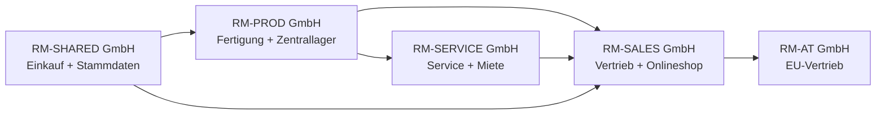
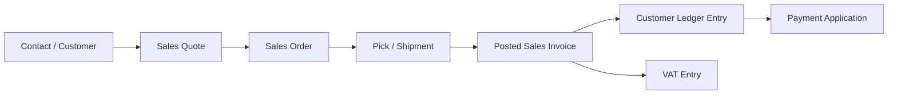
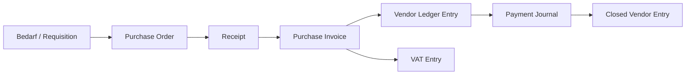
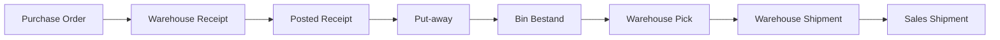
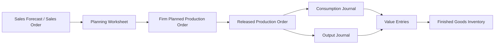
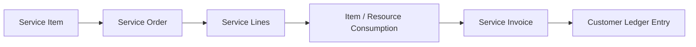
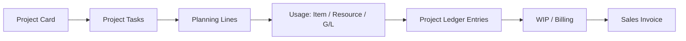
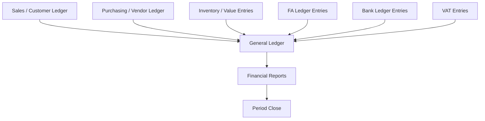
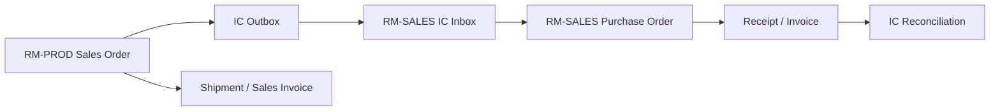

# FiBu-Buch 5: Business Central (BC) – Standardprozesse Deutschland als vollständiges Durchspielbuch

Stand: `28.05.2026`
Hinweis: Dieses Buch ist ein quellenbasiertes Lern-, Schulungs-, Projekt- und Implementierungsbuch für Microsoft Dynamics 365 Business Central im deutschen Unternehmenskontext. Es ersetzt keine individuelle Rechts-, Steuer- oder Implementierungsberatung.

**Verlässlichkeitsstandard und Rechtsstand**
- Rechtsstand und Link-Prüfung der Primärquellen: `28.05.2026`.
- Fachlicher Fokus: Business Central Standard, deutsche Umsatzsteuer (USt), GoBD, E-Rechnung, HGB-nahe Finanzprozesse, Lager, Fertigung, Service, Projekte, Onlineshop, Intercompany und Reporting.
- BC-Funktionsumfang, Seitenbezeichnungen und Lokalisierungen können je Release Wave, Mandant, Lizenz, Sprache, Berechtigung und aktivierter Funktion abweichen.
- Bei Abweichungen zwischen diesem Buch und Normtext oder Microsoft Learn gilt immer die aktuelle Primärquelle.
- Dieses Skript verwendet für Quellenangaben nur Primärquellen: Microsoft Learn, Gesetze im Internet, BMF, BZSt und amtliche EU-Quellen.

## Inhaltsverzeichnis (Kurz)

1. Zielbild: Business Central komplett durchspielen
2. Quellen-, Pflicht- und Best-Practice-Schicht
3. Musterkonzern Rhein-Main Industriegruppe
4. Rollen, Abteilungen und Bedienlogik in BC
5. Trainingsdaten: Stammdaten, Standorte, Artikel, Belege
6. Foundation: Companies, Benutzer, Nummernserien, Dimensionen, Workflows
7. Sales/O2C: Vertrieb, Onlineshop, Dropshipping, Retouren, Vorauszahlungen
8. Purchasing/P2P: Einkauf, Wareneingang, E-Rechnung, Fremdarbeit, Zahlungen
9. Inventory & Warehouse: einfaches Lager, gesteuertes Lager, Bins, Inventur
10. Planning, Assembly & Manufacturing: Planung, Montage, Fertigung, Fremdarbeit
11. Service, Mietmodelle und Finanzierung im Standardgrenzbereich
12. Projects: Projektgeschäft, Ressourcen, WIP, Faktura
13. Finance/R2R: Journale, Debitoren, Kreditoren, Bank, Anlagen, USt, Abschluss
14. Intercompany, Ausland, Foreign Trade und Sonderfälle
15. Reporting, Admin, Job Queue, Change Log, Datenexport
16. Schulungskapitel nach Abteilungen
17. Master-UAT und Abweichungsmatrix
18. Standardgrenzen: Wann BC Standard endet
19. Ausblick: häufig genutzte Extensions und Einrichtungslogik
20. Einkaufspreise, Verkaufspreise, Rabatte und Margensteuerung
21. Controlling, GuV, Financial Reports und Management-Auswertungen
22. Einsteiger-Onboarding: Finden, Bedienen, Fehler vermeiden und korrigieren
23. Quellenverzeichnis

---

## 1. Zielbild: Business Central komplett durchspielen [Q1][Q2]

Dieses Buch erklärt Business Central nicht als Sammlung einzelner Masken. Es erklärt Business Central als Unternehmenssystem: Mitarbeiter legen Stammdaten an, kaufen ein, lagern ein, fertigen, verkaufen, liefern, fakturieren, kassieren, zahlen, melden Steuern, schließen Perioden und weisen alles prüfbar nach. Nach diesem Buch kannst du einen vollständigen Trainingsmandanten aufbauen und die Standardprozesse Ende-zu-Ende durchspielen.

Ziel:
- Du kannst alle relevanten BC-Standardprozessbereiche fachlich einordnen und anhand eines deutschen Musterkonzerns bedienen. [Q1][Q2]
- Du erkennst, welche Prozesse direkt im Standard abbildbar sind und wo Miet-, Finanzierungs- oder Spezialmodelle Prozessdesign, Extension oder Customizing brauchen. [Q2]
- Du kannst je Abteilung sagen, was der Mitarbeiter in BC macht, welche Seite er öffnet, welche Felder er pflegt und welche Entries entstehen. [Q1]
- Du kannst Schulungen durchführen, weil jedes Prozesskapitel Beispieldaten, Klickpfad, Übung, Lösung und Kontrollfrage enthält.

### 1.1 Was „alle Standardprozesse“ in diesem Buch bedeutet [Q2]

Business Central deckt nach Microsofts offizieller Prozesslandkarte Finance, Sales, Purchasing, Inventory, Warehouse Management, Online Store mit Shopify, Fixed Assets, Planning, Assembly, Manufacturing, Project Management, Service Management, Relationship Management, Human Resources, Reporting, Admin, Workflows und Integrationen ab. Dieses Buch nimmt diese Prozessgruppen als Mindestumfang. [Q1][Q2]

| BC-Prozessbereich | Wird in diesem Buch behandelt als | Trainingsziel |
|---|---|---|
| Finance | Hauptbuch, Nebenbücher, Bank, USt, Anlagen, Abschluss | Buchungsspur und Abschlussfähigkeit verstehen |
| Sales | Angebot, Auftrag, Lieferung, Rechnung, Retoure, Mahnung | O2C mit Abweichungen bedienen |
| Purchasing | Anfrage, Bestellung, Wareneingang, Eingangsrechnung, Rücksendung | P2P und 3-Way-Match erklären |
| Inventory | Artikel, Lagerorte, Varianten, Bewertung, Inventur | Mengen- und Wertfluss abstimmen |
| Warehouse | Put-away, Pick, Bins, gesteuerte Lagerorte | einfache und gesteuerte Lagerlogik unterscheiden |
| Shopify/Online Store | Kunden-, Artikel- und Auftragsfluss aus dem Shop | Onlineshop-Aufträge in BC verarbeiten |
| Planning | Forecast, MPS, MRP, Planungsarbeitsblatt | Bedarf in Beschaffung/Fertigung übersetzen |
| Assembly | Montageauftrag, Assemble-to-Order, Kits | Baugruppen ohne volle Fertigung abbilden |
| Manufacturing | Stückliste, Arbeitsplan, Fertigungsauftrag, Verbrauch, Output | Produktionskosten und Abweichungen verstehen |
| Projects | Projektaufgaben, Ressourcen, Verbrauch, WIP, Faktura | Projektwertschöpfung abrechnen |
| Service | Serviceartikel, Serviceauftrag, Vertrag, Garantie | After-Sales-Prozesse steuern |
| Relationship Management | Kontakte, Verkaufschancen, Segmente | Vorvertrieb und Kundenbeziehung pflegen |
| Human Resources | Mitarbeiter, Abwesenheiten | Basis-HR im BC-Standard zeigen |
| Admin/Reporting | Rollen, Berechtigungen, Change Log, Job Queue, Analyse | Betrieb und Nachweis sichern |

### 1.2 Standard, Pflicht, Best Practice und Projektentscheidung

Dieses Buch trennt vier Ebenen:

| Ebene | Bedeutung | Beispiel |
|---|---|---|
| Standard laut Quelle | Funktion ist in Microsoft Learn beschrieben | `Sales Orders`, `Purchase Orders`, `Production Orders` |
| Deutsche Pflicht/Compliance | Rechtliche oder steuerliche Anforderung | § 147 AO, UStG, GoBD, E-Rechnung |
| BC-Best-Practice | robuste Projektpraxis, nicht automatisch Gesetz | Vier-Augen-Freigabe für USt-Setup |
| Projektentscheidung der Musterfirma | bewusst konstruiertes Trainingsdesign | ein gesteuertes Lager und ein einfaches Lager parallel |

> Merksatz: Best Practice ist keine Rechtsquelle. Sie ist die fachlich begründete Art, den Standard so zu nutzen, dass Prozesse stabil, prüfbar und schulbar werden.

---

## 2. Quellen-, Pflicht- und Best-Practice-Schicht [Q1][Q20][Q21][Q22]

Das Buch ist quellenbasiert. Jede wesentliche BC-Funktion wird auf Microsoft Learn zurückgeführt. Jede deutsche Steuer- oder Nachweisaussage wird auf Gesetz, BMF oder BZSt gestützt. Best Practices werden separat benannt.

### 2.1 Quellenlogik

| Aussageart | Primärquelle | Beispiel |
|---|---|---|
| BC-Standardfunktion | Microsoft Learn | Warehouse, Manufacturing, Service, Projects |
| deutsche USt | UStG, BZSt, BMF | Rechnung, UStVA, ZM, Reverse Charge |
| Aufbewahrung und Datenzugriff | AO, GoBD/BMF | § 147 AO, Z3, Verfahrensdokumentation |
| E-Rechnung | UStG, BMF, Microsoft Learn E-Documents | XML, Validierung, Archivierung |
| EU-Bezug | EUR-Lex, EU-Richtlinien | Mehrwertsteuer-Systemrichtlinie |

### 2.2 Best-Practice-Katalog der Musterfirma

| Best Practice | Zweck | Nicht verwechseln mit |
|---|---|---|
| Change Request für Buchungsgruppen | systematische Falschbuchungen vermeiden | gesetzlicher Einzelpflicht |
| Vier-Augen-Prüfung bei Bankdaten | Betrugsprävention | vollständiger Payment-Approval-Lösung |
| Periodensperre nach Monatsabschluss | Vorperiodenbuchungen verhindern | Jahresabschlussprüfung |
| Evidence Pack je Steuerfall | Tax Review reproduzierbar machen | bloßer Belegablage |
| getrennte Lagerorte je Prozesslogik | Lagerbedienung schulbar halten | zwingender BC-Vorgabe |
| Rollenprofile nach Abteilung | Bedienung vereinfachen | alleiniger Berechtigungskontrolle |
| Testdatenkatalog | Schulungen wiederholbar machen | produktiver Migration |

Prüfungsfalle:
- In Projekten wird „Microsoft kann das“ häufig mit „unser Prozess ist prüfbar eingerichtet“ verwechselt. Die Funktion ist nur der Werkzeugkasten. Die Nachweislogik entsteht durch Setup, Rollen, Kontrolle und Dokumentation.

---

## 3. Musterkonzern Rhein-Main Industriegruppe

Die Musterfirma ist bewusst breit konstruiert. Sie soll Business Central nicht minimal abbilden, sondern als Trainingsuniversum möglichst vollständig auslösen.

### 3.1 Konzernstruktur

| Company in BC | Rolle im Konzern | Hauptprozesse |
|---|---|---|
| `RM-PROD GmbH` | Produktion und Zentrallager | Fertigung, gesteuertes Lager, Einkauf, Intercompany-Verkauf |
| `RM-SALES GmbH` | Vertrieb und Onlineshop | B2B, B2C, Shopify, Dropshipping, Debitoren |
| `RM-SERVICE GmbH` | Wartung, Miete, Finanzierungsvorbereitung | Service, Mietfälle, Projekte, Anlagen-/Serviceartikel |
| `RM-SHARED GmbH` | Shared Services | Einkauf, Stammdaten, Zahlungsverkehr, Reporting |
| `RM-AT GmbH` | EU-Auslandsgesellschaft | Intercompany, EU-USt, Intrastat-nahe Fälle |

### 3.2 Standorte und Lagerlogik

| Lagerort | Company | Lagerart | BC-Logik | Trainingszweck |
|---|---|---|---|---|
| `FRA-ZL` | RM-PROD | Zentrallager | gesteuerte Einlagerung/Kommissionierung mit Bins | Warehouse Receipt, Put-away, Pick, Shipment |
| `MZ-EINFACH` | RM-SALES | Außenlager | einfache Lagerbuchung ohne gesteuerte Einlagerung | einfacher Wareneingang und Verkauf |
| `HH-FUL` | RM-SALES | Onlineshop-Fulfillment | Pick/Shipment vereinfacht | Shop-Auftrag bis Versand |
| `VAN-01` | RM-SERVICE | Servicefahrzeug | Lagerort für Techniker | Ersatzteilverbrauch im Service |
| `PROJ-BER` | RM-SERVICE | Projektlager | Projektbezogenes Lager | Projektmaterial und Baustelle |
| `DROP` | RM-SALES | Dropshipping | kein eigener Bestand | Direktlieferung Lieferant an Kunde |

### 3.3 Geschäftsmodelle

| Modell | Use Case | BC-Schwerpunkt | Standardgrenze |
|---|---|---|---|
| Eigenfertigung | Standardmaschine `RM-M100` | Manufacturing | vollständig im Standard demonstrierbar |
| Variantenfertigung | Sondermaschine `RM-X500` | BOM/Routing/Projekt/Fertigung | Variantenlogik braucht klare Stammdaten |
| Handelsware | Ersatzteil `SP-PUMP-01` | O2C/P2P/Inventory | Standard |
| Onlineshop | Webshop-Verkauf Ersatzteile | Shopify Connector / Sales Orders | abhängig von Connector-Setup |
| Service | Wartung beim Kunden | Service Management | Standard |
| Miete | Mietmaschine 12 Monate | Service/Projects/Deferrals/Fixed Assets | Standard nur mit Prozessdesign |
| Finanzierung | Kunde finanziert Maschine über Bank | Sales/Receivables/Deferrals | komplexe Finanzierungslogik nicht vollständig Standard |
| Intercompany | PROD verkauft an SALES | Intercompany | Standard mit IC-Setup |
| Dropshipping | Lieferant liefert direkt an Kunden | Sales + Purchase Link | Standard |

---

## 4. Rollen, Abteilungen und Bedienlogik in BC

Ein vollständiges Schulungsbuch muss zeigen, wie Mitarbeiter arbeiten. Deshalb beschreibt jedes Prozesskapitel fachliche Aufgabe, Role Center, Tell-Me-Suche, Seiten, Felder und Folgebelege.

### 4.1 Rollenmatrix

| Rolle | Abteilung | Typische BC-Seiten | Was macht der Mitarbeiter? |
|---|---|---|---|
| Verkäuferin | Vertrieb | `Sales Quotes`, `Sales Orders`, `Customers`, `Contacts` | Angebot erstellen, Auftrag erfassen, Verfügbarkeit prüfen, Rechnung auslösen |
| E-Commerce-Sachbearbeiter | Onlineshop | `Shopify Shops`, `Sales Orders`, `Items`, `Customers` | Shop-Aufträge synchronisieren, Fehler klären, Versand anstoßen |
| Einkäufer | Einkauf | `Vendors`, `Purchase Orders`, `Purchase Invoices` | Bestellung auslösen, Preise prüfen, Wareneingang/Rechnung abstimmen |
| Lagerist einfaches Lager | Lager MZ | `Item Journals`, `Sales Shipments`, `Purchase Receipts` | Ware annehmen, Bestand prüfen, Lieferung buchen |
| Lagerist gesteuertes Lager | FRA-ZL | `Warehouse Receipts`, `Put-aways`, `Picks`, `Warehouse Shipments` | Einlagern, kommissionieren, versenden |
| Produktionsplanerin | Fertigung | `Planning Worksheet`, `Production Orders`, `BOMs`, `Routings` | Bedarf planen, Fertigungsaufträge erstellen, Termine prüfen |
| Meister | Fertigung | `Released Production Orders`, `Consumption Journal`, `Output Journal` | Verbrauch und Output melden, Ausschuss dokumentieren |
| Servicetechniker | Service | `Service Orders`, `Service Items`, `Item Journals` | Serviceauftrag bearbeiten, Ersatzteile verbrauchen, Zeiten erfassen |
| Projektleiter | Projekte | `Projects`, `Project Tasks`, `Project Journals` | Budget, Verbrauch, Fortschritt und Faktura steuern |
| Debitorenbuchhalterin | Finance | `Customer Ledger Entries`, `Payment Reconciliation Journal`, `Reminders` | Zahlung ausgleichen, mahnen, offene Posten prüfen |
| Kreditorenbuchhalter | Finance | `Vendor Ledger Entries`, `Payment Journals`, `Purchase Invoices` | Eingangsrechnungen prüfen, Zahlungen vorbereiten |
| Anlagenbuchhalterin | Finance | `Fixed Assets`, `FA Journals`, `Calculate Depreciation` | Zugänge, AfA und Abgänge buchen |
| Controller | Controlling | `Analysis Views`, `Financial Reports`, `Dimensions` | Auswertungen und Abweichungen analysieren |
| BC-Admin | IT/Finance Operations | `Users`, `Permission Sets`, `Change Log Setup`, `Job Queue Entries` | Rollen, Automatisierung und Audit Trail verwalten |

### 4.2 Bedienmuster

1. **Role Center prüfen:** Der Mitarbeiter startet im passenden Arbeitsbereich.
2. **Tell Me nutzen:** Er sucht stabile Seitenbegriffe, nicht lange Menüpfade.
3. **Belegkopf prüfen:** Kunde/Lieferant, Datum, Standort, Währung, Dimension, USt-Gruppe.
4. **Zeilen pflegen:** Artikel, Ressource, Sachkonto, Menge, Preis, Lagerort, Projekt.
5. **Vorschau/Prüfung:** Posting Preview, Verfügbarkeit, Freigabe, Pflichtfelder.
6. **Buchen:** Post/Release/Register.
7. **Nachweis prüfen:** Entries, Belegkette, Attachments, Reports.

Praxisregel:
- Schulungen beginnen mit Rollen und Aufgaben, nicht mit Menüs. Ein Einkäufer muss wissen, warum er eine Bestellung auslöst; die Seite ist erst der zweite Schritt.

---

## 5. Trainingsdaten: Stammdaten, Standorte, Artikel, Belege

Dieses Kapitel liefert Beispieldaten, damit Schulungen aufeinander aufbauen. Die Daten sind bewusst vereinfacht, aber realitätsnah.

### 5.1 Dimensionen

| Dimension | Werte | Zweck |
|---|---|---|
| `COMPANY-GROUP` | PROD, SALES, SERVICE, SHARED, AT | Konzerninterne Auswertung |
| `DEPARTMENT` | SALES, PURCH, WHSE, PROD, SERV, FIN, ADMIN | Rollen- und Kostenstellenlogik |
| `CHANNEL` | B2B, SHOP, IC, SERVICE, PROJECT | Vertriebskanal |
| `PRODUCTLINE` | MACHINE, SPARE, RENTAL, SERVICE | Produktlinie |
| `LOCATION-GROUP` | DIRECTED, SIMPLE, VAN, PROJECT, DROP | Lagerlogik |

### 5.2 Debitoren

| Nr. | Name | Land | Typ | USt-Logik | Trainingsfall |
|---|---|---|---|---|---|
| `D10000` | Müller Maschinenbau GmbH | DE | B2B | Inland 19 % | Standardverkauf Maschine |
| `D11000` | Handwerk24 Onlinekunde | DE | B2C | Inland 19 % | Onlineshop-Ersatzteil |
| `D20000` | Alpha Machines SAS | FR | EU-B2B | innergemeinschaftlich | EU-Lieferung |
| `D30000` | SwissTech AG | CH | Drittland | Export | Ausfuhrlieferung |
| `D90000` | RM-SALES GmbH IC | DE | Intercompany | Inland/IC | IC-Verkauf PROD an SALES |

### 5.3 Kreditoren

| Nr. | Name | Land | Typ | Trainingsfall |
|---|---|---|---|---|
| `K10000` | Stahlwerk Ruhr GmbH | DE | Material | Rohmaterial Einkauf |
| `K11000` | Elektro Parts GmbH | DE | Komponenten | Elektronik Einkauf |
| `K20000` | Dropship Europe BV | NL | Dropshipping | Direktlieferung |
| `K30000` | Zollspedition Nord GmbH | DE | Spedition/Zoll | Import/EUSt |
| `K40000` | Lohnfertiger Süd GmbH | DE | Fremdarbeit | Subcontracting |

### 5.4 Artikel, Ressourcen und Anlagen

| Nr. | Beschreibung | Typ | Lager/Prozess | Standardkosten/Preis |
|---|---|---|---|---:|
| `RM-M100` | Standardmaschine M100 | Fertigerzeugnis | Fertigung/Verkauf | 42.000 / 68.000 |
| `RM-X500` | Sondermaschine X500 | Projekt/Fertigung | Projekt + Fertigung | 90.000 / 145.000 |
| `SP-PUMP-01` | Ersatzteil Pumpe | Lagerartikel | Einkauf/Shop/Service | 180 / 320 |
| `SP-SENSOR-02` | Sensor Set | Lagerartikel mit Seriennr. | Shop/Service | 75 / 149 |
| `RAW-STEEL` | Stahlträger | Rohmaterial | Fertigung | 2.500 / - |
| `COMP-CTRL` | Steuerungseinheit | Komponente | Fertigung | 3.200 / - |
| `KIT-MAINT` | Wartungskit | Montageartikel | Assembly/Service | 240 / 450 |
| `RES-TECH` | Servicetechniker Stunde | Ressource | Service/Projekt | 65 / 115 |
| `FA-CNC-01` | CNC-Anlage | Anlage | Anlagenbuchhaltung | 250.000 |

### 5.5 Beispielbelege

| Fall | Beleg | Daten | Erwarteter Prozess |
|---|---|---|---|
| S-001 | Sales Order `SO-1001` | D10000 kauft `RM-M100`, 1 Stück | Fertigung → Lieferung → Rechnung |
| S-002 | Shop Order `WEB-24001` | D11000 kauft `SP-PUMP-01`, 2 Stück | Shopify → Fulfillment → Zahlung |
| S-003 | Drop Shipment `SO-1003` | D10000 kauft Handelsware von K20000 | Verkaufsauftrag ↔ Einkaufsbestellung |
| P-001 | Purchase Order `PO-2001` | RAW-STEEL 10 Stück | Wareneingang gesteuertes Lager |
| M-001 | Production Order `PROD-3001` | `RM-M100`, 3 Stück | Verbrauch + Output |
| SV-001 | Service Order `SERV-4001` | Wartung D10000 | Techniker + Ersatzteil |
| J-001 | Project `PROJ-5001` | Installation Sondermaschine | Ressourcen + Material + Faktura |
| F-001 | FA Journal `FA-6001` | CNC-Zugang | Anlage aktivieren + AfA |

---

## 6. Foundation: Companies, Benutzer, Nummernserien, Dimensionen, Workflows [Q3][Q4][Q5][Q6]

Foundation-Prozesse tragen alle Fachprozesse. Fehler in Nummernserien, Dimensionen, Buchungsgruppen oder Berechtigungen wirken wie ein Multiplikator.

### 6.1 Quelle und Zweck

Standard laut Quelle:
- Business Central unterstützt mehrere Companies, Benutzer, Berechtigungen, Workflows, Job Queues, Change Log und Einrichtung für Geschäftsprozesse. [Q3][Q4][Q5][Q6]

Deutsche Pflicht/Compliance:
- Für steuerrelevante Systeme sind Nachvollziehbarkeit, Vollständigkeit, Richtigkeit, Unveränderbarkeit und Datenzugriff im GoBD-Kontext relevant. [Q21][Q22]

BC-Best-Practice:
- Setup-Änderungen an Posting Groups, VAT Posting Setup, Nummernserien und Dimensionen laufen über Change Request, Testnachweis und Freigabe.

### 6.2 Mitarbeiterbedienung

| Rolle | Aufgabe | Tell Me / Seite | Was wird getan? |
|---|---|---|---|
| BC-Admin | Company anlegen | `Companies` | Trainingscompanies erstellen |
| Finance-Leitung | Buchungsperioden steuern | `General Ledger Setup`, `Accounting Periods` | Buchungsfenster festlegen |
| Stammdaten-Team | Dimensionen pflegen | `Dimensions`, `Dimension Values` | Pflichtdimensionen anlegen |
| Admin | Change Log aktivieren | `Change Log Setup` | kritische Tabellen überwachen |
| Prozessowner | Workflow prüfen | `Workflows`, `Approval User Setup` | Freigaben für Einkauf/Verkauf definieren |

### 6.3 E2E-Setupfluss

### 6.4 UAT-Schulung Foundation

Aufgabe:
1. Lege Dimension `CHANNEL` mit Werten `B2B`, `SHOP`, `IC`, `SERVICE`, `PROJECT` an.
2. Setze `CHANNEL` als Pflichtdimension für Debitor `D10000`.
3. Buche eine Verkaufsrechnung ohne `CHANNEL`.
4. Korrigiere den Fehler und buche erneut.

Erwartete Lösung:
- Die Buchung ohne Pflichtdimension wird verhindert oder als Fehler markiert.
- Die korrigierte Buchung erzeugt `G/L Entries` mit Dimension `CHANNEL = B2B`.

Kontrollfrage:
- Warum ist eine Pflichtdimension eher ein Prozesskontrollinstrument als eine reine Reporting-Einstellung?

---

## 7. Sales/O2C: Vertrieb, Onlineshop, Dropshipping, Retouren, Vorauszahlungen [Q7][Q8][Q9][Q10]

O2C beginnt beim Kontakt oder Angebot und endet erst, wenn Lieferung, Rechnung, Forderung, Zahlung, USt und Nachweis geschlossen sind.

### 7.1 Standard laut Quelle

Business Central unterstützt Verkaufsangebote, Verkaufsaufträge, Lieferungen, Rechnungen, Retouren, Gutschriften und Dropshipping. Der Shopify-Bereich synchronisiert Onlineshop-Daten je Einrichtung mit Business Central. [Q7][Q8][Q9][Q10]

### 7.2 Mitarbeiterrollen

| Rolle | Bedienhandlung | Seite | Ergebnis |
|---|---|---|---|
| Verkäuferin | Angebot für `RM-M100` erstellen | `Sales Quotes` | Angebot mit Preis und Liefertermin |
| Vertriebsinnendienst | Angebot in Auftrag umwandeln | `Sales Orders` | `SO-1001` |
| Lagerist | Lieferung kommissionieren | `Warehouse Picks` oder `Sales Orders` | gebuchte Lieferung |
| Debitorenbuchhalterin | Rechnung und Zahlung prüfen | `Customer Ledger Entries` | offener oder geschlossener Posten |
| E-Commerce-Sachbearbeiter | Shop-Auftrag prüfen | `Shopify Orders` / `Sales Orders` | Webauftrag in BC |

### 7.3 Standardpfad B2B-Verkauf

### 7.4 Beispieldaten und Buchung

Fall `S-001`: Debitor `D10000` kauft `RM-M100`, 1 Stück, netto `68.000 EUR`, USt `12.920 EUR`.

| Buchung | Soll | Haben |
|---|---:|---:|
| Forderungen D10000 | 80.920 | |
| Umsatzerlöse Maschinen | | 68.000 |
| Umsatzsteuer 19 % | | 12.920 |

Mitarbeiterbedienung:
1. Verkäuferin: Tell Me → `Sales Quotes` → New → `Sell-to Customer No. = D10000`.
2. Zeile: `Type = Item`, `No. = RM-M100`, `Quantity = 1`, `Location Code = FRA-ZL`.
3. Aktion: `Make Order`.
4. Lagerist: Tell Me → `Warehouse Picks` → Pick erstellen und registrieren.
5. Vertrieb: `Post` → Ship and Invoice, wenn Lieferung abgeschlossen ist.
6. Buchhaltung: Tell Me → `Customer Ledger Entries` → Posten D10000 prüfen.

### 7.5 Abweichungen und Sonderfälle

| Use Case | BC-Mechanik | Mitarbeiter | Risiko | Evidence Pack |
|---|---|---|---|---|
| Teillieferung | `Qty. to Ship` | Lager/Vertrieb | Rechnung über falsche Menge | Shipment ↔ Invoice |
| Retoure | `Sales Return Order` | Vertrieb/Lager | USt-Korrektur fehlt | Bezug zur Ursprungsrechnung |
| Gutschrift | `Sales Credit Memo` | Debitorenbuchhaltung | falsches Erlöskonto | Credit Memo + VAT Entry |
| Vorauszahlung | `Prepayment Invoice` | Vertrieb/Finance | falsche Steuerperiode | Prepayment VAT |
| Dropshipping | Sales Order ↔ Purchase Order | Vertrieb/Einkauf | Liefernachweis fehlt | Lieferantenbeleg + Kundenrechnung |
| Shopify | Shop Order → Sales Order | E-Commerce | falsche Kundenzuordnung | Shop-ID + BC-Beleg |
| EU-B2B | VAT Bus. Posting Group EU | Vertrieb/Finance | USt-IdNr. fehlt | USt-IdNr., ZM |
| Drittland | Export-VAT-Clause | Vertrieb/Finance | Ausfuhrnachweis fehlt | Exportnachweis |

BC-Best-Practice:
- Verkäufer dürfen Preise und Rabatte erfassen, aber nicht USt-Buchungsgruppen ändern.
- Onlineshop-Aufträge laufen durch eine tägliche Fehlerliste: unbekannte Artikel, fehlende Kunden, Zahlungsabweichungen.

Schulungsübung:
- Erstelle `SO-1003` als Dropshipment für Debitor `D10000` und Kreditor `K20000`. Verknüpfe Verkaufs- und Einkaufsbeleg. Prüfe, warum kein eigener Lagerbestand entsteht.

---

## 8. Purchasing/P2P: Einkauf, Wareneingang, E-Rechnung, Fremdarbeit, Zahlungen [Q11][Q12][Q13]

P2P beginnt beim Bedarf und endet mit abgestimmter Verbindlichkeit, Zahlung und Vorsteuer. Der Einkauf erzeugt nicht nur Belege, sondern steuert Preis-, Mengen-, Liefer- und Betrugsrisiken.

### 8.1 Mitarbeiterrollen

| Rolle | Bedienhandlung | Seite | Ergebnis |
|---|---|---|---|
| Einkäufer | Bestellung aus Planungsbedarf erstellen | `Purchase Orders` | `PO-2001` |
| Lagerist | Wareneingang buchen | `Warehouse Receipts` oder `Purchase Orders` | Bestand steigt |
| Kreditorenbuchhalter | Eingangsrechnung prüfen | `Purchase Invoices` / `Incoming Documents` | Verbindlichkeit |
| Finance-Leitung | Zahlung freigeben | `Payment Journals` | Zahlungsvorschlag |

### 8.2 Prozessfluss

### 8.3 Beispieldaten und Buchung

Fall `P-001`: Einkauf `RAW-STEEL`, 10 Stück à `2.500 EUR`, netto `25.000 EUR`, Vorsteuer `4.750 EUR`.

| Buchung | Soll | Haben |
|---|---:|---:|
| Vorräte Rohmaterial | 25.000 | |
| Vorsteuer 19 % | 4.750 | |
| Verbindlichkeiten K10000 | | 29.750 |

Bedienung:
1. Einkäufer: Tell Me → `Purchase Orders` → New → `Buy-from Vendor No. = K10000`.
2. Zeile: `Type = Item`, `No. = RAW-STEEL`, `Quantity = 10`, `Location Code = FRA-ZL`.
3. Lagerist: gesteuertes Lager → `Warehouse Receipt` erstellen und buchen.
4. Kreditorenbuchhalter: Eingangsrechnung mit Bestellung abgleichen.
5. Finance: Zahlungsvorschlag erstellen und ausführen.

### 8.4 Abweichungen

| Use Case | BC-Mechanik | Kontrolle |
|---|---|---|
| Teil-Wareneingang | mehrere Receipts | `Qty. Received` vs. `Qty. Invoiced` |
| Preisabweichung | Rechnungspreis abweichend | Freigabe vor Buchung |
| Rücksendung | `Purchase Return Order` | Bezug zur Ursprungslieferung |
| E-Rechnung | E-Documents / Incoming Documents | XML und Validierung |
| Fremdarbeit | Subcontracting / Purchase Service | Fertigungsauftragbezug |
| Lieferantenbank geändert | Vendor Bank Account | Vier-Augen-Prüfung |

BC-Best-Practice:
- Externe Belegnummer ist Pflicht.
- Bankdatenänderungen werden nicht im Zahlungslauf geändert, sondern vorher freigegeben.
- Mengen- und Preisabweichungen erhalten eigene Freigaberegeln.

Schulungsübung:
- Buche eine Bestellung mit Teil-Wareneingang 6/10 Stück. Buche anschließend eine Rechnung über 10 Stück und erkläre den Fehler.

---

## 9. Inventory & Warehouse: einfaches Lager, gesteuertes Lager, Bins, Inventur [Q14][Q15]

Lager in Business Central ist nicht einheitlich. Die Mustergruppe nutzt bewusst zwei Extreme: ein einfaches Lager und ein gesteuertes Zentrallager.

### 9.1 Lagerlogik im Vergleich

| Merkmal | Einfaches Lager `MZ-EINFACH` | Gesteuertes Lager `FRA-ZL` |
|---|---|---|
| Wareneingang | direkt aus Bestellung | Warehouse Receipt + Put-away |
| Versand | direkt aus Verkaufsauftrag | Warehouse Shipment + Pick |
| Bins | optional/vereinfacht | verbindlich |
| Mitarbeiter | Sachbearbeiter/Lagerist | Lagerrolle mit Aufgabenliste |
| Schulungsziel | schneller Standardpfad | vollständige Warehouse-Steuerung |

### 9.2 Prozessfluss gesteuertes Lager

### 9.3 Mitarbeiterbedienung

| Rolle | Seite | Tätigkeit |
|---|---|---|
| Lagerist Wareneingang | `Warehouse Receipts` | Lieferung erfassen, Menge prüfen |
| Einlagerer | `Warehouse Put-aways` | Bin vorschlagen, Ware einlagern |
| Kommissionierer | `Warehouse Picks` | Pickliste abarbeiten |
| Lagerleitung | `Items by Location`, `Inventory Valuation` | Bestände und Werte prüfen |

### 9.4 Abweichungen

| Use Case | BC-Reaktion | Risiko |
|---|---|---|
| falscher Bin | Korrektur über Warehouse Journal | Bestand physisch falsch |
| Seriennummer fehlt | Buchung blockiert oder Tracking-Fehler | Rückverfolgbarkeit fehlt |
| Inventurdifferenz | Physical Inventory Journal | Ergebniswirkung |
| Umlagerung | Transfer Order | Bestand im Transit |
| negativer Bestand | je Setup möglich/verhindert | COGS unsicher |

Schulungsübung einfaches Lager:
- Buche Einkauf `SP-PUMP-01` nach `MZ-EINFACH`, verkaufe 2 Stück und prüfe Item Ledger Entries.

Schulungsübung gesteuertes Lager:
- Buche `RAW-STEEL` nach `FRA-ZL`, erstelle Put-away, danach Pick für Fertigung oder Verkauf.

---

## 10. Planning, Assembly & Manufacturing: Planung, Montage, Fertigung, Fremdarbeit [Q16][Q17][Q18]

Die Mustergruppe produziert mehrere Produkte. Damit lassen sich Planung, Montage und Fertigung sauber unterscheiden.

### 10.1 Produktstruktur

| Produkt | Prozess | Bestandteile |
|---|---|---|
| `KIT-MAINT` | Assembly | Pumpe + Sensor + Dichtung |
| `RM-M100` | Manufacturing Standard | Stahl, Steuerung, Montagezeit |
| `RM-X500` | Project + Manufacturing | kundenspezifische BOM, Projektressourcen |
| `SP-SENSOR-02` | Handels-/Serienartikel | Einkauf, Seriennummer |

### 10.2 Fertigungsfluss

### 10.3 Mitarbeiterbedienung

| Rolle | Seite | Tätigkeit |
|---|---|---|
| Produktionsplanerin | `Planning Worksheet` | Bedarf berechnen, Vorschläge prüfen |
| Arbeitsvorbereitung | `Production BOMs`, `Routings` | Struktur und Arbeitsgänge pflegen |
| Meister | `Released Production Orders` | Auftrag starten, Material prüfen |
| Werker/Meister | `Consumption Journal`, `Output Journal` | Verbrauch und Output melden |
| Controller | `Production Order Statistics` | Abweichungen analysieren |

### 10.4 Abweichungen

| Use Case | BC-Mechanik | Best Practice |
|---|---|---|
| Ausschuss | Mehrverbrauch oder Output-Differenz | Ausschussgrund dokumentieren |
| Ersatzkomponente | Komponentenänderung im Auftrag | Freigabe durch Arbeitsvorbereitung |
| Fremdarbeit | Subcontracting/Purchase | Bestellung mit Fertigungsbezug |
| Nacharbeit | zusätzlicher Arbeitsgang | Kosten separat auswerten |
| Eilauftrag | manuelle Produktionsorder | Planungsabweichung markieren |
| Teilfertigmeldung | Output kleiner Planmenge | Rest-WIP prüfen |

Schulungsübung:
- Erstelle Fertigungsauftrag `PROD-3001` für 3 Stück `RM-M100`. Melde 5 % Mehrverbrauch `RAW-STEEL` und erkläre die Abweichung in Value Entries.

---

## 11. Service, Mietmodelle und Finanzierung im Standardgrenzbereich [Q19][Q25][Q26]

Service Management ist Standard. Miet- und Finanzierungsmodelle sind je Ausprägung Standard, Prozessdesign oder Erweiterung. Dieses Buch zeigt zuerst den Standard und markiert danach Grenzen.

### 11.1 Service-Standard

Mitarbeiterbedienung:
1. Servicedisponent: Tell Me → `Service Orders` → neuen Auftrag für D10000 anlegen.
2. Techniker: Serviceartikel auswählen, Fehlerbeschreibung erfassen.
3. Techniker: Ersatzteil `SP-PUMP-01` und Ressource `RES-TECH` erfassen.
4. Serviceabrechnung: Auftrag fakturieren oder als Garantie/Kulanz markieren.

### 11.2 Mietmodell im BC-Standardgrenzbereich

| Modell | Standardabbildung | Grenze |
|---|---|---|
| Kurzzeitmiete mit Rechnung | Sales Invoice / Project / Service | Verfügbarkeitskalender nicht vollwertig |
| Wartungspauschale | Service Contract | Vertragslogik standardnah |
| Mietmaschine als Anlage | Fixed Asset + Service Item | komplexe Mietabrechnung braucht Design |
| monatliche Abgrenzung | Deferrals | Vertragsänderungen separat steuern |

BC-Best-Practice:
- Mietfälle erhalten eigene Produktlinie `RENTAL`, eigene Dimension und eigenes Evidence Pack.
- Wenn Verfügbarkeitskalender, automatische Verlängerung, variable Nutzung oder komplexe Indexierung nötig sind, wird Extension/Customizing geprüft.

### 11.3 Finanzierung im Standardgrenzbereich

| Use Case | Standardabbildung | Hinweis |
|---|---|---|
| Kunde zahlt in Raten | Zahlungsbedingungen / Teilzahlungen | einfache Raten möglich |
| externe Bank finanziert | Verkauf an Kunden, Zahlung durch Bank | Abtretung/Vertrag separat dokumentieren |
| Leasingähnlicher Verkauf | Vertragliche Prüfung erforderlich | nicht als bloßer Verkaufsauftrag behandeln |

Schulungsübung:
- Lege einen Mietfall für `RM-M100` über 12 Monate an. Nutze Dimension `PRODUCTLINE = RENTAL`, erstelle Monatsrechnung und erkläre, warum dies keine vollständige Mietverwaltungssoftware ersetzt.

---

## 12. Projects: Projektgeschäft, Ressourcen, WIP, Faktura [Q27]

Projects bilden mehrperiodige Leistungserbringung ab. Die Mustergruppe nutzt Projekte für Installation, Sondermaschinen und Kundenschulungen.

### 12.1 Prozessfluss

### 12.2 Mitarbeiterbedienung

| Rolle | Seite | Tätigkeit |
|---|---|---|
| Projektleiter | `Projects` | Projekt und Aufgaben anlegen |
| Einkauf | `Purchase Orders` | Projektbezogene Fremdleistung bestellen |
| Lager | `Item Journals` / Projektverbrauch | Material auf Projekt buchen |
| Consultant/Techniker | `Project Journals` | Zeit erfassen |
| Finance | `Create Project Sales Invoice` | Faktura erstellen |

### 12.3 Abweichungen

| Use Case | Risiko | Kontrolle |
|---|---|---|
| Festpreis | Istkosten überschreiten Erlös | Budget/Ist-Bericht |
| Time & Material | Zeiten nicht fakturiert | Unbilled-Auswertung |
| Meilenstein | Erlös vor Leistung | Abgrenzung |
| Fremdleistung | Kosten ohne Projektbezug | Bestellzeile mit Projekt |
| Projektlager | Material bleibt im falschen Lager | Location `PROJ-BER` |

Schulungsübung:
- Projekt `PROJ-5001`: Installiere `RM-X500`, buche 20 Technikerstunden, Material `SP-SENSOR-02`, Fremdleistung und eine Meilensteinrechnung.

---

## 13. Finance/R2R: Journale, Debitoren, Kreditoren, Bank, Anlagen, USt, Abschluss [Q20][Q21][Q22][Q23][Q24][Q28]

Finance ist die Klammer aller Prozesse. Jeder operative Vorgang muss sich in Hauptbuch, Nebenbuch, Steuer, Bank und Abschluss wiederfinden.

### 13.1 Finance-Prozesslandkarte

### 13.2 Mitarbeiterbedienung

| Rolle | Seite | Tätigkeit |
|---|---|---|
| Debitorenbuchhalterin | `Customer Ledger Entries`, `Reminders` | OP prüfen, Zahlungen ausgleichen, mahnen |
| Kreditorenbuchhalter | `Vendor Ledger Entries`, `Payment Journals` | Rechnungen prüfen, Zahlungslauf |
| Anlagenbuchhalterin | `Fixed Assets`, `FA Journals` | Zugang, AfA, Abgang |
| Buchhalter | `General Journals` | Abgrenzungen, Umbuchungen, Rückstellungen |
| Steuerverantwortliche | `VAT Entries`, `VAT Statements`, VAT Reports | USt-Abstimmung |
| Finance-Leitung | `Financial Reports`, `Accounting Periods` | Abschluss und Periodensperre |

### 13.3 Abweichungen

| Use Case | BC-Mechanik | Evidence |
|---|---|---|
| Teilzahlung | Apply Entries teilweise | Restposten |
| Skonto | Payment Discount | Steuerkorrektur prüfen |
| Bankdifferenz | Payment Reconciliation Journal | Klärposten |
| Anlagenabgang | FA Disposal | Buchwert/Erlös |
| Abgrenzung | Deferrals / General Journal | Abgrenzungsplan |
| USt-Korrektur | Credit Memo / VAT Entry | Bezug zur Rechnung |

Deutsche Pflicht/Compliance:
- Steuerlich relevante Unterlagen müssen nach § 147 AO aufbewahrt werden. [Q21]
- GoBD konkretisiert Anforderungen an Nachvollziehbarkeit, Unveränderbarkeit und Datenzugriff. [Q22]
- USt-relevante Prozesse müssen mit UStG und Meldelogik abgestimmt sein. [Q20][Q24]

Schulungsübung:
- Importiere einen Bankauszug mit drei Zeilen: Vollzahlung, Teilzahlung, unbekannte Zahlung. Gleiche zwei Posten aus und buche den dritten auf Klärung.

---

## 14. Intercompany, Ausland, Foreign Trade und Sonderfälle [Q29][Q30][Q31]

Intercompany und Ausland verbinden mehrere Prozesswelten. Ein Intercompany-Verkauf erzeugt bei einer Company O2C und bei der anderen P2P.

### 14.1 Intercompany-Fluss

### 14.2 Sonderfallmatrix

| Use Case | Prozessbereiche | Mitarbeiter | Hauptrisiko |
|---|---|---|---|
| IC-Verkauf PROD an SALES | O2C + P2P | Vertrieb/Einkauf/Finance | Gegenbeleg fehlt |
| EU-Lieferung nach FR | Sales + VAT | Vertrieb/Steuer | USt-IdNr./ZM |
| Drittland Export CH | Sales + Zoll + VAT | Vertrieb/Finance | Ausfuhrnachweis |
| Import aus CH | Purchase + Zoll + VAT | Einkauf/Finance | EUSt falsch |
| Reihengeschäft | Sales/Purchase/VAT | Tax/Finance | bewegte Lieferung |
| Fremdwährung USD | Sales/Purchase/R2R | Finance | Kursbewertung |
| Konsignationsnähe | Inventory/VAT | Logistik/Tax | Eigentumsübergang |

BC-Best-Practice:
- Jeder Sonderfall bekommt ein `TaxScenario` oder ein gleichwertiges Klassifikationsfeld in der Prozessdokumentation.
- Kein 0 %-Fall ohne Evidence Pack.

Schulungsübung:
- RM-PROD verkauft `RM-M100` an RM-SALES. Erzeuge IC-Belegkette und stimme Forderung/Verbindlichkeit ab.

---

## 15. Reporting, Admin, Job Queue, Change Log, Datenexport [Q5][Q6][Q32][Q33][Q34]

Reporting und Admin sind keine Nebenthemen. Sie entscheiden, ob die Organisation Business Central stabil betreiben und prüfen kann.

### 15.1 Standardbereiche

| Bereich | BC-Seiten | Schulungsziel |
|---|---|---|
| Financial Reports | `Financial Reports`, `Account Schedules` | GuV/Bilanznahe Auswertung |
| Analysis Views | `Analysis Views` | Dimensionale Analyse |
| Power BI-nahe Auswertung | Power BI Integration | Management Reporting |
| Change Log | `Change Log Setup`, `Change Log Entries` | Stammdatenänderungen nachweisen |
| Job Queue | `Job Queue Entries` | Automatisierung überwachen |
| Berechtigungen | `Users`, `Permission Sets` | Rollen und SoD abbilden |
| Datenexport | Datenzugriff/Reports/API | Betriebsprüfung und Migration |

Mitarbeiterbedienung:
- Controller erstellt Auswertung nach `DEPARTMENT` und `PRODUCTLINE`.
- Admin prüft fehlgeschlagene Job Queue Entries.
- Finance Operations exportiert Prüfungsdaten und dokumentiert Zeitraum, Filter und Verantwortlichen.

Schulungsübung:
- Aktiviere Change Log für Vendor Bank Accounts, ändere IBAN bei `K10000`, prüfe Change Log Entry und erkläre den Nachweiswert.

---

## 16. Schulungskapitel nach Abteilungen

Dieses Kapitel bündelt die Trainingspfade. Jede Schulung nutzt dieselbe Datenwelt.

### 16.1 Einkaufsschulung

Ziel:
- Einkäufer kann Lieferanten, Bestellung, Wareneingang, Eingangsrechnung und Abweichung verstehen.

Übung:
1. Bestellung `PO-2001` für `RAW-STEEL` anlegen.
2. Wareneingang im gesteuerten Lager buchen.
3. Rechnung mit Preisabweichung erfassen.
4. Abweichung freigeben und buchen.

Kontrollfrage:
- Warum ist der Wareneingang fachlich nicht dasselbe wie die Eingangsrechnung?

### 16.2 Verkaufsschulung

Übung:
1. Angebot an D10000 erstellen.
2. Auftrag erzeugen.
3. Lieferung aus gesteuertem Lager anstoßen.
4. Rechnung buchen.
5. Zahlung ausgleichen.

Kontrollfrage:
- Welche Entries beweisen, dass Umsatz, Forderung und Steuer entstanden sind?

### 16.3 Lagerschulung einfaches Lager

Übung:
- Kaufe `SP-PUMP-01` nach `MZ-EINFACH`, verkaufe 2 Stück, buche Inventurdifferenz 1 Stück.

Kontrollfrage:
- Warum ist das einfache Lager schneller, aber weniger prozessgeführt?

### 16.4 Lagerschulung gesteuertes Lager

Übung:
- Warehouse Receipt, Put-away, Pick und Shipment für `FRA-ZL` durchspielen.

Kontrollfrage:
- Welche Dokumente entstehen zusätzlich gegenüber einfachem Lager?

### 16.5 Fertigungsschulung

Übung:
- Fertigungsauftrag `PROD-3001` erstellen, Verbrauch buchen, Output melden, Abweichung analysieren.

Kontrollfrage:
- Warum braucht Fertigung sowohl Mengen- als auch Wertposten?

### 16.6 Serviceschulung

Übung:
- Serviceauftrag `SERV-4001` mit Garantieentscheidung und Ersatzteilverbrauch buchen.

Kontrollfrage:
- Wann entsteht Erlös, wann nur Aufwand?

### 16.7 Projektschulung

Übung:
- Projekt `PROJ-5001` mit Ressourcen, Material, Fremdleistung und Meilensteinrechnung abbilden.

Kontrollfrage:
- Was ist der Unterschied zwischen Projektverbrauch und Projektfaktura?

### 16.8 Buchhaltungsschulung

Übung:
- Zahlungslauf, Bankabstimmung, USt-Abstimmung, Anlagen-AfA und Periodensperre durchführen.

Kontrollfrage:
- Warum ist die SUSA ohne Nebenbuchabstimmung nicht ausreichend?

### 16.9 Admin-/Stammdatenschulung

Übung:
- Benutzerrolle anlegen, Permission Set zuweisen, Change Log aktivieren, Nummernserie prüfen.

Kontrollfrage:
- Warum ist Berechtigung keine rein technische Aufgabe?

### 16.10 Abschluss- und Reporting-Schulung

Übung:
- Monatsabschluss für März `2026` durchführen: Debitoren, Kreditoren, Bank, Lager, Anlagen, USt, Financial Report.

Kontrollfrage:
- Welche Nachweise gehören in das Abschluss-Evidence-Pack?

---

## 17. Master-UAT und Abweichungsmatrix

### 17.1 Master-UAT

| ID | Prozess | Fall | Rolle | Erwarteter Nachweis |
|---|---|---|---|---|
| UAT-001 | Foundation | Pflichtdimension blockiert Buchung | Stammdaten-Team | Fehlermeldung + korrigierte Buchung |
| UAT-002 | Sales | B2B-Verkauf Maschine | Vertrieb | Sales Invoice + Customer Ledger |
| UAT-003 | Sales | Retoure mit Gutschrift | Vertrieb/Finance | Credit Memo + VAT Entry |
| UAT-004 | Shopify | Webshop-Auftrag | E-Commerce | Shop-ID + Sales Order |
| UAT-005 | Dropshipping | Direktlieferung | Vertrieb/Einkauf | verknüpfte Sales/Purchase Belege |
| UAT-006 | Purchasing | Teil-WE | Einkauf/Lager | offene Restmenge |
| UAT-007 | P2P | E-Rechnung | Kreditorenbuchhaltung | XML + Buchungsbezug |
| UAT-008 | Warehouse | Put-away/Pick | Lager | Warehouse Entries |
| UAT-009 | Inventory | Inventurdifferenz | Lagerleitung | Item/Value Entries |
| UAT-010 | Planning | MRP-Vorschlag | Produktionsplanung | Planning Worksheet Lines |
| UAT-011 | Manufacturing | Mehrverbrauch | Meister/Controlling | Fertigungsabweichung |
| UAT-012 | Assembly | Wartungskit montieren | Lager/Service | Assembly Order |
| UAT-013 | Service | Garantieauftrag | Service | Kosten ohne Erlös/Kulanznachweis |
| UAT-014 | Rental | Monatsmiete | Service/Finance | Rechnung + Abgrenzungslogik |
| UAT-015 | Project | Meilensteinrechnung | Projektleitung | Project Ledger + Sales Invoice |
| UAT-016 | Bank | Teilzahlung | Debitorenbuchhaltung | Restposten |
| UAT-017 | Fixed Assets | Zugang + AfA | Anlagenbuchhaltung | FA Ledger Entries |
| UAT-018 | VAT | EU-Lieferung | Steuerverantwortliche | USt-IdNr./VAT Entry/ZM-Logik |
| UAT-019 | Intercompany | IC-Verkauf | Finance | Gegenbeleg + Abstimmung |
| UAT-020 | Reporting | Financial Report | Controlling | Bericht nach Dimension |

### 17.2 Abweichungsmatrix

| Abweichung | Betroffene Prozesse | Diagnosepfad |
|---|---|---|
| falsche USt-Gruppe | Sales, Purchase, VAT | Beleg → VAT Entry → VAT Posting Setup → Stammdaten |
| falscher Lagerort | Sales, Purchase, Warehouse | Belegzeile → Item Ledger Entry → Location |
| fehlende Dimension | alle Buchungen | G/L Entry → Dimension Set |
| nicht ausgeglichener OP | Sales/Purchase/Bank | Customer/Vendor Ledger Entry → Detailed Entries |
| Bestand stimmt nicht | Inventory/Warehouse | Item Ledger Entry → Warehouse Entry → Physische Zählung |
| Fertigungskosten falsch | Manufacturing | Production Order → Consumption/Output → Value Entries |
| Projekt nicht fakturiert | Projects | Project Ledger Entries → Planning Lines → Sales Invoice |
| IC nicht abgestimmt | Intercompany/R2R | IC Inbox/Outbox → Customer/Vendor Ledger |

> Abschluss-Merksatz: Business Central ist vollständig verstanden, wenn der Leser denselben Geschäftsvorfall aus Sicht des Mitarbeiters, des Belegs, der Buchung, der Steuer und des Nachweises erklären kann.

---

## 18. Standardgrenzen: Wann BC Standard endet [Q1][Q2][Q35]

Dieses Kapitel ist die Entscheidungsstelle zwischen Standard, Prozessdesign, Extension und Programmierung. Business Central deckt viele Geschäftsprozesse im Standard ab. Der Standard endet aber dort, wo ein Unternehmen spezielle Automatisierung, Branchenlogik, rechtliche Zusatzanforderungen, Massendatenlogik oder tiefe externe Integration verlangt.

### 18.1 Vier-Stufen-Modell

| Stufe | Bedeutung | Entscheidung |
|---|---|---|
| **1. Standard direkt** | Prozess ist mit Standardseiten, Standardsetup und Standardbelegen abbildbar. | Kein Add-on. Schulung und Einrichtung reichen. |
| **2. Standard mit Prozessdesign** | Prozess ist möglich, braucht aber klare Rollen, Dimensionen, Workflows, Deferrals oder Evidence Packs. | Kein Code, aber strenges Design. |
| **3. AppSource/Extension** | Standard kann den Prozess nur mühsam oder nicht kontrollsicher automatisieren. | geprüfte Extension evaluieren. |
| **4. Individualprogrammierung** | Keine passende Standardfunktion oder Extension; Wettbewerbsvorteil/Branchenspezifik ist hoch. | AL-Extension mit Spezifikation, Tests und Upgrade-Konzept. |

Praxisregel:
- Erst Standard beweisen, dann Extension prüfen, dann programmieren. Wer sofort programmiert, verliert oft Upgradefähigkeit und Prozessklarheit.

### 18.2 Standardgrenzen je Prozessbereich

| Prozessbereich | Standard reicht typischerweise für | Grenze des Standards | Typische Lösung |
|---|---|---|---|
| Sales/O2C | Angebot, Auftrag, Lieferung, Rechnung, Retoure, Dropshipping | hochautomatisierte Preis-/Rabattlogik, komplexe Portalprozesse, Spezial-EDI | Extension oder Integration |
| Shopify/Onlineshop | Shop-Synchronisation und Auftragsübernahme | Marktplatzmix, Retourenportale, Payment-Reconciliation über viele Provider | Connector/Custom Integration |
| Purchasing/P2P | Bestellung, WE, Eingangsrechnung, Zahlung | OCR, automatischer 3-Way-Match, Vertragsprüfung, Eingangsarchiv | Document Capture / AP-Automation |
| E-Rechnung | E-Documents-Grundlogik | Peppol-Netzwerk, lokale Formate, Massenvalidierung, Lieferanten-Onboarding | E-Document Provider / Extension |
| Inventory | Artikel, Lagerorte, Serien/Chargen, Inventur | mobile Scanner, hochautomatisierte Lagerprozesse, Versanddienstleister | WMS-/Scanner-/Shipping-App |
| Warehouse | Pick, Put-away, Bins, Receipts, Shipments | Funkterminalprozesse, Wegeoptimierung, Packplätze, Gefahrgut | Extension oder Spezial-WMS |
| Manufacturing | BOM, Routing, Fertigungsauftrag, Verbrauch, Output | Feinplanung, MES, Betriebsdatenerfassung, Maschinenanbindung | MES/APS/Custom |
| Projects | Projektaufgaben, Ressourcen, Verbrauch, Faktura | komplexes Vertragsmanagement, Earned Value, Bau-/Anlagenbau-Spezifika | Branchenextension |
| Service | Serviceartikel, Serviceauftrag, Vertrag | Field-Service-Dispatching, mobile Techniker-App, SLA-Automation | Field-Service-App/Custom |
| Miete | Rechnung, Deferral, Anlage/Serviceartikel, Dimension | Verfügbarkeitskalender, Mietpark, automatische Verlängerung, Verbrauchsabrechnung | Rental-Extension |
| Finanzierung | Zahlungsbedingungen, Teilzahlungen, externe Zahlung | Kreditvertrag, Tilgungsplan, Effektivzins, regulatorische Speziallogik | Speziallösung/Custom |
| Finance/Bank | Journale, Zahlungen, Bankabstimmung | EBICS, Zahlungsavise, erweiterte OP-Verarbeitung, Zahlungsverkehr DACH | OPplus/Banking-Extension |
| Anlagen | Standardanlagen und AfA | Anlageninventur, Komponentenansatz, besondere DACH-Funktionen | Finance-/FA-Extension |
| Reporting | Financial Reports, Analyseansichten, Power BI | Management-Konsolidierung, KPI-Cockpits, Data Warehouse | Power BI/Data Platform |
| Intercompany | IC-Dokumente und Journale | konzernweite IC-Automation, Transferpreise, Multi-ERP | Prozessdesign/Custom |

### 18.3 Entscheidungsmatrix Extension oder Programmierung

| Prüffrage | Wenn Ja | Wenn Nein |
|---|---|---|
| Gibt es eine offizielle BC-Standardfunktion? | Standard konfigurieren und schulen. | AppSource prüfen. |
| Gibt es eine etablierte AppSource-App mit Dokumentation? | Extension evaluieren. | Custom-Konzept prüfen. |
| Ist der Prozess branchenspezifischer Wettbewerbsvorteil? | Custom kann sinnvoll sein. | Standard/Extension bevorzugen. |
| Betrifft der Prozess Steuer, Bank, Archiv oder Massendaten? | Upgrade- und Auditfähigkeit besonders prüfen. | schlankes Custom möglich. |
| Muss der Prozess releasefähig bleiben? | AppSource/Standard bevorzugen. | Custom nur mit Testautomatisierung. |

BC-Best-Practice:
- Jede Extension bekommt vor Einführung eine `EXT-ID`, Zweckbeschreibung, Prozessowner, Datenobjekte, Testfälle, Rollback-Plan und Upgrade-Verantwortlichen.
- Jede Individualprogrammierung bekommt zusätzlich technische Spezifikation, Berechtigungsmodell, Event-/Subscriber-Konzept, Telemetrie und Regressionstest.

### 18.4 Schulungsübung Standardgrenze

Fall:
- Die RM-SERVICE GmbH will Maschinen vermieten. Kunden sollen online Verfügbarkeit sehen, Mietverträge verlängern, Schäden dokumentieren und Verbrauchsstunden abrechnen.

Aufgabe:
1. Markiere, was im BC-Standard abbildbar ist.
2. Markiere, was mit Prozessdesign möglich ist.
3. Markiere, wo eine Rental-Extension oder Custom-Lösung sinnvoll wird.

Lösungsskizze:
- Standard: Debitor, Artikel/Anlage, Verkaufsrechnung, Deferrals, Dimension `PRODUCTLINE = RENTAL`.
- Prozessdesign: Mietvertrag als Projekt/Servicefall, Evidence Pack, manuelle Verfügbarkeitsprüfung.
- Extension/Custom: Online-Verfügbarkeitskalender, automatische Vertragsverlängerung, Schadensworkflow, nutzungsabhängige Abrechnung.

---

## 19. Ausblick: häufig genutzte Extensions und Einrichtungslogik [Q35][Q36][Q37][Q38][Q39][Q40][Q41][Q42]

Dieses Kapitel ist kein Produktkatalog und keine Kaufempfehlung. Es zeigt, welche Extension-Klassen in DACH-Projekten häufig geprüft werden, warum sie helfen und wie sie grundsätzlich in Business Central eingeführt werden. Die konkrete Auswahl hängt von Lizenz, Land, Prozessreife, Datenschutz, GoBD-Anforderung und Partnerkompetenz ab.

### 19.1 AppSource-Grundlogik

Standard laut Quelle:
- Business Central kann AppSource-Apps über die Seite `Microsoft AppSource Apps` suchen und verwalten. Dort lassen sich Apps nach Name, Publisher, Installationsstatus, Popularität, Bewertung und Änderungsdatum filtern. [Q35]

Einrichtungslogik:
1. Prozesslücke dokumentieren.
2. AppSource und Herstellerdokumentation prüfen.
3. Testcompany verwenden.
4. Extension installieren.
5. Assisted Setup oder Setup-Seiten ausführen.
6. Berechtigungen und Role Center prüfen.
7. Stammdaten/Mapping konfigurieren.
8. UAT mit Happy Path und Abweichungen durchführen.
9. GoBD-/DSGVO-/Archivwirkung dokumentieren.
10. Produktivsetzung mit Rollback- und Supportpfad freigeben.

### 19.2 Extension-Klassen

| Klasse | Typischer Bedarf | Beispiel-Extensions | Was sie bringen |
|---|---|---|---|
| AP Automation / Document Capture | Eingangsrechnungen, OCR, Freigabe, Archiv | Continia Document Capture | Import, OCR, Registrierung, Approval, Order Matching, Archiv |
| Expense Management | Reisekosten, Belege, Firmenkarten, Genehmigung | Continia Expense Management | mobile Belegerfassung, Expense Reports, Mileage, Per Diem, Approval |
| Banking / OP-Verarbeitung | Zahlungsverkehr, Bankauszüge, Zahlungsavise | Continia OPplus | Zahlungs-/Bankfunktionen, OP-Komfort, Raten, erweiterte Auswertungen |
| E-Documents / Peppol | E-Rechnung und Netzwerkanbindung | E-Document Provider, Continia eDocuments | Versand/Empfang strukturierter Dokumente |
| Anzahlungen | Projekt-/Bau-/Maschinenbau-Anzahlungen | COSMO Advance Payment | Anzahlungsanforderungen, Anzahlungsrechnungen, Schlussrechnung |
| DATEV/Steuerberater | Übergabe an Kanzlei | DATEV-Extensions, Partnerlösungen | Buchungs-/Belegübergabe, Konten-/Steuerberaterprozess |
| Shipping / Carrier | Versandlabels, Tracking, Packplatz | Shipping-Apps | Label, Carrier, Tracking, Versandstatus |
| WMS / Scanner | mobiles Lager, Barcode, Packplatz | Scanner-/WMS-Apps | mobile Datenerfassung, Lagerqualität |
| Rental / Subscription | Mietpark, wiederkehrende Abrechnung | Rental-/Subscription-Apps | Vertragslogik, Verfügbarkeit, Verlängerung |
| Reporting / BI | Management Reporting, Data Warehouse | Power BI/Data-Apps | KPIs, Dashboards, Datenmodell |

### 19.3 Continia Document Capture (Klasse: AP Automation) [Q36][Q37]

Use Case:
- Die RM-SHARED GmbH verarbeitet monatlich `2.500` Eingangsrechnungen. BC Standard kann Purchase Invoices und Incoming Documents verarbeiten. Die Grenze liegt bei OCR, automatischem Abgleich, Genehmigungsrouting und revisionsnaher Dokumentenverarbeitung in Masse.

Nutzen:
- Import und OCR-Verarbeitung von Eingangsrechnungen.
- Registrierung und Weiterleitung in Genehmigungsflüsse.
- Order Matching gegen Bestellungen und Wareneingänge.
- Archivierung und Nachvollziehbarkeit des Rechnungsprozesses.

Einrichtungslogik:
1. App in Testcompany installieren.
2. Assisted Setup starten.
3. Kreditoren, Templates, Dokumentkategorien und Freigaben konfigurieren.
4. Purchase Order Matching testen.
5. E-Rechnung/XML und PDF-Verarbeitung testen.
6. Evidence Pack und Archivzugriff dokumentieren.

BC-Best-Practice:
- Document Capture ersetzt nicht den fachlichen P2P-Prozess. Es automatisiert Eingang, Erkennung, Matching, Approval und Archivierung. Der fachliche 3-Way-Match bleibt Prozesspflicht.

### 19.4 Continia Expense Management (Klasse: Travel & Expense) [Q38][Q39]

Use Case:
- Servicetechniker und Projektleiter reichen Hotel, Fahrtkosten, Bewirtung und Kilometer ein. BC Standard kann Sachkonten und Kreditoren buchen, bildet aber mobile Belegerfassung, Genehmigung und Firmenkartenabgleich nicht komfortabel vollständig ab.

Nutzen:
- Mobile Belegerfassung.
- Expense Reports, Kilometer und Pauschalen.
- Genehmigungsflows.
- Buchung auf Sachkonten, Dimensionen und ggf. Projekte.

Einrichtungslogik:
1. App installieren und aktivieren.
2. Expense User, Genehmiger und Dimensionen einrichten.
3. Ausgabenkategorien auf Sachkonten mappen.
4. Firmenkartenimport testen.
5. Projekt- und Service-Dimensionen prüfen.

Schulungsfall:
- Techniker bucht Hotel `180 EUR`, Kilometer `220 km`, Parken `18 EUR`. Manager genehmigt. Finance prüft Buchung auf Projekt `PROJ-5001`.

### 19.5 Continia OPplus (Klasse: Banking/Payments/Finance) [Q40][Q41]

Use Case:
- Die RM-SALES GmbH hat viele Zahlungseingänge, Zahlungsavise, Ratenzahlungen und Bankdateien. BC Standard kann Zahlungen und Bankabstimmung verarbeiten. Die Grenze liegt bei DACH-Komfort, Massenzahlungen, erweiterten OP-Funktionen und Spezialfällen.

Nutzen:
- Unterstützung wichtiger Finanzbuchhaltungsaufgaben.
- Komfort bei eingehenden und ausgehenden Zahlungen.
- Module wie Multiple Payments, Installments, Extended Fixed Assets und Extended Analysis laut Herstellerdokumentation.

Einrichtungslogik:
1. OPplus aktivieren.
2. Module auswählen.
3. Bank- und Zahlungsparameter konfigurieren.
4. Berechtigungen setzen.
5. Zahlungsimport, Avis und Ratenfall testen.

Best Practice:
- OPplus nicht als „mehr Finance“ einführen, sondern für konkrete Schmerzpunkte: Zahlungsavise, Massenausgleich, Raten, Bankformate, OP-Transparenz.

### 19.6 COSMO Advance Payment (Klasse: Anzahlungen) [Q42]

Use Case:
- Maschinenbau und Projektgeschäft verlangen Anzahlungen: `30 %` bei Auftrag, `40 %` bei Meilenstein, `30 %` bei Abnahme. BC Standard kennt Vorauszahlungen, aber komplexe Anzahlungslogik in Bau-/Projekt-/Maschinenbauprozessen kann mehr Struktur brauchen.

Nutzen:
- strukturierte Anzahlungsprozesse.
- bessere Abbildung von Anzahlungsanforderungen und Schlussrechnungen.
- Unterstützung projekt- oder auftragsnaher Anzahlungslogik.

Einrichtungslogik:
1. AppSource/Herstellerinstallation prüfen.
2. Anzahlungsarten definieren.
3. Konten und Steuerlogik mappen.
4. Verkaufsauftrag mit Anzahlungsplan testen.
5. Schlussrechnung und USt-Abstimmung prüfen.

Prüfungsfalle:
- Anzahlungslogik ist steuerlich sensibel. Extension-Komfort ersetzt nicht die Prüfung von Steuerentstehung, Rechnungstext, USt-Ausweis und Schlussrechnungslogik.

### 19.7 DATEV-/Steuerberater-Übergabe (Klasse: DACH Accounting)

Use Case:
- Die RM-SHARED GmbH will Monatsdaten, Belege und Buchungen an den Steuerberater übergeben. BC Standard kann Daten exportieren und Reports liefern. DACH-Projekte verlangen häufig standardisierte Kanzleiübergaben, Kontenmapping und Belegverknüpfung.

Nutzen:
- strukturierter Export.
- weniger manuelle Überleitung.
- bessere Abstimmung mit Steuerberaterprozessen.

Einrichtungslogik:
1. Zielprozess klären: Buchungsstapel, Belegbilder, Stammdaten, Salden oder vollständige Prüfungsexporte?
2. Kontenrahmen und Steuerkennzeichen mappen.
3. Testmonat exportieren.
4. Import beim Steuerberater validieren.
5. Fehlerliste und Monatsroutine dokumentieren.

Hinweis:
- Konkrete DATEV-Lösung und Hersteller hängen stark von Partner, Land, Kontenrahmen und Prozess ab. Deshalb wird im Buch nur die Prozessklasse beschrieben und nicht eine einzelne Lösung als Standard gesetzt.

### 19.8 Wann Individualprogrammierung sinnvoll ist

Individualprogrammierung ist sinnvoll, wenn mindestens einer dieser Punkte erfüllt ist:

| Kriterium | Beispiel |
|---|---|
| kein passender Standard und keine passende Extension | Spezialmietpark mit IoT-Verbrauchsdaten |
| Wettbewerbsvorteil | eigener Konfigurator für Sondermaschinen |
| tiefe Integration | Maschinen-/MES-Daten in Fertigungsrückmeldung |
| klare stabile Regel | automatischer TaxScenario-Validator |
| hoher Volumenprozess | Massenerzeugung projektspezifischer Serviceaufträge |

Mindestanforderungen:
- Fachkonzept.
- Datenmodell.
- Berechtigungskonzept.
- Testfälle.
- Upgrade-Konzept.
- Telemetrie und Fehlerlogging.
- Dokumentation im Evidence Pack.

### 19.9 Schulungsübung Extension-Auswahl

Fall:
- Die RM-SHARED GmbH hat `2.500` Eingangsrechnungen pro Monat, `180` Reisekostenabrechnungen, `4` Banken, viele Zahlungsavise und Maschinenbau-Anzahlungen.

Aufgabe:
1. Ordne jeden Schmerzpunkt einer Extension-Klasse zu.
2. Entscheide, ob Standard, Extension oder Custom die Startlösung ist.
3. Definiere je Klasse einen UAT-Test.

Lösungsskizze:
- Eingangsrechnungen: Document Capture/AP Automation.
- Reisekosten: Expense Management.
- Banken/Zahlungsavise: OPplus/Banking.
- Anzahlungen: COSMO Advance Payment oder Standard-Vorauszahlung plus Prozessdesign.
- Custom nur, wenn die Extension den spezifischen Prozess nicht abdeckt.

---

## 20. Einkaufspreise, Verkaufspreise, Rabatte und Margensteuerung [Q43][Q44][Q45][Q46][Q47]

Preise sind in Business Central keine Nebensache. Sie entscheiden über Marge, Bewertung, Rabattspielraum, Einkaufskonditionen und Controlling-Aussagen. Ein Einsteiger muss zuerst verstehen: Einkaufspreis ist nicht Verkaufspreis, Einstandskosten sind nicht automatisch Lagerwert, und Rabatt ist nicht dasselbe wie Skonto.

### 20.1 Grundbegriffe in 60 Sekunden

| Begriff | Einsteiger-Erklärung | BC-Bezug |
|---|---|---|
| Einkaufspreis | Was das Unternehmen für einen Artikel oder eine Leistung bezahlt. | Purchase Price Lists, Vendor, Item |
| Einstandskosten | Einkaufspreis plus direkt zurechenbare Nebenkosten, soweit im Prozess abgebildet. | Item Cost, Value Entries, Item Charges |
| Verkaufspreis | Was der Kunde zahlen soll. | Sales Price Lists, Item Unit Price |
| Rabatt | Preisnachlass auf Zeilen- oder Rechnungsebene. | Line Discount, Invoice Discount |
| Skonto | Zahlungsnachlass bei schneller Zahlung. | Payment Terms, Payment Discount |
| Marge | Verkaufserlös minus Kosten. | Sales Analysis, Financial Reports, Dimensions |

Praxisregel:
- Preise werden vor der Belegerfassung eingerichtet. Manuelle Preisänderungen im Auftrag sind Ausnahmen und müssen fachlich begründet sein.

### 20.2 Standard laut Quelle

Business Central unterstützt Preis- und Rabattlisten für Einkauf und Verkauf. Preis- und Rabattstrategien werden vor der Belegerfassung auf den Setup-Seiten und Preislistenseiten definiert. Bei Belegen zieht BC passende Preise und Rabatte heran, wenn Kriterien wie Kunde, Kundengruppe, Kreditor, Artikel, Menge und Datum erfüllt sind. [Q43][Q44][Q45][Q46]

Microsoft Learn beschreibt außerdem, dass Business Central bei besonderen Einkaufs- und Verkaufspreisen die beste zulässige Preis-/Rabattkombination berechnet. Für den Einkauf ist der beste Preis der niedrigste zulässige Preis mit dem höchsten zulässigen Zeilenrabatt am relevanten Datum. [Q46]

### 20.3 Verkaufspreise einrichten

Use Case:
- Die RM-SALES GmbH verkauft Ersatzteile an B2B-Kunden, B2C-Onlineshop-Kunden und Intercompany-Kunden. Diese Gruppen brauchen unterschiedliche Preise.

| Preislogik | Beispiel | BC-Einrichtung |
|---|---|---|
| Standardpreis | `SP-PUMP-01` kostet regulär `320 EUR` | `Item Card` → `Unit Price` |
| Kundengruppe B2B | B2B-Kunden zahlen `295 EUR` | `Customer Price Groups` / Sales Price List |
| Einzelkunde | D10000 zahlt `285 EUR` ab 10 Stück | Sales Price List für Kunden |
| Zeitraumpreis | Aktion im Juni `2026` | Start-/Enddatum in Preislinie |
| Mengenstaffel | ab 20 Stück `270 EUR` | Minimum Quantity in Preislinie |
| Shoppreis | B2C `349 EUR` brutto/steuerabhängig | eigene Preisgruppe/Shop-Logik |

Mitarbeiterbedienung:
1. Vertriebsleitung: Tell Me → `Sales Price Lists`.
2. Neue Liste `VK-B2B-2026` erstellen.
3. `Price Type = Sale`, Status zunächst `Draft`.
4. Zeilen für `SP-PUMP-01`, `SP-SENSOR-02`, `KIT-MAINT` erfassen.
5. Startdatum `01.06.2026` setzen.
6. Preise fachlich prüfen.
7. Status auf `Active` setzen.
8. Testauftrag für D10000 erfassen und Preis prüfen.

BC-Best-Practice:
- Keine produktiven Preislisten ohne Gültigkeitsdatum.
- Keine Preisänderung ohne Verantwortlichen, Ticket oder Freigabe.
- Onlineshop-, B2B- und Intercompany-Preise getrennt führen.
- Preislisten erst in Testcompany prüfen, dann produktiv aktivieren.

### 20.4 Einkaufspreise einrichten

Use Case:
- Die RM-PROD GmbH kauft `RAW-STEEL` bei `K10000`. Der Standardpreis beträgt `2.500 EUR`, ab 20 Stück `2.350 EUR`.

Mitarbeiterbedienung:
1. Einkäufer: Tell Me → `Vendors`.
2. Kreditor `K10000` öffnen.
3. Aktion `Prices` oder `Purchase Price Lists` wählen.
4. Neue Einkaufspreisliste `EK-STAHL-2026` anlegen.
5. Zeile `RAW-STEEL`, Mindestmenge `1`, Preis `2.500 EUR`.
6. zweite Zeile `RAW-STEEL`, Mindestmenge `20`, Preis `2.350 EUR`.
7. Status `Active`.
8. Testbestellung über 10 und 20 Stück erfassen.

Kontrollpunkte:
- Preis gültig für richtigen Kreditor?
- Währung richtig?
- Einheit richtig?
- Mindestmenge richtig?
- Datum richtig?
- Rabatt zusätzlich oder bereits im Preis enthalten?

### 20.5 Margensteuerung

Zahlenbeispiel:

| Artikel | Einkaufskosten | Verkaufspreis | Rohertrag | Rohertragsquote |
|---|---:|---:|---:|---:|
| `SP-PUMP-01` | 180 | 320 | 140 | 43,75 % |
| `SP-SENSOR-02` | 75 | 149 | 74 | 49,66 % |
| `KIT-MAINT` | 240 | 450 | 210 | 46,67 % |

Rechnung:
- Rohertrag = Verkaufspreis - Einkaufskosten.
- Rohertragsquote = Rohertrag / Verkaufspreis.

BC-Best-Practice:
- Marge nicht nur im Verkaufsauftrag prüfen. Der Controller prüft sie nach Buchung über Erlöse, COGS (Cost of Goods Sold (Wareneinsatz)) und Dimensionen.
- Für Schulungen wird Dimension `PRODUCTLINE` zwingend gesetzt. Sonst kann der Controller nicht sehen, ob Maschinen, Ersatzteile, Service oder Mietmodell profitabel sind.

### 20.6 Stolpersteine und Korrekturen

| Fehler | Woran erkennt man ihn? | Ursache | Korrektur |
|---|---|---|---|
| falscher Verkaufspreis im Auftrag | Zeile zieht unerwarteten Preis | falsche Preisgruppe oder Datum | Preislistenzeile prüfen, Auftrag aktualisieren oder neu erfassen |
| Einkaufspreis zieht nicht | Bestellzeile zeigt alten Preis | Preislistestatus nicht `Active` | Preislistestatus aktivieren, Belegzeile neu validieren |
| Marge negativ | Verkaufspreis kleiner Kosten | falsche Kosten, Rabatt, falsche Einheit | Item Cost, Preis, Einheit und Rabatt prüfen |
| Rabatt doppelt | Zeilenrabatt und Rechnung rabattiert | Rabattlogik nicht getrennt | Rabattmatrix dokumentieren |
| Einheit falsch | Preis wirkt um Faktor falsch | Stück/Karton/Palette verwechselt | Unit of Measure prüfen |
| Shoppreis anders als BC | Webshop und BC nicht synchron | Preisquelle unklar | führendes System definieren |
| Intercompany-Marge falsch | IC-Verkauf zeigt falschen Erlös | IC-Preis nicht gepflegt | IC-Preisliste einrichten |

Prüfungsfalle:
- Ein Preisfehler ist selten nur ein Vertriebsproblem. Er kann Umsatz, USt, Marge, Provision, Lagerbewertung und Kundenzufriedenheit gleichzeitig treffen.

Schulungsübung:
1. Lege `VK-B2B-2026` für `SP-PUMP-01` mit `295 EUR` an.
2. Lege für D10000 ab 10 Stück `285 EUR` an.
3. Erstelle Auftrag mit 1 Stück und 10 Stück.
4. Erkläre, warum BC unterschiedliche Preise zieht.
5. Prüfe den Rohertrag gegen Einkaufskosten `180 EUR`.

---

## 21. Controlling, GuV, Financial Reports und Management-Auswertungen [Q48][Q49][Q50][Q51]

Controlling in Business Central beginnt nicht mit einem Bericht. Es beginnt mit richtigem Setup: Kontenplan, Kontenkategorien, Dimensionen, Buchungsgruppen und saubere Belegprozesse. Ein Financial Report ist nur so gut wie die Buchungen, die er auswertet.

### 21.1 Einsteigerbild: Was will ein Controller sehen?

| Frage | Bericht/Analyse | Benötigte Datenqualität |
|---|---|---|
| Verdienen wir Geld? | GuV / Income Statement | Erlöse und Aufwände richtig gebucht |
| Welche Produktlinie verdient Geld? | GuV nach `PRODUCTLINE` | Dimension auf jeder Buchung |
| Welcher Standort ist teuer? | Kosten nach `LOCATION-GROUP` | Lager-/Standortdimension |
| Wie entwickelt sich Marge? | Erlöse minus Wareneinsatz | Artikelkosten und COGS stimmen |
| Welche Kunden zahlen spät? | Debitorenfälligkeit | OP-Ausgleich sauber |
| Wie hoch ist Liquidität? | Cash Flow / Bankberichte | Bankabstimmung und Zahlungsbedingungen |
| Welche Projekte laufen aus dem Ruder? | Project Ledger / WIP | Projektverbrauch vollständig |

### 21.2 Standard laut Quelle

Microsoft Learn beschreibt Financial Reports als Funktion, um Finanzdaten aus dem Kontenplan zu analysieren, Hauptbucheinträge mit Budgeteinträgen zu vergleichen und Berichte wie Income Statement und Balance Sheet zu nutzen oder anzupassen. Financial Reports können Dimensionen nutzen und ohne Entwickler erstellt werden. [Q48]

Dimensionen kategorisieren Einträge, damit sie für Analysezwecke gruppiert werden können. Microsoft nennt als Beispiele Abteilung, Projekt, Region, Verkäufer oder Kundengruppe. [Q49]

### 21.3 GuV sinnvoll einrichten

Use Case:
- Die RM-Gruppe will monatlich eine GuV nach Produktlinie und Abteilung sehen: Maschinen, Ersatzteile, Service, Projekte, Miete.

Einrichtungslogik:
1. Kontenplan prüfen: Erlöse, Wareneinsatz, Personal, Fremdleistungen, Lagerabweichungen, Servicekosten, Projektkosten.
2. G/L Account Categories pflegen.
3. Dimensionen definieren: `DEPARTMENT`, `PRODUCTLINE`, `CHANNEL`, `LOCATION-GROUP`.
4. Pflichtdimensionen auf Debitoren, Artikel, Ressourcen, Projekte und Sachkonten setzen.
5. Financial Report `RM-GUV-MONAT` anlegen.
6. Zeilenstruktur definieren: Umsatzerlöse, Wareneinsatz, Rohertrag, operative Kosten, EBITDA-nahe Kennzahl.
7. Spaltenstruktur definieren: Ist Monat, Ist kumuliert, Budget, Abweichung absolut, Abweichung %.
8. Filter nach Dimension testen.
9. Bericht für Controller-Rolle bookmarken.

Beispiel-GuV:

| Zeile | Formel/Quelle | März 2026 |
|---|---|---:|
| Umsatzerlöse Maschinen | Erlöskonten `MACHINE` | 340.000 |
| Umsatzerlöse Ersatzteile | Erlöskonten `SPARE` | 85.000 |
| Serviceerlöse | Erlöskonten `SERVICE` | 42.000 |
| Wareneinsatz | COGS-Konten | -210.000 |
| Rohertrag | Umsatzerlöse + Wareneinsatz | 257.000 |
| Personal/Fremdleistung | Aufwandskonten | -96.000 |
| Sonstige Kosten | Aufwandskonten | -48.000 |
| Ergebnis vor Abschreibung | Zwischensumme | 113.000 |

### 21.4 Berichte für Controller

| Bericht | Zweck | Tell Me / Seite |
|---|---|---|
| GuV Monat | Ergebnis je Monat | `Financial Reports` |
| Bilanz | Vermögens-/Kapitalstruktur | `Financial Reports` |
| Cash Flow | Liquiditätsblick | `Cash Flow Forecast` |
| Debitorenfälligkeit | Zahlungsverzug | `Aged Accounts Receivable` |
| Kreditorenfälligkeit | Zahlungsplanung | `Aged Accounts Payable` |
| Lagerbewertung | Bestand und Wert | `Inventory Valuation` |
| Dimensionsdetail | Analyse nach Dimensionen | `Dimensions - Detail` |
| Projektbericht | Budget/Ist/Unbilled | `Projects`, Project Reports |
| Produktionsabweichung | Kostenabweichungen | `Production Order Statistics` |

BC-Best-Practice:
- Controller bekommen ein eigenes Rollenprofil mit gebookmarkten Seiten: `Financial Reports`, `G/L Entries`, `Analysis Views`, `Dimensions`, `Inventory Valuation`, `Customer Ledger Entries`, `Vendor Ledger Entries`, `Projects`.
- Controller dürfen analysieren, aber nicht jedes Setup ändern. Setup-Änderungen an Konten, Dimensionen und Reports erfolgen kontrolliert.

### 21.5 Stolpersteine und Korrekturen

| Fehler | Symptom | Ursache | Korrektur |
|---|---|---|---|
| GuV stimmt nicht | Erlöse fehlen | falsches Erlöskonto in Posting Setup | General Posting Setup prüfen, Korrekturbuchung |
| Produktlinienbericht leer | Dimension fehlt | Pflichtdimension nicht gesetzt | Dimension korrigieren, Analysis View aktualisieren |
| Marge falsch | Wareneinsatz fehlt/spät | Lagerkosten nicht fakturiert oder Adjust Cost offen | Kostenregulierung prüfen |
| Budgetvergleich unsinnig | Budget auf anderer Dimension | Budgetdimensionen passen nicht | Budgetstruktur angleichen |
| Bericht nicht auffindbar | Controller findet Seite nicht | kein Bookmark/Rollenprofil | Seite bookmarken, Profile anpassen |
| falsche Periodenzahlen | Buchungen in falschem Datum | Posting Date/Document Date verwechselt | Periodenfilter und Buchungsdatum prüfen |
| Analyseansicht alt | Zahlen fehlen | Analysis View nicht aktualisiert | Analysis View Update ausführen |

Prüfungstipp:
- Bei jeder GuV-Abweichung zuerst klären: Ist die Buchung falsch, die Dimension falsch, der Zeitraum falsch oder der Bericht falsch?

Schulungsübung:
1. Erstelle Financial Report `RM-GUV-MONAT`.
2. Filtere auf `PRODUCTLINE = SPARE`.
3. Vergleiche März `2026` mit Budget.
4. Finde eine Buchung ohne Dimension und beschreibe die Korrektur.

---

## 22. Einsteiger-Onboarding: Finden, Bedienen, Fehler vermeiden und korrigieren [Q52][Q53][Q54][Q55]

Dieses Kapitel ist für Mitarbeiter gedacht, die noch nie mit ERP gearbeitet haben. Der wichtigste Satz lautet: Business Central speichert nicht „irgendeinen Bildschirm“, sondern Geschäftsvorfälle. Jede Eingabe kann Belege, Posten, Berichte und Rechte beeinflussen.

### 22.1 Was ist ERP?

Ein ERP-System (Enterprise Resource Planning (Unternehmensressourcenplanung)) verbindet Abteilungen. Verkauf, Einkauf, Lager, Fertigung, Service und Buchhaltung arbeiten auf denselben Daten. Wenn der Einkauf eine Bestellung bucht, sieht das Lager den Wareneingang. Wenn der Vertrieb eine Rechnung bucht, sieht die Buchhaltung eine Forderung. Wenn das Lager Ware verkauft, sieht das Controlling den Wareneinsatz.

Merksatz:
- In BC ist eine Eingabe selten nur lokal. Sie kann Folgeprozesse auslösen.

### 22.2 Wie finde ich Dinge in Business Central?

Standard laut Quelle:
- Business Central hat die Suche `Tell Me`, die über `Alt+Q` oder das Suchsymbol erreichbar ist. Darüber lassen sich Seiten und Informationen finden. [Q52]
- Nutzer können Seiten bookmarken und ihren Arbeitsbereich personalisieren. Personalisierung betrifft den eigenen Arbeitsbereich; Profilanpassungen durch Administratoren betreffen Rollen/Profile. [Q53][Q54]

Bedienlogik:

| Ziel | So findet man es | Beispiel |
|---|---|---|
| Seite öffnen | `Alt+Q` → Suchbegriff | `Sales Orders` |
| eigene Favoriten setzen | Bookmark-Symbol | Sales Orders ins Role Center |
| Spalte anzeigen | Personalisieren | `Location Code` sichtbar machen |
| Rollenlayout für alle ändern | `Profiles (Roles)` | Controller-Rolle anpassen |
| Listen eingrenzen | Filter | Debitor D10000, März 2026 |
| Hilfetext nutzen | Feldhilfe/Tooltip | Bedeutung eines Feldes prüfen |

Einsteiger-Best-Practice:
- Nie raten. Erst Suchbegriff, Seite, Feldhilfe, dann Buchung.
- Wenn eine Seite fehlt, liegt es oft an Rolle, Berechtigung, Sprache, Lizenz, Company oder Personalisierung.

### 22.3 Was muss man einstellen, damit Mitarbeiter Dinge finden?

| Thema | Einstellung | Warum wichtig |
|---|---|---|
| Rolle/Profile | passende Role Center | Mitarbeiter sehen relevante Kacheln |
| Berechtigungen | Permission Sets | Seiten sind zugänglich |
| Bookmarks | Seiten anheften | häufige Seiten schnell erreichbar |
| Personalisierung | unnötige Felder ausblenden | Anfänger werden nicht überfordert |
| Profilanpassung | Admin passt Seiten für Rolle an | einheitliche Schulungsoberfläche |
| Sprache | Deutsch als UI-Sprache, soweit gewünscht | Begriffe konsistent |
| Firmenauswahl | richtige Company | Buchungen landen im richtigen Mandanten |
| Suchbegriffe | Schulungstabelle mit deutschen/englischen Begriffen | Tell Me findet oft englische Seitennamen |

Suchworttabelle:

| Aufgabe | Suchbegriff in Tell Me |
|---|---|
| Verkaufsauftrag | `Sales Orders` |
| Einkaufsbestellung | `Purchase Orders` |
| Debitorenposten | `Customer Ledger Entries` |
| Kreditorenposten | `Vendor Ledger Entries` |
| Artikelposten | `Item Ledger Entries` |
| Sachposten | `G/L Entries` |
| USt-Posten | `VAT Entries` |
| Dimensionen | `Dimensions` |
| Financial Reports | `Financial Reports` |
| Zahlungsabstimmungsjournal | `Payment Reconciliation Journal` |
| Change Log | `Change Log Entries` |
| Profile/Rollen | `Profiles (Roles)` |

### 22.4 Die zehn wichtigsten Anfängerfehler

| Fehler | Warum gefährlich? | Lösung |
|---|---|---|
| falsche Company | Buchung im falschen Mandanten | Company oben prüfen, vor Buchung stoppen |
| falsches Datum | falsche Periode/USt | Posting Date und Document Date bewusst prüfen |
| falscher Debitor/Kreditor | OP bei falschem Partner | Stammdatenname, Nummer, Land prüfen |
| falscher Lagerort | Bestand am falschen Ort | `Location Code` sichtbar machen |
| Menge mit Einheit verwechselt | Bestand/Preis falsch | Einheit und Menge prüfen |
| Preis manuell überschrieben | Marge/Vertrag falsch | Preisursache prüfen, Änderung dokumentieren |
| USt-Gruppe geändert | systematischer Steuerfehler | nur berechtigte Rollen dürfen USt-Setup ändern |
| ohne Dimension gebucht | Reporting unbrauchbar | Pflichtdimensionen einrichten |
| Beleg statt Posten gesucht | Nachweis nicht gefunden | Posted Documents und Entries unterscheiden |
| Korrektur durch Löschen versucht | Audit Trail beschädigt | Storno/Gutschrift/Korrekturbuchung nutzen |

### 22.5 Fehler korrigieren: Grundlogik

| Fehlerart | Korrekturweg | Nicht tun |
|---|---|---|
| noch nicht gebuchter Beleg falsch | Belegzeile korrigieren oder löschen | falschen Beleg buchen |
| gebuchte Verkaufsrechnung falsch | Sales Credit Memo oder Korrekturprozess | gebuchte Rechnung „ändern“ wollen |
| gebuchte Einkaufsrechnung falsch | Purchase Credit Memo / Korrekturbuchung | Vorsteuer unbeachtet lassen |
| falsche Dimension | Dimension Correction, soweit verfügbar und zulässig | Reporting manuell über Excel reparieren |
| falsches Konto | Umbuchung/Storno mit Begründung | Direkt im Hauptbuch ohne Nachweis korrigieren |
| falscher Lagerbestand | Item Journal / Inventurprozess | Bestand „irgendwo“ ausgleichen |
| falscher Zahlungsausgleich | Unapply Entries, neu ausgleichen | OP doppelt ausgleichen |

BC-Best-Practice:
- Jede Korrektur braucht drei Antworten: Was war falsch? Wie wird korrigiert? Welcher Nachweis zeigt die Korrektur?

### 22.6 Onboarding-Pfad für jeden Mitarbeiter

| Tag | Inhalt | Ergebnis |
|---|---|---|
| 1 | Was ist BC? Company, Role Center, Suche, Belege, Posten | Mitarbeiter findet Seiten |
| 2 | Stammdaten lesen, nicht ändern | Mitarbeiter versteht Kunden, Lieferanten, Artikel |
| 3 | eigene Abteilungsprozesse | Einkauf/Verkauf/Lager/Fertigung/Finance |
| 4 | Fehler und Korrekturen | Mitarbeiter erkennt typische Fehler |
| 5 | Nachweise und Reports | Mitarbeiter versteht, warum sauber gearbeitet wird |

Schulungsübung:
1. Öffne per `Alt+Q` die Seite `Sales Orders`.
2. Bookmarke sie.
3. Öffne `Customer Ledger Entries`.
4. Filtere auf Debitor `D10000`.
5. Blende über Personalisierung die Spalte `External Document No.` ein.
6. Erkläre, warum du diese Spalte im Alltag brauchst.

Merksatz:
- Ein guter BC-Anwender muss nicht alles wissen. Er muss wissen, wo er sucht, was er prüft, wann er stoppt und wen er fragt.

---

## 23. Quellenverzeichnis

- [Q1] Microsoft Learn: Business Central documentation: https://learn.microsoft.com/en-us/dynamics365/business-central/
- [Q2] Microsoft Learn: Business functionality supported by Business Central: https://learn.microsoft.com/en-us/dynamics365/business-central/across-business-functionality
- [Q3] Microsoft Learn: Set up companies: https://learn.microsoft.com/en-us/dynamics365/business-central/about-new-company
- [Q4] Microsoft Learn: Users and permissions: https://learn.microsoft.com/en-us/dynamics365/business-central/ui-how-users-permissions
- [Q5] Microsoft Learn: Workflows in Business Central: https://learn.microsoft.com/en-us/dynamics365/business-central/across-workflow
- [Q6] Microsoft Learn: Auditing changes: https://learn.microsoft.com/en-us/dynamics365/business-central/across-log-changes
- [Q7] Microsoft Learn: Manage sales: https://learn.microsoft.com/en-us/dynamics365/business-central/sales-manage-sales
- [Q8] Microsoft Learn: Sell products with sales orders: https://learn.microsoft.com/en-us/dynamics365/business-central/sales-how-sell-products
- [Q9] Microsoft Learn: Process sales returns or cancellations: https://learn.microsoft.com/en-us/dynamics365/business-central/sales-how-process-sales-returns-cancellations
- [Q10] Microsoft Learn: Shopify connector overview: https://learn.microsoft.com/en-us/dynamics365/business-central/shopify/get-started
- [Q11] Microsoft Learn: Manage purchasing: https://learn.microsoft.com/en-us/dynamics365/business-central/purchasing-manage-purchasing
- [Q12] Microsoft Learn: Record purchases: https://learn.microsoft.com/en-us/dynamics365/business-central/purchasing-how-record-purchases
- [Q13] Microsoft Learn: Use e-documents in purchase process: https://learn.microsoft.com/en-us/dynamics365/business-central/finance-how-use-edocuments-purchase
- [Q14] Microsoft Learn: Setting up inventory: https://learn.microsoft.com/en-us/dynamics365/business-central/inventory-setup-inventory
- [Q15] Microsoft Learn: Warehouse management overview: https://learn.microsoft.com/en-us/dynamics365/business-central/warehouse-manage-warehouse
- [Q16] Microsoft Learn: Supply planning: https://learn.microsoft.com/en-us/dynamics365/business-central/production-planning
- [Q17] Microsoft Learn: Assembly management: https://learn.microsoft.com/en-us/dynamics365/business-central/assembly-assemble-items
- [Q18] Microsoft Learn: Production orders: https://learn.microsoft.com/en-us/dynamics365/business-central/production-about-production-orders
- [Q19] Microsoft Learn: Service management setup: https://learn.microsoft.com/en-us/dynamics365/business-central/service-setup-service
- [Q20] Umsatzsteuergesetz (UStG): https://www.gesetze-im-internet.de/ustg_1980/
- [Q21] Abgabenordnung (AO) § 147 Aufbewahrung: https://www.gesetze-im-internet.de/ao_1977/__147.html
- [Q22] BMF-Schreiben vom 14.07.2025: GoBD, 2. Änderung: https://www.bundesfinanzministerium.de/Content/DE/Downloads/BMF_Schreiben/Weitere_Steuerthemen/Abgabenordnung/2025-07-14-GoBD-2-aenderung.pdf
- [Q23] Microsoft Learn: Set up VAT: https://learn.microsoft.com/en-us/dynamics365/business-central/finance-setup-vat
- [Q24] BZSt: Umsatzsteuer und Zusammenfassende Meldung: https://www.bzst.de/DE/Unternehmen/Umsatzsteuer/umsatzsteuer_node.html
- [Q25] Microsoft Learn: Defer revenues and expenses: https://learn.microsoft.com/en-us/dynamics365/business-central/finance-how-defer-revenue-expenses
- [Q26] Microsoft Learn: Manage fixed assets: https://learn.microsoft.com/en-us/dynamics365/business-central/fa-manage
- [Q27] Microsoft Learn: Create projects: https://learn.microsoft.com/en-us/dynamics365/business-central/projects-how-create-jobs
- [Q28] Microsoft Learn: Financial reports and analysis: https://learn.microsoft.com/en-us/dynamics365/business-central/finance-reports
- [Q29] Microsoft Learn: Set up intercompany transactions: https://learn.microsoft.com/en-us/dynamics365/business-central/intercompany-how-setup
- [Q30] EUR-Lex: Richtlinie 2006/112/EG Mehrwertsteuer-Systemrichtlinie: https://eur-lex.europa.eu/legal-content/DE/TXT/?uri=CELEX:32006L0112
- [Q31] Microsoft Learn: Currencies in Business Central: https://learn.microsoft.com/en-us/dynamics365/business-central/finance-currencies
- [Q32] Microsoft Learn: Job queue: https://learn.microsoft.com/en-us/dynamics365/business-central/admin-job-queues-schedule-tasks
- [Q33] Microsoft Learn: Analyze data in Business Central: https://learn.microsoft.com/en-us/dynamics365/business-central/analysis-mode
- [Q34] Microsoft Learn: Business Central APIs and web services: https://learn.microsoft.com/en-us/dynamics365/business-central/dev-itpro/webservices/web-services
- [Q35] Microsoft Learn: Manage AppSource apps: https://learn.microsoft.com/en-gb/dynamics365/business-central/admin-manage-appsource-apps
- [Q36] Continia Docs: Document Capture business functionality: https://docs.continia.com/en-us/continia-document-capture/getting-started/business-functionality
- [Q37] Continia Docs: Getting started with Document Capture: https://docs.continia.com/en-us/continia-document-capture/getting-started/overview
- [Q38] Continia Docs: Getting started with Expense Management: https://docs.continia.com/en-us/continia-expense-management/getting-started/overview
- [Q39] Continia Docs: Expense Management overview: https://docs.continia.com/en-us/continia-expense-management/
- [Q40] Continia Docs: Continia OPplus overview: https://docs.continia.com/en-us/continia-opplus
- [Q41] Continia Docs: Overview of setting up OPplus: https://docs.continia.com/en-us/continia-opplus/setting-up-opplus/overview-of-setting-up-opplus/
- [Q42] COSMO Docs: COSMO Advance Payment installation: https://docs.cosmoconsult.com/en-us/business-central/project-manufacturing-pack/getting-started/install-reg-apt/install-apt.html
- [Q43] Microsoft Learn: Set up prices and discounts: https://learn.microsoft.com/en-gb/dynamics365/business-central/across-prices-and-discounts
- [Q44] Microsoft Learn Training: Manage sales prices in Business Central: https://learn.microsoft.com/en-us/training/modules/manage-sales-prices-dynamics-365-business-central/
- [Q45] Microsoft Learn: Set up customer price groups: https://learn.microsoft.com/en-gb/dynamics365/business-central/sales-how-to-set-up-customer-price-groups
- [Q46] Microsoft Learn: Record special purchase prices and discounts: https://learn.microsoft.com/en-us/dynamics365/business-central/purchasing-how-record-purchase-price-discount-payment-agreements
- [Q47] Microsoft Learn: Setting up sales: https://learn.microsoft.com/en-us/dynamics365/business-central/sales-setup-sales
- [Q48] Microsoft Learn: Prepare financial reporting with financial data and account categories: https://learn.microsoft.com/en-us/dynamics365/business-central/bi-how-work-account-schedule
- [Q49] Microsoft Learn: Work with dimensions: https://learn.microsoft.com/en-us/dynamics365/business-central/finance-dimensions
- [Q50] Microsoft Learn: Dimensions - Detail report: https://learn.microsoft.com/en-us/dynamics365/business-central/reports/report-28
- [Q51] Microsoft Learn: Financial reports and analysis: https://learn.microsoft.com/en-us/dynamics365/business-central/finance-reports
- [Q52] Microsoft Learn: Finding pages and information with Tell Me: https://learn.microsoft.com/en-us/dynamics365/business-central/ui-search
- [Q53] Microsoft Learn: Personalize your workspace: https://learn.microsoft.com/en-us/dynamics365/business-central/ui-personalization-user
- [Q54] Microsoft Learn: Customize pages for profiles: https://learn.microsoft.com/en-us/dynamics365/business-central/ui-personalization-manage
- [Q55] Microsoft Learn: Manage users and roles: https://learn.microsoft.com/en-us/dynamics365/business-central/admin-users-profiles-roles
