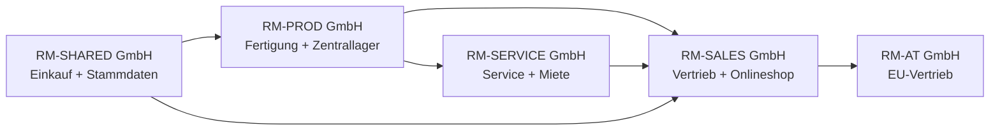
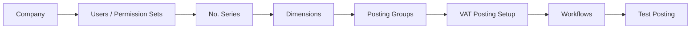
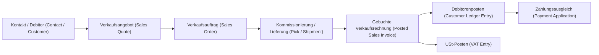
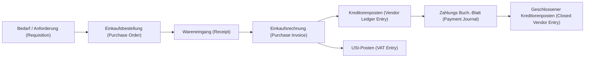

# FiBu-Buch 5: Business Central (BC) – Standardprozesse Deutschland als systematisches Greenfield-Durchspielbuch

Stand: `28.05.2026`
Hinweis: Dieses Buch ist ein quellenbasiertes Lern-, Schulungs-, Projekt- und Implementierungsbuch für Microsoft Dynamics 365 Business Central im deutschen Unternehmenskontext. Es ersetzt keine individuelle Rechts-, Steuer- oder Implementierungsberatung.

**Verlässlichkeitsstandard und Rechtsstand**
- Rechtsstand und Link-Prüfung der Primärquellen: `28.05.2026`.
- Fachlicher Fokus: Business Central Standard, deutsche Umsatzsteuer (USt), GoBD, E-Rechnung, HGB-nahe Finanzprozesse, Lager, Fertigung, Service, Projekte, Onlineshop, Intercompany und Reporting.
- BC-Funktionsumfang, Seitenbezeichnungen und Lokalisierungen können je Release Wave, Mandant, Lizenz, Sprache, Berechtigung und aktivierter Funktion abweichen.
- In diesem Buch ist die deutsche Business-Central-Oberfläche führend. Englische Microsoft-Learn-/Tell-Me-Begriffe stehen nur als Klammerzusatz, Suchhilfe oder Quellenbegriff daneben.
- Bei Abweichungen zwischen diesem Buch und Normtext oder Microsoft Learn gilt immer die aktuelle Primärquelle.
- Dieses Skript verwendet für Quellenangaben nur Primärquellen: Microsoft Learn, Gesetze im Internet, BMF, BZSt und amtliche EU-Quellen.

## Inhaltsverzeichnis nach sechs Teilen

**Teil A — Orientierung und Fallstudie**
1. Was dieses Buch ist
2. Wie man dieses Buch nutzt
3. Die Rhein-Main Industriegruppe als durchgehende Fallstudie
4. ERP und Business Central für absolute Einsteiger
5. Wie Business Central denkt

**Teil B — Grundlage: Firma, Daten, Setup**
6. Companies, Organisation und Mandantenlogik
7. Stammdaten der Fallstudie
8. Foundation Setup
9. Buchungslogik und Posting Groups
10. Dimensionen und Reportingachsen

**Teil C — Operative End-to-End-Prozesse**
11. Order-to-Cash: Maschine verkaufen
12. Procure-to-Pay: Rohmaterial einkaufen
13. Inventory und Warehouse: Ware bewegen und bewerten
14. Planning, Assembly und Manufacturing: Maschine produzieren
15. Service: Wartung, Garantie und Ersatzteilverbrauch
16. Projects: Installation und Meilensteinrechnung
17. Shopify, Dropshipping und Sonderverkauf
18. Intercompany und Ausland

**Teil D — Finance, Kontrolle und Abschluss**
19. Debitoren, Kreditoren und OP-Ausgleich
20. Bank, Payments und Bankabstimmung
21. Anlagen (Fixed Assets)
22. USt, E-Rechnung und deutsche Nachweissicht
23. Inventory Costing und Lagerbewertung im Abschluss
24. Monatsabschluss / Record-to-Report
25. Reporting, Controlling, Finanzberichte (Financial Reports) und Power BI

**Teil E — Projekt, Architektur und Betrieb**
26. Fit-Gap und Standard-first Design
27. Security, Rollen, SoD und Governance
28. Migration, Opening Balances und Cutover
29. Integrationen
30. Betrieb, Monitoring und Hypercare
31. Business Central Solution Architect Pfad

**Teil F — Training, Prüfung und Nachschlagen**
32. UAT-Testbibliothek
33. Übungen und Lösungen
34. MB-800-Kompetenzmatrix
35. Microsoft-Learn-Lernpfad-Mapping
36. MB-800-Prüfungstraining
37. Glossar Deutsch / Englisch / Tell-Me
38. Seitenindex, Prozesskatalog und Qualitätssicherung
39. Projektartefakte
40. Quellenverzeichnis

---


## Teil A — Orientierung und Fallstudie

Teil A führt in Ziel, Quellenlogik, Lernpfade und Fallstudie ein. Der Leser versteht zuerst die Firma und die ERP-Grundbegriffe, bevor er operative Prozesse bucht.

## 1. Was dieses Buch ist [Q1][Q2]

Dieses Buch erklärt Business Central nicht als Sammlung einzelner Masken. Es erklärt Business Central als Unternehmenssystem: Mitarbeiter legen Stammdaten an, kaufen ein, lagern ein, fertigen, verkaufen, liefern, fakturieren, kassieren, zahlen, melden Steuern, schließen Perioden und weisen alles prüfbar nach. Nach diesem Buch kannst du einen Greenfield-Trainingsmandanten aufbauen und die Standardprozesse Ende-zu-Ende durchspielen.

Ziel:
- Du kannst alle relevanten BC-Standardprozessbereiche fachlich einordnen und anhand eines deutschen Musterkonzerns bedienen. [Q1][Q2]
- Du erkennst, welche Prozesse direkt im Standard abbildbar sind und wo Miet-, Finanzierungs- oder Spezialmodelle Prozessdesign, Extension oder Customizing brauchen. [Q2]
- Du kannst je Abteilung sagen, was der Mitarbeiter in BC macht, welche Seite er öffnet, welche Felder er pflegt und welche Entries entstehen. [Q1]
- Du kannst Schulungen durchführen, weil Prozesskapitel Beispieldaten, Klickpfade, Übungen und einen Lösungsanhang enthalten.

### Was „alle Standardprozesse“ in diesem Buch bedeutet [Q2]

Business Central deckt nach Microsofts offizieller Prozesslandkarte Finance, Sales, Purchasing, Inventory, Warehouse Management, Online Store mit Shopify, Fixed Assets, Planning, Assembly, Manufacturing, Project Management, Service Management, Relationship Management, Human Resources, Reporting, Admin, Workflows und Integrationen ab. Dieses Buch nimmt diese Prozessgruppen als Mindestumfang. [Q1][Q2]

| BC-Prozessbereich | Wird in diesem Buch behandelt als | Trainingsziel |
|---|---|---|
| Finance | Hauptbuch, Nebenbücher, Bank, USt, Anlagen, Abschluss | Buchungsspur und Abschlussfähigkeit verstehen |
| Sales | Angebot, Auftrag, Lieferung, Rechnung, Retoure, Mahnung | O2C mit Abweichungen bedienen |
| Purchasing | Anfrage, Bestellung, Wareneingang, Eingangsrechnung, Rücksendung | P2P und 3-Way-Match erklären |
| Inventory | Artikel, Lagerorte, Varianten, Bewertung, Inventur | Mengen- und Wertfluss abstimmen |
| Lager/Warehouse | Einlagerung (Put-away), Kommissionierung (Pick), Lagerplätze (Bins), gesteuerte Lagerorte | einfache und gesteuerte Lagerlogik unterscheiden |
| Shopify/Online Store | Kunden-, Artikel- und Auftragsfluss aus dem Shop | Onlineshop-Aufträge in BC verarbeiten |
| Planning | Forecast, MPS, MRP, Planungsarbeitsblatt | Bedarf in Beschaffung/Fertigung übersetzen |
| Assembly | Montageauftrag, Assemble-to-Order, Kits | Baugruppen ohne volle Fertigung abbilden |
| Manufacturing | Stückliste, Arbeitsplan, Fertigungsauftrag, Verbrauch, Output | Produktionskosten und Abweichungen verstehen |
| Projects | Projektaufgaben, Ressourcen, Verbrauch, WIP, Faktura | Projektwertschöpfung abrechnen |
| Service | Serviceartikel, Serviceauftrag, Vertrag, Garantie | After-Sales-Prozesse steuern |
| Relationship Management | Kontakte, Verkaufschancen, Segmente | Vorvertrieb und Kundenbeziehung pflegen |
| Human Resources | Mitarbeiter, Abwesenheiten | Basis-HR im BC-Standard zeigen |
| Admin/Reporting | Rollen, Berechtigungen, Änderungsprotokoll (Change Log), Aufgabenwarteschlange (Job Queue), Analyse | Betrieb und Nachweis sichern |


### Standard, Pflicht, Best Practice und Projektentscheidung

Dieses Buch trennt vier Ebenen:

| Ebene | Bedeutung | Beispiel |
|---|---|---|
| Standard laut Quelle | Funktion ist in Microsoft Learn beschrieben | `Verkaufsaufträge (Sales Orders)`, `Einkaufsbestellungen (Purchase Orders)`, `Fertigungsaufträge (Production Orders)` |
| Deutsche Pflicht/Compliance | Rechtliche oder steuerliche Anforderung | § 147 AO, UStG, GoBD, E-Rechnung |
| BC-Best-Practice | robuste Projektpraxis, nicht automatisch Gesetz | Vier-Augen-Freigabe für USt-Setup |
| Projektentscheidung der Musterfirma | bewusst konstruiertes Trainingsdesign | ein gesteuertes Lager und ein einfaches Lager parallel |

> Merksatz: Best Practice ist keine Rechtsquelle. Sie ist die fachlich begründete Art, den Standard so zu nutzen, dass Prozesse stabil, prüfbar und schulbar werden.

### Sprachregel: deutsches Business Central zuerst

Dieses Buch schult auf einem deutschen Business-Central-Mandanten. Deshalb steht der deutsche Funktions- und Seitenbegriff immer im Vordergrund. Der englische Begriff bleibt nur dort stehen, wo er für Microsoft Learn, `Alt+Q`, Fehlersuche, internationale Projekte oder technische Tabellenbezeichnungen nützlich ist.

Schreibweise:
- deutscher BC-Begriff zuerst: `Verkaufsaufträge (Sales Orders)`.
- deutscher Postenbegriff zuerst: `Sachposten (G/L Entries)`.
- deutsche Funktion zuerst: `Buchungsvorschau (Preview Posting)`.
- englischer Begriff nur als Suchhilfe, Quellenbegriff oder technischer Tabellen-/Objektname.

Praxisregel:
- Mitarbeiter lernen die deutsche Oberfläche. Key User und Admins lernen zusätzlich die englischen Begriffe, weil Dokumentation, AppSource, Fehlermeldungen und Partnerkommunikation häufig englisch sind.

Beispiel:
- Ein Verkäufer sucht im deutschen BC nach `Verkaufsaufträge`. Wenn die Suche nichts findet oder die Umgebung englisch dokumentiert ist, nutzt er zusätzlich `Verkaufsaufträge (Sales Orders)`.

---

### Quellen-, Pflicht- und Best-Practice-Schicht

Das Buch ist quellenbasiert. Jede wesentliche BC-Funktion wird auf Microsoft Learn zurückgeführt. Jede deutsche Steuer- oder Nachweisaussage wird auf Gesetz, BMF oder BZSt gestützt. Best Practices werden separat benannt.

### Quellenlogik

| Aussageart | Primärquelle | Beispiel |
|---|---|---|
| BC-Standardfunktion | Microsoft Learn | Warehouse, Manufacturing, Service, Projects |
| deutsche USt | UStG, BZSt, BMF | Rechnung, UStVA, ZM, Reverse Charge |
| Aufbewahrung und Datenzugriff | AO, GoBD/BMF | § 147 AO, Z3, Verfahrensdokumentation |
| E-Rechnung | UStG, BMF, Microsoft Learn E-Documents | XML, Validierung, Archivierung |
| EU-Bezug | EUR-Lex, EU-Richtlinien | Mehrwertsteuer-Systemrichtlinie |

### Best-Practice-Katalog der Musterfirma

| Best Practice | Zweck | Nicht verwechseln mit |
|---|---|---|
| Change Request für Buchungsgruppen | systematische Falschbuchungen vermeiden | gesetzlicher Einzelpflicht |
| Vier-Augen-Prüfung bei Bankdaten | Betrugsprävention | vollständiger Payment-Approval-Lösung |
| Periodensperre nach Monatsabschluss | Vorperiodenbuchungen verhindern | Jahresabschlussprüfung |
| Evidence Pack je Steuerfall | Tax Review reproduzierbar machen | bloßer Belegablage |
| getrennte Lagerorte je Prozesslogik | Lagerbedienung schulbar halten | zwingender BC-Vorgabe |
| Rollenprofile nach Abteilung | Bedienung vereinfachen | alleiniger Berechtigungskontrolle |
| Testdatenkatalog | Schulungen wiederholbar machen | produktiver Migration |

Prüfungsfalle:
- In Projekten wird „Microsoft kann das“ häufig mit „unser Prozess ist prüfbar eingerichtet“ verwechselt. Die Funktion ist nur der Werkzeugkasten. Die Nachweislogik entsteht durch Setup, Rollen, Kontrolle und Dokumentation.

---


## 2. Wie man dieses Buch nutzt: Lernpfade und Reifegrad

Dieses Kapitel zeigt dir, wie du das Buch je nach Rolle durcharbeitest. Die Kapitel 1 bis 40 bleiben dieselbe Landkarte; nur Reihenfolge, Tempo und Übungstiefe ändern sich.

### Lernpfad für Einsteiger: 7 Tage

Der Einsteigerpfad setzt kein ERP-Wissen voraus. Er führt von der Firma über Grundbegriffe zu den ersten Buchungen und Nachweisen.

| Tag | Kapitel | Ergebnis |
|---|---|---|
| 1 | 1 bis 5 | Buchziel, Rhein-Main-Fallstudie, ERP-Grundbegriffe und BC-Denkweise verstehen |
| 2 | 6 bis 8 | Companies, Stammdaten und Foundation Setup sicher einordnen |
| 3 | 9 bis 10 | Buchungsgruppen, Kontenfindung, Dimensionen und Reportingachsen verstehen |
| 4 | 11 bis 12 | Verkauf/O2C und Einkauf/P2P mit Belegen, Posten und Kontrollberichten durchführen |
| 5 | 13 bis 18 | Lager, Fertigung, Service, Projekte, Shopify, Dropshipping, Ausland und Intercompany als Prozesskette lesen |
| 6 | 19 bis 25 | OP-Ausgleich, Bank, Anlagen, USt, Lagerbewertung, Monatsabschluss und Reporting prüfen |
| 7 | 32, 33, 37 und 38 | UAT-Fälle ausführen, Lösungen nachvollziehen, Begriffe nachschlagen und Prozesskatalog nutzen |

Praxisregel:
- Einsteiger lesen zuerst die Geschichte der Rhein-Main Industriegruppe. Danach werden Seiten, Felder und Posten leichter verständlich, weil jeder Klick einen geschäftlichen Grund hat.

### Lernpfad für Buchhaltung

| Phase | Kapitel | Fokus |
|---|---|---|
| Grundlagen | 6 bis 10 | Company, Stammdaten, Buchungsgruppen, USt-Matrix und Dimensionen |
| Tagesgeschäft | 11, 12, 19 und 20 | Verkaufs- und Einkaufsbelege, OP-Ausgleich, Zahlungsjournale und Bankabstimmung |
| Anlagen und Steuer | 21 und 22 | Anlagenzugang, AfA, USt-Posten, E-Rechnung und deutsche Nachweissicht |
| Abschluss | 23 bis 25 | Lagerbewertung, Monatsabschluss, GuV, Bilanz, Finanzberichte und Power BI |
| Nachweis und Prüfung | 32 bis 38 | UAT, Übungen, MB-800-Abdeckung, Prüfungstraining, Glossar und Seitenindex |

### Lernpfad für Key User

Key User verbinden Fachprozess und Systembedienung. Sie lesen Kapitel 3 bis 5 für die Fallstudie, Kapitel 7 bis 10 für Daten und Setup, danach die eigenen Prozesskapitel aus 11 bis 25. UAT, Übungen, Glossar, Seitenindex und Projektartefakte stehen in Kapitel 32, 33, 37, 38 und 39.

Typische Reihenfolge:
1. Rhein-Main-Fallstudie und BC-Denkweise: Kapitel 3 bis 5.
2. Stammdaten, Buchungsgruppen und Dimensionen: Kapitel 7 bis 10.
3. Eigener Fachbereich: passende Prozesskapitel 11 bis 25.
4. UAT und Schulungsfähigkeit: Kapitel 32 und 33.
5. Nachschlagen und Projektarbeit: Kapitel 37 bis 39.

### Lernpfad für Junior Functional Consultants

Junior Consultants bearbeiten zuerst die Grundlagenkapitel 1 bis 10. Danach führen sie alle operativen und Finance-Prozesse in Kapitel 11 bis 25 mit Testdaten durch. Teil E mit Kapitel 26 bis 31 ergänzt Fit-Gap, Security, Migration, Integrationen, Betrieb und Solution-Architect-Denken. Teil F mit Kapitel 32 bis 39 liefert UAT, Übungen, MB-800, Microsoft Learn, Glossar, Seitenindex und Projektartefakte.

Prüfungstipp:
- Ein Junior Consultant gilt erst dann als projektsicher, wenn er einen gebuchten Beleg bis in Nebenbuch, Sachposten, USt-Posten, Artikelposten, Wertposten und Bericht erklären kann.

### Lernpfad für Solution Architects

Solution Architects arbeiten stärker entscheidungsorientiert. Sie starten mit Kapitel 3, 6, 9 und 10, weil Company-Struktur, Buchungsgruppen und Dimensionen die Architektur prägen. Danach folgen die Architektur- und Projektkapitel 26 bis 31. Die Prozesskapitel 11 bis 25 werden nicht nur geklickt, sondern auf Standardgrenze, Extension-Kandidat, UAT-Nachweis und Betriebsfolge geprüft. Kapitel 35, 38 und 39 dienen als Quellen-, Prozess- und Artefakt-Nachweis.

### MB-800-Lernplan 14 Tage

| Tag | Fokus | Kapitel |
|---|---|---|
| 1 | Study Guide, Buchlogik, Oberfläche, ERP-Grundlagen | 1 bis 5, 34 |
| 2 | Companies, Assisted Setup, Konfigurationspakete, Opening Balances | 6, 8 und 28 |
| 3 | Benutzer, Profile, Berechtigungssätze, Security Groups, Security Filters | 27 |
| 4 | Nummernserien, Dimensionen, Workflows und Genehmigungen | 8, 10 und 27 |
| 5 | Hauptbuch, Perioden, Zahlungsbedingungen, Währungen, Posting Groups | 9 und 24 |
| 6 | Kontenplan, Finanzberichte, Buchungsgruppen, Dimensionen im Reporting | 9, 10 und 25 |
| 7 | Debitoren, Kreditoren, OP-Ausgleich und Zahlungen | 19 und 20 |
| 8 | Anlagen, AfA-Bücher, Zugang, Abschreibung und Abgang | 21 |
| 9 | Artikel, Lagerorte, Kostenmethoden, Artikelposten und Wertposten | 13 und 23 |
| 10 | Einkauf, Wareneingang, Eingangsrechnung, Rücksendung, Gutschrift | 12 |
| 11 | Verkauf, Lieferung, Rechnung, Retoure, Gutschrift, Vorauszahlung | 11 |
| 12 | Shopify, Dropshipping, Ausland, USt und E-Rechnung | 17, 18 und 22 |
| 13 | Bankabstimmung, Journale, Ausgleich, Währungen und Korrekturen | 19, 20 und 24 |
| 14 | UAT, Übungen, MB-800-Matrix und Prüfungstraining | 32 bis 36 |

### MB-800-Lernplan 30 Tage

Der 30-Tage-Plan nutzt dieselbe Reihenfolge wie der 14-Tage-Plan. Jeder Themenblock bekommt zusätzlich einen Übungstag aus Kapitel 33, einen UAT-Tag aus Kapitel 32 und einen Prüfungstag aus Kapitel 36. Die letzten vier Tage bestehen aus Rhein-Main-Gesamtfall, Kompetenzmatrix in Kapitel 34, Microsoft-Learn-Mapping in Kapitel 35 und Wiederholung der Prüfungsfallen.

### In 5 Minuten merken

- 5 wichtigste Begriffe: Company, Rolle, Beleg, Posten, Buchungsgruppe.
- 5 wichtigste Seiten: `Verkaufsaufträge`, `Einkaufsbestellungen`, `Sachposten`, `Dimensionen`, `Finanzberichte`.
- 3 häufigste Fehler: falsche Company, falsche Dimension, falsche USt-Gruppe.
- 3 Prüfungsfallen: Personalisieren vs. Anpassen, Allgemeine Buchungsmatrix Einrichtung vs. USt-Buchungsmatrix Einrichtung, Artikelposten vs. Wertposten.
- 1 Praxisregel: Erst Setup und Stammdaten verstehen, dann Prozesse buchen und die Posten nachweisen.

---


## 3. Die Rhein-Main Industriegruppe als durchgehende Fallstudie

Die Musterfirma ist bewusst breit konstruiert. Sie soll Business Central nicht minimal abbilden, sondern als Trainingsuniversum möglichst vollständig auslösen.

### Die Fallstudie in einfachen Worten

Die Rhein-Main Industriegruppe baut Maschinen, verkauft Ersatzteile, betreibt einen Onlineshop, schickt Servicetechniker zum Kunden, wickelt Projekte ab und führt mehrere Gesellschaften in einer Unternehmensgruppe. Genau deshalb braucht sie ein ERP-System. Ohne ERP würden Vertrieb, Einkauf, Lager, Fertigung, Service und Buchhaltung mit getrennten Listen arbeiten. Dann weiß der Vertrieb nicht sicher, ob Ware verfügbar ist. Der Einkauf sieht zu spät, welches Material fehlt. Das Lager kennt Mengen, aber nicht immer Werte. Finance erkennt Fehler erst im Monatsabschluss.

Business Central verbindet diese Abteilungen. Ein Verkaufsauftrag ist nicht nur ein Formular für den Kunden. Er beeinflusst Lager, Umsatz, Umsatzsteuer, Forderungen, Wareneinsatz, Dimensionen und Reporting. Eine Einkaufsbestellung ist nicht nur eine Bestellung beim Lieferanten. Sie beeinflusst Materialverfügbarkeit, Lagerwert, Kreditorenposten, Vorsteuer und Fertigungsfähigkeit. Die Fallstudie führt diese Zusammenhänge durch das gesamte Buch.

Die Gruppe verdient Geld über mehrere Erlösquellen:

| Erlösquelle | Beispiel | Warum BC relevant ist |
|---|---|---|
| Maschinenverkauf | `RM-M100` | Verkauf, Lager, Fertigung, Finance |
| Sondermaschinen | `RM-X500` | Projekt, Fertigung, Meilensteinrechnung |
| Ersatzteile | `SP-PUMP-01` | Lager, Shop, Service |
| Service | Wartung und Reparatur | Serviceauftrag, Ressource, Ersatzteil |
| Projekte | Installation | Projektposten, WIP, Faktura |
| Miete | Mietmaschine | Abgrenzung, Standardgrenze |
| Intercompany | RM-PROD an RM-SALES | IC-Belege, Abstimmung |

Vor Business Central hatte die Gruppe typische Probleme:
- Vertrieb verkaufte Artikel ohne belastbare Verfügbarkeitsprüfung.
- Einkaufspreise und Verkaufsmargen wurden zu spät verglichen.
- Lagerbestand stimmte mengenmäßig, aber nicht immer wertmäßig.
- Finance erkannte USt-Fehler erst im Monatsabschluss.
- Service verbrauchte Ersatzteile, ohne jeden Fall sauber zu fakturieren.
- Projektkosten wurden zu spät sichtbar.
- Intercompany-Abstimmung erfolgte manuell.
- Management erhielt keine verlässliche GuV nach Produktlinie.
- Excel-Listen erzeugten Dubletten und falsche Stammdaten.
- Berechtigungen waren unklar.
- Belege und Nachweise waren schwer auffindbar.

Business Central wird eingeführt, damit dieselben Stammdaten und Buchungsregeln in allen Abteilungen gelten. Der Standard-first-Ansatz bedeutet: Zuerst wird geprüft, ob Business Central Standard den Prozess tragen kann. Erst danach wird über Extension, Integration oder Customizing entschieden.

### Konzernstruktur

| Company in BC | Rolle im Konzern | Hauptprozesse |
|---|---|---|
| `RM-PROD GmbH` | Produktion und Zentrallager | Fertigung, gesteuertes Lager, Einkauf, Intercompany-Verkauf |
| `RM-SALES GmbH` | Vertrieb und Onlineshop | B2B, B2C, Shopify, Dropshipping, Debitoren |
| `RM-SERVICE GmbH` | Wartung, Miete, Finanzierungsvorbereitung | Service, Mietfälle, Projekte, Anlagen-/Serviceartikel |
| `RM-SHARED GmbH` | Shared Services | Einkauf, Stammdaten, Zahlungsverkehr, Reporting |
| `RM-AT GmbH` | EU-Auslandsgesellschaft | Intercompany, EU-USt, Intrastat-nahe Fälle |



### Standorte und Lagerlogik

| Lagerort | Company | Lagerart | BC-Logik | Trainingszweck |
|---|---|---|---|---|
| `FRA-ZL` | RM-PROD | Zentrallager | gesteuerte Einlagerung/Kommissionierung mit Lagerplätzen (Bins) | Lagereingang (Warehouse Receipt), Einlagerung (Put-away), Kommissionierung (Pick), Warenausgang (Shipment) |
| `MZ-EINFACH` | RM-SALES | Außenlager | einfache Lagerbuchung ohne gesteuerte Einlagerung | einfacher Wareneingang und Verkauf |
| `HH-FUL` | RM-SALES | Onlineshop-Fulfillment | Kommissionierung/Lieferung (Pick/Shipment) vereinfacht | Shop-Auftrag bis Versand |
| `VAN-01` | RM-SERVICE | Servicefahrzeug | Lagerort für Techniker | Ersatzteilverbrauch im Service |
| `PROJ-BER` | RM-SERVICE | Projektlager | Projektbezogenes Lager | Projektmaterial und Baustelle |
| `DROP` | RM-SALES | Dropshipping | kein eigener Bestand | Direktlieferung Lieferant an Kunde |

### Geschäftsmodelle

| Modell | Use Case | BC-Schwerpunkt | Standardgrenze |
|---|---|---|---|
| Eigenfertigung | Standardmaschine `RM-M100` | Manufacturing | vollständig im Standard demonstrierbar |
| Variantenfertigung | Sondermaschine `RM-X500` | BOM/Routing/Projekt/Fertigung | Variantenlogik braucht klare Stammdaten |
| Handelsware | Ersatzteil `SP-PUMP-01` | O2C/P2P/Inventory | Standard |
| Onlineshop | Webshop-Verkauf Ersatzteile | Shopify Connector / Verkaufsaufträge (Sales Orders) | abhängig von Connector-Setup |
| Service | Wartung beim Kunden | Service Management | Standard |
| Miete | Mietmaschine 12 Monate | Service/Projekte/Abgrenzungen/Anlagen (Service/Projects/Deferrals/Fixed Assets) | Standard nur mit Prozessdesign |
| Finanzierung | Kunde finanziert Maschine über Bank | Sales/Receivables/Deferrals | komplexe Finanzierungslogik nicht vollständig Standard |
| Intercompany | PROD verkauft an SALES | Intercompany | Standard mit IC-Setup |
| Dropshipping | Lieferant liefert direkt an Kunden | Sales + Purchase Link | Standard |

---

### Erzählerischer Zusammenhang der Use Cases

Die Rhein-Main Industriegruppe verdient ihr Geld nicht mit einem einzigen Prozess. Ein Maschinenverkauf beginnt im Vertrieb, löst Verfügbarkeitsprüfung aus, kann Fertigung anstoßen, bewegt Lagerwerte und endet in Forderung, Zahlung und GuV. Ein Servicefall beginnt beim Kundenproblem, verbraucht Ersatzteile, erzeugt Technikerzeiten und entscheidet zwischen Rechnung, Garantie und Kulanz. Ein Projekt verbindet Sondermaschine, Fremdleistung, Material, Ressourcen und Meilensteinrechnung.

Mehrere Companies sind deshalb kein Selbstzweck. RM-PROD zeigt Produktion und Materialfluss. RM-SALES zeigt Markt, Kunden, Preise und Onlineshop. RM-SERVICE zeigt laufende Kundenbetreuung. RM-SHARED bündelt Finance, USt, Bank, Reporting und Administration. RM-AT macht EU- und Auslandsszenarien sichtbar. Business Central löst damit reale Probleme: weniger Dubletten, bessere Verfügbarkeit, nachvollziehbare Steuerlogik, abgestimmte Posten, belastbare GuV nach Produktlinie und klare Verantwortlichkeiten.


## 4. ERP und Business Central für absolute Einsteiger

Dieses Kapitel erklärt Business Central ohne ERP-Vorkenntnisse. Du lernst, warum Unternehmen ein integriertes System brauchen, wie aus Stammdaten Belege entstehen und warum Posten nach dem Buchen wichtiger sind als die ursprüngliche Bildschirmmaske.

### Das Grundprinzip in einfachen Worten

Ein ERP-System (Enterprise Resource Planning) ist das zentrale Arbeitssystem eines Unternehmens. Es verbindet Verkauf, Einkauf, Lager, Fertigung, Service, Projekte, Bank und Buchhaltung. Ohne ERP arbeiten Abteilungen oft mit Excel-Listen, E-Mails und einzelnen Programmen. Dann stimmen Kunden, Artikel, Preise, Lagerbestände und offene Posten nicht zuverlässig überein.

Business Central ist das ERP-System der Rhein-Main Industriegruppe. Ein Verkaufsauftrag ist dort nicht nur ein Formular. Er verbindet Debitor, Artikel, Preis, Liefertermin, Lagerort, USt und Dimensionen. Wenn der Auftrag geliefert und fakturiert wird, entstehen gebuchte Belege und Posten. Diese Posten zeigen Finance, Lager und Controlling, was wirklich passiert ist.

Beispiel Verkauf: Kunde `D10000` bestellt eine Pumpe `SP-PUMP-01`. Business Central erzeugt daraus einen Verkaufsauftrag. Beim Buchen entstehen Forderung, Erlös, USt, Lagerabgang und Wertposten. Deshalb prüft RM-SHARED nach dem Buchen nicht nur die Rechnung, sondern auch Debitorenposten, Sachposten, Artikelposten, Wertposten und USt-Posten.

Beispiel Einkauf: RM-PROD kauft Stahl `RAW-STEEL` bei `K10000`. Beim Wareneingang steigt der Bestand. Bei der Eingangsrechnung entsteht eine Verbindlichkeit und Vorsteuer. Einkauf, Lager und Buchhaltung arbeiten also am gleichen Vorgang, aber aus unterschiedlichen Perspektiven.

Beispiel Zahlung: Wenn der Kunde die Rechnung bezahlt, wird die Zahlung mit dem offenen Debitorenposten ausgeglichen. Erst dann ist die Forderung erledigt. Ein Kontoauszug allein genügt nicht; Business Central muss wissen, welche Rechnung mit welcher Zahlung zusammengehört.

Praxisregel:
- In Business Central zählt nach dem Buchen die Postenspur: Beleg, gebuchter Beleg, Nebenbuchposten, Sachposten, USt-Posten, Artikelposten, Wertposten und Bericht müssen zusammenpassen.

### Rollen, Abteilungen und Bedienlogik in BC

Ein vollständiges Schulungsbuch muss zeigen, wie Mitarbeiter arbeiten. Deshalb beschreibt jedes Prozesskapitel fachliche Aufgabe, Role Center, Tell-Me-Suche, Seiten, Felder und Folgebelege.

#### Rollenmatrix

| Rolle | Abteilung | Typische BC-Seiten | Was macht der Mitarbeiter? |
|---|---|---|---|
| Verkäuferin | Vertrieb | `Verkaufsangebote (Sales Quotes)`, `Verkaufsaufträge (Sales Orders)`, `Debitoren (Customers)`, `Kontakte (Contacts)` | Angebot erstellen, Auftrag erfassen, Verfügbarkeit prüfen, Rechnung auslösen |
| E-Commerce-Sachbearbeiter | Onlineshop | `Shopify-Shops (Shopify Shops)`, `Verkaufsaufträge (Sales Orders)`, `Artikel (Items)`, `Debitoren (Customers)` | Shop-Aufträge synchronisieren, Fehler klären, Versand anstoßen |
| Einkäufer | Einkauf | `Kreditoren (Vendors)`, `Einkaufsbestellungen (Purchase Orders)`, `Einkaufsrechnungen (Purchase Invoices)` | Bestellung auslösen, Preise prüfen, Wareneingang/Rechnung abstimmen |
| Lagerist einfaches Lager | Lager MZ | `Artikeljournale (Item Journals)`, `Verkaufslieferungen (Sales Shipments)`, `Einkaufslieferungen (Purchase Receipts)` | Ware annehmen, Bestand prüfen, Lieferung buchen |
| Lagerist gesteuertes Lager | FRA-ZL | `Lagereingänge (Warehouse Receipts)`, `Lagereinlagerungen (Warehouse Put-aways)`, `Lagerkommissionierungen (Warehouse Picks)`, `Warenausgänge (Warehouse Shipments)` | Einlagern, kommissionieren, versenden |
| Produktionsplanerin | Fertigung | `Planungsarbeitsblatt (Planning Worksheet)`, `Fertigungsaufträge (Production Orders)`, `Stücklisten (BOMs)`, `Arbeitspläne (Routings)` | Bedarf planen, Fertigungsaufträge erstellen, Termine prüfen |
| Meister | Fertigung | `Freigegebene Fertigungsaufträge (Released Production Orders)`, `Verbrauch Buch.-Blatt (Consumption Journal)`, `Istmeldung Buch.-Blatt (Output Journal)` | Verbrauch und Output melden, Ausschuss dokumentieren |
| Servicetechniker | Service | `Serviceaufträge (Service Orders)`, `Serviceartikel (Service Items)`, `Artikeljournale (Item Journals)` | Serviceauftrag bearbeiten, Ersatzteile verbrauchen, Zeiten erfassen |
| Projektleiter | Projekte | `Projekte (Projects)`, `Project Tasks`, `Project Journals` | Budget, Verbrauch, Fortschritt und Faktura steuern |
| Debitorenbuchhalterin | Finance | `Debitorenposten (Customer Ledger Entries)`, `Zahlungsabstimmungs Buch.-Blatt (Payment Reconciliation Journal)`, `Reminders` | Zahlung ausgleichen, mahnen, offene Posten prüfen |
| Kreditorenbuchhalter | Finance | `Kreditorenposten (Vendor Ledger Entries)`, `Zahlungs Buch.-Blätter (Payment Journals)`, `Einkaufsrechnungen (Purchase Invoices)` | Eingangsrechnungen prüfen, Zahlungen vorbereiten |
| Anlagenbuchhalterin | Finance | `Anlagen (Fixed Assets)`, `Anlagen Buch.-Blätter (FA Journals)`, `AfA berechnen (Calculate Depreciation)` | Zugänge, AfA und Abgänge buchen |
| Controller | Controlling | `Analyseansichten (Analysis Views)`, `Finanzberichte (Financial Reports)`, `Dimensionen (Dimensions)` | Auswertungen und Abweichungen analysieren |
| BC-Admin | IT/Finance Operations | `Benutzer (Users)`, `Berechtigungssätze (Permission Sets)`, `Änderungsprotokoll Einrichtung (Change Log Setup)`, `Aufgabenwarteschlangenposten (Job Queue Entries)` | Rollen, Automatisierung und Audit Trail verwalten |

#### Bedienmuster

1. **Role Center prüfen:** Der Mitarbeiter startet im passenden Arbeitsbereich.
2. **`Alt+Q`nutzen:** Er sucht stabile Seitenbegriffe, nicht lange Menüpfade.
3. **Belegkopf prüfen:** Kunde/Lieferant, Datum, Standort, Währung, Dimension, USt-Gruppe.
4. **Zeilen pflegen:** Artikel, Ressource, Sachkonto, Menge, Preis, Lagerort, Projekt.
5. **Vorschau/Prüfung:** Posting Preview, Verfügbarkeit, Freigabe, Pflichtfelder.
6. **Buchen:** Post/Release/Register.
7. **Nachweis prüfen:** Entries, Belegkette, Attachments, Reports.

Praxisregel:
- Schulungen beginnen mit Rollen und Aufgaben, nicht mit Menüs. Ein Einkäufer muss wissen, warum er eine Bestellung auslöst; die Seite ist erst der zweite Schritt.

---


## 5. Wie Business Central denkt

Dieses Kapitel erklärt die Denkweise hinter Business Central und liefert danach die Trainingsdaten der Fallstudie. Du lernst zuerst, welche Datenarten es gibt, und nutzt anschließend dieselben Debitoren, Kreditoren, Artikel, Ressourcen, Anlagen und Belege in allen Prozesskapiteln.

### Das Datenmodell für Einsteiger

Stammdaten sind dauerhafte Grunddaten. Dazu gehören Debitoren, Kreditoren, Artikel, Ressourcen, Anlagen, Lagerorte, Zahlungsbedingungen, Buchungsgruppen und Dimensionen. Bewegungsdaten entstehen aus Geschäftsvorfällen. Dazu gehören Angebote, Aufträge, Wareneingänge, Rechnungen, Zahlungen, Lagerbewegungen, Serviceaufträge und Journalzeilen.

Ein Beleg ist ein noch bearbeitbarer Vorgang, zum Beispiel ein Verkaufsauftrag. Ein gebuchter Beleg ist das Ergebnis einer Buchung, zum Beispiel eine gebuchte Verkaufsrechnung. Nach dem Buchen entstehen Posten. Posten sind die prüfbare Wahrheit in Business Central, weil sie Mengen, Werte, Steuern, offene Posten und Sachkonten nachvollziehbar speichern.

Ein Journal ist eine Erfassungsmaske für Buchungen, die nicht aus einem operativen Beleg kommen oder bewusst direkt gebucht werden. Beispiele sind allgemeine Buchungsblätter, Zahlungsbuchungsblätter, Anlagenbuchungsblätter oder Artikel Buch.-Blätter. Der Unterschied ist wichtig: Ein Verkaufsauftrag erzeugt eine Belegkette mit Lieferung und Rechnung; ein Journal bucht direkter und braucht deshalb stärkere Kontrolle.

Eine Buchungsgruppe ist eine Stammdaten-Eigenschaft, die Business Central später zur Kontenfindung nutzt. Eine Buchungsmatrix verbindet Geschäftspartnerart und Produktart. Sie entscheidet, welche Sachkonten bei Verkauf, Einkauf, Lager oder USt angesprochen werden. Eine Dimension ist eine Auswertungsachse, etwa Produktlinie, Abteilung oder Standort.

Ein Kontrollbericht ist eine Auswertung, mit der der Fachbereich prüft, ob das Ergebnis stimmt. Ein Evidence Pack (Nachweispaket) ist die Sammlung aus Belegnummern, Posten, Berichten, Exporten und Freigaben, die einen Prozess prüfbar macht. UAT (User Acceptance Testing) bedeutet fachlicher Benutzerabnahmetest: Die Fachabteilung führt echte Testfälle aus und bestätigt, dass der Prozess alltagstauglich funktioniert.

Praxisregel:
- Erst Stammdaten verstehen, dann Belege buchen, danach Posten und Berichte prüfen. Wer diese Reihenfolge beherrscht, versteht Business Central.


## Teil B — Grundlage: Firma, Daten, Setup

Teil B richtet den Trainingsmandanten fachlich ein. Hier entstehen Companies, Stammdaten, Nummernserien, Buchungsgruppen, Dimensionen und grundlegende Bedienlogik.

## 6. Companies, Organisation und Mandantenlogik [Q3][Q4][Q5][Q6]

Foundation-Prozesse tragen alle Fachprozesse. Fehler in Nummernserien, Dimensionen, Buchungsgruppen oder Berechtigungen wirken wie ein Multiplikator.

### Quelle und Zweck

Standard laut Quelle:
- Business Central unterstützt mehrere Companies, Benutzer, Berechtigungen, Workflows, Job Queues, Change Log und Einrichtung für Geschäftsprozesse. [Q3][Q4][Q5][Q6]

Deutsche Pflicht/Compliance:
- Für steuerrelevante Systeme sind Nachvollziehbarkeit, Vollständigkeit, Richtigkeit, Unveränderbarkeit und Datenzugriff im GoBD-Kontext relevant. [Q21][Q22]

BC-Best-Practice:
- Setup-Änderungen an Posting Groups, VAT Posting Setup, Nummernserien und Dimensionen laufen über Change Request, Testnachweis und Freigabe.

### Mitarbeiterbedienung

| Rolle | Aufgabe | `Alt+Q`/ Seite | Was wird getan? |
|---|---|---|---|
| BC-Admin | Company anlegen | `Companies` | Trainingscompanies erstellen |
| Finance-Leitung | Buchungsperioden steuern | `General Ledger Setup`, `Accounting Periods` | Buchungsfenster festlegen |
| Stammdaten-Team | Dimensionen pflegen | `Dimensionen (Dimensions)`, `Dimension Values` | Pflichtdimensionen anlegen |
| Admin | Change Log aktivieren | `Change Log Setup` | kritische Tabellen überwachen |
| Prozessowner | Workflow prüfen | `Workflows`, `Approval User Setup` | Freigaben für Einkauf/Verkauf definieren |

### E2E-Setupfluss



### UAT-Schulung Foundation

Aufgabe:
1. Lege Dimension `CHANNEL` mit Werten `B2B`, `SHOP`, `IC`, `SERVICE`, `PROJECT` an.
2. Setze `CHANNEL` als Pflichtdimension für Debitor `D10000`.
3. Buche eine Verkaufsrechnung ohne `CHANNEL`.
4. Korrigiere den Fehler und buche erneut.

Erwartete Lösung:
- Die Buchung ohne Pflichtdimension wird verhindert oder als Fehler markiert.
- Die korrigierte Buchung erzeugt `Sachposten (G/L Entries)` mit Dimension `CHANNEL = B2B`.

Kontrollfrage:
- Warum ist eine Pflichtdimension eher ein Prozesskontrollinstrument als eine reine Reporting-Einstellung?

---

### Greenfield-Einführung: Konzern von null aufbauen

Dieses Kapitel ordnet das Buch neu aus Greenfield-Sicht. Wir beginnen nicht mit einzelnen Funktionen, sondern mit einem leeren Mandanten. Danach entstehen Companies, Rollen, Konten, Dimensionen, Steuerlogik, Lagerorte, Stammdaten, Prozesse, Berichte und Betrieb. So lernt der Leser, Business Central nicht nur zu bedienen, sondern aufzubauen.

### Sinnvolle Buchstruktur von Grund auf

Die bisherige Struktur deckt die Themen fachlich ab. Für Lernen und Einführung ist diese Reihenfolge didaktisch sinnvoller:

| Phase | Buchlogik | Warum diese Reihenfolge? |
|---|---|---|
| 1 | Zielbild, Quellen, Sprachregel | Leser versteht Standard, Pflicht und deutsche Oberfläche |
| 2 | Musterkonzern und Rollen | Leser weiß, wer im System arbeitet |
| 3 | Greenfield-Grundeinrichtung | Mandant, Companies, Konten, USt, Dimensionen, Nummernserien entstehen |
| 4 | Stammdaten und Trainingsdaten | Debitoren, Kreditoren, Artikel, Ressourcen, Projekte, Anlagen |
| 5 | Kernprozesse | Verkauf, Einkauf, Lager, Fertigung, Service, Projekte, Finance |
| 6 | Postenlogik und Reporting | Leser versteht, was Buchungen auslösen |
| 7 | Admin, Governance, Monitoring | System bleibt stabil |
| 8 | Übungen, Lösungen, UAT | Wissen wird praktisch geprüft |

Korrektur zur bisherigen Fassung:
- Kapitel dürfen nicht wie eine Sammlung einzelner Erweiterungen wirken. Der rote Faden ist jetzt: **Greenfield → Setup → Stammdaten → Prozess → Posten → Bericht → Betrieb → Übungslösung**.

### Greenfield-Masterplan der Rhein-Main Industriegruppe

| Schritt | Ergebnis | Deutsche BC-Seiten |
|---|---|---|
| 1 | Firmenstruktur steht | `Unternehmen (Companies)` |
| 2 | Basisdaten je Company gepflegt | `Unternehmensdaten (Company Information)` |
| 3 | Kontenplan steht | `Kontenplan (Chart of Accounts)` |
| 4 | Buchungsgruppen und USt-Logik stehen | `Buchungsmatrix Einrichtung`, `USt-Buchungsmatrix Einrichtung` |
| 5 | Dimensionen stehen | `Dimensionen`, `Standarddimensionen` |
| 6 | Nummernserien stehen | `Nummernserien (No. Series)` |
| 7 | Lagerstruktur steht | `Lagerorte (Locations)`, `Lagerplätze (Bins)` |
| 8 | Benutzer/Rollen stehen | `Benutzer`, `Berechtigungssätze`, `Profile/Rollen` |
| 9 | Stammdaten stehen | `Debitoren`, `Kreditoren`, `Artikel`, `Ressourcen`, `Anlagen`, `Projekte` |
| 10 | Workflows und Kontrollen stehen | `Workflows`, `Genehmigungsanforderungen` |
| 11 | Berichte stehen | `Finanzberichte`, `Analyseansichten` |
| 12 | Betrieb steht | `Aufgabenwarteschlangenposten`, `Änderungsprotokoll`, `Erweiterungsverwaltung` |

### Beispieldatenpaket für den Start

Companies:

| Company | Zweck | Besonderheit |
|---|---|---|
| `RM-PROD` | Produktion | Fertigung, gesteuertes Lager |
| `RM-SALES` | Vertrieb/Onlineshop | Verkauf, Shopify, Dropshipping |
| `RM-SERVICE` | Service/Miete | Serviceaufträge, Wartung, Mietlogik |
| `RM-SHARED` | Einkauf/Shared Services | zentrale Kreditoren, Umlagen |
| `RM-CH` | Ausland/Intercompany | Drittland-/CH-Bezug |

Dimensionen:

| Dimension | Werte |
|---|---|
| `DEPARTMENT` | `SALES`, `PURCH`, `WH`, `PROD`, `SERV`, `FIN`, `ADMIN` |
| `PRODUCTLINE` | `MACHINE`, `SPARE`, `SERVICE`, `PROJECT`, `RENTAL` |
| `CHANNEL` | `B2B`, `SHOP`, `IC`, `EXPORT` |
| `LOCATION-GROUP` | `FRA`, `MZ`, `DA`, `VAN`, `PROJECT` |

Artikel:

| Artikel | Art | Kosten | Verkaufspreis | Prozess |
|---|---|---:|---:|---|
| `RM-M100` | Maschine | 18.000 | 32.000 | Fertigung/Verkauf |
| `SP-PUMP-01` | Ersatzteil | 180 | 320 | Lager/Verkauf |
| `SP-SENSOR-02` | Ersatzteil | 75 | 149 | Shop/Service |
| `RAW-STEEL` | Rohmaterial | 2.500 | - | Einkauf/Fertigung |
| `KIT-MAINT` | Wartungskit | 240 | 450 | Montage/Service |

Debitoren:

| Debitor | Land | Typ | Zahlungsbedingung | Steuerfall |
|---|---|---|---|---|
| `D10000` | DE | B2B | 14 Tage 2 %, 30 Tage netto | Inland |
| `D20000` | FR | EU-B2B | 30 Tage netto | EU-Lieferung |
| `D30000` | CH | Drittland | Vorkasse | Export |
| `D40000` | DE | B2C-Shop | sofort | Onlineshop |

Kreditoren:

| Kreditor | Land | Zweck | Steuerfall |
|---|---|---|---|
| `K10000` | DE | Rohmaterial | Inland |
| `K20000` | NL | Handelsware | EU-Erwerb |
| `K30000` | CH | Spezialteile | Import/Drittland |
| `K40000` | DE | Fremdarbeit | Inland/Fertigung |

### Reihenfolge der praktischen Einrichtung im Buch

1. Company `RM-PROD` anlegen.
2. Unternehmensdaten pflegen.
3. Kontenplan und Sachkontokategorien prüfen.
4. Buchungsgruppen und USt-Buchungsmatrix einrichten.
5. Dimensionen und Pflichtdimensionen einrichten.
6. Nummernserien einrichten.
7. Lagerorte `FRA-ZL`, `MZ-EINFACH`, `VAN-SERV`, `PROJ-LAG` anlegen.
8. für `FRA-ZL` Lagerplätze und gesteuerte Lagerlogik aktivieren.
9. Benutzer und Rollenprofile anlegen.
10. Debitoren, Kreditoren, Artikel, Ressourcen, Projekte und Anlagen anlegen.
11. Verkaufspreislisten und Einkaufspreislisten aktivieren.
12. Workflows für Einkauf, Bankdaten und USt-Setup aktivieren.
13. Beleglayouts, E-Mail-Szenarien und Berichtsauswahl einrichten.
14. Aufgabenwarteschlange (Job Queue) und Änderungsprotokoll (Change Log) aktivieren.
15. UAT-Basisszenarien buchen.

### Greenfield-UAT mit Lösungserwartung

| Test | Aufgabe | Lösungserwartung |
|---|---|---|
| GF-001 | Company `RM-PROD` anlegen | Company ist sichtbar, Unternehmensdaten gepflegt |
| GF-002 | Dimension `PRODUCTLINE` mit Pflichtwert anlegen | Buchung ohne Dimension wird blockiert |
| GF-003 | Artikel `SP-PUMP-01` anlegen | Artikel hat Buchungsgruppen, Einheit, Kosten, Preis |
| GF-004 | Lagerort `FRA-ZL` als gesteuertes Lager einrichten | Wareneingang läuft über Lagereingang und Einlagerung |
| GF-005 | Debitor D10000 anlegen | Debitor hat Zahlungsbedingung, USt-Logik, Dimension |
| GF-006 | Verkaufsauftrag buchen | Debitorenposten, Sachposten, Artikelposten, USt-Posten entstehen |
| GF-007 | Finanzbericht prüfen | GuV zeigt Erlös und Wareneinsatz nach Dimension |

Merksatz:
- Auf der grünen Wiese zählt die Reihenfolge. Falsche Grundlagen erzeugen später richtige Klicks mit falschem Ergebnis.

---


## 7. Stammdaten der Fallstudie

### Dimensionen

| Dimension | Werte | Zweck |
|---|---|---|
| `COMPANY-GROUP` | PROD, SALES, SERVICE, SHARED, AT | Konzerninterne Auswertung |
| `DEPARTMENT` | SALES, PURCH, WHSE, PROD, SERV, FIN, ADMIN | Rollen- und Kostenstellenlogik |
| `CHANNEL` | B2B, SHOP, IC, SERVICE, PROJECT | Vertriebskanal |
| `PRODUCTLINE` | MACHINE, SPARE, RENTAL, SERVICE | Produktlinie |
| `LOCATION-GROUP` | DIRECTED, SIMPLE, VAN, PROJECT, DROP | Lagerlogik |

### Debitoren

| Nr. | Name | Land | Typ | USt-Logik | Trainingsfall |
|---|---|---|---|---|---|
| `D10000` | Müller Maschinenbau GmbH | DE | B2B | Inland 19 % | Standardverkauf Maschine |
| `D11000` | Handwerk24 Onlinekunde | DE | B2C | Inland 19 % | Onlineshop-Ersatzteil |
| `D20000` | Alpha Machines SAS | FR | EU-B2B | innergemeinschaftlich | EU-Lieferung |
| `D30000` | SwissTech AG | CH | Drittland | Export | Ausfuhrlieferung |
| `D90000` | RM-SALES GmbH IC | DE | Intercompany | Inland/IC | IC-Verkauf PROD an SALES |

### Kreditoren

| Nr. | Name | Land | Typ | Trainingsfall |
|---|---|---|---|---|
| `K10000` | Stahlwerk Ruhr GmbH | DE | Material | Rohmaterial Einkauf |
| `K11000` | Elektro Parts GmbH | DE | Komponenten | Elektronik Einkauf |
| `K20000` | Dropship Europe BV | NL | Dropshipping | Direktlieferung |
| `K30000` | Zollspedition Nord GmbH | DE | Spedition/Zoll | Import/EUSt |
| `K40000` | Lohnfertiger Süd GmbH | DE | Fremdarbeit | Subcontracting |

### Artikel, Ressourcen und Anlagen

| Nr. | Beschreibung | Typ | Lager/Prozess | Standardkosten/Preis |
|---|---|---|---|---:|
| `RM-M100` | Standardmaschine M100 | Fertigerzeugnis | Fertigung/Verkauf | 42.000 / 68.000 |
| `RM-X500` | Sondermaschine X500 | Projekt/Fertigung | Projekt + Fertigung | 90.000 / 145.000 |
| `SP-PUMP-01` | Ersatzteil Pumpe | Lagerartikel | Einkauf/Shop/Service | 180 / 320 |
| `SP-SENSOR-02` | Sensor Set | Lagerartikel mit Seriennr. | Shop/Service | 75 / 149 |
| `RAW-STEEL` | Stahlträger | Rohmaterial | Fertigung | 2.500 / - |
| `COMP-CTRL` | Steuerungseinheit | Komponente | Fertigung | 3.200 / - |
| `KIT-MAINT` | Wartungskit | Montageartikel | Assembly/Service | 240 / 450 |
| `RES-TECH` | Servicetechniker Stunde | Ressource | Service/Projekt | 65 / 115 |
| `FA-CNC-01` | CNC-Anlage | Anlage | Anlagenbuchhaltung | 250.000 |

### Beispielbelege

| Fall | Beleg | Daten | Erwarteter Prozess |
|---|---|---|---|
| S-001 | Verkaufsauftrag (Sales Order) `SO-1001` | D10000 kauft `RM-M100`, 1 Stück | Fertigung → Lieferung → Rechnung |
| S-002 | Shopauftrag (Shop Order) `WEB-24001` | D11000 kauft `SP-PUMP-01`, 2 Stück | Shopify → Fulfillment → Zahlung |
| S-003 | Direktlieferung (Drop Shipment) `SO-1003` | D10000 kauft Handelsware von K20000 | Verkaufsauftrag ↔ Einkaufsbestellung |
| P-001 | Einkaufsbestellung (Purchase Order) `PO-2001` | RAW-STEEL 10 Stück | Wareneingang gesteuertes Lager |
| M-001 | Fertigungsauftrag (Production Order) `PROD-3001` | `RM-M100`, 3 Stück | Verbrauch + Output |
| SV-001 | Serviceauftrag (Service Order) `SERV-4001` | Wartung D10000 | Techniker + Ersatzteil |
| J-001 | Projekt (Project) `PROJ-5001` | Installation Sondermaschine | Ressourcen + Material + Faktura |
| F-001 | Anlagen Buch.-Blatt (FA Journal) `FA-6001` | CNC-Zugang | Anlage aktivieren + AfA |

---

### Datenqualität, Migration und Stammdaten-Governance

Business Central ist nur so gut wie seine Stammdaten. Falsche Debitoren, Kreditoren, Artikel, Buchungsgruppen oder Dimensionen erzeugen falsche Buchungen, schlechte Berichte und unnötige Korrekturen.

### Stammdaten-Governance

| Stammdatenobjekt | Datenverantwortlicher (Data Owner) | Pflichtprüfung |
|---|---|---|
| Debitor | Vertrieb + Finance | Adresse, USt-ID, Zahlungsbedingung, Buchungsgruppe |
| Kreditor | Einkauf + Finance | Bankdaten, USt, Zahlungsbedingung, Buchungsgruppe |
| Artikel | Stammdaten-Team | Einheit, Kostenmethode, Buchungsgruppen, Lagerlogik |
| Sachkonto | Finance | Direktbuchung, Kategorie, Abschlusslogik |
| Dimension | Controlling | Pflichtwert, erlaubte Werte, Berichtsnutzen |
| Ressource | Projekt/Service | Kosten, Preis, Einheit |
| Anlage | Finance | Anlagenbuchungsgruppe, AfA-Buch |

### Migrationslogik

Microsoft Learn beschreibt Konfigurationspakete als Werkzeug, um Tabellen und Daten für Einrichtung und Migration zu nutzen. [Q80]

Schrittfolge:
1. Datenobjekte festlegen.
2. Datenowner je Objekt benennen.
3. Altbestand exportieren.
4. Dubletten bereinigen.
5. Pflichtfelder definieren.
6. Buchungsgruppen und Dimensionen mappen.
7. Testimport über `Konfigurationspakete (Configuration Packages)`.
8. Fehlerliste bereinigen.
9. Testbuchung mit migrierten Daten durchführen.
10. Produktivimport freigeben.

Stolpersteine:

| Fehler | Wirkung | Lösung |
|---|---|---|
| Debitor ohne USt-Logik | falsche Rechnung | Pflichtfeldprüfung |
| Artikel ohne Kostenmethode | falsche Lagerbewertung | Artikelvorlagen |
| Dimensionen nicht gemappt | Reporting leer | Migrationsmapping |
| alte Dubletten übernommen | OP und Auswertungen unsauber | Dublettenbereinigung |
| Bankdaten ungeprüft | Zahlungsrisiko | Vier-Augen-Freigabe |

Merksatz:
- Migration ist kein technischer Import. Migration ist fachliche Datenqualität mit technischem Werkzeug.

---


## 8. Foundation Setup

### Deutsche BC-Oberfläche: Begriffe, Seiten und Suchlogik

Dieses Kapitel übersetzt die wichtigsten Business-Central-Begriffe in die deutsche Bedienwelt. Es ist bewusst praktisch: Ein Mitarbeiter soll wissen, welchen deutschen Begriff er sieht, welchen englischen Begriff Microsoft Learn verwendet und was die Seite fachlich bedeutet.

### Grundsatz für Schulungen

Schulungen, Arbeitsanweisungen und Screenshots verwenden die deutsche Oberfläche. Englische Begriffe werden in Klammern ergänzt, weil Suchfunktion, Partnerdokumentation und Microsoft Learn teilweise englische Namen verwenden.

| Regel | Anwendung |
|---|---|
| Deutsch zuerst | `Verkaufsaufträge (Sales Orders)` |
| Abkürzungen erklären | `Sachposten (G/L Entries)` |
| Posten immer fachlich erklären | `Debitorenposten = offene und ausgeglichene Kundenforderungen` |
| Tell-Me-Suche zweisprachig schulen | erst deutsch suchen, dann englischen Begriff versuchen |
| Screenshots/Schulungsmandant deutsch | Sprache/Region im Nutzerprofil auf Deutsch/Deutschland setzen |

### Deutsche Seitenbegriffe für Verkauf, Einkauf und Finance

| Deutscher Begriff in der Schulung | Englischer Begriff / Microsoft Learn | Zweck |
|---|---|---|
| Debitoren | Customers | Kundenstammdaten |
| Kreditoren | Vendors | Lieferantenstammdaten |
| Artikel | Items | Material, Ware, Handelsartikel |
| Verkaufsangebote | Sales Quotes | Angebot an Kunden |
| Verkaufsaufträge | Sales Orders | Auftrag, Lieferung, Rechnung |
| Gebuchte Verkaufsrechnungen | Posted Sales Invoices | Nachweis gebuchter Ausgangsrechnungen |
| Verkaufsgutschriften | Sales Credit Memos | Korrektur/Gutschrift im Verkauf |
| Verkaufsreklamationen / Verkaufsreklamationsaufträge | Sales Return Orders | Rücknahmeprozess |
| Einkaufsbestellungen | Purchase Orders | Bestellung beim Lieferanten |
| Einkaufsrechnungen | Purchase Invoices | Eingangsrechnung |
| Gebuchte Einkaufsrechnungen | Posted Purchase Invoices | Nachweis gebuchter Eingangsrechnungen |
| Einkaufsgutschriften | Purchase Credit Memos | Korrektur/Gutschrift im Einkauf |
| Erinnerungen/Mahnungen | Reminders | Mahnprozess |
| Zahlungsjournale | Payment Journals | Zahlungsläufe |
| Zahlungsabstimmungsjournale | Payment Reconciliation Journals | Bank-/Zahlungsabgleich |
| Sachkontenplan | Chart of Accounts | Kontenübersicht |
| Sachposten | General Ledger Entries / G/L Entries | Hauptbuchbuchungen |
| Debitorenposten | Customer Ledger Entries | Forderungen und Ausgleich |
| Kreditorenposten | Vendor Ledger Entries | Verbindlichkeiten und Ausgleich |
| USt-Posten | VAT Entries | Umsatzsteuer/Vorsteuer |
| Finanzberichte | Financial Reports | GuV, Bilanz, Auswertungen |

### Deutsche Seitenbegriffe für Lager, Fertigung, Projekte und Service

| Deutscher Begriff in der Schulung | Englischer Begriff / Microsoft Learn | Zweck |
|---|---|---|
| Lagerorte | Locations | physische oder logische Lager |
| Lagerplätze | Bins | Plätze innerhalb eines Lagerorts |
| Artikelposten | Item Ledger Entries | Mengenbewegungen |
| Wertposten | Value Entries | Wertbewegungen und Kosten |
| Artikeljournale | Item Journals | Bestandskorrekturen |
| Inventurjournale | Physical Inventory Journals | Inventur |
| Lagereinlagerungen | Warehouse Put-aways | gesteuerte Einlagerung |
| Lagerkommissionierungen | Warehouse Picks | gesteuerte Kommissionierung |
| Lagereingänge | Warehouse Receipts | Wareneingänge im Lager |
| Lagerausgänge / Lagerlieferungen | Warehouse Shipments | Versand aus dem Lager |
| Umlagerungsaufträge | Transfer Orders | Bewegung zwischen Lagerorten |
| Montageaufträge | Assembly Orders | Montage/Kits |
| Fertigungsstücklisten | Production BOMs | Materialstruktur |
| Arbeitspläne | Routings | Arbeitsgänge |
| Fertigungsaufträge | Production Orders | Produktion |
| Projekte | Projects / Jobs | Projektgeschäft |
| Projektposten | Project Ledger Entries / Job Ledger Entries | Projektverbrauch/Faktura |
| Ressourcen | Resources | Mitarbeiter/Maschinen/Dienstleistungen |
| Serviceartikel | Service Items | zu wartende Objekte |
| Serviceaufträge | Service Orders | Reparatur/Wartung |
| Serviceverträge | Service Contracts | Wartungsverträge |

### Deutsche Admin- und Superuser-Begriffe

| Deutscher Begriff in der Schulung | Englischer Begriff / Microsoft Learn | Zweck |
|---|---|---|
| Benutzer | Users | Anwender im Mandanten |
| Berechtigungssätze | Permission Sets | Rechtepakete |
| Profile/Rollen | Profiles (Roles) | Rollencenter und Oberfläche |
| Rollencenter | Role Center | Startseite je Rolle |
| Aufgabenwarteschlangenposten | Job Queue Entries | geplante/automatische Läufe |
| Änderungsprotokoll | Change Log | Nachweis von Stammdaten-/Setupänderungen |
| Änderungsprotokollposten | Change Log Entries | konkrete protokollierte Änderung |
| Erweiterungsverwaltung | Extension Management | installierte Apps/Extensions |
| unterstützte Einrichtung | Assisted Setup | Einrichtungsassistenten |
| Konfigurationspakete | Configuration Packages | Datenmigration/Setup-Import |
| Nummernserien | No. Series | Beleg- und Stammdatennummern |
| Buchhaltungsperioden | Accounting Periods | Geschäftsjahr/Perioden |
| Dimensionen | Dimensions | Kostenstellen, Produktlinien, Kanäle |
| Standarddimensionen | Default Dimensions | automatische Dimensionsvorgaben |
| Buchungsgruppen | Posting Groups | Kontenfindung |
| USt-Buchungsmatrix | VAT Posting Setup | Steuerfindung |

### Deutsche Bedienanweisungen: Formulierungsmuster

Falsch für dieses Buch:
- „Open `Verkaufsaufträge (Sales Orders)` and post the invoice.“

Richtig:
- „Öffne über `Alt+Q` die Seite `Verkaufsaufträge (Sales Orders)`. Öffne den Auftrag. Prüfe Debitor, Buchungsdatum, Lagerort, Preis, USt-Produktbuchungsgruppe und Dimensionen. Wähle anschließend `Buchen`.“

Richtig bei Admin-Themen:
- „Öffne `Benutzer (Users)`, prüfe den Benutzer und weise passende `Berechtigungssätze (Permission Sets)` zu. Prüfe danach das `Profil/Rollencenter (Profiles (Roles))`.“

### Mindest-Glossar für jeden Abschnitt

Jeder BC-Abschnitt verwendet diese Struktur:

| Element | Pflicht |
|---|---|
| Seite | deutscher Name plus englischer Suchbegriff |
| Feld | deutscher Feldname, wenn bekannt; englischer Feldname nur als Klammer |
| Aktion | deutsche Aktion, z. B. `Buchen`, `Freigeben`, `Ausgleichen` |
| Posten | deutscher Postenbegriff plus englischer Tabellen-/Learn-Begriff |
| Bericht | deutscher Berichtstitel plus englischer Quellenbegriff |
| Fehlerbild | deutsche Anwendersprache |
| Admin-Hinweis | deutsche Oberfläche und englischer Quellenbegriff |

Merksatz:
- Ein deutsches Schulungsbuch darf englische BC-Begriffe erklären. Es darf sie aber nicht zur Hauptsprache machen.

---

---


## 9. Buchungslogik und Posting Groups

Dieses Kapitel erklärt die Kontenfindung in Business Central so, dass auch Einsteiger verstehen, warum ein Verkaufsauftrag automatisch Forderung, Erlös, Umsatzsteuer, Lagerabgang und Wareneinsatz buchen kann. Danach kannst du eine Buchung nicht nur ausführen, sondern ihre Konten, Nebenbücher und Fehlerquellen erklären.

### Für absolute Einsteiger: Warum braucht Business Central Buchungsgruppen?

Business Central soll nicht bei jeder Rechnung fragen, welches Sachkonto für Forderungen, Erlöse, Verbindlichkeiten, Vorsteuer, Lagerbestand oder Wareneinsatz verwendet werden soll. Das wäre fehleranfällig und für Anwender kaum beherrschbar. Deshalb nutzt Business Central Buchungsgruppen. Eine Buchungsgruppe ist eine Stammdateninformation, die später bei der Buchung die richtigen Konten findet.

Das Grundprinzip ist einfach: Der Debitor sagt, auf welches Forderungskonto gebucht wird. Der Artikel sagt, welche Produktlogik gilt. Der Lagerort und die Lagerbuchungsgruppe sagen, welches Bestandskonto betroffen ist. Die USt-Buchungsgruppen sagen, welche Steuerlogik gilt. Die Buchungsmatrizen verbinden diese Informationen zu einer konkreten Buchung.

Praxisregel:
- Anwender erfassen Belege. Key User und Finance sorgen dafür, dass Buchungsgruppen und Buchungsmatrizen vorher richtig eingerichtet sind.

### Warum entstehen aus Stammdaten später Sachkonten?

Business Central trennt Bedienung und Buchungslogik. Der Verkäufer wählt im Verkaufsauftrag den Debitor und den Artikel. Er wählt normalerweise kein Forderungskonto, kein Erlöskonto, kein USt-Konto und kein Lagerbestandskonto. Diese Konten entstehen aus den Stammdaten, weil Debitor, Artikel, Lagerort, Bank und Buchungsmatrizen vorher fachlich eingerichtet wurden.

Das ist der Kern der Kontenfindung: Stammdaten liefern Gruppen. Buchungsmatrizen übersetzen diese Gruppen in Sachkonten. Die Buchung erzeugt daraus Sachposten, Nebenbuchposten, USt-Posten, Artikelposten und Wertposten.

| Eingabe im Beleg | Stammdatenlogik | Ergebnis in der Buchung |
|---|---|---|
| Debitor `D10000` | Debitorenbuchungsgruppe und Geschäftsbuchungsgruppe | Forderungskonto und Marktlogik |
| Artikel `RM-M100` | Produktbuchungsgruppe, Lagerbuchungsgruppe, USt-Produktbuchungsgruppe | Erlös, Wareneinsatz, Bestand und Steuerprodukt |
| Lagerort `FRA-ZL` | Lagerort plus Lagerbuchungsmatrix | Bestandskonto |
| USt-Gruppen | USt-Buchungsmatrix | USt-Konto, Steuersatz und Steuerart |
| Bankkonto | Bankkontobuchungsgruppe | Bank-Sachkonto |

### Welche Buchungsgruppen kommen woher?

| Herkunft | Buchungsgruppe | Was steuert sie? | Rhein-Main-Beispiel |
|---|---|---|---|
| Debitor | Debitorenbuchungsgruppe (Customer Posting Group) | Forderungskonto | `D10000` → Forderungen Inland |
| Kreditor | Kreditorenbuchungsgruppe (Vendor Posting Group) | Verbindlichkeitskonto | `K10000` → Verbindlichkeiten Inland |
| Bankkonto | Bankkontobuchungsgruppe (Bank Account Posting Group) | Bank-Sachkonto | Hausbank RM-SHARED |
| Artikel | Produktbuchungsgruppe (General Product Posting Group) | Erlös-, Aufwands- und Wareneinsatzlogik | `RM-M100` → Maschinen |
| Debitor/Kreditor | Geschäftsbuchungsgruppe (General Business Posting Group) | Markt-/Partnerlogik | Inland, EU, Drittland |
| Artikel | Lagerbuchungsgruppe (Inventory Posting Group) | Bestandskonto | Fertigerzeugnisse Maschinen |
| Debitor/Kreditor | USt-Geschäftsbuchungsgruppe (VAT Business Posting Group) | steuerliche Partnerlogik | Inland 19 %, EU-B2B, Drittland |
| Artikel/Sachkonto | USt-Produktbuchungsgruppe (VAT Product Posting Group) | steuerliche Produktlogik | Voller Satz, steuerfrei, Reverse Charge |

### Was machen die drei Matrizen?

Die Allgemeine Buchungsmatrix Einrichtung (General Posting Setup) verbindet Geschäftsbuchungsgruppe und Produktbuchungsgruppe. Sie entscheidet zum Beispiel, welches Erlöskonto und welches Wareneinsatzkonto bei einem Verkauf verwendet werden.

Die USt-Buchungsmatrix Einrichtung (VAT Posting Setup) verbindet USt-Geschäftsbuchungsgruppe und USt-Produktbuchungsgruppe. Sie entscheidet, ob 19 Prozent Umsatzsteuer, Vorsteuer, steuerfrei, innergemeinschaftlich oder ein anderer Steuerfall gebucht wird.

Die Lagerbuchungsmatrix Einrichtung (Inventory Posting Setup) verbindet Lagerort und Lagerbuchungsgruppe. Sie entscheidet, welches Bestandskonto für den Lagerwert verwendet wird.

| Matrix | Kombiniert | Ergebnis |
|---|---|---|
| Allgemeine Buchungsmatrix Einrichtung | Wer handelt? + was wird gehandelt? | Erlös, Aufwand, Wareneinsatz |
| USt-Buchungsmatrix Einrichtung | steuerlicher Partner + steuerliches Produkt | USt-/Vorsteuerkonto, Steuersatz, Steuerart |
| Lagerbuchungsmatrix Einrichtung | Lagerort + Lagerbuchungsgruppe | Bestandskonto |

### Rhein-Main-Komplettfall: `D10000` kauft `RM-M100`

RM-SALES verkauft eine Standardmaschine `RM-M100` an Debitor `D10000`.

Testdaten:

| Feld | Wert |
|---|---|
| Debitor | `D10000` Müller Maschinenbau GmbH |
| Artikel | `RM-M100` Standardmaschine |
| Menge | `1` |
| Verkaufspreis netto | `68.000 EUR` |
| angenommener Lagerwert / Kosten | `42.000 EUR` |
| USt | `19 %` = `12.920 EUR` |
| Bruttobetrag | `80.920 EUR` |
| Lagerort | `FRA-ZL` |
| Dimension | `PRODUCTLINE = MACHINE`, `CHANNEL = B2B` |

Buchungsgruppen im Fall:

| Quelle | Wertbeispiel | Wirkung |
|---|---|---|
| Debitor `D10000` | Debitorenbuchungsgruppe `INLAND` | Forderung Inland |
| Debitor `D10000` | Geschäftsbuchungsgruppe `DE-INLAND` | inländischer Verkauf |
| Debitor `D10000` | USt-Geschäftsbuchungsgruppe `DE-INLAND` | deutsche USt-Logik |
| Artikel `RM-M100` | Produktbuchungsgruppe `MACHINE` | Erlöskonto Maschinen und Wareneinsatz Maschinen |
| Artikel `RM-M100` | USt-Produktbuchungsgruppe `VAT19` | voller deutscher Steuersatz |
| Artikel `RM-M100` | Lagerbuchungsgruppe `FG-MACHINE` | Bestand Fertigerzeugnisse Maschinen |
| Lagerort `FRA-ZL` | Lagerortcode | Bestandskonto über Lagerbuchungsmatrix |

Buchungsspur:

| Ebene | Erwartete Wirkung | Wo prüfen? |
|---|---|---|
| Verkaufsauftrag | `D10000`, `RM-M100`, Menge `1`, Preis `68.000 EUR` | `Verkaufsaufträge (Sales Orders)` |
| Debitorenposten | Forderung `80.920 EUR` | `Debitorenposten (Customer Ledger Entries)` |
| Sachposten Forderung | Soll Forderungen `80.920 EUR` | `Sachposten (G/L Entries)` |
| Sachposten Erlös | Haben Umsatzerlöse Maschinen `68.000 EUR` | `Sachposten (G/L Entries)` |
| USt-Posten | Steuerbasis `68.000 EUR`, USt `12.920 EUR` | `USt-Posten (VAT Entries)` |
| Artikelposten | Mengenabgang `1` Stück `RM-M100` | `Artikelposten (Item Ledger Entries)` |
| Wertposten | Kostenabgang `42.000 EUR` | `Wertposten (Value Entries)` |
| Sachposten Wareneinsatz | Soll Wareneinsatz Maschinen `42.000 EUR` | `Sachposten (G/L Entries)` |
| Sachposten Bestand | Haben Bestand Fertigerzeugnisse `42.000 EUR` | `Sachposten (G/L Entries)` |
| Bericht | Erlös und Wareneinsatz nach `PRODUCTLINE = MACHINE` | `Finanzberichte (Financial Reports)` |

### Was passiert bei falscher Buchungsgruppe?

| Fehler | Symptom | Ursache | Diagnosepfad | Korrektur |
|---|---|---|---|---|
| falsche Produktbuchungsgruppe am Artikel | Erlös landet auf falschem Konto | Artikel `RM-M100` als Handelsware statt Maschine gepflegt | Artikelkarte → Buchungsgruppen → Sachposten | Stammdaten korrigieren, gebuchten Beleg fachlich gutschreiben und neu buchen |
| falsche USt-Produktbuchungsgruppe | USt-Posten falsch | Artikel steuerlich falsch klassifiziert | Verkaufsbeleg → USt-Posten → USt-Buchungsmatrix | Steuerlich freigegebene Korrektur über Gutschrift/Neubuchung |
| fehlende Lagerbuchungsmatrix | Buchung bricht ab oder Bestandkonto fehlt | Kombination Lagerort `FRA-ZL` und Lagerbuchungsgruppe fehlt | Fehlermeldung → Lagerbuchungsmatrix Einrichtung | Matrix ergänzen, Buchung erneut starten |
| falsche Debitorenbuchungsgruppe | Forderung auf falschem Sammelkonto | Debitorenkarte falsch eingerichtet | Debitorenposten → Sachposten Forderung | Debitor korrigieren; bestehende Buchung nur über freigegebenen Korrekturweg berichtigen |

Übung:
1. Öffne `Artikel (Items)` und prüfe `RM-M100`.
2. Notiere Produktbuchungsgruppe, Lagerbuchungsgruppe und USt-Produktbuchungsgruppe.
3. Öffne `Debitoren (Customers)` und prüfe `D10000`.
4. Notiere Debitorenbuchungsgruppe, Geschäftsbuchungsgruppe und USt-Geschäftsbuchungsgruppe.
5. Öffne `Allgemeine Buchungsmatrix Einrichtung (General Posting Setup)`.
6. Prüfe die Kombination aus Geschäftsbuchungsgruppe und Produktbuchungsgruppe.
7. Öffne `USt-Buchungsmatrix Einrichtung (VAT Posting Setup)`.
8. Prüfe die Steuerkombination.
9. Öffne `Lagerbuchungsmatrix Einrichtung (Inventory Posting Setup)`.
10. Prüfe die Kombination aus `FRA-ZL` und Lagerbuchungsgruppe.

Lösungsskizze:
- Die Forderung kommt aus der Debitorenbuchungsgruppe.
- Der Erlös und Wareneinsatz kommen aus der Allgemeinen Buchungsmatrix.
- Die USt kommt aus der USt-Buchungsmatrix.
- Der Lagerbestand kommt aus der Lagerbuchungsmatrix.
- Die Dimensionen erklären nicht das Konto, sondern die Auswertung.

UAT-Fall:

| Feld | Inhalt |
|---|---|
| ID | `UAT-SETUP-POSTING-001` |
| Ziel | Kontenfindung für Verkauf `RM-M100` nachweisen |
| Rolle | Finance Key User |
| Voraussetzung | Debitor `D10000`, Artikel `RM-M100`, Lagerort `FRA-ZL`, Buchungsmatrizen gepflegt |
| Testdaten | Preis `68.000 EUR`, Kosten `42.000 EUR`, USt `19 %` |
| Schrittfolge | Stammdaten prüfen, Buchungsvorschau aus Verkaufsauftrag starten, Posten kontrollieren |
| Erwartete Posten | Debitorenposten, Sachposten, Artikelposten, Wertposten, USt-Posten |
| Kontrollbericht | `Finanzberichte (Financial Reports)` und `Lagerbewertung (Inventory Valuation)` |
| Akzeptanzkriterium | Forderung, Erlös, USt, Bestand und Wareneinsatz werden auf erwartete Konten gebucht |

### In 5 Minuten merken

* 5 wichtigste Begriffe: Debitorenbuchungsgruppe, Produktbuchungsgruppe, Allgemeine Buchungsmatrix, USt-Buchungsmatrix, Lagerbuchungsmatrix.
* 5 wichtigste Seiten: `Debitoren`, `Artikel`, `Allgemeine Buchungsmatrix Einrichtung`, `USt-Buchungsmatrix Einrichtung`, `Lagerbuchungsmatrix Einrichtung`.
* 3 häufigste Fehler: falsche Produktbuchungsgruppe, fehlende Lagerbuchungsmatrix, falsche USt-Gruppe.
* 3 Prüfungsfallen: Buchungsgruppe ist nicht Dimension, USt-Matrix ist nicht allgemeine Buchungsmatrix, Artikelposten zeigen Menge und Wertposten zeigen Wert.
* 1 Praxisregel: Vor Go-live werden Buchungsgruppen mit Buchungsvorschau und Testposten geprüft, nicht erst im Monatsabschluss.

### Bilanz, GuV, Nebenbücher und Postenlogik verstehen

Dieses Kapitel erklärt, wie Business Central finanziell „denkt“. Wer BC bedienen will, muss Belege, Buchungen, Posten (Entries), Nebenbücher und Hauptbuch unterscheiden. Danach kannst du aus einer Rechnung die Wirkung auf Bilanz, GuV, offene Posten, Lagerwert und Controlling nachvollziehen.

### Das Grundbild: Beleg, Buchung, Posten, Bericht

| Ebene | Einsteiger-Erklärung | Beispiel |
|---|---|---|
| Beleg | fachliches Dokument vor oder nach Buchung | Verkaufsauftrag, Einkaufsrechnung |
| Buchung (Posting) | Aktion, die aus einem Beleg verbindliche Einträge erzeugt | `Buchen (Post)`, `Buchen und senden (Post and Send)` |
| Posten (Entry) | gespeicherte Buchungsspur in Tabellen | `Sachposten (G/L Entry)`, `Debitorenposten (Customer Ledger Entry)` |
| Nebenbuch | Detailbuch für Debitoren, Kreditoren, Artikel, Anlagen | Kundenposten, Artikelposten |
| Hauptbuch | finanzielle Gesamtsicht über Sachkonten | Bilanz und GuV |
| Bericht | Auswertung aus Posten und Stammdaten | Finanzbericht (Financial Report), Lagerbewertung |

Merksatz:
- Der Beleg erzählt, was passieren sollte. Die Posten zeigen, was tatsächlich gebucht wurde.

### Die wichtigsten Postenarten

| Postenart | Deutsch | Wofür? | Typische Frage |
|---|---|---|---|
| `Sachposten (G/L Entries)` | Sachposten | Hauptbuch, Bilanz, GuV | Welches Konto wurde bebucht? |
| `Debitorenposten (Customer Ledger Entries)` | Debitorenposten | Forderungen, offene Kundenposten | Zahlt der Kunde noch? |
| `Kreditorenposten (Vendor Ledger Entries)` | Kreditorenposten | Verbindlichkeiten, offene Lieferantenposten | Müssen wir noch zahlen? |
| `USt-Posten (VAT Entries)` | USt-Posten | Umsatzsteuer/Vorsteuer | Welche Steuer wurde gemeldet? |
| `Artikelposten (Item Ledger Entries)` | Artikelposten | Mengenbewegung | Wie viele Stück sind wo? |
| `Wertposten (Value Entries)` | Wertposten | Lagerwert und Wareneinsatz | Welcher Wert hängt an der Menge? |
| `FA Ledger Entries` | Anlagenposten | Anlagenbuchhaltung | Anschaffung, AfA, Abgang |
| `Projektposten (Project Ledger Entries)` | Projektposten | Projektverbrauch und Faktura | Was wurde auf Projekt gebucht? |

Microsoft Learn beschreibt das Hauptbuch und den Kontenplan als Speicher der Finanzdaten. Finanzberichte nutzen diese Daten, um Bilanz, GuV und Analysen zu erstellen. [Q61][Q48]

### Beispiel: Verkauf mit Lagerartikel

Use Case:
- RM-SALES verkauft `10` Stück `SP-PUMP-01` für `285 EUR` netto je Stück an D10000.
- Kosten je Stück: `180 EUR`.
- USt: `19 %`.

Wirkung:

| Bereich | Wirkung |
|---|---|
| Debitor | Forderung `3.391,50 EUR` |
| Erlös | Umsatzerlös `2.850,00 EUR` |
| USt | Umsatzsteuer `541,50 EUR` |
| Lager | Bestand sinkt um `10` Stück |
| GuV | Wareneinsatz `1.800,00 EUR` |
| Marge | Rohertrag `1.050,00 EUR` |

Postenspur:
1. `Verkaufsauftrag (Sales Order)` buchen.
2. `Gebuchte Verkaufsrechnung (Posted Sales Invoice)` öffnen.
3. `Debitorenposten (Customer Ledger Entries)` prüfen: Forderung.
4. `Sachposten (G/L Entries)` prüfen: Forderung, Erlös, USt, Wareneinsatz, Bestandskonto.
5. `Artikelposten (Item Ledger Entries)` prüfen: Mengenabgang.
6. `Wertposten (Value Entries)` prüfen: Wertabgang und Kosten.
7. `USt-Posten (VAT Entries)` prüfen: Steuerbasis und Steuerbetrag.
8. `Finanzberichte (Financial Reports)` prüfen: GuV-Auswirkung.

Prüfungsfalle:
- Viele Einsteiger suchen den Wareneinsatz in der Verkaufsrechnung. Der Wareneinsatz ergibt sich aus Artikel-/Wertposten und der Lagerbuchhaltung. Er muss mit dem Hauptbuch abgestimmt werden.

### Bilanz und GuV in BC lesen

| Geschäftsvorfall | Bilanzwirkung | GuV-Wirkung |
|---|---|---|
| Warenkauf auf Rechnung | Vorräte steigen, Verbindlichkeit steigt | keine GuV, solange Lagerbestand bleibt |
| Warenverkauf | Forderung steigt, Vorräte sinken | Erlös und Wareneinsatz |
| Zahlungseingang | Bank steigt, Forderung sinkt | keine neue GuV-Wirkung |
| Anlagenkauf | Anlagevermögen steigt, Bank/Kreditor sinkt/steigt | keine sofortige GuV außer Nebenkostenlogik |
| Abschreibung | Anlagevermögen sinkt | Abschreibungsaufwand |
| Eingangsrechnung Dienstleistung | Verbindlichkeit steigt | Aufwand steigt |

BC-Best-Practice:
- Jeder Controller lernt Rückwärtsnavigation: Finanzbericht (Financial Report) → Sachposten (G/L Entry) → Ursprungsbeleg (Source Document) → Nebenbuch → Stammdaten.
- Jeder Buchhalter lernt Vorwärtsnavigation: Beleg → Buchungsvorschau (Posting Preview) → gebuchter Beleg → Posten (Entries) → Bericht.

### Kostenlogik, Lagerwert und GuV

Microsoft Learn beschreibt, dass Lagerkosten regelmäßig angepasst und ins Hauptbuch übertragen werden müssen. Bewertungsmethoden (Costing Methods) bestimmen, wie Abgänge bewertet werden; Kostenregulierung (Cost Adjustment) aktualisiert Wareneinsatz und Lagerwerte, wenn spätere Einkaufskosten zugeordnet werden. [Q62][Q63]

Einsteigerbild:
- `Artikelposten (Item Ledger Entries)` beantworten „wie viel?“
- `Wertposten (Value Entries)` beantworten „welcher Wert?“
- `Sachposten (G/L Entries)` beantworten „welches Konto?“

Stolpersteine:

| Fehler | Auswirkung | Lösung |
|---|---|---|
| Kostenregulierung nicht gelaufen | Marge und Lagerwert sind vorläufig | `Kostenregulierung Artikelposten (Adjust Cost - Item Entries)` / Aufgabenwarteschlange (Job Queue) prüfen |
| Einkauf nur geliefert, nicht fakturiert | erwartete Kosten können von endgültigen Kosten abweichen | Wareneingang und Rechnung abstimmen |
| falsche Bewertungsmethode | Lagerwert und COGS falsch | Artikelsetup vor Go-Live prüfen |
| direkte Sachkontobuchung auf Lagerkonto | Nebenbuch passt nicht zum Hauptbuch | Lagerkonten nur über Warenprozesse bebuchen |
| Inventur ohne Wertkontrolle | Menge stimmt, Wert bleibt unklar | Lagerbewertung und Wertposten (Value Entries) prüfen |

### UAT-Übung: Eine Rechnung bis zur Bilanz verfolgen

Aufgabe:
1. Erstelle Verkaufsauftrag D10000 mit `SP-PUMP-01`, Menge `10`.
2. Nutze `Preview Posting`, wenn verfügbar.
3. Buche Lieferung und Rechnung.
4. Öffne `Posted Sales Invoice`.
5. Prüfe `Debitorenposten (Customer Ledger Entries)`.
6. Prüfe `Sachposten (G/L Entries)`.
7. Prüfe `Artikelposten (Item Ledger Entries)`.
8. Prüfe `Wertposten (Value Entries)`.
9. Öffne `Finanzberichte (Financial Reports)` und filtere den Monat.
10. Erkläre, welche Zeilen Bilanz betreffen und welche Zeilen GuV betreffen.

Merksatz:
- Wer BC verstehen will, folgt nicht nur dem Beleg. Er folgt der Postenkette.

---

## 10. Dimensionen und Reportingachsen

Dimensionen sind die Auswertungsachsen der Rhein-Main Industriegruppe. Nach diesem Kapitel kannst du erklären, warum Dimensionen keine Konten und keine Companies sind, wie sie in Belege gelangen und wie Controller eine GuV nach Produktlinie, Vertriebskanal und Abteilung prüfen.

### Kapitelbox

| Feld | Inhalt |
|---|---|
| Zielgruppe | Einsteiger, Key User, Consultant, Architect |
| Schwierigkeit | Basic bis Intermediate |
| Prozessbereich | Foundation, Reporting, R2R |
| Betroffene Companies | RM-SALES, RM-PROD, RM-SERVICE, RM-SHARED |
| MB-800-Relevanz | Ja: Dimensions, Dimension Values, Default Dimensions, Dimension Correction Tool |
| Solution-Architect-Relevanz | Ja: Reportingmodell, Pflichtdimensionen, Company-vs.-Dimension-Entscheidung |
| Benötigte Vorkenntnisse | Belege, Sachposten, Buchungsgruppen aus Kapitel 9 |
| Ergebnis nach dem Kapitel | Du kannst Dimensionen einrichten, in Belegen prüfen, in Sachposten nachweisen und Reportingfehler korrigieren. |

### Für absolute Einsteiger: Was ist eine Dimension?

Eine Dimension ist ein Auswertungsmerkmal. Sie ist kein Sachkonto und keine Company. Das Sachkonto entscheidet, ob etwas Forderung, Erlös, Aufwand, Bestand oder Bank ist. Die Company entscheidet, in welcher rechtlichen Einheit gebucht wird. Die Dimension ergänzt diese Buchung um eine fachliche Sicht, zum Beispiel Produktlinie, Vertriebskanal, Abteilung oder Standortgruppe.

Beispiel: Der Verkauf von `RM-M100` bucht Erlös auf ein Erlöskonto. Mit der Dimension `PRODUCTLINE = MACHINE` erkennt Controlling zusätzlich, dass der Erlös zur Maschinenlinie gehört. Mit `CHANNEL = B2B` erkennt Vertrieb, dass der Verkauf aus dem B2B-Kanal kam. Das Konto bleibt gleich; die Auswertung wird genauer.

Praxisregel:
- Konten beantworten „Was ist es bilanziell?“. Companies beantworten „Welche rechtliche Einheit?“. Dimensionen beantworten „Wofür, wo, über welchen Kanal und für welche Produktlinie?“.

### Warum braucht Rhein-Main diesen Prozess?

Rhein-Main braucht eine GuV nicht nur für die gesamte Company, sondern nach Produktlinie, Kanal, Abteilung und Lagerlogik. Ohne Dimensionen wüsste die Geschäftsführung zwar, wie hoch der Gesamtumsatz ist, aber nicht, ob Maschinen, Ersatzteile, Service, Projekte oder Miete profitabel sind. Auch Standort- und Lagerentscheidungen wären kaum belastbar.

### Warum Dimensionen keine Konten und keine Companies sind

Ein Konto ist Bestandteil der Finanzbuchhaltung. Es entscheidet, ob ein Betrag als Forderung, Erlös, Aufwand, Bestand, USt oder Bank erscheint. Eine Company ist die buchende rechtliche Einheit. Eine Dimension ist eine zusätzliche Auswertungsachse innerhalb derselben Buchung.

| Begriff | Entscheidet über | Rhein-Main-Beispiel | Typischer Fehler |
|---|---|---|---|
| Company | rechtliche Einheit | `RM-SALES GmbH` verkauft an Kunde | eine Produktlinie als eigene Company anlegen |
| Sachkonto | Bilanz-/GuV-Position | Erlöskonto Maschinenverkauf | Dimension als Konto missbrauchen |
| Dimension | Analyse und Steuerung | `PRODUCTLINE = MACHINE` | Dimension vergessen und GuV nach Produktlinie leer erhalten |

| Dimension | Warum Rhein-Main sie nutzt | Typische Frage |
|---|---|---|
| `PRODUCTLINE` | Maschinen, Ersatzteile, Service, Projekte und Miete trennen | Welche Produktlinie verdient Geld? |
| `CHANNEL` | B2B, Onlineshop, Intercompany und Service unterscheiden | Welcher Vertriebskanal erzeugt Marge? |
| `DEPARTMENT` | Vertrieb, Einkauf, Lager, Fertigung, Service, Finance trennen | Welche Abteilung verursacht Kosten? |
| `LOCATION-GROUP` | gesteuertes Lager, einfaches Lager, Fahrzeuglager, Projektlager trennen | Welche Lagerlogik bindet Wert und Aufwand? |

### Dimensionsmodell der Rhein-Main Industriegruppe

| Dimension | Werte | Zweck |
|---|---|---|
| `COMPANY-GROUP` | PROD, SALES, SERVICE, SHARED, AT | Konzerninterne Auswertung |
| `DEPARTMENT` | SALES, PURCH, WHSE, PROD, SERV, FIN, ADMIN | Rollen- und Kostenstellenlogik |
| `CHANNEL` | B2B, SHOP, IC, SERVICE, PROJECT | Vertriebskanal |
| `PRODUCTLINE` | MACHINE, SPARE, RENTAL, SERVICE | Produktlinie |
| `LOCATION-GROUP` | DIRECTED, SIMPLE, VAN, PROJECT, DROP | Lagerlogik |

Praktisch nutzt Rhein-Main `PRODUCTLINE` und `DEPARTMENT` als globale Dimensionen, weil diese beiden Achsen fast jede GuV-Frage beantworten. `CHANNEL` und `LOCATION-GROUP` werden als Shortcut-Dimensionen sichtbar gemacht, damit Vertriebskanal und Lagerlogik im Alltag sichtbar bleiben.

### Konkrete BC-Schritte mit Alt+Q

1. Öffne `Alt+Q` und suche `Dimensionen (Dimensions)`.
2. Prüfe die Werte für `PRODUCTLINE`, `DEPARTMENT`, `CHANNEL` und `LOCATION-GROUP`.
3. Öffne `Standarddimensionen (Default Dimensions)` am Debitor, Kreditor, Artikel oder Sachkonto.
4. Öffne `Finanzbuchhaltung Einrichtung (General Ledger Setup)` und prüfe die globalen Dimensionen.
5. Öffne `Dimensionskombinationen (Dimension Combinations)` und prüfe gesperrte Kombinationen.
6. Prüfe vor dem Buchen, ob Pflichtdimensionen vorhanden sind.
7. Öffne nach dem Buchen `Sachposten (G/L Entries)` und blende die Dimensionen ein.
8. Öffne `Finanzberichte (Financial Reports)` und filtere die GuV nach `PRODUCTLINE`, `CHANNEL` und `DEPARTMENT`.

### Wo Dimensionen gepflegt werden

| Ort | Zweck | Beispiel |
|---|---|---|
| `Dimensionen (Dimensions)` | Dimension und Dimensionswerte anlegen | `PRODUCTLINE`, Wert `MACHINE` |
| `Standarddimensionen (Default Dimensions)` | Vorschlag oder Pflicht an Stammdaten setzen | Artikel `RM-M100` bekommt `PRODUCTLINE = MACHINE` |
| Debitorenkarte | Kundenspezifische Dimensionen | `D10000` bekommt `CHANNEL = B2B` |
| Artikelkarte | Artikelbezogene Dimensionen | `SP-PUMP-01` bekommt `PRODUCTLINE = SPARE` |
| Sachkontokarte | Kontenbezogene Pflichtdimensionen | Marketingaufwand braucht `DEPARTMENT` |
| Belegzeile | Dimension im konkreten Vorgang prüfen oder ergänzen | Verkaufszeile `RM-M100` |
| `Sachposten (G/L Entries)` | Dimension nach dem Buchen kontrollieren | Erlös mit `PRODUCTLINE = MACHINE` |

Pflichtdimensionen wirken wie eine fachliche Schranke. Wenn für ein Sachkonto, einen Artikel oder einen Debitor eine Dimension zwingend ist, verhindert Business Central die Buchung oder meldet einen Fehler, solange der Dimensionswert fehlt oder unzulässig ist.

### Dimensionen nach dem Buchen prüfen

1. Öffne `Alt+Q`.
2. Suche `Sachposten (G/L Entries)`.
3. Filtere auf die Belegnummer der gebuchten Verkaufsrechnung.
4. Blende die Spalten für `PRODUCTLINE`, `CHANNEL`, `DEPARTMENT` und `LOCATION-GROUP` ein.
5. Prüfe, ob Erlös, Wareneinsatz, Forderung und USt die erwarteten Dimensionen tragen.
6. Öffne `Finanzberichte (Financial Reports)` und filtere nach `PRODUCTLINE = MACHINE`.
7. Vergleiche, ob die Summe mit den Sachposten übereinstimmt.

### Standarddimensionen, globale Dimensionen, Shortcut-Dimensionen und Dimensionskombinationen

Standarddimensionen sind Vorschläge oder Pflichtwerte an Stammdaten. Sie sorgen dafür, dass der Anwender nicht jedes Mal neu überlegen muss. Eine Standarddimension kann als Vorschlag wirken oder eine Buchung blockieren, wenn der Wert fehlt.

Globale Dimensionen sind die zwei wichtigsten Dimensionen einer Company. Sie sind besonders stark in Auswertungen, Filtern und Berichten verankert. Rhein-Main nutzt dafür typischerweise `PRODUCTLINE` und `DEPARTMENT`, weil diese beiden Achsen fast jede GuV-Frage beantworten. Eine Änderung globaler Dimensionen ist kein Alltagsvorgang und wird vor Go-live entschieden.

Shortcut-Dimensionen sind zusätzliche Dimensionen, die Anwender schnell auf Belegen sehen und pflegen können. Sie helfen im Alltag, ersetzen aber keine fachliche Pflichtprüfung. Rhein-Main nutzt `CHANNEL` und `LOCATION-GROUP` als praktische Zusatzachsen, damit Vertriebskanal und Lagerlogik in Belegen sichtbar bleiben.

Dimensionskombinationen verhindern fachlich unsinnige Kombinationen. Beispiel: `CHANNEL = SHOP` passt nicht zu einem Intercompany-Verkauf, und `LOCATION-GROUP = VAN` passt nicht zu einer normalen Fertigungseinlagerung. Solche Regeln schützen die Auswertung vor scheinbar kleinen Eingabefehlern.

| Konzept | Einsteigerbild | Rhein-Main-Beispiel |
|---|---|---|
| globale Dimension | wichtigste Auswertungsachse | `PRODUCTLINE`, `DEPARTMENT` |
| Shortcut-Dimension | schnell sichtbares Eingabefeld | `CHANNEL`, `LOCATION-GROUP` |
| Standarddimension | automatischer Vorschlag oder Pflichtwert | Artikel `RM-M100` schlägt `MACHINE` vor |
| Dimensionskombination | erlaubte oder verbotene Kombination | `SHOP` nicht mit `IC` kombinieren |

### Rhein-Main-Komplettfall: Verkauf `RM-M100` mit Reportingdimensionen

RM-SALES verkauft eine Standardmaschine `RM-M100` an `D10000`. Der Verkaufspreis beträgt `68.000 EUR`. Die Dimensionen lauten:

| Dimension | Wert | Herkunft |
|---|---|---|
| `PRODUCTLINE` | `MACHINE` | Standarddimension am Artikel `RM-M100` |
| `CHANNEL` | `B2B` | Standarddimension am Debitor `D10000` oder Belegkopf |
| `DEPARTMENT` | `SALES` | Rolle/Belegkopf des Vertriebs |
| `LOCATION-GROUP` | `DIRECTED` | Lagerort für gesteuertes Lager |

Diese Dimensionen laufen mit der Buchung in die Sachposten. Für den Controller zählt besonders der Erlösposten. Er muss im Finanzbericht für `PRODUCTLINE = MACHINE`, `CHANNEL = B2B` und `DEPARTMENT = SALES` erscheinen. Artikelposten und Wertposten zeigen die Mengen- und Kostenwirkung; Sachposten zeigen Erlös, Forderung, USt und Wareneinsatz mit Dimensionen.

### Prüfung in Sachposten und GuV

| Prüfung | Seite | Erwartung |
|---|---|---|
| Erlösdimension | `Sachposten (G/L Entries)` | Erlösposten trägt `PRODUCTLINE = MACHINE`, `CHANNEL = B2B`, `DEPARTMENT = SALES` |
| Forderung | `Debitorenposten (Customer Ledger Entries)` | Forderung gegen `D10000` ist offen oder später ausgeglichen |
| USt | `USt-Posten (VAT Entries)` | Steuerbetrag gehört zum gebuchten Verkaufsbeleg |
| Lagerwirkung | `Artikelposten (Item Ledger Entries)` und `Wertposten (Value Entries)` | Lagerabgang und Kostenabgang zu `RM-M100` sind vorhanden |
| GuV | `Finanzberichte (Financial Reports)` | Umsatz erscheint im Filter `PRODUCTLINE = MACHINE`, `CHANNEL = B2B` und `DEPARTMENT = SALES` |

Kontrollfrage:
- Stimmt die Gesamt-GuV, aber die GuV nach Produktlinie nicht, liegt der Fehler häufig nicht im Konto, sondern in der Dimension.

### Dimension Correction Tool: Was es kann und was nicht

Das Dimension Correction Tool kann Dimensionen auf Sachposten korrigieren, wenn eine Buchung fachlich richtig war, aber die Auswertungsdimension falsch oder unvollständig ist. Es ersetzt keine Gutschrift, keine Stornobuchung und keine Korrektur in Nebenbüchern.

| Situation | Dimension Correction sinnvoll? | Begründung |
|---|---|---|
| Erlös wurde auf richtiges Konto gebucht, aber `PRODUCTLINE` fehlt | Ja, nach Freigabe | Auswertung falsch, Buchung selbst fachlich korrekt |
| falscher Debitor wurde fakturiert | Nein | Beleg und Nebenbuch sind falsch |
| falsche USt-Gruppe wurde genutzt | Nein | Steuerposten und Sachposten sind falsch |
| Artikel wurde aus falschem Lagerort geliefert | Nein | Artikelposten und Lagerlogik sind falsch |
| Kostenstelle fehlt auf Sachbuchung | Ja, wenn fachlich eindeutig | Reportingdimension korrigierbar |

### Fehlerdiagnose: Dimension fehlt oder falscher Wert

Fall: Verkaufsauftrag `SO-1001` für `RM-M100` wurde korrekt an `D10000` gebucht. Der Erlös beträgt `68.000 EUR`. Auf der Verkaufszeile fehlt jedoch `PRODUCTLINE = MACHINE`; stattdessen steht `PRODUCTLINE = SPARE`.

Symptom:
- Die Gesamt-GuV stimmt.
- Die GuV nach Produktlinie zeigt zu wenig Maschinenumsatz und zu viel Ersatzteilumsatz.
- Debitorenposten, USt-Posten und Betrag sind korrekt.

Diagnose:
1. Öffne `Finanzberichte (Financial Reports)` und filtere nach `PRODUCTLINE = MACHINE`.
2. Vergleiche mit dem Verkaufsbericht für `RM-M100`.
3. Öffne `Sachposten (G/L Entries)` und filtere auf die Belegnummer.
4. Prüfe die Dimensionswerte auf Erlös- und Wareneinsatzposten.
5. Entscheide, ob nur die Dimension falsch ist oder auch Beleg, Konto, USt oder Lager betroffen sind.

Korrektur:
- Wenn nur die Dimension falsch ist, nutzt Finance nach Freigabe das Dimension Correction Tool.
- Wenn Konto, Debitor, USt oder Lager falsch sind, wird nicht per Dimension Correction korrigiert. Dann braucht es Gutschrift, Storno, Neubuchung oder fachliche Korrekturbuchung.

| Fehler | Symptom | Ursache | Diagnosepfad | Korrekturweg | Was man nicht tun darf |
|---|---|---|---|---|---|
| `PRODUCTLINE` fehlt | GuV nach Produktlinie zeigt zu wenig Umsatz | Standarddimension am Artikel fehlt | Artikelkarte, Belegzeile, Sachposten prüfen | vor Buchung in Belegzeile korrigieren; nach Buchung Dimension Correction prüfen | gebuchte Rechnung direkt ändern wollen |
| `CHANNEL` ist falsch | Shop- und B2B-Umsatz sind vertauscht | Debitor oder Belegkopf liefert falschen Wert | Debitorenkarte und Sachposten vergleichen | Standarddimension korrigieren, gebuchte Sachposten nur bei reinem Reportingfehler korrigieren | Steuer- oder Debitorenfehler über Dimension Correction lösen |
| `DEPARTMENT` fehlt | Kostenstellenbericht ist unvollständig | Sachkonto verlangt keine Pflichtdimension | Sachkontokarte und Dimensionswertbuchung prüfen | Pflichtdimension setzen und Prozess erneut testen | alte Fehler ohne Freigabe massenhaft ändern |

Übung:
1. Öffne `Verkaufsaufträge (Sales Orders)` und erfasse `D10000`, Artikel `RM-M100`, Menge `1`.
2. Setze auf der Zeile `PRODUCTLINE = SPARE`, obwohl es eine Maschine ist.
3. Nutze `Buchungsvorschau (Preview Posting)` und prüfe die Dimensionen.
4. Korrigiere vor dem Buchen auf `PRODUCTLINE = MACHINE`.
5. Buche den Auftrag.
6. Öffne `Sachposten (G/L Entries)` und kontrolliere die Dimension.
7. Öffne `Finanzberichte (Financial Reports)` und filtere auf `PRODUCTLINE = MACHINE`, `CHANNEL = B2B` und `DEPARTMENT = SALES`.

Lösungsskizze:
- Vor dem Buchen wird die falsche Dimension direkt in der Belegzeile korrigiert.
- Nach dem Buchen wird zuerst geprüft, ob nur die Dimension falsch ist.
- Das Dimension Correction Tool ist nur dann zulässig, wenn Betrag, Konto, Debitor, Artikel, Lager und USt korrekt sind.
- Die Lösung ist korrekt, wenn die Sachposten die erwarteten Dimensionen tragen und der Finanzbericht den Maschinenumsatz im Dimensionsfilter zeigt.

UAT-Fall:

| Feld | Inhalt |
|---|---|
| ID | `UAT-DIM-001` |
| Ziel | Pflichtdimension und Reportingdimension für Maschinenverkauf nachweisen |
| Rolle | Controller, Finance Key User |
| Voraussetzung | Dimension `PRODUCTLINE`, Wert `MACHINE`, Standarddimension am Artikel `RM-M100` |
| Testdaten | `D10000`, `RM-M100`, Preis `68.000 EUR`, `PRODUCTLINE = MACHINE`, `CHANNEL = B2B`, `DEPARTMENT = SALES`, `LOCATION-GROUP = DIRECTED` |
| Schrittfolge | Auftrag erfassen, Dimension prüfen, buchen, Sachposten und Finanzbericht kontrollieren |
| Erwartete Posten | Sachposten mit `PRODUCTLINE = MACHINE`, Debitorenposten, USt-Posten, Artikelposten, Wertposten |
| Negativfall | `PRODUCTLINE` fehlt oder ist `SPARE` |
| Akzeptanzkriterium | GuV nach Produktlinie zeigt Maschinenumsatz korrekt |
| Evidence Pack | Belegnummer, Sachpostenfilter, Finanzbericht, Screenshot der Dimensionen, Freigabe der Korrektur falls nötig |

Praxisregel:
- Eine Dimension ist keine Company und kein Konto. Sie ergänzt die Auswertung, ersetzt aber keine rechtliche Einheit und keine Buchungslogik.

### In 5 Minuten merken

* 5 wichtigste Begriffe: Dimension, Dimensionswert, Standarddimension, Pflichtdimension, Dimension Correction Tool.
* 5 wichtigste Seiten: `Dimensionen`, `Standarddimensionen`, `Sachposten`, `Finanzberichte`, `Analyseansichten`.
* 3 häufigste Fehler: Dimension fehlt, falscher Wert gewinnt, Dimension wird mit Company verwechselt.
* 3 Prüfungsfallen: Dimension ist kein Konto, Dimension Correction korrigiert keine falsche USt, globale Dimensionen sind besonders kritisch.
* 1 Praxisregel: Dimensionen werden vor dem Buchen geprüft und nach dem Buchen in Sachposten und Berichten nachgewiesen.


## Teil C — Operative End-to-End-Prozesse

Teil C führt die operativen Rhein-Main-Prozesse Ende-zu-Ende durch. Jedes Kapitel erklärt Zweck, Rolle, Bedienpfad, Buchungsspur, Fehler, Lösung und UAT.

## 11. Order-to-Cash: Maschine verkaufen [Q7][Q8][Q9][Q10]

O2C beginnt beim Kontakt oder Angebot und endet erst, wenn Lieferung, Rechnung, Forderung, Zahlung, USt und Nachweis geschlossen sind.

| Feld | Inhalt |
|---|---|
| Zielgruppe | Einsteiger, Verkauf, Lager, Debitorenbuchhaltung, Consultant, Architect |
| Schwierigkeit | Basic bis Intermediate |
| Prozessbereich | Verkauf/O2C |
| Betroffene Companies | RM-SALES, RM-PROD, RM-SHARED |
| MB-800-Relevanz | Ja: Verkauf, Debitoren, Preise, Gutschriften, Zahlungsausgleich |
| Solution-Architect-Relevanz | Ja: Preislogik, Lagerlogik, USt, IC und Shop-Integration |
| Benötigte Vorkenntnisse | Debitor, Artikel, Lagerort, Beleg, Posten |
| Ergebnis nach dem Kapitel | Leser kann einen Verkaufsfall erfassen, buchen, prüfen und korrigieren |

### Für absolute Einsteiger: Was du hier gerade tust

Ein Kunde bestellt eine Maschine oder ein Ersatzteil. In Business Central wird daraus zuerst ein Verkaufsbeleg. Dieser Beleg enthält Kunde, Artikel, Menge, Preis, Liefertermin, Lagerort, USt und Dimensionen. Wenn die Ware geliefert und fakturiert wird, entstehen Forderung, Erlös, Umsatzsteuer, Lagerabgang und Wareneinsatz. Deshalb ist ein Verkaufsauftrag nicht nur ein Formular. Er ist der Start einer Buchungskette, die Vertrieb, Lager, Finance und Controlling verbindet.

### Warum braucht die Rhein-Main Industriegruppe diesen Prozess?

RM-SALES verkauft Maschinen, Ersatzteile und Handelsware. Ohne sauberen Verkaufsprozess wüsste das Lager nicht, was geliefert werden muss, Finance hätte keine verlässliche Forderung und Controlling könnte Erlöse nicht nach Produktlinie auswerten. Business Central bündelt Angebot, Auftrag, Lieferung, Rechnung und Zahlung. Am Ende erwartet die Gruppe gebuchte Verkaufsbelege, Debitorenposten, Sachposten, USt-Posten, Artikelposten, Wertposten und einen Finanzbericht nach `PRODUCTLINE`.

### Standard laut Quelle

Business Central unterstützt Verkaufsangebote, Verkaufsaufträge, Lieferungen, Rechnungen, Retouren, Gutschriften und Dropshipping. Der Shopify-Bereich synchronisiert Onlineshop-Daten je Einrichtung mit Business Central. [Q7][Q8][Q9][Q10]

### Mitarbeiterrollen

| Rolle | Bedienhandlung | Seite | Ergebnis |
|---|---|---|---|
| Verkäuferin | Angebot für `RM-M100` erstellen | `Verkaufsangebote (Sales Quotes)` | Angebot mit Preis und Liefertermin |
| Vertriebsinnendienst | Angebot in Auftrag umwandeln | `Verkaufsaufträge (Sales Orders)` | `SO-1001` |
| Lagerist | Lieferung kommissionieren | `Lagerkommissionierungen (Warehouse Picks)` oder `Verkaufsaufträge (Sales Orders)` | gebuchte Lieferung |
| Debitorenbuchhalterin | Rechnung und Zahlung prüfen | `Debitorenposten (Customer Ledger Entries)` | offener oder geschlossener Posten |
| E-Commerce-Sachbearbeiter | Shop-Auftrag prüfen | `Shopify-Aufträge (Shopify Orders)` / `Verkaufsaufträge (Sales Orders)` | Webauftrag in BC |

### Standardpfad B2B-Verkauf



#### Schritt-für-Schritt in der deutschen Oberfläche

1. Öffne die Suche mit `Alt+Q`.
2. Suche nach `Verkaufsaufträge (Sales Orders)`.
3. Öffne die Seite `Verkaufsaufträge`.
4. Wähle `Neu`.
5. Wähle im Feld `Debitorennr.` den Kunden `D10000`.
6. Prüfe `Buchungsdatum`, `Belegdatum`, `Fälligkeitsdatum`, `Währungscode` und `Zahlungsbedingungscode`.
7. Wechsle in die Zeilen.
8. Wähle in der Spalte `Art` den Wert `Artikel`.
9. Wähle in der Spalte `Nr.` den Artikel `RM-M100`.
10. Trage in `Menge` den Wert `1` ein.
11. Prüfe `Lagerortcode = FRA-ZL`, Verkaufspreis, USt-Geschäftsbuchungsgruppe, USt-Produktbuchungsgruppe und Dimension `PRODUCTLINE = MACHINE`.
12. Wähle `Buchungsvorschau (Preview Posting)`, wenn verfügbar.
13. Prüfe, ob Debitorenposten, Sachposten, USt-Posten, Artikelposten und Wertposten entstehen würden.
14. Wähle `Freigeben (Release)`, falls der Prozess Freigabe nutzt.
15. Bei gesteuertem Lager erstellt der Lagerist die `Lagerkommissionierung (Warehouse Pick)`.
16. Wähle `Buchen`.
17. Wähle `Liefern und fakturieren`, wenn Lieferung und Rechnung gleichzeitig gebucht werden.
18. Öffne `Gebuchte Verkaufsrechnungen (Posted Sales Invoices)`.
19. Öffne `Debitorenposten (Customer Ledger Entries)` und filtere auf `D10000`.
20. Öffne `Sachposten (G/L Entries)` und filtere auf die Belegnummer.
21. Öffne `Artikelposten (Item Ledger Entries)` für `RM-M100`.
22. Öffne `Wertposten (Value Entries)` und prüfe den Kostenabgang.
23. Öffne `USt-Posten (VAT Entries)` und prüfe Steuerbasis und Steuerbetrag.
24. Öffne `Finanzberichte (Financial Reports)` und prüfe Erlös und Wareneinsatz.

#### Buchungsspur

| Ebene | Beispiel | Wo prüfen? |
|---|---|---|
| Beleg | Verkaufsauftrag `SO-1001` | `Verkaufsaufträge (Sales Orders)` |
| Gebuchter Beleg | gebuchte Verkaufsrechnung | `Gebuchte Verkaufsrechnungen (Posted Sales Invoices)` |
| Debitorenposten | Forderung gegen D10000 | `Debitorenposten (Customer Ledger Entries)` |
| Sachposten | Forderung, Erlös, USt, Wareneinsatz, Bestand | `Sachposten (G/L Entries)` |
| Artikelposten | Mengenabgang `RM-M100` | `Artikelposten (Item Ledger Entries)` |
| Wertposten | Kostenabgang | `Wertposten (Value Entries)` |
| USt-Posten | USt aus Verkauf | `USt-Posten (VAT Entries)` |
| Bericht | GuV nach Produktlinie | `Finanzberichte (Financial Reports)` |

Die Buchungsspur zeigt, dass ein Verkaufsauftrag mehr ist als ein Vertriebsformular. Der gleiche Vorgang erzeugt eine Forderung, einen Erlös, USt, Lagerbewegung, Kostenabgang und Auswertungsdaten für Controlling. Finance prüft deshalb nicht nur die Rechnung, sondern die gesamte Kette vom Auftrag bis zum Posten.

#### Fehlerdiagnose und Korrektur

| Fehler | Symptom | Ursache | Diagnosepfad | Korrekturweg | Was man nicht tun darf |
|---|---|---|---|---|---|
| falscher Lagerort | Bestand stimmt nicht | falscher Lagerortcode im Auftrag | Verkaufsrechnung → Artikelposten → Lagerort | Gutschrift/Neubuchung oder Lagerkorrektur nach Freigabe | gebuchte Posten löschen wollen |
| falscher Preis | Marge falsch | falsche Preisliste oder manuelle Änderung | Verkaufszeile → Preisfindung → Finanzbericht | Preislisten korrigieren, Beleg fachlich korrigieren | Preis im gebuchten Beleg überschreiben wollen |
| falsche USt | USt-Posten falsch | falsche USt-Buchungsgruppe | Debitor/Artikel → USt-Buchungsmatrix Einrichtung → USt-Posten | Gutschrift und Neuberechnung nach Steuerfreigabe | USt nur im Bericht manuell korrigieren |

Praxisregel:
- Ein gebuchter Verkaufsbeleg wird fachlich korrigiert, nicht technisch gelöscht. Der Korrekturweg muss den ursprünglichen Fehler, den neuen Beleg und die betroffenen Posten nachvollziehbar verbinden.

### Beispieldaten und Buchung

Fall `S-001`: Debitor `D10000` kauft `RM-M100`, 1 Stück, netto `68.000 EUR`, USt `12.920 EUR`.

| Buchung | Soll | Haben |
|---|---:|---:|
| Forderungen D10000 | 80.920 | |
| Umsatzerlöse Maschinen | | 68.000 |
| Umsatzsteuer 19 % | | 12.920 |

Mitarbeiterbedienung:
1. Verkäuferin: `Alt+Q` → `Verkaufsangebote (Sales Quotes)` → `Neu` → Feld `Verk. an Deb.-Nr. = D10000`.
2. Zeile: `Art = Artikel`, `Nr. = RM-M100`, `Menge = 1`, `Lagerortcode = FRA-ZL`.
3. Aktion: `Make Order`.
4. Lagerist: `Alt+Q` → `Lagerkommissionierungen (Warehouse Picks)` → Pick erstellen und registrieren.
5. Vertrieb: `Buchen (Post)` → `Liefern und fakturieren (Ship and Invoice)`, wenn Lieferung abgeschlossen ist.
6. Buchhaltung: `Alt+Q` → `Debitorenposten (Customer Ledger Entries)` → Posten D10000 prüfen.

### Abweichungen und Sonderfälle

| Use Case | BC-Mechanik | Mitarbeiter | Risiko | Evidence Pack |
|---|---|---|---|---|
| Teillieferung | `Zu liefern (Qty. to Ship)` | Lager/Vertrieb | Rechnung über falsche Menge | Lieferung (Shipment) ↔ Rechnung (Invoice) |
| Retoure | `Verkaufsreklamation (Sales Return Order)` | Vertrieb/Lager | USt-Korrektur fehlt | Bezug zur Ursprungsrechnung |
| Gutschrift | `Verkaufsgutschrift (Sales Credit Memo)` | Debitorenbuchhaltung | falsches Erlöskonto | Gutschrift (Credit Memo) + USt-Posten (VAT Entry) |
| Vorauszahlung | `Vorauszahlungsrechnung (Prepayment Invoice)` | Vertrieb/Finance | falsche Steuerperiode | Vorauszahlungs-USt (Prepayment VAT) |
| Dropshipping | Verkaufsauftrag (Sales Order) ↔ Einkaufsbestellung (Purchase Order) | Vertrieb/Einkauf | Liefernachweis fehlt | Lieferantenbeleg + Kundenrechnung |
| Shopify | Shopauftrag (Shop Order) → Verkaufsauftrag (Sales Order) | E-Commerce | falsche Kundenzuordnung | Shop-ID + BC-Beleg |
| EU-B2B | USt-Geschäftsbuchungsgruppe EU (VAT Bus. Posting Group EU) | Vertrieb/Finance | USt-IdNr. fehlt | USt-IdNr., ZM |
| Drittland | Export-USt-Klausel (Export VAT Clause) | Vertrieb/Finance | Ausfuhrnachweis fehlt | Exportnachweis |

BC-Best-Practice:
- Verkäufer dürfen Preise und Rabatte erfassen, aber nicht USt-Buchungsgruppen ändern.
- Onlineshop-Aufträge laufen durch eine tägliche Fehlerliste: unbekannte Artikel, fehlende Kunden, Zahlungsabweichungen.

Schulungsübung:
- Erstelle `SO-1003` als Dropshipment für Debitor `D10000` und Kreditor `K20000`. Verknüpfe Verkaufs- und Einkaufsbeleg. Prüfe, warum kein eigener Lagerbestand entsteht.

UAT-Fall:

| Feld | Inhalt |
|---|---|
| ID | `UAT-O2C-001` |
| Ziel | Standardmaschine Ende-zu-Ende verkaufen |
| Rolle | Vertrieb, Lager, Debitorenbuchhaltung |
| Voraussetzung | Debitor `D10000`, Artikel `RM-M100`, Lagerort `FRA-ZL`, gültige USt- und Buchungsgruppen |
| Testdaten | Menge `1`, Verkaufspreis `68.000 EUR`, Dimension `PRODUCTLINE = MACHINE` |
| Schrittfolge | Angebot optional erstellen, Verkaufsauftrag erfassen, Buchungsvorschau prüfen, liefern und fakturieren, Posten prüfen |
| Erwartete Belege | Verkaufsauftrag, gebuchte Verkaufslieferung, gebuchte Verkaufsrechnung |
| Erwartete Posten | Debitorenposten, Sachposten, USt-Posten, Artikelposten, Wertposten |
| Kontrollbericht | `Finanzberichte (Financial Reports)`, `Lagerbewertung (Inventory Valuation)` |
| Negativfall | falscher Lagerort oder falsche USt-Gruppe |
| Akzeptanzkriterium | Forderung, Erlös, USt, Lagerabgang, Kostenabgang und Dimension stimmen |
| Evidence Pack | Belegnummern, Postenexport, Buchungsvorschau, Berichtsexport, Testergebnis |
| Lösungshinweis | Fehler werden über Gutschrift/Neubuchung oder fachlich freigegebene Korrektur gebucht, nicht durch manuelle Postenänderung |

### In 5 Minuten merken

* 5 wichtigste Begriffe: Verkaufsauftrag, gebuchte Verkaufsrechnung, Debitorenposten, USt-Posten, Wertposten.
* 5 wichtigste Seiten: `Verkaufsaufträge`, `Gebuchte Verkaufsrechnungen`, `Debitorenposten`, `Sachposten`, `Artikelposten`.
* 3 häufigste Fehler: falscher Lagerort, falscher Preis, falsche USt-Gruppe.
* 3 Prüfungsfallen: Angebot ist noch keine Buchung, Lieferung ist nicht immer Rechnung, Gutschrift ist nicht dasselbe wie Postenlöschung.
* 1 Praxisregel: Vor dem Buchen immer Buchungsvorschau, Lagerort, Preis, USt und Dimension prüfen.

---


## 12. Procure-to-Pay: Rohmaterial einkaufen [Q11][Q12][Q13]

P2P beginnt beim Bedarf und endet mit abgestimmter Verbindlichkeit, Zahlung und Vorsteuer. Der Einkauf erzeugt nicht nur Belege, sondern steuert Preis-, Mengen-, Liefer- und Betrugsrisiken.

| Feld | Inhalt |
|---|---|
| Zielgruppe | Einsteiger, Einkauf, Lager, Kreditorenbuchhaltung, Consultant |
| Schwierigkeit | Basic bis Intermediate |
| Prozessbereich | Einkauf/P2P |
| Betroffene Companies | RM-PROD, RM-SHARED |
| MB-800-Relevanz | Ja: Kreditoren, Einkaufsbestellungen, Wareneingänge, Eingangsrechnungen, Zahlungen |
| Solution-Architect-Relevanz | Ja: 3-Way-Match, E-Rechnung, Genehmigungen, Lagerintegration |
| Benötigte Vorkenntnisse | Kreditor, Artikel, Lagerort, Bestellung, Rechnung |
| Ergebnis nach dem Kapitel | Leser kann Rohmaterial beschaffen, Wareneingang buchen, Rechnung prüfen und Posten kontrollieren |

### Für absolute Einsteiger: Was du hier gerade tust

Die Firma kauft Stahl, damit später Maschinen produziert werden können. In Business Central beginnt das mit einer Einkaufsbestellung. Beim Wareneingang steigt der Lagerbestand. Bei der Eingangsrechnung entsteht eine Verbindlichkeit gegenüber dem Lieferanten und gegebenenfalls Vorsteuer. Einkauf verbindet also Bedarf, Lager und Buchhaltung.

### Warum braucht die Rhein-Main Industriegruppe diesen Prozess?

RM-PROD benötigt Rohmaterial `RAW-STEEL`, damit Fertigungsaufträge für `RM-M100` starten können. Ohne Einkaufsbestellung wären Preis, Menge, Liefertermin, Lagerort und spätere Rechnung nicht sauber verbunden. Business Central stellt sicher, dass Wareneingang, Eingangsrechnung, Kreditorenposten, Artikelposten, Wertposten und Sachposten zusammenpassen.

### Mitarbeiterrollen

| Rolle | Bedienhandlung | Seite | Ergebnis |
|---|---|---|---|
| Einkäufer | Bestellung aus Planungsbedarf erstellen | `Einkaufsbestellungen (Purchase Orders)` | `PO-2001` |
| Lagerist | Wareneingang buchen | `Lagereingänge (Warehouse Receipts)` oder `Einkaufsbestellungen (Purchase Orders)` | Bestand steigt |
| Kreditorenbuchhalter | Eingangsrechnung prüfen | `Einkaufsrechnungen (Purchase Invoices)` / `Eingehende Dokumente (Incoming Documents)` | Verbindlichkeit |
| Finance-Leitung | Zahlung freigeben | `Zahlungs Buch.-Blätter (Payment Journals)` | Zahlungsvorschlag |

### Prozessfluss



#### Schritt-für-Schritt in der deutschen Oberfläche

1. Öffne die Suche mit `Alt+Q`.
2. Suche nach `Einkaufsbestellungen (Purchase Orders)`.
3. Öffne die Seite `Einkaufsbestellungen`.
4. Wähle `Neu`.
5. Wähle im Feld `Kreditorennr.` den Lieferanten `K10000`.
6. Prüfe `Buchungsdatum`, `Belegdatum`, `Kred.-Rechnungsnr.`, `Zahlungsbedingungscode` und Währung.
7. Erfasse in den Zeilen `Art = Artikel`, `Nr. = RAW-STEEL`, `Menge = 10`, `Lagerortcode = FRA-ZL`.
8. Prüfe Einkaufspreis, USt-Geschäftsbuchungsgruppe, USt-Produktbuchungsgruppe und Dimension `PRODUCTLINE = MACHINE`.
9. Wähle `Buchungsvorschau (Preview Posting)`, wenn die Eingangsrechnung bereits gebucht werden soll.
10. Buche zunächst `Empfangen`, wenn Ware und Rechnung getrennt eintreffen.
11. Öffne `Gebuchte Einkaufslieferungen (Posted Purchase Receipts)` und prüfe Menge und Lagerort.
12. Öffne `Artikelposten (Item Ledger Entries)` für `RAW-STEEL`.
13. Öffne die Bestellung erneut und erfasse die externe Rechnungsnummer des Lieferanten.
14. Wähle `Buchen` und danach `Fakturieren`.
15. Öffne `Gebuchte Einkaufsrechnungen (Posted Purchase Invoices)`.
16. Öffne `Kreditorenposten (Vendor Ledger Entries)` und filtere auf `K10000`.
17. Öffne `Sachposten (G/L Entries)` und filtere auf die Belegnummer.
18. Öffne `USt-Posten (VAT Entries)` und prüfe Vorsteuerbasis und Vorsteuerbetrag.
19. Öffne `Wertposten (Value Entries)` und prüfe den Zugangswert.
20. Dokumentiere Bestellnummer, Wareneingang, Eingangsrechnung, Posten und Kontrollbericht im Evidence Pack.

#### Buchungsspur

| Ebene | Beispiel | Wo prüfen? |
|---|---|---|
| Beleg | Einkaufsbestellung `PO-2001` | `Einkaufsbestellungen (Purchase Orders)` |
| Gebuchter Wareneingang | gebuchte Einkaufslieferung | `Gebuchte Einkaufslieferungen (Posted Purchase Receipts)` |
| Gebuchte Rechnung | gebuchte Einkaufsrechnung | `Gebuchte Einkaufsrechnungen (Posted Purchase Invoices)` |
| Kreditorenposten | Verbindlichkeit gegen `K10000` | `Kreditorenposten (Vendor Ledger Entries)` |
| Sachposten | Vorrat, Vorsteuer, Verbindlichkeit | `Sachposten (G/L Entries)` |
| Artikelposten | Mengenzugang `RAW-STEEL` | `Artikelposten (Item Ledger Entries)` |
| Wertposten | Zugangswert Rohmaterial | `Wertposten (Value Entries)` |
| USt-Posten | Vorsteuer aus Einkauf | `USt-Posten (VAT Entries)` |

### Beispieldaten und Buchung

Fall `P-001`: Einkauf `RAW-STEEL`, 10 Stück à `2.500 EUR`, netto `25.000 EUR`, Vorsteuer `4.750 EUR`.

| Buchung | Soll | Haben |
|---|---:|---:|
| Vorräte Rohmaterial | 25.000 | |
| Vorsteuer 19 % | 4.750 | |
| Verbindlichkeiten K10000 | | 29.750 |

Bedienung:
1. Einkäufer: `Alt+Q` → `Einkaufsbestellungen (Purchase Orders)` → `Neu` → Feld `Eink. von Kred.-Nr. = K10000`.
2. Zeile: `Art = Artikel`, `Nr. = RAW-STEEL`, `Menge = 10`, `Lagerortcode = FRA-ZL`.
3. Lagerist: gesteuertes Lager → `Lagereingang (Warehouse Receipt)` erstellen und buchen.
4. Kreditorenbuchhalter: Eingangsrechnung mit Bestellung abgleichen.
5. Finance: Zahlungsvorschlag erstellen und ausführen.

### Abweichungen

| Use Case | BC-Mechanik | Kontrolle |
|---|---|---|
| Teil-Wareneingang | mehrere gebuchte Wareneingänge | `Empfangene Menge (Qty. Received)` vs. `Fakturierte Menge (Qty. Invoiced)` |
| Preisabweichung | Rechnungspreis abweichend | Freigabe vor Buchung |
| Rücksendung | `Einkaufsreklamationsauftrag (Purchase Return Order)` | Bezug zur Ursprungslieferung |
| E-Rechnung | `E-Belege (E-Documents)` / `Eingehende Belege (Incoming Documents)` | XML und Validierung |
| Fremdarbeit | Fremdarbeit (Subcontracting) / Einkaufsleistung (Purchase Service) | Fertigungsauftragbezug |
| Lieferantenbank geändert | Kreditorbankkonto (Vendor Bank Account) | Vier-Augen-Prüfung |

BC-Best-Practice:
- Externe Belegnummer ist Pflicht.
- Bankdatenänderungen werden nicht im Zahlungslauf geändert, sondern vorher freigegeben.
- Mengen- und Preisabweichungen erhalten eigene Freigaberegeln.

Schulungsübung:
- Buche eine Bestellung mit Teil-Wareneingang 6/10 Stück. Buche anschließend eine Rechnung über 10 Stück und erkläre den Fehler.

Lösungsskizze:
1. Öffne `Einkaufsbestellungen (Purchase Orders)` und erfasse Bestellung `PO-2001` mit `K10000`, `RAW-STEEL`, Menge `10`.
2. Buche im Feld `Zu empfangen` nur `6` und wähle `Buchen` → `Empfangen`.
3. Öffne `Artikelposten (Item Ledger Entries)` und prüfe den Zugang von `6` Stück.
4. Erfasse die Eingangsrechnung über `10` Stück und starte `Buchungsvorschau (Preview Posting)`.
5. Die Differenz zeigt, dass empfangene und fakturierte Menge nicht zusammenpassen. Korrigiere die Rechnungsmenge auf `6` oder buche den restlichen Wareneingang nach, wenn die Ware tatsächlich eingetroffen ist.
6. Prüfe danach `Kreditorenposten`, `Sachposten`, `Artikelposten`, `Wertposten` und `USt-Posten`.

### In 5 Minuten merken

* 5 wichtigste Begriffe: Einkaufsbestellung, Wareneingang, gebuchte Einkaufsrechnung, Kreditorenposten, Vorsteuer.
* 5 wichtigste Seiten: `Einkaufsbestellungen`, `Gebuchte Einkaufslieferungen`, `Gebuchte Einkaufsrechnungen`, `Kreditorenposten`, `Artikelposten`.
* 3 häufigste Fehler: fehlende externe Rechnungsnummer, falscher Lagerort, Rechnung über nicht empfangene Menge.
* 3 Prüfungsfallen: Empfangen ist nicht Fakturieren, Kreditorenposten ist nicht Sachposten, Vorsteuer hängt an der USt-Buchungsmatrix.
* 1 Praxisregel: Einkauf prüft Preis und Menge, Lager prüft Wareneingang, Finance prüft Rechnung und Posten.

---


## 13. Inventory und Warehouse: Ware bewegen und bewerten [Q14][Q15][Q65][Q66][Q67][Q68]

Dieses Kapitel führt dich durch Inventory/Warehouse als praktischen Business-Central-Prozess. Du verstehst den geschäftlichen Zweck, führst den Vorgang in der deutschen Oberfläche aus und prüfst die entstandenen Belege, Posten und Berichte.

### Kapitelbox

| Feld | Inhalt |
|---|---|
| Zielgruppe | Einsteiger, Key User, Junior Consultant, MB-800-Lerner, Standard-Solution-Architect |
| Schwierigkeit | Basic bis Advanced |
| Prozessbereich | Inventory/Warehouse |
| Betroffene Companies | RM-PROD, RM-SALES, RM-SERVICE |
| MB-800-Relevanz | Ja: Artikel, Lagerorte, Lagerplätze, Artikelposten, Wertposten, Lagerbewertung |
| Solution-Architect-Relevanz | Ja: einfache Lagerlogik vs. gesteuertes Lager, Lagerwert, Prozesskontrolle |
| Ergebnis nach dem Kapitel | Du kannst den Prozess mit Rhein-Main-Testdaten ausführen, Posten prüfen, Fehler korrigieren und UAT abnehmen. |

### Alltagsszene bei Rhein-Main

Dienstagmorgen trifft im einfachen Lager `MZ-EINFACH` eine Lieferung mit Ersatzteilen ein. Am gleichen Tag erwartet das gesteuerte Lager `FRA-ZL` Rohmaterial für die Fertigung. Der Lagerist in Mainz bucht den Wareneingang direkt aus der Einkaufsbestellung. In Frankfurt muss der Wareneingang zuerst als Lagereingang gebucht und danach auf einen Lagerplatz eingelagert werden. Finance prüft anschließend, ob Menge und Wert zusammenpassen.

### Für absolute Einsteiger erklärt

Lager bedeutet in Business Central drei Dinge: Menge, Ort und Wert. Die Menge siehst du in `Artikelposten (Item Ledger Entries)`. Den Wert siehst du in `Wertposten (Value Entries)`. Den physischen Lagerort steuerst du über `Lagerorte (Locations)` und bei gesteuertem Lager zusätzlich über `Lagerplätze (Bins)`. Ein einfacher Lagerort ist schneller zu bedienen. Ein gesteuerter Lagerort erzeugt mehr Arbeitsschritte, aber auch bessere Kontrolle.

### Warum braucht Rhein-Main diesen Prozess?

Rhein-Main braucht beide Lagerlogiken, weil nicht jede Ware gleich kritisch ist. Ersatzteile in `MZ-EINFACH` werden schnell bewegt und brauchen wenig Prozessführung. Rohmaterial und Fertigmaschinen in `FRA-ZL` haben hohe Werte und müssen lagerplatzgenau gesteuert werden. Business Central verbindet beide Welten mit derselben Artikel- und Wertlogik. Der Unterschied liegt in den Lageraktivitäten vor der endgültigen Buchung.

### Rollen

Die Rollen zeigen, dass Lagerarbeit nicht nur körperliche Bewegung ist. Jede Rolle erzeugt oder prüft einen Nachweis.

| Rolle | Aufgabe | Ergebnis |
|---|---|---|
| Lagerist einfaches Lager | Wareneingang direkt aus Bestellung buchen | `Artikelposten (Item Ledger Entries)` und `Wertposten (Value Entries)` stimmen |
| Lagerist gesteuertes Lager | Lagereingang buchen und Einlagerung registrieren | Bestand liegt am richtigen Lagerplatz |
| Finance | Lagerbewertung mit Hauptbuch abstimmen | Lagerwert ist erklärbar |
| Solution Architect | Lagerlogik je Standort festlegen | Standardentscheidung ist im UAT nachgewiesen |

Praktisch bedeutet das: Der Fachbereich erzeugt den Vorgang, Key User und Finance sichern die Buchbarkeit, und der Solution Architect bewertet, ob der Standard ausreicht.

### Stammdaten

Vor der Buchung müssen Artikel und Lagerorte stimmen. Ein falscher Lagerort ist kein Schönheitsfehler, sondern erzeugt falsche Bestands- und Prozessnachweise.

| Stammdatum | Rhein-Main-Beispiel | Warum wichtig? |
|---|---|---|
| Artikel | `SP-PUMP-01`, `RAW-STEEL`, `RM-M100` | Einheit, Kostenmethode und Buchungsgruppen steuern Menge und Wert |
| Lagerort | `MZ-EINFACH`, `FRA-ZL` | entscheidet über einfache oder gesteuerte Lagerlogik |
| Lagerplatz | `REC-01`, `RAW-01`, `SHIP-01` | nur im gesteuerten Lager relevant |
| Dimension | `LOCATION-GROUP = DIRECTED` | macht Lagerlogik im Reporting sichtbar |

Kontrollfrage: Kannst du vor der Buchung erklären, welcher Partner, welcher Artikel oder welches Konto später welchen Posten auslöst?

### Setup

Das Setup ist die fachliche Leitplanke. Es entscheidet, ob der richtige Klick später auf das richtige Konto, die richtige Steuerlogik und den richtigen Bericht läuft.

- `Lagereinrichtung (Inventory Setup)` mit Kostenregulierung und Buchung ins Hauptbuch
- `Lagerorte (Locations)` mit oder ohne gesteuerte Einlagerung und Kommissionierung
- `Lagerbuchungsmatrix Einrichtung (Inventory Posting Setup)` für Bestandskonten
- `Allgemeine Buchungsmatrix Einrichtung (General Posting Setup)` für Wareneinsatz

Rhein-Main ändert Setup nur über dokumentierte Projektentscheidungen. Ein spontaner Setup-Wechsel im Tagesgeschäft ist ein Change Request.

### Deutsche BC-Seiten

Diese Seiten öffnest du über `Alt+Q`. Der deutsche Begriff ist führend; der englische Begriff steht als Suchhilfe in Klammern.

- `Einkaufsbestellungen (Purchase Orders)`
- `Lagereingänge (Warehouse Receipts)`
- `Lagereinlagerungen (Warehouse Put-aways)`
- `Lagerkommissionierungen (Warehouse Picks)`
- `Artikelposten (Item Ledger Entries)`
- `Wertposten (Value Entries)`
- `Lagerbewertung (Inventory Valuation)`

### Schritt-für-Schritt

1. Öffne `Alt+Q` und suche `Einkaufsbestellungen (Purchase Orders)`.
2. Öffne Bestellung `PO-2001` für Kreditor `K10000` und Artikel `RAW-STEEL`.
3. Prüfe `Lagerortcode = MZ-EINFACH`, `Menge = 1.000 KG`, `Direkte Kosten = 12 EUR` und Dimension `LOCATION-GROUP = SIMPLE`.
4. Wähle `Buchen` und danach `Empfangen`, wenn nur der Wareneingang gebucht wird.
5. Öffne `Artikelposten (Item Ledger Entries)` und filtere auf `RAW-STEEL`, `MZ-EINFACH` und die Belegnummer.
6. Öffne `Wertposten (Value Entries)` und prüfe den Zugangswert.
7. Für `FRA-ZL` öffne `Lagereingänge (Warehouse Receipts)` über `Alt+Q`.
8. Wähle `Quelldokumente holen (Get Source Documents)` und hole Bestellung `PO-2002`.
9. Prüfe `Lagerortcode = FRA-ZL`, Menge und Lagerplatzvorschlag.
10. Wähle `Wareneingang buchen (Post Receipt)`.
11. Öffne `Lagereinlagerungen (Warehouse Put-aways)`, öffne die erzeugte Einlagerung und prüfe `Von Lagerplatz = REC-01` und `Nach Lagerplatz = RAW-01`.
12. Wähle `Einlagerung registrieren (Register Put-away)`.
13. Prüfe `Lagerplatzinhalt (Bin Contents)`, `Artikelposten (Item Ledger Entries)`, `Wertposten (Value Entries)` und `Lagerbewertung (Inventory Valuation)`.

### Buchungsspur

Die folgende Spur zeigt, wie aus dem Vorgang ein prüfbarer Nachweis wird.

| Ebene | Rhein-Main-Nachweis | Wo prüfen? |
|---|---|---|
| Ausgangsbeleg | Einkaufsbestellung `PO-2001` oder `PO-2002` | `Einkaufsbestellungen (Purchase Orders)` |
| Lageraktivität | Lagereingang und Einlagerung bei `FRA-ZL` | `Lagereingänge (Warehouse Receipts)`, `Lagereinlagerungen (Warehouse Put-aways)` |
| Artikelposten | Mengenzugang für `RAW-STEEL` | `Artikelposten (Item Ledger Entries)` |
| Wertposten | Zugangswert und spätere Kostenregulierung | `Wertposten (Value Entries)` |
| Sachposten | Bestandskonto nach Lagerkostenbuchung | `Sachposten (G/L Entries)` |

Praktische Einordnung: Wenn eine Ebene fehlt, ist der Prozess nicht 10/10 abnahmefähig. Der UAT-Prüfer muss vom Ausgangsbeleg bis zum Kontrollbericht springen können.

### Kontrollberichte

- `Lagerbewertung (Inventory Valuation)`
- `Lagerplatzinhalt (Bin Contents)`
- `Wertposten (Value Entries)`

Rhein-Main nutzt diese Berichte nicht als Dekoration, sondern als Abgleich gegen die Posten. Ein Bericht ohne Drilldown oder Postenbezug reicht für UAT nicht.

### Fehlerdiagnose

| Fehler | Symptom | Ursache | Diagnosepfad | Korrekturweg |
|---|---|---|---|---|
| falscher Lagerort | Bestand liegt in Mainz statt Frankfurt | Lagerortcode im Beleg falsch | Belegnummer in `Artikelposten (Item Ledger Entries)` prüfen | vor Buchung korrigieren; nach Buchung sauber umbuchen oder gutschreiben/neubuchen |
| Einlagerung nicht registriert | Wareneingang gebucht, aber Ware nicht am Lagerplatz verfügbar | zweiter Warehouse-Schritt fehlt | `Lagereinlagerungen (Warehouse Put-aways)` öffnen | Einlagerung registrieren und Evidence Pack ergänzen |
| Lagerwert passt nicht | Menge stimmt, Wert weicht ab | Rechnung, Kostenregulierung oder Buchung ins Hauptbuch fehlt | `Wertposten (Value Entries)` und `Lagerbewertung (Inventory Valuation)` prüfen | Kostenregulierung und Lagerkostenbuchung ausführen |

### Korrekturweg

Korrigiere Lagerfehler nicht durch manuelles Löschen von Posten. Vor der Buchung wird der Beleg geändert. Nach der Buchung erfolgt eine fachliche Gegenbuchung, Umlagerung, Inventurkorrektur oder Gutschrift mit Neubuchung. Das Evidence Pack enthält Altbeleg, Korrekturbeleg und Kontrollbericht.

### Übung

| Feld | Inhalt |
|---|---|
| Rolle | Lagerist und Finance |
| Ausgangssituation | Rohmaterial wird einmal im einfachen Lager und einmal im gesteuerten Lager empfangen. |
| Testdaten | `PO-2001`, `PO-2002`, Artikel `RAW-STEEL`, Menge `1.000 KG`, Lagerorte `MZ-EINFACH` und `FRA-ZL` |
| Startseite über `Alt+Q` | `Einkaufsbestellungen (Purchase Orders)` und `Lagereingänge (Warehouse Receipts)` |
| Felder und Werte | `Lagerortcode`, `Menge`, `Einheitencode`, `Direkte Kosten`, `LOCATION-GROUP` |
| Aktion | `Empfangen`, `Wareneingang buchen (Post Receipt)`, `Einlagerung registrieren (Register Put-away)` |
| Erwartete Belege | gebuchter Wareneingang, Einlagerungsnachweis |
| Erwartete Posten | `Artikelposten (Item Ledger Entries)`, `Wertposten (Value Entries)` |
| Kontrollbericht | `Lagerbewertung (Inventory Valuation)` |
| Fehlerfrage | Warum reicht im gesteuerten Lager der gebuchte Wareneingang allein nicht? |

### Lösung

Der Wareneingang bestätigt die Annahme. Erst die registrierte Einlagerung zeigt, dass die Ware am richtigen Lagerplatz liegt.

1. Öffne die Startseite über `Alt+Q`.
2. Erfasse die Testdaten aus der Übung.
3. Prüfe Pflichtfelder, Buchungsgruppen und Dimensionen.
4. Führe die Aktion aus.
5. Öffne die erwarteten Posten.
6. Öffne den Kontrollbericht.
7. Dokumentiere das Evidence Pack.

### UAT-Fall

| Feld | Inhalt |
|---|---|
| ID | `UAT-INV-WH-001` |
| Rolle | Lagerist, Finance |
| Testdaten | `PO-2001`, `PO-2002`, Artikel `RAW-STEEL`, Menge `1.000 KG`, Lagerorte `MZ-EINFACH` und `FRA-ZL` |
| Exakte Schrittfolge | Startseite über `Alt+Q` öffnen, Testdaten erfassen, Pflichtfelder prüfen, Aktion ausführen, Posten filtern, Kontrollbericht öffnen, Evidence Pack speichern |
| Erwartete Belege | gebuchter Wareneingang, Einlagerungsnachweis |
| Erwartete Posten | `Artikelposten (Item Ledger Entries)`, `Wertposten (Value Entries)` |
| Kontrollbericht | `Lagerbewertung (Inventory Valuation)` |
| Akzeptanzkriterium | Beleg, Posten, Kontrollbericht und Evidence Pack zeigen denselben Vorgang vollständig und widerspruchsfrei. |
| Evidence Pack | Belegnummer, gebuchter Beleg, Postenfilter, Berichtsexport, Fehlerdiagnose und Testergebnis |
| Negativtest | Wareneingang in `FRA-ZL` buchen, aber Einlagerung nicht registrieren. |
| Erwartete Korrektur | `Lagereinlagerungen (Warehouse Put-aways)` öffnen, Lagerplatz prüfen, Einlagerung registrieren und `Lagerplatzinhalt (Bin Contents)` abstimmen. |

### In 5 Minuten merken

- Artikelposten zeigen Mengen, Wertposten zeigen Werte.
- Einfaches Lager bucht schneller, gesteuertes Lager kontrolliert genauer.
- Lagerbewertung wird immer gegen Wertposten und Sachposten abgestimmt.
- Ein Lagerplatzfehler ist fachlich zu korrigieren, nicht kosmetisch.
- Praxisregel: Erst Menge, dann Platz, dann Wert prüfen.


## 14. Planning, Assembly und Manufacturing: Maschine produzieren [Q16][Q17][Q18]

Dieses Kapitel führt dich durch Planning/Manufacturing als praktischen Business-Central-Prozess. Du verstehst den geschäftlichen Zweck, führst den Vorgang in der deutschen Oberfläche aus und prüfst die entstandenen Belege, Posten und Berichte.

### Kapitelbox

| Feld | Inhalt |
|---|---|
| Zielgruppe | Einsteiger, Key User, Junior Consultant, MB-800-Lerner, Standard-Solution-Architect |
| Schwierigkeit | Basic bis Advanced |
| Prozessbereich | Planning/Manufacturing |
| Betroffene Companies | RM-PROD, RM-SHARED |
| MB-800-Relevanz | Ja: Planung, Fertigungsaufträge, Stücklisten, Arbeitspläne, Verbrauch, Output |
| Solution-Architect-Relevanz | Ja: Make-to-stock, Make-to-order, Standardfertigung vs. Custom |
| Ergebnis nach dem Kapitel | Du kannst den Prozess mit Rhein-Main-Testdaten ausführen, Posten prüfen, Fehler korrigieren und UAT abnehmen. |

### Alltagsszene bei Rhein-Main

RM-SALES hat drei Maschinen `RM-M100` verkauft. Die Produktionsplanerin öffnet das Planungsarbeitsblatt und erzeugt daraus den Fertigungsauftrag `PROD-3001`. Der Meister prüft Stückliste und Arbeitsplan. Danach werden `RAW-STEEL` und Komponenten verbraucht, die fertigen Maschinen als Output gemeldet und die Kosten in Wertposten nachvollzogen.

### Für absolute Einsteiger erklärt

Fertigung bedeutet: Aus Material und Arbeit entsteht ein neuer Artikel. Business Central braucht dafür Stückliste, Arbeitsplan, Fertigungsauftrag, Verbrauch und Output. Der Verbrauch senkt Rohmaterialbestand. Der Output erhöht den Bestand fertiger Erzeugnisse. Die Wertposten erklären, welche Kosten in der Maschine stecken.

### Warum braucht Rhein-Main diesen Prozess?

RM-PROD produziert `RM-M100`, weil RM-SALES Kundenaufträge bedienen muss. Ohne Fertigungsauftrag gäbe es keine saubere Verbindung zwischen Materialverbrauch, Kapazität, fertigem Bestand und Herstellkosten. Business Central macht die Produktion prüfbar: Planbedarf, Fertigungsauftrag, Verbrauch, Output, Artikelposten, Wertposten und Fertigungsauftragsstatistik gehören zusammen.

### Rollen

Fertigung ist ein Prozess zwischen Planung, Werkstatt, Lager und Finance.

| Rolle | Aufgabe | Ergebnis |
|---|---|---|
| Produktionsplanerin | Bedarf berechnen und Fertigungsauftrag erzeugen | `PROD-3001` ist freigegeben |
| Meister | Verbrauch und Output melden | Material und Output sind gebucht |
| Lagerist | Material bereitstellen | Rohmaterial liegt am richtigen Lagerort |
| Controller | Herstellkosten prüfen | Wertposten und Statistik stimmen |

Praktisch bedeutet das: Der Fachbereich erzeugt den Vorgang, Key User und Finance sichern die Buchbarkeit, und der Solution Architect bewertet, ob der Standard ausreicht.

### Stammdaten

Die Produktion funktioniert nur, wenn Artikel, Stückliste und Arbeitsplan vor dem Auftrag freigegeben sind.

| Stammdatum | Rhein-Main-Beispiel | Warum wichtig? |
|---|---|---|
| Fertigartikel | `RM-M100` | wird produziert und als Output gebucht |
| Rohmaterial | `RAW-STEEL` | wird verbraucht |
| Fertigungsstückliste | `BOM-RM-M100` | definiert Komponenten |
| Arbeitsplan | `ROUTE-M100` | definiert Kapazität und Arbeitsgänge |

Kontrollfrage: Kannst du vor der Buchung erklären, welcher Partner, welcher Artikel oder welches Konto später welchen Posten auslöst?

### Setup

Das Setup ist die fachliche Leitplanke. Es entscheidet, ob der richtige Klick später auf das richtige Konto, die richtige Steuerlogik und den richtigen Bericht läuft.

- `Produktion Einrichtung (Manufacturing Setup)`
- `Planung Einrichtung (Planning Setup)`
- `Lagerorte (Locations)` für Produktionslager
- `Allgemeine Buchungsmatrix Einrichtung (General Posting Setup)` für Verbrauch und Bestand

Rhein-Main ändert Setup nur über dokumentierte Projektentscheidungen. Ein spontaner Setup-Wechsel im Tagesgeschäft ist ein Change Request.

### Deutsche BC-Seiten

Diese Seiten öffnest du über `Alt+Q`. Der deutsche Begriff ist führend; der englische Begriff steht als Suchhilfe in Klammern.

- `Planungsarbeitsblatt (Planning Worksheet)`
- `Freigegebene Fertigungsaufträge (Released Production Orders)`
- `Verbrauch Buch.-Blätter (Consumption Journals)`
- `Istmeldung Buch.-Blätter (Output Journals)`
- `Fertigungsauftragsstatistik (Production Order Statistics)`

### Schritt-für-Schritt

1. Öffne `Alt+Q` und suche `Planungsarbeitsblatt (Planning Worksheet)`.
2. Wähle `Planung berechnen (Calculate Regenerative Plan)` für Artikel `RM-M100`, Zeitraum `01.06.2026..30.06.2026`.
3. Prüfe den Vorschlag für Menge `3`, Lagerort `FRA-ZL` und Fälligkeitsdatum.
4. Wähle `Aktionsmeldung ausführen (Carry Out Action Message)` und erzeuge den Fertigungsauftrag.
5. Öffne `Alt+Q` und suche `Freigegebene Fertigungsaufträge (Released Production Orders)`.
6. Öffne `PROD-3001` und prüfe `Herkunftsart = Artikel`, `Herkunftsnr. = RM-M100`, `Menge = 3`, `Lagerortcode = FRA-ZL`.
7. Öffne die Komponenten und prüfe `RAW-STEEL` mit der geplanten Menge.
8. Wähle `Verbrauch erfassen`, öffne `Verbrauch Buch.-Blätter (Consumption Journals)` und buche `RAW-STEEL`.
9. Wähle `Output erfassen`, öffne `Istmeldung Buch.-Blätter (Output Journals)` und buche Output `3` Stück `RM-M100`.
10. Öffne `Fertigungsauftragsstatistik (Production Order Statistics)` und vergleiche geplante und tatsächliche Kosten.
11. Prüfe `Artikelposten (Item Ledger Entries)`, `Wertposten (Value Entries)` und nach Kostenbuchung `Sachposten (G/L Entries)`.

### Buchungsspur

Die folgende Spur zeigt, wie aus dem Vorgang ein prüfbarer Nachweis wird.

| Ebene | Rhein-Main-Nachweis | Wo prüfen? |
|---|---|---|
| Planungsbeleg | `Planungsarbeitsblatt (Planning Worksheet)` erzeugt Bedarf | Planungsarbeitsblatt |
| Fertigungsauftrag | `PROD-3001` für `RM-M100` | `Freigegebene Fertigungsaufträge (Released Production Orders)` |
| Artikelposten | Abgang `RAW-STEEL`, Zugang `RM-M100` | `Artikelposten (Item Ledger Entries)` |
| Wertposten | Material-, Kapazitäts- und Outputwerte | `Wertposten (Value Entries)` |
| Sachposten | Bestand und Verbrauch nach Kostenbuchung | `Sachposten (G/L Entries)` |

Praktische Einordnung: Wenn eine Ebene fehlt, ist der Prozess nicht 10/10 abnahmefähig. Der UAT-Prüfer muss vom Ausgangsbeleg bis zum Kontrollbericht springen können.

### Kontrollberichte

- `Fertigungsauftragsstatistik (Production Order Statistics)`
- `Wertposten (Value Entries)`
- `Lagerbewertung (Inventory Valuation)`

Rhein-Main nutzt diese Berichte nicht als Dekoration, sondern als Abgleich gegen die Posten. Ein Bericht ohne Drilldown oder Postenbezug reicht für UAT nicht.

### Fehlerdiagnose

| Fehler | Symptom | Ursache | Diagnosepfad | Korrekturweg |
|---|---|---|---|---|
| Material fehlt | Verbrauch kann nicht gebucht werden | Bestand `RAW-STEEL` reicht nicht | `Artikelverfügbarkeit (Item Availability)` prüfen | Material beschaffen oder Auftrag terminlich verschieben |
| Output falsch | Fertiger Bestand stimmt nicht | falsche Outputmenge gebucht | `Artikelposten (Item Ledger Entries)` auf `RM-M100` prüfen | Korrektur über negativen Output oder fachliche Neubuchung |
| Herstellkosten falsch | Marge wirkt zu hoch oder zu niedrig | Verbrauch, Kapazität oder Kostenregulierung fehlt | `Wertposten (Value Entries)` und Statistik prüfen | fehlende Buchung nachholen und Kosten regulieren |

### Korrekturweg

Nach einer falschen Fertigungsbuchung wird nicht am Posten gearbeitet. Korrigiert wird über gegenläufige Verbrauchs- oder Outputbuchung, Statusprüfung und erneute Kostenkontrolle.

### Übung

| Feld | Inhalt |
|---|---|
| Rolle | Produktionsplanerin und Meister |
| Ausgangssituation | Drei Maschinen `RM-M100` werden für Kundenaufträge produziert. |
| Testdaten | `PROD-3001`, `RM-M100`, Menge `3`, Material `RAW-STEEL`, Lagerort `FRA-ZL` |
| Startseite über `Alt+Q` | `Planungsarbeitsblatt (Planning Worksheet)` |
| Felder und Werte | `Artikel`, `Menge`, `Lagerortcode`, `Fälligkeitsdatum`, Komponentenmenge |
| Aktion | Planung berechnen, Fertigungsauftrag erzeugen, Verbrauch buchen, Output buchen |
| Erwartete Belege | Fertigungsauftrag, Verbrauchsbuchung, Outputbuchung |
| Erwartete Posten | `Artikelposten (Item Ledger Entries)`, `Wertposten (Value Entries)`, Kapazitätsposten |
| Kontrollbericht | `Fertigungsauftragsstatistik (Production Order Statistics)` |
| Fehlerfrage | Warum reicht ein fertiger Output ohne Verbrauchsbuchung nicht? |

### Lösung

Der Bestand fertiger Maschinen wäre sichtbar, aber die Herstellkosten wären unvollständig.

1. Öffne die Startseite über `Alt+Q`.
2. Erfasse die Testdaten aus der Übung.
3. Prüfe Pflichtfelder, Buchungsgruppen und Dimensionen.
4. Führe die Aktion aus.
5. Öffne die erwarteten Posten.
6. Öffne den Kontrollbericht.
7. Dokumentiere das Evidence Pack.

### UAT-Fall

| Feld | Inhalt |
|---|---|
| ID | `UAT-MFG-001` |
| Rolle | Produktionsplanerin, Meister, Controller |
| Testdaten | `PROD-3001`, `RM-M100`, Menge `3`, Material `RAW-STEEL`, Lagerort `FRA-ZL` |
| Exakte Schrittfolge | Startseite über `Alt+Q` öffnen, Testdaten erfassen, Pflichtfelder prüfen, Aktion ausführen, Posten filtern, Kontrollbericht öffnen, Evidence Pack speichern |
| Erwartete Belege | Fertigungsauftrag, Verbrauchsbuchung, Outputbuchung |
| Erwartete Posten | `Artikelposten (Item Ledger Entries)`, `Wertposten (Value Entries)`, Kapazitätsposten |
| Kontrollbericht | `Fertigungsauftragsstatistik (Production Order Statistics)` |
| Akzeptanzkriterium | Beleg, Posten, Kontrollbericht und Evidence Pack zeigen denselben Vorgang vollständig und widerspruchsfrei. |
| Evidence Pack | Belegnummer, gebuchter Beleg, Postenfilter, Berichtsexport, Fehlerdiagnose und Testergebnis |
| Negativtest | Output `3` buchen, aber Verbrauch `RAW-STEEL` vergessen. |
| Erwartete Korrektur | Verbrauch nachbuchen, Wertposten prüfen, Fertigungsauftragsstatistik erneut abstimmen. |

### In 5 Minuten merken

- Fertigung verbindet Bedarf, Material, Arbeit und Output.
- Verbrauch und Output erzeugen getrennte Posten.
- Wertposten erklären Herstellkosten.
- Die Fertigungsauftragsstatistik ist der erste Kontrollbericht.
- Praxisregel: Keine Fertigung ohne Kontrolle von Verbrauch, Output und Kosten.


## 15. Service: Wartung, Garantie und Ersatzteilverbrauch [Q19][Q25][Q26]

Dieses Kapitel führt dich durch Service als praktischen Business-Central-Prozess. Du verstehst den geschäftlichen Zweck, führst den Vorgang in der deutschen Oberfläche aus und prüfst die entstandenen Belege, Posten und Berichte.

### Kapitelbox

| Feld | Inhalt |
|---|---|
| Zielgruppe | Einsteiger, Key User, Junior Consultant, MB-800-Lerner, Standard-Solution-Architect |
| Schwierigkeit | Basic bis Advanced |
| Prozessbereich | Service |
| Betroffene Companies | RM-SERVICE, RM-SHARED |
| MB-800-Relevanz | Ja: Serviceartikel, Serviceaufträge, Ressourcen, Verbrauch, Faktura |
| Solution-Architect-Relevanz | Ja: BC Service vs. Field Service, Garantie, Kulanz, Technikerlager |
| Ergebnis nach dem Kapitel | Du kannst den Prozess mit Rhein-Main-Testdaten ausführen, Posten prüfen, Fehler korrigieren und UAT abnehmen. |

### Alltagsszene bei Rhein-Main

Montagmorgen ruft Müller Maschinenbau bei RM-SERVICE an. Die Maschine `RM-M100` steht wegen einer defekten Pumpe. Der Servicedisponent legt `SERV-4001` an, weist Techniker `RES-TECH` zu, der Techniker verbraucht `SP-PUMP-01` und erfasst zwei Stunden Arbeit. Finance entscheidet danach, ob der Vorgang fakturiert, als Garantie gebucht oder als Kulanz dokumentiert wird.

### Für absolute Einsteiger erklärt

Service ist die Arbeit nach dem Verkauf. Business Central muss zeigen, welche Maschine betroffen ist, welcher Kunde betreut wird, welches Ersatzteil verbraucht wurde und welche Arbeitszeit entstanden ist. Am Ende entsteht entweder eine Rechnung, ein Garantie-Nachweis oder ein Kulanznachweis.

### Warum braucht Rhein-Main diesen Prozess?

RM-SERVICE braucht Serviceaufträge, weil Ersatzteile und Technikerstunden sonst außerhalb der Buchhaltung verschwinden. Der Prozess macht sichtbar, ob ein Fall Erlös erzeugt oder Kosten bleibt. Business Central verbindet Serviceartikel, Servicezeilen, Ressourcen, Artikelposten, Wertposten, Debitorenposten und Evidence Pack.

### Rollen

Im Service ist die Rollenklärung wichtig, weil fachliche Entscheidung und technische Ausführung getrennt sind.

| Rolle | Aufgabe | Ergebnis |
|---|---|---|
| Servicedisponent | Serviceauftrag anlegen und Techniker planen | `SERV-4001` ist vollständig |
| Techniker | Ersatzteil und Arbeitszeit erfassen | Verbrauch und Leistung sind dokumentiert |
| Finance | Faktura, Garantie oder Kulanz entscheiden | Rechnung oder Nachweis ist gebucht |
| Solution Architect | BC Service oder Field Service abgrenzen | Standardgrenze ist dokumentiert |

Praktisch bedeutet das: Der Fachbereich erzeugt den Vorgang, Key User und Finance sichern die Buchbarkeit, und der Solution Architect bewertet, ob der Standard ausreicht.

### Stammdaten

Ein Serviceauftrag ist nur so gut wie Serviceartikel, Artikel und Ressourcen.

| Stammdatum | Rhein-Main-Beispiel | Warum wichtig? |
|---|---|---|
| Serviceartikel | `RM-M100-SN1001` | verknüpft Maschine, Kunde und Historie |
| Ersatzteil | `SP-PUMP-01` | wird aus Technikerlager verbraucht |
| Ressource | `RES-TECH` | bildet Technikerzeit ab |
| Debitor | `D10000` | wird fakturiert oder als Garantie dokumentiert |

Kontrollfrage: Kannst du vor der Buchung erklären, welcher Partner, welcher Artikel oder welches Konto später welchen Posten auslöst?

### Setup

Das Setup ist die fachliche Leitplanke. Es entscheidet, ob der richtige Klick später auf das richtige Konto, die richtige Steuerlogik und den richtigen Bericht läuft.

- `Serviceeinrichtung (Service Management Setup)`
- `Serviceartikelgruppen (Service Item Groups)`
- `Ressourcen (Resources)` mit Preisen
- `Lagerort VAN-SERV` für Technikerfahrzeug

Rhein-Main ändert Setup nur über dokumentierte Projektentscheidungen. Ein spontaner Setup-Wechsel im Tagesgeschäft ist ein Change Request.

### Deutsche BC-Seiten

Diese Seiten öffnest du über `Alt+Q`. Der deutsche Begriff ist führend; der englische Begriff steht als Suchhilfe in Klammern.

- `Serviceaufträge (Service Orders)`
- `Serviceartikel (Service Items)`
- `Ressourcen (Resources)`
- `Artikelposten (Item Ledger Entries)`
- `Gebuchte Verkaufsrechnungen (Posted Sales Invoices)`

### Schritt-für-Schritt

1. Öffne `Alt+Q` und suche `Serviceaufträge (Service Orders)`.
2. Wähle `Neu` und erfasse Debitor `D10000`.
3. Wähle Serviceartikel `RM-M100-SN1001` und Fehlerbeschreibung `Pumpe verliert Druck`.
4. Erfasse Servicezeile `Artikel`, Nr. `SP-PUMP-01`, Menge `1`, Lagerort `VAN-SERV`.
5. Erfasse zweite Servicezeile `Ressource`, Nr. `RES-TECH`, Menge `2`, Einheit `STUNDE`.
6. Prüfe Garantiekennzeichen, Kulanzentscheidung, USt-Gruppen und Dimension `DEPARTMENT = SERVICE`.
7. Wähle `Buchungsvorschau (Preview Posting)` und prüfe erwartete Posten.
8. Wähle `Buchen` und je nach Fall `Liefern und fakturieren` oder dokumentiere Garantie/Kulanz.
9. Öffne `Artikelposten (Item Ledger Entries)` für `SP-PUMP-01`.
10. Öffne `Gebuchte Verkaufsrechnungen (Posted Sales Invoices)` oder den Kulanznachweis und dokumentiere das Evidence Pack.

### Buchungsspur

Die folgende Spur zeigt, wie aus dem Vorgang ein prüfbarer Nachweis wird.

| Ebene | Rhein-Main-Nachweis | Wo prüfen? |
|---|---|---|
| Ausgangsbeleg | `SERV-4001` | `Serviceaufträge (Service Orders)` |
| Servicezeilen | `SP-PUMP-01`, `RES-TECH` | `Servicezeilen (Service Lines)` |
| Artikelposten | Abgang Ersatzteil aus `VAN-SERV` | `Artikelposten (Item Ledger Entries)` |
| Wertposten | Kosten des Ersatzteils | `Wertposten (Value Entries)` |
| Debitorenposten | Forderung bei Faktura | `Debitorenposten (Customer Ledger Entries)` |

Praktische Einordnung: Wenn eine Ebene fehlt, ist der Prozess nicht 10/10 abnahmefähig. Der UAT-Prüfer muss vom Ausgangsbeleg bis zum Kontrollbericht springen können.

### Kontrollberichte

- `Serviceauftragsstatistik (Service Order Statistics)`
- `Artikelposten (Item Ledger Entries)`
- `Debitorenposten (Customer Ledger Entries)`

Rhein-Main nutzt diese Berichte nicht als Dekoration, sondern als Abgleich gegen die Posten. Ein Bericht ohne Drilldown oder Postenbezug reicht für UAT nicht.

### Fehlerdiagnose

| Fehler | Symptom | Ursache | Diagnosepfad | Korrekturweg |
|---|---|---|---|---|
| falscher Serviceartikel | Historie zeigt falsche Maschine | Serviceartikelnummer verwechselt | Serviceauftrag und Serviceartikelkarte vergleichen | Auftrag vor Buchung korrigieren oder Fall stornieren/neuanlegen |
| Ersatzteil nicht fakturiert | Materialverbrauch sichtbar, Erlös fehlt | Zeile als Garantie/Kulanz markiert oder nicht fakturierbar | Servicezeilen und gebuchte Rechnung prüfen | fachliche Entscheidung dokumentieren und ggf. Gutschrift/Neubuchung |
| Technikerlager negativ | Bestand im Fahrzeuglager wird negativ | Bestand vor Einsatz nicht aufgefüllt | `Artikelposten (Item Ledger Entries)` und Lagerort prüfen | Technikerlager auffüllen oder Verbrauch korrigieren |

### Korrekturweg

Servicekorrekturen brauchen eine fachliche Entscheidung. Nach Buchung wird über Gutschrift, Korrekturauftrag oder dokumentierte Kulanz korrigiert. Der alte Servicebeleg bleibt als Nachweis erhalten.

### Übung

| Feld | Inhalt |
|---|---|
| Rolle | Servicedisponent und Techniker |
| Ausgangssituation | Maschine `RM-M100-SN1001` benötigt Pumpentausch. |
| Testdaten | `SERV-4001`, `D10000`, `SP-PUMP-01`, `RES-TECH`, `2` Stunden |
| Startseite über `Alt+Q` | `Serviceaufträge (Service Orders)` |
| Felder und Werte | `Debitorennr.`, `Serviceartikelnr.`, `Art`, `Nr.`, `Menge`, `Lagerortcode`, Garantiekennzeichen |
| Aktion | Serviceauftrag erfassen, Ersatzteil und Ressource buchen, Faktura oder Kulanz dokumentieren |
| Erwartete Belege | Serviceauftrag, gebuchte Servicerechnung oder Kulanznachweis |
| Erwartete Posten | `Artikelposten (Item Ledger Entries)`, `Wertposten (Value Entries)`, bei Faktura `Debitorenposten (Customer Ledger Entries)` |
| Kontrollbericht | `Serviceauftragsstatistik (Service Order Statistics)` |
| Fehlerfrage | Wie unterscheidest du Garantie und Kulanz im Evidence Pack? |

### Lösung

Garantie folgt vereinbarten Bedingungen. Kulanz ist eine Projektentscheidung und braucht einen dokumentierten Freigabegrund.

1. Öffne die Startseite über `Alt+Q`.
2. Erfasse die Testdaten aus der Übung.
3. Prüfe Pflichtfelder, Buchungsgruppen und Dimensionen.
4. Führe die Aktion aus.
5. Öffne die erwarteten Posten.
6. Öffne den Kontrollbericht.
7. Dokumentiere das Evidence Pack.

### UAT-Fall

| Feld | Inhalt |
|---|---|
| ID | `UAT-SERV-001` |
| Rolle | Servicedisponent, Techniker, Finance |
| Testdaten | `SERV-4001`, `D10000`, `SP-PUMP-01`, `RES-TECH`, `2` Stunden |
| Exakte Schrittfolge | Startseite über `Alt+Q` öffnen, Testdaten erfassen, Pflichtfelder prüfen, Aktion ausführen, Posten filtern, Kontrollbericht öffnen, Evidence Pack speichern |
| Erwartete Belege | Serviceauftrag, gebuchte Servicerechnung oder Kulanznachweis |
| Erwartete Posten | `Artikelposten (Item Ledger Entries)`, `Wertposten (Value Entries)`, bei Faktura `Debitorenposten (Customer Ledger Entries)` |
| Kontrollbericht | `Serviceauftragsstatistik (Service Order Statistics)` |
| Akzeptanzkriterium | Beleg, Posten, Kontrollbericht und Evidence Pack zeigen denselben Vorgang vollständig und widerspruchsfrei. |
| Evidence Pack | Belegnummer, gebuchter Beleg, Postenfilter, Berichtsexport, Fehlerdiagnose und Testergebnis |
| Negativtest | Servicezeile mit Ersatzteil ohne Lagerort `VAN-SERV` erfassen. |
| Erwartete Korrektur | Servicezeile vor Buchung korrigieren; nach Buchung über Gutschrift/Korrekturauftrag sauber neu buchen. |

### In 5 Minuten merken

- Service verbindet Maschine, Kunde, Ersatzteil und Technikerzeit.
- Garantie und Kulanz sind fachlich zu dokumentieren.
- Ersatzteilverbrauch erzeugt Artikel- und Wertposten.
- Faktura erzeugt Debitoren- und Sachposten.
- Praxisregel: Kein Servicefall ohne Maschine, Ursache, Verbrauch, Entscheidung und Nachweis.


## 16. Projects: Installation und Meilensteinrechnung [Q27]

Dieses Kapitel führt dich durch Projects als praktischen Business-Central-Prozess. Du verstehst den geschäftlichen Zweck, führst den Vorgang in der deutschen Oberfläche aus und prüfst die entstandenen Belege, Posten und Berichte.

### Kapitelbox

| Feld | Inhalt |
|---|---|
| Zielgruppe | Einsteiger, Key User, Junior Consultant, MB-800-Lerner, Standard-Solution-Architect |
| Schwierigkeit | Basic bis Advanced |
| Prozessbereich | Projects |
| Betroffene Companies | RM-SERVICE, RM-SHARED |
| MB-800-Relevanz | Ja: Projekte, Ressourcen, Material, Projektposten, Faktura |
| Solution-Architect-Relevanz | Ja: Projektstruktur, WIP, Meilensteinrechnung, Projektreporting |
| Ergebnis nach dem Kapitel | Du kannst den Prozess mit Rhein-Main-Testdaten ausführen, Posten prüfen, Fehler korrigieren und UAT abnehmen. |

### Alltagsszene bei Rhein-Main

RM-SERVICE installiert für `D10000` die Sondermaschine `RM-X500`. Das Projekt `PROJ-5001` läuft über mehrere Wochen. Der Projektleiter plant Aufgaben, Technikerstunden, Sensoren und Fremdleistung. Nach Erreichen des Meilensteins erstellt Finance eine Rechnung über 40 Prozent.

### Für absolute Einsteiger erklärt

Ein Projekt sammelt Kosten und Erlöse über Zeit. Anders als ein einfacher Verkaufsauftrag ist nicht alles an einem Tag erledigt. Business Central nutzt Projektaufgaben, Projektplanzeilen, Projekt Buch.-Blätter und Projektposten, damit Material, Arbeit, Fremdleistung und Rechnung zusammenpassen.

### Warum braucht Rhein-Main diesen Prozess?

Rhein-Main braucht Projekte, weil Sondermaschineninstallationen mehrere Leistungsbestandteile haben. Ohne Projektlogik wären Kosten und Faktura zeitlich getrennt und die Marge zu spät sichtbar. Business Central macht Budget, Verbrauch, WIP-nahe Sicht, Faktura und Projektmarge prüfbar.

### Rollen

Projekte berühren Vertrieb, Projektleitung, Technik, Einkauf und Finance.

| Rolle | Aufgabe | Ergebnis |
|---|---|---|
| Projektleiter | Aufgaben und Budget pflegen | Projektplan ist belastbar |
| Techniker | Zeit und Material erfassen | Projektverbrauch ist gebucht |
| Einkauf | Fremdleistung projektbezogen bestellen | Kosten sind dem Projekt zugeordnet |
| Finance | Meilenstein fakturieren und Marge prüfen | Projektposten und Rechnung stimmen |

Praktisch bedeutet das: Der Fachbereich erzeugt den Vorgang, Key User und Finance sichern die Buchbarkeit, und der Solution Architect bewertet, ob der Standard ausreicht.

### Stammdaten

Projektstammdaten legen fest, wie fein Kosten und Erlöse später steuerbar sind.

| Stammdatum | Rhein-Main-Beispiel | Warum wichtig? |
|---|---|---|
| Projekt | `PROJ-5001` | Sondermaschineninstallation |
| Projektaufgabe | `2000 Installation` | gliedert Leistung |
| Ressource | `RES-TECH` | Technikerzeit |
| Artikel | `SP-SENSOR-02` | Materialverbrauch |

Kontrollfrage: Kannst du vor der Buchung erklären, welcher Partner, welcher Artikel oder welches Konto später welchen Posten auslöst?

### Setup

Das Setup ist die fachliche Leitplanke. Es entscheidet, ob der richtige Klick später auf das richtige Konto, die richtige Steuerlogik und den richtigen Bericht läuft.

- `Projekte Einrichtung (Projects Setup)`
- `Ressourcen (Resources)` mit Verkaufspreisen
- `Projektbuchungsgruppen (Project Posting Groups)`
- `Dimensionen (Dimensions)` für `PROJECT` und `PRODUCTLINE`

Rhein-Main ändert Setup nur über dokumentierte Projektentscheidungen. Ein spontaner Setup-Wechsel im Tagesgeschäft ist ein Change Request.

### Deutsche BC-Seiten

Diese Seiten öffnest du über `Alt+Q`. Der deutsche Begriff ist führend; der englische Begriff steht als Suchhilfe in Klammern.

- `Projekte (Projects)`
- `Projektplanzeilen (Project Planning Lines)`
- `Projekt Buch.-Blätter (Project Journals)`
- `Projektposten (Project Ledger Entries)`
- `Verkaufsrechnungen erstellen (Create Sales Invoice)`

### Schritt-für-Schritt

1. Öffne `Alt+Q` und suche `Projekte (Projects)`.
2. Öffne Projekt `PROJ-5001` für Debitor `D10000`.
3. Prüfe Projektaufgaben `1000 Planung`, `2000 Installation`, `3000 Abnahme`.
4. Öffne `Projektplanzeilen (Project Planning Lines)` und erfasse Ressource `RES-TECH`, `20` Stunden, Preis `120 EUR`.
5. Erfasse Artikel `SP-SENSOR-02`, Menge `4`, Lagerort `PROJ-LAG`.
6. Öffne `Projekt Buch.-Blätter (Project Journals)` und buche Ressourcen- und Materialverbrauch auf Aufgabe `2000`.
7. Öffne `Projektposten (Project Ledger Entries)` und filtere auf `PROJ-5001`.
8. Wähle im Projekt `Verkaufsrechnung erstellen (Create Sales Invoice)` für Meilenstein `40 %`.
9. Buche die Verkaufsrechnung und prüfe `Debitorenposten (Customer Ledger Entries)` und `Sachposten (G/L Entries)`.
10. Öffne `Projektstatistik (Project Statistics)` und prüfe Kosten, Erlöse und Marge.

### Buchungsspur

Die folgende Spur zeigt, wie aus dem Vorgang ein prüfbarer Nachweis wird.

| Ebene | Rhein-Main-Nachweis | Wo prüfen? |
|---|---|---|
| Projekt | `PROJ-5001` | `Projekte (Projects)` |
| Verbrauch | `RES-TECH`, `SP-SENSOR-02` | `Projektposten (Project Ledger Entries)` |
| Artikelposten | Materialabgang aus Projektlager | `Artikelposten (Item Ledger Entries)` |
| Faktura | Meilensteinrechnung | `Gebuchte Verkaufsrechnungen (Posted Sales Invoices)` |
| Sachposten | Erlös, Forderung, Kosten | `Sachposten (G/L Entries)` |

Praktische Einordnung: Wenn eine Ebene fehlt, ist der Prozess nicht 10/10 abnahmefähig. Der UAT-Prüfer muss vom Ausgangsbeleg bis zum Kontrollbericht springen können.

### Kontrollberichte

- `Projektstatistik (Project Statistics)`
- `Projektposten (Project Ledger Entries)`
- `Finanzberichte (Financial Reports)`

Rhein-Main nutzt diese Berichte nicht als Dekoration, sondern als Abgleich gegen die Posten. Ein Bericht ohne Drilldown oder Postenbezug reicht für UAT nicht.

### Fehlerdiagnose

| Fehler | Symptom | Ursache | Diagnosepfad | Korrekturweg |
|---|---|---|---|---|
| Projektaufgabe falsch | Kosten erscheinen in falscher Projektphase | Aufgabennr. falsch erfasst | `Projektposten (Project Ledger Entries)` prüfen | Korrekturbuchung auf richtige Aufgabe |
| Material nicht projektbezogen | Projektmarge zu hoch | Artikelverbrauch ohne Projektbezug | Artikelposten und Projektposten vergleichen | Material korrekt auf Projekt nachbuchen |
| Meilenstein zu früh fakturiert | Rechnung ohne Leistungsnachweis | Abnahme fehlt | Evidence Pack prüfen | Rechnung zurücknehmen oder Gutschrift und neuer Beleg |

### Korrekturweg

Projektfehler werden über Projektjournale, Gutschriften oder Korrekturrechnungen korrigiert. Wichtig ist, dass Projektposten und Finanzposten denselben Vorgang erklären.

### Übung

| Feld | Inhalt |
|---|---|
| Rolle | Projektleiter und Finance |
| Ausgangssituation | Meilensteinrechnung für Installation `PROJ-5001` erstellen. |
| Testdaten | `PROJ-5001`, `D10000`, `RES-TECH` 20 Stunden, `SP-SENSOR-02` Menge 4 |
| Startseite über `Alt+Q` | `Projekte (Projects)` |
| Felder und Werte | `Projektaufgabennr.`, `Art`, `Nr.`, `Menge`, `Einstandspreis`, `Verkaufspreis`, Dimension `PROJECT` |
| Aktion | Verbrauch buchen und Meilensteinrechnung erstellen |
| Erwartete Belege | Projektjournal, Projektposten, gebuchte Verkaufsrechnung |
| Erwartete Posten | `Projektposten (Project Ledger Entries)`, `Sachposten (G/L Entries)`, `Debitorenposten (Customer Ledger Entries)` |
| Kontrollbericht | `Projektstatistik (Project Statistics)` |
| Fehlerfrage | Warum darf die Meilensteinrechnung nicht ohne Leistungsnachweis ins Evidence Pack? |

### Lösung

Weil der gebuchte Erlös fachlich durch Abnahme, Vertrag oder Meilensteinfreigabe gedeckt sein muss.

1. Öffne die Startseite über `Alt+Q`.
2. Erfasse die Testdaten aus der Übung.
3. Prüfe Pflichtfelder, Buchungsgruppen und Dimensionen.
4. Führe die Aktion aus.
5. Öffne die erwarteten Posten.
6. Öffne den Kontrollbericht.
7. Dokumentiere das Evidence Pack.

### UAT-Fall

| Feld | Inhalt |
|---|---|
| ID | `UAT-PROJ-001` |
| Rolle | Projektleiter, Projektcontroller, Finance |
| Testdaten | `PROJ-5001`, `D10000`, `RES-TECH` 20 Stunden, `SP-SENSOR-02` Menge 4 |
| Exakte Schrittfolge | Startseite über `Alt+Q` öffnen, Testdaten erfassen, Pflichtfelder prüfen, Aktion ausführen, Posten filtern, Kontrollbericht öffnen, Evidence Pack speichern |
| Erwartete Belege | Projektjournal, Projektposten, gebuchte Verkaufsrechnung |
| Erwartete Posten | `Projektposten (Project Ledger Entries)`, `Sachposten (G/L Entries)`, `Debitorenposten (Customer Ledger Entries)` |
| Kontrollbericht | `Projektstatistik (Project Statistics)` |
| Akzeptanzkriterium | Beleg, Posten, Kontrollbericht und Evidence Pack zeigen denselben Vorgang vollständig und widerspruchsfrei. |
| Evidence Pack | Belegnummer, gebuchter Beleg, Postenfilter, Berichtsexport, Fehlerdiagnose und Testergebnis |
| Negativtest | Materialverbrauch ohne Projektaufgabe buchen. |
| Erwartete Korrektur | Fehlbuchung über Projektjournal korrigieren und Material auf Aufgabe `2000` neu buchen. |

### In 5 Minuten merken

- Projekte sammeln Kosten und Erlöse über Zeit.
- Projektposten sind der zentrale Nachweis.
- Meilensteinrechnung braucht Leistungsnachweis.
- Marge entsteht aus Projektkosten und Projektfaktura.
- Praxisregel: Kein Projektabschluss ohne Projektstatistik.


## 17. Shopify, Dropshipping und Sonderverkauf [Q10][Q73][Q74]

Dieses Kapitel führt dich durch Shopify/Dropshipping als praktischen Business-Central-Prozess. Du verstehst den geschäftlichen Zweck, führst den Vorgang in der deutschen Oberfläche aus und prüfst die entstandenen Belege, Posten und Berichte.

### Kapitelbox

| Feld | Inhalt |
|---|---|
| Zielgruppe | Einsteiger, Key User, Junior Consultant, MB-800-Lerner, Standard-Solution-Architect |
| Schwierigkeit | Basic bis Advanced |
| Prozessbereich | Shopify/Dropshipping |
| Betroffene Companies | RM-SALES, RM-SHARED |
| MB-800-Relevanz | Ja: Standardprozess, Bedienung, Postenprüfung, Korrektur und UAT |
| Solution-Architect-Relevanz | Ja: Standard-first, Setup-Entscheidung, Extension-Grenze, Betrieb |
| Ergebnis nach dem Kapitel | Du kannst den Prozess mit Rhein-Main-Testdaten ausführen, Posten prüfen, Fehler korrigieren und UAT abnehmen. |

### Alltagsszene bei Rhein-Main

E-Commerce-Sachbearbeiterin sieht morgens den Shopauftrag `WEB-24001`. Kunde `D11000` hat zwei Ersatzteile `SP-PUMP-01` bestellt. Ein zweiter Auftrag ist Dropshipping: RM-SALES verkauft, aber Lieferant `K20000` liefert direkt an den Kunden.

### Für absolute Einsteiger erklärt

Shopify, Dropshipping und Sonderverkauf zeigt, wie ein Fachvorgang in Business Central zu Belegen, Posten und Berichten wird. Ein Anfänger erkennt hier: Die Maske ist nur der Einstieg. Entscheidend ist die Kette aus Stammdaten, Buchung, Posten, Kontrollbericht und Evidence Pack.

### Warum braucht Rhein-Main diesen Prozess?

Rhein-Main braucht diesen Prozess, weil Shopify/Dropshipping direkt auf Finance, Reporting und operative Steuerung wirkt. Ohne klaren Standardprozess entstehen Medienbrüche, falsche Posten, fehlende Nachweise und unsichere Entscheidungen. Business Central stellt dafür deutsche Seiten, Buchungslogik, Kontrollberichte und UAT-fähige Nachweise bereit.

### Rollen

Die Rollen sind bewusst knapp gehalten. Sie zeigen, wer ausführt, wer prüft und wer die Standardentscheidung verantwortet.

| Rolle | Aufgabe | Ergebnis |
|---|---|---|
| Fachanwender | Vorgang erfassen und Pflichtfelder prüfen | Beleg ist fachlich korrekt |
| Key User | Stammdaten, Setup und Fehlerfälle prüfen | Vorgang ist buchbar |
| Finance/Controlling | Posten und Bericht abstimmen | Nachweis ist belastbar |
| Solution Architect | Standard, Extension und Risiko bewerten | UAT beweist die Entscheidung |

Praktisch bedeutet das: Der Fachbereich erzeugt den Vorgang, Key User und Finance sichern die Buchbarkeit, und der Solution Architect bewertet, ob der Standard ausreicht.

### Stammdaten

Die Stammdaten müssen vor dem Klick stimmen. Falsche Stammdaten erzeugen später falsche Buchungen.

| Stammdatum | Rhein-Main-Beispiel | Warum wichtig? |
|---|---|---|
| Partner | `D10000`, `K10000` oder Intercompany-Partner | steuert Buchungsgruppen und USt |
| Artikel/Sachkonto/Ressource | `WEB-24001`, `D11000`, `SP-PUMP-01`, Menge `2`, `K20000` | steuert Menge, Wert oder Leistung |
| Dimension | `PRODUCTLINE`, `CHANNEL`, `DEPARTMENT` | steuert Reporting |
| Nummernserie | prozessabhängig | sichert eindeutige Belege |

Kontrollfrage: Kannst du vor der Buchung erklären, welcher Partner, welcher Artikel oder welches Konto später welchen Posten auslöst?

### Setup

Das Setup ist die fachliche Leitplanke. Es entscheidet, ob der richtige Klick später auf das richtige Konto, die richtige Steuerlogik und den richtigen Bericht läuft.

- relevante Buchungsgruppen und Buchungsmatrizen
- Nummernserien und Pflichtdimensionen
- Rollenprofil und Berechtigungen
- Bericht oder Kontrollliste für den Nachweis

Rhein-Main ändert Setup nur über dokumentierte Projektentscheidungen. Ein spontaner Setup-Wechsel im Tagesgeschäft ist ein Change Request.

### Deutsche BC-Seiten

Diese Seiten öffnest du über `Alt+Q`. Der deutsche Begriff ist führend; der englische Begriff steht als Suchhilfe in Klammern.

- `Shopify-Shops (Shopify Shops)`
- `Shopify-Aufträge (Shopify Orders)`
- `Verkaufsaufträge (Sales Orders)`
- `Einkaufsbestellungen (Purchase Orders)`

### Schritt-für-Schritt

1. Öffne `Alt+Q` und suche `Shopify-Shops (Shopify Shops)`, `Shopify-Aufträge (Shopify Orders)`, `Verkaufsaufträge (Sales Orders)`, `Einkaufsbestellungen (Purchase Orders)`.
2. Öffne oder erfasse den Rhein-Main-Fall `WEB-24001`, `D11000`, `SP-PUMP-01`, Menge `2`, `K20000`.
3. Prüfe `Buchungsdatum`, `Belegdatum`, Partner, Betrag/Menge, Buchungsgruppen und Dimensionen.
4. Nutze `Buchungsvorschau (Preview Posting)`, wenn der Vorgang eine Buchung auslöst.
5. Führe die fachliche Aktion aus: freigeben, buchen, ausgleichen, berechnen oder abstimmen.
6. Öffne danach die gebuchten Belege oder Postenlisten.
7. Filtere nach Belegnummer, Partner, Artikel, Konto oder Dimension.
8. Prüfe Debitorenposten, Sachposten, USt-Posten, Artikelposten/Wertposten bei Lagerware und Kreditorenposten bei Dropshipping.
9. Öffne Shop-Abstimmung, `USt-Posten (VAT Entries)`, Margenbericht und vergleiche Bericht, Posten und Ausgangsbeleg.
10. Dokumentiere Belegnummern, Filter, Bericht und Testergebnis im Evidence Pack.

### Buchungsspur

Die folgende Spur zeigt, wie aus dem Vorgang ein prüfbarer Nachweis wird.

| Ebene | Rhein-Main-Nachweis | Wo prüfen? |
|---|---|---|
| Ausgangsbeleg | `WEB-24001`, `D11000`, `SP-PUMP-01`, Menge `2`, `K20000` | `Shopify-Shops (Shopify Shops)` |
| Gebuchter Beleg | gebuchter Beleg oder abgestimmter Prozesslauf | gebuchte Belege/Postenlisten |
| Posten | Debitorenposten, Sachposten, USt-Posten, Artikelposten/Wertposten bei Lagerware und Kreditorenposten bei Dropshipping | passende Postenlisten |
| Sachposten | Hauptbuchwirkung mit Betrag und Dimension | `Sachposten (G/L Entries)` |
| Kontrollbericht | Shop-Abstimmung, `USt-Posten (VAT Entries)`, Margenbericht | Shop-Abstimmung, `USt-Posten (VAT Entries)`, Margenbericht |

Praktische Einordnung: Wenn eine Ebene fehlt, ist der Prozess nicht 10/10 abnahmefähig. Der UAT-Prüfer muss vom Ausgangsbeleg bis zum Kontrollbericht springen können.

### Kontrollberichte

- Shop-Abstimmung
- `USt-Posten (VAT Entries)`
- Margenbericht

Rhein-Main nutzt diese Berichte nicht als Dekoration, sondern als Abgleich gegen die Posten. Ein Bericht ohne Drilldown oder Postenbezug reicht für UAT nicht.

### Fehlerdiagnose

| Fehler | Symptom | Ursache | Diagnosepfad | Korrekturweg |
|---|---|---|---|---|
| falsche Dimension | Bericht zeigt Wert nicht | Dimension fehlt oder ist falsch | `Sachposten (G/L Entries)` mit Dimension prüfen | Dimension korrigieren, wenn zulässig, sonst fachlich gegenbuchen |
| falsche Buchungsgruppe | falsches Konto oder falsche USt | Stammdaten falsch | Stammdaten und Buchungsmatrix prüfen | Beleg stornieren/gutschreiben und korrekt neu buchen |
| fehlender Nachweis | UAT kann nicht abgenommen werden | Bericht oder Belegnummer fehlt | Evidence Pack prüfen | Nachweis exportieren und Test neu bewerten |

### Korrekturweg

Die Korrektur folgt immer dem gebuchten Zustand. Ungebuchte Belege werden korrigiert. Gebuchte Belege werden über Gutschrift, Gegenbuchung, Ausgleichslösung oder dokumentierte Neubuchung korrigiert. Posten werden nicht gelöscht.

### Übung

| Feld | Inhalt |
|---|---|
| Rolle | Fachanwender, Key User und Finance |
| Ausgangssituation | E-Commerce-Sachbearbeiterin sieht morgens den Shopauftrag `WEB-24001`. Kunde `D11000` hat zwei Ersatzteile `SP-PUMP-01` bestellt. Ein zweiter Auftrag ist Dropshipping: RM-SALES verkauft, aber Lieferant `K20000` liefert direkt an den Kunden. |
| Testdaten | `WEB-24001`, `D11000`, `SP-PUMP-01`, Menge `2`, `K20000` |
| Startseite über `Alt+Q` | `Shopify-Shops (Shopify Shops)` |
| Felder und Werte | `Buchungsdatum`, `Belegdatum`, `Nr.`, `Menge/Betrag`, Buchungsgruppen, Dimensionen |
| Aktion | Vorgang erfassen, prüfen, buchen oder abstimmen |
| Erwartete Belege | Ausgangsbeleg und gebuchter Beleg |
| Erwartete Posten | Debitorenposten, Sachposten, USt-Posten, Artikelposten/Wertposten bei Lagerware und Kreditorenposten bei Dropshipping |
| Kontrollbericht | Shop-Abstimmung, `USt-Posten (VAT Entries)`, Margenbericht |
| Fehlerfrage | Welcher Posten beweist die fachliche Wirkung? |

### Lösung

Der Vorgang ist gelöst, wenn Debitorenposten, Sachposten, USt-Posten, Artikelposten/Wertposten bei Lagerware und Kreditorenposten bei Dropshipping sichtbar sind und Shop-Abstimmung, `USt-Posten (VAT Entries)`, Margenbericht denselben Betrag zeigt.

1. Öffne die Startseite über `Alt+Q`.
2. Erfasse die Testdaten aus der Übung.
3. Prüfe Pflichtfelder, Buchungsgruppen und Dimensionen.
4. Führe die Aktion aus.
5. Öffne die erwarteten Posten.
6. Öffne den Kontrollbericht.
7. Dokumentiere das Evidence Pack.

### UAT-Fall

| Feld | Inhalt |
|---|---|
| ID | `UAT-SHOPIFY-DROPSHIPPING-001` |
| Rolle | Fachanwender, Key User, Finance |
| Testdaten | `WEB-24001`, `D11000`, `SP-PUMP-01`, Menge `2`, `K20000` |
| Exakte Schrittfolge | Startseite über `Alt+Q` öffnen, Testdaten erfassen, Pflichtfelder prüfen, Aktion ausführen, Posten filtern, Kontrollbericht öffnen, Evidence Pack speichern |
| Erwartete Belege | Ausgangsbeleg und gebuchter Beleg |
| Erwartete Posten | Debitorenposten, Sachposten, USt-Posten, Artikelposten/Wertposten bei Lagerware und Kreditorenposten bei Dropshipping |
| Kontrollbericht | Shop-Abstimmung, `USt-Posten (VAT Entries)`, Margenbericht |
| Akzeptanzkriterium | Beleg, Posten, Kontrollbericht und Evidence Pack zeigen denselben Vorgang vollständig und widerspruchsfrei. |
| Evidence Pack | Belegnummer, gebuchter Beleg, Postenfilter, Berichtsexport, Fehlerdiagnose und Testergebnis |
| Negativtest | Pflichtdimension oder Buchungsgruppe falsch erfassen. |
| Erwartete Korrektur | Fehler über Posten und Bericht nachweisen, Stammdaten korrigieren und Beleg fachlich sauber korrigieren. |

### In 5 Minuten merken

- Erst den Geschäftsfall verstehen, dann klicken.
- Deutsche BC-Seite über `Alt+Q` öffnen.
- Posten beweisen die Buchung, nicht der Bildschirm.
- Kontrollbericht und Evidence Pack gehören zum Prozess.
- Praxisregel: Kein UAT ohne Beleg, Posten, Bericht und Korrekturtest.


## 18. Intercompany und Ausland [Q29][Q30][Q31]

Dieses Kapitel führt dich durch Intercompany/Ausland als praktischen Business-Central-Prozess. Du verstehst den geschäftlichen Zweck, führst den Vorgang in der deutschen Oberfläche aus und prüfst die entstandenen Belege, Posten und Berichte.

### Kapitelbox

| Feld | Inhalt |
|---|---|
| Zielgruppe | Einsteiger, Key User, Junior Consultant, MB-800-Lerner, Standard-Solution-Architect |
| Schwierigkeit | Basic bis Advanced |
| Prozessbereich | Intercompany/Ausland |
| Betroffene Companies | RM-PROD, RM-SALES, RM-AT, RM-SHARED |
| MB-800-Relevanz | Ja: Standardprozess, Bedienung, Postenprüfung, Korrektur und UAT |
| Solution-Architect-Relevanz | Ja: Standard-first, Setup-Entscheidung, Extension-Grenze, Betrieb |
| Ergebnis nach dem Kapitel | Du kannst den Prozess mit Rhein-Main-Testdaten ausführen, Posten prüfen, Fehler korrigieren und UAT abnehmen. |

### Alltagsszene bei Rhein-Main

RM-PROD verkauft eine Maschine intern an RM-SALES. Parallel verkauft RM-AT Ersatzteile an einen EU-Unternehmer. Finance muss prüfen, ob Intercompany-Belege, USt-Logik, Nachweise und Abstimmungskonten zusammenpassen.

### Für absolute Einsteiger erklärt

Intercompany und Ausland zeigt, wie ein Fachvorgang in Business Central zu Belegen, Posten und Berichten wird. Ein Anfänger erkennt hier: Die Maske ist nur der Einstieg. Entscheidend ist die Kette aus Stammdaten, Buchung, Posten, Kontrollbericht und Evidence Pack.

### Warum braucht Rhein-Main diesen Prozess?

Rhein-Main braucht diesen Prozess, weil Intercompany/Ausland direkt auf Finance, Reporting und operative Steuerung wirkt. Ohne klaren Standardprozess entstehen Medienbrüche, falsche Posten, fehlende Nachweise und unsichere Entscheidungen. Business Central stellt dafür deutsche Seiten, Buchungslogik, Kontrollberichte und UAT-fähige Nachweise bereit.

### Rollen

Die Rollen sind bewusst knapp gehalten. Sie zeigen, wer ausführt, wer prüft und wer die Standardentscheidung verantwortet.

| Rolle | Aufgabe | Ergebnis |
|---|---|---|
| Fachanwender | Vorgang erfassen und Pflichtfelder prüfen | Beleg ist fachlich korrekt |
| Key User | Stammdaten, Setup und Fehlerfälle prüfen | Vorgang ist buchbar |
| Finance/Controlling | Posten und Bericht abstimmen | Nachweis ist belastbar |
| Solution Architect | Standard, Extension und Risiko bewerten | UAT beweist die Entscheidung |

Praktisch bedeutet das: Der Fachbereich erzeugt den Vorgang, Key User und Finance sichern die Buchbarkeit, und der Solution Architect bewertet, ob der Standard ausreicht.

### Stammdaten

Die Stammdaten müssen vor dem Klick stimmen. Falsche Stammdaten erzeugen später falsche Buchungen.

| Stammdatum | Rhein-Main-Beispiel | Warum wichtig? |
|---|---|---|
| Partner | `D10000`, `K10000` oder Intercompany-Partner | steuert Buchungsgruppen und USt |
| Artikel/Sachkonto/Ressource | `IC-7001`, Artikel `RM-M100`, Preis `42.000 EUR`, EU-Kunde `D-AT100` | steuert Menge, Wert oder Leistung |
| Dimension | `PRODUCTLINE`, `CHANNEL`, `DEPARTMENT` | steuert Reporting |
| Nummernserie | prozessabhängig | sichert eindeutige Belege |

Kontrollfrage: Kannst du vor der Buchung erklären, welcher Partner, welcher Artikel oder welches Konto später welchen Posten auslöst?

### Setup

Das Setup ist die fachliche Leitplanke. Es entscheidet, ob der richtige Klick später auf das richtige Konto, die richtige Steuerlogik und den richtigen Bericht läuft.

- relevante Buchungsgruppen und Buchungsmatrizen
- Nummernserien und Pflichtdimensionen
- Rollenprofil und Berechtigungen
- Bericht oder Kontrollliste für den Nachweis

Rhein-Main ändert Setup nur über dokumentierte Projektentscheidungen. Ein spontaner Setup-Wechsel im Tagesgeschäft ist ein Change Request.

### Deutsche BC-Seiten

Diese Seiten öffnest du über `Alt+Q`. Der deutsche Begriff ist führend; der englische Begriff steht als Suchhilfe in Klammern.

- `Intercompany-Ausgangstransaktionen`
- `Intercompany-Eingangstransaktionen`
- `Verkaufsaufträge (Sales Orders)`
- `USt-Posten (VAT Entries)`

### Schritt-für-Schritt

1. Öffne `Alt+Q` und suche `Intercompany-Ausgangstransaktionen`, `Intercompany-Eingangstransaktionen`, `Verkaufsaufträge (Sales Orders)`, `USt-Posten (VAT Entries)`.
2. Öffne oder erfasse den Rhein-Main-Fall `IC-7001`, Artikel `RM-M100`, Preis `42.000 EUR`, EU-Kunde `D-AT100`.
3. Prüfe `Buchungsdatum`, `Belegdatum`, Partner, Betrag/Menge, Buchungsgruppen und Dimensionen.
4. Nutze `Buchungsvorschau (Preview Posting)`, wenn der Vorgang eine Buchung auslöst.
5. Führe die fachliche Aktion aus: freigeben, buchen, ausgleichen, berechnen oder abstimmen.
6. Öffne danach die gebuchten Belege oder Postenlisten.
7. Filtere nach Belegnummer, Partner, Artikel, Konto oder Dimension.
8. Prüfe Debitorenposten, Kreditorenposten, Sachposten, USt-Posten, Artikelposten und Wertposten.
9. Öffne IC-Abstimmung, `USt-Posten (VAT Entries)`, `Sachposten (G/L Entries)` und vergleiche Bericht, Posten und Ausgangsbeleg.
10. Dokumentiere Belegnummern, Filter, Bericht und Testergebnis im Evidence Pack.

### Buchungsspur

Die folgende Spur zeigt, wie aus dem Vorgang ein prüfbarer Nachweis wird.

| Ebene | Rhein-Main-Nachweis | Wo prüfen? |
|---|---|---|
| Ausgangsbeleg | `IC-7001`, Artikel `RM-M100`, Preis `42.000 EUR`, EU-Kunde `D-AT100` | `Intercompany-Ausgangstransaktionen` |
| Gebuchter Beleg | gebuchter Beleg oder abgestimmter Prozesslauf | gebuchte Belege/Postenlisten |
| Posten | Debitorenposten, Kreditorenposten, Sachposten, USt-Posten, Artikelposten und Wertposten | passende Postenlisten |
| Sachposten | Hauptbuchwirkung mit Betrag und Dimension | `Sachposten (G/L Entries)` |
| Kontrollbericht | IC-Abstimmung, `USt-Posten (VAT Entries)`, `Sachposten (G/L Entries)` | IC-Abstimmung, `USt-Posten (VAT Entries)`, `Sachposten (G/L Entries)` |

Praktische Einordnung: Wenn eine Ebene fehlt, ist der Prozess nicht 10/10 abnahmefähig. Der UAT-Prüfer muss vom Ausgangsbeleg bis zum Kontrollbericht springen können.

### Kontrollberichte

- IC-Abstimmung
- `USt-Posten (VAT Entries)`
- `Sachposten (G/L Entries)`

Rhein-Main nutzt diese Berichte nicht als Dekoration, sondern als Abgleich gegen die Posten. Ein Bericht ohne Drilldown oder Postenbezug reicht für UAT nicht.

### Fehlerdiagnose

| Fehler | Symptom | Ursache | Diagnosepfad | Korrekturweg |
|---|---|---|---|---|
| falsche Dimension | Bericht zeigt Wert nicht | Dimension fehlt oder ist falsch | `Sachposten (G/L Entries)` mit Dimension prüfen | Dimension korrigieren, wenn zulässig, sonst fachlich gegenbuchen |
| falsche Buchungsgruppe | falsches Konto oder falsche USt | Stammdaten falsch | Stammdaten und Buchungsmatrix prüfen | Beleg stornieren/gutschreiben und korrekt neu buchen |
| fehlender Nachweis | UAT kann nicht abgenommen werden | Bericht oder Belegnummer fehlt | Evidence Pack prüfen | Nachweis exportieren und Test neu bewerten |

### Korrekturweg

Die Korrektur folgt immer dem gebuchten Zustand. Ungebuchte Belege werden korrigiert. Gebuchte Belege werden über Gutschrift, Gegenbuchung, Ausgleichslösung oder dokumentierte Neubuchung korrigiert. Posten werden nicht gelöscht.

### Übung

| Feld | Inhalt |
|---|---|
| Rolle | Fachanwender, Key User und Finance |
| Ausgangssituation | RM-PROD verkauft eine Maschine intern an RM-SALES. Parallel verkauft RM-AT Ersatzteile an einen EU-Unternehmer. Finance muss prüfen, ob Intercompany-Belege, USt-Logik, Nachweise und Abstimmungskonten zusammenpassen. |
| Testdaten | `IC-7001`, Artikel `RM-M100`, Preis `42.000 EUR`, EU-Kunde `D-AT100` |
| Startseite über `Alt+Q` | `Intercompany-Ausgangstransaktionen` |
| Felder und Werte | `Buchungsdatum`, `Belegdatum`, `Nr.`, `Menge/Betrag`, Buchungsgruppen, Dimensionen |
| Aktion | Vorgang erfassen, prüfen, buchen oder abstimmen |
| Erwartete Belege | Ausgangsbeleg und gebuchter Beleg |
| Erwartete Posten | Debitorenposten, Kreditorenposten, Sachposten, USt-Posten, Artikelposten und Wertposten |
| Kontrollbericht | IC-Abstimmung, `USt-Posten (VAT Entries)`, `Sachposten (G/L Entries)` |
| Fehlerfrage | Welcher Posten beweist die fachliche Wirkung? |

### Lösung

Der Vorgang ist gelöst, wenn Debitorenposten, Kreditorenposten, Sachposten, USt-Posten, Artikelposten und Wertposten sichtbar sind und IC-Abstimmung, `USt-Posten (VAT Entries)`, `Sachposten (G/L Entries)` denselben Betrag zeigt.

1. Öffne die Startseite über `Alt+Q`.
2. Erfasse die Testdaten aus der Übung.
3. Prüfe Pflichtfelder, Buchungsgruppen und Dimensionen.
4. Führe die Aktion aus.
5. Öffne die erwarteten Posten.
6. Öffne den Kontrollbericht.
7. Dokumentiere das Evidence Pack.

### UAT-Fall

| Feld | Inhalt |
|---|---|
| ID | `UAT-INTERCOMPANY-AUSLAND-001` |
| Rolle | Fachanwender, Key User, Finance |
| Testdaten | `IC-7001`, Artikel `RM-M100`, Preis `42.000 EUR`, EU-Kunde `D-AT100` |
| Exakte Schrittfolge | Startseite über `Alt+Q` öffnen, Testdaten erfassen, Pflichtfelder prüfen, Aktion ausführen, Posten filtern, Kontrollbericht öffnen, Evidence Pack speichern |
| Erwartete Belege | Ausgangsbeleg und gebuchter Beleg |
| Erwartete Posten | Debitorenposten, Kreditorenposten, Sachposten, USt-Posten, Artikelposten und Wertposten |
| Kontrollbericht | IC-Abstimmung, `USt-Posten (VAT Entries)`, `Sachposten (G/L Entries)` |
| Akzeptanzkriterium | Beleg, Posten, Kontrollbericht und Evidence Pack zeigen denselben Vorgang vollständig und widerspruchsfrei. |
| Evidence Pack | Belegnummer, gebuchter Beleg, Postenfilter, Berichtsexport, Fehlerdiagnose und Testergebnis |
| Negativtest | Pflichtdimension oder Buchungsgruppe falsch erfassen. |
| Erwartete Korrektur | Fehler über Posten und Bericht nachweisen, Stammdaten korrigieren und Beleg fachlich sauber korrigieren. |

### In 5 Minuten merken

- Erst den Geschäftsfall verstehen, dann klicken.
- Deutsche BC-Seite über `Alt+Q` öffnen.
- Posten beweisen die Buchung, nicht der Bildschirm.
- Kontrollbericht und Evidence Pack gehören zum Prozess.
- Praxisregel: Kein UAT ohne Beleg, Posten, Bericht und Korrekturtest.


## 19. Debitoren, Kreditoren und OP-Ausgleich [Q20][Q21][Q22][Q23][Q24][Q28]

Dieses Kapitel führt dich durch OP-Ausgleich als praktischen Business-Central-Prozess. Du verstehst den geschäftlichen Zweck, führst den Vorgang in der deutschen Oberfläche aus und prüfst die entstandenen Belege, Posten und Berichte.

### Kapitelbox

| Feld | Inhalt |
|---|---|
| Zielgruppe | Einsteiger, Key User, Junior Consultant, MB-800-Lerner, Standard-Solution-Architect |
| Schwierigkeit | Basic bis Advanced |
| Prozessbereich | OP-Ausgleich |
| Betroffene Companies | RM-SHARED |
| MB-800-Relevanz | Ja: Standardprozess, Bedienung, Postenprüfung, Korrektur und UAT |
| Solution-Architect-Relevanz | Ja: Standard-first, Setup-Entscheidung, Extension-Grenze, Betrieb |
| Ergebnis nach dem Kapitel | Du kannst den Prozess mit Rhein-Main-Testdaten ausführen, Posten prüfen, Fehler korrigieren und UAT abnehmen. |

### Alltagsszene bei Rhein-Main

Auf dem Bankkonto geht `80.920 EUR` von `D10000` ein. Die Debitorenbuchhalterin gleicht die Zahlung gegen Rechnung `SO-1001` aus. Erst danach ist die Forderung wirklich erledigt.

### Für absolute Einsteiger erklärt

Debitoren, Kreditoren und OP-Ausgleich zeigt, wie ein Fachvorgang in Business Central zu Belegen, Posten und Berichten wird. Ein Anfänger erkennt hier: Die Maske ist nur der Einstieg. Entscheidend ist die Kette aus Stammdaten, Buchung, Posten, Kontrollbericht und Evidence Pack.

### Warum braucht Rhein-Main diesen Prozess?

Rhein-Main braucht diesen Prozess, weil OP-Ausgleich direkt auf Finance, Reporting und operative Steuerung wirkt. Ohne klaren Standardprozess entstehen Medienbrüche, falsche Posten, fehlende Nachweise und unsichere Entscheidungen. Business Central stellt dafür deutsche Seiten, Buchungslogik, Kontrollberichte und UAT-fähige Nachweise bereit.

### Rollen

Die Rollen sind bewusst knapp gehalten. Sie zeigen, wer ausführt, wer prüft und wer die Standardentscheidung verantwortet.

| Rolle | Aufgabe | Ergebnis |
|---|---|---|
| Fachanwender | Vorgang erfassen und Pflichtfelder prüfen | Beleg ist fachlich korrekt |
| Key User | Stammdaten, Setup und Fehlerfälle prüfen | Vorgang ist buchbar |
| Finance/Controlling | Posten und Bericht abstimmen | Nachweis ist belastbar |
| Solution Architect | Standard, Extension und Risiko bewerten | UAT beweist die Entscheidung |

Praktisch bedeutet das: Der Fachbereich erzeugt den Vorgang, Key User und Finance sichern die Buchbarkeit, und der Solution Architect bewertet, ob der Standard ausreicht.

### Stammdaten

Die Stammdaten müssen vor dem Klick stimmen. Falsche Stammdaten erzeugen später falsche Buchungen.

| Stammdatum | Rhein-Main-Beispiel | Warum wichtig? |
|---|---|---|
| Partner | `D10000`, `K10000` oder Intercompany-Partner | steuert Buchungsgruppen und USt |
| Artikel/Sachkonto/Ressource | Zahlung `80.920 EUR`, Debitor `D10000`, Rechnung `SO-1001` | steuert Menge, Wert oder Leistung |
| Dimension | `PRODUCTLINE`, `CHANNEL`, `DEPARTMENT` | steuert Reporting |
| Nummernserie | prozessabhängig | sichert eindeutige Belege |

Kontrollfrage: Kannst du vor der Buchung erklären, welcher Partner, welcher Artikel oder welches Konto später welchen Posten auslöst?

### Setup

Das Setup ist die fachliche Leitplanke. Es entscheidet, ob der richtige Klick später auf das richtige Konto, die richtige Steuerlogik und den richtigen Bericht läuft.

- relevante Buchungsgruppen und Buchungsmatrizen
- Nummernserien und Pflichtdimensionen
- Rollenprofil und Berechtigungen
- Bericht oder Kontrollliste für den Nachweis

Rhein-Main ändert Setup nur über dokumentierte Projektentscheidungen. Ein spontaner Setup-Wechsel im Tagesgeschäft ist ein Change Request.

### Deutsche BC-Seiten

Diese Seiten öffnest du über `Alt+Q`. Der deutsche Begriff ist führend; der englische Begriff steht als Suchhilfe in Klammern.

- `Debitorenposten (Customer Ledger Entries)`
- `Zahlungseingangs Buch.-Blätter (Cash Receipt Journals)`
- `Kreditorenposten (Vendor Ledger Entries)`
- `Ausgleich anwenden (Apply Entries)`

### Schritt-für-Schritt

1. Öffne `Alt+Q` und suche `Debitorenposten (Customer Ledger Entries)`, `Zahlungseingangs Buch.-Blätter (Cash Receipt Journals)`, `Kreditorenposten (Vendor Ledger Entries)`, `Ausgleich anwenden (Apply Entries)`.
2. Öffne oder erfasse den Rhein-Main-Fall Zahlung `80.920 EUR`, Debitor `D10000`, Rechnung `SO-1001`.
3. Prüfe `Buchungsdatum`, `Belegdatum`, Partner, Betrag/Menge, Buchungsgruppen und Dimensionen.
4. Nutze `Buchungsvorschau (Preview Posting)`, wenn der Vorgang eine Buchung auslöst.
5. Führe die fachliche Aktion aus: freigeben, buchen, ausgleichen, berechnen oder abstimmen.
6. Öffne danach die gebuchten Belege oder Postenlisten.
7. Filtere nach Belegnummer, Partner, Artikel, Konto oder Dimension.
8. Prüfe Debitorenposten, detaillierte Debitorenposten, Bankposten und Sachposten.
9. Öffne `Debitorenposten (Customer Ledger Entries)`, OP-Liste, Altersstruktur und vergleiche Bericht, Posten und Ausgangsbeleg.
10. Dokumentiere Belegnummern, Filter, Bericht und Testergebnis im Evidence Pack.

### Buchungsspur

Die folgende Spur zeigt, wie aus dem Vorgang ein prüfbarer Nachweis wird.

| Ebene | Rhein-Main-Nachweis | Wo prüfen? |
|---|---|---|
| Ausgangsbeleg | Zahlung `80.920 EUR`, Debitor `D10000`, Rechnung `SO-1001` | `Debitorenposten (Customer Ledger Entries)` |
| Gebuchter Beleg | gebuchter Beleg oder abgestimmter Prozesslauf | gebuchte Belege/Postenlisten |
| Posten | Debitorenposten, detaillierte Debitorenposten, Bankposten und Sachposten | passende Postenlisten |
| Sachposten | Hauptbuchwirkung mit Betrag und Dimension | `Sachposten (G/L Entries)` |
| Kontrollbericht | `Debitorenposten (Customer Ledger Entries)`, OP-Liste, Altersstruktur | `Debitorenposten (Customer Ledger Entries)`, OP-Liste, Altersstruktur |

Praktische Einordnung: Wenn eine Ebene fehlt, ist der Prozess nicht 10/10 abnahmefähig. Der UAT-Prüfer muss vom Ausgangsbeleg bis zum Kontrollbericht springen können.

### Kontrollberichte

- `Debitorenposten (Customer Ledger Entries)`
- OP-Liste
- Altersstruktur

Rhein-Main nutzt diese Berichte nicht als Dekoration, sondern als Abgleich gegen die Posten. Ein Bericht ohne Drilldown oder Postenbezug reicht für UAT nicht.

### Fehlerdiagnose

| Fehler | Symptom | Ursache | Diagnosepfad | Korrekturweg |
|---|---|---|---|---|
| falsche Dimension | Bericht zeigt Wert nicht | Dimension fehlt oder ist falsch | `Sachposten (G/L Entries)` mit Dimension prüfen | Dimension korrigieren, wenn zulässig, sonst fachlich gegenbuchen |
| falsche Buchungsgruppe | falsches Konto oder falsche USt | Stammdaten falsch | Stammdaten und Buchungsmatrix prüfen | Beleg stornieren/gutschreiben und korrekt neu buchen |
| fehlender Nachweis | UAT kann nicht abgenommen werden | Bericht oder Belegnummer fehlt | Evidence Pack prüfen | Nachweis exportieren und Test neu bewerten |

### Korrekturweg

Die Korrektur folgt immer dem gebuchten Zustand. Ungebuchte Belege werden korrigiert. Gebuchte Belege werden über Gutschrift, Gegenbuchung, Ausgleichslösung oder dokumentierte Neubuchung korrigiert. Posten werden nicht gelöscht.

### Übung

| Feld | Inhalt |
|---|---|
| Rolle | Fachanwender, Key User und Finance |
| Ausgangssituation | Auf dem Bankkonto geht `80.920 EUR` von `D10000` ein. Die Debitorenbuchhalterin gleicht die Zahlung gegen Rechnung `SO-1001` aus. Erst danach ist die Forderung wirklich erledigt. |
| Testdaten | Zahlung `80.920 EUR`, Debitor `D10000`, Rechnung `SO-1001` |
| Startseite über `Alt+Q` | `Debitorenposten (Customer Ledger Entries)` |
| Felder und Werte | `Buchungsdatum`, `Belegdatum`, `Nr.`, `Menge/Betrag`, Buchungsgruppen, Dimensionen |
| Aktion | Vorgang erfassen, prüfen, buchen oder abstimmen |
| Erwartete Belege | Ausgangsbeleg und gebuchter Beleg |
| Erwartete Posten | Debitorenposten, detaillierte Debitorenposten, Bankposten und Sachposten |
| Kontrollbericht | `Debitorenposten (Customer Ledger Entries)`, OP-Liste, Altersstruktur |
| Fehlerfrage | Welcher Posten beweist die fachliche Wirkung? |

### Lösung

Der Vorgang ist gelöst, wenn Debitorenposten, detaillierte Debitorenposten, Bankposten und Sachposten sichtbar sind und `Debitorenposten (Customer Ledger Entries)`, OP-Liste, Altersstruktur denselben Betrag zeigt.

1. Öffne die Startseite über `Alt+Q`.
2. Erfasse die Testdaten aus der Übung.
3. Prüfe Pflichtfelder, Buchungsgruppen und Dimensionen.
4. Führe die Aktion aus.
5. Öffne die erwarteten Posten.
6. Öffne den Kontrollbericht.
7. Dokumentiere das Evidence Pack.

### UAT-Fall

| Feld | Inhalt |
|---|---|
| ID | `UAT-OP-AUSGLEICH-001` |
| Rolle | Fachanwender, Key User, Finance |
| Testdaten | Zahlung `80.920 EUR`, Debitor `D10000`, Rechnung `SO-1001` |
| Exakte Schrittfolge | Startseite über `Alt+Q` öffnen, Testdaten erfassen, Pflichtfelder prüfen, Aktion ausführen, Posten filtern, Kontrollbericht öffnen, Evidence Pack speichern |
| Erwartete Belege | Ausgangsbeleg und gebuchter Beleg |
| Erwartete Posten | Debitorenposten, detaillierte Debitorenposten, Bankposten und Sachposten |
| Kontrollbericht | `Debitorenposten (Customer Ledger Entries)`, OP-Liste, Altersstruktur |
| Akzeptanzkriterium | Beleg, Posten, Kontrollbericht und Evidence Pack zeigen denselben Vorgang vollständig und widerspruchsfrei. |
| Evidence Pack | Belegnummer, gebuchter Beleg, Postenfilter, Berichtsexport, Fehlerdiagnose und Testergebnis |
| Negativtest | Pflichtdimension oder Buchungsgruppe falsch erfassen. |
| Erwartete Korrektur | Fehler über Posten und Bericht nachweisen, Stammdaten korrigieren und Beleg fachlich sauber korrigieren. |

### In 5 Minuten merken

- Erst den Geschäftsfall verstehen, dann klicken.
- Deutsche BC-Seite über `Alt+Q` öffnen.
- Posten beweisen die Buchung, nicht der Bildschirm.
- Kontrollbericht und Evidence Pack gehören zum Prozess.
- Praxisregel: Kein UAT ohne Beleg, Posten, Bericht und Korrekturtest.


## 20. Bank, Payments und Bankabstimmung

Dieses Kapitel führt dich durch Bank/Payments als praktischen Business-Central-Prozess. Du verstehst den geschäftlichen Zweck, führst den Vorgang in der deutschen Oberfläche aus und prüfst die entstandenen Belege, Posten und Berichte.

### Kapitelbox

| Feld | Inhalt |
|---|---|
| Zielgruppe | Einsteiger, Key User, Junior Consultant, MB-800-Lerner, Standard-Solution-Architect |
| Schwierigkeit | Basic bis Advanced |
| Prozessbereich | Bank/Payments |
| Betroffene Companies | RM-SHARED |
| MB-800-Relevanz | Ja: Standardprozess, Bedienung, Postenprüfung, Korrektur und UAT |
| Solution-Architect-Relevanz | Ja: Standard-first, Setup-Entscheidung, Extension-Grenze, Betrieb |
| Ergebnis nach dem Kapitel | Du kannst den Prozess mit Rhein-Main-Testdaten ausführen, Posten prüfen, Fehler korrigieren und UAT abnehmen. |

### Alltagsszene bei Rhein-Main

Die Bankdatei für den 20.06.2026 ist eingelesen. Business Central schlägt vor, die Zahlung von `D10000` der Rechnung `SO-1001` zuzuordnen. Finance prüft, bucht und stimmt das Bankkonto ab.

### Für absolute Einsteiger erklärt

Bank, Payments und Bankabstimmung zeigt, wie ein Fachvorgang in Business Central zu Belegen, Posten und Berichten wird. Ein Anfänger erkennt hier: Die Maske ist nur der Einstieg. Entscheidend ist die Kette aus Stammdaten, Buchung, Posten, Kontrollbericht und Evidence Pack.

### Warum braucht Rhein-Main diesen Prozess?

Rhein-Main braucht diesen Prozess, weil Bank/Payments direkt auf Finance, Reporting und operative Steuerung wirkt. Ohne klaren Standardprozess entstehen Medienbrüche, falsche Posten, fehlende Nachweise und unsichere Entscheidungen. Business Central stellt dafür deutsche Seiten, Buchungslogik, Kontrollberichte und UAT-fähige Nachweise bereit.

### Rollen

Die Rollen sind bewusst knapp gehalten. Sie zeigen, wer ausführt, wer prüft und wer die Standardentscheidung verantwortet.

| Rolle | Aufgabe | Ergebnis |
|---|---|---|
| Fachanwender | Vorgang erfassen und Pflichtfelder prüfen | Beleg ist fachlich korrekt |
| Key User | Stammdaten, Setup und Fehlerfälle prüfen | Vorgang ist buchbar |
| Finance/Controlling | Posten und Bericht abstimmen | Nachweis ist belastbar |
| Solution Architect | Standard, Extension und Risiko bewerten | UAT beweist die Entscheidung |

Praktisch bedeutet das: Der Fachbereich erzeugt den Vorgang, Key User und Finance sichern die Buchbarkeit, und der Solution Architect bewertet, ob der Standard ausreicht.

### Stammdaten

Die Stammdaten müssen vor dem Klick stimmen. Falsche Stammdaten erzeugen später falsche Buchungen.

| Stammdatum | Rhein-Main-Beispiel | Warum wichtig? |
|---|---|---|
| Partner | `D10000`, `K10000` oder Intercompany-Partner | steuert Buchungsgruppen und USt |
| Artikel/Sachkonto/Ressource | `BANK-2026-06-20`, Bankkonto `BANK-RM-01`, Zahlung `80.920 EUR` | steuert Menge, Wert oder Leistung |
| Dimension | `PRODUCTLINE`, `CHANNEL`, `DEPARTMENT` | steuert Reporting |
| Nummernserie | prozessabhängig | sichert eindeutige Belege |

Kontrollfrage: Kannst du vor der Buchung erklären, welcher Partner, welcher Artikel oder welches Konto später welchen Posten auslöst?

### Setup

Das Setup ist die fachliche Leitplanke. Es entscheidet, ob der richtige Klick später auf das richtige Konto, die richtige Steuerlogik und den richtigen Bericht läuft.

- relevante Buchungsgruppen und Buchungsmatrizen
- Nummernserien und Pflichtdimensionen
- Rollenprofil und Berechtigungen
- Bericht oder Kontrollliste für den Nachweis

Rhein-Main ändert Setup nur über dokumentierte Projektentscheidungen. Ein spontaner Setup-Wechsel im Tagesgeschäft ist ein Change Request.

### Deutsche BC-Seiten

Diese Seiten öffnest du über `Alt+Q`. Der deutsche Begriff ist führend; der englische Begriff steht als Suchhilfe in Klammern.

- `Zahlungsabstimmungs Buch.-Blatt (Payment Reconciliation Journal)`
- `Bankkontenabstimmung (Bank Account Reconciliation)`
- `Bankkontoposten (Bank Account Ledger Entries)`

### Schritt-für-Schritt

1. Öffne `Alt+Q` und suche `Zahlungsabstimmungs Buch.-Blatt (Payment Reconciliation Journal)`, `Bankkontenabstimmung (Bank Account Reconciliation)`, `Bankkontoposten (Bank Account Ledger Entries)`.
2. Öffne oder erfasse den Rhein-Main-Fall `BANK-2026-06-20`, Bankkonto `BANK-RM-01`, Zahlung `80.920 EUR`.
3. Prüfe `Buchungsdatum`, `Belegdatum`, Partner, Betrag/Menge, Buchungsgruppen und Dimensionen.
4. Nutze `Buchungsvorschau (Preview Posting)`, wenn der Vorgang eine Buchung auslöst.
5. Führe die fachliche Aktion aus: freigeben, buchen, ausgleichen, berechnen oder abstimmen.
6. Öffne danach die gebuchten Belege oder Postenlisten.
7. Filtere nach Belegnummer, Partner, Artikel, Konto oder Dimension.
8. Prüfe Bankkontoposten, Sachposten Bank, Debitorenposten und detaillierte Ausgleichsposten.
9. Öffne `Bankkontenabstimmung (Bank Account Reconciliation)`, Bankkontoposten und vergleiche Bericht, Posten und Ausgangsbeleg.
10. Dokumentiere Belegnummern, Filter, Bericht und Testergebnis im Evidence Pack.

### Buchungsspur

Die folgende Spur zeigt, wie aus dem Vorgang ein prüfbarer Nachweis wird.

| Ebene | Rhein-Main-Nachweis | Wo prüfen? |
|---|---|---|
| Ausgangsbeleg | `BANK-2026-06-20`, Bankkonto `BANK-RM-01`, Zahlung `80.920 EUR` | `Zahlungsabstimmungs Buch.-Blatt (Payment Reconciliation Journal)` |
| Gebuchter Beleg | gebuchter Beleg oder abgestimmter Prozesslauf | gebuchte Belege/Postenlisten |
| Posten | Bankkontoposten, Sachposten Bank, Debitorenposten und detaillierte Ausgleichsposten | passende Postenlisten |
| Sachposten | Hauptbuchwirkung mit Betrag und Dimension | `Sachposten (G/L Entries)` |
| Kontrollbericht | `Bankkontenabstimmung (Bank Account Reconciliation)`, Bankkontoposten | `Bankkontenabstimmung (Bank Account Reconciliation)`, Bankkontoposten |

Praktische Einordnung: Wenn eine Ebene fehlt, ist der Prozess nicht 10/10 abnahmefähig. Der UAT-Prüfer muss vom Ausgangsbeleg bis zum Kontrollbericht springen können.

### Kontrollberichte

- `Bankkontenabstimmung (Bank Account Reconciliation)`
- Bankkontoposten

Rhein-Main nutzt diese Berichte nicht als Dekoration, sondern als Abgleich gegen die Posten. Ein Bericht ohne Drilldown oder Postenbezug reicht für UAT nicht.

### Fehlerdiagnose

| Fehler | Symptom | Ursache | Diagnosepfad | Korrekturweg |
|---|---|---|---|---|
| falsche Dimension | Bericht zeigt Wert nicht | Dimension fehlt oder ist falsch | `Sachposten (G/L Entries)` mit Dimension prüfen | Dimension korrigieren, wenn zulässig, sonst fachlich gegenbuchen |
| falsche Buchungsgruppe | falsches Konto oder falsche USt | Stammdaten falsch | Stammdaten und Buchungsmatrix prüfen | Beleg stornieren/gutschreiben und korrekt neu buchen |
| fehlender Nachweis | UAT kann nicht abgenommen werden | Bericht oder Belegnummer fehlt | Evidence Pack prüfen | Nachweis exportieren und Test neu bewerten |

### Korrekturweg

Die Korrektur folgt immer dem gebuchten Zustand. Ungebuchte Belege werden korrigiert. Gebuchte Belege werden über Gutschrift, Gegenbuchung, Ausgleichslösung oder dokumentierte Neubuchung korrigiert. Posten werden nicht gelöscht.

### Übung

| Feld | Inhalt |
|---|---|
| Rolle | Fachanwender, Key User und Finance |
| Ausgangssituation | Die Bankdatei für den 20.06.2026 ist eingelesen. Business Central schlägt vor, die Zahlung von `D10000` der Rechnung `SO-1001` zuzuordnen. Finance prüft, bucht und stimmt das Bankkonto ab. |
| Testdaten | `BANK-2026-06-20`, Bankkonto `BANK-RM-01`, Zahlung `80.920 EUR` |
| Startseite über `Alt+Q` | `Zahlungsabstimmungs Buch.-Blatt (Payment Reconciliation Journal)` |
| Felder und Werte | `Buchungsdatum`, `Belegdatum`, `Nr.`, `Menge/Betrag`, Buchungsgruppen, Dimensionen |
| Aktion | Vorgang erfassen, prüfen, buchen oder abstimmen |
| Erwartete Belege | Ausgangsbeleg und gebuchter Beleg |
| Erwartete Posten | Bankkontoposten, Sachposten Bank, Debitorenposten und detaillierte Ausgleichsposten |
| Kontrollbericht | `Bankkontenabstimmung (Bank Account Reconciliation)`, Bankkontoposten |
| Fehlerfrage | Welcher Posten beweist die fachliche Wirkung? |

### Lösung

Der Vorgang ist gelöst, wenn Bankkontoposten, Sachposten Bank, Debitorenposten und detaillierte Ausgleichsposten sichtbar sind und `Bankkontenabstimmung (Bank Account Reconciliation)`, Bankkontoposten denselben Betrag zeigt.

1. Öffne die Startseite über `Alt+Q`.
2. Erfasse die Testdaten aus der Übung.
3. Prüfe Pflichtfelder, Buchungsgruppen und Dimensionen.
4. Führe die Aktion aus.
5. Öffne die erwarteten Posten.
6. Öffne den Kontrollbericht.
7. Dokumentiere das Evidence Pack.

### UAT-Fall

| Feld | Inhalt |
|---|---|
| ID | `UAT-BANK-PAYMENTS-001` |
| Rolle | Fachanwender, Key User, Finance |
| Testdaten | `BANK-2026-06-20`, Bankkonto `BANK-RM-01`, Zahlung `80.920 EUR` |
| Exakte Schrittfolge | Startseite über `Alt+Q` öffnen, Testdaten erfassen, Pflichtfelder prüfen, Aktion ausführen, Posten filtern, Kontrollbericht öffnen, Evidence Pack speichern |
| Erwartete Belege | Ausgangsbeleg und gebuchter Beleg |
| Erwartete Posten | Bankkontoposten, Sachposten Bank, Debitorenposten und detaillierte Ausgleichsposten |
| Kontrollbericht | `Bankkontenabstimmung (Bank Account Reconciliation)`, Bankkontoposten |
| Akzeptanzkriterium | Beleg, Posten, Kontrollbericht und Evidence Pack zeigen denselben Vorgang vollständig und widerspruchsfrei. |
| Evidence Pack | Belegnummer, gebuchter Beleg, Postenfilter, Berichtsexport, Fehlerdiagnose und Testergebnis |
| Negativtest | Pflichtdimension oder Buchungsgruppe falsch erfassen. |
| Erwartete Korrektur | Fehler über Posten und Bericht nachweisen, Stammdaten korrigieren und Beleg fachlich sauber korrigieren. |

### In 5 Minuten merken

- Erst den Geschäftsfall verstehen, dann klicken.
- Deutsche BC-Seite über `Alt+Q` öffnen.
- Posten beweisen die Buchung, nicht der Bildschirm.
- Kontrollbericht und Evidence Pack gehören zum Prozess.
- Praxisregel: Kein UAT ohne Beleg, Posten, Bericht und Korrekturtest.


## 21. Anlagen (Fixed Assets)

Dieses Kapitel führt dich durch Fixed Assets als praktischen Business-Central-Prozess. Du verstehst den geschäftlichen Zweck, führst den Vorgang in der deutschen Oberfläche aus und prüfst die entstandenen Belege, Posten und Berichte.

### Kapitelbox

| Feld | Inhalt |
|---|---|
| Zielgruppe | Einsteiger, Key User, Junior Consultant, MB-800-Lerner, Standard-Solution-Architect |
| Schwierigkeit | Basic bis Advanced |
| Prozessbereich | Fixed Assets |
| Betroffene Companies | RM-PROD, RM-SHARED |
| MB-800-Relevanz | Ja: Standardprozess, Bedienung, Postenprüfung, Korrektur und UAT |
| Solution-Architect-Relevanz | Ja: Standard-first, Setup-Entscheidung, Extension-Grenze, Betrieb |
| Ergebnis nach dem Kapitel | Du kannst den Prozess mit Rhein-Main-Testdaten ausführen, Posten prüfen, Fehler korrigieren und UAT abnehmen. |

### Alltagsszene bei Rhein-Main

RM-PROD kauft eine CNC-Fräse `FA-CNC-01` für `250.000 EUR`. Die Anlagenbuchhalterin aktiviert die Anlage, prüft das AfA-Buch und bucht die erste monatliche Abschreibung.

### Für absolute Einsteiger erklärt

Anlagen (Fixed Assets) zeigt, wie ein Fachvorgang in Business Central zu Belegen, Posten und Berichten wird. Ein Anfänger erkennt hier: Die Maske ist nur der Einstieg. Entscheidend ist die Kette aus Stammdaten, Buchung, Posten, Kontrollbericht und Evidence Pack.

### Warum braucht Rhein-Main diesen Prozess?

Rhein-Main braucht diesen Prozess, weil Fixed Assets direkt auf Finance, Reporting und operative Steuerung wirkt. Ohne klaren Standardprozess entstehen Medienbrüche, falsche Posten, fehlende Nachweise und unsichere Entscheidungen. Business Central stellt dafür deutsche Seiten, Buchungslogik, Kontrollberichte und UAT-fähige Nachweise bereit.

### Rollen

Die Rollen sind bewusst knapp gehalten. Sie zeigen, wer ausführt, wer prüft und wer die Standardentscheidung verantwortet.

| Rolle | Aufgabe | Ergebnis |
|---|---|---|
| Fachanwender | Vorgang erfassen und Pflichtfelder prüfen | Beleg ist fachlich korrekt |
| Key User | Stammdaten, Setup und Fehlerfälle prüfen | Vorgang ist buchbar |
| Finance/Controlling | Posten und Bericht abstimmen | Nachweis ist belastbar |
| Solution Architect | Standard, Extension und Risiko bewerten | UAT beweist die Entscheidung |

Praktisch bedeutet das: Der Fachbereich erzeugt den Vorgang, Key User und Finance sichern die Buchbarkeit, und der Solution Architect bewertet, ob der Standard ausreicht.

### Stammdaten

Die Stammdaten müssen vor dem Klick stimmen. Falsche Stammdaten erzeugen später falsche Buchungen.

| Stammdatum | Rhein-Main-Beispiel | Warum wichtig? |
|---|---|---|
| Partner | `D10000`, `K10000` oder Intercompany-Partner | steuert Buchungsgruppen und USt |
| Artikel/Sachkonto/Ressource | `FA-CNC-01`, Kreditor `K30000`, Anschaffung `250.000 EUR`, AfA-Buch `HGB` | steuert Menge, Wert oder Leistung |
| Dimension | `PRODUCTLINE`, `CHANNEL`, `DEPARTMENT` | steuert Reporting |
| Nummernserie | prozessabhängig | sichert eindeutige Belege |

Kontrollfrage: Kannst du vor der Buchung erklären, welcher Partner, welcher Artikel oder welches Konto später welchen Posten auslöst?

### Setup

Das Setup ist die fachliche Leitplanke. Es entscheidet, ob der richtige Klick später auf das richtige Konto, die richtige Steuerlogik und den richtigen Bericht läuft.

- relevante Buchungsgruppen und Buchungsmatrizen
- Nummernserien und Pflichtdimensionen
- Rollenprofil und Berechtigungen
- Bericht oder Kontrollliste für den Nachweis

Rhein-Main ändert Setup nur über dokumentierte Projektentscheidungen. Ein spontaner Setup-Wechsel im Tagesgeschäft ist ein Change Request.

### Deutsche BC-Seiten

Diese Seiten öffnest du über `Alt+Q`. Der deutsche Begriff ist führend; der englische Begriff steht als Suchhilfe in Klammern.

- `Anlagen (Fixed Assets)`
- `Einkaufsrechnungen (Purchase Invoices)`
- `Anlagen Buch.-Blätter (FA Journals)`
- `Anlagenposten (FA Ledger Entries)`

### Schritt-für-Schritt

1. Öffne `Alt+Q` und suche `Anlagen (Fixed Assets)`, `Einkaufsrechnungen (Purchase Invoices)`, `Anlagen Buch.-Blätter (FA Journals)`, `Anlagenposten (FA Ledger Entries)`.
2. Öffne oder erfasse den Rhein-Main-Fall `FA-CNC-01`, Kreditor `K30000`, Anschaffung `250.000 EUR`, AfA-Buch `HGB`.
3. Prüfe `Buchungsdatum`, `Belegdatum`, Partner, Betrag/Menge, Buchungsgruppen und Dimensionen.
4. Nutze `Buchungsvorschau (Preview Posting)`, wenn der Vorgang eine Buchung auslöst.
5. Führe die fachliche Aktion aus: freigeben, buchen, ausgleichen, berechnen oder abstimmen.
6. Öffne danach die gebuchten Belege oder Postenlisten.
7. Filtere nach Belegnummer, Partner, Artikel, Konto oder Dimension.
8. Prüfe Anlagenposten, Kreditorenposten, Sachposten Anlage/Vorsteuer/Verbindlichkeit und AfA-Sachposten.
9. Öffne `Anlagenstatistik`, `Anlagenposten (FA Ledger Entries)`, `Sachposten (G/L Entries)` und vergleiche Bericht, Posten und Ausgangsbeleg.
10. Dokumentiere Belegnummern, Filter, Bericht und Testergebnis im Evidence Pack.

### Buchungsspur

Die folgende Spur zeigt, wie aus dem Vorgang ein prüfbarer Nachweis wird.

| Ebene | Rhein-Main-Nachweis | Wo prüfen? |
|---|---|---|
| Ausgangsbeleg | `FA-CNC-01`, Kreditor `K30000`, Anschaffung `250.000 EUR`, AfA-Buch `HGB` | `Anlagen (Fixed Assets)` |
| Gebuchter Beleg | gebuchter Beleg oder abgestimmter Prozesslauf | gebuchte Belege/Postenlisten |
| Posten | Anlagenposten, Kreditorenposten, Sachposten Anlage/Vorsteuer/Verbindlichkeit und AfA-Sachposten | passende Postenlisten |
| Sachposten | Hauptbuchwirkung mit Betrag und Dimension | `Sachposten (G/L Entries)` |
| Kontrollbericht | `Anlagenstatistik`, `Anlagenposten (FA Ledger Entries)`, `Sachposten (G/L Entries)` | `Anlagenstatistik`, `Anlagenposten (FA Ledger Entries)`, `Sachposten (G/L Entries)` |

Praktische Einordnung: Wenn eine Ebene fehlt, ist der Prozess nicht 10/10 abnahmefähig. Der UAT-Prüfer muss vom Ausgangsbeleg bis zum Kontrollbericht springen können.

### Kontrollberichte

- `Anlagenstatistik`
- `Anlagenposten (FA Ledger Entries)`
- `Sachposten (G/L Entries)`

Rhein-Main nutzt diese Berichte nicht als Dekoration, sondern als Abgleich gegen die Posten. Ein Bericht ohne Drilldown oder Postenbezug reicht für UAT nicht.

### Fehlerdiagnose

| Fehler | Symptom | Ursache | Diagnosepfad | Korrekturweg |
|---|---|---|---|---|
| falsche Dimension | Bericht zeigt Wert nicht | Dimension fehlt oder ist falsch | `Sachposten (G/L Entries)` mit Dimension prüfen | Dimension korrigieren, wenn zulässig, sonst fachlich gegenbuchen |
| falsche Buchungsgruppe | falsches Konto oder falsche USt | Stammdaten falsch | Stammdaten und Buchungsmatrix prüfen | Beleg stornieren/gutschreiben und korrekt neu buchen |
| fehlender Nachweis | UAT kann nicht abgenommen werden | Bericht oder Belegnummer fehlt | Evidence Pack prüfen | Nachweis exportieren und Test neu bewerten |

### Korrekturweg

Die Korrektur folgt immer dem gebuchten Zustand. Ungebuchte Belege werden korrigiert. Gebuchte Belege werden über Gutschrift, Gegenbuchung, Ausgleichslösung oder dokumentierte Neubuchung korrigiert. Posten werden nicht gelöscht.

### Übung

| Feld | Inhalt |
|---|---|
| Rolle | Fachanwender, Key User und Finance |
| Ausgangssituation | RM-PROD kauft eine CNC-Fräse `FA-CNC-01` für `250.000 EUR`. Die Anlagenbuchhalterin aktiviert die Anlage, prüft das AfA-Buch und bucht die erste monatliche Abschreibung. |
| Testdaten | `FA-CNC-01`, Kreditor `K30000`, Anschaffung `250.000 EUR`, AfA-Buch `HGB` |
| Startseite über `Alt+Q` | `Anlagen (Fixed Assets)` |
| Felder und Werte | `Buchungsdatum`, `Belegdatum`, `Nr.`, `Menge/Betrag`, Buchungsgruppen, Dimensionen |
| Aktion | Vorgang erfassen, prüfen, buchen oder abstimmen |
| Erwartete Belege | Ausgangsbeleg und gebuchter Beleg |
| Erwartete Posten | Anlagenposten, Kreditorenposten, Sachposten Anlage/Vorsteuer/Verbindlichkeit und AfA-Sachposten |
| Kontrollbericht | `Anlagenstatistik`, `Anlagenposten (FA Ledger Entries)`, `Sachposten (G/L Entries)` |
| Fehlerfrage | Welcher Posten beweist die fachliche Wirkung? |

### Lösung

Der Vorgang ist gelöst, wenn Anlagenposten, Kreditorenposten, Sachposten Anlage/Vorsteuer/Verbindlichkeit und AfA-Sachposten sichtbar sind und `Anlagenstatistik`, `Anlagenposten (FA Ledger Entries)`, `Sachposten (G/L Entries)` denselben Betrag zeigt.

1. Öffne die Startseite über `Alt+Q`.
2. Erfasse die Testdaten aus der Übung.
3. Prüfe Pflichtfelder, Buchungsgruppen und Dimensionen.
4. Führe die Aktion aus.
5. Öffne die erwarteten Posten.
6. Öffne den Kontrollbericht.
7. Dokumentiere das Evidence Pack.

### UAT-Fall

| Feld | Inhalt |
|---|---|
| ID | `UAT-FIXED-ASSETS-001` |
| Rolle | Fachanwender, Key User, Finance |
| Testdaten | `FA-CNC-01`, Kreditor `K30000`, Anschaffung `250.000 EUR`, AfA-Buch `HGB` |
| Exakte Schrittfolge | Startseite über `Alt+Q` öffnen, Testdaten erfassen, Pflichtfelder prüfen, Aktion ausführen, Posten filtern, Kontrollbericht öffnen, Evidence Pack speichern |
| Erwartete Belege | Ausgangsbeleg und gebuchter Beleg |
| Erwartete Posten | Anlagenposten, Kreditorenposten, Sachposten Anlage/Vorsteuer/Verbindlichkeit und AfA-Sachposten |
| Kontrollbericht | `Anlagenstatistik`, `Anlagenposten (FA Ledger Entries)`, `Sachposten (G/L Entries)` |
| Akzeptanzkriterium | Beleg, Posten, Kontrollbericht und Evidence Pack zeigen denselben Vorgang vollständig und widerspruchsfrei. |
| Evidence Pack | Belegnummer, gebuchter Beleg, Postenfilter, Berichtsexport, Fehlerdiagnose und Testergebnis |
| Negativtest | Pflichtdimension oder Buchungsgruppe falsch erfassen. |
| Erwartete Korrektur | Fehler über Posten und Bericht nachweisen, Stammdaten korrigieren und Beleg fachlich sauber korrigieren. |

### In 5 Minuten merken

- Erst den Geschäftsfall verstehen, dann klicken.
- Deutsche BC-Seite über `Alt+Q` öffnen.
- Posten beweisen die Buchung, nicht der Bildschirm.
- Kontrollbericht und Evidence Pack gehören zum Prozess.
- Praxisregel: Kein UAT ohne Beleg, Posten, Bericht und Korrekturtest.


## 22. USt, E-Rechnung und deutsche Nachweissicht [Q20][Q21][Q22][Q23][Q24][Q75][Q76][Q77][Q78]

Dieses Kapitel führt dich durch USt/E-Rechnung als praktischen Business-Central-Prozess. Du verstehst den geschäftlichen Zweck, führst den Vorgang in der deutschen Oberfläche aus und prüfst die entstandenen Belege, Posten und Berichte.

### Kapitelbox

| Feld | Inhalt |
|---|---|
| Zielgruppe | Einsteiger, Key User, Junior Consultant, MB-800-Lerner, Standard-Solution-Architect |
| Schwierigkeit | Basic bis Advanced |
| Prozessbereich | USt/E-Rechnung |
| Betroffene Companies | RM-SHARED |
| MB-800-Relevanz | Ja: Standardprozess, Bedienung, Postenprüfung, Korrektur und UAT |
| Solution-Architect-Relevanz | Ja: Standard-first, Setup-Entscheidung, Extension-Grenze, Betrieb |
| Ergebnis nach dem Kapitel | Du kannst den Prozess mit Rhein-Main-Testdaten ausführen, Posten prüfen, Fehler korrigieren und UAT abnehmen. |

### Alltagsszene bei Rhein-Main

Die Rechnung `SO-1001` über `68.000 EUR` netto erzeugt `12.920 EUR` USt. Das Steuerteam prüft, ob USt-Buchungsmatrix, USt-Posten, E-Belegstatus und Nachweise zusammenpassen.

### Für absolute Einsteiger erklärt

USt, E-Rechnung und deutsche Nachweissicht zeigt, wie ein Fachvorgang in Business Central zu Belegen, Posten und Berichten wird. Ein Anfänger erkennt hier: Die Maske ist nur der Einstieg. Entscheidend ist die Kette aus Stammdaten, Buchung, Posten, Kontrollbericht und Evidence Pack.

### Warum braucht Rhein-Main diesen Prozess?

Rhein-Main braucht diesen Prozess, weil USt/E-Rechnung direkt auf Finance, Reporting und operative Steuerung wirkt. Ohne klaren Standardprozess entstehen Medienbrüche, falsche Posten, fehlende Nachweise und unsichere Entscheidungen. Business Central stellt dafür deutsche Seiten, Buchungslogik, Kontrollberichte und UAT-fähige Nachweise bereit.

### Rollen

Die Rollen sind bewusst knapp gehalten. Sie zeigen, wer ausführt, wer prüft und wer die Standardentscheidung verantwortet.

| Rolle | Aufgabe | Ergebnis |
|---|---|---|
| Fachanwender | Vorgang erfassen und Pflichtfelder prüfen | Beleg ist fachlich korrekt |
| Key User | Stammdaten, Setup und Fehlerfälle prüfen | Vorgang ist buchbar |
| Finance/Controlling | Posten und Bericht abstimmen | Nachweis ist belastbar |
| Solution Architect | Standard, Extension und Risiko bewerten | UAT beweist die Entscheidung |

Praktisch bedeutet das: Der Fachbereich erzeugt den Vorgang, Key User und Finance sichern die Buchbarkeit, und der Solution Architect bewertet, ob der Standard ausreicht.

### Stammdaten

Die Stammdaten müssen vor dem Klick stimmen. Falsche Stammdaten erzeugen später falsche Buchungen.

| Stammdatum | Rhein-Main-Beispiel | Warum wichtig? |
|---|---|---|
| Partner | `D10000`, `K10000` oder Intercompany-Partner | steuert Buchungsgruppen und USt |
| Artikel/Sachkonto/Ressource | `SO-1001`, Basis `68.000 EUR`, USt `19 %`, Steuer `12.920 EUR` | steuert Menge, Wert oder Leistung |
| Dimension | `PRODUCTLINE`, `CHANNEL`, `DEPARTMENT` | steuert Reporting |
| Nummernserie | prozessabhängig | sichert eindeutige Belege |

Kontrollfrage: Kannst du vor der Buchung erklären, welcher Partner, welcher Artikel oder welches Konto später welchen Posten auslöst?

### Setup

Das Setup ist die fachliche Leitplanke. Es entscheidet, ob der richtige Klick später auf das richtige Konto, die richtige Steuerlogik und den richtigen Bericht läuft.

- relevante Buchungsgruppen und Buchungsmatrizen
- Nummernserien und Pflichtdimensionen
- Rollenprofil und Berechtigungen
- Bericht oder Kontrollliste für den Nachweis

Rhein-Main ändert Setup nur über dokumentierte Projektentscheidungen. Ein spontaner Setup-Wechsel im Tagesgeschäft ist ein Change Request.

### Deutsche BC-Seiten

Diese Seiten öffnest du über `Alt+Q`. Der deutsche Begriff ist führend; der englische Begriff steht als Suchhilfe in Klammern.

- `USt-Buchungsmatrix Einrichtung (VAT Posting Setup)`
- `USt-Posten (VAT Entries)`
- `USt-Abrechnung (VAT Statement)`
- `E-Belege (E-Documents)`

### Schritt-für-Schritt

1. Öffne `Alt+Q` und suche `USt-Buchungsmatrix Einrichtung (VAT Posting Setup)`, `USt-Posten (VAT Entries)`, `USt-Abrechnung (VAT Statement)`, `E-Belege (E-Documents)`.
2. Öffne oder erfasse den Rhein-Main-Fall `SO-1001`, Basis `68.000 EUR`, USt `19 %`, Steuer `12.920 EUR`.
3. Prüfe `Buchungsdatum`, `Belegdatum`, Partner, Betrag/Menge, Buchungsgruppen und Dimensionen.
4. Nutze `Buchungsvorschau (Preview Posting)`, wenn der Vorgang eine Buchung auslöst.
5. Führe die fachliche Aktion aus: freigeben, buchen, ausgleichen, berechnen oder abstimmen.
6. Öffne danach die gebuchten Belege oder Postenlisten.
7. Filtere nach Belegnummer, Partner, Artikel, Konto oder Dimension.
8. Prüfe USt-Posten, Sachposten, Debitorenposten und E-Belegstatus.
9. Öffne `USt-Abrechnung (VAT Statement)`, `USt-Posten (VAT Entries)`, `E-Belege (E-Documents)` und vergleiche Bericht, Posten und Ausgangsbeleg.
10. Dokumentiere Belegnummern, Filter, Bericht und Testergebnis im Evidence Pack.

### Buchungsspur

Die folgende Spur zeigt, wie aus dem Vorgang ein prüfbarer Nachweis wird.

| Ebene | Rhein-Main-Nachweis | Wo prüfen? |
|---|---|---|
| Ausgangsbeleg | `SO-1001`, Basis `68.000 EUR`, USt `19 %`, Steuer `12.920 EUR` | `USt-Buchungsmatrix Einrichtung (VAT Posting Setup)` |
| Gebuchter Beleg | gebuchter Beleg oder abgestimmter Prozesslauf | gebuchte Belege/Postenlisten |
| Posten | USt-Posten, Sachposten, Debitorenposten und E-Belegstatus | passende Postenlisten |
| Sachposten | Hauptbuchwirkung mit Betrag und Dimension | `Sachposten (G/L Entries)` |
| Kontrollbericht | `USt-Abrechnung (VAT Statement)`, `USt-Posten (VAT Entries)`, `E-Belege (E-Documents)` | `USt-Abrechnung (VAT Statement)`, `USt-Posten (VAT Entries)`, `E-Belege (E-Documents)` |

Praktische Einordnung: Wenn eine Ebene fehlt, ist der Prozess nicht 10/10 abnahmefähig. Der UAT-Prüfer muss vom Ausgangsbeleg bis zum Kontrollbericht springen können.

### Kontrollberichte

- `USt-Abrechnung (VAT Statement)`
- `USt-Posten (VAT Entries)`
- `E-Belege (E-Documents)`

Rhein-Main nutzt diese Berichte nicht als Dekoration, sondern als Abgleich gegen die Posten. Ein Bericht ohne Drilldown oder Postenbezug reicht für UAT nicht.

### Fehlerdiagnose

| Fehler | Symptom | Ursache | Diagnosepfad | Korrekturweg |
|---|---|---|---|---|
| falsche Dimension | Bericht zeigt Wert nicht | Dimension fehlt oder ist falsch | `Sachposten (G/L Entries)` mit Dimension prüfen | Dimension korrigieren, wenn zulässig, sonst fachlich gegenbuchen |
| falsche Buchungsgruppe | falsches Konto oder falsche USt | Stammdaten falsch | Stammdaten und Buchungsmatrix prüfen | Beleg stornieren/gutschreiben und korrekt neu buchen |
| fehlender Nachweis | UAT kann nicht abgenommen werden | Bericht oder Belegnummer fehlt | Evidence Pack prüfen | Nachweis exportieren und Test neu bewerten |

### Korrekturweg

Die Korrektur folgt immer dem gebuchten Zustand. Ungebuchte Belege werden korrigiert. Gebuchte Belege werden über Gutschrift, Gegenbuchung, Ausgleichslösung oder dokumentierte Neubuchung korrigiert. Posten werden nicht gelöscht.

### Übung

| Feld | Inhalt |
|---|---|
| Rolle | Fachanwender, Key User und Finance |
| Ausgangssituation | Die Rechnung `SO-1001` über `68.000 EUR` netto erzeugt `12.920 EUR` USt. Das Steuerteam prüft, ob USt-Buchungsmatrix, USt-Posten, E-Belegstatus und Nachweise zusammenpassen. |
| Testdaten | `SO-1001`, Basis `68.000 EUR`, USt `19 %`, Steuer `12.920 EUR` |
| Startseite über `Alt+Q` | `USt-Buchungsmatrix Einrichtung (VAT Posting Setup)` |
| Felder und Werte | `Buchungsdatum`, `Belegdatum`, `Nr.`, `Menge/Betrag`, Buchungsgruppen, Dimensionen |
| Aktion | Vorgang erfassen, prüfen, buchen oder abstimmen |
| Erwartete Belege | Ausgangsbeleg und gebuchter Beleg |
| Erwartete Posten | USt-Posten, Sachposten, Debitorenposten und E-Belegstatus |
| Kontrollbericht | `USt-Abrechnung (VAT Statement)`, `USt-Posten (VAT Entries)`, `E-Belege (E-Documents)` |
| Fehlerfrage | Welcher Posten beweist die fachliche Wirkung? |

### Lösung

Der Vorgang ist gelöst, wenn USt-Posten, Sachposten, Debitorenposten und E-Belegstatus sichtbar sind und `USt-Abrechnung (VAT Statement)`, `USt-Posten (VAT Entries)`, `E-Belege (E-Documents)` denselben Betrag zeigt.

1. Öffne die Startseite über `Alt+Q`.
2. Erfasse die Testdaten aus der Übung.
3. Prüfe Pflichtfelder, Buchungsgruppen und Dimensionen.
4. Führe die Aktion aus.
5. Öffne die erwarteten Posten.
6. Öffne den Kontrollbericht.
7. Dokumentiere das Evidence Pack.

### UAT-Fall

| Feld | Inhalt |
|---|---|
| ID | `UAT-UST-E-RECHNUNG-001` |
| Rolle | Fachanwender, Key User, Finance |
| Testdaten | `SO-1001`, Basis `68.000 EUR`, USt `19 %`, Steuer `12.920 EUR` |
| Exakte Schrittfolge | Startseite über `Alt+Q` öffnen, Testdaten erfassen, Pflichtfelder prüfen, Aktion ausführen, Posten filtern, Kontrollbericht öffnen, Evidence Pack speichern |
| Erwartete Belege | Ausgangsbeleg und gebuchter Beleg |
| Erwartete Posten | USt-Posten, Sachposten, Debitorenposten und E-Belegstatus |
| Kontrollbericht | `USt-Abrechnung (VAT Statement)`, `USt-Posten (VAT Entries)`, `E-Belege (E-Documents)` |
| Akzeptanzkriterium | Beleg, Posten, Kontrollbericht und Evidence Pack zeigen denselben Vorgang vollständig und widerspruchsfrei. |
| Evidence Pack | Belegnummer, gebuchter Beleg, Postenfilter, Berichtsexport, Fehlerdiagnose und Testergebnis |
| Negativtest | Pflichtdimension oder Buchungsgruppe falsch erfassen. |
| Erwartete Korrektur | Fehler über Posten und Bericht nachweisen, Stammdaten korrigieren und Beleg fachlich sauber korrigieren. |

### In 5 Minuten merken

- Erst den Geschäftsfall verstehen, dann klicken.
- Deutsche BC-Seite über `Alt+Q` öffnen.
- Posten beweisen die Buchung, nicht der Bildschirm.
- Kontrollbericht und Evidence Pack gehören zum Prozess.
- Praxisregel: Kein UAT ohne Beleg, Posten, Bericht und Korrekturtest.


## 23. Inventory Costing und Lagerbewertung im Abschluss

Dieses Kapitel führt dich durch Inventory Costing als praktischen Business-Central-Prozess. Du verstehst den geschäftlichen Zweck, führst den Vorgang in der deutschen Oberfläche aus und prüfst die entstandenen Belege, Posten und Berichte.

### Kapitelbox

| Feld | Inhalt |
|---|---|
| Zielgruppe | Einsteiger, Key User, Junior Consultant, MB-800-Lerner, Standard-Solution-Architect |
| Schwierigkeit | Basic bis Advanced |
| Prozessbereich | Inventory Costing |
| Betroffene Companies | RM-PROD, RM-SHARED |
| MB-800-Relevanz | Ja: Standardprozess, Bedienung, Postenprüfung, Korrektur und UAT |
| Solution-Architect-Relevanz | Ja: Standard-first, Setup-Entscheidung, Extension-Grenze, Betrieb |
| Ergebnis nach dem Kapitel | Du kannst den Prozess mit Rhein-Main-Testdaten ausführen, Posten prüfen, Fehler korrigieren und UAT abnehmen. |

### Alltagsszene bei Rhein-Main

Zum Monatsende stimmt der Controller den Lagerwert ab. `RAW-STEEL` wurde mit erwarteten Kosten eingebucht, die Rechnung kam später mit `12.300 EUR`. Kostenregulierung und Lagerkostenbuchung müssen den Wert sauber ins Hauptbuch bringen.

### Für absolute Einsteiger erklärt

Inventory Costing und Lagerbewertung im Abschluss zeigt, wie ein Fachvorgang in Business Central zu Belegen, Posten und Berichten wird. Ein Anfänger erkennt hier: Die Maske ist nur der Einstieg. Entscheidend ist die Kette aus Stammdaten, Buchung, Posten, Kontrollbericht und Evidence Pack.

### Warum braucht Rhein-Main diesen Prozess?

Rhein-Main braucht diesen Prozess, weil Inventory Costing direkt auf Finance, Reporting und operative Steuerung wirkt. Ohne klaren Standardprozess entstehen Medienbrüche, falsche Posten, fehlende Nachweise und unsichere Entscheidungen. Business Central stellt dafür deutsche Seiten, Buchungslogik, Kontrollberichte und UAT-fähige Nachweise bereit.

### Rollen

Die Rollen sind bewusst knapp gehalten. Sie zeigen, wer ausführt, wer prüft und wer die Standardentscheidung verantwortet.

| Rolle | Aufgabe | Ergebnis |
|---|---|---|
| Fachanwender | Vorgang erfassen und Pflichtfelder prüfen | Beleg ist fachlich korrekt |
| Key User | Stammdaten, Setup und Fehlerfälle prüfen | Vorgang ist buchbar |
| Finance/Controlling | Posten und Bericht abstimmen | Nachweis ist belastbar |
| Solution Architect | Standard, Extension und Risiko bewerten | UAT beweist die Entscheidung |

Praktisch bedeutet das: Der Fachbereich erzeugt den Vorgang, Key User und Finance sichern die Buchbarkeit, und der Solution Architect bewertet, ob der Standard ausreicht.

### Stammdaten

Die Stammdaten müssen vor dem Klick stimmen. Falsche Stammdaten erzeugen später falsche Buchungen.

| Stammdatum | Rhein-Main-Beispiel | Warum wichtig? |
|---|---|---|
| Partner | `D10000`, `K10000` oder Intercompany-Partner | steuert Buchungsgruppen und USt |
| Artikel/Sachkonto/Ressource | `RAW-STEEL`, `PO-2001`, erwartete Kosten `12.000 EUR`, fakturierte Kosten `12.300 EUR` | steuert Menge, Wert oder Leistung |
| Dimension | `PRODUCTLINE`, `CHANNEL`, `DEPARTMENT` | steuert Reporting |
| Nummernserie | prozessabhängig | sichert eindeutige Belege |

Kontrollfrage: Kannst du vor der Buchung erklären, welcher Partner, welcher Artikel oder welches Konto später welchen Posten auslöst?

### Setup

Das Setup ist die fachliche Leitplanke. Es entscheidet, ob der richtige Klick später auf das richtige Konto, die richtige Steuerlogik und den richtigen Bericht läuft.

- relevante Buchungsgruppen und Buchungsmatrizen
- Nummernserien und Pflichtdimensionen
- Rollenprofil und Berechtigungen
- Bericht oder Kontrollliste für den Nachweis

Rhein-Main ändert Setup nur über dokumentierte Projektentscheidungen. Ein spontaner Setup-Wechsel im Tagesgeschäft ist ein Change Request.

### Deutsche BC-Seiten

Diese Seiten öffnest du über `Alt+Q`. Der deutsche Begriff ist führend; der englische Begriff steht als Suchhilfe in Klammern.

- `Artikelposten (Item Ledger Entries)`
- `Wertposten (Value Entries)`
- `Kostenregulierung Artikelposten (Adjust Cost - Item Entries)`
- `Lagerbewertung (Inventory Valuation)`

### Schritt-für-Schritt

1. Öffne `Alt+Q` und suche `Artikelposten (Item Ledger Entries)`, `Wertposten (Value Entries)`, `Kostenregulierung Artikelposten (Adjust Cost - Item Entries)`, `Lagerbewertung (Inventory Valuation)`.
2. Öffne oder erfasse den Rhein-Main-Fall `RAW-STEEL`, `PO-2001`, erwartete Kosten `12.000 EUR`, fakturierte Kosten `12.300 EUR`.
3. Prüfe `Buchungsdatum`, `Belegdatum`, Partner, Betrag/Menge, Buchungsgruppen und Dimensionen.
4. Nutze `Buchungsvorschau (Preview Posting)`, wenn der Vorgang eine Buchung auslöst.
5. Führe die fachliche Aktion aus: freigeben, buchen, ausgleichen, berechnen oder abstimmen.
6. Öffne danach die gebuchten Belege oder Postenlisten.
7. Filtere nach Belegnummer, Partner, Artikel, Konto oder Dimension.
8. Prüfe Artikelposten, Wertposten und Sachposten nach Lagerkostenbuchung.
9. Öffne `Lagerbewertung (Inventory Valuation)`, `Wertposten (Value Entries)`, Sachkontenabstimmung und vergleiche Bericht, Posten und Ausgangsbeleg.
10. Dokumentiere Belegnummern, Filter, Bericht und Testergebnis im Evidence Pack.

### Buchungsspur

Die folgende Spur zeigt, wie aus dem Vorgang ein prüfbarer Nachweis wird.

| Ebene | Rhein-Main-Nachweis | Wo prüfen? |
|---|---|---|
| Ausgangsbeleg | `RAW-STEEL`, `PO-2001`, erwartete Kosten `12.000 EUR`, fakturierte Kosten `12.300 EUR` | `Artikelposten (Item Ledger Entries)` |
| Gebuchter Beleg | gebuchter Beleg oder abgestimmter Prozesslauf | gebuchte Belege/Postenlisten |
| Posten | Artikelposten, Wertposten und Sachposten nach Lagerkostenbuchung | passende Postenlisten |
| Sachposten | Hauptbuchwirkung mit Betrag und Dimension | `Sachposten (G/L Entries)` |
| Kontrollbericht | `Lagerbewertung (Inventory Valuation)`, `Wertposten (Value Entries)`, Sachkontenabstimmung | `Lagerbewertung (Inventory Valuation)`, `Wertposten (Value Entries)`, Sachkontenabstimmung |

Praktische Einordnung: Wenn eine Ebene fehlt, ist der Prozess nicht 10/10 abnahmefähig. Der UAT-Prüfer muss vom Ausgangsbeleg bis zum Kontrollbericht springen können.

### Kontrollberichte

- `Lagerbewertung (Inventory Valuation)`
- `Wertposten (Value Entries)`
- Sachkontenabstimmung

Rhein-Main nutzt diese Berichte nicht als Dekoration, sondern als Abgleich gegen die Posten. Ein Bericht ohne Drilldown oder Postenbezug reicht für UAT nicht.

### Fehlerdiagnose

| Fehler | Symptom | Ursache | Diagnosepfad | Korrekturweg |
|---|---|---|---|---|
| falsche Dimension | Bericht zeigt Wert nicht | Dimension fehlt oder ist falsch | `Sachposten (G/L Entries)` mit Dimension prüfen | Dimension korrigieren, wenn zulässig, sonst fachlich gegenbuchen |
| falsche Buchungsgruppe | falsches Konto oder falsche USt | Stammdaten falsch | Stammdaten und Buchungsmatrix prüfen | Beleg stornieren/gutschreiben und korrekt neu buchen |
| fehlender Nachweis | UAT kann nicht abgenommen werden | Bericht oder Belegnummer fehlt | Evidence Pack prüfen | Nachweis exportieren und Test neu bewerten |

### Korrekturweg

Die Korrektur folgt immer dem gebuchten Zustand. Ungebuchte Belege werden korrigiert. Gebuchte Belege werden über Gutschrift, Gegenbuchung, Ausgleichslösung oder dokumentierte Neubuchung korrigiert. Posten werden nicht gelöscht.

### Übung

| Feld | Inhalt |
|---|---|
| Rolle | Fachanwender, Key User und Finance |
| Ausgangssituation | Zum Monatsende stimmt der Controller den Lagerwert ab. `RAW-STEEL` wurde mit erwarteten Kosten eingebucht, die Rechnung kam später mit `12.300 EUR`. Kostenregulierung und Lagerkostenbuchung müssen den Wert sauber ins Hauptbuch bringen. |
| Testdaten | `RAW-STEEL`, `PO-2001`, erwartete Kosten `12.000 EUR`, fakturierte Kosten `12.300 EUR` |
| Startseite über `Alt+Q` | `Artikelposten (Item Ledger Entries)` |
| Felder und Werte | `Buchungsdatum`, `Belegdatum`, `Nr.`, `Menge/Betrag`, Buchungsgruppen, Dimensionen |
| Aktion | Vorgang erfassen, prüfen, buchen oder abstimmen |
| Erwartete Belege | Ausgangsbeleg und gebuchter Beleg |
| Erwartete Posten | Artikelposten, Wertposten und Sachposten nach Lagerkostenbuchung |
| Kontrollbericht | `Lagerbewertung (Inventory Valuation)`, `Wertposten (Value Entries)`, Sachkontenabstimmung |
| Fehlerfrage | Welcher Posten beweist die fachliche Wirkung? |

### Lösung

Der Vorgang ist gelöst, wenn Artikelposten, Wertposten und Sachposten nach Lagerkostenbuchung sichtbar sind und `Lagerbewertung (Inventory Valuation)`, `Wertposten (Value Entries)`, Sachkontenabstimmung denselben Betrag zeigt.

1. Öffne die Startseite über `Alt+Q`.
2. Erfasse die Testdaten aus der Übung.
3. Prüfe Pflichtfelder, Buchungsgruppen und Dimensionen.
4. Führe die Aktion aus.
5. Öffne die erwarteten Posten.
6. Öffne den Kontrollbericht.
7. Dokumentiere das Evidence Pack.

### UAT-Fall

| Feld | Inhalt |
|---|---|
| ID | `UAT-INVENTORY-COSTING-001` |
| Rolle | Fachanwender, Key User, Finance |
| Testdaten | `RAW-STEEL`, `PO-2001`, erwartete Kosten `12.000 EUR`, fakturierte Kosten `12.300 EUR` |
| Exakte Schrittfolge | Startseite über `Alt+Q` öffnen, Testdaten erfassen, Pflichtfelder prüfen, Aktion ausführen, Posten filtern, Kontrollbericht öffnen, Evidence Pack speichern |
| Erwartete Belege | Ausgangsbeleg und gebuchter Beleg |
| Erwartete Posten | Artikelposten, Wertposten und Sachposten nach Lagerkostenbuchung |
| Kontrollbericht | `Lagerbewertung (Inventory Valuation)`, `Wertposten (Value Entries)`, Sachkontenabstimmung |
| Akzeptanzkriterium | Beleg, Posten, Kontrollbericht und Evidence Pack zeigen denselben Vorgang vollständig und widerspruchsfrei. |
| Evidence Pack | Belegnummer, gebuchter Beleg, Postenfilter, Berichtsexport, Fehlerdiagnose und Testergebnis |
| Negativtest | Pflichtdimension oder Buchungsgruppe falsch erfassen. |
| Erwartete Korrektur | Fehler über Posten und Bericht nachweisen, Stammdaten korrigieren und Beleg fachlich sauber korrigieren. |

### In 5 Minuten merken

- Erst den Geschäftsfall verstehen, dann klicken.
- Deutsche BC-Seite über `Alt+Q` öffnen.
- Posten beweisen die Buchung, nicht der Bildschirm.
- Kontrollbericht und Evidence Pack gehören zum Prozess.
- Praxisregel: Kein UAT ohne Beleg, Posten, Bericht und Korrekturtest.


## 24. Monatsabschluss / Record-to-Report [Q25][Q84][Q85]

Dieses Kapitel führt dich durch R2R/Abschluss als praktischen Business-Central-Prozess. Du verstehst den geschäftlichen Zweck, führst den Vorgang in der deutschen Oberfläche aus und prüfst die entstandenen Belege, Posten und Berichte.

### Kapitelbox

| Feld | Inhalt |
|---|---|
| Zielgruppe | Einsteiger, Key User, Junior Consultant, MB-800-Lerner, Standard-Solution-Architect |
| Schwierigkeit | Basic bis Advanced |
| Prozessbereich | R2R/Abschluss |
| Betroffene Companies | RM-SHARED |
| MB-800-Relevanz | Ja: Standardprozess, Bedienung, Postenprüfung, Korrektur und UAT |
| Solution-Architect-Relevanz | Ja: Standard-first, Setup-Entscheidung, Extension-Grenze, Betrieb |
| Ergebnis nach dem Kapitel | Du kannst den Prozess mit Rhein-Main-Testdaten ausführen, Posten prüfen, Fehler korrigieren und UAT abnehmen. |

### Alltagsszene bei Rhein-Main

Am letzten Arbeitstag im Juni prüft RM-SHARED Debitoren, Kreditoren, Bank, USt, Anlagen, Lager und Projekte. Erst wenn alle Nebenbücher abgestimmt sind, wird die GuV an die Geschäftsführung gegeben.

### Für absolute Einsteiger erklärt

Monatsabschluss / Record-to-Report zeigt, wie ein Fachvorgang in Business Central zu Belegen, Posten und Berichten wird. Ein Anfänger erkennt hier: Die Maske ist nur der Einstieg. Entscheidend ist die Kette aus Stammdaten, Buchung, Posten, Kontrollbericht und Evidence Pack.

### Warum braucht Rhein-Main diesen Prozess?

Rhein-Main braucht diesen Prozess, weil R2R/Abschluss direkt auf Finance, Reporting und operative Steuerung wirkt. Ohne klaren Standardprozess entstehen Medienbrüche, falsche Posten, fehlende Nachweise und unsichere Entscheidungen. Business Central stellt dafür deutsche Seiten, Buchungslogik, Kontrollberichte und UAT-fähige Nachweise bereit.

### Rollen

Die Rollen sind bewusst knapp gehalten. Sie zeigen, wer ausführt, wer prüft und wer die Standardentscheidung verantwortet.

| Rolle | Aufgabe | Ergebnis |
|---|---|---|
| Fachanwender | Vorgang erfassen und Pflichtfelder prüfen | Beleg ist fachlich korrekt |
| Key User | Stammdaten, Setup und Fehlerfälle prüfen | Vorgang ist buchbar |
| Finance/Controlling | Posten und Bericht abstimmen | Nachweis ist belastbar |
| Solution Architect | Standard, Extension und Risiko bewerten | UAT beweist die Entscheidung |

Praktisch bedeutet das: Der Fachbereich erzeugt den Vorgang, Key User und Finance sichern die Buchbarkeit, und der Solution Architect bewertet, ob der Standard ausreicht.

### Stammdaten

Die Stammdaten müssen vor dem Klick stimmen. Falsche Stammdaten erzeugen später falsche Buchungen.

| Stammdatum | Rhein-Main-Beispiel | Warum wichtig? |
|---|---|---|
| Partner | `D10000`, `K10000` oder Intercompany-Partner | steuert Buchungsgruppen und USt |
| Artikel/Sachkonto/Ressource | Abschlussperiode `06/2026`, Abschlussdatum `30.06.2026` | steuert Menge, Wert oder Leistung |
| Dimension | `PRODUCTLINE`, `CHANNEL`, `DEPARTMENT` | steuert Reporting |
| Nummernserie | prozessabhängig | sichert eindeutige Belege |

Kontrollfrage: Kannst du vor der Buchung erklären, welcher Partner, welcher Artikel oder welches Konto später welchen Posten auslöst?

### Setup

Das Setup ist die fachliche Leitplanke. Es entscheidet, ob der richtige Klick später auf das richtige Konto, die richtige Steuerlogik und den richtigen Bericht läuft.

- relevante Buchungsgruppen und Buchungsmatrizen
- Nummernserien und Pflichtdimensionen
- Rollenprofil und Berechtigungen
- Bericht oder Kontrollliste für den Nachweis

Rhein-Main ändert Setup nur über dokumentierte Projektentscheidungen. Ein spontaner Setup-Wechsel im Tagesgeschäft ist ein Change Request.

### Deutsche BC-Seiten

Diese Seiten öffnest du über `Alt+Q`. Der deutsche Begriff ist führend; der englische Begriff steht als Suchhilfe in Klammern.

- `Buchhaltungsperioden (Accounting Periods)`
- `Sachposten (G/L Entries)`
- `Finanzberichte (Financial Reports)`
- `Lagerbewertung (Inventory Valuation)`

### Schritt-für-Schritt

1. Öffne `Alt+Q` und suche `Buchhaltungsperioden (Accounting Periods)`, `Sachposten (G/L Entries)`, `Finanzberichte (Financial Reports)`, `Lagerbewertung (Inventory Valuation)`.
2. Öffne oder erfasse den Rhein-Main-Fall Abschlussperiode `06/2026`, Abschlussdatum `30.06.2026`.
3. Prüfe `Buchungsdatum`, `Belegdatum`, Partner, Betrag/Menge, Buchungsgruppen und Dimensionen.
4. Nutze `Buchungsvorschau (Preview Posting)`, wenn der Vorgang eine Buchung auslöst.
5. Führe die fachliche Aktion aus: freigeben, buchen, ausgleichen, berechnen oder abstimmen.
6. Öffne danach die gebuchten Belege oder Postenlisten.
7. Filtere nach Belegnummer, Partner, Artikel, Konto oder Dimension.
8. Prüfe Sachposten, Debitorenposten, Kreditorenposten, Bankposten, USt-Posten, Anlagenposten, Artikelposten und Wertposten.
9. Öffne `Finanzberichte (Financial Reports)`, OP-Listen, `USt-Abrechnung (VAT Statement)`, `Lagerbewertung (Inventory Valuation)` und vergleiche Bericht, Posten und Ausgangsbeleg.
10. Dokumentiere Belegnummern, Filter, Bericht und Testergebnis im Evidence Pack.

### Buchungsspur

Die folgende Spur zeigt, wie aus dem Vorgang ein prüfbarer Nachweis wird.

| Ebene | Rhein-Main-Nachweis | Wo prüfen? |
|---|---|---|
| Ausgangsbeleg | Abschlussperiode `06/2026`, Abschlussdatum `30.06.2026` | `Buchhaltungsperioden (Accounting Periods)` |
| Gebuchter Beleg | gebuchter Beleg oder abgestimmter Prozesslauf | gebuchte Belege/Postenlisten |
| Posten | Sachposten, Debitorenposten, Kreditorenposten, Bankposten, USt-Posten, Anlagenposten, Artikelposten und Wertposten | passende Postenlisten |
| Sachposten | Hauptbuchwirkung mit Betrag und Dimension | `Sachposten (G/L Entries)` |
| Kontrollbericht | `Finanzberichte (Financial Reports)`, OP-Listen, `USt-Abrechnung (VAT Statement)`, `Lagerbewertung (Inventory Valuation)` | `Finanzberichte (Financial Reports)`, OP-Listen, `USt-Abrechnung (VAT Statement)`, `Lagerbewertung (Inventory Valuation)` |

Praktische Einordnung: Wenn eine Ebene fehlt, ist der Prozess nicht 10/10 abnahmefähig. Der UAT-Prüfer muss vom Ausgangsbeleg bis zum Kontrollbericht springen können.

### Kontrollberichte

- `Finanzberichte (Financial Reports)`
- OP-Listen
- `USt-Abrechnung (VAT Statement)`
- `Lagerbewertung (Inventory Valuation)`

Rhein-Main nutzt diese Berichte nicht als Dekoration, sondern als Abgleich gegen die Posten. Ein Bericht ohne Drilldown oder Postenbezug reicht für UAT nicht.

### Fehlerdiagnose

| Fehler | Symptom | Ursache | Diagnosepfad | Korrekturweg |
|---|---|---|---|---|
| falsche Dimension | Bericht zeigt Wert nicht | Dimension fehlt oder ist falsch | `Sachposten (G/L Entries)` mit Dimension prüfen | Dimension korrigieren, wenn zulässig, sonst fachlich gegenbuchen |
| falsche Buchungsgruppe | falsches Konto oder falsche USt | Stammdaten falsch | Stammdaten und Buchungsmatrix prüfen | Beleg stornieren/gutschreiben und korrekt neu buchen |
| fehlender Nachweis | UAT kann nicht abgenommen werden | Bericht oder Belegnummer fehlt | Evidence Pack prüfen | Nachweis exportieren und Test neu bewerten |

### Korrekturweg

Die Korrektur folgt immer dem gebuchten Zustand. Ungebuchte Belege werden korrigiert. Gebuchte Belege werden über Gutschrift, Gegenbuchung, Ausgleichslösung oder dokumentierte Neubuchung korrigiert. Posten werden nicht gelöscht.

### Übung

| Feld | Inhalt |
|---|---|
| Rolle | Fachanwender, Key User und Finance |
| Ausgangssituation | Am letzten Arbeitstag im Juni prüft RM-SHARED Debitoren, Kreditoren, Bank, USt, Anlagen, Lager und Projekte. Erst wenn alle Nebenbücher abgestimmt sind, wird die GuV an die Geschäftsführung gegeben. |
| Testdaten | Abschlussperiode `06/2026`, Abschlussdatum `30.06.2026` |
| Startseite über `Alt+Q` | `Buchhaltungsperioden (Accounting Periods)` |
| Felder und Werte | `Buchungsdatum`, `Belegdatum`, `Nr.`, `Menge/Betrag`, Buchungsgruppen, Dimensionen |
| Aktion | Vorgang erfassen, prüfen, buchen oder abstimmen |
| Erwartete Belege | Ausgangsbeleg und gebuchter Beleg |
| Erwartete Posten | Sachposten, Debitorenposten, Kreditorenposten, Bankposten, USt-Posten, Anlagenposten, Artikelposten und Wertposten |
| Kontrollbericht | `Finanzberichte (Financial Reports)`, OP-Listen, `USt-Abrechnung (VAT Statement)`, `Lagerbewertung (Inventory Valuation)` |
| Fehlerfrage | Welcher Posten beweist die fachliche Wirkung? |

### Lösung

Der Vorgang ist gelöst, wenn Sachposten, Debitorenposten, Kreditorenposten, Bankposten, USt-Posten, Anlagenposten, Artikelposten und Wertposten sichtbar sind und `Finanzberichte (Financial Reports)`, OP-Listen, `USt-Abrechnung (VAT Statement)`, `Lagerbewertung (Inventory Valuation)` denselben Betrag zeigt.

1. Öffne die Startseite über `Alt+Q`.
2. Erfasse die Testdaten aus der Übung.
3. Prüfe Pflichtfelder, Buchungsgruppen und Dimensionen.
4. Führe die Aktion aus.
5. Öffne die erwarteten Posten.
6. Öffne den Kontrollbericht.
7. Dokumentiere das Evidence Pack.

### UAT-Fall

| Feld | Inhalt |
|---|---|
| ID | `UAT-R2R-ABSCHLUSS-001` |
| Rolle | Fachanwender, Key User, Finance |
| Testdaten | Abschlussperiode `06/2026`, Abschlussdatum `30.06.2026` |
| Exakte Schrittfolge | Startseite über `Alt+Q` öffnen, Testdaten erfassen, Pflichtfelder prüfen, Aktion ausführen, Posten filtern, Kontrollbericht öffnen, Evidence Pack speichern |
| Erwartete Belege | Ausgangsbeleg und gebuchter Beleg |
| Erwartete Posten | Sachposten, Debitorenposten, Kreditorenposten, Bankposten, USt-Posten, Anlagenposten, Artikelposten und Wertposten |
| Kontrollbericht | `Finanzberichte (Financial Reports)`, OP-Listen, `USt-Abrechnung (VAT Statement)`, `Lagerbewertung (Inventory Valuation)` |
| Akzeptanzkriterium | Beleg, Posten, Kontrollbericht und Evidence Pack zeigen denselben Vorgang vollständig und widerspruchsfrei. |
| Evidence Pack | Belegnummer, gebuchter Beleg, Postenfilter, Berichtsexport, Fehlerdiagnose und Testergebnis |
| Negativtest | Pflichtdimension oder Buchungsgruppe falsch erfassen. |
| Erwartete Korrektur | Fehler über Posten und Bericht nachweisen, Stammdaten korrigieren und Beleg fachlich sauber korrigieren. |

### In 5 Minuten merken

- Erst den Geschäftsfall verstehen, dann klicken.
- Deutsche BC-Seite über `Alt+Q` öffnen.
- Posten beweisen die Buchung, nicht der Bildschirm.
- Kontrollbericht und Evidence Pack gehören zum Prozess.
- Praxisregel: Kein UAT ohne Beleg, Posten, Bericht und Korrekturtest.


## 25. Reporting, Controlling, Finanzberichte (Financial Reports) und Power BI [Q48][Q49][Q50][Q51]

Dieses Kapitel führt dich durch Reporting/Controlling als praktischen Business-Central-Prozess. Du verstehst den geschäftlichen Zweck, führst den Vorgang in der deutschen Oberfläche aus und prüfst die entstandenen Belege, Posten und Berichte.

### Kapitelbox

| Feld | Inhalt |
|---|---|
| Zielgruppe | Einsteiger, Key User, Junior Consultant, MB-800-Lerner, Standard-Solution-Architect |
| Schwierigkeit | Basic bis Advanced |
| Prozessbereich | Reporting/Controlling |
| Betroffene Companies | RM-SHARED, Management |
| MB-800-Relevanz | Ja: Standardprozess, Bedienung, Postenprüfung, Korrektur und UAT |
| Solution-Architect-Relevanz | Ja: Standard-first, Setup-Entscheidung, Extension-Grenze, Betrieb |
| Ergebnis nach dem Kapitel | Du kannst den Prozess mit Rhein-Main-Testdaten ausführen, Posten prüfen, Fehler korrigieren und UAT abnehmen. |

### Alltagsszene bei Rhein-Main

Der Controller öffnet morgens die GuV `RM-GUV-MONAT`. Die Geschäftsführung fragt, warum `PRODUCTLINE = MACHINE` im Kanal `B2B` weniger Marge zeigt. Der Controller drillt von Finanzbericht zu Sachposten und Dimensionen.

### Für absolute Einsteiger erklärt

Reporting, Controlling, Finanzberichte (Financial Reports) und Power BI zeigt, wie ein Fachvorgang in Business Central zu Belegen, Posten und Berichten wird. Ein Anfänger erkennt hier: Die Maske ist nur der Einstieg. Entscheidend ist die Kette aus Stammdaten, Buchung, Posten, Kontrollbericht und Evidence Pack.

### Warum braucht Rhein-Main diesen Prozess?

Rhein-Main braucht diesen Prozess, weil Reporting/Controlling direkt auf Finance, Reporting und operative Steuerung wirkt. Ohne klaren Standardprozess entstehen Medienbrüche, falsche Posten, fehlende Nachweise und unsichere Entscheidungen. Business Central stellt dafür deutsche Seiten, Buchungslogik, Kontrollberichte und UAT-fähige Nachweise bereit.

### Rollen

Die Rollen sind bewusst knapp gehalten. Sie zeigen, wer ausführt, wer prüft und wer die Standardentscheidung verantwortet.

| Rolle | Aufgabe | Ergebnis |
|---|---|---|
| Fachanwender | Vorgang erfassen und Pflichtfelder prüfen | Beleg ist fachlich korrekt |
| Key User | Stammdaten, Setup und Fehlerfälle prüfen | Vorgang ist buchbar |
| Finance/Controlling | Posten und Bericht abstimmen | Nachweis ist belastbar |
| Solution Architect | Standard, Extension und Risiko bewerten | UAT beweist die Entscheidung |

Praktisch bedeutet das: Der Fachbereich erzeugt den Vorgang, Key User und Finance sichern die Buchbarkeit, und der Solution Architect bewertet, ob der Standard ausreicht.

### Stammdaten

Die Stammdaten müssen vor dem Klick stimmen. Falsche Stammdaten erzeugen später falsche Buchungen.

| Stammdatum | Rhein-Main-Beispiel | Warum wichtig? |
|---|---|---|
| Partner | `D10000`, `K10000` oder Intercompany-Partner | steuert Buchungsgruppen und USt |
| Artikel/Sachkonto/Ressource | `RM-GUV-MONAT`, Zeitraum `01.06.2026..30.06.2026`, `PRODUCTLINE=MACHINE`, `CHANNEL=B2B` | steuert Menge, Wert oder Leistung |
| Dimension | `PRODUCTLINE`, `CHANNEL`, `DEPARTMENT` | steuert Reporting |
| Nummernserie | prozessabhängig | sichert eindeutige Belege |

Kontrollfrage: Kannst du vor der Buchung erklären, welcher Partner, welcher Artikel oder welches Konto später welchen Posten auslöst?

### Setup

Das Setup ist die fachliche Leitplanke. Es entscheidet, ob der richtige Klick später auf das richtige Konto, die richtige Steuerlogik und den richtigen Bericht läuft.

- relevante Buchungsgruppen und Buchungsmatrizen
- Nummernserien und Pflichtdimensionen
- Rollenprofil und Berechtigungen
- Bericht oder Kontrollliste für den Nachweis

Rhein-Main ändert Setup nur über dokumentierte Projektentscheidungen. Ein spontaner Setup-Wechsel im Tagesgeschäft ist ein Change Request.

### Deutsche BC-Seiten

Diese Seiten öffnest du über `Alt+Q`. Der deutsche Begriff ist führend; der englische Begriff steht als Suchhilfe in Klammern.

- `Finanzberichte (Financial Reports)`
- `Analyseansichten (Analysis Views)`
- `Datenanalysemodus (Data Analysis Mode)`
- `Sachposten (G/L Entries)`

### Schritt-für-Schritt

1. Öffne `Alt+Q` und suche `Finanzberichte (Financial Reports)`, `Analyseansichten (Analysis Views)`, `Datenanalysemodus (Data Analysis Mode)`, `Sachposten (G/L Entries)`.
2. Öffne oder erfasse den Rhein-Main-Fall `RM-GUV-MONAT`, Zeitraum `01.06.2026..30.06.2026`, `PRODUCTLINE=MACHINE`, `CHANNEL=B2B`.
3. Prüfe `Buchungsdatum`, `Belegdatum`, Partner, Betrag/Menge, Buchungsgruppen und Dimensionen.
4. Nutze `Buchungsvorschau (Preview Posting)`, wenn der Vorgang eine Buchung auslöst.
5. Führe die fachliche Aktion aus: freigeben, buchen, ausgleichen, berechnen oder abstimmen.
6. Öffne danach die gebuchten Belege oder Postenlisten.
7. Filtere nach Belegnummer, Partner, Artikel, Konto oder Dimension.
8. Prüfe Sachposten mit Dimensionen, Wertposten für Marge, Nebenbuch-Drilldown und Power-BI-Daten.
9. Öffne `Finanzberichte (Financial Reports)`, `Analyseansichten (Analysis Views)`, Power-BI-Bericht und vergleiche Bericht, Posten und Ausgangsbeleg.
10. Dokumentiere Belegnummern, Filter, Bericht und Testergebnis im Evidence Pack.

### Buchungsspur

Die folgende Spur zeigt, wie aus dem Vorgang ein prüfbarer Nachweis wird.

| Ebene | Rhein-Main-Nachweis | Wo prüfen? |
|---|---|---|
| Ausgangsbeleg | `RM-GUV-MONAT`, Zeitraum `01.06.2026..30.06.2026`, `PRODUCTLINE=MACHINE`, `CHANNEL=B2B` | `Finanzberichte (Financial Reports)` |
| Gebuchter Beleg | gebuchter Beleg oder abgestimmter Prozesslauf | gebuchte Belege/Postenlisten |
| Posten | Sachposten mit Dimensionen, Wertposten für Marge, Nebenbuch-Drilldown und Power-BI-Daten | passende Postenlisten |
| Sachposten | Hauptbuchwirkung mit Betrag und Dimension | `Sachposten (G/L Entries)` |
| Kontrollbericht | `Finanzberichte (Financial Reports)`, `Analyseansichten (Analysis Views)`, Power-BI-Bericht | `Finanzberichte (Financial Reports)`, `Analyseansichten (Analysis Views)`, Power-BI-Bericht |

Praktische Einordnung: Wenn eine Ebene fehlt, ist der Prozess nicht 10/10 abnahmefähig. Der UAT-Prüfer muss vom Ausgangsbeleg bis zum Kontrollbericht springen können.

### Kontrollberichte

- `Finanzberichte (Financial Reports)`
- `Analyseansichten (Analysis Views)`
- Power-BI-Bericht

Rhein-Main nutzt diese Berichte nicht als Dekoration, sondern als Abgleich gegen die Posten. Ein Bericht ohne Drilldown oder Postenbezug reicht für UAT nicht.

### Fehlerdiagnose

| Fehler | Symptom | Ursache | Diagnosepfad | Korrekturweg |
|---|---|---|---|---|
| falsche Dimension | Bericht zeigt Wert nicht | Dimension fehlt oder ist falsch | `Sachposten (G/L Entries)` mit Dimension prüfen | Dimension korrigieren, wenn zulässig, sonst fachlich gegenbuchen |
| falsche Buchungsgruppe | falsches Konto oder falsche USt | Stammdaten falsch | Stammdaten und Buchungsmatrix prüfen | Beleg stornieren/gutschreiben und korrekt neu buchen |
| fehlender Nachweis | UAT kann nicht abgenommen werden | Bericht oder Belegnummer fehlt | Evidence Pack prüfen | Nachweis exportieren und Test neu bewerten |

### Korrekturweg

Die Korrektur folgt immer dem gebuchten Zustand. Ungebuchte Belege werden korrigiert. Gebuchte Belege werden über Gutschrift, Gegenbuchung, Ausgleichslösung oder dokumentierte Neubuchung korrigiert. Posten werden nicht gelöscht.

### Übung

| Feld | Inhalt |
|---|---|
| Rolle | Fachanwender, Key User und Finance |
| Ausgangssituation | Der Controller öffnet morgens die GuV `RM-GUV-MONAT`. Die Geschäftsführung fragt, warum `PRODUCTLINE = MACHINE` im Kanal `B2B` weniger Marge zeigt. Der Controller drillt von Finanzbericht zu Sachposten und Dimensionen. |
| Testdaten | `RM-GUV-MONAT`, Zeitraum `01.06.2026..30.06.2026`, `PRODUCTLINE=MACHINE`, `CHANNEL=B2B` |
| Startseite über `Alt+Q` | `Finanzberichte (Financial Reports)` |
| Felder und Werte | `Buchungsdatum`, `Belegdatum`, `Nr.`, `Menge/Betrag`, Buchungsgruppen, Dimensionen |
| Aktion | Vorgang erfassen, prüfen, buchen oder abstimmen |
| Erwartete Belege | Ausgangsbeleg und gebuchter Beleg |
| Erwartete Posten | Sachposten mit Dimensionen, Wertposten für Marge, Nebenbuch-Drilldown und Power-BI-Daten |
| Kontrollbericht | `Finanzberichte (Financial Reports)`, `Analyseansichten (Analysis Views)`, Power-BI-Bericht |
| Fehlerfrage | Welcher Posten beweist die fachliche Wirkung? |

### Lösung

Der Vorgang ist gelöst, wenn Sachposten mit Dimensionen, Wertposten für Marge, Nebenbuch-Drilldown und Power-BI-Daten sichtbar sind und `Finanzberichte (Financial Reports)`, `Analyseansichten (Analysis Views)`, Power-BI-Bericht denselben Betrag zeigt.

1. Öffne die Startseite über `Alt+Q`.
2. Erfasse die Testdaten aus der Übung.
3. Prüfe Pflichtfelder, Buchungsgruppen und Dimensionen.
4. Führe die Aktion aus.
5. Öffne die erwarteten Posten.
6. Öffne den Kontrollbericht.
7. Dokumentiere das Evidence Pack.

### UAT-Fall

| Feld | Inhalt |
|---|---|
| ID | `UAT-REPORTING-CONTROLLING-001` |
| Rolle | Fachanwender, Key User, Finance |
| Testdaten | `RM-GUV-MONAT`, Zeitraum `01.06.2026..30.06.2026`, `PRODUCTLINE=MACHINE`, `CHANNEL=B2B` |
| Exakte Schrittfolge | Startseite über `Alt+Q` öffnen, Testdaten erfassen, Pflichtfelder prüfen, Aktion ausführen, Posten filtern, Kontrollbericht öffnen, Evidence Pack speichern |
| Erwartete Belege | Ausgangsbeleg und gebuchter Beleg |
| Erwartete Posten | Sachposten mit Dimensionen, Wertposten für Marge, Nebenbuch-Drilldown und Power-BI-Daten |
| Kontrollbericht | `Finanzberichte (Financial Reports)`, `Analyseansichten (Analysis Views)`, Power-BI-Bericht |
| Akzeptanzkriterium | Beleg, Posten, Kontrollbericht und Evidence Pack zeigen denselben Vorgang vollständig und widerspruchsfrei. |
| Evidence Pack | Belegnummer, gebuchter Beleg, Postenfilter, Berichtsexport, Fehlerdiagnose und Testergebnis |
| Negativtest | Pflichtdimension oder Buchungsgruppe falsch erfassen. |
| Erwartete Korrektur | Fehler über Posten und Bericht nachweisen, Stammdaten korrigieren und Beleg fachlich sauber korrigieren. |

### In 5 Minuten merken

- Erst den Geschäftsfall verstehen, dann klicken.
- Deutsche BC-Seite über `Alt+Q` öffnen.
- Posten beweisen die Buchung, nicht der Bildschirm.
- Kontrollbericht und Evidence Pack gehören zum Prozess.
- Praxisregel: Kein UAT ohne Beleg, Posten, Bericht und Korrekturtest.

## 26. Fit-Gap und Standard-first Design [Q1][Q2][Q35]

Dieses Kapitel ist die Entscheidungsstelle zwischen Standard, Prozessdesign, Extension und Programmierung. Business Central deckt viele Geschäftsprozesse im Standard ab. Der Standard endet aber dort, wo ein Unternehmen spezielle Automatisierung, Branchenlogik, rechtliche Zusatzanforderungen, Massendatenlogik oder tiefe externe Integration verlangt.

### Vier-Stufen-Modell

| Stufe | Bedeutung | Entscheidung |
|---|---|---|
| **1. Standard direkt** | Prozess ist mit Standardseiten, Standardsetup und Standardbelegen abbildbar. | Kein Add-on. Schulung und Einrichtung reichen. |
| **2. Standard mit Prozessdesign** | Prozess ist möglich, braucht aber klare Rollen, Dimensionen, Workflows, Deferrals oder Evidence Packs. | Kein Code, aber strenges Design. |
| **3. AppSource/Extension** | Standard kann den Prozess nur mühsam oder nicht kontrollsicher automatisieren. | geprüfte Extension evaluieren. |
| **4. Individualprogrammierung** | Keine passende Standardfunktion oder Extension; Wettbewerbsvorteil/Branchenspezifik ist hoch. | AL-Extension mit Spezifikation, Tests und Upgrade-Konzept. |

Praxisregel:
- Erst Standard beweisen, dann Extension prüfen, dann programmieren. Wer sofort programmiert, verliert oft Upgradefähigkeit und Prozessklarheit.

### Standardgrenzen je Prozessbereich

| Prozessbereich | Standard reicht typischerweise für | Grenze des Standards | Typische Lösung |
|---|---|---|---|
| Verkauf/O2C | Angebot, Auftrag, Lieferung, Rechnung, Retoure, Dropshipping | hochautomatisierte Preis-/Rabattlogik, komplexe Portalprozesse, Spezial-EDI | Erweiterung oder Integration |
| Shopify/Onlineshop | Shop-Synchronisation und Auftragsübernahme | Marktplatzmix, Retourenportale, Payment-Reconciliation über viele Provider | Connector/Custom Integration |
| Einkauf/P2P | Bestellung, WE, Eingangsrechnung, Zahlung | OCR, automatischer 3-Way-Match, Vertragsprüfung, Eingangsarchiv | Document Capture / AP-Automation |
| E-Rechnung | E-Documents-Grundlogik | Peppol-Netzwerk, lokale Formate, Massenvalidierung, Lieferanten-Onboarding | E-Document Provider / Extension |
| Inventory | Artikel, Lagerorte, Serien/Chargen, Inventur | mobile Scanner, hochautomatisierte Lagerprozesse, Versanddienstleister | WMS-/Scanner-/Shipping-App |
| Lager/Warehouse | Kommissionierung (Pick), Einlagerung (Put-away), Lagerplätze (Bins), Eingänge (Receipts), Ausgänge (Shipments) | Funkterminalprozesse, Wegeoptimierung, Packplätze, Gefahrgut | Extension oder Spezial-WMS |
| Manufacturing | BOM, Routing, Fertigungsauftrag, Verbrauch, Output | Feinplanung, MES, Betriebsdatenerfassung, Maschinenanbindung | MES/APS/Custom |
| Projects | Projektaufgaben, Ressourcen, Verbrauch, Faktura | komplexes Vertragsmanagement, Earned Value, Bau-/Anlagenbau-Spezifika | Branchenextension |
| Service | Serviceartikel, Serviceauftrag, Vertrag | Field-Service-Dispatching, mobile Techniker-App, SLA-Automation | Field-Service-App/Custom |
| Miete | Rechnung, Deferral, Anlage/Serviceartikel, Dimension | Verfügbarkeitskalender, Mietpark, automatische Verlängerung, Verbrauchsabrechnung | Rental-Extension |
| Finanzierung | Zahlungsbedingungen, Teilzahlungen, externe Zahlung | Kreditvertrag, Tilgungsplan, Effektivzins, regulatorische Speziallogik | Speziallösung/Custom |
| Finance/Bank | Journale, Zahlungen, Bankabstimmung | EBICS, Zahlungsavise, erweiterte OP-Verarbeitung, Zahlungsverkehr DACH | OPplus/Banking-Extension |
| Anlagen | Standardanlagen und AfA | Anlageninventur, Komponentenansatz, besondere DACH-Funktionen | Finance-/FA-Extension |
| Reporting | Financial Reports, Analyseansichten, Power BI | Management-Konsolidierung, KPI-Cockpits, Data Warehouse | Power BI/Data Platform |
| Intercompany | IC-Dokumente und Journale | konzernweite IC-Automation, Transferpreise, Multi-ERP | Prozessdesign/Custom |

### Entscheidungsmatrix Extension oder Programmierung

| Prüffrage | Wenn Ja | Wenn Nein |
|---|---|---|
| Gibt es eine offizielle BC-Standardfunktion? | Standard konfigurieren und schulen. | AppSource prüfen. |
| Gibt es eine etablierte AppSource-App mit Dokumentation? | Extension evaluieren. | Custom-Konzept prüfen. |
| Ist der Prozess branchenspezifischer Wettbewerbsvorteil? | Custom kann sinnvoll sein. | Standard/Extension bevorzugen. |
| Betrifft der Prozess Steuer, Bank, Archiv oder Massendaten? | Upgrade- und Auditfähigkeit besonders prüfen. | schlankes Custom möglich. |
| Muss der Prozess releasefähig bleiben? | AppSource/Standard bevorzugen. | Custom nur mit Testautomatisierung. |

BC-Best-Practice:
- Jede Extension bekommt vor Einführung eine `EXT-ID`, Zweckbeschreibung, Prozessowner, Datenobjekte, Testfälle, Rollback-Plan und Upgrade-Verantwortlichen.
- Jede Individualprogrammierung bekommt zusätzlich technische Spezifikation, Berechtigungsmodell, Event-/Subscriber-Konzept, Telemetrie und Regressionstest.

### Schulungsübung Standardgrenze

Fall:
- Die RM-SERVICE GmbH will Maschinen vermieten. Kunden sollen online Verfügbarkeit sehen, Mietverträge verlängern, Schäden dokumentieren und Verbrauchsstunden abrechnen.

Aufgabe:
1. Markiere, was im BC-Standard abbildbar ist.
2. Markiere, was mit Prozessdesign möglich ist.
3. Markiere, wo eine Rental-Extension oder Custom-Lösung sinnvoll wird.

Lösungsskizze:
- Standard: Debitor, Artikel/Anlage, Verkaufsrechnung, Deferrals, Dimension `PRODUCTLINE = RENTAL`.
- Prozessdesign: Mietvertrag als Projekt/Servicefall, Evidence Pack, manuelle Verfügbarkeitsprüfung.
- Extension/Custom: Online-Verfügbarkeitskalender, automatische Vertragsverlängerung, Schadensworkflow, nutzungsabhängige Abrechnung.

---

### Qualitätssicherung der Standardentscheidung

Fit-Gap gehört in Teil E, weil hier nicht mehr die Bedienung im Vordergrund steht, sondern die Projektentscheidung. Die Detailprüfung der Buchqualität, der Seitenindex und der vollständige Prozesskatalog stehen in Kapitel 38. Die wiederverwendbaren Projektvorlagen stehen in Kapitel 39.

| Entscheidung | Wo im Buch nachweisen? | Praktischer Nachweis |
|---|---|---|
| Standard reicht | Prozesskapitel 11 bis 25 | Happy Path, Buchungsspur, UAT-Fall |
| Setup reicht | Kapitel 8 bis 10 | Einrichtung, Stammdaten, Buchungsvorschau |
| Extension prüfen | Kapitel 26 und 31 | Fit-Gap, Architekturentscheidung, UAT-Nachweis |
| Custom prüfen | Kapitel 26, 29 und 31 | Integrations-/Custom-Entscheidung, Risiko, Betriebsfolge |
| Projektartefakt erstellen | Kapitel 39 | Fit-Gap-Matrix, Extension-Evaluierung, Architecture Decision Record |

Merksatz:
- Eine Standardgrenze ist erst belegt, wenn der Standardprozess mit Testdaten, Posten, Bericht und UAT-Nachweis wirklich ausprobiert wurde.


## 27. Security, Rollen, SoD und Governance [Q5][Q79]

Business Central lebt nicht nur durch operative Buchungen. Das System bleibt nur stabil, wenn Admins und Superuser Rollen, Rechte, Stammdaten, Jobs, Erweiterungen, Profile, Schnittstellen und Änderungen steuern. Dieses Kapitel trennt Grundeinrichtung und laufenden Betrieb.

### Admin, Superuser und Key User

| Rolle | Aufgabe | Darf nicht passieren |
|---|---|---|
| BC Admin | Umgebung, Benutzer, Rechte, Apps, technische Einstellungen | operative Fachentscheidungen allein treffen |
| Superuser Finance | Konten, Buchungsgruppen, USt, Abschlusslogik fachlich prüfen | Setup ohne Test und Freigabe ändern |
| Key User Verkauf | Vertriebsprozesse testen, Schulung unterstützen | Preise/Steuern ohne Governance ändern |
| Key User Lager | Lagerprozesse und Scanner-/Bin-Logik prüfen | Lagerkorrekturen ohne Ursache buchen |
| Datenverantwortlicher (Data Owner) | Stammdatenqualität verantworten | Dubletten und unklare Nummernkreise zulassen |

Microsoft Learn beschreibt Admin-Aufgaben wie Benutzer, Berechtigungen, UI-Anpassung, Setup Guides, Job Queues, Datenmigration und Troubleshooting. [Q69]

### Grundeinrichtung: Reihenfolge

1. Companies anlegen.
2. Sprache, Region, Währung und Basisdaten prüfen.
3. Kontenplan und Buchungsgruppen einrichten.
4. USt-Logik einrichten.
5. Nummernserien definieren.
6. Dimensionen und Pflichtdimensionen definieren.
7. Lagerorte, Bins und Lagerlogik einrichten.
8. Artikel, Debitoren, Kreditoren, Ressourcen und Anlagen anlegen.
9. Rollenprofile und Permission Sets zuweisen.
10. Workflows, Genehmigungen und Aufgabenwarteschlange (Job Queue) einrichten.
11. Change Log für kritische Tabellen aktivieren.
12. Beleglayouts und E-Mail-Szenarien prüfen.
13. Schnittstellen und Extensions testen.
14. UAT mit echten End-to-End-Fällen durchführen.
15. Go-Live-Sperren und Startposten abstimmen.

Praxisregel:
- Buchungsgruppen, USt-Setup, Dimensionen und Lagerlogik sind Fundament. Wer sie später unkontrolliert ändert, gefährdet historische Vergleichbarkeit.

### Userverwaltung und Berechtigungen

Microsoft Learn beschreibt, dass Benutzer über Microsoft 365 Admin Center angelegt und in Business Central synchronisiert werden. Berechtigungen werden über Permission Sets und Sicherheitsgruppen gesteuert. [Q70][Q71]

Schrittfolge neuer Mitarbeiter:
1. Microsoft-365-Benutzer anlegen.
2. passende Lizenz zuweisen.
3. Benutzer nach BC synchronisieren.
4. Company-Zugriff prüfen.
5. Permission Sets zuweisen.
6. Rolle/Profile zuweisen.
7. Personalisierung/Bookmarks für Schulung vorbereiten.
8. Testlogin durchführen.
9. Onboarding-Aufgabe aus Kapitel 22 durchführen lassen.

Least-Privilege-Regel:
- Ein Nutzer bekommt nur Rechte, die er für seine Aufgabe braucht. `SUPER` bleibt streng begrenzt. Microsoft beschreibt spezielle Permission Sets wie `SUPER` und deren weitreichende Wirkung. [Q72]

### Laufender Betrieb: Admin-Kalender

| Rhythmus | Aufgabe |
|---|---|
| täglich | Aufgabenwarteschlange (Job Queue), Fehlermeldungen und Schnittstellenstatus prüfen |
| wöchentlich | neue Nutzer/Rechte prüfen, offene Workflows prüfen, Change Log stichproben |
| monatlich | Periodensperren, Lagerkostenlauf, USt-Abstimmung, GuV-Abstimmung |
| quartalsweise | Berechtigungsreview, Rollenprofile, Extensions, Performance, Schulungsbedarf |
| jährlich | Geschäftsjahr/Accounting Periods, Abschlussprozesse, Archiv-/Aufbewahrung, Notfalltests |

### Superuser-Checklisten

Finance-Superuser:
- USt-Setup nur mit Testfall ändern.
- Buchungsgruppenänderung nur mit Change Request.
- Periodensperren nach Abschluss setzen.
- Finanzberichte (Financial Reports) gegen Sachposten abstimmen.
- Dimension Correction nur mit Begründung und Berechtigung.

Lager-Superuser:
- Lagerortsetup dokumentieren.
- Lagerplätze (Bins), Kommissionierung (Pick), Einlagerung (Put-away) und Inventurprozesse testen.
- Item Tracking pflegen.
- Negative Bestände überwachen.
- Kostenregulierung mit Finance abstimmen.

Vertriebs-Superuser:
- Preislisten testen.
- Shop-/BC-Mapping prüfen.
- Retourenursachen auswerten.
- Kundengruppen und Zahlungsbedingungen prüfen.

### Stolpersteine im Admin-Bereich

| Fehler | Auswirkung | Lösung |
|---|---|---|
| zu viele Nutzer mit `SUPER` | Setup und Daten gefährdet | Adminrechte begrenzen und reviewen |
| keine Testcompany | Änderungen treffen Produktion | Sandbox/Testcompany verpflichtend |
| keine Pflichtdimensionen | Reporting bricht | Default Dimensions und Value Posting pflegen |
| Aufgabenwarteschlange (Job Queue) unbeobachtet | Kosten, E-Mails, Schnittstellen laufen nicht | Monitoring und Verantwortliche |
| Extensions unkontrolliert installiert | Prozesse ändern sich unerkannt | AppSource-Prozess mit Test und Freigabe |
| Rollenprofile nicht gepflegt | Nutzer finden Seiten nicht | Profile zentral anpassen |
| Change Log fehlt | Änderungen nicht prüfbar | kritische Tabellen definieren |

Merksatz:
- Operative Exzellenz entsteht nicht im Auftrag. Sie entsteht in sauberer Einrichtung, stabilen Rollen und kontrolliertem Betrieb.

---

### Genehmigungen, Kontrollen, SoD und Prozesssicherheit

Genehmigungen schützen Business Central vor unkontrollierten Stammdaten, Preisen, Bestellungen und Zahlungen. Sie ersetzen kein Vertrauen. Sie sorgen dafür, dass kritische Entscheidungen nachvollziehbar und prüfbar bleiben.

### Was genehmigt werden sollte

| Objekt | Warum? | Beispielregel |
|---|---|---|
| neuer Debitor | Kreditrisiko, USt, Stammdatenqualität | Finance prüft vor erster Rechnung |
| neuer Kreditor | Betrugsrisiko, Bankdaten | Vier-Augen-Prüfung der IBAN |
| Einkaufsbestellung | Budget und Bedarf | ab `5.000 EUR` Genehmigung Einkaufsleitung |
| Verkaufspreisänderung | Marge und Vertragsbindung | Freigabe durch Vertriebsleitung |
| Zahlungslauf | Liquidität und Betrugsprävention | Finance-Leitung genehmigt |
| USt-Setup | steuerliches Risiko | nur Steuerverantwortliche plus Admin |
| Buchungsgruppe | Hauptbuchwirkung | Change Request zwingend |

Microsoft Learn beschreibt Genehmigungsworkflows, mit denen Datensätze oder Dokumente zur Genehmigung gesendet, genehmigt oder abgelehnt werden können. [Q79]

### Schrittfolge Einkaufsbestellung genehmigen

1. Admin öffnet `Workflows`.
2. Workflow-Vorlage für Einkaufsbestellgenehmigung auswählen.
3. Genehmigergruppe definieren.
4. Betragsschwelle festlegen.
5. Benachrichtigung/E-Mail prüfen.
6. Workflow aktivieren.
7. Einkäufer erstellt `Einkaufsbestellung (Purchase Order)`.
8. Einkäufer wählt `Genehmigungsanforderung senden`.
9. Genehmiger prüft Preis, Lieferant, Budget, Dimension.
10. Genehmiger wählt `Genehmigen` oder `Ablehnen`.
11. Nach Genehmigung wird Bestellung freigegeben.

### SoD-Matrix (Segregation of Duties)

| Kombination | Risiko | Empfehlung |
|---|---|---|
| Kreditor anlegen + Zahlung freigeben | Zahlungsbetrug | trennen |
| Bankdaten ändern + Zahlungslauf buchen | Manipulation | Vier-Augen-Prüfung |
| USt-Setup ändern + UStVA melden | Steuerfehler | Steuerrolle trennen |
| Preis ändern + Auftrag buchen | Margenmanipulation | Preisfreigabe |
| Lagerbestand korrigieren + Inventur genehmigen | Bestandsverschleierung | Lagerleitung prüft |
| Berechtigungen vergeben + operative Buchung | Adminmissbrauch | Adminrechte begrenzen |

Merksatz:
- Gute Berechtigungen verhindern nicht jede Fehlbuchung. Gute Berechtigungen verhindern, dass eine Person kritische Fehler allein erzeugen und verdecken kann.

---


## 28. Migration, Opening Balances und Cutover [Q69][Q80]

Business Central ist nur so gut wie seine Stammdaten. Falsche Debitoren, Kreditoren, Artikel, Buchungsgruppen oder Dimensionen erzeugen falsche Buchungen, schlechte Berichte und unnötige Korrekturen.

### Stammdaten-Governance

| Stammdatenobjekt | Datenverantwortlicher (Data Owner) | Pflichtprüfung |
|---|---|---|
| Debitor | Vertrieb + Finance | Adresse, USt-ID, Zahlungsbedingung, Buchungsgruppe |
| Kreditor | Einkauf + Finance | Bankdaten, USt, Zahlungsbedingung, Buchungsgruppe |
| Artikel | Stammdaten-Team | Einheit, Kostenmethode, Buchungsgruppen, Lagerlogik |
| Sachkonto | Finance | Direktbuchung, Kategorie, Abschlusslogik |
| Dimension | Controlling | Pflichtwert, erlaubte Werte, Berichtsnutzen |
| Ressource | Projekt/Service | Kosten, Preis, Einheit |
| Anlage | Finance | Anlagenbuchungsgruppe, AfA-Buch |

### Migrationslogik

Microsoft Learn beschreibt Konfigurationspakete als Werkzeug, um Tabellen und Daten für Einrichtung und Migration zu nutzen. [Q80]

Schrittfolge:
1. Datenobjekte festlegen.
2. Datenowner je Objekt benennen.
3. Altbestand exportieren.
4. Dubletten bereinigen.
5. Pflichtfelder definieren.
6. Buchungsgruppen und Dimensionen mappen.
7. Testimport über `Konfigurationspakete (Configuration Packages)`.
8. Fehlerliste bereinigen.
9. Testbuchung mit migrierten Daten durchführen.
10. Produktivimport freigeben.

Stolpersteine:

| Fehler | Wirkung | Lösung |
|---|---|---|
| Debitor ohne USt-Logik | falsche Rechnung | Pflichtfeldprüfung |
| Artikel ohne Kostenmethode | falsche Lagerbewertung | Artikelvorlagen |
| Dimensionen nicht gemappt | Reporting leer | Migrationsmapping |
| alte Dubletten übernommen | OP und Auswertungen unsauber | Dublettenbereinigung |
| Bankdaten ungeprüft | Zahlungsrisiko | Vier-Augen-Freigabe |

Merksatz:
- Migration ist kein technischer Import. Migration ist fachliche Datenqualität mit technischem Werkzeug.

---


## 29. Integrationen [Q35][Q36][Q37][Q38][Q39][Q40][Q41][Q42]

Dieses Kapitel ist kein Produktkatalog und keine Kaufempfehlung. Es zeigt, welche Extension-Klassen in DACH-Projekten häufig geprüft werden, warum sie helfen und wie sie grundsätzlich in Business Central eingeführt werden. Die konkrete Auswahl hängt von Lizenz, Land, Prozessreife, Datenschutz, GoBD-Anforderung und Partnerkompetenz ab.

### AppSource-Grundlogik

Standard laut Quelle:
- Business Central kann AppSource-Apps über die Seite `Microsoft AppSource Apps` suchen und verwalten. Dort lassen sich Apps nach Name, Publisher, Installationsstatus, Popularität, Bewertung und Änderungsdatum filtern. [Q35]

Einrichtungslogik:
1. Prozesslücke dokumentieren.
2. AppSource und Herstellerdokumentation prüfen.
3. Testcompany verwenden.
4. Extension installieren.
5. Assisted Setup oder Setup-Seiten ausführen.
6. Berechtigungen und Role Center prüfen.
7. Stammdaten/Mapping konfigurieren.
8. UAT mit Happy Path und Abweichungen durchführen.
9. GoBD-/DSGVO-/Archivwirkung dokumentieren.
10. Produktivsetzung mit Rollback- und Supportpfad freigeben.

### Extension-Klassen

| Klasse | Typischer Bedarf | Beispiel-Extensions | Was sie bringen |
|---|---|---|---|
| AP Automation / Document Capture | Eingangsrechnungen, OCR, Freigabe, Archiv | Continia Document Capture | Import, OCR, Registrierung, Approval, Order Matching, Archiv |
| Expense Management | Reisekosten, Belege, Firmenkarten, Genehmigung | Continia Expense Management | mobile Belegerfassung, Expense Reports, Mileage, Per Diem, Approval |
| Banking / OP-Verarbeitung | Zahlungsverkehr, Bankauszüge, Zahlungsavise | Continia OPplus | Zahlungs-/Bankfunktionen, OP-Komfort, Raten, erweiterte Auswertungen |
| E-Documents / Peppol | E-Rechnung und Netzwerkanbindung | E-Document Provider, Continia eDocuments | Versand/Empfang strukturierter Dokumente |
| Anzahlungen | Projekt-/Bau-/Maschinenbau-Anzahlungen | COSMO Advance Payment | Anzahlungsanforderungen, Anzahlungsrechnungen, Schlussrechnung |
| DATEV/Steuerberater | Übergabe an Kanzlei | DATEV-Extensions, Partnerlösungen | Buchungs-/Belegübergabe, Konten-/Steuerberaterprozess |
| Shipping / Carrier | Versandlabels, Tracking, Packplatz | Shipping-Apps | Label, Carrier, Tracking, Versandstatus |
| WMS / Scanner | mobiles Lager, Barcode, Packplatz | Scanner-/WMS-Apps | mobile Datenerfassung, Lagerqualität |
| Rental / Subscription | Mietpark, wiederkehrende Abrechnung | Rental-/Subscription-Apps | Vertragslogik, Verfügbarkeit, Verlängerung |
| Reporting / BI | Management Reporting, Data Warehouse | Power BI/Data-Apps | KPIs, Dashboards, Datenmodell |

### Continia Document Capture (Klasse: AP Automation) [Q36][Q37]

Use Case:
- Die RM-SHARED GmbH verarbeitet monatlich `2.500` Eingangsrechnungen. BC Standard kann Einkaufsrechnungen (Purchase Invoices) und Eingehende Dokumente (Incoming Documents) verarbeiten. Die Grenze liegt bei OCR, automatischem Abgleich, Genehmigungsrouting und revisionsnaher Dokumentenverarbeitung in Masse.

Nutzen:
- Import und OCR-Verarbeitung von Eingangsrechnungen.
- Registrierung und Weiterleitung in Genehmigungsflüsse.
- Order Matching gegen Bestellungen und Wareneingänge.
- Archivierung und Nachvollziehbarkeit des Rechnungsprozesses.

Einrichtungslogik:
1. App in Testcompany installieren.
2. Assisted Setup starten.
3. Kreditoren, Templates, Dokumentkategorien und Freigaben konfigurieren.
4. Abgleich von Einkaufsbestellungen (Purchase Order Matching) testen.
5. E-Rechnung/XML und PDF-Verarbeitung testen.
6. Evidence Pack und Archivzugriff dokumentieren.

BC-Best-Practice:
- Document Capture ersetzt nicht den fachlichen P2P-Prozess. Es automatisiert Eingang, Erkennung, Matching, Approval und Archivierung. Der fachliche 3-Way-Match bleibt Prozesspflicht.

### Continia Expense Management (Klasse: Travel & Expense) [Q38][Q39]

Use Case:
- Servicetechniker und Projektleiter reichen Hotel, Fahrtkosten, Bewirtung und Kilometer ein. BC Standard kann Sachkonten und Kreditoren buchen, bildet aber mobile Belegerfassung, Genehmigung und Firmenkartenabgleich nicht komfortabel vollständig ab.

Nutzen:
- Mobile Belegerfassung.
- Expense Reports, Kilometer und Pauschalen.
- Genehmigungsflows.
- Buchung auf Sachkonten, Dimensionen und ggf. Projekte.

Einrichtungslogik:
1. App installieren und aktivieren.
2. Expense User, Genehmiger und Dimensionen einrichten.
3. Ausgabenkategorien auf Sachkonten mappen.
4. Firmenkartenimport testen.
5. Projekt- und Service-Dimensionen prüfen.

Schulungsfall:
- Techniker bucht Hotel `180 EUR`, Kilometer `220 km`, Parken `18 EUR`. Manager genehmigt. Finance prüft Buchung auf Projekt `PROJ-5001`.

### Continia OPplus (Klasse: Banking/Payments/Finance) [Q40][Q41]

Use Case:
- Die RM-SALES GmbH hat viele Zahlungseingänge, Zahlungsavise, Ratenzahlungen und Bankdateien. BC Standard kann Zahlungen und Bankabstimmung verarbeiten. Die Grenze liegt bei DACH-Komfort, Massenzahlungen, erweiterten OP-Funktionen und Spezialfällen.

Nutzen:
- Unterstützung wichtiger Finanzbuchhaltungsaufgaben.
- Komfort bei eingehenden und ausgehenden Zahlungen.
- Module wie Multiple Payments, Installments, Extended Fixed Assets und Extended Analysis laut Herstellerdokumentation.

Einrichtungslogik:
1. OPplus aktivieren.
2. Module auswählen.
3. Bank- und Zahlungsparameter konfigurieren.
4. Berechtigungen setzen.
5. Zahlungsimport, Avis und Ratenfall testen.

Best Practice:
- OPplus nicht als „mehr Finance“ einführen, sondern für konkrete Schmerzpunkte: Zahlungsavise, Massenausgleich, Raten, Bankformate, OP-Transparenz.

### COSMO Advance Payment (Klasse: Anzahlungen) [Q42]

Use Case:
- Maschinenbau und Projektgeschäft verlangen Anzahlungen: `30 %` bei Auftrag, `40 %` bei Meilenstein, `30 %` bei Abnahme. BC Standard kennt Vorauszahlungen, aber komplexe Anzahlungslogik in Bau-/Projekt-/Maschinenbauprozessen kann mehr Struktur brauchen.

Nutzen:
- strukturierte Anzahlungsprozesse.
- bessere Abbildung von Anzahlungsanforderungen und Schlussrechnungen.
- Unterstützung projekt- oder auftragsnaher Anzahlungslogik.

Einrichtungslogik:
1. AppSource/Herstellerinstallation prüfen.
2. Anzahlungsarten definieren.
3. Konten und Steuerlogik mappen.
4. Verkaufsauftrag mit Anzahlungsplan testen.
5. Schlussrechnung und USt-Abstimmung prüfen.

Prüfungsfalle:
- Anzahlungslogik ist steuerlich sensibel. Extension-Komfort ersetzt nicht die Prüfung von Steuerentstehung, Rechnungstext, USt-Ausweis und Schlussrechnungslogik.

### DATEV-/Steuerberater-Übergabe (Klasse: DACH Accounting)

Use Case:
- Die RM-SHARED GmbH will Monatsdaten, Belege und Buchungen an den Steuerberater übergeben. BC Standard kann Daten exportieren und Reports liefern. DACH-Projekte verlangen häufig standardisierte Kanzleiübergaben, Kontenmapping und Belegverknüpfung.

Nutzen:
- strukturierter Export.
- weniger manuelle Überleitung.
- bessere Abstimmung mit Steuerberaterprozessen.

Einrichtungslogik:
1. Zielprozess klären: Buchungsstapel, Belegbilder, Stammdaten, Salden oder vollständige Prüfungsexporte?
2. Kontenrahmen und Steuerkennzeichen mappen.
3. Testmonat exportieren.
4. Import beim Steuerberater validieren.
5. Fehlerliste und Monatsroutine dokumentieren.

Hinweis:
- Konkrete DATEV-Lösung und Hersteller hängen stark von Partner, Land, Kontenrahmen und Prozess ab. Deshalb wird im Buch nur die Prozessklasse beschrieben und nicht eine einzelne Lösung als Standard gesetzt.

### Wann Individualprogrammierung sinnvoll ist

Individualprogrammierung ist sinnvoll, wenn mindestens einer dieser Punkte erfüllt ist:

| Kriterium | Beispiel |
|---|---|
| kein passender Standard und keine passende Extension | Spezialmietpark mit IoT-Verbrauchsdaten |
| Wettbewerbsvorteil | eigener Konfigurator für Sondermaschinen |
| tiefe Integration | Maschinen-/MES-Daten in Fertigungsrückmeldung |
| klare stabile Regel | automatischer TaxScenario-Validator |
| hoher Volumenprozess | Massenerzeugung projektspezifischer Serviceaufträge |

Mindestanforderungen:
- Fachkonzept.
- Datenmodell.
- Berechtigungskonzept.
- Testfälle.
- Upgrade-Konzept.
- Telemetrie und Fehlerlogging.
- Dokumentation im Evidence Pack.

### Schulungsübung Extension-Auswahl

Fall:
- Die RM-SHARED GmbH hat `2.500` Eingangsrechnungen pro Monat, `180` Reisekostenabrechnungen, `4` Banken, viele Zahlungsavise und Maschinenbau-Anzahlungen.

Aufgabe:
1. Ordne jeden Schmerzpunkt einer Extension-Klasse zu.
2. Entscheide, ob Standard, Extension oder Custom die Startlösung ist.
3. Definiere je Klasse einen UAT-Test.

Lösungsskizze:
- Eingangsrechnungen: Document Capture/AP Automation.
- Reisekosten: Expense Management.
- Banken/Zahlungsavise: OPplus/Banking.
- Anzahlungen: COSMO Advance Payment oder Standard-Vorauszahlung plus Prozessdesign.
- Custom nur, wenn die Extension den spezifischen Prozess nicht abdeckt.

---


## 30. Betrieb, Monitoring und Hypercare [Q32][Q69][Q81][Q82][Q83]

Nach dem Go-Live beginnt die eigentliche Bewährungsprobe. Business Central muss überwacht, erklärt, korrigiert und stabilisiert werden. Hypercare ist die Phase, in der kleine Fehler noch schnell sichtbar werden, bevor sie Monatsabschluss oder Tagesgeschäft gefährden.

### Hypercare-Plan

| Zeitraum | Fokus | tägliche Fragen |
|---|---|---|
| Woche 1 | Buchungen möglich? | Können Verkauf, Einkauf, Lager, Finance buchen? |
| Woche 2 | Fehlerhäufung | Wo entstehen die meisten Tickets? |
| Woche 3 | Reporting | Stimmen OP, Lagerwert, GuV, USt? |
| Woche 4 | Stabilisierung | Welche Workarounds müssen in echte Prozesse überführt werden? |
| Monat 2 | Optimierung | Welche Rollen, Felder, Filter, Berichte fehlen? |

### Monitoring-Matrix

| Objekt | Deutsche Seite | Was prüfen? |
|---|---|---|
| Aufgabenwarteschlange | `Aufgabenwarteschlangenposten (Job Queue Entries)` | Fehler, letzte Ausführung, nächste Ausführung |
| E-Mail | `E-Mail-Ausgang (Email Outbox)` | fehlgeschlagene Sendungen |
| Änderungsprotokoll | `Änderungsprotokollposten (Change Log Entries)` | kritische Setupänderungen |
| Workflows | `Workflows`, `Genehmigungsanforderungen` | hängende Freigaben |
| Benutzer | `Benutzer (Users)` | falsche Rollen/Rechte |
| Telemetrie | Application Insights / Power BI Apps | Fehler, Nutzung, Performance |

Microsoft Learn beschreibt Telemetrie als Möglichkeit, Aktivitäten und Zustand von Umgebungen und Apps zu analysieren. [Q81]

### Performance und Support

Microsoft Learn empfiehlt für Performanceprobleme, Telemetrie und Application Insights zu nutzen, um Ursachen systematisch zu untersuchen. [Q83]

Prüfpfad:
1. Problem konkretisieren: Seite, Nutzer, Uhrzeit, Company, Aktion.
2. Prüfen, ob alle Nutzer betroffen sind.
3. Prüfen, ob Job Queue oder Integration parallel läuft.
4. Telemetrie prüfen.
5. Browser/Client/Netzwerk ausschließen.
6. Extension-Verdacht prüfen.
7. Microsoft/Partner-Support mit Belegpaket einbinden.

Evidence Pack Support:
- Screenshot der Fehlermeldung.
- Uhrzeit mit Zeitzone.
- Benutzer und Company.
- betroffene Seite.
- Reproduktionsschritte.
- letzte Setup-/Extension-Änderung.
- Telemetriehinweis.

Merksatz:
- „BC ist langsam“ ist kein Fehlerbild. Ein gutes Fehlerbild nennt Seite, Aktion, Uhrzeit, Nutzer, Company und Wiederholbarkeit.

---


## 31. Business Central Solution Architect Pfad

Dieses Kapitel vermittelt, wie ein Business Central Solution Architect Standardlösungen entwirft, bewertet, dokumentiert, testet und projektfähig macht. Es ist kein AL-Developer-Handbuch. Es ist Architektur auf Basis von Business Central Standard, Setup, Prozessdesign, Datenmodell, Sicherheit, Integrationen, Migration, UAT, Betrieb und Erweiterungsentscheidungen.

### Rolle und Denkweise

Ein BC Solution Architect sorgt dafür, dass fachliche Anforderungen mit Standardfunktionen, Setup, Prozessdesign, Erweiterungen und Integrationen tragfähig umgesetzt werden. Er schützt Upgradefähigkeit, Datenqualität, Nachweisfähigkeit und Bedienbarkeit.

### Architektur-Kompetenzmatrix

| Architekturkompetenz | BC-Standardthema | Buchkapitel | Praxisfall | Entscheidungskriterium | Nachweis |
|---|---|---|---|---|---|
| Requirements | Prozessaufnahme und Zielbild | 3, 26, 38, 39 | Maschinenverkauf | fachlicher Nutzen | Fit-Gap-Matrix |
| Fit-Gap | Standard vs. Lücke | 26 und 31 | Mietmodell | Standardfähigkeit | Fit-Gap-Protokoll |
| Solution Blueprint | Prozessarchitektur | 11 bis 25, 31, 38 | Greenfield-Durchspiel | E2E-Abdeckung | Blueprint und Prozesskatalog |
| Company-Architektur | Mandanten/Companies | 3 und 6 | RM-Gruppe | rechtlich/prozessual | Company-Konzept |
| Intercompany | IC-Flüsse | 18 und 31 | RM-PROD an RM-SALES | Gegenbelege | IC-Abstimmung |
| Datenqualität | Stammdaten | 7, 28 und 39 | Artikel/Debitor | Pflichtfelder | Datenverantwortlichen-Matrix (Data Owner Matrix) |
| Nummernserien | Beleglogik | 8 | Verkaufs- und Einkaufsbelege | Nachvollziehbarkeit | Nummernserienkonzept |
| Dimensionen | Reporting | 10, 25 und 38 | GuV nach Produktlinie | Steuerungsnutzen | Dimensionskonzept |
| Posting/VAT | Kontenfindung | 9, 22 und 38 | USt-Fall | korrekte Buchung | Posting-Matrix |
| Security | Rollen/SoD | 27 und 39 | Zahlungslauf | Risikotrennung | Rollenmatrix |
| Workflow | Genehmigung | 8 und 27 | Einkaufsfreigabe | Kontrollbedarf | Workflow-Test |
| Integration | APIs, Microsoft 365, Power Platform | 17, 29, 31 und 35 | Shopify/Power BI | Standardconnector | Integrationsdesign |
| Migration | Opening Balances | 28 | Startsaldo | Abstimmung | Migrationsprotokoll |
| Testing | UAT/Regression | 32, 33 und 39 | Master-UAT | Akzeptanz | Testprotokoll |
| Go-live | Cutover | 28, 30 und 39 | Produktivstart | Bereitschaft | Cutover-Plan |
| Betrieb | Aufgabenwarteschlange (Job Queue) / Telemetrie (Telemetry) | 30 und 31 | Hypercare | Stabilität | Monitoring-Log |
| Extension | AppSource/Custom | 26, 29 und 31 | Rental/WMS/OCR | TCO/Upgrade | Architecture Decision Record |

### Architekturentscheidung

| Feld | Leitfrage |
|---|---|
| Standardlösung | Welche BC-Standardfunktion erfüllt den Kernbedarf? |
| Setup-Option | Welche Einrichtung entscheidet über das Verhalten? |
| Prozessdesign | Welche Rollen, Freigaben und Nachweise braucht der Prozess? |
| Extension-Kandidat | Welche AppSource-Lösung passt, wenn Standard nicht reicht? |
| Custom nur wenn | Welche Anforderung ist weder Standard noch Extension-fähig? |
| Risiken | Welche Steuer-, GoBD-, Security-, Performance- oder Upgrade-Risiken entstehen? |
| UAT-Nachweis | Welcher Test beweist die Entscheidung? |
| Betriebsfolge | Was muss im laufenden Betrieb überwacht werden? |
| Empfehlung | Standard, Extension, Custom oder Prozessänderung? |

### Mini-Cases mit Lösung

Fall 1: Mietmodell.
- Standardlösung: Verkaufsrechnung, wiederkehrende Erlöse, Abgrenzung.
- Lücke: Objektverwaltung, Rückgabe, Laufzeitänderung, Zustand.
- Empfehlung: Standard für Training, Rental-Extension für produktive Mietverwaltung.

Fall 2: OCR-Eingangsrechnung.
- Standardlösung: Einkaufsrechnung und E-Documents.
- Lücke: OCR, Match-Automation, Freigabestrecke mit Belegbild.
- Empfehlung: AP-Automation-Extension.

Fall 3: Power BI Controlling.
- Standardlösung: Finanzberichte und Analysemodus.
- Lücke: Management-Cockpit über mehrere Companies.
- Empfehlung: Power BI Datenmodell mit Dimensionen und kontrollierter Datenquelle.

---


## Teil F — Training, Prüfung und Nachschlagen

Teil F enthält Testbibliothek, Lösungen, MB-800-Abdeckung, Lernpfade, Glossar, Seitenindex, Projektartefakte und Quellen.

## 32. UAT-Testbibliothek

### Master-UAT

| ID | Prozess | Fall | Rolle | Erwarteter Nachweis |
|---|---|---|---|---|
| UAT-001 | Foundation | Pflichtdimension blockiert Buchung | Stammdaten-Team | Fehlermeldung + korrigierte Buchung |
| UAT-002 | Sales | B2B-Verkauf Maschine | Vertrieb | Verkaufsrechnung (Sales Invoice) + Debitorenposten (Customer Ledger) |
| UAT-003 | Sales | Retoure mit Gutschrift | Vertrieb/Finance | Gutschrift (Credit Memo) + USt-Posten (VAT Entry) |
| UAT-004 | Shopify | Webshop-Auftrag | E-Commerce | Shop-ID + Verkaufsauftrag (Sales Order) |
| UAT-005 | Dropshipping | Direktlieferung | Vertrieb/Einkauf | verknüpfte Verkaufs-/Einkaufsbelege (Sales/Purchase Documents) |
| UAT-006 | Purchasing | Teil-WE | Einkauf/Lager | offene Restmenge |
| UAT-007 | P2P | E-Rechnung | Kreditorenbuchhaltung | XML + Buchungsbezug |
| UAT-008 | Warehouse | Einlagerung/Kommissionierung (Put-away/Pick) | Lager | Lagerposten (Warehouse Entries) |
| UAT-009 | Inventory | Inventurdifferenz | Lagerleitung | Artikelposten (Item Ledger Entries) und Wertposten (Value Entries) |
| UAT-010 | Planning | MRP-Vorschlag | Produktionsplanung | Planungsarbeitsblattzeilen (Planning Worksheet Lines) |
| UAT-011 | Manufacturing | Mehrverbrauch | Meister/Controlling | Fertigungsabweichung |
| UAT-012 | Assembly | Wartungskit montieren | Lager/Service | Montageauftrag (Assembly Order) |
| UAT-013 | Service | Garantieauftrag | Service | Kosten ohne Erlös/Kulanznachweis |
| UAT-014 | Rental | Monatsmiete | Service/Finance | Rechnung + Abgrenzungslogik |
| UAT-015 | Project | Meilensteinrechnung | Projektleitung | Projektposten (Project Ledger) + Verkaufsrechnung (Sales Invoice) |
| UAT-016 | Bank | Teilzahlung | Debitorenbuchhaltung | Restposten |
| UAT-017 | Fixed Assets | Zugang + AfA | Anlagenbuchhaltung | Anlagenposten (FA Ledger Entries) |
| UAT-018 | VAT | EU-Lieferung | Steuerverantwortliche | USt-IdNr./USt-Posten (VAT Entry)/ZM-Logik |
| UAT-019 | Intercompany | IC-Verkauf | Finance | Gegenbeleg + Abstimmung |
| UAT-020 | Reporting | Finanzbericht (Financial Report) | Controlling | Bericht nach Dimension |

### Abweichungsmatrix

| Abweichung | Betroffene Prozesse | Diagnosepfad |
|---|---|---|
| falsche USt-Gruppe | Verkauf, Einkauf, USt (Sales, Purchase, VAT) | Beleg → USt-Posten (VAT Entry) → USt-Buchungsmatrix Einrichtung (VAT Posting Setup) → Stammdaten |
| falscher Lagerort | Verkauf, Einkauf, Lager (Sales, Purchase, Warehouse) | Belegzeile → Artikelposten (Item Ledger Entry) → Lagerort (Location) |
| fehlende Dimension | alle Buchungen | Sachposten (G/L Entry) → Dimensionssatz (Dimension Set) |
| nicht ausgeglichener OP | Verkauf/Einkauf/Bank (Sales/Purchase/Bank) | Debitoren-/Kreditorenposten (Customer/Vendor Ledger Entry) → Detaillierte Posten (Detailed Entries) |
| Bestand stimmt nicht | Bestand/Lager (Inventory/Warehouse) | Artikelposten (Item Ledger Entry) → Lagerposten (Warehouse Entry) → Physische Zählung |
| Fertigungskosten falsch | Fertigung (Manufacturing) | Fertigungsauftrag (Production Order) → Verbrauch/Output (Consumption/Output) → Wertposten (Value Entries) |
| Projekt nicht fakturiert | Projekte (Projects) | Projektposten (Project Ledger Entries) → Planungszeilen (Planning Lines) → Verkaufsrechnung (Sales Invoice) |
| IC nicht abgestimmt | Intercompany/R2R | IC-Eingang/-Ausgang (IC Inbox/Outbox) → Debitoren-/Kreditorenposten (Customer/Vendor Ledger) |

> Abschluss-Merksatz: Business Central ist vollständig verstanden, wenn der Leser denselben Geschäftsvorfall aus Sicht des Mitarbeiters, des Belegs, der Buchung, der Steuer und des Nachweises erklären kann.

---


## 33. Übungen und Lösungen

Dieses Kapitel bündelt die Trainingspfade. Jede Schulung nutzt dieselbe Datenwelt.

### Einkaufsschulung

Ziel:
- Einkäufer kann Lieferanten, Bestellung, Wareneingang, Eingangsrechnung und Abweichung verstehen.

Übung:
1. Bestellung `PO-2001` für `RAW-STEEL` anlegen.
2. Wareneingang im gesteuerten Lager buchen.
3. Rechnung mit Preisabweichung erfassen.
4. Abweichung freigeben und buchen.

Kontrollfrage:
- Warum ist der Wareneingang fachlich nicht dasselbe wie die Eingangsrechnung?

### Verkaufsschulung

Übung:
1. Angebot an D10000 erstellen.
2. Auftrag erzeugen.
3. Lieferung aus gesteuertem Lager anstoßen.
4. Rechnung buchen.
5. Zahlung ausgleichen.

Kontrollfrage:
- Welche Entries beweisen, dass Umsatz, Forderung und Steuer entstanden sind?

### Lagerschulung einfaches Lager

Übung:
- Kaufe `SP-PUMP-01` nach `MZ-EINFACH`, verkaufe 2 Stück, buche Inventurdifferenz 1 Stück.

Kontrollfrage:
- Warum ist das einfache Lager schneller, aber weniger prozessgeführt?

### Lagerschulung gesteuertes Lager

Übung:
- Lagereingang (Warehouse Receipt), Einlagerung (Put-away), Kommissionierung (Pick) und Warenausgang (Shipment) für `FRA-ZL` durchspielen.

Kontrollfrage:
- Welche Dokumente entstehen zusätzlich gegenüber einfachem Lager?

### Fertigungsschulung

Übung:
- Fertigungsauftrag `PROD-3001` erstellen, Verbrauch buchen, Output melden, Abweichung analysieren.

Kontrollfrage:
- Warum braucht Fertigung sowohl Mengen- als auch Wertposten?

### Serviceschulung

Übung:
- Serviceauftrag `SERV-4001` mit Garantieentscheidung und Ersatzteilverbrauch buchen.

Kontrollfrage:
- Wann entsteht Erlös, wann nur Aufwand?

### Projektschulung

Übung:
- Projekt `PROJ-5001` mit Ressourcen, Material, Fremdleistung und Meilensteinrechnung abbilden.

Kontrollfrage:
- Was ist der Unterschied zwischen Projektverbrauch und Projektfaktura?

### Buchhaltungsschulung

Übung:
- Zahlungslauf, Bankabstimmung, USt-Abstimmung, Anlagen-AfA und Periodensperre durchführen.

Kontrollfrage:
- Warum ist die SUSA ohne Nebenbuchabstimmung nicht ausreichend?

### Admin-/Stammdatenschulung

Übung:
- Benutzerrolle anlegen, Permission Set zuweisen, Change Log aktivieren, Nummernserie prüfen.

Kontrollfrage:
- Warum ist Berechtigung keine rein technische Aufgabe?

### Abschluss- und Reporting-Schulung

Übung:
- Monatsabschluss für März `2026` durchführen: Debitoren, Kreditoren, Bank, Lager, Anlagen, USt, Finanzbericht (Financial Report).

Kontrollfrage:
- Welche Nachweise gehören in das Abschluss-Evidence-Pack?

---

### Lösungsanhang zu Übungen und UAT-Fällen

Dieses Kapitel enthält die Lösungsschicht zu den Übungen. Jede Übung wird entweder direkt im Kapitel oder hier im Lösungsanhang beantwortet. Die Lösung beschreibt nicht nur das Ergebnis, sondern auch den Weg in der deutschen Business-Central-Oberfläche.

### Lösungsmuster für jede Übung

Jede Lösung folgt diesem Schema:

1. **Startseite:** Welche deutsche BC-Seite wird geöffnet?
2. **Stammdaten:** Welche Daten müssen vorhanden sein?
3. **Eingabe:** Welche Felder werden gepflegt?
4. **Buchung:** Welche Aktion wird ausgeführt?
5. **Posten:** Welche Posten entstehen?
6. **Kontrolle:** Welcher Bericht oder welche Liste beweist das Ergebnis?
7. **Fehlerfall:** Was wäre typisch falsch?
8. **Korrektur:** Wie wird fachlich sauber korrigiert?

### Lösung: Foundation und Pflichtdimension

Aufgabe:
- Lege Dimension `CHANNEL` mit Wert `B2B` an und erzwinge sie für ein Erlöskonto.

Lösung:
1. Öffne `Dimensionen (Dimensions)`.
2. Lege Dimension `CHANNEL` an.
3. Öffne `Dimensionswerte (Dimension Values)`.
4. Lege Wert `B2B` an.
5. Öffne `Kontenplan (Chart of Accounts)`.
6. Wähle das Erlöskonto für Maschinenverkauf.
7. Öffne `Standarddimensionen (Default Dimensions)`.
8. Setze `CHANNEL` mit Wertbuchung `Code erforderlich`.
9. Erstelle eine Testbuchung ohne `CHANNEL`.
10. Erwartung: BC blockiert die Buchung.
11. Ergänze `CHANNEL = B2B`.
12. Buche erneut.
13. Prüfe `Sachposten (G/L Entries)` mit Dimension `CHANNEL`.

### Lösung: Verkauf O2C mit Lagerartikel

Aufgabe:
- Verkaufe `10` Stück `SP-PUMP-01` an D10000.

Lösung:
1. Öffne `Verkaufsaufträge (Sales Orders)`.
2. Wähle `Neu`.
3. Debitor `D10000` eintragen.
4. Buchungsdatum und Belegdatum prüfen.
5. Zeile `Artikel`, Nr. `SP-PUMP-01`, Menge `10` eintragen.
6. Lagerort `FRA-ZL` oder `MZ-EINFACH` setzen.
7. Preis prüfen: bei D10000 ab 10 Stück erwarteter Preis `285 EUR`.
8. Dimension `PRODUCTLINE = SPARE`, `CHANNEL = B2B` prüfen.
9. Bei einfachem Lager `Buchen` → `Liefern und fakturieren`.
10. Bei gesteuertem Lager zuerst Lagerkommissionierung durchführen.
11. Öffne `Gebuchte Verkaufsrechnungen`.
12. Prüfe `Debitorenposten`: Forderung.
13. Prüfe `Sachposten`: Forderung, Erlös, USt, Wareneinsatz, Bestand.
14. Prüfe `Artikelposten`: Mengenabgang.
15. Prüfe `Wertposten`: Kostenabgang.

Typischer Fehler:
- falscher Lagerort. Korrektur erfolgt nicht durch Löschen gebuchter Posten, sondern über Gutschrift, Neubuchung oder Lagerkorrektur nach Freigabe.

### Lösung: Einkauf P2P mit Wareneingang und Rechnung

Aufgabe:
- Kaufe `RAW-STEEL` bei K10000, buche Wareneingang und Eingangsrechnung.

Lösung:
1. Öffne `Einkaufsbestellungen (Purchase Orders)`.
2. Neue Bestellung für Kreditor `K10000`.
3. Zeile `Artikel`, Nr. `RAW-STEEL`, Menge `10`.
4. Einkaufspreis, Einheit, Lieferdatum und Lagerort prüfen.
5. Bei einfachem Lager `Buchen` → `Empfangen`.
6. Bei gesteuertem Lager `Lagereingänge (Warehouse Receipts)` öffnen, Quelldokument holen, Wareneingang buchen und Einlagerung registrieren.
7. Eingangsrechnung aus Bestellung buchen.
8. Prüfe `Kreditorenposten`: Verbindlichkeit.
9. Prüfe `Artikelposten`: Mengenzugang.
10. Prüfe `Wertposten`: Wertzugang.
11. Prüfe `Sachposten`: Bestand/Verbindlichkeit/Vorsteuer.

### Lösung: Lagerlogik einfach vs. gesteuert

Aufgabe:
- Buche denselben Artikel einmal in `MZ-EINFACH` und einmal in `FRA-ZL`.

Lösung:
1. Für `MZ-EINFACH`: Bestellung öffnen und direkt `Empfangen` buchen.
2. Prüfen: Artikelposten entsteht sofort mit Lagerort `MZ-EINFACH`.
3. Für `FRA-ZL`: `Lagereingänge (Warehouse Receipts)` öffnen.
4. `Quelldokumente holen`.
5. Wareneingang buchen.
6. `Lagereinlagerungen (Warehouse Put-aways)` öffnen.
7. Einlagerung registrieren.
8. Prüfen: Ware ist erst nach Einlagerung am Lagerplatz verfügbar.
9. Ergebnis erklären: einfaches Lager ist schneller; gesteuertes Lager ist kontrollierter und erzeugt zusätzliche Lageraktivitäten.

### Lösung: Fertigung mit Mehrverbrauch

Aufgabe:
- Fertige `RM-M100` und buche 5 % Mehrverbrauch `RAW-STEEL`.

Lösung:
1. Öffne `Fertigungsaufträge (Production Orders)`.
2. Lege freigegebenen Fertigungsauftrag für `RM-M100` an.
3. Prüfe Fertigungsstückliste und Arbeitsplan.
4. Buche Materialverbrauch im Verbrauchsjournal.
5. Erfasse `RAW-STEEL` mit 5 % Mehrmenge.
6. Buche Output.
7. Prüfe `Artikelposten`: Verbrauch und Zugang.
8. Prüfe `Wertposten`: Fertigungskosten.
9. Prüfe Produktionsstatistik.
10. Controlling dokumentiert Abweichung: Ausschuss, Nacharbeit oder falsche Stückliste.

### Lösung: Service, Mietfall und Standardgrenze

Aufgabe:
- Lege Mietfall `RM-M100` über 12 Monate an und erkläre die Standardgrenze.

Lösung:
1. Lege Debitor und Artikel/Ressource für monatliche Miete an.
2. Erfasse wiederkehrende Rechnung oder periodischen Verkaufsprozess.
3. Setze Dimension `PRODUCTLINE = RENTAL`.
4. Prüfe, ob Erlösabgrenzung nötig ist.
5. Buche Monatsrechnung.
6. Prüfe Debitorenposten, Sachposten und Finanzbericht.
7. Erkläre Standardgrenze: BC kann Rechnung, Debitor, Erlös und Abgrenzung abbilden. Vertragsverwaltung mit Laufzeiten, Rückgaben, Zustandsprüfung, Mietobjektakte, Verlängerung und komplexer Bewertung braucht Extension oder Customizing.

### Lösung: Projekt mit Meilensteinrechnung

Aufgabe:
- Projektaufwand erfassen und Meilenstein fakturieren.

Lösung:
1. Öffne `Projekte (Projects/Jobs)`.
2. Lege Projekt für D10000 an.
3. Lege Projektaufgaben an.
4. Erfasse Ressource und Fremdleistung.
5. Prüfe Projektposten.
6. Erstelle Verkaufsrechnung aus abrechenbarer Projektzeile.
7. Buche Rechnung.
8. Prüfe Projektposten, Debitorenposten und Sachposten.
9. Prüfe Projektanalyse: Budget, Ist, fakturiert, offen.

### Lösung: Finance, Bank und Zahlungsausgleich

Aufgabe:
- Gleiche Teilzahlung eines Debitors aus.

Lösung:
1. Öffne `Zahlungsabstimmungsjournale (Payment Reconciliation Journals)` oder `Fibu Buch.-Blätter (General Journals)`.
2. Erfasse Zahlungseingang mit Bankkonto und Debitor.
3. Wende Zahlung auf offene Rechnung an.
4. Bei Teilzahlung bleibt Restposten offen.
5. Buche Journal.
6. Prüfe `Debitorenposten`: Rechnung teilweise ausgeglichen.
7. Prüfe `Sachposten`: Bank und Forderung.
8. Fehlerfall: falsche Rechnung ausgeglichen.
9. Korrektur: Ausgleich lösen (`Ausgleich aufheben / Unapply Entries`) und korrekt neu ausgleichen.

### Lösung: USt, EU, Drittland und Dropshipping

Aufgabe:
- Prüfe einen Inlandfall, EU-B2B-Fall, Drittlandexport und Dropshipping-Fall.

Lösung:
1. Prüfe Debitor/Kreditor: Land, USt-ID, Buchungsgruppen.
2. Prüfe Artikel/Sachkonto: USt-Produktbuchungsgruppe.
3. Prüfe `USt-Buchungsmatrix Einrichtung (VAT Posting Setup)`.
4. Inland: deutsche USt-Posten erwarten.
5. EU-B2B: USt-ID prüfen und ZM-/Nachweislogik dokumentieren.
6. Drittland: Exportnachweis/Zollnachweis dokumentieren.
7. Dropshipping: Verkaufsauftrag mit Einkauf verknüpfen.
8. Prüfe, ob Lieferbewegung und Rechnungskette steuerlich zusammenpassen.
9. Prüfe `USt-Posten (VAT Entries)` und `Sachposten`.
10. Bei komplexem Reihengeschäft: Steuerfreigabe vor Produktivbuchung.

### Lösung: Admin, Benutzer, Rechte und Change Log

Aufgabe:
- Lege neuen Nutzer an, weise Rechte zu und aktiviere Änderungsprotokoll.

Lösung:
1. Benutzer in Microsoft 365 anlegen und Lizenz zuweisen.
2. In BC `Benutzer (Users)` öffnen.
3. Benutzer synchronisieren oder öffnen.
4. Company-Zugriff prüfen.
5. `Berechtigungssätze (Permission Sets)` passend zur Rolle zuweisen.
6. `Profile/Rollen (Profiles (Roles))` setzen.
7. Testlogin durchführen.
8. `Änderungsprotokoll Einrichtung (Change Log Setup)` öffnen.
9. Kritische Tabellen aktivieren, z. B. Kreditor-Bankkonten, Buchungsgruppen, USt-Setup.
10. Teständerung durchführen.
11. `Änderungsprotokollposten (Change Log Entries)` prüfen.

### Lösung: Dokumentversand und Beleglayout

Aufgabe:
- Sende eine gebuchte Verkaufsrechnung per E-Mail.

Lösung:
1. Öffne `E-Mail-Konten`.
2. Prüfe eingerichtetes Konto.
3. Öffne `E-Mail-Szenariozuordnungen`.
4. Prüfe Szenario Verkauf.
5. Öffne `Berichtsauswahl - Verkauf`.
6. Prüfe Bericht und Layout für Rechnung.
7. Öffne `Gebuchte Verkaufsrechnungen`.
8. Wähle Rechnung.
9. Wähle `Drucken/Senden` → `Per E-Mail senden`.
10. Prüfe Empfänger, Betreff, PDF-Anhang und Text.
11. Senden.
12. Prüfe `Gesendete E-Mails` oder bei Fehler `E-Mail-Ausgang`.

### Lösung: Monitoring und Hypercare

Aufgabe:
- Prüfe morgens den BC-Betrieb.

Lösung:
1. Öffne `Aufgabenwarteschlangenposten`.
2. Prüfe Fehler, letzte Ausführung und nächste Ausführung.
3. Öffne `E-Mail-Ausgang`.
4. Prüfe fehlgeschlagene E-Mails.
5. Öffne `Genehmigungsanforderungen`.
6. Prüfe hängende Freigaben.
7. Öffne `Änderungsprotokollposten`.
8. Prüfe kritische Änderungen seit gestern.
9. Prüfe offene Tickets und wiederkehrende Fehlermuster.
10. Dokumentiere Maßnahmen im Hypercare-Protokoll.

Merksatz:
- Eine Übung ist erst vollständig, wenn der Lernende den Klickweg, das Ergebnis, die Postenspur, den Kontrollbericht und den Korrekturweg erklären kann.

### Zuordnung aller Übungen zu Lösungen

| Übung im Buch | Lösung im Anhang |
|---|---|
| Kapitel 6 Foundation/Pflichtdimension | 37.2 |
| Kapitel 7 Verkauf/O2C | 37.3 |
| Kapitel 8 Einkauf/P2P | 37.4 |
| Kapitel 9 einfaches und gesteuertes Lager | 37.5 |
| Kapitel 10 Fertigung/Mehrverbrauch | 37.6 |
| Kapitel 11 Mietmodell/Standardgrenze | 37.7 |
| Kapitel 12 Projekte/Meilenstein | 37.8 |
| Kapitel 13 Bank/OP/Finance | 37.9 |
| Kapitel 14 Intercompany/Ausland | 37.10 und 37.11 |
| Kapitel 15 Admin/Change Log/Job Queue | 37.11 und 37.13 |
| Kapitel 16 Abteilungsschulungen | jeweilige Prozesslösung 37.2 bis 37.13 |
| Kapitel 17 Master-UAT | jeweilige Prozesslösung 37.2 bis 37.13 |
| Kapitel 18 Standardgrenze | 37.7 und Kapitel 18.4 |
| Kapitel 19 Erweiterungsauswahl | Kapitel 19.9 und 37.13 |
| Kapitel 20 Preise/Margen | 37.3 und 37.4 |
| Kapitel 21 GuV/Controlling | 37.3, 37.9 und Kapitel 21.5 |
| Kapitel 22 Onboarding | 37.11 und 37.13 |
| Kapitel 23 Tipps/Filter/Korrektur | 37.9 und 37.13 |
| Kapitel 24 Postenlogik | 37.3 |
| Kapitel 25 Lagerlogiken | 37.5 |
| Kapitel 26 Admin/Betrieb | 37.11 und 37.13 |
| Kapitel 27 Steuer/Dropshipping | 37.10 |
| Kapitel 31 Greenfield-UAT | 37.2 bis 37.13 |
| Kapitel 32 Dokumentversand | 37.12 |
| Kapitel 33 Genehmigungen/SoD | 37.11 |
| Kapitel 34 Migration/Stammdaten | 37.2 und 37.11 |
| Kapitel 35 Monitoring/Hypercare | 37.13 |
| Kapitel 36 Wiederkehrende Finance-Prozesse | 37.9 und Kapitel 36.1 bis 36.3 |

---


## 34. MB-800-Kompetenzmatrix [Q86][Q87][Q88]

Dieses Kapitel weist die MB-800-Abdeckung nach. Die offiziellen Skills measured seit `17.12.2025` umfassen vier Skill Areas: Business Central einrichten, Finanzen konfigurieren, Verkauf/Einkauf konfigurieren und Business-Central-Operationen durchführen. [Q86]

| MB-800 Skill Area | Objective | Sub-Skill | Prüfungsgewichtung | Microsoft-Learn-Modul/Unit | Buchkapitel | Praxisübung | UAT-Fall | Prüfungsfalle | Status |
|---|---|---|---|---|---|---|---|---|---|
| Set up Business Central | Company erstellen | Companies, Assisted Setup, Configuration Worksheet, Configuration Packages, Opening Balances, Data Migration | 25–30 % | MB-800 Study Guide, Get started path | 6, 8, 28, 34 | Greenfield Setup | GF-001 | Assisted Setup vs. Manual Setup | abgedeckt |
| Set up Business Central | Security verwalten | Users, Profiles, Permission Sets, Security Groups, Security Filters, Security Auditing | 25–30 % | MB-800 Study Guide | 27, 30, 34, 36, 38 | Nutzer anlegen | UAT Admin | Rolle vs. Berechtigungssatz | abgedeckt |
| Set up Business Central | Core Functionality | Company Information, Report Layouts, Job Queues, Email Accounts, Number Series | 25–30 % | MB-800 Study Guide | 6, 8, 30, 34, 35 | Dokumentversand | UAT Dokumente | Report Layout vs. Financial Report | abgedeckt |
| Set up Business Central | Dimensions | Dimension Values, Global, Shortcut, Default, Combinations, Correction Tool, Priorities | 25–30 % | MB-800 Study Guide | 8, 10, 25, 38 | Pflichtdimension | UAT-001 | Global vs. Shortcut Dimension | abgedeckt |
| Set up Business Central | Workflows | Workflows, Notifications, Approval Users, Workflow User Groups | 25–30 % | MB-800 Study Guide | 8, 27, 32, 33 | Einkaufsfreigabe | UAT Approval | Approval vs. Permission | abgedeckt |
| Set up Business Central | Integrationen | Microsoft 365, Excel, OneDrive, Outlook, Teams, Word, Power Platform | 25–30 % | Get started path, BC docs | 29, 31, 35, 38 | Edit in Excel | UAT Integration | Integration vs. Extension | abgedeckt |
| Configure financials | Finanzmanagement | General Ledger Setup, Accounting Periods, Payment Terms, Deferrals, Currencies, Payment Methods | 30–35 % | MB-800 Study Guide | 9, 19, 20, 22, 24 | Abgrenzung | UAT Finance | Deferrals vs. Recurring Journals | abgedeckt |
| Configure financials | Kontenplan | G/L Accounts, Account Categories, Financial Reports | 30–35 % | Finance modules | 9, 24, 25, 38 | GuV | UAT-020 | Sachkonto vs. Buchungsgruppe | abgedeckt |
| Configure financials | Buchungsgruppen | Bank, Customer, Vendor, Inventory, General Posting Setup, Inventory Posting Setup | 30–35 % | Finance modules | 9, 13, 22, 38 | Posting Setup | UAT Posting | General vs. VAT Posting | abgedeckt |
| Configure financials | Journale und Bank | Bank Accounts, Journal Templates, Batches, Recurring Journals | 30–35 % | Finance modules | 19, 20, 24, 36 | Zahlung | UAT-016 | Payment Journal vs. Cash Receipt Journal | abgedeckt |
| Configure financials | Kreditoren | Vendors, Vendor Ledger, Detailed Entries, Payment Journals | 30–35 % | Finance modules | 12, 19, 20, 24 | P2P | UAT-006 | Vendor Ledger vs. Detailed Vendor Ledger | abgedeckt |
| Configure financials | Debitoren | Customers, Customer Ledger, Detailed Entries, Cash Receipts, Payment Registration | 30–35 % | Finance modules | 11, 19, 20, 24 | O2C | UAT-002 | Payment Registration vs. Journal | abgedeckt |
| Configure financials | Anlagen | Depreciation Books, FA Classes, FA Posting Groups, Components, Methods | 30–35 % | Finance modules | 21, 24, 38 | Anlagenzugang | UAT-017 | Purchase Invoice vs. FA Journal | abgedeckt |
| Configure sales and purchasing | Inventory Setup | Item Categories, Attributes, Units, Variants, Locations, SKU, Costing Methods | 10–15 % | Inventory modules | 7, 9, 13, 23 | Lagerbewertung | UAT-009 | Item Ledger vs. Value Entries | abgedeckt |
| Configure sales and purchasing | Master Data | Customer shipping, Vendor order address, Lead Time, Locations | 10–15 % | Sales/Purchasing modules | 5, 7, 8, 20 | Stammdaten | UAT O2C/P2P | Customer Posting Group vs. Gen. Bus. Group | abgedeckt |
| Configure sales and purchasing | Preise/Rabatte | Purchase Prices, Line Discounts, Invoice Discounts, Sales Prices | 10–15 % | Pricing modules | 20 | Preisübung | UAT Pricing | Zeilenrabatt vs. Rechnungsrabatt | abgedeckt |
| Perform operations | Basic Tasks | Personalizing, Customizing, Designing, Filters, Related Entries, Inspect Pages, Edit in Excel, OneDrive, Analysis Mode | 25–30 % | Get started path | 22, 23, 30, 41, 44 | Onboarding | UAT Basic | Personalisieren vs. Anpassen | abgedeckt |
| Perform operations | Purchases | Quotes, Orders, Receipts, Over-Receipt, Reverse Receipt, Invoices, Recurring Lines, Blanket Orders, Deferrals | 25–30 % | Purchasing modules | 12, 13, 34, 36 | Einkaufsübung | UAT-006 | Receive vs. Invoice | abgedeckt |
| Perform operations | Sales | Quotes, Orders, Availability, Shipments, Reverse Shipment, Invoices, Recurring Lines, Blanket Orders, Deferrals | 25–30 % | Sales modules | 7, 20, 36, 40, 44 | Verkaufsübung | UAT-002 | Shipment reversal vs. Credit Memo | abgedeckt |
| Perform operations | Financial Documents | Purchase/Sales Invoices, Credit Memos, Combine Shipments/Receipts, Correct Posted Invoices, Release/Reopen, Prepayments | 25–30 % | Operations modules | 11, 12, 18, 19, 36 | Gutschrift | UAT-003 | Reverse Journal vs. Credit Memo | abgedeckt |
| Perform operations | Payments/Journals | Payment Journals, Cash Receipt Journals, Payment Registration, Apply/Unapply, Reverse Journals, Bank Reconciliation, Allocations, Exchange Rates | 25–30 % | Finance operations modules | 19, 20, 24, 36 | Bankausgleich | UAT-016 | Apply vs. Unapply | abgedeckt |
| Perform operations | Fixed Assets | Acquisition, Depreciation, Disposal | 25–30 % | Fixed Assets modules | 21, 24, 38 | Anlage | UAT-017 | Acquisition vs. Depreciation | abgedeckt |

---


## 35. Microsoft-Learn-Lernpfad-Mapping [Q1][Q2][Q87][Q88][Q89]

Dieses Kapitel bildet MB-800 und die Business-Central-Produktlandkarte auf das Buch ab. Microsoft Learn bleibt die Primärquelle für BC-Standardfunktionen; dieses Buch übersetzt die Lerninhalte in deutsche Prozess-, Projekt- und Übungslogik.

| Microsoft-Learn-Bereich | Lernpfad/Modul/Unit | BC-Thema | Buchkapitel | Übung | UAT-Fall | Tiefe |
|---|---|---|---|---|---|---|
| MB-800 | Study Guide | alle Skills measured | 34 | Übungen aus 33 | Master-UAT aus 32 | tief |
| Zertifizierung | Functional Consultant Associate | Rolle und Exam-Kontext | 34 und 36 | MB-800-Lernplan | UAT-Matrix | tief |
| Get started | Trial, Einführung, Anpassen | Einstieg, Oberfläche, Suche | 2, 4, 5 und 37 | Onboarding | Basic UAT | tief |
| Produktdokumentation | Business functionality | BC-Standardlandkarte | 11 bis 25, 35 und 38 | Prozesskatalog | E2E-UAT | tief |
| Implementierung | Companies, Setup, Migration | Greenfield | 6, 8, 28 und 39 | GF-UAT | GF-001 bis GF-007 | tief |
| Security/Compliance | User Access, Audit Changes | Rollen, Rechte, Change Log | 27, 30 und 39 | Adminübung | UAT Admin | tief |
| Finance | General Ledger, VAT, Bank, Fixed Assets | R2R | 9, 19 bis 25 und 38 | Abschluss | UAT Finance | tief |
| Sales | Quotes, Orders, Invoices, Returns | O2C | 11 und 36 | Verkauf | UAT Sales | tief |
| Purchasing | Orders, Receipts, Invoices | P2P | 12 und 36 | Einkauf | UAT Purchasing | tief |
| Inventory | Items, Costing, Valuation | Lagerwert | 13, 23 und 38 | Inventur | UAT Inventory | tief |
| Warehouse | Basic/Advanced Warehouse | Lagersteuerung | 13 | Lagerübung | UAT Warehouse | tief |
| Shopify | Connector | Onlineshop | 17, 29 und 35 | Shopauftrag | UAT Shopify | mittel |
| Fixed Assets | FA Setup/Transactions | Anlagen | 21 | Anlage | UAT-017 | tief |
| Planning | Planning Worksheet | Planung | 14 | MRP | UAT-010 | mittel |
| Assembly | Assembly Orders | Montage | 14 | Wartungskit | UAT-012 | mittel |
| Manufacturing | Production Orders | Fertigung | 14 | Mehrverbrauch | UAT-011 | mittel |
| Projects | Projects/Jobs | Projektgeschäft | 16 | Meilenstein | UAT-015 | tief |
| Service | Service Management | Serviceauftrag | 15 | Garantie | UAT-013 | mittel |
| Relationship Management | Kontakte/Opportunities | Vorvertrieb | 38 | Kontaktfall | UAT optional | Überblick |
| Human Resources | Employees/Absences | Basis-HR | 38 | Mitarbeiter | UAT optional | Überblick |
| Copilot | Copilot-Funktionen | Produktivität | 29, 31 und 35 | Architekturfrage | UAT optional | Überblick |
| Workspace Settings | Personalisieren/Profile | Oberfläche | 4, 8, 27 und 37 | Onboarding | Basic UAT | tief |
| Teams/OneDrive | M365 Integration | Zusammenarbeit | 29 und 35 | Dokument | UAT Integration | mittel |
| BI/Reporting | Analysis Mode, Power BI | Controlling | 25, 35 und 38 | GuV | UAT Reporting | tief |
| Environments/Updates | Betrieb | Admin/Betrieb | 30 und 31 | Hypercare | UAT Betrieb | mittel |
| Telemetry | Monitoring | Performance/Fehler | 30 und 31 | Supportfall | UAT Monitoring | mittel |
| Customization | Extension/AppSource | Standardgrenzen | 26 und 31 | Fit-Gap | UAT Extension | tief |
| AL/APIs | AL, OData, SOAP, APIs | Architekturverständnis | 29 und 31 | Integrationsentscheidung | UAT Integration | Überblick |
| MB-820-Light | Extensions, ALM, APIs, Telemetry | Architect-Verständnis | 29, 30 und 31 | Architekturcase | Architecture Review | Überblick |
| Power Platform | Power Automate, Power Apps, Dataverse, Power BI, Copilot Studio | Erweiterung/Integration | 25, 29, 31 und 35 | Fit-Gap | UAT Integration | Überblick |
| Dynamics 365 Sales/Field Service | CRM vs. BC, Field Service vs. BC Service | Abgrenzung | 15, 29 und 31 | Architekturfrage | Fit-Gap | Überblick |

---


## 36. MB-800-Prüfungstraining

| Falle | Erklärung | Praxisbeispiel | MB-800-Relevanz | typische falsche Antwort | richtige Denkweise |
|---|---|---|---|---|---|
| Personalisieren vs. Anpassen vs. Design | persönlicher Arbeitsbereich, Profilanpassung, Entwickler-/Designänderung | Feld nur für einen Nutzer sichtbar | hoch | alles ist Customizing | Wirkungskreis unterscheiden |
| Profile/Rollen vs. Berechtigungssätze | Oberfläche vs. Rechte | Nutzer sieht Seite, darf aber nicht buchen | hoch | Profil gibt Rechte | Rechte kommen aus Permission Sets |
| Permission Sets vs. Security Groups vs. Security Filters | Rechtepaket, Gruppenzuweisung, Datenfilter | Nutzer darf nur bestimmte Daten sehen | hoch | Security Group filtert automatisch Daten | Filter gesondert prüfen |
| Default vs. Global vs. Shortcut Dimensions | Vorgabe, Hauptachsen, Eingabefelder | GuV nach Produktlinie | hoch | alle Dimensionen sind gleich | Zweck unterscheiden |
| Dimension Correction vs. Nebenbuchkorrektur | Sachpostendimension korrigieren | Reporting falsch | hoch | korrigiert alles | Nebenbücher prüfen |
| General Posting Groups vs. VAT Posting Groups | Erlös/Aufwand vs. Steuer | Konto richtig, USt falsch | hoch | eine Matrix löst alles | beide Matrizen prüfen |
| Customer Posting Group vs. General Business Posting Group | Forderungskonto vs. Marktlogik | falsches Forderungskonto | hoch | beide sind Debitorlogik | Nebenbuch vs. GuV trennen |
| Inventory Posting Setup vs. General Posting Setup | Bestandkonto vs. Wareneinsatz/Erlös | Lagerwert falsch | hoch | eine Lagergruppe reicht | Wertfluss differenzieren |
| Item Ledger vs. Value vs. G/L Entries | Menge, Wert, Hauptbuch | Bestand stimmt, Wert nicht | hoch | Artikelposten zeigen Wert vollständig | Postenarten kombinieren |
| Customer Ledger vs. Detailed Customer Ledger | OP vs. Ausgleichsdetails | Teilzahlung | mittel | nur Customer Ledger prüfen | Detailed Entries ansehen |
| Payment Journal vs. Cash Receipt Journal vs. Payment Registration | Zahlungsausgang, Zahlungseingang, vereinfachter Ausgleich | Kundenzahlung | hoch | jedes Journal ist gleich | Zahlungsrichtung prüfen |
| Reverse Journal vs. Credit Memo vs. Correct Posted Invoice | Hauptbuchstorno, kaufmännische Gutschrift, Belegkorrektur | falsche Rechnung | hoch | Journalstorno für alles | Belegart entscheidet |
| Deferrals vs. Recurring Journals | Periodenverteilung vs. Wiederholung | Versicherung vs. Miete | hoch | beides ist monatlich | Zweck prüfen |
| Blanket Order vs. Quote vs. Order | Rahmen, Angebot, Auftrag | Jahresmenge | mittel | Rahmenauftrag ist Auftrag | Verbindlichkeit prüfen |
| Receive vs. Invoice | Ware vs. Rechnung | Wareneingang offen | hoch | Empfang bucht Aufwand endgültig | Menge und Wert trennen |
| Shipment reversal vs. Sales Credit Memo | Lieferstorno vs. Wertkorrektur | falsche Lieferung | hoch | Gutschrift korrigiert Lager immer | Warenbewegung prüfen |
| Over-Receipt vs. Quantity Change | Mehrlieferung vs. Mengenänderung | Lieferant liefert mehr | mittel | Menge einfach erhöhen | Prozessregel prüfen |
| Opening Balances vs. Migration Packages | Startsaldo vs. Importwerkzeug | Go-live | hoch | Package ist Saldo | Inhalt vs. Werkzeug |
| Assisted Setup vs. Manual Setup | Assistent vs. direkte Einrichtung | neue Company | mittel | Assistent löst alles | Setup prüfen |
| Report Layouts vs. Financial Reports | Beleglayout vs. Finanzanalyse | Rechnung vs. GuV | hoch | Layout ist Bericht | Ausgabe vs. Analyse |
| Workflow Approval vs. Permission Restriction | Freigabeprozess vs. Recht | Bestellung > 5.000 EUR | hoch | Genehmigung ersetzt Recht | beides getrennt |
| Extension vs. Configuration vs. Customizing | App, Setup, Individualänderung | Mietlösung | hoch | alles ist Custom | Upgradefähigkeit prüfen |
| Company vs. Dimension | rechtlicher Mandant vs. Auswertungsachse | Standortanalyse | hoch | jeder Standort braucht Company | rechtliche Pflicht prüfen |
| Testcompany vs. Sandbox Environment | Company im System vs. getrennte Umgebung | UAT | mittel | Testcompany schützt alles | Umgebung trennen |

---


## 37. Glossar Deutsch / Englisch / Tell-Me

Dieses Kapitel ist für Mitarbeiter gedacht, die noch nie mit ERP gearbeitet haben. Der wichtigste Satz lautet: Business Central speichert nicht „irgendeinen Bildschirm“, sondern Geschäftsvorfälle. Jede Eingabe kann Belege, Posten, Berichte und Rechte beeinflussen.

### Was ist ERP?

Ein ERP-System (Enterprise Resource Planning (Unternehmensressourcenplanung)) verbindet Abteilungen. Verkauf, Einkauf, Lager, Fertigung, Service und Buchhaltung arbeiten auf denselben Daten. Wenn der Einkauf eine Bestellung bucht, sieht das Lager den Wareneingang. Wenn der Vertrieb eine Rechnung bucht, sieht die Buchhaltung eine Forderung. Wenn das Lager Ware verkauft, sieht das Controlling den Wareneinsatz.

Merksatz:
- In BC ist eine Eingabe selten nur lokal. Sie kann Folgeprozesse auslösen.

### Wie finde ich Dinge in Business Central?

Standard laut Quelle:
- Business Central hat die Suche ``Alt+Q``, die über `Alt+Q` oder das Suchsymbol erreichbar ist. Darüber lassen sich Seiten und Informationen finden. [Q52]
- Nutzer können Seiten bookmarken und ihren Arbeitsbereich personalisieren. Personalisierung betrifft den eigenen Arbeitsbereich; Profilanpassungen durch Administratoren betreffen Rollen/Profile. [Q53][Q54]

Bedienlogik:

| Ziel | So findet man es | Beispiel |
|---|---|---|
| Seite öffnen | `Alt+Q` → Suchbegriff | `Verkaufsaufträge (Sales Orders)` |
| eigene Favoriten setzen | Bookmark-Symbol | Verkaufsaufträge (Sales Orders) ins Rollencenter |
| Spalte anzeigen | Personalisieren | `Location Code` sichtbar machen |
| Rollenlayout für alle ändern | `Profiles (Roles)` | Controller-Rolle anpassen |
| Listen eingrenzen | Filter | Debitor D10000, März 2026 |
| Hilfetext nutzen | Feldhilfe/Tooltip | Bedeutung eines Feldes prüfen |

Einsteiger-Best-Practice:
- Nie raten. Erst Suchbegriff, Seite, Feldhilfe, dann Buchung.
- Wenn eine Seite fehlt, liegt es oft an Rolle, Berechtigung, Sprache, Lizenz, Company oder Personalisierung.

### Was muss man einstellen, damit Mitarbeiter Dinge finden?

| Thema | Einstellung | Warum wichtig |
|---|---|---|
| Rolle/Profile | passende Role Center | Mitarbeiter sehen relevante Kacheln |
| Berechtigungen | Permission Sets | Seiten sind zugänglich |
| Bookmarks | Seiten anheften | häufige Seiten schnell erreichbar |
| Personalisierung | unnötige Felder ausblenden | Anfänger werden nicht überfordert |
| Profilanpassung | Admin passt Seiten für Rolle an | einheitliche Schulungsoberfläche |
| Sprache | Deutsch als UI-Sprache, soweit gewünscht | Begriffe konsistent |
| Firmenauswahl | richtige Company | Buchungen landen im richtigen Mandanten |
| Suchbegriffe | Schulungstabelle mit deutschen/englischen Begriffen | `Alt+Q`findet oft englische Seitennamen |

Suchworttabelle:

| Aufgabe | Suchbegriff in `Alt+Q`|
|---|---|
| Verkaufsauftrag | `Verkaufsaufträge (Sales Orders)` |
| Einkaufsbestellung | `Einkaufsbestellungen (Purchase Orders)` |
| Debitorenposten | `Debitorenposten (Customer Ledger Entries)` |
| Kreditorenposten | `Kreditorenposten (Vendor Ledger Entries)` |
| Artikelposten | `Artikelposten (Item Ledger Entries)` |
| Sachposten | `Sachposten (G/L Entries)` |
| USt-Posten | `USt-Posten (VAT Entries)` |
| Dimensionen | `Dimensionen (Dimensions)` |
| Financial Reports | `Finanzberichte (Financial Reports)` |
| Zahlungsabstimmungsjournal | `Zahlungsabstimmungs Buch.-Blatt (Payment Reconciliation Journal)` |
| Change Log | `Change Log Entries` |
| Profile/Rollen | `Profiles (Roles)` |

### Die zehn wichtigsten Anfängerfehler

| Fehler | Warum gefährlich? | Lösung |
|---|---|---|
| falsche Company | Buchung im falschen Mandanten | Company oben prüfen, vor Buchung stoppen |
| falsches Datum | falsche Periode/USt | Posting Date und Document Date bewusst prüfen |
| falscher Debitor/Kreditor | OP bei falschem Partner | Stammdatenname, Nummer, Land prüfen |
| falscher Lagerort | Bestand am falschen Ort | `Location Code` sichtbar machen |
| Menge mit Einheit verwechselt | Bestand/Preis falsch | Einheit und Menge prüfen |
| Preis manuell überschrieben | Marge/Vertrag falsch | Preisursache prüfen, Änderung dokumentieren |
| USt-Gruppe geändert | systematischer Steuerfehler | nur berechtigte Rollen dürfen USt-Setup ändern |
| ohne Dimension gebucht | Reporting unbrauchbar | Pflichtdimensionen einrichten |
| Beleg statt Posten gesucht | Nachweis nicht gefunden | Posted Documents und Entries unterscheiden |
| Korrektur durch Löschen versucht | Audit Trail beschädigt | Storno/Gutschrift/Korrekturbuchung nutzen |

### Fehler korrigieren: Grundlogik

| Fehlerart | Korrekturweg | Nicht tun |
|---|---|---|
| noch nicht gebuchter Beleg falsch | Belegzeile korrigieren oder löschen | falschen Beleg buchen |
| gebuchte Verkaufsrechnung falsch | Sales Credit Memo oder Korrekturprozess | gebuchte Rechnung „ändern“ wollen |
| gebuchte Einkaufsrechnung falsch | Purchase Credit Memo / Korrekturbuchung | Vorsteuer unbeachtet lassen |
| falsche Dimension | Dimension Correction, soweit verfügbar und zulässig | Reporting manuell über Excel reparieren |
| falsches Konto | Umbuchung/Storno mit Begründung | Direkt im Hauptbuch ohne Nachweis korrigieren |
| falscher Lagerbestand | Item Journal / Inventurprozess | Bestand „irgendwo“ ausgleichen |
| falscher Zahlungsausgleich | Unapply Entries, neu ausgleichen | OP doppelt ausgleichen |

BC-Best-Practice:
- Jede Korrektur braucht drei Antworten: Was war falsch? Wie wird korrigiert? Welcher Nachweis zeigt die Korrektur?

### Onboarding-Pfad für jeden Mitarbeiter

| Tag | Inhalt | Ergebnis |
|---|---|---|
| 1 | Was ist BC? Company, Role Center, Suche, Belege, Posten | Mitarbeiter findet Seiten |
| 2 | Stammdaten lesen, nicht ändern | Mitarbeiter versteht Kunden, Lieferanten, Artikel |
| 3 | eigene Abteilungsprozesse | Einkauf/Verkauf/Lager/Fertigung/Finance |
| 4 | Fehler und Korrekturen | Mitarbeiter erkennt typische Fehler |
| 5 | Nachweise und Reports | Mitarbeiter versteht, warum sauber gearbeitet wird |

Schulungsübung:
1. Öffne per `Alt+Q` die Seite `Verkaufsaufträge (Sales Orders)`.
2. Bookmarke sie.
3. Öffne `Debitorenposten (Customer Ledger Entries)`.
4. Filtere auf Debitor `D10000`.
5. Blende über Personalisierung die Spalte `External Document No.` ein.
6. Erkläre, warum du diese Spalte im Alltag brauchst.

Merksatz:
- Ein guter BC-Anwender muss nicht alles wissen. Er muss wissen, wo er sucht, was er prüft, wann er stoppt und wen er fragt.

---

### Tipps und Tricks

Dieses Kapitel ist das praktische Werkzeugfach für den Arbeitsalltag. Es sammelt Routinen, Tastenkürzel, Suchlogik, Filtertechnik, Kontrollgriffe und Korrekturwege. Ziel ist nicht Geschwindigkeit um jeden Preis, sondern sicheres Arbeiten mit prüfbarer Spur.

### Die wichtigste Grundregel

> Erst finden, dann filtern, dann prüfen, dann buchen.

Einsteiger machen Fehler oft nicht, weil sie die Fachlogik nicht verstehen. Sie machen Fehler, weil sie zu schnell buchen, auf der falschen Company arbeiten, einen Filter übersehen oder eine englische Seitenbezeichnung nicht kennen. Business Central unterstützt Suche, Filter, Personalisierung, Rollenprofile und Tastenkürzel. Diese Funktionen müssen bewusst geschult werden. [Q52][Q53][Q54][Q56][Q57]

### Tastenkürzel und Bediengriffe für jeden Mitarbeiter

| Ziel | Bediengriff | Warum wichtig |
|---|---|---|
| Seite oder Bericht finden | `Alt+Q` | zentrale Suche ``Alt+Q`` öffnen |
| in Liste suchen | `F3` | Datensatz in Liste schnell finden |
| Filter setzen | Filterbereich öffnen und Feldfilter setzen | große Listen kontrollierbar machen |
| Seite als Favorit speichern | Bookmark-Symbol | tägliche Seiten im Role Center sichtbar machen |
| Hilfetext öffnen | Feldhilfe/Microsoft-Learn-Hilfe | Feldbedeutung prüfen |
| Seite personalisieren | Einstellungen → `Personalize` | wichtige Felder sichtbar machen |
| Liste nach Excel prüfen | `Open in Excel` / Export, sofern berechtigt | Abstimmung und Analyse unterstützen |
| Beleg vor Buchung prüfen | `Preview Posting`, wenn verfügbar | erwartete Posten vor Buchung kontrollieren |

BC-Best-Practice:
- Tastenkürzel werden nicht nur als Liste verteilt. Jeder Mitarbeiter übt sie mit echten Aufgaben: Auftrag finden, Debitor filtern, Posten öffnen, Belegspur verfolgen.

### Suchbegriffe: Deutsch denken, englisch finden

Viele deutschsprachige Nutzer suchen nach „Verkaufsauftrag“, „Debitorenposten“ oder „Sachposten“. In BC sind Seiten je nach Sprache, Übersetzung und Mandant trotzdem oft unter englischen Begriffen schneller auffindbar. Deshalb bekommt jede Schulung eine Suchwortliste.

| Fachlicher Wunsch | Häufig guter Suchbegriff | Typischer Nutzer |
|---|---|---|
| Kundenauftrag bearbeiten | `Verkaufsaufträge (Sales Orders)` | Verkauf |
| gebuchte Verkaufsrechnung finden | `Posted Sales Invoices` | Verkauf/Buchhaltung |
| Kundenzahlungen prüfen | `Debitorenposten (Customer Ledger Entries)` | Buchhaltung |
| Lieferantenbestellung erfassen | `Einkaufsbestellungen (Purchase Orders)` | Einkauf |
| gebuchte Einkaufsrechnung finden | `Posted Purchase Invoices` | Einkauf/Buchhaltung |
| Wareneingang prüfen | `Lagereingänge (Warehouse Receipts)` / `Gebuchte Einkaufslieferungen (Posted Purchase Receipts)` | Lager/Einkauf |
| Artikelbewegung prüfen | `Artikelposten (Item Ledger Entries)` | Lager/Controlling |
| Wertbewegung prüfen | `Wertposten (Value Entries)` | Controlling/Buchhaltung |
| Sachkontobuchungen prüfen | `General Ledger Entries` | Buchhaltung/Controlling |
| USt prüfen | `USt-Posten (VAT Entries)` | Buchhaltung |
| GuV aufrufen | `Finanzberichte (Financial Reports)` | Controlling |
| Analyse nach Dimension | `Analyseansichten (Analysis Views)` / `Dimensions - Detail` | Controlling |
| Dimension korrigieren | `Dimension Corrections` | Finance/Admin |
| Perioden schließen | `Accounting Periods` | Finance-Leitung |

Prüfungsfalle:
- Wenn ein Mitarbeiter eine Seite nicht findet, ist nicht automatisch die Funktion nicht vorhanden. Häufig sind Rolle, Berechtigung, Sprache, Suchbegriff oder Personalisierung die Ursache.

### Filtertechnik: der unterschätzte Produktivitätshebel

Microsoft Learn beschreibt Suche, Sortierung und Filter als zentrale Mechanismen, um Listen, Berichte und Datenmengen einzugrenzen. In Listen kann gesucht, sortiert und gefiltert werden; bei Berichten werden Filter verwendet, um die Auswertung zu begrenzen. [Q57]

Arbeitsroutine:
1. Liste öffnen.
2. Filterbereich anzeigen.
3. zuerst Zeitraum filtern.
4. dann Partner, Artikel, Konto oder Dimension filtern.
5. Filter laut vorlesen: „Ich sehe März 2026, Debitor D10000, Company RM-SALES.“
6. erst danach analysieren oder exportieren.

Beispiel:

| Frage | Filter |
|---|---|
| Welche Rechnungen an D10000 sind offen? | `Customer No. = D10000`, `Open = Yes` |
| Welche Artikelbewegungen gab es in Frankfurt? | `Location Code = FRA-WH1`, Datum `01.03.2026..31.03.2026` |
| Welche Erlöse gehören zum Onlineshop? | Dimension `CHANNEL = SHOP` |
| Welche Buchungen fehlen in der GuV? | Zeitraum, Sachkonto, Dimension `PRODUCTLINE` |

Stolperstein:
- Ein alter Filter bleibt aktiv. Der Mitarbeiter sieht „keine Daten“ und glaubt, der Beleg sei weg. Lösung: Filterbereich prüfen und Filter zurücksetzen.

### Persönliche Oberfläche sinnvoll einrichten

Personalisierung ist kein Kosmetikthema. Sie entscheidet, ob Anfänger die richtigen Felder sehen und ob Fehler früh auffallen. Microsoft unterscheidet persönliche Anpassungen des Nutzers und Profilanpassungen durch Administratoren. [Q53][Q54]

| Rolle | Sichtbar machen | Ausblenden/vermeiden |
|---|---|---|
| Verkauf | `External Document No.`, `Location Code`, `Shipment Date`, `Payment Terms Code` | seltene technische Felder |
| Einkauf | `Vendor Item No.`, `Expected Receipt Date`, `Location Code`, `Direct Unit Cost` | unnötige Finance-Felder |
| Lager | `Location Code`, `Bin Code`, `Quantity`, `Qty. to Handle`, Charge/Serie | Preisfelder, wenn nicht benötigt |
| Buchhaltung | `Posting Date`, `Document Date`, `VAT Bus. Posting Group`, `VAT Prod. Posting Group`, Dimensionen | operative Felder ohne Buchungsbezug |
| Controlling | Dimensionen, Konten, Beträge, Entry No., Source Type | Bearbeitungsaktionen ohne Analysezweck |

BC-Best-Practice:
- Schulungsoberflächen werden rollenbasiert vorbereitet. Anfänger sollen die Felder sehen, die sie prüfen müssen, nicht alle Felder, die technisch existieren.

### Buchungsroutine: die 10-Sekunden-Prüfung vor jedem Posting

Vor jeder Buchung wird kurz gestoppt. Diese Routine verhindert die meisten Anfängerfehler.

1. Richtige Company?
2. Richtiger Belegtyp?
3. Richtiger Kunde, Lieferant, Artikel oder Konto?
4. Richtiges Buchungsdatum?
5. Richtiger Leistungs-/Lieferzeitraum?
6. Richtiger Lagerort und Bin?
7. Richtige Menge und Einheit?
8. Richtiger Preis oder Rabatt?
9. Richtige USt-Logik?
10. Pflichtdimensionen gesetzt?

Beispiel:
- Ein Verkäufer bucht eine Rechnung über `10` Stück `SP-PUMP-01` an D10000. Vor `Post` prüft er Company `RM-SALES`, Datum `31.03.2026`, Lagerort `FRA-WH1`, Preis `285 EUR`, Dimension `PRODUCTLINE = SPARE` und USt-Logik Deutschland. Erst dann wird gebucht.

Merksatz:
- Eine Buchung ist schnell. Eine falsche Buchung ist langsam.

### Fehler sauber korrigieren

Business Central arbeitet mit gebuchten Posten. Gebuchte Daten werden fachlich korrigiert, nicht „unsichtbar repariert“. Microsoft beschreibt unter anderem das Stornieren von Journalbuchungen über Umkehrbuchungen und das Korrigieren von Dimensionen auf Sachposten. [Q58][Q59]

| Fehler | Richtiger Weg | Nachweis |
|---|---|---|
| falsche Journalbuchung | Reverse/Storno und richtige Buchung neu erfassen | ursprünglicher Posten, Storno, neue Buchung |
| falsche Dimension auf Sachposten | Dimension Correction prüfen und durchführen | Historie der Dimension Correction |
| falsche gebuchte Verkaufsrechnung | Gutschrift/Korrekturbeleg | Rechnung, Gutschrift, neue Rechnung |
| falscher Zahlungsausgleich | Ausgleich lösen und korrekt neu ausgleichen | Debitoren-/Kreditorenposten (Customer/Vendor Ledger Entries) |
| falscher Lagerbestand | Inventur, Artikeljournal oder Lagerkorrektur nach Freigabe | Artikelposten (Item Ledger Entries), Wertposten (Value Entries) |
| falsche Periode | Buchungsdatum prüfen, Periodensperre beachten, Korrektur dokumentieren | Sachposten (G/L Entries), Abschlussnachweis |

Achtung:
- Dimension Correction ändert nach Microsoft die Dimensionen auf Sachposten. Sie ändert nicht automatisch die Dimensionen in allen Nebenbüchern derselben Transaktion. Deshalb muss Finance prüfen, ob Reporting, Nebenbuch und Nachweislogik zusammenpassen. [Q59]

### Tipps für Controller

Controller arbeiten nicht nur mit fertigen Berichten. Sie prüfen, ob die Daten für Berichte überhaupt belastbar sind.

Tagesroutine:
1. `Finanzberichte (Financial Reports)` öffnen.
2. GuV für aktuellen Monat und kumuliert prüfen.
3. Dimension `PRODUCTLINE` filtern.
4. auffällige Abweichung identifizieren.
5. über Sachposten auf Belege zurückgehen.
6. Nebenbuch prüfen: Debitor, Kreditor, Artikel, Projekt oder Anlage.
7. Ursache dokumentieren: Preis, Menge, Datum, Dimension, Kostenlauf oder Korrektur.

Typische Controller-Fragen:

| Frage | Prüfpunkte |
|---|---|
| Warum ist die Marge gefallen? | Verkaufspreis, Rabatt, Einkaufskosten, Wareneinsatz, Dimension |
| Warum fehlt Umsatz? | Rechnung nicht gebucht, falsches Datum, falsches Konto |
| Warum ist Lagerwert hoch? | Wareneingang ohne Rechnung, Überbestand, Kostenregulierung |
| Warum passt GuV nicht zum operativen Gefühl? | Dimensionen fehlen, Periodenabgrenzung fehlt, Buchungen im falschen Monat |
| Warum ist Projektmarge falsch? | Ressourcenverbrauch, WIP, Fremdleistungen, Faktura |

Best Practice:
- Jeder Monatsabschluss bekommt eine Abweichungsliste mit Ursache, Verantwortlichem und Korrekturstatus. Ohne Ursache ist eine Abweichung noch keine Analyse.

### Tipps für Einkauf, Verkauf und Lager

Einkauf:
- Nutze Lieferantenartikelnummern konsequent.
- Prüfe `Expected Receipt Date`, damit Planung und Lager nicht falsche Verfügbarkeiten sehen.
- Prüfe Preis, Währung, Einheit und Mindestmenge vor Freigabe.
- Bei Preisabweichung nie nur die Bestellung ändern. Kläre, ob die Einkaufspreisliste falsch ist.

Verkauf:
- Prüfe vor Zusage Lagerort, Verfügbarkeit, Lieferdatum und Zahlungsbedingungen.
- Nutze Preislisten statt manueller Zeilenpreise.
- Bei Retouren zuerst Ursache klären: falsche Ware, Qualität, Preis, Kunde oder Lieferung.
- Bei Shopaufträgen prüfen, ob Kunde, Steuerlogik und Artikelmapping stimmen.

Lager:
- Scanne oder prüfe Artikelnummer, Charge, Seriennummer und Lagerplatz.
- Verwechsle nie `Quantity`, `Qty. to Receive`, `Qty. to Ship` und `Qty. to Handle`.
- Melde Abweichungen sofort. Nachträgliche Lagerkorrekturen sind schwieriger als saubere Klärung vor Buchung.

### Tipps für Admins und Key User

Admins und Key User schützen das System vor schleichender Unordnung.

| Thema | Tipp | Risiko bei Vernachlässigung |
|---|---|---|
| Rollen | je Abteilung eigenes Profil | Nutzer sehen zu viel oder zu wenig |
| Berechtigungen | Least Privilege | Setup wird versehentlich geändert |
| Stammdaten | Änderungsprozess mit Vier-Augen-Prinzip | falsche Buchungsgruppen, falsche USt |
| Nummernserien | sprechend, aber nicht überladen | Belege werden schwer nachvollziehbar |
| Dimensionen | Pflichtdimensionen und Value Posting nutzen | Reporting unbrauchbar |
| Change Log | für kritische Tabellen aktivieren | Änderungen nicht prüfbar |
| Aufgabenwarteschlange (Job Queue) | Verantwortlichen und Monitoring definieren | automatische Prozesse bleiben unbemerkt stehen |
| Testcompany | Änderungen zuerst testen | Produktivdaten werden Trainingsfeld |

### Wenn etwas nicht stimmt: Diagnosebaum

```mermaid
flowchart TD
    A[Problem erkannt] --> B{Ist der Beleg schon gebucht?}
    B -- Nein --> C[Beleg prüfen und korrigieren]
    B -- Ja --> D{Betrifft es nur Reporting?}
    D -- Ja --> E[Dimension, Filter, Analyseansicht (Analysis View), Finanzbericht (Financial Report) prüfen]
    D -- Nein --> F{Betrifft es Bestand oder Wert?}
    F -- Bestand --> G[Artikelposten (Item Ledger Entries) und Lagerprozess prüfen]
    F -- Wert --> H[Wertposten (Value Entries), Kostenregulierung und Sachposten prüfen]
    F -- Weder noch --> I[Debitor/Kreditor/Sachkonto/USt prüfen]
    E --> J[Nachweis dokumentieren]
    G --> J
    H --> J
    I --> J
```

Praxisregel:
- Nie direkt „korrigieren“, bevor die Ursache benannt ist. Sonst entsteht aus einem Fehler ein zweiter Fehler.

### Mini-Spickzettel für den Schreibtisch

| Situation | Erst prüfen | Dann tun |
|---|---|---|
| Ich finde eine Seite nicht | `Alt+Q`, englischen Begriff, Rolle | Bookmark setzen |
| Ich sehe keine Daten | Filter, Company, Zeitraum | Filter zurücksetzen |
| Preis stimmt nicht | Preislistenzeile, Datum, Menge, Gruppe | Belegzeile neu validieren |
| USt stimmt nicht | Debitor/Kreditorgruppe, Artikelgruppe, VAT Posting Setup | nicht manuell übersteuern |
| GuV stimmt nicht | Zeitraum, Konto, Dimension, gebuchte Belege | Sachposten zurückverfolgen |
| Lagerbestand stimmt nicht | Item Ledger Entries, Lagerort, Bin, Charge | Inventur-/Korrekturprozess nutzen |
| Dimension fehlt | Default Dimensions, Pflichtdimension, Korrekturberechtigung | Dimension Correction prüfen |
| Periode falsch | Posting Date, Accounting Periods, Sperren | Finance-Leitung einbinden |

Schulungsübung:
1. Öffne `Verkaufsaufträge (Sales Orders)` mit `Alt+Q`.
2. Setze einen Filter auf Debitor `D10000`.
3. Öffne einen gebuchten Verkaufsbeleg.
4. Springe zu `Debitorenposten (Customer Ledger Entries)`.
5. Öffne die zugehörigen `Sachposten (G/L Entries)`.
6. Erkläre die Buchungsspur.
7. Blende eine fehlende Spalte über Personalisierung ein.
8. Bookmarke die Seite.
9. Dokumentiere einen absichtlich gesetzten falschen Filter und setze ihn zurück.
10. Beschreibe, welche Korrektur zulässig wäre, wenn der Beleg bereits gebucht ist.

Merksatz:
- Gute BC-Arbeit ist wiederholbar: gleiche Suche, gleiche Prüfung, gleicher Nachweis, gleiche Korrekturlogik.

---

### Deutsche Such- und Seitenlogik

Dieses Kapitel übersetzt die wichtigsten Business-Central-Begriffe in die deutsche Bedienwelt. Es ist bewusst praktisch: Ein Mitarbeiter soll wissen, welchen deutschen Begriff er sieht, welchen englischen Begriff Microsoft Learn verwendet und was die Seite fachlich bedeutet.

### Grundsatz für Schulungen

Schulungen, Arbeitsanweisungen und Screenshots verwenden die deutsche Oberfläche. Englische Begriffe werden in Klammern ergänzt, weil Suchfunktion, Partnerdokumentation und Microsoft Learn teilweise englische Namen verwenden.

| Regel | Anwendung |
|---|---|
| Deutsch zuerst | `Verkaufsaufträge (Sales Orders)` |
| Abkürzungen erklären | `Sachposten (G/L Entries)` |
| Posten immer fachlich erklären | `Debitorenposten = offene und ausgeglichene Kundenforderungen` |
| Tell-Me-Suche zweisprachig schulen | erst deutsch suchen, dann englischen Begriff versuchen |
| Screenshots/Schulungsmandant deutsch | Sprache/Region im Nutzerprofil auf Deutsch/Deutschland setzen |

### Deutsche Seitenbegriffe für Verkauf, Einkauf und Finance

| Deutscher Begriff in der Schulung | Englischer Begriff / Microsoft Learn | Zweck |
|---|---|---|
| Debitoren | Customers | Kundenstammdaten |
| Kreditoren | Vendors | Lieferantenstammdaten |
| Artikel | Items | Material, Ware, Handelsartikel |
| Verkaufsangebote | Sales Quotes | Angebot an Kunden |
| Verkaufsaufträge | Sales Orders | Auftrag, Lieferung, Rechnung |
| Gebuchte Verkaufsrechnungen | Posted Sales Invoices | Nachweis gebuchter Ausgangsrechnungen |
| Verkaufsgutschriften | Sales Credit Memos | Korrektur/Gutschrift im Verkauf |
| Verkaufsreklamationen / Verkaufsreklamationsaufträge | Sales Return Orders | Rücknahmeprozess |
| Einkaufsbestellungen | Purchase Orders | Bestellung beim Lieferanten |
| Einkaufsrechnungen | Purchase Invoices | Eingangsrechnung |
| Gebuchte Einkaufsrechnungen | Posted Purchase Invoices | Nachweis gebuchter Eingangsrechnungen |
| Einkaufsgutschriften | Purchase Credit Memos | Korrektur/Gutschrift im Einkauf |
| Erinnerungen/Mahnungen | Reminders | Mahnprozess |
| Zahlungsjournale | Payment Journals | Zahlungsläufe |
| Zahlungsabstimmungsjournale | Payment Reconciliation Journals | Bank-/Zahlungsabgleich |
| Sachkontenplan | Chart of Accounts | Kontenübersicht |
| Sachposten | General Ledger Entries / G/L Entries | Hauptbuchbuchungen |
| Debitorenposten | Customer Ledger Entries | Forderungen und Ausgleich |
| Kreditorenposten | Vendor Ledger Entries | Verbindlichkeiten und Ausgleich |
| USt-Posten | VAT Entries | Umsatzsteuer/Vorsteuer |
| Finanzberichte | Financial Reports | GuV, Bilanz, Auswertungen |

### Deutsche Seitenbegriffe für Lager, Fertigung, Projekte und Service

| Deutscher Begriff in der Schulung | Englischer Begriff / Microsoft Learn | Zweck |
|---|---|---|
| Lagerorte | Locations | physische oder logische Lager |
| Lagerplätze | Bins | Plätze innerhalb eines Lagerorts |
| Artikelposten | Item Ledger Entries | Mengenbewegungen |
| Wertposten | Value Entries | Wertbewegungen und Kosten |
| Artikeljournale | Item Journals | Bestandskorrekturen |
| Inventurjournale | Physical Inventory Journals | Inventur |
| Lagereinlagerungen | Warehouse Put-aways | gesteuerte Einlagerung |
| Lagerkommissionierungen | Warehouse Picks | gesteuerte Kommissionierung |
| Lagereingänge | Warehouse Receipts | Wareneingänge im Lager |
| Lagerausgänge / Lagerlieferungen | Warehouse Shipments | Versand aus dem Lager |
| Umlagerungsaufträge | Transfer Orders | Bewegung zwischen Lagerorten |
| Montageaufträge | Assembly Orders | Montage/Kits |
| Fertigungsstücklisten | Production BOMs | Materialstruktur |
| Arbeitspläne | Routings | Arbeitsgänge |
| Fertigungsaufträge | Production Orders | Produktion |
| Projekte | Projects / Jobs | Projektgeschäft |
| Projektposten | Project Ledger Entries / Job Ledger Entries | Projektverbrauch/Faktura |
| Ressourcen | Resources | Mitarbeiter/Maschinen/Dienstleistungen |
| Serviceartikel | Service Items | zu wartende Objekte |
| Serviceaufträge | Service Orders | Reparatur/Wartung |
| Serviceverträge | Service Contracts | Wartungsverträge |

### Deutsche Admin- und Superuser-Begriffe

| Deutscher Begriff in der Schulung | Englischer Begriff / Microsoft Learn | Zweck |
|---|---|---|
| Benutzer | Users | Anwender im Mandanten |
| Berechtigungssätze | Permission Sets | Rechtepakete |
| Profile/Rollen | Profiles (Roles) | Rollencenter und Oberfläche |
| Rollencenter | Role Center | Startseite je Rolle |
| Aufgabenwarteschlangenposten | Job Queue Entries | geplante/automatische Läufe |
| Änderungsprotokoll | Change Log | Nachweis von Stammdaten-/Setupänderungen |
| Änderungsprotokollposten | Change Log Entries | konkrete protokollierte Änderung |
| Erweiterungsverwaltung | Extension Management | installierte Apps/Extensions |
| unterstützte Einrichtung | Assisted Setup | Einrichtungsassistenten |
| Konfigurationspakete | Configuration Packages | Datenmigration/Setup-Import |
| Nummernserien | No. Series | Beleg- und Stammdatennummern |
| Buchhaltungsperioden | Accounting Periods | Geschäftsjahr/Perioden |
| Dimensionen | Dimensions | Kostenstellen, Produktlinien, Kanäle |
| Standarddimensionen | Default Dimensions | automatische Dimensionsvorgaben |
| Buchungsgruppen | Posting Groups | Kontenfindung |
| USt-Buchungsmatrix | VAT Posting Setup | Steuerfindung |

### Deutsche Bedienanweisungen: Formulierungsmuster

Falsch für dieses Buch:
- „Open `Verkaufsaufträge (Sales Orders)` and post the invoice.“

Richtig:
- „Öffne über `Alt+Q` die Seite `Verkaufsaufträge (Sales Orders)`. Öffne den Auftrag. Prüfe Debitor, Buchungsdatum, Lagerort, Preis, USt-Produktbuchungsgruppe und Dimensionen. Wähle anschließend `Buchen`.“

Richtig bei Admin-Themen:
- „Öffne `Benutzer (Users)`, prüfe den Benutzer und weise passende `Berechtigungssätze (Permission Sets)` zu. Prüfe danach das `Profil/Rollencenter (Profiles (Roles))`.“

### Mindest-Glossar für jeden Abschnitt

Jeder BC-Abschnitt verwendet diese Struktur:

| Element | Pflicht |
|---|---|
| Seite | deutscher Name plus englischer Suchbegriff |
| Feld | deutscher Feldname, wenn bekannt; englischer Feldname nur als Klammer |
| Aktion | deutsche Aktion, z. B. `Buchen`, `Freigeben`, `Ausgleichen` |
| Posten | deutscher Postenbegriff plus englischer Tabellen-/Learn-Begriff |
| Bericht | deutscher Berichtstitel plus englischer Quellenbegriff |
| Fehlerbild | deutsche Anwendersprache |
| Admin-Hinweis | deutsche Oberfläche und englischer Quellenbegriff |

Merksatz:
- Ein deutsches Schulungsbuch darf englische BC-Begriffe erklären. Es darf sie aber nicht zur Hauptsprache machen.

---


## 38. Seitenindex, Prozesskatalog und Qualitätssicherung

### Qualitätsprinzipien und Vollständigkeitslogik

Dieses Buch ist ein vollumfängliches Business-Central-Einführungs-, Schulungs-, Projekt-, Nachschlage- und Architekturhandbuch für den deutschen Unternehmenskontext. Es verbindet BC-Standardprozesse, deutsche Finance-/Compliance-Perspektive, praktische Bedienung, Buchungsspur, Fehlerdiagnose, UAT, Evidence Packs, MB-800-Abdeckung, Microsoft-Learn-Lernpfade und Solution-Architect-Denken in einer einheitlichen Lern- und Projektstruktur.

Vollständigkeit bedeutet in diesem Buch:
- Alle relevanten BC-Standardbereiche werden fachlich erklärt und praktisch durchgespielt.
- Jeder Prozess enthält Zweck, Rolle, Setup, Stammdaten, Bedienpfad, Happy Path, Abweichungen, Diagnose, Korrektur, Buchungsspur, Bericht, Evidence Pack, Übung, Lösung und UAT-Fall.
- Jede wichtige Buchung wird über Beleg, gebuchten Beleg, Posten, Nebenbuch, Sachposten, USt-Posten, Artikelposten, Wertposten oder Bericht nachvollziehbar gemacht.
- Die deutsche BC-Oberfläche ist führend; englische Microsoft-Learn-/Tell-Me-Begriffe stehen als Such- und Quellenhilfe daneben.
- Alle MB-800-relevanten Skills sind über eine Kompetenzmatrix abgebildet.
- Der offizielle Microsoft-Learn-Vorbereitungspfad zur MB-800-Zertifizierung ist über Lernpfad-, Modul- und Unit-Mapping eingebunden.
- Die offizielle Business-Central-Produktdokumentation von Microsoft Learn dient zusätzlich als Vollständigkeits-Overlay für alle BC-Standardbereiche.
- Relevante Lernpfade und Kompetenzbereiche außerhalb von MB-800 werden als Architektur- und Projektkompetenz integriert, soweit sie für Business Central Standard, Integrationen, Power Platform, Reporting, Betrieb oder Solution Architecture sinnvoll sind.
- Standard, Pflicht, Best Practice, Projektentscheidung, Extension und Customizing werden sauber getrennt.

| Buchschicht | Was das Buch liefert | Praktischer Nachweis |
|---|---|---|
| BC-Prozesslandkarte | alle relevanten Standardbereiche Ende-zu-Ende | Prozesskapitel und E2E-Fälle |
| Einsteigerpfad | Oberfläche, Suche, Rollen, Belege, Posten, Filter, Korrekturen | Onboarding- und Bedienkapitel |
| Prozessmodule | Zweck, Setup, Stammdaten, Bedienpfad, Happy Path, Abweichungen | Kapitelstruktur je Prozess |
| Buchungsspur | Beleg, gebuchter Beleg, Entries, Nebenbuch, Sachposten, Bericht | Postenlogik und Evidence Pack |
| Finance/R2R | Hauptbuch, Nebenbücher, Bank, Anlagen, USt, Abschluss, Reporting | Finance-Kapitel und Abschlussfall |
| Operative Prozesse | Sales, Purchasing, Inventory, Warehouse, Planning, Assembly, Manufacturing, Service, Projects | UAT- und Schulungsfälle |
| Fehlerdiagnose | typische Fehler, Ursache, Diagnosepfad, Korrekturweg | Diagnosematrizen |
| UAT | Happy Path, Abweichung, Akzeptanzkriterien | Master-UAT und Testskripte |
| MB-800-Abdeckung | alle aktuellen Skills measured | MB-800-Kompetenzmatrix |
| Microsoft-Learn-Lernpfad | Lernpfade, Module und Units | Lernpfad-Mapping |
| BC-Produktlandkarte | alle relevanten Standardbereiche aus Microsoft Learn | Produktlandkarten-Mapping |
| Solution Architecture | Standard-first, Fit-Gap, Datenmodell, Security, Integration, Migration, Betrieb | Solution-Architect-Kapitel |
| Projektfähigkeit | Fit-Gap, Standardgrenzen, Extensions, Go-live, Hypercare | Consultant- und Projektkapitel |

Jedes relevante Prozesskapitel folgt dieser Struktur:
1. Zweck und Prozesskontext.
2. Warum braucht die Rhein-Main Industriegruppe diesen Prozess?
3. Quelle und Standardeinordnung.
4. MB-800-Zuordnung, falls relevant.
5. Microsoft-Learn-Lernpfad-/Modul-/Unit-Zuordnung, falls relevant.
6. Beteiligte Rollen.
7. Setup-Voraussetzungen.
8. Stammdaten.
9. Schritt-für-Schritt-Bedienpfad.
10. Happy Path mit Beispieldaten.
11. Abweichungen.
12. Diagnosepfad.
13. Korrekturweg.
14. Buchungsspur und Postenlogik.
15. Kontrollbericht.
16. Evidence Pack.
17. Typische Anfängerfehler.
18. MB-800-Prüfungsfallen, falls relevant.
19. Solution-Architect-Box, falls relevant.
20. Wiederholungsfragen.
21. Szenariofragen.
22. Praktische Übung.
23. Lösungsskizze.
24. UAT-Testfall.
25. Akzeptanzkriterien.
26. Standardgrenze und Erweiterungsentscheidung.


Dieses Kapitel ist der vollständige Arbeitskatalog für Business Central. Es verbindet alle Prozessbereiche mit der Frage: Wo finde ich es, was richte ich ein, was macht der Mitarbeiter, welche Posten entstehen, welcher Bericht kontrolliert das Ergebnis und welche Fehler sind typisch? Damit wird aus dem Buch ein Bedien- und Schulungssystem.

### Das Universal-Pattern für jeden BC-Prozess

Jeder Prozess wird nach demselben Muster geschult:

1. **Ziel verstehen:** Was soll fachlich passieren?
2. **Seite finden:** `Alt+Q` nutzen und Suchbegriff eingeben.
3. **Setup prüfen:** Buchungsgruppen, Nummernserien, Dimensionen, Rollen, Lagerort, Steuerlogik.
4. **Stammdaten prüfen:** Kunde, Lieferant, Artikel, Ressource, Sachkonto, Projekt, Anlage.
5. **Beleg erfassen:** Kopf, Zeilen, Datum, Menge, Preis, Steuer, Dimension.
6. **Vor Buchung prüfen:** Company, Datum, Partner, Betrag, USt, Lagerort, Dimension.
7. **Buchen:** passende Aktion wählen.
8. **Posten prüfen:** Nebenbuch und Hauptbuch öffnen.
9. **Bericht prüfen:** Finanzbericht (Financial Report), Lagerbewertung, OP-Liste, Projektbericht oder Analyse.
10. **Fehler korrigieren:** nie löschen, sondern fachlich stornieren, gutschreiben, umbuchen oder korrigieren.
11. **Evidence Pack sichern:** Beleg, Entries, Bericht, Freigabe, Nachweis.

Merksatz:
- Ein vollständiger BC-Prozess endet nicht mit `Post`. Er endet mit Kontrolle, Nachweis und verständlicher Buchungsspur.

### Vollständige Prozesslandkarte

| Prozessbereich | Deutsche Hauptseiten mit englischer Suchhilfe | Setup | Mitarbeiteraktion | Posten/Nachweis | Kontrollbericht |
|---|---|---|---|---|---|
| Company & Foundation | `Unternehmen (Companies)`, `Unternehmensdaten (Company Information)`, `Unterstützte Einrichtung (Assisted Setup)` | Mandant, Region, Währung, Nummernserien | Mandant anlegen und prüfen | Setup-Protokoll | Setup-Checkliste |
| Benutzer & Rollen | `Benutzer (Users)`, `Berechtigungssätze (Permission Sets)`, `Profile/Rollen (Profiles (Roles))` | Lizenz, Berechtigungssätze, Profile | Nutzer berechtigen | Benutzerkarte, Berechtigungssätze | Berechtigungsreview |
| Dimensionen | `Dimensionen (Dimensions)`, `Standarddimensionen (Default Dimensions)` | globale Dimensionen, Shortcut-Dimensionen, Wertbuchung | Dimensionen zuweisen | Sachposten (G/L Entries) mit Dimension | Dimensionen - Detail |
| Kontenplan | `Kontenplan (Chart of Accounts)`, `Sachkontokategorien (G/L Account Categories)` | Konten, Kategorien, Direktbuchung | Konto pflegen und sperren | Sachposten (G/L Entries) | Finanzberichte |
| USt | `USt-Buchungsmatrix (VAT Posting Setup)`, `USt-Posten (VAT Entries)` | USt-Geschäftsbuchungsgruppen, USt-Produktbuchungsgruppen | Steuerlogik buchen und prüfen | USt-Posten (VAT Entries) | USt-Abstimmung |
| O2C | `Verkaufsangebote (Sales Quotes)`, `Verkaufsaufträge (Sales Orders)`, `Gebuchte Verkaufsrechnungen (Posted Sales Invoices)` | Verkaufseinrichtung, Debitoren, Preise | Angebot/Auftrag/Rechnung | Debitorenposten, Sachposten, USt-Posten | OP-Liste, GuV |
| Retouren | `Verkaufsreklamationsaufträge (Sales Return Orders)`, `Verkaufsgutschriften (Sales Credit Memos)` | Retourengründe, Lagerort | Ware zurücknehmen/gutschreiben | Artikelposten, Debitorenposten | Retourenliste |
| Mahnwesen | `Mahnungen (Reminders)`, `Debitorenposten (Customer Ledger Entries)` | Mahnmethoden, Zahlungsbedingungen | offene Posten mahnen | Mahnung, Debitorenposten | Debitorenfälligkeit |
| P2P | `Einkaufsbestellungen (Purchase Orders)`, `Gebuchte Einkaufsrechnungen (Posted Purchase Invoices)` | Einkaufseinrichtung, Kreditoren | bestellen, empfangen, fakturieren | Kreditorenposten, Sachposten, USt-Posten | Kreditorenfälligkeit |
| Einkaufspreise | `Einkaufspreislisten (Purchase Price Lists)` | Preislisten, Kreditorartikel | Preise pflegen | Belegzeilen, Margenprüfung | Einkaufsanalyse |
| Verkaufspreise | `Verkaufspreislisten (Sales Price Lists)` | Preisgruppen, Rabatte | Preise pflegen | Belegzeilen, Erlöse | Margenanalyse |
| Lager/Bestand | `Artikel (Items)`, `Artikeljournale (Item Journals)`, `Artikelposten (Item Ledger Entries)` | Artikel, Einheiten, Kostenmethode | Bestand buchen/korrigieren | Artikelposten, Wertposten | Lagerbewertung |
| Basislager | `Lagereinlagerungen (Inventory Put-aways)`, `Lagerkommissionierungen (Inventory Picks)` | Lagerort, Lagerplatzpflicht | einlagern/kommissionieren | Lageraktivität, Artikelposten | Lagerbewegungen |
| Gesteuertes Lager | `Lagereingänge (Warehouse Receipts)`, `Lagereinlagerungen (Warehouse Put-aways)`, `Lagerkommissionierungen (Warehouse Picks)` | Wareneingang/Kommissionierung erforderlich, gesteuerte Einlagerung | empfangen, einlagern, kommissionieren | Lagerposten, Artikelposten | Lagerplatzinhalt |
| Inventur | `Inventurjournale (Physical Inventory Journals)` | Inventurzyklen, Lagerorte | zählen und buchen | Artikelposten, Wertposten | Inventurdifferenzen |
| Planung | `Planungsarbeitsblätter (Planning Worksheets)`, `Bestellarbeitsblätter (Requisition Worksheets)` | Planungspolitik, Absatzplanung | Bedarf berechnen | Vorschlagszeilen | Planungsarbeitsblatt |
| Montage | `Montageaufträge (Assembly Orders)` | Montagestückliste, Artikel | Kit montieren | Montage-/Artikelposten | Montagekosten |
| Fertigung | `Fertigungsstücklisten (Production BOMs)`, `Arbeitspläne (Routings)`, `Fertigungsaufträge (Production Orders)` | Stücklisten, Arbeitspläne, Kapazitäten | Verbrauch und Output buchen | Artikel-/Kapazitäts-/Wertposten | Produktionsstatistik |
| Fremdarbeit | `Fremdarbeitsarbeitsblätter (Subcontracting Worksheets)`, Einkauf | Arbeitsgänge, Kreditor | Fremdleistung beschaffen | Einkaufs-, Kapazitäts-, Wertposten | Fertigungsabweichung |
| Service | `Serviceartikel (Service Items)`, `Serviceaufträge (Service Orders)`, `Serviceverträge (Service Contracts)` | Serviceeinrichtung, Verträge | Reparatur/Wartung erfassen | Serviceposten, Sachposten | Serviceberichte |
| Projekte | `Projekte (Projects/Jobs)`, `Projektjournale (Project Journals)`, `Projektplanzeilen (Project Planning Lines)` | Projektsetup, WIP-Methode | Aufwand, Budget, Faktura | Projektposten, Sachposten | Projektanalyse |
| Anlagen | `Anlagen (Fixed Assets)`, `Anlagenjournale (FA Journals)` | Anlagenbuchungsgruppen, AfA-Bücher | Zugang, AfA, Abgang | Anlagenposten, Sachposten | Anlagenliste |
| Bank & Zahlungen | `Zahlungsjournale (Payment Journals)`, `Zahlungsabstimmungsjournale (Payment Reconciliation Journals)` | Bankkonten, Zahlungsarten | zahlen, abstimmen | Bank-/Sachposten, Debitoren-/Kreditorenposten | Bankabstimmung |
| Abschluss | `Buchhaltungsperioden (Accounting Periods)`, `Fibu Buch.-Blätter (General Journals)`, `Finanzberichte (Financial Reports)` | Perioden, Sperren, Abschlusskonten | abgrenzen, schließen, berichten | Sachposten | Bilanz/GuV |
| Intercompany | `Intercompany-Einrichtung (Intercompany Setup)`, IC-Buch.-Blätter | IC Partner, IC Konten | IC-Belege senden/empfangen | IC-Posten, Sachposten | IC-Abstimmung |
| Shopify/Online | `Shopify-Shops (Shopify Shops)`, `Verkaufsaufträge (Sales Orders)` | Shop, Mapping, Steuer | Shopaufträge verarbeiten | Verkaufs-, Debitoren-, USt-Posten | Shop-Abstimmung |
| Dropshipping | `Verkaufsaufträge (Sales Orders)`, `Einkaufsbestellungen (Purchase Orders)` | Einkaufscode (Purchasing Code), Lieferant | Direktlieferung steuern | verknüpfte Verkaufs-/Einkaufsposten | Marge, Steuer, Liefernachweis |
| Reporting | `Finanzberichte (Financial Reports)`, `Analysemodus (Analysis Mode)`, `Analyseansichten (Analysis Views)` | Dimensionen, Reports | auswerten und filtern | Sachposten, Dimensionen | GuV, Bilanz, Analyse |
| Administration | `Aufgabenwarteschlangenposten (Job Queue Entries)`, `Änderungsprotokoll (Change Log)`, `Erweiterungsverwaltung (Extension Management)` | Jobs, Protokollierung, Apps | Betrieb überwachen | Protokolle, Änderungsprotokoll | Admin-Kalender |

### Vollständige Schrittfolge Grundeinrichtung

Diese Reihenfolge gilt für einen neuen Trainingsmandanten. Sie ist bewusst streng, weil spätere Korrekturen an Fundamentdaten teuer werden.

1. `Unternehmen (Companies)` öffnen und Company `RM-PROD` anlegen.
2. `Unternehmensdaten (Company Information)` pflegen: Name, Adresse, USt-ID, Bankdaten.
3. `Finanzbuchhaltung Einrichtung (General Ledger Setup)` prüfen: Währung, Buchungsdatum, Rundung, Dimensionslogik.
4. `Buchhaltungsperioden (Accounting Periods)` für das Geschäftsjahr anlegen.
5. `Kontenplan (Chart of Accounts)` importieren oder pflegen.
6. `Sachkontokategorien (G/L Account Categories)` für Bilanz und GuV zuordnen.
7. `Allgemeine Buchungsmatrix Einrichtung (General Posting Setup)` für Geschäftsbuchungsgruppen und Produktbuchungsgruppen pflegen.
8. `USt-Buchungsmatrix Einrichtung (VAT Posting Setup)` für Inland, EU und Drittland pflegen.
9. `Debitorenbuchungsgruppen (Customer Posting Groups)` und `Kreditorenbuchungsgruppen (Vendor Posting Groups)` definieren.
10. `Lagerbuchungsmatrix Einrichtung (Inventory Posting Setup)` und Lagerkonten definieren.
11. `Dimensionen (Dimensions)` anlegen: `DEPARTMENT`, `PRODUCTLINE`, `CHANNEL`, `LOCATION-GROUP`, `PROJECT`.
12. `Standarddimensionen (Default Dimensions)` an Debitoren, Kreditoren, Artikeln, Ressourcen und Sachkonten pflegen.
13. `Nummernserien (No. Series)` für Debitoren, Kreditoren, Artikel, Belege, Anlagen, Projekte definieren.
14. `Verkauf & Marketing Einrichtung (Sales & Receivables Setup)` prüfen.
15. `Einkauf & Kreditoren Einrichtung (Purchases & Payables Setup)` prüfen.
16. `Lager Einrichtung (Inventory Setup)` prüfen.
17. Lagerorte in `Locations` anlegen: einfaches Lager, Basic Warehouse, Advanced Warehouse.
18. Bins und Lagerplatzlogik für gesteuertes Lager anlegen.
19. Debitoren und Kreditoren anlegen.
20. Artikel, Einheiten, Varianten, Item Tracking und Preise anlegen.
21. Ressourcen, Projekte, Anlagen, Serviceartikel anlegen.
22. Workflows und Genehmigungen einrichten.
23. `Benutzer (Users)`, `Berechtigungssätze (Permission Sets)`, `Profile/Rollen (Profiles (Roles))` einrichten.
24. `Aufgabenwarteschlangenposten (Job Queue Entries)` für Kostenregulierung, Reports, Schnittstellen prüfen.
25. `Änderungsprotokoll Einrichtung (Change Log Setup)` für kritische Tabellen aktivieren.
26. Extensions installieren und dokumentieren.
27. Testdaten laden.
28. UAT nach Kapitel 32 durchführen und Projektartefakte aus Kapitel 39 nutzen.
29. Go-Live-Checkliste unterschreiben.
30. Produktivbetrieb mit Admin-Kalender starten.

Prüfungsfalle:
- Stammdaten können schnell angelegt werden. Das Setup darunter entscheidet aber, ob die späteren Buchungen richtig in Bilanz, GuV, USt, Lager und Reporting landen.

### Vollständige operative Tagesroutine nach Rolle

| Rolle | Tagesstart | operative Arbeit | Tagesende |
|---|---|---|---|
| Verkauf | offene Angebote/Aufträge prüfen | Auftrag, Preis, Verfügbarkeit, Lieferung, Rechnung | gebuchte Rechnungen und offene Lieferungen prüfen |
| Einkauf | Bestellvorschläge und offene Bestellungen prüfen | Bestellung, Wareneingang, Eingangsrechnung | Preis-/Mengenabweichungen klären |
| Lager einfach | offene Eingänge/Ausgänge prüfen | direkt empfangen, liefern, zählen | Item Ledger und Differenzen prüfen |
| Lager gesteuert | Lagereingänge, Lagereinlagerungen und Lagerkommissionierungen prüfen | Empfangen, einlagern, kommissionieren, liefern | offene Warehouse-Aktivitäten schließen |
| Fertigung | offene Fertigungsaufträge prüfen | Material, Output, Ausschuss, Nacharbeit | Verbrauch/Output und Abweichung prüfen |
| Service | offene Serviceaufträge prüfen | Diagnose, Ersatzteil, Ressource, Faktura | Servicekosten und Vertragsfälle prüfen |
| Projektleitung | Projektaufgaben prüfen | Ressourcen, Einkauf, WIP, Rechnung | Budget/Ist prüfen |
| Buchhaltung | offene Posten und Journale prüfen | Rechnungen, Zahlungen, USt, Anlagen | OP, Bank, Fehlerjournal prüfen |
| Controlling | GuV und Abweichungen prüfen | Drilldown, Dimensionen, Margen | Ursachenliste aktualisieren |
| Admin/Superuser | Aufgabenwarteschlange (Job Queue), Fehler, Nutzer prüfen | Rechte, Setup, Change Requests | kritische Änderungen dokumentieren |

### Vollständige Fehler- und Korrekturmatrix

| Bereich | typischer Fehler | zuerst prüfen | Korrekturweg |
|---|---|---|---|
| Stammdaten | falsche Buchungsgruppe | Karte, Posting Setup, Testbuchung | Stammdaten ändern, Altbelege fachlich korrigieren |
| Verkauf | falscher Preis | Price List, Menge, Datum, Kunde | Belegzeile neu validieren oder Gutschrift |
| Einkauf | falscher Kreditor | Bestellung, Rechnung, OP | stornieren/gutschreiben und neu erfassen |
| USt | falsche VAT Group | Debitor/Kreditor, Artikel, VAT Setup | Steuerkorrektur mit Finance-Freigabe |
| Lager | falscher Lagerort | Item Ledger, Location, Bin | Umlagerung oder Korrekturjournal |
| Lager/Warehouse | offene Aktivität | Lagerposten (Warehouse Entries), Einlagerung/Kommissionierung (Put-away/Pick) | Aktivität abschließen oder korrigieren |
| Fertigung | falscher Verbrauch | Production Order, Item Ledger | Verbrauch korrigieren, Kostenlauf |
| Projekt | falsche Aufgabe | Project Ledger Entries | Umbuchung/Korrekturjournal |
| Bank | falscher Ausgleich | Ledger Entries, Applies-to ID | Unapply und neu ausgleichen |
| Dimension | fehlende Dimension | G/L Entries, Dimension Set | Dimension Correction, wenn zulässig |
| Abschluss | falsche Periode | Posting Date, Accounting Periods | Storno und korrekte Periode |
| Reporting | falscher Filter | Filter, Analysis View, Dimension | Filter korrigieren, Analysis View aktualisieren |

### Vollständige Berichtsmatrix

| Bericht | Ziel | Mindestfilter | Nutzer |
|---|---|---|---|
| Finanzberichte (Financial Reports) GuV | Ergebnis sehen | Datum, Company, Dimension | Controller, Finance |
| Finanzberichte (Financial Reports) Bilanz | Vermögen/Schulden sehen | Datum, Company | Finance-Leitung |
| Sachposten (General Ledger Entries) | Buchungsspur prüfen | Konto, Datum, Belegnr. | Buchhaltung |
| Debitorenposten (Customer Ledger Entries) | Forderungen prüfen | Kunde, offen, Fälligkeit | Debitorenbuchhaltung |
| Kreditorenposten (Vendor Ledger Entries) | Verbindlichkeiten prüfen | Kreditor, offen, Fälligkeit | Kreditorenbuchhaltung |
| USt-Posten (VAT Entries) | Steuer prüfen | Datum, USt-Geschäfts-/Produktbuchungsgruppe (VAT Bus./Prod. Group) | Steuerteam |
| Lagerbewertung (Inventory Valuation) | Lagerwert prüfen | Datum, Lagerort, Artikel | Controlling |
| Artikelposten (Item Ledger Entries) | Menge prüfen | Artikel, Lagerort, Datum | Lager |
| Wertposten (Value Entries) | Wert prüfen | Artikel, Beleg, Datum | Controlling/Finance |
| Debitorenfälligkeit (Aged Accounts Receivable) | überfällige Kunden | Stichtag | Debitoren |
| Kreditorenfälligkeit (Aged Accounts Payable) | Zahlungsplanung | Stichtag | Kreditoren |
| Dimensionen - Detail (Dimensions - Detail) | Reportingdimension prüfen | Dimension, Datum | Controller |
| Projektberichte (Project Reports) | Projektmarge prüfen | Projekt, Aufgabe | Projektleitung |
| Fertigungsauftragsstatistik (Production Order Statistics) | Fertigungskosten prüfen | Auftrag | Fertigung/Controlling |
| Change Log Entries | Setupänderung prüfen | Tabelle, Nutzer, Datum | Admin/Audit |

### Was im Standard bewusst nicht vollständig gelöst wird

| Thema | Warum nicht vollständig Standard? | Entscheidung |
|---|---|---|
| komplexes Mietmodell | Laufzeit, Vertragsänderungen, Rückgabe, Bewertung | Extension oder Customizing prüfen |
| Finanzierung/Leasing | rechtliche und bilanzielle Varianten | Fachkonzept plus Extension |
| globale Steuerberechnung | länderspezifische Regeln, OSS, Reihengeschäfte | Tax Engine/Steuerberatung |
| komplexes WMS | Scanner, Touren, Packstraßen, Gefahrgut | WMS-Extension |
| EDI | partnerabhängige Formate | EDI-Extension |
| DATEV-Tiefe | Kanzleiprozesse, Kontierungslogik | DACH-Extension |
| Konzernkonsolidierung | Eliminierung, IFRS, Konzernabschluss | Zusatzlösung/Reporting |
| Payroll | Lohn ist nicht BC-Kernstandard | externe Lohnlösung |

Merksatz:
- Vollständigkeit heißt nicht, alles im Standard zu erzwingen. Vollständigkeit heißt, Standard, Extension und Individualentwicklung sauber zu unterscheiden.

---

### Rollenbasierte Abschlussprüfung

Dieses Kapitel ist der Abschlusstest. Wer diese Punkte praktisch durchführen kann, ist kein reiner Leser mehr, sondern kann in Business Central arbeiten, Fehler erkennen und mit Key Usern sprechen.

### Mindestkompetenz nach Rollen

| Rolle | Muss nach dem Buch können |
|---|---|
| Einsteiger | suchen, filtern, Company prüfen, Belege/Posten unterscheiden |
| Verkauf | Auftrag erfassen, Preise prüfen, Lieferung/Rechnung buchen, Retoure verstehen |
| Einkauf | Bestellung erfassen, Wareneingang/Rechnung prüfen, Preisabweichung klären |
| Lager | einfaches und gesteuertes Lager bedienen, Bins und offene Aktivitäten prüfen |
| Fertigung | Stückliste, Arbeitsplan, Auftrag, Verbrauch, Output und Abweichung erklären |
| Service | Serviceartikel, Auftrag, Vertrag, Garantie/Kulanz einordnen |
| Projektleitung | Projektaufgaben, Ressourcen, WIP, Faktura und Marge prüfen |
| Buchhaltung | OP, Journal, Bank, USt, Anlagen, Abschluss und Korrekturwege bedienen |
| Controller | GuV, Bilanz, Dimensionen, Marge, Lagerwert und Drilldown analysieren |
| Admin | Nutzer, Rechte, Profile, Aufgabenwarteschlange (Job Queue), Änderungsprotokoll (Change Log), Extensions und Setup kontrollieren |
| Superuser | Prozessdesign, UAT, Fehleranalyse, Evidence Pack und Standardgrenzen führen |

### Praktische Abschlussprüfung

Der Leser muss folgende End-to-End-Fälle im Trainingsmandanten durchführen:

1. neuen Debitor mit Dimension und USt-Logik anlegen.
2. neuen Kreditor mit Einkaufspreis anlegen.
3. Artikel mit Einheit, Kostenmethode, Verkaufspreis und Lagerort anlegen.
4. B2B-Verkaufsauftrag erstellen, liefern, fakturieren und Posten prüfen.
5. Einkaufsbestellung erstellen, Wareneingang buchen, Rechnung buchen und OP prüfen.
6. Ware im einfachen Lager direkt empfangen und liefern.
7. Ware im gesteuerten Lager über Wareneingang (Receipt), Einlagerung (Put-away), Kommissionierung (Pick) und Warenausgang (Shipment) bewegen.
8. Inventurdifferenz buchen und Lagerwert prüfen.
9. Fertigungsauftrag mit Verbrauch und Output buchen.
10. Serviceauftrag mit Ersatzteil und Arbeitszeit fakturieren.
11. Projektaufwand erfassen und abrechnen.
12. Bankzahlung ausgleichen und Unapply-Fall erklären.
13. Anlage kaufen, aktivieren und Abschreibung buchen.
14. USt-Inlandfall buchen und USt-Posten (VAT Entries) prüfen.
15. EU-B2B-Fall mit USt-ID-Prüfung erklären.
16. Drittlandexport als Nachweisfall erklären.
17. Dropshipping-Inlandsfall buchen.
18. Dropshipping-Auslandsfall als TaxScenario dokumentieren.
19. Intercompany-Fall zwischen zwei Companies abstimmen.
20. Finanzbericht (Financial Report) GuV mit Dimension filtern und Abweichung erklären.
21. falsche Dimension korrigieren oder Korrekturweg begründen.
22. gebuchte falsche Verkaufsrechnung über Gutschrift korrigieren.
23. Berechtigungssatz (Permission Set) und Rollenprofil für neuen Nutzer zuweisen.
24. Aufgabenwarteschlange (Job Queue) und Änderungsprotokoll (Change Log) prüfen.
25. Evidence Pack für einen Prozess vollständig zusammenstellen.

### Vollständigkeitsdefinition für dieses Buch

Das Buch gilt für den Trainingszweck als vollständig, wenn jeder Prozessbereich diese Elemente enthält:

| Element | Mindestanforderung |
|---|---|
| Quelle | Microsoft Learn oder amtliche Primärquelle |
| Zweck | fachlicher Nutzen in Einsteigersprache |
| Setup | relevante Einrichtung und Stammdaten |
| Bedienung | Seite/Suchbegriff und Schrittfolge |
| Beispiel | konkrete Musterfirma mit Zahlen/Daten |
| Posten | betroffene Entries und Hauptbuchwirkung |
| Bericht | Kontrollbericht oder Auswertung |
| Fehler | typische Stolpersteine |
| Korrektur | fachlicher Korrekturweg |
| Evidence | Nachweispaket |
| Standardgrenze | Standard, Extension oder Programmierung |
| UAT | mindestens Happy Path und Abweichung |

### Prozessvarianten im Prüf- und Schulungsumfang

Die Prozesslandkarte enthält die prüf- und schulungsrelevanten Varianten je Prozessbereich. Die Varianten werden über Prozesskapitel, UAT-Fälle, Lösungsanhang und MB-800-Kompetenzmatrix nachgewiesen.

| Prozessbereich | Varianten im Buch |
|---|---|
| Verkauf/O2C | Vorauszahlung, Teillieferung, Retoure, Mahnung, Auslandsverkauf, Dropshipping |
| Einkauf/P2P | 3-Way-Match, E-Rechnung, Teillieferung, Preisabweichung, Rücksendung, wiederkehrende Einkaufszeilen |
| Lager/Warehouse | Charge, Serie, Umlagerung, Inventur, falscher Lagerplatz, gesteuerte und einfache Lagerlogik |
| Fertigung | Ausschuss, Nacharbeit, Fremdarbeit, Kostenabweichung, Verbrauch und Output |
| Finance/R2R | Abgrenzung, Bank, UStVA, Anlagen, Abschluss, OP-Ausgleich, Korrekturen |
| Administration | neuer Nutzer, Rechteänderung, Extension-Test, Job-Fehler, Change Log, Monitoring |

Merksatz:
- Dieses Buch ist ein systematisches Durchspielbuch: Es verbindet Greenfield-Einrichtung, Standardprozess, Abweichung, Korrektur, UAT und Evidence Pack.

---

### Struktur- und Konsistenzprüfung

Die Qualitätssicherung liegt in Teil F, damit der Hauptfluss nicht durch Meta-Erklärungen unterbrochen wird. Sie prüft die sechs Teile, die fortlaufende Nummerierung, die Prozessvollständigkeit und die Nachweisfähigkeit der Kapitel.

| Prüffeld | Sollzustand | Nachweis im Buch |
|---|---|---|
| Struktur | sechs Teile, Kapitel 1 bis 40 | Inhaltsverzeichnis und Kapitelüberschriften |
| Grundlagen | Teil B enthält Companies, Stammdaten, Foundation, Buchungsgruppen und Dimensionen | Kapitel 6 bis 10 |
| Operative Prozesse | jeder Prozess enthält Bedienpfad, Testdaten, Buchungsspur, Fehlerdiagnose, Übung, Lösung und UAT | Kapitel 11 bis 18 |
| Finance und Abschluss | OP, Bank, Anlagen, USt, Lagerbewertung, Abschluss und Reporting sind prüfbar | Kapitel 19 bis 25 |
| Projekt und Betrieb | Fit-Gap, Security, Migration, Integration, Betrieb und Architektur sind entscheidungsfähig | Kapitel 26 bis 31 |
| Training und Nachschlagen | UAT, Übungen, MB-800, Microsoft Learn, Glossar, Seitenindex, Artefakte und Quellen sind auffindbar | Kapitel 32 bis 40 |

Merksatz:
- Qualität im BC-Buch bedeutet nicht mehr Kapitel, sondern verlässliche Kapitel: Zweck, Bedienung, Posten, Fehler, Korrektur, UAT und Nachweis.
### Fachliche Praxisanker: Buchungslogik, Dimensionen, Posten, Kosten, Anlagen und Bank

Dieses Kapitel bündelt die fachlichen Kernmodelle, die jeder Consultant und Key User sicher beherrschen muss.

### Buchungslogik in BC: Posting Groups und Posting Setup

| Einrichtung | Deutsche Bedeutung | Wirkung |
|---|---|---|
| Debitorenbuchungsgruppen (Customer Posting Groups) | Forderungskonten | Debitoren-Nebenbuch auf Bilanzkonto |
| Kreditorenbuchungsgruppen (Vendor Posting Groups) | Verbindlichkeitskonten | Kreditoren-Nebenbuch auf Bilanzkonto |
| Bankkontobuchungsgruppen (Bank Account Posting Groups) | Bankkontenfindung | Bankkonto im Hauptbuch |
| Lagerbuchungsgruppen (Inventory Posting Groups) | Bestandkonten nach Lager/Artikel | Vorratskonten |
| Geschäftsbuchungsgruppen (General Business Posting Groups) | Wer kauft/verkauft? | Partner-/Marktlogik |
| Produktbuchungsgruppen (General Product Posting Groups) | Was wird verkauft/gekauft? | Erlös-/Aufwandslogik |
| Allgemeine Buchungsmatrix Einrichtung (General Posting Setup) | Kombination Geschäft/Produkt | Erlös, Aufwand, Wareneinsatz |
| USt-Geschäftsbuchungsgruppen (VAT Business Posting Groups) | steuerliche Partnerlogik | USt-Sachverhalt |
| USt-Produktbuchungsgruppen (VAT Product Posting Groups) | steuerliche Produktlogik | Steuersatz/Steuerart |
| USt-Buchungsmatrix Einrichtung (VAT Posting Setup) | Steuerkombination | USt-/Vorsteuerkonten |
| Lagerbuchungsmatrix Einrichtung (Inventory Posting Setup) | Lagerwertkonten | Bestand nach Lagerort |

Diagnosepfad:
1. Beleg öffnen.
2. Debitor/Kreditor/Artikel prüfen.
3. Buchungsgruppen prüfen.
4. Buchungsmatrix prüfen.
5. Buchungsvorschau prüfen.
6. Gebuchte Posten prüfen.


### Buchungsspur-Atlas

| Vorgang | Hauptposten |
|---|---|
| Verkaufsrechnung | Debitorenposten, Sachposten, USt-Posten, Artikelposten, Wertposten |
| Einkaufsrechnung | Kreditorenposten, Sachposten, USt-Posten, Artikel-/Wertposten |
| Zahlung | Debitoren-/Kreditorenposten, detaillierte Posten, Bank-/Sachposten |
| Bankabstimmung | Bankposten, Sachposten, Ausgleichsnachweis |
| Anlagenzugang | Anlagenposten, Sachposten |
| Abschreibung | Anlagenposten, Sachposten |
| Lagerbewegung | Artikelposten, Wertposten |
| Fertigung Output | Artikelposten, Kapazitätsposten, Wertposten |
| Serviceverbrauch | Serviceposten, Artikelposten, Sachposten |
| Projektverbrauch | Projektposten, Sachposten |
| Abgrenzung | Sachposten über Perioden |
| Vorauszahlung | Vorauszahlungsrechnung, Debitor/Kreditor, USt, Sachposten |
| Gutschrift | Gegenposten zu Rechnung, USt-Korrektur |
| Journalstorno | Umkehrposten im Hauptbuch |

### Inventory Costing und Lagerbewertung

Lagerbewertung verbindet Artikelposten, Wertposten und Sachposten. Die monatliche Kontrolle nutzt Lagerbewertung, Kostenregulierung und Abgleich mit dem Hauptbuch.

| Thema | Prüfung |
|---|---|
| Kostenmethode | FIFO, Durchschnitt, Standard etc. |
| erwartete Kosten | Wareneingang ohne Rechnung |
| fakturierte Kosten | endgültige Rechnungskosten |
| Kostenregulierung | Kostenregulierung Artikelposten (Adjust Cost - Item Entries) |
| Lagerwert ins Hauptbuch | Post Inventory Cost to G/L |
| negative Bestände | Prozess- und Bewertungsrisiko |
| Wareneinsatz | COGS gegen Erlöse |

### Anlagen

| Bereich | Setup/Prozess |
|---|---|
| Anlagen Einrichtung | Nummern, Buchungslogik |
| AfA-Bücher | handels-/steuernahe Logik |
| Anlagenklassen/-unterklassen | Struktur |
| Anlagenbuchungsgruppen | Kontenfindung |
| Hauptanlagen/Komponenten | Anlagenstruktur |
| Zugang | Einkaufsrechnung oder Anlagenjournal |
| Abschreibung | AfA-Lauf |
| Abgang | Verkauf/Verschrottung |
| Nachweis | Anlagenposten und Sachposten |

### Bank, Payments und OP-Ausgleich

| Funktion | Zweck |
|---|---|
| Zahlungsjournal | Kreditorenzahlungen |
| Zahlungseingangsjournal | Debitorenzahlungen |
| Zahlungsregistrierung | vereinfachter Ausgleich |
| Posten ausgleichen | Rechnung und Zahlung verbinden |
| Ausgleich aufheben | falschen Ausgleich korrigieren |
| Bankkontoabstimmung | Bank gegen Buchhaltung abstimmen |
| Teilzahlung | Restposten bleibt offen |
| Skonto | Zahlungsbedingung reduziert Betrag |
| Überzahlung | Klärung/Restposten |
| unbekannte Zahlung | Klärposten |

### Fehlerdiagnose nach Symptom

| Symptom | Erst prüfen | Korrektur |
|---|---|---|
| Rechnung bucht nicht | Pflichtfeld, Freigabe, Dimension, USt | Beleg korrigieren |
| USt falsch | USt-Buchungsmatrix Einrichtung (VAT Posting Setup), Partner, Artikel | Gutschrift/Korrektur |
| Marge falsch | Preis, Kosten, Rabatt, Kostenlauf | Preis/Kostenlauf prüfen |
| Lagerwert falsch | Wertposten (Value Entries), Kostenregulierung | Kostenregulierung (Adjust Cost) und Abstimmung |
| GuV leer nach Dimension | Dimension, Filter, Analyseansicht (Analysis View) | Dimensionskorrektur/Aktualisierung (Dimension Correction/Update) |
| Zahlung gleicht nicht aus | Ausgleich mit Belegnr. (Applies-to), Währung, Restbetrag | Ausgleich lösen (Unapply) und neu ausgleichen |
| User sieht Seite nicht | Profil, Berechtigung, Lizenz | Berechtigungssatz (Permission Set)/Rolle |
| Aufgabenwarteschlange läuft nicht | Fehler, Benutzer, nächste Ausführung | Aufgabe korrigieren/neustarten |
| Integration hängt | Warteschlange (Queue), Token, Mapping | Monitoring/Support |
| Analysis View ist alt | Aktualisierung | Analysis View Update |
| Beleg ist gebucht | gebuchter Beleg nicht direkt ändern | Gutschrift/Storno/Korrektur |

---

## 39. Projektartefakte

Dieses Kapitel liefert direkt nutzbare Templates.

### Fit-Gap-Matrix

| Anforderung | Standard | Setup | Prozessdesign | Extension | Custom | Entscheidung | UAT |
|---|---|---|---|---|---|---|---|
|  | Ja/Nein |  |  |  |  |  |  |

### Prozessaufnahme-Template

| Prozess | Rolle | Trigger | Eingabe | Aktion | Beleg | Posten | Bericht | Fehler | Nachweis |
|---|---|---|---|---|---|---|---|---|---|

### Stammdaten-Template

| Objekt | Pflichtfeld | Datenowner | Quelle | Validierung | Freigabe | Fehlerregel |
|---|---|---|---|---|---|---|

### Migration-Mapping

| Altfeld | BC-Feld | Tabelle/Seite | Transformation | Pflicht | Testfall | Freigabe |
|---|---|---|---|---|---|---|

### UAT-Testfall-Template

| Feld | Inhalt |
|---|---|
| ID |  |
| Ziel |  |
| Prozess |  |
| Rolle |  |
| Voraussetzung |  |
| Testdaten |  |
| Schrittfolge |  |
| erwartete Belege |  |
| erwartete Posten |  |
| Kontrollbericht |  |
| Negativfall |  |
| Akzeptanzkriterium |  |
| Evidence Pack |  |
| Ergebnis |  |
| Lösungshinweis |  |

### Rollen-/Berechtigungsmatrix

| Rolle | Profil | Permission Sets | Companies | kritische Rechte | SoD-Konflikt | Review |
|---|---|---|---|---|---|---|

### Security-/SoD-Matrix

| Konflikt | Risiko | Rolle A | Rolle B | Kontrolle | Freigabe |
|---|---|---|---|---|---|

### Change-Request-Template

| CR-ID | Änderung | Grund | Risiko | Test | Freigabe | Rollback | Go-live |
|---|---|---|---|---|---|---|---|

### Extension-Evaluierung

| Extension | Prozess | Standardlücke | Hersteller | Test | Kosten | Risiko | Empfehlung |
|---|---|---|---|---|---|---|---|

### Architecture Decision Record

| Feld | Inhalt |
|---|---|
| Entscheidung |  |
| Kontext |  |
| Optionen | Standard / Extension / Custom / Prozessänderung |
| Entscheidungskriterien |  |
| UAT-Nachweis |  |
| Betriebsfolge |  |
| Verantwortlich |  |

### Checklisten

| Checkliste | Kernpunkte |
|---|---|
| Go-live | Stammdaten, Salden, Rollen, Schnittstellen, UAT, Support |
| Cutover | Freeze, Export, Import, Salden, Validierung, Freigabe |
| Hypercare Issue Log | ID, Symptom, Ursache, Workaround, Fix, Owner |
| Evidence Pack | Beleg, Posten, Bericht, Freigabe, Nachweis |
| Release Wave | Release Notes, Testplan, Extensions, Rollen, Training |
| Aufgabenwarteschlange (Job Queue) | Fehler, Laufzeit, Verantwortlicher, Neustart |
| Monatsabschluss | OP, Bank, Lagerwert, USt, Anlagen, GuV |
| USt-Abstimmung | USt-Posten (VAT Entries), Sachkonten, UStVA, ZM, Nachweise |
| Lagerwert | Artikelposten (Item Ledger Entries), Wertposten (Value Entries), Lagerbewertung (Inventory Valuation), Sachposten (G/L Entries) |
| Berechtigungsreview | Nutzer, Rollen, Permission Sets, SoD, SUPER |

---


## 40. Quellenverzeichnis

- [Q1] Microsoft Learn: Business Central documentation: https://learn.microsoft.com/en-us/dynamics365/business-central/
- [Q2] Microsoft Learn: Business functionality supported by Business Central: https://learn.microsoft.com/en-us/dynamics365/business-central/across-business-functionality
- [Q3] Microsoft Learn: Set up companies: https://learn.microsoft.com/en-us/dynamics365/business-central/about-new-company
- [Q4] Microsoft Learn: Users and permissions: https://learn.microsoft.com/en-us/dynamics365/business-central/ui-how-users-permissions
- [Q5] Microsoft Learn: Workflows in Business Central: https://learn.microsoft.com/en-us/dynamics365/business-central/across-workflow
- [Q6] Microsoft Learn: Auditing changes: https://learn.microsoft.com/en-us/dynamics365/business-central/across-log-changes
- [Q7] Microsoft Learn: Manage sales: https://learn.microsoft.com/en-us/dynamics365/business-central/sales-manage-sales
- [Q8] Microsoft Learn: Sell products with sales orders: https://learn.microsoft.com/en-us/dynamics365/business-central/sales-how-sell-products
- [Q9] Microsoft Learn: Process sales returns or cancellations: https://learn.microsoft.com/en-us/dynamics365/business-central/sales-how-process-sales-returns-cancellations
- [Q10] Microsoft Learn: Shopify connector overview: https://learn.microsoft.com/en-us/dynamics365/business-central/shopify/get-started
- [Q11] Microsoft Learn: Manage purchasing: https://learn.microsoft.com/en-us/dynamics365/business-central/purchasing-manage-purchasing
- [Q12] Microsoft Learn: Record purchases: https://learn.microsoft.com/en-us/dynamics365/business-central/purchasing-how-record-purchases
- [Q13] Microsoft Learn: Use e-documents in purchase process: https://learn.microsoft.com/en-us/dynamics365/business-central/finance-how-use-edocuments-purchase
- [Q14] Microsoft Learn: Setting up inventory: https://learn.microsoft.com/en-us/dynamics365/business-central/inventory-setup-inventory
- [Q15] Microsoft Learn: Warehouse management overview: https://learn.microsoft.com/en-us/dynamics365/business-central/warehouse-manage-warehouse
- [Q16] Microsoft Learn: Supply planning: https://learn.microsoft.com/en-us/dynamics365/business-central/production-planning
- [Q17] Microsoft Learn: Assembly management: https://learn.microsoft.com/en-us/dynamics365/business-central/assembly-assemble-items
- [Q18] Microsoft Learn: Production orders: https://learn.microsoft.com/en-us/dynamics365/business-central/production-about-production-orders
- [Q19] Microsoft Learn: Service management setup: https://learn.microsoft.com/en-us/dynamics365/business-central/service-setup-service
- [Q20] Umsatzsteuergesetz (UStG): https://www.gesetze-im-internet.de/ustg_1980/
- [Q21] Abgabenordnung (AO) § 147 Aufbewahrung: https://www.gesetze-im-internet.de/ao_1977/__147.html
- [Q22] BMF-Schreiben vom 14.07.2025: GoBD, 2. Änderung: https://www.bundesfinanzministerium.de/Content/DE/Downloads/BMF_Schreiben/Weitere_Steuerthemen/Abgabenordnung/2025-07-14-GoBD-2-aenderung.pdf
- [Q23] Microsoft Learn: Set up VAT: https://learn.microsoft.com/en-us/dynamics365/business-central/finance-setup-vat
- [Q24] BZSt: Umsatzsteuer und Zusammenfassende Meldung: https://www.bzst.de/DE/Unternehmen/Umsatzsteuer/umsatzsteuer_node.html
- [Q25] Microsoft Learn: Defer revenues and expenses: https://learn.microsoft.com/en-us/dynamics365/business-central/finance-how-defer-revenue-expenses
- [Q26] Microsoft Learn: Manage fixed assets: https://learn.microsoft.com/en-us/dynamics365/business-central/fa-manage
- [Q27] Microsoft Learn: Create projects: https://learn.microsoft.com/en-us/dynamics365/business-central/projects-how-create-jobs
- [Q28] Microsoft Learn: Financial reports and analysis: https://learn.microsoft.com/en-us/dynamics365/business-central/finance-reports
- [Q29] Microsoft Learn: Set up intercompany transactions: https://learn.microsoft.com/en-us/dynamics365/business-central/intercompany-how-setup
- [Q30] EUR-Lex: Richtlinie 2006/112/EG Mehrwertsteuer-Systemrichtlinie: https://eur-lex.europa.eu/legal-content/DE/TXT/?uri=CELEX:32006L0112
- [Q31] Microsoft Learn: Currencies in Business Central: https://learn.microsoft.com/en-us/dynamics365/business-central/finance-currencies
- [Q32] Microsoft Learn: Job queue: https://learn.microsoft.com/en-us/dynamics365/business-central/admin-job-queues-schedule-tasks
- [Q33] Microsoft Learn: Analyze data in Business Central: https://learn.microsoft.com/en-us/dynamics365/business-central/analysis-mode
- [Q34] Microsoft Learn: Business Central APIs and web services: https://learn.microsoft.com/en-us/dynamics365/business-central/dev-itpro/webservices/web-services
- [Q35] Microsoft Learn: Manage AppSource apps: https://learn.microsoft.com/en-gb/dynamics365/business-central/admin-manage-appsource-apps
- [Q36] Continia Docs: Document Capture business functionality: https://docs.continia.com/en-us/continia-document-capture/getting-started/business-functionality
- [Q37] Continia Docs: Getting started with Document Capture: https://docs.continia.com/en-us/continia-document-capture/getting-started/overview
- [Q38] Continia Docs: Getting started with Expense Management: https://docs.continia.com/en-us/continia-expense-management/getting-started/overview
- [Q39] Continia Docs: Expense Management overview: https://docs.continia.com/en-us/continia-expense-management/
- [Q40] Continia Docs: Continia OPplus overview: https://docs.continia.com/en-us/continia-opplus
- [Q41] Continia Docs: Overview of setting up OPplus: https://docs.continia.com/en-us/continia-opplus/setting-up-opplus/overview-of-setting-up-opplus/
- [Q42] COSMO Docs: COSMO Advance Payment installation: https://docs.cosmoconsult.com/en-us/business-central/project-manufacturing-pack/getting-started/install-reg-apt/install-apt.html
- [Q43] Microsoft Learn: Set up prices and discounts: https://learn.microsoft.com/en-gb/dynamics365/business-central/across-prices-and-discounts
- [Q44] Microsoft Learn Training: Manage sales prices in Business Central: https://learn.microsoft.com/en-us/training/modules/manage-sales-prices-dynamics-365-business-central/
- [Q45] Microsoft Learn: Set up customer price groups: https://learn.microsoft.com/en-gb/dynamics365/business-central/sales-how-to-set-up-customer-price-groups
- [Q46] Microsoft Learn: Record special purchase prices and discounts: https://learn.microsoft.com/en-us/dynamics365/business-central/purchasing-how-record-purchase-price-discount-payment-agreements
- [Q47] Microsoft Learn: Setting up sales: https://learn.microsoft.com/en-us/dynamics365/business-central/sales-setup-sales
- [Q48] Microsoft Learn: Prepare financial reporting with financial data and account categories: https://learn.microsoft.com/en-us/dynamics365/business-central/bi-how-work-account-schedule
- [Q49] Microsoft Learn: Work with dimensions: https://learn.microsoft.com/en-us/dynamics365/business-central/finance-dimensions
- [Q50] Microsoft Learn: Dimensions - Detail report: https://learn.microsoft.com/en-us/dynamics365/business-central/reports/report-28
- [Q51] Microsoft Learn: Financial reports and analysis: https://learn.microsoft.com/en-us/dynamics365/business-central/finance-reports
- [Q52] Microsoft Learn: Finding pages and information with `Alt+Q`: https://learn.microsoft.com/en-us/dynamics365/business-central/ui-search
- [Q53] Microsoft Learn: Personalize your workspace: https://learn.microsoft.com/en-us/dynamics365/business-central/ui-personalization-user
- [Q54] Microsoft Learn: Customize pages for profiles: https://learn.microsoft.com/en-us/dynamics365/business-central/ui-personalization-manage
- [Q55] Microsoft Learn: Manage users and roles: https://learn.microsoft.com/en-us/dynamics365/business-central/admin-users-profiles-roles
- [Q56] Microsoft Learn: Keyboard shortcuts in Business Central: https://learn.microsoft.com/en-gb/dynamics365/business-central/keyboard-shortcuts
- [Q57] Microsoft Learn: Sort, search, and filter data in lists, reports, or XMLports: https://learn.microsoft.com/en-us/dynamics365/business-central/ui-enter-criteria-filters
- [Q58] Microsoft Learn: Undo a posting using a reversing entry: https://learn.microsoft.com/en-us/dynamics365/business-central/finance-how-reverse-journal-posting
- [Q59] Microsoft Learn: Troubleshoot and correct dimensions: https://learn.microsoft.com/en-us/dynamics365/business-central/finance-troubleshooting-correcting-dimensions
- [Q60] Microsoft Learn: Close accounting periods for a fiscal year: https://learn.microsoft.com/en-us/dynamics365/business-central/year-close-account-periods
- [Q61] Microsoft Learn: Understand the general ledger and Chart of Accounts: https://learn.microsoft.com/en-us/dynamics365/business-central/finance-general-ledger
- [Q62] Microsoft Learn: Managing inventory costs: https://learn.microsoft.com/en-us/dynamics365/business-central/finance-set-up-inventory-valuation-and-costing
- [Q63] Microsoft Learn: Track item cost adjustments: https://learn.microsoft.com/en-us/dynamics365/business-central/finance-track-inventory-costs
- [Q64] Microsoft Learn: General Ledger Entries report: https://learn.microsoft.com/en-gb/dynamics365/business-central/finance-powerbi-general-ledger-entries
- [Q65] Microsoft Learn: Walkthrough receiving and putting away in basic warehousing: https://learn.microsoft.com/en-us/dynamics365/business-central/walkthrough-receiving-and-putting-away-in-basic-warehousing
- [Q66] Microsoft Learn: Walkthrough receiving and putting away in advanced warehousing: https://learn.microsoft.com/en-us/dynamics365/business-central/walkthrough-receiving-and-putting-away-in-advanced-warehousing
- [Q67] Microsoft Learn: Design details warehouse setup: https://learn.microsoft.com/en-us/dynamics365/business-central/design-details-warehouse-setup
- [Q68] Microsoft Learn: Put items away: https://learn.microsoft.com/en-gb/dynamics365/business-central/warehouse-put-away-items
- [Q69] Microsoft Learn: Administration tasks in Business Central: https://learn.microsoft.com/en-us/dynamics365/business-central/admin-setup-and-administration
- [Q70] Microsoft Learn: Create users according to licenses: https://learn.microsoft.com/en-us/dynamics365/business-central/ui-how-users-permissions
- [Q71] Microsoft Learn: Define granular permissions: https://learn.microsoft.com/en-us/dynamics365/business-central/ui-define-granular-permissions
- [Q72] Microsoft Learn: Special permission sets: https://learn.microsoft.com/en-us/dynamics365/business-central/dev-itpro/administration/administration-special-permission-sets
- [Q73] Microsoft Learn: Make drop shipments: https://learn.microsoft.com/en-us/dynamics365/business-central/sales-how-drop-shipment
- [Q74] Microsoft Learn: Validate VAT registration numbers: https://learn.microsoft.com/en-gb/dynamics365/business-central/finance-how-validate-vat-registration-number
- [Q75] Microsoft Learn: Set up email: https://learn.microsoft.com/en-us/dynamics365/business-central/admin-how-setup-email
- [Q76] Microsoft Learn: Set the layout used by a report: https://learn.microsoft.com/en-us/dynamics365/business-central/ui-set-report-layout
- [Q77] Microsoft Learn: Send documents and emails: https://learn.microsoft.com/en-us/dynamics365/business-central/ui-how-send-documents-email
- [Q78] Microsoft Learn: Report selection for documents in Business Central: https://learn.microsoft.com/en-us/dynamics365/business-central/across-report-selections
- [Q79] Microsoft Learn: Approve or reject documents in workflows: https://learn.microsoft.com/en-us/dynamics365/business-central/across-how-use-approval-workflows
- [Q80] Microsoft Learn: Use Excel to import data with configuration packages: https://learn.microsoft.com/en-ca/dynamics365/business-central/across-import-data-configuration-packages
- [Q81] Microsoft Learn: Monitoring and analyzing telemetry: https://learn.microsoft.com/en-us/dynamics365/business-central/dev-itpro/administration/telemetry-overview
- [Q82] Microsoft Learn: Analyze job queue lifecycle trace telemetry: https://learn.microsoft.com/en-us/dynamics365/business-central/dev-itpro/administration/telemetry-job-queue-lifecycle-trace
- [Q83] Microsoft Learn: How to work with a performance problem: https://learn.microsoft.com/en-us/dynamics365/business-central/dev-itpro/performance/performance-work-perf-problem
- [Q84] Microsoft Learn: Work with recurring revenue in Business Central: https://learn.microsoft.com/en-us/dynamics365/business-central/finance-recurring-invoicing
- [Q85] Microsoft Learn: Use allocation keys in general journals: https://learn.microsoft.com/en-us/dynamics365/business-central/ui-how-use-allocation-keys-general-journals
- [Q86] Microsoft Learn: Study guide for Exam MB-800: Microsoft Dynamics 365 Business Central Functional Consultant: https://learn.microsoft.com/en-us/credentials/certifications/resources/study-guides/mb-800
- [Q87] Microsoft Learn: Microsoft Certified: Dynamics 365 Business Central Functional Consultant Associate: https://learn.microsoft.com/en-us/credentials/certifications/d365-business-central-functional-consultant-associate/
- [Q88] Microsoft Learn: Get started with Microsoft Dynamics 365 Business Central: https://learn.microsoft.com/en-us/training/paths/get-started-dynamics-365-business-central/
- [Q89] Microsoft Learn: Microsoft Dynamics 365 Business Central training: https://learn.microsoft.com/en-us/training/dynamics365/business-central
