# FiBu-Buch 5: Business Central (BC) – Standardprozesse Deutschland als systematisches Greenfield-Durchspielbuch

Stand: `28.05.2026`
Hinweis: Dieses Buch ist ein quellenbasiertes Lern-, Schulungs-, Projekt- und Implementierungsbuch für Microsoft Dynamics 365 Business Central im deutschen Unternehmenskontext. Es ersetzt keine individuelle Rechts-, Steuer- oder Implementierungsberatung.

**Verlässlichkeitsstandard und Rechtsstand**
- Rechtsstand und Link-Prüfung der Primärquellen: `28.05.2026`.
- Fachlicher Fokus: Business Central Standard, deutsche Umsatzsteuer (USt), GoBD, E-Rechnung, HGB-nahe Finanzprozesse, Lager, Fertigung, Service, Projekte, Onlineshop, Intercompany und Reporting.
- BC-Funktionsumfang, Seitenbezeichnungen und Lokalisierungen können je Release Wave, Mandant, Lizenz, Sprache, Berechtigung und aktivierter Funktion abweichen.
- In diesem Buch ist die deutsche Business-Central-Oberfläche führend. Englische Microsoft-Learn-/Tell-Me-Begriffe stehen nur als Klammerzusatz, Suchhilfe oder Quellenbegriff daneben.
- Bei Abweichungen zwischen diesem Buch und Normtext oder Microsoft Learn gilt immer die aktuelle Primärquelle.
- Dieses Skript verwendet für Quellenangaben nur Primärquellen: Microsoft Learn, Gesetze im Internet, BMF, BZSt und amtliche EU-Quellen.

## Inhaltsverzeichnis nach sechs Teilen

**Teil A — Orientierung und Fallstudie**
1. Was dieses Buch ist
2. Wie man dieses Buch nutzt
3. Die Rhein-Main Industriegruppe als durchgehende Fallstudie
4. ERP und Business Central für absolute Einsteiger
5. Wie Business Central denkt

**Teil B — Grundlage: Firma, Daten, Setup**
6. Companies, Organisation und Mandantenlogik
7. Stammdaten der Fallstudie
8. Foundation Setup
9. Buchungslogik und Posting Groups
10. Dimensionen und Reportingachsen

**Teil C — Operative End-to-End-Prozesse**
11. Order-to-Cash: Maschine verkaufen
12. Procure-to-Pay: Rohmaterial einkaufen
13. Inventory und Warehouse: Ware bewegen und bewerten
14. Planning, Assembly und Manufacturing: Maschine produzieren
15. Service: Wartung, Garantie und Ersatzteilverbrauch
16. Projects: Installation und Meilensteinrechnung
17. Shopify, Dropshipping und Sonderverkauf
18. Intercompany und Ausland

**Teil D — Finance, Kontrolle und Abschluss**
19. Debitoren, Kreditoren und OP-Ausgleich
20. Bank, Payments und Bankabstimmung
21. Anlagen (Fixed Assets)
22. USt, E-Rechnung und deutsche Nachweissicht
23. Inventory Costing und Lagerbewertung im Abschluss
24. Monatsabschluss / Record-to-Report
25. Reporting, Controlling, Finanzberichte (Financial Reports) und Power BI

**Teil E — Projekt, Architektur und Betrieb**
26. Fit-Gap und Standard-first Design
27. Security, Rollen, SoD und Governance
28. Migration, Opening Balances und Cutover
29. Integrationen
30. Betrieb, Monitoring und Hypercare
31. Business Central Solution Architect Pfad

**Teil F — Training, Prüfung und Nachschlagen**
32. UAT-Testbibliothek
33. Übungen und Lösungen
34. MB-800-Kompetenzmatrix
35. Microsoft-Learn-Lernpfad-Mapping
36. MB-800-Prüfungstraining
37. Glossar Deutsch / Englisch / Tell-Me
38. Seitenindex, Prozesskatalog und Qualitätssicherung
39. Projektartefakte
40. Quellenverzeichnis

---


## Teil A — Orientierung und Fallstudie

Teil A führt in Ziel, Quellenlogik, Lernpfade und Fallstudie ein. Der Leser versteht zuerst die Firma und die ERP-Grundbegriffe, bevor er operative Prozesse bucht.

## 1. Was dieses Buch ist [Q1][Q2]

Dieses Buch erklärt Business Central nicht als Sammlung einzelner Masken. Es erklärt Business Central als Unternehmenssystem: Mitarbeiter legen Stammdaten an, kaufen ein, lagern ein, fertigen, verkaufen, liefern, fakturieren, kassieren, zahlen, melden Steuern, schließen Perioden und weisen alles prüfbar nach. Nach diesem Buch kannst du einen Greenfield-Trainingsmandanten aufbauen und die Standardprozesse Ende-zu-Ende durchspielen.

Ziel:
- Du kannst alle relevanten BC-Standardprozessbereiche fachlich einordnen und anhand eines deutschen Musterkonzerns bedienen. [Q1][Q2]
- Du erkennst, welche Prozesse direkt im Standard abbildbar sind und wo Miet-, Finanzierungs- oder Spezialmodelle Prozessdesign, Extension oder Customizing brauchen. [Q2]
- Du kannst je Abteilung sagen, was der Mitarbeiter in BC macht, welche Seite er öffnet, welche Felder er pflegt und welche Entries entstehen. [Q1]
- Du kannst Schulungen durchführen, weil Prozesskapitel Beispieldaten, Klickpfade, Übungen und einen Lösungsanhang enthalten.

### Was „alle Standardprozesse“ in diesem Buch bedeutet [Q2]

Business Central deckt nach Microsofts offizieller Prozesslandkarte Finance, Sales, Purchasing, Inventory, Warehouse Management, Online Store mit Shopify, Fixed Assets, Planning, Assembly, Manufacturing, Project Management, Service Management, Relationship Management, Human Resources, Reporting, Admin, Workflows und Integrationen ab. Dieses Buch nimmt diese Prozessgruppen als Mindestumfang. [Q1][Q2]

| BC-Prozessbereich | Wird in diesem Buch behandelt als | Trainingsziel |
|---|---|---|
| Finance | Hauptbuch, Nebenbücher, Bank, USt, Anlagen, Abschluss | Buchungsspur und Abschlussfähigkeit verstehen |
| Sales | Angebot, Auftrag, Lieferung, Rechnung, Retoure, Mahnung | O2C mit Abweichungen bedienen |
| Purchasing | Anfrage, Bestellung, Wareneingang, Eingangsrechnung, Rücksendung | P2P und 3-Way-Match erklären |
| Inventory | Artikel, Lagerorte, Varianten, Bewertung, Inventur | Mengen- und Wertfluss abstimmen |
| Lager/Warehouse | Einlagerung (Put-away), Kommissionierung (Pick), Lagerplätze (Bins), gesteuerte Lagerorte | einfache und gesteuerte Lagerlogik unterscheiden |
| Shopify/Online Store | Kunden-, Artikel- und Auftragsfluss aus dem Shop | Onlineshop-Aufträge in BC verarbeiten |
| Planning | Forecast, MPS, MRP, Planungsarbeitsblatt | Bedarf in Beschaffung/Fertigung übersetzen |
| Assembly | Montageauftrag, Assemble-to-Order, Kits | Baugruppen ohne volle Fertigung abbilden |
| Manufacturing | Stückliste, Arbeitsplan, Fertigungsauftrag, Verbrauch, Output | Produktionskosten und Abweichungen verstehen |
| Projects | Projektaufgaben, Ressourcen, Verbrauch, WIP, Faktura | Projektwertschöpfung abrechnen |
| Service | Serviceartikel, Serviceauftrag, Vertrag, Garantie | After-Sales-Prozesse steuern |
| Relationship Management | Kontakte, Verkaufschancen, Segmente | Vorvertrieb und Kundenbeziehung pflegen |
| Human Resources | Mitarbeiter, Abwesenheiten | Basis-HR im BC-Standard zeigen |
| Admin/Reporting | Rollen, Berechtigungen, Änderungsprotokoll (Change Log), Aufgabenwarteschlange (Job Queue), Analyse | Betrieb und Nachweis sichern |


### Standard, Pflicht, Best Practice und Projektentscheidung

Dieses Buch trennt vier Ebenen:

| Ebene | Bedeutung | Beispiel |
|---|---|---|
| Standard laut Quelle | Funktion ist in Microsoft Learn beschrieben | `Verkaufsaufträge (Sales Orders)`, `Einkaufsbestellungen (Purchase Orders)`, `Fertigungsaufträge (Production Orders)` |
| Deutsche Pflicht/Compliance | Rechtliche oder steuerliche Anforderung | § 147 AO, UStG, GoBD, E-Rechnung |
| BC-Best-Practice | robuste Projektpraxis, nicht automatisch Gesetz | Vier-Augen-Freigabe für USt-Setup |
| Projektentscheidung der Musterfirma | bewusst konstruiertes Trainingsdesign | ein gesteuertes Lager und ein einfaches Lager parallel |

> Merksatz: Best Practice ist keine Rechtsquelle. Sie ist die fachlich begründete Art, den Standard so zu nutzen, dass Prozesse stabil, prüfbar und schulbar werden.

### Sprachregel: deutsches Business Central zuerst

Dieses Buch schult auf einem deutschen Business-Central-Mandanten. Deshalb steht der deutsche Funktions- und Seitenbegriff immer im Vordergrund. Der englische Begriff bleibt nur dort stehen, wo er für Microsoft Learn, `Alt+Q`, Fehlersuche, internationale Projekte oder technische Tabellenbezeichnungen nützlich ist.

Schreibweise:
- deutscher BC-Begriff zuerst: `Verkaufsaufträge (Sales Orders)`.
- deutscher Postenbegriff zuerst: `Sachposten (G/L Entries)`.
- deutsche Funktion zuerst: `Buchungsvorschau (Preview Posting)`.
- englischer Begriff nur als Suchhilfe, Quellenbegriff oder technischer Tabellen-/Objektname.

Praxisregel:
- Mitarbeiter lernen die deutsche Oberfläche. Key User und Admins lernen zusätzlich die englischen Begriffe, weil Dokumentation, AppSource, Fehlermeldungen und Partnerkommunikation häufig englisch sind.

Beispiel:
- Ein Verkäufer sucht im deutschen BC nach `Verkaufsaufträge`. Wenn die Suche nichts findet oder die Umgebung englisch dokumentiert ist, nutzt er zusätzlich `Verkaufsaufträge (Sales Orders)`.

---

### Quellen-, Pflicht- und Best-Practice-Schicht

Das Buch ist quellenbasiert. Jede wesentliche BC-Funktion wird auf Microsoft Learn zurückgeführt. Jede deutsche Steuer- oder Nachweisaussage wird auf Gesetz, BMF oder BZSt gestützt. Best Practices werden separat benannt.

### Quellenlogik

| Aussageart | Primärquelle | Beispiel |
|---|---|---|
| BC-Standardfunktion | Microsoft Learn | Warehouse, Manufacturing, Service, Projects |
| deutsche USt | UStG, BZSt, BMF | Rechnung, UStVA, ZM, Reverse Charge |
| Aufbewahrung und Datenzugriff | AO, GoBD/BMF | § 147 AO, Z3, Verfahrensdokumentation |
| E-Rechnung | UStG, BMF, Microsoft Learn E-Documents | XML, Validierung, Archivierung |
| EU-Bezug | EUR-Lex, EU-Richtlinien | Mehrwertsteuer-Systemrichtlinie |

### Best-Practice-Katalog der Musterfirma

| Best Practice | Zweck | Nicht verwechseln mit |
|---|---|---|
| Change Request für Buchungsgruppen | systematische Falschbuchungen vermeiden | gesetzlicher Einzelpflicht |
| Vier-Augen-Prüfung bei Bankdaten | Betrugsprävention | vollständiger Payment-Approval-Lösung |
| Periodensperre nach Monatsabschluss | Vorperiodenbuchungen verhindern | Jahresabschlussprüfung |
| Evidence Pack je Steuerfall | Tax Review reproduzierbar machen | bloßer Belegablage |
| getrennte Lagerorte je Prozesslogik | Lagerbedienung schulbar halten | zwingender BC-Vorgabe |
| Rollenprofile nach Abteilung | Bedienung vereinfachen | alleiniger Berechtigungskontrolle |
| Testdatenkatalog | Schulungen wiederholbar machen | produktiver Migration |

Prüfungsfalle:
- In Projekten wird „Microsoft kann das“ häufig mit „unser Prozess ist prüfbar eingerichtet“ verwechselt. Die Funktion ist nur der Werkzeugkasten. Die Nachweislogik entsteht durch Setup, Rollen, Kontrolle und Dokumentation.

---


## 2. Wie man dieses Buch nutzt: Lernpfade und Reifegrad

Dieses Kapitel zeigt dir, wie du das Buch je nach Rolle durcharbeitest. Die Kapitel 1 bis 40 bleiben dieselbe Landkarte; nur Reihenfolge, Tempo und Übungstiefe ändern sich.

### Lernpfad für Einsteiger: 7 Tage

Der Einsteigerpfad setzt kein ERP-Wissen voraus. Er führt von der Firma über Grundbegriffe zu den ersten Buchungen und Nachweisen.

| Tag | Kapitel | Ergebnis |
|---|---|---|
| 1 | 1 bis 5 | Buchziel, Rhein-Main-Fallstudie, ERP-Grundbegriffe und BC-Denkweise verstehen |
| 2 | 6 bis 8 | Companies, Stammdaten und Foundation Setup sicher einordnen |
| 3 | 9 bis 10 | Buchungsgruppen, Kontenfindung, Dimensionen und Reportingachsen verstehen |
| 4 | 11 bis 12 | Verkauf/O2C und Einkauf/P2P mit Belegen, Posten und Kontrollberichten durchführen |
| 5 | 13 bis 18 | Lager, Fertigung, Service, Projekte, Shopify, Dropshipping, Ausland und Intercompany als Prozesskette lesen |
| 6 | 19 bis 25 | OP-Ausgleich, Bank, Anlagen, USt, Lagerbewertung, Monatsabschluss und Reporting prüfen |
| 7 | 32, 33, 37 und 38 | UAT-Fälle ausführen, Lösungen nachvollziehen, Begriffe nachschlagen und Prozesskatalog nutzen |

Praxisregel:
- Einsteiger lesen zuerst die Geschichte der Rhein-Main Industriegruppe. Danach werden Seiten, Felder und Posten leichter verständlich, weil jeder Klick einen geschäftlichen Grund hat.

### Lernpfad für Buchhaltung

| Phase | Kapitel | Fokus |
|---|---|---|
| Grundlagen | 6 bis 10 | Company, Stammdaten, Buchungsgruppen, USt-Matrix und Dimensionen |
| Tagesgeschäft | 11, 12, 19 und 20 | Verkaufs- und Einkaufsbelege, OP-Ausgleich, Zahlungsjournale und Bankabstimmung |
| Anlagen und Steuer | 21 und 22 | Anlagenzugang, AfA, USt-Posten, E-Rechnung und deutsche Nachweissicht |
| Abschluss | 23 bis 25 | Lagerbewertung, Monatsabschluss, GuV, Bilanz, Finanzberichte und Power BI |
| Nachweis und Prüfung | 32 bis 38 | UAT, Übungen, MB-800-Abdeckung, Prüfungstraining, Glossar und Seitenindex |

### Lernpfad für Key User

Key User verbinden Fachprozess und Systembedienung. Sie lesen Kapitel 3 bis 5 für die Fallstudie, Kapitel 7 bis 10 für Daten und Setup, danach die eigenen Prozesskapitel aus 11 bis 25. UAT, Übungen, Glossar, Seitenindex und Projektartefakte stehen in Kapitel 32, 33, 37, 38 und 39.

Typische Reihenfolge:
1. Rhein-Main-Fallstudie und BC-Denkweise: Kapitel 3 bis 5.
2. Stammdaten, Buchungsgruppen und Dimensionen: Kapitel 7 bis 10.
3. Eigener Fachbereich: passende Prozesskapitel 11 bis 25.
4. UAT und Schulungsfähigkeit: Kapitel 32 und 33.
5. Nachschlagen und Projektarbeit: Kapitel 37 bis 39.

### Lernpfad für Junior Functional Consultants

Junior Consultants bearbeiten zuerst die Grundlagenkapitel 1 bis 10. Danach führen sie alle operativen und Finance-Prozesse in Kapitel 11 bis 25 mit Testdaten durch. Teil E mit Kapitel 26 bis 31 ergänzt Fit-Gap, Security, Migration, Integrationen, Betrieb und Solution-Architect-Denken. Teil F mit Kapitel 32 bis 39 liefert UAT, Übungen, MB-800, Microsoft Learn, Glossar, Seitenindex und Projektartefakte.

Prüfungstipp:
- Ein Junior Consultant gilt erst dann als projektsicher, wenn er einen gebuchten Beleg bis in Nebenbuch, Sachposten, USt-Posten, Artikelposten, Wertposten und Bericht erklären kann.

### Lernpfad für Solution Architects

Solution Architects arbeiten stärker entscheidungsorientiert. Sie starten mit Kapitel 3, 6, 9 und 10, weil Company-Struktur, Buchungsgruppen und Dimensionen die Architektur prägen. Danach folgen die Architektur- und Projektkapitel 26 bis 31. Die Prozesskapitel 11 bis 25 werden nicht nur geklickt, sondern auf Standardgrenze, Extension-Kandidat, UAT-Nachweis und Betriebsfolge geprüft. Kapitel 35, 38 und 39 dienen als Quellen-, Prozess- und Artefakt-Nachweis.

### MB-800-Lernplan 14 Tage

| Tag | Fokus | Kapitel |
|---|---|---|
| 1 | Study Guide, Buchlogik, Oberfläche, ERP-Grundlagen | 1 bis 5, 34 |
| 2 | Companies, Assisted Setup, Konfigurationspakete, Opening Balances | 6, 8 und 28 |
| 3 | Benutzer, Profile, Berechtigungssätze, Security Groups, Security Filters | 27 |
| 4 | Nummernserien, Dimensionen, Workflows und Genehmigungen | 8, 10 und 27 |
| 5 | Hauptbuch, Perioden, Zahlungsbedingungen, Währungen, Posting Groups | 9 und 24 |
| 6 | Kontenplan, Finanzberichte, Buchungsgruppen, Dimensionen im Reporting | 9, 10 und 25 |
| 7 | Debitoren, Kreditoren, OP-Ausgleich und Zahlungen | 19 und 20 |
| 8 | Anlagen, AfA-Bücher, Zugang, Abschreibung und Abgang | 21 |
| 9 | Artikel, Lagerorte, Kostenmethoden, Artikelposten und Wertposten | 13 und 23 |
| 10 | Einkauf, Wareneingang, Eingangsrechnung, Rücksendung, Gutschrift | 12 |
| 11 | Verkauf, Lieferung, Rechnung, Retoure, Gutschrift, Vorauszahlung | 11 |
| 12 | Shopify, Dropshipping, Ausland, USt und E-Rechnung | 17, 18 und 22 |
| 13 | Bankabstimmung, Journale, Ausgleich, Währungen und Korrekturen | 19, 20 und 24 |
| 14 | UAT, Übungen, MB-800-Matrix und Prüfungstraining | 32 bis 36 |

### MB-800-Lernplan 30 Tage

Der 30-Tage-Plan nutzt dieselbe Reihenfolge wie der 14-Tage-Plan. Jeder Themenblock bekommt zusätzlich einen Übungstag aus Kapitel 33, einen UAT-Tag aus Kapitel 32 und einen Prüfungstag aus Kapitel 36. Die letzten vier Tage bestehen aus Rhein-Main-Gesamtfall, Kompetenzmatrix in Kapitel 34, Microsoft-Learn-Mapping in Kapitel 35 und Wiederholung der Prüfungsfallen.

### In 5 Minuten merken

- 5 wichtigste Begriffe: Company, Rolle, Beleg, Posten, Buchungsgruppe.
- 5 wichtigste Seiten: `Verkaufsaufträge`, `Einkaufsbestellungen`, `Sachposten`, `Dimensionen`, `Finanzberichte`.
- 3 häufigste Fehler: falsche Company, falsche Dimension, falsche USt-Gruppe.
- 3 Prüfungsfallen: Personalisieren vs. Anpassen, Allgemeine Buchungsmatrix Einrichtung vs. USt-Buchungsmatrix Einrichtung, Artikelposten vs. Wertposten.
- 1 Praxisregel: Erst Setup und Stammdaten verstehen, dann Prozesse buchen und die Posten nachweisen.

---


## 3. Die Rhein-Main Industriegruppe als durchgehende Fallstudie

Die Musterfirma ist bewusst breit konstruiert. Sie soll Business Central nicht minimal abbilden, sondern als Trainingsuniversum möglichst vollständig auslösen.

### Die Fallstudie in einfachen Worten

Die Rhein-Main Industriegruppe baut Maschinen, verkauft Ersatzteile, betreibt einen Onlineshop, schickt Servicetechniker zum Kunden, wickelt Projekte ab und führt mehrere Gesellschaften in einer Unternehmensgruppe. Genau deshalb braucht sie ein ERP-System. Ohne ERP würden Vertrieb, Einkauf, Lager, Fertigung, Service und Buchhaltung mit getrennten Listen arbeiten. Dann weiß der Vertrieb nicht sicher, ob Ware verfügbar ist. Der Einkauf sieht zu spät, welches Material fehlt. Das Lager kennt Mengen, aber nicht immer Werte. Finance erkennt Fehler erst im Monatsabschluss.

Business Central verbindet diese Abteilungen. Ein Verkaufsauftrag ist nicht nur ein Formular für den Kunden. Er beeinflusst Lager, Umsatz, Umsatzsteuer, Forderungen, Wareneinsatz, Dimensionen und Reporting. Eine Einkaufsbestellung ist nicht nur eine Bestellung beim Lieferanten. Sie beeinflusst Materialverfügbarkeit, Lagerwert, Kreditorenposten, Vorsteuer und Fertigungsfähigkeit. Die Fallstudie führt diese Zusammenhänge durch das gesamte Buch.

Die Gruppe verdient Geld über mehrere Erlösquellen:

| Erlösquelle | Beispiel | Warum BC relevant ist |
|---|---|---|
| Maschinenverkauf | `RM-M100` | Verkauf, Lager, Fertigung, Finance |
| Sondermaschinen | `RM-X500` | Projekt, Fertigung, Meilensteinrechnung |
| Ersatzteile | `SP-PUMP-01` | Lager, Shop, Service |
| Service | Wartung und Reparatur | Serviceauftrag, Ressource, Ersatzteil |
| Projekte | Installation | Projektposten, WIP, Faktura |
| Miete | Mietmaschine | Abgrenzung, Standardgrenze |
| Intercompany | RM-PROD an RM-SALES | IC-Belege, Abstimmung |

Vor Business Central hatte die Gruppe typische Probleme:
- Vertrieb verkaufte Artikel ohne belastbare Verfügbarkeitsprüfung.
- Einkaufspreise und Verkaufsmargen wurden zu spät verglichen.
- Lagerbestand stimmte mengenmäßig, aber nicht immer wertmäßig.
- Finance erkannte USt-Fehler erst im Monatsabschluss.
- Service verbrauchte Ersatzteile, ohne jeden Fall sauber zu fakturieren.
- Projektkosten wurden zu spät sichtbar.
- Intercompany-Abstimmung erfolgte manuell.
- Management erhielt keine verlässliche GuV nach Produktlinie.
- Excel-Listen erzeugten Dubletten und falsche Stammdaten.
- Berechtigungen waren unklar.
- Belege und Nachweise waren schwer auffindbar.

Business Central wird eingeführt, damit dieselben Stammdaten und Buchungsregeln in allen Abteilungen gelten. Der Standard-first-Ansatz bedeutet: Zuerst wird geprüft, ob Business Central Standard den Prozess tragen kann. Erst danach wird über Extension, Integration oder Customizing entschieden.

### Konzernstruktur

| Company in BC | Rolle im Konzern | Hauptprozesse |
|---|---|---|
| `RM-PROD GmbH` | Produktion und Zentrallager | Fertigung, gesteuertes Lager, Einkauf, Intercompany-Verkauf |
| `RM-SALES GmbH` | Vertrieb und Onlineshop | B2B, B2C, Shopify, Dropshipping, Debitoren |
| `RM-SERVICE GmbH` | Wartung, Miete, Finanzierungsvorbereitung | Service, Mietfälle, Projekte, Anlagen-/Serviceartikel |
| `RM-SHARED GmbH` | Shared Services | Einkauf, Stammdaten, Zahlungsverkehr, Reporting |
| `RM-AT GmbH` | EU-Auslandsgesellschaft | Intercompany, EU-USt, Intrastat-nahe Fälle |

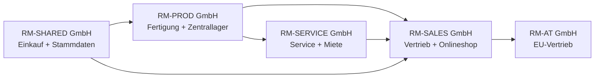

### Standorte und Lagerlogik

| Lagerort | Company | Lagerart | BC-Logik | Trainingszweck |
|---|---|---|---|---|
| `FRA-ZL` | RM-PROD | Zentrallager | gesteuerte Einlagerung/Kommissionierung mit Lagerplätzen (Bins) | Lagereingang (Warehouse Receipt), Einlagerung (Put-away), Kommissionierung (Pick), Warenausgang (Shipment) |
| `MZ-EINFACH` | RM-SALES | Außenlager | einfache Lagerbuchung ohne gesteuerte Einlagerung | einfacher Wareneingang und Verkauf |
| `HH-FUL` | RM-SALES | Onlineshop-Fulfillment | Kommissionierung/Lieferung (Pick/Shipment) vereinfacht | Shop-Auftrag bis Versand |
| `VAN-01` | RM-SERVICE | Servicefahrzeug | Lagerort für Techniker | Ersatzteilverbrauch im Service |
| `PROJ-BER` | RM-SERVICE | Projektlager | Projektbezogenes Lager | Projektmaterial und Baustelle |
| `DROP` | RM-SALES | Dropshipping | kein eigener Bestand | Direktlieferung Lieferant an Kunde |

Projektregel für die Spielwiese:

Im ersten O2C-Aufbau wird `FRA-ZL` zunächst nur als Lagerort angelegt. Die gesteuerte Lagerlogik mit Lagerplätzen, Lagereingängen, Einlagerungen, Kommissionierungen und Warenausgängen wird später im Warehouse-Kapitel aktiviert und separat getestet. Sonst würde der erste Verkaufsauftrag zu früh in einen vollständigen Warehouse-Prozess kippen.

### Geschäftsmodelle

| Modell | Use Case | BC-Schwerpunkt | Standardgrenze |
|---|---|---|---|
| Eigenfertigung | Standardmaschine `RM-M100` | Manufacturing | vollständig im Standard demonstrierbar |
| Variantenfertigung | Sondermaschine `RM-X500` | BOM/Routing/Projekt/Fertigung | Variantenlogik braucht klare Stammdaten |
| Handelsware | Ersatzteil `SP-PUMP-01` | O2C/P2P/Inventory | Standard |
| Onlineshop | Webshop-Verkauf Ersatzteile | Shopify Connector / Verkaufsaufträge (Sales Orders) | abhängig von Connector-Setup |
| Service | Wartung beim Kunden | Service Management | Standard |
| Miete | Mietmaschine 12 Monate | Service/Projekte/Abgrenzungen/Anlagen (Service/Projects/Deferrals/Fixed Assets) | Standard nur mit Prozessdesign |
| Finanzierung | Kunde finanziert Maschine über Bank | Sales/Receivables/Deferrals | komplexe Finanzierungslogik nicht vollständig Standard |
| Intercompany | PROD verkauft an SALES | Intercompany | Standard mit IC-Setup |
| Dropshipping | Lieferant liefert direkt an Kunden | Sales + Purchase Link | Standard |

---

### Erzählerischer Zusammenhang der Use Cases

Die Rhein-Main Industriegruppe verdient ihr Geld nicht mit einem einzigen Prozess. Ein Maschinenverkauf beginnt im Vertrieb, löst Verfügbarkeitsprüfung aus, kann Fertigung anstoßen, bewegt Lagerwerte und endet in Forderung, Zahlung und GuV. Ein Servicefall beginnt beim Kundenproblem, verbraucht Ersatzteile, erzeugt Technikerzeiten und entscheidet zwischen Rechnung, Garantie und Kulanz. Ein Projekt verbindet Sondermaschine, Fremdleistung, Material, Ressourcen und Meilensteinrechnung.

Mehrere Companies sind deshalb kein Selbstzweck. RM-PROD zeigt Produktion und Materialfluss. RM-SALES zeigt Markt, Kunden, Preise und Onlineshop. RM-SERVICE zeigt laufende Kundenbetreuung. RM-SHARED bündelt Finance, USt, Bank, Reporting und Administration. RM-AT macht EU- und Auslandsszenarien sichtbar. Business Central löst damit reale Probleme: weniger Dubletten, bessere Verfügbarkeit, nachvollziehbare Steuerlogik, abgestimmte Posten, belastbare GuV nach Produktlinie und klare Verantwortlichkeiten.


## 4. ERP und Business Central für absolute Einsteiger

Dieses Kapitel erklärt Business Central ohne ERP-Vorkenntnisse. Du lernst, warum Unternehmen ein integriertes System brauchen, wie aus Stammdaten Belege entstehen und warum Posten nach dem Buchen wichtiger sind als die ursprüngliche Bildschirmmaske.

### Das Grundprinzip in einfachen Worten

Ein ERP-System (Enterprise Resource Planning) ist das zentrale Arbeitssystem eines Unternehmens. Es verbindet Verkauf, Einkauf, Lager, Fertigung, Service, Projekte, Bank und Buchhaltung. Ohne ERP arbeiten Abteilungen oft mit Excel-Listen, E-Mails und einzelnen Programmen. Dann stimmen Kunden, Artikel, Preise, Lagerbestände und offene Posten nicht zuverlässig überein.

Business Central ist das ERP-System der Rhein-Main Industriegruppe. Ein Verkaufsauftrag ist dort nicht nur ein Formular. Er verbindet Debitor, Artikel, Preis, Liefertermin, Lagerort, USt und Dimensionen. Wenn der Auftrag geliefert und fakturiert wird, entstehen gebuchte Belege und Posten. Diese Posten zeigen Finance, Lager und Controlling, was wirklich passiert ist.

Beispiel Verkauf: Kunde `D10000` bestellt eine Pumpe `SP-PUMP-01`. Business Central erzeugt daraus einen Verkaufsauftrag. Beim Buchen entstehen Forderung, Erlös, USt, Lagerabgang und Wertposten. Deshalb prüft RM-SHARED nach dem Buchen nicht nur die Rechnung, sondern auch Debitorenposten, Sachposten, Artikelposten, Wertposten und USt-Posten.

Beispiel Einkauf: RM-PROD kauft Stahl `RAW-STEEL` bei `K10000`. Beim Wareneingang steigt der Bestand. Bei der Eingangsrechnung entsteht eine Verbindlichkeit und Vorsteuer. Einkauf, Lager und Buchhaltung arbeiten also am gleichen Vorgang, aber aus unterschiedlichen Perspektiven.

Beispiel Zahlung: Wenn der Kunde die Rechnung bezahlt, wird die Zahlung mit dem offenen Debitorenposten ausgeglichen. Erst dann ist die Forderung erledigt. Ein Kontoauszug allein genügt nicht; Business Central muss wissen, welche Rechnung mit welcher Zahlung zusammengehört.

Praxisregel:
- In Business Central zählt nach dem Buchen die Postenspur: Beleg, gebuchter Beleg, Nebenbuchposten, Sachposten, USt-Posten, Artikelposten, Wertposten und Bericht müssen zusammenpassen.

### Rollen, Abteilungen und Bedienlogik in BC

Ein vollständiges Schulungsbuch muss zeigen, wie Mitarbeiter arbeiten. Deshalb beschreibt jedes Prozesskapitel fachliche Aufgabe, Role Center, Tell-Me-Suche, Seiten, Felder und Folgebelege.

#### Rollenmatrix

| Rolle | Abteilung | Typische BC-Seiten | Was macht der Mitarbeiter? |
|---|---|---|---|
| Verkäuferin | Vertrieb | `Verkaufsangebote (Sales Quotes)`, `Verkaufsaufträge (Sales Orders)`, `Debitoren (Customers)`, `Kontakte (Contacts)` | Angebot erstellen, Auftrag erfassen, Verfügbarkeit prüfen, Rechnung auslösen |
| E-Commerce-Sachbearbeiter | Onlineshop | `Shopify-Shops (Shopify Shops)`, `Verkaufsaufträge (Sales Orders)`, `Artikel (Items)`, `Debitoren (Customers)` | Shop-Aufträge synchronisieren, Fehler klären, Versand anstoßen |
| Einkäufer | Einkauf | `Kreditoren (Vendors)`, `Einkaufsbestellungen (Purchase Orders)`, `Einkaufsrechnungen (Purchase Invoices)` | Bestellung auslösen, Preise prüfen, Wareneingang/Rechnung abstimmen |
| Lagerist einfaches Lager | Lager MZ | `Artikeljournale (Item Journals)`, `Verkaufslieferungen (Sales Shipments)`, `Einkaufslieferungen (Purchase Receipts)` | Ware annehmen, Bestand prüfen, Lieferung buchen |
| Lagerist gesteuertes Lager | FRA-ZL | `Lagereingänge (Warehouse Receipts)`, `Lagereinlagerungen (Warehouse Put-aways)`, `Lagerkommissionierungen (Warehouse Picks)`, `Warenausgänge (Warehouse Shipments)` | Einlagern, kommissionieren, versenden |
| Produktionsplanerin | Fertigung | `Planungsarbeitsblatt (Planning Worksheet)`, `Fertigungsaufträge (Production Orders)`, `Stücklisten (BOMs)`, `Arbeitspläne (Routings)` | Bedarf planen, Fertigungsaufträge erstellen, Termine prüfen |
| Meister | Fertigung | `Freigegebene Fertigungsaufträge (Released Production Orders)`, `Verbrauch Buch.-Blatt (Consumption Journal)`, `Istmeldung Buch.-Blatt (Output Journal)` | Verbrauch und Output melden, Ausschuss dokumentieren |
| Servicetechniker | Service | `Serviceaufträge (Service Orders)`, `Serviceartikel (Service Items)`, `Artikeljournale (Item Journals)` | Serviceauftrag bearbeiten, Ersatzteile verbrauchen, Zeiten erfassen |
| Projektleiter | Projekte | `Projekte (Projects)`, `Project Tasks`, `Project Journals` | Budget, Verbrauch, Fortschritt und Faktura steuern |
| Debitorenbuchhalterin | Finance | `Debitorenposten (Customer Ledger Entries)`, `Zahlungsabstimmungs Buch.-Blatt (Payment Reconciliation Journal)`, `Reminders` | Zahlung ausgleichen, mahnen, offene Posten prüfen |
| Kreditorenbuchhalter | Finance | `Kreditorenposten (Vendor Ledger Entries)`, `Zahlungs Buch.-Blätter (Payment Journals)`, `Einkaufsrechnungen (Purchase Invoices)` | Eingangsrechnungen prüfen, Zahlungen vorbereiten |
| Anlagenbuchhalterin | Finance | `Anlagen (Fixed Assets)`, `Anlagen Buch.-Blätter (FA Journals)`, `AfA berechnen (Calculate Depreciation)` | Zugänge, AfA und Abgänge buchen |
| Controller | Controlling | `Analyseansichten (Analysis Views)`, `Finanzberichte (Financial Reports)`, `Dimensionen (Dimensions)` | Auswertungen und Abweichungen analysieren |
| BC-Admin | IT/Finance Operations | `Benutzer (Users)`, `Berechtigungssätze (Permission Sets)`, `Änderungsprotokoll Einrichtung (Change Log Setup)`, `Aufgabenwarteschlangenposten (Job Queue Entries)` | Rollen, Automatisierung und Audit Trail verwalten |

#### Bedienmuster

1. **Role Center prüfen:** Der Mitarbeiter startet im passenden Arbeitsbereich.
2. **`Alt+Q`nutzen:** Er sucht stabile Seitenbegriffe, nicht lange Menüpfade.
3. **Belegkopf prüfen:** Kunde/Lieferant, Datum, Standort, Währung, Dimension, USt-Gruppe.
4. **Zeilen pflegen:** Artikel, Ressource, Sachkonto, Menge, Preis, Lagerort, Projekt.
5. **Vorschau/Prüfung:** Posting Preview, Verfügbarkeit, Freigabe, Pflichtfelder.
6. **Buchen:** Post/Release/Register.
7. **Nachweis prüfen:** Entries, Belegkette, Attachments, Reports.

#### Bebilderte Klickanleitung: `UAT-START-001` Spielwiese öffnen und CRONUS einordnen

Der erste Klickfall beginnt nicht mit einer Buchung. Er beginnt mit Orientierung. In einer neuen Business-Central-Spielwiese sieht der Anwender zuerst eine Sandbox oder Testumgebung mit CRONUS-Demodaten. Diese Umgebung ist kein fertiger Rhein-Main-Mandant. Sie ist der sichere Übungsraum, in dem Oberfläche, Suche, Company, Rolle und Grundnavigation verstanden werden.

Ziel:
- Du öffnest Business Central im Browser und erkennst, in welcher Umgebung du arbeitest.
- Du prüfst Company, Sprache, Rolle und Suchfunktion.
- Du unterscheidest CRONUS-Demodaten von den späteren Rhein-Main-Trainingsdaten.

Vorbedingungen:
- Business Central ist als Trial, Sandbox oder Trainingsumgebung bereitgestellt.
- Der Testbenutzer kann sich anmelden.
- Die Oberfläche ist möglichst auf Deutsch/Deutschland eingestellt.
- Es wird nicht in einer produktiven Umgebung gearbeitet.
- Hinweis für den technischen Probelauf: Die aktuelle Spielwiese kann gemischt Deutsch/Englisch erscheinen. Die finalen Buchscreenshots werden später in einem durchgängig deutschen Lauf ersetzt.

| Schritt | Screenshot-Datei | Bildinhalt | Feldlogik | Prüfhinweis |
|---:|---|---|---|---|
| 020 | `playwright/projects/fibu-book5/img/uat-start-001-020-rollencenter-startseite.png` | Rollencenter nach Anmeldung | Das Rollencenter zeigt Rolle, Aufgaben und Startkacheln. | Rolle und sichtbare Menüs dokumentieren. |
| 050 | `playwright/projects/fibu-book5/img/uat-start-001-050-alt-q-suche.png` | `Alt+Q` mit Suchfeld | `Alt+Q` ist der stabile Einstieg in Seiten und Berichte. | Deutsch suchen, bei Bedarf englische Suchhilfe nutzen. |
| 060 | `playwright/projects/fibu-book5/img/uat-start-001-060-unternehmen-seite.png` | Seite `Unternehmen (Companies)` | Die Liste zeigt verfügbare Companies im Environment. | CRONUS ist Demonstrationsbestand, nicht Rhein-Main-Zielstruktur. |
| 070 | `playwright/projects/fibu-book5/img/uat-start-001-070-unternehmensdaten.png` | `Unternehmensdaten (Company Information)` | Unternehmensdaten prägen Belege, Berichte und rechtliche Angaben. | Name, Adresse, Land/Region, USt-ID und Bankdaten später fachlich pflegen. |

Technischer Prüfstatus:
- `npm run auth:bc` speichert den Business-Central-Login-State lokal.
- `npm run screenshots:start` erzeugt die vier Startbilder automatisiert.
- `npm run smoke:bc` öffnet zentrale BC-Seiten probeweise: `Customers`, `Vendors`, `Items`, `Sales Orders`, `Purchase Orders`, `Chart of Accounts`.
- Die Smoke-Bilder dienen der Werkzeugprüfung. Sie sind noch kein finales Buchlayout, weil die Oberfläche teilweise englisch ist und Einführungs-Popups erscheinen können.

Bildauswertung:

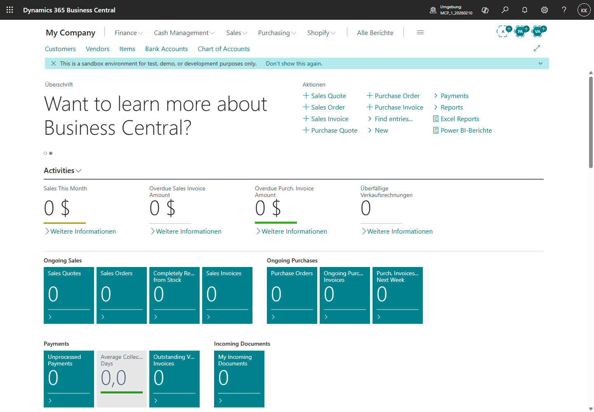

Was du im Bild siehst:
- Oben steht `Dynamics 365 Business Central` mit der Umgebung `MCP_1_20260210`.
- Die Company heißt `My Company`.
- Das Rollencenter zeigt Kacheln, Aktionen, Suche und Sandbox-Hinweis.

Feldlogik:
- `My Company` ist die aktuell geöffnete Company. Sie ist nicht automatisch der Zielmandant des Buchprojekts.
- Der Sandbox-Hinweis zeigt, dass diese Umgebung für Tests und Entwicklung gedacht ist.

Prüfhinweis:
- Vor jedem Test wird Umgebung, Company und Rolle geprüft. Ein falscher Mandant macht jeden späteren Nachweis wertlos.

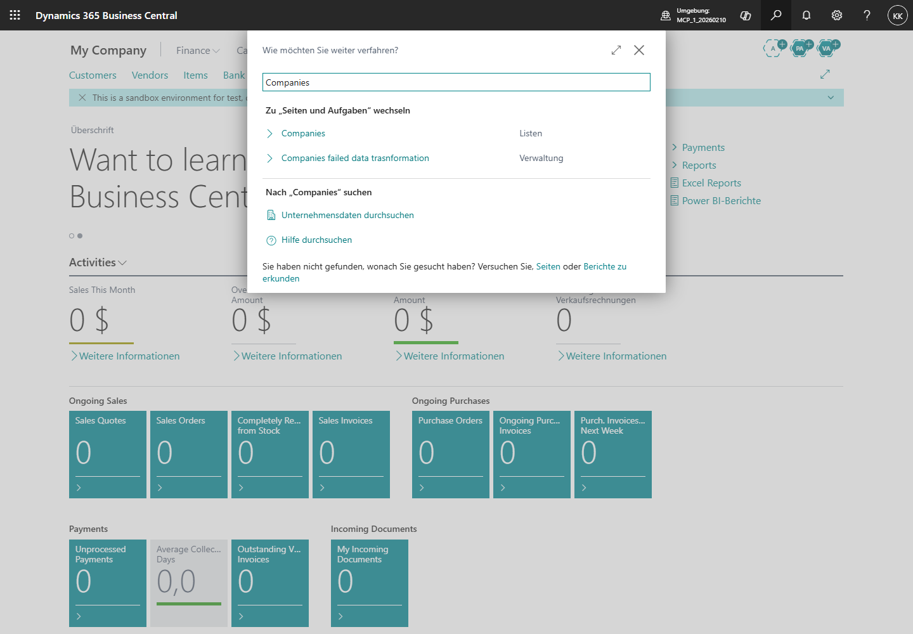

Was du im Bild siehst:
- Die Suche `Wie möchten Sie weiter verfahren?` ist geöffnet.
- Der Suchbegriff `Companies` wird verwendet, weil die aktuelle Oberfläche gemischt Deutsch/Englisch ist.

Feldlogik:
- `Alt+Q` oder der Suchbutton öffnet dieselbe Tell-Me-Suche.
- Der Suchbegriff darf in der Technik englisch sein, auch wenn der Buchtext später deutsch formuliert wird.

Prüfhinweis:
- Für finale deutsche Screenshots wird derselbe Schritt mit deutschem Suchbegriff erneut geprüft.

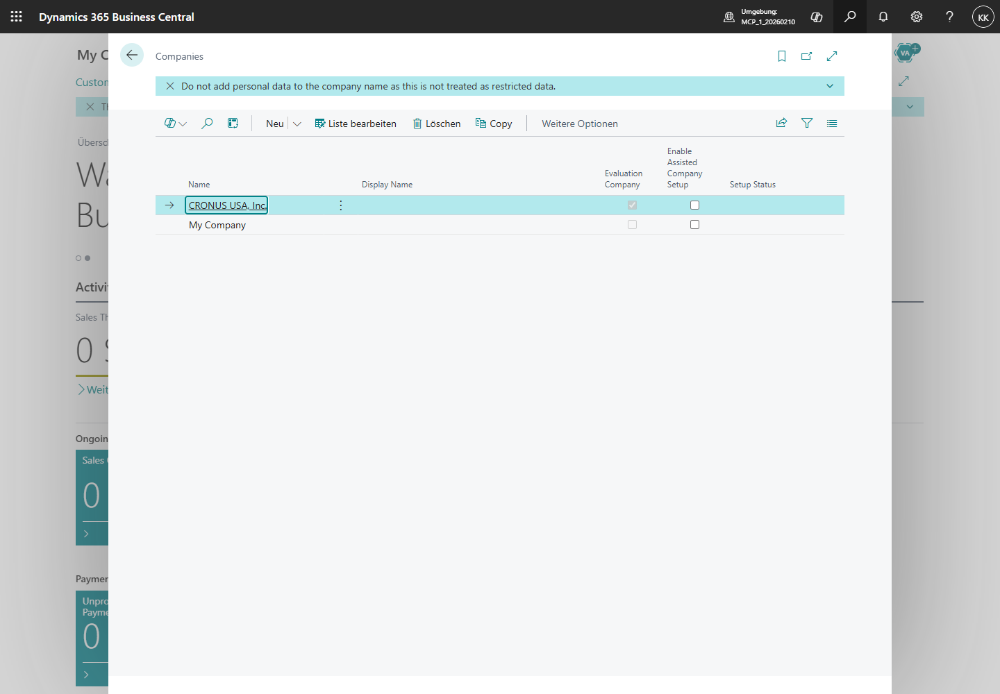

Was du im Bild siehst:
- Die Seite `Companies` zeigt mindestens `CRONUS USA, Inc.` und `My Company`.
- `CRONUS USA, Inc.` ist als Evaluation Company markiert.

Feldlogik:
- Eine Company ist ein buchender Mandant innerhalb derselben Business-Central-Umgebung.
- CRONUS enthält Demodaten. Diese Daten sind nützlich für Tests, aber nicht automatisch die Rhein-Main-Trainingsdaten.

Prüfhinweis:
- Der erste Foundation-Schritt kopiert CRONUS in eine eigene Trainingscompany `RM-DEMO`.

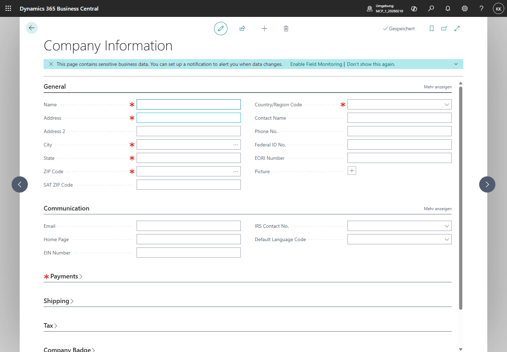

Was du im Bild siehst:
- Die Seite `Company Information` zeigt Pflichtfelder wie `Name`, `Address`, `City`, `ZIP Code` und `Country/Region Code`.
- Mehrere Felder sind noch leer.

Feldlogik:
- Unternehmensdaten prägen Belege, Berichte und rechtliche Angaben.
- Leere Pflichtfelder sind für eine Spielwiese akzeptabel, aber nicht für einen prüfbaren Trainingsmandanten.

Prüfhinweis:
- Für `RM-DEMO` werden Unternehmensdaten später bewusst gesetzt und als Trainingsdaten dokumentiert.

Feldlogik:
- `Environment` bezeichnet die technische Umgebung, zum Beispiel Sandbox oder Produktion.
- `Company` bezeichnet den buchenden Mandanten innerhalb dieser Umgebung.
- `CRONUS` ist ein Demonstrationsmandant mit Beispielstammdaten. Er eignet sich für Orientierung, aber nicht als ungeprüfter Nachweis für Rhein-Main-Prozesse.
- `Profil/Rolle` steuert Oberfläche und Rollencenter. Es ersetzt keine Berechtigungsprüfung.

Prüfhinweis:
- Ein sauberer Screenshot-Prozess beginnt immer mit Umgebung, Company, Sprache und Rolle. Erst danach werden Stammdaten, Belege und Posten bebildert.

Evidence Pack (Nachweispaket):
- Screenshot Rollencenter mit sichtbarer Rolle.
- Screenshot Company-Auswahl oder Seite `Unternehmen (Companies)`.
- Screenshot deutscher Oberfläche oder Spracheinstellung.
- Screenshot `Alt+Q`-Suche.
- Notiz zur Umgebung: Trial, Sandbox oder Trainingsmandant.

Merksatz:
- CRONUS ist die Spielwiese für Orientierung. Der prüfbare Buchfall entsteht erst, wenn Testdaten, Company, Rolle und Nachweisziel bewusst festgelegt sind.

Praxisregel:
- Schulungen beginnen mit Rollen und Aufgaben, nicht mit Menüs. Ein Einkäufer muss wissen, warum er eine Bestellung auslöst; die Seite ist erst der zweite Schritt.

---


## 5. Wie Business Central denkt

Dieses Kapitel erklärt die Denkweise hinter Business Central und liefert danach die Trainingsdaten der Fallstudie. Du lernst zuerst, welche Datenarten es gibt, und nutzt anschließend dieselben Debitoren, Kreditoren, Artikel, Ressourcen, Anlagen und Belege in allen Prozesskapiteln.

### Das Datenmodell für Einsteiger

Stammdaten sind dauerhafte Grunddaten. Dazu gehören Debitoren, Kreditoren, Artikel, Ressourcen, Anlagen, Lagerorte, Zahlungsbedingungen, Buchungsgruppen und Dimensionen. Bewegungsdaten entstehen aus Geschäftsvorfällen. Dazu gehören Angebote, Aufträge, Wareneingänge, Rechnungen, Zahlungen, Lagerbewegungen, Serviceaufträge und Journalzeilen.

Ein Beleg ist ein noch bearbeitbarer Vorgang, zum Beispiel ein Verkaufsauftrag. Ein gebuchter Beleg ist das Ergebnis einer Buchung, zum Beispiel eine gebuchte Verkaufsrechnung. Nach dem Buchen entstehen Posten. Posten sind die prüfbare Wahrheit in Business Central, weil sie Mengen, Werte, Steuern, offene Posten und Sachkonten nachvollziehbar speichern.

Ein Journal ist eine Erfassungsmaske für Buchungen, die nicht aus einem operativen Beleg kommen oder bewusst direkt gebucht werden. Beispiele sind allgemeine Buchungsblätter, Zahlungsbuchungsblätter, Anlagenbuchungsblätter oder Artikel Buch.-Blätter. Der Unterschied ist wichtig: Ein Verkaufsauftrag erzeugt eine Belegkette mit Lieferung und Rechnung; ein Journal bucht direkter und braucht deshalb stärkere Kontrolle.

Eine Buchungsgruppe ist eine Stammdaten-Eigenschaft, die Business Central später zur Kontenfindung nutzt. Eine Buchungsmatrix verbindet Geschäftspartnerart und Produktart. Sie entscheidet, welche Sachkonten bei Verkauf, Einkauf, Lager oder USt angesprochen werden. Eine Dimension ist eine Auswertungsachse, etwa Produktlinie, Abteilung oder Standort.

Ein Kontrollbericht ist eine Auswertung, mit der der Fachbereich prüft, ob das Ergebnis stimmt. Ein Evidence Pack (Nachweispaket) ist die Sammlung aus Belegnummern, Posten, Berichten, Exporten und Freigaben, die einen Prozess prüfbar macht. UAT (User Acceptance Testing) bedeutet fachlicher Benutzerabnahmetest: Die Fachabteilung führt echte Testfälle aus und bestätigt, dass der Prozess alltagstauglich funktioniert.

Praxisregel:
- Erst Stammdaten verstehen, dann Belege buchen, danach Posten und Berichte prüfen. Wer diese Reihenfolge beherrscht, versteht Business Central.


## Teil B — Grundlage: Firma, Daten, Setup

Teil B richtet den Trainingsmandanten fachlich ein. Hier entstehen Companies, Stammdaten, Nummernserien, Buchungsgruppen, Dimensionen und grundlegende Bedienlogik.

## 6. Companies, Organisation und Mandantenlogik [Q3][Q4][Q5][Q6]

Foundation-Prozesse tragen alle Fachprozesse. Fehler in Nummernserien, Dimensionen, Buchungsgruppen oder Berechtigungen wirken wie ein Multiplikator.

### Quelle und Zweck

Standard laut Quelle:
- Business Central unterstützt mehrere Companies, Benutzer, Berechtigungen, Workflows, Job Queues, Change Log und Einrichtung für Geschäftsprozesse. [Q3][Q4][Q5][Q6]

Deutsche Pflicht/Compliance:
- Für steuerrelevante Systeme sind Nachvollziehbarkeit, Vollständigkeit, Richtigkeit, Unveränderbarkeit und Datenzugriff im GoBD-Kontext relevant. [Q21][Q22]

BC-Best-Practice:
- Setup-Änderungen an Posting Groups, VAT Posting Setup, Nummernserien und Dimensionen laufen über Change Request, Testnachweis und Freigabe.

### Mitarbeiterbedienung

| Rolle | Aufgabe | `Alt+Q`/ Seite | Was wird getan? |
|---|---|---|---|
| BC-Admin | Company anlegen | `Companies` | Trainingscompanies erstellen |
| Finance-Leitung | Buchungsperioden steuern | `General Ledger Setup`, `Accounting Periods` | Buchungsfenster festlegen |
| Stammdaten-Team | Dimensionen pflegen | `Dimensionen (Dimensions)`, `Dimension Values` | Pflichtdimensionen anlegen |
| Admin | Change Log aktivieren | `Change Log Setup` | kritische Tabellen überwachen |
| Prozessowner | Workflow prüfen | `Workflows`, `Approval User Setup` | Freigaben für Einkauf/Verkauf definieren |

### E2E-Setupfluss

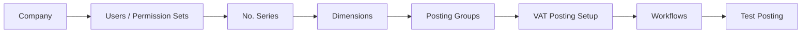

### Bebilderte Klickanleitung: `FOUNDATION-001` und `FOUNDATION-002` Trainingscompany aufbauen

Der erste echte Foundation-Prozess legt keine Buchung an. Er schafft den wiederholbaren Trainingsraum. Dafür wird die CRONUS-Company in eine eigene Company `RM-DEMO` kopiert und anschließend mit fachlichen Unternehmensdaten versehen.

Ziel:
- Du erzeugst eine eigene Trainingscompany aus `CRONUS USA, Inc.`.
- Du setzt die Unternehmensdaten für `Rhein-Main Demo GmbH`.
- Du dokumentierst jeden Datenwert so, dass der Lauf später erneut ausgeführt werden kann.

Testdatenquelle:
- Datei: `playwright/projects/fibu-book5/testdata/foundation/rm-demo-company.json`
- Company: `RM-DEMO`
- Name: `Rhein-Main Demo GmbH`
- Adresse: `Mainzer Landstrasse 100`, `60329 Frankfurt am Main`, `DE`
- Kontakt: `Finance Training`, Telefon `+49 69 5550100`

Technischer Lauf:
1. `npm run foundation:company`
2. `npm run foundation:company-info`

#### `FOUNDATION-001`: CRONUS nach `RM-DEMO` kopieren

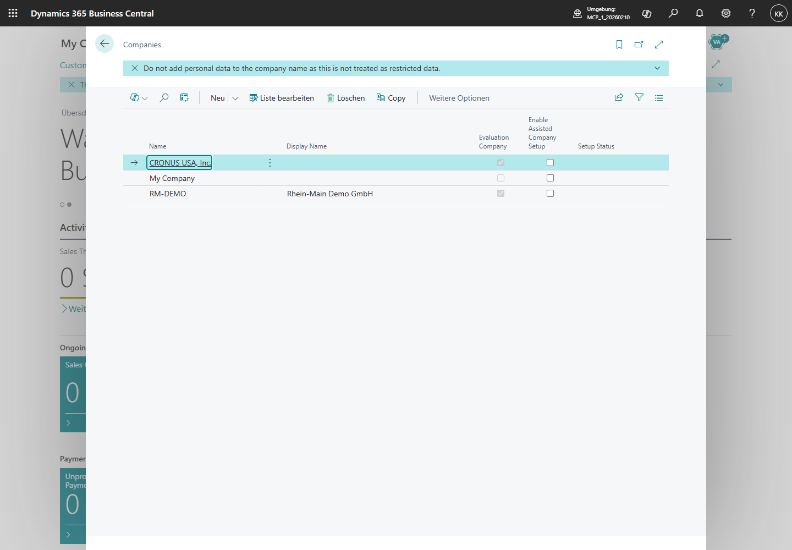

Was du im Bild siehst:
- Die Seite `Companies` zeigt die vorhandenen Companies.
- `CRONUS USA, Inc.` ist als Demo-/Evaluation-Company vorhanden.
- `My Company` ist die bisherige Spielwiese.

Feldlogik:
- Eine Company ist ein buchender Mandant innerhalb derselben Business-Central-Umgebung.
- `CRONUS USA, Inc.` enthält Demodaten. Diese Daten werden als Startbestand für `RM-DEMO` genutzt.

Prüfhinweis:
- Eine Company wird nicht durch freie Tabellenzeilen improvisiert. Der stabile Weg ist `Copy` aus CRONUS.

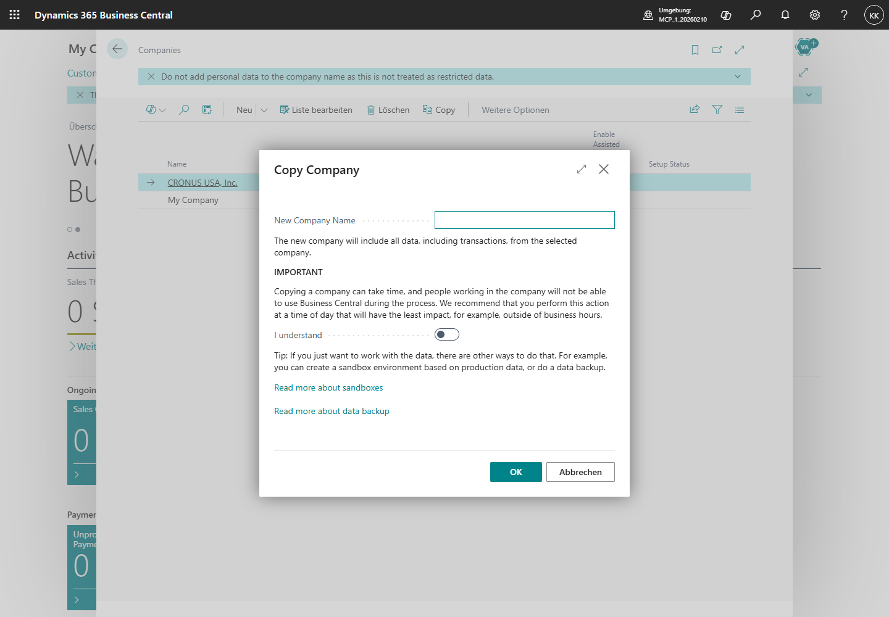

Was du im Bild siehst:
- Der Dialog `Copy Company` fragt nach `New Company Name`.
- Der Hinweis erklärt, dass Daten und Transaktionen aus der ausgewählten Company kopiert werden.
- Der Schalter `I understand` muss aktiv sein, bevor `OK` sinnvoll ist.

Feldlogik:
- `New Company Name = RM-DEMO` legt den technischen Company-Namen fest.
- Die Kopie übernimmt Stammdaten, Setup und Demobewegungen aus CRONUS.

Prüfhinweis:
- Das Kopieren kann dauern und andere Nutzer in der Quellcompany beeinträchtigen. In diesem Buch geschieht es nur in der Sandbox.

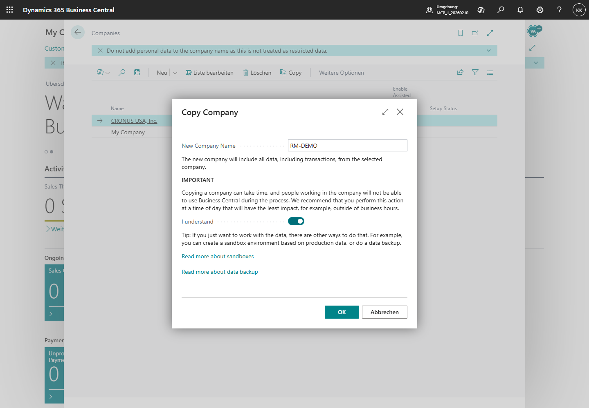

Was du im Bild siehst:
- `RM-DEMO` ist als neuer Company-Name eingetragen.
- Der Bestätigungsschalter ist gesetzt.
- `OK` startet die Kopie.

Feldlogik:
- Die Bestätigung ist kein fachliches Feld, sondern eine Schutzabfrage gegen unbeabsichtigtes Kopieren.

Prüfhinweis:
- Ohne diesen Schritt bleibt `RM-DEMO` nicht als prüfbarer Trainingsmandant verfügbar.


Was du im Bild siehst:
- Die Liste `Companies` enthält `RM-DEMO`.
- Damit ist der technische Trainingsmandant vorhanden.

Feldlogik:
- `RM-DEMO` ist ab jetzt über die Business-Central-URL mit `company=RM-DEMO` erreichbar.

Evidence Pack:
- Screenshot der Companies-Liste vor der Kopie.
- Screenshot des Copy-Dialogs.
- Screenshot der Liste mit `RM-DEMO`.

#### `FOUNDATION-002`: Unternehmensdaten für `RM-DEMO` setzen

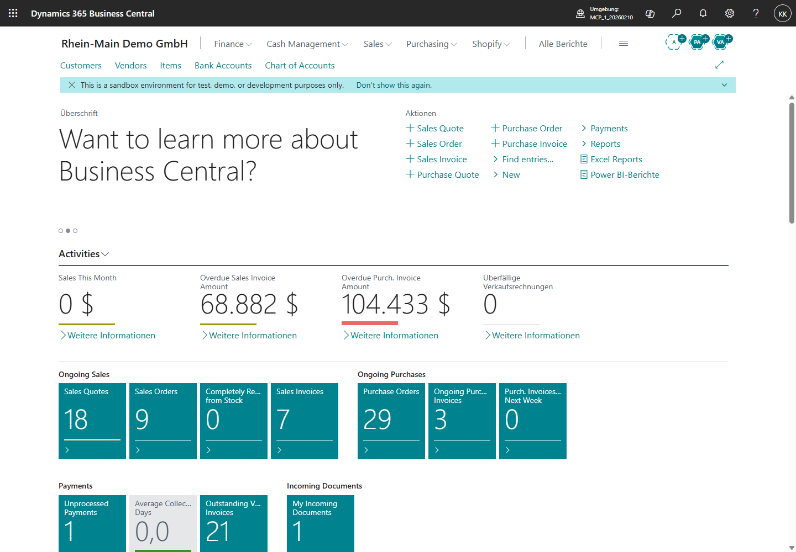

Was du im Bild siehst:
- Oben links steht die Company `RM-DEMO`.
- Das Rollencenter zeigt CRONUS-Demodaten und Aktivitäten.
- Der Sandbox-Hinweis bleibt sichtbar.

Feldlogik:
- `RM-DEMO` ist die Arbeitscompany für alle folgenden Trainingsdaten.
- Die sichtbaren CRONUS-Werte sind Startdaten, keine finalen Rhein-Main-Prozessdaten.

Prüfhinweis:
- Jeder spätere Prozesslauf beginnt mit der Prüfung, dass `RM-DEMO` aktiv ist.

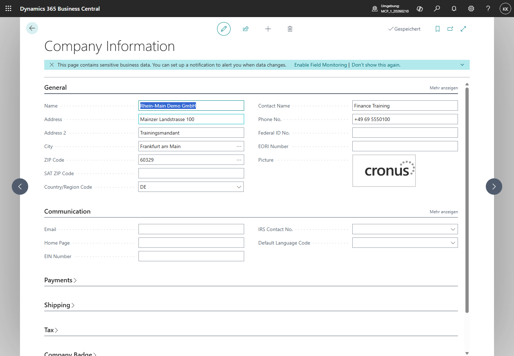

Was du im Bild siehst:
- Die Seite `Company Information` zeigt noch CRONUS-nahe Stammdaten.
- Name, Adresse, Land, Kontakt und Telefon sind editierbar.

Feldlogik:
- Diese Felder prägen Belegköpfe, Berichte und Unternehmensangaben.
- Sie sind Stammdaten, keine Buchung.

Prüfhinweis:
- Vor steuerlich prüfbaren Belegen müssen Unternehmensdaten bewusst gesetzt werden.

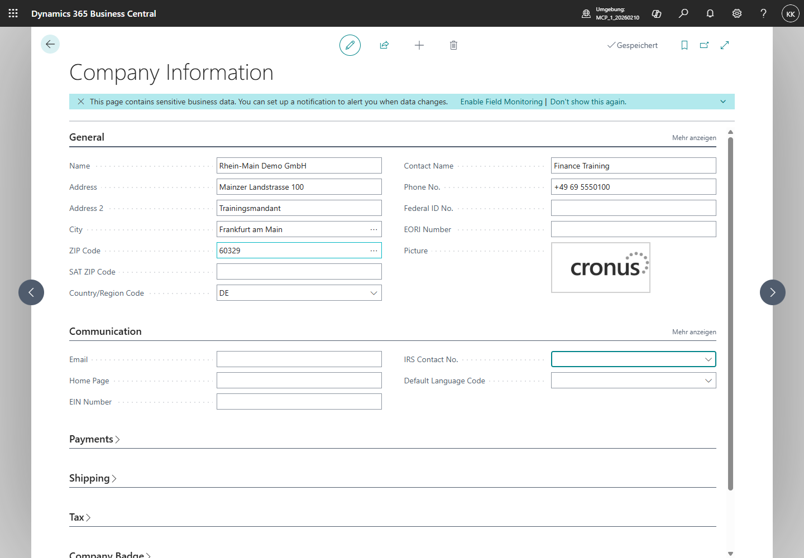

Was du im Bild siehst:
- `Name = Rhein-Main Demo GmbH`
- `Address = Mainzer Landstrasse 100`
- `Address 2 = Trainingsmandant`
- `City = Frankfurt am Main`
- `ZIP Code = 60329`
- `Country/Region Code = DE`
- `Contact Name = Finance Training`
- `Phone No. = +49 69 5550100`
- Oben ist `Gespeichert` sichtbar.

Feldlogik:
- `Country/Region Code = DE` macht aus der CRONUS-Kopie einen deutschen Trainingskontext.
- Adresse und Kontakt sind bewusst fiktiv. Sie dienen der Schulung und enthalten keine echten personenbezogenen Daten.
- E-Mail, Homepage, Steuer-ID und USt-ID werden in diesem ersten Foundation-Schritt noch nicht gesetzt. Sie folgen erst, wenn Steuer- und E-Rechnungslogik im Buch behandelt werden.

Prüfhinweis:
- Der Screenshot ist erst buchfähig, wenn `Gespeichert` sichtbar ist. Ein Bild mit `Wird gespeichert ...` ist nur ein Zwischenzustand.

Evidence Pack:
- JSON-Testdaten aus `playwright/projects/fibu-book5/testdata/foundation/rm-demo-company.json`.
- Screenshot `Company Information` vor der Pflege.
- Screenshot `Company Information` nach der Pflege.
- Playwright-Test `foundation-company-information.spec.ts`.

Praxisregel:
- Testdaten gehören ins Repository und ins Buch. Nur dann kann ein Leser den Mandanten später wieder auf denselben Stand bringen.

#### Harte Projektregel: CRONUS ist nicht Rhein-Main

Eine frisch kopierte CRONUS-Company enthält nicht automatisch die Stammdaten der Rhein-Main-Fallstudie. Sie ist nur die technische Spielwiese. Für prüfbare Buchprozesse müssen die Rhein-Main-Daten zuerst aufgebaut werden.

Das betrifft insbesondere:

- Companies und Rollenmodell der Rhein-Main-Gruppe.
- Dimensionen wie `PRODUCTLINE`, `CHANNEL`, `DEPARTMENT` und `LOCATION-GROUP`.
- Lagerorte wie `FRA-ZL`, `MZ-EINFACH`, `VAN-SERV` und `PROJ-LAG`.
- Debitoren wie `D10000`, `D11000`, `D20000`, `D30000` und `D90000`.
- Kreditoren wie `K10000`, `K11000`, `K20000`, `K30000` und `K40000`.
- Artikel, Ressourcen, Anlagen und Projekte wie `RM-M100`, `SP-PUMP-01`, `RES-TECH`, `FA-CNC-01` und `PROJ-5001`.
- Buchungsgruppen, USt-Logik, Lagerbuchungsmatrix und Standarddimensionen.

Deshalb gilt für alle bebilderten Klickanleitungen:

1. Zuerst wird dokumentiert, welche Daten und Setups der Prozess braucht.
2. Fehlende Daten werden angelegt oder als Blocker markiert.
3. Erst danach wird der fachliche Prozess gebucht.
4. Jeder angelegte Stammdatensatz bekommt Testdaten-Datei, Screenshot und Bucherklärung.

Für den ersten belastbaren Lauf nutzt das Projekt `RM-DEMO` als konsolidierte Trainingscompany. Die im Buch beschriebenen Ziel-Companies `RM-PROD`, `RM-SALES`, `RM-SERVICE`, `RM-SHARED` und Auslandsgesellschaften werden später als eigener Mehr-Company-Block aufgebaut. Das verhindert, dass der erste Lernlauf durch Intercompany-, Berechtigungs- und Konsolidierungsthemen blockiert wird.

### UAT-Schulung Foundation

Aufgabe:
1. Lege Dimension `CHANNEL` mit Werten `B2B`, `SHOP`, `IC`, `SERVICE`, `PROJECT` an.
2. Setze `CHANNEL` als Pflichtdimension für Debitor `D10000`.
3. Buche eine Verkaufsrechnung ohne `CHANNEL`.
4. Korrigiere den Fehler und buche erneut.

Erwartete Lösung:
- Die Buchung ohne Pflichtdimension wird verhindert oder als Fehler markiert.
- Die korrigierte Buchung erzeugt `Sachposten (G/L Entries)` mit Dimension `CHANNEL = B2B`.

Kontrollfrage:
- Warum ist eine Pflichtdimension eher ein Prozesskontrollinstrument als eine reine Reporting-Einstellung?

---

### Greenfield-Einführung: Konzern von null aufbauen

Dieses Kapitel ordnet das Buch neu aus Greenfield-Sicht. Wir beginnen nicht mit einzelnen Funktionen, sondern mit einem leeren Mandanten. Danach entstehen Companies, Rollen, Konten, Dimensionen, Steuerlogik, Lagerorte, Stammdaten, Prozesse, Berichte und Betrieb. So lernt der Leser, Business Central nicht nur zu bedienen, sondern aufzubauen.

### Sinnvolle Buchstruktur von Grund auf

Die bisherige Struktur deckt die Themen fachlich ab. Für Lernen und Einführung ist diese Reihenfolge didaktisch sinnvoller:

| Phase | Buchlogik | Warum diese Reihenfolge? |
|---|---|---|
| 1 | Zielbild, Quellen, Sprachregel | Leser versteht Standard, Pflicht und deutsche Oberfläche |
| 2 | Musterkonzern und Rollen | Leser weiß, wer im System arbeitet |
| 3 | Greenfield-Grundeinrichtung | Mandant, Companies, Konten, USt, Dimensionen, Nummernserien entstehen |
| 4 | Stammdaten und Trainingsdaten | Debitoren, Kreditoren, Artikel, Ressourcen, Projekte, Anlagen |
| 5 | Kernprozesse | Verkauf, Einkauf, Lager, Fertigung, Service, Projekte, Finance |
| 6 | Postenlogik und Reporting | Leser versteht, was Buchungen auslösen |
| 7 | Admin, Governance, Monitoring | System bleibt stabil |
| 8 | Übungen, Lösungen, UAT | Wissen wird praktisch geprüft |

Korrektur zur bisherigen Fassung:
- Kapitel dürfen nicht wie eine Sammlung einzelner Erweiterungen wirken. Der rote Faden ist jetzt: **Greenfield → Setup → Stammdaten → Prozess → Posten → Bericht → Betrieb → Übungslösung**.

### Greenfield-Masterplan der Rhein-Main Industriegruppe

| Schritt | Ergebnis | Deutsche BC-Seiten |
|---|---|---|
| 1 | Firmenstruktur steht | `Unternehmen (Companies)` |
| 2 | Basisdaten je Company gepflegt | `Unternehmensdaten (Company Information)` |
| 3 | Kontenplan steht | `Kontenplan (Chart of Accounts)` |
| 4 | Buchungsgruppen und USt-Logik stehen | `Buchungsmatrix Einrichtung`, `USt-Buchungsmatrix Einrichtung` |
| 5 | Dimensionen stehen | `Dimensionen`, `Standarddimensionen` |
| 6 | Nummernserien stehen | `Nummernserien (No. Series)` |
| 7 | Lagerstruktur steht | `Lagerorte (Locations)`, `Lagerplätze (Bins)` |
| 8 | Benutzer/Rollen stehen | `Benutzer`, `Berechtigungssätze`, `Profile/Rollen` |
| 9 | Stammdaten stehen | `Debitoren`, `Kreditoren`, `Artikel`, `Ressourcen`, `Anlagen`, `Projekte` |
| 10 | Workflows und Kontrollen stehen | `Workflows`, `Genehmigungsanforderungen` |
| 11 | Berichte stehen | `Finanzberichte`, `Analyseansichten` |
| 12 | Betrieb steht | `Aufgabenwarteschlangenposten`, `Änderungsprotokoll`, `Erweiterungsverwaltung` |

### Beispieldatenpaket für den Start

Companies:

| Company | Zweck | Besonderheit |
|---|---|---|
| `RM-PROD` | Produktion | Fertigung, gesteuertes Lager |
| `RM-SALES` | Vertrieb/Onlineshop | Verkauf, Shopify, Dropshipping |
| `RM-SERVICE` | Service/Miete | Serviceaufträge, Wartung, Mietlogik |
| `RM-SHARED` | Einkauf/Shared Services | zentrale Kreditoren, Umlagen |
| `RM-AT` | EU-Auslandsgesellschaft | EU-USt, Intrastat-nahe Fälle, Intercompany |

Hinweis:

Die Auslandsgesellschaft im Buch ist `RM-AT`. Drittland-/CH-Fälle werden nicht über eine eigene Company `RM-CH` modelliert, sondern über Debitoren, Kreditoren und Steuerfälle wie `D30000 SwissTech AG` mit Land `CH`. Damit bleiben EU-B2B, Intercompany und Drittlandexport fachlich getrennt.

Dimensionen:

| Dimension | Werte |
|---|---|
| `DEPARTMENT` | `SALES`, `PURCH`, `WH`, `PROD`, `SERV`, `FIN`, `ADMIN` |
| `PRODUCTLINE` | `MACHINE`, `SPARE`, `SERVICE`, `PROJECT`, `RENTAL` |
| `CHANNEL` | `B2B`, `SHOP`, `IC`, `EXPORT` |
| `LOCATION-GROUP` | `FRA`, `MZ`, `DA`, `VAN`, `PROJECT` |

Artikel:

| Artikel | Art | Kosten | Verkaufspreis | Prozess |
|---|---|---:|---:|---|
| `RM-M100` | Maschine | 18.000 | 32.000 | Fertigung/Verkauf |
| `SP-PUMP-01` | Ersatzteil | 180 | 320 | Lager/Verkauf |
| `SP-SENSOR-02` | Ersatzteil | 75 | 149 | Shop/Service |
| `RAW-STEEL` | Rohmaterial | 2.500 | - | Einkauf/Fertigung |
| `KIT-MAINT` | Wartungskit | 240 | 450 | Montage/Service |

Debitoren:

| Debitor | Land | Typ | Zahlungsbedingung | Steuerfall |
|---|---|---|---|---|
| `D10000` | DE | B2B | 14 Tage 2 %, 30 Tage netto | Inland |
| `D20000` | FR | EU-B2B | 30 Tage netto | EU-Lieferung |
| `D30000` | CH | Drittland | Vorkasse | Export |
| `D40000` | DE | B2C-Shop | sofort | Onlineshop |

Kreditoren:

| Kreditor | Land | Zweck | Steuerfall |
|---|---|---|---|
| `K10000` | DE | Rohmaterial | Inland |
| `K20000` | NL | Handelsware | EU-Erwerb |
| `K30000` | CH | Spezialteile | Import/Drittland |
| `K40000` | DE | Fremdarbeit | Inland/Fertigung |

### Reihenfolge der praktischen Einrichtung im Buch

1. Company `RM-PROD` anlegen.
2. Unternehmensdaten pflegen.
3. Kontenplan und Sachkontokategorien prüfen.
4. Buchungsgruppen und USt-Buchungsmatrix einrichten.
5. Dimensionen und Pflichtdimensionen einrichten.
6. Nummernserien einrichten.
7. Lagerorte `FRA-ZL`, `MZ-EINFACH`, `VAN-SERV`, `PROJ-LAG` anlegen.
8. Für den ersten O2C-Test `FRA-ZL` noch einfach halten; im Warehouse-Block Lagerplätze und gesteuerte Lagerlogik aktivieren.
9. Benutzer und Rollenprofile anlegen.
10. Debitoren, Kreditoren, Artikel, Ressourcen, Projekte und Anlagen anlegen.
11. Verkaufspreislisten und Einkaufspreislisten aktivieren.
12. Workflows für Einkauf, Bankdaten und USt-Setup aktivieren.
13. Beleglayouts, E-Mail-Szenarien und Berichtsauswahl einrichten.
14. Aufgabenwarteschlange (Job Queue) und Änderungsprotokoll (Change Log) aktivieren.

### Bebilderte Klickanleitungen: aktueller Foundation-Stand

Die folgenden Klickanleitungen sind in der Spielwiese mit Playwright geprüft und als Evidence abgelegt. Sie sind der getestete Startpunkt für die Buchscreenshots:

| Klickanleitung | BC-Seite | Testfall | Screenshot | Evidence | Status |
|---|---|---|---|---|---|
| Ist-Stand der Stammdaten prüfen | Customers, Items, Locations, Dimensions, Posting Setup | `MASTERDATA-001` | `playwright/projects/fibu-book5/img/masterdata-001-*.png` | `playwright/projects/fibu-book5/evidence/masterdata-001/` | geprüft |
| Dimensionen anlegen | `Dimensionen (Dimensions)` | `MASTERDATA-002` | `playwright/projects/fibu-book5/img/masterdata-002-dimensions-rhein-main.png` | `playwright/projects/fibu-book5/evidence/masterdata-002/` | geprüft |
| Dimensionswerte anlegen | `Dimension Values` | `MASTERDATA-003` | `playwright/projects/fibu-book5/img/masterdata-003-dimension-values-rhein-main.png` | `playwright/projects/fibu-book5/evidence/masterdata-003/` | geprüft |
| Lagerort `FRA-ZL` anlegen | `Lagerorte (Locations)` / `Location Card` | `MASTERDATA-004` | `playwright/projects/fibu-book5/img/masterdata-004-locations-rhein-main.png` | `playwright/projects/fibu-book5/evidence/masterdata-004/` | geprüft |
| Debitor `D10000` und Artikel `RM-M100` anlegen | `Customers`, `Items`, `Item Card` | `MASTERDATA-005` | `playwright/projects/fibu-book5/img/masterdata-005-customers-after-api.png`, `playwright/projects/fibu-book5/img/masterdata-005-items-after-api.png` | `playwright/projects/fibu-book5/evidence/masterdata-005/` | geprüft |
| Posting-Fit für ersten O2C-Probelauf herstellen | `Customer Card`, `Item Card`, Sales-Order-API | `MASTERDATA-006` | `playwright/projects/fibu-book5/img/masterdata-006-customer-template-fit.png`, `playwright/projects/fibu-book5/img/masterdata-006-item-posting-fit.png` | `playwright/projects/fibu-book5/evidence/masterdata-006/` | geprüft als CRONUS-Technikfit |
| Standarddimensionen für O2C setzen | `Default Dimensions`, `Customer Card`, `Item Card` | `MASTERDATA-007` | `playwright/projects/fibu-book5/img/masterdata-007-item-rm-m100-standarddimension.png`, `playwright/projects/fibu-book5/img/masterdata-007-customer-d10000-standarddimension.png` | `playwright/projects/fibu-book5/evidence/masterdata-007/` | geprüft als API-/Evidence-Nachweis |
| Lagerbuchungsmatrix für O2C-Blocker prüfen | `Inventory Posting Setup` | `MASTERDATA-008` | `playwright/projects/fibu-book5/img/masterdata-008-inventory-posting-setup-fra-zl-resale.png` | `playwright/projects/fibu-book5/evidence/masterdata-008/` | geprüft als Labor-Diagnose; ursprünglicher Blocker war leeres `Inventory Account` für `FRA-ZL` + `RESALE` |
| Lagerbuchungsmatrix für O2C-Labor fitten | `Inventory Posting Setup` | `MASTERDATA-009` | `playwright/projects/fibu-book5/img/masterdata-009-inventory-posting-setup-fra-zl-resale-14140.png` | `playwright/projects/fibu-book5/evidence/masterdata-009/` | geprüft als CRONUS-Laborfit: `Inventory Account = 14140`; kein deutscher Kontenplan-Endstand |
| Verkaufsauftrag für `D10000` mit Zeile `RM-M100`, Preview, Laborbuchung und Postenspur prüfen | `Sales Orders`, `Sales Order`, `Posted Sales Invoice`, Entries | `UAT-O2C-001` | `playwright/projects/fibu-book5/img/uat-o2c-001-030-kopf-debitor-d10000.png`, `playwright/projects/fibu-book5/img/uat-o2c-001-040-zeile-artikel-rm-m100.png`, `playwright/projects/fibu-book5/img/uat-o2c-001-060-buchungsvorschau.png`, `playwright/projects/fibu-book5/img/uat-o2c-001-082-posted-sales-invoice.png`, `playwright/projects/fibu-book5/img/uat-o2c-001-089-item-ledger-entry-dimensions.png` | `playwright/projects/fibu-book5/evidence/uat-o2c-001/` | geprüft als CRONUS-USA-Laborlauf: Preview-Auftrag `S-ORD101067` wurde bereinigt; genau eine Laborbuchung `S-ORD101068` erzeugte `PS-INV103297`; deutsche 19-%-USt bleibt offen |
| Financial Reports als Reporting-Einstieg öffnen | `Financial Reports` | `REPORTING-001` | `playwright/projects/fibu-book5/img/reporting-001-010-financial-reports.png` | `playwright/projects/fibu-book5/evidence/reporting-001/` | geprüft als read-only Laborstart; Filter-/Summenwirkung nach `PRODUCTLINE=MACHINE` noch offen |

Redaktionsregel:

Eine Klickanleitung gilt erst als buchfähig, wenn der Playwright-Lauf die Zielseite wirklich geöffnet hat, der Screenshot vorhanden ist und ein Evidence-Pack den Zustand nach erneutem Öffnen oder nach fachlicher Prüfung bestätigt. Ein Screenshot ohne Persistenz- oder Seitenprüfung ist nur ein Entwurf.

### Klickanleitung: Lagerort `FRA-ZL` anlegen

Für den ersten O2C-Test braucht Rhein-Main einen Lagerort. In der Spielwiese wird `FRA-ZL` zunächst als einfacher Lagerort angelegt; die gesteuerte Warehouse-Logik folgt später.

1. Öffne `Alt+Q`.
2. Suche `Lagerorte` oder `Locations`.
3. Öffne die Seite `Locations`.
4. Wähle `Neu`.
5. Business Central öffnet die `Location Card`.
6. Erfasse im Feld `Code` den Wert `FRA-ZL`.
7. Erfasse im Feld `Name` den Wert `Frankfurt Zentrallager`.
8. Speichere und schließe die Karte.
9. Öffne die Liste `Locations` erneut.
10. Prüfe, ob `FRA-ZL` mit Name `Frankfurt Zentrallager` in der Liste sichtbar ist.

Prüfhinweis:

Aktiviere für diesen ersten Test noch keine Lagerplätze, gesteuerte Einlagerung oder Kommissionierung. Diese Funktionen ändern den Prozesspfad für Wareneingang und Verkauf. Sie gehören in den Warehouse-Test, nicht in den ersten einfachen O2C-Fit.

### Klickanleitung: Debitor `D10000` und Artikel `RM-M100` prüfen

Für den ersten O2C-Test müssen Debitor und Artikel vorhanden sein. In der aktuellen Spielwiese werden beide Stammdatensätze reproduzierbar über Playwright und die authentifizierte Business-Central-API erzeugt; anschließend werden sie im Webclient sichtbar geprüft und fotografiert.

Debitor prüfen:

1. Öffne `Alt+Q`.
2. Suche `Debitoren` oder `Customers`.
3. Öffne die Seite `Customers`.
4. Prüfe, ob `D10000` mit Name `Mueller Maschinenbau GmbH` sichtbar ist.
5. Öffne die FactBox `Sell-to Customer Sales History` und prüfe, dass die Zähler für den neuen Debitor noch `0` zeigen.

Artikel prüfen:

1. Öffne `Alt+Q`.
2. Suche `Artikel` oder `Items`.
3. Öffne den Artikel `RM-M100`.
4. Prüfe `Description = Standardmaschine M100`.
5. Prüfe `Type = Inventory`.
6. Prüfe `Unit Cost = 42.000,00`.
7. Prüfe `Unit Price = 68.000,00`.

Prüfhinweis:

Der erste Screenshot der Artikelkarte zeigte bewusst, dass `Base Unit of Measure`, `Gen. Prod. Posting Group` und `Inventory Posting Group` noch leer waren. Das ist kein Nebenthema. Ohne diese Felder ist ein Artikel nicht belastbar buchungsfähig. `MASTERDATA-006` korrigiert diesen Zustand für die aktuelle CRONUS-Spielwiese mit `PCS`, `RETAIL`, `RESALE` und `FURNITURE`.

### Klickanleitung: Posting-Fit für den ersten O2C-Probelauf prüfen

In einer nackten CRONUS-Spielwiese reicht es nicht, Debitor und Artikel nur mit Nummer, Name und Preis anzulegen. Der Debitor braucht eine Debitorenbuchungsgruppe, Zahlungslogik und Geschäftsbuchungslogik. Der Artikel braucht mindestens Basiseinheit, Produktbuchungsgruppe, Lagerbuchungsgruppe und Steuergruppe.

Für den aktuellen technischen Probelauf wird bewusst eine CRONUS-Vorlage genutzt:

1. Öffne den Debitor `D10000`.
2. Wähle `Apply Template`.
3. Wähle `CUSTOMER COMPANY`.
4. Bestätige die Anwendung der Vorlage.
5. Prüfe anschließend, dass `D10000` weiterhin Name, Adresse, Land `DE` und E-Mail korrekt trägt.
6. Öffne den Artikel `RM-M100`.
7. Prüfe `Base Unit of Measure = PCS`.
8. Prüfe im Bereich `Costs & Posting`: `Gen. Prod. Posting Group = RETAIL`.
9. Prüfe im selben Bereich: `Inventory Posting Group = RESALE`.
10. Prüfe im selben Bereich: `Tax Group Code = FURNITURE`.
11. Öffne wieder den Debitor `D10000`.
12. Prüfe im Bereich `Invoicing` nach `Mehr anzeigen`: `Tax Liable = Ja`, `Tax Area Code = leer`, `Gen. Bus. Posting Group = DOMESTIC`, `Customer Posting Group = DOMESTIC` und `Currency Code = EUR`.
13. Erzeuge als technische Probe einen Verkaufsauftrag für `D10000` mit Artikel `RM-M100`, Menge `1`, Preis `68.000` und Lagerort `FRA-ZL`.
14. Prüfe, dass die Zeile angelegt werden kann.
15. Öffne den Auftrag danach erneut und fotografiere die Zeile erst, wenn `RM-M100`, `Standardmaschine M100`, `FRA-ZL` und `68.000,00` sichtbar sind.

Prüfhinweis:

Dieser Stand ist ein technischer Laufbarkeitsnachweis, kein deutscher Steuer-Endstand. Die aktuelle Spielwiese basiert auf CRONUS USA. Der MCP-Nachweis zeigt jetzt zwar `Currency Code = EUR` am Debitor `D10000` und in neuen Aufträgen, aber die Steuerherkunft bleibt CRONUS-Sales-Tax: Am Debitor ist `Tax Liable` aktiv und `Tax Area Code` leer; am Artikel ist `Tax Group Code = FURNITURE` gesetzt. Das erklärt, warum der Auftrag technisch laufen kann, aber noch keine deutsche `19 %`-USt berechnet. Für finale Buchscreenshots mit `19 %` USt braucht das Projekt später einen deutschen Lauf oder ein explizit konfiguriertes deutsches VAT-Setup.

Der O2C-Laborlauf zeigte außerdem einen zweiten, sehr lehrreichen Blocker: Die Buchungsvorschau erreichte zwar die BC-Prüfung, stoppte aber zunächst mit `Inventory Account is missing in Inventory Posting Setup Location Code: FRA-ZL, Invt. Posting Group Code: RESALE.` Das bedeutete nicht, dass Debitor, Artikel oder Preis falsch waren. Es bedeutete: Für die Kombination aus Lagerort `FRA-ZL` und Lagerbuchungsgruppe `RESALE` fehlte das Bestandskonto in der Lagerbuchungsmatrix. Business Central kann eine Artikelbewegung erst buchen oder als Postenvorschau darstellen, wenn auch die Wertfortschreibung in Richtung Hauptbuch eindeutig ist. Nach dem CRONUS-Laborfit `Inventory Account = 14140` zeigt `Buchungsvorschau (Preview Posting)` echte Vorschauzeilen: Sachposten, Debitorenposten, Artikelposten, detaillierte Debitorenposten und Wertposten. Danach wurde genau eine bewusste CRONUS-USA-Laborbuchung mit `Ship and Invoice` durchgeführt: Auftrag `S-ORD101068` erzeugte die gebuchte Verkaufsrechnung `PS-INV103297`. Diese Buchung ist Labor-Evidence für Bedienpfad, Postenspur und Dimensionslernen, aber kein deutscher 19-%-USt-Endstand. Der separate Preview-Auftrag `S-ORD101067` wurde bereinigt; der gebuchte Laborbeleg bleibt als Nachweis erhalten.

### Klickanleitung: Inventory Posting Setup für `FRA-ZL` und `RESALE` prüfen

Diese Prüfung ist kein Buchungsschritt, sondern eine Diagnose. Sie erklärt, warum ein Verkaufsauftrag trotz korrektem Debitor, Artikel, Menge und Preis noch nicht bis zur Buchungsvorschau kommt.

1. Öffne `Alt+Q`.
2. Suche `Inventory Posting Setup` oder in einer deutschen Umgebung `Lagerbuchungsmatrix Einrichtung`.
3. Öffne die Seite `Inventory Posting Setup`.
4. Filtere `Location Code` auf `FRA-ZL`.
5. Filtere `Invt. Posting Group Code` auf `RESALE`.
6. Prüfe die Spalte `Inventory Account`.
7. Wenn `Inventory Account` leer ist, ist die Ursache des Preview-Posting-Fehlers gefunden.
8. Setze kein Konto nur, um den Fehler wegzubekommen. Die Kontenwahl ist eine fachliche FiBu-Entscheidung.

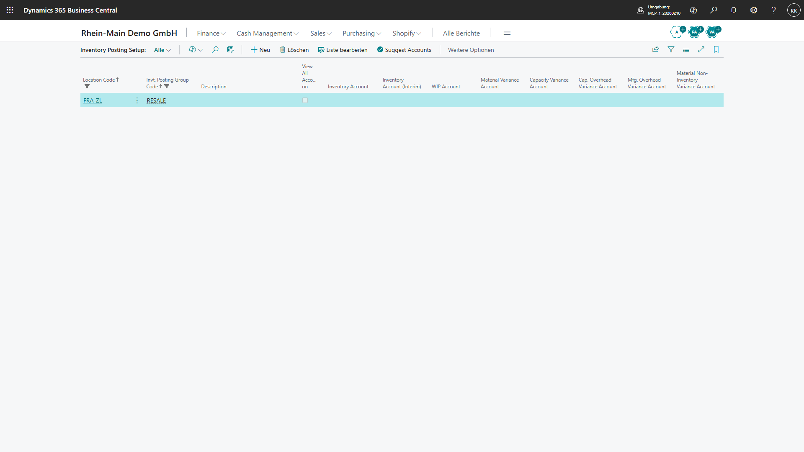

Was du im Bild siehst:
Business Central zeigt genau eine Zeile für `Location Code = FRA-ZL` und `Invt. Posting Group = RESALE`. Die Spalten `Inventory Account` und `Inventory Account (Interim)` sind sichtbar. Das `Inventory Account` ist leer.

Warum das fachlich wichtig ist:
Die Lagerbuchungsgruppe am Artikel sagt, welche Art von Bestand vorliegt. Der Lagerort sagt, wo der Bestand liegt. Erst die Lagerbuchungsmatrix verbindet beides mit dem passenden Sachkonto für Bestand. Ohne diese Verbindung kann BC nicht sauber bestimmen, auf welches Vorratskonto die Artikelbewegung wirken soll.

Was du tun musst:
Nicht den Verkaufsauftrag ändern und nicht direkt buchen. Entscheide zuerst mit Finance oder anhand eines freigegebenen CRONUS-Labor-Setups, welches Bestandskonto für `FRA-ZL` + `RESALE` gelten soll. Trage dieses Konto erst danach in `Inventory Account` ein und dokumentiere die Entscheidung im Evidence Pack.

Was passiert, wenn es falsch ist:
Bleibt das Feld leer, stoppt `Buchungsvorschau (Preview Posting)` weiter mit `Inventory Account is missing`. Wird ein falsches Konto eingetragen, kann die Buchung technisch durchlaufen, aber der Lagerwert landet auf einem falschen Sachkonto. Das wäre für Anfänger schwerer zu erkennen als der aktuelle Fehler, weil BC dann möglicherweise keinen Dialog mehr anzeigt, die Auswertung aber fachlich falsch ist.

Woran du erkennst, dass es danach stimmt:
Die Zeile `FRA-ZL` + `RESALE` zeigt ein begründetes `Inventory Account`. Danach wird `UAT-O2C-001` erneut ausgeführt. Ein erfolgreicher Zwischennachweis ist erreicht, wenn `Buchungsvorschau (Preview Posting)` nicht mehr auf diesen Inventory-Posting-Setup-Fehler stoppt, sondern eine Postenvorschau zeigt. Im aktuellen Labor zeigt die Vorschau `G/L Entry`, `Cust. Ledger Entry`, `Item Ledger Entry`, `Detailed Cust. Ledg. Entry` und `Value Entry`.

Prüfhinweis:
Der Nachweis `MASTERDATA-008` ist ein CRONUS-USA-Laborbefund und noch kein finaler deutscher Buchungsgruppen-Entwurf. `MASTERDATA-009` setzt für den Laborfit `Inventory Account = 14140`, weil vorhandene CRONUS-RESALE-Zeilen dieses Konto verwenden. Das ist eine nachvollziehbare Laborentscheidung, aber kein deutscher Kontenplan-Endstand. `UAT-O2C-001` wurde danach erneut mit `Buchungsvorschau (Preview Posting)` geprüft: Der alte Inventory-Fehler ist verschwunden, die Vorschau öffnet, und es wurde nicht gebucht.

### Klickanleitung: Standarddimensionen für `D10000` und `RM-M100` prüfen

Standarddimensionen beantworten nicht die Frage, auf welches Sachkonto gebucht wird. Sie beantworten die Frage, wie der gebuchte Vorgang später ausgewertet wird. Für Rhein-Main ist das beim Maschinenverkauf entscheidend: Der Erlös aus `RM-M100` soll im Reporting unter `PRODUCTLINE = MACHINE` erscheinen; der Kunde `D10000` soll dem Vertriebskanal `CHANNEL = B2B` zugeordnet sein.

Geprüfter Laborstand:

1. Artikel `RM-M100` trägt die Standarddimension `PRODUCTLINE = MACHINE`.
2. Debitor `D10000` trägt die Standarddimension `CHANNEL = B2B`.
3. Beide Standarddimensionen sind mit `Same Code` gepflegt.
4. Das bedeutet: Der Stammdatensatz soll nicht nur einen Vorschlagswert liefern, sondern genau diesen Dimensionswert erzwingen.

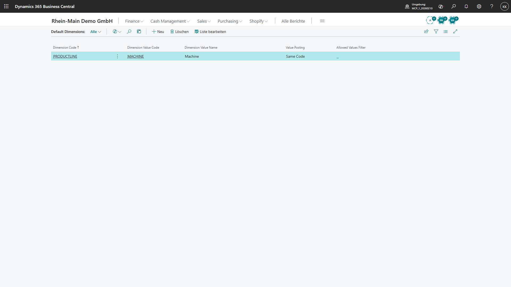

Was du im Bild siehst:
Business Central zeigt die Seite `Default Dimensions`. Für den Artikelkontext ist die Dimension `PRODUCTLINE` mit dem Dimensionswert `MACHINE` gepflegt. In der Spalte `Value Posting` steht `Same Code`.

Warum das fachlich wichtig ist:
`PRODUCTLINE = MACHINE` sorgt dafür, dass der Maschinenartikel `RM-M100` später in Auswertungen der Produktlinie Maschine zugeordnet werden kann. `Same Code` ist stärker als ein bloßer Vorschlag: Der Datensatz soll genau diesen Dimensionswert verwenden.

Prüfhinweis:
Das Laborbild ist über Page `540` gefiltert. Der Artikel `RM-M100` steht nicht zwingend im sichtbaren Seitentext, wird aber durch Test, Dateiname, API-Evidence und Filterkontext nachgewiesen. Für finale Buchbilder wird derselbe Nachweis später in einer deutschen Umgebung neu erzeugt.

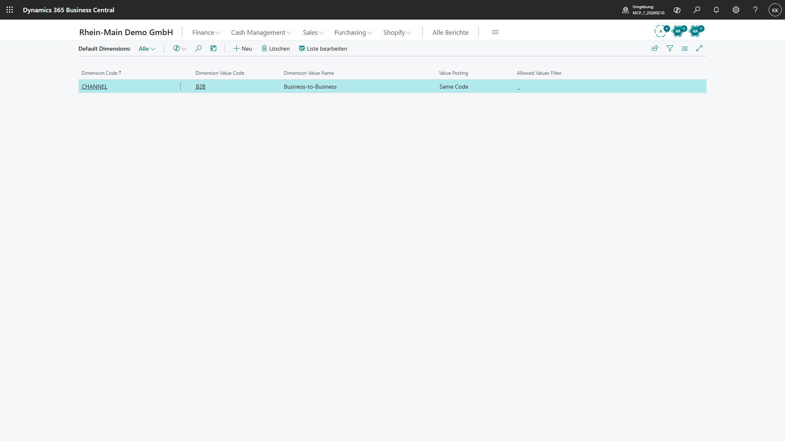

Was du im Bild siehst:
Für den Debitorenkontext ist die Dimension `CHANNEL` mit dem Wert `B2B` gepflegt. Auch hier steht `Value Posting = Same Code`.

Warum das fachlich wichtig ist:
Der Debitor `D10000` wird damit dem Vertriebskanal Business-to-Business zugeordnet. Das ist für spätere Umsatz-, Margen- und Managementberichte wichtig, weil ein Auftrag zwar korrekt gebucht sein kann, aber ohne passende Dimension im Reporting falsch oder unvollständig erscheint.

Prüfhinweis:

Der aktuelle Nachweis besteht aus API-Evidence und UI-Laborbildern des Dialogs `Default Dimensions`. Die Bilder sind fachlich brauchbare Kandidaten, aber noch keine finalen deutschen Buchbilder: Die Umgebung ist CRONUS-basiert und die Oberfläche ist gemischt Deutsch/Englisch. Die zuvor sichtbare Teaching-Tip-Karte `About default dimensions` wird im Playwright-Lauf gezielt geschlossen. Für die finale Fassung wird derselbe Nachweis später in der deutschen Umgebung ersetzt.

Wichtig für Anfänger: Eine Standarddimension am Artikel oder Debitor ist nur die Vorbereitung. Sie beweist noch nicht automatisch, dass jede erwartete Dimension im konkreten Verkaufsauftrag angekommen ist. Der O2C-Lauf `UAT-O2C-001` weist `CHANNEL = B2B` und `PRODUCTLINE = MACHINE` inzwischen im Zeilen-Dimensionsdialog nach. Der geprüfte Klickpfad lautet `Line` -> `Related Information` -> `Dimensions`. Für die finale Anleitung muss derselbe Nachweis später in der deutschen Umgebung neu fotografiert und nach dem Buchen zusätzlich in Sachposten oder Reporting wiedergefunden werden.
15. UAT-Basisszenarien buchen.

### Greenfield-UAT mit Lösungserwartung

| Test | Aufgabe | Lösungserwartung |
|---|---|---|
| GF-001 | Company `RM-PROD` anlegen | Company ist sichtbar, Unternehmensdaten gepflegt |
| GF-002 | Dimension `PRODUCTLINE` mit Pflichtwert anlegen | Buchung ohne Dimension wird blockiert |
| GF-003 | Artikel `SP-PUMP-01` anlegen | Artikel hat Buchungsgruppen, Einheit, Kosten, Preis |
| GF-004 | Lagerort `FRA-ZL` als gesteuertes Lager einrichten | Wareneingang läuft über Lagereingang und Einlagerung |
| GF-005 | Debitor D10000 anlegen | Debitor hat Zahlungsbedingung, USt-Logik, Dimension |
| GF-006 | Verkaufsauftrag buchen | Debitorenposten, Sachposten, Artikelposten, USt-Posten entstehen |
| GF-007 | Finanzbericht prüfen | GuV zeigt Erlös und Wareneinsatz nach Dimension |

Merksatz:
- Auf der grünen Wiese zählt die Reihenfolge. Falsche Grundlagen erzeugen später richtige Klicks mit falschem Ergebnis.

---


## 7. Stammdaten der Fallstudie

### Dimensionen

| Dimension | Werte | Zweck |
|---|---|---|
| `COMPANY-GROUP` | PROD, SALES, SERVICE, SHARED, AT | Konzerninterne Auswertung |
| `DEPARTMENT` | SALES, PURCH, WHSE, PROD, SERV, FIN, ADMIN | Rollen- und Kostenstellenlogik |
| `CHANNEL` | B2B, SHOP, IC, SERVICE, PROJECT | Vertriebskanal |
| `PRODUCTLINE` | MACHINE, SPARE, RENTAL, SERVICE | Produktlinie |
| `LOCATION-GROUP` | DIRECTED, SIMPLE, VAN, PROJECT, DROP | Lagerlogik |

### Debitoren

| Nr. | Name | Land | Typ | USt-Logik | Trainingsfall |
|---|---|---|---|---|---|
| `D10000` | Müller Maschinenbau GmbH | DE | B2B | Inland 19 % | Standardverkauf Maschine |
| `D11000` | Handwerk24 Onlinekunde | DE | B2C | Inland 19 % | Onlineshop-Ersatzteil |
| `D20000` | Alpha Machines SAS | FR | EU-B2B | innergemeinschaftlich | EU-Lieferung |
| `D30000` | SwissTech AG | CH | Drittland | Export | Ausfuhrlieferung |
| `D90000` | RM-SALES GmbH IC | DE | Intercompany | Inland/IC | IC-Verkauf PROD an SALES |

### Kreditoren

| Nr. | Name | Land | Typ | Trainingsfall |
|---|---|---|---|---|
| `K10000` | Stahlwerk Ruhr GmbH | DE | Material | Rohmaterial Einkauf |
| `K11000` | Elektro Parts GmbH | DE | Komponenten | Elektronik Einkauf |
| `K20000` | Dropship Europe BV | NL | Dropshipping | Direktlieferung |
| `K30000` | Zollspedition Nord GmbH | DE | Spedition/Zoll | Import/EUSt |
| `K40000` | Lohnfertiger Süd GmbH | DE | Fremdarbeit | Subcontracting |

### Artikel, Ressourcen und Anlagen

| Nr. | Beschreibung | Typ | Lager/Prozess | Standardkosten/Preis |
|---|---|---|---|---:|
| `RM-M100` | Standardmaschine M100 | Fertigerzeugnis | Fertigung/Verkauf | 42.000 / 68.000 |
| `RM-X500` | Sondermaschine X500 | Projekt/Fertigung | Projekt + Fertigung | 90.000 / 145.000 |
| `SP-PUMP-01` | Ersatzteil Pumpe | Lagerartikel | Einkauf/Shop/Service | 180 / 320 |
| `SP-SENSOR-02` | Sensor Set | Lagerartikel mit Seriennr. | Shop/Service | 75 / 149 |
| `RAW-STEEL` | Stahlträger | Rohmaterial | Fertigung | 2.500 / - |
| `COMP-CTRL` | Steuerungseinheit | Komponente | Fertigung | 3.200 / - |
| `KIT-MAINT` | Wartungskit | Montageartikel | Assembly/Service | 240 / 450 |
| `RES-TECH` | Servicetechniker Stunde | Ressource | Service/Projekt | 65 / 115 |
| `FA-CNC-01` | CNC-Anlage | Anlage | Anlagenbuchhaltung | 250.000 |

### Beispielbelege

| Fall | Beleg | Daten | Erwarteter Prozess |
|---|---|---|---|
| S-001 | Verkaufsauftrag (Sales Order) `SO-1001` | D10000 kauft `RM-M100`, 1 Stück | Fertigung → Lieferung → Rechnung |
| S-002 | Shopauftrag (Shop Order) `WEB-24001` | D11000 kauft `SP-PUMP-01`, 2 Stück | Shopify → Fulfillment → Zahlung |
| S-003 | Direktlieferung (Drop Shipment) `SO-1003` | D10000 kauft Handelsware von K20000 | Verkaufsauftrag ↔ Einkaufsbestellung |
| P-001 | Einkaufsbestellung (Purchase Order) `PO-2001` | RAW-STEEL 10 Stück | Wareneingang gesteuertes Lager |
| M-001 | Fertigungsauftrag (Production Order) `PROD-3001` | `RM-M100`, 3 Stück | Verbrauch + Output |
| SV-001 | Serviceauftrag (Service Order) `SERV-4001` | Wartung D10000 | Techniker + Ersatzteil |
| J-001 | Projekt (Project) `PROJ-5001` | Installation Sondermaschine | Ressourcen + Material + Faktura |
| F-001 | Anlagen Buch.-Blatt (FA Journal) `FA-6001` | CNC-Zugang | Anlage aktivieren + AfA |

---

### Datenqualität, Migration und Stammdaten-Governance

Business Central ist nur so gut wie seine Stammdaten. Falsche Debitoren, Kreditoren, Artikel, Buchungsgruppen oder Dimensionen erzeugen falsche Buchungen, schlechte Berichte und unnötige Korrekturen.

### Stammdaten-Governance

| Stammdatenobjekt | Datenverantwortlicher (Data Owner) | Pflichtprüfung |
|---|---|---|
| Debitor | Vertrieb + Finance | Adresse, USt-ID, Zahlungsbedingung, Buchungsgruppe |
| Kreditor | Einkauf + Finance | Bankdaten, USt, Zahlungsbedingung, Buchungsgruppe |
| Artikel | Stammdaten-Team | Einheit, Kostenmethode, Buchungsgruppen, Lagerlogik |
| Sachkonto | Finance | Direktbuchung, Kategorie, Abschlusslogik |
| Dimension | Controlling | Pflichtwert, erlaubte Werte, Berichtsnutzen |
| Ressource | Projekt/Service | Kosten, Preis, Einheit |
| Anlage | Finance | Anlagenbuchungsgruppe, AfA-Buch |

### Migrationslogik

Microsoft Learn beschreibt Konfigurationspakete als Werkzeug, um Tabellen und Daten für Einrichtung und Migration zu nutzen. [Q80]

Schrittfolge:
1. Datenobjekte festlegen.
2. Datenowner je Objekt benennen.
3. Altbestand exportieren.
4. Dubletten bereinigen.
5. Pflichtfelder definieren.
6. Buchungsgruppen und Dimensionen mappen.
7. Testimport über `Konfigurationspakete (Configuration Packages)`.
8. Fehlerliste bereinigen.
9. Testbuchung mit migrierten Daten durchführen.
10. Produktivimport freigeben.

Stolpersteine:

| Fehler | Wirkung | Lösung |
|---|---|---|
| Debitor ohne USt-Logik | falsche Rechnung | Pflichtfeldprüfung |
| Artikel ohne Kostenmethode | falsche Lagerbewertung | Artikelvorlagen |
| Dimensionen nicht gemappt | Reporting leer | Migrationsmapping |
| alte Dubletten übernommen | OP und Auswertungen unsauber | Dublettenbereinigung |
| Bankdaten ungeprüft | Zahlungsrisiko | Vier-Augen-Freigabe |

Merksatz:
- Migration ist kein technischer Import. Migration ist fachliche Datenqualität mit technischem Werkzeug.

---


## 8. Foundation Setup

### Deutsche BC-Oberfläche: Begriffe, Seiten und Suchlogik

Dieses Kapitel übersetzt die wichtigsten Business-Central-Begriffe in die deutsche Bedienwelt. Es ist bewusst praktisch: Ein Mitarbeiter soll wissen, welchen deutschen Begriff er sieht, welchen englischen Begriff Microsoft Learn verwendet und was die Seite fachlich bedeutet.

Die Suche in Business Central ist hilfreich, aber nicht blind eindeutig. Ein Suchbegriff kann Seiten, Berichte, Aktionen, Setup-Einträge und Datenfundstellen liefern. Der erste Treffer ist deshalb nicht automatisch der richtige Treffer.

Praxisregel:
- In Klickanleitungen wird nicht nur der Suchbegriff dokumentiert, sondern auch der gewünschte Treffer.
- Für Seiten wird ausdrücklich der Seitentreffer gewählt, zum Beispiel `Verkaufsaufträge (Sales Orders)` als Liste offener Verkaufsaufträge.
- Anwender sollen nicht einfach `Enter` drücken, wenn mehrere Treffer sichtbar sind.
- Playwright-Tests dürfen den ersten Treffer nur verwenden, wenn der Treffer fachlich eindeutig ist.

Beispiel:

| Suchbegriff | Gewünschter Treffer | Nicht verwechseln mit |
|---|---|---|
| `Sales Orders` | Seite `Sales Orders` / `Verkaufsaufträge` | Berichte, gebuchte Belege, Datenfundstellen |
| `Customers` | Seite `Customers` / `Debitoren` | Kontakt-/Kundendaten aus Suchindex |
| `VAT Posting Setup` | Setup-Seite `VAT Posting Setup` | USt-Posten oder USt-Berichte |
| `Dimensions` | Seite `Dimensions` | Dimensionen in Auswertungen oder Detailseiten |

### Grundsatz für Schulungen

Schulungen, Arbeitsanweisungen und Screenshots verwenden die deutsche Oberfläche. Englische Begriffe werden in Klammern ergänzt, weil Suchfunktion, Partnerdokumentation und Microsoft Learn teilweise englische Namen verwenden.

| Regel | Anwendung |
|---|---|
| Deutsch zuerst | `Verkaufsaufträge (Sales Orders)` |
| Abkürzungen erklären | `Sachposten (G/L Entries)` |
| Posten immer fachlich erklären | `Debitorenposten = offene und ausgeglichene Kundenforderungen` |
| Tell-Me-Suche zweisprachig schulen | erst deutsch suchen, dann englischen Begriff versuchen |
| Screenshots/Schulungsmandant deutsch | Sprache/Region im Nutzerprofil auf Deutsch/Deutschland setzen |

### Deutsche Seitenbegriffe für Verkauf, Einkauf und Finance

| Deutscher Begriff in der Schulung | Englischer Begriff / Microsoft Learn | Zweck |
|---|---|---|
| Debitoren | Customers | Kundenstammdaten |
| Kreditoren | Vendors | Lieferantenstammdaten |
| Artikel | Items | Material, Ware, Handelsartikel |
| Verkaufsangebote | Sales Quotes | Angebot an Kunden |
| Verkaufsaufträge | Sales Orders | Auftrag, Lieferung, Rechnung |
| Gebuchte Verkaufsrechnungen | Posted Sales Invoices | Nachweis gebuchter Ausgangsrechnungen |
| Verkaufsgutschriften | Sales Credit Memos | Korrektur/Gutschrift im Verkauf |
| Verkaufsreklamationen / Verkaufsreklamationsaufträge | Sales Return Orders | Rücknahmeprozess |
| Einkaufsbestellungen | Purchase Orders | Bestellung beim Lieferanten |
| Einkaufsrechnungen | Purchase Invoices | Eingangsrechnung |
| Gebuchte Einkaufsrechnungen | Posted Purchase Invoices | Nachweis gebuchter Eingangsrechnungen |
| Einkaufsgutschriften | Purchase Credit Memos | Korrektur/Gutschrift im Einkauf |
| Erinnerungen/Mahnungen | Reminders | Mahnprozess |
| Zahlungsjournale | Payment Journals | Zahlungsläufe |
| Zahlungsabstimmungsjournale | Payment Reconciliation Journals | Bank-/Zahlungsabgleich |
| Sachkontenplan | Chart of Accounts | Kontenübersicht |
| Sachposten | General Ledger Entries / G/L Entries | Hauptbuchbuchungen |
| Debitorenposten | Customer Ledger Entries | Forderungen und Ausgleich |
| Kreditorenposten | Vendor Ledger Entries | Verbindlichkeiten und Ausgleich |
| USt-Posten | VAT Entries | Umsatzsteuer/Vorsteuer |
| Finanzberichte | Financial Reports | GuV, Bilanz, Auswertungen |

### Deutsche Seitenbegriffe für Lager, Fertigung, Projekte und Service

| Deutscher Begriff in der Schulung | Englischer Begriff / Microsoft Learn | Zweck |
|---|---|---|
| Lagerorte | Locations | physische oder logische Lager |
| Lagerplätze | Bins | Plätze innerhalb eines Lagerorts |
| Artikelposten | Item Ledger Entries | Mengenbewegungen |
| Wertposten | Value Entries | Wertbewegungen und Kosten |
| Artikeljournale | Item Journals | Bestandskorrekturen |
| Inventurjournale | Physical Inventory Journals | Inventur |
| Lagereinlagerungen | Warehouse Put-aways | gesteuerte Einlagerung |
| Lagerkommissionierungen | Warehouse Picks | gesteuerte Kommissionierung |
| Lagereingänge | Warehouse Receipts | Wareneingänge im Lager |
| Lagerausgänge / Lagerlieferungen | Warehouse Shipments | Versand aus dem Lager |
| Umlagerungsaufträge | Transfer Orders | Bewegung zwischen Lagerorten |
| Montageaufträge | Assembly Orders | Montage/Kits |
| Fertigungsstücklisten | Production BOMs | Materialstruktur |
| Arbeitspläne | Routings | Arbeitsgänge |
| Fertigungsaufträge | Production Orders | Produktion |
| Projekte | Projects / Jobs | Projektgeschäft |
| Projektposten | Project Ledger Entries / Job Ledger Entries | Projektverbrauch/Faktura |
| Ressourcen | Resources | Mitarbeiter/Maschinen/Dienstleistungen |
| Serviceartikel | Service Items | zu wartende Objekte |
| Serviceaufträge | Service Orders | Reparatur/Wartung |
| Serviceverträge | Service Contracts | Wartungsverträge |

### Deutsche Admin- und Superuser-Begriffe

| Deutscher Begriff in der Schulung | Englischer Begriff / Microsoft Learn | Zweck |
|---|---|---|
| Benutzer | Users | Anwender im Mandanten |
| Berechtigungssätze | Permission Sets | Rechtepakete |
| Profile/Rollen | Profiles (Roles) | Rollencenter und Oberfläche |
| Rollencenter | Role Center | Startseite je Rolle |
| Aufgabenwarteschlangenposten | Job Queue Entries | geplante/automatische Läufe |
| Änderungsprotokoll | Change Log | Nachweis von Stammdaten-/Setupänderungen |
| Änderungsprotokollposten | Change Log Entries | konkrete protokollierte Änderung |
| Erweiterungsverwaltung | Extension Management | installierte Apps/Extensions |
| unterstützte Einrichtung | Assisted Setup | Einrichtungsassistenten |
| Konfigurationspakete | Configuration Packages | Datenmigration/Setup-Import |
| Nummernserien | No. Series | Beleg- und Stammdatennummern |
| Buchhaltungsperioden | Accounting Periods | Geschäftsjahr/Perioden |
| Dimensionen | Dimensions | Kostenstellen, Produktlinien, Kanäle |
| Standarddimensionen | Default Dimensions | automatische Dimensionsvorgaben |
| Buchungsgruppen | Posting Groups | Kontenfindung |
| USt-Buchungsmatrix | VAT Posting Setup | Steuerfindung |

### Deutsche Bedienanweisungen: Formulierungsmuster

Falsch für dieses Buch:
- „Open `Verkaufsaufträge (Sales Orders)` and post the invoice.“

Richtig:
- „Öffne über `Alt+Q` die Seite `Verkaufsaufträge (Sales Orders)`. Öffne den Auftrag. Prüfe Debitor, Buchungsdatum, Lagerort, Preis, USt-Produktbuchungsgruppe und Dimensionen. Wähle anschließend `Buchen`.“

Richtig bei Admin-Themen:
- „Öffne `Benutzer (Users)`, prüfe den Benutzer und weise passende `Berechtigungssätze (Permission Sets)` zu. Prüfe danach das `Profil/Rollencenter (Profiles (Roles))`.“

### Mindest-Glossar für jeden Abschnitt

Jeder BC-Abschnitt verwendet diese Struktur:

| Element | Pflicht |
|---|---|
| Seite | deutscher Name plus englischer Suchbegriff |
| Feld | deutscher Feldname, wenn bekannt; englischer Feldname nur als Klammer |
| Aktion | deutsche Aktion, z. B. `Buchen`, `Freigeben`, `Ausgleichen` |
| Posten | deutscher Postenbegriff plus englischer Tabellen-/Learn-Begriff |
| Bericht | deutscher Berichtstitel plus englischer Quellenbegriff |
| Fehlerbild | deutsche Anwendersprache |
| Admin-Hinweis | deutsche Oberfläche und englischer Quellenbegriff |

Merksatz:
- Ein deutsches Schulungsbuch darf englische BC-Begriffe erklären. Es darf sie aber nicht zur Hauptsprache machen.

---

---


## 9. Buchungslogik und Posting Groups

Dieses Kapitel erklärt die Kontenfindung in Business Central so, dass auch Einsteiger verstehen, warum ein Verkaufsauftrag automatisch Forderung, Erlös, Umsatzsteuer, Lagerabgang und Wareneinsatz buchen kann. Danach kannst du eine Buchung nicht nur ausführen, sondern ihre Konten, Nebenbücher und Fehlerquellen erklären.

### Für absolute Einsteiger: Warum braucht Business Central Buchungsgruppen?

Business Central soll nicht bei jeder Rechnung fragen, welches Sachkonto für Forderungen, Erlöse, Verbindlichkeiten, Vorsteuer, Lagerbestand oder Wareneinsatz verwendet werden soll. Das wäre fehleranfällig und für Anwender kaum beherrschbar. Deshalb nutzt Business Central Buchungsgruppen. Eine Buchungsgruppe ist eine Stammdateninformation, die später bei der Buchung die richtigen Konten findet.

Das Grundprinzip ist einfach: Der Debitor sagt, auf welches Forderungskonto gebucht wird. Der Artikel sagt, welche Produktlogik gilt. Der Lagerort und die Lagerbuchungsgruppe sagen, welches Bestandskonto betroffen ist. Die USt-Buchungsgruppen sagen, welche Steuerlogik gilt. Die Buchungsmatrizen verbinden diese Informationen zu einer konkreten Buchung.

Praxisregel:
- Anwender erfassen Belege. Key User und Finance sorgen dafür, dass Buchungsgruppen und Buchungsmatrizen vorher richtig eingerichtet sind.

### Warum entstehen aus Stammdaten später Sachkonten?

Business Central trennt Bedienung und Buchungslogik. Der Verkäufer wählt im Verkaufsauftrag den Debitor und den Artikel. Er wählt normalerweise kein Forderungskonto, kein Erlöskonto, kein USt-Konto und kein Lagerbestandskonto. Diese Konten entstehen aus den Stammdaten, weil Debitor, Artikel, Lagerort, Bank und Buchungsmatrizen vorher fachlich eingerichtet wurden.

Das ist der Kern der Kontenfindung: Stammdaten liefern Gruppen. Buchungsmatrizen übersetzen diese Gruppen in Sachkonten. Die Buchung erzeugt daraus Sachposten, Nebenbuchposten, USt-Posten, Artikelposten und Wertposten.

| Eingabe im Beleg | Stammdatenlogik | Ergebnis in der Buchung |
|---|---|---|
| Debitor `D10000` | Debitorenbuchungsgruppe und Geschäftsbuchungsgruppe | Forderungskonto und Marktlogik |
| Artikel `RM-M100` | Produktbuchungsgruppe, Lagerbuchungsgruppe, USt-Produktbuchungsgruppe | Erlös, Wareneinsatz, Bestand und Steuerprodukt |
| Lagerort `FRA-ZL` | Lagerort plus Lagerbuchungsmatrix | Bestandskonto |
| USt-Gruppen | USt-Buchungsmatrix | USt-Konto, Steuersatz und Steuerart |
| Bankkonto | Bankkontobuchungsgruppe | Bank-Sachkonto |

### Welche Buchungsgruppen kommen woher?

| Herkunft | Buchungsgruppe | Was steuert sie? | Rhein-Main-Beispiel |
|---|---|---|---|
| Debitor | Debitorenbuchungsgruppe (Customer Posting Group) | Forderungskonto | `D10000` → Forderungen Inland |
| Kreditor | Kreditorenbuchungsgruppe (Vendor Posting Group) | Verbindlichkeitskonto | `K10000` → Verbindlichkeiten Inland |
| Bankkonto | Bankkontobuchungsgruppe (Bank Account Posting Group) | Bank-Sachkonto | Hausbank RM-SHARED |
| Artikel | Produktbuchungsgruppe (General Product Posting Group) | Erlös-, Aufwands- und Wareneinsatzlogik | `RM-M100` → Maschinen |
| Debitor/Kreditor | Geschäftsbuchungsgruppe (General Business Posting Group) | Markt-/Partnerlogik | Inland, EU, Drittland |
| Artikel | Lagerbuchungsgruppe (Inventory Posting Group) | Bestandskonto | Fertigerzeugnisse Maschinen |
| Debitor/Kreditor | USt-Geschäftsbuchungsgruppe (VAT Business Posting Group) | steuerliche Partnerlogik | Inland 19 %, EU-B2B, Drittland |
| Artikel/Sachkonto | USt-Produktbuchungsgruppe (VAT Product Posting Group) | steuerliche Produktlogik | Voller Satz, steuerfrei, Reverse Charge |

### Was machen die drei Matrizen?

Die Allgemeine Buchungsmatrix Einrichtung (General Posting Setup) verbindet Geschäftsbuchungsgruppe und Produktbuchungsgruppe. Sie entscheidet zum Beispiel, welches Erlöskonto und welches Wareneinsatzkonto bei einem Verkauf verwendet werden.

Die USt-Buchungsmatrix Einrichtung (VAT Posting Setup) verbindet USt-Geschäftsbuchungsgruppe und USt-Produktbuchungsgruppe. Sie entscheidet, ob 19 Prozent Umsatzsteuer, Vorsteuer, steuerfrei, innergemeinschaftlich oder ein anderer Steuerfall gebucht wird.

Die Lagerbuchungsmatrix Einrichtung (Inventory Posting Setup) verbindet Lagerort und Lagerbuchungsgruppe. Sie entscheidet, welches Bestandskonto für den Lagerwert verwendet wird.

| Matrix | Kombiniert | Ergebnis |
|---|---|---|
| Allgemeine Buchungsmatrix Einrichtung | Wer handelt? + was wird gehandelt? | Erlös, Aufwand, Wareneinsatz |
| USt-Buchungsmatrix Einrichtung | steuerlicher Partner + steuerliches Produkt | USt-/Vorsteuerkonto, Steuersatz, Steuerart |
| Lagerbuchungsmatrix Einrichtung | Lagerort + Lagerbuchungsgruppe | Bestandskonto |

### Rhein-Main-Komplettfall: `D10000` kauft `RM-M100`

RM-SALES verkauft eine Standardmaschine `RM-M100` an Debitor `D10000`.

Testdaten:

| Feld | Wert |
|---|---|
| Debitor | `D10000` Müller Maschinenbau GmbH |
| Artikel | `RM-M100` Standardmaschine |
| Menge | `1` |
| Verkaufspreis netto | `68.000 EUR` |
| angenommener Lagerwert / Kosten | `42.000 EUR` |
| USt | `19 %` = `12.920 EUR` |
| Bruttobetrag | `80.920 EUR` |
| Lagerort | `FRA-ZL` |
| Dimension | `PRODUCTLINE = MACHINE`, `CHANNEL = B2B` |

Buchungsgruppen im Fall:

| Quelle | Wertbeispiel | Wirkung |
|---|---|---|
| Debitor `D10000` | Debitorenbuchungsgruppe `INLAND` | Forderung Inland |
| Debitor `D10000` | Geschäftsbuchungsgruppe `DE-INLAND` | inländischer Verkauf |
| Debitor `D10000` | USt-Geschäftsbuchungsgruppe `DE-INLAND` | deutsche USt-Logik |
| Artikel `RM-M100` | Produktbuchungsgruppe `MACHINE` | Erlöskonto Maschinen und Wareneinsatz Maschinen |
| Artikel `RM-M100` | USt-Produktbuchungsgruppe `VAT19` | voller deutscher Steuersatz |
| Artikel `RM-M100` | Lagerbuchungsgruppe `FG-MACHINE` | Bestand Fertigerzeugnisse Maschinen |
| Lagerort `FRA-ZL` | Lagerortcode | Bestandskonto über Lagerbuchungsmatrix |

Buchungsspur:

| Ebene | Erwartete Wirkung | Wo prüfen? |
|---|---|---|
| Verkaufsauftrag | `D10000`, `RM-M100`, Menge `1`, Preis `68.000 EUR` | `Verkaufsaufträge (Sales Orders)` |
| Debitorenposten | Forderung `80.920 EUR` | `Debitorenposten (Customer Ledger Entries)` |
| Sachposten Forderung | Soll Forderungen `80.920 EUR` | `Sachposten (G/L Entries)` |
| Sachposten Erlös | Haben Umsatzerlöse Maschinen `68.000 EUR` | `Sachposten (G/L Entries)` |
| USt-Posten | Steuerbasis `68.000 EUR`, USt `12.920 EUR` | `USt-Posten (VAT Entries)` |
| Artikelposten | Mengenabgang `1` Stück `RM-M100` | `Artikelposten (Item Ledger Entries)` |
| Wertposten | Kostenabgang `42.000 EUR` | `Wertposten (Value Entries)` |
| Sachposten Wareneinsatz | Soll Wareneinsatz Maschinen `42.000 EUR` | `Sachposten (G/L Entries)` |
| Sachposten Bestand | Haben Bestand Fertigerzeugnisse `42.000 EUR` | `Sachposten (G/L Entries)` |
| Bericht | Erlös und Wareneinsatz nach `PRODUCTLINE = MACHINE` | `Finanzberichte (Financial Reports)` |

Aktueller Laborabgleich in `RM-DEMO`:

| Ebene | Zielbild für deutsche Endumgebung | aktueller CRONUS-USA-Laborstand |
|---|---|---|
| Verkaufsauftrag | `D10000`, `RM-M100`, Menge `1`, Preis `68.000 EUR` | belegt im Labor |
| Währung | `EUR` | belegt im Labor |
| USt | `19 %`, Steuerbetrag `12.920 EUR` | offen; Labor zeigt `0 %` und `Tax Group Code = FURNITURE` |
| Brutto | `80.920 EUR` | offen; Laborrechnung `PS-INV103297` zeigt `68.000 EUR` inklusive Tax `0` |
| Preview Posting | erwartete Postenarten vor Buchung | belegt: `G/L Entry`, `Cust. Ledger Entry`, `Item Ledger Entry`, `Detailed Cust. Ledg. Entry`, `Value Entry` |
| Buchung | Lieferung und Rechnung | einmal bewusst als CRONUS-USA-Laborbuchung ausgeführt: `S-ORD101068` -> `PS-INV103297` |
| Postenspur | Debitorenposten, Sachposten, USt-Posten, Artikelposten, Wertposten | Debitorenposten, Sachposten, Wertposten und Artikelposten belegt; deutscher USt-Posten offen |
| Dimension | `PRODUCTLINE = MACHINE`, `CHANNEL = B2B` in Beleg, Posten und Reporting | im Zeilendimensionsdialog und am Artikelposten `Entry No. 792` belegt; Sachposten/Financial Reports offen |

### Was passiert bei falscher Buchungsgruppe?

| Fehler | Symptom | Ursache | Diagnosepfad | Korrektur |
|---|---|---|---|---|
| falsche Produktbuchungsgruppe am Artikel | Erlös landet auf falschem Konto | Artikel `RM-M100` als Handelsware statt Maschine gepflegt | Artikelkarte → Buchungsgruppen → Sachposten | Stammdaten korrigieren, gebuchten Beleg fachlich gutschreiben und neu buchen |
| falsche USt-Produktbuchungsgruppe | USt-Posten falsch | Artikel steuerlich falsch klassifiziert | Verkaufsbeleg → USt-Posten → USt-Buchungsmatrix | Steuerlich freigegebene Korrektur über Gutschrift/Neubuchung |
| fehlende Lagerbuchungsmatrix | Buchung bricht ab oder Bestandkonto fehlt | Kombination Lagerort `FRA-ZL` und Lagerbuchungsgruppe fehlt | Fehlermeldung → Lagerbuchungsmatrix Einrichtung | Matrix ergänzen, Buchung erneut starten |
| falsche Debitorenbuchungsgruppe | Forderung auf falschem Sammelkonto | Debitorenkarte falsch eingerichtet | Debitorenposten → Sachposten Forderung | Debitor korrigieren; bestehende Buchung nur über freigegebenen Korrekturweg berichtigen |

Übung:
1. Öffne `Artikel (Items)` und prüfe `RM-M100`.
2. Notiere Produktbuchungsgruppe, Lagerbuchungsgruppe und USt-Produktbuchungsgruppe.
3. Öffne `Debitoren (Customers)` und prüfe `D10000`.
4. Notiere Debitorenbuchungsgruppe, Geschäftsbuchungsgruppe und USt-Geschäftsbuchungsgruppe.
5. Öffne `Allgemeine Buchungsmatrix Einrichtung (General Posting Setup)`.
6. Prüfe die Kombination aus Geschäftsbuchungsgruppe und Produktbuchungsgruppe.
7. Öffne `USt-Buchungsmatrix Einrichtung (VAT Posting Setup)`.
8. Prüfe die Steuerkombination.
9. Öffne `Lagerbuchungsmatrix Einrichtung (Inventory Posting Setup)`.
10. Prüfe die Kombination aus `FRA-ZL` und Lagerbuchungsgruppe.

Lösungsskizze:
- Die Forderung kommt aus der Debitorenbuchungsgruppe.
- Der Erlös und Wareneinsatz kommen aus der Allgemeinen Buchungsmatrix.
- Die USt kommt aus der USt-Buchungsmatrix.
- Der Lagerbestand kommt aus der Lagerbuchungsmatrix.
- Die Dimensionen erklären nicht das Konto, sondern die Auswertung.

UAT-Fall:

| Feld | Inhalt |
|---|---|
| ID | `UAT-SETUP-POSTING-001` |
| Ziel | Kontenfindung für Verkauf `RM-M100` nachweisen |
| Rolle | Finance Key User |
| Voraussetzung | Debitor `D10000`, Artikel `RM-M100`, Lagerort `FRA-ZL`, Buchungsmatrizen gepflegt |
| Testdaten | Preis `68.000 EUR`, Kosten `42.000 EUR`, USt `19 %` |
| Schrittfolge | Stammdaten prüfen, Buchungsvorschau aus Verkaufsauftrag starten, Posten kontrollieren |
| Erwartete Posten | Debitorenposten, Sachposten, Artikelposten, Wertposten, USt-Posten |
| Kontrollbericht | `Finanzberichte (Financial Reports)` und `Lagerbewertung (Inventory Valuation)` |
| Akzeptanzkriterium | Forderung, Erlös, USt, Bestand und Wareneinsatz werden auf erwartete Konten gebucht |

### In 5 Minuten merken

* 5 wichtigste Begriffe: Debitorenbuchungsgruppe, Produktbuchungsgruppe, Allgemeine Buchungsmatrix, USt-Buchungsmatrix, Lagerbuchungsmatrix.
* 5 wichtigste Seiten: `Debitoren`, `Artikel`, `Allgemeine Buchungsmatrix Einrichtung`, `USt-Buchungsmatrix Einrichtung`, `Lagerbuchungsmatrix Einrichtung`.
* 3 häufigste Fehler: falsche Produktbuchungsgruppe, fehlende Lagerbuchungsmatrix, falsche USt-Gruppe.
* 3 Prüfungsfallen: Buchungsgruppe ist nicht Dimension, USt-Matrix ist nicht allgemeine Buchungsmatrix, Artikelposten zeigen Menge und Wertposten zeigen Wert.
* 1 Praxisregel: Vor Go-live werden Buchungsgruppen mit Buchungsvorschau und Testposten geprüft, nicht erst im Monatsabschluss.

### Bilanz, GuV, Nebenbücher und Postenlogik verstehen

Dieses Kapitel erklärt, wie Business Central finanziell „denkt“. Wer BC bedienen will, muss Belege, Buchungen, Posten (Entries), Nebenbücher und Hauptbuch unterscheiden. Danach kannst du aus einer Rechnung die Wirkung auf Bilanz, GuV, offene Posten, Lagerwert und Controlling nachvollziehen.

### Das Grundbild: Beleg, Buchung, Posten, Bericht

| Ebene | Einsteiger-Erklärung | Beispiel |
|---|---|---|
| Beleg | fachliches Dokument vor oder nach Buchung | Verkaufsauftrag, Einkaufsrechnung |
| Buchung (Posting) | Aktion, die aus einem Beleg verbindliche Einträge erzeugt | `Buchen (Post)`, `Buchen und senden (Post and Send)` |
| Posten (Entry) | gespeicherte Buchungsspur in Tabellen | `Sachposten (G/L Entry)`, `Debitorenposten (Customer Ledger Entry)` |
| Nebenbuch | Detailbuch für Debitoren, Kreditoren, Artikel, Anlagen | Kundenposten, Artikelposten |
| Hauptbuch | finanzielle Gesamtsicht über Sachkonten | Bilanz und GuV |
| Bericht | Auswertung aus Posten und Stammdaten | Finanzbericht (Financial Report), Lagerbewertung |

Merksatz:
- Der Beleg erzählt, was passieren sollte. Die Posten zeigen, was tatsächlich gebucht wurde.

### Die wichtigsten Postenarten

| Postenart | Deutsch | Wofür? | Typische Frage |
|---|---|---|---|
| `Sachposten (G/L Entries)` | Sachposten | Hauptbuch, Bilanz, GuV | Welches Konto wurde bebucht? |
| `Debitorenposten (Customer Ledger Entries)` | Debitorenposten | Forderungen, offene Kundenposten | Zahlt der Kunde noch? |
| `Kreditorenposten (Vendor Ledger Entries)` | Kreditorenposten | Verbindlichkeiten, offene Lieferantenposten | Müssen wir noch zahlen? |
| `USt-Posten (VAT Entries)` | USt-Posten | Umsatzsteuer/Vorsteuer | Welche Steuer wurde gemeldet? |
| `Artikelposten (Item Ledger Entries)` | Artikelposten | Mengenbewegung | Wie viele Stück sind wo? |
| `Wertposten (Value Entries)` | Wertposten | Lagerwert und Wareneinsatz | Welcher Wert hängt an der Menge? |
| `FA Ledger Entries` | Anlagenposten | Anlagenbuchhaltung | Anschaffung, AfA, Abgang |
| `Projektposten (Project Ledger Entries)` | Projektposten | Projektverbrauch und Faktura | Was wurde auf Projekt gebucht? |

Microsoft Learn beschreibt das Hauptbuch und den Kontenplan als Speicher der Finanzdaten. Finanzberichte nutzen diese Daten, um Bilanz, GuV und Analysen zu erstellen. [Q61][Q48]

### Beispiel: Verkauf mit Lagerartikel

Use Case:
- RM-SALES verkauft `10` Stück `SP-PUMP-01` für `285 EUR` netto je Stück an D10000.
- Kosten je Stück: `180 EUR`.
- USt: `19 %`.

Wirkung:

| Bereich | Wirkung |
|---|---|
| Debitor | Forderung `3.391,50 EUR` |
| Erlös | Umsatzerlös `2.850,00 EUR` |
| USt | Umsatzsteuer `541,50 EUR` |
| Lager | Bestand sinkt um `10` Stück |
| GuV | Wareneinsatz `1.800,00 EUR` |
| Marge | Rohertrag `1.050,00 EUR` |

Postenspur:
1. `Verkaufsauftrag (Sales Order)` buchen.
2. `Gebuchte Verkaufsrechnung (Posted Sales Invoice)` öffnen.
3. `Debitorenposten (Customer Ledger Entries)` prüfen: Forderung.
4. `Sachposten (G/L Entries)` prüfen: Forderung, Erlös, USt, Wareneinsatz, Bestandskonto.
5. `Artikelposten (Item Ledger Entries)` prüfen: Mengenabgang.
6. `Wertposten (Value Entries)` prüfen: Wertabgang und Kosten.
7. `USt-Posten (VAT Entries)` prüfen: Steuerbasis und Steuerbetrag.
8. `Finanzberichte (Financial Reports)` prüfen: GuV-Auswirkung.

Prüfungsfalle:
- Viele Einsteiger suchen den Wareneinsatz in der Verkaufsrechnung. Der Wareneinsatz ergibt sich aus Artikel-/Wertposten und der Lagerbuchhaltung. Er muss mit dem Hauptbuch abgestimmt werden.

### Bilanz und GuV in BC lesen

| Geschäftsvorfall | Bilanzwirkung | GuV-Wirkung |
|---|---|---|
| Warenkauf auf Rechnung | Vorräte steigen, Verbindlichkeit steigt | keine GuV, solange Lagerbestand bleibt |
| Warenverkauf | Forderung steigt, Vorräte sinken | Erlös und Wareneinsatz |
| Zahlungseingang | Bank steigt, Forderung sinkt | keine neue GuV-Wirkung |
| Anlagenkauf | Anlagevermögen steigt, Bank/Kreditor sinkt/steigt | keine sofortige GuV außer Nebenkostenlogik |
| Abschreibung | Anlagevermögen sinkt | Abschreibungsaufwand |
| Eingangsrechnung Dienstleistung | Verbindlichkeit steigt | Aufwand steigt |

BC-Best-Practice:
- Jeder Controller lernt Rückwärtsnavigation: Finanzbericht (Financial Report) → Sachposten (G/L Entry) → Ursprungsbeleg (Source Document) → Nebenbuch → Stammdaten.
- Jeder Buchhalter lernt Vorwärtsnavigation: Beleg → Buchungsvorschau (Posting Preview) → gebuchter Beleg → Posten (Entries) → Bericht.

### Kostenlogik, Lagerwert und GuV

Microsoft Learn beschreibt, dass Lagerkosten regelmäßig angepasst und ins Hauptbuch übertragen werden müssen. Bewertungsmethoden (Costing Methods) bestimmen, wie Abgänge bewertet werden; Kostenregulierung (Cost Adjustment) aktualisiert Wareneinsatz und Lagerwerte, wenn spätere Einkaufskosten zugeordnet werden. [Q62][Q63]

Einsteigerbild:
- `Artikelposten (Item Ledger Entries)` beantworten „wie viel?“
- `Wertposten (Value Entries)` beantworten „welcher Wert?“
- `Sachposten (G/L Entries)` beantworten „welches Konto?“

Stolpersteine:

| Fehler | Auswirkung | Lösung |
|---|---|---|
| Kostenregulierung nicht gelaufen | Marge und Lagerwert sind vorläufig | `Kostenregulierung Artikelposten (Adjust Cost - Item Entries)` / Aufgabenwarteschlange (Job Queue) prüfen |
| Einkauf nur geliefert, nicht fakturiert | erwartete Kosten können von endgültigen Kosten abweichen | Wareneingang und Rechnung abstimmen |
| falsche Bewertungsmethode | Lagerwert und COGS falsch | Artikelsetup vor Go-Live prüfen |
| direkte Sachkontobuchung auf Lagerkonto | Nebenbuch passt nicht zum Hauptbuch | Lagerkonten nur über Warenprozesse bebuchen |
| Inventur ohne Wertkontrolle | Menge stimmt, Wert bleibt unklar | Lagerbewertung und Wertposten (Value Entries) prüfen |

### UAT-Übung: Eine Rechnung bis zur Bilanz verfolgen

Aufgabe:
1. Erstelle Verkaufsauftrag D10000 mit `SP-PUMP-01`, Menge `10`.
2. Nutze `Preview Posting`, wenn verfügbar.
3. Buche Lieferung und Rechnung.
4. Öffne `Posted Sales Invoice`.
5. Prüfe `Debitorenposten (Customer Ledger Entries)`.
6. Prüfe `Sachposten (G/L Entries)`.
7. Prüfe `Artikelposten (Item Ledger Entries)`.
8. Prüfe `Wertposten (Value Entries)`.
9. Öffne `Finanzberichte (Financial Reports)` und filtere den Monat.
10. Erkläre, welche Zeilen Bilanz betreffen und welche Zeilen GuV betreffen.

Merksatz:
- Wer BC verstehen will, folgt nicht nur dem Beleg. Er folgt der Postenkette.

---

## 10. Dimensionen und Reportingachsen

Dimensionen sind die Auswertungsachsen der Rhein-Main Industriegruppe. Nach diesem Kapitel kannst du erklären, warum Dimensionen keine Konten und keine Companies sind, wie sie in Belege gelangen und wie Controller eine GuV nach Produktlinie, Vertriebskanal und Abteilung prüfen.

### Kapitelbox

| Feld | Inhalt |
|---|---|
| Zielgruppe | Einsteiger, Key User, Consultant, Architect |
| Schwierigkeit | Basic bis Intermediate |
| Prozessbereich | Foundation, Reporting, R2R |
| Betroffene Companies | RM-SALES, RM-PROD, RM-SERVICE, RM-SHARED |
| MB-800-Relevanz | Ja: Dimensions, Dimension Values, Default Dimensions, Dimension Correction Tool |
| Solution-Architect-Relevanz | Ja: Reportingmodell, Pflichtdimensionen, Company-vs.-Dimension-Entscheidung |
| Benötigte Vorkenntnisse | Belege, Sachposten, Buchungsgruppen aus Kapitel 9 |
| Ergebnis nach dem Kapitel | Du kannst Dimensionen einrichten, in Belegen prüfen, in Sachposten nachweisen und Reportingfehler korrigieren. |

### Für absolute Einsteiger: Was ist eine Dimension?

Eine Dimension ist ein Auswertungsmerkmal. Sie ist kein Sachkonto und keine Company. Das Sachkonto entscheidet, ob etwas Forderung, Erlös, Aufwand, Bestand oder Bank ist. Die Company entscheidet, in welcher rechtlichen Einheit gebucht wird. Die Dimension ergänzt diese Buchung um eine fachliche Sicht, zum Beispiel Produktlinie, Vertriebskanal, Abteilung oder Standortgruppe.

Beispiel: Der Verkauf von `RM-M100` bucht Erlös auf ein Erlöskonto. Mit der Dimension `PRODUCTLINE = MACHINE` erkennt Controlling zusätzlich, dass der Erlös zur Maschinenlinie gehört. Mit `CHANNEL = B2B` erkennt Vertrieb, dass der Verkauf aus dem B2B-Kanal kam. Das Konto bleibt gleich; die Auswertung wird genauer.

Praxisregel:
- Konten beantworten „Was ist es bilanziell?“. Companies beantworten „Welche rechtliche Einheit?“. Dimensionen beantworten „Wofür, wo, über welchen Kanal und für welche Produktlinie?“.

### Warum braucht Rhein-Main diesen Prozess?

Rhein-Main braucht eine GuV nicht nur für die gesamte Company, sondern nach Produktlinie, Kanal, Abteilung und Lagerlogik. Ohne Dimensionen wüsste die Geschäftsführung zwar, wie hoch der Gesamtumsatz ist, aber nicht, ob Maschinen, Ersatzteile, Service, Projekte oder Miete profitabel sind. Auch Standort- und Lagerentscheidungen wären kaum belastbar.

### Warum Dimensionen keine Konten und keine Companies sind

Ein Konto ist Bestandteil der Finanzbuchhaltung. Es entscheidet, ob ein Betrag als Forderung, Erlös, Aufwand, Bestand, USt oder Bank erscheint. Eine Company ist die buchende rechtliche Einheit. Eine Dimension ist eine zusätzliche Auswertungsachse innerhalb derselben Buchung.

| Begriff | Entscheidet über | Rhein-Main-Beispiel | Typischer Fehler |
|---|---|---|---|
| Company | rechtliche Einheit | `RM-SALES GmbH` verkauft an Kunde | eine Produktlinie als eigene Company anlegen |
| Sachkonto | Bilanz-/GuV-Position | Erlöskonto Maschinenverkauf | Dimension als Konto missbrauchen |
| Dimension | Analyse und Steuerung | `PRODUCTLINE = MACHINE` | Dimension vergessen und GuV nach Produktlinie leer erhalten |

| Dimension | Warum Rhein-Main sie nutzt | Typische Frage |
|---|---|---|
| `PRODUCTLINE` | Maschinen, Ersatzteile, Service, Projekte und Miete trennen | Welche Produktlinie verdient Geld? |
| `CHANNEL` | B2B, Onlineshop, Intercompany und Service unterscheiden | Welcher Vertriebskanal erzeugt Marge? |
| `DEPARTMENT` | Vertrieb, Einkauf, Lager, Fertigung, Service, Finance trennen | Welche Abteilung verursacht Kosten? |
| `LOCATION-GROUP` | gesteuertes Lager, einfaches Lager, Fahrzeuglager, Projektlager trennen | Welche Lagerlogik bindet Wert und Aufwand? |

### Dimensionsmodell der Rhein-Main Industriegruppe

| Dimension | Werte | Zweck |
|---|---|---|
| `COMPANY-GROUP` | PROD, SALES, SERVICE, SHARED, AT | Konzerninterne Auswertung |
| `DEPARTMENT` | SALES, PURCH, WHSE, PROD, SERV, FIN, ADMIN | Rollen- und Kostenstellenlogik |
| `CHANNEL` | B2B, SHOP, IC, SERVICE, PROJECT | Vertriebskanal |
| `PRODUCTLINE` | MACHINE, SPARE, RENTAL, SERVICE | Produktlinie |
| `LOCATION-GROUP` | DIRECTED, SIMPLE, VAN, PROJECT, DROP | Lagerlogik |

Praktisch nutzt Rhein-Main `PRODUCTLINE` und `DEPARTMENT` als globale Dimensionen, weil diese beiden Achsen fast jede GuV-Frage beantworten. `CHANNEL` und `LOCATION-GROUP` werden als Shortcut-Dimensionen sichtbar gemacht, damit Vertriebskanal und Lagerlogik im Alltag sichtbar bleiben.

### Konkrete BC-Schritte mit Alt+Q

1. Öffne `Alt+Q` und suche `Dimensionen (Dimensions)`.
2. Prüfe die Werte für `PRODUCTLINE`, `DEPARTMENT`, `CHANNEL` und `LOCATION-GROUP`.
3. Öffne `Standarddimensionen (Default Dimensions)` am Debitor, Kreditor, Artikel oder Sachkonto.
4. Öffne `Finanzbuchhaltung Einrichtung (General Ledger Setup)` und prüfe die globalen Dimensionen.
5. Öffne `Dimensionskombinationen (Dimension Combinations)` und prüfe gesperrte Kombinationen.
6. Prüfe vor dem Buchen, ob Pflichtdimensionen vorhanden sind.
7. Öffne nach dem Buchen `Sachposten (G/L Entries)` und blende die Dimensionen ein.
8. Öffne `Finanzberichte (Financial Reports)` und filtere die GuV nach `PRODUCTLINE`, `CHANNEL` und `DEPARTMENT`.

### Dimension neu anlegen

In einer nackten CRONUS-Spielwiese sind die Rhein-Main-Dimensionen nicht vollständig vorhanden. Lege deshalb vor dem ersten O2C-Test mindestens `PRODUCTLINE`, `CHANNEL` und `LOCATION-GROUP` an. `DEPARTMENT` kann in CRONUS bereits vorhanden sein; prüfe das zuerst, bevor du doppelte oder abweichende Codes erzeugst.

1. Öffne `Dimensionen (Dimensions)`.
2. Wähle `Neu`.
3. Business Central öffnet die neue Zeile im Kontext `Neu - Dimensions`. Erfasse dort `Code` und `Name`.
4. Lege `PRODUCTLINE` mit Name `Product Line` an.
5. Lege `CHANNEL` mit Name `Sales Channel` an.
6. Lege `LOCATION-GROUP` mit Name `Location Group` an.
7. Prüfe, ob `DEPARTMENT` bereits existiert.
8. Warte auf `Gespeichert` und prüfe danach, ob alle Codes in der Dimensionsliste sichtbar sind.

Prüfhinweis:

Tippe nicht blind in die Tabelle. In Business Central bleiben Hauptliste und Neuanlagekontext gleichzeitig sichtbar. Für eine Klickanleitung ist wichtig, dass der Anwender wirklich in der neuen Zeile `Neu - Dimensions` arbeitet. Sonst wird scheinbar geklickt, aber fachlich keine neue Dimension angelegt.

### Dimensionswerte anlegen und wirklich prüfen

Eine Dimension ist erst praktisch nutzbar, wenn die benötigten Dimensionswerte vorhanden sind. Für den ersten Rhein-Main-O2C-Lauf brauchst du mindestens diese Werte:

| Dimension | Dimensionswert | Name |
|---|---|---|
| `PRODUCTLINE` | `MACHINE` | `Machine` |
| `CHANNEL` | `B2B` | `Business-to-Business` |
| `DEPARTMENT` | `SALES` | `Sales` |
| `LOCATION-GROUP` | `DIRECTED` | `Directed Warehouse` |

Vorgehen:

1. Öffne `Dimensionen (Dimensions)`.
2. Markiere die Dimension, zum Beispiel `PRODUCTLINE`.
3. Wähle `Dimension` und danach `Dimension Values`.
4. Erfasse den Wert, zum Beispiel `MACHINE`, und den Namen `Machine`.
5. Warte auf `Gespeichert`.
6. Schließe die Seite oder öffne die Dimension erneut.
7. Prüfe, ob der Wert nach erneutem Öffnen wieder sichtbar ist.

Evidence-Hinweis:

Ein sichtbarer Wert im Grid ist noch kein ausreichender Nachweis. Für UAT und Buchprojekt zählt erst der Reload-Nachweis: Der Wert muss nach erneutem Öffnen der Seite wieder vorhanden sein. Das schützt vor Scheinscreenshots, bei denen ein Wert zwar in einer noch nicht sauber gespeicherten Zeile steht, aber später nicht mehr existiert.

### Wo Dimensionen gepflegt werden

| Ort | Zweck | Beispiel |
|---|---|---|
| `Dimensionen (Dimensions)` | Dimension und Dimensionswerte anlegen | `PRODUCTLINE`, Wert `MACHINE` |
| `Standarddimensionen (Default Dimensions)` | Vorschlag oder Pflicht an Stammdaten setzen | Artikel `RM-M100` bekommt `PRODUCTLINE = MACHINE` |
| Debitorenkarte | Kundenspezifische Dimensionen | `D10000` bekommt `CHANNEL = B2B` |
| Artikelkarte | Artikelbezogene Dimensionen | `SP-PUMP-01` bekommt `PRODUCTLINE = SPARE` |
| Sachkontokarte | Kontenbezogene Pflichtdimensionen | Marketingaufwand braucht `DEPARTMENT` |
| Belegzeile | Dimension im konkreten Vorgang prüfen oder ergänzen | Verkaufszeile `RM-M100` |
| `Sachposten (G/L Entries)` | Dimension nach dem Buchen kontrollieren | Erlös mit `PRODUCTLINE = MACHINE` |

Pflichtdimensionen wirken wie eine fachliche Schranke. Wenn für ein Sachkonto, einen Artikel oder einen Debitor eine Dimension zwingend ist, verhindert Business Central die Buchung oder meldet einen Fehler, solange der Dimensionswert fehlt oder unzulässig ist.

### Dimensionen nach dem Buchen prüfen

1. Öffne `Alt+Q`.
2. Suche `Sachposten (G/L Entries)`.
3. Filtere auf die Belegnummer der gebuchten Verkaufsrechnung.
4. Blende die Spalten für `PRODUCTLINE`, `CHANNEL`, `DEPARTMENT` und `LOCATION-GROUP` ein.
5. Prüfe, ob Erlös, Wareneinsatz, Forderung und USt die erwarteten Dimensionen tragen.
6. Öffne `Finanzberichte (Financial Reports)` und filtere nach `PRODUCTLINE = MACHINE`.
7. Vergleiche, ob die Summe mit den Sachposten übereinstimmt.

### Standarddimensionen, globale Dimensionen, Shortcut-Dimensionen und Dimensionskombinationen

Standarddimensionen sind Vorschläge oder Pflichtwerte an Stammdaten. Sie sorgen dafür, dass der Anwender nicht jedes Mal neu überlegen muss. Eine Standarddimension kann als Vorschlag wirken oder eine Buchung blockieren, wenn der Wert fehlt.

Globale Dimensionen sind die zwei wichtigsten Dimensionen einer Company. Sie sind besonders stark in Auswertungen, Filtern und Berichten verankert. Rhein-Main nutzt dafür typischerweise `PRODUCTLINE` und `DEPARTMENT`, weil diese beiden Achsen fast jede GuV-Frage beantworten. Eine Änderung globaler Dimensionen ist kein Alltagsvorgang und wird vor Go-live entschieden.

Shortcut-Dimensionen sind zusätzliche Dimensionen, die Anwender schnell auf Belegen sehen und pflegen können. Sie helfen im Alltag, ersetzen aber keine fachliche Pflichtprüfung. Rhein-Main nutzt `CHANNEL` und `LOCATION-GROUP` als praktische Zusatzachsen, damit Vertriebskanal und Lagerlogik in Belegen sichtbar bleiben.

Dimensionskombinationen verhindern fachlich unsinnige Kombinationen. Beispiel: `CHANNEL = SHOP` passt nicht zu einem Intercompany-Verkauf, und `LOCATION-GROUP = VAN` passt nicht zu einer normalen Fertigungseinlagerung. Solche Regeln schützen die Auswertung vor scheinbar kleinen Eingabefehlern.

| Konzept | Einsteigerbild | Rhein-Main-Beispiel |
|---|---|---|
| globale Dimension | wichtigste Auswertungsachse | `PRODUCTLINE`, `DEPARTMENT` |
| Shortcut-Dimension | schnell sichtbares Eingabefeld | `CHANNEL`, `LOCATION-GROUP` |
| Standarddimension | automatischer Vorschlag oder Pflichtwert | Artikel `RM-M100` schlägt `MACHINE` vor |
| Dimensionskombination | erlaubte oder verbotene Kombination | `SHOP` nicht mit `IC` kombinieren |

### Rhein-Main-Komplettfall: Verkauf `RM-M100` mit Reportingdimensionen

RM-SALES verkauft eine Standardmaschine `RM-M100` an `D10000`. Der Verkaufspreis beträgt `68.000 EUR`. Die Dimensionen lauten:

| Dimension | Wert | Herkunft |
|---|---|---|
| `PRODUCTLINE` | `MACHINE` | Standarddimension am Artikel `RM-M100` |
| `CHANNEL` | `B2B` | Standarddimension am Debitor `D10000` oder Belegkopf |
| `DEPARTMENT` | `SALES` | Rolle/Belegkopf des Vertriebs |
| `LOCATION-GROUP` | `DIRECTED` | Lagerort für gesteuertes Lager |

Im Zielbild laufen diese Dimensionen mit der Buchung in die auswertbaren Posten. Für den Controller zählt besonders der Erlösposten. Er muss im Finanzbericht für `PRODUCTLINE = MACHINE`, `CHANNEL = B2B` und `DEPARTMENT = SALES` erscheinen. Artikelposten und Wertposten zeigen die Mengen- und Kostenwirkung; Sachposten zeigen Erlös, Forderung, USt und Wareneinsatz mit Dimensionen.

Aktueller Laborstand: `PRODUCTLINE = MACHINE` und `CHANNEL = B2B` sind im Verkaufszeilen-Dimensionsdialog belegt. Nach der Laborbuchung `S-ORD101068` -> `PS-INV103297` zeigt der Artikelposten `Entry No. 792` über `Entry` -> `Dimensions` ebenfalls `CHANNEL = B2B` und `PRODUCTLINE = MACHINE`. Auf Sachposten und in `Financial Reports` ist diese Dimensionswirkung noch nicht als Screenshot-/Evidence-Nachweis abgeschlossen.

### Prüfung in Sachposten und GuV

| Prüfung | Seite | Erwartung |
|---|---|---|
| Erlösdimension | `Sachposten (G/L Entries)` | Erlösposten trägt `PRODUCTLINE = MACHINE`, `CHANNEL = B2B`, `DEPARTMENT = SALES` |
| Forderung | `Debitorenposten (Customer Ledger Entries)` | Forderung gegen `D10000` ist offen oder später ausgeglichen |
| USt | `USt-Posten (VAT Entries)` | Steuerbetrag gehört zum gebuchten Verkaufsbeleg |
| Lagerwirkung | `Artikelposten (Item Ledger Entries)` und `Wertposten (Value Entries)` | Lagerabgang und Kostenabgang zu `RM-M100` sind vorhanden |
| GuV | `Finanzberichte (Financial Reports)` | Umsatz erscheint im Filter `PRODUCTLINE = MACHINE`, `CHANNEL = B2B` und `DEPARTMENT = SALES` |

Kontrollfrage:
- Stimmt die Gesamt-GuV, aber die GuV nach Produktlinie nicht, liegt der Fehler häufig nicht im Konto, sondern in der Dimension.

### Dimension Correction Tool: Was es kann und was nicht

Das Dimension Correction Tool kann Dimensionen auf Sachposten korrigieren, wenn eine Buchung fachlich richtig war, aber die Auswertungsdimension falsch oder unvollständig ist. Es ersetzt keine Gutschrift, keine Stornobuchung und keine Korrektur in Nebenbüchern.

| Situation | Dimension Correction sinnvoll? | Begründung |
|---|---|---|
| Erlös wurde auf richtiges Konto gebucht, aber `PRODUCTLINE` fehlt | Ja, nach Freigabe | Auswertung falsch, Buchung selbst fachlich korrekt |
| falscher Debitor wurde fakturiert | Nein | Beleg und Nebenbuch sind falsch |
| falsche USt-Gruppe wurde genutzt | Nein | Steuerposten und Sachposten sind falsch |
| Artikel wurde aus falschem Lagerort geliefert | Nein | Artikelposten und Lagerlogik sind falsch |
| Kostenstelle fehlt auf Sachbuchung | Ja, wenn fachlich eindeutig | Reportingdimension korrigierbar |

### Fehlerdiagnose: Dimension fehlt oder falscher Wert

Fall: Verkaufsauftrag `SO-1001` für `RM-M100` wurde korrekt an `D10000` gebucht. Der Erlös beträgt `68.000 EUR`. Auf der Verkaufszeile fehlt jedoch `PRODUCTLINE = MACHINE`; stattdessen steht `PRODUCTLINE = SPARE`.

Symptom:
- Die Gesamt-GuV stimmt.
- Die GuV nach Produktlinie zeigt zu wenig Maschinenumsatz und zu viel Ersatzteilumsatz.
- Debitorenposten, USt-Posten und Betrag sind korrekt.

Diagnose:
1. Öffne `Finanzberichte (Financial Reports)` und filtere nach `PRODUCTLINE = MACHINE`.
2. Vergleiche mit dem Verkaufsbericht für `RM-M100`.
3. Öffne `Sachposten (G/L Entries)` und filtere auf die Belegnummer.
4. Prüfe die Dimensionswerte auf Erlös- und Wareneinsatzposten.
5. Entscheide, ob nur die Dimension falsch ist oder auch Beleg, Konto, USt oder Lager betroffen sind.

Korrektur:
- Wenn nur die Dimension falsch ist, nutzt Finance nach Freigabe das Dimension Correction Tool.
- Wenn Konto, Debitor, USt oder Lager falsch sind, wird nicht per Dimension Correction korrigiert. Dann braucht es Gutschrift, Storno, Neubuchung oder fachliche Korrekturbuchung.

| Fehler | Symptom | Ursache | Diagnosepfad | Korrekturweg | Was man nicht tun darf |
|---|---|---|---|---|---|
| `PRODUCTLINE` fehlt | GuV nach Produktlinie zeigt zu wenig Umsatz | Standarddimension am Artikel fehlt | Artikelkarte, Belegzeile, Sachposten prüfen | vor Buchung in Belegzeile korrigieren; nach Buchung Dimension Correction prüfen | gebuchte Rechnung direkt ändern wollen |
| `CHANNEL` ist falsch | Shop- und B2B-Umsatz sind vertauscht | Debitor oder Belegkopf liefert falschen Wert | Debitorenkarte und Sachposten vergleichen | Standarddimension korrigieren, gebuchte Sachposten nur bei reinem Reportingfehler korrigieren | Steuer- oder Debitorenfehler über Dimension Correction lösen |
| `DEPARTMENT` fehlt | Kostenstellenbericht ist unvollständig | Sachkonto verlangt keine Pflichtdimension | Sachkontokarte und Dimensionswertbuchung prüfen | Pflichtdimension setzen und Prozess erneut testen | alte Fehler ohne Freigabe massenhaft ändern |

Übung:
1. Öffne `Verkaufsaufträge (Sales Orders)` und erfasse `D10000`, Artikel `RM-M100`, Menge `1`.
2. Setze auf der Zeile `PRODUCTLINE = SPARE`, obwohl es eine Maschine ist.
3. Nutze `Buchungsvorschau (Preview Posting)` und prüfe die Dimensionen.
4. Korrigiere vor dem Buchen auf `PRODUCTLINE = MACHINE`.
5. Buche den Auftrag.
6. Öffne `Sachposten (G/L Entries)` und kontrolliere die Dimension.
7. Öffne `Finanzberichte (Financial Reports)` und filtere auf `PRODUCTLINE = MACHINE`, `CHANNEL = B2B` und `DEPARTMENT = SALES`.

Lösungsskizze:
- Vor dem Buchen wird die falsche Dimension direkt in der Belegzeile korrigiert.
- Nach dem Buchen wird zuerst geprüft, ob nur die Dimension falsch ist.
- Das Dimension Correction Tool ist nur dann zulässig, wenn Betrag, Konto, Debitor, Artikel, Lager und USt korrekt sind.
- Die Lösung ist korrekt, wenn die Sachposten die erwarteten Dimensionen tragen und der Finanzbericht den Maschinenumsatz im Dimensionsfilter zeigt.

UAT-Fall:

| Feld | Inhalt |
|---|---|
| ID | `UAT-DIM-001` |
| Ziel | Pflichtdimension und Reportingdimension für Maschinenverkauf nachweisen |
| Rolle | Controller, Finance Key User |
| Voraussetzung | Dimension `PRODUCTLINE`, Wert `MACHINE`, Standarddimension am Artikel `RM-M100` |
| Testdaten | `D10000`, `RM-M100`, Preis `68.000 EUR`, `PRODUCTLINE = MACHINE`, `CHANNEL = B2B`, `DEPARTMENT = SALES`, `LOCATION-GROUP = DIRECTED` |
| Schrittfolge | Auftrag erfassen, Dimension prüfen, buchen, Sachposten und Finanzbericht kontrollieren |
| Erwartete Posten | Sachposten mit `PRODUCTLINE = MACHINE`, Debitorenposten, USt-Posten, Artikelposten, Wertposten |
| Negativfall | `PRODUCTLINE` fehlt oder ist `SPARE` |
| Akzeptanzkriterium | GuV nach Produktlinie zeigt Maschinenumsatz korrekt |
| Evidence Pack | Belegnummer, Sachpostenfilter, Finanzbericht, Screenshot der Dimensionen, Freigabe der Korrektur falls nötig |

Praxisregel:
- Eine Dimension ist keine Company und kein Konto. Sie ergänzt die Auswertung, ersetzt aber keine rechtliche Einheit und keine Buchungslogik.

### In 5 Minuten merken

* 5 wichtigste Begriffe: Dimension, Dimensionswert, Standarddimension, Pflichtdimension, Dimension Correction Tool.
* 5 wichtigste Seiten: `Dimensionen`, `Standarddimensionen`, `Sachposten`, `Finanzberichte`, `Analyseansichten`.
* 3 häufigste Fehler: Dimension fehlt, falscher Wert gewinnt, Dimension wird mit Company verwechselt.
* 3 Prüfungsfallen: Dimension ist kein Konto, Dimension Correction korrigiert keine falsche USt, globale Dimensionen sind besonders kritisch.
* 1 Praxisregel: Dimensionen werden vor dem Buchen geprüft und nach dem Buchen in Sachposten und Berichten nachgewiesen.


## Teil C — Operative End-to-End-Prozesse

Teil C führt die operativen Rhein-Main-Prozesse Ende-zu-Ende durch. Jedes Kapitel erklärt Zweck, Rolle, Bedienpfad, Buchungsspur, Fehler, Lösung und UAT.

## 11. Order-to-Cash: Maschine verkaufen [Q7][Q8][Q9][Q10]

O2C beginnt beim Kontakt oder Angebot und endet erst, wenn Lieferung, Rechnung, Forderung, Zahlung, USt und Nachweis geschlossen sind.

| Feld | Inhalt |
|---|---|
| Zielgruppe | Einsteiger, Verkauf, Lager, Debitorenbuchhaltung, Consultant, Architect |
| Schwierigkeit | Basic bis Intermediate |
| Prozessbereich | Verkauf/O2C |
| Betroffene Companies | RM-SALES, RM-PROD, RM-SHARED |
| MB-800-Relevanz | Ja: Verkauf, Debitoren, Preise, Gutschriften, Zahlungsausgleich |
| Solution-Architect-Relevanz | Ja: Preislogik, Lagerlogik, USt, IC und Shop-Integration |
| Benötigte Vorkenntnisse | Debitor, Artikel, Lagerort, Beleg, Posten |
| Ergebnis nach dem Kapitel | Leser kann einen Verkaufsfall erfassen, buchen, prüfen und korrigieren |

### Für absolute Einsteiger: Was du hier gerade tust

Ein Kunde bestellt eine Maschine oder ein Ersatzteil. In Business Central wird daraus zuerst ein Verkaufsbeleg. Dieser Beleg enthält Kunde, Artikel, Menge, Preis, Liefertermin, Lagerort, USt und Dimensionen. Wenn die Ware geliefert und fakturiert wird, entstehen Forderung, Erlös, Umsatzsteuer, Lagerabgang und Wareneinsatz. Deshalb ist ein Verkaufsauftrag nicht nur ein Formular. Er ist der Start einer Buchungskette, die Vertrieb, Lager, Finance und Controlling verbindet.

### Warum braucht die Rhein-Main Industriegruppe diesen Prozess?

RM-SALES verkauft Maschinen, Ersatzteile und Handelsware. Ohne sauberen Verkaufsprozess wüsste das Lager nicht, was geliefert werden muss, Finance hätte keine verlässliche Forderung und Controlling könnte Erlöse nicht nach Produktlinie auswerten. Business Central bündelt Angebot, Auftrag, Lieferung, Rechnung und Zahlung. Am Ende erwartet die Gruppe gebuchte Verkaufsbelege, Debitorenposten, Sachposten, USt-Posten, Artikelposten, Wertposten und einen Finanzbericht nach `PRODUCTLINE`.

### Standard laut Quelle

Business Central unterstützt Verkaufsangebote, Verkaufsaufträge, Lieferungen, Rechnungen, Retouren, Gutschriften und Dropshipping. Der Shopify-Bereich synchronisiert Onlineshop-Daten je Einrichtung mit Business Central. [Q7][Q8][Q9][Q10]

### Mitarbeiterrollen

| Rolle | Bedienhandlung | Seite | Ergebnis |
|---|---|---|---|
| Verkäuferin | Angebot für `RM-M100` erstellen | `Verkaufsangebote (Sales Quotes)` | Angebot mit Preis und Liefertermin |
| Vertriebsinnendienst | Angebot in Auftrag umwandeln | `Verkaufsaufträge (Sales Orders)` | `SO-1001` |
| Lagerist | Lieferung kommissionieren | `Lagerkommissionierungen (Warehouse Picks)` oder `Verkaufsaufträge (Sales Orders)` | gebuchte Lieferung |
| Debitorenbuchhalterin | Rechnung und Zahlung prüfen | `Debitorenposten (Customer Ledger Entries)` | offener oder geschlossener Posten |
| E-Commerce-Sachbearbeiter | Shop-Auftrag prüfen | `Shopify-Aufträge (Shopify Orders)` / `Verkaufsaufträge (Sales Orders)` | Webauftrag in BC |

### Standardpfad B2B-Verkauf

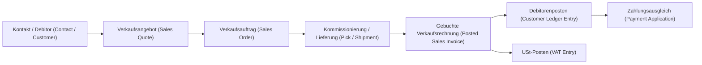

#### Schritt-für-Schritt in der deutschen Oberfläche

1. Öffne die Suche mit `Alt+Q`.
2. Suche nach `Verkaufsaufträge (Sales Orders)`.
3. Öffne die Seite `Verkaufsaufträge`.
4. Wähle `Neu`.
5. Wähle im Auftragskopf den Kunden `D10000`. Je nach Rolle, Sprache und Personalisierung ist zuerst das Feld `Debitorenname` / `Customer Name` sichtbar; gib dort den Kundennamen ein oder öffne die Auswahlliste und wähle den Debitor mit Nummer `D10000`.
6. Prüfe `Buchungsdatum`, `Belegdatum`, `Fälligkeitsdatum`, `Währungscode` und `Zahlungsbedingungscode`.
7. Wechsle in die Zeilen.
8. Wähle in der Spalte `Art` den Wert `Artikel`.
9. Wähle in der Spalte `Nr.` den Artikel `RM-M100`.
10. Trage in `Menge` den Wert `1` ein.
11. Prüfe `Lagerortcode = FRA-ZL`, Verkaufspreis, USt-Geschäftsbuchungsgruppe, USt-Produktbuchungsgruppe und Dimension `PRODUCTLINE = MACHINE`.
12. Wähle `Buchungsvorschau (Preview Posting)`, wenn verfügbar.
13. Prüfe, ob Debitorenposten, Sachposten, USt-Posten, Artikelposten und Wertposten entstehen würden.
14. Wähle `Freigeben (Release)`, falls der Prozess Freigabe nutzt.
15. Bei gesteuertem Lager erstellt der Lagerist die `Lagerkommissionierung (Warehouse Pick)`.
16. Wähle `Buchen`.
17. Wähle `Liefern und fakturieren`, wenn Lieferung und Rechnung gleichzeitig gebucht werden.
18. Öffne `Gebuchte Verkaufsrechnungen (Posted Sales Invoices)`.
19. Öffne `Debitorenposten (Customer Ledger Entries)` und filtere auf `D10000`.
20. Öffne `Sachposten (G/L Entries)` und filtere auf die Belegnummer.
21. Öffne `Artikelposten (Item Ledger Entries)` für `RM-M100`.
22. Öffne `Wertposten (Value Entries)` und prüfe den Kostenabgang.
23. Öffne `USt-Posten (VAT Entries)` und prüfe Steuerbasis und Steuerbetrag.
24. Öffne `Finanzberichte (Financial Reports)` und prüfe Erlös und Wareneinsatz.

#### Bebilderte Klickanleitung: `UAT-O2C-001`

Diese Klickanleitung macht den Verkaufsprozess nachklickbar. Sie zeigt nicht jeden Mausklick, sondern die Kontrollpunkte, an denen ein Anwender fachlich entscheiden oder ein Prüfer später Nachweise verlangen würde.

Ziel:
- Du erstellst einen Verkaufsauftrag für Debitor `D10000`.
- Du erfasst Artikel `RM-M100`, Menge `1`, Preis `68.000 EUR`.
- Du prüfst USt `19 %` und Dimension `PRODUCTLINE = MACHINE`.

Laborhinweis:

Der aktuelle Playwright-Lauf `UAT-O2C-001` beweist den Klickpfad und die benötigten Stammdaten in der CRONUS-Spielwiese. Er beweist noch nicht den deutschen Steuer-Endstand. Die Evidence `playwright/projects/fibu-book5/evidence/uat-o2c-001/045-target-vs-labor-delta.md` zeigt die aktuelle Abweichung: Ziel laut Buch `EUR`, `19 %`, Steuerbetrag `12.920`, Bruttobetrag `80.920`; aktueller Laborlauf `EUR`, `0 %`, Steuerbetrag `0`, Bruttobetrag `68.000`. Die Währung ist inzwischen am Debitor und im Auftrag gelöst. Die Steuerabweichung ist kein Bedienfehler, sondern eine Setup-Grenze der CRONUS-USA-Spielwiese.

Vorbedingungen:
- Company: `RM-DEMO` oder die im Trainingsmandanten definierte Verkaufsgesellschaft.
- Sprache/Region: Deutsch/Deutschland.
- Rolle: Vertrieb oder Verkaufsauftragsverarbeitung.
- Debitor `D10000`, Artikel `RM-M100`, Lagerort `FRA-ZL` und Dimension `PRODUCTLINE = MACHINE` sind angelegt.
- USt-Geschäftsbuchungsgruppe und USt-Produktbuchungsgruppe führen zum Steuersatz `19 %`.

| Schritt | Screenshot-Datei | Bildinhalt | Feldlogik | Prüfhinweis |
|---:|---|---|---|---|
| 010 | `playwright/projects/fibu-book5/img/uat-o2c-001-010-suche-verkaufsauftraege.png` | `Alt+Q` / Tell-Me mit Suchbegriff `Sales Orders` im gemischtsprachigen Laborlauf | Die Suche ist der stabile Einstieg, nicht ein Menüpfad. | Im deutschen Finallauf denselben Einstieg mit `Verkaufsaufträge` fotografieren und den richtigen Treffer ausdrücklich benennen. |
| 020 | `playwright/projects/fibu-book5/img/uat-o2c-001-020-liste-verkaufsauftraege.png` | Laborbild der Liste `Sales Orders` mit Aktion `Neu` | Die Liste zeigt offene, noch bearbeitbare Belege; `Neu` ist in BC eine Menüaktion. | Dieses Bild ist nur Navigations-/Listenbild. Es zeigt noch nicht unseren Auftrag `D10000`, sondern vorhandene CRONUS-Aufträge. |
| 030 | `playwright/projects/fibu-book5/img/uat-o2c-001-030-kopf-debitor-d10000.png` | Auftragskopf mit Debitor `D10000` / `Mueller Maschinenbau GmbH` | Das sichtbare Pflichtfeld kann `Debitorenname` / `Customer Name` sein. Nach Auswahl steuert der Debitor Zahlungsbedingungen, Debitorenbuchungsgruppe und USt-Geschäftsbuchungsgruppe. | Debitornummer in FactBox/Liste prüfen; außerdem Buchungsdatum, Belegdatum, Fälligkeitsdatum und Währung prüfen. |
| 040 | `playwright/projects/fibu-book5/img/uat-o2c-001-040-zeile-artikel-rm-m100.png` | Laborbild der Verkaufszeile mit `RM-M100`, Beschreibung, Lagerort `FRA-ZL`, Menge `1`, EUR-Summen und `Total Tax (EUR) = 0,00` | Der Artikel steuert Produktbuchungsgruppe, Lagerbuchungsgruppe und Steuergruppe; der Debitor steuert unter anderem Währung und Geschäftspartnerlogik. | Das aktuelle Bild ist ein guter Labor-Kandidat, aber noch kein finales Buchbild: Die FactBox ist für Tabellenbreite eingeklappt, die Steuer bleibt CRONUS-USA-Laborlogik mit 0 %. |
| 045 | `playwright/projects/fibu-book5/evidence/uat-o2c-001/045-target-vs-labor-delta.md` und `046-o2c-lab-learning-summary.md` | Ziel-vs.-Labor-Abweichung für USt und Brutto plus kompakte Lernzusammenfassung | Einrichtung entscheidet, ob der Beleg nur technisch lauffähig oder fachlich deutscher Steuerfall ist. | Bei Abweichung nicht buchen, sondern Setup-Lücke dokumentieren. `EUR` und `PRODUCTLINE = MACHINE` sind inzwischen im Labor nachgewiesen; `19 %` USt bleibt offen. |
| 050 | `playwright/projects/fibu-book5/img/uat-o2c-001-050-dimension-productline-machine.png` | Dimensionsprüfung `PRODUCTLINE = MACHINE` über `Line` -> `Related Information` -> `Dimensions` | Die Dimension ordnet Erlös und Marge der Produktlinie zu. | Vor dem Buchen prüfen, ob `PRODUCTLINE = MACHINE` und `CHANNEL = B2B` im Dialog `Edit Dimension Set Entries` sichtbar sind. |
| 060 | `playwright/projects/fibu-book5/img/uat-o2c-001-060-buchungsvorschau.png` | Labor-Fehlerbild nach `Buchungsvorschau (Preview Posting)` | BC prüft vor dem Buchen die Kontenfindung. Im aktuellen Labor fehlt `Inventory Account` im `Inventory Posting Setup` für `FRA-ZL` + `RESALE`. | Nicht buchen. Inventory Posting Setup korrigieren oder als Laborgrenze dokumentieren; danach Buchungsvorschau erneut erzeugen. |
| 070 | `playwright/projects/fibu-book5/img/uat-o2c-001-070-buchen-liefern-fakturieren.png` | Dialog `Buchen` mit `Liefern und fakturieren` | Die Aktion erzeugt gebuchte Belege und Posten. | Nur buchen, wenn Liefer- und Rechnungsfreigabe vorliegt. |
| 080 | `playwright/projects/fibu-book5/img/uat-o2c-001-080-gebuchte-verkaufsrechnung.png` | gebuchte Verkaufsrechnung | Der gebuchte Beleg ist der Einstieg in die Nachweiskette. | Belegnummer für alle Postenfilter notieren. |
| 090 | `playwright/projects/fibu-book5/img/uat-o2c-001-090-debitorenposten-d10000.png` | Debitorenposten für `D10000` | Der offene Posten zeigt Forderung und Fälligkeit. | Betrag brutto `80.920 EUR` prüfen. |
| 100 | `playwright/projects/fibu-book5/img/uat-o2c-001-100-sachposten-ust-wertposten.png` | Sachposten, USt-Posten, Artikelposten und Wertposten | Die Postenspur belegt Finance-, Steuer- und Lagerwirkung. | Belegnummer, Betrag, Steuerbasis, Menge und Dimension abstimmen. |

Was Anfänger hier lernen:

- Ein `Sales Order` / Verkaufsauftrag ist ein offener Beleg. Er ist noch nicht gebucht und erzeugt noch keine Forderung.
- Der Auftragskopf beantwortet: Wer ist der Kunde, welche Daten, welche Währung, welche Zahlungs- und Steuerlogik gelten?
- Die Auftragszeile beantwortet: Was wird verkauft, in welcher Menge, aus welchem Lager, zu welchem Preis und mit welcher Produkt-/Steuerlogik?
- Der Artikel `RM-M100` bringt Beschreibung, Einheit `PCS`, Preis und Buchungs-/Steuergruppen in die Zeile.
- Der Lagerort `FRA-ZL` sagt, aus welchem Bestand später geliefert wird.
- Die Dimension `PRODUCTLINE = MACHINE` ist für das spätere Reporting wichtig. Ohne diese Dimension kann der Umsatz zwar gebucht sein, aber in der Produktlinienauswertung fehlen.
- Der geprüfte Bedienpfad für die Zeilendimension lautet `Line` -> `Related Information` -> `Dimensions`.

Was im aktuellen Laborbild sichtbar ist:

- Die Verkaufszeile enthält `Item`, `RM-M100`, `Standardmaschine M100`, `FRA-ZL`, Menge `1`, Einheit `PCS` und Betrag `68.000,00`.
- Die Steuer-/Tax-Spalte zeigt im Labor `FURNITURE` und der Evidence-Nachweis zeigt `taxPercent = 0`.
- Der Dimensionsdialog zeigt `CHANNEL = B2B` und `PRODUCTLINE = MACHINE`.
- Die Buchungsvorschau-Prüfung stoppt aktuell auf `Error Messages`: `Inventory Account is missing in Inventory Posting Setup Location Code: FRA-ZL, Invt. Posting Group Code: RESALE`.
- Das beweist: Der Klickpfad, die Stammdaten und der Dimensionsfluss funktionieren im Labor. Es beweist noch nicht den deutschen Steuerfall.

Typische Anfängerfehler:

| Fehlerbild | Warum es passiert | Lösung |
|---|---|---|
| Der Anwender öffnet `Gebuchte Verkaufsrechnungen` statt `Verkaufsaufträge`. | Offene Belege und gebuchte Belege klingen ähnlich, haben aber unterschiedliche Zwecke. | Für die Erfassung immer `Verkaufsaufträge (Sales Orders)` öffnen; gebuchte Belege erst nach dem Buchen prüfen. |
| Im Kopf wird `D10000` gesucht, aber sichtbar ist `Customer Name`. | BC zeigt je nach Rolle/Sprache zuerst den Namen statt der Nummer. | Kundenname eingeben oder Lookup öffnen, danach Nummer `D10000` in FactBox/Liste prüfen. |
| Die Zeile sieht richtig aus, aber USt stimmt nicht. | Stammdaten und Buchungsgruppen machen den Auftrag technisch lauffähig; `EUR` ist im Labor gelöst, aber die CRONUS-USA-Steuerlogik liefert weiter 0 % statt deutscher 19-%-USt. | Nicht als deutschen Zielbeleg buchen. Ziel-vs.-Labor-Abweichung dokumentieren und deutsches Posting-/USt-Setup herstellen. |
| Die Buchungsvorschau zeigt `Inventory Account is missing in Inventory Posting Setup`. | Lagerort und Lagerbuchungsgruppe sind nicht nur Zusatzfelder. BC braucht für `FRA-ZL` + `RESALE` ein Bestandskonto in der Lagerbuchungsmatrix. | `Inventory Posting Setup` öffnen, Kombination `FRA-ZL`/`RESALE` prüfen, Bestandskonto fachlich setzen oder Laborgrenze dokumentieren. Danach Preview Posting erneut starten. |
| `PRODUCTLINE = MACHINE` fehlt. | Standarddimension am Artikel fehlt oder wurde nicht in den Beleg übernommen. | Vor dem Buchen Dimension in Zeile oder Dimensionsdialog prüfen und korrigieren. |
| Der Test lässt Entwurfsaufträge liegen. | BC speichert Belege früh automatisch. | Laboraufträge nach Screenshot über eindeutig eingegrenzten Cleanup entfernen; Evidence-Läufe bewusst getrennt durchführen. |

Merksatz:

Ein Verkaufsauftrag ist erst dann prüfbereit, wenn Kopf, Zeile, Betrag, Steuer, Lagerort und Dimension zusammenpassen. Ein grüner Klickpfad ersetzt keine fachliche Prüfung.

Markdown-Einbindung:

```md
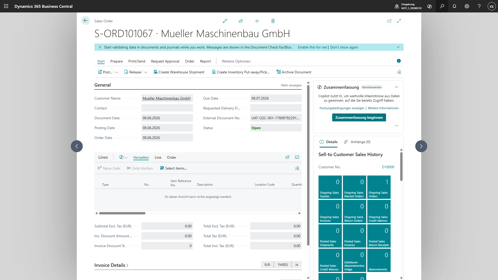
```

Evidence Pack (Nachweispaket):
- Auftragsnummer und gebuchte Verkaufsrechnungsnummer.
- Screenshot Auftragskopf und Verkaufszeile.
- Screenshot Dimension `PRODUCTLINE = MACHINE`.
- Buchungsvorschau oder, falls blockiert, Fehlerbild der Preview-Posting-Prüfung mit Setup-Ursache.
- Debitorenposten mit Bruttobetrag `80.920 EUR`.
- Sachposten für Forderung, Erlös, Umsatzsteuer, Bestand und Wareneinsatz.
- USt-Posten mit Steuerbasis `68.000 EUR` und Steuerbetrag `12.920 EUR`.
- Artikelposten und Wertposten für `RM-M100`.
- Finanzbericht mit Erlös und Marge nach `PRODUCTLINE = MACHINE`.

Praxisregel:
- Ein Screenshot gehört immer an eine fachliche Entscheidung, nicht an jeden Klick. Gute Buchscreenshots zeigen Seite, Feld, Wert und Prüfzweck.
- Reine Labor-Screenshotläufe werden nach dem benötigten Bild abgebrochen oder der Entwurfsbeleg wird entfernt. Nur ein bewusster Evidence-Lauf für Buchungsvorschau, Buchung und Postenspur lässt den Beleg bestehen oder bucht ihn.

#### Buchungsspur

| Ebene | Beispiel | Wo prüfen? |
|---|---|---|
| Beleg | Verkaufsauftrag `SO-1001` | `Verkaufsaufträge (Sales Orders)` |
| Gebuchter Beleg | gebuchte Verkaufsrechnung | `Gebuchte Verkaufsrechnungen (Posted Sales Invoices)` |
| Debitorenposten | Forderung gegen D10000 | `Debitorenposten (Customer Ledger Entries)` |
| Sachposten | Forderung, Erlös, USt, Wareneinsatz, Bestand | `Sachposten (G/L Entries)` |
| Artikelposten | Mengenabgang `RM-M100` | `Artikelposten (Item Ledger Entries)` |
| Wertposten | Kostenabgang | `Wertposten (Value Entries)` |
| USt-Posten | USt aus Verkauf | `USt-Posten (VAT Entries)` |
| Bericht | GuV nach Produktlinie | `Finanzberichte (Financial Reports)` |

Die Buchungsspur zeigt, dass ein Verkaufsauftrag mehr ist als ein Vertriebsformular. Der gleiche Vorgang erzeugt eine Forderung, einen Erlös, USt, Lagerbewegung, Kostenabgang und Auswertungsdaten für Controlling. Finance prüft deshalb nicht nur die Rechnung, sondern die gesamte Kette vom Auftrag bis zum Posten.

#### Fehlerdiagnose und Korrektur

| Fehler | Symptom | Ursache | Diagnosepfad | Korrekturweg | Was man nicht tun darf |
|---|---|---|---|---|---|
| falscher Lagerort | Bestand stimmt nicht | falscher Lagerortcode im Auftrag | Verkaufsrechnung → Artikelposten → Lagerort | Gutschrift/Neubuchung oder Lagerkorrektur nach Freigabe | gebuchte Posten löschen wollen |
| falscher Preis | Marge falsch | falsche Preisliste oder manuelle Änderung | Verkaufszeile → Preisfindung → Finanzbericht | Preislisten korrigieren, Beleg fachlich korrigieren | Preis im gebuchten Beleg überschreiben wollen |
| falsche USt | USt-Posten falsch | falsche USt-Buchungsgruppe | Debitor/Artikel → USt-Buchungsmatrix Einrichtung → USt-Posten | Gutschrift und Neuberechnung nach Steuerfreigabe | USt nur im Bericht manuell korrigieren |

Praxisregel:
- Ein gebuchter Verkaufsbeleg wird fachlich korrigiert, nicht technisch gelöscht. Der Korrekturweg muss den ursprünglichen Fehler, den neuen Beleg und die betroffenen Posten nachvollziehbar verbinden.

### Beispieldaten und Buchung

Fall `S-001`: Debitor `D10000` kauft `RM-M100`, 1 Stück, netto `68.000 EUR`, USt `12.920 EUR`.

| Buchung | Soll | Haben |
|---|---:|---:|
| Forderungen D10000 | 80.920 | |
| Umsatzerlöse Maschinen | | 68.000 |
| Umsatzsteuer 19 % | | 12.920 |

Mitarbeiterbedienung:
1. Verkäuferin: `Alt+Q` → `Verkaufsangebote (Sales Quotes)` → `Neu` → Feld `Verk. an Deb.-Nr. = D10000`.
2. Zeile: `Art = Artikel`, `Nr. = RM-M100`, `Menge = 1`, `Lagerortcode = FRA-ZL`.
3. Aktion: `Make Order`.
4. Lagerist: `Alt+Q` → `Lagerkommissionierungen (Warehouse Picks)` → Pick erstellen und registrieren.
5. Vertrieb: `Buchen (Post)` → `Liefern und fakturieren (Ship and Invoice)`, wenn Lieferung abgeschlossen ist.
6. Buchhaltung: `Alt+Q` → `Debitorenposten (Customer Ledger Entries)` → Posten D10000 prüfen.

### Abweichungen und Sonderfälle

| Use Case | BC-Mechanik | Mitarbeiter | Risiko | Evidence Pack |
|---|---|---|---|---|
| Teillieferung | `Zu liefern (Qty. to Ship)` | Lager/Vertrieb | Rechnung über falsche Menge | Lieferung (Shipment) ↔ Rechnung (Invoice) |
| Retoure | `Verkaufsreklamation (Sales Return Order)` | Vertrieb/Lager | USt-Korrektur fehlt | Bezug zur Ursprungsrechnung |
| Gutschrift | `Verkaufsgutschrift (Sales Credit Memo)` | Debitorenbuchhaltung | falsches Erlöskonto | Gutschrift (Credit Memo) + USt-Posten (VAT Entry) |
| Vorauszahlung | `Vorauszahlungsrechnung (Prepayment Invoice)` | Vertrieb/Finance | falsche Steuerperiode | Vorauszahlungs-USt (Prepayment VAT) |
| Dropshipping | Verkaufsauftrag (Sales Order) ↔ Einkaufsbestellung (Purchase Order) | Vertrieb/Einkauf | Liefernachweis fehlt | Lieferantenbeleg + Kundenrechnung |
| Shopify | Shopauftrag (Shop Order) → Verkaufsauftrag (Sales Order) | E-Commerce | falsche Kundenzuordnung | Shop-ID + BC-Beleg |
| EU-B2B | USt-Geschäftsbuchungsgruppe EU (VAT Bus. Posting Group EU) | Vertrieb/Finance | USt-IdNr. fehlt | USt-IdNr., ZM |
| Drittland | Export-USt-Klausel (Export VAT Clause) | Vertrieb/Finance | Ausfuhrnachweis fehlt | Exportnachweis |

BC-Best-Practice:
- Verkäufer dürfen Preise und Rabatte erfassen, aber nicht USt-Buchungsgruppen ändern.
- Onlineshop-Aufträge laufen durch eine tägliche Fehlerliste: unbekannte Artikel, fehlende Kunden, Zahlungsabweichungen.

Schulungsübung:

| Feld | Inhalt |
|---|---|
| Rolle | Vertrieb, Lager, Debitorenbuchhaltung |
| Alltagssituation | Debitor `D10000` bestellt Maschine `RM-M100`; RM-SALES liefert aus `FRA-ZL` und fakturiert sofort. |
| Konkrete Testdaten | `SO-1001`, `D10000`, Artikel `RM-M100`, Menge `1`, Preis `68.000 EUR`, USt `19 %`, Dimension `PRODUCTLINE = MACHINE` |
| Startseite über `Alt+Q` | `Verkaufsaufträge (Sales Orders)` |
| Exakte Felder und Werte | `Debitorennr. = D10000`, `Art = Artikel`, `Nr. = RM-M100`, `Menge = 1`, `Lagerortcode = FRA-ZL`, `PRODUCTLINE = MACHINE` |
| Auszuführende Aktion | `Buchungsvorschau (Preview Posting)`, `Freigeben (Release)`, `Buchen`, `Liefern und fakturieren (Ship and Invoice)` |
| Erwartete Belege | Verkaufsauftrag, gebuchte Verkaufslieferung, gebuchte Verkaufsrechnung |
| Erwartete Posten | Debitorenposten, Sachposten, USt-Posten, Artikelposten, Wertposten |
| Kontrollbericht | `Finanzberichte (Financial Reports)`, `Lagerbewertung (Inventory Valuation)` |
| Fehlerfrage | Was passiert, wenn versehentlich `Lagerortcode = MZ-EINFACH` gebucht wird? |

Lösungsskizze:
1. Öffne `Verkaufsaufträge (Sales Orders)` über `Alt+Q`.
2. Wähle `Neu` und erfasse `Debitorennr. = D10000`.
3. Erfasse die Zeile `Art = Artikel`, `Nr. = RM-M100`, `Menge = 1`, `Lagerortcode = FRA-ZL`.
4. Prüfe Preis `68.000 EUR`, USt-Gruppen und Dimension `PRODUCTLINE = MACHINE`.
5. Wähle `Buchungsvorschau (Preview Posting)` und prüfe Forderung, Erlös, USt, Lagerabgang und Wareneinsatz.
6. Wähle `Freigeben (Release)`, anschließend `Buchen` und `Liefern und fakturieren (Ship and Invoice)`.
7. Öffne `Gebuchte Verkaufsrechnungen (Posted Sales Invoices)` und die Belegnummer.
8. Prüfe `Debitorenposten (Customer Ledger Entries)`, `Sachposten (G/L Entries)`, `USt-Posten (VAT Entries)`, `Artikelposten (Item Ledger Entries)` und `Wertposten (Value Entries)`.
9. Öffne `Finanzberichte (Financial Reports)` und prüfe Erlös und Wareneinsatz mit Dimension `PRODUCTLINE = MACHINE`.

UAT-Fall:

| Feld | Inhalt |
|---|---|
| ID | `UAT-O2C-001` |
| Rolle | Vertrieb, Lager, Debitorenbuchhaltung |
| Testdaten | `D10000`, `RM-M100`, Menge `1`, Preis `68.000 EUR`, Lagerort `FRA-ZL` |
| Exakte Schrittfolge | 1. `Verkaufsaufträge (Sales Orders)` öffnen.<br>2. Auftrag mit `D10000` und `RM-M100` erfassen.<br>3. `Buchungsvorschau (Preview Posting)` prüfen.<br>4. `Freigeben (Release)` wählen.<br>5. `Buchen` → `Liefern und fakturieren (Ship and Invoice)` wählen.<br>6. Gebuchte Rechnung und Posten öffnen.<br>7. Finanzbericht und Lagerbewertung prüfen. |
| Erwartete Belege | Verkaufsauftrag, gebuchte Verkaufslieferung, gebuchte Verkaufsrechnung |
| Erwartete Posten | Debitorenposten, Sachposten, USt-Posten, Artikelposten, Wertposten |
| Kontrollbericht | `Finanzberichte (Financial Reports)`, `Lagerbewertung (Inventory Valuation)` |
| Akzeptanzkriterium | Forderung `80.920 EUR`, Erlös `68.000 EUR`, USt `12.920 EUR`, Lagerabgang und Wareneinsatz sind nachweisbar. |
| Evidence Pack | Auftrag, gebuchte Rechnung, Postenfilter, Buchungsvorschau, Finanzbericht, Lagerbewertung |
| Absichtlich falsche Eingabe | `Lagerortcode = MZ-EINFACH` statt `FRA-ZL` |
| Erwartetes Fehlverhalten | Lagerabgang erfolgt aus falschem Lagerort. |
| Diagnosepfad | Gebuchte Verkaufsrechnung → `Artikelposten (Item Ledger Entries)` → Feld `Lagerortcode`. |
| Erlaubter Korrekturweg | Gutschrift/Neubuchung oder fachlich freigegebene Lagerkorrektur mit Evidence Pack. |
| Nicht erlaubt | Gebuchte Artikelposten löschen oder Lagerwert im Bericht manuell überschreiben. |

### In 5 Minuten merken

* 5 wichtigste Begriffe: Verkaufsauftrag, gebuchte Verkaufsrechnung, Debitorenposten, USt-Posten, Wertposten.
* 5 wichtigste Seiten: `Verkaufsaufträge`, `Gebuchte Verkaufsrechnungen`, `Debitorenposten`, `Sachposten`, `Artikelposten`.
* 3 häufigste Fehler: falscher Lagerort, falscher Preis, falsche USt-Gruppe.
* 3 Prüfungsfallen: Angebot ist noch keine Buchung, Lieferung ist nicht immer Rechnung, Gutschrift ist nicht dasselbe wie Postenlöschung.
* 1 Praxisregel: Vor dem Buchen immer Buchungsvorschau, Lagerort, Preis, USt und Dimension prüfen.

---


## 12. Procure-to-Pay: Rohmaterial einkaufen [Q11][Q12][Q13]

P2P beginnt beim Bedarf und endet mit abgestimmter Verbindlichkeit, Zahlung und Vorsteuer. Der Einkauf erzeugt nicht nur Belege, sondern steuert Preis-, Mengen-, Liefer- und Betrugsrisiken.

| Feld | Inhalt |
|---|---|
| Zielgruppe | Einsteiger, Einkauf, Lager, Kreditorenbuchhaltung, Consultant |
| Schwierigkeit | Basic bis Intermediate |
| Prozessbereich | Einkauf/P2P |
| Betroffene Companies | RM-PROD, RM-SHARED |
| MB-800-Relevanz | Ja: Kreditoren, Einkaufsbestellungen, Wareneingänge, Eingangsrechnungen, Zahlungen |
| Solution-Architect-Relevanz | Ja: 3-Way-Match, E-Rechnung, Genehmigungen, Lagerintegration |
| Benötigte Vorkenntnisse | Kreditor, Artikel, Lagerort, Bestellung, Rechnung |
| Ergebnis nach dem Kapitel | Leser kann Rohmaterial beschaffen, Wareneingang buchen, Rechnung prüfen und Posten kontrollieren |

### Für absolute Einsteiger: Was du hier gerade tust

Die Firma kauft Stahl, damit später Maschinen produziert werden können. In Business Central beginnt das mit einer Einkaufsbestellung. Beim Wareneingang steigt der Lagerbestand. Bei der Eingangsrechnung entsteht eine Verbindlichkeit gegenüber dem Lieferanten und gegebenenfalls Vorsteuer. Einkauf verbindet also Bedarf, Lager und Buchhaltung.

### Warum braucht die Rhein-Main Industriegruppe diesen Prozess?

RM-PROD benötigt Rohmaterial `RAW-STEEL`, damit Fertigungsaufträge für `RM-M100` starten können. Ohne Einkaufsbestellung wären Preis, Menge, Liefertermin, Lagerort und spätere Rechnung nicht sauber verbunden. Business Central stellt sicher, dass Wareneingang, Eingangsrechnung, Kreditorenposten, Artikelposten, Wertposten und Sachposten zusammenpassen.

### Mitarbeiterrollen

| Rolle | Bedienhandlung | Seite | Ergebnis |
|---|---|---|---|
| Einkäufer | Bestellung aus Planungsbedarf erstellen | `Einkaufsbestellungen (Purchase Orders)` | `PO-2001` |
| Lagerist | Wareneingang buchen | `Lagereingänge (Warehouse Receipts)` oder `Einkaufsbestellungen (Purchase Orders)` | Bestand steigt |
| Kreditorenbuchhalter | Eingangsrechnung prüfen | `Einkaufsrechnungen (Purchase Invoices)` / `Eingehende Dokumente (Incoming Documents)` | Verbindlichkeit |
| Finance-Leitung | Zahlung freigeben | `Zahlungs Buch.-Blätter (Payment Journals)` | Zahlungsvorschlag |

### Prozessfluss

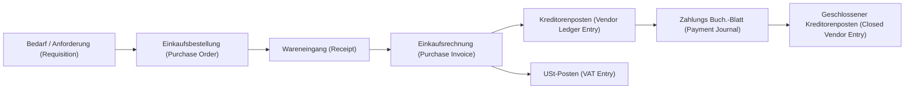

#### Schritt-für-Schritt in der deutschen Oberfläche

1. Öffne die Suche mit `Alt+Q`.
2. Suche nach `Einkaufsbestellungen (Purchase Orders)`.
3. Öffne die Seite `Einkaufsbestellungen`.
4. Wähle `Neu`.
5. Wähle im Feld `Kreditorennr.` den Lieferanten `K10000`.
6. Prüfe `Buchungsdatum`, `Belegdatum`, `Kred.-Rechnungsnr.`, `Zahlungsbedingungscode` und Währung.
7. Erfasse in den Zeilen `Art = Artikel`, `Nr. = RAW-STEEL`, `Menge = 10`, `Lagerortcode = FRA-ZL`.
8. Prüfe Einkaufspreis, USt-Geschäftsbuchungsgruppe, USt-Produktbuchungsgruppe und Dimension `PRODUCTLINE = MACHINE`.
9. Wähle `Buchungsvorschau (Preview Posting)`, wenn die Eingangsrechnung bereits gebucht werden soll.
10. Buche zunächst `Empfangen`, wenn Ware und Rechnung getrennt eintreffen.
11. Öffne `Gebuchte Einkaufslieferungen (Posted Purchase Receipts)` und prüfe Menge und Lagerort.
12. Öffne `Artikelposten (Item Ledger Entries)` für `RAW-STEEL`.
13. Öffne die Bestellung erneut und erfasse die externe Rechnungsnummer des Lieferanten.
14. Wähle `Buchen` und danach `Fakturieren`.
15. Öffne `Gebuchte Einkaufsrechnungen (Posted Purchase Invoices)`.
16. Öffne `Kreditorenposten (Vendor Ledger Entries)` und filtere auf `K10000`.
17. Öffne `Sachposten (G/L Entries)` und filtere auf die Belegnummer.
18. Öffne `USt-Posten (VAT Entries)` und prüfe Vorsteuerbasis und Vorsteuerbetrag.
19. Öffne `Wertposten (Value Entries)` und prüfe den Zugangswert.
20. Dokumentiere Bestellnummer, Wareneingang, Eingangsrechnung, Posten und Kontrollbericht im Evidence Pack.

#### Buchungsspur

| Ebene | Beispiel | Wo prüfen? |
|---|---|---|
| Beleg | Einkaufsbestellung `PO-2001` | `Einkaufsbestellungen (Purchase Orders)` |
| Gebuchter Wareneingang | gebuchte Einkaufslieferung | `Gebuchte Einkaufslieferungen (Posted Purchase Receipts)` |
| Gebuchte Rechnung | gebuchte Einkaufsrechnung | `Gebuchte Einkaufsrechnungen (Posted Purchase Invoices)` |
| Kreditorenposten | Verbindlichkeit gegen `K10000` | `Kreditorenposten (Vendor Ledger Entries)` |
| Sachposten | Vorrat, Vorsteuer, Verbindlichkeit | `Sachposten (G/L Entries)` |
| Artikelposten | Mengenzugang `RAW-STEEL` | `Artikelposten (Item Ledger Entries)` |
| Wertposten | Zugangswert Rohmaterial | `Wertposten (Value Entries)` |
| USt-Posten | Vorsteuer aus Einkauf | `USt-Posten (VAT Entries)` |

### Beispieldaten und Buchung

Fall `P-001`: Einkauf `RAW-STEEL`, 10 Stück à `2.500 EUR`, netto `25.000 EUR`, Vorsteuer `4.750 EUR`.

| Buchung | Soll | Haben |
|---|---:|---:|
| Vorräte Rohmaterial | 25.000 | |
| Vorsteuer 19 % | 4.750 | |
| Verbindlichkeiten K10000 | | 29.750 |

Bedienung:
1. Einkäufer: `Alt+Q` → `Einkaufsbestellungen (Purchase Orders)` → `Neu` → Feld `Eink. von Kred.-Nr. = K10000`.
2. Zeile: `Art = Artikel`, `Nr. = RAW-STEEL`, `Menge = 10`, `Lagerortcode = FRA-ZL`.
3. Lagerist: gesteuertes Lager → `Lagereingang (Warehouse Receipt)` erstellen und buchen.
4. Kreditorenbuchhalter: Eingangsrechnung mit Bestellung abgleichen.
5. Finance: Zahlungsvorschlag erstellen und ausführen.

### Abweichungen

| Use Case | BC-Mechanik | Kontrolle |
|---|---|---|
| Teil-Wareneingang | mehrere gebuchte Wareneingänge | `Empfangene Menge (Qty. Received)` vs. `Fakturierte Menge (Qty. Invoiced)` |
| Preisabweichung | Rechnungspreis abweichend | Freigabe vor Buchung |
| Rücksendung | `Einkaufsreklamationsauftrag (Purchase Return Order)` | Bezug zur Ursprungslieferung |
| E-Rechnung | `E-Belege (E-Documents)` / `Eingehende Belege (Incoming Documents)` | XML und Validierung |
| Fremdarbeit | Fremdarbeit (Subcontracting) / Einkaufsleistung (Purchase Service) | Fertigungsauftragbezug |
| Lieferantenbank geändert | Kreditorbankkonto (Vendor Bank Account) | Vier-Augen-Prüfung |

BC-Best-Practice:
- Externe Belegnummer ist Pflicht.
- Bankdatenänderungen werden nicht im Zahlungslauf geändert, sondern vorher freigegeben.
- Mengen- und Preisabweichungen erhalten eigene Freigaberegeln.

Schulungsübung:

| Feld | Inhalt |
|---|---|
| Rolle | Einkauf, Lager, Kreditorenbuchhaltung |
| Alltagssituation | RM-PROD bestellt `RAW-STEEL` bei `K10000`; nur 6 von 10 Stück treffen ein, die Rechnung lautet aber auf 10 Stück. |
| Konkrete Testdaten | `PO-2001`, Kreditor `K10000`, Artikel `RAW-STEEL`, Bestellmenge `10`, Wareneingang `6`, Lagerort `FRA-ZL` |
| Startseite über `Alt+Q` | `Einkaufsbestellungen (Purchase Orders)` |
| Exakte Felder und Werte | `Kreditorennr. = K10000`, `Art = Artikel`, `Nr. = RAW-STEEL`, `Menge = 10`, `Zu empfangen = 6`, `Lagerortcode = FRA-ZL` |
| Auszuführende Aktion | `Buchen` → `Empfangen`, danach Eingangsrechnung über `10` testen und korrigieren |
| Erwartete Belege | Einkaufsbestellung, gebuchte Einkaufslieferung über `6`, gebuchte Einkaufsrechnung über zulässige Menge |
| Erwartete Posten | Artikelposten, Wertposten, Kreditorenposten, Sachposten, USt-Posten |
| Kontrollbericht | `Gebuchte Einkaufslieferungen (Posted Purchase Receipts)`, `Kreditorenposten (Vendor Ledger Entries)`, `Lagerbewertung (Inventory Valuation)` |
| Fehlerfrage | Warum darf Finance nicht einfach die Rechnung über `10` buchen, wenn nur `6` empfangen wurden? |

Lösungsskizze:
1. Öffne `Einkaufsbestellungen (Purchase Orders)` über `Alt+Q`.
2. Erfasse Bestellung `PO-2001` mit `Kreditorennr. = K10000`.
3. Erfasse Zeile `Art = Artikel`, `Nr. = RAW-STEEL`, `Menge = 10`, `Lagerortcode = FRA-ZL`.
4. Setze `Zu empfangen = 6` und wähle `Buchen` → `Empfangen`.
5. Öffne `Artikelposten (Item Ledger Entries)` und prüfe Zugang `6` für `RAW-STEEL`.
6. Öffne die Bestellung erneut und versuche, eine Eingangsrechnung über `10` zu buchen.
7. Prüfe die Mengenfelder `Empfangene Menge (Qty. Received)` und `Fakturierte Menge (Qty. Invoiced)`.
8. Korrigiere die Rechnungsmenge auf `6` oder buche den Restwareneingang, wenn die Ware tatsächlich eingetroffen ist.
9. Prüfe `Kreditorenposten (Vendor Ledger Entries)`, `Sachposten (G/L Entries)`, `USt-Posten (VAT Entries)` und `Wertposten (Value Entries)`.

UAT-Fall:

| Feld | Inhalt |
|---|---|
| ID | `UAT-P2P-001` |
| Rolle | Einkauf, Lager, Kreditorenbuchhaltung |
| Testdaten | `PO-2001`, `K10000`, `RAW-STEEL`, Menge `10`, Wareneingang `6`, Lagerort `FRA-ZL` |
| Exakte Schrittfolge | 1. `Einkaufsbestellungen (Purchase Orders)` öffnen.<br>2. Bestellung mit `K10000` und `RAW-STEEL` erfassen.<br>3. `Zu empfangen = 6` buchen.<br>4. `Artikelposten (Item Ledger Entries)` prüfen.<br>5. Eingangsrechnung über `10` testen.<br>6. Fehler über Mengenfelder diagnostizieren.<br>7. Rechnung auf `6` korrigieren oder Rest-WE buchen.<br>8. Kreditoren-, Sach-, USt- und Wertposten prüfen. |
| Erwartete Belege | Einkaufsbestellung, gebuchte Einkaufslieferung, gebuchte Einkaufsrechnung |
| Erwartete Posten | Kreditorenposten, Sachposten, USt-Posten, Artikelposten, Wertposten |
| Kontrollbericht | `Gebuchte Einkaufslieferungen (Posted Purchase Receipts)`, `Kreditorenposten (Vendor Ledger Entries)`, `Lagerbewertung (Inventory Valuation)` |
| Akzeptanzkriterium | Nur empfangene Ware wird fakturiert oder der Restwareneingang ist vor der Rechnung sauber gebucht. |
| Evidence Pack | Bestellung, Wareneingang, Eingangsrechnung, Postenfilter, Fehlerdiagnose, Korrekturentscheidung |
| Absichtlich falsche Eingabe | Rechnung über `10` buchen, obwohl nur `6` empfangen wurden. |
| Erwartetes Fehlverhalten | Mengenabgleich zeigt Abweichung; Verbindlichkeit und Lagerwert wären sonst zu hoch. |
| Diagnosepfad | Einkaufsbestellung → Zeilenfelder `Empfangene Menge` / `Fakturierte Menge` → gebuchte Einkaufslieferung. |
| Erlaubter Korrekturweg | Rechnungsmenge auf `6` reduzieren oder fehlenden Wareneingang buchen, wenn Ware physisch da ist. |
| Nicht erlaubt | Rechnung über `10` freigeben, nur damit der Kreditor bezahlt werden kann. |

### In 5 Minuten merken

* 5 wichtigste Begriffe: Einkaufsbestellung, Wareneingang, gebuchte Einkaufsrechnung, Kreditorenposten, Vorsteuer.
* 5 wichtigste Seiten: `Einkaufsbestellungen`, `Gebuchte Einkaufslieferungen`, `Gebuchte Einkaufsrechnungen`, `Kreditorenposten`, `Artikelposten`.
* 3 häufigste Fehler: fehlende externe Rechnungsnummer, falscher Lagerort, Rechnung über nicht empfangene Menge.
* 3 Prüfungsfallen: Empfangen ist nicht Fakturieren, Kreditorenposten ist nicht Sachposten, Vorsteuer hängt an der USt-Buchungsmatrix.
* 1 Praxisregel: Einkauf prüft Preis und Menge, Lager prüft Wareneingang, Finance prüft Rechnung und Posten.

---


## 13. Inventory und Warehouse: Ware bewegen und bewerten [Q14][Q15][Q65][Q66][Q67][Q68]

Dieses Kapitel zeigt, wie Rhein-Main Waren im einfachen Lager und im gesteuerten Lager bewegt, einlagert, kommissioniert und bewertet. Nach dem Kapitel kannst du den Unterschied zwischen direkter Lagerbuchung und Warehouse-Steuerung erklären und die entstandenen Artikelposten, Wertposten und Lagerberichte prüfen.

### Kapitelbox

| Feld | Inhalt |
|---|---|
| Zielgruppe | Einsteiger, Key User, Junior Consultant, MB-800-Lerner, Standard-Solution-Architect |
| Schwierigkeit | Basic bis Advanced |
| Prozessbereich | Inventory/Warehouse |
| Betroffene Companies | RM-PROD, RM-SALES, RM-SERVICE |
| MB-800-Relevanz | Ja: Artikel, Lagerorte, Lagerplätze, Artikelposten, Wertposten, Lagerbewertung |
| Solution-Architect-Relevanz | Ja: einfache Lagerlogik vs. gesteuertes Lager, Lagerwert, Prozesskontrolle |
| Ergebnis nach dem Kapitel | Du kannst Wareneingang, Einlagerung, Kommissionierung, Lagerbewegung, Artikelposten, Wertposten und Lagerbewertung für einfache und gesteuerte Lager ausführen und abstimmen. |

### Alltagsszene bei Rhein-Main

Dienstagmorgen trifft im einfachen Lager `MZ-EINFACH` eine Lieferung mit Ersatzteilen ein. Am gleichen Tag erwartet das gesteuerte Lager `FRA-ZL` Rohmaterial für die Fertigung. Der Lagerist in Mainz bucht den Wareneingang direkt aus der Einkaufsbestellung. In Frankfurt muss der Wareneingang zuerst als Lagereingang gebucht und danach auf einen Lagerplatz eingelagert werden. Finance prüft anschließend, ob Menge und Wert zusammenpassen.

### Für absolute Einsteiger erklärt

Lager bedeutet in Business Central drei Dinge: Menge, Ort und Wert. Die Menge siehst du in `Artikelposten (Item Ledger Entries)`. Den Wert siehst du in `Wertposten (Value Entries)`. Den physischen Lagerort steuerst du über `Lagerorte (Locations)` und bei gesteuertem Lager zusätzlich über `Lagerplätze (Bins)`. Ein einfacher Lagerort ist schneller zu bedienen. Ein gesteuerter Lagerort erzeugt mehr Arbeitsschritte, aber auch bessere Kontrolle.

### Warum braucht Rhein-Main diesen Prozess?

Rhein-Main braucht beide Lagerlogiken, weil nicht jede Ware gleich kritisch ist. Ersatzteile in `MZ-EINFACH` werden schnell bewegt und brauchen wenig Prozessführung. Rohmaterial und Fertigmaschinen in `FRA-ZL` haben hohe Werte und müssen lagerplatzgenau gesteuert werden. Business Central verbindet beide Welten mit derselben Artikel- und Wertlogik. Der Unterschied liegt in den Lageraktivitäten vor der endgültigen Buchung.

### Rollen

Die Rollen zeigen, dass Lagerarbeit nicht nur körperliche Bewegung ist. Jede Rolle erzeugt oder prüft einen Nachweis.

| Rolle | Aufgabe | Ergebnis |
|---|---|---|
| Lagerist einfaches Lager | Wareneingang direkt aus Bestellung buchen | `Artikelposten (Item Ledger Entries)` und `Wertposten (Value Entries)` stimmen |
| Lagerist gesteuertes Lager | Lagereingang buchen und Einlagerung registrieren | Bestand liegt am richtigen Lagerplatz |
| Finance | Lagerbewertung mit Hauptbuch abstimmen | Lagerwert ist erklärbar |
| Solution Architect | Lagerlogik je Standort festlegen | Standardentscheidung ist im UAT nachgewiesen |

Praktisch bedeutet das: Der Fachbereich erzeugt den Vorgang, Key User und Finance sichern die Buchbarkeit, und der Solution Architect bewertet, ob der Standard ausreicht.

### Stammdaten

Vor der Buchung müssen Artikel und Lagerorte stimmen. Ein falscher Lagerort ist kein Schönheitsfehler, sondern erzeugt falsche Bestands- und Prozessnachweise.

| Stammdatum | Rhein-Main-Beispiel | Warum wichtig? |
|---|---|---|
| Artikel | `SP-PUMP-01`, `RAW-STEEL`, `RM-M100` | Einheit, Kostenmethode und Buchungsgruppen steuern Menge und Wert |
| Lagerort | `MZ-EINFACH`, `FRA-ZL` | entscheidet über einfache oder gesteuerte Lagerlogik |
| Lagerplatz | `REC-01`, `RAW-01`, `SHIP-01` | nur im gesteuerten Lager relevant |
| Dimension | `LOCATION-GROUP = DIRECTED` | macht Lagerlogik im Reporting sichtbar |

Kontrollfrage: Kannst du vor der Buchung erklären, welcher Partner, welcher Artikel oder welches Konto später welchen Posten auslöst?

### Setup

Das Setup ist die fachliche Leitplanke. Es entscheidet, ob der richtige Klick später auf das richtige Konto, die richtige Steuerlogik und den richtigen Bericht läuft.

- `Lagereinrichtung (Inventory Setup)` mit Kostenregulierung und Buchung ins Hauptbuch
- `Lagerorte (Locations)` mit oder ohne gesteuerte Einlagerung und Kommissionierung
- `Lagerbuchungsmatrix Einrichtung (Inventory Posting Setup)` für Bestandskonten
- `Allgemeine Buchungsmatrix Einrichtung (General Posting Setup)` für Wareneinsatz

Rhein-Main ändert Setup nur über dokumentierte Projektentscheidungen. Ein spontaner Setup-Wechsel im Tagesgeschäft ist ein Change Request.

### Deutsche BC-Seiten

Diese Seiten öffnest du über `Alt+Q`. Der deutsche Begriff ist führend; der englische Begriff steht als Suchhilfe in Klammern.

- `Einkaufsbestellungen (Purchase Orders)`
- `Lagereingänge (Warehouse Receipts)`
- `Lagereinlagerungen (Warehouse Put-aways)`
- `Lagerkommissionierungen (Warehouse Picks)`
- `Artikelposten (Item Ledger Entries)`
- `Wertposten (Value Entries)`
- `Lagerbewertung (Inventory Valuation)`

### Schritt-für-Schritt

1. Öffne `Alt+Q` und suche `Einkaufsbestellungen (Purchase Orders)`.
2. Öffne Bestellung `PO-2001` für Kreditor `K10000` und Artikel `RAW-STEEL`.
3. Prüfe `Lagerortcode = MZ-EINFACH`, `Menge = 1.000 KG`, `Direkte Kosten = 12 EUR` und Dimension `LOCATION-GROUP = SIMPLE`.
4. Wähle `Buchen` und danach `Empfangen`, wenn nur der Wareneingang gebucht wird.
5. Öffne `Artikelposten (Item Ledger Entries)` und filtere auf `RAW-STEEL`, `MZ-EINFACH` und die Belegnummer.
6. Öffne `Wertposten (Value Entries)` und prüfe den Zugangswert.
7. Für `FRA-ZL` öffne `Lagereingänge (Warehouse Receipts)` über `Alt+Q`.
8. Wähle `Quelldokumente holen (Get Source Documents)` und hole Bestellung `PO-2002`.
9. Prüfe `Lagerortcode = FRA-ZL`, Menge und Lagerplatzvorschlag.
10. Wähle `Wareneingang buchen (Post Receipt)`.
11. Öffne `Lagereinlagerungen (Warehouse Put-aways)`, öffne die erzeugte Einlagerung und prüfe `Von Lagerplatz = REC-01` und `Nach Lagerplatz = RAW-01`.
12. Wähle `Einlagerung registrieren (Register Put-away)`.
13. Prüfe `Lagerplatzinhalt (Bin Contents)`, `Artikelposten (Item Ledger Entries)`, `Wertposten (Value Entries)` und `Lagerbewertung (Inventory Valuation)`.

### Buchungsspur

Die folgende Spur zeigt, wie aus dem Vorgang ein prüfbarer Nachweis wird.

| Ebene | Rhein-Main-Nachweis | Wo prüfen? |
|---|---|---|
| Ausgangsbeleg | Einkaufsbestellung `PO-2001` oder `PO-2002` | `Einkaufsbestellungen (Purchase Orders)` |
| Lageraktivität | Lagereingang und Einlagerung bei `FRA-ZL` | `Lagereingänge (Warehouse Receipts)`, `Lagereinlagerungen (Warehouse Put-aways)` |
| Artikelposten | Mengenzugang für `RAW-STEEL` | `Artikelposten (Item Ledger Entries)` |
| Wertposten | Zugangswert und spätere Kostenregulierung | `Wertposten (Value Entries)` |
| Sachposten | Bestandskonto nach Lagerkostenbuchung | `Sachposten (G/L Entries)` |

Praktische Einordnung: Wenn eine Ebene fehlt, ist der Prozess nicht 10/10 abnahmefähig. Der UAT-Prüfer muss vom Ausgangsbeleg bis zum Kontrollbericht springen können.

### Kontrollberichte

- `Lagerbewertung (Inventory Valuation)`
- `Lagerplatzinhalt (Bin Contents)`
- `Wertposten (Value Entries)`

Rhein-Main nutzt diese Berichte nicht als Dekoration, sondern als Abgleich gegen die Posten. Ein Bericht ohne Drilldown oder Postenbezug reicht für UAT nicht.

### Fehlerdiagnose

| Fehler | Symptom | Ursache | Diagnosepfad | Korrekturweg |
|---|---|---|---|---|
| falscher Lagerort | Bestand liegt in Mainz statt Frankfurt | Lagerortcode im Beleg falsch | Belegnummer in `Artikelposten (Item Ledger Entries)` prüfen | vor Buchung korrigieren; nach Buchung sauber umbuchen oder gutschreiben/neubuchen |
| Einlagerung nicht registriert | Wareneingang gebucht, aber Ware nicht am Lagerplatz verfügbar | zweiter Warehouse-Schritt fehlt | `Lagereinlagerungen (Warehouse Put-aways)` öffnen | Einlagerung registrieren und Evidence Pack ergänzen |
| Lagerwert passt nicht | Menge stimmt, Wert weicht ab | Rechnung, Kostenregulierung oder Buchung ins Hauptbuch fehlt | `Wertposten (Value Entries)` und `Lagerbewertung (Inventory Valuation)` prüfen | Kostenregulierung und Lagerkostenbuchung ausführen |

### Korrekturweg

Korrigiere Lagerfehler nicht durch manuelles Löschen von Posten. Vor der Buchung wird der Beleg geändert. Nach der Buchung erfolgt eine fachliche Gegenbuchung, Umlagerung, Inventurkorrektur oder Gutschrift mit Neubuchung. Das Evidence Pack enthält Altbeleg, Korrekturbeleg und Kontrollbericht.

### Übung

| Feld | Inhalt |
|---|---|
| Rolle | Lagerist einfaches Lager, Lagerist gesteuertes Lager, Finance |
| Alltagssituation | Rohmaterial wird einmal im einfachen Lager `MZ-EINFACH` und einmal im gesteuerten Lager `FRA-ZL` empfangen. |
| Konkrete Testdaten | `PO-2001`, `PO-2002`, Kreditor `K10000`, Artikel `RAW-STEEL`, Menge `1.000 KG`, Lagerorte `MZ-EINFACH` und `FRA-ZL`, Lagerplätze `REC-01`, `RAW-01` |
| Startseite über `Alt+Q` | `Einkaufsbestellungen (Purchase Orders)`, `Lagereingänge (Warehouse Receipts)` |
| Exakte Felder und Werte | `Kreditorennr. = K10000`, `Art = Artikel`, `Nr. = RAW-STEEL`, `Menge = 1.000`, `Lagerortcode = MZ-EINFACH/FRA-ZL`, `LOCATION-GROUP = SIMPLE/DIRECTED` |
| Auszuführende Aktion | `Empfangen`, `Quelldokumente holen (Get Source Documents)`, `Wareneingang buchen (Post Receipt)`, `Einlagerung registrieren (Register Put-away)` |
| Erwartete Belege | gebuchte Einkaufslieferung, Lagereingang, registrierte Einlagerung |
| Erwartete Posten | `Artikelposten (Item Ledger Entries)`, `Wertposten (Value Entries)`, nach Kostenbuchung `Sachposten (G/L Entries)` |
| Kontrollbericht | `Lagerbewertung (Inventory Valuation)`, `Lagerplatzinhalt (Bin Contents)` |
| Fehlerfrage | Warum zeigt `FRA-ZL` trotz gebuchtem Wareneingang keine verfügbare Ware am richtigen Lagerplatz? |

### Lösung

1. Öffne `Einkaufsbestellungen (Purchase Orders)` und öffne `PO-2001`.
2. Prüfe `Kreditorennr. = K10000`, Zeile `RAW-STEEL`, `Menge = 1.000`, `Lagerortcode = MZ-EINFACH`.
3. Wähle `Buchen` und `Empfangen`.
4. Öffne `Artikelposten (Item Ledger Entries)` und filtere `Artikelnr. = RAW-STEEL`, `Lagerortcode = MZ-EINFACH`.
5. Öffne `Wertposten (Value Entries)` und prüfe den Zugangswert.
6. Öffne `Lagereingänge (Warehouse Receipts)`, wähle `Quelldokumente holen (Get Source Documents)` und hole `PO-2002`.
7. Prüfe `Lagerortcode = FRA-ZL`, buche `Wareneingang buchen (Post Receipt)` und öffne danach `Lagereinlagerungen (Warehouse Put-aways)`.
8. Prüfe `Von Lagerplatz = REC-01`, `Nach Lagerplatz = RAW-01`, wähle `Einlagerung registrieren (Register Put-away)` und kontrolliere `Lagerplatzinhalt (Bin Contents)`.

### UAT-Fall

| Feld | Inhalt |
|---|---|
| ID | `UAT-INV-WH-001` |
| Rolle | Lagerist einfaches Lager, Lagerist gesteuertes Lager, Finance |
| Testdaten | `PO-2001`, `PO-2002`, Kreditor `K10000`, Artikel `RAW-STEEL`, Menge `1.000 KG`, Lagerorte `MZ-EINFACH` und `FRA-ZL`, Lagerplätze `REC-01`, `RAW-01` |
| Exakte Schrittfolge | 1. Öffne `Einkaufsbestellungen (Purchase Orders)` und buche `PO-2001` mit `Lagerortcode = MZ-EINFACH` als Wareneingang.<br>2. Prüfe `Artikelposten (Item Ledger Entries)` und `Wertposten (Value Entries)` für `RAW-STEEL`.<br>3. Öffne `Lagereingänge (Warehouse Receipts)` und hole `PO-2002` über `Quelldokumente holen (Get Source Documents)`.<br>4. Buche `Wareneingang buchen (Post Receipt)`.<br>5. Öffne `Lagereinlagerungen (Warehouse Put-aways)` und registriere die Einlagerung nach `RAW-01`.<br>6. Öffne `Lagerbewertung (Inventory Valuation)` und `Lagerplatzinhalt (Bin Contents)` und vergleiche Menge, Wert und Lagerplatz. |
| Erwartete Belege | gebuchte Einkaufslieferung, Lagereingang, registrierte Einlagerung |
| Erwartete Posten | `Artikelposten (Item Ledger Entries)`, `Wertposten (Value Entries)`, nach Kostenbuchung `Sachposten (G/L Entries)` |
| Kontrollbericht | `Lagerbewertung (Inventory Valuation)`, `Lagerplatzinhalt (Bin Contents)` |
| Akzeptanzkriterium | Beleg, gebuchter Beleg oder Prozesslauf, Posten und Kontrollbericht zeigen denselben Vorgang mit identischem Betrag, Datum, Menge und Dimension. |
| Evidence Pack | Ausgangsbeleg, gebuchter Beleg, Postenfilter, Berichtsexport, Negativtest, Korrekturbeleg und Testergebnis |
| Absichtlich falsche Eingabe | `FRA-ZL`-Wareneingang buchen, aber Einlagerung nicht registrieren. |
| Erwartetes Fehlverhalten | Artikelposten zeigt Zugang, aber `Lagerplatzinhalt (Bin Contents)` zeigt keine verfügbare Menge am Zielplatz. |
| Diagnosepfad | `Lagereinlagerungen (Warehouse Put-aways)` öffnen und offene Aktivität zur Belegnummer suchen. |
| Erlaubter Korrekturweg | Einlagerung registrieren und Lagerplatzinhalt erneut prüfen. |
| Nicht erlaubt | Bestand manuell auf `RAW-01` erhöhen, ohne die offene Lageraktivität zu schließen. |

### In 5 Minuten merken

- Artikelposten zeigen Mengen, Wertposten zeigen Werte.
- Einfaches Lager bucht schneller, gesteuertes Lager kontrolliert genauer.
- Lagerbewertung wird immer gegen Wertposten und Sachposten abgestimmt.
- Ein Lagerplatzfehler ist fachlich zu korrigieren, nicht kosmetisch.
- Praxisregel: Erst Menge, dann Platz, dann Wert prüfen.


## 14. Planning, Assembly und Manufacturing: Maschine produzieren [Q16][Q17][Q18]

Dieses Kapitel zeigt, wie RM-PROD aus Bedarf einen Fertigungsauftrag für `RM-M100` erzeugt, Material verbraucht, Output meldet und Herstellkosten prüft. Nach dem Kapitel kannst du Planung, Verbrauch, Output, Artikelposten, Wertposten und Fertigungsauftragsstatistik zusammenführen.

### Kapitelbox

| Feld | Inhalt |
|---|---|
| Zielgruppe | Einsteiger, Key User, Junior Consultant, MB-800-Lerner, Standard-Solution-Architect |
| Schwierigkeit | Basic bis Advanced |
| Prozessbereich | Planning/Manufacturing |
| Betroffene Companies | RM-PROD, RM-SHARED |
| MB-800-Relevanz | Ja: Planung, Fertigungsaufträge, Stücklisten, Arbeitspläne, Verbrauch, Output |
| Solution-Architect-Relevanz | Ja: Make-to-stock, Make-to-order, Standardfertigung vs. Custom |
| Ergebnis nach dem Kapitel | Du kannst Planung, Fertigungsauftrag, Verbrauch, Output, Artikelposten, Wertposten und Fertigungsauftragsstatistik für `PROD-3001` ausführen und erklären. |

### Alltagsszene bei Rhein-Main

RM-SALES hat drei Maschinen `RM-M100` verkauft. Die Produktionsplanerin öffnet das Planungsarbeitsblatt und erzeugt daraus den Fertigungsauftrag `PROD-3001`. Der Meister prüft Stückliste und Arbeitsplan. Danach werden `RAW-STEEL` und Komponenten verbraucht, die fertigen Maschinen als Output gemeldet und die Kosten in Wertposten nachvollzogen.

### Für absolute Einsteiger erklärt

Fertigung bedeutet: Aus Material und Arbeit entsteht ein neuer Artikel. Business Central braucht dafür Stückliste, Arbeitsplan, Fertigungsauftrag, Verbrauch und Output. Der Verbrauch senkt Rohmaterialbestand. Der Output erhöht den Bestand fertiger Erzeugnisse. Die Wertposten erklären, welche Kosten in der Maschine stecken.

### Warum braucht Rhein-Main diesen Prozess?

RM-PROD produziert `RM-M100`, weil RM-SALES Kundenaufträge bedienen muss. Ohne Fertigungsauftrag gäbe es keine saubere Verbindung zwischen Materialverbrauch, Kapazität, fertigem Bestand und Herstellkosten. Business Central macht die Produktion prüfbar: Planbedarf, Fertigungsauftrag, Verbrauch, Output, Artikelposten, Wertposten und Fertigungsauftragsstatistik gehören zusammen.

### Rollen

Fertigung ist ein Prozess zwischen Planung, Werkstatt, Lager und Finance.

| Rolle | Aufgabe | Ergebnis |
|---|---|---|
| Produktionsplanerin | Bedarf berechnen und Fertigungsauftrag erzeugen | `PROD-3001` ist freigegeben |
| Meister | Verbrauch und Output melden | Material und Output sind gebucht |
| Lagerist | Material bereitstellen | Rohmaterial liegt am richtigen Lagerort |
| Controller | Herstellkosten prüfen | Wertposten und Statistik stimmen |

Praktisch bedeutet das: Der Fachbereich erzeugt den Vorgang, Key User und Finance sichern die Buchbarkeit, und der Solution Architect bewertet, ob der Standard ausreicht.

### Stammdaten

Die Produktion funktioniert nur, wenn Artikel, Stückliste und Arbeitsplan vor dem Auftrag freigegeben sind.

| Stammdatum | Rhein-Main-Beispiel | Warum wichtig? |
|---|---|---|
| Fertigartikel | `RM-M100` | wird produziert und als Output gebucht |
| Rohmaterial | `RAW-STEEL` | wird verbraucht |
| Fertigungsstückliste | `BOM-RM-M100` | definiert Komponenten |
| Arbeitsplan | `ROUTE-M100` | definiert Kapazität und Arbeitsgänge |

Kontrollfrage: Kannst du vor der Buchung erklären, welcher Partner, welcher Artikel oder welches Konto später welchen Posten auslöst?

### Setup

Das Setup ist die fachliche Leitplanke. Es entscheidet, ob der richtige Klick später auf das richtige Konto, die richtige Steuerlogik und den richtigen Bericht läuft.

- `Produktion Einrichtung (Manufacturing Setup)`
- `Planung Einrichtung (Planning Setup)`
- `Lagerorte (Locations)` für Produktionslager
- `Allgemeine Buchungsmatrix Einrichtung (General Posting Setup)` für Verbrauch und Bestand

Rhein-Main ändert Setup nur über dokumentierte Projektentscheidungen. Ein spontaner Setup-Wechsel im Tagesgeschäft ist ein Change Request.

### Deutsche BC-Seiten

Diese Seiten öffnest du über `Alt+Q`. Der deutsche Begriff ist führend; der englische Begriff steht als Suchhilfe in Klammern.

- `Planungsarbeitsblatt (Planning Worksheet)`
- `Freigegebene Fertigungsaufträge (Released Production Orders)`
- `Verbrauch Buch.-Blätter (Consumption Journals)`
- `Istmeldung Buch.-Blätter (Output Journals)`
- `Fertigungsauftragsstatistik (Production Order Statistics)`

### Schritt-für-Schritt

1. Öffne `Alt+Q` und suche `Planungsarbeitsblatt (Planning Worksheet)`.
2. Wähle `Planung berechnen (Calculate Regenerative Plan)` für Artikel `RM-M100`, Zeitraum `01.06.2026..30.06.2026`.
3. Prüfe den Vorschlag für Menge `3`, Lagerort `FRA-ZL` und Fälligkeitsdatum.
4. Wähle `Aktionsmeldung ausführen (Carry Out Action Message)` und erzeuge den Fertigungsauftrag.
5. Öffne `Alt+Q` und suche `Freigegebene Fertigungsaufträge (Released Production Orders)`.
6. Öffne `PROD-3001` und prüfe `Herkunftsart = Artikel`, `Herkunftsnr. = RM-M100`, `Menge = 3`, `Lagerortcode = FRA-ZL`.
7. Öffne die Komponenten und prüfe `RAW-STEEL` mit der geplanten Menge.
8. Wähle `Verbrauch erfassen`, öffne `Verbrauch Buch.-Blätter (Consumption Journals)` und buche `RAW-STEEL`.
9. Wähle `Output erfassen`, öffne `Istmeldung Buch.-Blätter (Output Journals)` und buche Output `3` Stück `RM-M100`.
10. Öffne `Fertigungsauftragsstatistik (Production Order Statistics)` und vergleiche geplante und tatsächliche Kosten.
11. Prüfe `Artikelposten (Item Ledger Entries)`, `Wertposten (Value Entries)` und nach Kostenbuchung `Sachposten (G/L Entries)`.

### Buchungsspur

Die folgende Spur zeigt, wie aus dem Vorgang ein prüfbarer Nachweis wird.

| Ebene | Rhein-Main-Nachweis | Wo prüfen? |
|---|---|---|
| Planungsbeleg | `Planungsarbeitsblatt (Planning Worksheet)` erzeugt Bedarf | Planungsarbeitsblatt |
| Fertigungsauftrag | `PROD-3001` für `RM-M100` | `Freigegebene Fertigungsaufträge (Released Production Orders)` |
| Artikelposten | Abgang `RAW-STEEL`, Zugang `RM-M100` | `Artikelposten (Item Ledger Entries)` |
| Wertposten | Material-, Kapazitäts- und Outputwerte | `Wertposten (Value Entries)` |
| Sachposten | Bestand und Verbrauch nach Kostenbuchung | `Sachposten (G/L Entries)` |

Praktische Einordnung: Wenn eine Ebene fehlt, ist der Prozess nicht 10/10 abnahmefähig. Der UAT-Prüfer muss vom Ausgangsbeleg bis zum Kontrollbericht springen können.

### Kontrollberichte

- `Fertigungsauftragsstatistik (Production Order Statistics)`
- `Wertposten (Value Entries)`
- `Lagerbewertung (Inventory Valuation)`

Rhein-Main nutzt diese Berichte nicht als Dekoration, sondern als Abgleich gegen die Posten. Ein Bericht ohne Drilldown oder Postenbezug reicht für UAT nicht.

### Fehlerdiagnose

| Fehler | Symptom | Ursache | Diagnosepfad | Korrekturweg |
|---|---|---|---|---|
| Material fehlt | Verbrauch kann nicht gebucht werden | Bestand `RAW-STEEL` reicht nicht | `Artikelverfügbarkeit (Item Availability)` prüfen | Material beschaffen oder Auftrag terminlich verschieben |
| Output falsch | Fertiger Bestand stimmt nicht | falsche Outputmenge gebucht | `Artikelposten (Item Ledger Entries)` auf `RM-M100` prüfen | Korrektur über negativen Output oder fachliche Neubuchung |
| Herstellkosten falsch | Marge wirkt zu hoch oder zu niedrig | Verbrauch, Kapazität oder Kostenregulierung fehlt | `Wertposten (Value Entries)` und Statistik prüfen | fehlende Buchung nachholen und Kosten regulieren |

### Korrekturweg

Nach einer falschen Fertigungsbuchung wird nicht am Posten gearbeitet. Korrigiert wird über gegenläufige Verbrauchs- oder Outputbuchung, Statusprüfung und erneute Kostenkontrolle.

### Übung

| Feld | Inhalt |
|---|---|
| Rolle | Produktionsplanerin, Meister, Controller |
| Alltagssituation | RM-PROD produziert drei Maschinen `RM-M100` aus Material `RAW-STEEL`. |
| Konkrete Testdaten | `PROD-3001`, Artikel `RM-M100`, Menge `3`, Lagerort `FRA-ZL`, Material `RAW-STEEL` |
| Startseite über `Alt+Q` | `Planungsarbeitsblatt (Planning Worksheet)`, `Freigegebene Fertigungsaufträge (Released Production Orders)` |
| Exakte Felder und Werte | `Artikelnr. = RM-M100`, `Menge = 3`, `Lagerortcode = FRA-ZL`, `Fälligkeitsdatum = 30.06.2026`, Komponente `RAW-STEEL` |
| Auszuführende Aktion | Plan berechnen, Fertigungsauftrag erzeugen, Verbrauch buchen, Output buchen |
| Erwartete Belege | freigegebener Fertigungsauftrag, Verbrauchsbuchung, Outputbuchung |
| Erwartete Posten | `Artikelposten (Item Ledger Entries)`, `Wertposten (Value Entries)`, Kapazitätsposten, nach Kostenbuchung `Sachposten (G/L Entries)` |
| Kontrollbericht | `Fertigungsauftragsstatistik (Production Order Statistics)`, `Wertposten (Value Entries)` |
| Fehlerfrage | Warum ist ein Output ohne Verbrauch fachlich unvollständig? |

### Lösung

1. Öffne `Planungsarbeitsblatt (Planning Worksheet)` und berechne den Plan für `RM-M100`.
2. Prüfe Vorschlag `Menge = 3`, `Lagerortcode = FRA-ZL`, `Fälligkeitsdatum = 30.06.2026`.
3. Wähle `Aktionsmeldung ausführen (Carry Out Action Message)` und erzeuge `PROD-3001`.
4. Öffne `Freigegebene Fertigungsaufträge (Released Production Orders)` und öffne `PROD-3001`.
5. Prüfe `Herkunftsnr. = RM-M100`, `Menge = 3`, Komponente `RAW-STEEL`.
6. Öffne `Verbrauch Buch.-Blätter (Consumption Journals)`, buche den Verbrauch von `RAW-STEEL`.
7. Öffne `Istmeldung Buch.-Blätter (Output Journals)`, buche Output `3` Stück `RM-M100`.
8. Prüfe `Artikelposten (Item Ledger Entries)`, `Wertposten (Value Entries)` und `Fertigungsauftragsstatistik (Production Order Statistics)`.

### UAT-Fall

| Feld | Inhalt |
|---|---|
| ID | `UAT-MFG-001` |
| Rolle | Produktionsplanerin, Meister, Controller |
| Testdaten | `PROD-3001`, Artikel `RM-M100`, Menge `3`, Lagerort `FRA-ZL`, Material `RAW-STEEL` |
| Exakte Schrittfolge | 1. Planungsarbeitsblatt für `RM-M100` öffnen und Plan berechnen.<br>2. Fertigungsauftrag `PROD-3001` erzeugen und freigeben.<br>3. Komponente `RAW-STEEL` im Auftrag prüfen.<br>4. Verbrauch buchen.<br>5. Output `3` buchen.<br>6. Fertigungsauftragsstatistik öffnen und Materialkosten, Output und Abweichungen prüfen. |
| Erwartete Belege | freigegebener Fertigungsauftrag, Verbrauchsbuchung, Outputbuchung |
| Erwartete Posten | `Artikelposten (Item Ledger Entries)`, `Wertposten (Value Entries)`, Kapazitätsposten, nach Kostenbuchung `Sachposten (G/L Entries)` |
| Kontrollbericht | `Fertigungsauftragsstatistik (Production Order Statistics)`, `Wertposten (Value Entries)` |
| Akzeptanzkriterium | Beleg, gebuchter Beleg oder Prozesslauf, Posten und Kontrollbericht zeigen denselben Vorgang mit identischem Betrag, Datum, Menge und Dimension. |
| Evidence Pack | Ausgangsbeleg, gebuchter Beleg, Postenfilter, Berichtsexport, Negativtest, Korrekturbeleg und Testergebnis |
| Absichtlich falsche Eingabe | Output `3` buchen, aber Verbrauch `RAW-STEEL` nicht buchen. |
| Erwartetes Fehlverhalten | Fertiger Bestand steigt, Herstellkosten sind unvollständig. |
| Diagnosepfad | `Fertigungsauftragsstatistik (Production Order Statistics)` und `Wertposten (Value Entries)` prüfen. |
| Erlaubter Korrekturweg | Verbrauch nachbuchen, Kostenregulierung ausführen und Statistik erneut abstimmen. |
| Nicht erlaubt | Herstellkosten manuell im Finanzbericht korrigieren. |

### In 5 Minuten merken

- Fertigung verbindet Bedarf, Material, Arbeit und Output.
- Verbrauch und Output erzeugen getrennte Posten.
- Wertposten erklären Herstellkosten.
- Die Fertigungsauftragsstatistik ist der erste Kontrollbericht.
- Praxisregel: Keine Fertigung ohne Kontrolle von Verbrauch, Output und Kosten.


## 15. Service: Wartung, Garantie und Ersatzteilverbrauch [Q19][Q25][Q26]

Dieses Kapitel zeigt, wie RM-SERVICE einen Kundeneinsatz mit Serviceauftrag, Ersatzteilverbrauch, Technikerzeit, Garantie- oder Kulanzentscheidung und Faktura abwickelt. Nach dem Kapitel kannst du `SERV-4001` vom Anruf bis zur Postenspur nachvollziehen.

### Kapitelbox

| Feld | Inhalt |
|---|---|
| Zielgruppe | Einsteiger, Key User, Junior Consultant, MB-800-Lerner, Standard-Solution-Architect |
| Schwierigkeit | Basic bis Advanced |
| Prozessbereich | Service |
| Betroffene Companies | RM-SERVICE, RM-SHARED |
| MB-800-Relevanz | Ja: Serviceartikel, Serviceaufträge, Ressourcen, Verbrauch, Faktura |
| Solution-Architect-Relevanz | Ja: BC Service vs. Field Service, Garantie, Kulanz, Technikerlager |
| Ergebnis nach dem Kapitel | Du kannst Serviceauftrag `SERV-4001`, Ersatzteilverbrauch, Technikerzeit, Garantie/Kulanz, Faktura und Postenspur abnehmen. |

### Alltagsszene bei Rhein-Main

Montagmorgen ruft Müller Maschinenbau bei RM-SERVICE an. Die Maschine `RM-M100` steht wegen einer defekten Pumpe. Der Servicedisponent legt `SERV-4001` an, weist Techniker `RES-TECH` zu, der Techniker verbraucht `SP-PUMP-01` und erfasst zwei Stunden Arbeit. Finance entscheidet danach, ob der Vorgang fakturiert, als Garantie gebucht oder als Kulanz dokumentiert wird.

### Für absolute Einsteiger erklärt

Service ist die Arbeit nach dem Verkauf. Business Central muss zeigen, welche Maschine betroffen ist, welcher Kunde betreut wird, welches Ersatzteil verbraucht wurde und welche Arbeitszeit entstanden ist. Am Ende entsteht entweder eine Rechnung, ein Garantie-Nachweis oder ein Kulanznachweis.

### Warum braucht Rhein-Main diesen Prozess?

RM-SERVICE braucht Serviceaufträge, weil Ersatzteile und Technikerstunden sonst außerhalb der Buchhaltung verschwinden. Der Prozess macht sichtbar, ob ein Fall Erlös erzeugt oder Kosten bleibt. Business Central verbindet Serviceartikel, Servicezeilen, Ressourcen, Artikelposten, Wertposten, Debitorenposten und Evidence Pack.

### Rollen

Im Service ist die Rollenklärung wichtig, weil fachliche Entscheidung und technische Ausführung getrennt sind.

| Rolle | Aufgabe | Ergebnis |
|---|---|---|
| Servicedisponent | Serviceauftrag anlegen und Techniker planen | `SERV-4001` ist vollständig |
| Techniker | Ersatzteil und Arbeitszeit erfassen | Verbrauch und Leistung sind dokumentiert |
| Finance | Faktura, Garantie oder Kulanz entscheiden | Rechnung oder Nachweis ist gebucht |
| Solution Architect | BC Service oder Field Service abgrenzen | Standardgrenze ist dokumentiert |

Praktisch bedeutet das: Der Fachbereich erzeugt den Vorgang, Key User und Finance sichern die Buchbarkeit, und der Solution Architect bewertet, ob der Standard ausreicht.

### Stammdaten

Ein Serviceauftrag ist nur so gut wie Serviceartikel, Artikel und Ressourcen.

| Stammdatum | Rhein-Main-Beispiel | Warum wichtig? |
|---|---|---|
| Serviceartikel | `RM-M100-SN1001` | verknüpft Maschine, Kunde und Historie |
| Ersatzteil | `SP-PUMP-01` | wird aus Technikerlager verbraucht |
| Ressource | `RES-TECH` | bildet Technikerzeit ab |
| Debitor | `D10000` | wird fakturiert oder als Garantie dokumentiert |

Kontrollfrage: Kannst du vor der Buchung erklären, welcher Partner, welcher Artikel oder welches Konto später welchen Posten auslöst?

### Setup

Das Setup ist die fachliche Leitplanke. Es entscheidet, ob der richtige Klick später auf das richtige Konto, die richtige Steuerlogik und den richtigen Bericht läuft.

- `Serviceeinrichtung (Service Management Setup)`
- `Serviceartikelgruppen (Service Item Groups)`
- `Ressourcen (Resources)` mit Preisen
- `Lagerort VAN-SERV` für Technikerfahrzeug

Rhein-Main ändert Setup nur über dokumentierte Projektentscheidungen. Ein spontaner Setup-Wechsel im Tagesgeschäft ist ein Change Request.

### Deutsche BC-Seiten

Diese Seiten öffnest du über `Alt+Q`. Der deutsche Begriff ist führend; der englische Begriff steht als Suchhilfe in Klammern.

- `Serviceaufträge (Service Orders)`
- `Serviceartikel (Service Items)`
- `Ressourcen (Resources)`
- `Artikelposten (Item Ledger Entries)`
- `Gebuchte Verkaufsrechnungen (Posted Sales Invoices)`

### Schritt-für-Schritt

1. Öffne `Alt+Q` und suche `Serviceaufträge (Service Orders)`.
2. Wähle `Neu` und erfasse Debitor `D10000`.
3. Wähle Serviceartikel `RM-M100-SN1001` und Fehlerbeschreibung `Pumpe verliert Druck`.
4. Erfasse Servicezeile `Artikel`, Nr. `SP-PUMP-01`, Menge `1`, Lagerort `VAN-SERV`.
5. Erfasse zweite Servicezeile `Ressource`, Nr. `RES-TECH`, Menge `2`, Einheit `STUNDE`.
6. Prüfe Garantiekennzeichen, Kulanzentscheidung, USt-Gruppen und Dimension `DEPARTMENT = SERVICE`.
7. Wähle `Buchungsvorschau (Preview Posting)` und prüfe erwartete Posten.
8. Wähle `Buchen` und je nach Fall `Liefern und fakturieren` oder dokumentiere Garantie/Kulanz.
9. Öffne `Artikelposten (Item Ledger Entries)` für `SP-PUMP-01`.
10. Öffne `Gebuchte Verkaufsrechnungen (Posted Sales Invoices)` oder den Kulanznachweis und dokumentiere das Evidence Pack.

### Buchungsspur

Die folgende Spur zeigt, wie aus dem Vorgang ein prüfbarer Nachweis wird.

| Ebene | Rhein-Main-Nachweis | Wo prüfen? |
|---|---|---|
| Ausgangsbeleg | `SERV-4001` | `Serviceaufträge (Service Orders)` |
| Servicezeilen | `SP-PUMP-01`, `RES-TECH` | `Servicezeilen (Service Lines)` |
| Artikelposten | Abgang Ersatzteil aus `VAN-SERV` | `Artikelposten (Item Ledger Entries)` |
| Wertposten | Kosten des Ersatzteils | `Wertposten (Value Entries)` |
| Debitorenposten | Forderung bei Faktura | `Debitorenposten (Customer Ledger Entries)` |

Praktische Einordnung: Wenn eine Ebene fehlt, ist der Prozess nicht 10/10 abnahmefähig. Der UAT-Prüfer muss vom Ausgangsbeleg bis zum Kontrollbericht springen können.

### Kontrollberichte

- `Serviceauftragsstatistik (Service Order Statistics)`
- `Artikelposten (Item Ledger Entries)`
- `Debitorenposten (Customer Ledger Entries)`

Rhein-Main nutzt diese Berichte nicht als Dekoration, sondern als Abgleich gegen die Posten. Ein Bericht ohne Drilldown oder Postenbezug reicht für UAT nicht.

### Fehlerdiagnose

| Fehler | Symptom | Ursache | Diagnosepfad | Korrekturweg |
|---|---|---|---|---|
| falscher Serviceartikel | Historie zeigt falsche Maschine | Serviceartikelnummer verwechselt | Serviceauftrag und Serviceartikelkarte vergleichen | Auftrag vor Buchung korrigieren oder Fall stornieren/neuanlegen |
| Ersatzteil nicht fakturiert | Materialverbrauch sichtbar, Erlös fehlt | Zeile als Garantie/Kulanz markiert oder nicht fakturierbar | Servicezeilen und gebuchte Rechnung prüfen | fachliche Entscheidung dokumentieren und ggf. Gutschrift/Neubuchung |
| Technikerlager negativ | Bestand im Fahrzeuglager wird negativ | Bestand vor Einsatz nicht aufgefüllt | `Artikelposten (Item Ledger Entries)` und Lagerort prüfen | Technikerlager auffüllen oder Verbrauch korrigieren |

### Korrekturweg

Servicekorrekturen brauchen eine fachliche Entscheidung. Nach Buchung wird über Gutschrift, Korrekturauftrag oder dokumentierte Kulanz korrigiert. Der alte Servicebeleg bleibt als Nachweis erhalten.

### Übung

| Feld | Inhalt |
|---|---|
| Rolle | Servicedisponent, Techniker, Finance |
| Alltagssituation | Müller Maschinenbau meldet eine defekte Pumpe an Maschine `RM-M100-SN1001`. |
| Konkrete Testdaten | `SERV-4001`, Debitor `D10000`, Serviceartikel `RM-M100-SN1001`, Ersatzteil `SP-PUMP-01`, Lagerort `VAN-SERV`, Ressource `RES-TECH`, Menge `2` Stunden |
| Startseite über `Alt+Q` | `Serviceaufträge (Service Orders)` |
| Exakte Felder und Werte | `Debitorennr. = D10000`, `Serviceartikelnr. = RM-M100-SN1001`, Zeile `Art = Artikel`, `Nr. = SP-PUMP-01`, `Menge = 1`, `Lagerortcode = VAN-SERV`, Zeile `Art = Ressource`, `Nr. = RES-TECH`, `Menge = 2` |
| Auszuführende Aktion | Serviceauftrag erfassen, Ersatzteil und Ressource buchen, Faktura oder Garantie/Kulanz dokumentieren |
| Erwartete Belege | Serviceauftrag, gebuchte Servicerechnung oder Kulanznachweis |
| Erwartete Posten | `Artikelposten (Item Ledger Entries)`, `Wertposten (Value Entries)`, bei Faktura `Debitorenposten (Customer Ledger Entries)` und `Sachposten (G/L Entries)` |
| Kontrollbericht | `Serviceauftragsstatistik (Service Order Statistics)` |
| Fehlerfrage | Woran erkennst du, ob der Fall fakturiert oder als Garantie/Kulanz dokumentiert wurde? |

### Lösung

1. Öffne `Serviceaufträge (Service Orders)` und suche `SERV-4001`.
2. Prüfe `Debitorennr. = D10000` und `Serviceartikelnr. = RM-M100-SN1001`.
3. Prüfe Servicezeile `Art = Artikel`, `Nr. = SP-PUMP-01`, `Menge = 1`, `Lagerortcode = VAN-SERV`.
4. Prüfe Servicezeile `Art = Ressource`, `Nr. = RES-TECH`, `Menge = 2`.
5. Prüfe Garantie-/Kulanzkennzeichen und Dimension `DEPARTMENT = SERVICE`.
6. Wähle `Buchungsvorschau (Preview Posting)`.
7. Buche den Auftrag je Entscheidung als Faktura oder dokumentiere Garantie/Kulanz.
8. Prüfe `Artikelposten (Item Ledger Entries)`, `Wertposten (Value Entries)` und bei Faktura `Debitorenposten (Customer Ledger Entries)`.

### UAT-Fall

| Feld | Inhalt |
|---|---|
| ID | `UAT-SERV-001` |
| Rolle | Servicedisponent, Techniker, Finance |
| Testdaten | `SERV-4001`, Debitor `D10000`, Serviceartikel `RM-M100-SN1001`, Ersatzteil `SP-PUMP-01`, Lagerort `VAN-SERV`, Ressource `RES-TECH`, Menge `2` Stunden |
| Exakte Schrittfolge | 1. Öffne `Serviceaufträge (Service Orders)` und öffne `SERV-4001`.<br>2. Prüfe Debitor und Serviceartikel.<br>3. Erfasse Ersatzteil `SP-PUMP-01` mit Menge `1` und Lagerort `VAN-SERV`.<br>4. Erfasse Ressource `RES-TECH` mit Menge `2`.<br>5. Starte `Buchungsvorschau (Preview Posting)`.<br>6. Buche Faktura oder dokumentiere Garantie/Kulanz.<br>7. Prüfe Serviceauftragsstatistik und Posten. |
| Erwartete Belege | Serviceauftrag, gebuchte Servicerechnung oder Kulanznachweis |
| Erwartete Posten | `Artikelposten (Item Ledger Entries)`, `Wertposten (Value Entries)`, bei Faktura `Debitorenposten (Customer Ledger Entries)` und `Sachposten (G/L Entries)` |
| Kontrollbericht | `Serviceauftragsstatistik (Service Order Statistics)` |
| Akzeptanzkriterium | Beleg, gebuchter Beleg oder Prozesslauf, Posten und Kontrollbericht zeigen denselben Vorgang mit identischem Betrag, Datum, Menge und Dimension. |
| Evidence Pack | Ausgangsbeleg, gebuchter Beleg, Postenfilter, Berichtsexport, Negativtest, Korrekturbeleg und Testergebnis |
| Absichtlich falsche Eingabe | Ersatzteil `SP-PUMP-01` ohne Lagerort `VAN-SERV` erfassen. |
| Erwartetes Fehlverhalten | Verbrauch bucht auf falschen oder leeren Lagerort; Technikerbestand stimmt nicht. |
| Diagnosepfad | Servicezeile, Artikelposten und Lagerortfilter prüfen. |
| Erlaubter Korrekturweg | Vor Buchung Lagerort korrigieren; nach Buchung Gutschrift/Korrekturauftrag und Neubuchung. |
| Nicht erlaubt | Artikelposten direkt löschen oder Servicebericht manuell schönziehen. |

### In 5 Minuten merken

- Service verbindet Maschine, Kunde, Ersatzteil und Technikerzeit.
- Garantie und Kulanz sind fachlich zu dokumentieren.
- Ersatzteilverbrauch erzeugt Artikel- und Wertposten.
- Faktura erzeugt Debitoren- und Sachposten.
- Praxisregel: Kein Servicefall ohne Maschine, Ursache, Verbrauch, Entscheidung und Nachweis.


## 16. Projects: Installation und Meilensteinrechnung [Q27]

Dieses Kapitel zeigt, wie RM-SERVICE eine Projektinstallation mit Aufgaben, Ressourcen, Material, Projektposten und Meilensteinrechnung steuert. Nach dem Kapitel kannst du `PROJ-5001` fachlich ausführen, fakturieren und über Projektstatistik abnehmen.

### Kapitelbox

| Feld | Inhalt |
|---|---|
| Zielgruppe | Einsteiger, Key User, Junior Consultant, MB-800-Lerner, Standard-Solution-Architect |
| Schwierigkeit | Basic bis Advanced |
| Prozessbereich | Projects |
| Betroffene Companies | RM-SERVICE, RM-SHARED |
| MB-800-Relevanz | Ja: Projekte, Ressourcen, Material, Projektposten, Faktura |
| Solution-Architect-Relevanz | Ja: Projektstruktur, WIP, Meilensteinrechnung, Projektreporting |
| Ergebnis nach dem Kapitel | Du kannst Projektverbrauch, Projektposten, Meilensteinrechnung, Projektmarge und UAT-Nachweis für `PROJ-5001` ausführen und erklären. |

### Alltagsszene bei Rhein-Main

RM-SERVICE installiert für `D10000` die Sondermaschine `RM-X500`. Das Projekt `PROJ-5001` läuft über mehrere Wochen. Der Projektleiter plant Aufgaben, Technikerstunden, Sensoren und Fremdleistung. Nach Erreichen des Meilensteins erstellt Finance eine Rechnung über 40 Prozent.

### Für absolute Einsteiger erklärt

Ein Projekt sammelt Kosten und Erlöse über Zeit. Anders als ein einfacher Verkaufsauftrag ist nicht alles an einem Tag erledigt. Business Central nutzt Projektaufgaben, Projektplanzeilen, Projekt Buch.-Blätter und Projektposten, damit Material, Arbeit, Fremdleistung und Rechnung zusammenpassen.

### Warum braucht Rhein-Main diesen Prozess?

Rhein-Main braucht Projekte, weil Sondermaschineninstallationen mehrere Leistungsbestandteile haben. Ohne Projektlogik wären Kosten und Faktura zeitlich getrennt und die Marge zu spät sichtbar. Business Central macht Budget, Verbrauch, WIP-nahe Sicht, Faktura und Projektmarge prüfbar.

### Rollen

Projekte berühren Vertrieb, Projektleitung, Technik, Einkauf und Finance.

| Rolle | Aufgabe | Ergebnis |
|---|---|---|
| Projektleiter | Aufgaben und Budget pflegen | Projektplan ist belastbar |
| Techniker | Zeit und Material erfassen | Projektverbrauch ist gebucht |
| Einkauf | Fremdleistung projektbezogen bestellen | Kosten sind dem Projekt zugeordnet |
| Finance | Meilenstein fakturieren und Marge prüfen | Projektposten und Rechnung stimmen |

Praktisch bedeutet das: Der Fachbereich erzeugt den Vorgang, Key User und Finance sichern die Buchbarkeit, und der Solution Architect bewertet, ob der Standard ausreicht.

### Stammdaten

Projektstammdaten legen fest, wie fein Kosten und Erlöse später steuerbar sind.

| Stammdatum | Rhein-Main-Beispiel | Warum wichtig? |
|---|---|---|
| Projekt | `PROJ-5001` | Sondermaschineninstallation |
| Projektaufgabe | `2000 Installation` | gliedert Leistung |
| Ressource | `RES-TECH` | Technikerzeit |
| Artikel | `SP-SENSOR-02` | Materialverbrauch |

Kontrollfrage: Kannst du vor der Buchung erklären, welcher Partner, welcher Artikel oder welches Konto später welchen Posten auslöst?

### Setup

Das Setup ist die fachliche Leitplanke. Es entscheidet, ob der richtige Klick später auf das richtige Konto, die richtige Steuerlogik und den richtigen Bericht läuft.

- `Projekte Einrichtung (Projects Setup)`
- `Ressourcen (Resources)` mit Verkaufspreisen
- `Projektbuchungsgruppen (Project Posting Groups)`
- `Dimensionen (Dimensions)` für `PROJECT` und `PRODUCTLINE`

Rhein-Main ändert Setup nur über dokumentierte Projektentscheidungen. Ein spontaner Setup-Wechsel im Tagesgeschäft ist ein Change Request.

### Deutsche BC-Seiten

Diese Seiten öffnest du über `Alt+Q`. Der deutsche Begriff ist führend; der englische Begriff steht als Suchhilfe in Klammern.

- `Projekte (Projects)`
- `Projektplanzeilen (Project Planning Lines)`
- `Projekt Buch.-Blätter (Project Journals)`
- `Projektposten (Project Ledger Entries)`
- `Verkaufsrechnungen erstellen (Create Sales Invoice)`

### Schritt-für-Schritt

1. Öffne `Alt+Q` und suche `Projekte (Projects)`.
2. Öffne Projekt `PROJ-5001` für Debitor `D10000`.
3. Prüfe Projektaufgaben `1000 Planung`, `2000 Installation`, `3000 Abnahme`.
4. Öffne `Projektplanzeilen (Project Planning Lines)` und erfasse Ressource `RES-TECH`, `20` Stunden, Preis `120 EUR`.
5. Erfasse Artikel `SP-SENSOR-02`, Menge `4`, Lagerort `PROJ-LAG`.
6. Öffne `Projekt Buch.-Blätter (Project Journals)` und buche Ressourcen- und Materialverbrauch auf Aufgabe `2000`.
7. Öffne `Projektposten (Project Ledger Entries)` und filtere auf `PROJ-5001`.
8. Wähle im Projekt `Verkaufsrechnung erstellen (Create Sales Invoice)` für Meilenstein `40 %`.
9. Buche die Verkaufsrechnung und prüfe `Debitorenposten (Customer Ledger Entries)` und `Sachposten (G/L Entries)`.
10. Öffne `Projektstatistik (Project Statistics)` und prüfe Kosten, Erlöse und Marge.

### Buchungsspur

Die folgende Spur zeigt, wie aus dem Vorgang ein prüfbarer Nachweis wird.

| Ebene | Rhein-Main-Nachweis | Wo prüfen? |
|---|---|---|
| Projekt | `PROJ-5001` | `Projekte (Projects)` |
| Verbrauch | `RES-TECH`, `SP-SENSOR-02` | `Projektposten (Project Ledger Entries)` |
| Artikelposten | Materialabgang aus Projektlager | `Artikelposten (Item Ledger Entries)` |
| Faktura | Meilensteinrechnung | `Gebuchte Verkaufsrechnungen (Posted Sales Invoices)` |
| Sachposten | Erlös, Forderung, Kosten | `Sachposten (G/L Entries)` |

Praktische Einordnung: Wenn eine Ebene fehlt, ist der Prozess nicht 10/10 abnahmefähig. Der UAT-Prüfer muss vom Ausgangsbeleg bis zum Kontrollbericht springen können.

### Kontrollberichte

- `Projektstatistik (Project Statistics)`
- `Projektposten (Project Ledger Entries)`
- `Finanzberichte (Financial Reports)`

Rhein-Main nutzt diese Berichte nicht als Dekoration, sondern als Abgleich gegen die Posten. Ein Bericht ohne Drilldown oder Postenbezug reicht für UAT nicht.

### Fehlerdiagnose

| Fehler | Symptom | Ursache | Diagnosepfad | Korrekturweg |
|---|---|---|---|---|
| Projektaufgabe falsch | Kosten erscheinen in falscher Projektphase | Aufgabennr. falsch erfasst | `Projektposten (Project Ledger Entries)` prüfen | Korrekturbuchung auf richtige Aufgabe |
| Material nicht projektbezogen | Projektmarge zu hoch | Artikelverbrauch ohne Projektbezug | Artikelposten und Projektposten vergleichen | Material korrekt auf Projekt nachbuchen |
| Meilenstein zu früh fakturiert | Rechnung ohne Leistungsnachweis | Abnahme fehlt | Evidence Pack prüfen | Rechnung zurücknehmen oder Gutschrift und neuer Beleg |

### Korrekturweg

Projektfehler werden über Projektjournale, Gutschriften oder Korrekturrechnungen korrigiert. Wichtig ist, dass Projektposten und Finanzposten denselben Vorgang erklären.

### Übung

| Feld | Inhalt |
|---|---|
| Rolle | Projektleiterin und Projektcontroller bei RM-SERVICE |
| Alltagssituation | Die Sondermaschine `RM-X500` ist bei `D10000` installiert. Der Meilenstein `Installation abgeschlossen` ist erreicht; Technikerstunden und Sensoren müssen auf Projekt `PROJ-5001` gebucht und mit 40 Prozent fakturiert werden. |
| Konkrete Testdaten | Projekt `PROJ-5001`, Debitor `D10000`, Projektaufgabe `2000 Installation`, Ressource `RES-TECH`, Menge `20` Stunden, Artikel `SP-SENSOR-02`, Menge `4`, Lagerort `PROJ-LAG`, Meilenstein `40 %` |
| Startseite über `Alt+Q` | `Projekte (Projects)` |
| Exakte Felder und Werte | `Projektaufgabennr. = 2000`, `Art = Ressource`, `Nr. = RES-TECH`, `Menge = 20`; zweite Zeile `Art = Artikel`, `Nr. = SP-SENSOR-02`, `Menge = 4`, `Lagerortcode = PROJ-LAG`, Dimension `PROJECT = PROJ-5001` |
| Auszuführende Aktion | Projektplanzeilen prüfen, Projektverbrauch über `Projekt Buch.-Blätter (Project Journals)` buchen, Meilensteinrechnung aus dem Projekt erstellen und buchen |
| Erwartete Belege | Projekt `PROJ-5001`, gebuchte Projektverbrauchszeilen, gebuchte Verkaufsrechnung zum Meilenstein |
| Erwartete Posten | `Projektposten (Project Ledger Entries)`, `Artikelposten (Item Ledger Entries)` für `SP-SENSOR-02`, `Wertposten (Value Entries)`, `Debitorenposten (Customer Ledger Entries)`, `Sachposten (G/L Entries)` |
| Kontrollbericht | `Projektstatistik (Project Statistics)`, `Projektposten (Project Ledger Entries)`, `Gebuchte Verkaufsrechnungen (Posted Sales Invoices)` |
| Fehlerfrage | Was passiert mit Projektmarge und Meilensteinrechnung, wenn der Sensor ohne `Projektaufgabennr. = 2000` gebucht wird? |

### Lösung

1. Öffne `Alt+Q`, suche `Projekte (Projects)` und öffne `PROJ-5001`.
2. Prüfe im Kopf `Debitorennr. = D10000` und Dimension `PROJECT = PROJ-5001`.
3. Öffne `Projektaufgaben (Project Tasks)` und prüfe `2000 Installation`.
4. Öffne `Projektplanzeilen (Project Planning Lines)` und erfasse `Art = Ressource`, `Nr. = RES-TECH`, `Menge = 20`, `Einheitspreis = 120 EUR`.
5. Erfasse eine zweite Planzeile `Art = Artikel`, `Nr. = SP-SENSOR-02`, `Menge = 4`, `Lagerortcode = PROJ-LAG`.
6. Öffne `Projekt Buch.-Blätter (Project Journals)` über `Alt+Q`.
7. Erfasse Zeile 1 mit `Projektnr. = PROJ-5001`, `Projektaufgabennr. = 2000`, `Art = Ressource`, `Nr. = RES-TECH`, `Menge = 20`.
8. Erfasse Zeile 2 mit `Projektnr. = PROJ-5001`, `Projektaufgabennr. = 2000`, `Art = Artikel`, `Nr. = SP-SENSOR-02`, `Menge = 4`, `Lagerortcode = PROJ-LAG`.
9. Wähle `Buchen` und bestätige die Projektverbrauchsbuchung.
10. Öffne `Projektposten (Project Ledger Entries)` und filtere `Projektnr. = PROJ-5001`, `Projektaufgabennr. = 2000`.
11. Öffne `Artikelposten (Item Ledger Entries)` und `Wertposten (Value Entries)`; filtere `Artikelnr. = SP-SENSOR-02` und die gebuchte Belegnummer.
12. Gehe zurück zu `Projekte (Projects)`, wähle `Verkaufsrechnung erstellen (Create Sales Invoice)` und erstelle die Meilensteinrechnung `40 %`.
13. Öffne die erzeugte `Verkaufsrechnung (Sales Invoice)`, prüfe Debitor `D10000`, Projektbezug `PROJ-5001` und Betrag.
14. Wähle `Buchungsvorschau (Preview Posting)`, prüfe `Debitorenposten` und `Sachposten`, danach `Buchen`.
15. Öffne `Projektstatistik (Project Statistics)` und vergleiche Budget, Verbrauch, Faktura und Marge.

### UAT-Fall

| Feld | Inhalt |
|---|---|
| ID | `UAT-K16-001` |
| Ziel | Projektverbrauch und Meilensteinrechnung für `PROJ-5001` Ende-zu-Ende abnehmen |
| Rolle | Projektleiterin, Projektcontroller, Finance |
| Voraussetzung | Projekt `PROJ-5001`, Aufgabe `2000 Installation`, Ressource `RES-TECH`, Artikel `SP-SENSOR-02` und Lagerort `PROJ-LAG` sind vorhanden |
| Testdaten | `D10000`, `RES-TECH = 20 Stunden`, `SP-SENSOR-02 = 4 Stück`, Meilenstein `40 %` |
| Exakte Schrittfolge | 1. Öffne `Projekte (Projects)` über `Alt+Q`.<br>2. Öffne `PROJ-5001` und prüfe `Debitorennr. = D10000`.<br>3. Öffne `Projekt Buch.-Blätter (Project Journals)`.<br>4. Buche Ressource `RES-TECH`, `Menge = 20`, `Projektaufgabennr. = 2000`.<br>5. Buche Artikel `SP-SENSOR-02`, `Menge = 4`, `Lagerortcode = PROJ-LAG`, `Projektaufgabennr. = 2000`.<br>6. Öffne `Projektposten (Project Ledger Entries)` und prüfe beide Zeilen.<br>7. Erstelle aus `PROJ-5001` die `Verkaufsrechnung (Sales Invoice)` für Meilenstein `40 %`.<br>8. Nutze `Buchungsvorschau (Preview Posting)`, buche die Rechnung und öffne `Gebuchte Verkaufsrechnungen (Posted Sales Invoices)`.<br>9. Prüfe `Debitorenposten (Customer Ledger Entries)`, `Sachposten (G/L Entries)`, `Artikelposten (Item Ledger Entries)` und `Wertposten (Value Entries)` mit Belegfilter.<br>10. Öffne `Projektstatistik (Project Statistics)` und dokumentiere Marge und Faktura. |
| Erwartete Belege | gebuchte Projektjournalzeilen, gebuchte Verkaufsrechnung zum Meilenstein |
| Erwartete Posten | `Projektposten (Project Ledger Entries)`, `Artikelposten (Item Ledger Entries)`, `Wertposten (Value Entries)`, `Debitorenposten (Customer Ledger Entries)`, `Sachposten (G/L Entries)` |
| Kontrollbericht | `Projektstatistik (Project Statistics)` |
| Akzeptanzkriterium | Projektposten, Projektstatistik, gebuchte Verkaufsrechnung und Sachposten zeigen denselben Projektbezug `PROJ-5001` und Aufgabe `2000`. |
| Evidence Pack | Projektkarte, Projektpostenfilter, Artikel-/Wertpostenfilter, gebuchte Verkaufsrechnung, Sachpostenfilter, Projektstatistik, Negativtest |
| Absichtlich falsche Eingabe | Artikel `SP-SENSOR-02` ohne `Projektaufgabennr. = 2000` buchen |
| Erwartetes Fehlverhalten | Material erscheint nicht in der Installationsaufgabe; Projektmarge und Meilensteinprüfung sind unvollständig. |
| Diagnosepfad | `Projektposten (Project Ledger Entries)` auf `PROJ-5001` filtern, leere oder falsche `Projektaufgabennr.` suchen und `Projektstatistik (Project Statistics)` mit der Übung vergleichen. |
| Erlaubter Korrekturweg | Falschen Projektverbrauch über `Projekt Buch.-Blätter (Project Journals)` mit Gegenzeile stornieren und mit `Projektaufgabennr. = 2000` neu buchen. |
| Nicht erlaubt | Projektposten löschen, Meilensteinrechnung ohne Projektaufgabe freigeben oder Projektmarge in Excel korrigieren. |

### In 5 Minuten merken

- Projekte sammeln Kosten und Erlöse über Zeit.
- Projektposten sind der zentrale Nachweis.
- Meilensteinrechnung braucht Leistungsnachweis.
- Marge entsteht aus Projektkosten und Projektfaktura.
- Praxisregel: Kein Projektabschluss ohne Projektstatistik.


## 17. Shopify, Dropshipping und Sonderverkauf [Q10][Q73][Q74]
Dieses Kapitel zeigt, wie Rhein-Main einen Onlineshop-Auftrag und einen Dropshipping-Fall im Business-Central-Standard abwickelt. Nach dem Kapitel kannst du aus einem Shopify-Auftrag einen Verkaufsauftrag erzeugen, eine Dropshipping-Einkaufsbestellung verknüpfen, USt und Marge prüfen und typische Mappingfehler korrigieren.

### Kapitelbox

| Feld | Inhalt |
|---|---|
| Zielgruppe | Einsteiger, E-Commerce-Key-User, Vertrieb, Einkauf, Finance, Junior Consultant |
| Schwierigkeit | Intermediate |
| Prozessbereich | Shopify / Dropshipping / Sonderverkauf |
| Betroffene Companies | RM-SALES, RM-SHARED |
| MB-800-Relevanz | Ja: Verkaufsauftrag, Einkaufsbestellung, Preise, USt, Belegkorrektur, Integrationsgrundlagen |
| Solution-Architect-Relevanz | Ja: Shopify-Connector, Dropshipping-Prozessdesign, Mapping, Steuerlogik, Extension-Grenze |
| Ergebnis nach dem Kapitel | Du kannst Shopauftrag, Artikelmapping, Dropshipping-Verknüpfung, USt-Prüfung, Marge und Korrekturfall für `WEB-24001` ausführen. |

### Alltagsszene bei Rhein-Main

Um 7:45 Uhr öffnet RM-SALES die neuen Shopify-Aufträge. Auftrag `WEB-24001` kommt von Debitor `D11000`: zwei Pumpen `SP-PUMP-01` zu je `850 EUR`. Der eigene Bestand ist für Serviceeinsätze reserviert. Deshalb soll Kreditor `K20000` direkt an den Kunden liefern. RM-SALES verkauft, K20000 liefert, Finance prüft Umsatz, Einkaufskosten, USt und Marge.

### Für absolute Einsteiger erklärt

Ein Onlineshop-Auftrag ist in Business Central nicht nur eine Internetbestellung. Er muss zu einem sauberen Verkaufsbeleg werden. Dropshipping bedeutet: Rhein-Main verkauft an den Kunden, aber der Lieferant liefert direkt. Dadurch entsteht im Standard kein normaler Lagerabgang aus dem eigenen Lager. Entscheidend sind Artikelmapping, Debitor, Preis, USt, Dropshipping-Kennzeichen und die Verbindung zur Einkaufsbestellung.

### Warum braucht Rhein-Main diesen Prozess?

Der Onlineshop erzeugt viele kleine Aufträge. Ohne Standardprozess entstehen Dubletten, falsche Preise, falsche Artikel, ungeklärte Lieferantenbezüge und unsichere Margen. Business Central verbindet Shopauftrag, Verkaufsauftrag, Dropshipping-Einkaufsbestellung, Debitorenposten, Kreditorenposten, Sachposten und USt-Posten.

### Rollen

| Rolle | Aufgabe | Ergebnis |
|---|---|---|
| E-Commerce-Key-User | Shopify-Auftrag und Mapping prüfen | Auftrag ist korrekt in BC übernommen |
| Vertrieb | Verkaufsauftrag freigeben | Kunde, Preis und USt stimmen |
| Einkauf | Dropshipping-Bestellung an `K20000` verknüpfen | Lieferant liefert direkt |
| Finance | Posten, USt und Marge abstimmen | Umsatz und Kosten sind prüfbar |

### Stammdaten und Setup

| Element | Rhein-Main-Wert | Wirkung |
|---|---|---|
| Shopify-Shop | `RM-SHOP-DE` | Quelle des Auftrags |
| Debitor | `D11000` | steuert Debitorenbuchungsgruppe und USt |
| Artikel | `SP-PUMP-01` | steuert Produktbuchungsgruppe, USt und Artikelbezug |
| Kreditor | `K20000` | Dropshipping-Lieferant |
| Dimension | `CHANNEL = SHOP` | trennt Shop-Umsatz vom B2B-Vertrieb |

Rhein-Main nutzt den Standard-Shopify-Connector, ein geprüftes Artikelmapping und eine klare Regel: Dropshipping wird vor der Buchung entschieden, nicht nachträglich im Lager „gerettet“.

### Deutsche BC-Seiten

- `Shopify-Aufträge (Shopify Orders)`
- `Shopify-Produkte (Shopify Products)`
- `Verkaufsaufträge (Sales Orders)`
- `Einkaufsbestellungen (Purchase Orders)`
- `Gebuchte Verkaufsrechnungen (Posted Sales Invoices)`
- `Debitorenposten (Customer Ledger Entries)`
- `Kreditorenposten (Vendor Ledger Entries)`
- `USt-Posten (VAT Entries)`
- `Artikelposten (Item Ledger Entries)`

### Schritt-für-Schritt

1. Öffne `Alt+Q` und suche `Shopify-Aufträge (Shopify Orders)`.
2. Öffne Auftrag `WEB-24001`.
3. Prüfe `Debitorennr. = D11000`, `Artikel = SP-PUMP-01`, `Menge = 2`, `VK-Preis = 850 EUR`, `CHANNEL = SHOP`.
4. Öffne die Zeile und prüfe das Artikelmapping zu `SP-PUMP-01`.
5. Wähle `Verkaufsauftrag erstellen` und öffne den erzeugten `Verkaufsauftrag (Sales Order)`.
6. Prüfe in der Verkaufszeile `Dropshipping = Ja`.
7. Öffne `Einkaufsbestellungen (Purchase Orders)` und erstelle oder verknüpfe die Bestellung an Kreditor `K20000`.
8. Prüfe in der Einkaufszeile den Bezug zum Verkaufsauftrag `WEB-24001`.
9. Öffne den Verkaufsauftrag und wähle `Buchungsvorschau (Preview Posting)`.
10. Buche die Verkaufsrechnung.
11. Buche die verknüpfte Einkaufsrechnung von `K20000`.
12. Öffne `Debitorenposten`, `Kreditorenposten`, `Sachposten` und `USt-Posten` mit Belegnummerfilter.
13. Öffne `Artikelposten (Item Ledger Entries)`; bei reinem Dropshipping darf kein eigener Lagerabgang aus `FRA-ZL` entstehen.
14. Öffne Shop-Abstimmung und Margenbericht und dokumentiere Verkaufserlös, Einkaufskosten, USt und Kanal `SHOP`.

### Feldlogik: Was beim Shopauftrag wirklich kritisch ist

Ein Shopify-Auftrag wirkt für Einsteiger wie ein fertiger Verkauf. In Business Central ist er zunächst nur ein übernommener Vorgang. Erst wenn Debitor, Artikel, Preis, USt, Zahlung, Lieferweg und Dimension stimmen, wird daraus ein belastbarer Verkaufsprozess.

`Debitorennr. = D11000` entscheidet, ob die Forderung auf den richtigen Kunden läuft und welche Debitorenbuchungsgruppe gilt. `Artikel = SP-PUMP-01` entscheidet über Produktbuchungsgruppe, USt-Produktbuchungsgruppe, Lager- und Margenlogik. `CHANNEL = SHOP` sorgt dafür, dass der Umsatz nicht im B2B-Vertrieb landet. `Dropshipping = Ja` entscheidet, ob Rhein-Main eigenen Bestand bewegt oder Lieferant `K20000` direkt liefert.

Der Payment-Status ist ein eigener Kontrollpunkt. Ein bezahlter Shopify-Auftrag darf nicht automatisch als fachlich erledigt gelten. Finance prüft, ob Zahlung, Debitorenposten und ggf. Payment-Provider-Ausgleich zusammenpassen. Wenn Shopify `bezahlt` zeigt, Business Central aber einen offenen Debitorenposten ohne Zahlung hat, ist der Prozess nicht abgeschlossen.

Retouren sind ebenfalls kein Lagertrick. Wenn `D11000` einen Shopartikel zurücksendet, entscheidet Rhein-Main zuerst, ob die Ware physisch zurückkommt, ob sie direkt zum Lieferanten geht oder ob nur eine Gutschrift ohne Warenrücklauf erfolgt. Daraus folgt, ob eine Verkaufsgutschrift, Einkaufsrücksendung, Lagerbewegung oder reine Finanzkorrektur nötig ist.

### Buchungsspur

| Ebene | Rhein-Main-Nachweis | Wo prüfen? |
|---|---|---|
| Shopauftrag | `WEB-24001` für `D11000` | `Shopify-Aufträge (Shopify Orders)` |
| Verkaufsbeleg | Verkaufsauftrag und gebuchte Verkaufsrechnung | `Verkaufsaufträge`, `Gebuchte Verkaufsrechnungen` |
| Einkaufsbeleg | Dropshipping-Einkaufsbestellung an `K20000` | `Einkaufsbestellungen (Purchase Orders)` |
| Debitorenposten | Forderung gegen `D11000` | `Debitorenposten (Customer Ledger Entries)` |
| Kreditorenposten | Verbindlichkeit gegenüber `K20000` | `Kreditorenposten (Vendor Ledger Entries)` |
| Sachposten/USt | Erlös, Aufwand, USt | `Sachposten`, `USt-Posten` |
| Lagerprüfung | kein eigener Lagerabgang bei Dropshipping | `Artikelposten (Item Ledger Entries)` |

### Kontrollberichte

- Shop-Abstimmung für Auftragsübernahme und Status.
- Margenbericht für Verkaufserlös abzüglich Einkaufskosten.
- `USt-Posten (VAT Entries)` für Steuerprüfung.
- `Debitorenposten` und `Kreditorenposten` für offene Posten.

### Fehlerdiagnose

| Fehler | Symptom | Ursache | Diagnosepfad | Korrekturweg |
|---|---|---|---|---|
| falsches Artikelmapping | falscher Artikel im Verkaufsauftrag | Shopify-Produkt ist falsch zugeordnet | `Shopify-Produkte` und Verkaufszeile vergleichen | Mapping korrigieren, ungebuchten Auftrag neu erzeugen oder gebuchte Rechnung gutschreiben |
| Dropshipping fehlt | BC verlangt eigenen Bestand | Zeile ist nicht als Dropshipping markiert | Verkaufszeile und Einkaufsbestellbezug prüfen | vor Buchung Kennzeichen setzen; nach Buchung Gutschrift und Neubuchung |
| falsche USt | USt-Posten passen nicht zur Rechnung | Debitor oder Artikel hat falsche USt-Gruppe | `USt-Posten`, Debitor, Artikel und USt-Matrix prüfen | Rechnung gutschreiben, Stammdaten korrigieren, neu buchen |

### Korrekturweg

Ungebuchte Shop- und Verkaufsaufträge werden korrigiert oder neu erzeugt. Gebuchte Verkaufsrechnungen werden über Verkaufsgutschrift korrigiert. Gebuchte Einkaufsrechnungen werden über Einkaufsgutschrift korrigiert. Lager- oder USt-Posten werden nicht direkt geändert.


### Übung

| Feld | Inhalt |
|---|---|
| Rolle | E-Commerce-Key-User, Vertrieb, Einkauf, Finance |
| Alltagssituation | Ein Onlineshop-Kunde `D11000` bestellt zwei Ersatzteile `SP-PUMP-01`. Der Bestand reicht nicht, deshalb soll der Auftrag über Dropshipping mit Kreditor `K20000` abgewickelt werden. |
| Konkrete Testdaten | Shopauftrag `WEB-24001`, Debitor `D11000`, Artikel `SP-PUMP-01`, Menge `2`, Verkaufspreis `850 EUR` je Stück, Dropshipping-Kreditor `K20000`, `CHANNEL = SHOP`, Inland USt `19 %` |
| Startseite über `Alt+Q` | `Shopify-Aufträge (Shopify Orders)` und `Verkaufsaufträge (Sales Orders)` |
| Exakte Felder und Werte | `Debitorennr. = D11000`, `Art = Artikel`, `Nr. = SP-PUMP-01`, `Menge = 2`, `VK-Preis = 850`, `Dropshipping = Ja`, `Einkauf von Kreditor = K20000`, Dimension `CHANNEL = SHOP` |
| Auszuführende Aktion | Shopauftrag prüfen, Verkaufsauftrag erzeugen, Dropshipping-Einkaufsbestellung erstellen/verknüpfen, Verkauf fakturieren und Einkaufseingangsrechnung prüfen |
| Erwartete Belege | Shopify-Auftrag `WEB-24001`, Verkaufsauftrag, Dropshipping-Einkaufsbestellung, gebuchte Verkaufsrechnung, gebuchte Einkaufsrechnung |
| Erwartete Posten | `Debitorenposten (Customer Ledger Entries)`, `Kreditorenposten (Vendor Ledger Entries)`, `Sachposten (G/L Entries)`, `USt-Posten (VAT Entries)` |
| Kontrollbericht | Shop-Abstimmung, Margenbericht, `USt-Posten (VAT Entries)` |
| Fehlerfrage | Woran erkennst du, ob `SP-PUMP-01` wirklich als Dropshipping und nicht als eigener Lagerabgang gebucht wurde? |

### Lösung

1. Öffne `Alt+Q`, suche `Shopify-Aufträge (Shopify Orders)` und öffne `WEB-24001`.
2. Prüfe Debitor `D11000`, Artikelmapping `SP-PUMP-01`, Menge `2`, Preis `850 EUR` und `CHANNEL = SHOP`.
3. Wähle `Verkaufsauftrag erstellen` und öffne den erzeugten `Verkaufsauftrag (Sales Order)`.
4. Prüfe in der Verkaufszeile `Art = Artikel`, `Nr. = SP-PUMP-01`, `Menge = 2`, `Dropshipping = Ja`.
5. Öffne `Einkaufsbestellungen (Purchase Orders)` über `Alt+Q` und erstelle/verknüpfe die Dropshipping-Bestellung für Kreditor `K20000`.
6. Prüfe in der Einkaufszeile `Verkaufsauftragsnr. = WEB-24001` oder die verknüpfte Verkaufsauftragsnummer.
7. Gehe zurück zum Verkaufsauftrag und nutze `Buchungsvorschau (Preview Posting)`.
8. Buche die Verkaufsrechnung und notiere die gebuchte Belegnummer.
9. Buche die zugehörige Einkaufsrechnung für `K20000`.
10. Öffne `Debitorenposten (Customer Ledger Entries)` und filtere auf `D11000` und die Verkaufsrechnung.
11. Öffne `Kreditorenposten (Vendor Ledger Entries)` und filtere auf `K20000` und die Einkaufsrechnung.
12. Öffne `USt-Posten (VAT Entries)` und prüfe Inland-USt `19 %`.
13. Öffne `Artikelposten (Item Ledger Entries)`; bei echtem Dropshipping darf kein eigener Lagerabgang aus `FRA-ZL` entstehen.
14. Öffne den Margenbericht und vergleiche Verkaufserlös, Einkaufskosten und Kanal `SHOP`.

### UAT-Fall

| Feld | Inhalt |
|---|---|
| ID | `UAT-K17-001` |
| Ziel | Onlineshop-Dropshipping für `WEB-24001` mit Umsatz, Einkauf, USt und Marge abnehmen |
| Rolle | E-Commerce, Vertrieb, Einkauf, Finance |
| Voraussetzung | Shopify-Connector ist eingerichtet; `D11000`, `SP-PUMP-01`, `K20000` und Dimension `CHANNEL = SHOP` sind vorhanden |
| Testdaten | `WEB-24001`, `D11000`, `SP-PUMP-01`, Menge `2`, `850 EUR`, `K20000`, Inland USt `19 %` |
| Exakte Schrittfolge | 1. Öffne `Shopify-Aufträge (Shopify Orders)` über `Alt+Q`.<br>2. Öffne `WEB-24001` und prüfe Debitor `D11000`.<br>3. Prüfe Artikelmapping `SP-PUMP-01`, Menge `2`, Preis `850 EUR`.<br>4. Erzeuge `Verkaufsauftrag (Sales Order)` und setze/prüfe `Dropshipping = Ja`.<br>5. Öffne `Einkaufsbestellungen (Purchase Orders)` und verknüpfe Kreditor `K20000`.<br>6. Buche Verkauf und Einkauf mit `Buchungsvorschau (Preview Posting)`.<br>7. Prüfe `Debitorenposten`, `Kreditorenposten`, `Sachposten` und `USt-Posten`.<br>8. Prüfe, dass kein eigener `Artikelposten` aus `FRA-ZL` gebucht wurde.<br>9. Öffne Margenbericht und Shop-Abstimmung. |
| Erwartete Belege | Shopify-Auftrag, Verkaufsauftrag, Einkaufsbestellung, gebuchte Verkaufsrechnung, gebuchte Einkaufsrechnung |
| Erwartete Posten | `Debitorenposten (Customer Ledger Entries)`, `Kreditorenposten (Vendor Ledger Entries)`, `Sachposten (G/L Entries)`, `USt-Posten (VAT Entries)`; keine eigene Lagerbewegung bei reinem Dropshipping |
| Kontrollbericht | Shop-Abstimmung, Margenbericht, `USt-Posten (VAT Entries)` |
| Akzeptanzkriterium | Shopauftrag, Verkauf, Einkauf, USt und Marge sind über Belegnummern verbunden; Lager wird bei Dropshipping nicht fälschlich belastet. |
| Evidence Pack | Shopify-Auftrag, Verkaufsauftrag, Einkaufsbestellung, gebuchte Rechnungen, Postenfilter, Margenbericht, Negativtest |
| Absichtlich falsche Eingabe | Artikelmapping auf `SP-PUMP-99` statt `SP-PUMP-01` setzen |
| Erwartetes Fehlverhalten | Der falsche Artikel wird verkauft oder beschafft; Marge und Nachlieferlogik stimmen nicht. |
| Diagnosepfad | Shopify-Auftrag, Verkaufszeile, Einkaufszeile und Margenbericht auf Artikelnummer vergleichen; `Artikelposten (Item Ledger Entries)` auf falsche Nummer prüfen. |
| Erlaubter Korrekturweg | Mapping korrigieren, ungebuchten Auftrag neu erzeugen; bei gebuchter falscher Rechnung Verkaufs- und Einkaufsgutschrift erstellen und Auftrag mit `SP-PUMP-01` neu buchen. |
| Nicht erlaubt | Gebuchte Rechnung direkt ändern, Shopdaten ohne BC-Korrektur überschreiben oder Lagerposten manuell löschen. |

### In 5 Minuten merken

- Erst den Geschäftsfall verstehen, dann klicken.
- Deutsche BC-Seite über `Alt+Q` öffnen.
- Posten beweisen die Buchung, nicht der Bildschirm.
- Kontrollbericht und Evidence Pack gehören zum Prozess.
- Praxisregel: Kein UAT ohne Beleg, Posten, Bericht und Korrekturtest.


## 18. Intercompany und Ausland [Q29][Q30][Q31]
Dieses Kapitel zeigt, wie Rhein-Main einen Intercompany-Verkauf und einen Auslandssachverhalt prüfbar abbildet. Nach dem Kapitel kannst du IC-Ausgang, IC-Eingang, USt-Logik, Partnerbeleg und Abstimmung für `IC-7001` nachvollziehen.

### Kapitelbox

| Feld | Inhalt |
|---|---|
| Zielgruppe | Einsteiger, Vertrieb, Einkauf, Steuerteam, Finance, Junior Consultant |
| Schwierigkeit | Advanced |
| Prozessbereich | Intercompany / Ausland |
| Betroffene Companies | RM-PROD, RM-SALES, RM-AT, RM-SHARED |
| MB-800-Relevanz | Ja: Verkaufs- und Einkaufsbelege, Intercompany, USt, Fremdwährung/ausländische Partner |
| Solution-Architect-Relevanz | Ja: Company-Architektur, IC-Partner, Steuerlogik, Konsolidierungsnähe |
| Ergebnis nach dem Kapitel | Du kannst Intercompany-Verkauf, Partnerannahme, EU-/Ausland-USt, IC-Abstimmung und Korrekturfall für `IC-7001` ausführen. |

### Alltagsszene bei Rhein-Main

RM-PROD verkauft eine Maschine `RM-M100` für `42.000 EUR` an RM-SALES. RM-SALES verkauft später an EU-Kunde `D-AT100`. Finance muss sehen, dass RM-PROD einen IC-Verkauf, RM-SALES den korrespondierenden IC-Einkauf und das Steuerteam die richtige EU-/IC-USt-Logik nachweisen kann.

### Für absolute Einsteiger erklärt

Intercompany bedeutet: Zwei rechtliche Einheiten derselben Gruppe buchen miteinander. In Business Central sind das getrennte Companies. Ein IC-Verkauf in RM-PROD muss in RM-SALES als IC-Einkauf ankommen. Sonst stimmen die Bücher der beiden Companies nicht zusammen.

### Warum braucht Rhein-Main diesen Prozess?

Die Gruppe produziert, verkauft und betreut über mehrere Gesellschaften. Ohne IC-Prozess entstehen manuelle Rechnungen, Abstimmungsdifferenzen und steuerliche Unsicherheit. Business Central erzeugt Belege in beiden Companies und macht die Abstimmung prüfbar.

### Rollen, Stammdaten und Setup

| Element | Rhein-Main-Wert | Wirkung |
|---|---|---|
| IC-Partner | `RM-SALES` | verbindet Ausgang und Eingang |
| Artikel | `RM-M100` | erzeugt Mengen- und Wertwirkung |
| Preis | `42.000 EUR` | IC-Verrechnungspreis |
| USt-Gruppe | `EU/IC` | steuert steuerliche Behandlung |
| Kunde Ausland | `D-AT100` | zeigt EU-Auslandssicht |

### Deutsche BC-Seiten

- `Verkaufsaufträge (Sales Orders)`
- `Intercompany-Ausgangstransaktionen`
- `Intercompany-Eingangstransaktionen`
- `Einkaufsbestellungen (Purchase Orders)`
- `USt-Posten (VAT Entries)`
- `Sachposten (G/L Entries)`

### Schritt-für-Schritt

1. Öffne in RM-PROD `Verkaufsaufträge (Sales Orders)` über `Alt+Q`.
2. Lege `IC-7001` für IC-Partner `RM-SALES` an.
3. Erfasse Zeile `Art = Artikel`, `Nr. = RM-M100`, `Menge = 1`, `VK-Preis = 42.000 EUR`.
4. Prüfe `USt-Geschäftsbuchungsgruppe = EU/IC`.
5. Wähle `Buchungsvorschau (Preview Posting)` und prüfe Sach- und USt-Posten.
6. Buche die IC-Verkaufsrechnung.
7. Öffne `Intercompany-Ausgangstransaktionen` und prüfe Versandstatus.
8. Wechsle in RM-SALES, öffne `Intercompany-Eingangstransaktionen` und nimm `IC-7001` an.
9. Prüfe den erzeugten Einkaufsbeleg und die `Kreditorenposten (Vendor Ledger Entries)`.
10. Öffne IC-Abstimmung und vergleiche Betrag `42.000 EUR` in beiden Companies.

### Buchungsspur

| Ebene | Rhein-Main-Nachweis | Wo prüfen? |
|---|---|---|
| IC-Ausgang | `IC-7001` in RM-PROD | `Intercompany-Ausgangstransaktionen` |
| IC-Eingang | angenommene Transaktion in RM-SALES | `Intercompany-Eingangstransaktionen` |
| Verkaufsrechnung | IC-Umsatz RM-PROD | `Gebuchte Verkaufsrechnungen` |
| Einkaufsbeleg | IC-Einkauf RM-SALES | `Einkaufsbestellungen` / gebuchte Einkaufsbelege |
| Posten | Debitoren-, Kreditoren-, Sach-, USt-, Artikel- und Wertposten | jeweilige Postenlisten mit Belegfilter |
| Kontrollbericht | IC-Abstimmung | IC-Abstimmungsansicht |

### Kontrollberichte

- IC-Abstimmung.
- `USt-Posten (VAT Entries)`.
- `Sachposten (G/L Entries)`.
- Debitoren- und Kreditorenposten in den beteiligten Companies.

### Fehlerdiagnose

| Fehler | Symptom | Ursache | Diagnosepfad | Korrekturweg |
|---|---|---|---|---|
| IC-Eingang fehlt | RM-SALES hat keinen Partnerbeleg | Transaktion nicht angenommen | IC-Ausgang und IC-Eingang vergleichen | Eingang annehmen oder erneut senden |
| falsche USt-Gruppe | USt-Posten passen nicht | Inland statt EU/IC | USt-Posten und Beleggruppen prüfen | Gutschrift, Setupkorrektur, Neubuchung |
| Betragsdifferenz | IC-Abstimmung zeigt Differenz | Preis oder Währung abweichend | Belege beider Companies vergleichen | Beleg korrigieren und erneut abstimmen |

### Korrekturweg

Ungebuchte IC-Belege werden korrigiert. Gebuchte IC-Belege werden über Gutschrift und Neubuchung korrigiert. IC-Differenzen werden nicht ohne Gegenbeleg ausgebucht.


### Übung

| Feld | Inhalt |
|---|---|
| Rolle | Vertrieb RM-PROD, Einkauf RM-SALES, Steuerteam, Finance |
| Alltagssituation | RM-PROD verkauft eine Maschine `RM-M100` an RM-SALES. RM-SALES verkauft anschließend an EU-Kunde `D-AT100`. Der Vorgang muss IC-abgestimmt und steuerlich korrekt nachgewiesen werden. |
| Konkrete Testdaten | IC-Beleg `IC-7001`, IC-Partner `RM-SALES`, Artikel `RM-M100`, Menge `1`, IC-Preis `42.000 EUR`, EU-Kunde `D-AT100`, `USt-Geschäftsbuchungsgruppe = EU/IC` |
| Startseite über `Alt+Q` | `Verkaufsaufträge (Sales Orders)`, `Intercompany-Ausgangstransaktionen`, `Intercompany-Eingangstransaktionen` |
| Exakte Felder und Werte | `Debitor/IC-Partner = RM-SALES`, `Nr. = RM-M100`, `Menge = 1`, `VK-Preis = 42.000`, `IC-Partnercode = RM-SALES`, `USt-Geschäftsbuchungsgruppe = EU/IC` |
| Auszuführende Aktion | IC-Verkaufsauftrag buchen, IC-Ausgang senden, IC-Eingang in RM-SALES annehmen, Partnerbeleg prüfen und USt-Posten abstimmen |
| Erwartete Belege | IC-Verkaufsauftrag, gebuchte IC-Verkaufsrechnung, angenommene IC-Eingangstransaktion, Partner-Einkaufsbeleg |
| Erwartete Posten | `Debitorenposten (Customer Ledger Entries)`, `Kreditorenposten (Vendor Ledger Entries)`, `Sachposten (G/L Entries)`, `USt-Posten (VAT Entries)`, `Artikelposten (Item Ledger Entries)`, `Wertposten (Value Entries)` |
| Kontrollbericht | IC-Abstimmung, `USt-Posten (VAT Entries)`, `Sachposten (G/L Entries)` |
| Fehlerfrage | Warum ist eine Inland-USt-Gruppe bei einem EU-/IC-Fall fachlich gefährlich? |

### Lösung

1. Öffne in RM-PROD `Verkaufsaufträge (Sales Orders)` über `Alt+Q`.
2. Erstelle `IC-7001` mit `Debitor/IC-Partner = RM-SALES`.
3. Erfasse Zeile `Art = Artikel`, `Nr. = RM-M100`, `Menge = 1`, `VK-Preis = 42.000 EUR`.
4. Prüfe `IC-Partnercode = RM-SALES` und `USt-Geschäftsbuchungsgruppe = EU/IC`.
5. Wähle `Buchungsvorschau (Preview Posting)` und prüfe erwartete Sach- und USt-Posten.
6. Buche die IC-Verkaufsrechnung und notiere die Belegnummer.
7. Öffne `Intercompany-Ausgangstransaktionen` und prüfe, dass `IC-7001` gesendet wurde.
8. Wechsle in RM-SALES und öffne `Intercompany-Eingangstransaktionen`.
9. Öffne die Transaktion zu `IC-7001`, wähle `Annehmen` und prüfe den erzeugten Einkaufsbeleg.
10. Öffne `Kreditorenposten (Vendor Ledger Entries)` in RM-SALES und `Debitorenposten (Customer Ledger Entries)` in RM-PROD.
11. Öffne `USt-Posten (VAT Entries)` und filtere auf die Belegnummer; prüfe EU-/IC-Steuerlogik.
12. Öffne IC-Abstimmung und vergleiche Betrag `42.000 EUR` in beiden Companies.

### UAT-Fall

| Feld | Inhalt |
|---|---|
| ID | `UAT-K18-001` |
| Ziel | IC-Verkauf und EU-/Auslandssicht zwischen RM-PROD und RM-SALES abnehmen |
| Rolle | Vertrieb, Einkauf, Steuerteam, Finance |
| Voraussetzung | IC-Partner RM-SALES, Artikel `RM-M100`, USt-Gruppen `EU/IC` und IC-Setup sind eingerichtet |
| Testdaten | `IC-7001`, `RM-M100`, Menge `1`, Preis `42.000 EUR`, Kunde `D-AT100` |
| Exakte Schrittfolge | 1. Öffne `Verkaufsaufträge (Sales Orders)` in RM-PROD.<br>2. Lege `IC-7001` für IC-Partner `RM-SALES` an.<br>3. Erfasse `RM-M100`, `Menge = 1`, `Preis = 42.000 EUR`.<br>4. Prüfe `USt-Geschäftsbuchungsgruppe = EU/IC`.<br>5. Starte `Buchungsvorschau (Preview Posting)` und buche.<br>6. Öffne `Intercompany-Ausgangstransaktionen` und prüfe Versand.<br>7. Öffne in RM-SALES `Intercompany-Eingangstransaktionen` und nimm `IC-7001` an.<br>8. Prüfe Debitoren-, Kreditoren-, Sach-, USt-, Artikel- und Wertposten.<br>9. Öffne IC-Abstimmung und vergleiche beide Companies. |
| Erwartete Belege | gebuchte IC-Verkaufsrechnung, angenommene IC-Eingangstransaktion, Partner-Einkaufsbeleg |
| Erwartete Posten | `Debitorenposten`, `Kreditorenposten`, `Sachposten`, `USt-Posten`, `Artikelposten`, `Wertposten` |
| Kontrollbericht | IC-Abstimmung und `USt-Posten (VAT Entries)` |
| Akzeptanzkriterium | Beide Companies zeigen denselben IC-Vorgang mit identischem Betrag und steuerlich passender EU-/IC-Logik. |
| Evidence Pack | IC-Belege beider Companies, Postenfilter, USt-Posten, IC-Abstimmung, Negativtest |
| Absichtlich falsche Eingabe | `USt-Geschäftsbuchungsgruppe = INLAND` statt `EU/IC` |
| Erwartetes Fehlverhalten | USt-Posten und Auslandsnachweis sind falsch; IC-Abstimmung ist steuerlich nicht abnahmefähig. |
| Diagnosepfad | `USt-Posten (VAT Entries)`, Verkaufsbeleg und IC-Abstimmung auf USt-Gruppe und Belegnummer prüfen. |
| Erlaubter Korrekturweg | Vor Buchung USt-Gruppe korrigieren; nach Buchung IC-Gutschrift erstellen, Stammdaten korrigieren und IC-Vorgang neu buchen. |
| Nicht erlaubt | USt-Posten direkt ändern oder IC-Differenz ohne Gegenbeleg ausbuchen. |

### In 5 Minuten merken

- Erst den Geschäftsfall verstehen, dann klicken.
- Deutsche BC-Seite über `Alt+Q` öffnen.
- Posten beweisen die Buchung, nicht der Bildschirm.
- Kontrollbericht und Evidence Pack gehören zum Prozess.
- Praxisregel: Kein UAT ohne Beleg, Posten, Bericht und Korrekturtest.


## 19. Debitoren, Kreditoren und OP-Ausgleich [Q20][Q21][Q22][Q23][Q24][Q28]
Dieses Kapitel zeigt, wie Rhein-Main offene Posten ausgleicht. Nach dem Kapitel kannst du eine Zahlung zu `SO-1001` erfassen, mit dem Debitorenposten verbinden, detaillierte Posten prüfen und einen falschen Ausgleich korrigieren.

### Kapitelbox

| Feld | Inhalt |
|---|---|
| Zielgruppe | Einsteiger, Debitorenbuchhaltung, Kreditorenbuchhaltung, Finance |
| Schwierigkeit | Basic bis Intermediate |
| Prozessbereich | OP-Ausgleich / Debitoren / Kreditoren |
| Betroffene Companies | RM-SHARED, RM-SALES |
| MB-800-Relevanz | Ja: Debitorenposten, Kreditorenposten, Zahlungseingang, Ausgleich, Ausgleich aufheben |
| Solution-Architect-Relevanz | Ja: Zahlungsprozess, Berechtigungen, Bankintegration, Evidence Pack |
| Ergebnis nach dem Kapitel | Du kannst Zahlungen erfassen, Debitoren-/Kreditorenposten ausgleichen, falsche Ausgleiche erkennen und OP-Listen abnehmen. |

### Alltagsszene bei Rhein-Main

`D10000` bezahlt Rechnung `SO-1001` vollständig mit `80.920 EUR`. Die Debitorenbuchhalterin bucht die Zahlung auf `BANK-RM-01` und gleicht sie gegen die Rechnung aus. Danach muss die OP-Liste zeigen, dass `SO-1001` erledigt ist.

### Für absolute Einsteiger erklärt

Eine Rechnung ist offen, bis eine Zahlung mit ihr verbunden wird. Diese Verbindung heißt Ausgleich. Eine gebuchte Zahlung ohne Ausgleich ist nicht genug: Dann stehen Zahlung und Rechnung nebeneinander offen und die OP-Liste ist falsch.

### Warum braucht Rhein-Main diesen Prozess?

Rhein-Main braucht verlässliche offene Posten für Mahnwesen, Liquidität und Monatsabschluss. Business Central zeigt nicht nur den Zahlungseingang, sondern auch die detaillierte Verbindung zwischen Rechnung und Zahlung.

### Deutsche BC-Seiten

- `Zahlungseingangs Buch.-Blätter (Cash Receipt Journals)`
- `Debitorenposten (Customer Ledger Entries)`
- `Detaillierte Debitorenposten (Detailed Customer Ledger Entries)`
- `Posten ausgleichen (Apply Entries)`
- `Ausgleich aufheben (Unapply Entries)`

### Schritt-für-Schritt

1. Öffne `Zahlungseingangs Buch.-Blätter (Cash Receipt Journals)`.
2. Erfasse `Kontenart = Debitor`, `Kontonr. = D10000`, `Betrag = -80.920`.
3. Setze `Gegenkontoart = Bankkonto`, `Gegenkontonr. = BANK-RM-01`.
4. Wähle `Posten ausgleichen (Apply Entries)`.
5. Markiere Rechnung `SO-1001`.
6. Prüfe `Buchungsvorschau (Preview Posting)`.
7. Buche die Zahlung.
8. Öffne `Debitorenposten (Customer Ledger Entries)` und prüfe Restbetrag `0,00 EUR`.
9. Öffne `Detaillierte Debitorenposten (Detailed Customer Ledger Entries)` und prüfe Ausgleichszeilen.
10. Öffne OP-Liste Debitoren und dokumentiere den Nachweis.

### Buchungsspur

| Ebene | Rhein-Main-Nachweis | Wo prüfen? |
|---|---|---|
| Rechnung | `SO-1001`, `80.920 EUR` | `Debitorenposten` |
| Zahlung | Zahlung auf `BANK-RM-01` | `Zahlungseingangs Buch.-Blätter` / Bankposten |
| Ausgleich | detaillierte Ausgleichsposten | `Detaillierte Debitorenposten` |
| Hauptbuch | Bank und Forderung | `Sachposten (G/L Entries)` |
| Kontrollbericht | OP-Liste | Debitorenfälligkeit / OP-Auswertung |

### Fehlerdiagnose

| Fehler | Symptom | Ursache | Diagnosepfad | Korrekturweg |
|---|---|---|---|---|
| Zahlung ohne Ausgleich | Rechnung bleibt offen | `Apply Entries` nicht genutzt | Debitorenposten auf Restbetrag prüfen | Ausgleich nachträglich buchen |
| falscher Debitor | falscher OP wird erledigt | Zahlung falsch zugeordnet | Debitorenposten beider Debitoren vergleichen | Ausgleich aufheben und richtig anwenden |
| Teilzahlung falsch | Restbetrag stimmt nicht | Betrag oder Skonto falsch | detaillierte Posten prüfen | Ausgleich korrigieren |

### Korrekturweg

Falsche Ausgleiche werden über `Ausgleich aufheben (Unapply Entries)` gelöst und danach korrekt neu angewendet. Gebuchte Posten werden nicht gelöscht.


### Übung

| Feld | Inhalt |
|---|---|
| Rolle | Debitorenbuchhalterin bei RM-SHARED |
| Alltagssituation | Debitor `D10000` bezahlt die Rechnung `SO-1001` vollständig mit `80.920 EUR`. Die Forderung muss ausgeglichen und die OP-Liste bereinigt werden. |
| Konkrete Testdaten | Debitor `D10000`, Rechnung `SO-1001`, Zahlungsbetrag `80.920 EUR`, Bankkonto `BANK-RM-01`, Buchungsdatum `30.06.2026` |
| Startseite über `Alt+Q` | `Zahlungseingangs Buch.-Blätter (Cash Receipt Journals)` |
| Exakte Felder und Werte | `Kontonr. = D10000`, `Betrag = -80.920`, `Gegenkontoart = Bankkonto`, `Gegenkontonr. = BANK-RM-01`, `Ausgleich mit Belegnr. = SO-1001` |
| Auszuführende Aktion | Zahlung erfassen, `Posten ausgleichen (Apply Entries)` öffnen, Rechnung `SO-1001` markieren, Buchungsvorschau prüfen und Zahlung buchen |
| Erwartete Belege | gebuchte Zahlung im Zahlungseingangs Buch.-Blatt |
| Erwartete Posten | `Debitorenposten (Customer Ledger Entries)`, `Detaillierte Debitorenposten (Detailed Customer Ledger Entries)`, `Bankkontoposten (Bank Account Ledger Entries)`, `Sachposten (G/L Entries)` |
| Kontrollbericht | OP-Liste Debitoren, `Debitorenposten (Customer Ledger Entries)` |
| Fehlerfrage | Woran erkennst du, dass die Zahlung zwar gebucht, aber nicht mit `SO-1001` ausgeglichen wurde? |

### Lösung

1. Öffne `Zahlungseingangs Buch.-Blätter (Cash Receipt Journals)` über `Alt+Q`.
2. Erfasse `Buchungsdatum = 30.06.2026`, `Belegart = Zahlung`, `Kontenart = Debitor`, `Kontonr. = D10000`.
3. Trage `Betrag = -80.920` ein.
4. Setze `Gegenkontoart = Bankkonto` und `Gegenkontonr. = BANK-RM-01`.
5. Wähle `Posten ausgleichen (Apply Entries)`.
6. Markiere Rechnung `SO-1001` mit offenem Betrag `80.920 EUR`.
7. Bestätige den Ausgleich und kehre ins Buch.-Blatt zurück.
8. Wähle `Buchungsvorschau (Preview Posting)` und prüfe Bank-, Debitoren- und Sachposten.
9. Wähle `Buchen`.
10. Öffne `Debitorenposten (Customer Ledger Entries)` und filtere `Debitorennr. = D10000`, `Belegnr. = SO-1001`.
11. Prüfe, dass der offene Restbetrag `0,00 EUR` ist.
12. Öffne `Detaillierte Debitorenposten (Detailed Customer Ledger Entries)` und prüfe Zahlungs- und Ausgleichszeile.
13. Öffne die OP-Liste Debitoren und prüfe, dass `SO-1001` nicht mehr offen ist.

### UAT-Fall

| Feld | Inhalt |
|---|---|
| ID | `UAT-K19-001` |
| Ziel | Zahlungseingang für `SO-1001` buchen und Debitorenposten vollständig ausgleichen |
| Rolle | Debitorenbuchhaltung |
| Voraussetzung | Rechnung `SO-1001` für `D10000` ist offen |
| Testdaten | `D10000`, `SO-1001`, `80.920 EUR`, `BANK-RM-01`, `30.06.2026` |
| Exakte Schrittfolge | 1. Öffne `Zahlungseingangs Buch.-Blätter (Cash Receipt Journals)`.<br>2. Erfasse Debitor `D10000`, Betrag `-80.920`, Gegenkonto `BANK-RM-01`.<br>3. Öffne `Posten ausgleichen (Apply Entries)`.<br>4. Markiere Rechnung `SO-1001`.<br>5. Starte `Buchungsvorschau (Preview Posting)`.<br>6. Buche die Zahlung.<br>7. Öffne `Debitorenposten (Customer Ledger Entries)` und prüfe Restbetrag `0,00 EUR`.<br>8. Öffne `Detaillierte Debitorenposten (Detailed Customer Ledger Entries)` und prüfe Ausgleich.<br>9. Öffne OP-Liste Debitoren. |
| Erwartete Belege | gebuchte Zahlung |
| Erwartete Posten | `Debitorenposten`, `Detaillierte Debitorenposten`, `Bankkontoposten`, `Sachposten` |
| Kontrollbericht | OP-Liste Debitoren |
| Akzeptanzkriterium | Rechnung `SO-1001` ist nicht mehr offen; Zahlung und Rechnung sind in detaillierten Debitorenposten verbunden. |
| Evidence Pack | Buch.-Blatt-Zeile, Buchungsvorschau, Debitorenposten, detaillierte Debitorenposten, OP-Liste, Negativtest |
| Absichtlich falsche Eingabe | Zahlung buchen, ohne `Posten ausgleichen (Apply Entries)` zu verwenden |
| Erwartetes Fehlverhalten | Zahlung und Rechnung stehen beide als offene Debitorenposten; OP-Liste ist falsch. |
| Diagnosepfad | `Debitorenposten (Customer Ledger Entries)` auf `D10000` filtern und offene Restbeträge prüfen. |
| Erlaubter Korrekturweg | Zahlung markieren, `Posten ausgleichen (Apply Entries)` öffnen, `SO-1001` auswählen und Ausgleich nachträglich buchen. |
| Nicht erlaubt | Debitorenposten löschen, Rechnung manuell als bezahlt markieren oder OP-Liste außerhalb von BC korrigieren. |

### In 5 Minuten merken

- Erst den Geschäftsfall verstehen, dann klicken.
- Deutsche BC-Seite über `Alt+Q` öffnen.
- Posten beweisen die Buchung, nicht der Bildschirm.
- Kontrollbericht und Evidence Pack gehören zum Prozess.
- Praxisregel: Kein UAT ohne Beleg, Posten, Bericht und Korrekturtest.


## 20. Bank, Payments und Bankabstimmung
Dieses Kapitel zeigt, wie Rhein-Main Bankumsätze importiert, zuordnet und abstimmt. Nach dem Kapitel kannst du den Zahlungseingang zu `SO-1001` über das Zahlungsabstimmungs Buch.-Blatt buchen und die Bankkontenabstimmung nachweisen.

### Kapitelbox

| Feld | Inhalt |
|---|---|
| Zielgruppe | Einsteiger, Bankbuchhaltung, Finance, Key User |
| Schwierigkeit | Intermediate |
| Prozessbereich | Bank / Payments / Bankabstimmung |
| Betroffene Companies | RM-SHARED |
| MB-800-Relevanz | Ja: Bankkonten, Zahlungsabstimmung, Bankposten, Ausgleich |
| Solution-Architect-Relevanz | Ja: Bankintegration, Zahlungsformate, Berechtigungen, Abschlusskontrolle |
| Ergebnis nach dem Kapitel | Du kannst Bankumsätze importieren, Zahlungen zuordnen, Bankkontoposten abstimmen und falsche Zuordnungen korrigieren. |

### Alltagsszene bei Rhein-Main

Auf `BANK-RM-01` geht am `30.06.2026` eine Zahlung über `80.920 EUR` ein. Der Verwendungszweck nennt `SO-1001`. Die Bankbuchhaltung importiert den Umsatz, ordnet ihn `D10000` zu und stimmt danach Bankposten und Kontoauszug ab.

### Für absolute Einsteiger erklärt

Bankabstimmung bedeutet: Der Bankauszug und Business Central müssen denselben Kontostand erklären. Eine Zahlung im Bankauszug ist erst dann fachlich erledigt, wenn sie in BC gebucht, dem richtigen Debitor zugeordnet und mit dem offenen Posten ausgeglichen ist.

### Deutsche BC-Seiten

- `Zahlungsabstimmungs Buch.-Blatt (Payment Reconciliation Journal)`
- `Bankkontenabstimmung (Bank Account Reconciliation)`
- `Bankkontoposten (Bank Account Ledger Entries)`
- `Debitorenposten (Customer Ledger Entries)`
- `Sachposten (G/L Entries)`

### Schritt-für-Schritt

1. Öffne `Zahlungsabstimmungs Buch.-Blatt (Payment Reconciliation Journal)`.
2. Wähle Bankkonto `BANK-RM-01`.
3. Importiere Kontoauszug `BA-2026-06-30` oder erfasse Umsatz `80.920 EUR`.
4. Prüfe `Transaktionsdatum = 30.06.2026`.
5. Ordne `Kontonr. = D10000` und `Ausgleich mit Belegnr. = SO-1001` zu.
6. Prüfe `Buchungsvorschau (Preview Posting)`.
7. Buche die Zahlung.
8. Öffne `Bankkontoposten (Bank Account Ledger Entries)` und filtere `BANK-RM-01`, Betrag `80.920`.
9. Öffne `Bankkontenabstimmung (Bank Account Reconciliation)` und stimme den Bankposten mit dem Auszug ab.
10. Öffne OP-Liste Debitoren und prüfe, dass `SO-1001` nicht mehr offen ist.

### Buchungsspur

| Ebene | Rhein-Main-Nachweis | Wo prüfen? |
|---|---|---|
| Kontoauszug | `BA-2026-06-30` | Zahlungsabstimmungs Buch.-Blatt |
| Zahlung | `80.920 EUR` | Bankkontoposten |
| Ausgleich | `SO-1001` gegen `D10000` | Debitorenposten |
| Hauptbuch | Bank und Forderung | Sachposten |
| Kontrollbericht | Bankkontenabstimmung | Bankkontenabstimmung |

### Fehlerdiagnose

| Fehler | Symptom | Ursache | Diagnosepfad | Korrekturweg |
|---|---|---|---|---|
| falscher Debitor | richtige Rechnung bleibt offen | falsche automatische Zuordnung | Debitorenposten und Bankposten vergleichen | Ausgleich aufheben und richtig zuordnen |
| Bank nicht abgestimmt | Kontoauszug und BC weichen ab | Abstimmung nicht gebucht | Bankabstimmungsstatus prüfen | Abstimmung abschließen |
| doppelter Import | Zahlung erscheint doppelt | Kontoauszug erneut importiert | Bankposten nach Betrag/Datum suchen | Duplikat vor Buchung entfernen |

### Korrekturweg

Vor Buchung wird die Abstimmungszeile korrigiert. Nach Buchung wird ein falscher Ausgleich aufgehoben und richtig angewendet. Bankposten werden nicht gelöscht.


### Übung

| Feld | Inhalt |
|---|---|
| Rolle | Bankbuchhaltung bei RM-SHARED |
| Alltagssituation | Auf Bankkonto `BANK-RM-01` geht am `30.06.2026` eine Zahlung von `80.920 EUR` ein. Der Umsatz gehört zu Debitor `D10000` und Rechnung `SO-1001`. |
| Konkrete Testdaten | Bankkonto `BANK-RM-01`, Kontoauszug `BA-2026-06-30`, Zahlungsbetrag `80.920 EUR`, Debitor `D10000`, Rechnung `SO-1001` |
| Startseite über `Alt+Q` | `Zahlungsabstimmungs Buch.-Blatt (Payment Reconciliation Journal)` |
| Exakte Felder und Werte | `Bankkonto = BANK-RM-01`, `Transaktionsdatum = 30.06.2026`, `Betrag = 80.920`, `Ausgleich mit Belegnr. = SO-1001`, `Kontonr. = D10000` |
| Auszuführende Aktion | Kontoauszug importieren oder Zeile erfassen, Zahlung automatisch/manuell zuordnen, Ausgleich prüfen, buchen und Bankkonto abstimmen |
| Erwartete Belege | Zahlungsabstimmungszeile, gebuchte Zahlung, Bankkontenabstimmung |
| Erwartete Posten | `Bankkontoposten (Bank Account Ledger Entries)`, `Debitorenposten (Customer Ledger Entries)`, `Detaillierte Debitorenposten`, `Sachposten (G/L Entries)` |
| Kontrollbericht | `Bankkontenabstimmung (Bank Account Reconciliation)`, Bankkontoposten, OP-Liste |
| Fehlerfrage | Wie findest du heraus, ob der Bankumsatz versehentlich dem falschen Debitor zugeordnet wurde? |

### Lösung

1. Öffne `Zahlungsabstimmungs Buch.-Blatt (Payment Reconciliation Journal)` über `Alt+Q`.
2. Wähle Bankkonto `BANK-RM-01`.
3. Importiere Kontoauszug `BA-2026-06-30` oder erfasse eine Zeile mit `Transaktionsdatum = 30.06.2026`, `Betrag = 80.920 EUR`.
4. Starte `Automatisch ausgleichen` oder öffne die Zeile manuell.
5. Prüfe `Kontonr. = D10000` und `Ausgleich mit Belegnr. = SO-1001`.
6. Öffne die vorgeschlagenen `Debitorenposten (Customer Ledger Entries)` und bestätige den Ausgleich.
7. Wähle `Buchungsvorschau (Preview Posting)` und prüfe Bank-, Debitoren- und Sachposten.
8. Wähle `Buchen`.
9. Öffne `Bankkontoposten (Bank Account Ledger Entries)` und filtere auf `BANK-RM-01` und Betrag `80.920`.
10. Öffne `Bankkontenabstimmung (Bank Account Reconciliation)`, gleiche den Bankposten mit dem Kontoauszug ab und buche die Abstimmung.
11. Prüfe die OP-Liste Debitoren; `SO-1001` darf nicht mehr offen sein.

### UAT-Fall

| Feld | Inhalt |
|---|---|
| ID | `UAT-K20-001` |
| Ziel | Bankumsatz zu Rechnung `SO-1001` zuordnen und Bankkonto abstimmen |
| Rolle | Bankbuchhaltung |
| Voraussetzung | Rechnung `SO-1001` ist offen; Bankkonto `BANK-RM-01` ist eingerichtet |
| Testdaten | `BA-2026-06-30`, `80.920 EUR`, `D10000`, `SO-1001`, `BANK-RM-01` |
| Exakte Schrittfolge | 1. Öffne `Zahlungsabstimmungs Buch.-Blatt (Payment Reconciliation Journal)`.<br>2. Wähle `BANK-RM-01`.<br>3. Importiere oder erfasse Umsatz `80.920 EUR` am `30.06.2026`.<br>4. Ordne Debitor `D10000` und Rechnung `SO-1001` zu.<br>5. Prüfe `Buchungsvorschau (Preview Posting)`.<br>6. Buche die Zahlung.<br>7. Öffne `Bankkontenabstimmung (Bank Account Reconciliation)` und stimme Bankposten mit Auszug ab.<br>8. Prüfe `Bankkontoposten`, `Debitorenposten` und OP-Liste. |
| Erwartete Belege | gebuchte Zahlung, gebuchte Bankkontenabstimmung |
| Erwartete Posten | `Bankkontoposten`, `Debitorenposten`, `Detaillierte Debitorenposten`, `Sachposten` |
| Kontrollbericht | `Bankkontenabstimmung (Bank Account Reconciliation)` |
| Akzeptanzkriterium | Bankkonto, Debitorenposten und OP-Liste stimmen mit Kontoauszug `BA-2026-06-30` überein. |
| Evidence Pack | Kontoauszug, Zahlungsabstimmungszeile, Bankkontoposten, Debitorenposten, Bankkontenabstimmung, Negativtest |
| Absichtlich falsche Eingabe | Bankumsatz Debitor `D12000` statt `D10000` zuordnen |
| Erwartetes Fehlverhalten | Falscher Debitor wird ausgeglichen; `SO-1001` bleibt offen. |
| Diagnosepfad | `Debitorenposten (Customer Ledger Entries)` für `D10000` und `D12000` vergleichen; Bankkontoposten auf Belegnummer prüfen. |
| Erlaubter Korrekturweg | Ausgleich beim falschen Debitor über `Ausgleich aufheben (Unapply Entries)` lösen und Zahlung über `Posten ausgleichen (Apply Entries)` `D10000/SO-1001` zuordnen. |
| Nicht erlaubt | Bankposten löschen, Kontoauszug neu importieren, ohne den falschen Ausgleich zu dokumentieren, oder OP-Liste manuell ändern. |

### In 5 Minuten merken

- Erst den Geschäftsfall verstehen, dann klicken.
- Deutsche BC-Seite über `Alt+Q` öffnen.
- Posten beweisen die Buchung, nicht der Bildschirm.
- Kontrollbericht und Evidence Pack gehören zum Prozess.
- Praxisregel: Kein UAT ohne Beleg, Posten, Bericht und Korrekturtest.


## 21. Anlagen (Fixed Assets)
Dieses Kapitel zeigt, wie Rhein-Main eine Anlage kauft, aktiviert und abschreibt. Nach dem Kapitel kannst du `FA-CNC-01` anlegen, den Zugang über Einkaufsrechnung buchen, AfA berechnen und Anlagenposten mit Sachposten abstimmen.

### Kapitelbox

| Feld | Inhalt |
|---|---|
| Zielgruppe | Einsteiger, Anlagenbuchhaltung, Kreditorenbuchhaltung, Finance |
| Schwierigkeit | Intermediate |
| Prozessbereich | Anlagen (Fixed Assets) |
| Betroffene Companies | RM-PROD, RM-SHARED |
| MB-800-Relevanz | Ja: Anlagen, AfA-Bücher, Anlagenbuchungsgruppen, Zugang, AfA, Abgang |
| Solution-Architect-Relevanz | Ja: Anlagenarchitektur, HGB-AfA, Komponenten, Kontenfindung |
| Ergebnis nach dem Kapitel | Du kannst Anlage `FA-CNC-01` anlegen, Zugang buchen, AfA berechnen, Anlagenposten prüfen und Fehlbuchungen korrigieren. |

### Alltagsszene bei Rhein-Main

RM-PROD kauft eine CNC-Maschine `FA-CNC-01` für `120.000 EUR`. Die Maschine soll nicht als einfacher Aufwand gebucht werden. Sie wird aktiviert und über acht Jahre abgeschrieben.

### Für absolute Einsteiger erklärt

Eine Anlage ist ein langfristig genutztes Wirtschaftsgut. In Business Central reicht eine Buchung auf ein Sachkonto nicht aus. Die Anlage braucht eine Anlagenkarte, ein AfA-Buch und Anlagenposten. Nur dann kann BC Anschaffung, Abschreibung und Buchwert sauber verfolgen.

### Deutsche BC-Seiten

- `Anlagen (Fixed Assets)`
- `AfA-Bücher (Depreciation Books)`
- `Einkaufsrechnungen (Purchase Invoices)`
- `AfA berechnen (Calculate Depreciation)`
- `Anlagenposten (FA Ledger Entries)`
- `Sachposten (G/L Entries)`

### Schritt-für-Schritt

1. Öffne `Anlagen (Fixed Assets)` und lege `FA-CNC-01` an.
2. Setze `Beschreibung = CNC Maschine FRA`, `Anlagenklasse = MASCHINE`, `Anlagenunterklasse = CNC`.
3. Öffne das AfA-Buch und setze `AfA-Buchcode = HGB`, `AfA-Methode = Linear`, `Nutzungsdauer = 8 Jahre`, `Anlagenbuchungsgruppe = MACHINES`.
4. Öffne `Einkaufsrechnungen (Purchase Invoices)`.
5. Erfasse Kreditor `K30000`.
6. Erfasse Zeile `Art = Anlage`, `Nr. = FA-CNC-01`, `Menge = 1`, `Direkte Einstandskosten = 120.000`.
7. Prüfe `Buchungsvorschau (Preview Posting)`.
8. Buche die Einkaufsrechnung.
9. Öffne `Anlagenposten (FA Ledger Entries)` und prüfe Anschaffungskosten `120.000 EUR`.
10. Öffne `AfA berechnen (Calculate Depreciation)` und berechne AfA bis `30.06.2026`.
11. Buche das AfA-Buch.-Blatt.
12. Prüfe Anlagenposten, Sachposten und Anlagenspiegel.

### Buchungsspur

| Ebene | Rhein-Main-Nachweis | Wo prüfen? |
|---|---|---|
| Anlage | `FA-CNC-01` | Anlagenkarte |
| Zugang | Einkaufsrechnung `K30000` | gebuchte Einkaufsrechnung |
| Anlagenposten | Anschaffung und AfA | `Anlagenposten (FA Ledger Entries)` |
| Kreditorenposten | Verbindlichkeit | `Kreditorenposten (Vendor Ledger Entries)` |
| Sachposten | Anlagekonto, Vorsteuer, Verbindlichkeit, AfA | `Sachposten (G/L Entries)` |
| Kontrollbericht | Anlagenspiegel | Anlagenberichte |

### Fehlerdiagnose

| Fehler | Symptom | Ursache | Diagnosepfad | Korrekturweg |
|---|---|---|---|---|
| Sachkonto statt Anlage | keine Anlagenposten | falsche Zeilenart | gebuchte Einkaufsrechnung und Anlagenposten prüfen | Gutschrift und Neubuchung mit `Art = Anlage` |
| falsches AfA-Buch | AfA fehlt oder falsch | AfA-Buch nicht gepflegt | Anlagenkarte und AfA-Buch prüfen | AfA-Buch korrigieren, AfA neu berechnen |
| falsche Anlagenbuchungsgruppe | falsche Sachkonten | Setupfehler | Buchungsvorschau/Sachposten prüfen | vor Buchung korrigieren; nach Buchung Gutschrift/Neubuchung |

### Korrekturweg

Gebuchte Anlagenzugänge werden nicht durch Direktänderung der Anlagenposten korrigiert. Rhein-Main nutzt Gutschrift, Neubuchung oder Anlagenjournal mit dokumentiertem Freigabeweg.


### Übung

| Feld | Inhalt |
|---|---|
| Rolle | Anlagenbuchhalterin bei RM-SHARED |
| Alltagssituation | RM-PROD kauft eine CNC-Maschine `FA-CNC-01` für `120.000 EUR`. Die Maschine muss aktiviert und monatlich abgeschrieben werden. |
| Konkrete Testdaten | Anlage `FA-CNC-01`, Kreditor `K30000`, Anschaffung `120.000 EUR`, AfA-Buch `HGB`, Nutzungsdauer `8 Jahre`, Anlagenbuchungsgruppe `MACHINES` |
| Startseite über `Alt+Q` | `Anlagen (Fixed Assets)`, `Einkaufsrechnungen (Purchase Invoices)`, `AfA berechnen (Calculate Depreciation)` |
| Exakte Felder und Werte | `Anlagennr. = FA-CNC-01`, `Beschreibung = CNC Maschine FRA`, `AfA-Buchcode = HGB`, `Anlagenbuchungsgruppe = MACHINES`, `Kreditor = K30000`, `Betrag = 120.000` |
| Auszuführende Aktion | Anlage anlegen, Einkaufsrechnung mit Zeilenart `Anlage (Fixed Asset)` buchen, AfA berechnen und AfA-Buch.-Blatt buchen |
| Erwartete Belege | Anlagenkarte, gebuchte Einkaufsrechnung, gebuchte AfA-Journalzeile |
| Erwartete Posten | `Anlagenposten (FA Ledger Entries)`, `Kreditorenposten (Vendor Ledger Entries)`, `Sachposten (G/L Entries)` |
| Kontrollbericht | `Anlagenstatistik`, `Anlagenposten (FA Ledger Entries)`, Anlagenspiegel |
| Fehlerfrage | Warum reicht eine Sachkontobuchung auf Maschinen nicht aus, um eine Anlage in BC korrekt zu führen? |

### Lösung

1. Öffne `Anlagen (Fixed Assets)` über `Alt+Q` und wähle `Neu`.
2. Erfasse `Anlagennr. = FA-CNC-01`, `Beschreibung = CNC Maschine FRA`, `Anlagenklasse = MASCHINE`, `Anlagenunterklasse = CNC`.
3. Öffne das AfA-Buch und setze `AfA-Buchcode = HGB`, `AfA-Methode = Linear`, `Nutzungsdauer = 8 Jahre`, `Anlagenbuchungsgruppe = MACHINES`.
4. Öffne `Einkaufsrechnungen (Purchase Invoices)` über `Alt+Q`.
5. Lege Rechnung für Kreditor `K30000` an.
6. Erfasse Zeile `Art = Anlage`, `Nr. = FA-CNC-01`, `Menge = 1`, `Direkte Einstandskosten = 120.000`.
7. Wähle `Buchungsvorschau (Preview Posting)` und prüfe Kreditoren-, Sach- und Anlagenposten.
8. Buche die Einkaufsrechnung.
9. Öffne `Anlagenposten (FA Ledger Entries)` und filtere `Anlagennr. = FA-CNC-01`; prüfe Anschaffungskosten `120.000 EUR`.
10. Öffne `AfA berechnen (Calculate Depreciation)`, setze `AfA-Buchcode = HGB`, `Anlagennr. = FA-CNC-01`, Periodenende `30.06.2026`.
11. Öffne das erzeugte Anlagen Buch.-Blatt, prüfe AfA-Betrag und wähle `Buchen`.
12. Prüfe `Sachposten (G/L Entries)`, `Anlagenposten (FA Ledger Entries)` und Anlagenspiegel.

### UAT-Fall

| Feld | Inhalt |
|---|---|
| ID | `UAT-K21-001` |
| Ziel | Zugang und AfA für Anlage `FA-CNC-01` abnehmen |
| Rolle | Anlagenbuchhaltung, Kreditorenbuchhaltung |
| Voraussetzung | AfA-Buch `HGB`, Anlagenbuchungsgruppe `MACHINES` und Kreditor `K30000` sind eingerichtet |
| Testdaten | `FA-CNC-01`, `120.000 EUR`, Nutzungsdauer `8 Jahre`, `K30000` |
| Exakte Schrittfolge | 1. Öffne `Anlagen (Fixed Assets)` und lege `FA-CNC-01` an.<br>2. Setze AfA-Buch `HGB`, Methode `Linear`, Nutzungsdauer `8 Jahre`.<br>3. Öffne `Einkaufsrechnungen (Purchase Invoices)`.<br>4. Erfasse Kreditor `K30000`, Zeile `Art = Anlage`, `Nr. = FA-CNC-01`, Betrag `120.000 EUR`.<br>5. Prüfe `Buchungsvorschau (Preview Posting)` und buche.<br>6. Öffne `Anlagenposten (FA Ledger Entries)` und prüfe Zugang.<br>7. Starte `AfA berechnen (Calculate Depreciation)` für `30.06.2026`.<br>8. Buche AfA und prüfe Sachposten sowie Anlagenspiegel. |
| Erwartete Belege | Anlagenkarte, gebuchte Einkaufsrechnung, gebuchtes AfA-Journal |
| Erwartete Posten | `Anlagenposten`, `Kreditorenposten`, `Sachposten` |
| Kontrollbericht | Anlagenspiegel und `Anlagenstatistik` |
| Akzeptanzkriterium | Anschaffung, AfA und Buchwerte stimmen in Anlagenposten, Sachposten und Anlagenspiegel überein. |
| Evidence Pack | Anlagenkarte, gebuchte Einkaufsrechnung, Anlagenposten, AfA-Journal, Sachposten, Anlagenspiegel, Negativtest |
| Absichtlich falsche Eingabe | Einkaufsrechnung mit `Art = Sachkonto` statt `Art = Anlage` buchen |
| Erwartetes Fehlverhalten | Kein Anlagenposten entsteht; AfA kann für `FA-CNC-01` nicht korrekt berechnet werden. |
| Diagnosepfad | `Anlagenposten (FA Ledger Entries)` auf `FA-CNC-01` filtern und gebuchte Einkaufsrechnung prüfen. |
| Erlaubter Korrekturweg | Einkaufsrechnung stornieren/gutschreiben und mit Zeilenart `Anlage (Fixed Asset)` neu buchen. |
| Nicht erlaubt | Sachposten manuell zur Anlage erklären oder AfA außerhalb von BC rechnen. |

### In 5 Minuten merken

- Erst den Geschäftsfall verstehen, dann klicken.
- Deutsche BC-Seite über `Alt+Q` öffnen.
- Posten beweisen die Buchung, nicht der Bildschirm.
- Kontrollbericht und Evidence Pack gehören zum Prozess.
- Praxisregel: Kein UAT ohne Beleg, Posten, Bericht und Korrekturtest.


## 22. USt, E-Rechnung und deutsche Nachweissicht [Q20][Q21][Q22][Q23][Q24][Q75][Q76][Q77][Q78]
Dieses Kapitel zeigt, wie Rhein-Main Umsatzsteuer, E-Rechnungsstatus und deutsche Nachweise direkt aus Business Central prüft. Nach dem Kapitel kannst du aus einer gebuchten Verkaufsrechnung die USt-Posten, Sachposten, E-Belege und USt-Abrechnung nachvollziehen und eine falsche USt-Gruppe sauber korrigieren.

### Kapitelbox

| Feld | Inhalt |
|---|---|
| Zielgruppe | Einsteiger, Steuerteam, Debitorenbuchhaltung, Key User, Junior Consultant |
| Schwierigkeit | Intermediate |
| Prozessbereich | USt / E-Rechnung / Compliance |
| Betroffene Companies | RM-SALES, RM-SHARED |
| MB-800-Relevanz | Ja: USt-Buchungsmatrix, Verkaufsrechnung, gebuchte Belege, USt-Posten, Korrektur |
| Solution-Architect-Relevanz | Ja: Steuerarchitektur, E-Rechnungsprozess, Standardgrenze, Nachweisführung |
| Ergebnis nach dem Kapitel | Du kannst USt-Setup, USt-Posten, E-Rechnungsstatus und deutsche Nachweise für `SO-1001` prüfen und korrigieren. |

### Alltagsszene bei Rhein-Main

RM-SALES hat `SO-1001` an `D10000` fakturiert: `68.000 EUR` netto, `12.920 EUR` USt, `80.920 EUR` brutto. Das Steuerteam prüft, ob gebuchter Beleg, `USt-Posten (VAT Entries)`, `Sachposten (G/L Entries)`, `USt-Abrechnung (VAT Statement)` und E-Belegstatus dieselbe Steuerlogik zeigen.

### Für absolute Einsteiger erklärt

USt entsteht in Business Central nicht dadurch, dass jemand einen Steuerbetrag eintippt. Die USt wird aus Buchungsgruppen ermittelt: vom Debitor kommt die USt-Geschäftsbuchungsgruppe, vom Artikel die USt-Produktbuchungsgruppe. Die `USt-Buchungsmatrix Einrichtung (VAT Posting Setup)` entscheidet daraus Steuersatz, USt-Konten und Berechnung.

### Warum braucht Rhein-Main diesen Prozess?

Falsche USt gefährdet Voranmeldung, Rechnungsausweis und Betriebsprüfung. Rhein-Main verkauft Inland, EU und Drittland. Deshalb muss jeder steuerrelevante Vorgang zeigen, welche Steuerlogik verwendet wurde, welche Posten entstanden sind und welcher Nachweis im Evidence Pack liegt.

### Rollen, Stammdaten und Setup

| Element | Rhein-Main-Wert | Wirkung |
|---|---|---|
| Debitor | `D10000` | liefert USt-Geschäftsbuchungsgruppe `INLAND` |
| Artikel | `RM-M100` | liefert USt-Produktbuchungsgruppe `FULL` |
| USt-Matrix | `INLAND/FULL = 19 %` | erzeugt USt `12.920 EUR` bei `68.000 EUR` Basis |
| E-Belegprozess | Rechnung `SO-1001` | dokumentiert digitalen Rechnungsstatus |

Das Steuerteam prüft Posten und Meldelogik. Der Key User prüft USt-Gruppen und Matrix. Der Solution Architect entscheidet, ob Standard-E-Belege reichen oder eine Extension benötigt wird.

### Deutsche BC-Seiten

- `Gebuchte Verkaufsrechnungen (Posted Sales Invoices)`
- `USt-Buchungsmatrix Einrichtung (VAT Posting Setup)`
- `USt-Posten (VAT Entries)`
- `Sachposten (G/L Entries)`
- `USt-Abrechnung (VAT Statement)`
- `E-Belege (E-Documents)`

### Schritt-für-Schritt

1. Öffne `Alt+Q` und suche `Gebuchte Verkaufsrechnungen (Posted Sales Invoices)`.
2. Öffne Rechnung `SO-1001`.
3. Prüfe `Debitorennr. = D10000`, Netto `68.000 EUR`, USt `12.920 EUR`, Brutto `80.920 EUR`.
4. Prüfe in der Zeile `USt-Geschäftsbuchungsgruppe = INLAND` und `USt-Produktbuchungsgruppe = FULL`.
5. Öffne `USt-Buchungsmatrix Einrichtung (VAT Posting Setup)` und prüfe Kombination `INLAND/FULL`, `USt % = 19`.
6. Öffne `USt-Posten (VAT Entries)` und filtere `Belegnr. = SO-1001`.
7. Prüfe `USt-Bemessungsgrundlage = 68.000`, `USt-Betrag = 12.920`, `USt % = 19`.
8. Öffne `Sachposten (G/L Entries)` und filtere `Belegnr. = SO-1001`; prüfe Forderung, Erlös und USt-Konto.
9. Öffne `E-Belege (E-Documents)` und prüfe Status, Empfänger und Referenz `SO-1001`.
10. Öffne `USt-Abrechnung (VAT Statement)`, setze Zeitraum Juni 2026 und prüfe, dass die USt aus `SO-1001` enthalten ist.
11. Exportiere USt-Posten, E-Belegstatus und USt-Abrechnung ins Evidence Pack.

### Warum diese Felder wichtig sind

Ein Einsteiger sieht in einer Rechnung zuerst Betrag und Kunde. Für die Steuerprüfung sind aber die Steuerfelder entscheidend. `Debitorennr. = D10000` ist wichtig, weil der Debitor die USt-Geschäftsbuchungsgruppe liefert. Sie beschreibt, **wo** der Kunde steuerlich einzuordnen ist, zum Beispiel Inland, EU oder Drittland. `Artikel = RM-M100` ist wichtig, weil der Artikel die USt-Produktbuchungsgruppe liefert. Sie beschreibt, **was** verkauft wird und welchem Steuersatz oder welcher Steuerlogik es unterliegt.

Die Kombination `INLAND/FULL` in der `USt-Buchungsmatrix Einrichtung (VAT Posting Setup)` ist der eigentliche Steuerentscheid. Business Central rechnet nicht frei nach Text auf der Rechnung. Es liest diese Kombination, bestimmt `19 %`, erzeugt den USt-Posten und bucht das USt-Konto im Hauptbuch. Deshalb prüft Rhein-Main bei jeder Steuerabweichung zuerst Stammdaten und Matrix, nicht den gedruckten Beleg.

Für `SO-1001` bedeutet das:
- Nettoerlös: `68.000 EUR`.
- USt-Satz: `19 %`.
- USt-Betrag: `12.920 EUR`.
- Bruttoforderung: `80.920 EUR`.

Wenn im UAT nur die Rechnung richtig aussieht, aber die `USt-Posten (VAT Entries)` falsch sind, ist der Fall nicht bestanden. Der Posten ist der steuerliche Nachweis.

### Drei Steuer-Mini-Fälle für Rhein-Main

Rhein-Main prüft Steuerlogik nicht abstrakt. Das Steuerteam testet drei wiederkehrende Fälle getrennt, weil jeder Fall andere USt-Gruppen, Nachweise und Fehlerbilder erzeugt. Die folgenden Mini-Fälle sind bewusst kurz genug für Schulung, aber konkret genug für UAT.

#### A. Inland 19 %: `SO-1001` an `D10000`

Alltagsszene:
RM-SALES verkauft eine Maschine `RM-M100` an den deutschen Kunden `D10000`. Der Verkauf ist ein normaler Inlandsvorgang mit `19 %` Umsatzsteuer. Finance erwartet eine Forderung über `80.920 EUR`, Erlös über `68.000 EUR` und Umsatzsteuer über `12.920 EUR`.

| Prüfperspektive | Rhein-Main-Wert |
|---|---|
| Debitor | `D10000` |
| USt-Geschäftsbuchungsgruppe | `INLAND` |
| Artikel | `RM-M100` |
| USt-Produktbuchungsgruppe | `FULL` |
| USt-Matrix | `INLAND/FULL = 19 %` |
| Nachweis | gebuchte Rechnung, USt-Posten, USt-Abrechnung, E-Belegstatus |

Alt+Q-Schritte:
1. Öffne `Gebuchte Verkaufsrechnungen (Posted Sales Invoices)` und öffne `SO-1001`.
2. Prüfe `Debitorennr. = D10000`, Netto `68.000 EUR`, USt `12.920 EUR`, Brutto `80.920 EUR`.
3. Öffne `USt-Buchungsmatrix Einrichtung (VAT Posting Setup)` und prüfe `INLAND/FULL = 19 %`.
4. Öffne `USt-Posten (VAT Entries)` und filtere `Belegnr. = SO-1001`.
5. Öffne `Sachposten (G/L Entries)` und filtere `Belegnr. = SO-1001`.
6. Öffne `USt-Abrechnung (VAT Statement)` für Juni `2026`.
7. Öffne `E-Belege (E-Documents)` und prüfe Status/Referenz `SO-1001`.

Erwartete Posten:
- `Debitorenposten (Customer Ledger Entries)`: Forderung `80.920 EUR`.
- `Sachposten (G/L Entries)`: Forderung, Erlös `68.000 EUR`, USt `12.920 EUR`.
- `USt-Posten (VAT Entries)`: Bemessungsgrundlage `68.000 EUR`, Betrag `12.920 EUR`, Satz `19 %`.

Fehlerfall:
- Fehler: Artikel `RM-M100` trägt versehentlich `USt-Produktbuchungsgruppe = ZERO`.
- Erkennung: `USt-Posten (VAT Entries)` zeigt keinen oder falschen Steuerbetrag.
- Korrektur vor Buchung: Verkaufsauftrag öffnen, USt-Gruppen prüfen, Artikel-/Zeilenwert korrigieren, `Buchungsvorschau (Preview Posting)` erneut prüfen.
- Korrektur nach Buchung: Verkaufsgutschrift erstellen, Stammdaten korrigieren, Rechnung neu buchen.
- Nicht erlaubt: USt-Posten oder USt-Abrechnung manuell überschreiben.

UAT-Mini-Fall:

| Feld | Inhalt |
|---|---|
| ID | `UAT-VAT-IN-001` |
| Ziel | Inlandrechnung `SO-1001` mit `19 %` USt nachweisen |
| Rolle | Steuerteam, Debitorenbuchhaltung |
| Schritte | `SO-1001` öffnen, USt-Gruppen prüfen, USt-Posten filtern, Sachposten prüfen, USt-Abrechnung Juni prüfen, E-Belegstatus dokumentieren |
| Akzeptanzkriterium | Rechnung, USt-Posten, Sachposten und USt-Abrechnung zeigen `68.000 EUR` Basis und `12.920 EUR` USt |
| Evidence Pack | Rechnung, USt-Postenexport, Sachpostenfilter, USt-Abrechnung, E-Belegstatus, Negativtest `ZERO` |

#### B. EU-B2B: `D12000-EU` mit gültiger USt-ID

Alltagsszene:
RM-SALES verkauft Ersatzteile an den EU-Geschäftskunden `D12000-EU`. Der Kunde gibt eine gültige USt-ID an. Der Vorgang wird als innergemeinschaftliche Lieferung behandelt, sofern die materiellen und formellen Nachweise vorliegen. Das Buch ersetzt keine Steuerberatung; es zeigt die BC-Prüflogik.

| Prüfperspektive | Rhein-Main-Wert |
|---|---|
| Debitor | `D12000-EU` |
| USt-Geschäftsbuchungsgruppe | `EU-B2B` |
| Artikel | `SP-PUMP-01` |
| USt-Produktbuchungsgruppe | `FULL` |
| USt-Matrix | `EU-B2B/FULL = 0 %` mit EU-Nachweislogik |
| Nachweis | USt-ID-Prüfung, Liefernachweis, USt-Posten, Zusammenfassende Meldung, E-Belegstatus |

Alt+Q-Schritte:
1. Öffne `Debitoren (Customers)` und öffne `D12000-EU`.
2. Prüfe `USt-IdNr.` und Land/Region.
3. Öffne `USt-IdNr.-Prüfung (VAT Registration No. Validation)` oder die verfügbare Validierungsaktion am Debitor.
4. Öffne `Verkaufsaufträge (Sales Orders)` und prüfe den EU-Auftrag.
5. Prüfe in der Zeile `USt-Geschäftsbuchungsgruppe = EU-B2B` und `USt-Produktbuchungsgruppe = FULL`.
6. Öffne `Buchungsvorschau (Preview Posting)` und prüfe, dass kein deutscher USt-Betrag entsteht.
7. Nach Buchung öffne `USt-Posten (VAT Entries)` und filtere auf den Beleg.
8. Öffne den Nachweisordner/Evidence Pack und dokumentiere USt-ID-Prüfung, Liefernachweis und Beleg.

Erwartete Posten:
- `Debitorenposten (Customer Ledger Entries)`: Forderung netto.
- `Sachposten (G/L Entries)`: Erlös und Forderung ohne deutsche Umsatzsteuer.
- `USt-Posten (VAT Entries)`: Bemessungsgrundlage mit EU-Steuerlogik, USt-Betrag `0`.

Fehlerfall:
- Fehler: `D12000-EU` hat keine gültige USt-ID oder falsche USt-Geschäftsbuchungsgruppe.
- Erkennung: Debitorenkarte, USt-ID-Prüfung und `USt-Posten (VAT Entries)` passen nicht zusammen.
- Korrektur vor Buchung: USt-ID prüfen, Debitorengruppe korrigieren, Beleg aktualisieren, Buchungsvorschau erneut prüfen.
- Korrektur nach Buchung: Beleg gutschreiben und mit korrekter Steuerlogik neu buchen; Nachweise im Evidence Pack dokumentieren.
- Nicht erlaubt: EU-Steuerfreiheit ohne USt-ID- und Liefernachweis freigeben.

UAT-Mini-Fall:

| Feld | Inhalt |
|---|---|
| ID | `UAT-VAT-EU-001` |
| Ziel | EU-B2B-Verkauf mit gültiger USt-ID und Nachweislogik abnehmen |
| Rolle | Steuerteam, Vertrieb |
| Schritte | Debitor `D12000-EU` öffnen, USt-ID validieren, Verkaufsauftrag prüfen, Buchungsvorschau öffnen, USt-Posten und Nachweise prüfen |
| Akzeptanzkriterium | USt-Betrag ist `0`, EU-Bemessungsgrundlage ist in USt-Posten nachvollziehbar, USt-ID- und Liefernachweis liegen vor |
| Evidence Pack | USt-ID-Prüfung, Rechnung, Liefernachweis, USt-Posten, ggf. ZM-Nachweis, Negativtest ungültige USt-ID |

#### C. Drittland: `D13000-US` mit Ausfuhrnachweis

Alltagsszene:
RM-SALES verkauft Ersatzteile an `D13000-US` in die USA. Der Verkauf kann nur dann steuerlich korrekt als Drittlandexport behandelt werden, wenn der Ausfuhrnachweis sauber dokumentiert ist. Business Central zeigt die Steuerlogik; der Nachweis entsteht durch Beleg- und Exportdokumentation.

| Prüfperspektive | Rhein-Main-Wert |
|---|---|
| Debitor | `D13000-US` |
| USt-Geschäftsbuchungsgruppe | `DRITTLAND` |
| Artikel | `SP-PUMP-01` |
| USt-Produktbuchungsgruppe | `FULL` |
| USt-Matrix | `DRITTLAND/FULL = 0 %` mit Exportnachweis |
| Nachweis | Ausfuhrnachweis, Rechnung, Versand-/Zolldokument, USt-Posten, Belegarchiv |

Alt+Q-Schritte:
1. Öffne `Debitoren (Customers)` und prüfe `D13000-US`, Land/Region `US` und USt-Geschäftsbuchungsgruppe `DRITTLAND`.
2. Öffne `Verkaufsaufträge (Sales Orders)` und öffne den Exportauftrag.
3. Prüfe Lieferadresse, Incoterm/Versandinformation, Artikel, Menge und USt-Gruppen.
4. Öffne `Buchungsvorschau (Preview Posting)` und prüfe, dass keine deutsche USt gebucht wird.
5. Buche Lieferung und Rechnung erst, wenn Export- und Versandnachweise definiert sind.
6. Öffne `USt-Posten (VAT Entries)` und filtere auf den Beleg.
7. Öffne `Sachposten (G/L Entries)` und prüfe Erlös/Forderung ohne deutsche USt.
8. Lege Ausfuhrnachweis, Versandbeleg und Rechnung im Evidence Pack ab.

Erwartete Posten:
- `Debitorenposten (Customer Ledger Entries)`: Forderung netto oder Fremdwährungsbetrag nach Beleg.
- `Sachposten (G/L Entries)`: Forderung und Exporterlös ohne deutsche Umsatzsteuer.
- `USt-Posten (VAT Entries)`: Exportbemessungsgrundlage mit USt-Betrag `0`.

Fehlerfall:
- Fehler: Drittlandauftrag wird mit `INLAND/FULL` gebucht oder Ausfuhrnachweis fehlt.
- Erkennung: `USt-Posten (VAT Entries)` zeigt deutsche USt oder Evidence Pack enthält keinen Exportnachweis.
- Korrektur vor Buchung: Debitor-/Beleggruppen, Lieferadresse und Nachweispflicht korrigieren.
- Korrektur nach Buchung: Gutschrift/Neubuchung bei falscher Steuer; fehlenden Nachweis nachfordern und dokumentieren.
- Nicht erlaubt: Steuerfreie Ausfuhr nur wegen Land `US` akzeptieren, ohne Nachweisstatus zu prüfen.

UAT-Mini-Fall:

| Feld | Inhalt |
|---|---|
| ID | `UAT-VAT-EX-001` |
| Ziel | Drittlandexport mit Ausfuhrnachweis abnehmen |
| Rolle | Vertrieb, Steuerteam, Versand |
| Schritte | Debitor `D13000-US` prüfen, Exportauftrag öffnen, USt-Gruppen und Lieferadresse prüfen, Buchungsvorschau öffnen, USt-Posten und Sachposten prüfen, Ausfuhrnachweis ablegen |
| Akzeptanzkriterium | USt-Betrag ist `0`, Exportbemessungsgrundlage ist nachvollziehbar, Ausfuhrnachweis liegt im Evidence Pack |
| Evidence Pack | Rechnung, Versand-/Zolldokument, Ausfuhrnachweis, USt-Posten, Sachposten, Negativtest falsche Gruppe `INLAND` |

### Buchungsspur

| Ebene | Rhein-Main-Nachweis | Wo prüfen? |
|---|---|---|
| Gebuchte Rechnung | `SO-1001`, Netto `68.000 EUR` | `Gebuchte Verkaufsrechnungen` |
| Debitorenposten | Forderung `80.920 EUR` | `Debitorenposten (Customer Ledger Entries)` |
| USt-Posten | Basis `68.000 EUR`, USt `12.920 EUR` | `USt-Posten (VAT Entries)` |
| Sachposten | Forderung, Erlös, USt-Konto | `Sachposten (G/L Entries)` |
| E-Beleg | Status und Empfänger | `E-Belege (E-Documents)` |
| USt-Abrechnung | Summe im Meldezeitraum | `USt-Abrechnung (VAT Statement)` |

### Kontrollberichte

- `USt-Posten (VAT Entries)`
- `USt-Abrechnung (VAT Statement)`
- `E-Belege (E-Documents)`
- `Sachposten (G/L Entries)`

### Fehlerdiagnose

| Fehler | Symptom | Ursache | Diagnosepfad | Korrekturweg |
|---|---|---|---|---|
| falsche USt-Produktbuchungsgruppe | USt-Betrag fehlt oder ist falsch | Artikel `RM-M100` ist falsch eingerichtet | gebuchte Rechnung, Artikelkarte, USt-Posten und USt-Matrix vergleichen | Gutschrift, Stammdatenkorrektur, Neubuchung |
| E-Beleg fehlt | Rechnung ist gebucht, aber nicht digital nachgewiesen | E-Belegprozess nicht ausgelöst oder fehlerhaft | `E-Belege (E-Documents)` nach `SO-1001` filtern | Status korrigieren oder E-Beleg erneut erzeugen |
| USt-Abrechnung stimmt nicht | USt-Posten fehlen im Zeitraum | falsches Buchungsdatum oder falsche USt-Gruppe | USt-Posten nach Datum und Gruppe filtern | Belegkorrektur oder Periodenkorrektur mit Evidence Pack |

### Korrekturweg

USt-Fehler werden nicht durch manuelles Ändern der USt-Posten korrigiert. Rhein-Main erstellt bei gebuchten Rechnungen eine Gutschrift, korrigiert Stammdaten oder Belegsetup und bucht den Vorgang neu. E-Belegfehler werden mit Statusnachweis dokumentiert.

Vor der Buchung ist die Korrektur einfach: Debitor, Artikel, USt-Gruppen und USt-Matrix werden geprüft, danach zeigt die `Buchungsvorschau (Preview Posting)`, welche USt-Posten entstehen würden. Nach der Buchung ist der Beleg ein Nachweisobjekt. Dann wird nicht mehr „in der Rechnung herumkorrigiert“. Rhein-Main erstellt eine Verkaufsgutschrift, korrigiert die Ursache und bucht eine neue Rechnung. Ausdrücklich nicht erlaubt sind manuelle Änderungen an USt-Posten, Sachposten oder Exportdateien für die USt-Voranmeldung.


### Übung

| Feld | Inhalt |
|---|---|
| Rolle | Steuerteam und Debitorenbuchhaltung bei RM-SHARED |
| Alltagssituation | RM-SALES fakturiert `SO-1001` an `D10000` mit `68.000 EUR` netto und `19 %` USt. Finance prüft USt-Posten und E-Rechnungsnachweis. |
| Konkrete Testdaten | `SO-1001`, Debitor `D10000`, Artikel `RM-M100`, Netto `68.000 EUR`, USt `12.920 EUR`, Brutto `80.920 EUR`, `USt-Geschäftsbuchungsgruppe = INLAND`, `USt-Produktbuchungsgruppe = FULL` |
| Startseite über `Alt+Q` | `Gebuchte Verkaufsrechnungen (Posted Sales Invoices)`, `USt-Posten (VAT Entries)`, `E-Belege (E-Documents)` |
| Exakte Felder und Werte | `Debitorennr. = D10000`, `USt % = 19`, `USt-Bemessungsgrundlage = 68.000`, `USt-Betrag = 12.920`, `Belegnr. = SO-1001` |
| Auszuführende Aktion | Gebuchte Rechnung öffnen, USt-Posten filtern, E-Belegstatus prüfen, USt-Abrechnung abstimmen |
| Erwartete Belege | gebuchte Verkaufsrechnung `SO-1001`, E-Belegstatus/Nachweis |
| Erwartete Posten | `Debitorenposten (Customer Ledger Entries)`, `Sachposten (G/L Entries)`, `USt-Posten (VAT Entries)` |
| Kontrollbericht | `USt-Abrechnung (VAT Statement)`, `USt-Posten (VAT Entries)`, `E-Belege (E-Documents)` |
| Fehlerfrage | Wie erkennst du, ob eine falsche USt-Produktbuchungsgruppe verwendet wurde? |

### Lösung

1. Öffne `Gebuchte Verkaufsrechnungen (Posted Sales Invoices)` über `Alt+Q`.
2. Öffne `SO-1001` und prüfe Debitor `D10000`, Netto `68.000 EUR`, USt `12.920 EUR`, Brutto `80.920 EUR`.
3. Prüfe in der Zeile `USt-Geschäftsbuchungsgruppe = INLAND` und `USt-Produktbuchungsgruppe = FULL`.
4. Öffne `USt-Posten (VAT Entries)` über `Alt+Q`.
5. Filtere `Belegnr. = SO-1001`.
6. Prüfe `USt-Bemessungsgrundlage = 68.000`, `USt-Betrag = 12.920`, `USt % = 19`.
7. Öffne `Sachposten (G/L Entries)` und filtere `Belegnr. = SO-1001`; prüfe Erlös-, Forderungs- und USt-Konto.
8. Öffne `E-Belege (E-Documents)` und prüfe Status, Empfänger und Referenz zur gebuchten Rechnung.
9. Öffne `USt-Abrechnung (VAT Statement)`, setze Zeitraum `01.06.2026..30.06.2026` und prüfe, dass `SO-1001` in der richtigen Zeile enthalten ist.
10. Dokumentiere Rechnung, USt-Posten, E-Belegstatus und USt-Abrechnung im Evidence Pack.

### UAT-Fall

| Feld | Inhalt |
|---|---|
| ID | `UAT-K22-001` |
| Ziel | USt- und E-Rechnungsnachweis für `SO-1001` abnehmen |
| Rolle | Steuerteam, Debitorenbuchhaltung |
| Voraussetzung | USt-Buchungsmatrix für Inland 19 Prozent und E-Belegprozess sind eingerichtet |
| Testdaten | `SO-1001`, `D10000`, Netto `68.000 EUR`, USt `12.920 EUR`, Brutto `80.920 EUR` |
| Exakte Schrittfolge | 1. Öffne `Gebuchte Verkaufsrechnungen (Posted Sales Invoices)`.<br>2. Öffne `SO-1001`.<br>3. Prüfe Netto, USt und Brutto.<br>4. Öffne `USt-Posten (VAT Entries)` und filtere `Belegnr. = SO-1001`.<br>5. Prüfe `USt % = 19`, Bemessungsgrundlage `68.000`, USt `12.920`.<br>6. Öffne `E-Belege (E-Documents)` und prüfe Status.<br>7. Öffne `USt-Abrechnung (VAT Statement)` und prüfe Zeitraum Juni 2026.<br>8. Öffne `Sachposten (G/L Entries)` und prüfe USt-Konto. |
| Erwartete Belege | gebuchte Verkaufsrechnung, E-Belegnachweis |
| Erwartete Posten | `Debitorenposten`, `Sachposten`, `USt-Posten` |
| Kontrollbericht | `USt-Abrechnung (VAT Statement)` und `E-Belege (E-Documents)` |
| Akzeptanzkriterium | Rechnung, USt-Posten, Sachposten, USt-Abrechnung und E-Belegstatus stimmen überein. |
| Evidence Pack | Rechnung, USt-Postenexport, Sachpostenfilter, E-Belegstatus, USt-Abrechnung, Negativtest |
| Absichtlich falsche Eingabe | Artikel `RM-M100` mit falscher `USt-Produktbuchungsgruppe = ZERO` buchen |
| Erwartetes Fehlverhalten | USt-Posten zeigen keinen oder falschen Steuerbetrag; USt-Abrechnung ist falsch. |
| Diagnosepfad | Gebuchte Rechnung, Artikelkarte, USt-Posten und USt-Buchungsmatrix vergleichen. |
| Erlaubter Korrekturweg | Falsche Rechnung gutschreiben, Artikel-/Belegsetup korrigieren und Rechnung mit `USt-Produktbuchungsgruppe = FULL` neu buchen. |
| Nicht erlaubt | USt-Posten direkt ändern, Steuerbetrag nur im Bericht korrigieren oder E-Rechnungsstatus ohne fachliche Korrektur freigeben. |

### In 5 Minuten merken

- Erst den Geschäftsfall verstehen, dann klicken.
- Deutsche BC-Seite über `Alt+Q` öffnen.
- Posten beweisen die Buchung, nicht der Bildschirm.
- Kontrollbericht und Evidence Pack gehören zum Prozess.
- Praxisregel: Kein UAT ohne Beleg, Posten, Bericht und Korrekturtest.


## 23. Inventory Costing und Lagerbewertung im Abschluss
Dieses Kapitel erklärt, wie Rhein-Main Lagerwerte und Wareneinsatz im Abschluss prüft. Nach dem Kapitel kannst du Artikelposten, Wertposten, Kostenregulierung und Sachkontenabstimmung für `RAW-STEEL` und `RM-M100` nachvollziehen.

### Kapitelbox

| Feld | Inhalt |
|---|---|
| Zielgruppe | Einsteiger, Lagerbuchhaltung, Controller, Finance, Junior Consultant |
| Schwierigkeit | Advanced |
| Prozessbereich | Inventory Costing / Lagerbewertung |
| Betroffene Companies | RM-PROD, RM-SHARED |
| MB-800-Relevanz | Ja: Artikelposten, Wertposten, Kostenmethoden, Lagerbewertung, Kostenregulierung |
| Solution-Architect-Relevanz | Ja: Kostenmethode, negative Bestände, Abschlussreihenfolge, Performance und Betrieb |
| Ergebnis nach dem Kapitel | Du kannst Lagerwert, Wertposten, Kostenregulierung, Sachkontenabstimmung und Abschlusskorrektur für `RAW-STEEL`/`RM-M100` prüfen. |

### Alltagsszene bei Rhein-Main

RM-PROD hat `RAW-STEEL` zunächst mit erwarteten Kosten `12.000 EUR` eingebucht. Die Eingangsrechnung kommt später mit `12.300 EUR`. Gleichzeitig wurde aus Material die Maschine `RM-M100` produziert und verkauft. Der Controller muss prüfen, ob die nachträgliche Kostendifferenz korrekt in Wertposten, Lagerbewertung, Wareneinsatz und Sachposten angekommen ist.

### Für absolute Einsteiger erklärt

Artikelposten erklären Mengen. Wertposten erklären Werte. Ein Lager kann mengenmäßig stimmen und trotzdem wertmäßig falsch sein. Das passiert, wenn Wareneingang, Rechnung, Fertigung oder Kostenregulierung zeitlich auseinanderfallen. Business Central nutzt `Wertposten (Value Entries)`, um erwartete und fakturierte Kosten zu verbinden.

### Warum braucht Rhein-Main diesen Prozess?

Maschinenbau hat Material, Fertigung und Wareneinsatz. Wenn Lagerwerte falsch sind, sind Bilanz und GuV falsch. Deshalb prüft Rhein-Main im Monatsabschluss, ob Kostenregulierung und Lagerkostenbuchung ins Hauptbuch vollständig gelaufen sind.

### Rollen, Stammdaten und Setup

| Element | Rhein-Main-Wert | Wirkung |
|---|---|---|
| Artikel | `RAW-STEEL`, `RM-M100` | erzeugen Artikel- und Wertposten |
| Lagerort | `FRA-ZL` | trennt Bestand nach Lagerlogik |
| Einkaufsbeleg | `PO-2001` | verbindet erwartete und fakturierte Kosten |
| Fertigungsauftrag | `PROD-3001` | verbindet Materialverbrauch und Output |
| Verkaufsbeleg | `SO-1001` | löst Wareneinsatz aus |
| Lagerbuchungsmatrix | Bestand und Wareneinsatzkonten | verbindet Lager mit Sachkonten |

Lagerbuchhaltung prüft Posten. Controlling stimmt Lagerbewertung und GuV ab. Finance bucht Lagerkosten ins Hauptbuch. Der Solution Architect legt Kostenmethode, negative-Bestands-Regel und Aufgabenwarteschlange fest.

### Deutsche BC-Seiten

- `Artikelposten (Item Ledger Entries)`
- `Wertposten (Value Entries)`
- `Lagerregulierung fakt. Einst. Preise (Adjust Cost - Item Entries)`
- `Lagerregulierung buchen (Post Inventory Cost to G/L)`
- `Lagerbewertung (Inventory Valuation)`
- `Sachposten (G/L Entries)`

### Schritt-für-Schritt

1. Öffne `Artikelposten (Item Ledger Entries)` über `Alt+Q`.
2. Filtere `Artikelnr. = RAW-STEEL`, `Belegnr. = PO-2001`.
3. Prüfe Wareneingangsmenge und `Lagerortcode = FRA-ZL`.
4. Öffne `Wertposten (Value Entries)` und filtere `Belegnr. = PO-2001`.
5. Prüfe erwartete Kosten `12.000 EUR` und fakturierte Kosten `12.300 EUR`.
6. Öffne `Lagerregulierung fakt. Einst. Preise (Adjust Cost - Item Entries)` und führe den Lauf für `RAW-STEEL` und `RM-M100` aus.
7. Öffne `Lagerregulierung buchen (Post Inventory Cost to G/L)` und buche Lagerkosten für Juni 2026 ins Hauptbuch.
8. Öffne `Wertposten (Value Entries)` erneut und prüfe Regulierungswerte.
9. Öffne `Sachposten (G/L Entries)` und filtere Bestands- und Wareneinsatzkonten.
10. Öffne `Lagerbewertung (Inventory Valuation)` zum `30.06.2026`.
11. Vergleiche Lagerbewertung mit Sachkonto Bestand und Wareneinsatz.
12. Dokumentiere Laufdatum, Filter, Wertposten, Sachposten und Bericht im Evidence Pack.

### Postenspur für Einsteiger: Menge ist nicht Wert

Rhein-Main trennt bei der Lagerprüfung immer zwei Fragen. Die erste Frage lautet: **Wie viel liegt oder bewegt sich im Lager?** Diese Antwort steht in den `Artikelposten (Item Ledger Entries)`. Die zweite Frage lautet: **Welchen Wert hat diese Menge?** Diese Antwort steht in den `Wertposten (Value Entries)`.

Beim Rohmaterial `RAW-STEEL` entsteht zuerst ein Wareneingang. Wenn die Rechnung noch fehlt, kann Business Central mit erwarteten Kosten arbeiten. Kommt die Eingangsrechnung später mit einem anderen Preis, muss die Kostendifferenz nachgezogen werden. Genau dafür gibt es `Lagerregulierung fakt. Einst. Preise (Adjust Cost - Item Entries)`. Der Lauf verteilt die tatsächlichen Kosten auf nachfolgende Verbrauchs-, Output- und Verkaufsbewegungen.

Für Rhein-Main ist das besonders wichtig, weil `RAW-STEEL` in `RM-M100` eingeht und `RM-M100` später verkauft wird. Ein kleiner Preisunterschied im Einkauf kann deshalb nicht nur das Lagerkonto verändern. Er kann auch den Wareneinsatz und die Marge im Finanzbericht verändern.

| Prüffrage | Wo sieht Rhein-Main die Antwort? | Warum ist das wichtig? |
|---|---|---|
| Wurde Material mengenmäßig eingebucht? | `Artikelposten (Item Ledger Entries)` | Bestand und Verbrauch müssen nachvollziehbar sein. |
| Wurde der Rechnungspreis wertmäßig übernommen? | `Wertposten (Value Entries)` | Erwartete Kosten müssen durch fakturierte Kosten ersetzt werden. |
| Ist der Lagerwert im Hauptbuch angekommen? | `Sachposten (G/L Entries)` | Bilanz und GuV dürfen nicht hinter der Lagerbewertung zurückbleiben. |
| Stimmt der Abschlussbericht? | `Lagerbewertung (Inventory Valuation)` | Finance braucht einen prüfbaren Stichtagswert. |

Typischer Anfängerfehler: Der Bestand wird in den Artikelposten geprüft und für „fertig“ erklärt. Das reicht nicht. Wenn Wertposten oder Sachposten nicht stimmen, ist der Abschluss trotzdem falsch.

### Vorher/Nachher-Zahlenfall: Kostenregulierung bei `RAW-STEEL`

Rhein-Main kauft `10` Stück `RAW-STEEL` für die Fertigung. Beim Wareneingang erwartet RM-PROD einen Preis von `100 EUR` je Stück. Die Eingangsrechnung kommt später mit `110 EUR` je Stück. Zu diesem Zeitpunkt wurden bereits `6` Stück in Fertigungsauftrag `PROD-3001` verbraucht. `4` Stück liegen noch im Lager.

Der Zahlenfall zeigt, warum Kostenregulierung notwendig ist. Ohne Regulierung bliebe der Verbrauch zu niedrig bewertet und der Lagerwert wäre ebenfalls falsch.

| Schritt | Menge | Preis | Wert | Wirkung vor Kostenregulierung |
|---|---:|---:|---:|---|
| Wareneingang `RAW-STEEL` | `10` | `100 EUR` erwartet | `1.000 EUR` | Lagerwert steigt erwartungsgemäß um `1.000 EUR` |
| Verbrauch in `PROD-3001` | `6` | `100 EUR` erwartet | `600 EUR` | Fertigung/Wareneinsatz nutzt erwartete Kosten |
| Restbestand | `4` | `100 EUR` erwartet | `400 EUR` | Lager zeigt Restwert `400 EUR` |
| Eingangsrechnung | `10` | `110 EUR` tatsächlich | `1.100 EUR` | Kostenabweichung `100 EUR` entsteht |

Die Differenz beträgt `100 EUR`. Business Central verteilt diese Differenz nach der Mengenwirkung:
- Verbrauchte Menge: `6/10` der Differenz = `60 EUR`.
- Restbestand: `4/10` der Differenz = `40 EUR`.

| Bereich | Vorher | Nach Kostenregulierung | Wirkung |
|---|---:|---:|---|
| Verbrauch in `PROD-3001` | `600 EUR` | `660 EUR` | Fertigungskosten steigen um `60 EUR` |
| Restbestand `RAW-STEEL` | `400 EUR` | `440 EUR` | Lagerwert steigt um `40 EUR` |
| Gesamtkosten | `1.000 EUR` | `1.100 EUR` | Eingangsrechnung ist vollständig verteilt |
| GuV-Wirkung | zu niedriger Aufwand/Wareneinsatz | Aufwand/Wareneinsatz um `60 EUR` höher, sobald Verbrauch/Output/Verkauf in GuV wirkt | Marge wird realistischer |

Schritt-für-Schritt-Prüfung:
1. Öffne `Alt+Q` und suche `Artikelposten (Item Ledger Entries)`.
2. Filtere `Artikelnr. = RAW-STEEL`, `Belegnr. = PO-2001`.
3. Prüfe Wareneingang `10` Stück.
4. Filtere auf Verbrauch zu `PROD-3001` und prüfe `6` Stück Verbrauch.
5. Öffne `Wertposten (Value Entries)` und filtere `Artikelnr. = RAW-STEEL`.
6. Prüfe erwartete Kosten: Zugang `1.000 EUR`, Verbrauch `600 EUR`, Restbestand rechnerisch `400 EUR`.
7. Öffne die gebuchte Einkaufsrechnung und prüfe fakturierte Kosten `1.100 EUR`.
8. Führe `Lagerregulierung fakt. Einst. Preise (Adjust Cost - Item Entries)` aus.
9. Öffne `Wertposten (Value Entries)` erneut und prüfe zusätzliche Regulierungswerte: `60 EUR` auf Verbrauch/Fertigung und `40 EUR` auf Restbestand.
10. Führe `Lagerregulierung buchen (Post Inventory Cost to G/L)` aus.
11. Öffne `Sachposten (G/L Entries)` und prüfe, ob Lagerbestand und Wareneinsatz/Fertigungskosten im Hauptbuch angekommen sind.
12. Öffne `Lagerbewertung (Inventory Valuation)` zum `30.06.2026`; Restbestand `4` Stück muss mit `440 EUR` bewertet sein.

Was Business Central fachlich macht:
- Der Rechnungspreis ersetzt nicht einfach pauschal den alten Preis.
- Die Differenz wird auf die bereits verbrauchte Menge und den noch vorhandenen Bestand verteilt.
- Wertposten dokumentieren diese Verteilung.
- Sachposten zeigen die Hauptbuchwirkung erst nach `Lagerregulierung buchen (Post Inventory Cost to G/L)`.

Fehlerfall:
- Fehler: Kostenregulierung wird vor dem Monatsabschluss nicht ausgeführt.
- Symptom: Lagerbewertung zeigt andere Werte als Sachkonto Lager oder GuV-Marge ist zu hoch.
- Diagnose: `Wertposten (Value Entries)` auf erwartete/fakturierte Kosten prüfen und Lagerbewertung mit Sachposten vergleichen.
- Erlaubter Korrekturweg: Kostenregulierung ausführen, Lagerkosten ins Hauptbuch buchen, Berichte neu abstimmen.
- Nicht erlaubt: Differenz `100 EUR` manuell auf ein Wareneinsatzkonto buchen, ohne Wertpostenbezug und Lagerwertprüfung.

UAT-Mini-Fall:

| Feld | Inhalt |
|---|---|
| ID | `UAT-COST-RAW-001` |
| Ziel | Kostenabweichung `100 EUR` aus Einkauf `RAW-STEEL` korrekt auf Verbrauch und Lager verteilen |
| Rolle | Lagerbuchhaltung, Controller |
| Testdaten | `RAW-STEEL`, Menge `10`, erwarteter Preis `100 EUR`, Rechnungspreis `110 EUR`, Verbrauch `6`, Restbestand `4`, Fertigungsauftrag `PROD-3001` |
| Schritte | Artikelposten prüfen, Wertposten vor Regulierung prüfen, Kostenregulierung ausführen, Lagerkosten ins Hauptbuch buchen, Wertposten/Sachposten/Lagerbewertung erneut prüfen |
| Erwartetes Ergebnis | `60 EUR` Differenz wirken auf Verbrauch/Fertigung, `40 EUR` erhöhen den Restlagerwert |
| Akzeptanzkriterium | Wertposten, Lagerbewertung und Sachposten zeigen dieselbe Verteilung |
| Evidence Pack | Artikelposten, Wertposten vor/nach Regulierung, Sachposten, Lagerbewertung, Kostenlaufprotokoll, Negativtest ohne Regulierung |

### Vorher/Nachher-Tabelle: von Wareneingang bis Hauptbuch

Diese Tabelle ist der Kernnachweis für den Controller. Sie zeigt, was Business Central zu welchem Zeitpunkt mengenmäßig, wertmäßig und im Hauptbuch sichtbar macht.

| Zeitpunkt | Artikelposten | Wertposten | Lagerbewertung | Wareneinsatz / GuV | Sachposten |
|---|---|---|---|---|---|
| Vor Rechnung | Zugang `RAW-STEEL` `+10` Stück aus `PO-2001`; Verbrauch `-6` Stück in `PROD-3001`; Rest `4` Stück | erwarteter Zugang `1.000 EUR`; erwarteter Verbrauch `600 EUR`; erwarteter Restwert `400 EUR` | Restbestand `4` Stück zu `400 EUR` | Fertigung/Wareneinsatz basiert noch auf `600 EUR` erwarteten Kosten | nur erwartete bzw. vorläufige Lager-/Wareneinsatzwirkung, abhängig vom Setup |
| Nach Rechnung | Mengen bleiben gleich: Zugang `10`, Verbrauch `6`, Rest `4` | Rechnung erzeugt fakturierte Kosten `1.100 EUR`; Differenz `100 EUR` wird sichtbar | noch nicht vollständig korrigiert, solange Kostenregulierung nicht gelaufen ist | GuV kann noch zu niedrige Kosten zeigen | Kreditoren-, USt- und Sachposten der Eingangsrechnung entstehen; Kostenverteilung ist noch nicht vollständig verarbeitet |
| Nach Kostenregulierung | Artikelposten bleiben mengenmäßig unverändert | Differenz `100 EUR` wird verteilt: `60 EUR` auf verbrauchten Anteil, `40 EUR` auf Restbestand | Restbestand steigt von `400 EUR` auf `440 EUR` | Fertigungskosten/Wareneinsatz steigen um `60 EUR` | Wertposten zeigen die neue Kostenlogik; Hauptbuch ist erst nach Lagerregulierung vollständig synchron |
| Nach Lagerregulierung ins Hauptbuch | Mengen unverändert | Wertposten sind Grundlage der Hauptbuchbuchung | Lagerbewertung `440 EUR` für Restbestand | GuV enthält die zusätzliche Kostenwirkung `60 EUR`, soweit der Verbrauch in GuV wirkt | `Lagerregulierung buchen (Post Inventory Cost to G/L)` erzeugt Sachposten für Bestand, Wareneinsatz/Fertigungskosten und Differenzen nach Kontenfindung |

Praktische Einordnung: Die Kostenregulierung ändert keine Menge. Sie ändert die Wertlogik. Die Lagerregulierung ins Hauptbuch macht diese Wertlogik anschließend in den `Sachposten (G/L Entries)` sichtbar. Erst nach beiden Schritten sind Lagerbewertung, Wareneinsatz und GuV abstimmbar.

### Welche Posten entstehen in diesem Zahlenfall?

| Postenart | Vor Rechnung | Nach Rechnung | Nach Kostenregulierung | Nach Lagerregulierung ins Hauptbuch |
|---|---|---|---|---|
| `Artikelposten (Item Ledger Entries)` | Zugang `+10`, Verbrauch `-6`, Rest rechnerisch `4` | unverändert | unverändert | unverändert |
| `Wertposten (Value Entries)` | erwartete Kosten für Zugang und Verbrauch | fakturierte Einkaufskosten `1.100 EUR` und Differenz `100 EUR` | Regulierungswerte `60 EUR` Verbrauch und `40 EUR` Lager | bleiben Detailnachweis für die Sachposten |
| `Sachposten (G/L Entries)` | je nach Lagererwartung vorläufige Lager-/Wareneinsatzbuchung | Eingangsrechnung bucht Kreditor, Vorsteuer und Einkauf/Lagerkonten | noch keine endgültige Hauptbuchsynchronität, wenn G/L-Lauf fehlt | Hauptbuch wird mit Wertposten synchronisiert |
| `Lagerbewertung (Inventory Valuation)` | Rest `4` Stück zu `400 EUR` | kann noch abweichen | Rest `4` Stück zu `440 EUR` | muss mit Sachkonto Bestand abstimmbar sein |

Kontrollfrage: Wenn die `Artikelposten (Item Ledger Entries)` korrekt sind, aber `Wertposten (Value Entries)` und `Sachposten (G/L Entries)` nicht abgestimmt sind, ist der Abschluss noch nicht fertig. Der Bestand stimmt dann mengenmäßig, aber nicht wertmäßig.

### Buchungsspur

| Ebene | Rhein-Main-Nachweis | Wo prüfen? |
|---|---|---|
| Wareneingang | `PO-2001`, `RAW-STEEL` | `Artikelposten (Item Ledger Entries)` |
| Rechnung | fakturierte Kosten `12.300 EUR` | `Wertposten (Value Entries)` |
| Fertigung/Verkauf | `PROD-3001`, `SO-1001` | Artikel- und Wertposten |
| Kostenregulierung | nachträgliche Kostenverteilung | `Wertposten (Value Entries)` |
| Hauptbuch | Bestand und Wareneinsatz | `Sachposten (G/L Entries)` |
| Abschlussbericht | Lagerwert zum `30.06.2026` | `Lagerbewertung (Inventory Valuation)` |

### Kontrollberichte

- `Lagerbewertung (Inventory Valuation)`
- `Wertposten (Value Entries)`
- Sachkontenabstimmung Bestand/Wareneinsatz
- Aufgabenwarteschlangenprotokoll für Kostenläufe

### Fehlerdiagnose

| Fehler | Symptom | Ursache | Diagnosepfad | Korrekturweg |
|---|---|---|---|---|
| Kostenregulierung fehlt | GuV-Marge stimmt nicht | erwartete Kosten wurden nicht angepasst | Wertposten und Aufgabenwarteschlange prüfen | Kostenregulierung ausführen |
| Lagerkosten nicht im Hauptbuch | Lagerbewertung und Sachkonto weichen ab | `Post Inventory Cost to G/L` fehlt | Sachposten mit Wertposten vergleichen | Lagerkosten ins Hauptbuch buchen |
| negativer Bestand | Kosten springen später | Abgang vor Zugang | Artikelposten chronologisch prüfen | Prozessreihenfolge korrigieren und negative Bestände vermeiden |

### Korrekturweg

Kostenfehler werden über Standardläufe korrigiert: Kostenregulierung ausführen, Lagerkosten ins Hauptbuch buchen, danach Lagerbewertung und Sachkonten neu abstimmen. Wertposten werden nicht manuell geändert.


### Übung

| Feld | Inhalt |
|---|---|
| Rolle | Controller und Lagerbuchhaltung bei RM-SHARED |
| Alltagssituation | Nach Einkauf `RAW-STEEL` und Fertigung `RM-M100` prüft Finance, ob Lagerwert und Wareneinsatz im Monatsabschluss stimmen. |
| Konkrete Testdaten | Artikel `RAW-STEEL`, Artikel `RM-M100`, Fertigungsauftrag `PROD-3001`, Verkaufsbeleg `SO-1001`, Zeitraum `01.06.2026..30.06.2026` |
| Startseite über `Alt+Q` | `Wertposten (Value Entries)`, `Lagerbewertung (Inventory Valuation)`, `Lagerregulierung fakt. Einst. Preise (Adjust Cost - Item Entries)` |
| Exakte Felder und Werte | `Artikelnr. = RM-M100`, `Belegnr. = SO-1001/PROD-3001`, `Datumsfilter = 01.06.2026..30.06.2026`, `Lagerortcode = FRA-ZL` |
| Auszuführende Aktion | Kostenregulierung ausführen, Lagerkosten ins Hauptbuch buchen, Wertposten und Sachposten abstimmen |
| Erwartete Belege | Kostenregulierungslauf, Lagerkostenbuchung, Lagerbewertungsbericht |
| Erwartete Posten | `Artikelposten (Item Ledger Entries)`, `Wertposten (Value Entries)`, `Sachposten (G/L Entries)` |
| Kontrollbericht | `Lagerbewertung (Inventory Valuation)`, Sachkontenabstimmung Bestand/Wareneinsatz |
| Fehlerfrage | Warum kann der Lagerbestand mengenmäßig stimmen, obwohl der Lagerwert im Abschluss falsch ist? |

### Lösung

1. Öffne `Wertposten (Value Entries)` über `Alt+Q`.
2. Filtere `Artikelnr. = RM-M100`, `Belegnr. = SO-1001`, Zeitraum `01.06.2026..30.06.2026`.
3. Prüfe Kostenbetrag und Verknüpfung zum Artikelposten.
4. Öffne `Artikelposten (Item Ledger Entries)` und prüfe Menge, Lagerort `FRA-ZL` und Belegnummer.
5. Öffne `Lagerregulierung fakt. Einst. Preise (Adjust Cost - Item Entries)` und führe den Lauf für `RM-M100` und `RAW-STEEL` aus.
6. Öffne `Lagerregulierung buchen (Post Inventory Cost to G/L)`.
7. Buche Lagerkosten ins Hauptbuch für Zeitraum Juni 2026.
8. Öffne `Sachposten (G/L Entries)` und filtere Bestands- und Wareneinsatzkonten.
9. Öffne `Lagerbewertung (Inventory Valuation)` mit Stichtag `30.06.2026`.
10. Vergleiche Lagerbewertung mit Sachkonto Bestand und Wareneinsatz.
11. Dokumentiere Wertposten, Sachposten und Lagerbewertung im Evidence Pack.

### UAT-Fall

| Feld | Inhalt |
|---|---|
| ID | `UAT-K23-001` |
| Ziel | Lagerwert und Wareneinsatz im Monatsabschluss abstimmen |
| Rolle | Controller, Lagerbuchhaltung |
| Voraussetzung | Einkauf, Fertigung und Verkauf im Juni 2026 sind gebucht |
| Testdaten | `RAW-STEEL`, `RM-M100`, `PROD-3001`, `SO-1001`, `FRA-ZL` |
| Exakte Schrittfolge | 1. Öffne `Wertposten (Value Entries)`.<br>2. Filtere `RM-M100` und `SO-1001`.<br>3. Öffne `Artikelposten (Item Ledger Entries)` und prüfe Menge/Lagerort.<br>4. Führe `Lagerregulierung fakt. Einst. Preise (Adjust Cost - Item Entries)` aus.<br>5. Führe `Lagerregulierung buchen (Post Inventory Cost to G/L)` aus.<br>6. Öffne `Lagerbewertung (Inventory Valuation)` zum `30.06.2026`.<br>7. Öffne `Sachposten (G/L Entries)` und vergleiche Bestands- und Wareneinsatzkonten. |
| Erwartete Belege | Kostenregulierungslauf, Lagerkostenbuchung |
| Erwartete Posten | `Artikelposten`, `Wertposten`, `Sachposten` |
| Kontrollbericht | `Lagerbewertung (Inventory Valuation)` |
| Akzeptanzkriterium | Lagerbewertung und Sachkonten sind nach Kostenregulierung abstimmbar. |
| Evidence Pack | Wertpostenexport, Lagerbewertung, Sachpostenfilter, Kostenregulierungslauf, Negativtest |
| Absichtlich falsche Eingabe | Abschluss ohne Kostenregulierung durchführen |
| Erwartetes Fehlverhalten | Lagerbewertung, Wareneinsatz und GuV zeigen veraltete oder unvollständige Kosten. |
| Diagnosepfad | Wertposten auf erwartete Kosten prüfen und Lagerbewertung mit Sachkonto vergleichen. |
| Erlaubter Korrekturweg | Kostenregulierung und Lagerkostenbuchung ausführen, danach Lagerbewertung und Sachkonten erneut abstimmen. |
| Nicht erlaubt | Wareneinsatz manuell glätten oder Lagerwertdifferenzen ohne Wertpostenbezug ausbuchen. |

### In 5 Minuten merken

- Erst den Geschäftsfall verstehen, dann klicken.
- Deutsche BC-Seite über `Alt+Q` öffnen.
- Posten beweisen die Buchung, nicht der Bildschirm.
- Kontrollbericht und Evidence Pack gehören zum Prozess.
- Praxisregel: Kein UAT ohne Beleg, Posten, Bericht und Korrekturtest.


## 24. Monatsabschluss / Record-to-Report [Q25][Q84][Q85]
Dieses Kapitel führt den Monatsabschluss Juni 2026 als vollständigen Record-to-Report-Prozess durch. Nach dem Kapitel kannst du OP, Bank, USt, Anlagen, Lager, Projekte, GuV und Evidence Pack in einer nachvollziehbaren Abschlussreihenfolge prüfen.

### Kapitelbox

| Feld | Inhalt |
|---|---|
| Zielgruppe | Einsteiger, Finance-Leitung, Controller, Key User, Junior Consultant |
| Schwierigkeit | Advanced |
| Prozessbereich | Record-to-Report / Monatsabschluss |
| Betroffene Companies | RM-SHARED, RM-SALES, RM-PROD, RM-SERVICE |
| MB-800-Relevanz | Ja: Sachposten, Nebenbücher, Bankabstimmung, USt, Anlagen, Lager, Finanzberichte |
| Solution-Architect-Relevanz | Ja: Abschlussarchitektur, Periodensperren, Evidence Pack, Rollen und Betrieb |
| Ergebnis nach dem Kapitel | Du kannst Monatsabschluss Juni 2026 mit OP, Bank, USt, Anlagen, Lager, Projekten, GuV, Evidence Pack und Negativtest durchführen. |

### Alltagsszene bei Rhein-Main

Am 30.06.2026 bereitet RM-SHARED den Monatsabschluss vor. Debitor `D10000` hat `SO-1001` bezahlt, Bankkonto `BANK-RM-01` muss abgestimmt werden, `FA-CNC-01` braucht AfA, Lagerwert `RM-M100` muss zur GuV passen und Projekt `PROJ-5001` darf keine ungeprüfte Marge enthalten. Erst danach bekommt die Geschäftsführung den Finanzbericht.

### Für absolute Einsteiger erklärt

Record-to-Report bedeutet: Aus allen gebuchten Einzelvorgängen wird ein prüfbarer Monatsabschluss. Der Monatsabschluss ist kein einzelner Button. Er ist eine Reihenfolge von Kontrollen. Nebenbücher wie Debitoren, Kreditoren, Bank, Anlagen und Lager müssen mit dem Hauptbuch übereinstimmen.

### Warum braucht Rhein-Main diesen Prozess?

Rhein-Main hat viele operative Prozesse. Ohne Abschlussreihenfolge würden offene Zahlungen, nicht abgestimmte Bankkonten, fehlende AfA oder falsche Lagerwerte direkt in GuV und Bilanz landen. Business Central liefert die Posten und Berichte; Finance liefert die fachliche Abnahme.

### Abschlusslogik: Warum die Reihenfolge zählt

Ein Monatsabschluss ist wie eine Kette. Wenn ein frühes Glied offen ist, wird ein späterer Bericht unsicher. Rhein-Main prüft deshalb zuerst die Nebenbücher und erst danach die Managementberichte. Eine GuV ist nicht belastbar, wenn die Bank nicht abgestimmt ist, die USt noch unklar ist oder Lagerkosten noch nicht ins Hauptbuch gebucht wurden.

Für Einsteiger ist der wichtigste Gedanke: Der Monatsabschluss erzeugt nicht aus Chaos einen richtigen Bericht. Er prüft, ob alle vorgelagerten Prozesse richtig gebucht wurden. Debitoren und Kreditoren zeigen offene Posten. Die Bank zeigt, ob Zahlungen wirklich auf dem Konto angekommen sind. Anlagen zeigen Abschreibungen. Lager zeigt Bestand und Wert. Projekte zeigen Aufwand, Erlöse und Marge. Erst wenn diese Bereiche plausibel sind, haben GuV und Bilanz Aussagekraft.

Rhein-Main arbeitet deshalb mit einer festen Sperrregel: Eine Periode wird erst freigegeben, wenn jeder Kontrollbericht im Evidence Pack liegt. Fehlt ein Bericht, ist der Abschluss nicht abnahmefähig. Eine Excel-Notiz ersetzt keinen Business-Central-Nachweis.

### Abschluss-Arbeitsmappe Juni 2026

Die folgende Arbeitsmappe ist der operative Abschlussfahrplan. Sie ist bewusst konkreter als eine normale Checkliste: Jeder Schritt nennt Seite, Bericht, Prüfkriterium, typischen Fehler, erlaubte Korrektur und Evidence-Pack-Nachweis.

| Nr. | Abschluss-Schritt | Seite über `Alt+Q` | Bericht / Liste | Prüfkriterium | Typischer Fehler | Erlaubter Korrekturweg | Evidence-Pack-Nachweis |
|---:|---|---|---|---|---|---|---|
| 1 | Offene Verkaufsbelege | `Verkaufsaufträge (Sales Orders)`, `Verkaufsrechnungen (Sales Invoices)` | Liste offener Verkaufsbelege | Keine alten lieferbaren/fakturierbaren Belege ohne Entscheidung | Lieferung offen, Rechnung nicht gebucht, falsches Buchungsdatum | Beleg fachlich freigeben, buchen, stornieren oder begründet in Folgemonat verschieben | Export offener Verkaufsbelege mit Kommentar |
| 2 | Offene Einkaufsbelege | `Einkaufsbestellungen (Purchase Orders)`, `Einkaufsrechnungen (Purchase Invoices)` | Liste offener Einkaufsbelege | Wareneingänge und Eingangsrechnungen Juni sind vollständig bewertet | Wareneingang gebucht, Eingangsrechnung fehlt | Rechnung nachfordern, Rückstellung/Abgrenzung prüfen, Belegstatus dokumentieren | Export offener Einkaufsbelege und Rückstellungsliste |
| 3 | Debitoren-OP | `Debitorenposten (Customer Ledger Entries)` | OP-Liste Debitoren | `SO-1001` ist bezahlt oder bewusst offen | Zahlung nicht ausgeglichen | Zahlungseingang buchen oder `Posten ausgleichen (Apply Entries)` korrekt ausführen | Debitoren-OP-Liste mit Altersstruktur |
| 4 | Kreditoren-OP | `Kreditorenposten (Vendor Ledger Entries)` | OP-Liste Kreditoren | Eingangsrechnungen sind vollständig, fällige Zahlungen vorbereitet | Rechnung doppelt oder nicht erfasst | Dublette stornieren; fehlende Rechnung erfassen oder Abgrenzung dokumentieren | Kreditoren-OP-Liste und Zahlungsvorschlag |
| 5 | Bank | `Bankkontenabstimmung (Bank Account Reconciliation)` | Bankabstimmung `BANK-RM-01` | Bankposten stimmen mit Kontoauszug `BA-2026-06-30` überein | unbekannte Zahlung oder Doppelimport | Klärposten buchen, richtige Zuordnung herstellen, Doppelimport stornieren | gebuchte Bankabstimmung, Kontoauszug, Klärpostenliste |
| 6 | USt | `USt-Abrechnung (VAT Statement)`, `USt-Posten (VAT Entries)` | USt-Abrechnung Juni `2026` | USt-Posten passen zu Inland/EU/Drittland und Zeitraum | falsches Buchungsdatum oder falsche USt-Gruppe | vor Buchung korrigieren; nach Buchung Gutschrift/Neubuchung oder dokumentierte Periodenkorrektur | USt-Abrechnung, USt-Postenexport, Steuerfallnachweise |
| 7 | Anlagen | `AfA berechnen (Calculate Depreciation)`, `Anlagenposten (FA Ledger Entries)` | Anlagenbuchwertbericht | AfA für `FA-CNC-01` bis `30.06.2026` gebucht | AfA-Lauf fehlt oder falsches Startdatum | AfA-Lauf ausführen oder falsche Anlagenbuchung stornieren und korrekt buchen | Anlagenbuchwertbericht, AfA-Posten, Sachposten |
| 8 | Lagerwert | `Lagerbewertung (Inventory Valuation)`, `Wertposten (Value Entries)` | Lagerbewertung zum `30.06.2026` | Lagerbewertung stimmt mit Sachkonto Bestand überein | Kostenregulierung oder Lagerwertbuchung fehlt | `Lagerregulierung fakt. Einst. Preise (Adjust Cost - Item Entries)` und `Lagerregulierung buchen (Post Inventory Cost to G/L)` ausführen | Lagerbewertung, Wertposten, Sachposten Bestand |
| 9 | Projekte | `Projektstatistik (Project Statistics)`, `Projektposten (Project Ledger Entries)` | Projektstatistik `PROJ-5001` | Aufwand, Faktura und Marge sind plausibel | Material/Ressource auf falsche Projektaufgabe gebucht | falsche Buchung stornieren und auf richtige Aufgabe neu buchen | Projektstatistik, Projektposten, Korrekturbeleg |
| 10 | Abgrenzungen | `Abgrenzungsvorlagen (Deferral Templates)`, `Sachposten (G/L Entries)` | Abgrenzungsübersicht / Sachposten | periodische Erlöse und Aufwände sind richtig verteilt | Miet-/Serviceerlös komplett im falschen Monat | Abgrenzungslauf oder Korrekturbuchung mit Freigabe | Abgrenzungsplan, Sachposten, Freigabe |
| 11 | Sachkonten | `Sachposten (G/L Entries)`, `Kontenplan (Chart of Accounts)` | Saldenliste / Kontenplan | wesentliche Konten sind plausibel und ohne ungeklärte Ausreißer | Direktbuchung auf Systemkonto oder falsche Dimension | Korrekturbuchung mit Begründung; Stammdaten/Dimension korrigieren | Saldenliste, Sachpostenfilter, Review-Kommentar |
| 12 | Finanzberichte | `Finanzberichte (Financial Reports)` | `RM-GUV-MONAT` | GuV Juni ist nach Dimensionen auswertbar | Filter falsch oder Analyseansicht veraltet | Filter korrigieren, Analyseansicht aktualisieren, Bericht neu exportieren | Finanzbericht mit Filtern, Drilldown-Nachweis |
| 13 | GuV/Bilanz | `Finanzberichte (Financial Reports)` | GuV und Bilanz Juni | GuV/Bilanz stimmen mit Nebenbüchern und Sachposten überein | Bilanzkonto stimmt nicht mit Nebenbuch | betroffenen Bereich zurückspringen und Ursache korrigieren | GuV, Bilanz, Abstimmbrücke |
| 14 | Evidence Pack | Dokumentenablage / Belegarchiv | Abschlussordner `2026-06` | Alle Nachweise sind vollständig und versioniert | Bericht fehlt oder Filter nicht dokumentiert | Bericht neu erzeugen, Filter und Ersteller dokumentieren | vollständiger Abschlussordner mit Index |
| 15 | Periodensperre | `Buchhaltungsperioden (Accounting Periods)`, `Benutzereinrichtung (User Setup)` | Perioden-/Buchungssperren | Juni wird erst nach Freigabe gesperrt | Sperre vor Korrektur oder zu spät gesetzt | Freigabeprozess wiederholen, Sperrdatum korrekt setzen | Freigabeprotokoll, Sperrdatennachweis |

Praktische Anwendung:
Finance arbeitet die Tabelle von oben nach unten ab. Wenn Schritt `8` Lagerwert nicht bestanden ist, wird Schritt `12` Finanzbericht nicht freigegeben. Der Abschluss ist erst belastbar, wenn jeder Kontrollpunkt einen Evidence-Pack-Nachweis hat.

### Rollen und Abschlussreihenfolge

| Schritt | BC-Seite | Rhein-Main-Kontrolle |
|---|---|---|
| OP Debitoren | `Debitorenposten (Customer Ledger Entries)` | `SO-1001` ausgeglichen |
| OP Kreditoren | `Kreditorenposten (Vendor Ledger Entries)` | Eingangsrechnungen vollständig |
| Bank | `Bankkontenabstimmung (Bank Account Reconciliation)` | `BANK-RM-01` abgestimmt |
| USt | `USt-Abrechnung (VAT Statement)` | Juni 2026 vollständig |
| Anlagen | `AfA berechnen (Calculate Depreciation)` | `FA-CNC-01` abgeschrieben |
| Lager | `Lagerbewertung (Inventory Valuation)` | Bestand stimmt mit Sachkonto |
| Projekte | `Projektstatistik (Project Statistics)` | `PROJ-5001` plausibel |
| GuV/Bilanz | `Finanzberichte (Financial Reports)` | Bericht freigabefähig |

### Deutsche BC-Seiten

- `Debitorenposten (Customer Ledger Entries)`
- `Kreditorenposten (Vendor Ledger Entries)`
- `Bankkontenabstimmung (Bank Account Reconciliation)`
- `USt-Abrechnung (VAT Statement)`
- `AfA berechnen (Calculate Depreciation)`
- `Lagerbewertung (Inventory Valuation)`
- `Projektstatistik (Project Statistics)`
- `Finanzberichte (Financial Reports)`
- `Buchhaltungsperioden (Accounting Periods)`

### Schritt-für-Schritt

1. Öffne `Debitorenposten (Customer Ledger Entries)` und filtere `D10000`, `SO-1001`; prüfe Restbetrag `0,00 EUR`.
2. Öffne `Kreditorenposten (Vendor Ledger Entries)` und prüfe offene Juni-Rechnungen.
3. Öffne `Bankkontenabstimmung (Bank Account Reconciliation)` für `BANK-RM-01` und Kontoauszug `BA-2026-06-30`.
4. Stimme Bankposten und Kontoauszug ab und buche die Abstimmung.
5. Öffne `USt-Abrechnung (VAT Statement)`, setze Zeitraum `01.06.2026..30.06.2026` und prüfe USt aus `SO-1001`.
6. Öffne `AfA berechnen (Calculate Depreciation)` und buche AfA für `FA-CNC-01` bis `30.06.2026`.
7. Führe `Lagerregulierung fakt. Einst. Preise (Adjust Cost - Item Entries)` aus.
8. Führe `Lagerregulierung buchen (Post Inventory Cost to G/L)` aus.
9. Öffne `Lagerbewertung (Inventory Valuation)` zum `30.06.2026` und stimme Sachkonto Bestand ab.
10. Öffne `Projektstatistik (Project Statistics)` für `PROJ-5001`.
11. Öffne `Finanzberichte (Financial Reports)`, Bericht `RM-GUV-MONAT`, Zeitraum Juni 2026.
12. Öffne `Buchhaltungsperioden (Accounting Periods)` und prüfe, ob Juni erst nach vollständigem Evidence Pack gesperrt wird.

### Buchungsspur

| Abschlussbereich | Posten/Nachweis | Kontrollpunkt |
|---|---|---|
| Debitoren | `Debitorenposten`, detaillierte Ausgleichsposten | OP-Liste ohne falsche Restbeträge |
| Kreditoren | `Kreditorenposten` | offene Eingangsrechnungen plausibel |
| Bank | `Bankkontoposten`, Bankabstimmung | Bankkonto = Kontoauszug |
| USt | `USt-Posten`, USt-Abrechnung | Steuerwerte Juni vollständig |
| Anlagen | `Anlagenposten`, Sachposten AfA | AfA gebucht |
| Lager | `Artikelposten`, `Wertposten`, Sachposten | Lagerwert = Hauptbuch |
| Projekte | `Projektposten`, Projektstatistik | Marge plausibel |
| Reporting | `Sachposten`, Finanzberichte | GuV/Bilanz freigabefähig |

### Kontrollberichte

- OP-Listen Debitoren und Kreditoren.
- `Bankkontenabstimmung (Bank Account Reconciliation)`.
- `USt-Abrechnung (VAT Statement)`.
- Anlagenspiegel und `Anlagenposten (FA Ledger Entries)`.
- `Lagerbewertung (Inventory Valuation)`.
- `Projektstatistik (Project Statistics)`.
- `Finanzberichte (Financial Reports)`.

### Fehlerdiagnose

| Fehler | Symptom | Ursache | Diagnosepfad | Korrekturweg |
|---|---|---|---|---|
| Bank offen | Bankbestand stimmt nicht | Abstimmung nicht gebucht | Bankabstimmungsstatus und Bankposten prüfen | Bankabstimmung abschließen |
| Lagerwert weicht ab | Bilanzkonto passt nicht zur Lagerbewertung | Kostenregulierung fehlt | Wertposten und Sachposten vergleichen | Kostenregulierung und Lagerkostenbuchung ausführen |
| USt unvollständig | USt-Abrechnung passt nicht | falsches Datum oder USt-Gruppe | USt-Posten nach Zeitraum prüfen | Belegkorrektur oder Periodenkorrektur |
| Abschluss zu früh gesperrt | Korrekturen blockiert | Freigabe ohne Evidence Pack | Abschlusscheckliste prüfen | Freigabe zurücknehmen und fehlende Kontrollen abschließen |

### Korrekturweg

Rhein-Main korrigiert zuerst die Nebenbücher, danach das Hauptbuch und zuletzt das Reporting. Eine Periode wird nicht freigegeben, solange Bank, USt, Lager, Anlagen oder OP-Listen offen sind.


### Übung

| Feld | Inhalt |
|---|---|
| Rolle | Finance-Leitung bei RM-SHARED |
| Alltagssituation | Der Juni-Abschluss `06/2026` wird vorbereitet. Finance muss OP, Bank, USt, Anlagen, Lager, Projekte und GuV prüfen, bevor die Periode freigegeben wird. |
| Konkrete Testdaten | Abschlussmonat `06/2026`, Bankkonto `BANK-RM-01`, Rechnung `SO-1001`, Zahlung `80.920 EUR`, Anlage `FA-CNC-01`, Artikel `RM-M100`, Projekt `PROJ-5001` |
| Startseite über `Alt+Q` | `Finanzberichte (Financial Reports)`, `Sachposten (G/L Entries)`, `Bankkontenabstimmung (Bank Account Reconciliation)` |
| Exakte Felder und Werte | `Datumsfilter = 01.06.2026..30.06.2026`, `Buchungsperiode = 06/2026`, `Bankkonto = BANK-RM-01`, `PRODUCTLINE = MACHINE` |
| Auszuführende Aktion | OP-Listen abstimmen, Bank abstimmen, USt prüfen, AfA buchen, Lagerbewertung abstimmen, Projektmarge prüfen, GuV freigeben |
| Erwartete Belege | Abschlusscheckliste, Bankabstimmung, USt-Abrechnung, AfA-Buchung, Lagerbewertung, Finanzbericht |
| Erwartete Posten | `Sachposten`, `Debitorenposten`, `Kreditorenposten`, `Bankkontoposten`, `USt-Posten`, `Anlagenposten`, `Artikelposten`, `Wertposten` |
| Kontrollbericht | Abschlusscheckliste, `Finanzberichte (Financial Reports)`, OP-Listen, `Lagerbewertung (Inventory Valuation)` |
| Fehlerfrage | Warum darf die Periode nicht geschlossen werden, wenn die Bankabstimmung noch offen ist? |

### Lösung

1. Öffne `Debitorenposten (Customer Ledger Entries)` und prüfe offene Posten für `D10000`; `SO-1001` muss nach Zahlung ausgeglichen sein.
2. Öffne `Kreditorenposten (Vendor Ledger Entries)` und prüfe offene Eingangsrechnungen für Juni.
3. Öffne `Bankkontenabstimmung (Bank Account Reconciliation)` für `BANK-RM-01` und stimme Kontoauszug `BA-2026-06-30` ab.
4. Öffne `USt-Abrechnung (VAT Statement)`, setze Zeitraum `01.06.2026..30.06.2026` und prüfe USt-Posten.
5. Öffne `AfA berechnen (Calculate Depreciation)` und buche AfA für `FA-CNC-01` bis `30.06.2026`.
6. Führe `Lagerregulierung fakt. Einst. Preise (Adjust Cost - Item Entries)` aus.
7. Führe `Lagerregulierung buchen (Post Inventory Cost to G/L)` aus.
8. Öffne `Lagerbewertung (Inventory Valuation)` zum `30.06.2026` und stimme Bestand mit Sachkonten ab.
9. Öffne `Projektstatistik (Project Statistics)` für `PROJ-5001` und prüfe Projektmarge.
10. Öffne `Finanzberichte (Financial Reports)` und Bericht `RM-GUV-MONAT`; setze Zeitraum Juni 2026.
11. Öffne `Sachposten (G/L Entries)` und prüfe Abschlussbuchungen.
12. Dokumentiere alle Berichte im Evidence Pack und markiere die Abschlusscheckliste als erledigt.

### UAT-Fall

| Feld | Inhalt |
|---|---|
| ID | `UAT-K24-001` |
| Ziel | Monatsabschluss Juni 2026 Ende-zu-Ende abnehmen |
| Rolle | Finance-Leitung, Controller, Steuerteam |
| Voraussetzung | O2C, P2P, Bank, Anlagen, Lager und Projekte für Juni sind gebucht |
| Testdaten | `06/2026`, `BANK-RM-01`, `SO-1001`, `FA-CNC-01`, `RM-M100`, `PROJ-5001` |
| Exakte Schrittfolge | 1. Öffne `Debitorenposten (Customer Ledger Entries)` und prüfe OP.<br>2. Öffne `Kreditorenposten (Vendor Ledger Entries)` und prüfe OP.<br>3. Öffne `Bankkontenabstimmung (Bank Account Reconciliation)` für `BANK-RM-01`.<br>4. Öffne `USt-Abrechnung (VAT Statement)` für Juni 2026.<br>5. Buche AfA für `FA-CNC-01`.<br>6. Führe Kostenregulierung und Lagerkostenbuchung aus.<br>7. Öffne `Lagerbewertung (Inventory Valuation)` zum `30.06.2026`.<br>8. Öffne `Projektstatistik (Project Statistics)` für `PROJ-5001`.<br>9. Öffne `Finanzberichte (Financial Reports)` und `Sachposten (G/L Entries)`.<br>10. Erstelle Evidence Pack und gib Abschlusscheckliste frei. |
| Erwartete Belege | Abschlusscheckliste, Bankabstimmung, USt-Abrechnung, AfA-Buchung, Lagerkostenbuchung, Finanzbericht |
| Erwartete Posten | `Sachposten`, `Debitorenposten`, `Kreditorenposten`, `Bankkontoposten`, `USt-Posten`, `Anlagenposten`, `Artikelposten`, `Wertposten` |
| Kontrollbericht | Abschlusscheckliste, `Finanzberichte (Financial Reports)`, OP-Listen, `Lagerbewertung (Inventory Valuation)` |
| Akzeptanzkriterium | Alle Nebenbücher stimmen mit Sachkonten ab; GuV und Bilanz Juni 2026 sind mit Evidence Pack belegbar. |
| Evidence Pack | OP-Listen, Bankabstimmung, USt-Abrechnung, AfA-Nachweis, Lagerbewertung, Projektstatistik, Finanzbericht, Sachpostenexport, Negativtest |
| Absichtlich falsche Eingabe | Periode freigeben, obwohl Bankabstimmung `BANK-RM-01` offen ist |
| Erwartetes Fehlverhalten | Abschluss ist nicht prüfbar; Bankbestand in Sachkonto und Bankabstimmung kann abweichen. |
| Diagnosepfad | Abschlusscheckliste öffnen, Bankabstimmungsstatus prüfen, Sachkonto Bank mit `Bankkontoposten` vergleichen. |
| Erlaubter Korrekturweg | Freigabe zurücknehmen, Bankabstimmung abschließen, Differenzen buchen, Abschlusscheckliste erneut prüfen. |
| Nicht erlaubt | Abschluss trotz offener Bankabstimmung freigeben oder Differenzen außerhalb von BC dokumentieren. |

### In 5 Minuten merken

- Erst den Geschäftsfall verstehen, dann klicken.
- Deutsche BC-Seite über `Alt+Q` öffnen.
- Posten beweisen die Buchung, nicht der Bildschirm.
- Kontrollbericht und Evidence Pack gehören zum Prozess.
- Praxisregel: Kein UAT ohne Beleg, Posten, Bericht und Korrekturtest.


## 25. Reporting, Controlling, Finanzberichte (Financial Reports) und Power BI [Q48][Q49][Q50][Q51]

Dieses Kapitel zeigt, wie Rhein-Main aus gebuchten Geschäftsvorfällen verlässliche Managementinformationen gewinnt. Nach dem Kapitel kannst du eine GuV nach Produktlinie, Vertriebskanal und Abteilung öffnen, die Zahlen bis zu den Sachposten zurückverfolgen, typische Reportingfehler erkennen und einen UAT-Fall für Controlling-Berichte abnehmen.

### Kapitelbox

| Feld | Inhalt |
|---|---|
| Zielgruppe | Einsteiger, Controller, Key User, Junior Consultant, MB-800-Lerner, Standard-Solution-Architect |
| Schwierigkeit | Intermediate |
| Prozessbereich | Reporting / Controlling / R2R |
| Betroffene Companies | RM-SHARED, RM-SALES, RM-PROD |
| MB-800-Relevanz | Ja: Finanzberichte, Dimensionen, Datenanalysemodus, Sachposten, Berichtslayouts, Excel/Power BI |
| Solution-Architect-Relevanz | Ja: Reportingarchitektur, Dimensionsmodell, Standardbericht vs. Power BI, Datenqualität |
| Ergebnis nach dem Kapitel | Du kannst eine GuV mit Dimensionen auswerten, den Drilldown bis zum Posten erklären, Fehler diagnostizieren und den Bericht im UAT abnehmen. |

### Alltagsszene bei Rhein-Main

Montagmorgen um 8:30 Uhr fragt die Geschäftsführung von Rhein-Main, warum die Marge der Produktlinie `MACHINE` im Kanal `B2B` im Juni niedriger ist als geplant. Der Controller öffnet den Finanzbericht `RM-GUV-MONAT`, filtert auf `01.06.2026..30.06.2026`, `PRODUCTLINE = MACHINE`, `CHANNEL = B2B` und `DEPARTMENT = SALES`. Danach springt er aus der GuV in die `Sachposten (G/L Entries)`, prüft Erlöse, Wareneinsatz und Dimensionen und vergleicht die Zahlen mit `Wertposten (Value Entries)` aus dem Maschinenverkauf `SO-1001`. Erst wenn Bericht, Sachposten, Wertposten und Dimensionen dieselbe Geschichte erzählen, ist die Auswertung entscheidungsfähig.

### Für absolute Einsteiger erklärt

Reporting ist nicht das Erstellen schöner Tabellen. Reporting bedeutet: Gebuchte Vorgänge werden so ausgewertet, dass die Geschäftsführung Entscheidungen treffen kann. Eine GuV zeigt Erlöse und Aufwendungen. Eine Bilanz zeigt Vermögen, Schulden und Eigenkapital. Business Central speichert die Grundlage dafür in Posten, vor allem in `Sachposten (G/L Entries)`.

Dimensionen sind dabei die Auswertungsachsen. Sie ersetzen keine Konten und keine Companies. Das Konto sagt, **was** gebucht wurde, zum Beispiel Erlös oder Wareneinsatz. Die Dimension sagt, **wofür** oder **für welchen Bereich** gebucht wurde, zum Beispiel Produktlinie `MACHINE`, Kanal `B2B` oder Abteilung `SALES`. Deshalb ist ein Finanzbericht nur so gut wie die gebuchten Dimensionen.

Power BI ist in diesem Kapitel kein Ersatz für saubere BC-Posten. Power BI visualisiert und kombiniert Daten. Die fachliche Wahrheit kommt aus Business Central: Beleg, Posten, Dimension und Abstimmung.

### Warum braucht Rhein-Main diesen Prozess?

Rhein-Main verkauft Maschinen, Ersatzteile, Serviceleistungen und Projekte über mehrere Companies und Kanäle. Die Geschäftsführung braucht deshalb nicht nur eine Gesamt-GuV, sondern Auswertungen nach Produktlinie, Vertriebskanal, Standortgruppe und Abteilung. Ohne klare Reportinglogik sieht Finance zwar den Gesamtumsatz, aber nicht, ob `RM-M100` im Direktvertrieb profitabel ist, ob der Onlineshop Marge verliert oder ob Serviceeinsätze zu viel Kulanz enthalten.

Business Central liefert dafür drei Ebenen:
- `Finanzberichte (Financial Reports)` für GuV, Bilanz und Kennzahlen aus Sachkonten.
- `Sachposten (G/L Entries)` als prüfbare Postenbasis.
- `Datenanalysemodus (Data Analysis Mode)`, `Analyseansichten (Analysis Views)` und Power BI für Auswertung, Filter, Pivot-ähnliche Analysen und Managementsicht.

### Rollen

Reporting ist ein gemeinsamer Prozess. Der Controller baut die Auswertung, Finance sichert die Buchungsqualität und der Solution Architect entscheidet, welche Auswertung im BC-Standard bleibt und welche in Power BI gehört.

| Rolle | Aufgabe | Ergebnis |
|---|---|---|
| Controller | Finanzbericht öffnen, Filter setzen, Abweichung erklären | Management bekommt eine belastbare GuV |
| Finance-Leitung | Sachposten, Perioden und Abschlussstatus freigeben | Zahlen sind abschlusssicher |
| Key User | Dimensionen, Analyseansichten und Berichtszugriff prüfen | Bericht ist bedienbar und reproduzierbar |
| Solution Architect | Reportingarchitektur entwerfen | Standard, Power BI und Extension-Grenze sind geklärt |

Praktische Einordnung: Ein Controller darf nicht bei einer Berichtszahl stehen bleiben. Er muss zeigen können, welche Sachposten hinter der Zahl liegen und welche Dimensionen die Auswertung steuern.

### Stammdaten

Reporting beginnt nicht im Bericht. Reporting beginnt bei den Stammdaten und Dimensionen, die beim Buchen in die Posten laufen.

| Stammdatum | Rhein-Main-Beispiel | Warum wichtig? |
|---|---|---|
| Sachkonto | `4000 Erlöse Maschinen`, `5000 Wareneinsatz Maschinen` | bestimmt GuV-Zeile |
| Kontenkategorie | Umsatzerlöse, Materialaufwand | strukturiert Finanzberichte |
| Dimension `PRODUCTLINE` | `MACHINE` | trennt Maschinen, Ersatzteile, Service, Projekte |
| Dimension `CHANNEL` | `B2B`, `SHOP` | trennt Direktvertrieb und Onlineshop |
| Dimension `DEPARTMENT` | `SALES`, `SERVICE`, `PROD` | trennt Verantwortungsbereiche |
| Analyseansicht | `AN-RM-MARGE` | beschleunigt Auswertung nach Dimension |

Rhein-Main prüft Stammdaten vor dem Go-live und danach im Monatsabschluss. Ein fehlender Dimensionswert ist kein kosmetischer Fehler. Er macht Managementberichte falsch.

### Setup

Das Setup legt fest, welche Berichte es gibt, welche Dimensionen ausgewertet werden und wer die Zahlen sehen darf.

- `Finanzberichte (Financial Reports)` mit Berichtsname `RM-GUV-MONAT`.
- `Sachkontenplan (Chart of Accounts)` mit Kontenkategorien.
- `Dimensionen (Dimensions)` mit `PRODUCTLINE`, `CHANNEL`, `DEPARTMENT`, `LOCATION-GROUP`.
- `Standarddimensionen (Default Dimensions)` für Debitoren, Artikel, Sachkonten und Ressourcen.
- `Analyseansichten (Analysis Views)` für häufige Auswertungen.
- Berechtigungen für Controller und Management.
- Power-BI-Dataset oder Bericht, wenn Verdichtung, Visualisierung oder mehrere Datenquellen benötigt werden.

Praxisregel:
- Der Standardbericht erklärt den geprüften Zahlenkern. Power BI erklärt die Managementsicht. Beide müssen auf dieselben Posten zurückführbar sein.

### Deutsche BC-Seiten

Diese Seiten öffnest du über `Alt+Q`. Der deutsche Begriff ist führend; der englische Begriff steht als Suchhilfe in Klammern.

| Deutsche Seite | Englische Suchhilfe | Wofür nutzt du sie? |
|---|---|---|
| `Finanzberichte` | `Financial Reports` | GuV, Bilanz, Kennzahlen |
| `Sachposten` | `G/L Entries` | Drilldown auf gebuchte Hauptbuchposten |
| `Kontenplan` | `Chart of Accounts` | Konto, Saldo und Kontenkategorie prüfen |
| `Analyseansichten` | `Analysis Views` | Dimensionsbasierte Finanzanalyse |
| `Datenanalysemodus` | `Data Analysis Mode` | Ad-hoc-Filter, Gruppierung und Summen in Listen |
| `Wertposten` | `Value Entries` | Marge und Lagerwertwirkung erklären |
| `Power BI-Berichte` | `Power BI Reports` | Visualisierte Managementauswertung |

Kontrollfrage: Kannst du von einer GuV-Zahl über Drilldown zu den Sachposten springen und dort Datum, Konto, Betrag und Dimension erklären?

### Schritt-für-Schritt: GuV nach Produktlinie und Kanal prüfen

1. Öffne `Alt+Q` und suche `Finanzberichte (Financial Reports)`.
2. Öffne den Bericht `RM-GUV-MONAT`.
3. Setze `Datumsfilter = 01.06.2026..30.06.2026`.
4. Setze `Dimensionsfilter PRODUCTLINE = MACHINE`.
5. Setze `Dimensionsfilter CHANNEL = B2B`.
6. Setze `Dimensionsfilter DEPARTMENT = SALES`.
7. Wähle `Bericht anzeigen` oder aktualisiere die Matrixansicht.
8. Prüfe die Zeile `Umsatzerlöse Maschinen`; erwarteter Betrag aus `SO-1001`: `68.000 EUR` netto.
9. Prüfe die Zeile `Wareneinsatz Maschinen`; erwarteter Bezug: Wertposten zum Artikel `RM-M100`.
10. Klicke in der Erlöszeile auf den Betrag und öffne den Drilldown zu `Sachposten (G/L Entries)`.
11. Filtere die `Sachposten (G/L Entries)` zusätzlich auf `Belegnr. = SO-1001`.
12. Prüfe `Sachkonto = 4000 Erlöse Maschinen`, `Betrag = -68.000 EUR`, `PRODUCTLINE = MACHINE`, `CHANNEL = B2B`, `DEPARTMENT = SALES`.
13. Öffne `Wertposten (Value Entries)` über `Alt+Q`, filtere `Artikelnr. = RM-M100` und `Belegnr. = SO-1001`.
14. Vergleiche Wareneinsatz aus Finanzbericht mit den Wertposten.
15. Öffne `Datenanalysemodus (Data Analysis Mode)` in den `Sachposten (G/L Entries)`.
16. Gruppiere nach `PRODUCTLINE` und `CHANNEL`; summiere das Feld `Betrag`.
17. Öffne `Analyseansichten (Analysis Views)` und prüfe, ob `AN-RM-MARGE` aktualisiert ist.
18. Öffne den Power-BI-Bericht `RM Management Cockpit` und prüfe, ob Zeitraum und Filter dieselben Werte zeigen.
19. Dokumentiere Finanzbericht, Sachpostenfilter, Wertpostenfilter, Analyseansicht und Power-BI-Screenshot im Evidence Pack.

### Konkreter Reporting-Fall: Bruttomarge `RM-M100`

Der Controller prüft im Juni `2026`, ob der Maschinenverkauf `SO-1001` in der GuV richtig wirkt. Der Bericht heißt `RM-GUV-MONAT`. Der Zeitraum ist `01.06.2026..30.06.2026`. Der Pflichtfilter ist `PRODUCTLINE = MACHINE`; optional wird `CHANNEL = B2B` gesetzt, wenn nur Direktvertrieb betrachtet wird.

| Größe | Rhein-Main-Wert | Woher kommt der Wert? | Prüfung |
|---|---:|---|---|
| Erlös | `68.000 EUR` | gebuchte Verkaufsrechnung `SO-1001`, Sachkonto `4000 Erlöse Maschinen` | `Sachposten (G/L Entries)` mit Belegnr. `SO-1001` und `PRODUCTLINE = MACHINE` |
| USt | `12.920 EUR` | `USt-Posten (VAT Entries)` und USt-Sachkonto | separat prüfen; nicht Teil des Erlöses |
| Wareneinsatz | aus Inventory Costing, z. B. Wertposten zum Abgang `RM-M100` | `Wertposten (Value Entries)` und Wareneinsatzkonto | Abgleich mit Kapitel 23 und Kostenregulierung |
| Bruttomarge | Erlös minus Wareneinsatz | Finanzbericht / Controllingrechnung | nur belastbar, wenn Wertposten und Sachposten abgestimmt sind |

Drilldown in Business Central:
1. Öffne `Finanzberichte (Financial Reports)` über `Alt+Q`.
2. Öffne `RM-GUV-MONAT`.
3. Setze `Datumsfilter = 01.06.2026..30.06.2026`.
4. Setze `PRODUCTLINE = MACHINE`; optional `CHANNEL = B2B`.
5. Öffne die Zeile `Umsatzerlöse Maschinen`.
6. Klicke auf den Betrag und öffne den Drilldown zu `Sachposten (G/L Entries)`.
7. Filtere `Belegnr. = SO-1001`.
8. Prüfe `Buchungsdatum`, `Sachkonto`, `Betrag`, `Belegnr.`, `PRODUCTLINE`, `CHANNEL` und `DEPARTMENT`.
9. Öffne die Zeile `Wareneinsatz Maschinen` und springe ebenfalls in die `Sachposten (G/L Entries)`.
10. Öffne zusätzlich `Wertposten (Value Entries)` und filtere `Artikelnr. = RM-M100`, `Belegnr. = SO-1001`.
11. Vergleiche Wareneinsatz laut Sachposten mit Kostenabgang laut Wertposten.
12. Prüfe `USt-Posten (VAT Entries)` separat. Die USt erklärt die Forderung, aber nicht den Nettoerlös.

Power BI ist hier nur die Auswertungsschicht. Wenn Power BI `68.000 EUR` Erlös zeigt, aber Business Central keinen passenden Sachposten mit `SO-1001`, `PRODUCTLINE = MACHINE` und Zeitraum Juni findet, ist Power BI nicht die Korrekturstelle. Der Controller korrigiert dann nicht das Dashboard, sondern die Ursache: Filter, Dataset-Aktualisierung, Dimension oder Buchung.

Fehlende Dimension:
- Symptom: `RM-GUV-MONAT` zeigt keinen Wert für `PRODUCTLINE = MACHINE`, obwohl `SO-1001` gebucht wurde.
- Diagnose: `Sachposten (G/L Entries)` auf `Belegnr. = SO-1001` filtern und Dimensionsspalten anzeigen.
- Korrektur, wenn nur Dimension falsch ist: `Dimensionskorrektur (Dimension Correction)` prüfen, Freigabe einholen, Änderung dokumentieren und `Analyseansichten (Analysis Views)` aktualisieren.
- Korrektur, wenn Konto/Betrag falsch ist: fachliche Korrekturbuchung, Gutschrift oder Neubuchung nach Beleglogik. Eine Dimensionskorrektur repariert keine falsche Buchung auf ein falsches Konto.
- Nicht erlaubt: Power-BI-Daten manuell überschreiben, Excel-Korrektur neben BC führen oder Sachposten ohne Freigabe umdeuten.

### Marge vor und nach Kostenregulierung

Dieses Kapitel nutzt bewusst den Zahlenfall aus Kapitel 23. Dort kauft RM-PROD `RAW-STEEL` zunächst mit erwarteten Kosten von `100 EUR` je Stück ein. Die spätere Eingangsrechnung liegt bei `110 EUR` je Stück. Weil `6` von `10` Stück bereits in `PROD-3001` verbraucht wurden, verteilt die Kostenregulierung `60 EUR` auf Verbrauch/Fertigung/Wareneinsatz und `40 EUR` auf den Restbestand.

Für den Controller ist entscheidend: Der Nettoerlös aus `SO-1001` bleibt `68.000 EUR`. Die USt von `12.920 EUR` ist kein Erlös. Sie ist Steuerverbindlichkeit und wird separat über `USt-Posten (VAT Entries)` und Sachposten geprüft. Die Bruttomarge verändert sich nur, weil der Wareneinsatz nach der Kostenregulierung steigt.

| Kennzahl | Vor Kostenregulierung | Nach Kostenregulierung | Wirkung |
|---|---:|---:|---|
| Nettoerlös | `68.000 EUR` | `68.000 EUR` | unverändert |
| USt | `12.920 EUR` | `12.920 EUR` | nicht Teil des Erlöses |
| Wareneinsatz | Beispielwert vor Regulierung | Beispielwert + `60 EUR` | steigt |
| Bruttomarge | Nettoerlös minus Wareneinsatz vor Regulierung | vorherige Bruttomarge - `60 EUR` | sinkt um `60 EUR` |

Warum sieht die Marge vorher zu gut aus? Vor der Kostenregulierung basiert der verbrauchte Anteil von `RAW-STEEL` noch auf `100 EUR` je Stück. Nach der Rechnung ist klar, dass die tatsächlichen Kosten `110 EUR` je Stück betragen. Für die `6` verbrauchten Stück fehlen deshalb `6 x 10 EUR = 60 EUR` in den Verbrauchs-/Fertigungskosten. Solange diese Differenz nicht in Wertposten und danach im Hauptbuch verarbeitet ist, wirkt der Wareneinsatz zu niedrig und die Marge zu hoch.

Der Controller prüft die Kette in dieser Reihenfolge:

1. Öffne `Wertposten (Value Entries)` über `Alt+Q`.
2. Filtere `Artikelnr. = RAW-STEEL` und `Belegnr. = PROD-3001` oder die verknüpften Verbrauchs-/Fertigungsbelege.
3. Prüfe, ob der zusätzliche Kostenanteil `60 EUR` auf den Verbrauch/Fertigungsbezug gebucht wurde.
4. Öffne `Wertposten (Value Entries)` für den Restbestand und prüfe den zusätzlichen Lageranteil `40 EUR`.
5. Öffne `Lagerregulierung buchen (Post Inventory Cost to G/L)` oder prüfe den Laufstatus, falls die Buchung über Aufgabenwarteschlange erfolgt.
6. Öffne `Sachposten (G/L Entries)` und prüfe, ob die Wertpostenwirkung im Hauptbuch angekommen ist. Die betroffenen Konten hängen von Lagerbuchungsmatrix und Buchungssetup ab.
7. Öffne `Finanzberichte (Financial Reports)` und Bericht `RM-GUV-MONAT`.
8. Setze `Datumsfilter = 01.06.2026..30.06.2026`, `PRODUCTLINE = MACHINE` und optional `CHANNEL = B2B`.
9. Prüfe Erlös `68.000 EUR`, Wareneinsatz nach Kostenregulierung und Bruttomarge.
10. Öffne `Analyseansichten (Analysis Views)` und aktualisiere die relevante Analyseansicht, wenn sie vor der Kostenregulierung erstellt wurde.
11. Öffne Power BI `RM Management Cockpit` und prüfe, ob Dataset-Aktualisierung, Zeitraum und Dimensionsfilter mit Business Central übereinstimmen.

Reporting darf erst freigegeben werden, wenn Kostenregulierung und Lagerregulierung ins Hauptbuch abgeschlossen sind. Business Central kann Wertänderungen in `Wertposten (Value Entries)` korrekt nachziehen; die GuV sieht diese Änderung aber erst zuverlässig, wenn die Hauptbuchseite ebenfalls abgestimmt ist. Power BI korrigiert keine ungeklärte Kostenlogik. Es zeigt nur Daten an, die aus Business Central oder dem Datenmodell kommen. Wenn Wertposten und Sachposten nicht zusammenpassen, visualisiert Power BI eine Unstimmigkeit, löst sie aber nicht.

Der Drilldown ist Pflicht:
- `Wertposten (Value Entries)` erklären, **warum** der Wareneinsatz steigt.
- `Sachposten (G/L Entries)` zeigen, **ob** die Kostenwirkung im Hauptbuch angekommen ist.
- `Finanzberichte (Financial Reports)` zeigen, **wie** sich die GuV verändert.
- `Analyseansichten (Analysis Views)` und Power BI zeigen, **wie** die Werte nach Dimensionen ausgewertet werden.

Nicht erlaubt ist, die Marge in Power BI oder Excel manuell um `60 EUR` zu korrigieren. Die Korrektur gehört in die Business-Central-Kostenkette: Wertposten prüfen, Kostenregulierung ausführen, Lagerkosten ins Hauptbuch buchen, Finanzbericht neu prüfen, Analyseansicht/Power BI aktualisieren.

### Buchungsspur

Reporting erzeugt nicht zwingend neue Buchungen. Es muss aber jede Berichtszahl auf Buchungen zurückführen. Diese Tabelle zeigt den Prüfpfad für den Maschinenverkauf `SO-1001`.

| Ebene | Rhein-Main-Nachweis | Wo prüfen? |
|---|---|---|
| Ausgangsbeleg | Verkaufsauftrag `SO-1001` für `RM-M100` | `Gebuchte Verkaufsrechnungen (Posted Sales Invoices)` |
| Gebuchter Beleg | gebuchte Verkaufsrechnung, netto `68.000 EUR`, USt `12.920 EUR` | `Gebuchte Verkaufsrechnungen (Posted Sales Invoices)` |
| Debitorenposten | Forderung `80.920 EUR` gegen `D10000` | `Debitorenposten (Customer Ledger Entries)` |
| Sachposten Erlös | `4000 Erlöse Maschinen`, `-68.000 EUR` | `Sachposten (G/L Entries)` |
| Sachposten USt | Umsatzsteuer `-12.920 EUR` | `Sachposten (G/L Entries)` und `USt-Posten (VAT Entries)` |
| Artikelposten | Lagerabgang `RM-M100`, Menge `-1` | `Artikelposten (Item Ledger Entries)` |
| Wertposten | Wareneinsatz / Kostenabgang | `Wertposten (Value Entries)` |
| Finanzbericht | GuV nach `PRODUCTLINE = MACHINE`, `CHANNEL = B2B` | `Finanzberichte (Financial Reports)` |

Nach der Tabelle folgt die praktische Prüfung: Wenn der Finanzbericht `68.000 EUR` Erlös zeigt, aber der Drilldown keine Sachposten mit `PRODUCTLINE = MACHINE` findet, ist der Bericht nicht abnahmefähig. Dann stimmt entweder der Filter nicht, die Dimension fehlt oder die Buchung wurde falsch kontiert.

### Kontrollberichte

- `Finanzberichte (Financial Reports)`: GuV, Bilanz, Rohertrag und Kennzahlen.
- `Sachposten (G/L Entries)`: Hauptbuchnachweis je Konto, Datum, Beleg und Dimension.
- `Analyseansichten (Analysis Views)`: verdichtete Finanzsicht nach Dimension.
- `Datenanalysemodus (Data Analysis Mode)`: schnelle Ad-hoc-Prüfung in Listen.
- `Wertposten (Value Entries)`: Brücke zwischen Lagerbewertung und Marge.
- Power BI `RM Management Cockpit`: Managementsicht, nicht Primärnachweis.

Praxisregel:
- Ein Managementbericht ohne Drilldown auf BC-Posten ist eine Präsentation. Ein Managementbericht mit Drilldown, Filter und Evidence Pack ist ein prüfbarer Nachweis.

### Fehlerdiagnose

| Fehler | Symptom | Ursache | Diagnosepfad | Korrekturweg |
|---|---|---|---|---|
| GuV zeigt keinen Wert für `MACHINE` | Finanzbericht ist leer, obwohl Maschinen verkauft wurden | Dimension `PRODUCTLINE` fehlt oder Filter falsch | `Sachposten (G/L Entries)` auf Beleg `SO-1001` filtern und Dimensionswerte prüfen | Filter korrigieren; bei falscher gebuchter Dimension `Dimensionskorrektur (Dimension Correction)` mit Freigabe nutzen |
| Marge ist zu hoch | Erlös ist da, Wareneinsatz fehlt | Kostenregulierung oder Lagerbuchung fehlt | `Wertposten (Value Entries)`, `Lagerbewertung (Inventory Valuation)`, `Sachposten (G/L Entries)` vergleichen | `Lagerregulierung fakt. Einst. Preise (Adjust Cost - Item Entries)` und `Lagerregulierung buchen (Post Inventory Cost to G/L)` ausführen |
| Power BI weicht von BC ab | Power-BI-Kachel zeigt anderen Umsatz | Dataset nicht aktualisiert oder Filter anders gesetzt | Power-BI-Aktualisierungszeit, Berichtfilter und BC-Finanzbericht vergleichen | Dataset aktualisieren und Filterdefinition dokumentieren |
| Controller sieht Bericht nicht | Seite oder Bericht ist nicht erreichbar | Berechtigung, Profil oder Rollencenter fehlt | Benutzer, Berechtigungssätze und Berichtsauswahl prüfen | Berechtigungssatz ergänzen und SoD-Freigabe dokumentieren |

### Korrekturweg

Reportingfehler werden nach Ursache korrigiert:

1. **Filterfehler:** Filter in `Finanzberichte (Financial Reports)`, `Sachposten (G/L Entries)` oder Power BI korrigieren und Evidence Pack neu erzeugen.
2. **Dimensionsfehler:** `Dimensionskorrektur (Dimension Correction)` nur für zulässige Sachposten nutzen, Freigabe dokumentieren und Analyseansichten aktualisieren.
3. **Buchungsfehler:** Gebuchte Belege nicht ändern. Über Gutschrift, Gegenbuchung oder fachlich dokumentierte Korrekturbuchung korrigieren.
4. **Kostenfehler:** Kostenregulierung ausführen und Lagerwert mit Sachkonto abstimmen.
5. **Berechtigungsfehler:** Berechtigungen über Rollen- und SoD-Matrix anpassen, nicht über unkontrollierte Vollzugriffe.

### Evidence Pack

Das Evidence Pack für Reporting enthält:
- Bericht `RM-GUV-MONAT` mit Zeitraum und Dimensionsfiltern.
- Drilldown-Screenshot oder Export der `Sachposten (G/L Entries)`.
- Export der `Wertposten (Value Entries)` für `RM-M100`.
- Power-BI-Ansicht mit identischem Zeitraum und Filter, falls Power BI genutzt wird.
- Nachweis der aktualisierten `Analyseansichten (Analysis Views)`.
- Dokumentierter Negativtest und Korrekturweg.

### Übung

| Feld | Inhalt |
|---|---|
| Rolle | Controller bei RM-SHARED |
| Alltagssituation | Die Geschäftsführung will die Juni-GuV für Maschinen im B2B-Kanal sehen und den Umsatz `SO-1001` nachvollziehen. |
| Konkrete Testdaten | Bericht `RM-GUV-MONAT`, Zeitraum `01.06.2026..30.06.2026`, `PRODUCTLINE = MACHINE`, `CHANNEL = B2B`, `DEPARTMENT = SALES`, Beleg `SO-1001`, Debitor `D10000`, Artikel `RM-M100`, Nettoumsatz `68.000 EUR` |
| Startseite über `Alt+Q` | `Finanzberichte (Financial Reports)` |
| Exakte Felder und Werte | `Datumsfilter = 01.06.2026..30.06.2026`, `PRODUCTLINE = MACHINE`, `CHANNEL = B2B`, `DEPARTMENT = SALES` |
| Auszuführende Aktion | Finanzbericht öffnen, GuV-Zeile drillen, Sachposten und Wertposten mit Beleg `SO-1001` prüfen, Datenanalysemodus nach Dimension gruppieren |
| Erwartete Belege | gebuchte Verkaufsrechnung zu `SO-1001`, Debitor `D10000` |
| Erwartete Posten | `Debitorenposten (Customer Ledger Entries)`, `Sachposten (G/L Entries)`, `USt-Posten (VAT Entries)`, `Artikelposten (Item Ledger Entries)`, `Wertposten (Value Entries)` |
| Kontrollbericht | `Finanzberichte (Financial Reports)`, `Analyseansichten (Analysis Views)`, `Datenanalysemodus (Data Analysis Mode)` |
| Fehlerfrage | Warum darf der Controller die Power-BI-Zahl nicht freigeben, wenn der Drilldown in BC andere Filter oder andere Sachposten zeigt? |

### Lösung

1. Öffne `Alt+Q`, suche `Finanzberichte (Financial Reports)` und öffne `RM-GUV-MONAT`.
2. Setze `Datumsfilter = 01.06.2026..30.06.2026`.
3. Setze die Dimensionsfilter `PRODUCTLINE = MACHINE`, `CHANNEL = B2B`, `DEPARTMENT = SALES`.
4. Aktualisiere den Bericht und öffne die Zeile `Umsatzerlöse Maschinen`.
5. Prüfe, dass der Nettoerlös aus `SO-1001` mit `68.000 EUR` enthalten ist.
6. Klicke auf den Betrag und öffne den Drilldown zu `Sachposten (G/L Entries)`.
7. Filtere `Belegnr. = SO-1001` und prüfe `Sachkonto = 4000 Erlöse Maschinen`, `Betrag = -68.000 EUR`, `PRODUCTLINE = MACHINE`, `CHANNEL = B2B`, `DEPARTMENT = SALES`.
8. Öffne `Debitorenposten (Customer Ledger Entries)` und filtere `Debitorennr. = D10000`, `Belegnr. = SO-1001`; prüfe Forderung `80.920 EUR`.
9. Öffne `USt-Posten (VAT Entries)` und filtere `Belegnr. = SO-1001`; prüfe USt `12.920 EUR`.
10. Öffne `Artikelposten (Item Ledger Entries)` und `Wertposten (Value Entries)`; filtere `Artikelnr. = RM-M100` und `Belegnr. = SO-1001`.
11. Aktiviere in `Sachposten (G/L Entries)` den `Datenanalysemodus (Data Analysis Mode)`, gruppiere nach `PRODUCTLINE` und `CHANNEL` und summiere `Betrag`.
12. Öffne `Analyseansichten (Analysis Views)`, prüfe `AN-RM-MARGE` und aktualisiere die Ansicht, wenn der Zeitstempel älter als der Monatsabschlusslauf ist.
13. Öffne Power BI `RM Management Cockpit` und setze denselben Zeitraum und dieselben Dimensionsfilter.
14. Dokumentiere Bericht, Filter, Postenlisten, Abweichungserklärung und Ergebnis im Evidence Pack.

### UAT-Fall

| Feld | Inhalt |
|---|---|
| ID | `UAT-K25-001` |
| Ziel | GuV nach Produktlinie und Kanal bis zu den BC-Posten nachweisen |
| Rolle | Controller, Finance-Leitung |
| Voraussetzung | `SO-1001` ist geliefert und fakturiert; Dimensionen `PRODUCTLINE`, `CHANNEL`, `DEPARTMENT` sind gebucht; Analyseansicht `AN-RM-MARGE` ist vorhanden |
| Testdaten | `RM-GUV-MONAT`, Zeitraum `01.06.2026..30.06.2026`, `PRODUCTLINE = MACHINE`, `CHANNEL = B2B`, `DEPARTMENT = SALES`, Beleg `SO-1001`, Debitor `D10000`, Artikel `RM-M100` |
| Exakte Schrittfolge | 1. Öffne `Finanzberichte (Financial Reports)` über `Alt+Q`.<br>2. Öffne `RM-GUV-MONAT`.<br>3. Setze `Datumsfilter = 01.06.2026..30.06.2026`.<br>4. Setze `PRODUCTLINE = MACHINE`, `CHANNEL = B2B`, `DEPARTMENT = SALES`.<br>5. Aktualisiere den Bericht und öffne den Drilldown auf `Umsatzerlöse Maschinen`.<br>6. Filtere `Sachposten (G/L Entries)` auf `Belegnr. = SO-1001`.<br>7. Prüfe Konto `4000`, Betrag `-68.000 EUR`, Dimensionen `MACHINE/B2B/SALES`.<br>8. Öffne `Debitorenposten (Customer Ledger Entries)`, `USt-Posten (VAT Entries)`, `Artikelposten (Item Ledger Entries)` und `Wertposten (Value Entries)` mit Belegfilter `SO-1001`.<br>9. Öffne `Datenanalysemodus (Data Analysis Mode)` in den Sachposten und gruppiere nach `PRODUCTLINE` und `CHANNEL`.<br>10. Öffne Power BI `RM Management Cockpit` und prüfe denselben Zeitraum und dieselben Filter. |
| Erwartete Belege | gebuchte Verkaufsrechnung `SO-1001` |
| Erwartete Posten | `Debitorenposten (Customer Ledger Entries)`, `Sachposten (G/L Entries)`, `USt-Posten (VAT Entries)`, `Artikelposten (Item Ledger Entries)`, `Wertposten (Value Entries)` |
| Kontrollbericht | `Finanzberichte (Financial Reports)`, `Analyseansichten (Analysis Views)`, `Datenanalysemodus (Data Analysis Mode)`, Power BI `RM Management Cockpit` |
| Akzeptanzkriterium | Finanzbericht, Sachposten, Wertposten und Power-BI-Sicht zeigen denselben Zeitraum, dieselbe Produktlinie, denselben Kanal und nachvollziehbare Beträge. |
| Evidence Pack | Finanzbericht mit Filtern, Sachpostenexport, Wertpostenexport, Analyseansicht-Zeitstempel, Power-BI-Screenshot, Negativtest, Korrekturentscheidung |
| Absichtlich falsche Eingabe | GuV ohne Dimensionsfilter `CHANNEL = B2B` auswerten und als B2B-Marge interpretieren |
| Erwartetes Fehlverhalten | Der Bericht enthält auch andere Kanäle, zum Beispiel `SHOP`; die Marge für B2B ist fachlich falsch. |
| Diagnosepfad | `Finanzberichte (Financial Reports)` öffnen, Filterleiste prüfen, Drilldown zu `Sachposten (G/L Entries)` öffnen, nach `CHANNEL` gruppieren und Werte für `B2B` und `SHOP` vergleichen. |
| Erlaubter Korrekturweg | Filter `CHANNEL = B2B` setzen, Bericht neu ausführen, Evidence Pack neu erzeugen. Wenn Sachposten selbst falsche Dimensionen tragen, `Dimensionskorrektur (Dimension Correction)` mit Freigabe nutzen und `Analyseansichten (Analysis Views)` aktualisieren. |
| Nicht erlaubt | GuV-Werte in Excel manuell auf Kanäle verteilen, Power-BI-Zahl ohne BC-Drilldown freigeben oder Dimensionen ohne Freigabe ändern. |

### Architekturentscheidung

| Frage | Entscheidung für Rhein-Main |
|---|---|
| Standardlösung | `Finanzberichte (Financial Reports)`, `Sachposten (G/L Entries)`, `Analyseansichten (Analysis Views)` und `Datenanalysemodus (Data Analysis Mode)` bilden den prüfbaren Kern. |
| Setup-Option | `PRODUCTLINE` und `CHANNEL` sind globale bzw. Shortcut-Dimensionen; `DEPARTMENT` wird als Pflichtdimension für Erlös- und Kostenkonten genutzt. |
| Power BI | Power BI visualisiert Managementcockpit, ersetzt aber nicht den BC-Drilldown. |
| Extension-Kandidat | Nur bei konsolidiertem Konzernreporting, Planungsworkflow oder komplexer Kostenrechnung außerhalb des BC-Standards. |
| Custom nur wenn | Standardberichte, Analyseansichten und Power BI den benötigten Drilldown, die Performance oder Governance nicht liefern. |
| UAT-Nachweis | Jede Managementzahl muss auf Sachposten und Dimensionen zurückführbar sein. |
| Betriebsfolge | Analyseansichten nach Abschlussläufen aktualisieren; Power-BI-Dataset-Zeitstempel überwachen. |

### In 5 Minuten merken

- Ein Bericht ist nur belastbar, wenn er bis zu den Posten nachvollziehbar ist.
- Konten erklären die Art der Buchung; Dimensionen erklären die Auswertungsperspektive.
- `Finanzberichte (Financial Reports)` sind der Standardkern für GuV und Bilanz.
- `Datenanalysemodus (Data Analysis Mode)` hilft beim schnellen Prüfen von Listen.
- Power BI zeigt Managementbilder, aber Business Central liefert den prüfbaren Ursprung.
- Häufigste Fehler: fehlender Dimensionsfilter, veraltete Analyseansicht, nicht aktualisiertes Power-BI-Dataset.
- Prüfungsfalle: Finanzberichte sind nicht dasselbe wie Berichtslayouts.
- Praxisregel: Jede GuV-Zahl braucht Konto, Zeitraum, Dimension, Drilldown und Evidence Pack.


## 26. Fit-Gap und Standard-first Design [Q1][Q2][Q35]

Dieses Kapitel ist die Entscheidungsstelle zwischen Standard, Prozessdesign, Extension und Programmierung. Business Central deckt viele Geschäftsprozesse im Standard ab. Der Standard endet aber dort, wo ein Unternehmen spezielle Automatisierung, Branchenlogik, rechtliche Zusatzanforderungen, Massendatenlogik oder tiefe externe Integration verlangt.

### Vier-Stufen-Modell

| Stufe | Bedeutung | Entscheidung |
|---|---|---|
| **1. Standard direkt** | Prozess ist mit Standardseiten, Standardsetup und Standardbelegen abbildbar. | Kein Add-on. Schulung und Einrichtung reichen. |
| **2. Standard mit Prozessdesign** | Prozess ist möglich, braucht aber klare Rollen, Dimensionen, Workflows, Deferrals oder Evidence Packs. | Kein Code, aber strenges Design. |
| **3. AppSource/Extension** | Standard kann den Prozess nur mühsam oder nicht kontrollsicher automatisieren. | geprüfte Extension evaluieren. |
| **4. Individualprogrammierung** | Keine passende Standardfunktion oder Extension; Wettbewerbsvorteil/Branchenspezifik ist hoch. | AL-Extension mit Spezifikation, Tests und Upgrade-Konzept. |

Praxisregel:
- Erst Standard beweisen, dann Extension prüfen, dann programmieren. Wer sofort programmiert, verliert oft Upgradefähigkeit und Prozessklarheit.

### Standardgrenzen je Prozessbereich

| Prozessbereich | Standard reicht typischerweise für | Grenze des Standards | Typische Lösung |
|---|---|---|---|
| Verkauf/O2C | Angebot, Auftrag, Lieferung, Rechnung, Retoure, Dropshipping | hochautomatisierte Preis-/Rabattlogik, komplexe Portalprozesse, Spezial-EDI | Erweiterung oder Integration |
| Shopify/Onlineshop | Shop-Synchronisation und Auftragsübernahme | Marktplatzmix, Retourenportale, Payment-Reconciliation über viele Provider | Connector/Custom Integration |
| Einkauf/P2P | Bestellung, WE, Eingangsrechnung, Zahlung | OCR, automatischer 3-Way-Match, Vertragsprüfung, Eingangsarchiv | Document Capture / AP-Automation |
| E-Rechnung | E-Documents-Grundlogik | Peppol-Netzwerk, lokale Formate, Massenvalidierung, Lieferanten-Onboarding | E-Document Provider / Extension |
| Inventory | Artikel, Lagerorte, Serien/Chargen, Inventur | mobile Scanner, hochautomatisierte Lagerprozesse, Versanddienstleister | WMS-/Scanner-/Shipping-App |
| Lager/Warehouse | Kommissionierung (Pick), Einlagerung (Put-away), Lagerplätze (Bins), Eingänge (Receipts), Ausgänge (Shipments) | Funkterminalprozesse, Wegeoptimierung, Packplätze, Gefahrgut | Extension oder Spezial-WMS |
| Manufacturing | BOM, Routing, Fertigungsauftrag, Verbrauch, Output | Feinplanung, MES, Betriebsdatenerfassung, Maschinenanbindung | MES/APS/Custom |
| Projects | Projektaufgaben, Ressourcen, Verbrauch, Faktura | komplexes Vertragsmanagement, Earned Value, Bau-/Anlagenbau-Spezifika | Branchenextension |
| Service | Serviceartikel, Serviceauftrag, Vertrag | Field-Service-Dispatching, mobile Techniker-App, SLA-Automation | Field-Service-App/Custom |
| Miete | Rechnung, Deferral, Anlage/Serviceartikel, Dimension | Verfügbarkeitskalender, Mietpark, automatische Verlängerung, Verbrauchsabrechnung | Rental-Extension |
| Finanzierung | Zahlungsbedingungen, Teilzahlungen, externe Zahlung | Kreditvertrag, Tilgungsplan, Effektivzins, regulatorische Speziallogik | Speziallösung/Custom |
| Finance/Bank | Journale, Zahlungen, Bankabstimmung | EBICS, Zahlungsavise, erweiterte OP-Verarbeitung, Zahlungsverkehr DACH | OPplus/Banking-Extension |
| Anlagen | Standardanlagen und AfA | Anlageninventur, Komponentenansatz, besondere DACH-Funktionen | Finance-/FA-Extension |
| Reporting | Financial Reports, Analyseansichten, Power BI | Management-Konsolidierung, KPI-Cockpits, Data Warehouse | Power BI/Data Platform |
| Intercompany | IC-Dokumente und Journale | konzernweite IC-Automation, Transferpreise, Multi-ERP | Prozessdesign/Custom |

### Entscheidungsmatrix Extension oder Programmierung

| Prüffrage | Wenn Ja | Wenn Nein |
|---|---|---|
| Gibt es eine offizielle BC-Standardfunktion? | Standard konfigurieren und schulen. | AppSource prüfen. |
| Gibt es eine etablierte AppSource-App mit Dokumentation? | Extension evaluieren. | Custom-Konzept prüfen. |
| Ist der Prozess branchenspezifischer Wettbewerbsvorteil? | Custom kann sinnvoll sein. | Standard/Extension bevorzugen. |
| Betrifft der Prozess Steuer, Bank, Archiv oder Massendaten? | Upgrade- und Auditfähigkeit besonders prüfen. | schlankes Custom möglich. |
| Muss der Prozess releasefähig bleiben? | AppSource/Standard bevorzugen. | Custom nur mit Testautomatisierung. |

BC-Best-Practice:
- Jede Extension bekommt vor Einführung eine `EXT-ID`, Zweckbeschreibung, Prozessowner, Datenobjekte, Testfälle, Rollback-Plan und Upgrade-Verantwortlichen.
- Jede Individualprogrammierung bekommt zusätzlich technische Spezifikation, Berechtigungsmodell, Event-/Subscriber-Konzept, Telemetrie und Regressionstest.

### Schulungsübung Standardgrenze

Fall:
- Die RM-SERVICE GmbH will Maschinen vermieten. Kunden sollen online Verfügbarkeit sehen, Mietverträge verlängern, Schäden dokumentieren und Verbrauchsstunden abrechnen.

Aufgabe:
1. Markiere, was im BC-Standard abbildbar ist.
2. Markiere, was mit Prozessdesign möglich ist.
3. Markiere, wo eine Rental-Extension oder Custom-Lösung sinnvoll wird.

Lösungsskizze:
- Standard: Debitor, Artikel/Anlage, Verkaufsrechnung, Deferrals, Dimension `PRODUCTLINE = RENTAL`.
- Prozessdesign: Mietvertrag als Projekt/Servicefall, Evidence Pack, manuelle Verfügbarkeitsprüfung.
- Extension/Custom: Online-Verfügbarkeitskalender, automatische Vertragsverlängerung, Schadensworkflow, nutzungsabhängige Abrechnung.

---

### Qualitätssicherung der Standardentscheidung

Fit-Gap gehört in Teil E, weil hier nicht mehr die Bedienung im Vordergrund steht, sondern die Projektentscheidung. Die Detailprüfung der Buchqualität, der Seitenindex und der vollständige Prozesskatalog stehen in Kapitel 38. Die wiederverwendbaren Projektvorlagen stehen in Kapitel 39.

| Entscheidung | Wo im Buch nachweisen? | Praktischer Nachweis |
|---|---|---|
| Standard reicht | Prozesskapitel 11 bis 25 | Happy Path, Buchungsspur, UAT-Fall |
| Setup reicht | Kapitel 8 bis 10 | Einrichtung, Stammdaten, Buchungsvorschau |
| Extension prüfen | Kapitel 26 und 31 | Fit-Gap, Architekturentscheidung, UAT-Nachweis |
| Custom prüfen | Kapitel 26, 29 und 31 | Integrations-/Custom-Entscheidung, Risiko, Betriebsfolge |
| Projektartefakt erstellen | Kapitel 39 | Fit-Gap-Matrix, Extension-Evaluierung, Architecture Decision Record |

Merksatz:
- Eine Standardgrenze ist erst belegt, wenn der Standardprozess mit Testdaten, Posten, Bericht und UAT-Nachweis wirklich ausprobiert wurde.


## 27. Security, Rollen, SoD und Governance [Q5][Q79]

Business Central lebt nicht nur durch operative Buchungen. Das System bleibt nur stabil, wenn Admins und Superuser Rollen, Rechte, Stammdaten, Jobs, Erweiterungen, Profile, Schnittstellen und Änderungen steuern. Dieses Kapitel trennt Grundeinrichtung und laufenden Betrieb.

### Admin, Superuser und Key User

| Rolle | Aufgabe | Darf nicht passieren |
|---|---|---|
| BC Admin | Umgebung, Benutzer, Rechte, Apps, technische Einstellungen | operative Fachentscheidungen allein treffen |
| Superuser Finance | Konten, Buchungsgruppen, USt, Abschlusslogik fachlich prüfen | Setup ohne Test und Freigabe ändern |
| Key User Verkauf | Vertriebsprozesse testen, Schulung unterstützen | Preise/Steuern ohne Governance ändern |
| Key User Lager | Lagerprozesse und Scanner-/Bin-Logik prüfen | Lagerkorrekturen ohne Ursache buchen |
| Datenverantwortlicher (Data Owner) | Stammdatenqualität verantworten | Dubletten und unklare Nummernkreise zulassen |

Microsoft Learn beschreibt Admin-Aufgaben wie Benutzer, Berechtigungen, UI-Anpassung, Setup Guides, Job Queues, Datenmigration und Troubleshooting. [Q69]

### Grundeinrichtung: Reihenfolge

1. Companies anlegen.
2. Sprache, Region, Währung und Basisdaten prüfen.
3. Kontenplan und Buchungsgruppen einrichten.
4. USt-Logik einrichten.
5. Nummernserien definieren.
6. Dimensionen und Pflichtdimensionen definieren.
7. Lagerorte, Bins und Lagerlogik einrichten.
8. Artikel, Debitoren, Kreditoren, Ressourcen und Anlagen anlegen.
9. Rollenprofile und Permission Sets zuweisen.
10. Workflows, Genehmigungen und Aufgabenwarteschlange (Job Queue) einrichten.
11. Change Log für kritische Tabellen aktivieren.
12. Beleglayouts und E-Mail-Szenarien prüfen.
13. Schnittstellen und Extensions testen.
14. UAT mit echten End-to-End-Fällen durchführen.
15. Go-Live-Sperren und Startposten abstimmen.

Praxisregel:
- Buchungsgruppen, USt-Setup, Dimensionen und Lagerlogik sind Fundament. Wer sie später unkontrolliert ändert, gefährdet historische Vergleichbarkeit.

### Userverwaltung und Berechtigungen

Microsoft Learn beschreibt, dass Benutzer über Microsoft 365 Admin Center angelegt und in Business Central synchronisiert werden. Berechtigungen werden über Permission Sets und Sicherheitsgruppen gesteuert. [Q70][Q71]

Schrittfolge neuer Mitarbeiter:
1. Microsoft-365-Benutzer anlegen.
2. passende Lizenz zuweisen.
3. Benutzer nach BC synchronisieren.
4. Company-Zugriff prüfen.
5. Permission Sets zuweisen.
6. Rolle/Profile zuweisen.
7. Personalisierung/Bookmarks für Schulung vorbereiten.
8. Testlogin durchführen.
9. Onboarding-Aufgabe aus Kapitel 22 durchführen lassen.

Least-Privilege-Regel:
- Ein Nutzer bekommt nur Rechte, die er für seine Aufgabe braucht. `SUPER` bleibt streng begrenzt. Microsoft beschreibt spezielle Permission Sets wie `SUPER` und deren weitreichende Wirkung. [Q72]

### Laufender Betrieb: Admin-Kalender

| Rhythmus | Aufgabe |
|---|---|
| täglich | Aufgabenwarteschlange (Job Queue), Fehlermeldungen und Schnittstellenstatus prüfen |
| wöchentlich | neue Nutzer/Rechte prüfen, offene Workflows prüfen, Change Log stichproben |
| monatlich | Periodensperren, Lagerkostenlauf, USt-Abstimmung, GuV-Abstimmung |
| quartalsweise | Berechtigungsreview, Rollenprofile, Extensions, Performance, Schulungsbedarf |
| jährlich | Geschäftsjahr/Accounting Periods, Abschlussprozesse, Archiv-/Aufbewahrung, Notfalltests |

### Superuser-Checklisten

Finance-Superuser:
- USt-Setup nur mit Testfall ändern.
- Buchungsgruppenänderung nur mit Change Request.
- Periodensperren nach Abschluss setzen.
- Finanzberichte (Financial Reports) gegen Sachposten abstimmen.
- Dimension Correction nur mit Begründung und Berechtigung.

Lager-Superuser:
- Lagerortsetup dokumentieren.
- Lagerplätze (Bins), Kommissionierung (Pick), Einlagerung (Put-away) und Inventurprozesse testen.
- Item Tracking pflegen.
- Negative Bestände überwachen.
- Kostenregulierung mit Finance abstimmen.

Vertriebs-Superuser:
- Preislisten testen.
- Shop-/BC-Mapping prüfen.
- Retourenursachen auswerten.
- Kundengruppen und Zahlungsbedingungen prüfen.

### Stolpersteine im Admin-Bereich

| Fehler | Auswirkung | Lösung |
|---|---|---|
| zu viele Nutzer mit `SUPER` | Setup und Daten gefährdet | Adminrechte begrenzen und reviewen |
| keine Testcompany | Änderungen treffen Produktion | Sandbox/Testcompany verpflichtend |
| keine Pflichtdimensionen | Reporting bricht | Default Dimensions und Value Posting pflegen |
| Aufgabenwarteschlange (Job Queue) unbeobachtet | Kosten, E-Mails, Schnittstellen laufen nicht | Monitoring und Verantwortliche |
| Extensions unkontrolliert installiert | Prozesse ändern sich unerkannt | AppSource-Prozess mit Test und Freigabe |
| Rollenprofile nicht gepflegt | Nutzer finden Seiten nicht | Profile zentral anpassen |
| Change Log fehlt | Änderungen nicht prüfbar | kritische Tabellen definieren |

Merksatz:
- Operative Exzellenz entsteht nicht im Auftrag. Sie entsteht in sauberer Einrichtung, stabilen Rollen und kontrolliertem Betrieb.

---

### Genehmigungen, Kontrollen, SoD und Prozesssicherheit

Genehmigungen schützen Business Central vor unkontrollierten Stammdaten, Preisen, Bestellungen und Zahlungen. Sie ersetzen kein Vertrauen. Sie sorgen dafür, dass kritische Entscheidungen nachvollziehbar und prüfbar bleiben.

### Was genehmigt werden sollte

| Objekt | Warum? | Beispielregel |
|---|---|---|
| neuer Debitor | Kreditrisiko, USt, Stammdatenqualität | Finance prüft vor erster Rechnung |
| neuer Kreditor | Betrugsrisiko, Bankdaten | Vier-Augen-Prüfung der IBAN |
| Einkaufsbestellung | Budget und Bedarf | ab `5.000 EUR` Genehmigung Einkaufsleitung |
| Verkaufspreisänderung | Marge und Vertragsbindung | Freigabe durch Vertriebsleitung |
| Zahlungslauf | Liquidität und Betrugsprävention | Finance-Leitung genehmigt |
| USt-Setup | steuerliches Risiko | nur Steuerverantwortliche plus Admin |
| Buchungsgruppe | Hauptbuchwirkung | Change Request zwingend |

Microsoft Learn beschreibt Genehmigungsworkflows, mit denen Datensätze oder Dokumente zur Genehmigung gesendet, genehmigt oder abgelehnt werden können. [Q79]

### Schrittfolge Einkaufsbestellung genehmigen

1. Admin öffnet `Workflows`.
2. Workflow-Vorlage für Einkaufsbestellgenehmigung auswählen.
3. Genehmigergruppe definieren.
4. Betragsschwelle festlegen.
5. Benachrichtigung/E-Mail prüfen.
6. Workflow aktivieren.
7. Einkäufer erstellt `Einkaufsbestellung (Purchase Order)`.
8. Einkäufer wählt `Genehmigungsanforderung senden`.
9. Genehmiger prüft Preis, Lieferant, Budget, Dimension.
10. Genehmiger wählt `Genehmigen` oder `Ablehnen`.
11. Nach Genehmigung wird Bestellung freigegeben.

### SoD-Matrix (Segregation of Duties)

| Kombination | Risiko | Empfehlung |
|---|---|---|
| Kreditor anlegen + Zahlung freigeben | Zahlungsbetrug | trennen |
| Bankdaten ändern + Zahlungslauf buchen | Manipulation | Vier-Augen-Prüfung |
| USt-Setup ändern + UStVA melden | Steuerfehler | Steuerrolle trennen |
| Preis ändern + Auftrag buchen | Margenmanipulation | Preisfreigabe |
| Lagerbestand korrigieren + Inventur genehmigen | Bestandsverschleierung | Lagerleitung prüft |
| Berechtigungen vergeben + operative Buchung | Adminmissbrauch | Adminrechte begrenzen |

Merksatz:
- Gute Berechtigungen verhindern nicht jede Fehlbuchung. Gute Berechtigungen verhindern, dass eine Person kritische Fehler allein erzeugen und verdecken kann.

---


## 28. Migration, Opening Balances und Cutover [Q69][Q80]

Business Central ist nur so gut wie seine Stammdaten. Falsche Debitoren, Kreditoren, Artikel, Buchungsgruppen oder Dimensionen erzeugen falsche Buchungen, schlechte Berichte und unnötige Korrekturen.

### Stammdaten-Governance

| Stammdatenobjekt | Datenverantwortlicher (Data Owner) | Pflichtprüfung |
|---|---|---|
| Debitor | Vertrieb + Finance | Adresse, USt-ID, Zahlungsbedingung, Buchungsgruppe |
| Kreditor | Einkauf + Finance | Bankdaten, USt, Zahlungsbedingung, Buchungsgruppe |
| Artikel | Stammdaten-Team | Einheit, Kostenmethode, Buchungsgruppen, Lagerlogik |
| Sachkonto | Finance | Direktbuchung, Kategorie, Abschlusslogik |
| Dimension | Controlling | Pflichtwert, erlaubte Werte, Berichtsnutzen |
| Ressource | Projekt/Service | Kosten, Preis, Einheit |
| Anlage | Finance | Anlagenbuchungsgruppe, AfA-Buch |

### Migrationslogik

Microsoft Learn beschreibt Konfigurationspakete als Werkzeug, um Tabellen und Daten für Einrichtung und Migration zu nutzen. [Q80]

Schrittfolge:
1. Datenobjekte festlegen.
2. Datenowner je Objekt benennen.
3. Altbestand exportieren.
4. Dubletten bereinigen.
5. Pflichtfelder definieren.
6. Buchungsgruppen und Dimensionen mappen.
7. Testimport über `Konfigurationspakete (Configuration Packages)`.
8. Fehlerliste bereinigen.
9. Testbuchung mit migrierten Daten durchführen.
10. Produktivimport freigeben.

Stolpersteine:

| Fehler | Wirkung | Lösung |
|---|---|---|
| Debitor ohne USt-Logik | falsche Rechnung | Pflichtfeldprüfung |
| Artikel ohne Kostenmethode | falsche Lagerbewertung | Artikelvorlagen |
| Dimensionen nicht gemappt | Reporting leer | Migrationsmapping |
| alte Dubletten übernommen | OP und Auswertungen unsauber | Dublettenbereinigung |
| Bankdaten ungeprüft | Zahlungsrisiko | Vier-Augen-Freigabe |

Merksatz:
- Migration ist kein technischer Import. Migration ist fachliche Datenqualität mit technischem Werkzeug.

---


## 29. Integrationen [Q35][Q36][Q37][Q38][Q39][Q40][Q41][Q42]
Dieses Kapitel zeigt, wie Rhein-Main Integrationen und Extensions nicht nach Bauchgefühl auswählt, sondern als prüfbare Architekturentscheidung. Nach dem Kapitel kannst du für einen konkreten Schmerzpunkt entscheiden, ob Business-Central-Standard, AppSource-Extension, Power Platform, API-Integration oder Customizing die richtige Lösung ist.

### Entscheidungssituation bei Rhein-Main

RM-SHARED verarbeitet monatlich `2.500` Eingangsrechnungen, `180` Reisekostenabrechnungen und Zahlungseingänge aus vier Banken. RM-SALES nutzt Shopify. RM-SERVICE will perspektivisch Field-Service-nahe mobile Einsätze. Der Standard kann viele Kernprozesse abbilden, aber nicht jede Massenverarbeitung, mobile Belegerfassung, OCR-Erkennung, Bankkomfortfunktion oder Spezialintegration wirtschaftlich genug leisten.

Die Architekturfrage lautet nicht: „Welche Extension klingt gut?“ Die Frage lautet: **Welcher konkrete Prozessschmerz bleibt nach Standard-Setup, Prozessdesign und UAT offen?**

### Für absolute Einsteiger erklärt

Eine Extension ist eine Erweiterung für Business Central. Sie ergänzt den Standard, zum Beispiel OCR-Erkennung, Banking-Komfort oder spezielle Branchenlogik. Eine Integration verbindet Business Central mit anderen Systemen, zum Beispiel Shopify, Power BI, Power Automate oder einem Versanddienstleister.

Rhein-Main installiert keine Extension direkt in Produktion. Jede Erweiterung wird zuerst in einer Sandbox/Testcompany geprüft. Der Nachweis besteht aus Prozessfall, Daten, Berechtigung, UAT, Fehlerfall, Rollback und Betriebsverantwortung.

### Standard-first-Entscheidung

| Stufe | Prüffrage | Rhein-Main-Beispiel | Nachweis |
|---|---|---|---|
| Standard | Kann BC den Prozess mit Setup und Training abbilden? | Einkaufsrechnung manuell buchen | Prozess-UAT bestanden |
| Standard plus Prozessdesign | Reichen Rollen, Workflow und Evidence Pack? | Einkaufsfreigabe ab `5.000 EUR` | Workflow-Test |
| AppSource-Extension | Bleibt ein wiederkehrender, wirtschaftlich relevanter Schmerz? | OCR für `2.500` Eingangsrechnungen | Extension-UAT |
| Power Platform/API | Muss BC mit externem System kommunizieren? | Power Automate Benachrichtigung | Integrations-UAT |
| Custom | Gibt es keine Standard- oder AppSource-Lösung? | Spezialmietpark mit Zustandsdaten | ADR und technisches Konzept |

### Deutsche BC-Seiten

- `Erweiterungsverwaltung (Extension Management)`
- `Microsoft AppSource Apps`
- `Unterstützte Einrichtung (Assisted Setup)`
- `Berechtigungssätze (Permission Sets)`
- `Aufgabenwarteschlangenposten (Job Queue Entries)`
- `Webdienste (Web Services)`
- `API-Einrichtung (API Setup)`
- `Ereignisprotokolle / Telemetrie (Telemetry)`

### Konkreter Rhein-Main-Fall: Document-Capture-Extension prüfen

Rhein-Main prüft eine Document-Capture-Extension für Eingangsrechnungen, weil `2.500` Rechnungen pro Monat manuell zu viel Aufwand erzeugen.

1. Öffne in der Sandbox `Alt+Q` und suche `Erweiterungsverwaltung (Extension Management)`.
2. Prüfe, ob die Extension bereits installiert ist; wenn ja, notiere Version, Publisher und Status.
3. Öffne `Microsoft AppSource Apps` und suche nach der freigegebenen Document-Capture-App.
4. Prüfe Publisher, Dokumentation, unterstützte Länder, letzte Aktualisierung und Berechtigungsanforderungen.
5. Installiere die App ausschließlich in der Sandbox/Testcompany `RM-SHARED-TEST`.
6. Öffne `Unterstützte Einrichtung (Assisted Setup)` der Extension.
7. Richte Kreditor `K10000`, Dokumentkategorie `Eingangsrechnung`, Genehmiger `FIN-LEAD` und Dimension `DEPARTMENT = FINANCE` ein.
8. Importiere Testrechnung `INV-K10000-4711.pdf` über die Extension.
9. Prüfe OCR-Ergebnis: Kreditor `K10000`, Betrag `12.300 EUR`, externe Belegnr. `4711`, USt `19 %`.
10. Erzeuge daraus eine `Einkaufsrechnung (Purchase Invoice)`.
11. Starte `Buchungsvorschau (Preview Posting)` und prüfe `Kreditorenposten`, `Sachposten` und `USt-Posten`.
12. Sende die Rechnung in den Genehmigungsworkflow.
13. Melde dich als `FIN-LEAD` an, genehmige die Rechnung und buche sie.
14. Öffne `Kreditorenposten (Vendor Ledger Entries)`, `USt-Posten (VAT Entries)` und den Archiv-/Beleglink.
15. Dokumentiere Version, Setup, Testdaten, Posten, Genehmigung, Beleglink, Fehlerfall und Rollback im Evidence Pack.

### Negativtest Extension

| Feld | Inhalt |
|---|---|
| Absichtlich falsche Eingabe | Testrechnung mit unbekanntem Kreditor `K99999` importieren |
| Erwartetes Fehlverhalten | Extension darf keine ungeprüfte Einkaufsrechnung mit falschem Kreditor buchen |
| Diagnosepfad | OCR-Protokoll, Kreditorenmapping, Fehlerliste und Extension-Log prüfen |
| Erlaubter Korrekturweg | Kreditor fachlich anlegen oder Rechnung auf bestehenden Kreditor mappen, danach UAT erneut ausführen |
| Nicht erlaubt | Kreditor automatisch ohne Vier-Augen-Prüfung anlegen oder Rechnung direkt gegen Sachkonto buchen |

### Entscheidungsmatrix je Integrations- und Extension-Klasse

Die folgende Matrix ist das zentrale Architekturwerkzeug für Rhein-Main. Sie verhindert, dass Extensions nach Bauchgefühl eingeführt werden. Jede Zeile verbindet einen realen Schmerzpunkt mit der Standardfähigkeit von Business Central, der konkreten Standardgrenze, dem UAT-Nachweis und der Betriebsverantwortung.

| Klasse | Rhein-Main-Schmerzpunkt | BC-Standardfähigkeit | Konkrete Standardgrenze | Extension-Kandidat | Auswahlkriterien | Datenschutz-/GoBD-/Betriebsrisiko | Testcompany-Schritte | UAT-Fall | Akzeptanzkriterium | Rollback-Kriterium | Support Owner | Entscheidung |
|---|---|---|---|---|---|---|---|---|---|---|---|---|
| Document Capture | RM-SHARED verarbeitet monatlich `2.500` Eingangsrechnungen. Manuelle Erfassung blockiert die Kreditorenbuchhaltung. | Einkaufsrechnungen, Genehmigungsworkflows, Beleganlage und Buchung funktionieren im Standard. | OCR, Belegbildprüfung, Positionsmatching und Massenrouting sind im Standard nicht ausreichend automatisiert. | Document-Capture-/AP-Automation-App, z. B. Continia Document Capture. | OCR-Qualität, 3-Wege-Abgleich, Genehmigungsworkflow, Belegarchiv, Upgradehistorie, DACH-Support. | Belegbilder enthalten personenbezogene Daten; GoBD-relevant sind Unveränderbarkeit, Protokollierung, Zugriff und Aufbewahrung. | In `RM-SHARED-TEST` App installieren, Testkreditor `K10000` prüfen, PDF `INV-K10000-4711.pdf` importieren, OCR-Felder prüfen, Einkaufsrechnung erzeugen, `Buchungsvorschau (Preview Posting)` öffnen. | `UAT-INT-AP-001`: Rechnung `12.300 EUR` netto, `19 %` USt, Genehmiger `FIN-LEAD`, Buchung bis Kreditorenposten. | Gebuchte Einkaufsrechnung, Kreditorenposten, Sachposten, USt-Posten, Beleglink und Genehmigungsprotokoll sind vollständig. | Wenn OCR Kreditor, Betrag oder USt falsch übernimmt oder Beleglink fehlt, keine Produktivaktivierung. | Kreditorenbuchhaltung + BC-Admin. | Extension pilotieren. |
| Expense Management | Techniker und Projektleiter reichen Reisekosten per E-Mail und Excel ein. Projektkosten kommen zu spät in die Marge. | Reisekosten können als Einkaufsrechnung, Buch.-Blatt oder Projektverbrauch manuell gebucht werden. | Mobile Belegerfassung, Genehmigung, Kilometerpauschalen, Kreditkartenimport und Projektzuordnung fehlen als komfortabler End-to-End-Prozess. | Expense-Management-App, z. B. Continia Expense Management. | Mobile App, Kreditkartenimport, Projekt-/Dimensionserfassung, Genehmigerlogik, DATEV-/Lohn-Schnittstellenabgrenzung. | Reisekosten enthalten personenbezogene Daten; Aufbewahrung, Berechtigungen und Löschkonzept müssen dokumentiert sein. | In `RM-SERVICE-TEST` Benutzer `TECH-01` anlegen, Projekt `PROJ-5001` und Dimension `DEPARTMENT=SERVICE` vorbereiten, Hotelbeleg `180 EUR` und Kilometer `120 km` erfassen, Genehmigung auslösen. | `UAT-INT-EXP-001`: Techniker erfasst Hotel, Kilometer und Projektbezug; Finance bucht nach Genehmigung. | Projektposten, Sachposten, USt-Posten bei abzugsfähiger Vorsteuer und Genehmigungsnachweis stimmen. | Wenn private Daten für falsche Rollen sichtbar sind oder Projektbezug fehlt, Pilot abbrechen. | HR/Finance + Serviceleitung. | Extension pilotieren. |
| OPplus/Banking | RM-SHARED gleicht vier Bankkonten, Sammelzahlungen und Zahlungsavise ab. Standardabstimmung reicht für einfache Fälle, aber nicht für hohen Zahlungsverkehr. | Bankkonten, Zahlungsvorschläge, Zahlungsausgangsbuch.-Blätter, Zahlungseingangsbuch.-Blätter und Bankkontenabstimmung sind Standard. | Erweiterte Avisverarbeitung, Komfortausgleich, Massenzuordnung, Bankkommunikation und DACH-Banking-Funktionen können begrenzt sein. | OPplus oder Banking-/Payment-App. | EBICS-/Bankfähigkeit, Avislogik, Skonto, Teilzahlungen, Mandantenfähigkeit, Support in Deutschland. | Bankdaten sind besonders schutzwürdig; Zahlungsdateien, Protokolle, Vier-Augen-Prinzip und Zugriff auf Bankkonten sind kritisch. | In `RM-SHARED-TEST` Bankkonto `BANK-RM-01`, Kontoauszug `BA-2026-06-30` und offene Posten `D10000` vorbereiten, automatischen Ausgleich testen, manuelle Klärung dokumentieren. | `UAT-INT-BNK-001`: Kontoauszug importieren, Debitorenzahlung `80.920 EUR` zuordnen, Bankkonto abstimmen. | Debitorenposten ist geschlossen, Bankposten abgestimmt, Sachposten stimmen mit Kontoauszug überein. | Wenn Zahlungen automatisch falsch ausgeglichen werden oder kein Audit Trail entsteht, keine Einführung. | Bankbuchhaltung + Treasury. | Standard zuerst, Extension bei Massenvorteil einführen. |
| E-Documents/Peppol | Deutsche und EU-Kunden verlangen strukturierte elektronische Rechnungen. RM-SALES braucht einen nachvollziehbaren Versandstatus. | Business Central unterstützt E-Belege und elektronische Dokumentenprozesse je nach Lokalisierung und eingerichteten Diensten. | Peppol-Netzwerk, Provider-Anbindung, Statusrückmeldung und länderspezifische Formate brauchen saubere Einrichtung oder Providerlösung. | E-Documents-/Peppol-Provider oder E-Rechnungs-App. | Unterstützte Formate, Peppol-ID, Statusprotokoll, Fehlerhandling, Archivintegration, Updatefähigkeit. | Rechnungsdaten sind steuer- und personenbezogen; Versand, Empfang, Protokoll und Archiv müssen GoBD-fähig sein. | In `RM-SALES-TEST` Debitor `D12000-EU` mit E-Belegprofil anlegen, Verkaufsrechnung `EINV-1001` erzeugen, E-Dokument senden, Status und Fehlerprotokoll prüfen. | `UAT-INT-EDOC-001`: E-Rechnung erstellen, validieren, versenden, Status abrufen und archivieren. | Rechnung ist fachlich gebucht, technisch validiert, Status ist nachvollziehbar, Beleg ist auffindbar. | Wenn Validierung oder Statusrückmeldung unklar ist, keine Produktivfreigabe. | Debitorenbuchhaltung + E-Invoicing-Owner. | Standard/Providerlösung nach Länderumfang einsetzen. |
| Anzahlungen | RM-SALES nimmt `30 %` Anzahlung für Sondermaschine `RM-X500`, RM-SERVICE nutzt Projektmeilensteine. | Business Central unterstützt Verkaufs- und Einkaufsanzahlungen im Standard. | Komplexe Schlussrechnungslogik, mehrstufige Projektanzahlungen, Garantierückbehalte oder DACH-Sonderlogik können Erweiterungen verlangen. | Anzahlungs-/Projektabrechnungs-App nur bei komplexem Vertragsmodell. | Standardabdeckung, USt-Zeitpunkt, Schlussrechnung, Projektbezug, Berichtsnachweis, Stornologik. | USt entsteht bei Anzahlungen besonders sensibel; falsche USt-Periode führt zu Compliance-Risiko. | In `RM-SALES-TEST` Verkaufsauftrag `SO-RMX500-01`, Anzahlung `30 %`, USt `19 %`, Buchungsvorschau und Anzahlungsrechnung testen. | `UAT-INT-DP-001`: Anzahlung buchen, Zahlung ausgleichen, Schlussrechnung erstellen, USt-Posten prüfen. | Anzahlungsrechnung, Zahlung, Schlussrechnung und USt-Posten sind periodengerecht nachvollziehbar. | Wenn USt-Posten nicht periodengerecht entstehen oder Schlussrechnung nicht verständlich ist, Prozess nicht freigeben. | Finance Lead + Projektcontrolling. | Standard verwenden, Extension nur bei Vertragskomplexität. |
| DATEV/Steuerberater | RM-SHARED übergibt Monatsdaten an Steuerberater und Wirtschaftsprüfer. Manuelle Exporte erzeugen Abstimmungsrisiko. | Business Central bietet Datenexporte, Finanzberichte, Sachposten und teils Standarddatenexport. | DATEV-spezifische Formate, Belegbildverknüpfung, Konten-/Steuerschlüsselmapping und Kanzleiabstimmung brauchen oft DACH-Lösung. | DATEV-Schnittstelle/App, z. B. COSMO/DATEV-nahe Lösung. | Kontenmapping, Steuerschlüssel, Beleglink, Periodensperre, Exportprotokoll, Kanzleitest. | Exportdateien enthalten Buchhaltungs- und Personendaten; Aufbewahrung, Zugriff und Übertragungsweg sind zu dokumentieren. | In `RM-SHARED-TEST` Periode `06/2026` schließen, Sachposten, Debitorenposten, Kreditorenposten und Beleglinks exportieren, Import bei Steuerberater-Test prüfen. | `UAT-INT-DATEV-001`: Export `06/2026`, Steuerberaterimport, Summenabgleich GuV/Bilanz/USt. | Summen stimmen mit Finanzbericht, USt-Abrechnung und OP-Listen überein; Exportprotokoll liegt vor. | Wenn Summen nicht abstimmen oder Beleglinks fehlen, Exportlösung nicht produktiv nutzen. | Finance Lead + Steuerberater. | Extension/Partnerlösung prüfen. |
| Shipping/Carrier | RM-SALES versendet täglich Ersatzteile. Versandlabels, Tracking und Frachtdienstleister werden bisher außerhalb von BC gepflegt. | Verkaufslieferungen und Spediteurcodes sind Standard. | Labeldruck, Trackingrückmeldung, Versandtarife, Packstücke und Carrier-API sind nicht vollständig Standard. | Shipping-/Carrier-App. | Unterstützte Carrier, Labeldruck, Trackinglink, Packstücklogik, Rückmeldung an Shopify, Support. | Adressdaten und Sendungsdaten sind personenbezogen; Carrier-Übermittlung und Fehlerprotokolle sind zu prüfen. | In `RM-SALES-TEST` Verkaufsauftrag `SO-SP-1001`, Artikel `SP-PUMP-01`, Spediteur `DHL`, Label erzeugen, Tracking in gebuchter Lieferung prüfen. | `UAT-INT-SHIP-001`: Lieferung buchen, Label erzeugen, Trackingnummer speichern, Versandmail prüfen. | Gebuchte Lieferung enthält Tracking, Label ist reproduzierbar, Kunde erhält korrekte Versandinformation. | Wenn falscher Carrier oder falsche Adresse übertragen wird, Rollback auf manuellen Versand. | Logistikleitung + E-Commerce-Key-User. | Extension einführen, wenn Volumen und Carrier-API es rechtfertigen. |
| WMS/Scanner | Lager `FRA-ZL` arbeitet mit gesteuerter Einlagerung. Papierlisten führen zu Fehlgriffen und verspäteten Buchungen. | Business Central unterstützt Lagerorte, Lagerplätze, Picks, Einlagerungen und gesteuerte Lagerprozesse. | Mobile Scannerführung, Geräteverwaltung, Barcode-Validierung und Offlinefähigkeit sind im Standard je nach Szenario begrenzt. | WMS-/Scanner-App. | Barcodefähigkeit, Lagerplatzvalidierung, Geräteverwaltung, Fehlersperren, Performance, Support. | Scanner protokollieren Mitarbeiteraktionen; Rollen, Logs und Gerätezugriff sind zu steuern. | In `RM-PROD-TEST` Lagerort `FRA-ZL`, Artikel `RAW-STEEL`, Lagerplatz `A-01-01`, Lagereingang und Pick mit Scannerrolle testen. | `UAT-INT-WMS-001`: Lagereingang scannen, Einlagerung bestätigen, Pick für `RM-M100` scannen, Fehlscan testen. | Artikelposten, Lagerplatzinhalt und Pickstatus stimmen; Fehlscan wird verhindert. | Wenn Scanner Buchungen ohne Lagerplatzprüfung zulässt, keine Freigabe. | Lagerleitung + BC-Admin. | Standard nutzen, Scanner-Extension bei gesteuertem Lager pilotieren. |
| Rental/Subscription | RM-SERVICE vermietet Maschinen und rechnet monatliche Nutzung ab. Standardaufträge bilden Verträge nur eingeschränkt ab. | Wiederkehrende Verkaufszeilen, Abgrenzungen, Service und Projekte können Teile des Modells abbilden. | Vertragslaufzeit, Rückgabe, Verlängerung, Kündigung, nutzungsabhängige Abrechnung und Objektverfügbarkeit sind Standardgrenzen. | Rental-/Subscription-App. | Vertragsobjekte, Fakturaplan, Rückgabe, Wartung, Abgrenzung, Integration in Service und Anlagen. | Vertragsdaten, Nutzungsdaten und Abgrenzungen sind auditrelevant; falsche Periodisierung verzerrt Umsatz. | In `RM-SERVICE-TEST` Mietobjekt `RENT-RM-M100-01`, Debitor `D10000`, Laufzeit `01.07.2026-30.09.2026`, Monatsrate `2.400 EUR` testen. | `UAT-INT-RENT-001`: Vertrag anlegen, Monatsrechnung erzeugen, Abgrenzung buchen, Rückgabe dokumentieren. | Monatlicher Erlös, Abgrenzung, Vertragsstatus und Objektverfügbarkeit sind nachvollziehbar. | Wenn Vertragsbeendigung keine saubere Schlussrechnung/Rückgabe erzeugt, nicht einführen. | Serviceleitung + Finance. | Extension für produktives Mietgeschäft einsetzen. |
| Reporting/BI | Management braucht GuV nach Produktlinie, Vertriebskanal und Standortgruppe. Excel-Exports sind zu langsam und fehleranfällig. | Finanzberichte, Analysemodus, Dimensionsauswertungen und Power-BI-Anbindung sind Standardnähe. | Konzernweite Dashboards, semantisches Modell, Datenaktualisierung, Berechtigungen und Historisierung brauchen BI-Architektur. | Power BI mit BC-Connector; Custom nur für kuratiertes Data Model. | Datenmodell, Dimensionen, Refresh, Row-Level-Security, Drilldown, Abstimmung zur GuV. | Reportingdaten können personenbezogene und vertrauliche Finanzdaten enthalten; Zugriff, Export und Freigaben sind zu regeln. | In `RM-SHARED-TEST` Finanzbericht `RM-GUV-MONAT`, Dimensionen `PRODUCTLINE`, `CHANNEL`, `DEPARTMENT` prüfen, Power-BI-Dataset aktualisieren. | `UAT-INT-BI-001`: GuV nach `MACHINE` und `B2B`, Drilldown bis Sachposten, Abgleich mit Finanzbericht. | Power-BI-Wert stimmt mit Finanzbericht und Sachpostenfilter überein; Berechtigungen verhindern falsche Einsicht. | Wenn Dashboard nicht mit Finanzbericht abstimmt, Datenmodell nicht freigeben. | Controlling + Data Owner Finance. | Standardberichte zuerst, Power BI für Management-Cockpit. |

Praktische Einordnung: Rhein-Main führt keine Extension produktiv ein, nur weil eine Funktion bequem wirkt. Die Entscheidung entsteht aus Schmerzpunkt, Standardgrenze, Testcompany-Nachweis, UAT, Rollback und eindeutigem Support Owner.

### Vertiefungsfälle: Wie Rhein-Main aus der Matrix eine Entscheidung macht

Die Matrix ist der Überblick. Die Entscheidung entsteht erst, wenn ein Fachbereich den Fall in der Testcompany durchspielt. Rhein-Main nutzt dafür drei repräsentative Vertiefungsfälle: E-Rechnung, Banking und Mietmodell. Sie zeigen, dass nicht jede Lücke automatisch Customizing bedeutet.

#### Fall 1: E-Rechnung und Peppol

RM-SALES verkauft an einen EU-Geschäftskunden `D12000-EU`. Der Kunde verlangt eine strukturierte E-Rechnung und einen nachvollziehbaren Versandstatus. Der Standard wird zuerst geprüft.

1. Öffne `Alt+Q` und suche `Debitoren (Customers)`.
2. Öffne `D12000-EU` und prüfe `USt-IdNr.`, Land/Region, E-Belegprofil und bevorzugtes Rechnungsformat.
3. Öffne `Verkaufsaufträge (Sales Orders)` und erstelle Testauftrag `EINV-1001` mit Artikel `RM-M100`, Menge `1`, Netto `68.000 EUR`.
4. Wähle `Buchungsvorschau (Preview Posting)` und prüfe, ob USt-Logik, Debitorenposten und Sachposten plausibel sind.
5. Buche die Rechnung.
6. Öffne `E-Dokumente (E-Documents)` und prüfe Status, Empfänger, Format und Fehlerprotokoll.
7. Wenn der Standard keinen belastbaren Versandstatus oder kein benötigtes Format liefert, wird ein Provider oder eine E-Documents-Extension als Kandidat dokumentiert.

Akzeptanzkriterium: Die gebuchte Rechnung, der E-Belegstatus, die USt-Posten und der Versandnachweis zeigen denselben Vorgang. Rollback-Kriterium: Wenn der Empfängerstatus nicht nachvollziehbar ist oder Fehler nur außerhalb von BC sichtbar sind, wird nicht produktiv geschaltet.

#### Fall 2: Banking und OPplus

RM-SHARED importiert Kontoauszug `BA-2026-06-30` für Bankkonto `BANK-RM-01`. Im Standard wird geprüft, ob die Bankabstimmung und der OP-Ausgleich für das Volumen ausreichen.

1. Öffne `Alt+Q` und suche `Bankkontenabstimmungen (Bank Account Reconciliations)`.
2. Lege eine Abstimmung für `BANK-RM-01` mit Auszugsdatum `30.06.2026` an.
3. Importiere die Testzeile `80.920 EUR` von `D10000`.
4. Wähle den offenen Debitorenposten zu `SO-1001`.
5. Prüfe, ob die Zuordnung eindeutig ist und ob Skonto, Teilzahlung oder Avis sauber verarbeitet werden.
6. Buche die Abstimmung und prüfe `Bankposten`, `Debitorenposten` und `Sachposten`.
7. Wenn Massenavise, EBICS-Komfort oder erweiterte OP-Verarbeitung im Standard zu viel manuelle Nacharbeit erzeugen, wird OPplus/Banking als Extension-Kandidat bewertet.

Akzeptanzkriterium: Zahlung, Bankposten, Debitorenposten und Sachkonto Bank stimmen ohne manuelle Schattenliste ab. Nicht erlaubt ist, Zahlungsdifferenzen außerhalb von BC in Excel zu „klären“, ohne dass Bankposten und OP-Ausgleich korrigiert werden.

#### Fall 3: Rental/Subscription

RM-SERVICE vermietet Maschine `RENT-RM-M100-01` für drei Monate an `D10000`. Der Standard kann wiederkehrende Rechnungen und Abgrenzungen abbilden. Die Frage ist, ob er auch Mietobjektstatus, Rückgabe, Verlängerung und Verfügbarkeit ausreichend steuert.

1. Öffne `Alt+Q` und suche `Verkaufsaufträge (Sales Orders)`.
2. Lege für `D10000` einen Auftrag mit Leistungszeitraum `01.07.2026..30.09.2026` und Monatsrate `2.400 EUR` an.
3. Prüfe Dimension `PRODUCTLINE = RENTAL` und `DEPARTMENT = SERVICE`.
4. Prüfe, ob `Abgrenzungen (Deferrals)` den Erlös periodengerecht verteilen.
5. Dokumentiere Mietobjekt, Start, Ende, Rückgabezustand und Verlängerung manuell im Evidence Pack.
6. Wenn Verfügbarkeitskalender, Rückgabeprozess und automatische Verlängerung nicht kontrollierbar sind, wird eine Rental-/Subscription-Extension pilotiert.

Akzeptanzkriterium: Monatsrechnung, Abgrenzung, Mietobjektstatus und Rückgabe sind ohne Medienbruch nachvollziehbar. Rollback-Kriterium: Wenn Rückgabe oder Verlängerung nur außerhalb von BC steuerbar ist, bleibt der Standardfall auf Training beschränkt und die Extension wird für den Produktivprozess evaluiert.

### Nicht erlaubte Integrationsabkürzungen

- Keine Produktivinstallation ohne Sandbox-UAT.
- Keine Extension ohne Prozessowner und Support Owner.
- Keine automatische Stammdatenanlage ohne Vier-Augen-Prüfung.
- Keine Zahlungs-, Steuer- oder Archivdaten ohne dokumentierte Berechtigungen.
- Kein Customizing, solange Standard oder geprüfte Extension den Prozess nachvollziehbar abbilden.
- Kein Go-live, wenn Rollback, Monitoring und Fehlerprotokoll fehlen.

### Architecture Decision Record: Extension

| Feld | Rhein-Main-Ausfüllung |
|---|---|
| ADR-ID | `ADR-EXT-AP-001` |
| Entscheidung | Document-Capture-Extension in Sandbox für P2P testen |
| Standardnachweis | Manuelle Einkaufsrechnung und Genehmigungsworkflow funktionieren, aber Massenerfassung bleibt Engpass |
| Fit-Gap | OCR, Belegbild, Matching und Massenrouting fehlen wirtschaftlich im Standardprozess |
| Risiko | Datenschutz, Berechtigungen, Upgrade, Archivzugriff, Supportabhängigkeit |
| UAT | `INV-K10000-4711.pdf`, Kreditor `K10000`, Betrag `12.300 EUR`, USt `19 %`, Genehmiger `FIN-LEAD` |
| Betrieb | Extension-Version, Job Queue, Fehlerprotokoll und Supportkontakt monatlich prüfen |
| Rollback | Keine Produktivaktivierung ohne bestandenen UAT; Testdaten aus Sandbox löschen |
| Empfehlung | Pilot in Sandbox, danach Entscheidungsvorlage für Steering Committee |

### UAT-Fall Integration

| Feld | Inhalt |
|---|---|
| ID | `UAT-INT-AP-001` |
| Ziel | Eingangsrechnung per Document Capture importieren, genehmigen, buchen und nachweisen |
| Rolle | Kreditorenbuchhaltung, Genehmiger, BC-Admin |
| Voraussetzung | Extension in `RM-SHARED-TEST`, Kreditor `K10000`, Genehmiger `FIN-LEAD`, USt-Setup `19 %` |
| Testdaten | `INV-K10000-4711.pdf`, Betrag `12.300 EUR`, USt `19 %`, externe Belegnr. `4711` |
| Schritte | 1. `Erweiterungsverwaltung` öffnen und Version prüfen.<br>2. Testrechnung importieren.<br>3. OCR-Felder Kreditor, Betrag, USt und externe Belegnr. prüfen.<br>4. `Einkaufsrechnung (Purchase Invoice)` erzeugen.<br>5. `Buchungsvorschau (Preview Posting)` prüfen.<br>6. Genehmigung an `FIN-LEAD` senden.<br>7. Genehmigen und buchen.<br>8. Kreditorenposten, USt-Posten, Sachposten und Beleglink prüfen. |
| Akzeptanzkriterium | Rechnung ist gebucht, genehmigt, archiviert und über Posten sowie Beleglink nachvollziehbar |
| Evidence Pack | Extension-Version, Setup-Screenshot, OCR-Protokoll, Genehmigung, gebuchte Rechnung, Postenfilter, Beleglink, Negativtest |

### Praxisregel

- Eine Extension ist erst projektfähig, wenn Standardnachweis, Fit-Gap, UAT, Rollen, Berechtigungen, Betrieb und Rollback dokumentiert sind.


## 30. Betrieb, Monitoring und Hypercare [Q32][Q69][Q81][Q82][Q83]

Nach dem Go-Live beginnt die eigentliche Bewährungsprobe. Business Central muss überwacht, erklärt, korrigiert und stabilisiert werden. Hypercare ist die Phase, in der kleine Fehler noch schnell sichtbar werden, bevor sie Monatsabschluss oder Tagesgeschäft gefährden.

### Hypercare-Plan

| Zeitraum | Fokus | tägliche Fragen |
|---|---|---|
| Woche 1 | Buchungen möglich? | Können Verkauf, Einkauf, Lager, Finance buchen? |
| Woche 2 | Fehlerhäufung | Wo entstehen die meisten Tickets? |
| Woche 3 | Reporting | Stimmen OP, Lagerwert, GuV, USt? |
| Woche 4 | Stabilisierung | Welche Workarounds müssen in echte Prozesse überführt werden? |
| Monat 2 | Optimierung | Welche Rollen, Felder, Filter, Berichte fehlen? |

### Monitoring-Matrix

| Objekt | Deutsche Seite | Was prüfen? |
|---|---|---|
| Aufgabenwarteschlange | `Aufgabenwarteschlangenposten (Job Queue Entries)` | Fehler, letzte Ausführung, nächste Ausführung |
| E-Mail | `E-Mail-Ausgang (Email Outbox)` | fehlgeschlagene Sendungen |
| Änderungsprotokoll | `Änderungsprotokollposten (Change Log Entries)` | kritische Setupänderungen |
| Workflows | `Workflows`, `Genehmigungsanforderungen` | hängende Freigaben |
| Benutzer | `Benutzer (Users)` | falsche Rollen/Rechte |
| Telemetrie | Application Insights / Power BI Apps | Fehler, Nutzung, Performance |

Microsoft Learn beschreibt Telemetrie als Möglichkeit, Aktivitäten und Zustand von Umgebungen und Apps zu analysieren. [Q81]

### Performance und Support

Microsoft Learn empfiehlt für Performanceprobleme, Telemetrie und Application Insights zu nutzen, um Ursachen systematisch zu untersuchen. [Q83]

Prüfpfad:
1. Problem konkretisieren: Seite, Nutzer, Uhrzeit, Company, Aktion.
2. Prüfen, ob alle Nutzer betroffen sind.
3. Prüfen, ob Job Queue oder Integration parallel läuft.
4. Telemetrie prüfen.
5. Browser/Client/Netzwerk ausschließen.
6. Extension-Verdacht prüfen.
7. Microsoft/Partner-Support mit Belegpaket einbinden.

Evidence Pack Support:
- Screenshot der Fehlermeldung.
- Uhrzeit mit Zeitzone.
- Benutzer und Company.
- betroffene Seite.
- Reproduktionsschritte.
- letzte Setup-/Extension-Änderung.
- Telemetriehinweis.

Merksatz:
- „BC ist langsam“ ist kein Fehlerbild. Ein gutes Fehlerbild nennt Seite, Aktion, Uhrzeit, Nutzer, Company und Wiederholbarkeit.

---


## 31. Business Central Solution Architect Pfad

Dieses Kapitel vermittelt, wie ein Business Central Solution Architect Standardlösungen entwirft, bewertet, dokumentiert, testet und projektfähig macht. Es ist kein AL-Developer-Handbuch. Es ist Architektur auf Basis von Business Central Standard, Setup, Prozessdesign, Datenmodell, Sicherheit, Integrationen, Migration, UAT, Betrieb und Erweiterungsentscheidungen.

### Rolle und Denkweise

Ein BC Solution Architect sorgt dafür, dass fachliche Anforderungen mit Standardfunktionen, Setup, Prozessdesign, Erweiterungen und Integrationen tragfähig umgesetzt werden. Er schützt Upgradefähigkeit, Datenqualität, Nachweisfähigkeit und Bedienbarkeit.

### Architektur-Kompetenzmatrix

| Architekturkompetenz | BC-Standardthema | Buchkapitel | Praxisfall | Entscheidungskriterium | Nachweis |
|---|---|---|---|---|---|
| Requirements | Prozessaufnahme und Zielbild | 3, 26, 38, 39 | Maschinenverkauf | fachlicher Nutzen | Fit-Gap-Matrix |
| Fit-Gap | Standard vs. Lücke | 26 und 31 | Mietmodell | Standardfähigkeit | Fit-Gap-Protokoll |
| Solution Blueprint | Prozessarchitektur | 11 bis 25, 31, 38 | Greenfield-Durchspiel | E2E-Abdeckung | Blueprint und Prozesskatalog |
| Company-Architektur | Mandanten/Companies | 3 und 6 | RM-Gruppe | rechtlich/prozessual | Company-Konzept |
| Intercompany | IC-Flüsse | 18 und 31 | RM-PROD an RM-SALES | Gegenbelege | IC-Abstimmung |
| Datenqualität | Stammdaten | 7, 28 und 39 | Artikel/Debitor | Pflichtfelder | Datenverantwortlichen-Matrix (Data Owner Matrix) |
| Nummernserien | Beleglogik | 8 | Verkaufs- und Einkaufsbelege | Nachvollziehbarkeit | Nummernserienkonzept |
| Dimensionen | Reporting | 10, 25 und 38 | GuV nach Produktlinie | Steuerungsnutzen | Dimensionskonzept |
| Posting/VAT | Kontenfindung | 9, 22 und 38 | USt-Fall | korrekte Buchung | Posting-Matrix |
| Security | Rollen/SoD | 27 und 39 | Zahlungslauf | Risikotrennung | Rollenmatrix |
| Workflow | Genehmigung | 8 und 27 | Einkaufsfreigabe | Kontrollbedarf | Workflow-Test |
| Integration | APIs, Microsoft 365, Power Platform | 17, 29, 31 und 35 | Shopify/Power BI | Standardconnector | Integrationsdesign |
| Migration | Opening Balances | 28 | Startsaldo | Abstimmung | Migrationsprotokoll |
| Testing | UAT/Regression | 32, 33 und 39 | Master-UAT | Akzeptanz | Testprotokoll |
| Go-live | Cutover | 28, 30 und 39 | Produktivstart | Bereitschaft | Cutover-Plan |
| Betrieb | Aufgabenwarteschlange (Job Queue) / Telemetrie (Telemetry) | 30 und 31 | Hypercare | Stabilität | Monitoring-Log |
| Extension | AppSource/Custom | 26, 29 und 31 | Rental/WMS/OCR | TCO/Upgrade | Architecture Decision Record |

### Architekturentscheidung

| Feld | Leitfrage |
|---|---|
| Standardlösung | Welche BC-Standardfunktion erfüllt den Kernbedarf? |
| Setup-Option | Welche Einrichtung entscheidet über das Verhalten? |
| Prozessdesign | Welche Rollen, Freigaben und Nachweise braucht der Prozess? |
| Extension-Kandidat | Welche AppSource-Lösung passt, wenn Standard nicht reicht? |
| Custom nur wenn | Welche Anforderung ist weder Standard noch Extension-fähig? |
| Risiken | Welche Steuer-, GoBD-, Security-, Performance- oder Upgrade-Risiken entstehen? |
| UAT-Nachweis | Welcher Test beweist die Entscheidung? |
| Betriebsfolge | Was muss im laufenden Betrieb überwacht werden? |
| Empfehlung | Standard, Extension, Custom oder Prozessänderung? |

### Mini-Cases mit Lösung

Fall 1: Mietmodell.
- Standardlösung: Verkaufsrechnung, wiederkehrende Erlöse, Abgrenzung.
- Lücke: Objektverwaltung, Rückgabe, Laufzeitänderung, Zustand.
- Empfehlung: Standard für Training, Rental-Extension für produktive Mietverwaltung.

Fall 2: OCR-Eingangsrechnung.
- Standardlösung: Einkaufsrechnung und E-Documents.
- Lücke: OCR, Match-Automation, Freigabestrecke mit Belegbild.
- Empfehlung: AP-Automation-Extension.

Fall 3: Power BI Controlling.
- Standardlösung: Finanzberichte und Analysemodus.
- Lücke: Management-Cockpit über mehrere Companies.
- Empfehlung: Power BI Datenmodell mit Dimensionen und kontrollierter Datenquelle.

---


## Teil F — Training, Prüfung und Nachschlagen

Teil F enthält Testbibliothek, Lösungen, MB-800-Abdeckung, Lernpfade, Glossar, Seitenindex, Projektartefakte und Quellen.

## 32. UAT-Testbibliothek

### Master-UAT

| ID | Prozess | Fall | Rolle | Erwarteter Nachweis |
|---|---|---|---|---|
| UAT-001 | Foundation | Pflichtdimension blockiert Buchung | Stammdaten-Team | Fehlermeldung + korrigierte Buchung |
| UAT-002 | Sales | B2B-Verkauf Maschine | Vertrieb | Verkaufsrechnung (Sales Invoice) + Debitorenposten (Customer Ledger) |
| UAT-003 | Sales | Retoure mit Gutschrift | Vertrieb/Finance | Gutschrift (Credit Memo) + USt-Posten (VAT Entry) |
| UAT-004 | Shopify | Webshop-Auftrag | E-Commerce | Shop-ID + Verkaufsauftrag (Sales Order) |
| UAT-005 | Dropshipping | Direktlieferung | Vertrieb/Einkauf | verknüpfte Verkaufs-/Einkaufsbelege (Sales/Purchase Documents) |
| UAT-006 | Purchasing | Teil-WE | Einkauf/Lager | offene Restmenge |
| UAT-007 | P2P | E-Rechnung | Kreditorenbuchhaltung | XML + Buchungsbezug |
| UAT-008 | Warehouse | Einlagerung/Kommissionierung (Put-away/Pick) | Lager | Lagerposten (Warehouse Entries) |
| UAT-009 | Inventory | Inventurdifferenz | Lagerleitung | Artikelposten (Item Ledger Entries) und Wertposten (Value Entries) |
| UAT-010 | Planning | MRP-Vorschlag | Produktionsplanung | Planungsarbeitsblattzeilen (Planning Worksheet Lines) |
| UAT-011 | Manufacturing | Mehrverbrauch | Meister/Controlling | Fertigungsabweichung |
| UAT-012 | Assembly | Wartungskit montieren | Lager/Service | Montageauftrag (Assembly Order) |
| UAT-013 | Service | Garantieauftrag | Service | Kosten ohne Erlös/Kulanznachweis |
| UAT-014 | Rental | Monatsmiete | Service/Finance | Rechnung + Abgrenzungslogik |
| UAT-015 | Project | Meilensteinrechnung | Projektleitung | Projektposten (Project Ledger) + Verkaufsrechnung (Sales Invoice) |
| UAT-016 | Bank | Teilzahlung | Debitorenbuchhaltung | Restposten |
| UAT-017 | Fixed Assets | Zugang + AfA | Anlagenbuchhaltung | Anlagenposten (FA Ledger Entries) |
| UAT-018 | VAT | EU-Lieferung | Steuerverantwortliche | USt-IdNr./USt-Posten (VAT Entry)/ZM-Logik |
| UAT-019 | Intercompany | IC-Verkauf | Finance | Gegenbeleg + Abstimmung |
| UAT-020 | Reporting | Finanzbericht (Financial Report) | Controlling | Bericht nach Dimension |

### Abweichungsmatrix

| Abweichung | Betroffene Prozesse | Diagnosepfad |
|---|---|---|
| falsche USt-Gruppe | Verkauf, Einkauf, USt (Sales, Purchase, VAT) | Beleg → USt-Posten (VAT Entry) → USt-Buchungsmatrix Einrichtung (VAT Posting Setup) → Stammdaten |
| falscher Lagerort | Verkauf, Einkauf, Lager (Sales, Purchase, Warehouse) | Belegzeile → Artikelposten (Item Ledger Entry) → Lagerort (Location) |
| fehlende Dimension | alle Buchungen | Sachposten (G/L Entry) → Dimensionssatz (Dimension Set) |
| nicht ausgeglichener OP | Verkauf/Einkauf/Bank (Sales/Purchase/Bank) | Debitoren-/Kreditorenposten (Customer/Vendor Ledger Entry) → Detaillierte Posten (Detailed Entries) |
| Bestand stimmt nicht | Bestand/Lager (Inventory/Warehouse) | Artikelposten (Item Ledger Entry) → Lagerposten (Warehouse Entry) → Physische Zählung |
| Fertigungskosten falsch | Fertigung (Manufacturing) | Fertigungsauftrag (Production Order) → Verbrauch/Output (Consumption/Output) → Wertposten (Value Entries) |
| Projekt nicht fakturiert | Projekte (Projects) | Projektposten (Project Ledger Entries) → Planungszeilen (Planning Lines) → Verkaufsrechnung (Sales Invoice) |
| IC nicht abgestimmt | Intercompany/R2R | IC-Eingang/-Ausgang (IC Inbox/Outbox) → Debitoren-/Kreditorenposten (Customer/Vendor Ledger) |

> Abschluss-Merksatz: Business Central ist vollständig verstanden, wenn der Leser denselben Geschäftsvorfall aus Sicht des Mitarbeiters, des Belegs, der Buchung, der Steuer und des Nachweises erklären kann.

---


## 33. Übungen und Lösungen

Dieses Kapitel bündelt die Trainingspfade. Jede Schulung nutzt dieselbe Datenwelt.

### Einkaufsschulung

Ziel:
- Einkäufer kann Lieferanten, Bestellung, Wareneingang, Eingangsrechnung und Abweichung verstehen.

Übung:
1. Bestellung `PO-2001` für `RAW-STEEL` anlegen.
2. Wareneingang im gesteuerten Lager buchen.
3. Rechnung mit Preisabweichung erfassen.
4. Abweichung freigeben und buchen.

Kontrollfrage:
- Warum ist der Wareneingang fachlich nicht dasselbe wie die Eingangsrechnung?

### Verkaufsschulung

Übung:
1. Angebot an D10000 erstellen.
2. Auftrag erzeugen.
3. Lieferung aus gesteuertem Lager anstoßen.
4. Rechnung buchen.
5. Zahlung ausgleichen.

Kontrollfrage:
- Welche Entries beweisen, dass Umsatz, Forderung und Steuer entstanden sind?

### Lagerschulung einfaches Lager

Übung:
- Kaufe `SP-PUMP-01` nach `MZ-EINFACH`, verkaufe 2 Stück, buche Inventurdifferenz 1 Stück.

Kontrollfrage:
- Warum ist das einfache Lager schneller, aber weniger prozessgeführt?

### Lagerschulung gesteuertes Lager

Übung:
- Lagereingang (Warehouse Receipt), Einlagerung (Put-away), Kommissionierung (Pick) und Warenausgang (Shipment) für `FRA-ZL` durchspielen.

Kontrollfrage:
- Welche Dokumente entstehen zusätzlich gegenüber einfachem Lager?

### Fertigungsschulung

Übung:
- Fertigungsauftrag `PROD-3001` erstellen, Verbrauch buchen, Output melden, Abweichung analysieren.

Kontrollfrage:
- Warum braucht Fertigung sowohl Mengen- als auch Wertposten?

### Serviceschulung

Übung:
- Serviceauftrag `SERV-4001` mit Garantieentscheidung und Ersatzteilverbrauch buchen.

Kontrollfrage:
- Wann entsteht Erlös, wann nur Aufwand?

### Projektschulung

Übung:
- Projekt `PROJ-5001` mit Ressourcen, Material, Fremdleistung und Meilensteinrechnung abbilden.

Kontrollfrage:
- Was ist der Unterschied zwischen Projektverbrauch und Projektfaktura?

### Buchhaltungsschulung

Übung:
- Zahlungslauf, Bankabstimmung, USt-Abstimmung, Anlagen-AfA und Periodensperre durchführen.

Kontrollfrage:
- Warum ist die SUSA ohne Nebenbuchabstimmung nicht ausreichend?

### Admin-/Stammdatenschulung

Übung:
- Benutzerrolle anlegen, Permission Set zuweisen, Change Log aktivieren, Nummernserie prüfen.

Kontrollfrage:
- Warum ist Berechtigung keine rein technische Aufgabe?

### Abschluss- und Reporting-Schulung

Übung:
- Monatsabschluss für März `2026` durchführen: Debitoren, Kreditoren, Bank, Lager, Anlagen, USt, Finanzbericht (Financial Report).

Kontrollfrage:
- Welche Nachweise gehören in das Abschluss-Evidence-Pack?

---

### Lösungsanhang zu Übungen und UAT-Fällen

Dieses Kapitel enthält die Lösungsschicht zu den Übungen. Jede Übung wird entweder direkt im Kapitel oder hier im Lösungsanhang beantwortet. Die Lösung beschreibt nicht nur das Ergebnis, sondern auch den Weg in der deutschen Business-Central-Oberfläche.

### Lösungsmuster für jede Übung

Jede Lösung folgt diesem Schema:

1. **Startseite:** Welche deutsche BC-Seite wird geöffnet?
2. **Stammdaten:** Welche Daten müssen vorhanden sein?
3. **Eingabe:** Welche Felder werden gepflegt?
4. **Buchung:** Welche Aktion wird ausgeführt?
5. **Posten:** Welche Posten entstehen?
6. **Kontrolle:** Welcher Bericht oder welche Liste beweist das Ergebnis?
7. **Fehlerfall:** Was wäre typisch falsch?
8. **Korrektur:** Wie wird fachlich sauber korrigiert?

### Lösung: Foundation und Pflichtdimension

Aufgabe:
- Lege Dimension `CHANNEL` mit Wert `B2B` an und erzwinge sie für ein Erlöskonto.

Lösung:
1. Öffne `Dimensionen (Dimensions)`.
2. Lege Dimension `CHANNEL` an.
3. Öffne `Dimensionswerte (Dimension Values)`.
4. Lege Wert `B2B` an.
5. Öffne `Kontenplan (Chart of Accounts)`.
6. Wähle das Erlöskonto für Maschinenverkauf.
7. Öffne `Standarddimensionen (Default Dimensions)`.
8. Setze `CHANNEL` mit Wertbuchung `Code erforderlich`.
9. Erstelle eine Testbuchung ohne `CHANNEL`.
10. Erwartung: BC blockiert die Buchung.
11. Ergänze `CHANNEL = B2B`.
12. Buche erneut.
13. Prüfe `Sachposten (G/L Entries)` mit Dimension `CHANNEL`.

### Lösung: Verkauf O2C mit Lagerartikel

Aufgabe:
- Verkaufe `10` Stück `SP-PUMP-01` an D10000.

Lösung:
1. Öffne `Verkaufsaufträge (Sales Orders)`.
2. Wähle `Neu`.
3. Debitor `D10000` eintragen.
4. Buchungsdatum und Belegdatum prüfen.
5. Zeile `Artikel`, Nr. `SP-PUMP-01`, Menge `10` eintragen.
6. Lagerort `FRA-ZL` oder `MZ-EINFACH` setzen.
7. Preis prüfen: bei D10000 ab 10 Stück erwarteter Preis `285 EUR`.
8. Dimension `PRODUCTLINE = SPARE`, `CHANNEL = B2B` prüfen.
9. Bei einfachem Lager `Buchen` → `Liefern und fakturieren`.
10. Bei gesteuertem Lager zuerst Lagerkommissionierung durchführen.
11. Öffne `Gebuchte Verkaufsrechnungen`.
12. Prüfe `Debitorenposten`: Forderung.
13. Prüfe `Sachposten`: Forderung, Erlös, USt, Wareneinsatz, Bestand.
14. Prüfe `Artikelposten`: Mengenabgang.
15. Prüfe `Wertposten`: Kostenabgang.

Typischer Fehler:
- falscher Lagerort. Korrektur erfolgt nicht durch Löschen gebuchter Posten, sondern über Gutschrift, Neubuchung oder Lagerkorrektur nach Freigabe.

### Lösung: Einkauf P2P mit Wareneingang und Rechnung

Aufgabe:
- Kaufe `RAW-STEEL` bei K10000, buche Wareneingang und Eingangsrechnung.

Lösung:
1. Öffne `Einkaufsbestellungen (Purchase Orders)`.
2. Neue Bestellung für Kreditor `K10000`.
3. Zeile `Artikel`, Nr. `RAW-STEEL`, Menge `10`.
4. Einkaufspreis, Einheit, Lieferdatum und Lagerort prüfen.
5. Bei einfachem Lager `Buchen` → `Empfangen`.
6. Bei gesteuertem Lager `Lagereingänge (Warehouse Receipts)` öffnen, Quelldokument holen, Wareneingang buchen und Einlagerung registrieren.
7. Eingangsrechnung aus Bestellung buchen.
8. Prüfe `Kreditorenposten`: Verbindlichkeit.
9. Prüfe `Artikelposten`: Mengenzugang.
10. Prüfe `Wertposten`: Wertzugang.
11. Prüfe `Sachposten`: Bestand/Verbindlichkeit/Vorsteuer.

### Lösung: Lagerlogik einfach vs. gesteuert

Aufgabe:
- Buche denselben Artikel einmal in `MZ-EINFACH` und einmal in `FRA-ZL`.

Lösung:
1. Für `MZ-EINFACH`: Bestellung öffnen und direkt `Empfangen` buchen.
2. Prüfen: Artikelposten entsteht sofort mit Lagerort `MZ-EINFACH`.
3. Für `FRA-ZL`: `Lagereingänge (Warehouse Receipts)` öffnen.
4. `Quelldokumente holen`.
5. Wareneingang buchen.
6. `Lagereinlagerungen (Warehouse Put-aways)` öffnen.
7. Einlagerung registrieren.
8. Prüfen: Ware ist erst nach Einlagerung am Lagerplatz verfügbar.
9. Ergebnis erklären: einfaches Lager ist schneller; gesteuertes Lager ist kontrollierter und erzeugt zusätzliche Lageraktivitäten.

### Lösung: Fertigung mit Mehrverbrauch

Aufgabe:
- Fertige `RM-M100` und buche 5 % Mehrverbrauch `RAW-STEEL`.

Lösung:
1. Öffne `Fertigungsaufträge (Production Orders)`.
2. Lege freigegebenen Fertigungsauftrag für `RM-M100` an.
3. Prüfe Fertigungsstückliste und Arbeitsplan.
4. Buche Materialverbrauch im Verbrauchsjournal.
5. Erfasse `RAW-STEEL` mit 5 % Mehrmenge.
6. Buche Output.
7. Prüfe `Artikelposten`: Verbrauch und Zugang.
8. Prüfe `Wertposten`: Fertigungskosten.
9. Prüfe Produktionsstatistik.
10. Controlling dokumentiert Abweichung: Ausschuss, Nacharbeit oder falsche Stückliste.

### Lösung: Service, Mietfall und Standardgrenze

Aufgabe:
- Lege Mietfall `RM-M100` über 12 Monate an und erkläre die Standardgrenze.

Lösung:
1. Lege Debitor und Artikel/Ressource für monatliche Miete an.
2. Erfasse wiederkehrende Rechnung oder periodischen Verkaufsprozess.
3. Setze Dimension `PRODUCTLINE = RENTAL`.
4. Prüfe, ob Erlösabgrenzung nötig ist.
5. Buche Monatsrechnung.
6. Prüfe Debitorenposten, Sachposten und Finanzbericht.
7. Erkläre Standardgrenze: BC kann Rechnung, Debitor, Erlös und Abgrenzung abbilden. Vertragsverwaltung mit Laufzeiten, Rückgaben, Zustandsprüfung, Mietobjektakte, Verlängerung und komplexer Bewertung braucht Extension oder Customizing.

### Lösung: Projekt mit Meilensteinrechnung

Aufgabe:
- Projektaufwand erfassen und Meilenstein fakturieren.

Lösung:
1. Öffne `Projekte (Projects/Jobs)`.
2. Lege Projekt für D10000 an.
3. Lege Projektaufgaben an.
4. Erfasse Ressource und Fremdleistung.
5. Prüfe Projektposten.
6. Erstelle Verkaufsrechnung aus abrechenbarer Projektzeile.
7. Buche Rechnung.
8. Prüfe Projektposten, Debitorenposten und Sachposten.
9. Prüfe Projektanalyse: Budget, Ist, fakturiert, offen.

### Lösung: Finance, Bank und Zahlungsausgleich

Aufgabe:
- Gleiche Teilzahlung eines Debitors aus.

Lösung:
1. Öffne `Zahlungsabstimmungsjournale (Payment Reconciliation Journals)` oder `Fibu Buch.-Blätter (General Journals)`.
2. Erfasse Zahlungseingang mit Bankkonto und Debitor.
3. Wende Zahlung auf offene Rechnung an.
4. Bei Teilzahlung bleibt Restposten offen.
5. Buche Journal.
6. Prüfe `Debitorenposten`: Rechnung teilweise ausgeglichen.
7. Prüfe `Sachposten`: Bank und Forderung.
8. Fehlerfall: falsche Rechnung ausgeglichen.
9. Korrektur: Ausgleich lösen (`Ausgleich aufheben / Unapply Entries`) und korrekt neu ausgleichen.

### Lösung: USt, EU, Drittland und Dropshipping

Aufgabe:
- Prüfe einen Inlandfall, EU-B2B-Fall, Drittlandexport und Dropshipping-Fall.

Lösung:
1. Prüfe Debitor/Kreditor: Land, USt-ID, Buchungsgruppen.
2. Prüfe Artikel/Sachkonto: USt-Produktbuchungsgruppe.
3. Prüfe `USt-Buchungsmatrix Einrichtung (VAT Posting Setup)`.
4. Inland: deutsche USt-Posten erwarten.
5. EU-B2B: USt-ID prüfen und ZM-/Nachweislogik dokumentieren.
6. Drittland: Exportnachweis/Zollnachweis dokumentieren.
7. Dropshipping: Verkaufsauftrag mit Einkauf verknüpfen.
8. Prüfe, ob Lieferbewegung und Rechnungskette steuerlich zusammenpassen.
9. Prüfe `USt-Posten (VAT Entries)` und `Sachposten`.
10. Bei komplexem Reihengeschäft: Steuerfreigabe vor Produktivbuchung.

### Lösung: Admin, Benutzer, Rechte und Change Log

Aufgabe:
- Lege neuen Nutzer an, weise Rechte zu und aktiviere Änderungsprotokoll.

Lösung:
1. Benutzer in Microsoft 365 anlegen und Lizenz zuweisen.
2. In BC `Benutzer (Users)` öffnen.
3. Benutzer synchronisieren oder öffnen.
4. Company-Zugriff prüfen.
5. `Berechtigungssätze (Permission Sets)` passend zur Rolle zuweisen.
6. `Profile/Rollen (Profiles (Roles))` setzen.
7. Testlogin durchführen.
8. `Änderungsprotokoll Einrichtung (Change Log Setup)` öffnen.
9. Kritische Tabellen aktivieren, z. B. Kreditor-Bankkonten, Buchungsgruppen, USt-Setup.
10. Teständerung durchführen.
11. `Änderungsprotokollposten (Change Log Entries)` prüfen.

### Lösung: Dokumentversand und Beleglayout

Aufgabe:
- Sende eine gebuchte Verkaufsrechnung per E-Mail.

Lösung:
1. Öffne `E-Mail-Konten`.
2. Prüfe eingerichtetes Konto.
3. Öffne `E-Mail-Szenariozuordnungen`.
4. Prüfe Szenario Verkauf.
5. Öffne `Berichtsauswahl - Verkauf`.
6. Prüfe Bericht und Layout für Rechnung.
7. Öffne `Gebuchte Verkaufsrechnungen`.
8. Wähle Rechnung.
9. Wähle `Drucken/Senden` → `Per E-Mail senden`.
10. Prüfe Empfänger, Betreff, PDF-Anhang und Text.
11. Senden.
12. Prüfe `Gesendete E-Mails` oder bei Fehler `E-Mail-Ausgang`.

### Lösung: Monitoring und Hypercare

Aufgabe:
- Prüfe morgens den BC-Betrieb.

Lösung:
1. Öffne `Aufgabenwarteschlangenposten`.
2. Prüfe Fehler, letzte Ausführung und nächste Ausführung.
3. Öffne `E-Mail-Ausgang`.
4. Prüfe fehlgeschlagene E-Mails.
5. Öffne `Genehmigungsanforderungen`.
6. Prüfe hängende Freigaben.
7. Öffne `Änderungsprotokollposten`.
8. Prüfe kritische Änderungen seit gestern.
9. Prüfe offene Tickets und wiederkehrende Fehlermuster.
10. Dokumentiere Maßnahmen im Hypercare-Protokoll.

Merksatz:
- Eine Übung ist erst vollständig, wenn der Lernende den Klickweg, das Ergebnis, die Postenspur, den Kontrollbericht und den Korrekturweg erklären kann.

### Zuordnung aller Übungen zu Lösungen

| Übung im Buch | Lösung im Anhang |
|---|---|
| Kapitel 6 Foundation/Pflichtdimension | 37.2 |
| Kapitel 7 Verkauf/O2C | 37.3 |
| Kapitel 8 Einkauf/P2P | 37.4 |
| Kapitel 9 einfaches und gesteuertes Lager | 37.5 |
| Kapitel 10 Fertigung/Mehrverbrauch | 37.6 |
| Kapitel 11 Mietmodell/Standardgrenze | 37.7 |
| Kapitel 12 Projekte/Meilenstein | 37.8 |
| Kapitel 13 Bank/OP/Finance | 37.9 |
| Kapitel 14 Intercompany/Ausland | 37.10 und 37.11 |
| Kapitel 15 Admin/Change Log/Job Queue | 37.11 und 37.13 |
| Kapitel 16 Abteilungsschulungen | jeweilige Prozesslösung 37.2 bis 37.13 |
| Kapitel 17 Master-UAT | jeweilige Prozesslösung 37.2 bis 37.13 |
| Kapitel 18 Standardgrenze | 37.7 und Kapitel 18.4 |
| Kapitel 19 Erweiterungsauswahl | Kapitel 19.9 und 37.13 |
| Kapitel 20 Preise/Margen | 37.3 und 37.4 |
| Kapitel 21 GuV/Controlling | 37.3, 37.9 und Kapitel 21.5 |
| Kapitel 22 Onboarding | 37.11 und 37.13 |
| Kapitel 23 Tipps/Filter/Korrektur | 37.9 und 37.13 |
| Kapitel 24 Postenlogik | 37.3 |
| Kapitel 25 Lagerlogiken | 37.5 |
| Kapitel 26 Admin/Betrieb | 37.11 und 37.13 |
| Kapitel 27 Steuer/Dropshipping | 37.10 |
| Kapitel 31 Greenfield-UAT | 37.2 bis 37.13 |
| Kapitel 32 Dokumentversand | 37.12 |
| Kapitel 33 Genehmigungen/SoD | 37.11 |
| Kapitel 34 Migration/Stammdaten | 37.2 und 37.11 |
| Kapitel 35 Monitoring/Hypercare | 37.13 |
| Kapitel 36 Wiederkehrende Finance-Prozesse | 37.9 und Kapitel 36.1 bis 36.3 |

---


## 34. MB-800-Kompetenzmatrix [Q86][Q87][Q88]

Dieses Kapitel weist die MB-800-Abdeckung nach. Die offiziellen Skills measured seit `17.12.2025` umfassen vier Skill Areas: Business Central einrichten, Finanzen konfigurieren, Verkauf/Einkauf konfigurieren und Business-Central-Operationen durchführen. [Q86]

| MB-800 Skill Area | Objective | Sub-Skill | Prüfungsgewichtung | Microsoft-Learn-Modul/Unit | Buchkapitel | Praxisübung | UAT-Fall | Prüfungsfalle | Status |
|---|---|---|---|---|---|---|---|---|---|
| Set up Business Central | Company erstellen | Companies, Assisted Setup, Configuration Worksheet, Configuration Packages, Opening Balances, Data Migration | 25–30 % | MB-800 Study Guide, Get started path | 6, 8, 28, 34 | Greenfield Setup | GF-001 | Assisted Setup vs. Manual Setup | abgedeckt |
| Set up Business Central | Security verwalten | Users, Profiles, Permission Sets, Security Groups, Security Filters, Security Auditing | 25–30 % | MB-800 Study Guide | 27, 30, 34, 36, 38 | Nutzer anlegen | UAT Admin | Rolle vs. Berechtigungssatz | abgedeckt |
| Set up Business Central | Core Functionality | Company Information, Report Layouts, Job Queues, Email Accounts, Number Series | 25–30 % | MB-800 Study Guide | 6, 8, 30, 34, 35 | Dokumentversand | UAT Dokumente | Report Layout vs. Financial Report | abgedeckt |
| Set up Business Central | Dimensions | Dimension Values, Global, Shortcut, Default, Combinations, Correction Tool, Priorities | 25–30 % | MB-800 Study Guide | 8, 10, 25, 38 | Pflichtdimension | UAT-001 | Global vs. Shortcut Dimension | abgedeckt |
| Set up Business Central | Workflows | Workflows, Notifications, Approval Users, Workflow User Groups | 25–30 % | MB-800 Study Guide | 8, 27, 32, 33 | Einkaufsfreigabe | UAT Approval | Approval vs. Permission | abgedeckt |
| Set up Business Central | Integrationen | Microsoft 365, Excel, OneDrive, Outlook, Teams, Word, Power Platform | 25–30 % | Get started path, BC docs | 29, 31, 35, 38 | Edit in Excel | UAT Integration | Integration vs. Extension | abgedeckt |
| Configure financials | Finanzmanagement | General Ledger Setup, Accounting Periods, Payment Terms, Deferrals, Currencies, Payment Methods | 30–35 % | MB-800 Study Guide | 9, 19, 20, 22, 24 | Abgrenzung | UAT Finance | Deferrals vs. Recurring Journals | abgedeckt |
| Configure financials | Kontenplan | G/L Accounts, Account Categories, Financial Reports | 30–35 % | Finance modules | 9, 24, 25, 38 | GuV | UAT-020 | Sachkonto vs. Buchungsgruppe | abgedeckt |
| Configure financials | Buchungsgruppen | Bank, Customer, Vendor, Inventory, General Posting Setup, Inventory Posting Setup | 30–35 % | Finance modules | 9, 13, 22, 38 | Posting Setup | UAT Posting | General vs. VAT Posting | abgedeckt |
| Configure financials | Journale und Bank | Bank Accounts, Journal Templates, Batches, Recurring Journals | 30–35 % | Finance modules | 19, 20, 24, 36 | Zahlung | UAT-016 | Payment Journal vs. Cash Receipt Journal | abgedeckt |
| Configure financials | Kreditoren | Vendors, Vendor Ledger, Detailed Entries, Payment Journals | 30–35 % | Finance modules | 12, 19, 20, 24 | P2P | UAT-006 | Vendor Ledger vs. Detailed Vendor Ledger | abgedeckt |
| Configure financials | Debitoren | Customers, Customer Ledger, Detailed Entries, Cash Receipts, Payment Registration | 30–35 % | Finance modules | 11, 19, 20, 24 | O2C | UAT-002 | Payment Registration vs. Journal | abgedeckt |
| Configure financials | Anlagen | Depreciation Books, FA Classes, FA Posting Groups, Components, Methods | 30–35 % | Finance modules | 21, 24, 38 | Anlagenzugang | UAT-017 | Purchase Invoice vs. FA Journal | abgedeckt |
| Configure sales and purchasing | Inventory Setup | Item Categories, Attributes, Units, Variants, Locations, SKU, Costing Methods | 10–15 % | Inventory modules | 7, 9, 13, 23 | Lagerbewertung | UAT-009 | Item Ledger vs. Value Entries | abgedeckt |
| Configure sales and purchasing | Master Data | Customer shipping, Vendor order address, Lead Time, Locations | 10–15 % | Sales/Purchasing modules | 5, 7, 8, 20 | Stammdaten | UAT O2C/P2P | Customer Posting Group vs. Gen. Bus. Group | abgedeckt |
| Configure sales and purchasing | Preise/Rabatte | Purchase Prices, Line Discounts, Invoice Discounts, Sales Prices | 10–15 % | Pricing modules | 20 | Preisübung | UAT Pricing | Zeilenrabatt vs. Rechnungsrabatt | abgedeckt |
| Perform operations | Basic Tasks | Personalizing, Customizing, Designing, Filters, Related Entries, Inspect Pages, Edit in Excel, OneDrive, Analysis Mode | 25–30 % | Get started path | 22, 23, 30, 41, 44 | Onboarding | UAT Basic | Personalisieren vs. Anpassen | abgedeckt |
| Perform operations | Purchases | Quotes, Orders, Receipts, Over-Receipt, Reverse Receipt, Invoices, Recurring Lines, Blanket Orders, Deferrals | 25–30 % | Purchasing modules | 12, 13, 34, 36 | Einkaufsübung | UAT-006 | Receive vs. Invoice | abgedeckt |
| Perform operations | Sales | Quotes, Orders, Availability, Shipments, Reverse Shipment, Invoices, Recurring Lines, Blanket Orders, Deferrals | 25–30 % | Sales modules | 7, 20, 36, 40, 44 | Verkaufsübung | UAT-002 | Shipment reversal vs. Credit Memo | abgedeckt |
| Perform operations | Financial Documents | Purchase/Sales Invoices, Credit Memos, Combine Shipments/Receipts, Correct Posted Invoices, Release/Reopen, Prepayments | 25–30 % | Operations modules | 11, 12, 18, 19, 36 | Gutschrift | UAT-003 | Reverse Journal vs. Credit Memo | abgedeckt |
| Perform operations | Payments/Journals | Payment Journals, Cash Receipt Journals, Payment Registration, Apply/Unapply, Reverse Journals, Bank Reconciliation, Allocations, Exchange Rates | 25–30 % | Finance operations modules | 19, 20, 24, 36 | Bankausgleich | UAT-016 | Apply vs. Unapply | abgedeckt |
| Perform operations | Fixed Assets | Acquisition, Depreciation, Disposal | 25–30 % | Fixed Assets modules | 21, 24, 38 | Anlage | UAT-017 | Acquisition vs. Depreciation | abgedeckt |

---


## 35. Microsoft-Learn-Lernpfad-Mapping [Q1][Q2][Q87][Q88][Q89]

Dieses Kapitel bildet MB-800 und die Business-Central-Produktlandkarte auf das Buch ab. Microsoft Learn bleibt die Primärquelle für BC-Standardfunktionen; dieses Buch übersetzt die Lerninhalte in deutsche Prozess-, Projekt- und Übungslogik.

| Microsoft-Learn-Bereich | Lernpfad/Modul/Unit | BC-Thema | Buchkapitel | Übung | UAT-Fall | Tiefe |
|---|---|---|---|---|---|---|
| MB-800 | Study Guide | alle Skills measured | 34 | Übungen aus 33 | Master-UAT aus 32 | tief |
| Zertifizierung | Functional Consultant Associate | Rolle und Exam-Kontext | 34 und 36 | MB-800-Lernplan | UAT-Matrix | tief |
| Get started | Trial, Einführung, Anpassen | Einstieg, Oberfläche, Suche | 2, 4, 5 und 37 | Onboarding | Basic UAT | tief |
| Produktdokumentation | Business functionality | BC-Standardlandkarte | 11 bis 25, 35 und 38 | Prozesskatalog | E2E-UAT | tief |
| Implementierung | Companies, Setup, Migration | Greenfield | 6, 8, 28 und 39 | GF-UAT | GF-001 bis GF-007 | tief |
| Security/Compliance | User Access, Audit Changes | Rollen, Rechte, Change Log | 27, 30 und 39 | Adminübung | UAT Admin | tief |
| Finance | General Ledger, VAT, Bank, Fixed Assets | R2R | 9, 19 bis 25 und 38 | Abschluss | UAT Finance | tief |
| Sales | Quotes, Orders, Invoices, Returns | O2C | 11 und 36 | Verkauf | UAT Sales | tief |
| Purchasing | Orders, Receipts, Invoices | P2P | 12 und 36 | Einkauf | UAT Purchasing | tief |
| Inventory | Items, Costing, Valuation | Lagerwert | 13, 23 und 38 | Inventur | UAT Inventory | tief |
| Warehouse | Basic/Advanced Warehouse | Lagersteuerung | 13 | Lagerübung | UAT Warehouse | tief |
| Shopify | Connector | Onlineshop | 17, 29 und 35 | Shopauftrag | UAT Shopify | mittel |
| Fixed Assets | FA Setup/Transactions | Anlagen | 21 | Anlage | UAT-017 | tief |
| Planning | Planning Worksheet | Planung | 14 | MRP | UAT-010 | mittel |
| Assembly | Assembly Orders | Montage | 14 | Wartungskit | UAT-012 | mittel |
| Manufacturing | Production Orders | Fertigung | 14 | Mehrverbrauch | UAT-011 | mittel |
| Projects | Projects/Jobs | Projektgeschäft | 16 | Meilenstein | UAT-015 | tief |
| Service | Service Management | Serviceauftrag | 15 | Garantie | UAT-013 | mittel |
| Relationship Management | Kontakte/Opportunities | Vorvertrieb | 38 | Kontaktfall | UAT optional | Überblick |
| Human Resources | Employees/Absences | Basis-HR | 38 | Mitarbeiter | UAT optional | Überblick |
| Copilot | Copilot-Funktionen | Produktivität | 29, 31 und 35 | Architekturfrage | UAT optional | Überblick |
| Workspace Settings | Personalisieren/Profile | Oberfläche | 4, 8, 27 und 37 | Onboarding | Basic UAT | tief |
| Teams/OneDrive | M365 Integration | Zusammenarbeit | 29 und 35 | Dokument | UAT Integration | mittel |
| BI/Reporting | Analysis Mode, Power BI | Controlling | 25, 35 und 38 | GuV | UAT Reporting | tief |
| Environments/Updates | Betrieb | Admin/Betrieb | 30 und 31 | Hypercare | UAT Betrieb | mittel |
| Telemetry | Monitoring | Performance/Fehler | 30 und 31 | Supportfall | UAT Monitoring | mittel |
| Customization | Extension/AppSource | Standardgrenzen | 26 und 31 | Fit-Gap | UAT Extension | tief |
| AL/APIs | AL, OData, SOAP, APIs | Architekturverständnis | 29 und 31 | Integrationsentscheidung | UAT Integration | Überblick |
| MB-820-Light | Extensions, ALM, APIs, Telemetry | Architect-Verständnis | 29, 30 und 31 | Architekturcase | Architecture Review | Überblick |
| Power Platform | Power Automate, Power Apps, Dataverse, Power BI, Copilot Studio | Erweiterung/Integration | 25, 29, 31 und 35 | Fit-Gap | UAT Integration | Überblick |
| Dynamics 365 Sales/Field Service | CRM vs. BC, Field Service vs. BC Service | Abgrenzung | 15, 29 und 31 | Architekturfrage | Fit-Gap | Überblick |

---


## 36. MB-800-Prüfungstraining

| Falle | Erklärung | Praxisbeispiel | MB-800-Relevanz | typische falsche Antwort | richtige Denkweise |
|---|---|---|---|---|---|
| Personalisieren vs. Anpassen vs. Design | persönlicher Arbeitsbereich, Profilanpassung, Entwickler-/Designänderung | Feld nur für einen Nutzer sichtbar | hoch | alles ist Customizing | Wirkungskreis unterscheiden |
| Profile/Rollen vs. Berechtigungssätze | Oberfläche vs. Rechte | Nutzer sieht Seite, darf aber nicht buchen | hoch | Profil gibt Rechte | Rechte kommen aus Permission Sets |
| Permission Sets vs. Security Groups vs. Security Filters | Rechtepaket, Gruppenzuweisung, Datenfilter | Nutzer darf nur bestimmte Daten sehen | hoch | Security Group filtert automatisch Daten | Filter gesondert prüfen |
| Default vs. Global vs. Shortcut Dimensions | Vorgabe, Hauptachsen, Eingabefelder | GuV nach Produktlinie | hoch | alle Dimensionen sind gleich | Zweck unterscheiden |
| Dimension Correction vs. Nebenbuchkorrektur | Sachpostendimension korrigieren | Reporting falsch | hoch | korrigiert alles | Nebenbücher prüfen |
| General Posting Groups vs. VAT Posting Groups | Erlös/Aufwand vs. Steuer | Konto richtig, USt falsch | hoch | eine Matrix löst alles | beide Matrizen prüfen |
| Customer Posting Group vs. General Business Posting Group | Forderungskonto vs. Marktlogik | falsches Forderungskonto | hoch | beide sind Debitorlogik | Nebenbuch vs. GuV trennen |
| Inventory Posting Setup vs. General Posting Setup | Bestandkonto vs. Wareneinsatz/Erlös | Lagerwert falsch | hoch | eine Lagergruppe reicht | Wertfluss differenzieren |
| Item Ledger vs. Value vs. G/L Entries | Menge, Wert, Hauptbuch | Bestand stimmt, Wert nicht | hoch | Artikelposten zeigen Wert vollständig | Postenarten kombinieren |
| Customer Ledger vs. Detailed Customer Ledger | OP vs. Ausgleichsdetails | Teilzahlung | mittel | nur Customer Ledger prüfen | Detailed Entries ansehen |
| Payment Journal vs. Cash Receipt Journal vs. Payment Registration | Zahlungsausgang, Zahlungseingang, vereinfachter Ausgleich | Kundenzahlung | hoch | jedes Journal ist gleich | Zahlungsrichtung prüfen |
| Reverse Journal vs. Credit Memo vs. Correct Posted Invoice | Hauptbuchstorno, kaufmännische Gutschrift, Belegkorrektur | falsche Rechnung | hoch | Journalstorno für alles | Belegart entscheidet |
| Deferrals vs. Recurring Journals | Periodenverteilung vs. Wiederholung | Versicherung vs. Miete | hoch | beides ist monatlich | Zweck prüfen |
| Blanket Order vs. Quote vs. Order | Rahmen, Angebot, Auftrag | Jahresmenge | mittel | Rahmenauftrag ist Auftrag | Verbindlichkeit prüfen |
| Receive vs. Invoice | Ware vs. Rechnung | Wareneingang offen | hoch | Empfang bucht Aufwand endgültig | Menge und Wert trennen |
| Shipment reversal vs. Sales Credit Memo | Lieferstorno vs. Wertkorrektur | falsche Lieferung | hoch | Gutschrift korrigiert Lager immer | Warenbewegung prüfen |
| Over-Receipt vs. Quantity Change | Mehrlieferung vs. Mengenänderung | Lieferant liefert mehr | mittel | Menge einfach erhöhen | Prozessregel prüfen |
| Opening Balances vs. Migration Packages | Startsaldo vs. Importwerkzeug | Go-live | hoch | Package ist Saldo | Inhalt vs. Werkzeug |
| Assisted Setup vs. Manual Setup | Assistent vs. direkte Einrichtung | neue Company | mittel | Assistent löst alles | Setup prüfen |
| Report Layouts vs. Financial Reports | Beleglayout vs. Finanzanalyse | Rechnung vs. GuV | hoch | Layout ist Bericht | Ausgabe vs. Analyse |
| Workflow Approval vs. Permission Restriction | Freigabeprozess vs. Recht | Bestellung > 5.000 EUR | hoch | Genehmigung ersetzt Recht | beides getrennt |
| Extension vs. Configuration vs. Customizing | App, Setup, Individualänderung | Mietlösung | hoch | alles ist Custom | Upgradefähigkeit prüfen |
| Company vs. Dimension | rechtlicher Mandant vs. Auswertungsachse | Standortanalyse | hoch | jeder Standort braucht Company | rechtliche Pflicht prüfen |
| Testcompany vs. Sandbox Environment | Company im System vs. getrennte Umgebung | UAT | mittel | Testcompany schützt alles | Umgebung trennen |

---


## 37. Glossar Deutsch / Englisch / Tell-Me

Dieses Kapitel ist für Mitarbeiter gedacht, die noch nie mit ERP gearbeitet haben. Der wichtigste Satz lautet: Business Central speichert nicht „irgendeinen Bildschirm“, sondern Geschäftsvorfälle. Jede Eingabe kann Belege, Posten, Berichte und Rechte beeinflussen.

### Was ist ERP?

Ein ERP-System (Enterprise Resource Planning (Unternehmensressourcenplanung)) verbindet Abteilungen. Verkauf, Einkauf, Lager, Fertigung, Service und Buchhaltung arbeiten auf denselben Daten. Wenn der Einkauf eine Bestellung bucht, sieht das Lager den Wareneingang. Wenn der Vertrieb eine Rechnung bucht, sieht die Buchhaltung eine Forderung. Wenn das Lager Ware verkauft, sieht das Controlling den Wareneinsatz.

Merksatz:
- In BC ist eine Eingabe selten nur lokal. Sie kann Folgeprozesse auslösen.

### Wie finde ich Dinge in Business Central?

Standard laut Quelle:
- Business Central hat die Suche ``Alt+Q``, die über `Alt+Q` oder das Suchsymbol erreichbar ist. Darüber lassen sich Seiten und Informationen finden. [Q52]
- Nutzer können Seiten bookmarken und ihren Arbeitsbereich personalisieren. Personalisierung betrifft den eigenen Arbeitsbereich; Profilanpassungen durch Administratoren betreffen Rollen/Profile. [Q53][Q54]

Bedienlogik:

| Ziel | So findet man es | Beispiel |
|---|---|---|
| Seite öffnen | `Alt+Q` → Suchbegriff | `Verkaufsaufträge (Sales Orders)` |
| eigene Favoriten setzen | Bookmark-Symbol | Verkaufsaufträge (Sales Orders) ins Rollencenter |
| Spalte anzeigen | Personalisieren | `Location Code` sichtbar machen |
| Rollenlayout für alle ändern | `Profiles (Roles)` | Controller-Rolle anpassen |
| Listen eingrenzen | Filter | Debitor D10000, März 2026 |
| Hilfetext nutzen | Feldhilfe/Tooltip | Bedeutung eines Feldes prüfen |

Einsteiger-Best-Practice:
- Nie raten. Erst Suchbegriff, Seite, Feldhilfe, dann Buchung.
- Wenn eine Seite fehlt, liegt es oft an Rolle, Berechtigung, Sprache, Lizenz, Company oder Personalisierung.

### Was muss man einstellen, damit Mitarbeiter Dinge finden?

| Thema | Einstellung | Warum wichtig |
|---|---|---|
| Rolle/Profile | passende Role Center | Mitarbeiter sehen relevante Kacheln |
| Berechtigungen | Permission Sets | Seiten sind zugänglich |
| Bookmarks | Seiten anheften | häufige Seiten schnell erreichbar |
| Personalisierung | unnötige Felder ausblenden | Anfänger werden nicht überfordert |
| Profilanpassung | Admin passt Seiten für Rolle an | einheitliche Schulungsoberfläche |
| Sprache | Deutsch als UI-Sprache, soweit gewünscht | Begriffe konsistent |
| Firmenauswahl | richtige Company | Buchungen landen im richtigen Mandanten |
| Suchbegriffe | Schulungstabelle mit deutschen/englischen Begriffen | `Alt+Q`findet oft englische Seitennamen |

Suchworttabelle:

| Aufgabe | Suchbegriff in `Alt+Q`|
|---|---|
| Verkaufsauftrag | `Verkaufsaufträge (Sales Orders)` |
| Einkaufsbestellung | `Einkaufsbestellungen (Purchase Orders)` |
| Debitorenposten | `Debitorenposten (Customer Ledger Entries)` |
| Kreditorenposten | `Kreditorenposten (Vendor Ledger Entries)` |
| Artikelposten | `Artikelposten (Item Ledger Entries)` |
| Sachposten | `Sachposten (G/L Entries)` |
| USt-Posten | `USt-Posten (VAT Entries)` |
| Dimensionen | `Dimensionen (Dimensions)` |
| Financial Reports | `Finanzberichte (Financial Reports)` |
| Zahlungsabstimmungsjournal | `Zahlungsabstimmungs Buch.-Blatt (Payment Reconciliation Journal)` |
| Change Log | `Change Log Entries` |
| Profile/Rollen | `Profiles (Roles)` |

### Die zehn wichtigsten Anfängerfehler

| Fehler | Warum gefährlich? | Lösung |
|---|---|---|
| falsche Company | Buchung im falschen Mandanten | Company oben prüfen, vor Buchung stoppen |
| falsches Datum | falsche Periode/USt | Posting Date und Document Date bewusst prüfen |
| falscher Debitor/Kreditor | OP bei falschem Partner | Stammdatenname, Nummer, Land prüfen |
| falscher Lagerort | Bestand am falschen Ort | `Location Code` sichtbar machen |
| Menge mit Einheit verwechselt | Bestand/Preis falsch | Einheit und Menge prüfen |
| Preis manuell überschrieben | Marge/Vertrag falsch | Preisursache prüfen, Änderung dokumentieren |
| USt-Gruppe geändert | systematischer Steuerfehler | nur berechtigte Rollen dürfen USt-Setup ändern |
| ohne Dimension gebucht | Reporting unbrauchbar | Pflichtdimensionen einrichten |
| Beleg statt Posten gesucht | Nachweis nicht gefunden | Posted Documents und Entries unterscheiden |
| Korrektur durch Löschen versucht | Audit Trail beschädigt | Storno/Gutschrift/Korrekturbuchung nutzen |

### Fehler korrigieren: Grundlogik

| Fehlerart | Korrekturweg | Nicht tun |
|---|---|---|
| noch nicht gebuchter Beleg falsch | Belegzeile korrigieren oder löschen | falschen Beleg buchen |
| gebuchte Verkaufsrechnung falsch | Sales Credit Memo oder Korrekturprozess | gebuchte Rechnung „ändern“ wollen |
| gebuchte Einkaufsrechnung falsch | Purchase Credit Memo / Korrekturbuchung | Vorsteuer unbeachtet lassen |
| falsche Dimension | Dimension Correction, soweit verfügbar und zulässig | Reporting manuell über Excel reparieren |
| falsches Konto | Umbuchung/Storno mit Begründung | Direkt im Hauptbuch ohne Nachweis korrigieren |
| falscher Lagerbestand | Item Journal / Inventurprozess | Bestand „irgendwo“ ausgleichen |
| falscher Zahlungsausgleich | Unapply Entries, neu ausgleichen | OP doppelt ausgleichen |

BC-Best-Practice:
- Jede Korrektur braucht drei Antworten: Was war falsch? Wie wird korrigiert? Welcher Nachweis zeigt die Korrektur?

### Onboarding-Pfad für jeden Mitarbeiter

| Tag | Inhalt | Ergebnis |
|---|---|---|
| 1 | Was ist BC? Company, Role Center, Suche, Belege, Posten | Mitarbeiter findet Seiten |
| 2 | Stammdaten lesen, nicht ändern | Mitarbeiter versteht Kunden, Lieferanten, Artikel |
| 3 | eigene Abteilungsprozesse | Einkauf/Verkauf/Lager/Fertigung/Finance |
| 4 | Fehler und Korrekturen | Mitarbeiter erkennt typische Fehler |
| 5 | Nachweise und Reports | Mitarbeiter versteht, warum sauber gearbeitet wird |

Schulungsübung:
1. Öffne per `Alt+Q` die Seite `Verkaufsaufträge (Sales Orders)`.
2. Bookmarke sie.
3. Öffne `Debitorenposten (Customer Ledger Entries)`.
4. Filtere auf Debitor `D10000`.
5. Blende über Personalisierung die Spalte `External Document No.` ein.
6. Erkläre, warum du diese Spalte im Alltag brauchst.

Merksatz:
- Ein guter BC-Anwender muss nicht alles wissen. Er muss wissen, wo er sucht, was er prüft, wann er stoppt und wen er fragt.

---

### Tipps und Tricks

Dieses Kapitel ist das praktische Werkzeugfach für den Arbeitsalltag. Es sammelt Routinen, Tastenkürzel, Suchlogik, Filtertechnik, Kontrollgriffe und Korrekturwege. Ziel ist nicht Geschwindigkeit um jeden Preis, sondern sicheres Arbeiten mit prüfbarer Spur.

### Die wichtigste Grundregel

> Erst finden, dann filtern, dann prüfen, dann buchen.

Einsteiger machen Fehler oft nicht, weil sie die Fachlogik nicht verstehen. Sie machen Fehler, weil sie zu schnell buchen, auf der falschen Company arbeiten, einen Filter übersehen oder eine englische Seitenbezeichnung nicht kennen. Business Central unterstützt Suche, Filter, Personalisierung, Rollenprofile und Tastenkürzel. Diese Funktionen müssen bewusst geschult werden. [Q52][Q53][Q54][Q56][Q57]

### Tastenkürzel und Bediengriffe für jeden Mitarbeiter

| Ziel | Bediengriff | Warum wichtig |
|---|---|---|
| Seite oder Bericht finden | `Alt+Q` | zentrale Suche ``Alt+Q`` öffnen |
| in Liste suchen | `F3` | Datensatz in Liste schnell finden |
| Filter setzen | Filterbereich öffnen und Feldfilter setzen | große Listen kontrollierbar machen |
| Seite als Favorit speichern | Bookmark-Symbol | tägliche Seiten im Role Center sichtbar machen |
| Hilfetext öffnen | Feldhilfe/Microsoft-Learn-Hilfe | Feldbedeutung prüfen |
| Seite personalisieren | Einstellungen → `Personalize` | wichtige Felder sichtbar machen |
| Liste nach Excel prüfen | `Open in Excel` / Export, sofern berechtigt | Abstimmung und Analyse unterstützen |
| Beleg vor Buchung prüfen | `Preview Posting`, wenn verfügbar | erwartete Posten vor Buchung kontrollieren |

BC-Best-Practice:
- Tastenkürzel werden nicht nur als Liste verteilt. Jeder Mitarbeiter übt sie mit echten Aufgaben: Auftrag finden, Debitor filtern, Posten öffnen, Belegspur verfolgen.

### Suchbegriffe: Deutsch denken, englisch finden

Viele deutschsprachige Nutzer suchen nach „Verkaufsauftrag“, „Debitorenposten“ oder „Sachposten“. In BC sind Seiten je nach Sprache, Übersetzung und Mandant trotzdem oft unter englischen Begriffen schneller auffindbar. Deshalb bekommt jede Schulung eine Suchwortliste.

| Fachlicher Wunsch | Häufig guter Suchbegriff | Typischer Nutzer |
|---|---|---|
| Kundenauftrag bearbeiten | `Verkaufsaufträge (Sales Orders)` | Verkauf |
| gebuchte Verkaufsrechnung finden | `Posted Sales Invoices` | Verkauf/Buchhaltung |
| Kundenzahlungen prüfen | `Debitorenposten (Customer Ledger Entries)` | Buchhaltung |
| Lieferantenbestellung erfassen | `Einkaufsbestellungen (Purchase Orders)` | Einkauf |
| gebuchte Einkaufsrechnung finden | `Posted Purchase Invoices` | Einkauf/Buchhaltung |
| Wareneingang prüfen | `Lagereingänge (Warehouse Receipts)` / `Gebuchte Einkaufslieferungen (Posted Purchase Receipts)` | Lager/Einkauf |
| Artikelbewegung prüfen | `Artikelposten (Item Ledger Entries)` | Lager/Controlling |
| Wertbewegung prüfen | `Wertposten (Value Entries)` | Controlling/Buchhaltung |
| Sachkontobuchungen prüfen | `General Ledger Entries` | Buchhaltung/Controlling |
| USt prüfen | `USt-Posten (VAT Entries)` | Buchhaltung |
| GuV aufrufen | `Finanzberichte (Financial Reports)` | Controlling |
| Analyse nach Dimension | `Analyseansichten (Analysis Views)` / `Dimensions - Detail` | Controlling |
| Dimension korrigieren | `Dimension Corrections` | Finance/Admin |
| Perioden schließen | `Accounting Periods` | Finance-Leitung |

Prüfungsfalle:
- Wenn ein Mitarbeiter eine Seite nicht findet, ist nicht automatisch die Funktion nicht vorhanden. Häufig sind Rolle, Berechtigung, Sprache, Suchbegriff oder Personalisierung die Ursache.

### Filtertechnik: der unterschätzte Produktivitätshebel

Microsoft Learn beschreibt Suche, Sortierung und Filter als zentrale Mechanismen, um Listen, Berichte und Datenmengen einzugrenzen. In Listen kann gesucht, sortiert und gefiltert werden; bei Berichten werden Filter verwendet, um die Auswertung zu begrenzen. [Q57]

Arbeitsroutine:
1. Liste öffnen.
2. Filterbereich anzeigen.
3. zuerst Zeitraum filtern.
4. dann Partner, Artikel, Konto oder Dimension filtern.
5. Filter laut vorlesen: „Ich sehe März 2026, Debitor D10000, Company RM-SALES.“
6. erst danach analysieren oder exportieren.

Beispiel:

| Frage | Filter |
|---|---|
| Welche Rechnungen an D10000 sind offen? | `Customer No. = D10000`, `Open = Yes` |
| Welche Artikelbewegungen gab es in Frankfurt? | `Location Code = FRA-WH1`, Datum `01.03.2026..31.03.2026` |
| Welche Erlöse gehören zum Onlineshop? | Dimension `CHANNEL = SHOP` |
| Welche Buchungen fehlen in der GuV? | Zeitraum, Sachkonto, Dimension `PRODUCTLINE` |

Stolperstein:
- Ein alter Filter bleibt aktiv. Der Mitarbeiter sieht „keine Daten“ und glaubt, der Beleg sei weg. Lösung: Filterbereich prüfen und Filter zurücksetzen.

### Persönliche Oberfläche sinnvoll einrichten

Personalisierung ist kein Kosmetikthema. Sie entscheidet, ob Anfänger die richtigen Felder sehen und ob Fehler früh auffallen. Microsoft unterscheidet persönliche Anpassungen des Nutzers und Profilanpassungen durch Administratoren. [Q53][Q54]

| Rolle | Sichtbar machen | Ausblenden/vermeiden |
|---|---|---|
| Verkauf | `External Document No.`, `Location Code`, `Shipment Date`, `Payment Terms Code` | seltene technische Felder |
| Einkauf | `Vendor Item No.`, `Expected Receipt Date`, `Location Code`, `Direct Unit Cost` | unnötige Finance-Felder |
| Lager | `Location Code`, `Bin Code`, `Quantity`, `Qty. to Handle`, Charge/Serie | Preisfelder, wenn nicht benötigt |
| Buchhaltung | `Posting Date`, `Document Date`, `VAT Bus. Posting Group`, `VAT Prod. Posting Group`, Dimensionen | operative Felder ohne Buchungsbezug |
| Controlling | Dimensionen, Konten, Beträge, Entry No., Source Type | Bearbeitungsaktionen ohne Analysezweck |

BC-Best-Practice:
- Schulungsoberflächen werden rollenbasiert vorbereitet. Anfänger sollen die Felder sehen, die sie prüfen müssen, nicht alle Felder, die technisch existieren.

### Buchungsroutine: die 10-Sekunden-Prüfung vor jedem Posting

Vor jeder Buchung wird kurz gestoppt. Diese Routine verhindert die meisten Anfängerfehler.

1. Richtige Company?
2. Richtiger Belegtyp?
3. Richtiger Kunde, Lieferant, Artikel oder Konto?
4. Richtiges Buchungsdatum?
5. Richtiger Leistungs-/Lieferzeitraum?
6. Richtiger Lagerort und Bin?
7. Richtige Menge und Einheit?
8. Richtiger Preis oder Rabatt?
9. Richtige USt-Logik?
10. Pflichtdimensionen gesetzt?

Beispiel:
- Ein Verkäufer bucht eine Rechnung über `10` Stück `SP-PUMP-01` an D10000. Vor `Post` prüft er Company `RM-SALES`, Datum `31.03.2026`, Lagerort `FRA-WH1`, Preis `285 EUR`, Dimension `PRODUCTLINE = SPARE` und USt-Logik Deutschland. Erst dann wird gebucht.

Merksatz:
- Eine Buchung ist schnell. Eine falsche Buchung ist langsam.

### Fehler sauber korrigieren

Business Central arbeitet mit gebuchten Posten. Gebuchte Daten werden fachlich korrigiert, nicht „unsichtbar repariert“. Microsoft beschreibt unter anderem das Stornieren von Journalbuchungen über Umkehrbuchungen und das Korrigieren von Dimensionen auf Sachposten. [Q58][Q59]

| Fehler | Richtiger Weg | Nachweis |
|---|---|---|
| falsche Journalbuchung | Reverse/Storno und richtige Buchung neu erfassen | ursprünglicher Posten, Storno, neue Buchung |
| falsche Dimension auf Sachposten | Dimension Correction prüfen und durchführen | Historie der Dimension Correction |
| falsche gebuchte Verkaufsrechnung | Gutschrift/Korrekturbeleg | Rechnung, Gutschrift, neue Rechnung |
| falscher Zahlungsausgleich | Ausgleich lösen und korrekt neu ausgleichen | Debitoren-/Kreditorenposten (Customer/Vendor Ledger Entries) |
| falscher Lagerbestand | Inventur, Artikeljournal oder Lagerkorrektur nach Freigabe | Artikelposten (Item Ledger Entries), Wertposten (Value Entries) |
| falsche Periode | Buchungsdatum prüfen, Periodensperre beachten, Korrektur dokumentieren | Sachposten (G/L Entries), Abschlussnachweis |

Achtung:
- Dimension Correction ändert nach Microsoft die Dimensionen auf Sachposten. Sie ändert nicht automatisch die Dimensionen in allen Nebenbüchern derselben Transaktion. Deshalb muss Finance prüfen, ob Reporting, Nebenbuch und Nachweislogik zusammenpassen. [Q59]

### Tipps für Controller

Controller arbeiten nicht nur mit fertigen Berichten. Sie prüfen, ob die Daten für Berichte überhaupt belastbar sind.

Tagesroutine:
1. `Finanzberichte (Financial Reports)` öffnen.
2. GuV für aktuellen Monat und kumuliert prüfen.
3. Dimension `PRODUCTLINE` filtern.
4. auffällige Abweichung identifizieren.
5. über Sachposten auf Belege zurückgehen.
6. Nebenbuch prüfen: Debitor, Kreditor, Artikel, Projekt oder Anlage.
7. Ursache dokumentieren: Preis, Menge, Datum, Dimension, Kostenlauf oder Korrektur.

Typische Controller-Fragen:

| Frage | Prüfpunkte |
|---|---|
| Warum ist die Marge gefallen? | Verkaufspreis, Rabatt, Einkaufskosten, Wareneinsatz, Dimension |
| Warum fehlt Umsatz? | Rechnung nicht gebucht, falsches Datum, falsches Konto |
| Warum ist Lagerwert hoch? | Wareneingang ohne Rechnung, Überbestand, Kostenregulierung |
| Warum passt GuV nicht zum operativen Gefühl? | Dimensionen fehlen, Periodenabgrenzung fehlt, Buchungen im falschen Monat |
| Warum ist Projektmarge falsch? | Ressourcenverbrauch, WIP, Fremdleistungen, Faktura |

Best Practice:
- Jeder Monatsabschluss bekommt eine Abweichungsliste mit Ursache, Verantwortlichem und Korrekturstatus. Ohne Ursache ist eine Abweichung noch keine Analyse.

### Tipps für Einkauf, Verkauf und Lager

Einkauf:
- Nutze Lieferantenartikelnummern konsequent.
- Prüfe `Expected Receipt Date`, damit Planung und Lager nicht falsche Verfügbarkeiten sehen.
- Prüfe Preis, Währung, Einheit und Mindestmenge vor Freigabe.
- Bei Preisabweichung nie nur die Bestellung ändern. Kläre, ob die Einkaufspreisliste falsch ist.

Verkauf:
- Prüfe vor Zusage Lagerort, Verfügbarkeit, Lieferdatum und Zahlungsbedingungen.
- Nutze Preislisten statt manueller Zeilenpreise.
- Bei Retouren zuerst Ursache klären: falsche Ware, Qualität, Preis, Kunde oder Lieferung.
- Bei Shopaufträgen prüfen, ob Kunde, Steuerlogik und Artikelmapping stimmen.

Lager:
- Scanne oder prüfe Artikelnummer, Charge, Seriennummer und Lagerplatz.
- Verwechsle nie `Quantity`, `Qty. to Receive`, `Qty. to Ship` und `Qty. to Handle`.
- Melde Abweichungen sofort. Nachträgliche Lagerkorrekturen sind schwieriger als saubere Klärung vor Buchung.

### Tipps für Admins und Key User

Admins und Key User schützen das System vor schleichender Unordnung.

| Thema | Tipp | Risiko bei Vernachlässigung |
|---|---|---|
| Rollen | je Abteilung eigenes Profil | Nutzer sehen zu viel oder zu wenig |
| Berechtigungen | Least Privilege | Setup wird versehentlich geändert |
| Stammdaten | Änderungsprozess mit Vier-Augen-Prinzip | falsche Buchungsgruppen, falsche USt |
| Nummernserien | sprechend, aber nicht überladen | Belege werden schwer nachvollziehbar |
| Dimensionen | Pflichtdimensionen und Value Posting nutzen | Reporting unbrauchbar |
| Change Log | für kritische Tabellen aktivieren | Änderungen nicht prüfbar |
| Aufgabenwarteschlange (Job Queue) | Verantwortlichen und Monitoring definieren | automatische Prozesse bleiben unbemerkt stehen |
| Testcompany | Änderungen zuerst testen | Produktivdaten werden Trainingsfeld |

### Wenn etwas nicht stimmt: Diagnosebaum

```mermaid
flowchart TD
    A[Problem erkannt] --> B{Ist der Beleg schon gebucht?}
    B -- Nein --> C[Beleg prüfen und korrigieren]
    B -- Ja --> D{Betrifft es nur Reporting?}
    D -- Ja --> E[Dimension, Filter, Analyseansicht (Analysis View), Finanzbericht (Financial Report) prüfen]
    D -- Nein --> F{Betrifft es Bestand oder Wert?}
    F -- Bestand --> G[Artikelposten (Item Ledger Entries) und Lagerprozess prüfen]
    F -- Wert --> H[Wertposten (Value Entries), Kostenregulierung und Sachposten prüfen]
    F -- Weder noch --> I[Debitor/Kreditor/Sachkonto/USt prüfen]
    E --> J[Nachweis dokumentieren]
    G --> J
    H --> J
    I --> J
```

Praxisregel:
- Nie direkt „korrigieren“, bevor die Ursache benannt ist. Sonst entsteht aus einem Fehler ein zweiter Fehler.

### Mini-Spickzettel für den Schreibtisch

| Situation | Erst prüfen | Dann tun |
|---|---|---|
| Ich finde eine Seite nicht | `Alt+Q`, englischen Begriff, Rolle | Bookmark setzen |
| Ich sehe keine Daten | Filter, Company, Zeitraum | Filter zurücksetzen |
| Preis stimmt nicht | Preislistenzeile, Datum, Menge, Gruppe | Belegzeile neu validieren |
| USt stimmt nicht | Debitor/Kreditorgruppe, Artikelgruppe, VAT Posting Setup | nicht manuell übersteuern |
| GuV stimmt nicht | Zeitraum, Konto, Dimension, gebuchte Belege | Sachposten zurückverfolgen |
| Lagerbestand stimmt nicht | Item Ledger Entries, Lagerort, Bin, Charge | Inventur-/Korrekturprozess nutzen |
| Dimension fehlt | Default Dimensions, Pflichtdimension, Korrekturberechtigung | Dimension Correction prüfen |
| Periode falsch | Posting Date, Accounting Periods, Sperren | Finance-Leitung einbinden |

Schulungsübung:
1. Öffne `Verkaufsaufträge (Sales Orders)` mit `Alt+Q`.
2. Setze einen Filter auf Debitor `D10000`.
3. Öffne einen gebuchten Verkaufsbeleg.
4. Springe zu `Debitorenposten (Customer Ledger Entries)`.
5. Öffne die zugehörigen `Sachposten (G/L Entries)`.
6. Erkläre die Buchungsspur.
7. Blende eine fehlende Spalte über Personalisierung ein.
8. Bookmarke die Seite.
9. Dokumentiere einen absichtlich gesetzten falschen Filter und setze ihn zurück.
10. Beschreibe, welche Korrektur zulässig wäre, wenn der Beleg bereits gebucht ist.

Merksatz:
- Gute BC-Arbeit ist wiederholbar: gleiche Suche, gleiche Prüfung, gleicher Nachweis, gleiche Korrekturlogik.

---

### Deutsche Such- und Seitenlogik

Dieses Kapitel übersetzt die wichtigsten Business-Central-Begriffe in die deutsche Bedienwelt. Es ist bewusst praktisch: Ein Mitarbeiter soll wissen, welchen deutschen Begriff er sieht, welchen englischen Begriff Microsoft Learn verwendet und was die Seite fachlich bedeutet.

### Grundsatz für Schulungen

Schulungen, Arbeitsanweisungen und Screenshots verwenden die deutsche Oberfläche. Englische Begriffe werden in Klammern ergänzt, weil Suchfunktion, Partnerdokumentation und Microsoft Learn teilweise englische Namen verwenden.

| Regel | Anwendung |
|---|---|
| Deutsch zuerst | `Verkaufsaufträge (Sales Orders)` |
| Abkürzungen erklären | `Sachposten (G/L Entries)` |
| Posten immer fachlich erklären | `Debitorenposten = offene und ausgeglichene Kundenforderungen` |
| Tell-Me-Suche zweisprachig schulen | erst deutsch suchen, dann englischen Begriff versuchen |
| Screenshots/Schulungsmandant deutsch | Sprache/Region im Nutzerprofil auf Deutsch/Deutschland setzen |

### Deutsche Seitenbegriffe für Verkauf, Einkauf und Finance

| Deutscher Begriff in der Schulung | Englischer Begriff / Microsoft Learn | Zweck |
|---|---|---|
| Debitoren | Customers | Kundenstammdaten |
| Kreditoren | Vendors | Lieferantenstammdaten |
| Artikel | Items | Material, Ware, Handelsartikel |
| Verkaufsangebote | Sales Quotes | Angebot an Kunden |
| Verkaufsaufträge | Sales Orders | Auftrag, Lieferung, Rechnung |
| Gebuchte Verkaufsrechnungen | Posted Sales Invoices | Nachweis gebuchter Ausgangsrechnungen |
| Verkaufsgutschriften | Sales Credit Memos | Korrektur/Gutschrift im Verkauf |
| Verkaufsreklamationen / Verkaufsreklamationsaufträge | Sales Return Orders | Rücknahmeprozess |
| Einkaufsbestellungen | Purchase Orders | Bestellung beim Lieferanten |
| Einkaufsrechnungen | Purchase Invoices | Eingangsrechnung |
| Gebuchte Einkaufsrechnungen | Posted Purchase Invoices | Nachweis gebuchter Eingangsrechnungen |
| Einkaufsgutschriften | Purchase Credit Memos | Korrektur/Gutschrift im Einkauf |
| Erinnerungen/Mahnungen | Reminders | Mahnprozess |
| Zahlungsjournale | Payment Journals | Zahlungsläufe |
| Zahlungsabstimmungsjournale | Payment Reconciliation Journals | Bank-/Zahlungsabgleich |
| Sachkontenplan | Chart of Accounts | Kontenübersicht |
| Sachposten | General Ledger Entries / G/L Entries | Hauptbuchbuchungen |
| Debitorenposten | Customer Ledger Entries | Forderungen und Ausgleich |
| Kreditorenposten | Vendor Ledger Entries | Verbindlichkeiten und Ausgleich |
| USt-Posten | VAT Entries | Umsatzsteuer/Vorsteuer |
| Finanzberichte | Financial Reports | GuV, Bilanz, Auswertungen |

### Deutsche Seitenbegriffe für Lager, Fertigung, Projekte und Service

| Deutscher Begriff in der Schulung | Englischer Begriff / Microsoft Learn | Zweck |
|---|---|---|
| Lagerorte | Locations | physische oder logische Lager |
| Lagerplätze | Bins | Plätze innerhalb eines Lagerorts |
| Artikelposten | Item Ledger Entries | Mengenbewegungen |
| Wertposten | Value Entries | Wertbewegungen und Kosten |
| Artikeljournale | Item Journals | Bestandskorrekturen |
| Inventurjournale | Physical Inventory Journals | Inventur |
| Lagereinlagerungen | Warehouse Put-aways | gesteuerte Einlagerung |
| Lagerkommissionierungen | Warehouse Picks | gesteuerte Kommissionierung |
| Lagereingänge | Warehouse Receipts | Wareneingänge im Lager |
| Lagerausgänge / Lagerlieferungen | Warehouse Shipments | Versand aus dem Lager |
| Umlagerungsaufträge | Transfer Orders | Bewegung zwischen Lagerorten |
| Montageaufträge | Assembly Orders | Montage/Kits |
| Fertigungsstücklisten | Production BOMs | Materialstruktur |
| Arbeitspläne | Routings | Arbeitsgänge |
| Fertigungsaufträge | Production Orders | Produktion |
| Projekte | Projects / Jobs | Projektgeschäft |
| Projektposten | Project Ledger Entries / Job Ledger Entries | Projektverbrauch/Faktura |
| Ressourcen | Resources | Mitarbeiter/Maschinen/Dienstleistungen |
| Serviceartikel | Service Items | zu wartende Objekte |
| Serviceaufträge | Service Orders | Reparatur/Wartung |
| Serviceverträge | Service Contracts | Wartungsverträge |

### Deutsche Admin- und Superuser-Begriffe

| Deutscher Begriff in der Schulung | Englischer Begriff / Microsoft Learn | Zweck |
|---|---|---|
| Benutzer | Users | Anwender im Mandanten |
| Berechtigungssätze | Permission Sets | Rechtepakete |
| Profile/Rollen | Profiles (Roles) | Rollencenter und Oberfläche |
| Rollencenter | Role Center | Startseite je Rolle |
| Aufgabenwarteschlangenposten | Job Queue Entries | geplante/automatische Läufe |
| Änderungsprotokoll | Change Log | Nachweis von Stammdaten-/Setupänderungen |
| Änderungsprotokollposten | Change Log Entries | konkrete protokollierte Änderung |
| Erweiterungsverwaltung | Extension Management | installierte Apps/Extensions |
| unterstützte Einrichtung | Assisted Setup | Einrichtungsassistenten |
| Konfigurationspakete | Configuration Packages | Datenmigration/Setup-Import |
| Nummernserien | No. Series | Beleg- und Stammdatennummern |
| Buchhaltungsperioden | Accounting Periods | Geschäftsjahr/Perioden |
| Dimensionen | Dimensions | Kostenstellen, Produktlinien, Kanäle |
| Standarddimensionen | Default Dimensions | automatische Dimensionsvorgaben |
| Buchungsgruppen | Posting Groups | Kontenfindung |
| USt-Buchungsmatrix | VAT Posting Setup | Steuerfindung |

### Deutsche Bedienanweisungen: Formulierungsmuster

Falsch für dieses Buch:
- „Open `Verkaufsaufträge (Sales Orders)` and post the invoice.“

Richtig:
- „Öffne über `Alt+Q` die Seite `Verkaufsaufträge (Sales Orders)`. Öffne den Auftrag. Prüfe Debitor, Buchungsdatum, Lagerort, Preis, USt-Produktbuchungsgruppe und Dimensionen. Wähle anschließend `Buchen`.“

Richtig bei Admin-Themen:
- „Öffne `Benutzer (Users)`, prüfe den Benutzer und weise passende `Berechtigungssätze (Permission Sets)` zu. Prüfe danach das `Profil/Rollencenter (Profiles (Roles))`.“

### Mindest-Glossar für jeden Abschnitt

Jeder BC-Abschnitt verwendet diese Struktur:

| Element | Pflicht |
|---|---|
| Seite | deutscher Name plus englischer Suchbegriff |
| Feld | deutscher Feldname, wenn bekannt; englischer Feldname nur als Klammer |
| Aktion | deutsche Aktion, z. B. `Buchen`, `Freigeben`, `Ausgleichen` |
| Posten | deutscher Postenbegriff plus englischer Tabellen-/Learn-Begriff |
| Bericht | deutscher Berichtstitel plus englischer Quellenbegriff |
| Fehlerbild | deutsche Anwendersprache |
| Admin-Hinweis | deutsche Oberfläche und englischer Quellenbegriff |

Merksatz:
- Ein deutsches Schulungsbuch darf englische BC-Begriffe erklären. Es darf sie aber nicht zur Hauptsprache machen.

---


## 38. Seitenindex, Prozesskatalog und Qualitätssicherung

### Qualitätsprinzipien und Vollständigkeitslogik

Dieses Buch ist ein vollumfängliches Business-Central-Einführungs-, Schulungs-, Projekt-, Nachschlage- und Architekturhandbuch für den deutschen Unternehmenskontext. Es verbindet BC-Standardprozesse, deutsche Finance-/Compliance-Perspektive, praktische Bedienung, Buchungsspur, Fehlerdiagnose, UAT, Evidence Packs, MB-800-Abdeckung, Microsoft-Learn-Lernpfade und Solution-Architect-Denken in einer einheitlichen Lern- und Projektstruktur.

Die folgende Matrix ist eine ehrliche Reifegradprüfung. Sie bewertet nicht, was das Buch sein soll, sondern was der aktuelle Kapiteltext tatsächlich leistet. Eine `10/10` steht nur dort, wo der Text bereits durchgängig erklärend, nachklickbar, postensicher, fehlerdiagnostisch und UAT-fähig ist. Kapitel mit `8/10` oder `9/10` sind fachlich gut, brauchen aber noch mehr Fließtext, Feldlogik, Varianten oder durchgehende Abnahmefälle.

| Kapitel | Aktuelle Bewertung /10 | Ziel /10 | Warum noch keine 10/10? | Konkrete Lücke | Nächste Verbesserung |
|---|---:|---:|---|---|---|
| 11. Order-to-Cash | 9 | 10 | Sehr starkes Lernkapitel, aber noch nicht jede Preis-, Rabatt-, Versand- und Zahlungsvariante ist vollständig ausformuliert. | Mehr Varianten zu Teilrechnung, Vorauszahlung, Rahmenauftrag und Retourenverknüpfung. | O2C-Varianten mit eigenen Mini-Fällen und Lösungen ergänzen. |
| 12. Procure-to-Pay | 9 | 10 | Gute Bedien- und Postenspur, aber komplexere Einkaufsabweichungen bleiben knapp. | Überlieferung, Preisabweichung, Fremdleistung und Reklamation könnten ausführlicher sein. | Je Abweichung einen Nachklickfall mit Beleg, Posten und Korrektur ergänzen. |
| 13. Inventory und Warehouse | 8 | 10 | Die Lagerlogiken sind sichtbar, aber gesteuertes Lager braucht mehr Alltagstiefe und Feldlogik. | Lagerplatzpflicht, Pick/Put-away-Status, Serien-/Chargenlogik und Inventurvarianten sind noch knapp. | Gesteuerten Lagerfall von Wareneingang bis Pick mit Statuswechseln ausbauen. |
| 14. Planning, Assembly und Manufacturing | 8 | 10 | Der Fertigungsfall ist ausführbar, aber Planung, Montage, Ausschuss und Fremdarbeit sind noch zu komprimiert. | MRP-Entscheidung, Stücklistenänderung, Arbeitsplanabweichung und Nacharbeit brauchen mehr Erklärung. | Produktionskapitel in mehrere didaktische Teilfälle gliedern. |
| 15. Service | 8 | 10 | Serviceauftrag ist gut beschrieben, aber Garantie, Kulanz, Vertrag und mobile Technikerlogik sind noch nicht tief genug. | Abgrenzung Rechnung/Garantie/Kulanz und Servicevertrag mit Folgeprozess. | Drei Servicevarianten mit erlaubter und verbotener Korrektur ergänzen. |
| 16. Projects | 8 | 10 | Projektfall ist nachvollziehbar, aber WIP, Meilensteinlogik und Projektmarge brauchen mehr Anfängerführung. | Projektaufgaben, Fakturamethode und WIP-Entscheidung sind noch verdichtet. | Projektinstallation mit Kosten, WIP, Faktura und Marge Schritt für Schritt ausbauen. |
| 17. Shopify, Dropshipping und Sonderverkauf | 8 | 10 | Nachklickbar, aber der Text bleibt bei Shopify-Connector, Payment, Retouren und Steuer-/Lagerwirkung noch knapp. | Zahlungsprovider, Shop-Retoure, Inland/Ausland-Shopauftrag und echtes Mapping-Protokoll. | Shop-Fall um Payment-Abgleich, Retourenfall und Mapping-Fehler mit Screenschrittlogik erweitern. |
| 18. Intercompany und Ausland | 8 | 10 | Grundfall vorhanden, aber Auslandsteuer, Nachweise, IC-Abstimmung und Transferpreislogik sind noch nicht tief genug. | EU/Drittland, Reihengeschäftsnähe, Fremdwährung und IC-Differenzen. | Auslands- und IC-Fälle trennen und je Fall eigene UAT-Abnahme ergänzen. |
| 19. Debitoren, Kreditoren und OP-Ausgleich | 9 | 10 | Starkes Kapitel für OP-Logik, aber Teilzahlung, Skonto, Überzahlung und Ausgleichsaufhebung brauchen mehr Beispiele. | Detaillierte Postenlogik bei Teilzahlung und Skonto. | Vier OP-Sonderfälle mit Buchungsspur und Lösung ergänzen. |
| 20. Bank, Payments und Bankabstimmung | 9 | 10 | Gute Praxisnähe, aber Banking-Importformate, Klärposten und Massenabstimmung sind noch knapp. | Mehr Differenzfälle und Bankdatei-/Avislogik. | Bankkapitel um unbekannte Zahlung, Avis und Doppelimport erweitern. |
| 21. Anlagen | 8 | 10 | Anlagenzugang und AfA sind abgedeckt, aber Komponenten, Umbuchung, Teilabgang und Inventur fehlen noch in Tiefe. | Anlagenkomponenten, Verkauf/Abgang, außerplanmäßige Themen, Anlageninventur. | Anlagenkapitel mit vollständigem Lebenszyklusfall erweitern. |
| 22. USt, E-Rechnung und deutsche Nachweissicht | 10 | 10 | Die geforderten Steuerfälle Inland `SO-1001`, EU-B2B `D12000-EU` und Drittland `D13000-US` sind mit USt-Gruppen, Alt+Q-Schritten, erwarteten USt-/Sachposten, Nachweisstatus, Fehlerfall, Korrektur und UAT-Mini-Fall enthalten. | Keine Lücke für die aktuell geforderte Steuerfalltiefe. | Weitere Sonderfälle wie Reverse Charge und Anzahlungs-USt bleiben sinnvolle spätere Vertiefungen, senken den aktuellen Zielerfüllungsgrad aber nicht. |
| 23. Inventory Costing und Lagerbewertung | 10 | 10 | Der Vorher/Nachher-Zahlenfall `RAW-STEEL` ist vollständig enthalten: `10` Stück, `100/110 EUR`, Differenz `100 EUR`, Verbrauch `6`, Rest `4`, Verteilung `60/40 EUR`, Artikelposten, Wertposten, Sachposten, Lagerbewertung und GuV-Wirkung. | Keine Lücke für den geforderten Kostenregulierungsfall. | Spätere Vertiefung: zusätzlicher Kostenmethodenvergleich mit negativem Bestand. |
| 24. Monatsabschluss / Record-to-Report | 10 | 10 | Die Abschluss-Arbeitsmappe enthält alle 15 geforderten Schritte von offenen Verkaufsbelegen bis Periodensperre, jeweils mit Alt+Q-Seite, Bericht/Liste, Prüfkriterium, typischem Fehler, erlaubtem Korrekturweg und Evidence-Pack-Nachweis. | Keine Lücke für die geforderte Abschluss-Arbeitsmappe. | Spätere Vertiefung: Reviewer-Protokoll mit Beispiel-Sollwerten je Kontrollpunkt. |
| 25. Reporting, Controlling, Finanzberichte und Power BI | 10 | 10 | Der konkrete Reportingfall `RM-GUV-MONAT` mit Zeitraum Juni 2026, `PRODUCTLINE = MACHINE`, optional `CHANNEL = B2B`, `SO-1001`, Erlös `68.000 EUR`, separater USt, Wareneinsatz, Bruttomarge, Kostenregulierungswirkung aus Kapitel 23 und Drilldown bis Wertposten/Sachposten ist enthalten. | Keine Lücke für die aktuell geforderte Verbindung zwischen Reporting und Inventory Costing. | Spätere Vertiefung: Plan/Ist, Berichtslayout-Governance und Power-BI-Berechtigungsmodell als eigene UAT-Fälle. |
| 29. Integrationen | 8 | 10 | Architekturentscheidung ist deutlich stärker, aber viele Integrationsklassen sind noch in einer Matrix statt als volle Entscheidungsfälle ausgearbeitet. | Für Expense, DATEV, Shipping, WMS und Reporting/BI fehlen noch eigene vollständige Schrittfolgen wie bei Document Capture. | Je Integrationsklasse einen kurzen Testcompany-Fall mit UAT, Rollback und Supportübergabe ergänzen. |

Praktische Einordnung: Der aktuelle Stand ist kein fertiges `10/10`-Endurteil. Die Matrix zeigt, welche Kapitel bereits als starke Schulungskapitel funktionieren und wo der nächste redaktionelle Ausbau ansetzen muss. In dieser Überarbeitung wurden Kapitel 22, 23, 24 und 29 direkt verbessert, weil dort die größte Lücke zwischen behaupteter und tatsächlich sichtbarer Tiefe bestand.

Vollständigkeit bedeutet in diesem Buch:
- Alle relevanten BC-Standardbereiche werden fachlich erklärt und praktisch durchgespielt.
- Jeder Prozess enthält Zweck, Rolle, Setup, Stammdaten, Bedienpfad, Happy Path, Abweichungen, Diagnose, Korrektur, Buchungsspur, Bericht, Evidence Pack, Übung, Lösung und UAT-Fall.
- Jede wichtige Buchung wird über Beleg, gebuchten Beleg, Posten, Nebenbuch, Sachposten, USt-Posten, Artikelposten, Wertposten oder Bericht nachvollziehbar gemacht.
- Die deutsche BC-Oberfläche ist führend; englische Microsoft-Learn-/Tell-Me-Begriffe stehen als Such- und Quellenhilfe daneben.
- Alle MB-800-relevanten Skills sind über eine Kompetenzmatrix abgebildet.
- Der offizielle Microsoft-Learn-Vorbereitungspfad zur MB-800-Zertifizierung ist über Lernpfad-, Modul- und Unit-Mapping eingebunden.
- Die offizielle Business-Central-Produktdokumentation von Microsoft Learn dient zusätzlich als Vollständigkeits-Overlay für alle BC-Standardbereiche.
- Relevante Lernpfade und Kompetenzbereiche außerhalb von MB-800 werden als Architektur- und Projektkompetenz integriert, soweit sie für Business Central Standard, Integrationen, Power Platform, Reporting, Betrieb oder Solution Architecture sinnvoll sind.
- Standard, Pflicht, Best Practice, Projektentscheidung, Extension und Customizing werden sauber getrennt.

| Buchschicht | Was das Buch liefert | Praktischer Nachweis |
|---|---|---|
| BC-Prozesslandkarte | alle relevanten Standardbereiche Ende-zu-Ende | Prozesskapitel und E2E-Fälle |
| Einsteigerpfad | Oberfläche, Suche, Rollen, Belege, Posten, Filter, Korrekturen | Onboarding- und Bedienkapitel |
| Prozessmodule | Zweck, Setup, Stammdaten, Bedienpfad, Happy Path, Abweichungen | Kapitelstruktur je Prozess |
| Buchungsspur | Beleg, gebuchter Beleg, Entries, Nebenbuch, Sachposten, Bericht | Postenlogik und Evidence Pack |
| Finance/R2R | Hauptbuch, Nebenbücher, Bank, Anlagen, USt, Abschluss, Reporting | Finance-Kapitel und Abschlussfall |
| Operative Prozesse | Sales, Purchasing, Inventory, Warehouse, Planning, Assembly, Manufacturing, Service, Projects | UAT- und Schulungsfälle |
| Fehlerdiagnose | typische Fehler, Ursache, Diagnosepfad, Korrekturweg | Diagnosematrizen |
| UAT | Happy Path, Abweichung, Akzeptanzkriterien | Master-UAT und Testskripte |
| MB-800-Abdeckung | alle aktuellen Skills measured | MB-800-Kompetenzmatrix |
| Microsoft-Learn-Lernpfad | Lernpfade, Module und Units | Lernpfad-Mapping |
| BC-Produktlandkarte | alle relevanten Standardbereiche aus Microsoft Learn | Produktlandkarten-Mapping |
| Solution Architecture | Standard-first, Fit-Gap, Datenmodell, Security, Integration, Migration, Betrieb | Solution-Architect-Kapitel |
| Projektfähigkeit | Fit-Gap, Standardgrenzen, Extensions, Go-live, Hypercare | Consultant- und Projektkapitel |

Jedes relevante Prozesskapitel folgt dieser Struktur:
1. Zweck und Prozesskontext.
2. Warum braucht die Rhein-Main Industriegruppe diesen Prozess?
3. Quelle und Standardeinordnung.
4. MB-800-Zuordnung, falls relevant.
5. Microsoft-Learn-Lernpfad-/Modul-/Unit-Zuordnung, falls relevant.
6. Beteiligte Rollen.
7. Setup-Voraussetzungen.
8. Stammdaten.
9. Schritt-für-Schritt-Bedienpfad.
10. Happy Path mit Beispieldaten.
11. Abweichungen.
12. Diagnosepfad.
13. Korrekturweg.
14. Buchungsspur und Postenlogik.
15. Kontrollbericht.
16. Evidence Pack.
17. Typische Anfängerfehler.
18. MB-800-Prüfungsfallen, falls relevant.
19. Solution-Architect-Box, falls relevant.
20. Wiederholungsfragen.
21. Szenariofragen.
22. Praktische Übung.
23. Lösungsskizze.
24. UAT-Testfall.
25. Akzeptanzkriterien.
26. Standardgrenze und Erweiterungsentscheidung.


Dieses Kapitel ist der vollständige Arbeitskatalog für Business Central. Es verbindet alle Prozessbereiche mit der Frage: Wo finde ich es, was richte ich ein, was macht der Mitarbeiter, welche Posten entstehen, welcher Bericht kontrolliert das Ergebnis und welche Fehler sind typisch? Damit wird aus dem Buch ein Bedien- und Schulungssystem.

### Das Universal-Pattern für jeden BC-Prozess

Jeder Prozess wird nach demselben Muster geschult:

1. **Ziel verstehen:** Was soll fachlich passieren?
2. **Seite finden:** `Alt+Q` nutzen und Suchbegriff eingeben.
3. **Setup prüfen:** Buchungsgruppen, Nummernserien, Dimensionen, Rollen, Lagerort, Steuerlogik.
4. **Stammdaten prüfen:** Kunde, Lieferant, Artikel, Ressource, Sachkonto, Projekt, Anlage.
5. **Beleg erfassen:** Kopf, Zeilen, Datum, Menge, Preis, Steuer, Dimension.
6. **Vor Buchung prüfen:** Company, Datum, Partner, Betrag, USt, Lagerort, Dimension.
7. **Buchen:** passende Aktion wählen.
8. **Postenspur öffnen:** passende Nebenbuchposten und `Sachposten (G/L Entries)` mit Belegnummer, Datum, Betrag, Menge und Dimension filtern.
9. **Bericht prüfen:** Finanzbericht (Financial Report), Lagerbewertung, OP-Liste, Projektbericht oder Analyse.
10. **Fehler korrigieren:** nie löschen, sondern fachlich stornieren, gutschreiben, umbuchen oder korrigieren.
11. **Evidence Pack sichern:** Beleg, Entries, Bericht, Freigabe, Nachweis.

Merksatz:
- Ein vollständiger BC-Prozess endet nicht mit `Post`. Er endet mit Kontrolle, Nachweis und verständlicher Buchungsspur.

### Standard für bebilderte Klickanleitungen

Bebilderte Klickanleitungen erweitern die bestehenden Bedienpfade. Sie ersetzen die fachliche Erklärung nicht. Ein Bild zeigt, wo der Anwender handelt; der Text erklärt, warum dieser Schritt fachlich, steuerlich oder prüferisch zählt.

Ziel:
- Du kannst aus einem vorhandenen Prozesskapitel eine nachklickbare Anleitung erstellen.
- Du kannst Screenshots so benennen, dass sie im Markdown dauerhaft auffindbar bleiben.
- Du kannst je Screenshot Feldlogik, Prüfhinweis und Evidence-Pack-Relevanz dokumentieren.

#### Wann ein Screenshot gesetzt wird

Ein Screenshot wird gesetzt, wenn sich der fachliche Zustand ändert oder ein Nachweis entsteht. Reine Navigationsklicks werden nur bebildert, wenn der Leser die Seite sonst nicht zuverlässig findet.

| Screenshot-Anlass | Beispiel | Warum relevant? |
|---|---|---|
| Einstieg über Suche | `Alt+Q` → `Verkaufsaufträge` | zeigt stabilen Zugang zur Seite |
| Belegkopf | Debitor `D10000` | Partner, Datum, Währung und USt-Ausgangspunkt |
| Belegzeile | Artikel `RM-M100`, Menge, Preis | Produktlogik, Lager, Preis, USt, Dimension |
| kritisches Feld | `PRODUCTLINE = MACHINE` | Reporting- und Kontrolllogik |
| Vorabprüfung | `Buchungsvorschau (Preview Posting)` | erwartete Posten vor Buchung |
| Buchungsaktion | `Buchen`, `Liefern und fakturieren` | Übergang von Entwurf zu Posten |
| gebuchter Beleg | gebuchte Verkaufsrechnung | Startpunkt der Nachweiskette |
| Postenspur | Sachposten, USt-Posten, Artikelposten | prüfbare Wirkung |
| Kontrollbericht | Finanzbericht, Lagerbewertung, OP-Liste | Management- und Abschlussnachweis |
| Fehlerfall | blockierte Buchung, fehlende Dimension | Schulungswert und Diagnosefähigkeit |

#### Dateinamenskonvention

Alle Screenshots dieses Buchprojekts liegen im Ordner `playwright/projects/fibu-book5/img/`. Dateinamen sind kleingeschrieben, enthalten keine Leerzeichen und nutzen Bindestriche.

Muster:

```text
playwright/projects/fibu-book5/img/[uat-id]-[schritt]-[seite-oder-objekt]-[kurzinhalt].png
```

Beispiele:
- `playwright/projects/fibu-book5/img/uat-o2c-001-030-kopf-debitor-d10000.png`
- `playwright/projects/fibu-book5/img/uat-o2c-001-040-zeile-artikel-rm-m100.png`
- `playwright/projects/fibu-book5/img/uat-o2c-001-050-dimension-productline-machine.png`
- `playwright/projects/fibu-book5/img/uat-p2p-001-040-zeile-raw-steel.png`
- `playwright/projects/fibu-book5/img/uat-r2r-001-090-finanzbericht-juni-2026.png`

#### Bildqualität und Wiederholbarkeit

Die Screenshots entstehen immer aus einer kontrollierten Umgebung. Dadurch sehen spätere Kapitel nicht wie zufällige Bildschirmfotos aus.

| Einstellung | Vorgabe |
|---|---|
| Umgebung | Business-Central-Sandbox, keine Produktion |
| Company | definierte Trainingscompany, z. B. `RM-DEMO` |
| Sprache | Deutsch/Deutschland |
| Browser | Microsoft Edge oder Chromium |
| Zoom | `100 %` |
| Auflösung | Standard für BC-Listen und Belegzeilen: `1920 x 1080` |
| Testdaten | Rhein-Main-Stammdaten aus Kapitel 7 |
| Benutzer | dedizierter Testbenutzer je Rolle |
| Datenschutz | keine echten Personen-, Bank- oder Kundendaten |
| Hervorhebung | rote Rahmen, Nummern oder Pfeile nur bei erklärungsbedürftigen Feldern |

#### Redaktionsmuster je Screenshot

Jeder Screenshot erhält eine knappe Erklärung. Der Text benennt Seite, Feld, Wert, Fachlogik und Prüfzweck.

```md


Was du im Bild siehst:
- Die Seite zeigt den Kopf eines Verkaufsauftrags.
- Das sichtbare Kopffeld heißt in diesem Lauf `Customer Name` und zeigt `Mueller Maschinenbau GmbH`.
- Die FactBox oder der Seitenkontext weist die fachliche Debitornummer `D10000` nach.
- Rechts oder in Infoboxen können Zusatzinformationen zum Debitor erscheinen.

Feldlogik:
- Die Debitorenauswahl zieht Zahlungsbedingungen, Debitorenbuchungsgruppe, USt-Geschäftsbuchungsgruppe und Adressdaten in den Auftrag.
- Sichtbarer Name und fachlicher Schlüssel sind getrennt zu prüfen: Name im Kopf, Nummer `D10000` im Debitor-/FactBox-Kontext.

Prüfhinweis:
- Vor der Buchung werden Debitor, Buchungsdatum, Belegdatum, Währung und Dimension geprüft.

Evidence Pack:
- Screenshot Auftragskopf.
- Spätere gebuchte Verkaufsrechnung.
- Debitorenposten und Sachposten mit gleicher Belegnummer.
```

Die Rubrik `Was du im Bild siehst` ist verbindlich. Sie trennt sichtbare Oberfläche von fachlicher Bedeutung. Ein Leser soll erkennen, welche Elemente reine Navigation sind und welche Elemente später prüfungsrelevant werden.

#### Werkzeuglogik

| Werkzeug | Einsatz im Buchprojekt | Grenze |
|---|---|---|
| Playwright | reproduzierbare Screenshots, feste Auflösung, Namenskonvention, Wiederholung nach Release Wave | Entra-ID-Login, MFA und dynamische BC-UI brauchen Setup |
| Power Automate Desktop | Key-User-Aufnahme, Workshop-Dokumentation, halbautomatische Screenshots | schwächere Versionskontrolle und CI/CD |
| Business Central Page Scripting Tool | UAT-Aufzeichnung und Regressionstest des fachlichen Klickpfads | nicht primär für redaktionell gestaltete Screenshots |

Praxisregel:
- Page Scripts sichern den fachlichen Test. Playwright erzeugt die Buchbilder. Power Automate Desktop hilft, wenn Fachanwender Klickpfade ohne Code aufnehmen.

### Vollständige Prozesslandkarte

| Prozessbereich | Deutsche Hauptseiten mit englischer Suchhilfe | Setup | Mitarbeiteraktion | Posten/Nachweis | Kontrollbericht |
|---|---|---|---|---|---|
| Company & Foundation | `Unternehmen (Companies)`, `Unternehmensdaten (Company Information)`, `Unterstützte Einrichtung (Assisted Setup)` | Mandant, Region, Währung, Nummernserien | Mandant anlegen und prüfen | Setup-Protokoll | Setup-Checkliste |
| Benutzer & Rollen | `Benutzer (Users)`, `Berechtigungssätze (Permission Sets)`, `Profile/Rollen (Profiles (Roles))` | Lizenz, Berechtigungssätze, Profile | Nutzer berechtigen | Benutzerkarte, Berechtigungssätze | Berechtigungsreview |
| Dimensionen | `Dimensionen (Dimensions)`, `Standarddimensionen (Default Dimensions)` | globale Dimensionen, Shortcut-Dimensionen, Wertbuchung | Dimensionen zuweisen | Sachposten (G/L Entries) mit Dimension | Dimensionen - Detail |
| Kontenplan | `Kontenplan (Chart of Accounts)`, `Sachkontokategorien (G/L Account Categories)` | Konten, Kategorien, Direktbuchung | Konto pflegen und sperren | Sachposten (G/L Entries) | Finanzberichte |
| USt | `USt-Buchungsmatrix (VAT Posting Setup)`, `USt-Posten (VAT Entries)` | USt-Geschäftsbuchungsgruppen, USt-Produktbuchungsgruppen | Steuerlogik buchen und prüfen | USt-Posten (VAT Entries) | USt-Abstimmung |
| O2C | `Verkaufsangebote (Sales Quotes)`, `Verkaufsaufträge (Sales Orders)`, `Gebuchte Verkaufsrechnungen (Posted Sales Invoices)` | Verkaufseinrichtung, Debitoren, Preise | Angebot/Auftrag/Rechnung | Debitorenposten, Sachposten, USt-Posten | OP-Liste, GuV |
| Retouren | `Verkaufsreklamationsaufträge (Sales Return Orders)`, `Verkaufsgutschriften (Sales Credit Memos)` | Retourengründe, Lagerort | Ware zurücknehmen/gutschreiben | Artikelposten, Debitorenposten | Retourenliste |
| Mahnwesen | `Mahnungen (Reminders)`, `Debitorenposten (Customer Ledger Entries)` | Mahnmethoden, Zahlungsbedingungen | offene Posten mahnen | Mahnung, Debitorenposten | Debitorenfälligkeit |
| P2P | `Einkaufsbestellungen (Purchase Orders)`, `Gebuchte Einkaufsrechnungen (Posted Purchase Invoices)` | Einkaufseinrichtung, Kreditoren | bestellen, empfangen, fakturieren | Kreditorenposten, Sachposten, USt-Posten | Kreditorenfälligkeit |
| Einkaufspreise | `Einkaufspreislisten (Purchase Price Lists)` | Preislisten, Kreditorartikel | Preise pflegen | Belegzeilen, Margenprüfung | Einkaufsanalyse |
| Verkaufspreise | `Verkaufspreislisten (Sales Price Lists)` | Preisgruppen, Rabatte | Preise pflegen | Belegzeilen, Erlöse | Margenanalyse |
| Lager/Bestand | `Artikel (Items)`, `Artikeljournale (Item Journals)`, `Artikelposten (Item Ledger Entries)` | Artikel, Einheiten, Kostenmethode | Bestand buchen/korrigieren | Artikelposten, Wertposten | Lagerbewertung |
| Basislager | `Lagereinlagerungen (Inventory Put-aways)`, `Lagerkommissionierungen (Inventory Picks)` | Lagerort, Lagerplatzpflicht | einlagern/kommissionieren | Lageraktivität, Artikelposten | Lagerbewegungen |
| Gesteuertes Lager | `Lagereingänge (Warehouse Receipts)`, `Lagereinlagerungen (Warehouse Put-aways)`, `Lagerkommissionierungen (Warehouse Picks)` | Wareneingang/Kommissionierung erforderlich, gesteuerte Einlagerung | empfangen, einlagern, kommissionieren | Lagerposten, Artikelposten | Lagerplatzinhalt |
| Inventur | `Inventurjournale (Physical Inventory Journals)` | Inventurzyklen, Lagerorte | zählen und buchen | Artikelposten, Wertposten | Inventurdifferenzen |
| Planung | `Planungsarbeitsblätter (Planning Worksheets)`, `Bestellarbeitsblätter (Requisition Worksheets)` | Planungspolitik, Absatzplanung | Bedarf berechnen | Vorschlagszeilen | Planungsarbeitsblatt |
| Montage | `Montageaufträge (Assembly Orders)` | Montagestückliste, Artikel | Kit montieren | Montage-/Artikelposten | Montagekosten |
| Fertigung | `Fertigungsstücklisten (Production BOMs)`, `Arbeitspläne (Routings)`, `Fertigungsaufträge (Production Orders)` | Stücklisten, Arbeitspläne, Kapazitäten | Verbrauch und Output buchen | Artikel-/Kapazitäts-/Wertposten | Produktionsstatistik |
| Fremdarbeit | `Fremdarbeitsarbeitsblätter (Subcontracting Worksheets)`, Einkauf | Arbeitsgänge, Kreditor | Fremdleistung beschaffen | Einkaufs-, Kapazitäts-, Wertposten | Fertigungsabweichung |
| Service | `Serviceartikel (Service Items)`, `Serviceaufträge (Service Orders)`, `Serviceverträge (Service Contracts)` | Serviceeinrichtung, Verträge | Reparatur/Wartung erfassen | Serviceposten, Sachposten | Serviceberichte |
| Projekte | `Projekte (Projects/Jobs)`, `Projektjournale (Project Journals)`, `Projektplanzeilen (Project Planning Lines)` | Projektsetup, WIP-Methode | Aufwand, Budget, Faktura | Projektposten, Sachposten | Projektanalyse |
| Anlagen | `Anlagen (Fixed Assets)`, `Anlagenjournale (FA Journals)` | Anlagenbuchungsgruppen, AfA-Bücher | Zugang, AfA, Abgang | Anlagenposten, Sachposten | Anlagenliste |
| Bank & Zahlungen | `Zahlungsjournale (Payment Journals)`, `Zahlungsabstimmungsjournale (Payment Reconciliation Journals)` | Bankkonten, Zahlungsarten | zahlen, abstimmen | Bank-/Sachposten, Debitoren-/Kreditorenposten | Bankabstimmung |
| Abschluss | `Buchhaltungsperioden (Accounting Periods)`, `Fibu Buch.-Blätter (General Journals)`, `Finanzberichte (Financial Reports)` | Perioden, Sperren, Abschlusskonten | abgrenzen, schließen, berichten | Sachposten | Bilanz/GuV |
| Intercompany | `Intercompany-Einrichtung (Intercompany Setup)`, IC-Buch.-Blätter | IC Partner, IC Konten | IC-Belege senden/empfangen | IC-Posten, Sachposten | IC-Abstimmung |
| Shopify/Online | `Shopify-Shops (Shopify Shops)`, `Verkaufsaufträge (Sales Orders)` | Shop, Mapping, Steuer | Shopaufträge verarbeiten | Verkaufs-, Debitoren-, USt-Posten | Shop-Abstimmung |
| Dropshipping | `Verkaufsaufträge (Sales Orders)`, `Einkaufsbestellungen (Purchase Orders)` | Einkaufscode (Purchasing Code), Lieferant | Direktlieferung steuern | verknüpfte Verkaufs-/Einkaufsposten | Marge, Steuer, Liefernachweis |
| Reporting | `Finanzberichte (Financial Reports)`, `Analysemodus (Analysis Mode)`, `Analyseansichten (Analysis Views)` | Dimensionen, Reports | auswerten und filtern | Sachposten, Dimensionen | GuV, Bilanz, Analyse |
| Administration | `Aufgabenwarteschlangenposten (Job Queue Entries)`, `Änderungsprotokoll (Change Log)`, `Erweiterungsverwaltung (Extension Management)` | Jobs, Protokollierung, Apps | Betrieb überwachen | Protokolle, Änderungsprotokoll | Admin-Kalender |

### Vollständige Schrittfolge Grundeinrichtung

Diese Reihenfolge gilt für einen neuen Trainingsmandanten. Sie ist bewusst streng, weil spätere Korrekturen an Fundamentdaten teuer werden.

1. `Unternehmen (Companies)` öffnen und Company `RM-PROD` anlegen.
2. `Unternehmensdaten (Company Information)` pflegen: Name, Adresse, USt-ID, Bankdaten.
3. `Finanzbuchhaltung Einrichtung (General Ledger Setup)` prüfen: Währung, Buchungsdatum, Rundung, Dimensionslogik.
4. `Buchhaltungsperioden (Accounting Periods)` für das Geschäftsjahr anlegen.
5. `Kontenplan (Chart of Accounts)` importieren oder pflegen.
6. `Sachkontokategorien (G/L Account Categories)` für Bilanz und GuV zuordnen.
7. `Allgemeine Buchungsmatrix Einrichtung (General Posting Setup)` für Geschäftsbuchungsgruppen und Produktbuchungsgruppen pflegen.
8. `USt-Buchungsmatrix Einrichtung (VAT Posting Setup)` für Inland, EU und Drittland pflegen.
9. `Debitorenbuchungsgruppen (Customer Posting Groups)` und `Kreditorenbuchungsgruppen (Vendor Posting Groups)` definieren.
10. `Lagerbuchungsmatrix Einrichtung (Inventory Posting Setup)` und Lagerkonten definieren.
11. `Dimensionen (Dimensions)` anlegen: `DEPARTMENT`, `PRODUCTLINE`, `CHANNEL`, `LOCATION-GROUP`, `PROJECT`.
12. `Standarddimensionen (Default Dimensions)` an Debitoren, Kreditoren, Artikeln, Ressourcen und Sachkonten pflegen.
13. `Nummernserien (No. Series)` für Debitoren, Kreditoren, Artikel, Belege, Anlagen, Projekte definieren.
14. `Verkauf & Marketing Einrichtung (Sales & Receivables Setup)` prüfen.
15. `Einkauf & Kreditoren Einrichtung (Purchases & Payables Setup)` prüfen.
16. `Lager Einrichtung (Inventory Setup)` prüfen.
17. Lagerorte in `Locations` anlegen: einfaches Lager, Basic Warehouse, Advanced Warehouse.
18. Bins und Lagerplatzlogik für gesteuertes Lager anlegen.
19. Debitoren und Kreditoren anlegen.
20. Artikel, Einheiten, Varianten, Item Tracking und Preise anlegen.
21. Ressourcen, Projekte, Anlagen, Serviceartikel anlegen.
22. Workflows und Genehmigungen einrichten.
23. `Benutzer (Users)`, `Berechtigungssätze (Permission Sets)`, `Profile/Rollen (Profiles (Roles))` einrichten.
24. `Aufgabenwarteschlangenposten (Job Queue Entries)` für Kostenregulierung, Reports, Schnittstellen prüfen.
25. `Änderungsprotokoll Einrichtung (Change Log Setup)` für kritische Tabellen aktivieren.
26. Extensions installieren und dokumentieren.
27. Testdaten laden.
28. UAT nach Kapitel 32 durchführen und Projektartefakte aus Kapitel 39 nutzen.
29. Go-Live-Checkliste unterschreiben.
30. Produktivbetrieb mit Admin-Kalender starten.

Prüfungsfalle:
- Stammdaten können schnell angelegt werden. Das Setup darunter entscheidet aber, ob die späteren Buchungen richtig in Bilanz, GuV, USt, Lager und Reporting landen.

### Vollständige operative Tagesroutine nach Rolle

| Rolle | Tagesstart | operative Arbeit | Tagesende |
|---|---|---|---|
| Verkauf | offene Angebote/Aufträge prüfen | Auftrag, Preis, Verfügbarkeit, Lieferung, Rechnung | gebuchte Rechnungen und offene Lieferungen prüfen |
| Einkauf | Bestellvorschläge und offene Bestellungen prüfen | Bestellung, Wareneingang, Eingangsrechnung | Preis-/Mengenabweichungen klären |
| Lager einfach | offene Eingänge/Ausgänge prüfen | direkt empfangen, liefern, zählen | Item Ledger und Differenzen prüfen |
| Lager gesteuert | Lagereingänge, Lagereinlagerungen und Lagerkommissionierungen prüfen | Empfangen, einlagern, kommissionieren, liefern | offene Warehouse-Aktivitäten schließen |
| Fertigung | offene Fertigungsaufträge prüfen | Material, Output, Ausschuss, Nacharbeit | Verbrauch/Output und Abweichung prüfen |
| Service | offene Serviceaufträge prüfen | Diagnose, Ersatzteil, Ressource, Faktura | Servicekosten und Vertragsfälle prüfen |
| Projektleitung | Projektaufgaben prüfen | Ressourcen, Einkauf, WIP, Rechnung | Budget/Ist prüfen |
| Buchhaltung | offene Posten und Journale prüfen | Rechnungen, Zahlungen, USt, Anlagen | OP, Bank, Fehlerjournal prüfen |
| Controlling | GuV und Abweichungen prüfen | Drilldown, Dimensionen, Margen | Ursachenliste aktualisieren |
| Admin/Superuser | Aufgabenwarteschlange (Job Queue), Fehler, Nutzer prüfen | Rechte, Setup, Change Requests | kritische Änderungen dokumentieren |

### Vollständige Fehler- und Korrekturmatrix

| Bereich | typischer Fehler | zuerst prüfen | Korrekturweg |
|---|---|---|---|
| Stammdaten | falsche Buchungsgruppe | Karte, Posting Setup, Testbuchung | Stammdaten ändern, Altbelege fachlich korrigieren |
| Verkauf | falscher Preis | Price List, Menge, Datum, Kunde | Belegzeile neu validieren oder Gutschrift |
| Einkauf | falscher Kreditor | Bestellung, Rechnung, OP | stornieren/gutschreiben und neu erfassen |
| USt | falsche VAT Group | Debitor/Kreditor, Artikel, VAT Setup | Steuerkorrektur mit Finance-Freigabe |
| Lager | falscher Lagerort | Item Ledger, Location, Bin | Umlagerung oder Korrekturjournal |
| Lager/Warehouse | offene Aktivität | Lagerposten (Warehouse Entries), Einlagerung/Kommissionierung (Put-away/Pick) | Aktivität abschließen oder korrigieren |
| Fertigung | falscher Verbrauch | Production Order, Item Ledger | Verbrauch korrigieren, Kostenlauf |
| Projekt | falsche Aufgabe | Project Ledger Entries | Umbuchung/Korrekturjournal |
| Bank | falscher Ausgleich | Ledger Entries, Applies-to ID | Unapply und neu ausgleichen |
| Dimension | fehlende Dimension | G/L Entries, Dimension Set | Dimension Correction, wenn zulässig |
| Abschluss | falsche Periode | Posting Date, Accounting Periods | Storno und korrekte Periode |
| Reporting | falscher Filter | Filter, Analysis View, Dimension | Filter korrigieren, Analysis View aktualisieren |

### Vollständige Berichtsmatrix

| Bericht | Ziel | Mindestfilter | Nutzer |
|---|---|---|---|
| Finanzberichte (Financial Reports) GuV | Ergebnis sehen | Datum, Company, Dimension | Controller, Finance |
| Finanzberichte (Financial Reports) Bilanz | Vermögen/Schulden sehen | Datum, Company | Finance-Leitung |
| Sachposten (General Ledger Entries) | Buchungsspur prüfen | Konto, Datum, Belegnr. | Buchhaltung |
| Debitorenposten (Customer Ledger Entries) | Forderungen prüfen | Kunde, offen, Fälligkeit | Debitorenbuchhaltung |
| Kreditorenposten (Vendor Ledger Entries) | Verbindlichkeiten prüfen | Kreditor, offen, Fälligkeit | Kreditorenbuchhaltung |
| USt-Posten (VAT Entries) | Steuer prüfen | Datum, USt-Geschäfts-/Produktbuchungsgruppe (VAT Bus./Prod. Group) | Steuerteam |
| Lagerbewertung (Inventory Valuation) | Lagerwert prüfen | Datum, Lagerort, Artikel | Controlling |
| Artikelposten (Item Ledger Entries) | Menge prüfen | Artikel, Lagerort, Datum | Lager |
| Wertposten (Value Entries) | Wert prüfen | Artikel, Beleg, Datum | Controlling/Finance |
| Debitorenfälligkeit (Aged Accounts Receivable) | überfällige Kunden | Stichtag | Debitoren |
| Kreditorenfälligkeit (Aged Accounts Payable) | Zahlungsplanung | Stichtag | Kreditoren |
| Dimensionen - Detail (Dimensions - Detail) | Reportingdimension prüfen | Dimension, Datum | Controller |
| Projektberichte (Project Reports) | Projektmarge prüfen | Projekt, Aufgabe | Projektleitung |
| Fertigungsauftragsstatistik (Production Order Statistics) | Fertigungskosten prüfen | Auftrag | Fertigung/Controlling |
| Change Log Entries | Setupänderung prüfen | Tabelle, Nutzer, Datum | Admin/Audit |

### Was im Standard bewusst nicht vollständig gelöst wird

| Thema | Warum nicht vollständig Standard? | Entscheidung |
|---|---|---|
| komplexes Mietmodell | Laufzeit, Vertragsänderungen, Rückgabe, Bewertung | Extension oder Customizing prüfen |
| Finanzierung/Leasing | rechtliche und bilanzielle Varianten | Fachkonzept plus Extension |
| globale Steuerberechnung | länderspezifische Regeln, OSS, Reihengeschäfte | Tax Engine/Steuerberatung |
| komplexes WMS | Scanner, Touren, Packstraßen, Gefahrgut | WMS-Extension |
| EDI | partnerabhängige Formate | EDI-Extension |
| DATEV-Tiefe | Kanzleiprozesse, Kontierungslogik | DACH-Extension |
| Konzernkonsolidierung | Eliminierung, IFRS, Konzernabschluss | Zusatzlösung/Reporting |
| Payroll | Lohn ist nicht BC-Kernstandard | externe Lohnlösung |

Merksatz:
- Vollständigkeit heißt nicht, alles im Standard zu erzwingen. Vollständigkeit heißt, Standard, Extension und Individualentwicklung sauber zu unterscheiden.

---

### Rollenbasierte Abschlussprüfung

Dieses Kapitel ist der Abschlusstest. Wer diese Punkte praktisch durchführen kann, ist kein reiner Leser mehr, sondern kann in Business Central arbeiten, Fehler erkennen und mit Key Usern sprechen.

### Mindestkompetenz nach Rollen

| Rolle | Muss nach dem Buch können |
|---|---|
| Einsteiger | suchen, filtern, Company prüfen, Belege/Posten unterscheiden |
| Verkauf | Auftrag erfassen, Preise prüfen, Lieferung/Rechnung buchen, Retoure verstehen |
| Einkauf | Bestellung erfassen, Wareneingang/Rechnung prüfen, Preisabweichung klären |
| Lager | einfaches und gesteuertes Lager bedienen, Bins und offene Aktivitäten prüfen |
| Fertigung | Stückliste, Arbeitsplan, Auftrag, Verbrauch, Output und Abweichung erklären |
| Service | Serviceartikel, Auftrag, Vertrag, Garantie/Kulanz einordnen |
| Projektleitung | Projektaufgaben, Ressourcen, WIP, Faktura und Marge prüfen |
| Buchhaltung | OP, Journal, Bank, USt, Anlagen, Abschluss und Korrekturwege bedienen |
| Controller | GuV, Bilanz, Dimensionen, Marge, Lagerwert und Drilldown analysieren |
| Admin | Nutzer, Rechte, Profile, Aufgabenwarteschlange (Job Queue), Änderungsprotokoll (Change Log), Extensions und Setup kontrollieren |
| Superuser | Prozessdesign, UAT, Fehleranalyse, Evidence Pack und Standardgrenzen führen |

### Praktische Abschlussprüfung

Der Leser muss folgende End-to-End-Fälle im Trainingsmandanten durchführen:

1. neuen Debitor mit Dimension und USt-Logik anlegen.
2. neuen Kreditor mit Einkaufspreis anlegen.
3. Artikel mit Einheit, Kostenmethode, Verkaufspreis und Lagerort anlegen.
4. B2B-Verkaufsauftrag erstellen, liefern, fakturieren und danach `Debitorenposten`, `Sachposten`, `USt-Posten`, `Artikelposten` und `Wertposten` mit Belegnummerfilter abstimmen.
5. Einkaufsbestellung erstellen, Wareneingang buchen, Rechnung buchen und OP prüfen.
6. Ware im einfachen Lager direkt empfangen und liefern.
7. Ware im gesteuerten Lager über Wareneingang (Receipt), Einlagerung (Put-away), Kommissionierung (Pick) und Warenausgang (Shipment) bewegen.
8. Inventurdifferenz buchen und Lagerwert prüfen.
9. Fertigungsauftrag mit Verbrauch und Output buchen.
10. Serviceauftrag mit Ersatzteil und Arbeitszeit fakturieren.
11. Projektaufwand erfassen und abrechnen.
12. Bankzahlung ausgleichen und Unapply-Fall erklären.
13. Anlage kaufen, aktivieren und Abschreibung buchen.
14. USt-Inlandfall buchen und USt-Posten (VAT Entries) prüfen.
15. EU-B2B-Fall mit USt-ID-Prüfung erklären.
16. Drittlandexport als Nachweisfall erklären.
17. Dropshipping-Inlandsfall buchen.
18. Dropshipping-Auslandsfall als TaxScenario dokumentieren.
19. Intercompany-Fall zwischen zwei Companies abstimmen.
20. Finanzbericht (Financial Report) GuV mit Dimension filtern und Abweichung erklären.
21. falsche Dimension korrigieren oder Korrekturweg begründen.
22. gebuchte falsche Verkaufsrechnung über Gutschrift korrigieren.
23. Berechtigungssatz (Permission Set) und Rollenprofil für neuen Nutzer zuweisen.
24. Aufgabenwarteschlange (Job Queue) und Änderungsprotokoll (Change Log) prüfen.
25. Evidence Pack für einen Prozess vollständig zusammenstellen.

### Vollständigkeitsdefinition für dieses Buch

Das Buch gilt für den Trainingszweck als vollständig, wenn jeder Prozessbereich diese Elemente enthält:

| Element | Mindestanforderung |
|---|---|
| Quelle | Microsoft Learn oder amtliche Primärquelle |
| Zweck | fachlicher Nutzen in Einsteigersprache |
| Setup | relevante Einrichtung und Stammdaten |
| Bedienung | Seite/Suchbegriff und Schrittfolge |
| Beispiel | konkrete Musterfirma mit Zahlen/Daten |
| Posten | betroffene Entries und Hauptbuchwirkung |
| Bericht | Kontrollbericht oder Auswertung |
| Fehler | typische Stolpersteine |
| Korrektur | fachlicher Korrekturweg |
| Evidence | Nachweispaket |
| Standardgrenze | Standard, Extension oder Programmierung |
| UAT | mindestens Happy Path und Abweichung |

### Prozessvarianten im Prüf- und Schulungsumfang

Die Prozesslandkarte enthält die prüf- und schulungsrelevanten Varianten je Prozessbereich. Die Varianten werden über Prozesskapitel, UAT-Fälle, Lösungsanhang und MB-800-Kompetenzmatrix nachgewiesen.

| Prozessbereich | Varianten im Buch |
|---|---|
| Verkauf/O2C | Vorauszahlung, Teillieferung, Retoure, Mahnung, Auslandsverkauf, Dropshipping |
| Einkauf/P2P | 3-Way-Match, E-Rechnung, Teillieferung, Preisabweichung, Rücksendung, wiederkehrende Einkaufszeilen |
| Lager/Warehouse | Charge, Serie, Umlagerung, Inventur, falscher Lagerplatz, gesteuerte und einfache Lagerlogik |
| Fertigung | Ausschuss, Nacharbeit, Fremdarbeit, Kostenabweichung, Verbrauch und Output |
| Finance/R2R | Abgrenzung, Bank, UStVA, Anlagen, Abschluss, OP-Ausgleich, Korrekturen |
| Administration | neuer Nutzer, Rechteänderung, Extension-Test, Job-Fehler, Change Log, Monitoring |

Merksatz:
- Dieses Buch ist ein systematisches Durchspielbuch: Es verbindet Greenfield-Einrichtung, Standardprozess, Abweichung, Korrektur, UAT und Evidence Pack.

---

### Struktur- und Konsistenzprüfung

Die Qualitätssicherung liegt in Teil F, damit der Hauptfluss nicht durch Meta-Erklärungen unterbrochen wird. Sie prüft die sechs Teile, die fortlaufende Nummerierung, die Prozessvollständigkeit und die Nachweisfähigkeit der Kapitel.

| Prüffeld | Sollzustand | Nachweis im Buch |
|---|---|---|
| Struktur | sechs Teile, Kapitel 1 bis 40 | Inhaltsverzeichnis und Kapitelüberschriften |
| Grundlagen | Teil B enthält Companies, Stammdaten, Foundation, Buchungsgruppen und Dimensionen | Kapitel 6 bis 10 |
| Operative Prozesse | jeder Prozess enthält Bedienpfad, Testdaten, Buchungsspur, Fehlerdiagnose, Übung, Lösung und UAT | Kapitel 11 bis 18 |
| Finance und Abschluss | OP, Bank, Anlagen, USt, Lagerbewertung, Abschluss und Reporting sind prüfbar | Kapitel 19 bis 25 |
| Projekt und Betrieb | Fit-Gap, Security, Migration, Integration, Betrieb und Architektur sind entscheidungsfähig | Kapitel 26 bis 31 |
| Training und Nachschlagen | UAT, Übungen, MB-800, Microsoft Learn, Glossar, Seitenindex, Artefakte und Quellen sind auffindbar | Kapitel 32 bis 40 |

Merksatz:
- Qualität im BC-Buch bedeutet nicht mehr Kapitel, sondern verlässliche Kapitel: Zweck, Bedienung, Posten, Fehler, Korrektur, UAT und Nachweis.
### Fachliche Praxisanker: Buchungslogik, Dimensionen, Posten, Kosten, Anlagen und Bank

Dieses Kapitel bündelt die fachlichen Kernmodelle, die jeder Consultant und Key User sicher beherrschen muss.

### Buchungslogik in BC: Posting Groups und Posting Setup

| Einrichtung | Deutsche Bedeutung | Wirkung |
|---|---|---|
| Debitorenbuchungsgruppen (Customer Posting Groups) | Forderungskonten | Debitoren-Nebenbuch auf Bilanzkonto |
| Kreditorenbuchungsgruppen (Vendor Posting Groups) | Verbindlichkeitskonten | Kreditoren-Nebenbuch auf Bilanzkonto |
| Bankkontobuchungsgruppen (Bank Account Posting Groups) | Bankkontenfindung | Bankkonto im Hauptbuch |
| Lagerbuchungsgruppen (Inventory Posting Groups) | Bestandkonten nach Lager/Artikel | Vorratskonten |
| Geschäftsbuchungsgruppen (General Business Posting Groups) | Wer kauft/verkauft? | Partner-/Marktlogik |
| Produktbuchungsgruppen (General Product Posting Groups) | Was wird verkauft/gekauft? | Erlös-/Aufwandslogik |
| Allgemeine Buchungsmatrix Einrichtung (General Posting Setup) | Kombination Geschäft/Produkt | Erlös, Aufwand, Wareneinsatz |
| USt-Geschäftsbuchungsgruppen (VAT Business Posting Groups) | steuerliche Partnerlogik | USt-Sachverhalt |
| USt-Produktbuchungsgruppen (VAT Product Posting Groups) | steuerliche Produktlogik | Steuersatz/Steuerart |
| USt-Buchungsmatrix Einrichtung (VAT Posting Setup) | Steuerkombination | USt-/Vorsteuerkonten |
| Lagerbuchungsmatrix Einrichtung (Inventory Posting Setup) | Lagerwertkonten | Bestand nach Lagerort |

Diagnosepfad:
1. Beleg öffnen.
2. Debitor/Kreditor/Artikel prüfen.
3. Buchungsgruppen prüfen.
4. Buchungsmatrix prüfen.
5. Buchungsvorschau prüfen.
6. Gebuchte Nebenbuchposten und `Sachposten (G/L Entries)` mit Belegnummerfilter, Betrag, Datum und Dimension abstimmen.


### Buchungsspur-Atlas

| Vorgang | Hauptposten |
|---|---|
| Verkaufsrechnung | Debitorenposten, Sachposten, USt-Posten, Artikelposten, Wertposten |
| Einkaufsrechnung | Kreditorenposten, Sachposten, USt-Posten, Artikel-/Wertposten |
| Zahlung | Debitoren-/Kreditorenposten, detaillierte Posten, Bank-/Sachposten |
| Bankabstimmung | Bankposten, Sachposten, Ausgleichsnachweis |
| Anlagenzugang | Anlagenposten, Sachposten |
| Abschreibung | Anlagenposten, Sachposten |
| Lagerbewegung | Artikelposten, Wertposten |
| Fertigung Output | Artikelposten, Kapazitätsposten, Wertposten |
| Serviceverbrauch | Serviceposten, Artikelposten, Sachposten |
| Projektverbrauch | Projektposten, Sachposten |
| Abgrenzung | Sachposten über Perioden |
| Vorauszahlung | Vorauszahlungsrechnung, Debitor/Kreditor, USt, Sachposten |
| Gutschrift | Gegenposten zu Rechnung, USt-Korrektur |
| Journalstorno | Umkehrposten im Hauptbuch |

### Inventory Costing und Lagerbewertung

Lagerbewertung verbindet Artikelposten, Wertposten und Sachposten. Die monatliche Kontrolle nutzt Lagerbewertung, Kostenregulierung und Abgleich mit dem Hauptbuch.

| Thema | Prüfung |
|---|---|
| Kostenmethode | FIFO, Durchschnitt, Standard etc. |
| erwartete Kosten | Wareneingang ohne Rechnung |
| fakturierte Kosten | endgültige Rechnungskosten |
| Kostenregulierung | Kostenregulierung Artikelposten (Adjust Cost - Item Entries) |
| Lagerwert ins Hauptbuch | Post Inventory Cost to G/L |
| negative Bestände | Prozess- und Bewertungsrisiko |
| Wareneinsatz | COGS gegen Erlöse |

### Anlagen

| Bereich | Setup/Prozess |
|---|---|
| Anlagen Einrichtung | Nummern, Buchungslogik |
| AfA-Bücher | handels-/steuernahe Logik |
| Anlagenklassen/-unterklassen | Struktur |
| Anlagenbuchungsgruppen | Kontenfindung |
| Hauptanlagen/Komponenten | Anlagenstruktur |
| Zugang | Einkaufsrechnung oder Anlagenjournal |
| Abschreibung | AfA-Lauf |
| Abgang | Verkauf/Verschrottung |
| Nachweis | Anlagenposten und Sachposten |

### Bank, Payments und OP-Ausgleich

| Funktion | Zweck |
|---|---|
| Zahlungsjournal | Kreditorenzahlungen |
| Zahlungseingangsjournal | Debitorenzahlungen |
| Zahlungsregistrierung | vereinfachter Ausgleich |
| Posten ausgleichen | Rechnung und Zahlung verbinden |
| Ausgleich aufheben | falschen Ausgleich korrigieren |
| Bankkontoabstimmung | Bank gegen Buchhaltung abstimmen |
| Teilzahlung | Restposten bleibt offen |
| Skonto | Zahlungsbedingung reduziert Betrag |
| Überzahlung | Klärung/Restposten |
| unbekannte Zahlung | Klärposten |

### Fehlerdiagnose nach Symptom

| Symptom | Erst prüfen | Korrektur |
|---|---|---|
| Rechnung bucht nicht | Pflichtfeld, Freigabe, Dimension, USt | Beleg korrigieren |
| USt falsch | USt-Buchungsmatrix Einrichtung (VAT Posting Setup), Partner, Artikel | Gutschrift/Korrektur |
| Marge falsch | Preis, Kosten, Rabatt, Kostenlauf | Preis/Kostenlauf prüfen |
| Lagerwert falsch | Wertposten (Value Entries), Kostenregulierung | Kostenregulierung (Adjust Cost) und Abstimmung |
| GuV leer nach Dimension | Dimension, Filter, Analyseansicht (Analysis View) | Dimensionskorrektur/Aktualisierung (Dimension Correction/Update) |
| Zahlung gleicht nicht aus | Ausgleich mit Belegnr. (Applies-to), Währung, Restbetrag | Ausgleich lösen (Unapply) und neu ausgleichen |
| User sieht Seite nicht | Profil, Berechtigung, Lizenz | Berechtigungssatz (Permission Set)/Rolle |
| Aufgabenwarteschlange läuft nicht | Fehler, Benutzer, nächste Ausführung | Aufgabe korrigieren/neustarten |
| Integration hängt | Warteschlange (Queue), Token, Mapping | Monitoring/Support |
| Analysis View ist alt | Aktualisierung | Analysis View Update |
| Beleg ist gebucht | gebuchter Beleg nicht direkt ändern | Gutschrift/Storno/Korrektur |

---

## 39. Projektartefakte

Dieses Kapitel liefert direkt nutzbare Templates.

### Artefaktlandkarte für das Buchprojekt

Die folgenden Projektdateien steuern die bebilderten Business-Central-Anleitungen. Sie sind nicht nur technische Ablage, sondern Teil der Lern- und Qualitätssicherung.

| Artefakt | Zweck |
|---|---|
| `playwright/BC-LEARNING-MODEL.md` | erklärt, wie das Projekt Business Central durch echte Nutzung lernt |
| `playwright/projects/fibu-book5/BEGINNER-LEARNING-CHECKLIST.md` | prüft, ob eine Anleitung für Anfänger Bedienung, Verständnis, Kontrolle, Fehler und Lösung erklärt |
| `playwright/projects/fibu-book5/BOOK-TEST-INVENTORY.md` | übersetzt Buchkapitel in testbare BC-Läufe |
| `playwright/projects/fibu-book5/BOOK-CLICK-GUIDE-COVERAGE.md` | zeigt, welche Klickanleitungen bereits bebildert und mit Evidence abgesichert sind |
| `playwright/projects/fibu-book5/UI-INVENTORY.md` | sammelt sichtbare BC-Seiten, Buttons, Felder, FactBoxes und Funktionen |
| `playwright/projects/fibu-book5/WORKAROUNDS-AND-ERRORS.md` | dokumentiert Fehlerbilder, Ursachen, Lösungen und Buchwirkung |
| `playwright/projects/fibu-book5/evidence/` | enthält technische und fachliche Nachweise je Testfall |
| `playwright/projects/fibu-book5/img/` | enthält die Arbeits- und späteren Buchscreenshots |

Regel:

Wenn ein Testlauf eine Abweichung findet, werden Buch, Coverage, Findings, Workaround-Journal und Evidence gemeinsam aktualisiert. Nur so lernt das Projekt nicht nur den Klickpfad, sondern auch die Business-Central-Logik hinter dem Fehler.

### Fit-Gap-Matrix

| Anforderung | Standard | Setup | Prozessdesign | Extension | Custom | Entscheidung | UAT |
|---|---|---|---|---|---|---|---|
|  | Ja/Nein |  |  |  |  |  |  |

### Prozessaufnahme-Template

| Prozess | Rolle | Trigger | Eingabe | Aktion | Beleg | Posten | Bericht | Fehler | Nachweis |
|---|---|---|---|---|---|---|---|---|---|

### Stammdaten-Template

| Objekt | Pflichtfeld | Datenowner | Quelle | Validierung | Freigabe | Fehlerregel |
|---|---|---|---|---|---|---|

### Migration-Mapping

| Altfeld | BC-Feld | Tabelle/Seite | Transformation | Pflicht | Testfall | Freigabe |
|---|---|---|---|---|---|---|

### UAT-Testfall-Template

| Feld | Inhalt |
|---|---|
| ID |  |
| Ziel |  |
| Prozess |  |
| Rolle |  |
| Voraussetzung |  |
| Testdaten |  |
| Schrittfolge |  |
| erwartete Belege |  |
| erwartete Posten |  |
| Kontrollbericht |  |
| Negativfall |  |
| Akzeptanzkriterium |  |
| Evidence Pack |  |
| Ergebnis |  |
| Lösungshinweis |  |

### Template für bebilderte Klickanleitungen

| Feld | Inhalt |
|---|---|
| Anleitung-ID |  |
| Prozess |  |
| Kapitelbezug |  |
| Zielgruppe |  |
| Rolle in BC |  |
| Company |  |
| Sprache/Region | Deutsch/Deutschland |
| Testbenutzer |  |
| Vorbedingungen |  |
| Testdaten |  |
| Hauptseite |  |
| Einstieg | `Alt+Q` →  |
| erwartetes Ergebnis |  |
| Buchungswirkung |  |
| Kontrollberichte |  |
| Evidence Pack |  |
| Negativfall |  |
| Aktualisierung nach Release Wave |  |

| Schritt | Screenshot-Datei | Aktion | Feld/Wert | Feldlogik | Prüfhinweis | Evidence |
|---:|---|---|---|---|---|---|
| 010 | `playwright/projects/fibu-book5/img/[id]-010-[slug].png` |  |  |  |  |  |
| 020 | `playwright/projects/fibu-book5/img/[id]-020-[slug].png` |  |  |  |  |  |
| 030 | `playwright/projects/fibu-book5/img/[id]-030-[slug].png` |  |  |  |  |  |

Merksatz:
- Eine bebilderte Klickanleitung ist erst vollständig, wenn der Leser den Prozess durchführen, das Ergebnis prüfen und den Nachweis ablegen kann.

### Rollen-/Berechtigungsmatrix

| Rolle | Profil | Permission Sets | Companies | kritische Rechte | SoD-Konflikt | Review |
|---|---|---|---|---|---|---|

### Security-/SoD-Matrix

| Konflikt | Risiko | Rolle A | Rolle B | Kontrolle | Freigabe |
|---|---|---|---|---|---|

### Change-Request-Template

| CR-ID | Änderung | Grund | Risiko | Test | Freigabe | Rollback | Go-live |
|---|---|---|---|---|---|---|---|

### Extension-Evaluierung

| Extension | Prozess | Standardlücke | Hersteller | Test | Kosten | Risiko | Empfehlung |
|---|---|---|---|---|---|---|---|

### Architecture Decision Record

| Feld | Inhalt |
|---|---|
| Entscheidung |  |
| Kontext |  |
| Optionen | Standard / Extension / Custom / Prozessänderung |
| Entscheidungskriterien |  |
| UAT-Nachweis |  |
| Betriebsfolge |  |
| Verantwortlich |  |

### Checklisten

| Checkliste | Kernpunkte |
|---|---|
| Go-live | Stammdaten, Salden, Rollen, Schnittstellen, UAT, Support |
| Cutover | Freeze, Export, Import, Salden, Validierung, Freigabe |
| Hypercare Issue Log | ID, Symptom, Ursache, Workaround, Fix, Owner |
| Evidence Pack | Beleg, Posten, Bericht, Freigabe, Nachweis |
| Release Wave | Release Notes, Testplan, Extensions, Rollen, Training |
| Aufgabenwarteschlange (Job Queue) | Fehler, Laufzeit, Verantwortlicher, Neustart |
| Monatsabschluss | OP, Bank, Lagerwert, USt, Anlagen, GuV |
| USt-Abstimmung | USt-Posten (VAT Entries), Sachkonten, UStVA, ZM, Nachweise |
| Lagerwert | Artikelposten (Item Ledger Entries), Wertposten (Value Entries), Lagerbewertung (Inventory Valuation), Sachposten (G/L Entries) |
| Berechtigungsreview | Nutzer, Rollen, Permission Sets, SoD, SUPER |

---


## 40. Quellenverzeichnis

- [Q1] Microsoft Learn: Business Central documentation: https://learn.microsoft.com/en-us/dynamics365/business-central/
- [Q2] Microsoft Learn: Business functionality supported by Business Central: https://learn.microsoft.com/en-us/dynamics365/business-central/across-business-functionality
- [Q3] Microsoft Learn: Set up companies: https://learn.microsoft.com/en-us/dynamics365/business-central/about-new-company
- [Q4] Microsoft Learn: Users and permissions: https://learn.microsoft.com/en-us/dynamics365/business-central/ui-how-users-permissions
- [Q5] Microsoft Learn: Workflows in Business Central: https://learn.microsoft.com/en-us/dynamics365/business-central/across-workflow
- [Q6] Microsoft Learn: Auditing changes: https://learn.microsoft.com/en-us/dynamics365/business-central/across-log-changes
- [Q7] Microsoft Learn: Manage sales: https://learn.microsoft.com/en-us/dynamics365/business-central/sales-manage-sales
- [Q8] Microsoft Learn: Sell products with sales orders: https://learn.microsoft.com/en-us/dynamics365/business-central/sales-how-sell-products
- [Q9] Microsoft Learn: Process sales returns or cancellations: https://learn.microsoft.com/en-us/dynamics365/business-central/sales-how-process-sales-returns-cancellations
- [Q10] Microsoft Learn: Shopify connector overview: https://learn.microsoft.com/en-us/dynamics365/business-central/shopify/get-started
- [Q11] Microsoft Learn: Manage purchasing: https://learn.microsoft.com/en-us/dynamics365/business-central/purchasing-manage-purchasing
- [Q12] Microsoft Learn: Record purchases: https://learn.microsoft.com/en-us/dynamics365/business-central/purchasing-how-record-purchases
- [Q13] Microsoft Learn: Use e-documents in purchase process: https://learn.microsoft.com/en-us/dynamics365/business-central/finance-how-use-edocuments-purchase
- [Q14] Microsoft Learn: Setting up inventory: https://learn.microsoft.com/en-us/dynamics365/business-central/inventory-setup-inventory
- [Q15] Microsoft Learn: Warehouse management overview: https://learn.microsoft.com/en-us/dynamics365/business-central/warehouse-manage-warehouse
- [Q16] Microsoft Learn: Supply planning: https://learn.microsoft.com/en-us/dynamics365/business-central/production-planning
- [Q17] Microsoft Learn: Assembly management: https://learn.microsoft.com/en-us/dynamics365/business-central/assembly-assemble-items
- [Q18] Microsoft Learn: Production orders: https://learn.microsoft.com/en-us/dynamics365/business-central/production-about-production-orders
- [Q19] Microsoft Learn: Service management setup: https://learn.microsoft.com/en-us/dynamics365/business-central/service-setup-service
- [Q20] Umsatzsteuergesetz (UStG): https://www.gesetze-im-internet.de/ustg_1980/
- [Q21] Abgabenordnung (AO) § 147 Aufbewahrung: https://www.gesetze-im-internet.de/ao_1977/__147.html
- [Q22] BMF-Schreiben vom 14.07.2025: GoBD, 2. Änderung: https://www.bundesfinanzministerium.de/Content/DE/Downloads/BMF_Schreiben/Weitere_Steuerthemen/Abgabenordnung/2025-07-14-GoBD-2-aenderung.pdf
- [Q23] Microsoft Learn: Set up VAT: https://learn.microsoft.com/en-us/dynamics365/business-central/finance-setup-vat
- [Q24] BZSt: Umsatzsteuer und Zusammenfassende Meldung: https://www.bzst.de/DE/Unternehmen/Umsatzsteuer/umsatzsteuer_node.html
- [Q25] Microsoft Learn: Defer revenues and expenses: https://learn.microsoft.com/en-us/dynamics365/business-central/finance-how-defer-revenue-expenses
- [Q26] Microsoft Learn: Manage fixed assets: https://learn.microsoft.com/en-us/dynamics365/business-central/fa-manage
- [Q27] Microsoft Learn: Create projects: https://learn.microsoft.com/en-us/dynamics365/business-central/projects-how-create-jobs
- [Q28] Microsoft Learn: Financial reports and analysis: https://learn.microsoft.com/en-us/dynamics365/business-central/finance-reports
- [Q29] Microsoft Learn: Set up intercompany transactions: https://learn.microsoft.com/en-us/dynamics365/business-central/intercompany-how-setup
- [Q30] EUR-Lex: Richtlinie 2006/112/EG Mehrwertsteuer-Systemrichtlinie: https://eur-lex.europa.eu/legal-content/DE/TXT/?uri=CELEX:32006L0112
- [Q31] Microsoft Learn: Currencies in Business Central: https://learn.microsoft.com/en-us/dynamics365/business-central/finance-currencies
- [Q32] Microsoft Learn: Job queue: https://learn.microsoft.com/en-us/dynamics365/business-central/admin-job-queues-schedule-tasks
- [Q33] Microsoft Learn: Analyze data in Business Central: https://learn.microsoft.com/en-us/dynamics365/business-central/analysis-mode
- [Q34] Microsoft Learn: Business Central APIs and web services: https://learn.microsoft.com/en-us/dynamics365/business-central/dev-itpro/webservices/web-services
- [Q35] Microsoft Learn: Manage AppSource apps: https://learn.microsoft.com/en-gb/dynamics365/business-central/admin-manage-appsource-apps
- [Q36] Continia Docs: Document Capture business functionality: https://docs.continia.com/en-us/continia-document-capture/getting-started/business-functionality
- [Q37] Continia Docs: Getting started with Document Capture: https://docs.continia.com/en-us/continia-document-capture/getting-started/overview
- [Q38] Continia Docs: Getting started with Expense Management: https://docs.continia.com/en-us/continia-expense-management/getting-started/overview
- [Q39] Continia Docs: Expense Management overview: https://docs.continia.com/en-us/continia-expense-management/
- [Q40] Continia Docs: Continia OPplus overview: https://docs.continia.com/en-us/continia-opplus
- [Q41] Continia Docs: Overview of setting up OPplus: https://docs.continia.com/en-us/continia-opplus/setting-up-opplus/overview-of-setting-up-opplus/
- [Q42] COSMO Docs: COSMO Advance Payment installation: https://docs.cosmoconsult.com/en-us/business-central/project-manufacturing-pack/getting-started/install-reg-apt/install-apt.html
- [Q43] Microsoft Learn: Set up prices and discounts: https://learn.microsoft.com/en-gb/dynamics365/business-central/across-prices-and-discounts
- [Q44] Microsoft Learn Training: Manage sales prices in Business Central: https://learn.microsoft.com/en-us/training/modules/manage-sales-prices-dynamics-365-business-central/
- [Q45] Microsoft Learn: Set up customer price groups: https://learn.microsoft.com/en-gb/dynamics365/business-central/sales-how-to-set-up-customer-price-groups
- [Q46] Microsoft Learn: Record special purchase prices and discounts: https://learn.microsoft.com/en-us/dynamics365/business-central/purchasing-how-record-purchase-price-discount-payment-agreements
- [Q47] Microsoft Learn: Setting up sales: https://learn.microsoft.com/en-us/dynamics365/business-central/sales-setup-sales
- [Q48] Microsoft Learn: Prepare financial reporting with financial data and account categories: https://learn.microsoft.com/en-us/dynamics365/business-central/bi-how-work-account-schedule
- [Q49] Microsoft Learn: Work with dimensions: https://learn.microsoft.com/en-us/dynamics365/business-central/finance-dimensions
- [Q50] Microsoft Learn: Dimensions - Detail report: https://learn.microsoft.com/en-us/dynamics365/business-central/reports/report-28
- [Q51] Microsoft Learn: Financial reports and analysis: https://learn.microsoft.com/en-us/dynamics365/business-central/finance-reports
- [Q52] Microsoft Learn: Finding pages and information with `Alt+Q`: https://learn.microsoft.com/en-us/dynamics365/business-central/ui-search
- [Q53] Microsoft Learn: Personalize your workspace: https://learn.microsoft.com/en-us/dynamics365/business-central/ui-personalization-user
- [Q54] Microsoft Learn: Customize pages for profiles: https://learn.microsoft.com/en-us/dynamics365/business-central/ui-personalization-manage
- [Q55] Microsoft Learn: Manage users and roles: https://learn.microsoft.com/en-us/dynamics365/business-central/admin-users-profiles-roles
- [Q56] Microsoft Learn: Keyboard shortcuts in Business Central: https://learn.microsoft.com/en-gb/dynamics365/business-central/keyboard-shortcuts
- [Q57] Microsoft Learn: Sort, search, and filter data in lists, reports, or XMLports: https://learn.microsoft.com/en-us/dynamics365/business-central/ui-enter-criteria-filters
- [Q58] Microsoft Learn: Undo a posting using a reversing entry: https://learn.microsoft.com/en-us/dynamics365/business-central/finance-how-reverse-journal-posting
- [Q59] Microsoft Learn: Troubleshoot and correct dimensions: https://learn.microsoft.com/en-us/dynamics365/business-central/finance-troubleshooting-correcting-dimensions
- [Q60] Microsoft Learn: Close accounting periods for a fiscal year: https://learn.microsoft.com/en-us/dynamics365/business-central/year-close-account-periods
- [Q61] Microsoft Learn: Understand the general ledger and Chart of Accounts: https://learn.microsoft.com/en-us/dynamics365/business-central/finance-general-ledger
- [Q62] Microsoft Learn: Managing inventory costs: https://learn.microsoft.com/en-us/dynamics365/business-central/finance-set-up-inventory-valuation-and-costing
- [Q63] Microsoft Learn: Track item cost adjustments: https://learn.microsoft.com/en-us/dynamics365/business-central/finance-track-inventory-costs
- [Q64] Microsoft Learn: General Ledger Entries report: https://learn.microsoft.com/en-gb/dynamics365/business-central/finance-powerbi-general-ledger-entries
- [Q65] Microsoft Learn: Walkthrough receiving and putting away in basic warehousing: https://learn.microsoft.com/en-us/dynamics365/business-central/walkthrough-receiving-and-putting-away-in-basic-warehousing
- [Q66] Microsoft Learn: Walkthrough receiving and putting away in advanced warehousing: https://learn.microsoft.com/en-us/dynamics365/business-central/walkthrough-receiving-and-putting-away-in-advanced-warehousing
- [Q67] Microsoft Learn: Design details warehouse setup: https://learn.microsoft.com/en-us/dynamics365/business-central/design-details-warehouse-setup
- [Q68] Microsoft Learn: Put items away: https://learn.microsoft.com/en-gb/dynamics365/business-central/warehouse-put-away-items
- [Q69] Microsoft Learn: Administration tasks in Business Central: https://learn.microsoft.com/en-us/dynamics365/business-central/admin-setup-and-administration
- [Q70] Microsoft Learn: Create users according to licenses: https://learn.microsoft.com/en-us/dynamics365/business-central/ui-how-users-permissions
- [Q71] Microsoft Learn: Define granular permissions: https://learn.microsoft.com/en-us/dynamics365/business-central/ui-define-granular-permissions
- [Q72] Microsoft Learn: Special permission sets: https://learn.microsoft.com/en-us/dynamics365/business-central/dev-itpro/administration/administration-special-permission-sets
- [Q73] Microsoft Learn: Make drop shipments: https://learn.microsoft.com/en-us/dynamics365/business-central/sales-how-drop-shipment
- [Q74] Microsoft Learn: Validate VAT registration numbers: https://learn.microsoft.com/en-gb/dynamics365/business-central/finance-how-validate-vat-registration-number
- [Q75] Microsoft Learn: Set up email: https://learn.microsoft.com/en-us/dynamics365/business-central/admin-how-setup-email
- [Q76] Microsoft Learn: Set the layout used by a report: https://learn.microsoft.com/en-us/dynamics365/business-central/ui-set-report-layout
- [Q77] Microsoft Learn: Send documents and emails: https://learn.microsoft.com/en-us/dynamics365/business-central/ui-how-send-documents-email
- [Q78] Microsoft Learn: Report selection for documents in Business Central: https://learn.microsoft.com/en-us/dynamics365/business-central/across-report-selections
- [Q79] Microsoft Learn: Approve or reject documents in workflows: https://learn.microsoft.com/en-us/dynamics365/business-central/across-how-use-approval-workflows
- [Q80] Microsoft Learn: Use Excel to import data with configuration packages: https://learn.microsoft.com/en-ca/dynamics365/business-central/across-import-data-configuration-packages
- [Q81] Microsoft Learn: Monitoring and analyzing telemetry: https://learn.microsoft.com/en-us/dynamics365/business-central/dev-itpro/administration/telemetry-overview
- [Q82] Microsoft Learn: Analyze job queue lifecycle trace telemetry: https://learn.microsoft.com/en-us/dynamics365/business-central/dev-itpro/administration/telemetry-job-queue-lifecycle-trace
- [Q83] Microsoft Learn: How to work with a performance problem: https://learn.microsoft.com/en-us/dynamics365/business-central/dev-itpro/performance/performance-work-perf-problem
- [Q84] Microsoft Learn: Work with recurring revenue in Business Central: https://learn.microsoft.com/en-us/dynamics365/business-central/finance-recurring-invoicing
- [Q85] Microsoft Learn: Use allocation keys in general journals: https://learn.microsoft.com/en-us/dynamics365/business-central/ui-how-use-allocation-keys-general-journals
- [Q86] Microsoft Learn: Study guide for Exam MB-800: Microsoft Dynamics 365 Business Central Functional Consultant: https://learn.microsoft.com/en-us/credentials/certifications/resources/study-guides/mb-800
- [Q87] Microsoft Learn: Microsoft Certified: Dynamics 365 Business Central Functional Consultant Associate: https://learn.microsoft.com/en-us/credentials/certifications/d365-business-central-functional-consultant-associate/
- [Q88] Microsoft Learn: Get started with Microsoft Dynamics 365 Business Central: https://learn.microsoft.com/en-us/training/paths/get-started-dynamics-365-business-central/
- [Q89] Microsoft Learn: Microsoft Dynamics 365 Business Central training: https://learn.microsoft.com/en-us/training/dynamics365/business-central
