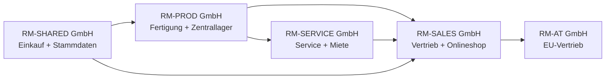
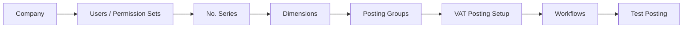
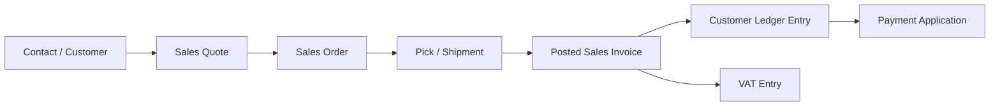
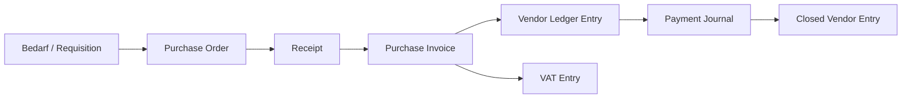
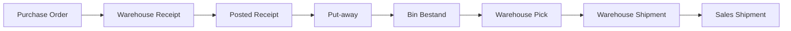
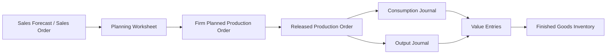
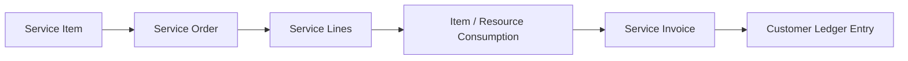
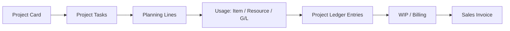
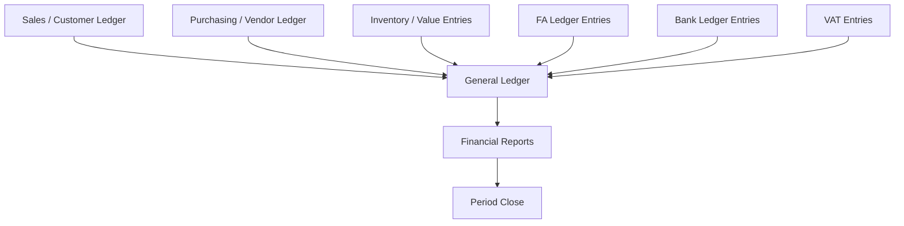
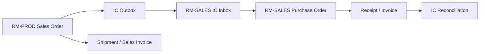

# FiBu-Buch 5: Business Central (BC) – Standardprozesse Deutschland als vollständiges Durchspielbuch

Stand: `28.05.2026`
Hinweis: Dieses Buch ist ein quellenbasiertes Lern-, Schulungs-, Projekt- und Implementierungsbuch für Microsoft Dynamics 365 Business Central im deutschen Unternehmenskontext. Es ersetzt keine individuelle Rechts-, Steuer- oder Implementierungsberatung.

**Verlässlichkeitsstandard und Rechtsstand**
- Rechtsstand und Link-Prüfung der Primärquellen: `28.05.2026`.
- Fachlicher Fokus: Business Central Standard, deutsche Umsatzsteuer (USt), GoBD, E-Rechnung, HGB-nahe Finanzprozesse, Lager, Fertigung, Service, Projekte, Onlineshop, Intercompany und Reporting.
- BC-Funktionsumfang, Seitenbezeichnungen und Lokalisierungen können je Release Wave, Mandant, Lizenz, Sprache, Berechtigung und aktivierter Funktion abweichen.
- Bei Abweichungen zwischen diesem Buch und Normtext oder Microsoft Learn gilt immer die aktuelle Primärquelle.
- Dieses Skript verwendet für Quellenangaben nur Primärquellen: Microsoft Learn, Gesetze im Internet, BMF, BZSt und amtliche EU-Quellen.

## Inhaltsverzeichnis (Kurz)

1. Zielbild: Business Central komplett durchspielen
2. Quellen-, Pflicht- und Best-Practice-Schicht
3. Musterkonzern Rhein-Main Industriegruppe
4. Rollen, Abteilungen und Bedienlogik in BC
5. Trainingsdaten: Stammdaten, Standorte, Artikel, Belege
6. Foundation: Companies, Benutzer, Nummernserien, Dimensionen, Workflows
7. Sales/O2C: Vertrieb, Onlineshop, Dropshipping, Retouren, Vorauszahlungen
8. Purchasing/P2P: Einkauf, Wareneingang, E-Rechnung, Fremdarbeit, Zahlungen
9. Inventory & Warehouse: einfaches Lager, gesteuertes Lager, Bins, Inventur
10. Planning, Assembly & Manufacturing: Planung, Montage, Fertigung, Fremdarbeit
11. Service, Mietmodelle und Finanzierung im Standardgrenzbereich
12. Projects: Projektgeschäft, Ressourcen, WIP, Faktura
13. Finance/R2R: Journale, Debitoren, Kreditoren, Bank, Anlagen, USt, Abschluss
14. Intercompany, Ausland, Foreign Trade und Sonderfälle
15. Reporting, Admin, Job Queue, Change Log, Datenexport
16. Schulungskapitel nach Abteilungen
17. Master-UAT und Abweichungsmatrix
18. Quellenverzeichnis

---

## 1. Zielbild: Business Central komplett durchspielen [Q1][Q2]

Dieses Buch erklärt Business Central nicht als Sammlung einzelner Masken. Es erklärt Business Central als Unternehmenssystem: Mitarbeiter legen Stammdaten an, kaufen ein, lagern ein, fertigen, verkaufen, liefern, fakturieren, kassieren, zahlen, melden Steuern, schließen Perioden und weisen alles prüfbar nach. Nach diesem Buch kannst du einen vollständigen Trainingsmandanten aufbauen und die Standardprozesse Ende-zu-Ende durchspielen.

Ziel:
- Du kannst alle relevanten BC-Standardprozessbereiche fachlich einordnen und anhand eines deutschen Musterkonzerns bedienen. [Q1][Q2]
- Du erkennst, welche Prozesse direkt im Standard abbildbar sind und wo Miet-, Finanzierungs- oder Spezialmodelle Prozessdesign, Extension oder Customizing brauchen. [Q2]
- Du kannst je Abteilung sagen, was der Mitarbeiter in BC macht, welche Seite er öffnet, welche Felder er pflegt und welche Entries entstehen. [Q1]
- Du kannst Schulungen durchführen, weil jedes Prozesskapitel Beispieldaten, Klickpfad, Übung, Lösung und Kontrollfrage enthält.

### 1.1 Was „alle Standardprozesse“ in diesem Buch bedeutet [Q2]

Business Central deckt nach Microsofts offizieller Prozesslandkarte Finance, Sales, Purchasing, Inventory, Warehouse Management, Online Store mit Shopify, Fixed Assets, Planning, Assembly, Manufacturing, Project Management, Service Management, Relationship Management, Human Resources, Reporting, Admin, Workflows und Integrationen ab. Dieses Buch nimmt diese Prozessgruppen als Mindestumfang. [Q1][Q2]

| BC-Prozessbereich | Wird in diesem Buch behandelt als | Trainingsziel |
|---|---|---|
| Finance | Hauptbuch, Nebenbücher, Bank, USt, Anlagen, Abschluss | Buchungsspur und Abschlussfähigkeit verstehen |
| Sales | Angebot, Auftrag, Lieferung, Rechnung, Retoure, Mahnung | O2C mit Abweichungen bedienen |
| Purchasing | Anfrage, Bestellung, Wareneingang, Eingangsrechnung, Rücksendung | P2P und 3-Way-Match erklären |
| Inventory | Artikel, Lagerorte, Varianten, Bewertung, Inventur | Mengen- und Wertfluss abstimmen |
| Warehouse | Put-away, Pick, Bins, gesteuerte Lagerorte | einfache und gesteuerte Lagerlogik unterscheiden |
| Shopify/Online Store | Kunden-, Artikel- und Auftragsfluss aus dem Shop | Onlineshop-Aufträge in BC verarbeiten |
| Planning | Forecast, MPS, MRP, Planungsarbeitsblatt | Bedarf in Beschaffung/Fertigung übersetzen |
| Assembly | Montageauftrag, Assemble-to-Order, Kits | Baugruppen ohne volle Fertigung abbilden |
| Manufacturing | Stückliste, Arbeitsplan, Fertigungsauftrag, Verbrauch, Output | Produktionskosten und Abweichungen verstehen |
| Projects | Projektaufgaben, Ressourcen, Verbrauch, WIP, Faktura | Projektwertschöpfung abrechnen |
| Service | Serviceartikel, Serviceauftrag, Vertrag, Garantie | After-Sales-Prozesse steuern |
| Relationship Management | Kontakte, Verkaufschancen, Segmente | Vorvertrieb und Kundenbeziehung pflegen |
| Human Resources | Mitarbeiter, Abwesenheiten | Basis-HR im BC-Standard zeigen |
| Admin/Reporting | Rollen, Berechtigungen, Change Log, Job Queue, Analyse | Betrieb und Nachweis sichern |

### 1.2 Standard, Pflicht, Best Practice und Projektentscheidung

Dieses Buch trennt vier Ebenen:

| Ebene | Bedeutung | Beispiel |
|---|---|---|
| Standard laut Quelle | Funktion ist in Microsoft Learn beschrieben | `Sales Orders`, `Purchase Orders`, `Production Orders` |
| Deutsche Pflicht/Compliance | Rechtliche oder steuerliche Anforderung | § 147 AO, UStG, GoBD, E-Rechnung |
| BC-Best-Practice | robuste Projektpraxis, nicht automatisch Gesetz | Vier-Augen-Freigabe für USt-Setup |
| Projektentscheidung der Musterfirma | bewusst konstruiertes Trainingsdesign | ein gesteuertes Lager und ein einfaches Lager parallel |

> Merksatz: Best Practice ist keine Rechtsquelle. Sie ist die fachlich begründete Art, den Standard so zu nutzen, dass Prozesse stabil, prüfbar und schulbar werden.

---

## 2. Quellen-, Pflicht- und Best-Practice-Schicht [Q1][Q20][Q21][Q22]

Das Buch ist quellenbasiert. Jede wesentliche BC-Funktion wird auf Microsoft Learn zurückgeführt. Jede deutsche Steuer- oder Nachweisaussage wird auf Gesetz, BMF oder BZSt gestützt. Best Practices werden separat benannt.

### 2.1 Quellenlogik

| Aussageart | Primärquelle | Beispiel |
|---|---|---|
| BC-Standardfunktion | Microsoft Learn | Warehouse, Manufacturing, Service, Projects |
| deutsche USt | UStG, BZSt, BMF | Rechnung, UStVA, ZM, Reverse Charge |
| Aufbewahrung und Datenzugriff | AO, GoBD/BMF | § 147 AO, Z3, Verfahrensdokumentation |
| E-Rechnung | UStG, BMF, Microsoft Learn E-Documents | XML, Validierung, Archivierung |
| EU-Bezug | EUR-Lex, EU-Richtlinien | Mehrwertsteuer-Systemrichtlinie |

### 2.2 Best-Practice-Katalog der Musterfirma

| Best Practice | Zweck | Nicht verwechseln mit |
|---|---|---|
| Change Request für Buchungsgruppen | systematische Falschbuchungen vermeiden | gesetzlicher Einzelpflicht |
| Vier-Augen-Prüfung bei Bankdaten | Betrugsprävention | vollständiger Payment-Approval-Lösung |
| Periodensperre nach Monatsabschluss | Vorperiodenbuchungen verhindern | Jahresabschlussprüfung |
| Evidence Pack je Steuerfall | Tax Review reproduzierbar machen | bloßer Belegablage |
| getrennte Lagerorte je Prozesslogik | Lagerbedienung schulbar halten | zwingender BC-Vorgabe |
| Rollenprofile nach Abteilung | Bedienung vereinfachen | alleiniger Berechtigungskontrolle |
| Testdatenkatalog | Schulungen wiederholbar machen | produktiver Migration |

Prüfungsfalle:
- In Projekten wird „Microsoft kann das“ häufig mit „unser Prozess ist prüfbar eingerichtet“ verwechselt. Die Funktion ist nur der Werkzeugkasten. Die Nachweislogik entsteht durch Setup, Rollen, Kontrolle und Dokumentation.

---

## 3. Musterkonzern Rhein-Main Industriegruppe

Die Musterfirma ist bewusst breit konstruiert. Sie soll Business Central nicht minimal abbilden, sondern als Trainingsuniversum möglichst vollständig auslösen.

### 3.1 Konzernstruktur

| Company in BC | Rolle im Konzern | Hauptprozesse |
|---|---|---|
| `RM-PROD GmbH` | Produktion und Zentrallager | Fertigung, gesteuertes Lager, Einkauf, Intercompany-Verkauf |
| `RM-SALES GmbH` | Vertrieb und Onlineshop | B2B, B2C, Shopify, Dropshipping, Debitoren |
| `RM-SERVICE GmbH` | Wartung, Miete, Finanzierungsvorbereitung | Service, Mietfälle, Projekte, Anlagen-/Serviceartikel |
| `RM-SHARED GmbH` | Shared Services | Einkauf, Stammdaten, Zahlungsverkehr, Reporting |
| `RM-AT GmbH` | EU-Auslandsgesellschaft | Intercompany, EU-USt, Intrastat-nahe Fälle |

### 3.2 Standorte und Lagerlogik

| Lagerort | Company | Lagerart | BC-Logik | Trainingszweck |
|---|---|---|---|---|
| `FRA-ZL` | RM-PROD | Zentrallager | gesteuerte Einlagerung/Kommissionierung mit Bins | Warehouse Receipt, Put-away, Pick, Shipment |
| `MZ-EINFACH` | RM-SALES | Außenlager | einfache Lagerbuchung ohne gesteuerte Einlagerung | einfacher Wareneingang und Verkauf |
| `HH-FUL` | RM-SALES | Onlineshop-Fulfillment | Pick/Shipment vereinfacht | Shop-Auftrag bis Versand |
| `VAN-01` | RM-SERVICE | Servicefahrzeug | Lagerort für Techniker | Ersatzteilverbrauch im Service |
| `PROJ-BER` | RM-SERVICE | Projektlager | Projektbezogenes Lager | Projektmaterial und Baustelle |
| `DROP` | RM-SALES | Dropshipping | kein eigener Bestand | Direktlieferung Lieferant an Kunde |

### 3.3 Geschäftsmodelle

| Modell | Use Case | BC-Schwerpunkt | Standardgrenze |
|---|---|---|---|
| Eigenfertigung | Standardmaschine `RM-M100` | Manufacturing | vollständig im Standard demonstrierbar |
| Variantenfertigung | Sondermaschine `RM-X500` | BOM/Routing/Projekt/Fertigung | Variantenlogik braucht klare Stammdaten |
| Handelsware | Ersatzteil `SP-PUMP-01` | O2C/P2P/Inventory | Standard |
| Onlineshop | Webshop-Verkauf Ersatzteile | Shopify Connector / Sales Orders | abhängig von Connector-Setup |
| Service | Wartung beim Kunden | Service Management | Standard |
| Miete | Mietmaschine 12 Monate | Service/Projects/Deferrals/Fixed Assets | Standard nur mit Prozessdesign |
| Finanzierung | Kunde finanziert Maschine über Bank | Sales/Receivables/Deferrals | komplexe Finanzierungslogik nicht vollständig Standard |
| Intercompany | PROD verkauft an SALES | Intercompany | Standard mit IC-Setup |
| Dropshipping | Lieferant liefert direkt an Kunden | Sales + Purchase Link | Standard |

---

## 4. Rollen, Abteilungen und Bedienlogik in BC

Ein vollständiges Schulungsbuch muss zeigen, wie Mitarbeiter arbeiten. Deshalb beschreibt jedes Prozesskapitel fachliche Aufgabe, Role Center, Tell-Me-Suche, Seiten, Felder und Folgebelege.

### 4.1 Rollenmatrix

| Rolle | Abteilung | Typische BC-Seiten | Was macht der Mitarbeiter? |
|---|---|---|---|
| Verkäuferin | Vertrieb | `Sales Quotes`, `Sales Orders`, `Customers`, `Contacts` | Angebot erstellen, Auftrag erfassen, Verfügbarkeit prüfen, Rechnung auslösen |
| E-Commerce-Sachbearbeiter | Onlineshop | `Shopify Shops`, `Sales Orders`, `Items`, `Customers` | Shop-Aufträge synchronisieren, Fehler klären, Versand anstoßen |
| Einkäufer | Einkauf | `Vendors`, `Purchase Orders`, `Purchase Invoices` | Bestellung auslösen, Preise prüfen, Wareneingang/Rechnung abstimmen |
| Lagerist einfaches Lager | Lager MZ | `Item Journals`, `Sales Shipments`, `Purchase Receipts` | Ware annehmen, Bestand prüfen, Lieferung buchen |
| Lagerist gesteuertes Lager | FRA-ZL | `Warehouse Receipts`, `Put-aways`, `Picks`, `Warehouse Shipments` | Einlagern, kommissionieren, versenden |
| Produktionsplanerin | Fertigung | `Planning Worksheet`, `Production Orders`, `BOMs`, `Routings` | Bedarf planen, Fertigungsaufträge erstellen, Termine prüfen |
| Meister | Fertigung | `Released Production Orders`, `Consumption Journal`, `Output Journal` | Verbrauch und Output melden, Ausschuss dokumentieren |
| Servicetechniker | Service | `Service Orders`, `Service Items`, `Item Journals` | Serviceauftrag bearbeiten, Ersatzteile verbrauchen, Zeiten erfassen |
| Projektleiter | Projekte | `Projects`, `Project Tasks`, `Project Journals` | Budget, Verbrauch, Fortschritt und Faktura steuern |
| Debitorenbuchhalterin | Finance | `Customer Ledger Entries`, `Payment Reconciliation Journal`, `Reminders` | Zahlung ausgleichen, mahnen, offene Posten prüfen |
| Kreditorenbuchhalter | Finance | `Vendor Ledger Entries`, `Payment Journals`, `Purchase Invoices` | Eingangsrechnungen prüfen, Zahlungen vorbereiten |
| Anlagenbuchhalterin | Finance | `Fixed Assets`, `FA Journals`, `Calculate Depreciation` | Zugänge, AfA und Abgänge buchen |
| Controller | Controlling | `Analysis Views`, `Financial Reports`, `Dimensions` | Auswertungen und Abweichungen analysieren |
| BC-Admin | IT/Finance Operations | `Users`, `Permission Sets`, `Change Log Setup`, `Job Queue Entries` | Rollen, Automatisierung und Audit Trail verwalten |

### 4.2 Bedienmuster

1. **Role Center prüfen:** Der Mitarbeiter startet im passenden Arbeitsbereich.
2. **Tell Me nutzen:** Er sucht stabile Seitenbegriffe, nicht lange Menüpfade.
3. **Belegkopf prüfen:** Kunde/Lieferant, Datum, Standort, Währung, Dimension, USt-Gruppe.
4. **Zeilen pflegen:** Artikel, Ressource, Sachkonto, Menge, Preis, Lagerort, Projekt.
5. **Vorschau/Prüfung:** Posting Preview, Verfügbarkeit, Freigabe, Pflichtfelder.
6. **Buchen:** Post/Release/Register.
7. **Nachweis prüfen:** Entries, Belegkette, Attachments, Reports.

Praxisregel:
- Schulungen beginnen mit Rollen und Aufgaben, nicht mit Menüs. Ein Einkäufer muss wissen, warum er eine Bestellung auslöst; die Seite ist erst der zweite Schritt.

---

## 5. Trainingsdaten: Stammdaten, Standorte, Artikel, Belege

Dieses Kapitel liefert Beispieldaten, damit Schulungen aufeinander aufbauen. Die Daten sind bewusst vereinfacht, aber realitätsnah.

### 5.1 Dimensionen

| Dimension | Werte | Zweck |
|---|---|---|
| `COMPANY-GROUP` | PROD, SALES, SERVICE, SHARED, AT | Konzerninterne Auswertung |
| `DEPARTMENT` | SALES, PURCH, WHSE, PROD, SERV, FIN, ADMIN | Rollen- und Kostenstellenlogik |
| `CHANNEL` | B2B, SHOP, IC, SERVICE, PROJECT | Vertriebskanal |
| `PRODUCTLINE` | MACHINE, SPARE, RENTAL, SERVICE | Produktlinie |
| `LOCATION-GROUP` | DIRECTED, SIMPLE, VAN, PROJECT, DROP | Lagerlogik |

### 5.2 Debitoren

| Nr. | Name | Land | Typ | USt-Logik | Trainingsfall |
|---|---|---|---|---|---|
| `D10000` | Müller Maschinenbau GmbH | DE | B2B | Inland 19 % | Standardverkauf Maschine |
| `D11000` | Handwerk24 Onlinekunde | DE | B2C | Inland 19 % | Onlineshop-Ersatzteil |
| `D20000` | Alpha Machines SAS | FR | EU-B2B | innergemeinschaftlich | EU-Lieferung |
| `D30000` | SwissTech AG | CH | Drittland | Export | Ausfuhrlieferung |
| `D90000` | RM-SALES GmbH IC | DE | Intercompany | Inland/IC | IC-Verkauf PROD an SALES |

### 5.3 Kreditoren

| Nr. | Name | Land | Typ | Trainingsfall |
|---|---|---|---|---|
| `K10000` | Stahlwerk Ruhr GmbH | DE | Material | Rohmaterial Einkauf |
| `K11000` | Elektro Parts GmbH | DE | Komponenten | Elektronik Einkauf |
| `K20000` | Dropship Europe BV | NL | Dropshipping | Direktlieferung |
| `K30000` | Zollspedition Nord GmbH | DE | Spedition/Zoll | Import/EUSt |
| `K40000` | Lohnfertiger Süd GmbH | DE | Fremdarbeit | Subcontracting |

### 5.4 Artikel, Ressourcen und Anlagen

| Nr. | Beschreibung | Typ | Lager/Prozess | Standardkosten/Preis |
|---|---|---|---|---:|
| `RM-M100` | Standardmaschine M100 | Fertigerzeugnis | Fertigung/Verkauf | 42.000 / 68.000 |
| `RM-X500` | Sondermaschine X500 | Projekt/Fertigung | Projekt + Fertigung | 90.000 / 145.000 |
| `SP-PUMP-01` | Ersatzteil Pumpe | Lagerartikel | Einkauf/Shop/Service | 180 / 320 |
| `SP-SENSOR-02` | Sensor Set | Lagerartikel mit Seriennr. | Shop/Service | 75 / 149 |
| `RAW-STEEL` | Stahlträger | Rohmaterial | Fertigung | 2.500 / - |
| `COMP-CTRL` | Steuerungseinheit | Komponente | Fertigung | 3.200 / - |
| `KIT-MAINT` | Wartungskit | Montageartikel | Assembly/Service | 240 / 450 |
| `RES-TECH` | Servicetechniker Stunde | Ressource | Service/Projekt | 65 / 115 |
| `FA-CNC-01` | CNC-Anlage | Anlage | Anlagenbuchhaltung | 250.000 |

### 5.5 Beispielbelege

| Fall | Beleg | Daten | Erwarteter Prozess |
|---|---|---|---|
| S-001 | Sales Order `SO-1001` | D10000 kauft `RM-M100`, 1 Stück | Fertigung → Lieferung → Rechnung |
| S-002 | Shop Order `WEB-24001` | D11000 kauft `SP-PUMP-01`, 2 Stück | Shopify → Fulfillment → Zahlung |
| S-003 | Drop Shipment `SO-1003` | D10000 kauft Handelsware von K20000 | Verkaufsauftrag ↔ Einkaufsbestellung |
| P-001 | Purchase Order `PO-2001` | RAW-STEEL 10 Stück | Wareneingang gesteuertes Lager |
| M-001 | Production Order `PROD-3001` | `RM-M100`, 3 Stück | Verbrauch + Output |
| SV-001 | Service Order `SERV-4001` | Wartung D10000 | Techniker + Ersatzteil |
| J-001 | Project `PROJ-5001` | Installation Sondermaschine | Ressourcen + Material + Faktura |
| F-001 | FA Journal `FA-6001` | CNC-Zugang | Anlage aktivieren + AfA |

---

## 6. Foundation: Companies, Benutzer, Nummernserien, Dimensionen, Workflows [Q3][Q4][Q5][Q6]

Foundation-Prozesse tragen alle Fachprozesse. Fehler in Nummernserien, Dimensionen, Buchungsgruppen oder Berechtigungen wirken wie ein Multiplikator.

### 6.1 Quelle und Zweck

Standard laut Quelle:
- Business Central unterstützt mehrere Companies, Benutzer, Berechtigungen, Workflows, Job Queues, Change Log und Einrichtung für Geschäftsprozesse. [Q3][Q4][Q5][Q6]

Deutsche Pflicht/Compliance:
- Für steuerrelevante Systeme sind Nachvollziehbarkeit, Vollständigkeit, Richtigkeit, Unveränderbarkeit und Datenzugriff im GoBD-Kontext relevant. [Q21][Q22]

BC-Best-Practice:
- Setup-Änderungen an Posting Groups, VAT Posting Setup, Nummernserien und Dimensionen laufen über Change Request, Testnachweis und Freigabe.

### 6.2 Mitarbeiterbedienung

| Rolle | Aufgabe | Tell Me / Seite | Was wird getan? |
|---|---|---|---|
| BC-Admin | Company anlegen | `Companies` | Trainingscompanies erstellen |
| Finance-Leitung | Buchungsperioden steuern | `General Ledger Setup`, `Accounting Periods` | Buchungsfenster festlegen |
| Stammdaten-Team | Dimensionen pflegen | `Dimensions`, `Dimension Values` | Pflichtdimensionen anlegen |
| Admin | Change Log aktivieren | `Change Log Setup` | kritische Tabellen überwachen |
| Prozessowner | Workflow prüfen | `Workflows`, `Approval User Setup` | Freigaben für Einkauf/Verkauf definieren |

### 6.3 E2E-Setupfluss

### 6.4 UAT-Schulung Foundation

Aufgabe:
1. Lege Dimension `CHANNEL` mit Werten `B2B`, `SHOP`, `IC`, `SERVICE`, `PROJECT` an.
2. Setze `CHANNEL` als Pflichtdimension für Debitor `D10000`.
3. Buche eine Verkaufsrechnung ohne `CHANNEL`.
4. Korrigiere den Fehler und buche erneut.

Erwartete Lösung:
- Die Buchung ohne Pflichtdimension wird verhindert oder als Fehler markiert.
- Die korrigierte Buchung erzeugt `G/L Entries` mit Dimension `CHANNEL = B2B`.

Kontrollfrage:
- Warum ist eine Pflichtdimension eher ein Prozesskontrollinstrument als eine reine Reporting-Einstellung?

---

## 7. Sales/O2C: Vertrieb, Onlineshop, Dropshipping, Retouren, Vorauszahlungen [Q7][Q8][Q9][Q10]

O2C beginnt beim Kontakt oder Angebot und endet erst, wenn Lieferung, Rechnung, Forderung, Zahlung, USt und Nachweis geschlossen sind.

### 7.1 Standard laut Quelle

Business Central unterstützt Verkaufsangebote, Verkaufsaufträge, Lieferungen, Rechnungen, Retouren, Gutschriften und Dropshipping. Der Shopify-Bereich synchronisiert Onlineshop-Daten je Einrichtung mit Business Central. [Q7][Q8][Q9][Q10]

### 7.2 Mitarbeiterrollen

| Rolle | Bedienhandlung | Seite | Ergebnis |
|---|---|---|---|
| Verkäuferin | Angebot für `RM-M100` erstellen | `Sales Quotes` | Angebot mit Preis und Liefertermin |
| Vertriebsinnendienst | Angebot in Auftrag umwandeln | `Sales Orders` | `SO-1001` |
| Lagerist | Lieferung kommissionieren | `Warehouse Picks` oder `Sales Orders` | gebuchte Lieferung |
| Debitorenbuchhalterin | Rechnung und Zahlung prüfen | `Customer Ledger Entries` | offener oder geschlossener Posten |
| E-Commerce-Sachbearbeiter | Shop-Auftrag prüfen | `Shopify Orders` / `Sales Orders` | Webauftrag in BC |

### 7.3 Standardpfad B2B-Verkauf

### 7.4 Beispieldaten und Buchung

Fall `S-001`: Debitor `D10000` kauft `RM-M100`, 1 Stück, netto `68.000 EUR`, USt `12.920 EUR`.

| Buchung | Soll | Haben |
|---|---:|---:|
| Forderungen D10000 | 80.920 | |
| Umsatzerlöse Maschinen | | 68.000 |
| Umsatzsteuer 19 % | | 12.920 |

Mitarbeiterbedienung:
1. Verkäuferin: Tell Me → `Sales Quotes` → New → `Sell-to Customer No. = D10000`.
2. Zeile: `Type = Item`, `No. = RM-M100`, `Quantity = 1`, `Location Code = FRA-ZL`.
3. Aktion: `Make Order`.
4. Lagerist: Tell Me → `Warehouse Picks` → Pick erstellen und registrieren.
5. Vertrieb: `Post` → Ship and Invoice, wenn Lieferung abgeschlossen ist.
6. Buchhaltung: Tell Me → `Customer Ledger Entries` → Posten D10000 prüfen.

### 7.5 Abweichungen und Sonderfälle

| Use Case | BC-Mechanik | Mitarbeiter | Risiko | Evidence Pack |
|---|---|---|---|---|
| Teillieferung | `Qty. to Ship` | Lager/Vertrieb | Rechnung über falsche Menge | Shipment ↔ Invoice |
| Retoure | `Sales Return Order` | Vertrieb/Lager | USt-Korrektur fehlt | Bezug zur Ursprungsrechnung |
| Gutschrift | `Sales Credit Memo` | Debitorenbuchhaltung | falsches Erlöskonto | Credit Memo + VAT Entry |
| Vorauszahlung | `Prepayment Invoice` | Vertrieb/Finance | falsche Steuerperiode | Prepayment VAT |
| Dropshipping | Sales Order ↔ Purchase Order | Vertrieb/Einkauf | Liefernachweis fehlt | Lieferantenbeleg + Kundenrechnung |
| Shopify | Shop Order → Sales Order | E-Commerce | falsche Kundenzuordnung | Shop-ID + BC-Beleg |
| EU-B2B | VAT Bus. Posting Group EU | Vertrieb/Finance | USt-IdNr. fehlt | USt-IdNr., ZM |
| Drittland | Export-VAT-Clause | Vertrieb/Finance | Ausfuhrnachweis fehlt | Exportnachweis |

BC-Best-Practice:
- Verkäufer dürfen Preise und Rabatte erfassen, aber nicht USt-Buchungsgruppen ändern.
- Onlineshop-Aufträge laufen durch eine tägliche Fehlerliste: unbekannte Artikel, fehlende Kunden, Zahlungsabweichungen.

Schulungsübung:
- Erstelle `SO-1003` als Dropshipment für Debitor `D10000` und Kreditor `K20000`. Verknüpfe Verkaufs- und Einkaufsbeleg. Prüfe, warum kein eigener Lagerbestand entsteht.

---

## 8. Purchasing/P2P: Einkauf, Wareneingang, E-Rechnung, Fremdarbeit, Zahlungen [Q11][Q12][Q13]

P2P beginnt beim Bedarf und endet mit abgestimmter Verbindlichkeit, Zahlung und Vorsteuer. Der Einkauf erzeugt nicht nur Belege, sondern steuert Preis-, Mengen-, Liefer- und Betrugsrisiken.

### 8.1 Mitarbeiterrollen

| Rolle | Bedienhandlung | Seite | Ergebnis |
|---|---|---|---|
| Einkäufer | Bestellung aus Planungsbedarf erstellen | `Purchase Orders` | `PO-2001` |
| Lagerist | Wareneingang buchen | `Warehouse Receipts` oder `Purchase Orders` | Bestand steigt |
| Kreditorenbuchhalter | Eingangsrechnung prüfen | `Purchase Invoices` / `Incoming Documents` | Verbindlichkeit |
| Finance-Leitung | Zahlung freigeben | `Payment Journals` | Zahlungsvorschlag |

### 8.2 Prozessfluss

### 8.3 Beispieldaten und Buchung

Fall `P-001`: Einkauf `RAW-STEEL`, 10 Stück à `2.500 EUR`, netto `25.000 EUR`, Vorsteuer `4.750 EUR`.

| Buchung | Soll | Haben |
|---|---:|---:|
| Vorräte Rohmaterial | 25.000 | |
| Vorsteuer 19 % | 4.750 | |
| Verbindlichkeiten K10000 | | 29.750 |

Bedienung:
1. Einkäufer: Tell Me → `Purchase Orders` → New → `Buy-from Vendor No. = K10000`.
2. Zeile: `Type = Item`, `No. = RAW-STEEL`, `Quantity = 10`, `Location Code = FRA-ZL`.
3. Lagerist: gesteuertes Lager → `Warehouse Receipt` erstellen und buchen.
4. Kreditorenbuchhalter: Eingangsrechnung mit Bestellung abgleichen.
5. Finance: Zahlungsvorschlag erstellen und ausführen.

### 8.4 Abweichungen

| Use Case | BC-Mechanik | Kontrolle |
|---|---|---|
| Teil-Wareneingang | mehrere Receipts | `Qty. Received` vs. `Qty. Invoiced` |
| Preisabweichung | Rechnungspreis abweichend | Freigabe vor Buchung |
| Rücksendung | `Purchase Return Order` | Bezug zur Ursprungslieferung |
| E-Rechnung | E-Documents / Incoming Documents | XML und Validierung |
| Fremdarbeit | Subcontracting / Purchase Service | Fertigungsauftragbezug |
| Lieferantenbank geändert | Vendor Bank Account | Vier-Augen-Prüfung |

BC-Best-Practice:
- Externe Belegnummer ist Pflicht.
- Bankdatenänderungen werden nicht im Zahlungslauf geändert, sondern vorher freigegeben.
- Mengen- und Preisabweichungen erhalten eigene Freigaberegeln.

Schulungsübung:
- Buche eine Bestellung mit Teil-Wareneingang 6/10 Stück. Buche anschließend eine Rechnung über 10 Stück und erkläre den Fehler.

---

## 9. Inventory & Warehouse: einfaches Lager, gesteuertes Lager, Bins, Inventur [Q14][Q15]

Lager in Business Central ist nicht einheitlich. Die Mustergruppe nutzt bewusst zwei Extreme: ein einfaches Lager und ein gesteuertes Zentrallager.

### 9.1 Lagerlogik im Vergleich

| Merkmal | Einfaches Lager `MZ-EINFACH` | Gesteuertes Lager `FRA-ZL` |
|---|---|---|
| Wareneingang | direkt aus Bestellung | Warehouse Receipt + Put-away |
| Versand | direkt aus Verkaufsauftrag | Warehouse Shipment + Pick |
| Bins | optional/vereinfacht | verbindlich |
| Mitarbeiter | Sachbearbeiter/Lagerist | Lagerrolle mit Aufgabenliste |
| Schulungsziel | schneller Standardpfad | vollständige Warehouse-Steuerung |

### 9.2 Prozessfluss gesteuertes Lager

### 9.3 Mitarbeiterbedienung

| Rolle | Seite | Tätigkeit |
|---|---|---|
| Lagerist Wareneingang | `Warehouse Receipts` | Lieferung erfassen, Menge prüfen |
| Einlagerer | `Warehouse Put-aways` | Bin vorschlagen, Ware einlagern |
| Kommissionierer | `Warehouse Picks` | Pickliste abarbeiten |
| Lagerleitung | `Items by Location`, `Inventory Valuation` | Bestände und Werte prüfen |

### 9.4 Abweichungen

| Use Case | BC-Reaktion | Risiko |
|---|---|---|
| falscher Bin | Korrektur über Warehouse Journal | Bestand physisch falsch |
| Seriennummer fehlt | Buchung blockiert oder Tracking-Fehler | Rückverfolgbarkeit fehlt |
| Inventurdifferenz | Physical Inventory Journal | Ergebniswirkung |
| Umlagerung | Transfer Order | Bestand im Transit |
| negativer Bestand | je Setup möglich/verhindert | COGS unsicher |

Schulungsübung einfaches Lager:
- Buche Einkauf `SP-PUMP-01` nach `MZ-EINFACH`, verkaufe 2 Stück und prüfe Item Ledger Entries.

Schulungsübung gesteuertes Lager:
- Buche `RAW-STEEL` nach `FRA-ZL`, erstelle Put-away, danach Pick für Fertigung oder Verkauf.

---

## 10. Planning, Assembly & Manufacturing: Planung, Montage, Fertigung, Fremdarbeit [Q16][Q17][Q18]

Die Mustergruppe produziert mehrere Produkte. Damit lassen sich Planung, Montage und Fertigung sauber unterscheiden.

### 10.1 Produktstruktur

| Produkt | Prozess | Bestandteile |
|---|---|---|
| `KIT-MAINT` | Assembly | Pumpe + Sensor + Dichtung |
| `RM-M100` | Manufacturing Standard | Stahl, Steuerung, Montagezeit |
| `RM-X500` | Project + Manufacturing | kundenspezifische BOM, Projektressourcen |
| `SP-SENSOR-02` | Handels-/Serienartikel | Einkauf, Seriennummer |

### 10.2 Fertigungsfluss

### 10.3 Mitarbeiterbedienung

| Rolle | Seite | Tätigkeit |
|---|---|---|
| Produktionsplanerin | `Planning Worksheet` | Bedarf berechnen, Vorschläge prüfen |
| Arbeitsvorbereitung | `Production BOMs`, `Routings` | Struktur und Arbeitsgänge pflegen |
| Meister | `Released Production Orders` | Auftrag starten, Material prüfen |
| Werker/Meister | `Consumption Journal`, `Output Journal` | Verbrauch und Output melden |
| Controller | `Production Order Statistics` | Abweichungen analysieren |

### 10.4 Abweichungen

| Use Case | BC-Mechanik | Best Practice |
|---|---|---|
| Ausschuss | Mehrverbrauch oder Output-Differenz | Ausschussgrund dokumentieren |
| Ersatzkomponente | Komponentenänderung im Auftrag | Freigabe durch Arbeitsvorbereitung |
| Fremdarbeit | Subcontracting/Purchase | Bestellung mit Fertigungsbezug |
| Nacharbeit | zusätzlicher Arbeitsgang | Kosten separat auswerten |
| Eilauftrag | manuelle Produktionsorder | Planungsabweichung markieren |
| Teilfertigmeldung | Output kleiner Planmenge | Rest-WIP prüfen |

Schulungsübung:
- Erstelle Fertigungsauftrag `PROD-3001` für 3 Stück `RM-M100`. Melde 5 % Mehrverbrauch `RAW-STEEL` und erkläre die Abweichung in Value Entries.

---

## 11. Service, Mietmodelle und Finanzierung im Standardgrenzbereich [Q19][Q25][Q26]

Service Management ist Standard. Miet- und Finanzierungsmodelle sind je Ausprägung Standard, Prozessdesign oder Erweiterung. Dieses Buch zeigt zuerst den Standard und markiert danach Grenzen.

### 11.1 Service-Standard

Mitarbeiterbedienung:
1. Servicedisponent: Tell Me → `Service Orders` → neuen Auftrag für D10000 anlegen.
2. Techniker: Serviceartikel auswählen, Fehlerbeschreibung erfassen.
3. Techniker: Ersatzteil `SP-PUMP-01` und Ressource `RES-TECH` erfassen.
4. Serviceabrechnung: Auftrag fakturieren oder als Garantie/Kulanz markieren.

### 11.2 Mietmodell im BC-Standardgrenzbereich

| Modell | Standardabbildung | Grenze |
|---|---|---|
| Kurzzeitmiete mit Rechnung | Sales Invoice / Project / Service | Verfügbarkeitskalender nicht vollwertig |
| Wartungspauschale | Service Contract | Vertragslogik standardnah |
| Mietmaschine als Anlage | Fixed Asset + Service Item | komplexe Mietabrechnung braucht Design |
| monatliche Abgrenzung | Deferrals | Vertragsänderungen separat steuern |

BC-Best-Practice:
- Mietfälle erhalten eigene Produktlinie `RENTAL`, eigene Dimension und eigenes Evidence Pack.
- Wenn Verfügbarkeitskalender, automatische Verlängerung, variable Nutzung oder komplexe Indexierung nötig sind, wird Extension/Customizing geprüft.

### 11.3 Finanzierung im Standardgrenzbereich

| Use Case | Standardabbildung | Hinweis |
|---|---|---|
| Kunde zahlt in Raten | Zahlungsbedingungen / Teilzahlungen | einfache Raten möglich |
| externe Bank finanziert | Verkauf an Kunden, Zahlung durch Bank | Abtretung/Vertrag separat dokumentieren |
| Leasingähnlicher Verkauf | Vertragliche Prüfung erforderlich | nicht als bloßer Verkaufsauftrag behandeln |

Schulungsübung:
- Lege einen Mietfall für `RM-M100` über 12 Monate an. Nutze Dimension `PRODUCTLINE = RENTAL`, erstelle Monatsrechnung und erkläre, warum dies keine vollständige Mietverwaltungssoftware ersetzt.

---

## 12. Projects: Projektgeschäft, Ressourcen, WIP, Faktura [Q27]

Projects bilden mehrperiodige Leistungserbringung ab. Die Mustergruppe nutzt Projekte für Installation, Sondermaschinen und Kundenschulungen.

### 12.1 Prozessfluss

### 12.2 Mitarbeiterbedienung

| Rolle | Seite | Tätigkeit |
|---|---|---|
| Projektleiter | `Projects` | Projekt und Aufgaben anlegen |
| Einkauf | `Purchase Orders` | Projektbezogene Fremdleistung bestellen |
| Lager | `Item Journals` / Projektverbrauch | Material auf Projekt buchen |
| Consultant/Techniker | `Project Journals` | Zeit erfassen |
| Finance | `Create Project Sales Invoice` | Faktura erstellen |

### 12.3 Abweichungen

| Use Case | Risiko | Kontrolle |
|---|---|---|
| Festpreis | Istkosten überschreiten Erlös | Budget/Ist-Bericht |
| Time & Material | Zeiten nicht fakturiert | Unbilled-Auswertung |
| Meilenstein | Erlös vor Leistung | Abgrenzung |
| Fremdleistung | Kosten ohne Projektbezug | Bestellzeile mit Projekt |
| Projektlager | Material bleibt im falschen Lager | Location `PROJ-BER` |

Schulungsübung:
- Projekt `PROJ-5001`: Installiere `RM-X500`, buche 20 Technikerstunden, Material `SP-SENSOR-02`, Fremdleistung und eine Meilensteinrechnung.

---

## 13. Finance/R2R: Journale, Debitoren, Kreditoren, Bank, Anlagen, USt, Abschluss [Q20][Q21][Q22][Q23][Q24][Q28]

Finance ist die Klammer aller Prozesse. Jeder operative Vorgang muss sich in Hauptbuch, Nebenbuch, Steuer, Bank und Abschluss wiederfinden.

### 13.1 Finance-Prozesslandkarte

### 13.2 Mitarbeiterbedienung

| Rolle | Seite | Tätigkeit |
|---|---|---|
| Debitorenbuchhalterin | `Customer Ledger Entries`, `Reminders` | OP prüfen, Zahlungen ausgleichen, mahnen |
| Kreditorenbuchhalter | `Vendor Ledger Entries`, `Payment Journals` | Rechnungen prüfen, Zahlungslauf |
| Anlagenbuchhalterin | `Fixed Assets`, `FA Journals` | Zugang, AfA, Abgang |
| Buchhalter | `General Journals` | Abgrenzungen, Umbuchungen, Rückstellungen |
| Steuerverantwortliche | `VAT Entries`, `VAT Statements`, VAT Reports | USt-Abstimmung |
| Finance-Leitung | `Financial Reports`, `Accounting Periods` | Abschluss und Periodensperre |

### 13.3 Abweichungen

| Use Case | BC-Mechanik | Evidence |
|---|---|---|
| Teilzahlung | Apply Entries teilweise | Restposten |
| Skonto | Payment Discount | Steuerkorrektur prüfen |
| Bankdifferenz | Payment Reconciliation Journal | Klärposten |
| Anlagenabgang | FA Disposal | Buchwert/Erlös |
| Abgrenzung | Deferrals / General Journal | Abgrenzungsplan |
| USt-Korrektur | Credit Memo / VAT Entry | Bezug zur Rechnung |

Deutsche Pflicht/Compliance:
- Steuerlich relevante Unterlagen müssen nach § 147 AO aufbewahrt werden. [Q21]
- GoBD konkretisiert Anforderungen an Nachvollziehbarkeit, Unveränderbarkeit und Datenzugriff. [Q22]
- USt-relevante Prozesse müssen mit UStG und Meldelogik abgestimmt sein. [Q20][Q24]

Schulungsübung:
- Importiere einen Bankauszug mit drei Zeilen: Vollzahlung, Teilzahlung, unbekannte Zahlung. Gleiche zwei Posten aus und buche den dritten auf Klärung.

---

## 14. Intercompany, Ausland, Foreign Trade und Sonderfälle [Q29][Q30][Q31]

Intercompany und Ausland verbinden mehrere Prozesswelten. Ein Intercompany-Verkauf erzeugt bei einer Company O2C und bei der anderen P2P.

### 14.1 Intercompany-Fluss

### 14.2 Sonderfallmatrix

| Use Case | Prozessbereiche | Mitarbeiter | Hauptrisiko |
|---|---|---|---|
| IC-Verkauf PROD an SALES | O2C + P2P | Vertrieb/Einkauf/Finance | Gegenbeleg fehlt |
| EU-Lieferung nach FR | Sales + VAT | Vertrieb/Steuer | USt-IdNr./ZM |
| Drittland Export CH | Sales + Zoll + VAT | Vertrieb/Finance | Ausfuhrnachweis |
| Import aus CH | Purchase + Zoll + VAT | Einkauf/Finance | EUSt falsch |
| Reihengeschäft | Sales/Purchase/VAT | Tax/Finance | bewegte Lieferung |
| Fremdwährung USD | Sales/Purchase/R2R | Finance | Kursbewertung |
| Konsignationsnähe | Inventory/VAT | Logistik/Tax | Eigentumsübergang |

BC-Best-Practice:
- Jeder Sonderfall bekommt ein `TaxScenario` oder ein gleichwertiges Klassifikationsfeld in der Prozessdokumentation.
- Kein 0 %-Fall ohne Evidence Pack.

Schulungsübung:
- RM-PROD verkauft `RM-M100` an RM-SALES. Erzeuge IC-Belegkette und stimme Forderung/Verbindlichkeit ab.

---

## 15. Reporting, Admin, Job Queue, Change Log, Datenexport [Q5][Q6][Q32][Q33][Q34]

Reporting und Admin sind keine Nebenthemen. Sie entscheiden, ob die Organisation Business Central stabil betreiben und prüfen kann.

### 15.1 Standardbereiche

| Bereich | BC-Seiten | Schulungsziel |
|---|---|---|
| Financial Reports | `Financial Reports`, `Account Schedules` | GuV/Bilanznahe Auswertung |
| Analysis Views | `Analysis Views` | Dimensionale Analyse |
| Power BI-nahe Auswertung | Power BI Integration | Management Reporting |
| Change Log | `Change Log Setup`, `Change Log Entries` | Stammdatenänderungen nachweisen |
| Job Queue | `Job Queue Entries` | Automatisierung überwachen |
| Berechtigungen | `Users`, `Permission Sets` | Rollen und SoD abbilden |
| Datenexport | Datenzugriff/Reports/API | Betriebsprüfung und Migration |

Mitarbeiterbedienung:
- Controller erstellt Auswertung nach `DEPARTMENT` und `PRODUCTLINE`.
- Admin prüft fehlgeschlagene Job Queue Entries.
- Finance Operations exportiert Prüfungsdaten und dokumentiert Zeitraum, Filter und Verantwortlichen.

Schulungsübung:
- Aktiviere Change Log für Vendor Bank Accounts, ändere IBAN bei `K10000`, prüfe Change Log Entry und erkläre den Nachweiswert.

---

## 16. Schulungskapitel nach Abteilungen

Dieses Kapitel bündelt die Trainingspfade. Jede Schulung nutzt dieselbe Datenwelt.

### 16.1 Einkaufsschulung

Ziel:
- Einkäufer kann Lieferanten, Bestellung, Wareneingang, Eingangsrechnung und Abweichung verstehen.

Übung:
1. Bestellung `PO-2001` für `RAW-STEEL` anlegen.
2. Wareneingang im gesteuerten Lager buchen.
3. Rechnung mit Preisabweichung erfassen.
4. Abweichung freigeben und buchen.

Kontrollfrage:
- Warum ist der Wareneingang fachlich nicht dasselbe wie die Eingangsrechnung?

### 16.2 Verkaufsschulung

Übung:
1. Angebot an D10000 erstellen.
2. Auftrag erzeugen.
3. Lieferung aus gesteuertem Lager anstoßen.
4. Rechnung buchen.
5. Zahlung ausgleichen.

Kontrollfrage:
- Welche Entries beweisen, dass Umsatz, Forderung und Steuer entstanden sind?

### 16.3 Lagerschulung einfaches Lager

Übung:
- Kaufe `SP-PUMP-01` nach `MZ-EINFACH`, verkaufe 2 Stück, buche Inventurdifferenz 1 Stück.

Kontrollfrage:
- Warum ist das einfache Lager schneller, aber weniger prozessgeführt?

### 16.4 Lagerschulung gesteuertes Lager

Übung:
- Warehouse Receipt, Put-away, Pick und Shipment für `FRA-ZL` durchspielen.

Kontrollfrage:
- Welche Dokumente entstehen zusätzlich gegenüber einfachem Lager?

### 16.5 Fertigungsschulung

Übung:
- Fertigungsauftrag `PROD-3001` erstellen, Verbrauch buchen, Output melden, Abweichung analysieren.

Kontrollfrage:
- Warum braucht Fertigung sowohl Mengen- als auch Wertposten?

### 16.6 Serviceschulung

Übung:
- Serviceauftrag `SERV-4001` mit Garantieentscheidung und Ersatzteilverbrauch buchen.

Kontrollfrage:
- Wann entsteht Erlös, wann nur Aufwand?

### 16.7 Projektschulung

Übung:
- Projekt `PROJ-5001` mit Ressourcen, Material, Fremdleistung und Meilensteinrechnung abbilden.

Kontrollfrage:
- Was ist der Unterschied zwischen Projektverbrauch und Projektfaktura?

### 16.8 Buchhaltungsschulung

Übung:
- Zahlungslauf, Bankabstimmung, USt-Abstimmung, Anlagen-AfA und Periodensperre durchführen.

Kontrollfrage:
- Warum ist die SUSA ohne Nebenbuchabstimmung nicht ausreichend?

### 16.9 Admin-/Stammdatenschulung

Übung:
- Benutzerrolle anlegen, Permission Set zuweisen, Change Log aktivieren, Nummernserie prüfen.

Kontrollfrage:
- Warum ist Berechtigung keine rein technische Aufgabe?

### 16.10 Abschluss- und Reporting-Schulung

Übung:
- Monatsabschluss für März `2026` durchführen: Debitoren, Kreditoren, Bank, Lager, Anlagen, USt, Financial Report.

Kontrollfrage:
- Welche Nachweise gehören in das Abschluss-Evidence-Pack?

---

## 17. Master-UAT und Abweichungsmatrix

### 17.1 Master-UAT

| ID | Prozess | Fall | Rolle | Erwarteter Nachweis |
|---|---|---|---|---|
| UAT-001 | Foundation | Pflichtdimension blockiert Buchung | Stammdaten-Team | Fehlermeldung + korrigierte Buchung |
| UAT-002 | Sales | B2B-Verkauf Maschine | Vertrieb | Sales Invoice + Customer Ledger |
| UAT-003 | Sales | Retoure mit Gutschrift | Vertrieb/Finance | Credit Memo + VAT Entry |
| UAT-004 | Shopify | Webshop-Auftrag | E-Commerce | Shop-ID + Sales Order |
| UAT-005 | Dropshipping | Direktlieferung | Vertrieb/Einkauf | verknüpfte Sales/Purchase Belege |
| UAT-006 | Purchasing | Teil-WE | Einkauf/Lager | offene Restmenge |
| UAT-007 | P2P | E-Rechnung | Kreditorenbuchhaltung | XML + Buchungsbezug |
| UAT-008 | Warehouse | Put-away/Pick | Lager | Warehouse Entries |
| UAT-009 | Inventory | Inventurdifferenz | Lagerleitung | Item/Value Entries |
| UAT-010 | Planning | MRP-Vorschlag | Produktionsplanung | Planning Worksheet Lines |
| UAT-011 | Manufacturing | Mehrverbrauch | Meister/Controlling | Fertigungsabweichung |
| UAT-012 | Assembly | Wartungskit montieren | Lager/Service | Assembly Order |
| UAT-013 | Service | Garantieauftrag | Service | Kosten ohne Erlös/Kulanznachweis |
| UAT-014 | Rental | Monatsmiete | Service/Finance | Rechnung + Abgrenzungslogik |
| UAT-015 | Project | Meilensteinrechnung | Projektleitung | Project Ledger + Sales Invoice |
| UAT-016 | Bank | Teilzahlung | Debitorenbuchhaltung | Restposten |
| UAT-017 | Fixed Assets | Zugang + AfA | Anlagenbuchhaltung | FA Ledger Entries |
| UAT-018 | VAT | EU-Lieferung | Steuerverantwortliche | USt-IdNr./VAT Entry/ZM-Logik |
| UAT-019 | Intercompany | IC-Verkauf | Finance | Gegenbeleg + Abstimmung |
| UAT-020 | Reporting | Financial Report | Controlling | Bericht nach Dimension |

### 17.2 Abweichungsmatrix

| Abweichung | Betroffene Prozesse | Diagnosepfad |
|---|---|---|
| falsche USt-Gruppe | Sales, Purchase, VAT | Beleg → VAT Entry → VAT Posting Setup → Stammdaten |
| falscher Lagerort | Sales, Purchase, Warehouse | Belegzeile → Item Ledger Entry → Location |
| fehlende Dimension | alle Buchungen | G/L Entry → Dimension Set |
| nicht ausgeglichener OP | Sales/Purchase/Bank | Customer/Vendor Ledger Entry → Detailed Entries |
| Bestand stimmt nicht | Inventory/Warehouse | Item Ledger Entry → Warehouse Entry → Physische Zählung |
| Fertigungskosten falsch | Manufacturing | Production Order → Consumption/Output → Value Entries |
| Projekt nicht fakturiert | Projects | Project Ledger Entries → Planning Lines → Sales Invoice |
| IC nicht abgestimmt | Intercompany/R2R | IC Inbox/Outbox → Customer/Vendor Ledger |

> Abschluss-Merksatz: Business Central ist vollständig verstanden, wenn der Leser denselben Geschäftsvorfall aus Sicht des Mitarbeiters, des Belegs, der Buchung, der Steuer und des Nachweises erklären kann.

---

## 18. Quellenverzeichnis

- [Q1] Microsoft Learn: Business Central documentation: https://learn.microsoft.com/en-us/dynamics365/business-central/
- [Q2] Microsoft Learn: Business functionality supported by Business Central: https://learn.microsoft.com/en-us/dynamics365/business-central/across-business-functionality
- [Q3] Microsoft Learn: Set up companies: https://learn.microsoft.com/en-us/dynamics365/business-central/about-new-company
- [Q4] Microsoft Learn: Users and permissions: https://learn.microsoft.com/en-us/dynamics365/business-central/ui-how-users-permissions
- [Q5] Microsoft Learn: Workflows in Business Central: https://learn.microsoft.com/en-us/dynamics365/business-central/across-workflow
- [Q6] Microsoft Learn: Auditing changes: https://learn.microsoft.com/en-us/dynamics365/business-central/across-log-changes
- [Q7] Microsoft Learn: Manage sales: https://learn.microsoft.com/en-us/dynamics365/business-central/sales-manage-sales
- [Q8] Microsoft Learn: Sell products with sales orders: https://learn.microsoft.com/en-us/dynamics365/business-central/sales-how-sell-products
- [Q9] Microsoft Learn: Process sales returns or cancellations: https://learn.microsoft.com/en-us/dynamics365/business-central/sales-how-process-sales-returns-cancellations
- [Q10] Microsoft Learn: Shopify connector overview: https://learn.microsoft.com/en-us/dynamics365/business-central/shopify/get-started
- [Q11] Microsoft Learn: Manage purchasing: https://learn.microsoft.com/en-us/dynamics365/business-central/purchasing-manage-purchasing
- [Q12] Microsoft Learn: Record purchases: https://learn.microsoft.com/en-us/dynamics365/business-central/purchasing-how-record-purchases
- [Q13] Microsoft Learn: Use e-documents in purchase process: https://learn.microsoft.com/en-us/dynamics365/business-central/finance-how-use-edocuments-purchase
- [Q14] Microsoft Learn: Setting up inventory: https://learn.microsoft.com/en-us/dynamics365/business-central/inventory-setup-inventory
- [Q15] Microsoft Learn: Warehouse management overview: https://learn.microsoft.com/en-us/dynamics365/business-central/warehouse-manage-warehouse
- [Q16] Microsoft Learn: Supply planning: https://learn.microsoft.com/en-us/dynamics365/business-central/production-planning
- [Q17] Microsoft Learn: Assembly management: https://learn.microsoft.com/en-us/dynamics365/business-central/assembly-assemble-items
- [Q18] Microsoft Learn: Production orders: https://learn.microsoft.com/en-us/dynamics365/business-central/production-about-production-orders
- [Q19] Microsoft Learn: Service management setup: https://learn.microsoft.com/en-us/dynamics365/business-central/service-setup-service
- [Q20] Umsatzsteuergesetz (UStG): https://www.gesetze-im-internet.de/ustg_1980/
- [Q21] Abgabenordnung (AO) § 147 Aufbewahrung: https://www.gesetze-im-internet.de/ao_1977/__147.html
- [Q22] BMF-Schreiben vom 14.07.2025: GoBD, 2. Änderung: https://www.bundesfinanzministerium.de/Content/DE/Downloads/BMF_Schreiben/Weitere_Steuerthemen/Abgabenordnung/2025-07-14-GoBD-2-aenderung.pdf
- [Q23] Microsoft Learn: Set up VAT: https://learn.microsoft.com/en-us/dynamics365/business-central/finance-setup-vat
- [Q24] BZSt: Umsatzsteuer und Zusammenfassende Meldung: https://www.bzst.de/DE/Unternehmen/Umsatzsteuer/umsatzsteuer_node.html
- [Q25] Microsoft Learn: Defer revenues and expenses: https://learn.microsoft.com/en-us/dynamics365/business-central/finance-how-defer-revenue-expenses
- [Q26] Microsoft Learn: Manage fixed assets: https://learn.microsoft.com/en-us/dynamics365/business-central/fa-manage
- [Q27] Microsoft Learn: Create projects: https://learn.microsoft.com/en-us/dynamics365/business-central/projects-how-create-jobs
- [Q28] Microsoft Learn: Financial reports and analysis: https://learn.microsoft.com/en-us/dynamics365/business-central/finance-reports
- [Q29] Microsoft Learn: Set up intercompany transactions: https://learn.microsoft.com/en-us/dynamics365/business-central/intercompany-how-setup
- [Q30] EUR-Lex: Richtlinie 2006/112/EG Mehrwertsteuer-Systemrichtlinie: https://eur-lex.europa.eu/legal-content/DE/TXT/?uri=CELEX:32006L0112
- [Q31] Microsoft Learn: Currencies in Business Central: https://learn.microsoft.com/en-us/dynamics365/business-central/finance-currencies
- [Q32] Microsoft Learn: Job queue: https://learn.microsoft.com/en-us/dynamics365/business-central/admin-job-queues-schedule-tasks
- [Q33] Microsoft Learn: Analyze data in Business Central: https://learn.microsoft.com/en-us/dynamics365/business-central/analysis-mode
- [Q34] Microsoft Learn: Business Central APIs and web services: https://learn.microsoft.com/en-us/dynamics365/business-central/dev-itpro/webservices/web-services
