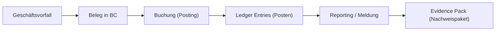
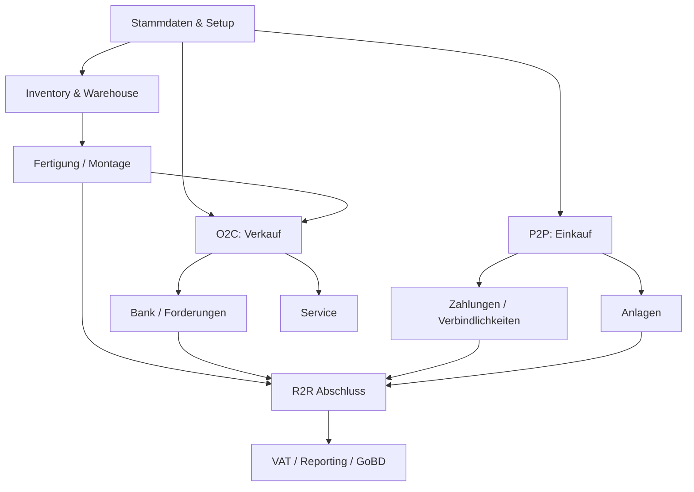
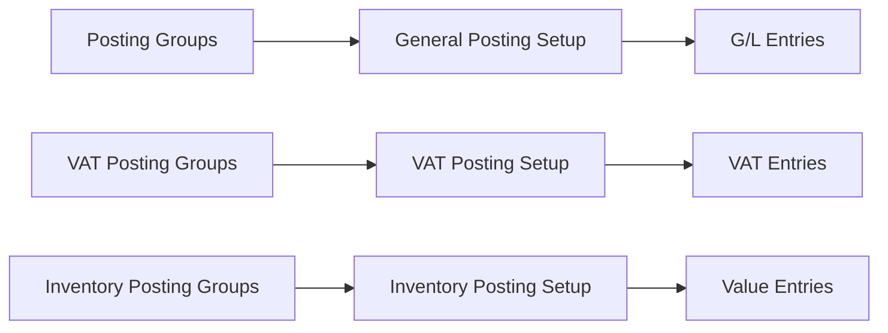
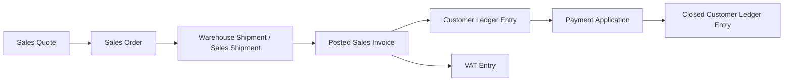
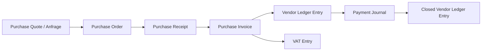
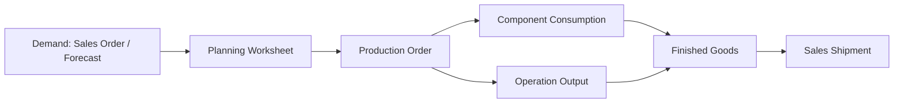
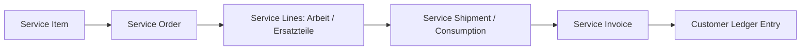
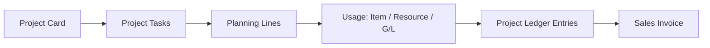
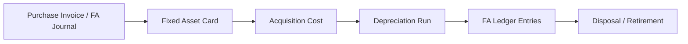
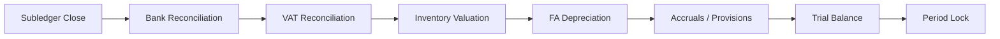

# FiBu-Buch 5: Business Central (BC) – Standardprozesse Deutschland als End-to-End-Master-Blueprint

Stand: `28.05.2026`
Hinweis: Dieses Buch ist ein Lern-, Projekt- und Prüfungsleitfaden für Microsoft Dynamics 365 Business Central im deutschen Unternehmenskontext. Es ersetzt keine individuelle Rechts-, Steuer- oder Implementierungsberatung.

**Verlässlichkeitsstandard und Rechtsstand**
- Rechtsstand und Link-Prüfung der Primärquellen: `28.05.2026`.
- Fachlicher Fokus: Business Central Standard, deutsche Umsatzsteuer (USt), GoBD, E-Rechnung, HGB-nahe Finanzprozesse.
- BC-Funktionsumfang, Seitenbezeichnungen und Lokalisierungen können je Release Wave, Mandant, Lizenz und Erweiterung abweichen.
- Bei Abweichungen zwischen diesem Buch und Normtext oder Microsoft Learn gilt immer die aktuelle Primärquelle.
- Dieses Skript verwendet nur Primärquellen: Microsoft Learn, Gesetze im Internet, BMF und BZSt.

## Inhaltsverzeichnis (Kurz)

1. Ziel, Denkmodell und Musterfirma
2. Prozesslandkarte der Musterfirma
3. Stammdaten- und Setup-Fundament
4. O2C (Order-to-Cash (Auftrag-bis-Zahlung))
5. P2P (Procure-to-Pay (Beschaffung-bis-Zahlung))
6. Inventory & Warehouse (Lager und Logistik)
7. Planning, Assembly & Manufacturing (Planung, Montage und Fertigung)
8. Service Management (Servicegeschäft)
9. Projects (Projekte) und Ressourcen
10. Bank, Cash, Mahnwesen und Zahlungsverkehr
11. Fixed Assets (Anlagenbuchhaltung)
12. VAT/USt, E-Rechnung und deutsche Lokalisierung
13. R2R (Record-to-Report (Buchung-bis-Abschluss))
14. Intercompany, Foreign Trade und Sonderfälle
15. End-to-End-Testkatalog und Abweichungsmatrix
16. Quellenverzeichnis

---

## 1. Ziel, Denkmodell und Musterfirma

Dieses Buch beschreibt Business Central nicht als Sammlung einzelner Menüpunkte. Es beschreibt das Unternehmen als zusammenhängenden Prozesskörper: Auftrag, Beschaffung, Lager, Fertigung, Service, Projekt, Zahlung, Steuer und Abschluss greifen ineinander. Nach diesem Buch kannst du Standardprozesse in Business Central end-to-end erklären, testen und gegen deutsche Nachweis- und Steueranforderungen absichern.

### 1.1 Ziel

- Du kannst die relevanten BC-Standardprozesse im deutschen Mittelstand als E2E-Prozessketten darstellen.
- Du erkennst Abweichungen vom Standardpfad früh: Teillieferung, Rückgabe, Preisabweichung, Skonto, Fremdwährung, Streckengeschäft, Projektverbrauch, Fertigungsabweichung, Servicegarantie.
- Du kannst zu jedem Prozess sagen, welche Stammdaten, Buchungsgruppen, Posten (Entries), Belege, Kontrollen und Nachweise entstehen.
- Du kannst einen UAT (User Acceptance Test (Benutzerabnahmetest)) planen, der nicht nur „Buchung klappt“, sondern „Prozess ist prüfbar“ beweist.

### 1.2 Die Musterfirma: Rhein-Main Maschinenbau & Service GmbH

Die **Rhein-Main Maschinenbau & Service GmbH** sitzt in Frankfurt am Main und bildet bewusst viele typische Standardfälle ab.

| Bereich | Ausprägung in der Musterfirma | Warum relevant für BC |
|---|---|---|
| Vertrieb | Maschinen, Ersatzteile, Dienstleistungen, Wartungsverträge | O2C, Service, Projekt, USt |
| Einkauf | Rohmaterial, Handelsware, Fremdleistungen, Anlagen | P2P, Lager, Projekt, Anlagenbuchhaltung |
| Lager | Hauptlager Frankfurt, Außenlager Hamburg, Servicefahrzeuge | Lagerorte, Umlagerung, Kommissionierung |
| Fertigung | Montage von Standardmaschinen und kundenspezifischen Varianten | Stücklisten (BOM), Arbeitspläne (Routings), Fertigungsaufträge |
| Service | Wartung, Reparatur, Garantie und kostenpflichtiger Außendienst | Serviceaufträge, Serviceartikel, Ersatzteilverbrauch |
| Projekte | Installation beim Kunden, Schulungen, Sondermaschinen | Project Tasks, Planning Lines, Ressourcen |
| Deutschland | UStVA, E-Rechnung, GoBD, Aufbewahrung, DATEV-nahe Nachweise | deutsche Lokalisierung, VAT Reporting, Archivlogik |
| Ausland | EU-Kunden, Drittland, Streckengeschäft, Import | VAT Posting Setup, Intrastat, Exportnachweise |

### 1.3 Grundprinzip

> Merksatz: Ein BC-Prozess ist erst verstanden, wenn du vier Spuren erklären kannst: fachlicher Ablauf, Buchungsspur, Steuerlogik und Nachweispaket.

Praxisregel:
- Starte nie mit der Seite in BC. Starte mit der Frage: „Welche Verpflichtung, Ware, Dienstleistung, Zahlung oder Steuer entsteht?“

Prüfungsfalle:
- Ein Prozess gilt im Projekt als „fertig“, obwohl nur der Happy Path getestet wurde. In der Praxis scheitert er dann an Teilmengen, Stornos, Steuerabweichungen oder fehlenden Nachweisen.

---

## 2. Prozesslandkarte der Musterfirma

Dieses Kapitel ordnet alle Standardprozesse in eine gemeinsame Landkarte ein. Die Landkarte ist die Klammer für das gesamte Buch: Jeder Einzelprozess muss später wieder auf diese Gesamtlogik zurückführen.

### 2.1 Gesamtbild

### 2.2 Prozessgruppen

| Prozessgruppe | Standardpfad | Typische Abweichungen | Nachweisziel |
|---|---|---|---|
| O2C | Angebot → Auftrag → Lieferung → Rechnung → Zahlung | Teillieferung, Gutschrift, Retoure, Vorauszahlung, EU/Drittland | Belegkette bis Zahlung und USt-Ausweis |
| P2P | Anfrage → Bestellung → Wareneingang → Eingangsrechnung → Zahlung | Preisabweichung, Mengenabweichung, Teil-WE, Rücksendung, E-Rechnung | 3-Way-Match und Kreditorenabstimmung |
| Inventory | Zugang → Lagerbewegung → Verbrauch/Verkauf → Bewertung | Umlagerung, Inventurdifferenz, Chargen/Seriennummer, negative Bestände | Item Ledger Entries und Value Entries nachvollziehbar |
| Fertigung | Planung → Auftrag → Verbrauch → Istmeldung → Fertigmeldung | Ausschuss, Ersatzkomponente, Eilauftrag, Fremdarbeit | Produktionskosten und Bestandszugang plausibel |
| Service | Meldung → Auftrag → Ersatzteil/Arbeitszeit → Faktura | Garantie, Kulanz, Teilfakturierung, Fremdleistung | Serviceartikelhistorie und Kosten-/Erlösnachweis |
| Projekte | Projektkarte → Aufgaben → Planung → Verbrauch → Faktura | Festpreis, Aufwand, Meilenstein, mehrere Rechnungsempfänger | Projektbudget gegen Ist und Faktura |
| Bank | Import → Matching → Ausgleich → Abstimmung | Teilzahlung, Skonto, Überzahlung, ungeklärter Zahlungseingang | OP-Ausgleich und Bankabstimmung |
| Anlagen | Zugang → Aktivierung → AfA → Abgang | Nachaktivierung, Teilabgang, Zuschuss, Reparatur vs. Aktivierung | Anlagenkarte und AfA-Lauf |
| R2R | Journal → Abstimmung → Periodensperre → Abschluss | Nachbuchung, Korrektur, Rückstellung, Abgrenzung | SUSA, Abschlusscheckliste, Audit Trail |

### 2.3 Abweichungslogik in 60 Sekunden

Jede Abweichung verändert mindestens eine von fünf Ebenen:

1. **Menge**: Teilmenge, Ausschuss, Nachlieferung, Inventurdifferenz.
2. **Preis**: Rabatt, Skonto, Preisabweichung, Fremdwährung.
3. **Zeit**: Vorleistung, Anzahlung, Periodenabgrenzung, verspätete Rechnung.
4. **Steuer**: Inland, EU, Drittland, Reverse Charge, Steuerbefreiung.
5. **Nachweis**: fehlender Beleg, fehlende Freigabe, nicht verknüpfter Exportnachweis.

Prüfungstipp:
- Im UAT muss jede dieser fünf Ebenen mindestens einmal bewusst gebrochen werden. Nur dann ist der Prozess robust getestet.

---

## 3. Stammdaten- und Setup-Fundament

Stammdaten sind in Business Central keine neutrale Adressverwaltung. Sie steuern Buchung, Steuer, Lager, Preisfindung, Zahlungsbedingungen und Reporting. Wer Stammdaten falsch setzt, erzeugt systematische Fehler in jedem Folgeprozess.

### 3.1 Pflichtobjekte

| Objekt | Kritische Felder | Folge bei Fehler |
|---|---|---|
| `Customer` (Debitor) | Posting Groups, VAT Bus. Posting Group, Payment Terms, Country/Region Code | falsches Debitorenkonto, falsche USt, falsche Fälligkeit |
| `Vendor` (Kreditor) | Vendor Posting Group, VAT Bus. Posting Group, IBAN, External Document No. Pflicht | falsche Verbindlichkeit, Zahlungsrisiko, Dubletten |
| `Item` (Artikel) | Type, Inventory Posting Group, Gen. Prod. Posting Group, VAT Prod. Posting Group, Costing Method | falsche Lagerbewertung, falsche COGS, falsche Steuer |
| `Resource` (Ressource) | Gen. Prod. Posting Group, Einheit, Preis/Kosten | falsche Projekt- oder Servicekosten |
| `G/L Account` (Sachkonto) | Direct Posting, Gen. Posting Type, VAT Posting Groups | manuelle Fehlbuchungen, USt-Fehler |
| `Location` (Lagerort) | Require Receive/Shipment/Pick/Put-away, Bin Mandatory | Lagerprozess passt nicht zum physischen Ablauf |
| `Fixed Asset` (Anlage) | Depreciation Book, FA Posting Group, Nutzungsdauer | falsche AfA, falscher Anlagenabgang |

### 3.2 Setup-Kern

Kontrollpunkte:
- Buchungsgruppen dürfen nach Produktivstart nur per Change Request geändert werden.
- USt-relevante Stammdaten benötigen Vier-Augen-Prüfung.
- Nummernserien müssen eindeutig, nachvollziehbar und pro Belegart steuerbar sein.
- `Allow Posting From/To` und VAT-Periodensteuerung müssen Monatsabschlüsse schützen.

UAT-Minimaltests:
1. Debitor Inland mit 19 % USt buchen.
2. Debitor EU mit USt-IdNr. und 0 %/Reverse-Charge-Logik buchen.
3. Kreditor Inland mit Vorsteuer buchen.
4. Artikel mit Lagerbewertung kaufen, verkaufen und Wertposten prüfen.
5. Manuelle Sachkontobuchung auf gesperrtes Direktbuchungskonto verhindern.

---

## 4. O2C (Order-to-Cash (Auftrag-bis-Zahlung))

Der O2C-Prozess beginnt nicht mit der Rechnung. Er beginnt mit der Kundenanfrage und endet erst, wenn Forderung, Steuer, Zahlung und Nachweis vollständig geschlossen sind. In der Musterfirma verkauft der Vertrieb eine Maschine, Ersatzteile und eine Installationsleistung.

### 4.1 Standardpfad

BC (Business Central (ERP-System))-Bezug:
- `Sales Quotes`, `Sales Orders`, `Posted Sales Shipments`, `Posted Sales Invoices`
- `Customer Ledger Entries`, `Detailed Cust. Ledg. Entries`, `G/L Entries`, `VAT Entries`
- Microsoft Learn: https://learn.microsoft.com/en-us/dynamics365/business-central/sales-how-sell-products
- Microsoft Learn: https://learn.microsoft.com/en-us/dynamics365/business-central/ui-post-sales

### 4.2 Zahlenbeispiel

Die Rhein-Main Maschinenbau & Service GmbH verkauft Ersatzteile für `10.000 EUR` netto an einen deutschen Kunden. USt `19 %` = `1.900 EUR`. Zahlungsziel: 30 Tage.

| Buchung | Soll | Haben |
|---|---:|---:|
| Forderungen | 11.900 | |
| Umsatzerlöse Ersatzteile | | 10.000 |
| Umsatzsteuer 19 % | | 1.900 |

Nach Zahlung:

| Buchung | Soll | Haben |
|---|---:|---:|
| Bank | 11.900 | |
| Forderungen | | 11.900 |

### 4.3 Abweichungen

| Abweichung | BC-Mechanik | Risiko | Kontrolle |
|---|---|---|---|
| Teillieferung | `Qty. to Ship`, später Restlieferung | Rechnung vor Lieferung | Shipment-Status je Zeile prüfen |
| Teilrechnung | `Qty. to Invoice` | Forderung stimmt, aber Leistung nicht vollständig | Abgleich Sales Shipment ↔ Invoice |
| Retoure | Sales Return Order / Sales Credit Memo | falsche USt-Korrektur | Bezug zur Ursprungsrechnung |
| Preisnachlass nach Rechnung | Credit Memo | § 17 UStG-Berichtigung fehlt | VAT Entry der Gutschrift prüfen |
| Anzahlung | Prepayment Invoice | falsche Steuerperiode | Prepayment VAT und Schlussrechnung abstimmen |
| EU-B2B | VAT Bus. Posting Group EU | fehlende USt-IdNr./ZM | USt-IdNr. und Zusammenfassende Meldung |
| Drittland Export | VAT Clause Export | fehlender Ausfuhrnachweis | Exportbeleg im Evidence Pack |
| Streckengeschäft | Drop Shipment | Wareneingang/Lieferung verwechselt | Verknüpfung Sales Order ↔ Purchase Order |

Prüfungsfalle:
- „Gebuchte Verkaufsrechnung vorhanden“ reicht nicht. Entscheidend ist, ob Lieferung, Steuerlogik, Forderungsausgleich und Nachweis zusammenpassen.

UAT-Minimaltests:
1. Inlandslieferung 19 % vollständig liefern, fakturieren und bezahlen.
2. Teillieferung mit späterer Restlieferung und zwei Rechnungen.
3. Retoure mit Bezug auf gebuchte Rechnung.
4. EU-B2B-Lieferung mit USt-IdNr. und 0 %-Logik.
5. Drittland-Export mit VAT Clause und Exportnachweis.

---

## 5. P2P (Procure-to-Pay (Beschaffung-bis-Zahlung))

Der P2P-Prozess steuert Verbindlichkeiten, Lagerzugänge, Vorsteuer und Zahlungsrisiken. In der Musterfirma kauft der Einkauf Stahl, Elektronikkomponenten, Fremdservice und Büromaterial.

### 5.1 Standardpfad

BC-Bezug:
- `Purchase Orders`, `Purchase Receipts`, `Purchase Invoices`, `Posted Purchase Invoices`
- `Vendor Ledger Entries`, `G/L Entries`, `Item Ledger Entries`, `Value Entries`, `VAT Entries`
- Microsoft Learn: https://learn.microsoft.com/en-us/dynamics365/business-central/purchasing-how-record-purchases

### 5.2 Zahlenbeispiel

Einkauf von Rohmaterial: `20.000 EUR` netto, Vorsteuer `3.800 EUR`, Zahlung `23.800 EUR`.

| Buchung | Soll | Haben |
|---|---:|---:|
| Vorräte/Rohmaterial | 20.000 | |
| Vorsteuer 19 % | 3.800 | |
| Verbindlichkeiten | | 23.800 |

### 5.3 Abweichungen

| Abweichung | BC-Mechanik | Risiko | Kontrolle |
|---|---|---|---|
| Teil-Wareneingang | mehrere Receipts | Rechnung über nicht erhaltene Menge | Quantity Received vs. Quantity Invoiced |
| Sammelrechnung | Combine Receipts | Wareneingang bleibt offen | Purchase Receipts vollständig zuordnen |
| Preisabweichung | Invoice Amount ≠ Order Amount | falscher Lagerwert | Preisfreigabe und Value Entries |
| Mengenabweichung | Rechnung > Eingang | Überzahlung | 3-Way-Match |
| Rücksendung | Purchase Return Order / Credit Memo | Vorsteuerkorrektur fehlt | Bezug zur Ursprungsrechnung |
| E-Rechnung | E-Documents | XML nicht führend archiviert | XML, Validierung, Buchungsbezug |
| Fremdleistung | G/L Account oder Resource | Aktivierung/Projektzuordnung falsch | Dimension/Projektaufgabe prüfen |
| Import Drittland | Import VAT | Einfuhrumsatzsteuer falsch | Zollbeleg und EUSt-Konto |

Microsoft Learn:
- Purchase Returns: https://learn.microsoft.com/en-us/dynamics365/business-central/purchasing-how-process-purchase-returns-cancellations
- E-Documents Purchase: https://learn.microsoft.com/en-us/dynamics365/business-central/finance-how-use-edocuments-purchase

UAT-Minimaltests:
1. Bestellung mit Wareneingang und Rechnung vollständig buchen.
2. Teil-WE, danach Sammelrechnung.
3. Preisabweichung mit Freigabe.
4. Rücksendung an Lieferanten mit Gutschrift.
5. Eingangs-E-Rechnung mit Zuordnung zur Bestellung.

---

## 6. Inventory & Warehouse (Lager und Logistik)

Lagerprozesse verbinden physische Bewegung mit finanzieller Bewertung. Business Central trennt daher Mengenposten (`Item Ledger Entries`) und Wertposten (`Value Entries`). Diese Trennung ist für Abstimmung und Abschluss zentral.

### 6.1 Standardpfade

| Prozess | Ablauf | Entries |
|---|---|---|
| Einkaufslagerzugang | Bestellung → Wareneingang → Rechnung | Item Ledger Entry, Value Entry, G/L Entry |
| Verkaufslagerabgang | Auftrag → Lieferung → Rechnung | Item Ledger Entry, Value Entry, COGS |
| Umlagerung | Transfer Order → Shipment → Receipt | Item Ledger Entries je Lagerort |
| Inventur | Physical Inventory Journal → Posting | Korrekturposten Menge/Wert |
| Lagerkommissionierung | Pick → Shipment | Lagerbewegung vor Verkaufslieferung |

Microsoft Learn:
- Inventory Setup: https://learn.microsoft.com/en-us/dynamics365/business-central/inventory-setup-inventory

### 6.2 Abweichungen

| Abweichung | Konsequenz |
|---|---|
| Negative Bestände | COGS kann vor endgültigem Einstandspreis entstehen |
| Chargen-/Seriennummernpflicht | jede Bewegung braucht eindeutige Item Tracking Line |
| Ersatzartikel | Verfügbarkeitsprüfung muss Substitution zulassen |
| falsche Einheit | Menge und Bewertung laufen auseinander |
| verspätete Eingangsrechnung | erwartete Kosten vs. tatsächliche Kosten abstimmen |
| Inventurdifferenz | Ergebniswirkung und Ursachenanalyse dokumentieren |

Praxisregel:
- Jede Lagerabweichung ist gleichzeitig ein Mengen-, Bewertungs- und Verantwortungsproblem.

UAT-Minimaltests:
1. Artikel kaufen, einlagern, verkaufen und COGS prüfen.
2. Umlagerung Frankfurt → Hamburg.
3. Inventurdifferenz buchen und Wertposten prüfen.
4. Seriennummernpflichtigen Artikel verkaufen.
5. verspätete Eingangsrechnung nach Wareneingang buchen.

---

## 7. Planning, Assembly & Manufacturing (Planung, Montage und Fertigung)

Fertigung ist der Prozess, in dem Business Central am stärksten zwischen Planung und Ist unterscheidet. Die Musterfirma fertigt eine Standardmaschine aus Baugruppen und kauft einzelne Komponenten fremd ein.

### 7.1 Fertigungsstandard

Microsoft Learn:
- Supply Planning: https://learn.microsoft.com/en-us/dynamics365/business-central/production-planning
- Production Orders: https://learn.microsoft.com/en-us/dynamics365/business-central/production-about-production-orders
- Create Production Orders: https://learn.microsoft.com/en-us/dynamics365/business-central/production-how-to-create-production-orders

### 7.2 Abweichungen

| Abweichung | BC-Reaktion | Abschlussrisiko |
|---|---|---|
| Materialausschuss | höherer Verbrauch | Fertigungsabweichung |
| Ersatzkomponente | manuelle Änderung Komponente | Stücklisten-/Kostenabweichung |
| Eilauftrag | manuelle Fertigungsorder | Planung wird umgangen |
| Fremdarbeit | Einkauf/Fremdleistung | Kosten landen nicht im Auftrag |
| Teilfertigmeldung | Output kleiner als Plan | Bestand und Kosten unvollständig |
| Nacharbeit | zusätzlicher Arbeitsgang | Kostenstelle/Ressource falsch |

Zahlenbeispiel:
- Planverbrauch: Stahl `5.000 EUR`, Elektronik `3.000 EUR`, Arbeitszeit `2.000 EUR`.
- Istverbrauch: Stahl `5.400 EUR`, Elektronik `3.000 EUR`, Arbeitszeit `2.300 EUR`.
- Fertigungsabweichung: `700 EUR`.

Prüfungstipp:
- Fertigung nie nur über fertige Stückzahl prüfen. Prüfe Verbrauch, Output, Rest-WIP und Abweichung.

---

## 8. Service Management (Servicegeschäft)

Serviceprozesse verbinden Kundenbeziehung, Ersatzteile, Arbeitszeit, Garantie und Faktura. Die Musterfirma wartet Maschinen nach Auslieferung und verkauft Ersatzteile aus Servicefahrzeugen.

### 8.1 Standardpfad

Microsoft Learn:
- Service Setup: https://learn.microsoft.com/en-us/dynamics365/business-central/service-setup-service

### 8.2 Abweichungen

| Abweichung | Behandlung |
|---|---|
| Garantie | Erlös 0 oder separates Garantie-/Kulanzkonto |
| Teilfakturierung | Arbeitszeit sofort, Ersatzteil später |
| Fremdleistung | P2P-Beleg mit Serviceauftragsbezug |
| Ersatzteil fehlt | Lagerort Servicefahrzeug prüfen |
| Kunde reklamiert | Credit Memo oder Service-Retoure |
| Wartungsvertrag | periodische Abrechnung und Vertragsnachweis |

Evidence Pack:
- Serviceauftrag, Serviceartikelhistorie, Arbeitszeitnachweis, Ersatzteilverbrauch, Kundenfreigabe, Rechnung oder Kulanzentscheidung.

---

## 9. Projects (Projekte) und Ressourcen

Projektprozesse sind in Business Central eigenständige Wertträger. Sie sammeln Planung, Ressourcen, Artikelverbrauch, Fremdleistungen und Faktura. In der Musterfirma betrifft das Installation, Schulung und Sondermaschinen.

### 9.1 Standardpfad

Microsoft Learn:
- Create Projects: https://learn.microsoft.com/en-us/dynamics365/business-central/projects-how-create-jobs

### 9.2 Abweichungen

| Abweichung | Risiko | Kontrolle |
|---|---|---|
| Festpreis | Istkosten laufen ohne Mehrerlös | Budget vs. Ist |
| Time & Material | nicht fakturierte Zeiten | WIP-/Unbilled-Auswertung |
| mehrere Rechnungsempfänger | falscher Debitor | Task Billing Method prüfen |
| Projektlager | Materialverbrauch ohne Projektbezug | Location/Bin je Projekt |
| Reisekosten | Aufwand ohne Weiterbelastung | Dimension und Projektaufgabe |
| Meilensteinrechnung | Erlös vor Leistung | Abgrenzung prüfen |

Praxisregel:
- Jedes Projekt braucht mindestens eine Aufgabe, weil Buchungen auf Project Tasks referenzieren.

---

## 10. Bank, Cash, Mahnwesen und Zahlungsverkehr

Bankprozesse schließen offene Posten und beweisen Liquidität. Die fachliche Frage lautet nicht „steht Geld auf dem Konto?“, sondern „ist jede Bankbewegung einem Beleg, einer Forderung, einer Verbindlichkeit oder einem Klärfall zugeordnet?“

### 10.1 Standardpfade

| Prozess | Ablauf |
|---|---|
| Kundenzahlung | Bankimport → Payment Reconciliation Journal → Apply Entries → Bankabstimmung |
| Lieferantenzahlung | Payment Journal → Zahlungsvorschlag → Bankdatei → Ausgleich |
| Teilzahlung | offener Restposten bleibt bestehen |
| Skonto | Zahlungsdifferenz wird als Skonto gebucht |
| Überzahlung | Guthaben oder Rückzahlung |
| ungeklärte Zahlung | Klärungskonto mit Verantwortlichem |

Microsoft Learn:
- Customer Payment Application: https://learn.microsoft.com/en-us/dynamics365/business-central/receivables-how-apply-sales-transactions-manually
- Vendor Payment Application: https://learn.microsoft.com/en-us/dynamics365/business-central/payables-how-apply-purchase-transactions-manually

Prüfungsfalle:
- Bankabstimmung ohne OP-Ausgleich zeigt nur, dass der Banksaldo stimmt. Sie beweist nicht, dass Forderungen und Verbindlichkeiten richtig geschlossen wurden.

---

## 11. Fixed Assets (Anlagenbuchhaltung)

Anlagenprozesse verbinden Einkauf, Aktivierung, Abschreibung und Abgang. In der Musterfirma betrifft das CNC-Maschinen, Firmenfahrzeuge, IT-Ausstattung und selbstständige Betriebsvorrichtungen.

### 11.1 Standardpfad

Microsoft Learn:
- Fixed Assets Setup: https://learn.microsoft.com/en-us/dynamics365/business-central/fa-setup
- Manage Fixed Assets: https://learn.microsoft.com/en-us/dynamics365/business-central/fa-manage

### 11.2 Abweichungen

| Abweichung | Behandlung |
|---|---|
| nachträgliche Anschaffungskosten | Nachaktivierung auf Anlage |
| Reparatur statt Aktivierung | Aufwand, wenn keine Erweiterung/Verbesserung |
| Teilabgang | mengen- oder wertmäßiger Teilabgang |
| Zuschuss | Brutto-/Nettomethode nach Bilanzierungsentscheidung |
| falsche Nutzungsdauer | AfA-Plan korrigieren, Begründung dokumentieren |
| Verkauf mit Gewinn/Verlust | Buchwert, Erlös und USt trennen |

Zahlenbeispiel:
- CNC-Maschine: Anschaffung `120.000 EUR`, Nutzungsdauer `10 Jahre`, lineare AfA `12.000 EUR` p. a.
- Verkauf nach 3 Jahren für `90.000 EUR` netto.
- Buchwert: `84.000 EUR`, Veräußerungsgewinn: `6.000 EUR`.

---

## 12. VAT/USt, E-Rechnung und deutsche Lokalisierung

Die deutsche Prozesssicht verlangt, dass steuerliche Behandlung, Rechnungsformat, Meldung und Archivierung zusammenpassen. Business Central liefert dafür VAT Posting Setup, VAT Entries, VAT Reports und deutsche Lokalisierungsfunktionen.

### 12.1 Standardlogik

| Sachverhalt | BC-Setup | Nachweis |
|---|---|---|
| Inland 19 % | VAT Bus./Prod. Posting Setup 19 % | Rechnung, VAT Entry |
| Inland 7 % | eigener VAT Identifier | Rechnung, VAT Entry |
| steuerfrei | VAT Clause | Befreiungsgrund |
| EU-B2B Lieferung | EU-Gruppe, USt-IdNr. | ZM, Belegnachweis |
| Reverse Charge | VAT Calculation Type Reverse Charge | Eingangsrechnung, VAT Entries |
| Import | Import VAT / Full VAT | Zollbeleg, EUSt |
| E-Rechnung B2B | strukturierte XML-Komponente | XML führend archiviert |

Primärquellen:
- Microsoft Learn VAT Setup: https://learn.microsoft.com/en-us/dynamics365/business-central/finance-setup-vat
- Microsoft Learn VAT Reports: https://learn.microsoft.com/en-us/dynamics365/business-central/finance-vat-reports
- Microsoft Learn Germany Local Functionality: https://learn.microsoft.com/en-us/dynamics365/business-central/localfunctionality/germany/germany-local-functionality
- UStG: https://www.gesetze-im-internet.de/ustg_1980/
- AO § 147: https://www.gesetze-im-internet.de/ao_1977/__147.html
- GoBD 2. Änderung vom 14.07.2025: https://www.bundesfinanzministerium.de/Content/DE/Downloads/BMF_Schreiben/Weitere_Steuerthemen/Abgabenordnung/2025-07-14-GoBD-2-aenderung.pdf

Prüfungsfalle:
- Bei E-Rechnungen ist nicht das PDF der führende steuerliche Datenträger, wenn die strukturierte XML-Komponente den Rechnungsinhalt enthält.

---

## 13. R2R (Record-to-Report (Buchung-bis-Abschluss))

R2R bündelt alle Prozesse in den Abschluss. Der Monatsabschluss der Musterfirma ist nicht nur eine Summen- und Saldenliste. Er ist eine Kette aus Abstimmungen, Sperren, Nachweisen und Management Reporting.

### 13.1 Abschlusskette

### 13.2 Pflichtabstimmungen

| Abstimmung | Quelle | Ziel |
|---|---|---|
| Debitoren | Customer Ledger Entries | Forderungskonto |
| Kreditoren | Vendor Ledger Entries | Verbindlichkeitskonto |
| Lager | Value Entries / Inventory Valuation | Vorratskonten |
| Bank | Bank Account Ledger Entries | Kontoauszug |
| USt | VAT Entries | Steuerkonten / Meldung |
| Anlagen | FA Ledger Entries | Anlagenkonten |
| Projekte | Project Ledger Entries | WIP, Erlöse, Kosten |

Merksatz:
- Erst Nebenbücher schließen, dann Hauptbuch beurteilen.

---

## 14. Intercompany, Foreign Trade und Sonderfälle

Sonderfälle sind keine Randnotiz. Sie entscheiden, ob ein Standardprozess im echten Unternehmen tragfähig ist. Die Musterfirma verkauft ins EU-Ausland, bezieht Ware aus Drittland und verrechnet Leistungen mit einer verbundenen Servicegesellschaft.

### 14.1 Sonderfallmatrix

| Fall | Prozessberührung | Hauptprüfung |
|---|---|---|
| Intercompany-Verkauf | O2C + P2P + Konsolidierung | Gegenbeleg und Abstimmung |
| EU-Lieferung | O2C + VAT | USt-IdNr., Transportnachweis, ZM |
| Drittland-Export | O2C + Zoll | Ausfuhrnachweis |
| Import | P2P + VAT + Lager | Zollwert, EUSt, Wareneingang |
| Streckengeschäft | O2C + P2P | Lieferort, Verknüpfung, Steuerlogik |
| Reihengeschäft | O2C/P2P/VAT | bewegte Lieferung, Nachweise |
| Fremdwährung | O2C/P2P/R2R | Kursdifferenz, Neubewertung |
| Konsignationslager | Inventory/VAT | Eigentumsübergang, Steuerzeitpunkt |

Prüfungstipp:
- Sonderfälle brauchen ein `TaxScenario` oder eine gleichwertige dokumentierte Klassifikation. Sonst ist nach sechs Monaten nicht mehr erklärbar, warum 0 %, Reverse Charge oder Import VAT verwendet wurde.

---

## 15. End-to-End-Testkatalog und Abweichungsmatrix

Dieses Kapitel fasst die UAT-Logik zusammen. Der Testkatalog ist so aufgebaut, dass jede Prozessgruppe mindestens einen Standardpfad und mehrere Abweichungen enthält.

### 15.1 Master-UAT

| ID | Prozess | Testfall | Erwarteter Nachweis |
|---|---|---|---|
| UAT-001 | O2C | Inlandslieferung 19 % vollständig | Invoice, VAT Entry, Zahlungsausgleich |
| UAT-002 | O2C | Teillieferung + Teilrechnung | Shipment/Invoice-Mengenabgleich |
| UAT-003 | O2C | Retoure nach Rechnung | Credit Memo mit USt-Korrektur |
| UAT-004 | P2P | Bestellung → WE → Rechnung → Zahlung | 3-Way-Match |
| UAT-005 | P2P | Preisabweichung | Freigabe und Value Entry |
| UAT-006 | Inventory | Umlagerung Frankfurt → Hamburg | Item Ledger Entries je Lagerort |
| UAT-007 | Inventory | Inventurdifferenz | Journal, Wertkorrektur |
| UAT-008 | Manufacturing | Fertigungsauftrag mit Mehrverbrauch | Abweichungsanalyse |
| UAT-009 | Service | Garantieauftrag | Kosten ohne Erlös oder Kulanzkonto |
| UAT-010 | Project | Festpreisprojekt mit Materialverbrauch | Budget/Ist/Faktura |
| UAT-011 | Bank | Teilzahlung Kunde | offener Restposten |
| UAT-012 | Fixed Assets | Zugang + AfA + Abgang | FA Ledger Entries |
| UAT-013 | VAT | EU-B2B-Lieferung | USt-IdNr., VAT Entry, ZM-Logik |
| UAT-014 | E-Rechnung | Eingangs-E-Rechnung | XML, Validierung, Buchungsbezug |
| UAT-015 | R2R | Monatsabschluss | Abstimmmappe und Periodensperre |

### 15.2 Abschluss-Merksatz

> Ein Standardprozess ist nur dann standardisiert, wenn auch seine Abweichungen standardisiert sind.

---

## 16. Quellenverzeichnis

- [Q1] Microsoft Learn: Business Central documentation: https://learn.microsoft.com/en-us/dynamics365/business-central/
- [Q2] Microsoft Learn: Welcome to Business Central: https://learn.microsoft.com/en-us/dynamics365/business-central/welcome
- [Q3] Microsoft Learn: Germany local functionality: https://learn.microsoft.com/en-us/dynamics365/business-central/localfunctionality/germany/germany-local-functionality
- [Q4] Microsoft Learn: Set up VAT: https://learn.microsoft.com/en-us/dynamics365/business-central/finance-setup-vat
- [Q5] Microsoft Learn: Built-in VAT reports: https://learn.microsoft.com/en-us/dynamics365/business-central/finance-vat-reports
- [Q6] Microsoft Learn: Sell products with a customer sales order: https://learn.microsoft.com/en-us/dynamics365/business-central/sales-how-sell-products
- [Q7] Microsoft Learn: Posting sales documents: https://learn.microsoft.com/en-us/dynamics365/business-central/ui-post-sales
- [Q8] Microsoft Learn: Record purchases with purchase invoices and orders: https://learn.microsoft.com/en-us/dynamics365/business-central/purchasing-how-record-purchases
- [Q9] Microsoft Learn: Process purchase returns or cancellations: https://learn.microsoft.com/en-us/dynamics365/business-central/purchasing-how-process-purchase-returns-cancellations
- [Q10] Microsoft Learn: Use e-documents in the purchase process: https://learn.microsoft.com/en-us/dynamics365/business-central/finance-how-use-edocuments-purchase
- [Q11] Microsoft Learn: Setting up inventory: https://learn.microsoft.com/en-us/dynamics365/business-central/inventory-setup-inventory
- [Q12] Microsoft Learn: Supply Planning: https://learn.microsoft.com/en-us/dynamics365/business-central/production-planning
- [Q13] Microsoft Learn: About production orders: https://learn.microsoft.com/en-us/dynamics365/business-central/production-about-production-orders
- [Q14] Microsoft Learn: Create production orders: https://learn.microsoft.com/en-us/dynamics365/business-central/production-how-to-create-production-orders
- [Q15] Microsoft Learn: Setting up service management: https://learn.microsoft.com/en-us/dynamics365/business-central/service-setup-service
- [Q16] Microsoft Learn: Create projects: https://learn.microsoft.com/en-us/dynamics365/business-central/projects-how-create-jobs
- [Q17] Microsoft Learn: Reconcile customer payments: https://learn.microsoft.com/en-us/dynamics365/business-central/receivables-how-apply-sales-transactions-manually
- [Q18] Microsoft Learn: Reconcile vendor payments: https://learn.microsoft.com/en-us/dynamics365/business-central/payables-how-apply-purchase-transactions-manually
- [Q19] Microsoft Learn: Set up fixed assets: https://learn.microsoft.com/en-us/dynamics365/business-central/fa-setup
- [Q20] Microsoft Learn: Manage fixed assets: https://learn.microsoft.com/en-us/dynamics365/business-central/fa-manage
- [Q21] Umsatzsteuergesetz (UStG): https://www.gesetze-im-internet.de/ustg_1980/
- [Q22] Abgabenordnung (AO) § 147 Aufbewahrung: https://www.gesetze-im-internet.de/ao_1977/__147.html
- [Q23] BMF-Schreiben vom 14.07.2025: GoBD, 2. Änderung: https://www.bundesfinanzministerium.de/Content/DE/Downloads/BMF_Schreiben/Weitere_Steuerthemen/Abgabenordnung/2025-07-14-GoBD-2-aenderung.pdf
- [Q24] Bundeszentralamt für Steuern: Umsatzsteuer und Zusammenfassende Meldung: https://www.bzst.de/DE/Unternehmen/Umsatzsteuer/umsatzsteuer_node.html
