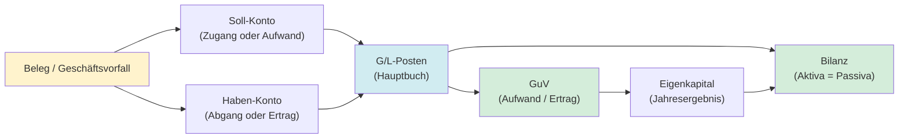
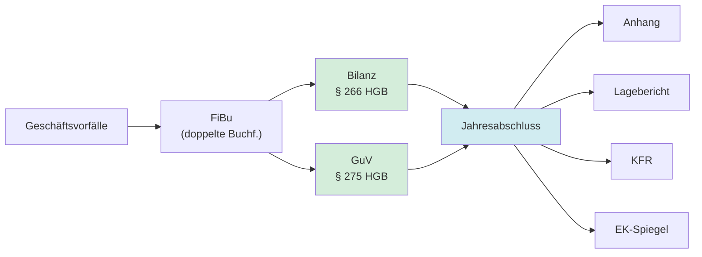
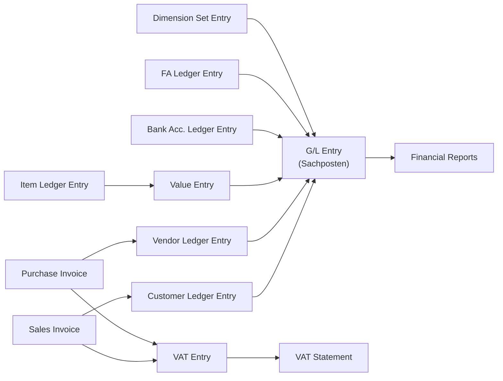
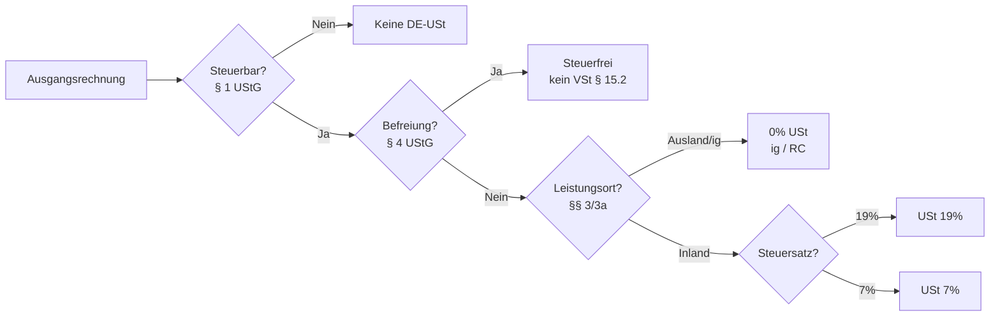
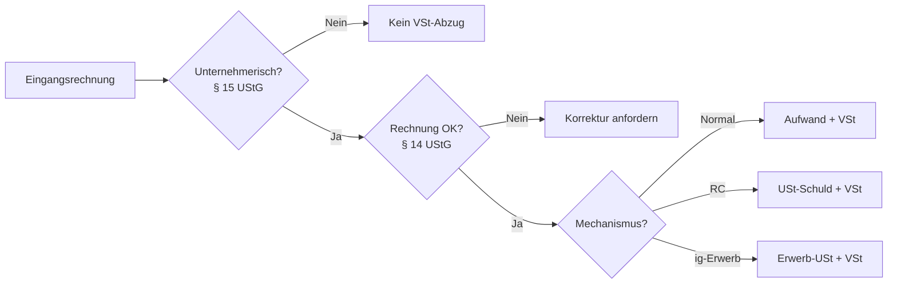
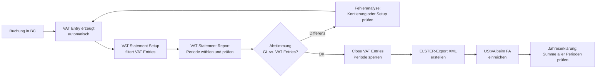
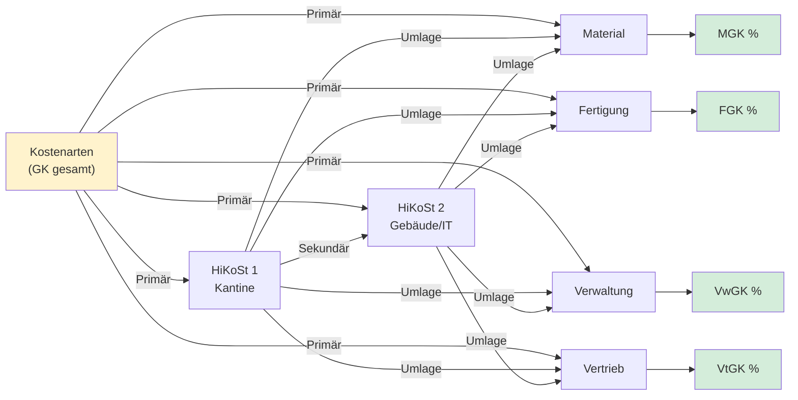
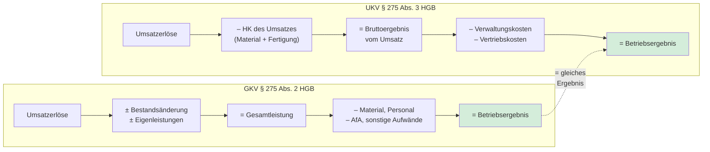

# FiBu-Buch 1: Geprüfter Bilanzbuchhalter (IHK)

Stand: erstellt auf Basis des AKAD-Modulkatalogs „Geprüfter Bilanzbuchhalter – Bachelor Professional in Bilanzbuchhaltung (PDF, 25 Seiten, Version vom 01.11.2022)“.

**Verlässlichkeitsstandard und Rechtsstand**
- Rechtsstand und Link-Prüfung der Primärquellen: `15.03.2026`.
- Für prüfungsrelevante Aussagen wurden vorrangig Primärquellen genutzt (Gesetze/Verordnungen/Standardsetzer).
- Bei Abweichungen zwischen Lernskript und Gesetzestext gilt immer der aktuelle Normtext.
- Dieses Skript ist eine Lernunterlage und ersetzt keine individuelle Steuer- oder Rechtsberatung.

## Inhaltsverzeichnis (Kurz)

1. Ziel dieses Buchs
2. Prüfungslogik: So denkt die IHK
3. Handlungsbereich 1: Geschäftsvorfälle erfassen und zu Abschlüssen führen
4. Handlungsbereich 2: Jahresabschlüsse aufbereiten und auswerten
5. Handlungsbereich 3: Betriebliche Sachverhalte steuerlich darstellen
6. Handlungsbereich 4: Finanzmanagement wahrnehmen, gestalten, überwachen
7. Handlungsbereich 5: Kosten- und Leistungsrechnung (KLR)
8. Handlungsbereich 6: Internes Kontrollsystem (IKS) sicherstellen
9. Handlungsbereich 7: Kommunikation, Führung und Zusammenarbeit
10. Schriftliche Prüfung: inhaltliche Schwerpunkte
11. Mündliche Prüfung: 15-Minuten-Präsentation + Fachgespräch
12. Formelsammlung (kompakt)
13. Parallel lernen mit Microsoft Dynamics 365 Business Central (ERP-System)
14. Abdeckungsnachweis: Inhalte und Tätigkeiten
15. Zusatzabdeckung: Module Finanzbuchhalter/-in (IHK) Komplettlehrgang
16. Kapitel-Belegmatrix
17. Quellenverzeichnis (Primärquellen)
18. Abschluss

## Abkürzungsverzeichnis

Dieses Buch verwendet zahlreiche Fachkürzel. Die folgende Tabelle erklärt jede Abkürzung beim ersten Auftreten – du kannst jederzeit hierher zurückblättern.

**Buchhaltung & Bilanzierung:**

| Kürzel | Bedeutung |
|---|---|
| AfA | Absetzung für Abnutzung (= planmäßige Abschreibung auf Anlagevermögen) |
| AHK | Anschaffungs- und Herstellungskosten (= Ausgangswert für die Bewertung eines Vermögensgegenstands) |
| aLuL | aus Lieferungen und Leistungen (z. B. „Forderungen aLuL" = offene Kundenrechnungen) |
| BE | Betriebsergebnis (= Gewinn/Verlust aus dem operativen Geschäft) |
| BGA | Betriebs- und Geschäftsausstattung (Bilanzposition im Anlagevermögen) |
| BS | Bilanzsumme (= Summe aller Aktiva = Summe aller Passiva) |
| BWA | Betriebswirtschaftliche Auswertung (= monatlicher Kurzbericht über Erträge und Aufwendungen) |
| EK | Eigenkapital |
| EWB | Einzelwertberichtigung (= Abschreibung einer einzelnen zweifelhaften Forderung) |
| FK | Fremdkapital (= Schulden: Verbindlichkeiten + Rückstellungen) |
| GKV | Gesamtkostenverfahren (= GuV-Gliederung nach Kostenarten) |
| GuV | Gewinn- und Verlustrechnung |
| HK | Herstellkosten (= Material + Fertigung + anteilige Gemeinkosten) |
| JÜ | Jahresüberschuss (= Gewinn nach Steuern) |
| KFR | Kapitalflussrechnung (= Cashflow-Statement) |
| LuL | Lieferungen und Leistungen (= operatives Geschäft mit Kunden/Lieferanten) |
| NWP | Niederstwertprinzip (= Vermögensgegenstände dürfen maximal zum niedrigeren Wert angesetzt werden) |
| OP | Offene Posten (= noch nicht bezahlte Rechnungen) |
| PWB | Pauschalwertberichtigung (= pauschale Abschreibung auf das gesamte Forderungsportfolio) |
| RAP | Rechnungsabgrenzungsposten (= Zahlungen, die in die nächste Periode gehören) |
| SK | Selbstkosten (= Herstellkosten + Verwaltungs- und Vertriebsgemeinkosten) |
| SUSA | Summen- und Saldenliste (= Kontenübersicht mit Soll-/Haben-Summen und Saldo) |
| UKV | Umsatzkostenverfahren (= GuV-Gliederung nach Funktionsbereichen) |

**Kosten- und Leistungsrechnung (KLR):**

| Kürzel | Bedeutung |
|---|---|
| BAB | Betriebsabrechnungsbogen (= Tabelle zur Verteilung der Gemeinkosten auf Kostenstellen) |
| DB | Deckungsbeitrag (= Erlöse minus variable Kosten) |
| DBR | Deckungsbeitragsrechnung |
| FEK | Fertigungseinzelkosten (= direkte Löhne der Produktion, z. B. Akkordlohn) |
| FGK | Fertigungsgemeinkosten (= nicht direkt zuordenbare Produktionskosten, z. B. Meistergehalt) |
| FL | Fertigungslöhne (= Synonym für FEK) |
| KER | Kurzfristige Erfolgsrechnung (= monatliche interne Ergebnisrechnung) |
| KLR | Kosten- und Leistungsrechnung (= internes Rechnungswesen) |
| KST | Kostenstelle (= Ort, an dem Kosten anfallen, z. B. Abteilung „Fertigung") |
| MEK | Materialeinzelkosten (= direkt zuordenbare Materialkosten, z. B. Holz für einen Tisch) |
| MGK | Materialgemeinkosten (= nicht direkt zuordenbare Materialkosten, z. B. Lagerhaltung) |
| MK | Materialkosten (= MEK + MGK) |
| SEF | Sondereinzelkosten der Fertigung (= auftragsbezogene Kosten, z. B. Spezialwerkzeug) |
| SEV | Sondereinzelkosten des Vertriebs (= auftragsbezogene Vertriebskosten, z. B. Fracht) |
| VtGK | Vertriebsgemeinkosten |
| VwGK | Verwaltungsgemeinkosten |

**Steuern:**

| Kürzel | Bedeutung |
|---|---|
| EUSt | Einfuhrumsatzsteuer (= USt auf Importe aus Drittländern, wird vom Zoll erhoben) |
| GewSt | Gewerbesteuer |
| ig | innergemeinschaftlich (= zwischen EU-Mitgliedstaaten) |
| IGL | Innergemeinschaftliche Lieferung (= steuerfreie Warenlieferung an Unternehmer in anderem EU-Land) |
| KapESt | Kapitalertragsteuer (= Quellensteuer auf Dividenden/Zinsen in DE) |
| KSt | Körperschaftsteuer |
| LSt | Lohnsteuer |
| QSt | Quellensteuer (= Steuerabzug an der Quelle der Zahlung) |
| RC | Reverse Charge (= Umkehrung der Steuerschuld: Empfänger schuldet die USt) |
| SolZ | Solidaritätszuschlag (= 5,5 % Zuschlag auf KSt/ESt/KapESt) |
| SV | Sozialversicherung (Kranken-, Renten-, Arbeitslosen-, Pflegeversicherung) |
| USt | Umsatzsteuer |
| vGA | Verdeckte Gewinnausschüttung (= nicht als Ausschüttung deklarierte Zuwendung an Gesellschafter) |
| VSt | Vorsteuer (= USt, die ein Unternehmer auf Eingangsrechnungen vom Finanzamt zurückfordern kann) |
| zvE | Zu versteuerndes Einkommen (= Bemessungsgrundlage für ESt/KSt) |

**Finanzmanagement & Kennzahlen:**

| Kürzel | Bedeutung |
|---|---|
| CCC | Cash Conversion Cycle (Geldumschlagsdauer: wie viele Tage binden Vorräte + Forderungen Liquidität?) |
| CF | Cashflow (= Zahlungsstrom, Differenz zwischen Ein- und Auszahlungen) |
| DIO | Days Inventory Outstanding (Lagerdauer in Tagen) |
| DPO | Days Payable Outstanding (Kreditorenlaufzeit in Tagen) |
| DSO | Days Sales Outstanding (Forderungslaufzeit in Tagen) |
| FCF | Free Cash Flow (= operativer Cashflow minus Investitionen) |
| ROA | Return on Assets (Gesamtkapitalrendite) |
| ROE | Return on Equity (Eigenkapitalrendite) |
| ROS | Return on Sales (Umsatzrendite) |
| WC | Working Capital (= Umlaufvermögen minus kurzfristige Verbindlichkeiten) |

**Business Central (BC) & Prozesse:**

| Kürzel | Bedeutung |
|---|---|
| AP | Accounts Payable (Kreditorenbuchhaltung, offene Lieferantenrechnungen) |
| AR | Accounts Receivable (Debitorenbuchhaltung, offene Kundenrechnungen) |
| COGS | Cost of Goods Sold (Herstellkosten des Umsatzes, Wareneinsatz) |
| FA | Fixed Assets (Anlagevermögen) |
| GRNI | Goods Received Not Invoiced (Wareneingang ohne Rechnung = Abgrenzungsfall) |
| IC | Intercompany (konzerninterne Geschäfte zwischen verbundenen Unternehmen) |
| SoD | Segregation of Duties (Funktionstrennung: wer bucht, darf nicht freigeben) |

## 1. Ziel dieses Buchs

Dieses Buch ist ein praxisorientiertes Lernskript, das dich gezielt durch alle 7 IHK-Handlungsbereiche führt. Es kombiniert:
- prüfungsrelevante Theorie,
- typische Rechen- und Buchungsschemata,
- strukturierte Inhaltslogik,
- quellenbasierte Einordnung.

Ziel ist nicht nur „verstehen“, sondern „in der Prüfung sauber liefern“.

## 2. Prüfungslogik: So denkt die IHK

Die IHK prüft fallbezogen und vernetzt. Einzelwissen reicht nicht. Du musst zeigen, dass du
- Sachverhalte korrekt buchhalterisch und steuerlich einordnest,
- Kennzahlen/Analysen in Managemententscheidungen überführst,
- Risiken, Finanzierung und Führung ganzheitlich bewertest.

Arbeitsprinzip in Aufgaben:
1. Sachverhalt erfassen (Was ist wirklich gefragt?).
2. Rechts- und Rechenlogik anwenden.
3. Ergebnis begründen (nicht nur Zahl hinschreiben).
4. Konsequenz fürs Unternehmen benennen.

## 3. Handlungsbereich 1: Geschäftsvorfälle erfassen und zu Abschlüssen führen

### 3.1 Kernkompetenzen

Handlungsbereich 1 bildet das Fundament der IHK-Prüfung: Wer Geschäftsvorfälle nicht sauber erfassen und zu einem HGB-konformen Abschluss führen kann, verliert Punkte in allen anderen Handlungsbereichen. Hier sitzt die Buchhaltungslogik, von der alles andere abhängt. [Q1][Q2]

Die fünf Kernkompetenzen im Überblick:

| Kompetenz | Was du beherrschen musst | Prüfungsgewicht |
|---|---|---|
| Doppelte Buchführung | Buchungssätze bilden, Kontentypen, Erfolgswirkung, Abstimmlogik | Sehr hoch – Basis jeder Aufgabe |
| HGB-Bilanzierung | Ansatz (Pflicht/Wahlrecht), Bewertung (AHK (Anschaffungs-/Herstellungskosten), NWP (Niederstwertprinzip), planm. Abschreibung), Ausweis (§ 266, 275 HGB) | Hoch – Abschlussaufgaben |
| Steuerliche Besonderheiten | Mehr-/Weniger-Rechnung, Maßgeblichkeit, nicht abzugsfähige BA (Betriebsausgaben), latente Steuern | Hoch – Verknüpfungsaufgaben |
| HGB vs. IFRS | Unterschiede bei Ansatz, Bewertung, Ausweis (z. B. GoF (Geschäfts- oder Firmenwert), Leasing, Pensionen, Rückstellungen) | Mittel – Vergleichs-/Analyseaufgaben |
| Konzernabschluss (Grundzüge) | Konsolidierungsarten, Kapitalkonsolidierung, GoF-Behandlung, Pflichtkreis | Mittel – Grundlagenaufgaben |

**Mini-Sachverhalt – alle 5 Kompetenzen an einem Vorgang:**

Die Müller GmbH kauft am `02.01.2026` eine Produktionsmaschine für 100.000 EUR netto + 19.000 EUR USt. Lieferung und Rechnung liegen vor. Nutzungsdauer: 5 Jahre, linear.

| Kompetenz | Was hier passiert | Ergebnis |
|---|---|---|
| Doppelte Buchführung | Buchungssatz bilden | Maschinen (Soll) 100.000 / Vorsteuer (Soll) 19.000 / Verbindlichkeiten (Haben) 119.000 |
| HGB-Bilanzierung | Erstbewertung zu AHK, planmäßige AfA (Absetzung für Abnutzung = jährliche Abschreibung) | AHK 100.000, AfA 20.000/Jahr → Buchwert `31.12.2026`: 80.000 EUR |
| Steuerliche Besonderheiten | Steuerliche AfA prüfen (§ 7 Abs. 1 EStG) | Bei gleicher ND: 20.000 EUR AfA → keine Abweichung. Bei degressiver Steuer-AfA: Abweichung → latente Steuer |
| HGB vs. IFRS | IFRS 16 / IAS 16 Vergleich | HGB: Komponentenansatz nicht zwingend. IFRS: ggf. Komponentenzerlegung erforderlich |
| Konzernabschluss | Falls IC-Lieferung: Zwischenergebniseliminierung | Liefert Tochter die Maschine → Gewinn eliminieren |

Prüfungslogik für Handlungsbereich 1:
- Jede Aufgabe beginnt mit einem Sachverhalt. Deine erste Frage lautet immer: **Aktivkonto, Passivkonto, Aufwand oder Ertrag?** Danach: Bewertung nach HGB. Danach: steuerliche Abweichung?
- Buchungssätze immer vollständig angeben (Konto Soll / Konto Haben / Betrag / Begründung).
- Wenn IFRS im Sachverhalt: erst HGB-Lösung, dann IFRS-Unterschied benennen.

### 3.2 Die doppelte Buchführung in Prüfungssprache

Ziel:
- Du kannst die Doppik-Logik (Aktiv-/Passiv-/Aufwands-/Ertragskonten) sicher anwenden, vollständige Buchungssätze bilden und den Buchungsfluss von Beleg bis Bilanz/GuV (Gewinn- und Verlustrechnung) beschreiben. [Q2][Q12][Q14]

Grundgleichung:
- `Aktiva = Passiva`
- Passiva = Eigenkapital + Fremdkapital

Erfolgswirkung:
- Aufwand mindert EK.
- Ertrag erhöht EK.

Buchungstechnik:
- Aktivkonto: Mehrung Soll, Minderung Haben.
- Passivkonto: Mehrung Haben, Minderung Soll.
- Aufwandskonto: Sollbuchung.
- Ertragskonto: Habenbuchung.

**Buchungsfluss-Übersicht (Systemlogik):**



Kontentypen auf einen Blick:
```
Kontoart     | Mehrung Seite | Minderung Seite | Abschluss
-------------|---------------|-----------------|----------------
Aktivkonto   | Soll          | Haben           | → Bilanz Aktiva
Passivkonto  | Haben         | Soll            | → Bilanz Passiva
Aufwandskonto| Soll          | Haben           | → GuV (Aufwand)
Ertragskonto | Haben         | Soll            | → GuV (Ertrag)
```

**Durchbuchungsbeispiel – ein Tag in der Müller GmbH:**

Anfangsbilanz `01.01.2026`:

| Aktiva | EUR | Passiva | EUR |
|---|---|---|---|
| Maschinen | 80.000 | Eigenkapital | 100.000 |
| Warenbestand | 30.000 | Bankdarlehen | 50.000 |
| Bank | 60.000 | Verbindlichkeiten aLuL (aus Lieferungen und Leistungen = offene Lieferantenrechnungen) | 20.000 |
| **Summe** | **170.000** | **Summe** | **170.000** |

Fünf Geschäftsvorfälle am `15.01.2026`:

**1. Wareneinkauf auf Ziel:** Ware 5.000 EUR netto + 950 EUR VSt = 5.950 EUR brutto

| Soll | Betrag | Haben | Betrag |
|---|---|---|---|
| Wareneinkauf (Aufwand) | 5.000 | Verbindlichkeiten LuL | 5.950 |
| Vorsteuer | 950 | | |

→ Aufwand steigt um 5.000. Verbindlichkeiten steigen um 5.950. Vorsteuer (Forderung ans FA) steigt um 950.

**2. Bankzahlung an Lieferant:** Begleichung einer alten Rechnung über 3.000 EUR

| Soll | Betrag | Haben | Betrag |
|---|---|---|---|
| Verbindlichkeiten LuL | 3.000 | Bank | 3.000 |

→ Aktiv-Passiv-Minderung: Bank sinkt, Verbindlichkeiten sinken um je 3.000.

**3. Warenverkauf auf Ziel:** Ware 8.000 EUR netto + 1.520 EUR USt = 9.520 EUR brutto

| Soll | Betrag | Haben | Betrag |
|---|---|---|---|
| Forderungen LuL | 9.520 | Umsatzerlöse (Ertrag) | 8.000 |
| | | Umsatzsteuer | 1.520 |

→ Ertrag steigt um 8.000. Forderung entsteht. USt-Schuld ans FA steigt um 1.520.

**4. Mietzahlung per Bank:** Büromiete Januar 1.200 EUR netto + 228 EUR VSt = 1.428 EUR

| Soll | Betrag | Haben | Betrag |
|---|---|---|---|
| Mietaufwand | 1.200 | Bank | 1.428 |
| Vorsteuer | 228 | | |

→ Aufwand steigt, Bank sinkt.

**5. Privatentnahme (nur Einzelunternehmen/Personengesellschaft):** Gesellschafter entnimmt 500 EUR bar

| Soll | Betrag | Haben | Betrag |
|---|---|---|---|
| Privatentnahme (EK-Minderung) | 500 | Kasse/Bank | 500 |

→ EK sinkt, Bank sinkt. Kein Aufwand – Privatentnahme ist erfolgsneutral!

**Ergebnis nach allen 5 Vorfällen:**
- Erlöse: 8.000 EUR − Aufwendungen: 6.200 EUR (5.000 + 1.200) = **Tagesgewinn: 1.800 EUR**
- USt-Zahllast: 1.520 − 1.178 (950 + 228) = **342 EUR ans Finanzamt**
- Bank: 60.000 − 3.000 − 1.428 − 500 = **55.072 EUR**

> Merksatz: Jeder Geschäftsvorfall berührt mindestens zwei Konten. Die Bilanzsumme ändert sich nur bei Aktivtausch, Passivtausch, Bilanzverlängerung oder Bilanzverkürzung – nie einseitig.

BC (Business Central (ERP-System))-Bezug:
- `General Journal` (Fibu-Buchblatt): Hier gibst du manuelle Buchungssätze ein (Soll-Konto, Haben-Konto, Betrag).
- `Chart of Accounts` (Kontenplan): Zeigt alle Konten mit Salden – nach dem Buchen siehst du die Wirkung sofort.
- Tell Me → `General Ledger Entries` (Sachposten): Jede gebuchte Zeile erscheint hier mit Belegnummer, Buchungsdatum und Betrag.

Typische Klausurfalle:
- Privatentnahmen und Privateinlagen falsch behandelt → sie sind **erfolgsneutral**, gehen nicht in die GuV.
- Vorsteuer/Umsatzsteuer nicht sauber getrennt → VSt ist eine Forderung (Aktiv), USt eine Verbindlichkeit (Passiv).
- Abschreibungen zeitanteilig vergessen → bei Anschaffung im Laufe des Jahres: AfA nur pro rata temporis (§ 7 Abs. 1 S. 4 EStG).
- Rechnungsabgrenzung mit Rückstellungen verwechselt → RAP: Ausgabe/Einnahme ist schon geflossen, Leistung folgt. Rückstellung: Leistung ist schon erfolgt, Ausgabe folgt.

Prüfungstipp:
- Übe mit 5 verschiedenen Geschäftsvorfällen, bis du jeden innerhalb von 30 Sekunden kontieren kannst. In der Prüfung zählt Geschwindigkeit bei der Grundkontierung.

### 3.3 Inventur, Inventar, Bilanz

Ziel:
- Du kannst die drei Begriffe voneinander abgrenzen, die gesetzlichen Inventurpflichten benennen und den Weg von der Inventur zur Bilanz Schritt für Schritt erklären. [Q2][Q14]

Verstehen in 30 Sekunden:
**Inventur** = der reale Erfassungsvorgang (zählen, wiegen, messen). **Inventar** = das schriftliche Ergebnis (detaillierte Liste). **Bilanz** = die verdichtete Gegenüberstellung in Kontoform, die aus dem Inventar abgeleitet wird. Ohne Inventur kein verlässliches Inventar – ohne Inventar keine korrekte Bilanz. [Q2]

**A. Inventur – drei gesetzlich zulässige Arten (§ 241 HGB):** [Q2]

| Art | Wann | Besonderheit |
|---|---|---|
| Stichtagsinventur | Innerhalb von 10 Tagen vor/nach Bilanzstichtag | Klassischer Standard; körperliche Bestandsaufnahme am/um den 31.12. |
| Verlegte Inventur (§ 241 Abs. 3 HGB) | 3 Monate vor oder 2 Monate nach Bilanzstichtag | Fort- bzw. Rückschreibung erforderlich; erleichtert Produktion/Lager |
| Permanente Inventur (§ 241 Abs. 2 HGB) | Laufend über das Jahr | Nur bei lückenloser Lagerbuchhaltung zulässig; Karteikarte oder ERP-Bestand |

**B. Inventar – Aufbau (Pflichtinhalt):** [Q2]

Das Inventar ist das schriftliche Verzeichnis aller Vermögensgegenstände und Schulden. Es gliedert sich in:
1. Vermögen (Aktiva): Anlagevermögen (Grundstücke, Maschinen, Fahrzeuge) + Umlaufvermögen (Waren, Forderungen, Bank/Kasse)
2. Schulden (Passiva): Verbindlichkeiten (Lieferanten, Bankdarlehen) + Rückstellungen
3. Reinvermögen / Eigenkapital = Vermögen − Schulden

**C. Zahlenbeispiel: Mini-Inventar → Mini-Bilanz** [Q2][Q14]

Handwerksbetrieb Müller, 31.12.2025 – Inventar (Auszug):

| Pos. | Bezeichnung | Menge | Wert EUR |
|---|---|---|---|
| A1 | Maschinen | 2 Stk | 80.000 |
| A2 | Waren | 500 kg à 10 EUR | 5.000 |
| A3 | Forderungen (Kundenaußenstände) | – | 15.000 |
| A4 | Bank | – | 8.000 |
| **Σ Vermögen** | | | **108.000** |
| P1 | Bankdarlehen (Restschuld) | – | 40.000 |
| P2 | Verbindlichkeiten aus LL | – | 8.000 |
| **Σ Schulden** | | | **48.000** |
| **Reinvermögen (EK)** | | | **60.000** |

Überleitung zur Bilanz (Verdichtung): [Q2]

| Bilanz (Aktiva) | EUR | Bilanz (Passiva) | EUR |
|---|---|---|---|
| Anlagevermögen | 80.000 | Eigenkapital | 60.000 |
| Umlaufvermögen | 28.000 | Verbindlichkeiten | 48.000 |
| **Bilanzsumme** | **108.000** | **Bilanzsumme** | **108.000** |

Das Inventar zeigt jeden Posten einzeln. Die Bilanz fasst ihn in gesetzlich vorgeschriebene Positionen zusammen (§ 266 HGB). Die Summe stimmt immer überein. ✓

Merksatz:
- „**Inventur → Inventar → Bilanz**: zählen → listen → verdichten. Keine Bilanz ohne Inventur.” [Q2]

Prüfungsfalle:
- „Inventar und Bilanz sind dasselbe.” Falsch: Das Inventar enthält jeden Posten einzeln (z. B. jede Maschine separat). Die Bilanz fasst zusammen (z. B. Sachanlagen gesamt). Inventar ist Pflicht, auch wenn die Bilanz nicht offengelegt werden muss. [Q2][Q14]

### 3.4 Bewertung nach HGB (sehr prüfungsrelevant)

Ziel:
- Du kannst HGB-Bewertungsgrundsätze benennen, Anlagevermögen, Umlaufvermögen und Rückstellungen nach HGB bewerten und typische Abweichungen zur Steuerbilanz erklären. [Q2][Q16]

Verstehen in 30 Sekunden:
Bewertung ist das Herzstück jedes Jahresabschlusses: Wie viel ist ein Vermögensgegenstand wert – und welcher Wertansatz ist HGB-konform? Die Antwort richtet sich nach dem Vermögensgegenstand (AV vs. UV), dem Zeitpunkt (Erst- vs. Folgebewertung) und den GoB-Prinzipien (Vorsicht, Realisierung, Imparität). Die Unterabschnitte §3.4.1 bis §3.4.3 vertiefen jeden dieser Bereiche vollständig.

**Bewertungsübersicht (Landkarte):**

| Bilanzposition | Erstbewertung | Folgebewertung | Sonderregel |
|---|---|---|---|
| Anlagevermögen | AHK (Anschaffungs-/Herstellungskosten) | Planmäßige AfA; außerplanmäßig bei dauernder Wertminderung | Zuschreibungsgebot bei Wegfall Wertminderung (UV) |
| Umlaufvermögen | AHK | Strenges Niederstwertprinzip (NWP) | Abwertung zwingend; keine Aufstockung über AHK |
| Rückstellungen | Schätzung nach vernünftiger kaufmännischer Beurteilung | Roll-forward (Bewegungsnachweis) jährlich; Abzinsung wenn Laufzeit > 1 Jahr | § 249 HGB Ansatzpflicht für ungewisse Verbindlichkeiten |
| Latente Steuern | Aktiv: Ansatzwahlrecht; Passiv: Ansatzpflicht | Jährliche Überprüfung und Anpassung | Nur temporäre Differenzen – keine permanenten |

Grundsätze: [Q2]
- Einzelbewertung (§ 252 Abs. 1 Nr. 3 HGB)
- Vorsichtsprinzip (§ 252 Abs. 1 Nr. 4 HGB)
- Realisationsprinzip (Ertrag erst bei Realisierung)
- Imparitätsprinzip (unrealisierte Verluste → sofort; Gewinne → erst bei Realisierung)
- Stetigkeit (§ 252 Abs. 1 Nr. 6 HGB – Beibehaltungsgebot der Methoden)

**A. Anlagevermögen** (§ 253 Abs. 1, 3 HGB):
- Erstbewertung zu Anschaffungskosten (AHK) = Kaufpreis + Anschaffungsnebenkosten − Anschaffungspreisminderungen.
- Planmäßige Abschreibung über betriebsgewöhnliche Nutzungsdauer.
- Außerplanmäßige Abschreibung bei dauernder Wertminderung (§ 253 Abs. 3 HGB).

**Zahlenbeispiel AfA – Maschine:**

| Jahr | AHK | Kumulierte AfA | Buchwert `31.12.` |
|---|---|---|---|
| Anschaffung | 100.000 | 0 | 100.000 |
| Jahr 1 | 100.000 | 20.000 | 80.000 |
| Jahr 2 | 100.000 | 40.000 | 60.000 |
| Jahr 3 | 100.000 | 60.000 | 40.000 |
| Jahr 4 | 100.000 | 80.000 | 20.000 |
| Jahr 5 | 100.000 | 100.000 | 0 (= Erinnerungswert 1 EUR) |

Buchungssatz jährlich: Abschreibungen auf Sachanlagen (Soll) 20.000 | Maschinen (Haben) 20.000

**B. Umlaufvermögen** (§ 253 Abs. 4 HGB):
- Strenges Niederstwertprinzip (NWP): Marktwert < Buchwert → Abwertung **zwingend**.

**Zahlenbeispiel NWP – Vorräte:**
- Einkauf: 50 Stk. × 100 EUR = 5.000 EUR (AHK).
- Stichtag `31.12.2026`: Marktpreis gesunken auf 80 EUR/Stk.
- NWP: 50 × 80 = 4.000 EUR. Abwertung: 5.000 − 4.000 = **1.000 EUR**.
- Buchungssatz: Bestandsveränderung (Soll) 1.000 | Warenbestand (Haben) 1.000

**C. Rückstellungen** (§ 249 HGB):
- Ungewisse Verbindlichkeiten,
- drohende Verluste aus schwebenden Geschäften,
- unterlassene Instandhaltung (innerhalb zulässiger Frist),
- Gewährleistungen ohne rechtliche Verpflichtung.

**Zahlenbeispiel Gewährleistungsrückstellung:**
- Umsatz `2026`: 500.000 EUR. Erfahrungswert: 2% Gewährleistung.
- Rückstellung = 500.000 × 2% = **10.000 EUR**.
- Buchungssatz: Gewährleistungsaufwand (Soll) 10.000 | sonstige Rückstellungen (Haben) 10.000

**D. Forderungen – EWB (Einzelwertberichtigung = Abschreibung einer einzelnen zweifelhaften Forderung):**
- Forderung 30.000 EUR, davon 5.000 EUR an Kunde K zweifelhaft (Zahlungsstörung). Geschätzte Ausfallwahrscheinlichkeit: 50%.
- EWB = 5.000 × 50% = **2.500 EUR**.
- Buchungssatz: Abschreibung auf Forderungen (Soll) 2.500 | Einzelwertberichtigung (Haben) 2.500

**E. Latente Steuern** (§ 274 HGB):
- Temporäre Differenzen zwischen Handels- und Steuerbilanz führen zu aktiven/passiven latenten Steuern.
- Beispiel: HGB-Rückstellung 10.000 EUR, steuerlich nicht anerkannt → aktive latente Steuer = 10.000 × 30% = **3.000 EUR**.
- Buchungssatz: aktive latente Steuern (Soll) 3.000 | Steuerertrag (Haben) 3.000

> Details und vertiefte BC-Umsetzung zu jedem Teilbereich: §3.4.1 (GoB), §3.4.2 (Bilanzpolitik), §3.4.3 (HGB-Landkarte je Hauptposten).

### 3.4.1 GoB (Grundsätze ordnungsgemäßer Buchführung) und „warum Buchhaltung beweisfähig sein muss”

Ziel:
- Du kannst die GoB (Grundsätze ordnungsgemäßer Buchführung) als Rahmenprinzip erklären, die wichtigsten Einzelgrundsätze benennen und zeigen, warum fehlende Nachvollziehbarkeit ein steuerliches Risiko ist. [Q2][Q7]

Verstehen in 30 Sekunden:
GoB sind die „Spielregeln” der Buchführung. Sie stehen nicht vollständig im Gesetz – sie werden aus kaufmännischen Gewohnheiten, Gerichtsentscheidungen und BMF-Schreiben (GoBD) hergeleitet. Wer GoB einhält, hat einen prüfungsfesten Abschluss. Wer dagegen verstößt, riskiert Steuernachzahlungen, Schätzungen und Bußgelder. [Q2][Q7]

**A. GoB-Katalog: 7 Kernprinzipien mit Praxisbedeutung** [Q2]

| Grundsatz | Was er verlangt | Typischer Verstoß | Rechtsgrundlage |
|---|---|---|---|
| Vollständigkeit | Alle Geschäftsvorfälle erfassen – nichts weglassen | Nicht erfasste Eingangsrechnung → Aufwand fehlt | § 246 Abs. 1 HGB |
| Richtigkeit | Buchungen müssen sachlich und betragsmäßig korrekt sein | Falsch kontierter Aufwand → Bilanzkategorie falsch | § 239 Abs. 2 HGB |
| Zeitgerechtheit | Buchungen müssen zeitnah erfolgen | Rechnung vom 28.12. erst im Februar erfasst → Periodenverschiebung | § 239 Abs. 2 HGB |
| Ordentliche Buchführung | Buchungen müssen nachvollziehbar und prüfbar sein | Kein Buchungstext, kein Belegbezug | § 238 Abs. 1 HGB |
| Aufbewahrung | Unterlagen 10 Jahre (Buchführungsunterlagen) / 6 Jahre (Handelskorrespondenz) | Belege nach 5 Jahren vernichtet | § 257 HGB / § 147 AO |
| Stetigkeit | Bewertungsmethoden jährlich gleich | FIFO in Jahr 1, LIFO in Jahr 2 ohne Begründung | § 252 Abs. 1 Nr. 6 HGB |
| Belegprinzip | Keine Buchung ohne Beleg | Buchung ohne Originalbeleg „aus der Erinnerung” | § 239 Abs. 4 HGB |

**B. Verfahrensrechtlicher Blick (AO/GoBD)** [Q7]

Steuerliches Verfahrensrecht verlangt, dass Unterlagen für Prüfungen vorgelegt und ausgewertet werden können (§ 147 AO). Das Gegenstück für EDV-Buchführung sind die GoBD (Grundsätze zur ordnungsgemäßigen Führung und Aufbewahrung von Bücher, Aufzeichnungen und Unterlagen in elektronischer Form – BMF-Schreiben, 2. Änderung vom 14.07.2025; Vorgänger: 1. Änderung 11.03.2024).

Konsequenz bei GoB-Verstoß:
- Verstoße können zur **Verwerfung der Buchführung** führen (§ 162 AO): die FiBu gilt dann nicht als Grundlage, das Finanzamt schätzt den Gewinn.
- Hinzuschätzung kann bei OECD-Länderrisiken oder unverhältnismäßig niedrigen Gewinnen erheblich über dem tatsächlichen Ergebnis liegen.

**C. GoBD als digitale Ausprägung der GoB** [Q2][Q7]

GoBD (BMF-Schreiben, 2. Änderung 14.07.2025) konkretisiert GoB für ERP-Systeme:

| GoBD-Anforderung | BC (Business Central (ERP-System))-Umsetzung |
|---|---|
| Unveränderbarkeit gebuchter Daten | In BC können gebuchte Einträge nicht gelöscht werden – nur per `Reverse Transaction` storniert |
| Maschinelle Auswertbarkeit | BC stellt alle Daten als datenbankabfragbare Entries bereit (G/L Entries, VAT Entries etc.) |
| Zeitgerechte Erfassung | Buchungsdatum muss wirtschaftlichem Zeitraum entsprechen |
| Belegsicherung | Dokumente können in BC direkt an Buchungen angehängt werden (Attachment-Funktion) |

Microsoft Learn: https://learn.microsoft.com/de-de/dynamics365/business-central/finance-setup-finance

Prüfungsfalle:
- GoB mit GoBD verwechseln. GoB sind die allgemeinen handelsrechtlichen Grundsätze (§§ 238 ff. HGB). GoBD ist das BMF-Schreiben, das GoB für EDV-Buchführung konkretisiert. Beide haben dieselbe Richtung (Ordnungsmäßigkeit), aber unterschiedliche Rechtsgrundlagen. [Q2][Q7]

Prüfungstipp:
- Drei GoB-Verstöße mit konkreter Folge auswendig kennen: (1) Vollständigkeitsverstoß → Aufwand fehlt, GuV verfälscht; (2) Zeitgerechtheitsverstoß → Periode falsch, Steuer zeitlich falsch; (3) Belegverstoß → Verwerfungsrisiko bei Betriebsprüfung. [Q2][Q7]

### 3.4.2 Bilanzpolitische Spielräume (Bilanzgestaltung) und Kennzahlenwirkung (HGB)

Ziel:
- Du kannst Bilanzpolitik von Bilanzfälschung abgrenzen und mindestens 3 Stellhebel mit ihrer Normlogik und Kennzahlenwirkung erklären. [Q2][Q12]

Verstehen in 30 Sekunden:
HGB gibt bei vielen Bilanzposten keine einzige Zahl vor, sondern einen zulässigen **Rahmen**. Wer diesen Rahmen nutzt, betreibt Bilanzpolitik – legal und prüfungsfest. Wer aus dem Rahmen herausbricht, betreibt Bilanzfälschung. Der Unterschied: Bilanzpolitik hält sich exakt an die Norm, nutzt aber die vorhandenen Spielräume gezielt, um Kennzahlen zu steuern.

**A. Denkmodell: 3-Ebenen-Prüfschema** [Q2]

Bilanzpolitik ist kein „Trick”, sondern die Nutzung von Wahlrechten, Ermessensspielräumen und Schätzungen innerhalb der Norm.

Prüfungsreif bist du, wenn du immer 3 Dinge nennen kannst:
1. **Stellhebel**: Was kann man gestalten?
2. **Normlogik**: Warum ist es zulässig? (§-Angabe)
3. **Kennzahlenwirkung**: Wie verändert es EK-Quote, Ergebnis, Cashflow (Kapitalfluss)?

**B. Zahlenbeispiel: Kennzahlenwirkung von 3 Stellhebeln** [Q2][Q12]

Ausgangssituation (Muster-GmbH):
- Bilanzsumme: 1.000.000 EUR
- Eigenkapital (EK): 300.000 EUR → EK-Quote: 30 %
- EBIT: 50.000 EUR → EBIT-Marge: 5 % (bei 1 Mio. Umsatz)

| Stellhebel | Entscheidung A (konservativ) | Entscheidung B (aggressiv) | Normgrundlage | Wirkung auf EK/EBIT |
|---|---|---|---|---|
| **AfA Nutzungsdauer** | Maschine 5 Jahre → AfA 20.000 EUR/Jahr | Maschine 8 Jahre → AfA 12.500 EUR/Jahr | § 253 Abs. 3 HGB; Schätzermessen | EBIT B: +7.500 EUR; EK B: +7.500 EUR |
| **Vorratsbewerung** | FIFO: Endbestand 80.000 EUR | Durchschnitt: Endbestand 75.000 EUR (Hochpreisphase) | § 256 HGB (Verbrauchsfolgefiktionen) | EBIT A: +5.000 EUR; EK A: +5.000 EUR |
| **Rückstellungshöhe** | Gewährleistungsrückst. 15.000 EUR (Schätzung hoch) | Gewährleistungsrückst. 8.000 EUR (Schätzung niedrig) | § 249 HGB; Schätzermessen | EBIT B: +7.000 EUR; EK B: +7.000 EUR |

Auswirkung auf EK-Quote (bei Entscheidung B jeweils):
- EK steigt insgesamt um bis zu 19.500 EUR (7.500 + 0 + 7.000 + 5.000 anteilig).
- EK-Quote bei EK 319.500 EUR: 319.500 / 1.000.000 ≈ **31,95 %** statt 30 %.

Merksatz: Bilanzpolitik ist das Steuern im legalen Korridor. Jede Entscheidung muss dokumentiert und konsistent durchgehalten werden. [Q2]

**C. Prüfungslogik: Drei Grenzfälle** [Q2][Q12]

| Grenzfall | Prüfungsfrage | Antwort |
|---|---|---|
| Nutzungsdauer willkürlich geändert | Ist jede Nutzungsdauer erlaubt? | Nein – muss wirtschaftlich begründet und steuerlich Grenzen beachten (§ 7 EStG AfA-Tabellen) |
| Rückstellung willkürlich niedrig | Darf ich Rückstellungen frei ansetzen? | Nein – bei hinreichender Wahrscheinlichkeit (§ 249 HGB) besteht Ansatzpflicht; nur Höhe ist Ermessen |
| LIFO statt FIFO wechseln | Beliebiger Methodenwechsel? | Nein – Stetigkeit (§ 252 Abs. 1 Nr. 6 HGB); Abweichung nur bei besonderer Begründung |

Praxisregel: Bilanzpolitik muss stetig sein. Wer jedes Jahr die Methode wechselt, verliert Vergleichbarkeit und riskiert Prüfungskonflikte. [Q2]

Prüfungsfalle:
- Bilanzpolitik mit Steuerbilanzgestaltung verwechseln. HGB-Wahlrechte und steuerliche Wahlrechte müssen getrennt betrachtet werden (Maßgeblichkeitsprinzip ist eingeschränkt). Wer in der Steuerbilanz eine kürzere AfA-Dauer nutzt als in der Handelsbilanz, erzeugt latente Steuern (§ 274 HGB). [Q2][Q12]

Prüfungstipp:
- Im Fachgespräch reicht: Stellhebel nennen → Norm (§) zitieren → Kennzahlenwirkung berechnen (z. B. „AfA um 7.500 EUR geringer → EBIT steigt um 7.500 EUR → EK-Quote um ca. 0,75 Prozentpunkte höher”). Diese drei Schritte genügen für volle Punktzahl. [Q2][Q12]

### 3.4.3 HGB-Ansatz und Bewertung (Landkarte pro Hauptposten): Ansatzpflicht, Bewertung, Abschlussarbeiten, Anhangbezug + BC (Business Central (ERP-System))

Ziel:
- Du kannst jeden wesentlichen Bilanzposten auf 4 Ebenen beherrschen: (1) Ansatz (ob/was kommt in die Bilanz), (2) Bewertung (wie wird bewertet), (3) Abschlussarbeiten (welche Kontrollen/Buchungen), (4) Anhang-/Dokubezug (wie ist es prüfbar). [Q2]

Grundnormen (als Navigationshilfe):
- Vollständigkeit/Verrechnungsverbot: § 246 HGB. [Q96]
- Bilanzierungsverbote/Wahlrechte (insb. selbst geschaffene immaterielle VG): § 248 HGB. [Q98]
- Rückstellungen: § 249 HGB. [Q99]
- RAP: § 250 HGB. [Q100]
- Bewertungsgrundsätze: § 252 HGB. [Q101]
- Bewertung (u. a. AK/HK, Abschreibung, Niederstwert): § 253 HGB. [Q102]
- AK/HK-Definitionen: § 255 HGB. [Q103]
- Bewertungsvereinfachung (FIFO/LIFO, Gruppenbewertung, Festwert): § 256 HGB. [Q104]
- Latente Steuern: § 274 HGB. [Q105]

Landkarte: Hauptposten als Abschlusscheck (prüfungs- und praxisfest)

1) Immaterielle Vermögensgegenstände (intangible assets (immaterielle Vermögenswerte))
- Ansatz: Unterscheide gekauft vs. selbst geschaffen; bei selbst geschaffenen immateriellen VG gelten Verbote/Wahlrechte (HGB-Logik). [Q98]
- Bewertung: AK/HK (je Definition) und Folgebewertung über planmäßige Abschreibung; Wertminderungen stichtagsbezogen prüfen. [Q102][Q103]
- Abschlussarbeiten: Aktivierungsentscheidung dokumentieren (Projekt, Abgrenzung, HK), Nutzungsdauer/Abschreibungsmethode begründen, Indikatoren für Wertminderung prüfen. [Q2]
- BC: typischerweise über `G/L Account` (Sachkonto) + Dimensionen (z. B. Projekt) abbilden; wenn es „anlagenartig“ ist, klare Abgrenzung zu `Fixed Assets` (Anlagenbuchhaltung) festlegen. [Q18][Q21]

2) Sachanlagen (Property, Plant and Equipment (Sachanlagen)) / Anlagenvermögen
- Ansatz/Bewertung: AK/HK, planmäßige Abschreibung; außerplanmäßige Abschreibung bei Wertminderung und ggf. Zuschreibung nach HGB-Logik. [Q102][Q103]
- Abschlussarbeiten: Abschreibungslauf, Abgänge, Buchwerte plausibilisieren; Belege/Herleitung für AK/HK und Nutzungsdauer. [Q2]
- BC: Anlagen konsequent über `Fixed Assets` (Anlagenbuchhaltung) führen (Zugänge/Abschreibung/Abgänge) und aus Reports (Berichte) ableiten. [Q24][Q25][Q27]

3) Vorräte (Inventories (Vorräte))
- Ansatz/Bewertung: Anschaffungs-/Herstellungskosten + ggf. Bezugsnebenkosten; Niederstwertlogik (stichtagsbezogen) und Wertaufholung beachten. [Q102][Q103]
- Vereinfachungen: FIFO/LIFO (first in, first out/last in, first out (zuerst rein, zuerst raus/zuletzt rein, zuerst raus)), Gruppenbewertung, Festwert unter Voraussetzungen. [Q104]
- Abschlussarbeiten: Inventur (Menge), Bewertung (Preis), Schnittstellen (Bezugsnebenkosten, nachträgliche Kosten) und Kostenanpassungen; Indikatoren für Abwertung (Altbestand, Preisverfall). [Q2]
- BC: Mengen-/Wertwahrheit über `Item Ledger Entries` (Artikelposten) und `Value Entries` (Wertposten); Kostenanpassungen (`Adjust Item Costs` (Artikelkosten anpassen)) sind Abschlussbestandteil. [Q31][Q34]

4) Forderungen
- Ansatz: grundsätzlich Nennwert; Ausfallrisiken über Wertberichtigungen abbilden (EWB/PWB) und dokumentieren. [Q2][Q102]
- Abschlussarbeiten: Aging (Fälligkeitsanalyse), Einzelfallprüfung zweifelhaft, Pauschalwertberichtigung (wenn Methode), Ausbuchung uneinbringlich und USt-Korrektur (falls relevant). [Q2][Q6]
- BC: OP-Disziplin und Apply (ausgleichen) ist Voraussetzung; `Customer Ledger Entries` (Kundenposten) müssen das Bilanzkonto erklären. [Q38][Q27]

5) Liquide Mittel (Bank/Kasse)
- Ansatz/Bewertung: Kontensaldo muss stichtagsbezogen stimmen; Fremdwährungen ggf. bewerten. [Q2][Q102]
- Abschlussarbeiten: Bankabstimmung, offene Auszugslinien, Abgrenzungen (Gebühren/Zinsen), Periodenbezug. [Q2]
- BC: `Bank Account Reconciliation` (Bankkontoabstimmung) als Pflichtkontrolle; Bankposten vs. Hauptbuch plausibilisieren. [Q26][Q18]

6) Rechnungsabgrenzungsposten (aktive/passive RAP)
- Ansatz: RAP, wenn Zahlung/Beleg vor Stichtag, Erfolg aber anderer Periode zuzurechnen (periodengerecht). [Q100][Q101]
- Abschlussarbeiten: Liste der RAP-Fälle, Umkehr/Verteilung dokumentiert (z. B. Deferrals (periodengerechte Verteilung)). [Q2]
- BC: Deferrals (periodengerechte Verteilung) + Recurring Journals (wiederkehrende Journale) als Standardmechanik. [Q28][Q20]

7) Rückstellungen
- Ansatz/Bewertung: § 249 HGB + Bewertungsvorgaben § 253 HGB; Roll-forward (Bewegungsnachweis) ist Standard. [Q99][Q102]
- Abschlussarbeiten: Vollständigkeit (Risikoinventar), Schätzung/Annahmen, Freigabe, Bewegungsnachweis, Auflösung/Inanspruchnahme sauber. [Q2][Q7]
- BC: Rückstellungen sind oft Hauptbuch-/Journalthema; Prozess ist dokumentationsgetrieben (Belegkette + Freigaben). [Q20]

8) Verbindlichkeiten
- Ansatz/Bewertung: Verpflichtungen sind nach Betrag/Abgrenzung korrekt auszuweisen; Abzinsungs-/Bewertungslogik je Norm beachten. [Q102]
- Abschlussarbeiten: OP-Abstimmung Kreditoren, cut-off (Stichtagsabgrenzung), Restlaufzeiten, Plausibilisierung gegen Zahlungsliste/Verträge. [Q2]
- BC: `Vendor Ledger Entries` (Lieferantenposten) müssen das Bilanzkonto erklären; Zahlungssteuerung und Apply (ausgleichen) sind Abschlussbasis. [Q44][Q38]

9) Latente Steuern
- Ansatz/Bewertung: temporäre Differenzen zwischen Handels- und Steuerbilanz; Ansatz- und Bewertungslogik folgt § 274 HGB (inkl. Dokumentationspflicht). [Q105][Q2]
- Abschlussarbeiten: Überleitungsrechnung (Mehr-/Weniger), Differenzenliste mit Wiederauflösung, Plausibilisierung Steuerquote. [Q2][Q7]
- BC: häufig extern berechnet und als Abschlussbuchung ins Hauptbuch übernommen; klare Dokumentation und Belegverknüpfung im Journal. [Q20]

### 3.5 Jahresabschlussbestandteile

Ziel:
- Du kannst die Bestandteile eines HGB-Jahresabschlusses für Kapitalgesellschaften vollständig benennen und deren Informationsfunktion erläutern. [Q1][Q2][Q12]

- Bilanz
- GuV
- Anhang
- Lagebericht (bei entsprechender Pflicht)
- je nach Normsystem zusätzlich z. B. Kapitalflussrechnung, Eigenkapitalspiegel

**Jahresabschluss-Architektur (HGB-Überblick):**



Legende: FiBu = Finanzbuchhaltung, GuV = Gewinn- und Verlustrechnung, KFR = Kapitalflussrechnung, EK-Spiegel = Eigenkapitalspiegel.

**Bilanzstruktur nach § 266 HGB:**


**Zahlenbeispiel: Mini-Jahresabschluss der Muster-GmbH** [Q1][Q2]

Bilanz zum 31.12.2025 (vereinfacht, EUR):

| Aktiva | EUR | Passiva | EUR |
|---|---|---|---|
| **A. Anlagevermögen** | | **A. Eigenkapital** | |
| Sachanlagen (Maschinen) | 170.000 | Gezeichnetes Kapital | 100.000 |
| | | Gewinnrücklagen | 80.000 |
| | | Jahresüberschuss | 45.000 |
| **B. Umlaufvermögen** | | **B. Rückstellungen** | 35.000 |
| Vorräte | 150.000 | **C. Verbindlichkeiten** | |
| Forderungen LuL | 180.000 | Verbindlichkeiten LuL | 120.000 |
| Bank/Kasse | 35.000 | Bankdarlehen | 175.000 |
| **C. Aktive RAP** | 15.000 | **D. Passive RAP** | 15.000 |
| | | **E. Passive latente Steuern** | 0 |
| **Summe Aktiva** | **750.000** | **Summe Passiva** | **750.000** |

→ Diese Musterbilanz wird in §4.3 für Kennzahlenberechnungen wiederverwendet.

GuV (Gewinn- und Verlustrechnung) 01.01.–31.12.2025 (GKV (Gesamtkostenverfahren), vereinfacht, EUR):

| Position | EUR |
|---|---|
| Umsatzerlöse | 1.000.000 |
| − Materialaufwand | − 400.000 |
| − Personalaufwand | − 350.000 |
| − Abschreibungen | − 40.000 |
| − Sonstige betriebliche Aufwendungen | − 110.000 |
| = **Betriebsergebnis (EBIT)** | **100.000** |
| − Zinsaufwand | − 8.000 |
| + Zinserträge | + 500 |
| = **Ergebnis vor Steuern (EBT)** | **92.500** |
| − Steuern vom Einkommen/Ertrag | − 47.500 |
| = **Jahresüberschuss** | **45.000** |

**Mini-Anhang (3 Pflichtangaben als Formulierungsbeispiel):**

1. **Bilanzierungs- und Bewertungsmethoden (§ 284 Abs. 2 Nr. 1 HGB):**
   „Sachanlagen werden zu Anschaffungskosten, vermindert um planmäßige lineare Abschreibungen, bewertet. Die Nutzungsdauern betragen für Maschinen 5–10 Jahre, für Betriebs- und Geschäftsausstattung 3–8 Jahre.”

2. **Haftungsverhältnisse (§ 285 Nr. 1a HGB):**
   „Zum Stichtag bestand eine Bürgschaft zugunsten der ABC-Lieferanten GmbH in Höhe von 50.000 EUR. Das Risiko der Inanspruchnahme wird als gering eingeschätzt.”

3. **Durchschnittliche Arbeitnehmer (§ 285 Nr. 7 HGB):**
   „Im Geschäftsjahr waren durchschnittlich 25 Mitarbeiter beschäftigt (davon 3 Auszubildende).”

**Mini-Lagebericht (5 Pflichtbestandteile mit je 1 Beispielsatz, § 289 HGB):**

| Bestandteil | Formulierungsbeispiel |
|---|---|
| Geschäftsverlauf | „Der Umsatz stieg gegenüber dem Vorjahr um 8 % auf 1.000.000 EUR, getrieben durch die Inbetriebnahme der neuen Produktionslinie.” |
| Lage der Gesellschaft | „Die Eigenkapitalquote beträgt 30,0 %, die Liquidität ist ausreichend (Quick Ratio 1,43).” |
| Chancen und Risiken | „Wesentliches Risiko: Rohstoffpreisanstieg um mehr als 15 % könnte die Marge um 3 Prozentpunkte senken.” |
| Prognosebericht | „Für 2026 erwarten wir ein Umsatzwachstum von 5–7 % und ein EBIT zwischen 95.000 und 110.000 EUR.” |
| Forschung und Entwicklung | „Im Berichtsjahr wurden 30.000 EUR in die Entwicklung eines neuen Fertigungsverfahrens investiert (keine Aktivierung nach § 248 Abs. 2 HGB).” |

BC (Business Central (ERP-System))-Bezug:
- Die Bilanz-/GuV-Struktur entsteht in BC über `Financial Reports` (Finanzberichte) → Kontenplan-Kategorien werden dort den Zeilen zugeordnet. Tell Me → `Financial Reports` → Report „Bilanz” oder „GuV” auswählen → `Edit Row Definition` (Zeilendefinition bearbeiten).
- Anhang-Datenquellen in BC: `Fixed Asset Register` (Anlagennachweis), `Aged Accounts Receivable/Payable` (Fälligkeitsanalysen), `VAT Entries` (USt-Posten), `G/L Entries` filtered by `Posting Date` (Sachposten nach Buchungsdatum).

Prüfungsfrageklassiker:
- „Nennen und erläutern Sie Informationsfunktion des Anhangs.”
- „Leiten Sie bilanzpolitische Spielräume und deren Wirkungen auf Kennzahlen ab.”

### 3.5.1 HGB-Pflichten (Kapitalgesellschaft): Bestandteile, Größenklassen, Anhang-Pflichtlogik (prüfungsfest)

Ziel:
- Du kannst für einen konkreten Fall sagen, **was** erstellt werden muss (Bilanz/GuV/Anhang/Lagebericht), **wie** Bilanz/GuV zu gliedern sind und **welche Anhangangaben** (Mindestspektrum) erwartet werden. [Q2]

Schritt 1: Größenklasse bestimmen (vereinfacht, Prüfungslogik):
- Der Pflichtumfang (v. a. Anhang- und Lagebericht) hängt bei Kapitalgesellschaften wesentlich von der Größenklasse nach § 267 HGB ab (klein/mittelgross/gross). [Q84]
- Praxisstandard: Größenklasse sauber dokumentieren, weil sie die Pflichtangaben und Offenlegung steuert. [Q84]

Schritt 2: Bestandteile nach HGB (Kapitalgesellschaft als Referenz):
- Jahresabschluss besteht regelmäßig aus Bilanz, GuV und Anhang. [Q82]
- Lagebericht ist je nach Pflichtumfang zusätzlich zu erstellen. [Q88]

Schritt 3: Bilanz/GuV „lesen und bauen“ (Strukturpflicht):
- Bilanzgliederung nach § 266 HGB (Aktiva/Passiva in vorgegebenen Positionen). [Q83]
- GuV-Gliederung nach § 275 HGB (GKV/UKV (Gesamtkostenverfahren/Umsatzkostenverfahren)). [Q85]

Schritt 4: Anhang (Notes (Erläuterungen/Anhang)) als Pflichtlogik (nicht als „Text“):
- Der Anhang erläutert und ergänzt Bilanz und GuV: Bewertungsmethoden, Erläuterungen, Pflichtangaben. [Q2]
- Strukturpflichten und Mindestinhalt ergeben sich aus § 284 HGB (Inhalt/Allgemeines) und § 285 HGB (sonstige Pflichtangaben); zusätzliche Erleichterungen/Schutzklauseln finden sich u. a. in § 286 und § 288 HGB. [Q86][Q87]

Prüfungsfester Aufbau des Anhangs (Mindeststruktur):
1. Allgemeine Angaben: Firmenangaben, Rechtsform, ggf. Größenklasse/Erleichterungen (wenn relevant). [Q86]
2. Bilanzierungs- und Bewertungsmethoden: Wahlrechte/Ermessensentscheidungen, Stetigkeit, Abweichungen erklären. [Q2]
3. Erläuterungen zu Bilanz/GuV: wesentliche Posten, Bewegungsnachweise (z. B. Anlagevermögen, Rückstellungen), besondere Sachverhalte. [Q2][Q86]
4. Sonstige Angaben: z. B. Restlaufzeiten/Verpflichtungen, Haftungsverhältnisse, Ereignisse mit Informationsgehalt (je nach Norm). [Q86][Q87]

Mini-Matrix (was typischerweise „abwählbar“ ist, ohne Details zu versprechen):
- Kleine Kapitalgesellschaften haben im Vergleich zu mittelgrossen/grossen typischerweise Erleichterungen bei Umfang/Detailtiefe bestimmter Angaben; die konkrete Abgrenzung folgt den Normen und der Größenklasse. [Q84][Q86][Q87]

BC (Business Central (ERP-System))-Praxis (wie du Pflichtangaben datenbasiert vorbereitest):
- Bilanz/GuV-Struktur entsteht aus Kontenplan + Kontenkategorien + Financial Reports (Finanzberichte)/Account Schedules (Kontenschemata). [Q27][Q18]
- Anhangangaben sind in der Praxis oft Bewegungsnachweise und Plausibilisierungen:
  - Anlagevermögen: Bewegungsnachweis aus Anlagenmodul (Zugänge/Abgänge/Abschreibung/Buchwert). [Q24][Q25]
  - Rückstellungen: Roll-forward (Bewegungsnachweis) aus Rückstellungsunterlagen + Hauptbuchbuchungen (Belegkette). [Q2][Q7]
  - Restlaufzeiten Verbindlichkeiten: Auswertungen aus Kreditoren-/Darlehensdaten und Hauptbuch (Stichtag). [Q2]

### 3.6 HGB vs. IFRS in der Praxis

Ziel:
- Du kannst die fundamentalen Unterschiede zwischen HGB und IFRS bei Ansatz, Bewertung und Ausweis erklären und deren Auswirkung auf Bilanzkennzahlen darstellen. [Q2][Q9][Q12]

Verstehen in 60 Sekunden:
- HGB ist **glaubigerorientiert**: Vorsichtsprinzip, Imparität, Realisationsprinzip schützen Gläubiger durch eher vorsichtige Wertansätze. [Q2]
- IFRS ist **kapitalmarktorientiert**: Fair-Value-Prinzip, Vollständigkeit und Entscheidungsrelevanz informieren Investoren für Anlageentscheidungen. [Q9]
- Konsequenz: Beide Systeme sind in sich konsistent – nur das **Ziel** ist ein anderes. In der Prüfung nie „IFRS ist besser/moderner” schreiben, sondern: „zielabhängig anders”. [Q12]

**A. Vergleichstabelle (prüfungsrelevante Hauptfelder)** [Q2][Q9][Q12]

| Merkmal | HGB | IFRS (IAS/IFRS) |
|---|---|---|
| **Zweck/Adressat** | Gläubigerschutz, Ausschüttungsabsicherung | Kapitalmarktinformation, Investorenentscheidung |
| **Bewertung Anlagevermögen** | AK/HK, planm. Abschreibung, strenges Niederstwertprinzip | Anschaffungskosten-Modell ODER Neubewertungsmodell (Fair Value als Alternative, IAS 16/38) |
| **Bewertung Vorräte** | AK/HK, strenges Niederstwert (§ 253); LIFO erlaubt (§ 256) | Niederstwert von Kosten und Nettoveräußerungswert; LIFO verboten (IAS 2); FIFO / Durchschnitt |
| **Leasing** | Wirtschaftliches Eigentum entscheidet (HGB-Leasingerlass); operatives Leasing oft außerbilanziell | IFRS 16: Fast alle Leasingverträge sind zu aktivieren (Right-of-Use Asset + Lease Liability); kein operatives Leasing mehr außerbilanziell |
| **Rückstellungen** | Alle ungewissen Verbindlichkeiten (§ 249 HGB), inkl. drohende Verluste | Nur wahrscheinliche Verpflichtungen (> 50 %) (IAS 37); drohende Verluste strenger gehandhabt |
| **Entwicklungskosten** | Aktivierungswahlrecht (§ 248 Abs. 2 HGB); Forschungskosten: Verbot | Aktivierungspflicht wenn 6 IAS-38-Kriterien erfüllt (IAS 38); Forschungskosten: Verbot |
| **Latente Steuern** | Aktivierungswahlrecht (§ 274 HGB), temporary + quasi-permanent | Pflicht (IAS 12); temporary concept; strenger Ansatztest |
| **Eigenkapitalausweis** | Gezeichnetes Kapital/Rücklagen/Jahresergebnis (§ 266 HGB) | Detaillierter inkl. OCI (Other Comprehensive Income (sonstiges Gesamtergebnis)) |
| **Finanzinstrumente** | Hauptsächlich AK/fortgeführte AK | Fair Value verpflichtend / wahlweise (IFRS 9) |
| **Abschlussbestandteile** | Bilanz, GuV, Anhang, (Lagebericht) | Bilanz, GuV+OCI, EK-Spiegel, KFR, Anhang (IAS 1) |
[Q2][Q9][Q12]

**Zahlenbeispiel: Gleiche Muster-GmbH unter HGB vs. IFRS** [Q2][Q9][Q12]

Ausgangslage: Muster-GmbH hat folgende Sachverhalte zum 31.12.2025:

| Sachverhalt | HGB-Bilanzansatz EUR | IFRS-Bilanzansatz EUR | Differenz | Erklärung |
|---|---|---|---|---|
| **Entwicklungskosten** (Neues Produkt, Kriterien erfüllt) | 0 (Wahlrecht: nicht aktiviert) | 100.000 (Pflichtaktivierung IAS 38) | +100.000 Aktiva | HGB § 248 Abs. 2: Wahlrecht → konservativ nicht aktiviert; IFRS: Pflicht wenn 6 Kriterien erfüllt |
| **Leasing Bürogebäude** (Mietvertrag 10 Jahre, 2.000 EUR/Monat) | 0 (operatives Leasing, nicht bilanziert) | 200.000 Right-of-Use Asset + 200.000 Lease Liability | +200.000 Aktiva, +200.000 FK | IFRS 16: alle Leasingverträge > 12 Monate auf die Bilanz; HGB: wirtschaftl. Eigentum prüfen |
| **Rückstellung Drohverlust** (Mietvertrag Leerstand, Verlust 80.000) | 80.000 Rückstellung (Pflicht § 249 HGB) | 0 (IAS 37: Vertrag ist hinreichend, aber „best estimate" führt zu niedrigerem Ansatz, z. B. 50.000) | −30.000 Passiva | HGB: Drohverlustrückstellung Pflicht; IFRS: strenger → oft niedrigerer Betrag |
| **Anlagenbewertung** (Grundstück, AK 150.000, Zeitwert 220.000) | 150.000 (AK, kein Zuschreibungswahlrecht über AK hinaus) | 220.000 (Neubewertungsmodell IAS 16) | +70.000 Aktiva, +70.000 EK (OCI) | IFRS: Neubewertung → stille Reserven aufgelöst; HGB: AK als Obergrenze |

Kennzahlenwirkung:

| Kennzahl | HGB | IFRS | Kommentar |
|---|---|---|---|
| Bilanzsumme | 750.000 | 1.120.000 (+370.000) | IFRS zeigt mehr Vermögen (und mehr Schulden) |
| Eigenkapital | 225.000 | 395.000 (+170.000) | IFRS: Entwicklungskosten + Neubewertung im EK |
| EK-Quote | 30,0 % | 35,3 % | Trotz höherer Bilanzsumme steigt EK-Quote durch Neubewertung |
| Verschuldungsgrad | 233 % | 183 % | IFRS: EK-Basis größer → Verschuldungsgrad verbessert |
| EBITDA | 100.000 | 124.000 | IFRS: Leasingrate (24.000) → Abschreibung + Zins statt Aufwand → EBITDA steigt |

Merksatz: IFRS-Bilanzen sind **nicht „besser"** – sie sind transparenter für Investoren, aber volatiler. HGB-Bilanzen sind vorsichtiger und gläubigerfreundlicher. Die Wahl des Systems beeinflusst Kennzahlen massiv – bei derselben wirtschaftlichen Realität.

**B. Die 5 kritischsten Unterschiede (Prüfungsebene)** [Q2][Q9][Q12]

1. **Leasing**: HGB kann operatives Leasing außerbilanziell führen → bilanziell weniger Fremdkapital sichtbar. IFRS 16 erzwingt Aktivierung → Bilanzsumme steigt, EBITDA steigt (Abschreibung + Zinsen statt Aufwand), Verschuldung sichtbarer. [Q9]

2. **Bewertung Anlagen**: HGB nur AK minus planm. Abschreibung → konservative Werte. IFRS Neubewertungsmodell erlaubt Zeitwertansatz → stille Reserven können aufgelöst werden → höhere EK-Quote möglich, aber auch größere Schwankungen. [Q9]

3. **Rückstellungen**: HGB aktiviert auch drohende Verluste → Vorsicht. IFRS IAS 37 setzt >50%-Wahrscheinlichkeit voraus und fordert „best estimate” → tendenziell niedrigere Rückstellungen, dafür stärkere Anhangsangaben (Contingent Liabilities (Eventualverbindlichkeiten)). [Q9]

4. **Entwicklungskosten**: HGB = Wahlrecht (§ 248 Abs. 2) → Unternehmen können wählen. IFRS IAS 38 = Pflicht bei Erfüllung der 6 Kriterien (technische Durchführbarkeit, Absicht, Ressourcen, Nutzen, Markt, Kosten messbar) → kapitalintensive Unternehmen müssen aktivieren. [Q9]

5. **OCI (Other Comprehensive Income (sonstiges Gesamtergebnis))**: HGB kennt kein OCI – alles geht durch die GuV oder EK-Buchung. IFRS trennt (a) GuV-Ergebnis von (b) nicht realisierte Gewinne/Verluste (z. B. Währungsumrechnung, Neubewertungen) → sauberere Trennfunktion für Investoren. [Q9]

**C. Praxisregel: Wie du in der Prüfung argumentierst** [Q2][Q9][Q12]

Schema (prüfungsfest):
1. Nennen, welches System du benutzt (HGB oder IFRS).
2. Norm/Grundsatz zitieren (§ HGB / IAS-/IFRS-Nummer).
3. Wirkung benennen: Bilanzansatz höher/niedriger, GuV-Aufwand früher/später, Kennzahlwirkung.
4. Abschluss: „Ziel beider Systeme ist konsistent – HGB schützt Gläubiger, IFRS informiert Kapitalmarkt.” [Q12]

Prüfungsfalle:
- „IFRS-Abschluss ist aussagekräftiger” – das ist Wertung, keine Analyse. Richtiger: „IFRS-Abschluss liefert entscheidungsrelevantere Informationen für Kapitalmarktteilnehmer, während HGB-Abschluss konservativere, ausschüttungsgesicherte Wertansätze liefert.” [Q9][Q12]
- Entwicklungskosten nach HGB als „Wahlrecht” vergessen → in der Kalkulation Aktivierung übersehen. [Q2]
- Leasing-Sondereffekte unter IFRS bei Kennzahlenanalyse nicht herausrechnen → Vergleichbarkeit zwischen HGB-/IFRS-Bilanzen verloren. [Q9]

Prüfungstipp:
- Nicht „besser/schlechter” argumentieren, sondern „zielabhängig anders” – mit Norm und Wirkung. Wenn nach Kennzahlenwirkung gefragt, immer beide Richtungen (z. B. EBITDA steigt unter IFRS 16 = Vorteil Rating, aber Verschuldungsgrad steigt = Nachteil Rating). [Q12]

BC-Praxis:
- BC kann parallel HGB- und IFRS-Bücher führen (Additional Reporting Currencies/Dimensionen), jedoch ist das Setup-Aufwand hoch. In der Praxis wird oft ein externes Mapping-Tool genutzt. Entscheidend: Kontierung und Dimensionen müssen sauber sein, damit IFRS-Anpassungsbuchungen nachvollziehbar sind. [Q18][Q21][Q27]

### 3.7 Konzernrechnungslegung (Grundzüge)

Ziel:
- Du kannst die drei Konsolidierungsarten erklären, ein Zahlenbeispiel zur Kapitalkonsolidierung durchrechnen und den Geschäfts-/Firmenwert ableiten. [Q2][Q9]

**Verstehen in 30 Sekunden:** Ein Konzernabschluss fasst Mutter + Töchter so zusammen, als wären sie ein einziges Unternehmen. Konzernlokale Geschäfte werden eliminiert. Nur der Außenumsatz zählt.

**A. Drei Konsolidierungsarten**

| Art | Was wird eliminiert? | Warum? |
|---|---|---|
| Kapitalkonsolidierung | Beteiligungsbuchwert (Mutter) ↔ Eigenkapital (Tochter) | Gleiche Position doppelt ausgewiesen |
| Schuldenkonsolidierung | Forderungen Mutter ↔ Verbindlichkeiten Tochter | Konzerninternes Schuldverhältnis |
| Aufwands-/Ertragskonsolidierung | Lieferungen/Leistungen innerhalb des Konzerns | Konzerninterner Umsatz, kein externer Ertrag |

**B. Zahlenbeispiel Kapitalkonsolidierung** [Q9]

Sachverhalt:
- Mutter M GmbH erwirbt 100 % der Anteile an Tochter T GmbH für 150.000 EUR.
- Eigenkapital T GmbH zum Erwerbszeitpunkt: 120.000 EUR (Stammkapital 80.000 + Gewinnrücklage 40.000).

Konsolidierungsschritte:

1. Beteiligungsbuchwert (Mutter) eliminieren: Aktivposten „Beteiligungen" 150.000 EUR wird ausgebucht.
2. Eigenkapital (Tochter) eliminieren: EK T GmbH 120.000 EUR wird ausgebucht.
3. Unterschiedsbetrag: 150.000 − 120.000 = **30.000 EUR** → Geschäfts- oder Firmenwert (GoF) (Goodwill).

Buchungssatz (Konsolidierungsblatt):

| Soll | Haben |
|---|---|
| EK Tochter T GmbH 120.000 EUR | Beteiligungen 150.000 EUR |
| Geschäfts-/Firmenwert (GoF) 30.000 EUR | |

Bilanzieller Effekt: Konzernbilanz zeigt GoF 30.000 EUR als immateriellen Vermögensgegenstand. GoF wird planmäßig abgeschrieben (nach HGB: typisiert 10 Jahre; nach IFRS: kein regulärer Abschreibungsbedarf, aber jährlicher Impairment-Test).

Prüfungsfalle: Wenn Erwerbspreis < EK-Anteil → **negativer Unterschiedsbetrag** (negativer GoF, „lucky buy"). Nach HGB sofortige Verrechnung mit dem Kapital oder Ertragsausweis; nach IFRS ist das ein „Gain on Bargain Purchase". [Q9]

**C. Schuldenkonsolidierung – Beispiel**

Mutter M hat Forderung gegen Tochter T von 50.000 EUR; Tochter T hat korrespondierende Verbindlichkeit 50.000 EUR.

Konsolidierungsbuchung: Verbindlichkeiten T 50.000 EUR (Soll) / Forderungen M 50.000 EUR (Haben) → beide Positionen verschwinden aus Konzernbilanz.

Prüfungsfalle: Wenn Mutter-Forderung ≠ Tochter-Verbindlichkeit (z. B. durch unterschiedliche Buchungsdaten oder Währungsumrechnung) → Konsolidierungsdifferenz → muss erklärt und dokumentiert werden.

**D. Aufwands-/Ertragskonsolidierung – Beispiel**

Mutter liefert Ware für 80.000 EUR an Tochter (Verrechnungspreis). Tochter bucht 80.000 EUR Wareneinsatz.

Konsolidierungsbuchung: Umsatzerlöse M 80.000 EUR (Soll) / Wareneinsatz T 80.000 EUR (Haben) → konzerninterner Umsatz eliminiert; nur externer Umsatz der Tochter verbleibt.

Praxisregel: Je mehr Konzernleistungen verrechnet werden, desto komplexer die Aufwands-/Ertragskonsolidierung. Intercompany-Abstimmung (IC-Reconciliation) monatlich ist deshalb zwingend – nicht nur zum Jahresabschluss. [Q2][Q9]

Prüfungstipp:
- Im IHK-Examen wird Kapitalkonsolidierung mit Zahlen gestellt. Merke: GoF = Kaufpreis − anteiliges EK. Dann prüfen: Ausweis, Abschreibung, was bei negativem GoF passiert. [Q9]

### 3.8 Inhalte Finanzbuchhaltung I und II (systematisch)

Ziel:
- Du kennst den Aufbau der Finanzbuchhaltung als Zwei-Stufen-System und kannst Inhalte aus FiBu I und FiBu II sicher dem jeweiligen Vertiefungsbereich zuordnen. [Q14][Q15]

Lernlogik – Aufbau FiBu I → FiBu II:

```
FiBu I (Grundlagen)              →   FiBu II (Vertiefung)
Doppik-Prinzip + T-Konten        →   Debitor-/Kreditoren-Verbuchung
Inventur, Inventar, Bilanz       →   Inventurbewertung, Anlagenbuch
Bestandskonten + Erfolgskonten   →   Abschluss mit Abgrenzungen
GoB + Kontenrahmen               →   USt-Logik + Sonderfälle
Grundbuchung + GuV               →   Jahresabschluss mit allen Positionen
```

Finanzbuchhaltung I (Grundlagen): [Q14]
- System der doppelten Buchführung.
- Inventurarten, Inventurverfahren, Inventar.
- Bilanzarten und Bilanzveränderungen.
- Bestandskonten und Erfolgskonten.
- Abschluss der Erfolgskonten, GuV, Betriebsvermögensvergleich.
- Organisation der Buchführung, GoB, Kontenrahmen und Kontenplan.

Finanzbuchhaltung II (Vertiefung): [Q15]
- Debitorische und kreditorische Belegverbuchung inkl. Personenkonten.
- Umsatzsteuer/Vorsteuer inkl. Sonderfälle bei Rechnungen.
- Rabatte, Skonti, Boni, Rücksendungen, Gutschriften.
- Fracht- und Nebenkosten, Anzahlungen und Teilrechnungen.
- Kassen- und Bankbelege, Kreditgeschäfte, sonstige Belege.
- Privateinlagen/Privatentnahmen und Abschluss der Privatkonten.
- Anlagenbuchhaltung: Anschaffung, Abschreibung, GWG, Veräußerung.
- Rückstellungen und Grundzüge der Personalbuchhaltung.

**Drei durchgängige Buchungsketten (FiBu I → FiBu II komplett)** [Q14][Q15]

Die folgenden Ketten zeigen, wie ein Geschäftsvorfall von der Entstehung bis zur Auswertung läuft – jede Kette verbindet Grundlagen (FiBu I) mit Vertiefung (FiBu II):

**Kette 1: Wareneinkauf → Lager → Verkauf → Forderung → Zahlung** (P2P + O2C)

| Schritt | Buchungssatz | Soll EUR | Haben EUR | Betroffene Konten | Auswertungswirkung |
|---|---|---|---|---|---|
| 1. Wareneinkauf (Rechnung 5.000 netto + 950 VSt) | Wareneinkauf / Vorsteuer **an** Verbindlichkeiten | 5.000 / 950 | 5.950 | GuV ↑ Aufwand, Bilanz ↑ Verbindlichkeiten | Materialaufwand steigt, OP-Liste zeigt offene VB |
| 2. Zahlung an Lieferant (mit 2 % Skonto) | Verbindlichkeiten **an** Bank / Skontoertrag / VSt-Korrektur | 5.950 | 5.831 / 100 / 19 | Bilanz ↓ VB, ↓ Bank | OP geschlossen, Skontoertrag in GuV |
| 3. Ware verkauft (8.000 netto + 1.520 USt) | Forderungen **an** Erlöse / Umsatzsteuer | 9.520 | 8.000 / 1.520 | Bilanz ↑ Forderungen, GuV ↑ Erlöse | Rohertrag: 8.000 − 5.000 = 3.000 EUR |
| 4. Kundeneingang auf Bank | Bank **an** Forderungen | 9.520 | 9.520 | Bilanz ↑ Bank, ↓ Forderungen | OP geschlossen |

Ergebnis: Rohertrag 3.000 EUR + Skontoertrag 100 EUR = Deckungsbeitrag 3.100 EUR.

**Kette 2: Anlagenzugang → monatliche AfA → Abgang** (Anlagenbuchhaltung)

| Schritt | Buchungssatz | Soll EUR | Haben EUR | Auswertungswirkung |
|---|---|---|---|---|
| 1. Kauf Maschine (60.000 + 11.400 VSt) | Maschinen / Vorsteuer **an** Verbindlichkeiten | 60.000 / 11.400 | 71.400 | Bilanz ↑ AV, ↑ VB; Anlagespiegel: Zugang |
| 2. Monatliche AfA (60.000 / 5 J / 12 Mon = 1.000) | AfA-Aufwand **an** kum. Abschreibung Maschinen | 1.000 | 1.000 | GuV ↑ Aufwand; Buchwert sinkt auf 59.000 |
| 3. Nach 3 Jahren: Verkauf (BW 24.000, Erlös 20.000) | Bank / Verlust Anlagenabgang **an** Maschinen (Restbuchwert) | 20.000 / 4.000 | 24.000 | Verlust 4.000 EUR in GuV; Anlage ausgebucht |

**Kette 3: Personalaufwand → Abgrenzung → USt-Voranmeldung** (Abschluss + Steuer)

| Schritt | Buchungssatz | Soll EUR | Haben EUR | Auswertungswirkung |
|---|---|---|---|---|
| 1. Gehalt Dezember (Brutto 4.000) | Personalaufwand **an** Verbindlichkeit Gehalt / SV / LSt | 4.000 | 2.400 / 800 / 800 | GuV ↑ Aufwand; Bilanz ↑ VB Gehalt/SV/LSt |
| 2. Urlaubsrückstellung (5 MA × 2 Tage × 200 EUR) | Personalaufwand **an** Rückstellung Urlaub | 2.000 | 2.000 | GuV ↑ Aufwand; Bilanz ↑ Rückstellungen |
| 3. USt-Voranmeldung Dez. (USt 5.000 − VSt 3.200) | Umsatzsteuer **an** Vorsteuer / Verbindlichkeit FA | 5.000 | 3.200 / 1.800 | USt/VSt-Konten ausgeglichen; VB an FA 1.800 EUR |
| 4. Zahlung Zahllast an FA | VB Finanzamt **an** Bank | 1.800 | 1.800 | Bilanz ↓ VB, ↓ Bank |

BC (Business Central (ERP-System))-Bezug:
- Kette 1 läuft in BC über `Purchase Invoice` → `Payment Journal` → `Sales Invoice` → `Cash Receipt Journal`. Jeder Schritt erzeugt `G/L Entries` (Sachposten) + `Customer/Vendor Ledger Entries` (Debitoren-/Kreditorenposten).
- Kette 2 läuft über `FA G/L Journal` (Anlagenjournal) → `Calculate Depreciation` (Abschreibung berechnen) → `FA G/L Journal` mit Disposal.
- Kette 3: Gehalt als `General Journal` (Fibu-Journal), Rückstellung als `General Journal` mit Abgrenzungskennzeichen, USt-Abstimmung über `VAT Statement` (USt-Erklärung).
- Tell Me → `G/L Entries` → nach Buchungsdatum filtern → zeigt alle Sachposten der Kette chronologisch.

### 3.8.1 Buchführung organisieren (Systemdesign): Prozesse, Regeln, Stammdaten, Kontrollen + BC (Business Central (ERP-System))

Ziel:
- Buchführung ist „organisiert“, wenn sie nicht von einzelnen Personen abhängt, sondern als System reproduzierbar richtige Ergebnisse liefert (Monatsabschluss/Jahresabschluss) und prüfbar ist. [Q2][Q7]

Verstehen als 4 Schichten (prüfungs- und praxisfest):
1. Prozess (wer macht was wann): Belegfluss, Freigaben, Abschlusskalender, Eskalationen.
2. Regeln (Policies (Richtlinien)): Kontierungsregeln, Periodenregeln, Korrekturregeln, Dokumentationsstandard.
3. Daten (Stammdaten): Kunden/Lieferanten/Artikel/Anlagen/Sachkonten/Dimensionen müssen so gepflegt sein, dass Buchungen automatisch korrekt laufen.
4. Kontrollen (IKS): Abstimmlogik (Bank/OP/Steuern/Bestand/Anlagen), Berechtigungen, Änderungsprotokoll. [Q7][Q78]

Minimal-Organisation (was du schriftlich festlegen solltest):
- Kontierungsrichtlinie: welche Geschäftsvorfälle wie zu kontieren sind (inkl. USt-Logik) und welche Konten nie direkt bebucht werden dürfen (z. B. Sammelkonten im Nebenbuch-Kontext). [Q2][Q6]
- Beleg- und Buchungsregeln: Pflichtfelder (Belegnummer/Externbelegnummer/Buchungstext), Belegablage und Verknüpfung. [Q2][Q7]
- Periodenregeln: Cut-off (Periodenabgrenzung am Stichtag) (Stichtagslogik), Nachbuchungen, Sperren, Verantwortliche. [Q2]
- Korrekturregeln: Storno/Umkehr statt Gegenbuchung ohne Bezug; Dokumentation von Schätzungen (Rückstellungen/Abgrenzungen). [Q2][Q7]
- Verfahrensdokumentation (GoBD-Kontext): wer, was, womit (Systeme), wo sind Daten, wie werden Änderungen kontrolliert, wie ist der Datenzugriff/Export möglich. [Q78][Q7]

BC Blueprint (BC-Blaupause): Buchführungsorganisation in Business Central (ERP-System)

Module:
- `General Ledger` (Hauptbuch), `Sales` (Verkauf), `Purchasing` (Einkauf), `Cash Management` (Liquiditätsmanagement), `Fixed Assets` (Anlagen), `Inventory` (Lager), `VAT` (Umsatzsteuer), `Intrastat` (Intrastat), `Security` (Berechtigungen/Audit (Prüfung)). [Q18][Q19][Q21][Q72][Q73][Q74]

Pflicht-Stammdaten (Master data (Stammdaten)) (Minimalstandard, abschlussrelevant):
- `G/L Account` (Sachkonto): Kontenkategorie/Typ, direkte Buchbarkeit, Dimensionenpflicht. [Q18][Q21]
- `Posting Groups` (Buchungsgruppen): `Customer` (Kunde), `Vendor` (Lieferant), `General` (allgemein) als Kontierungsautomatismus; Änderungen sind governance (Steuerung)-kritisch. [Q19]
- `Dimensions` (Dimensionen): Regeln, welche Dimensionen Pflicht sind (z. B. Kostenstelle/Projekt), damit Auswertungen nicht „lückenhaft“ werden. [Q21]
- Nummernkreise (No. series (Nummernkreise)) und Belegfelder: bilden den Prüfpfad. [Q20]

Pflicht-Setup (Einrichtung) (Kontrollpunkte):
- Buchungsperioden und Sperren (`Close Year` (Jahr schließen) / Periodensperren): verhindert stille Nachbuchungen. [Q30]
- Berechtigungen: granular (feingranular) definieren, insbesondere für Setup-Änderungen (Posting Groups, VAT Posting Setup). [Q73][Q74]
- Change log (Änderungsprotokoll): Aktivieren und auf kritische Tabellen/Setup fokussieren (wer hat was wann geändert). [Q72]

Abhängigkeiten (Dependencies (Abhängigkeiten)) (Warum Setup „Systemwirkung“ hat):
- Posting Groups (Buchungsgruppen) und VAT Posting Setup (USt-Buchungsmatrix) entscheiden, welche Konten/Entries (Posten) entstehen; falsches Setup erzeugt systematische Fehler in `G/L Entries` (Sachposten) und `VAT Entries` (USt-Posten). [Q19][Q22]
- Dimensionenpflicht entscheidet, ob Segmentauswertungen (Kostenstelle/Projekt) belastbar sind; ohne Pflicht entstehen blinde Flecken im Reporting (Berichtswesen). [Q21][Q27]

### 3.9 Laufende Buchungssystematik in der Finanzbuchhaltung

Ziel:
- Du kennst die Standardbuchungen für Einkauf, Verkauf, Anlagen und Abgrenzung und kannst für jeden Prozess den Buchungsfluss (Beleg → Soll/Haben → Auswirkung Bilanz/GuV) beschreiben. [Q2][Q14]

Einkaufsprozess:
- Eingangsrechnung: Aufwand/Bestand + Vorsteuer an Verbindlichkeiten.
- Zahlungsabwicklung: Verbindlichkeiten an Bank/Kasse.
- Skontoabzug: Verbindlichkeiten an Bank und Ertragskorrektur/Vorsteuerkorrektur.

Verkaufsprozess:
- Ausgangsrechnung: Forderungen an Erlöse und Umsatzsteuer.
- Zahlungseingang: Bank/Kasse an Forderungen.
- Nachlässe/Gutschriften: Erlöskorrektur und Umsatzsteuerkorrektur.

Anlagenprozess:
- Zugang: Anlagekonto + Vorsteuer an Verbindlichkeiten/Bank.
- Planmäßige Abschreibung: Abschreibungsaufwand an kumulierte Abschreibung bzw. Anlagekonto.
- Abgang: Ausbuchung Restbuchwert, Erlösbuchung und Ergebnis aus Anlagenabgang.

Periodenabgrenzung:
- Aktive/Passive RAP für periodengerechte Erfolgsermittlung.
- Rückstellungen für ungewisse Verpflichtungen mit Aufwandserfassung im Entstehungsjahr.

#### 3.9A Buchungssatz-Katalog (prüfungsrelevant, ohne Aufgaben)

Ziel:
- Du erkennst typische Geschäftsvorfälle sofort, leitest den Buchungssatz sicher ab, und weißt, wie derselbe Vorfall in BC (Business Central (ERP-System)) technisch entsteht (Belegtyp → Buchung → Posten).

Wichtige Regel:
- Kontenbezeichnungen variieren je Kontenrahmen (SKR03/SKR04) und Unternehmenskonzept. In der Prüfung zählt die **Systematik** (Vermögen/Schulden/Erfolg/Steuer) und die korrekte USt-/VSt-Logik.

**A) Einkauf (Procure-to-Pay)**

1) Eingangsrechnung (inländisch, mit Vorsteuer):
- **Beispiel:** Rohstoffeinkauf 5.000 EUR netto + 950 EUR Vorsteuer (19%) = 5.950 EUR brutto.
- Buchungssatz: Wareneinkauf (Soll) 5.000 | Vorsteuer (Soll) 950 | Verbindlichkeiten LuL (Haben) 5.950
- BC-Auslöser: `Purchase Invoice` (oder `Purchase Order` → `Post`).
- Posten in BC: `G/L Entry`, `Vendor Ledger Entry`, `VAT Entry` (und ggf. `Item Ledger Entry`/`Value Entry` bei Artikel-/Lagerbezug).

2) Skonto bei Zahlung (Einkauf):
- **Beispiel:** Rechnung 5.950 EUR, Zahlung innerhalb 10 Tagen, 2% Skonto = 119 EUR (davon 100 EUR netto + 19 EUR VSt-Korrektur).
- Buchungssatz: Verbindlichkeiten LuL (Soll) 5.950 | Bank (Haben) 5.831 | Skontoertrag (Haben) 100 | Vorsteuer-Korrektur (Haben) 19
- BC-Auslöser: Zahlungsjournal/Payment Proposal + Zahlung + Apply.
- Kontrollpunkt: Skonto muss **automatisch** aus Beleg/Payment Terms kommen.

3) „Wareneingang ohne Rechnung” (GRNI; Abgrenzungslogik):
- **Beispiel:** Ware für 5.000 EUR netto geliefert am `28.12.2026`, Rechnung kommt erst `05.01.2027`.
- Buchungssatz `31.12.`: Warenbestand (Soll) 5.000 | GRNI-Abgrenzung (Haben) 5.000 (ohne VSt, da noch keine Rechnung!)
- Auflösung bei Rechnungseingang: GRNI-Abgrenzung (Soll) 5.000 | Verbindlichkeiten LuL (Haben) 5.950 | Vorsteuer (Soll) 950
- BC-Auslöser: `Purchase Order` mit getrenntem Wareneingang und Rechnung (Receiving/Invoicing).

**B) Verkauf (Order-to-Cash)**

4) Ausgangsrechnung (inländisch, mit Umsatzsteuer):
- **Beispiel:** Warenverkauf 10.000 EUR netto + 1.900 EUR USt (19%) = 11.900 EUR brutto.
- Buchungssatz: Forderungen LuL (Soll) 11.900 | Umsatzerlöse (Haben) 10.000 | Umsatzsteuer (Haben) 1.900
- BC-Auslöser: `Sales Invoice` (oder `Sales Order` → `Post`).
- Posten in BC: `G/L Entry`, `Customer Ledger Entry`, `VAT Entry`, `Detailed Cust. Ledg. Entry`.

5) Zahlungseingang und Postenausgleich (Apply Entries):
- **Beispiel:** Kunde zahlt 11.900 EUR per Banküberweisung. Offener Posten wird ausgeglichen.
- Buchungssatz: Bank (Soll) 11.900 | Forderungen LuL (Haben) 11.900
- BC-Auslöser: Zahlungsjournal oder Bankkontoauszug-Import + Apply.
- Prüferblick: Ohne Apply sind OP-Listen, Mahnwesen und Bankabstimmung nicht belastbar.

6) Gutschrift/Storno (Erlöskorrektur):
- **Beispiel:** Kunde reklamiert, Gutschrift über 2.000 EUR netto + 380 EUR USt = 2.380 EUR.
- Buchungssatz: Erlöskorrektur (Soll) 2.000 | USt-Korrektur (Soll) 380 | Forderungen LuL (Haben) 2.380
- BC-Auslöser: `Sales Credit Memo` / `Purchase Credit Memo` oder Storno-/Umkehrbuchung.

**C) Umsatzsteuer-Sonderlogik (typisch in der Prüfung)**

7) Innergemeinschaftliche Lieferung (EU, Waren, B2B; § 4 Nr. 1b UStG):
- **Beispiel:** Warenlieferung an französisches Unternehmen, 10.000 EUR netto, USt 0%.
- Buchungssatz: Forderungen LuL (Soll) 10.000 | Erlöse steuerfreie ig. Lieferung (Haben) 10.000
- **Voraussetzungen:** Gelangensbestätigung, USt-IdNr. des Erwerbers geprüft (§ 6a UStG).
- BC: `VAT Bus. Posting Group` = `EU` + `VAT Prod. Posting Group` mit 0% → `VAT Entry` zeigt Base 10.000 / VAT 0.

8) Innergemeinschaftlicher Erwerb (EU, Waren, B2B; § 1a UStG):
- **Beispiel:** Kauf von Waren aus den Niederlanden, 10.000 EUR netto.
- Buchungssatz: Wareneinkauf (Soll) 10.000 | Erwerbsteuer (Soll+Haben) 1.900 | Vorsteuer ig. Erwerb (Soll) 1.900 | Verbindlichkeiten LuL (Haben) 10.000
- Ergebnis: USt und VSt heben sich auf → Zahllast 0 EUR. Der Erwerb muss aber in der Voranmeldung gemeldet werden.
- BC: VAT-Code `EU-ERWERB` bucht USt und VSt automatisch in einem Schritt.

9) Reverse Charge (DE, § 13b UStG; Dienstleistung/Bau/Metalle etc.):
- **Beispiel:** Bauleistung von Subunternehmer, 20.000 EUR netto. Leistungsempfänger schuldet USt.
- Buchungssatz: Bauleistungen (Soll) 20.000 | Verbindlichkeiten (Haben) 20.000 | USt § 13b (Soll+Haben) 3.800 | VSt § 13b (Soll) 3.800
- BC: eigener VAT-Code `RC-BAU` im VAT Posting Setup. Kontrollpunkt: korrekte Szenarioklassifikation.

10) Drittland Export/Import:
- **Export-Beispiel:** Lieferung in die Schweiz, 15.000 EUR netto. Ausfuhranmeldung liegt vor.
- Buchungssatz Export: Forderungen (Soll) 15.000 | Erlöse steuerfrei Drittland (Haben) 15.000 | USt 0%
- **Import-Beispiel:** Wareneinkauf aus China, 10.000 EUR. Zoll + EUSt kommen über Spediteur.
- Buchungssatz Import: Wareneinkauf (Soll) 10.000 | EUSt-Vorsteuer (Soll) 1.900 | Verbindlichkeiten Lieferant (Haben) 10.000 | Verbindlichkeiten Zoll/Spediteur (Haben) 1.900

**D) Anlagen**

11) Anlagenzugang:
- **Beispiel:** Kauf einer CNC-Maschine, 80.000 EUR netto + 15.200 EUR VSt = 95.200 EUR.
- Buchungssatz: Maschinen (Soll) 80.000 | Vorsteuer (Soll) 15.200 | Verbindlichkeiten (Haben) 95.200
- BC-Auslöser: `Fixed Asset` → Acquisition (Zugang) über FA Journal oder Purchase Invoice mit FA-Typ.

12) Abschreibung:
- **Beispiel:** Maschine 80.000 EUR, ND 8 Jahre, linear → jährliche AfA = 10.000 EUR.
- Buchungssatz: Abschreibung auf Sachanlagen (Soll) 10.000 | Maschinen (Haben) 10.000
- BC-Auslöser: `Calculate Depreciation` (Abschreibungslauf) in `Fixed Assets`.

13) Anlagenabgang:
- **Beispiel:** Maschine nach 5 Jahren verkauft. Buchwert 30.000 EUR (80.000 − 50.000 AfA). Verkaufserlös 25.000 EUR netto.
- Buchungssatz: Bank (Soll) 29.750 (25.000+4.750 USt) | Verlust aus Anlagenabgang (Soll) 5.000 | Maschinen (Haben) 30.000 | USt (Haben) 4.750
- BC: Abgang über FA Journal Typ `Disposal` → Buchwert- und Historienkette bleibt erhalten.

**E) Periodenabgrenzung und Bewertung**

14) Aktive/Passive RAP:
- **Beispiel aRAP:** Versicherungsprämie 12.000 EUR am `01.10.2026` für 12 Monate gezahlt. Davon betreffen 9.000 EUR das Jahr `2027`.
- Buchungssatz `31.12.2026`: aRAP (Soll) 9.000 | Versicherungsaufwand (Haben) 9.000
- Auflösung `01.01.2027`: Versicherungsaufwand (Soll) 9.000 | aRAP (Haben) 9.000
- **Beispiel pRAP:** Mieteinnahme 6.000 EUR im Dezember erhalten für Jan–März `2027` (3 Monate × 2.000).
- Buchungssatz `31.12.2026`: Mieterlöse (Soll) 6.000 | pRAP (Haben) 6.000
- BC: `Deferrals` (Abgrenzungsvorlagen) oder `Recurring Journals` mit Umkehrlogik.

15) Rückstellungen:
- **Beispiel:** Prozessrückstellung – Klage auf 50.000 EUR. Anwalt schätzt Verlustwahrscheinlichkeit 60%.
- Buchungssatz: sonstiger Aufwand (Soll) 30.000 | sonstige Rückstellungen (Haben) 30.000 (= 50.000 × 60%)
- Folgejahr – Inanspruchnahme (tatsächliche Zahlung 25.000 EUR): sonstige Rückstellungen (Soll) 30.000 | Bank (Haben) 25.000 | sonstiger Ertrag (Haben) 5.000 (Auflösung Differenz)
- Prüfungsfokus: Abgrenzung Rückstellung vs. Verbindlichkeit vs. ausstehende Rechnung (§3.27).

16) Forderungsbewertung (EWB/PWB):
- **Beispiel EWB:** Forderung 20.000 EUR, Kunde ist in Zahlungsschwierigkeiten. Geschätzte Ausfallquote: 40%.
- Buchungssatz EWB: Abschreibung auf Forderungen (Soll) 8.000 | EWB (Haben) 8.000
- **Beispiel Ausbuchen:** Insolvenz bestätigt, Forderung ist endgültig verloren.
- Buchungssatz: EWB (Soll) 8.000 | Forderungsausfall (Soll) 12.000 | Forderungen (Haben) 20.000
- USt-Korrektur nach § 17 UStG: 20.000 × 19/119 = 3.193,28 EUR Vorsteuererstattung beim FA.
- BC: OP-bezogene Bewertungslogik dokumentieren – nicht „blind” aufs Sammelkonto buchen.

### 3.10 Monats- und Jahresabschlussprozess in der FiBu

Ziel:
- Du kannst den Monats- und Jahresabschlussprozess als strukturierten Ablauf beschreiben, die Reihenfolge der Schritte begründen und typische Abschlussfehler benennen. [Q2][Q12]

Monatsabschluss:
- OP-Abstimmung Debitoren/Kreditoren mit Hauptbuch.
- Bankabstimmung und Klärung offener Differenzen.
- Plausibilitätsprüfung wesentlicher Aufwands- und Ertragskonten.
- Prüfung von Steuerkonten (USt/VSt) und Voranmeldungsabstimmung.

Verstehen als Ablauf (Record-to-Report (Beleg-zu-Report)-Logik):
- Monatsabschluss ist die Wiederholung von 3 Prinzipien:
1. Abstimmen (Nebenbuch/Hauptbuch, Bank, Steuern).
2. Bewerten (Vorrat, Forderungen, Rückstellungen).
3. Abschließen (GuV/Ergebnisübertrag, Periodensperre). [Q2][Q27]

Jahresabschluss:
- Inventur-/Bewertungsarbeiten (Vorräte, Forderungen, Rückstellungen, Anlagen).
- Abschlussbuchungen (Abgrenzungen, Abschreibungen, Bewertungsanpassungen).
- Ableitung Bilanz/GuV und Erstellung Anhang/Lagebericht je Pflichtumfang.
- Überleitungslogik zur Steuerbilanz nachvollziehbar dokumentieren.

Praktischer Abschlusskalender (Minimalstandard, in der Reihenfolge sinnvoll):
1. Stammdatenfreeze (Stammdaten einfrieren) für Abschlussphase (z. B. Posting Groups (Buchungsgruppen), VAT Setup (USt-Einrichtung)), Änderungen nur mit Freigabe. [Q2]
2. Bankabstimmung abschließen und dokumentieren. [Q26][Q2]
3. OP-Abstimmung Debitoren/Kreditoren; ungeklärte Postenliste abarbeiten. [Q2][Q20]
4. Inventur/Bestand: Menge fixieren, Kostenanpassung/Neubewertung durchlaufen lassen, Plausibilisierung. [Q32][Q31][Q34]
5. Anlagen: Abschreibungslauf, Abgänge, Buchwerte plausibilisieren. [Q24][Q25]
6. Abgrenzungen/Rückstellungen: Bildung, Umkehrlogik, Dokumentation. [Q2][Q16]
7. Steuern: USt-Auswertung plausibilisieren, Meldelogik/Periodenbezug sichern. [Q35][Q36][Q6]
8. GuV schließen/Ergebnis übertragen, Perioden sperren. [Q29][Q30]
9. Berichtspaket (Reporting package) erzeugen: Bilanz/GuV, Kontenbewegungen, OP, Bankstatus, Steuerplausi, Kommentar der Unternehmensleitung (Managementkommentar). [Q27]

### 3.11 Debitoren- und Kreditorenmanagement (OP-Logik)

Ziel:
- Du kannst die OP-Logik (offene Posten) als Steuerungsprinzip erklären, typische Fehlerbilder benennen und die Verbindung zwischen Nebenbuch und Hauptbuch beschreiben. [Q2][Q15]

Debitoren:
- Forderungen laufend nach Fälligkeit, Bonität und Überfälligkeit überwachen.
- Offene Posten zeitnah ausgleichen und Differenzen eindeutig klären.
- Wertberichtigungsbedarf für zweifelhafte Forderungen periodengerecht prüfen.

Kreditoren:
- Verbindlichkeiten nach Fälligkeit, Skontofristen und Zahlungszielen steuern.
- Eingangsrechnungen formal/sachlich prüfen, bevor Zahlungen freigegeben werden.
- Ausgleich offener Posten mit Belegbezug dokumentieren.

Abstimmungslogik:
- Nebenbücher (Debitoren/Kreditoren) müssen mit dem Hauptbuch übereinstimmen.
- Unstimmigkeiten sind Abschlusshemmnisse und vor Periodenabschluss aufzulösen.

Verstehen in 60 Sekunden (warum OP-Steuerung (OP-Management) Abschlussqualität ist):
- Offene Posten (OP) sind keine „Listenarbeit“, sondern Bilanzpositionen (Forderungen/Verbindlichkeiten). Wenn OP nicht stimmen, stimmt die Bilanz nicht. [Q2]
- OP-Qualität entsteht aus 3 Dingen:
1. Saubere Belegkette (Rechnung -> Zahlung -> Ausgleich).
2. Saubere Zuordnung (Apply (ausgleichen) mit Belegbezug statt „Sammelzahlung ohne Referenz“).
3. Saubere Periodenlogik (Zahlung/Skonto/Korrekturen in richtiger Periode). [Q2][Q20]

**Zahlenbeispiel – OP-Lebenszyklus einer Forderung:**

| Schritt | Vorgang | OP-Liste Debitor „Bau-AG” |
|---|---|---|
| 1 | Rechnung RE-001 über 11.900 EUR (10.000 netto + 1.900 USt) | RE-001: **11.900 EUR offen** |
| 2 | Teilzahlung 6.000 EUR eingeht, wird auf RE-001 angewendet (Apply) | RE-001: **5.900 EUR offen** |
| 3 | Kunde zahlt Rest 5.662 EUR mit 2% Skonto auf Restbetrag (238 EUR Skonto) | RE-001: **0 EUR (geschlossen)** |

Buchungssätze:
- Schritt 1: Forderungen (Soll) 11.900 | Erlöse (Haben) 10.000 | USt (Haben) 1.900
- Schritt 2: Bank (Soll) 6.000 | Forderungen (Haben) 6.000
- Schritt 3: Bank (Soll) 5.662 | Skontoaufwand (Soll) 200 | VSt-Korrektur (Soll) 38 | Forderungen (Haben) 5.900

**Abstimmungstest am Monatsende:**
- Hauptbuch Konto „Forderungen LuL” Saldo = Summe aller offenen Posten in der OP-Liste. Stimmt die Summe nicht → systematischer Fehler suchen (häufigste Ursache: Zahlung ohne Apply).

BC (Business Central (ERP-System))-Bezug:
- Tell Me → `Customer Ledger Entries` (Debitorenposten): Zeigt alle offenen und geschlossenen Posten mit Belegbezug.
- Tell Me → `Aged Accounts Receivable` (Fälligkeitsanalyse Debitoren): Gruppiert Forderungen nach Fälligkeit (aktuell / 1–30 Tage / 31–60 / 61–90 / >90 Tage überfällig).

Typische Fehlerbilder (und was dahinter steckt):
- „Zahlung steht offen”: Zahlung wurde gebucht, aber nicht angewendet (Apply) oder auf falschen Posten angewendet.
- „Saldo stimmt, Liste nicht”: Umbuchungen/Gegenbuchungen ohne OP-Bezug; Nebenbuch ist „kaputtgebucht”.
- „Skonto falsch”: Entgeltminderung ohne Steuerkorrektur (§ 17 UStG) oder ohne korrekten OP-Ausgleich.

Prüfungstipp:
- In der Prüfung wird häufig gefragt: „Warum stimmt das Forderungskonto nicht mit der OP-Liste überein?” Die Antwort ist fast immer: **fehlender Apply** (Postenausgleich) oder **Direktbuchung auf das Sammelkonto** statt über das Nebenbuch.

### 3.12 Korrekturbuchungen und Fehlerbehandlung

Ziel:
- Du kannst Buchungsfehler systematisch klassifizieren, GoBD-konforme Korrekturen (Storno, Umbuchung) von unzulässigen Korrekturen (Direktlöschung) unterscheiden und den richtigen Korrekturweg begründen. [Q2][Q7]

Grundsatz:
- Fehlerkorrekturen müssen nachvollziehbar, dokumentiert und periodenrichtig erfolgen.

Verstehen in 30 Sekunden:
- Es gibt fachlich zwei saubere Wege: (1) Storno (Storno) und Neubuchung mit Belegbezug oder (2) Umbuchung mit sauberer Dokumentation. „Gegenbuchung ohne Bezug“ ist fast immer ein IKS- und Prüfungsproblem. [Q2][Q7]

Typische Korrekturfälle:
- Falsches Konto: Umbuchung auf sachlich korrektes Konto.
- Falsches Steuerkennzeichen: Korrektur mit sauberer USt/VSt-Anpassung.
- Falscher Zeitraum: Abgrenzungs- oder Stornobuchung mit Neubucheintrag.
- Falscher Betrag: Differenzbuchung mit klarer Begründung.

Mini-Checkliste (damit Korrekturen abschlussfest sind):
1. Was war der Ursprungsbeleg (Belegnummer, Datum, Betrag)?
2. Was ist fachlich falsch (Konto, Steuer, Periode, Betrag, Dimension)?
3. Was ist die korrekte Zielbuchung (inkl. Steuerkennzeichen (USt-Kennzeichen))?
4. Welche Periodenwirkung hat die Korrektur (Vorperiode/aktuelle Periode)?
5. Welche Meldelogik ist betroffen (UStVA, Intrastat, ZM)? [Q7][Q6][Q67]

Dokumentationsanforderung:
- Korrekturgrund, Bezug zum Ursprungsbeleg und Freigabeweg festhalten.
- In steuerrelevanten Fällen Korrekturwirkung auf Voranmeldung/Jahreserklärung prüfen.

**Zahlenbeispiel: Drei typische Korrekturbuchungen** [Q2][Q7]

*Fall 1 – Falsches Konto (Wartungskosten auf Anlagenkonto gebucht):*
Ursprungsbuchung: Anlagevermögen (Soll) 3.000 | Bank (Haben) 3.000 → Falsch: laufende Wartung, keine Aktivierung.

| Soll | Betrag EUR | Haben | Betrag EUR |
|---|---:|---|---:|
| `6300 Instandhaltungsaufwand` | 3.000 | `0700 Technische Anlagen` | 3.000 |

Storno der Ursprungsbuchung + Neubuchung auf korrektes Konto. Auswirkung: Anlagevermögen −3.000, Aufwand +3.000, Ergebnis sinkt.

*Fall 2 – Falsches Steuerkennzeichen (19% statt 0% bei ig. Lieferung):*
Verkaufsrechnung 10.000 EUR an IT-Kunden mit 19% USt statt 0% ig. Lieferung → 1.900 EUR USt zu viel in UStVA.

| Soll | Betrag EUR | Haben | Betrag EUR |
|---|---:|---|---:|
| `4800 USt 19%` (Storno) | 1.900 | `4100 Erlöse ig. Lieferung 0%` | 10.000 |
| `1400 Forderungen` | 10.000 | `4400 Erlöse Inland 19%` (Storno) | 10.000 |
|  |  | `4800 USt 19%` (Storno) | 1.900 |

In BC: `Reverse Transaction` der Originalrechnung → Neubuchung mit korrektem VAT-Code `DE-EU-IGL-WARE-0`. UStVA-Korrektur: KZ 81 sinkt um 10.000, KZ 41 steigt um 10.000.

*Fall 3 – Falscher Betrag (Doppelbuchung):*
Lieferantenrechnung 5.950 EUR (5.000 + 950 VSt) versehentlich zweimal gebucht.

| Soll | Betrag EUR | Haben | Betrag EUR |
|---|---:|---|---:|
| `3300 Verbindlichkeiten LuL` | 5.950 | `5000 Wareneinkauf` | 5.000 |
|  |  | `1576 Vorsteuer 19%` | 950 |

BC: Tell Me → `Vendor Ledger Entries` (Kreditorenposten) → Doppelposten identifizieren → `Reverse Transaction` auf den zweiten Eintrag.

Prüfungsfalle:
- Steuerkennzeichen-Korrekturen ändern die UStVA – die Korrektur muss in der **Periode der Fehlerkorrektur** gemeldet werden, nicht rückwirkend in der Ursprungsperiode (§ 164 Abs. 2 AO bei Steuerfestsetzung, aber operativ: Berichtigungsmeldung). [Q7][Q6]

### 3.13 Finanzbuchhaltung End-to-End (durchgängig) (abschlussreif arbeiten)

Ziel: Du beherrschst nicht nur Einzelbuchungen, sondern das System so, dass der Periodenabschluss reproduzierbar korrekt ist (fachlich und im ERP).

**A. Systemaufbau (fachlich)**
- Kontenlogik: Trenne strikt Bestandskonten (Bilanz) von Erfolgskonten (GuV); ordne typische Geschäftsvorfälle standardisiert zu (Einkauf, Verkauf, Bank, Anlage, Personal, Steuern, Abgrenzung). [Q2][Q14][Q15]
- Belegprinzip: Keine Buchung ohne Belegbezug; Belege sind Grundlage für GoB-konforme Nachvollziehbarkeit und Prüfbarkeit. [Q2][Q14]
- Periodenprinzip: Erfolg wird periodenrichtig ermittelt; Abgrenzungen und Rückstellungen sind keine „Sonderfälle“, sondern Kernmechanik. [Q2][Q16]

**B. Systemaufbau (Microsoft Dynamics 365 Business Central (ERP (Enterprise Resource Planning (Unternehmensressourcenplanung))-System))**
- `Chart of Accounts` (Kontenplan): Kontenplan so strukturieren, dass Bilanz/GuV-Gliederung und Auswertungen sauber funktionieren (Kontenkategorien, sinnvolle Nummernlogik). [Q18][Q27]
- `Posting Groups` (Buchungsgruppen): `General` (allgemein) / `Customer` (Kunde) / `Vendor` (Lieferant) `Posting Groups` (Buchungsgruppen) als Kontierungsautomatismus festziehen; das reduziert Fehlbuchungen drastisch. [Q19]
- `General Journals` (allgemeine Journale/Buchungsblätter): Journale sind das Rückgrat für Standardbuchungen, Umbuchungen, Abschluss- und Korrekturbuchungen. [Q20]
- `VAT Posting Setup` (Umsatzsteuer-Buchungsmatrix): Steuerlogik wird über `VAT Business Posting Groups` (USt-Partner-Buchungsgruppen) und `VAT Product Posting Groups` (USt-Produkt-Buchungsgruppen) und die daraus resultierenden Steuerbuchungen gesteuert. [Q22]
- `Fixed Assets` (Anlagenbuchhaltung): Anlagenbewegungen nicht „im Hauptbuch basteln“, sondern über Anlagenbuchhaltung führen (Zugänge, Abschreibung, Abgänge). [Q24]

**C. Laufende Buchführung (die 6 Standardströme)**
1. Verkauf (`Order-to-Cash` (Auftrag-bis-Zahlung)): Ausgangsrechnung -> Forderung -> Zahlungseingang -> Ausgleich OP; Erlos und USt konsistent. [Q2][Q6][Q15]
2. Einkauf (`Procure-to-Pay` (Beschaffung-bis-Zahlung)): Eingangsrechnung -> Verbindlichkeit -> Zahlung -> Ausgleich OP; Aufwand/Bestand und Vorsteuer konsistent. [Q2][Q6][Q15]
3. Bank/Kasse: Zahlungsverkehr, Gebühren, Zinsen, `Cash Management` (Liquiditätsmanagement); Bankabstimmung als zwingender Kontrollpunkt. [Q2][Q18]
4. Anlagevermögen: Zugang, planmäßige/außerplanmäßige Abschreibung, Verkauf/Abgang; Ergebnis aus Abgang sauber herausarbeiten. [Q2][Q16][Q24]
5. Personal/sonstige Abgrenzungssachverhalte: periodische Buchungen, Rückstellungen, RAP, noch nicht abgerechnete Leistungen. [Q2][Q16]
6. Steuern: USt/VSt laufend, Ertragsteuerliche Auswirkungen im Abschluss (Rückstellungen/latente Steuern). [Q6][Q7][Q16]

Bankabstimmung (verstehen statt „abhaken“):
- Ziel: Bankkonto im Hauptbuch muss den Kontoauszug erklären; Differenzen sind nicht „klein“, sondern Hinweis auf fehlende/fehlerhafte Buchungen oder falsche Perioden. [Q2]
- Ablauf (6 Schritte):
1. Kontoauszugslinien erfassen/importieren und Periodenbezug sichern (Stichtag/Zeitraum). [Q18]
2. Matching (Zuordnung/Abgleich): Buchungen gegen Auszugszeilen abgleichen (Zahlungen, Einzüge, Gebühren, Zinsen). [Q18]
3. Differenzen klären: in transit (unterwegs) (z. B. überwiesene, aber noch nicht gutgeschriebene Zahlung) vs. fehlende Buchung vs. falsches Datum/Konto. [Q2]
4. Bankgebühren/Zinsen separat buchen (mit sauberem Belegkonzept), nicht „im Differenzkonto parken“. [Q2]
5. Abstimmung buchen/abschließen und Dokumentation ablegen (Prüfpfad). [Q2]
6. Abschlusskontrolle: Bankabstimmung ist Monatsabschluss-Pflicht, nicht nur Jahresabschluss. [Q2]
- Business Central (ERP-System)-Hinweis: Nutze `Bank Acc. Reconciliation` (Bankkontoabstimmung) als Standardprozess, damit Abgleich, offene Auszugszeilen und Buchungslogik nachvollziehbar bleiben. [Q26]

**D. Monatsabschluss als Kontrollsystem**
- OP-Ketten: Debitoren/Kreditoren Nebenbuch = Hauptbuch (sonst keine belastbare Bilanz). [Q2][Q15][Q18]
- Bankabstimmung: Bankkonto in BC (Business Central (ERP-System)) mit Kontoauszug abgleichen, Differenzen aufklären. [Q18]
- Steuerabstimmung: USt/VSt-Konten gegen Voranmeldung plausibilisieren; Korrekturen zeitnah buchen. [Q6][Q7][Q22]
- Kontenreview: auffällige Kontenbewegungen (ungewöhnliche Buchungen, hohe Rundungs-/Differenzkonten) analysieren. [Q2]

**E. Jahresabschluss als Verdichtung**
- Inventur/Bewertung: Vorräte, Forderungen (WB), Rückstellungen, Anlagenbewertung, Abgrenzungen. [Q2][Q16]
- Abschlussfähige Darstellung: Bilanz/GuV konsistent, Anhang/Lagebericht je Pflichtumfang. [Q2][Q16]
- Steuerliche Überleitung: Handelsbilanz als Basis, steuerliche Korrekturen nachvollziehbar dokumentiert (Mehr-/Weniger-Rechnung). [Q3][Q4][Q5][Q16]

**F. Minimalstandard „abschlussreif“ (was immer stimmen muss)**
- Bank abgestimmt.
- OP abgestimmt.
- USt/VSt plausibilisiert.
- Anlagenlauf (Abschreibung) durch.
- Abgrenzungen/Rückstellungen dokumentiert.
- Bewertungsentscheidungen nachvollziehbar (Warum, Normbezug, Wirkung). [Q2][Q6][Q7][Q16]

### 3.13A BC (Business Central (ERP-System)) – Grundnavigation für Einsteiger: Tell Me, Journale, Posting

Bevor du die konkreten BC-Abschnitte in diesem Buch bearbeitest, brauchst du drei Basiskenntnisse. Sie werden in allen BC-Abschnitten vorausgesetzt und hier einmalig erklärt.

**Das FiBu + BC Lernprinzip – so ist dieses Buch aufgebaut:**

| FiBu-KONZEPT (das „Warum") | BC-UMSETZUNG (das „Wie im System") |
|---|---|
| **Buchungsregel** (z. B. Sollseite, Habenseite) | → Welches Journal / welche Seite? (Tell Me → Seitenname aufrufen) |
| **Beleg** (Rechnung etc.) | → Felder ausfüllen (Konto, Betrag, Datum) |
| **Buchen** (Buchungssatz) | → Post klicken → BC erzeugt G/L Entries (Sachposten), ggf. VAT Entries, Ledger |
| **Kontrolle** (Abstimmung) | → Entries prüfen: Soll=Haben? VAT korrekt? Report: Bilanz / GuV / Aging-Liste |

> **Merke:** Jeder BC-Abschnitt folgt diesem Schema:
> (1) FiBu-Konzept verständlich erklärt → (2) Tell Me: Seite aufrufen → (3) Schritte mit Feldnamen → (4) Kontrollprüfung → (5) Zahlenbeispiel + UAT-Test

**A. Tell Me – die Suchfunktion in BC**

`Tell Me` ist die universelle Suchfunktion in Business Central. Statt durch Menüpfade zu navigieren, gibst du einfach den Namen der gewünschten Seite ein – BC öffnet sie direkt.

- **Öffnen**: Tastenkombination `Alt + Q` (Windows) oder Klick auf das Lupensymbol (🔍) oben rechts in der BC-Oberfläche.
- **Eingabe**: Tippe z. B. `Payment Journals` → BC zeigt passende Seiten, Berichte und Aktionen an → erste Treffer anklicken → Seite öffnet sich.
- **Warum das wichtig ist**: Alle BC-Abschnitte in diesem Buch verwenden das Schema `Tell Me: [Seitenname] öffnen`. Das bedeutet immer diesen Schritt: Alt+Q → Name eingeben → Seite öffnen.

Merksatz: Tell Me ersetzt das Auswendiglernen von Menüpfaden. Du brauchst nur den Namen der Seite zu kennen.

**B. Journal Batch (Journal-Vorlage) – was ist das?**

In BC sind viele Buchungsseiten (z. B. `Payment Journals`, `General Journals`, `Cash Receipt Journals`) in sogenannte `Journal Batches` (Journal-Vorlagen) unterteilt. Ein Batch ist eine benannte Untermenge eines Journals – z. B. „STANDARD", „CASH", „PAYMENT", „MONTHLY".

- Wenn du ein Journal öffnest, siehst du oben ein Feld `Batch Name` (Vorlagenname) – dort steht die aktuell ausgewählte Vorlage.
- Um eine andere Vorlage zu wählen: Klick auf das Feld `Batch Name` → Liste aller vorhandenen Batches erscheint → gewünschten Batch wählen.
- Was du siehst: Vorhandene Zeilen im Batch, eventuell noch nicht gebuchte Einträge aus einer früheren Sitzung. Wenn du eine neue Buchung anlegen willst, prüfen ob die Zeilen leer sind – oder einen neuen leeren Batch wählen.

Praxisregel: Für jeden Buchungstyp gibt es typischerweise einen eigenen Batch (z. B. „BANKZAHLUNG" für ausgehende Zahlungen, „GUTSCHRIFT" für Gutschriftsbuchungen). Lege eigene Batches nach Prozess an – das hält Journale übersichtlich.

**C. Post-Dialog – was passiert beim Buchen?**

Wenn du in BC auf `Post` (Buchen) klickst, erscheint in der Regel ein Bestätigungsdialog oder – bei Belegen mit mehreren Buchungsoptionen – ein Auswahldialog:

- Bei `Purchase Orders` (Bestellungen): Dialog mit drei Optionen:
  - `Receive` → nur Wareneingang buchen (kein Lieferantenposten)
  - `Invoice` → nur Rechnung buchen (Wareneingang muss bereits gebucht sein)
  - `Receive and Invoice` → beides auf einmal buchen
- Bei `General Journals`, `Payment Journals`, `Cash Receipt Journals`: einfache Bestätigung mit `Yes` / `No`.
- Nach dem Buchen: BC zeigt eine Bestätigung und springt in der Regel zur nächsten leeren Zeile oder zurück zur Listenansicht. Die gebuchten Posten findest du unter `[Seitenname] Entries` – z. B. `Vendor Ledger Entries`, `Customer Ledger Entries`, `G/L Entries`.

Praxisregel: Vor dem Buchen immer prüfen: Buchungsdatum korrekt? Beträge plausibel? Konto stimmt? Nach dem Buchen sofort den erzeugten Posten kontrollieren – dafür in der Bestätigungsmeldung auf `Open Posted Document` klicken oder manuell über die zugehörige Entries-Seite navigieren.

**D. Aktionen (Actions) – Buttons und Funktionen in BC**

BC-Seiten haben eine **Aktionsleiste** (Ribbon) oben auf der Seite – ähnlich wie in Microsoft Office. Alle Funktionen, die du ausführen kannst, sind dort als Buttons angeordnet.

- `New` (Neu) = neue Zeile / neuen Datensatz anlegen
- `Post` (Buchen) = Buchungsvorgang auslösen (mit Bestätigungsdialog)
- `Apply Entries` = Posten ausgleichen (taucht z. B. im Zahlungsblatt auf)
- `Issue` = Beleg ausgeben/senden (z. B. bei Mahnungen)
- `Match Automatically` = automatischer Abgleich (z. B. Bankabstimmung)

Wenn eine Aktion im Abschnitt als `Aktion: [Name]` beschrieben wird, bedeutet das: Klick auf diesen Button in der Aktionsleiste.

Neue Zeile in Journalen anlegen: Klick auf die leere Zeile unter den bestehenden Zeilen – oder Taste `Enter` am Ende der letzten Zeile drücken.

**E. Tabs (FastTabs) – aufklappbare Bereiche auf BC-Seiten**

Viele BC-Seiten (z. B. Kundenkarte, Bestellung, Anlagenkarte) sind in mehrere **Tabs** (auch `FastTabs` genannt) unterteilt – aufklappbare Sektionen, die thematisch zusammengehörende Felder gruppieren.

- Typische Tab-Namen: `General` (Allgemein), `Invoicing` (Fakturierung), `Shipping` (Lieferung), `Lines` (Zeilen), `Foreign Trade` (Außenhandel).
- Wenn ein Abschnitt schreibt „Tab `Invoicing`: Feld `Vendor Invoice No.`" bedeutet das: auf den Tab `Invoicing` (oben auf der Seite) klicken → Tab klappt auf → Feld `Vendor Invoice No.` sichtbar → dort eingeben.
- Eingeklappte Tabs erkennst du am Pfeil-Symbol rechts. Klick auf den Tab-Namen klappt ihn auf oder zu.

---

### 3.14 Periodengerechte Abgrenzung: RAP, Rückstellungen, Deferrals (periodengerechte Verteilung) in BC (Business Central (ERP-System))

Ziel:
- Du kannst aktive und passive Rechnungsabgrenzungsposten (RAP) von Rückstellungen klar abgrenzen und für jeden Fall die richtige Buchung bestimmen. [Q2][Q16]
- Du kennst den Abgrenzungsautomatismus über Deferrals (Deferral Templates) in BC (Business Central (ERP-System)) und weißt, wann er sinnvoll ist. [Q20][Q28]
- Du erkennst, welche Periodenabgrenzung den Jahresabschluss materiell beeinflusst und prüfungsrelevant ist. [Q2][Q16]

Periodengerechte Abgrenzung ist das Grundprinzip kaufmännischer Buchführung: Aufwendungen und Erträge gehören in den Zeitraum ihrer wirtschaftlichen Zugehörigkeit – nicht in den Zeitraum der Zahlung. Wer RAP und Rückstellungen vernachlässigt, liefert einen Abschluss, der weder prüfungssicher noch entscheidungsrelevant ist. [Q2][Q16]

**A. Fachliche Abgrenzung: RAP vs. Rückstellung** [Q2][Q16]

Beide Instrumente dienen der Periodenabgrenzung – aber aus unterschiedlichen Ausgangssituationen:

- **Aktiver Rechnungsabgrenzungsposten (aRAP)**: Ausgabe ist vor dem Stichtag erfolgt; wirtschaftlicher Aufwand gehört aber in eine Folgeperiode. Beispiel: Versicherungsprämie für 01.01.–31.12. wird am 01.12. bezahlt – 11/12 des Betrags werden als aRAP aktiviert. [Q2][Q16]
- **Passiver Rechnungsabgrenzungsposten (pRAP)**: Einnahme ist vor dem Stichtag erfolgt; wirtschaftlicher Ertrag gehört in eine Folgeperiode. Beispiel: Mieteinnahme für Januar wird im Dezember vereinnahmt – voller Betrag als pRAP passiviert. [Q2][Q16]
- **Rückstellungen (§ 249 HGB)**: Verpflichtung ist dem Grunde nach entstanden, Höhe oder Zeitpunkt ungewiss. Keine „Stille Reserven” – es muss eine konkrete, erkennbare Verpflichtung vorliegen. Typische Fälle: Jahresabschlussprüfung, Urlaub- und Überstunden-Rückstand, Gewährleistungen, Prozessrisiken, Steuerrückstellungen. [Q2][Q16]

**B. BC (Business Central (ERP-System))-Abbildung: Deferral Templates** [Q28][Q20]

BC bietet mit `Deferral Templates` (Vorlagen für periodengerechte Verteilung) eine strukturierte Lösung für wiederkehrende Abgrenzungen – besonders für Mieten, Versicherungen, Wartungsverträge und Jahreslizenzgebühren. [Q28]

- **Deferral Template anlegen** (BC-Suche: „Deferral Templates”): Verteilungslogik definieren – linearer Schlüssel über N Perioden, Startperiode (Buchungsdatum / erste offene Periode / manuelle Angabe), G/L-Konto für den Zwischenposten (Abgrenzungskonto). [Q28]
- **Template am G/L-Konto hinterlegen**: `G/L Account Card` (Sachkontokarte), Feld `Default Deferral Template Code` – wenn gesetzt, wird das Template bei jeder Buchung auf dieses Konto automatisch vorgeschlagen. [Q28]
- **Buchung und Verteilung**: Nach dem Buchen erzeugt BC automatisch `Deferral Entries` (Abgrenzungsposten) für jede Periode des Verteilungszeitraums. Das Abgrenzungskonto wird mit dem Gesamtbetrag belastet; in jeder Folgeperiode wird der Periodenanteil automatisch umgebucht. [Q28]
- **Kontrolle**: Report `Deferral Summary` (Abgrenzungsübersicht): zeigt alle offenen Abgrenzungen nach Periode – unverzichtbar vor Monats- und Jahresabschluss.
- Für einmalige oder unregelmaeßige Abgrenzungen: Manuelles `General Journal` (Allgemeines Buchungsblatt) mit Buchungsdatum und Gegenkonto (Abgrenzungskonto / Rückstellungskonto). [Q20]
- Microsoft Learn (Deferrals): https://learn.microsoft.com/de-de/dynamics365/business-central/finance-how-defer-revenue-expenses

Prüfungsfalle:
- aRAP und Rückstellung verwechselt: aRAP ist ein Asset (Vorleistung, nicht verbraucht); Rückstellung ist eine Schuld (Verpflichtung, nicht ausgeglichen). In der Prüfung muss die Unterscheidung begründet werden. [Q2][Q16]

Praxisregel:
- Alle Verträge mit Voraus- oder Nachzahlungen (Versicherungen, Mieten, Wartungsverträge, Lizenzen) erhalten in BC ein Deferral Template. Wer das beim Aufsetzen einrichtet, spart bei jedem Abschluss manuelle Arbeit und verhindert Abgrenzungsfehler. [Q28]

### 3.15 Vorräte und Inventur: Menge, Wert, Bewertungsschnittstellen

Ziel:
- Du kannst die Verbindung zwischen Inventurmenge und Bilanzwert erklären und weißt, welche Bewertungsverfahren HGB-konform sind. [Q2][Q16]
- Du kennst die BC-Inventurschritte (Physical Inventory Journal) und die Abstimmungspflichten vor dem Abschluss. [Q32][Q33]
- Du erkennst, wann das Niederstwertprinzip eine außerplanmäßige Abschreibung erzwingt. [Q2][Q16]

Die Inventur stellt sicher, dass der Bilanzsatz „Vorräte laut Lager” auch wirklich stimmt. Ohne ordnungsgemäße Inventur ist der Abschluss nicht prüfungsfähig – denn das Niederstwertprinzip gilt nur für eine korrekt ermittelte Menge. [Q2][Q16]

**A. Fachliche Kernpunkte** [Q2][Q16]

- Inventur sichert die mengenmäßige Basis; Bewertung übersetzt Menge in Bilanzwert (§§ 240, 241 HGB). [Q2][Q16]
- Bewertungsansatz: Anschaffungs- oder Herstellungskosten (AK/HK) als Oberwert, Niederstwert (Markt- oder Tageswert) als Korrekturgrenze. Liegt der Zeitwert unter AK/HK, muss eine außerplanmäßige Abschreibung vorgenommen werden. [Q2][Q16]
- Bewertungskontinuität: Das gewählte Verbrauchsfolgeverfahren (FIFO, Durchschnitt, LIFO steuerrechtlich noch möglich) muss stetig angewendet und dokumentiert werden. [Q2][Q16]

**Zahlenbeispiel: Inventur und Bewertungskorrektur** [Q2][Q16][Q32]

Ausgangslage: Artikel „Rohstoff Stahl", Sollbestand laut BC: 100 Stück × 50 EUR = 5.000 EUR.

| Schritt | Menge | Wert EUR | Aktion |
|---|---|---|---|
| Sollbestand (BC-Buchbestand) | 100 Stk. | 5.000 | `Calculate Inventory` im Physical Inventory Journal |
| Zählergebnis (tatsächlich gezählt) | 95 Stk. | 4.750 | Menge 95 in Spalte `Qty. (Phys. Inventory)` eintragen |
| **Inventurdifferenz** | **−5 Stk.** | **−250** | BC berechnet Differenz automatisch |
| Buchung (Post) | | | BC bucht: Bestandsminderung 250 EUR |

Buchungssatz der Inventurdifferenz:

| Konto | Soll EUR | Haben EUR |
|---|---|---|
| Bestandsveränderung (Inventurdifferenz) | 250 | |
| Warenbestand (Rohstoffe) | | 250 |

Zusätzlich: Niederstwertprinzip-Prüfung nach Inventur:
- Marktpreis ist auf 40 EUR/Stück gefallen → Zeitwert 95 × 40 = 3.800 EUR < Buchwert 4.750 EUR.
- Abschreibung auf Niederstwert: 4.750 − 3.800 = **950 EUR**.
- Buchungssatz: Abschreibung Vorräte (Soll) 950 | Warenbestand (Haben) 950.
- In BC: `Revaluation Journal` → Artikel auswählen → `Unit Cost (Revalued)` = 40 EUR → Post.

**B. BC (Business Central (ERP-System))-Abbildung: Inventurprozess** [Q32][Q33]

- **Physical Inventory Journal / Dokument** (Inventurjournal): Vorbereitung durch Berechnung des erwarteten Bestands, dann Erfassung der gezählten Mengen. Entscheidend: während der Zählung keine automatische Neuberechnung auslösen, sonst gehen Differenzen verloren. [Q32]
- **Kostenmethode**: Wird in BC am Item (Artikel) einmalig festgelegt (`Costing Method` (Kostenberechnungsmethode): FIFO, LIFO, Durchschnitt, Standard, Spezifisch). Änderungen später sind technisch aufwändig und prüfungskritisch. [Q31]
- **Revaluation Journal** (Neubewertungsjournal): Für Wertkorrekturen am Bestand nach Inventur oder Marktpreisänderung. Buchung muss konsistent in die COGS (Herstellkosten des Umsatzes)- und GuV-Logik übergehen; unkontrollierte Neubewertungen verzerren den Deckungsbeitrag. [Q33]
- **Inventory Valuation Report** (Bestandsbewertungsbericht): Zeigt Mengen und Werte pro Artikel zu einem Stichtag – als Abschluss-Abstimmhilfe. [Q31]
- Microsoft Learn (Physical Inventory): https://learn.microsoft.com/de-de/dynamics365/business-central/inventory-how-count-adjust-reclassify

Prüfungsfalle:
- Inventurergebnis wird in BC nicht korrekt eingebucht: Mengen stimmen zwar, aber Bestandswert und G/L-Konto werden nicht aktualisiert. Folge: Bilanz und Lager differieren. [Q32]

### 3.16 Inventory Costing (Bestandsbewertung/Kostenzuordnung im Lager) in BC (Business Central (ERP-System)) als Abschlusshebel (`COGS` (Herstellkosten des Umsatzes)/`KPIs` (Kennzahlen))

Ziel:
- Du verstehst, wie BC Wareneinstandskosten berechnet, wann `Adjust Cost – Item Entries` nötig ist und welche Folgen eine unterlassene Kostenanpassung auf COGS und Bruttoergebnis hat. [Q31][Q34]
- Du kannst die Verbindung zwischen `Item Ledger Entry` (Artikelposten) und `Value Entry` (Wertposten) erklären und Differenzen identifizieren. [Q31]
- Du erkennst die Abschlusskritikalität von GRNI (Goods Received Not Invoiced (Wareneingang ohne Rechnung)) und Expected Cost Posting (erwartete Kostenbuchung). [Q34]

Inventory Costing ist eines der komplexesten Themen im BC-Abschluss. Der Grundgedanke: Jeder Warenabgang erzeugt einen COGS-Betrag, der aus dem Einstandswert des Wareneingangs berechnet wird. Wenn dieser Einstandswert noch nicht feststeht (weil Eingangsrechnung aussteht), bucht BC einen Schätzwert und korrigiert ihn später. Das erzeugt zeitliche Versetzungen, die der Buchhalter kennen muss. [Q31][Q34]

**Zahlenbeispiel: FIFO vs. Durchschnitt bei 3 Zugängen und 1 Abgang** [Q31]

Drei Wareneingänge für Artikel „Elektronikbauteil X":

| Zugang | Menge | Stückpreis EUR | Gesamtwert EUR |
|---|---|---|---|
| 01.03. Zugang 1 | 100 Stk. | 10,00 | 1.000 |
| 15.03. Zugang 2 | 50 Stk. | 12,00 | 600 |
| 25.03. Zugang 3 | 80 Stk. | 11,00 | 880 |
| **Gesamt Lager** | **230 Stk.** | | **2.480** |

Am 28.03. werden 120 Stück verkauft. Was sind die COGS (Herstellkosten des Umsatzes)?

| Methode | Berechnung | COGS EUR | Restbestand EUR |
|---|---|---|---|
| **FIFO** (First In, First Out) | 100 × 10 + 20 × 12 = 1.240 | **1.240** | 30 × 12 + 80 × 11 = 1.240 |
| **Durchschnitt** | Ø-Preis: 2.480 / 230 = 10,78; 120 × 10,78 = 1.294 | **1.294** | 110 × 10,78 = 1.186 |

Ergebniswirkung bei Verkaufserlös 2.400 EUR (= 120 × 20 EUR):
- **FIFO**: Rohertrag = 2.400 − 1.240 = **1.160 EUR** (höherer Gewinn bei steigenden Preisen)
- **Durchschnitt**: Rohertrag = 2.400 − 1.294 = **1.106 EUR** (geglätteter Gewinn)

BC-Bezug: Die Methode wird pro Artikel unter `Item Card` → Feld `Costing Method` (Kostenberechnungsmethode) eingestellt. FIFO ist der BC-Standard. Änderungen nach dem ersten Wareneingang erfordern eine vollständige Kostenregulierung und sind prüfungskritisch.

**A. Kostenanpassung (Cost Adjustment)** [Q31][Q34]

- Kostenanpassungen sind notwendig, wenn nachträgliche Kosten (z. B. Frachtkosten, Zollumlage, Eingangsrechnungskorrektur) die Einstandswerte verändern oder wenn Wareneingang und Eingangsrechnung in verschiedenen Perioden liegen. [Q31]
- BC führt die Anpassung über den Bericht `Adjust Cost – Item Entries` (Artikelposten regulieren) durch, typischerweise als geplanter Job in der Job Queue (Auftragswarteschlange). [Q34]
- Kontrollpfad: `Item Ledger Entry` ↔ `Value Entry` – jeder Artikelposten hat zugehörige Wertposten, die den Einstandswert und seine Korrekturen zeigen. Differenzen zwischen `Expected Cost Posting` (Erwarteter Kosten-Buchung) und effektivem Einstandswert sind dort sichtbar. [Q31]

**B. Abschlusshebel: COGS und Kennzahlen** [Q31][Q34]

- Wer den Kostenanpassungsjob nicht regelmäßig ausführt, hat am Periodenende einen COGS-Betrag, der nicht dem tatsächlichen Einstandswert entspricht. Das verfälscht Deckungsbeitrag, Bruttomargenanalyse und alle abhängigen KPIs (Kennzahlen). [Q34]
- Abschlusskontrolle: `Expected Cost Amount` (Erwarteter Kostenbetrag) auf G/L-Konten prüfen – sollte nach Abschluss auf null laufen, wenn alle Eingangsrechnungen erfasst sind. [Q34]
- Microsoft Learn (Inventory Costing): https://learn.microsoft.com/de-de/dynamics365/business-central/design-details-inventory-costing

### 3.17 Jahresabschluss in Business Central (ERP-System): Close Income Statement (GuV schließen) und Close Year (Jahr schließen)

Ziel:
- Du kannst den zweistufigen Jahresabschlussprozess in BC (Close Income Statement → Close Year) Schritt für Schritt durchführen und die Auswirkungen auf GuV-Konten und Eigenkapital beschreiben. [Q29][Q30]
- Du weißt, wie das Ergebnisübertragungs-Konto (Retained Earnings Account (Gewinnvortragskonto)) konfiguriert wird und was bei falscher Einrichtung passiert. [Q30]
- Du kennst die Reihenfolge: alle anderen Abschlussbuchungen müssen vor dem Close Income Statement abgeschlossen sein. [Q29][Q30]

Der Jahresabschluss in BC ist ein zweistufiger Prozess. Wer die Reihenfolge und die Konsequenzen kennt, vermeidet die klassischen Folgefehler bei Vorjahresbuchungen und Ergebnisübertragungen. [Q29][Q30]

**A. Close Income Statement (GuV-Konten schließen)** [Q30]

- Funktion: Alle GuV-Konten (Aufwand / Ertrag) werden per Saldierungsbuchung auf null gestellt. Der Jahresüberschuss bzw. -fehlbetrag wird auf das Ergebnisübertragungs-Konto (in der Regel ein Eigenkapitalkonto) umgebucht. [Q30]
- Schritt 1: Report `Close Income Statement` (GuV schließen) ausführen.
- Schritt 2: Buchungsdatum: letzter Tag des Geschäftsjahres (z. B. 31.12.). Journal-Vorlage prüfen, Ergebnisübertragungs-Konto kontrollieren.
- Schritt 3: Das erzeugte Journal vor dem Buchen prüfen – die Summenbuchung muss dem Jahresergebnis entsprechen.
- Schritt 4: Journal buchen.

**B. Close Year (Periodensystem schließen)** [Q29]

- Funktion: Schließt die Buchungsperioden des Geschäftsjahres formal, sodass keine weiteren regulären Buchungen mehr möglich sind. [Q29]
- Achtung: Buchungen in abgeschlossene Perioden bleiben technisch möglich – sie werden aber als `Prior-Year Entry` (Vorjahresbuchung) markiert und erfordern anschließend eine erneute `Close Income Statement`-Buchung, um die Ergebnisübertragung konsistent zu halten. [Q30][Q29]
- Empfehlung: Close Year erst nach vollständiger Abschlussprüfung und Jahresabschlusserstellung ausführen – nicht direkt zum 01.01. des Folgejahres.

**C. Kontrolllogik nach Abschluss** [Q29][Q30]

- GuV-Konten: nach Close Income Statement auf null.
- Ergebnisübertragungs-Konto: trägt den Jahresüberschuss/-fehlbetrag.
- Bilanzsumme: Aktiva = Passiva (inkl. des übertragenen Ergebnisses).
- Vorjahresbuchungen: müssen nach Erfassung nochmals `Close Income Statement` auslösen.
- Microsoft Learn (Jahresabschluss in BC): https://learn.microsoft.com/de-de/dynamics365/business-central/year-close-years-periods

Prüfungsfalle:
- Close Year wird ausgeführt, bevor alle Abschlussbuchungen getätigt sind: nachträgliche Korrekturen erzeugen Prior-Year-Entries und erfordern eine neue GuV-Schließung. In der Betriebsprüfung sehen scheinbar „zurückdatierte” Buchungen immer erklärungsbedürftig aus. [Q30][Q29]

### 3.18 Forderungen: Bewertung, Wertberichtigungen, Ausfallrisiko

Ziel:
- Du kannst Forderungen nach dem 3-Stufen-Modell (einbringlich → zweifelhaft → uneinbringlich) klassifizieren und die passende Buchung (EWB, PWB, Ausbuchung) ableiten. [Q2][Q16]
- Du weißt, wann eine USt-Berichtigung nach § 17 UStG bei uneinbringlichen Forderungen erforderlich ist und wie sie buchhalterisch abzubilden ist. [Q6]
- Du kennst die BC-Schritte für Wertberichtigung und Forderungsausbuchen (Customer Ledger Entries, General Journal). [Q20][Q27]

Fachliche Logik:
- Forderungen sind grundsätzlich zum Nennwert anzusetzen; Ausfallrisiken sind durch Wertberichtigungen abzubilden, sobald sie erkennbar werden. [Q2][Q16]
- Trenne sauber: normale Zahlungszielüberschreitung vs. objektiv zweifelhafte Forderung (Indikatoren: Streit, Insolvenzsignale, wiederholte Rücklastschriften). [Q2]

Verstehen als 3-Stufen-Modell (prüfungsfest):
1. OP ist fällig, aber normal einbringlich → Mahnwesen/Einzug, keine Wertberichtigung. [Q2]
2. OP wird zweifelhaft → Wertberichtigung (EWB/PWB) + Dokumentation + konsequente Einzugsarbeit. [Q2][Q16]
3. OP ist endgültig uneinbringlich → Ausbuchung + USt-Berichtigung (falls relevant) + Abschlussdokumentation. [Q6][Q2]

**Durchgängiges Zahlenbeispiel: Forderung 20.000 EUR (brutto) – vom Zweifel bis zur Ausbuchung** [Q2][Q16][Q6]

Sachverhalt: Kunde K hat eine offene Rechnung über 20.000 EUR brutto (= 16.806,72 EUR netto + 3.193,28 EUR USt 19 %). Zum 31.12.2025 meldet K Zahlungsschwierigkeiten. Der Insolvenzverwalter bestätigt im März 2026 die endgültige Uneinbringlichkeit.

**Stufe 2 – EWB zum 31.12.2025 (geschätzte Ausfallwahrscheinlichkeit 40 %):**

EWB-Betrag: 20.000 EUR × 40 % = **8.000 EUR**.

| Konto | Soll EUR | Haben EUR |
|---|---|---|
| Abschreibung auf Forderungen (Aufwand) | 8.000 | |
| Einzelwertberichtigung zu Forderungen | | 8.000 |

→ Forderung bleibt mit 20.000 EUR brutto in der Bilanz; EWB steht als Korrekturposten mit −8.000 EUR darunter. Bilanzieller Nettowert: 12.000 EUR. Der OP bleibt offen.

**Stufe 3 – Ausbuchung bei Insolvenzbestätigung (März 2026):**

Forderung ist endgültig uneinbringlich. Ausbuchung der gesamten 20.000 EUR:

| Konto | Soll EUR | Haben EUR |
|---|---|---|
| EWB zu Forderungen (Auflösung) | 8.000 | |
| Forderungsverluste (restlicher Ausfall) | 12.000 | |
| Forderungen LuL | | 20.000 |

**USt-Berichtigung nach § 17 UStG:**

Bei Uneinbringlichkeit muss die ursprünglich abgeführte USt berichtigt werden:
- USt-Anteil: 20.000 × 19/119 = **3.193,28 EUR**.
- Buchungssatz: Forderung gg. Finanzamt (Soll) 3.193,28 | Umsatzsteuer-Berichtigung (Haben) 3.193,28.
- Die 3.193,28 EUR erscheinen als Gutschrift in der nächsten UStVA (Kennzahl 69).

Gesamtbelastung GuV: 20.000 EUR Forderungsausfall − 3.193,28 EUR USt-Erstattung = **16.806,72 EUR** (= exakt der Nettobetrag).

**PWB-Beispiel (ergänzend):** [Q2]
- Gesamtforderungsbestand (ohne bereits einzelwertberichtigte Forderungen): 300.000 EUR netto.
- Erfahrungswert: 1 % allgemeines Ausfallrisiko → PWB = 300.000 × 1 % = **3.000 EUR**.
- Buchungssatz: Abschreibung auf Forderungen (Soll) 3.000 | Pauschalwertberichtigung (Haben) 3.000.

Praxisstandard:
- Forderungsalterung (`Aging` (Fälligkeitsanalyse)) als primäre Sicht: nicht nur Saldo, sondern Fälligkeitsstruktur. [Q27]
- Wertberichtigungen sind dokumentationspflichtig (Begründung, Bezug zu OP, Wirkung auf Ergebnis). [Q2][Q16]

Methoden (Prüfungsniveau, Buchungslogik je Kontenplan):
- Einzelwertberichtigung (EWB): für identifizierte, konkrete Ausfallrisiken (z. B. Kunde insolvent, Streitfall). Buchung typisch: Aufwand aus Forderungsbewertung an Wertberichtigung zu Forderungen (oder direkt Forderung), sauber je Forderung/OP dokumentiert. [Q2][Q16]
- Pauschalwertberichtigung (PWB): für das allgemeine, nicht einzeln zuordenbare Ausfallrisiko im Forderungsbestand (Delkredere). Buchung typisch: Aufwand an pauschale Wertberichtigung; die Berechnung muss nachvollziehbar und stetig sein (Datenbasis, Quote, Abgrenzung nach Fälligkeit/Branche). [Q2]

Ausbuchung uneinbringlicher Forderungen (inkl. Umsatzsteuerwirkung):
- Wenn eine Forderung endgültig uneinbringlich ist, wird sie ausgebucht; dabei ist umsatzsteuerlich die Berichtigung nach UStG mitzudenken (sonst bleibt zu viel Umsatzsteuer in der Zahllast). [Q6][Q2]

BC (Business Central (ERP-System))-Abbildung: Forderungsmanagement und Wertberichtigungen [Q20][Q27]

Wertberichtigungen und Forderungsausbuchungen erfordern in BC einen sauberen Prozess, der den OP-Bezug nie verliert. Wer direkt ins Hauptbuch bucht, ohne den Kundenposten anzusprechen, bekommt OP-Listen, die lügen – Mahnwesen und Bilanzabstimmung liefern dann falsche Werte. [Q20]

**Schritt 1: Forderungsalterung analysieren** [Q27]
- Tell Me-Suche: `Aged Accounts Receivable` (Debitorenalterungsbericht) öffnen.
- Einstellung: Zeitraum 30/60/90/180 Tage; Stichtag = heute oder Abschlussdatum.
- Ergebnis: Liste aller Kunden nach Fälligkeitsbändern. Wer ab 60 Tagen erscheint und nicht reagiert, wird zur Einzelprüfung vorgemerkt – EWB-Trigger prüfen.

**Schritt 2: Einzelwertberichtigung (EWB) anlegen** [Q20][Q27]
- Tell Me: `General Journals` (Allgemeines Buchungsblatt) öffnen, Journal-Vorlage „General” wählen.
- Buchungszeile 1 (Aufwand): Account Type = `G/L Account`, Konto = Aufwand aus Wertberichtigungen (typisch: 74000), Betrag = EWB-Betrag, Soll.
- Buchungszeile 2 (Gegenkonto): Account Type = `G/L Account`, Konto = Wertberichtigung zu Forderungen (typisch: 13900), Betrag = EWB-Betrag, Haben.
- Pflicht: Im Feld `External Document No.` (Externe Belegnummer) die Rechnungsnummer des betroffenen OP eintragen – das schafft die Belegkette für die Betriebsprüfung. [Q20]
- Hinweis: Die Wertberichtigung läuft über G/L, nicht über den Kundenposten – der OP bleibt offen und im Mahnwesen sichtbar. Die Dokumentation in der Journalzeile (External Doc. No. + Beschreibung) ist der einzige Belegnachweis. [Q20]
- Prüfungstipp: In BC gibt es kein eigenes „EWB-Modul". Die Wertberichtigung wird ausschließlich über `General Journal` gebucht. Der OP bleibt offen, bis die Forderung tatsächlich ausgebucht wird (Stufe 3).

**Schritt 3: Uneinbringliche Forderung ausbuchen** [Q20][Q6]
- Tell Me: `Customer Ledger Entries` (Kundenposten) öffnen, betroffenen offenen OP suchen.
- In der OP-Zeile: Aktion `Apply Entries` (Posten ausgleichen) wählen.
- Alternativ über `General Journals`: Account Type = `Customer`, Account No. = Kundennummer, Betrag = Forderungsbetrag (Haben), Feld `Applies-to Doc. No.` (Zuordnung zu Belegnummer) = Rechnungsnummer des OP. Gegenkonto = G/L Aufwand Forderungsverluste (typisch: 74100).
- Buchung: BC erzeugt einen `Detailed Customer Ledger Entry` (Detailierter Debitorenposten) und markiert den OP als geschlossen (Open = No). [Q20]

**Schritt 4: USt-Berichtigung bei Uneinbringlichkeit** [Q6]
- Wenn die ausgebuchte Forderung Umsatzsteuer enthielt, greift § 17 UStG: die Steuer ist gegenüber dem Finanzamt zu berichtigen (Rückforderung). [Q6]
- Buchungstechnik: separate Zeile im `General Journal` – Account Type = `G/L Account`, Konto = USt-Konto (z. B. 48400), Betrag = USt-Anteil negativ. VAT Posting Group beachten, damit die Berichtigung in der VAT-Meldung korrekt erscheint.
- Microsoft Learn (Kunden-OP ausgleichen): https://learn.microsoft.com/de-de/dynamics365/business-central/receivables-how-apply-sales-transactions-manually

Plausibilisierung (Prüferblick):
- Wenn Forderungen stark steigen: ist das Umsatzwachstum, Zahlungszielverlängerung oder ein Apply (ausgleichen)-Problem? [Q2][Q27]
- Wenn Wertberichtigung stark steigt: ist das einzelnes Ereignis (Insolvenz) oder ein systemisches Risiko (Kundenmix, Prozess, Angebot)? [Q2]

### 3.19 Mahnwesen und Forderungseinzug (prozess- und abschlussreif)

Ziele:
- Liquidität sichern, ohne Kundenbeziehung unnötig zu zerstören.
- Abschlussrisiken minimieren (zweifelhafte Forderungen früh erkennen, Rechts- und Beleglage sichern). [Q2][Q12]

**Zahlenbeispiel: Mahnstaffel und Zinsberechnung** [Q37][Q40]

Sachverhalt: Kunde K hat eine offene Rechnung über 10.000 EUR brutto, Fälligkeitsdatum 01.11.2025.

| Mahnstufe | Frist ab Fälligkeit | Gebühr EUR | Zinsen | Aktion |
|---|---|---|---|---|
| Zahlungserinnerung | +7 Tage (08.11.) | 0 | keine | Freundlicher Hinweis per E-Mail |
| 1. Mahnung | +21 Tage (22.11.) | 5,00 | keine | Schriftliche Mahnung mit Fristsetzung 10 Tage |
| 2. Mahnung | +35 Tage (06.12.) | 10,00 | 5 % p. a. ab Verzugsbeginn | Mahnung + Zinsberechnung + Hinweis Inkasso |
| Letzte Mahnung | +49 Tage (20.12.) | 15,00 | 5 % p. a. (kumuliert) | Letzte Frist 7 Tage, danach Inkasso/Anwalt |

Zinsberechnung bei 2. Mahnung (Verzug seit 01.11., Mahnzeitpunkt 06.12. = 35 Tage):
- Verzugszinsen: 10.000 EUR × 5 % × 35/365 = **47,95 EUR**.
- Gesamtforderung an Kunden: 10.000 + 10 (Gebühr) + 47,95 (Zinsen) = **10.057,95 EUR**.

Buchungssatz Mahngebühren und Verzugszinsen (bei Ausstellung des Mahnbelegs):

| Konto | Soll EUR | Haben EUR |
|---|---|---|
| Forderungen LuL (Kunde K) | 57,95 | |
| Mahngebühren-Erlöse | | 10,00 |
| Zinserträge aus Verzugszinsen | | 47,95 |

BC-Bezug: In BC werden Mahngebühren und Zinsen beim `Issue` (Ausgabe) der Mahnung automatisch als Kundenposten gebucht – die Konten sind im `Reminder Terms` Setup hinterlegt.

Verstehen als Ablauf (5 Schritte):
1. Überfälligkeit identifizieren: `Aging` (Fälligkeitsanalyse) als Standardansicht; Fokus auf Fälligkeit, nicht nur Saldo. [Q27]
2. Ursachen klären: Reklamation, Lieferthema, Preisabweichung, fehlende Gutschrift, falsche Bankverbindung, interner Apply (ausgleichen)-Fehler (Zahlung ist da, aber nicht zugeordnet). [Q2][Q27]
3. Eskalation steuern: Erinnerung -> Mahnstufen -> letzter Schritt; die Stufen sind ein Steuerungsinstrument, kein Selbstzweck. [Q37]
4. Konsequenz in der Buchhaltung: Wenn zweifelhaft, Wertberichtigung auslösen (siehe 3.18) und Doku sauber halten (Bezug zum OP). [Q2][Q16]
5. Abschlusskontrolle: Mahn- und Wertberichtigungslogik muss zusammenpassen (kein „Mahnwesen auf Autopilot“ bei erkennbar zweifelhaften OP). [Q2]

Systematik:
- Eskalationsstufen definieren (freundliche Erinnerung -> Mahnung -> letzte Mahnung -> Inkasso/Anwalt).
- Optional: Zinsen/Gebühren über Finance Charge Memos (Zins-/Gebührenbelege); das ist ein eigenes Instrument, nicht „nur eine Mahnung“. [Q40]

BC (Business Central (ERP-System))-Abbildung: Mahnwesen einrichten und ausführen [Q37][Q39][Q27]

Das Mahnwesen in BC ist zweistufig aufgebaut: zuerst das Setup (Reminder Terms mit Stufen und Texten), dann der Prozess (Mahnlauf, Ausgabe, Kontrolle). Wer das Setup kennt, kann Mahnläufe automatisiert und rechtssicher fahren.

**Schritt 1: Reminder Terms (Mahnbedingungen) einrichten** [Q37]
- Tell Me: `Reminder Terms` (Mahnbedingungen) öffnen → `New` (Neu).
- Code (z. B. „STANDARD"), Beschreibung, Minimum Amount (Mindestbetrag) eintragen; Feld `Post Interest` aktivieren, falls Zinsen berechnet werden sollen.
- In der Zeile: `Reminder Levels` (Mahnstufen) aufrufen – jede Stufe bekommt eine Fristdefinition (z. B. +7 Tage nach Fälligkeit), optionale Gebühren und einen Mahntext.
- Typisch: Stufe 1 = freundliche Erinnerung (7 Tage, keine Gebühr), Stufe 2 = Erste Mahnung (14 Tage, ggf. Gebühr 5 EUR), Stufe 3 = Letzte Mahnung (30 Tage, erhöhte Gebühr + Hinweis Inkasso).
- Reminder Terms am Kunden hinterlegen: Tell Me → `Customers` (Debitoren) → Kundenkarte öffnen → Feld `Reminder Terms Code` setzen. [Q37]

**Schritt 2: Mahnlauf ausführen** [Q39]
- Tell Me: `Create Reminders` (Mahnungen erstellen) öffnen.
- Parameter: Buchungsdatum (= heute), Mahndatum (= Auslöser), Debitor-Filter (alle oder bestimmte Kunden).
- BC prüft alle offenen OP: Fälligkeit + Nachlauffrist überschritten? Wenn ja, wird ein Mahnungsbeleg erzeugt.

**Schritt 3: Mahnungen prüfen und ausgeben** [Q39]
- Tell Me: `Reminders` (Mahnungen) öffnen – Liste aller erzeugten Mahnungen.
- Jede Mahnung prüfen: Betrag, Stufe, betroffene OP korrekt? Falsch erzeugte Mahnungen vor dem Buchen löschen.
- Aktion: `Issue Reminders` (Mahnungen ausgeben) – markierte Mahnungen werden gebucht und als Dokument gespeichert; OP-Status wird aktualisiert.
- Versand: `Send` per E-Mail (wenn E-Mail-Setup vorhanden) oder `Print` → Mahntext geht an den Kunden.

**Schritt 4: Finance Charge Memos (Zins-/Gebührenbelege)** [Q40]
- Separate Belege für Zinsbelastungen – unabhängig von Mahnungen.
- Setup: Tell Me → `Finance Charge Terms` (Zinsbedingungen) für Zinskonfiguration; am Kunden als `Fin. Charge Terms Code` hinterlegen.
- Lauf: Tell Me → `Create Finance Charge Memos` (Zinslastschriften erstellen) → ausgeben über `Issue Finance Charge Memos`.
- Achtung: Finance Charge Memos sind eigenständige Rechnungen, keine Mahnungen – sie erzeugen neue offene Posten beim Kunden und müssen getrennt verbucht werden. [Q40]

**Abschlusskontrolle:** [Q27]
- Tell Me: `Aged Accounts Receivable` (Debitorenalterungsbericht) prüfen: Mahnstufenhistorie und Fälligkeitsstruktur kontrollieren.
- OP auf Mahnstufe 3 ohne Zahlung: EWB-Trigger prüfen (§3.18).
- Microsoft Learn (Offene Salden einziehen): https://learn.microsoft.com/de-de/dynamics365/business-central/receivables-collect-outstanding-balances

IKS-Mindeststandard (Prüferblick, praxisnah):
- Rollen: Erfassung (Rechnung) getrennt von Änderung von Mahnparametern (Reminder Terms/Mahnstufen). [Q2]
- Grenzwerte: Ab wann wird ein OP „zweifelhaft“ (z. B. Tage überfällig + Indikator)? Dann: definierter Trigger (Auslöser) zur Wertberichtigung (EWB/PWB) und Info an die Unternehmensleitung. [Q2][Q16]
- Nachvollziehbarkeit: Jede Mahnstufe muss auf OP-Ebene nachvollziehbar sein (Datum, Stufe, Ergebnis), sonst fehlt die Belegkette für die Risikoeinschätzung. [Q2]

### 3.20 Zahlungszuordnung (Apply Entries (Postenausgleich)) als Kernkompetenz

Warum das abschlusskritisch ist:
- Falsch oder nicht ausgeglichene OP verfälschen Nebenbuch, Mahnwesen und Bilanzpositionen (Forderungen/Verbindlichkeiten). [Q2][Q15]

**Der OP-Zyklus in FiBu und BC – visuell:**

| Schritt | 1. Rechnung stellen | 2. Zahlung empfangen | 3. Ausgleichen |
|---|---|---|---|
| **BC-Seite** | `Sales Invoice` (Ausgangsrechnung) | `Cash Receipt Journal` (Zahlungseingangsblatt) | `Apply Entries` (Postenausgleich) |
| **Ergebnis** | Customer Ledger Entry: **OPEN** – Betrag: 11.900 EUR | Customer Ledger Entry: **OPEN** (Zahlung) – Betrag: −11.900 EUR | **Open = false** – beide Posten geschlossen |

> **Achtung:** Wenn Schritt 3 (Apply Entries) fehlt, bleiben beide Posten OPEN. Folge: Bilanz zeigt doppelte Forderung, Mahnlauf schreibt bezahlten Kunden an. **Lösung:** Immer Apply Entries ausführen.

Merke: Apply Entries ist der „Schließknopf" im OP-Kreislauf. Ohne ihn ist FiBu-Nebenbuch immer unvollständig. [Q2][Q38]

BC (Business Central (ERP-System))-Abbildung: Apply Entries (Postenausgleich) – Schritt für Schritt [Q38][Q15]

Apply Entries ist der Vorgang, bei dem BC eine Zahlung (oder Gutschrift) mit einer offenen Rechnung verknüpft und beide Posten als „ausgeglichen" (Open = No) markiert. Ohne diesen Schritt bleibt der OP offen – auch wenn das Geld längst auf dem Konto ist. Ergebnis: künstlich aufgeblähte Forderungsposition in der Bilanz, falsche Mahnläufe, irreführende Kreditlimits. [Q38][Q15]

**Variante A: Beim Buchen anwenden (im Payment Journal)** [Q38]
- Tell Me: `Payment Journals` (Zahlungsblatt) öffnen, Journal-Vorlage „CASH" oder „PAYMENT" wählen.
- Neue Zeile: Account Type = `Customer`, Account No. = Kundennummer, Amount = Zahlungsbetrag (Haben = positiver Betrag).
- Feld `Applies-to Doc. Type` = `Invoice`, Feld `Applies-to Doc. No.` = Rechnungsnummer eintragen.
- Alternativ: Feld leer lassen und Aktion `Apply Entries` (Posten ausgleichen) klicken → BC öffnet Liste der offenen Rechnungen dieses Kunden; Häkchen bei den auszugleichenden Posten setzen, Summe kontrollieren (muss Zahlungsbetrag ergeben).
- Journal buchen: Zahlung und OP werden simultan gebucht und ausgeglichen.

**Variante B: Nachträglich anwenden** [Q38]
- Tell Me: `Customer Ledger Entries` (Kundenposten) öffnen.
- Zahlung suchen, die noch nicht ausgeglichen ist (Spalte „Open" = Yes, Document Type = Payment).
- Aktion: `Apply Entries` (Posten ausgleichen) – BC öffnet die Liste offener Rechnungen dieses Kunden.
- Rechnungen markieren (ein oder mehrere), Gesamt prüfen, mit `Post Application` (Ausgleich buchen) bestätigen.
- BC erzeugt `Detailed Customer Ledger Entries` und schließt alle markierten Posten.

**Variante C: Falschen Ausgleich rückgängig machen (Unapply)** [Q38]
- Tell Me: `Customer Ledger Entries` öffnen, ausgeglichene Zahlung oder Rechnung suchen (Open = No).
- Aktion: `Unapply Entries` (Ausgleich aufheben) – BC löscht den Ausgleich und stellt beide Posten als offen wieder her.
- Danach: korrekten Ausgleich neu anlegen (Variante B).

**Kontrolle:** [Q15]
- Nach Zahlungsbuchungen: `Aged Accounts Receivable` prüfen, ob OP als geschlossen erscheint.
- Saldenkontrolle: Summe offener Kundenposten (Customer Ledger Entries, Filter: Open = Yes) muss dem Bilanzkonto Forderungen entsprechen. Differenz = Apply-Fehler oder direkte G/L-Buchung ohne OP-Bezug.

Verstehen als Fallmatrix (typisch in der Praxis):
- 1:1 Zahlung: Rechnung wird mit Zahlung ausgeglichen (Standardfall). [Q2]
- Teilzahlung: Rechnung bleibt mit Restbetrag offen; Rest wird weiter gemahnt und ggf. wertberichtigt (nicht „verschwindet“). [Q2][Q16]
- Sammelzahlung: eine Zahlung gleicht mehrere Rechnungen aus; ohne saubere Zuordnung entsteht scheinbar „offen“, obwohl bezahlt. [Q2][Q15]
- Gutschrift/Correction: Gutschrift wird gegen Rechnung ausgeglichen; sonst bleiben beide Posten „offen“ und verfälschen OP-Listen. [Q2]
- Skonto: Zahlung erfolgt abzueglich Skonto; steuerliche Korrektur muss passen (siehe 3.22), technisch muss der Ausgleich logisch sauber sein. [Q6][Q16]

Kurzcheck (Mini-Check): OP-Abstimmung (monatlich, 10 Minuten)
- Summe Kunden-OP vs. Bilanzkonto Forderungen: Differenzen sind fast immer Apply (ausgleichen)-Fehler, direkte GL-Buchungen ohne OP-Bezug oder Periodenabweichungen. [Q2][Q15]
- Summe Lieferanten-OP vs. Bilanzkonto Verbindlichkeiten: gleiche Logik (Nebenbuch muss Hauptbuch erklären). [Q2][Q15]
- „Negativ-offen“ (z. B. Guthaben) prüfen: oft Gutschrift ohne Ausgleich oder falsche Zuordnung. [Q2]

### 3.21 Verbindlichkeiten und Einkaufsprozess (`Procure-to-Pay` (Beschaffung-bis-Zahlung))

**P2P-Prozess: FiBu-Konzept + BC-Ablauf auf einen Blick**

| Schritt | FiBu-KONZEPT | BC-UMSETZUNG | ERGEBNIS (Entries) |
|---|---|---|---|
| 1 | **Bestellung** (Beauftragung) | `Purchase Order` | (noch kein Entry) |
| 2 | **Wareneingang** (Ware da, Bestand steigt) | `Post Receipt` (Wareneingang buchen) | Item Ledger Entry (Lagerzugang), ggf. GRNI-Konto |
| 3 | **Eingangsrechnung** (Verbindlichkeit + VSt) | `Post Purchase Invoice` (Eingangsrechnung buchen) | Vendor Ledger Entry (OP: offen), G/L Verbindlichkeit, G/L Aufwand/Bestand, VAT Entry (VSt) |
| 4 | **Zahlung** (Liquiditätswirkung) | `Payment Journal` + Suggest Vendor Payments + Apply | Vendor Ledger Entry (Zahlung: offen), G/L Bank |
| 5 | **Ausgleich** (OP erledigt) | `Apply Entries` (Postenausgleich) | Beide Entries: **CLOSED** (Kreditoren = 0) |

Lesehinweis: Wareneingang und Rechnung können zeitlich auseinanderfallen (→ GRNI-Abgrenzung nötig). Erst nach Apply Entries ist der P2P-Kreislauf sauber geschlossen. [Q2][Q16][Q38]

Fachliche End-to-End (durchgängige)-Logik:
- Einkaufsbeleg -> Verbindlichkeit entsteht (Kreditor) -> Zahlung -> Ausgleich offener Posten.
- Bei Waren: Wareneingang (Bestand) und Rechnungseingang (Verbindlichkeit) können zeitlich auseinanderfallen; die Periodenabgrenzung muss das sauber abbilden. [Q2][Q16]

Verstehen als 3-Weg-Logik (`3-way match` (Dreiwegeabgleich), systemunabhängig):
1. Bestellung: Was wurde beauftragt (Menge/Preis/Termin)?
2. Wareneingang/Leistungserfassung: Was wurde tatsächlich geliefert/erbracht (Menge/Qualität)?
3. Rechnung: Was wird berechnet (Preis/Menge/Steuer)?
Wenn die drei Sichtweisen nicht konsistent sind, entstehen Nebenbuch-Fehler (falsche Verbindlichkeiten), Bestandsfehler und USt/VSt-Fehler. [Q2][Q6][Q16]

Typische Buchungsbilder (Schema):
- Eingangsrechnung (Dienstleistung): Aufwand + Vorsteuer an Verbindlichkeiten. [Q2][Q6]
- Eingangsrechnung (Ware in den Bestand): Bestand + Vorsteuer an Verbindlichkeiten (oder über Wareneingang/GRNI (Goods Received Not Invoiced (Wareneingang ohne Rechnung))-Logik, je System). [Q2][Q6]
- Zahlung: Verbindlichkeiten an Bank/Kasse.

Kontrollblick:
- Skontofristen sind Liquiditäts- und Ergebnistreiber; Zahlungssteuerung ist Teil von FiBu-Qualität, nicht nur Treasury (Finanzbereich). [Q2]
- Abgrenzungsthema: Leistungen/Waren „da“, Rechnung „nicht da“ ist ein Standardfall für Abschlussabgrenzung (siehe 3.27/3.28) und darf nicht als „irgendwann kommt schon eine Rechnung“ enden. [Q2][Q16][Q20]

BC (Business Central (ERP-System))-Abbildung: Einkaufsprozess und 3-Way-Match (Dreiwegeabgleich) [Q2][Q15][Q38]

Der Einkaufsprozess in BC bildet den Beschaffungskreislauf als dreistufigen Belegfluss ab: Bestellung → Wareneingang → Eingangsrechnung. Jede Stufe kann separat gebucht werden – das erlaubt zeitliche Trennung von Lieferung und Rechnungseingang, erzeugt aber auch typische Abgrenzungsfehler wenn eine Stufe fehlt.

**Schritt 1: Bestellung (Purchase Order) anlegen** [Q2]
- Tell Me: `Purchase Orders` (Bestellungen) öffnen → `New` (Neu).
- Header: Feld `Buy-from Vendor No.` (Lieferant) wählen → Zahlungsbedingungen und Lieferadresse werden automatisch aus den Stammdaten gezogen.
- Zeilen: `Type` = Item (Artikel) oder G/L Account (Sachkonto), `No.` = Artikelnummer oder Kontonummer, `Quantity` (Menge) und `Direct Unit Cost` (Einstandspreis) eintragen, Dimension (z. B. Kostenstelle) falls nötig.
- Bestellung wird an Lieferant gesendet (`Print`/`Send`). In BC ist die PO noch keine Buchung – sie ist ein Commitment (Verpflichtung), der Lagerbestand und die Verbindlichkeit sind noch unverändert.

**Schritt 2: Wareneingang buchen (Receive Only)** [Q2]
- Bestellung öffnen → Feld `Qty. to Receive` (Menge zum Empfang) prüfen (Standard = Bestellmenge; bei Teillieferung manuell anpassen).
- Aktion: `Post` (Buchen) → Option `Receive` wählen (nur Wareneingang, ohne Rechnung).
- Ergebnis: `Item Ledger Entry` (Artikelposten) wird erzeugt, Lagerbestand steigt. Kein `Vendor Ledger Entry` (Lieferantenposten) yet – die Verbindlichkeit steht noch nicht in der Bilanz.

**Schritt 3: Eingangsrechnung buchen (Invoice)** [Q2][Q6]
- Bestellung erneut öffnen (Wareneingang erscheint als „Received").
- Feld `Vendor Invoice No.` (Lieferantenrechnungsnummer) eintragen – Pflichtfeld, ohne das kein Buchen möglich.
- Feld `Qty. to Invoice` (Menge zur Fakturierung) prüfen (Standard = empfangene Menge).
- Aktion: `Post` → Option `Invoice` (Rechnung, Wareneingang war bereits gebucht).
- Ergebnis: `Vendor Ledger Entry` (Lieferantenposten) wird erzeugt (Verbindlichkeit in Bilanz), `VAT Entry` (Steuerposten) für Vorsteuer, `G/L Entry` für Aufwands-/Bestandskonto.

**Schritt 4: 3-Way-Match prüfen** [Q15]
- Auf der Bestellung, Tab `Invoicing`: Felder `Qty. Ordered` / `Qty. Received` / `Qty. Invoiced` zeigen den Match-Status auf einen Blick.
- Preisdifferenz: Wenn Rechnungspreis vom Bestellpreis abweicht, erzeugt BC bei Artikeln eine automatische `Cost Adjustment`-Buchung oder gibt eine Preiswarnung aus.
- Direktbuchungen (General Journal) für Einkaufsfälle nur in begründeten Ausnahmefällen – sie erzeugen keine `Vendor Ledger Entries`, damit fehlt die Nachvollziehbarkeit im Nebenbuch und OP-Listen und Zahlungsvorschläge werden unzuverlässig. [Q2][Q15]
- Microsoft Learn (Einkauf): https://learn.microsoft.com/de-de/dynamics365/business-central/purchasing-how-record-purchases

### 3.22 Skonto, Rabatte, Boni: buchhalterisch und umsatzsteuerlich sauber

Grundlogik:
- Skonto/Rabatt/Boni sind Entgeltsminderungen; sie mindern nicht nur Aufwand/Erlos, sondern korrigieren auch die Umsatzsteuer/Vorsteuer proportional. [Q6][Q16]

Verstehen in 60 Sekunden (die Prüfungslogik):
- Skonto ist keine „Zahlungsgebühr“, sondern ein Preisnachlass bei schneller Zahlung. Deshalb betrifft es immer (1) Forderung/Verbindlichkeit, (2) Erlos/Aufwand (Entgeltsminderung) und (3) Umsatzsteuer/Vorsteuer (anteilige Korrektur). [Q6][Q16]
- Wenn du Skonto buchst, aber die Steuer nicht korrigierst, stimmt die Zahllast nicht. Wenn du die Steuer korrigierst, aber nicht sauber ausgleichst (apply (ausgleichen)), stimmen OP-Listen und Mahnwesen/Zahlungslauf nicht. [Q6][Q15]

Praxisregeln:
- Skonto bei Zahlung: Reduktion der Verbindlichkeit/Forderung plus Steuerkorrektur ist zwingend.
- Boni/Jahresrückvergütungen: klare Periodenzuordnung und Dokumentation (Wofür? Zeitraum? Bemessungsgrundlage?). [Q2][Q16]

Mini-Beispiel (nur Logik, keine Kontenbindung):
- Eingangsrechnung: 1.000 netto + 190 USt (19%) = 1.190 brutto.
- Zahlung mit 2% Skonto auf netto: Entgelt mindert sich um 20; Vorsteuer mindert sich proportional um 3,80; Zahlungsbetrag = 1.166,20.
- Aussage: Skonto wirkt auf Netto und Steuer, nicht nur auf den Zahlbetrag. [Q6][Q16]

BC (Business Central (ERP-System))-Abbildung: Zahlungsbedingungen und Skontobuchung [Q38][Q43][Q44]

Skonto funktioniert in BC nur, wenn die Zahlungsbedingungen korrekt eingerichtet sind und beim Ausgleich die Skontofrist noch gilt. BC berechnet den Skontoabzug automatisch – aber nur, wenn die Buchungsmatrix (General Posting Setup) das Skontokonto kennt.

**Schritt 1: Payment Terms (Zahlungsbedingungen) einrichten** [Q38]
- Tell Me: `Payment Terms` (Zahlungsbedingungen) öffnen → Kürzel (z. B. „14T2") anlegen.
- Feld `Due Date Calculation` (Fälligkeitsberechnung): z. B. „14D" = 14 Tage netto.
- Feld `Discount Date Calculation` (Skontofristberechnung): z. B. „5D" = 5 Tage ab Rechnungsdatum.
- Feld `Discount %` (Skontoprozentsatz): z. B. „2" = 2%.
- Zahlungsbedingungen am Lieferanten hinterlegen: `Vendors` → Lieferantenkarte → Feld `Payment Terms Code`.

**Schritt 2: Skontokonto in General Posting Setup hinterlegen** [Q38]
- Tell Me: `General Posting Setup` (Buchungsmatrix-Einstellungen) öffnen.
- Pro Kombination aus Gen. Bus. Posting Group + Gen. Prod. Posting Group: Felder `Sales Pmt. Disc. Debit/Credit Acc.` (Konto für Skontoabzug Verkauf) und `Purch. Pmt. Disc. Debit/Credit Acc.` (Konto für Skontoabzug Einkauf) mit den richtigen Skontokonten belegen.

**Schritt 3: Zahlung mit Skonto buchen** [Q38]
- Tell Me: `Payment Journals` öffnen; Zeile mit Vendor + Betrag anlegen.
- Aktion: `Apply Entries` → OP wählen → BC zeigt automatisch das Feld `Pmt. Discount Possible` (Skonto möglich) mit dem berechneten Skontobetrag an, wenn Zahlung innerhalb der Skontofrist liegt.
- Feld `Accepted Payment Discount` aktivieren: BC bucht den Skontoabzug automatisch auf das hinterlegte Skontokonto und korrigiert die Vorsteuer proportional.
- Ergebnis: Zahlung = Rechnungsbetrag minus Skonto; BC erzeugt automatisch eine `VAT Adjustment`-Buchung (Steuerkorrektur) für die proportionale Vorsteuerminderung gemäß § 17 UStG. [Q6]

Prüfungsfalle:
- Skonto wird als „Aufwand" gebucht, ohne die Vorsteuer zu korrigieren – Zahllast ist dann zu hoch. Oder: Zahlung läuft außerhalb der Skontofrist, BC bucht keinen Rabatt, aber der Buchhaltungsbeleg weist einen Skontoabzug aus. [Q6][Q38]

### 3.23 Bezugsnebenkosten und Item Charges (Artikelzuschläge/Bezugsnebenkostenverteilung) (Fracht, Versicherung, Zoll)

Fachliche Einordnung:
- Bezugsnebenkosten gehören in vielen Fällen in die Anschaffungs-/Herstellungskosten des Bestands und beeinflussen damit Ergebnis (`COGS` (Herstellkosten des Umsatzes)) und Bilanz (Vorrat). [Q2][Q16]

Verstehen als Entscheidungsregel (prüfungsfest):
- Wenn die Kosten direkt der Beschaffung zuzurechnen sind (z. B. Fracht/Zoll auf eine konkrete Lieferung), gehören sie typischerweise in den Bestandswert (Aktivierung), nicht als „normaler Aufwand der Periode“. [Q2][Q16]
- Konsequenz: Wenn du sie als Aufwand buchst, sinkt das Ergebnis sofort; wenn du sie in den Bestand nimmst, wirkt es erst über Verbrauch/Verkauf in die GuV. [Q2]

BC (Business Central (ERP-System))-Abbildung: Item Charges (Artikelzuschläge) zuweisen [Q42]

Item Charges sind in BC eigenständige Zeilen in einer Einkaufsrechnung – kein separater Buchungsschritt. BC verteilt die Zusatzkosten automatisch auf die Wertposten der betroffenen Artikel.

**Schritt 1: Item Charge anlegen (Stammdaten)** [Q42]
- Tell Me: `Item Charges` (Artikelzuschläge) öffnen → `New` (Neu).
- Nr. und Beschreibung vergeben (z. B. „FRACHT-DE"), Gen. Prod. Posting Group und VAT Prod. Posting Group zuweisen.

**Schritt 2: Item Charge in Eingangsrechnung erfassen** [Q42]
- Einkaufsrechnung öffnen (oder Einkaufsbestellung nach Wareneingang).
- Neue Zeile hinzufuegen: Type = `Charge (Item)`, No. = z. B. „FRACHT-DE", Menge = 1, Einstandspreis = Frachtbetrag (z. B. 120,00 EUR).
- Zeile ist noch nicht zugewiesen – das geschieht im nächsten Schritt.

**Schritt 3: Verteilung zuweisen** [Q42]
- In der Item-Charge-Zeile: Aktion `Item Charge Assignment` (Artikelzuschlagsverteilung) wählen.
- BC zeigt eine Liste der Wareneingänge, auf die der Zuschlag verteilt werden kann.
- Verteilungslogik wählen: `Equally` (gleiche Teile), `By Amount` (nach Betrag) oder `By Weight` / `By Volume` (nach Gewicht/Volumen).
- Ergebnis: Die 120,00 EUR Fracht werden auf die Artikel aufgeteilt; BC erhöht den `Value Entry` (Wertposten) der betroffenen Artikel um den jeweiligen Anteil.

**Kontrolle:** [Q42]
- Tell Me: `Item Ledger Entries` → betroffenen Artikel suchen → `Value Entries` aufrufen: dort erscheint der Item-Charge-Betrag als eigener Eintrag mit Entry Type = `Direct Cost`.
- Vor Periodenabschluss: Prüfen, ob alle erwarteten Frachtbelege als Item Charges zugewiesen wurden – offene Item-Charge-Zeilen ohne Zuweisung blockieren spätere Kostenanpassungen.

Kontrollblick (typische Fehlerbilder):
- „Fracht auf falsche Periode“: Kosten kommen später, Bestand/`COGS` (Herstellkosten des Umsatzes) wurde aber schon gebucht; ohne saubere Nachverteilung stimmt Bewertung und Marge nicht. [Q2][Q16]
- „Kosten pauschal“: wenn Verteilungsschluessel nicht dokumentiert ist, ist die Bewertung schwer prüfbar. [Q2]

### 3.24 Anzahlungen/Prepayments (Anzahlungen) im Einkauf

Fachliche Logik:
- Anzahlungen sind bis zur Lieferung/Leistung wirtschaftlich nicht Aufwand, sondern Vermögenswert (bzw. im Verkauf: Verbindlichkeit); Abschlussreife verlangt diese Trennung. [Q2][Q16]

Verstehen als Ablauf (Einkauf):
1. Anzahlung leisten -> Anzahlung ist Vermögenswert (Anspruch auf Lieferung/Leistung). [Q2]
2. Lieferung/Leistung erfolgt -> wirtschaftlicher Aufwand/Bestand entsteht (je Fall). [Q2][Q16]
3. Schlussrechnung -> Verrechnung der Anzahlung mit der Schlussrechnung; erst dann ist der Vorgang „sauber abgeschlossen“. [Q2]

BC (Business Central (ERP-System))-Abbildung: Prepayments (Anzahlungen) im Einkauf – Schritt für Schritt [Q41]

Prepayments in BC bedeuten: BC erzeugt eine Anzahlungsrechnung (Prepayment Invoice) direkt aus der Bestellung, bucht den Betrag auf ein Anzahlungs-Zwischenkonto, und verrechnet ihn beim Buchen der Schlussrechnung automatisch. Der Prozess erfordert einmalige Vorbereitung im Setup.

**Einmalig: Prepayment-Konten einrichten** [Q41]
- Tell Me: `General Posting Setup` (Buchungsmatrix-Einstellungen) öffnen.
- Pro Buchungsmatrix-Kombination: Felder `Sales Prepayments Account` und `Purch. Prepayments Account` mit dem jeweiligen Anzahlungs-Bilanzkonto befüllen (z. B. 1501 „Erhaltene Anzahlungen" bzw. 1503 „Geleistete Anzahlungen").

**Schritt 1: Bestellung mit Anzahlungsprozentsatz anlegen** [Q41]
- Tell Me: `Purchase Orders` öffnen → Neue Bestellung anlegen.
- Feld `Prepayment %` (Anzahlungsprozentsatz) auf Kopfzeile oder in den Bestellzeilen eintragen (z. B. 30%).

**Schritt 2: Prepayment Invoice erzeugen und buchen** [Q41]
- Aktion: `Prepayment` → `Post Prepayment Invoice` (Anzahlungsrechnung buchen).
- BC erzeugt eine `Posted Purchase Prepayment Invoice` mit dem berechneten Anzahlungsbetrag inkl. USt.
- Buchungsergebnis: Anzahlungskonto wird belastet, Verbindlichkeit aus Anzahlung entsteht.

**Schritt 3: Zahlung der Anzahlung leisten** [Q41]
- Wie jede normale Zahlung: Payment Journal, Vendor + Betrag + `Applies-to Doc. No.` = Prepayment Invoice Nr. → buchen.

**Schritt 4: Schlussrechnung buchen** [Q41]
- Bestellung öffnen → Wareneingang und Eingangsrechnung normal buchen (wie §3.21 Schritt 2 und 3).
- BC zieht den Anzahlungsbetrag automatisch von der Schlussrechnung ab und löst das Anzahlungskonto auf.
- Feld `Prepmt. Amount Inv.` auf der gebuchten Rechnung zeigt, welcher Anzahlungsbetrag verrechnet wurde.

**Abschlusskontrolle:** [Q41]
- Tell Me: `Vendor Ledger Entries`, Filter: Document Type = Prepayment, Open = Yes → sollte leer sein, wenn alle Anzahlungen mit Schlussrechnung verrechnet wurden.
- Microsoft Learn (Prepayments): https://learn.microsoft.com/de-de/dynamics365/business-central/finance-invoice-prepayments

Abschlusskontrolle (Minimalstandard):
- Offene Prepayment (Anzahlung)-Salden müssen je Lieferant/Bestellung erklärbar sein (Wofür? Welche Lieferung fehlt? Welche Schlussrechnung fehlt?). [Q2]
- Keine „ewigen“ Anzahlungen: wenn Lieferung/Leistung ausfällt oder strittig ist, ist das ein Bewertungs- und ggf. Risikothema (Abschreibung/ Rückstellung je Fall). [Q2][Q16]

### 3.25 Zahlungssteuerung bei Kreditoren (Discounts (Skonti/Nachlässe), Priorisierung, Anwendung)

Ziel:
- Du kannst einen Kreditorenzahlungslauf in BC durchführen, Skontofristen korrekt einplanen und Zahlungen auf offene Posten anwenden. [Q2][Q43][Q38]

Verstehen in 30 Sekunden:
Kreditorenzahlungen sind kein reines Zahlungsproblem, sondern ein **Terminproblem**: Wer zu früh zahlt, verliert Liquidität. Wer zu spät zahlt, verliert Skonto und Lieferantenvertrauen. Der Zahlungslauf in BC steuert beides automatisch – wenn Payment Terms (Zahlungsbedingungen) und Fristen korrekt gepflegt sind. [Q43]

**A. Zahlungssteuerung: 7 Schritte (abschlussfest)**

1. **Fälligkeiten/Skonto identifizieren:** Öffne `Vendor Ledger Entries` → Filter: `Open = Yes, Due Date <= [Datum+Puffer]`. Skontofrist beachten: `Pmt. Disc. Date` muss noch in der Zukunft liegen.
2. **Zahlungsvorschlag erzeugen:** Tell Me → `Suggest Vendor Payments` (Lieferantenzahlungen vorschlagen) → Felder: `Last Payment Date`, `Find Payment Discounts` (Skonti berücksichtigen) = aktivieren. [Q43]
3. **Zahlungsfreigabe prüfen:** Vier-Augen-Prinzip je Risikoschwelle (z. B. ab 10.000 EUR zweite Freigabe). IBAN-Kontrolle gegen Stammdaten (Betriebsprüfungsrisiko: Fraud).
4. **Zahlungsfile erzeugen:** `Export Payment File` (Zahlungsdatei exportieren) → SEPA-XML oder anderes Format → an Bank übermitteln.
5. **Buchung erzeugen:** `Post Journal` (Journal buchen) → Verbindlichkeit reduzieren, Bank buchen, Skonto als Skontoertrag oder Vorsteuerkorrektur (§ 17 UStG) verbuchen. [Q38]
6. **Apply (Ausgleichen):** Zahlung auf korrekte Kreditorenposten anwenden → `Apply-to Doc. No.` beim Buchen oder nachträglich via `Apply Vendor Entries`. [Q44]
7. **Bankabstimmung:** Zahlung erscheint im Kontoauszug → `Bank Account Reconciliation` matched die Zeile. [Q26]

**B. Zahlenbeispiel: Skontovorteil vs. Verzögerungskosten**

Sachverhalt: Eingangsrechnung über 10.000 EUR + 1.900 EUR USt = 11.900 EUR brutto.
Zahlungsbedingung: `2 % Skonto bei Zahlung innerhalb 10 Tage, netto 30 Tage`.

Skontovorteil:
```
Skonto (2 % auf 10.000 EUR Netto) = 200 EUR
Vorsteuerkorrektur (§ 17 UStG, 19 % auf 200 EUR) = 38 EUR
→ Effektive Zahlung: 11.900 − 200 − 38 = 11.662 EUR (bei Zahlung bis Tag 10)
→ Einsparung: 238 EUR (Skonto + Vorsteuerkorrektur)
```

Opportunitätskostenrechnung: 200 EUR Skonto bei 20 Tagen Restlaufzeit:
```
Annualisierte Rendite des Skontos = (200 / 11.700) × (365 / 20) = 31,2 % p. a.
```
Merksatz: **Skonto ziehen lohnt fast immer.** 2 % Skonto bei 20 Tagen ist eine 31 %-Jahresrendite. [Q43]

**C. BC-Buchung mit Skonto**

Tell Me → `Payment Journals` (Zahlungsjournale) → Zeile mit Lieferantenbuchung:
- Feld `Applies-to Doc. No.`: Rechnungsnummer eintragen
- Feld `Amount`: Zahlung 11.662 EUR
- Feld `Payment Discount Amount`: 200 EUR (BC trägt automatisch ein, wenn `Find Payment Discounts` aktiv)
- Nach `Post`: BC bucht automatisch Verbindlichkeit, Bank, Skonto und § 17 UStG-Korrektur. [Q43][Q44]

Prüfungsfalle:
- `Find Payment Discounts` vergessen → BC ignoriert Skontofristen → Lieferant erhält vollen Betrag → Skontovorteil verloren. Im Jahresabschluss fehlt der Skontoertrag. [Q43]

Prüfungstipp:
- In der Prüfung: Zahlungsbedingung immer zuerst prüfen (Skontofrist noch offen?), dann Zahlungsbetrag berechnen, dann Buchungssatz aufschreiben: Bank (Haben) + Skonto (Haben) + USt-Korrektur (Haben) / Verbindlichkeit (Soll). [Q2][Q6]

### 3.26 Rückstellungen: Bildung, Bewertung, Auflösung, Inanspruchnahme

Fachliche Systematik:
- Rückstellungen bilden ungewisse Verpflichtungen ab; die zentrale Frage ist nicht „ob man will“, sondern ob eine Verpflichtung dem Grunde nach besteht und eine verlässliche Schätzung möglich ist. [Q2][Q16]
- Rückstellungen sind periodenbezogen: Aufwand im Entstehungsjahr, Auszahlung oft später.

Verstehen als 3-Fragen-Test (prüfungsfest):
1. Verpflichtung: Gibt es dem Grunde nach eine Verpflichtung (rechtlich oder wirtschaftlich) mit Bezug zur Periode? [Q2][Q16]
2. Unsicherheit: Ist Betrag/Eintritt/Zeitraum unsicher, aber schätzbar? [Q2][Q16]
3. Dokumentation: Kannst du Begründung, Berechnung und Annahmen sauber belegen? [Q2]

Typische Rückstellungsfälle (ohne Anspruch auf Vollständigkeit):
- Gewährleistungen/Service, ausstehende Rechnungen, Prozess-/Rechtsrisiken, drohende Verluste aus schwebenden Geschäften, Urlaub/Bonus (je nach Ausgestaltung im Unternehmen). [Q2][Q16]

Bewegungslogik (Roll-forward (Bewegungsnachweis)):
- Anfangsbestand
- + Zuführung (Aufwand)
- - Inanspruchnahme (Zahlung/Verbindlichkeit)
- +/- Auflösung/Anpassung (Ertrags- oder Aufwandswirkung)
- = Endbestand (Bilanz) [Q2][Q16]

Praxisstandard Dokumentation (was du im Ordner haben willst):
- Sachverhalt, Normlogik, Zeitpunkt (Stichtag), Betragsermittlung, Verantwortlicher/Freigabe, erwarteter Abfluss/Zeithorizont, Bewegungsnachweis. [Q2][Q7]

Zahlenbeispiel – Zwei typische Rückstellungen im Vergleich [Q2][Q16]

**Sachverhalt Dezember 2025 (Jahresabschluss):**
- Urlaubsrückstellung: 5 Mitarbeiter haben je 2 Urlaubstage offen. Tagessatz (Bruttolohn/Arbeitstage) = 200 EUR. Verpflichtung: 5 × 2 × 200 = **2.000 EUR**.
- Gewährleistungsrückstellung: Erfahrungswert 1 % des Jahresumsatzes 500.000 EUR = **5.000 EUR** (Schätzung auf Basis der letzten 3 Jahre).

**Buchungssätze zum 31.12.2025:**
- Urlaubsrückstellung: Personalaufwand (GuV) 2.000 EUR **an** Urlaubsrückstellung (Bilanz) 2.000 EUR
- Gewährleistungsrückstellung: Aufwand für Gewährleistungen (GuV) 5.000 EUR **an** Gewährleistungsrückstellung (Bilanz) 5.000 EUR

**Roll-forward (Bewegungsnachweis) 2025:**

| Position | Urlaubsrückst. EUR | Gewährl.-Rückst. EUR |
|---|---|---|
| Anfangsbestand 01.01.2025 | 1.800 | 4.000 |
| + Zuführung (Aufwand GuV) | + 2.000 | + 5.000 |
| − Inanspruchnahme (echte Auszahlung) | − 1.800 | − 3.500 |
| − Auflösung (Überrückstellung) | 0 | − 500 |
| = Endbestand 31.12.2025 (Bilanzansatz) | **2.000** | **5.000** |

**Buchungssatz Auflösung (Überrückstellung Gewährleistung 500 EUR):**
- Gewährleistungsrückstellung 500 EUR **an** Sonstige betriebliche Erträge 500 EUR

Praxisregel: [Q2]
- Urlaubs- und Gewährleistungsrückstellungen sind die häufigsten Positionen in Betriebsprüfungen. Lege immer eine schriftliche Herleitung (Mitarbeiterliste, Umsatzquote, Erfahrungswert aus Vorjahren) in den Abschlussordner.

Prüfungsfalle: [Q2][Q16]
- Inanspruchnahme (echte Zahlung) und Auflösung (Ertragsausweis wegen Überrückstellung) sind **zwei verschiedene Vorgänge** – sie dürfen nicht vermischt werden.
- Eine Rückstellung wird nicht aufgelöst, solange die Verpflichtung weiterhin besteht. Auflösung nur, wenn feststeht, dass sie zu hoch war oder die Verpflichtung weggefallen ist.

### 3.27 Abgrenzung „ausstehende Rechnung” vs. Rückstellung vs. Verbindlichkeit

Abgrenzung in einem Satz:
- Verbindlichkeit: Betrag/Empfänger weitgehend sicher (Rechnung liegt vor oder ist inhaltlich konkret).
- Ausstehende Rechnung (Abgrenzung): Leistung ist erbracht, Rechnung fehlt; Betrag ist schätzbar und konkret leistungsbezogen.
- Rückstellung: Verpflichtung/Betrag oder Eintritt sind ungewiss(er), aber wirtschaftlich zurechenbar. [Q2][Q16]

Entscheidungsbaum (decision tree (Entscheidungsbaum)) in 30 Sekunden:
- Hast du eine konkrete Rechnung oder eine eindeutig bestimmbare Verpflichtung mit sicherem Empfänger und Betrag? -> Verbindlichkeit.
- Keine Rechnung, aber Leistung ist eindeutig erbracht und Betrag hinreichend schätzbar (z. B. nach Vertrag/Stundennachweis)? -> ausstehende Rechnung (Abgrenzung).
- Eintritt/Betrag ist wesentlich unsicher(er) (z. B. Prozess-/Gewährleistungsrisiko), aber periodisch veranlasst? -> Rückstellung. [Q2][Q16]

Business Central (ERP-System)-Praxis:
- Für periodische Abgrenzungen nutze `Recurring General Journals` (wiederkehrende allgemeine Journale) mit reversierenden Methoden (z. B. RF/RV), damit die Abgrenzung automatisch im Folgemonat rückgängig wird. [Q20]
- Korrektur/Entlastung: Wenn eine Abgrenzung falsch ist oder durch die echte Rechnung abgelöst wird, nutze saubere Storno-/Umkehrlogik (`Reverse Transaction` (Buchung umkehren/stornieren) statt „Gegenbuchung ohne Bezug”). [Q46]

Zahlenbeispiel – drei Szenarien, derselbe Sachverhalt, drei verschiedene Konsequenzen [Q2][Q16]

**Ausgangssachverhalt:** IT-Beratung wurde im Dezember 2025 erbracht. Wert: 10.000 EUR netto + 1.900 EUR USt = 11.900 EUR brutto. Je nach Informationslage am 31.12.2025 ergibt sich eine andere Bilanzposition.

| Kriterium | A – Verbindlichkeit | B – Ausstehende Rechnung | C – Rückstellung |
|---|---|---|---|
| **Rechnung vorhanden?** | Ja | Nein | Nein |
| **Betrag/Empfänger sicher?** | Ja (11.900 EUR) | Ja (10.000 EUR, aus Vertrag) | Nein (5.000–15.000 EUR, Streit) |
| **Vorsteuerabzug möglich?** | Ja, 1.900 EUR (§ 15 UStG) | Nein – keine Rechnung | Nein |
| **Bilanzposition** | Verbindlichkeiten aus LL | Sonstige Verbindlichkeiten | Sonstige Rückstellungen |

**Buchungssätze zum 31.12.2025:**

*A – Verbindlichkeit (Rechnung liegt vor):*
- IT-Beratungsaufwand 10.000 + Vorsteuer 1.900 **an** Verbindlichkeiten aus LL 11.900

*B – Ausstehende Rechnung (Leistung erbracht, Rechnung fehlt, Betrag bekannt):*
- IT-Beratungsaufwand 10.000 **an** Sonstige Verbindlichkeiten 10.000
- Kein Vorsteuerabzug! Rechnung fehlt → kein Abzugsrecht nach § 15 UStG.
- Im Januar (Rechnung eingetroffen): Sonstige Verbindlichkeiten 10.000 + Vorsteuer 1.900 **an** Verbindlichkeiten aus LL 11.900

*C – Rückstellung (Ausgang ungewiss, wahrscheinlichster Wert 10.000 EUR):*
- Aufwand Rückstellungszuführung 10.000 **an** Sonstige Rückstellungen 10.000
- Kein Vorsteuerabzug (keine Rechnung, Betrag unsicher, § 15 UStG nicht erfüllt).

Prüfungsfalle: [Q2][Q16]
- **Vorsteuer gibt es nur mit ordnungsgemäßer Rechnung** (§ 14 UStG) – weder bei ausstehenden Rechnungen noch bei Rückstellungen ist Vorsteuerabzug möglich.
- Wer eine Rückstellung als Verbindlichkeit ausweist, verlettet das Vorsichtsprinzip: Verbindlichkeit setzt einen sicheren Betrag und einen bekannten Gläubiger voraus (§ 266 Abs. 3 HGB).

### 3.28 Monatsabschluss-Standard: Accruals (periodengerechte Abgrenzungen) sauber nachziehen

Ziel:
- Periodenabschluss bedeutet: Ergebnis ist periodenrichtig, auch wenn Rechnungen/Zahlungen „hinterherlaufen“. Accruals (periodengerechte Abgrenzungen) sind dafür die Standardmechanik. [Q2][Q16]

Standardliste (typische Accruals (periodengerechte Abgrenzungen)):
- Wareneingang ohne Rechnung / Dienstleistung ohne Rechnung. [Q2][Q16]
- Energie/Telekommunikation/Miete/Leasing: Zeitraum läuft, Rechnung kommt später (oder wird automatisch im Folgemonat gebucht). [Q2]
- Jahresabschlusskosten (Prüfung/Beratung) und Boni/Urlaub (je Regelung): periodisch verursachtes Thema, Zahlung später. [Q2][Q16]

Verstehen als Ablauf (Monat):
1. Liste der Leistungen ohne Rechnung als eigener Abschluss-Schritt (nicht „nebenbei“). [Q2][Q16]
2. Abgrenzungsbuchung am Periodenende (mit Belegbezug/Herleitung).
3. Umkehr im Folgemonat (reversing (rückgängig machend)), dann Buchung der echten Rechnung gegen den korrekten Zeitraum. [Q20]
4. Plausibilisierung: Abgrenzungssalden dürfen nicht „anwachsen“, ohne dass es erklärbar ist (Hinweis auf Prozessdefekt). [Q2]

Wenn nachträglich in die alte Periode gebucht werden muss:
- prior year (Vorjahr)/closed period (gesperrte Periode)-Regeln beachten und Umkehrbuchungen systematisch dokumentieren. [Q46]

### 3.29 Anlagenbuchhaltung: Ansatz, Bewertung, Abschreibung, Abgang (HGB/EStG) und BC (Business Central (ERP-System))

**A. Fachlogik (HGB/EStG)**

Ansatz und Ersterfassung:
- Anlagevermögen wird grundsätzlich zu Anschaffungs- bzw. Herstellungskosten angesetzt; nachfolgend ist der Wert um Abschreibungen zu mindern (und ggf. zuzuschreiben). [Q2]
- Anschaffungskosten umfassen den Kaufpreis und Nebenkosten abzueglich Anschaffungspreisminderungen; Herstellungskosten sind normiert zu bestimmen (inkl. Wahlrechten/Komponenten je Norm). [Q2]

Planmäßige Abschreibung (wirtschaftlicher Werteverzehr):
- Handelsrechtlich ist planmäßig über die Nutzungsdauer abzuschreiben; die Abschreibungsmethode muss den Werteverzehr abbilden und stetig angewandt werden. [Q2]
- Steuerrechtlich richtet sich die Absetzung für Abnutzung (AfA) nach den Vorgaben des EStG (u. a. Grundsatz der Abschreibung, Bemessungsgrundlage, Nutzungsdauer). [Q3]

Außerplanmäßige Abschreibung und Zuschreibung:
- Bei dauernder Wertminderung ist (je Vermögensart) außerplanmäßig abzuschreiben; fällt der Grund weg, ist eine Zuschreibung zu prüfen (Wertaufholung). [Q2]
- In der Praxis ist das ein Dokumentationsthema: Indikator, Bewertungsannahmen, Zeitpunkt, Wirkung auf Ergebnis. [Q2]

Abgang/Verkauf (Bilanz + GuV + ggf. USt):
- Abgang bedeutet: Vermögensgegenstand und kumulierte Abschreibungen ausbuchen; der Unterschied zwischen Veräußerungserlös und Buchwert ist Gewinn/Verlust aus Anlagenabgang. [Q2]
- Umsatzsteuerlich ist der Verkauf von Anlageguetern regelmäßig steuerbar und (ohne Befreiungstatbestand) steuerpflichtig; Rechnung und Steuerkontierung müssen passen. [Q6]

Minimalbeispiel (Logik, Konten je Kontenplan):
- Zugang (Kauf): Anlagekonto (AK/Anschaffungskosten) und Vorsteuer an Bank/Verbindlichkeiten. [Q2][Q6]
- Abschreibung (Periodenbuchung): Abschreibungsaufwand an kumulierte Abschreibungen (oder direkt an Anlagekonto, je Kontenplan). [Q2]
- Abgang (Verkauf): Forderung/Bank an Erlos aus Anlagenabgang + Umsatzsteuer; parallel: kumulierte Abschreibungen an Anlagekonto und Buchwert (Restbuchwert) in Ergebnis aus Anlagenabgang überführen. [Q2][Q6]

**B. BC (Business Central (ERP-System))-Abbildung: Anlagenmodul Schritt für Schritt** [Q24][Q25][Q47]

Das BC-Anlagenmodul ersetzt manuelle Hauptbuch-Buchungen vollständig. Jede Anlagenbewegung (Zugang, Abschreibung, Abgang) läuft über eigene Journale, die automatisch die richtigen G/L-Konten befüllen – vorausgesetzt, Setup und Stammdaten sind korrekt eingerichtet. [Q24]

**Einmalig: FA Posting Groups (Anlagenbuchungsgruppen) einrichten** [Q24]
- Tell Me: `FA Posting Groups` (Anlagenbuchungsgruppen) öffnen → `New` (Neu).
- Felder belegen: `Acquisition Cost Account` (Konto für Anschaffungskosten, z. B. 0XXX), `Accum. Depreciation Account` (kumulierte Abschreibungen), `Depreciation Expense Account` (Abschreibungsaufwand in GuV), `Gains on Disposal Account` / `Losses on Disposal Account` (Gewinn/Verlust aus Abgang).
- Ohne diese Konten kann BC keine Anlagenbuchung ins Hauptbuch übertragen.

**Einmalig: Depreciation Book (Abschreibungsbuch) einrichten** [Q24]
- Tell Me: `Depreciation Books` (Abschreibungsbuecher) öffnen → Bestehendes prüfen (Standard: „BOOK") oder neues anlegen.
- Wichtig: Feld `G/L Integration – Depreciation` aktivieren, damit Abschreibungsbuchungen ins Hauptbuch (G/L) überleitet werden. Ohne dieses Häkchen erscheinen Abschreibungen nur im Anlagenbuch, nicht in der Bilanz.
- Optional: zweites Buch für steuerliche AfA anlegen (ohne G/L-Integration, nur zur Informationsführung).

**Schritt 1: Fixed Asset Card (Anlagenkarte) anlegen** [Q25]
- Tell Me: `Fixed Assets` (Anlagegueter) öffnen → `New` (Neu).
- Felder ausfüllen: Description (Bezeichnung z. B. „Laptop Dell XPS 2025"), `FA Class Code` (Anlagenklasse z. B. „MASCHINEN"), `FA Subclass Code`, `FA Location Code` (Standort), `FA Posting Group` (Buchungsgruppe aus dem Setup).
- Depreciation: Tab `Depreciation Books` → `New Line` für das eingerichtete Buch; Felder: `Depreciation Method` (Linear = „Straight-Line", Geometrisch-degressiv = „DB"), `Depreciation Starting Date` (Beginn der Nutzungsdauer), `No. of Depreciation Years` (Nutzungsdauer in Jahren, z. B. 5 Jahre).

**Schritt 2: Zugang buchen (Acquisition)** [Q24]
- Tell Me: `FA G/L Journals` (Anlagen-Hauptbuch-Journal) öffnen.
- Neue Zeile: `FA No.` = die neue Anlagennummer, `FA Posting Type` = `Acquisition Cost` (Anschaffungskosten), Betrag = AK, `Depr. Book Code` = Buchname, Gegenkonto = Bank oder Verbindlichkeiten.
- Alternativ: Zugang direkt aus einer Einkaufsrechnung heraus buchen – Einkaufsrechnungszeile mit Type = `Fixed Asset` und `FA No.` und `FA Posting Type = Acquisition Cost` → beim Buchen erzeugt BC automatisch die Anlagenbuchung.
- Ergebnis: `FA Ledger Entry` (Anlagenposten) Type = Acquisition Cost wird erzeugt; G/L wird mit dem Anschaffungskonto bebucht.

**Schritt 3: Abschreibungslauf ausführen** [Q24][Q25]
- Tell Me: `Calculate Depreciation` (Abschreibung berechnen) öffnen.
- Parameter: `Depreciation Book Code` (Buch), `FA Posting Date` (Buchungsdatum = letzter Monatstag), `Posting Date`, Anlagefilter (alle oder Auswahl).
- BC erzeugt automatisch ein Journal mit allen fälligen Abschreibungsbuchungen.
- Wichtig vor dem Buchen: Journal inhaltlich prüfen – stimmen Betrag und Konto für jede Anlage? Falsche Methode oder falsches Datum korrigieren jetzt, nicht später.
- Journal buchen: `Post` → Abschreibungen erscheinen in G/L und als `FA Ledger Entry` Type = Depreciation.

**Schritt 4: Buchwert prüfen** [Q25]
- Tell Me: `Fixed Asset G/L Analysis` (Anlagen-Sachkontenanalyse) oder `FA Book Value` Report öffnen – zeigt Anfangsbuchwert, Zugänge, Abschreibungen, Endbuchwert pro Anlage.

**Schritt 5: Abgang buchen (Dispose/Retire)** [Q47]
- Tell Me: `FA G/L Journals` öffnen.
- Zeile anlegen: `FA No.` = abgehende Anlage, `FA Posting Type` = `Disposal` (Abgang), Betrag = Veräußerungserlos (positiv), Gegenkonto = Bankkonto oder Debitor.
- BC bucht automatisch: Anschaffungskosten aus, kumulierte Abschreibungen aus, Differenz zum Buchungserlös als Gewinn/Verlust auf die eingerichteten Disposal-Konten.
- Ergebnis: Die Anlage ist in BC als „Disposed" markiert, kein weiterer Abschreibungslauf möglich.

Prüfungsfalle:
- `G/L Integration` im Depreciation Book nicht aktiviert: Abschreibungen erscheinen nur im Anlagenspiegel, nicht in der Bilanz. Jahresabschluss zeigt zu hohe Aktivwerte. [Q24]
- Microsoft Learn (Anlagen): https://learn.microsoft.com/de-de/dynamics365/business-central/fa-manage

### 3.30 Kontenplan, Kontierung und Auswertungslogik (abschlussfest) + BC (Business Central (ERP-System))

Ziel:
- Du kannst einen Kontenplan nach HGB-Strukturprinzipien beurteilen, Kontierungsregeln ableiten und typische Fehler im Kontenplan benennen. [Q2][Q14][Q15]
- Du weißt, wie BC über `Chart of Accounts` (Kontenplan), `Account Categories` (Kontokategorien) und `Dimensions` (Dimensionen) eine abschluss- und auswertungsfeste Struktur aufbaut. [Q18][Q21][Q27]
- Du erkennst den Zusammenhang zwischen Kontenplan-Qualität und Jahresabschluss-Effizienz. [Q2]

**A. Kontenplan als Steuerungsinstrument (nicht nur Liste von Konten)**

Prüfungs- und Praxisidee:
- Der Kontenplan ist die technische Umsetzung von Bilanz-/GuV-Logik: Wenn er schlecht gebaut ist, ist jede Auswertung teuer und fehleranfällig. [Q2]
- Ziel ist: jede Buchung ist eindeutig auswertbar nach (1) Abschlussposition, (2) Steuerlogik, (3) Organisationseinheit (z. B. Kostenstelle). [Q2]

Strukturprinzipien:
- Trenne sauber Bilanzkonten vs. GuV-Konten und halte die Abschlussgliederung im Kontenplan erkennbar (Kontenklassen/Nummernlogik nach deinem Rahmen). [Q14][Q15]
- Nutze saubere Sammelkonten (z. B. für Debitoren/Kreditoren) und verhindere direkte Buchungen auf Nebenbuch-Sammelkonten, wenn das System Nebenbücher führt. [Q2]
- Definiere für jede Kontoart klare Regeln: darf direkt bebucht werden, braucht Gegenkonto, braucht Steuerkennzeichen, braucht Dimensionen. [Q2]

Kontierung als Fehlerprävention:
- Buchungstexte, Belegnummern und Referenzen sind Teil der Ordnungsmäßigkeit (Nachvollziehbarkeit/Prüfbarkeit) und müssen als Standard sauber gefüllt werden. [Q2]
- Umsatzsteuerlogik immer als Teil der Kontierung denken (Steuerschlüssel/Steuerkennzeichen (USt-Kennzeichen)), nicht als späteres „Meldeproblem”. [Q6]

**Zahlenbeispiel: Muster-Kontenplan-Auszug (10 Konten, angelehnt an SKR03-Logik)** [Q14][Q15]

| Konto-Nr. | Kontoname | Klasse | Typ | Beispielbuchung | EUR |
|---|---|---|---|---|---|
| 0200 | Maschinen | 0 – Anlagevermögen | Bilanz (Aktiv) | Kauf CNC-Maschine | 80.000 |
| 1200 | Forderungen LuL | 1 – Umlaufvermögen | Bilanz (Aktiv) | Ausgangsrechnung Kunde | 11.900 |
| 1800 | Bank | 1 – Umlaufvermögen | Bilanz (Aktiv) | Zahlungseingang | 11.900 |
| 0800 | Gezeichnetes Kapital | 2 – Eigenkapital | Bilanz (Passiv) | Stammeinlage GmbH | 25.000 |
| 0970 | Rückstellungen | 3 – Fremdkapital | Bilanz (Passiv) | Gewährleistungsrückstellung | 10.000 |
| 1600 | Verbindlichkeiten LuL | 3 – Fremdkapital | Bilanz (Passiv) | Eingangsrechnung Lieferant | 5.950 |
| 8400 | Erlöse 19 % | 4 – Erlöse | GuV (Ertrag) | Warenverkauf | 10.000 |
| 3400 | Wareneinkauf | 5 – Materialaufwand | GuV (Aufwand) | Rohstoffeinkauf | 5.000 |
| 4120 | Gehälter | 6 – Personalaufwand | GuV (Aufwand) | Monatsgehalt | 4.000 |
| 1776 | Umsatzsteuer 19 % | 8 – Steuerkonten | Bilanz (Passiv) | USt aus Ausgangsrechnung | 1.900 |

Logik: Kontenklassen 0–3 = Bilanzkonten (Anfangs-/Schlussbestand), Klassen 4–7 = Erfolgskonten (GuV), Klasse 8–9 = Abschluss-/Steuerkonten. Jede Buchung berührt mindestens 2 Konten (Doppik). Die Kontenklasse bestimmt, ob der Betrag in der Bilanz oder in der GuV erscheint.

**Kontierungsrichtlinie (3 Beispiele):** [Q2][Q6]

| Geschäftsvorfall | Kontierung | USt-Kennzeichen | Regel |
|---|---|---|---|
| Büromaterial (Papier, Toner) | 4930 Bürobedarf | VSt 19 % | Belege bis 250 EUR ohne Bestellfreigabe |
| Reisekosten Inland | 4660 Reisekosten | VSt 19 % (Hotel 7 %) | Reisekostenabrechnung + Originalbelege Pflicht |
| Telefon/Internet monatlich | 4920 Telekommunikation | VSt 19 % | Automatische Buchung per Dauerauftrag, jährlich prüfen |

**B. Business Central (ERP-System): Kontenplan + Auswertung**

Zentrale Bausteine in BC:
- `Chart of Accounts` (Kontenplan): Konten als `G/L Account` (Sachkonto) mit Kategorien/Typen so pflegen, dass Standardberichte (Bilanz/GuV) und Analysen konsistent funktionieren. [Q18][Q27]
- `Dimensions` (Dimensionen): verwende Dimensionen (z. B. Kostenstelle, Projekt, Bereich) als Pflichtfelder, wenn du später segmentieren willst; Nachpflege ist teuer und oft nicht mehr sauber möglich. [Q21]

**BC-Schritt für Schritt: Sachkonto anlegen** [Q18][Q27]

1. **Tell Me → `Chart of Accounts`** (Kontenplan) → Seite öffnet sich mit der Liste aller Sachkonten.
2. **`New` (Neu)** → Neue Zeile wird angelegt.
3. **Felder ausfüllen:**
   - `No.` (Nr.): Kontonummer nach Kontenplan-Logik (z. B. „4930” für Bürobedarf)
   - `Name` (Name): „Bürobedarf” – beschreibend, eindeutig
   - `Income/Balance` (Erfolgs-/Bilanzkonto): „Income Statement” (GuV) für Aufwands-/Ertragskonten, „Balance Sheet” (Bilanz) für Bestands-konten
   - `Account Type` (Kontoart): „Posting” (Buchung) = bebuchbar; „Heading” (Überschrift) oder „Total” (Summe) = nicht bebuchbar, nur Gliederung
   - `Account Category` (Kontokategorie): z. B. „Expense” (Aufwand) → bestimmt Zuordnung in den Standard-Finanzberichten (Bilanz/GuV)
   - `Account Subcategory` (Unterkategorie): z. B. „Other Expense” (Sonstige Aufwendungen) → verfeinert die Gliederung
   - `Gen. Posting Type` (Buchungsart): „Purchase” (Einkauf) bei Aufwandskonten, „Sale” (Verkauf) bei Erlöskonten
   - `Gen. Bus. Posting Group` / `Gen. Prod. Posting Group`: Steuert die automatische Gegenbuchung – hier die passende Kombination wählen
   - `VAT Bus. Posting Group` / `VAT Prod. Posting Group`: Steuert den USt-Satz (19 %/7 %/0 %) – kritisch für korrekte Voranmeldung
4. **Kontrollpunkt:** Tell Me → `G/L Account Card` (Sachkontokarte) → Konto öffnen → Tab `Posting` prüfen → alle Posting Groups korrekt?

Praxisstandard für Abschlussfestigkeit:
- Kontenplan-Änderungen versionieren/protokollieren und Auswertungswirkung sofort prüfen (Bilanz/GuV/Finanzberichte). [Q18][Q27]
- Klare Regeln, welche Buchungsarten in welche Journale laufen (Standardbuchungen, Korrekturen, Abschlussbuchungen), damit die Nachvollziehbarkeit in der Prüfung erhalten bleibt. [Q20][Q2]

Prüfungsfalle:
- Konto als „Posting” (bebuchbar) angelegt, aber `Account Category` nicht gepflegt → Konto erscheint nicht in den Standard-Finanzberichten → Bilanz/GuV stimmt nicht mit Hauptbuch überein. [Q18][Q27]
- USt-Buchungsgruppe falsch → jede Buchung auf diesem Konto hat den falschen Steuersatz → systematischer UStVA-Fehler. [Q6][Q22]

### 3.31 Umsatz/Erlöse, Debitoren und der `Order-to-Cash` (Auftrag-bis-Zahlung)-Prozess (HGB/UStG) + BC (Business Central (ERP-System))

**O2C-Prozess: FiBu-Konzept + BC-Ablauf auf einen Blick**

| Schritt | FiBu-KONZEPT | BC-UMSETZUNG | ERGEBNIS (Entries) |
|---|---|---|---|
| 1 | **Angebot/Auftrag** | `Sales Quote` / `Sales Order` | (noch kein Entry) |
| 2 | **Lieferung** (Leistung erbracht) | `Post Shipment` (Warenausgang buchen) | Item Ledger Entry (Lagerbewegung) |
| 3 | **Rechnung ausstellen** (Forderung + USt) | `Post Sales Invoice` (Ausgangsrechnung buchen) | Customer Ledger Entry (OP: offen), G/L Forderungen, G/L Erlöse, VAT Entry (USt) |
| 4 | **Zahlungseingang** (Liquiditätswirkung) | `Cash Receipt Journal` (Zahlungsblatt buchen) + Apply Entries | Customer Ledger Entry (Zahlung: offen), G/L Bank |
| 5 | **Ausgleich** (OP erledigt) | `Apply Entries` (Postenausgleich) | Beide Entries: **CLOSED** (OP = 0 in Aging) |

Lesehinweis: Jede Zeile zeigt: Buchhalterischer Vorgang → BC-Seite → Erzeugte Daten. Der Kreislauf ist erst mit Apply Entries vollständig. [Q2][Q48][Q49][Q38]

**A. Fachlogik (HGB)**

Grundprinzipien:
- Erlöse werden nach dem Realisationsprinzip (Realisationsprinzip) erfasst; die FiBu muss Zeitpunkt und Beleglage so abbilden, dass die Periodenzuordnung prüfbar ist. [Q2]
- Trenne sauber: Leistungserbringung (wirtschaftlich) vs. Rechnung (formal) vs. Zahlung (liquiditätswirksam). Diese drei Zeitpunkte fallen oft auseinander. [Q2]

Typische Buchungslogik (vereinfacht, Konten je Kontenplan):
- Rechnungsausgang: Forderungen an Erlöse und Umsatzsteuer. [Q2][Q6]
- Zahlungseingang: Bank an Forderungen (und Ausgleich offener Posten (OP)). [Q2]
- Erlösschmälerungen (z. B. Rabatt/Skonto): mindern Erlös und korrigieren Umsatzsteuer proportional. [Q6]

**B. Umsatzsteuerlogik (UStG) als Teil der Erlösbuchung**
- Der Umsatzsteuer-Ausweis und der zutreffende Mechanismus (z. B. Steuerbefreiung, Reverse-Charge (Steuerschuldnerschaft des Leistungsempfängers)) müssen in Rechnung und Kontierung konsistent sein; sonst ist die USt-Meldung systematisch falsch. [Q6]

**C. Business Central (ERP-System): end-to-end (durchgängig) abbilden**

1. Stammdaten und Steuerlogik:
- `Customer` (Kunde) mit `Customer Posting Group` (Kundenbuchungsgruppe) und USt-Parametern pflegen; die Posting Groups (Buchungsgruppen) entscheiden, welche Sachkonten im Hintergrund verwendet werden. [Q19]
- Umsatzsteuerlogik über `VAT Posting Setup` (Umsatzsteuer-Buchungsmatrix) sauber halten; sonst entstehen falsche VAT Entries (USt-Posten) und falsche Reports (Berichte). [Q22][Q35]

2. Verkaufsvorgang:
- Standardfluss: `Sales Order` (Verkaufsauftrag) -> Liefervorgang -> `Sales Invoice` (Verkaufsrechnung) -> `Customer Ledger Entries` (Kundenposten). [Q49][Q48]
- Sichtweise im Abschluss: Debitoren-Nebenbuch muss zum Hauptbuch passen (OP-Abgleich), sonst sind Forderungen und Erlöse nicht belastbar. [Q2][Q27][Q51]

3. Zahlungseingang und OP-Ausgleich – Schritt für Schritt: [Q50][Q38]

Zahlungseingänge werden in BC über das `Cash Receipt Journal` (Zahlungseingangsjournal) erfasst. Es ist das genaue Gegenstück zum Payment Journal auf Lieferantenseite.

- **Schritt A**: Tell Me → `Cash Receipt Journals` öffnen, Journal-Vorlage „CASH RECEIPT" wählen.
- **Schritt B**: Neue Zeile anlegen: Account Type = `Customer`, Account No. = Kundennummer, Amount = eingegangener Betrag (Haben), Bal. Account Type = `Bank Account`, Bal. Account No. = Bankkonto.
- **Schritt C**: Feld `Applies-to Doc. No.` = Rechnungsnummer setzen (oder über Aktion `Apply Entries` die offene Rechnung manuell auswählen und markieren).
- **Schritt D**: Journal buchen → BC schließt den Kundenposten (Open = No) und bucht den Betrag auf das Bankkonto.
- Alternativ: Bankauszug importieren und über `Bank Account Reconciliation` matchende Zahlungen direkt dort anwenden (§3.32).

Offene-Posten-Steuerung: [Q51][Q39]
- Tell Me: `Aged Accounts Receivable` (Fälligkeitsanalyse) → Liste aller offenen Kunden-OP nach Fälligkeitsbändern.
- Tell Me: `Customer Statements` (Kundensaldenmitteilungen) → Versand von Kontoauszuegen an Kunden als Zahlungserinnerung.

Prüfungsstandard (Kontrollpunkte): [Q2][Q50]
- Jede Ausgangsrechnung erzeugt erwartbare Erlös-/USt-Buchungen und einen eindeutigen Kundenposten.
- Jede Zahlung reduziert genau diesen Posten (Apply Entries – kein offener Rest ohne Erklärung).
- Monatliche Saldenkontrolle: Summe Customer Ledger Entries (Open = Yes) = Bilanzkonto Forderungen.

### 3.32 Bank/Kasse, Zahlungsverkehr und Bankabstimmung (abschlusskritisch) + BC (Business Central (ERP-System))

**Bankabstimmung: Zwei Welten müssen gleich sein**

| REALWELT (Kontoauszug der Bank) | Betrag | ←→ | BC-BUCHUNGEN (Bank Account Ledger Entries) | Betrag |
|---|---|---|---|---|
| Zahlung empfangen | +11.900 EUR | ←→ | Customer Payment gebucht | +11.900 EUR |
| Überweisung | −5.900 EUR | ←→ | Vendor Payment gebucht | −5.900 EUR |
| Bankgebühr | −12 EUR | ←→ | Bank Charge Journal | −12 EUR |
| **Endstand** | **12.345 EUR** | **=** | **G/L Bank Account Saldo** | **12.345 EUR ✓** |

> **Differenz = 0 → Abstimmung fertig!**
> Wenn Differenz ≠ 0: Buchung fehlt in BC, Doppelbuchung in BC, falsche Periode/Buchungsdatum. Lösungsweg: `Transfer to General Journal` (Klärposten).

Merksatz: „Erst abstimmen, dann abschließen.” Eine unabgestimmte Bank bedeutet: Du weißt nicht, ob deine Buchungen vollständig sind. [Q2][Q26]

**A. Fachlogik**
- Bank ist der zentrale Abschlussanker: Wenn Bank nicht abgestimmt ist, ist der gesamte Abschluss unzuverlässig (fehlende Buchungen, doppelte Buchungen, falsche Perioden). [Q2]
- Trenne sauber: Zahlungsstrom (Bank) vs. Forderungen/Verbindlichkeiten (Nebenbuch) vs. Ertrag/Aufwand (GuV). [Q2]

Typische Themen:
- Bankgebühren und Zinsen korrekt kontieren (keine „Sammelbuchung ohne Inhalt”). [Q2]
- Überweisungen mit Verwendungszweck/Belegbezug buchen; sonst sind spätere OP-Ausgleiche kaum auditierbar. [Q2]

**B. BC (Business Central (ERP-System))-Abbildung: Bankabstimmung Schritt für Schritt** [Q18][Q20][Q26][Q38]

Die Bankabstimmung in BC läuft über das `Bank Account Reconciliation`-Modul. Ziel ist der Abgleich aller Kontoauszugszeilen mit den BC-Bankbuchungen (Bank Account Ledger Entries), bis Differenz = 0 und der Abschluss freigegeben werden kann.

**Einmalig: Bankkonto anlegen** [Q18]
- Tell Me: `Bank Accounts` (Bankkonten) öffnen → `New` (Neu).
- Felder: `Name`, `Bank Account No.` (IBAN), `Currency Code` (leer = Währung des Mandanten), `Bank Acc. Posting Group` → verknüpft das Bankkonto mit dem G/L-Sachkonto (z. B. 1200 „Deutsche Bank”).

**Schritt 1: Zahlungsvorschlag erzeugen (ausgehende Zahlungen)** [Q38]
- Tell Me: `Payment Journals` (Zahlungsblatt) öffnen.
- Funktion `Suggest Vendor Payments` (Lieferantenzahlungen vorschlagen): Filter auf Fälligkeit, Skontodatum, Mindestbetrag.
- BC erzeugt automatisch Zahlungszeilen für alle fälligen Lieferantenposten.
- Zeilen prüfen: korrekte Bankverbindung je Lieferant, Zahlungsbeträge, Währung.
- Feld `Bal. Account No.` (Ausgleichskonto) = Bankkonto des Unternehmens eintragen.
- Journal buchen: BC erzeugt `Bank Account Ledger Entries` und schließt die Lieferantenposten.

**Schritt 2: Kontoauszug importieren (oder manuell erfassen)** [Q26]
- Tell Me: `Bank Account Reconciliations` (Bankkontoabstimmungen) öffnen → `New`.
- Bankkonto wählen, Statement No. (Kontoauszugsnummer) und `Statement Date` (Kontoauszugsdatum = letzter Tag der Periode) eintragen.
- `Statement Ending Balance` (Abschlusssaldo laut Kontoauszug) eintragen.
- Kontoauszugszeilen importieren: Aktion `Import Bank Statement` (Kontoauszug importieren) – BC unterstützt gängige Formate (MT940, CAMT.053, SEPA). Alternativ: manuelle Erfassung der Einzelpositionen.

**Schritt 3: Automatisches Matching** [Q26]
- Aktion `Match Automatically` (Automatisch abgleichen): BC versucht, Kontoauszugszeilen mit offenen `Bank Account Ledger Entries` zu verbinden (Betrag, Datum, Referenz als Kriterien).
- Matched-Zeilen erscheinen mit Hinterlegung (Match).
- Nicht gematchte Zeilen (rot/ohne Hinterlegung) müssen manuell zugeordnet oder erklärt werden.

**Schritt 4: Manuelle Zuordnung und Klärposten** [Q26]
- Nicht gematchte Kontoauszugszeile markieren → Aktion `Match Manually` (Manuell abgleichen) → aus der Liste offener Buchungen die passende Zeile wählen.
- Klärposten (z. B. Bankgebühren, Zinsen, ungeklärte Gutschriften): Aktion `Transfer to General Journal` (In Allgemeines Buchungsblatt übertragen) → dort mit richtigem Sachkonto und Steuerkennzeichen buchen → dann manuell matchen.
- Ungeklärte Posten niemals als „Sammelposten” zusammenfassen – jede Zeile braucht eine erklärbare Gegenbuchung.

**Schritt 5: Abstimmung abschließen** [Q26]
- Feld `Difference` (Differenz) auf dem Reconciliation-Header muss = 0,00 sein.
- Aktion `Post` (Buchen): BC schließt die Abstimmung, erstellt `Bank Account Statement` (Kontoauszug-Archiv) und markiert alle gematchten Buchungen als ausgeglichen.
- Danach: Abstimmungsprotokoll als PDF exportieren und als Evidence Pack für die Periode ablegen.

Kontrollpunkte: [Q2][Q26]
- Abstimmung pro Periode abschließen und dokumentieren (Status, Differenzenliste, Korrekturbuchungen).
- `Bank Account Ledger Entries` mit Open = Yes nach Abstimmung = Klärungs-Liste für Folgemonat.
- Microsoft Learn (Bankkontoabstimmung): https://learn.microsoft.com/de-de/dynamics365/business-central/bank-how-reconcile-bank-accounts-separately

### 3.33 Fremdwährungen und Kursdifferenzen: Buchung, Bewertung, Abschluss + BC (Business Central (ERP-System))

**A. Fachlogik (HGB)**
- Fremdwährungspositionen sind zum Stichtag zu bewerten; Kursdifferenzen beeinflussen Ergebnis und Bilanzpositionen. [Q2]
- Praxisrisiko: gemischte Buchungs- und Bewertungslogik (z. B. inkonsistente Kurse, falsche Stichtagsbewertung) erzeugt Scheinergebnisse. [Q2]

**B. Business Central (ERP-System): Currencies (Währungen) sauber beherrschen** [Q52][Q53][Q54][Q55]

BC (Business Central (ERP-System))-Abbildung: Fremdwährungen einrichten und Stichtagsbewertung durchführen

**Schritt 1: Währung anlegen**
- Tell Me → `Currencies` (Währungen) → Liste aller Währungen öffnet sich.
- Klick `New` (Neu) → Feld `Code` = Währungskürzel (z. B. `CHF`, `USD`) → Feld `Description` (Bezeichnung) = „Schweizer Franken".
- Wichtig: Feld `Realized Gains Acc.` (Konto für realisierte Gewinne) und `Realized Losses Acc.` (Konto für realisierte Verluste) mit Sachkonten belegen – ohne diese bricht die Kursdifferenzbuchung ab.
- Ergebnis: Währung erscheint in der `Currencies`-Liste mit Status „Active" (aktiv). [Q52]

**Schritt 2: Wechselkurs pflegen**
- In der `Currencies`-Liste: Zeile der Währung markieren → Klick `Exchange Rates` (Wechselkurse) im Ribbon (Menüband).
- Dialog `Currency Exchange Rates` (Wechselkurstabelle): Klick `New` → Felder befüllen:
  - `Starting Date` (Anfangsdatum): ab wann gilt dieser Kurs (z. B. `01.01.2026`)
  - `Exchange Rate Amount` (Wechselkursbetrag): Fremdwährungseinheiten (z. B. `1`)
  - `Relational Exch. Rate Amount` (Gegenkurs): Entsprechungsbetrag in Basiswährung (z. B. `0,9320` für 1 CHF = 0,9320 EUR)
- Ergebnis: BC verwendet diesen Kurs automatisch bei Buchungen ab dem genannten Datum. [Q53]

**Schritt 3: Wechselkurse aktualisieren (laufend)**
- Tell Me → `Update Currency Exchange Rates` (Wechselkurse aktualisieren) → Datum setzen → Ausführen.
- BC zieht aktuelle Kurse (sofern Webdienst eingerichtet) oder du pflegst manuell nach Schritt 2. [Q54]

**Schritt 4: Stichtagsbewertung (Periodenabschluss)**
- Tell Me → `Exch. Rate Adjustment` (Wechselkursanpassung, ab BC 23 umbenannt von `Adjust Exchange Rates`) → Bericht öffnet sich.
- Felder belegen:
  - `Starting Date` (Von) / `Ending Date` (Bis): Periodenbereich, z. B. `01.01.2026` bis `31.12.2026`
  - `Posting Date` (Buchungsdatum): Stichtagsdatum (z. B. `31.12.2026`)
  - `Document No.` (Belegnummer): eigene Nummerierung z. B. `FW-2026-12`
  - `Adjust G/L Accounts` (Sachkonten anpassen): aktivieren, wenn Bankkonto in Fremdwährung bewertet werden soll
  - `Adjust Customer / Vendor Entries` (Debitoren-/Kreditorenposten): aktivieren für offene OP-Bewertung
- Klick `OK` (Bestätigen) → BC bucht Kursdifferenzen automatisch auf die in Schritt 1 hinterlegten Gewinn-/Verlustkonten.
- Ergebnis prüfen: Tell Me → `G/L Entries` (Hauptbuchposten) → Filter Buchungsdatum = Stichtag + Belegnummer aus Schritt 4 → Kursdifferenzbuchungen sichtbar. [Q55]

**Zahlenbeispiel: Fremdwährungsforderung CHF – Buchung, Bewertung, Ausgleich** [Q2][Q52][Q55]

Sachverhalt: DE-GmbH (Basiswährung EUR) verkauft am 15.03.2026 Ware an CH-AG für 10.000 CHF. Kurs 15.03.: 1 CHF = 0,94 EUR. Stichtagskurs 31.03.: 1 CHF = 0,92 EUR. Zahlungseingang 15.04.: Kurs 1 CHF = 0,93 EUR.

| Schritt | Datum | Soll | Betrag EUR | Haben | Betrag EUR | Kurs |
|---|---|---|---:|---|---:|---|
| 1. Rechnungsstellung | 15.03. | `1400 Forderung CHF` | 9.400 | `4400 Erlöse` | 9.400 | 0,94 |
| 2. Stichtagsbewertung | 31.03. | `7710 Kursverluste (unrealisiert)` | 200 | `1400 Forderung CHF` | 200 | 0,92 |
| 3. Zahlungseingang | 15.04. | `1200 Bank EUR` | 9.300 | `1400 Forderung CHF` | 9.200 | 0,93 |
|  |  |  |  | `7700 Kursgewinne (realisiert)` | 100 |  |

Ergebnis: Forderung zu 9.400 eingebucht → Stichtag auf 9.200 abgewertet (−200 unrealisiert) → bei Zahlung 9.300 realisiert (+100 gegenüber Stichtag). Gesamter Kursverlust: 9.400 − 9.300 = **100 EUR** (−200 unrealisiert + 100 realisiert).

HGB-Logik: Unrealisierte Verluste sind nach dem Imparitätsprinzip (§ 252 Abs. 1 Nr. 4 HGB) sofort zu erfassen. Unrealisierte Gewinne bei kurzfristigen Forderungen (< 1 Jahr) dürfen nach § 256a HGB erfasst werden.

Prüfungsfalle:
- `Exch. Rate Adjustment` läuft, aber Konten fehlen → BC bucht ins Nirwana (Fehler oder Fehlbuchung). Deshalb Schritt 1 zuerst vollständig ausfüllen.

Prüfungstipp:
- Stichtagsbewertung ist ein **Muss** zum Periodenabschluss. Nur bewertete Fremdwährungsposten ergeben eine korrekte Bilanz. In der Prüfung: erst Kurslogik erklären, dann Kontenauswirkung (unrealisierter Verlust = Aufwand nach HGB-Imparitätsprinzip).

Microsoft Learn: https://learn.microsoft.com/de-de/dynamics365/business-central/finance-how-update-currencies

### 3.34 Kundenanzahlungen (Prepayments (Anzahlungen)) im Verkauf: Bilanzierung, USt und BC (Business Central (ERP-System))

**A. Fachlogik (HGB)**

Worum es geht:
- Kundenanzahlungen sind keine Umsatzerlöse, solange die Leistung noch nicht erbracht ist. Sie sind wirtschaftlich eine Verpflichtung (Passivposition), weil du dem Kunden noch liefern/leisten musst. [Q2]
- Erst mit Leistungserbringung und Realisation entsteht (handelsrechtlich) der Umsatz; vorher ist die korrekte Abgrenzung entscheidend für einen prüfbaren Periodenerfolg. [Q2]

**B. Umsatzsteuerlogik (UStG)**
- Umsatzsteuerliche Behandlung von Anzahlungen ist ein typischer Fehlerbereich: Entscheidend ist, wann die Steuer entsteht und wie in der Schlussrechnung korrekt gegengerechnet wird. Die FiBu muss das dokumentiert und konsistent abbilden (Belegkette, Steuerkennzeichen (USt-Kennzeichen)). [Q6][Q7]

**C. Business Central (ERP-System): Prepayments (Anzahlungen) im Verkaufsprozess** [Q56][Q57][Q58][Q59]

BC (Business Central (ERP-System))-Abbildung: Kundenanzahlung im Verkauf Schritt für Schritt

**Einmalig: Anzahlungskonten einrichten**
- Tell Me → `General Posting Setup` (Allgemeine Buchungsmatrix) → Zeile mit passendem `Gen. Bus. Posting Group` (Allgemeine Geschäftsbuchungsgruppe) + `Gen. Prod. Posting Group` (Allgemeine Produktbuchungsgruppe) öffnen.
- Feld `Sales Prepayments Account` (Konto für Verkaufsanzahlungen): Sachkonto für erhaltene Anzahlungen eintragen (z. B. SKR03: 1718 „Erhaltene Anzahlungen/USt-frei" oder passende Variante je USt-Logik).
- Hintergrund: Dieses Konto nimmt die Anzahlung auf, bis die Schlussrechnung gestellt wird. [Q56]

**Schritt 1: Verkaufsauftrag anlegen und Anzahlungsprozentsatz setzen**
- Tell Me → `Sales Orders` (Verkaufsaufträge) → `New` (Neu).
- Kopfzeile: `Sell-to Customer No.` (Kunden-Nr.) eingeben → Auftragszeilen anlegen (Artikel, Menge, Preis).
- Tab `Prepayment` (Anzahlung): Feld `Prepayment %` (Anzahlungsprozentsatz) eintragen, z. B. `30` für 30 % Anzahlung.
- Ergebnis: BC berechnet den Anzahlungsbetrag automatisch aus den Auftragszeilen. [Q56][Q57]

**Schritt 2: Anzahlungsrechnung buchen und versenden**
- Im Verkaufsauftrag: Ribbon → `Prepayment` (Anzahlung) → `Post Prepayment Invoice` (Anzahlungsrechnung buchen).
- BC erzeugt eine gebuchte Anzahlungsrechnung (Posted Prepayment Invoice).
- Ergebnis:
  - Debitorenposten: Forderung gegen Kunden in Höhe der Anzahlung (inkl. USt).
  - G/L-Eintrag: Soll Forderung (Debitor), Haben Anzahlungskonto (`Sales Prepayments Account`).
- Rechnung drucken/versenden: Tell Me → `Posted Sales Invoices` (Geb. Verkaufsrechnungen) → Filter auf Anzahlungsrechnung → `Print` (Drucken) oder E-Mail. [Q57][Q58]

**Schritt 3: Anzahlungseingang buchen**
- Tell Me → `Cash Receipt Journals` (Zahlungseingangsjournal).
- Neue Zeile: `Account Type` (Kontenart) = `Customer` (Debitor), `Account No.` (Kto.-Nr.) = Kundennummer.
- Feld `Applies-to Doc. No.` (Ausgleich Belegnr.): Anzahlungsrechnung auswählen → Betrag übernimmt sich automatisch.
- `Post` (Buchen) → Debitorenposten der Anzahlungsrechnung wird ausgeglichen. [Q58]

**Schritt 4: Schlussrechnung buchen**
- Zum Verkaufsauftrag zurück → Lieferung posten (Receive and Invoice) oder direkt `Post` (Buchen) = `Invoice` (Rechnung).
- BC zieht den Anzahlungsbetrag automatisch von der Schlussrechnung ab.
- Ergebnis:
  - Kunde bekommt Schlussrechnung abzueglich bereits geleisteter Anzahlung.
  - Anzahlungskonto wird automatisch aufgelöst. [Q59]

Kontrollpunkt:
- Tell Me → `Customer Ledger Entries` (Debitorenposten) → Filter `Customer No.` + `Open` (Offen) = Yes. Offene Anzahlungsposten nach Schritt 4 = 0.

Prüfungsfalle:
- `Sales Prepayments Account` nicht belegt → Buchung bricht ab. Immer zuerst Schritt „Einmalig" prüfen.
- USt-Logik bei Anzahlungen prüfen: Anzahlungsrechnung löst USt-Entstehung aus (§ 13 Abs. 1 Nr. 1a Satz 4 UStG). Falsches USt-Kennzeichen im Prepayment Account = falscher USt-Ausweis. [Q6]

Microsoft Learn: https://learn.microsoft.com/de-de/dynamics365/business-central/finance-invoice-prepayments

### 3.35 Erlösabgrenzung in der Praxis: Leistung, Rechnung, Zahlung auseinanderhalten (abschlussfest) + BC (Business Central (ERP-System))

Ziel:
- Du kannst Leistungserbringung, Rechnungsstellung und Zahlungseingang als drei unabhängige Zeitpunkte erkennen und den buchhalterisch richtigen Periodenbezug bestimmen. [Q2]
- Du weißt, wann ein passiver RAP (Rechnungsabgrenzungsposten (Passive RAP)), eine sonstige Verbindlichkeit oder eine abgegrenzte Forderung entstehen muss. [Q2]
- Du kannst die korrekte Abgrenzung in BC (Business Central (ERP-System)) mit Recurring Journals (wiederkehrenden Journalen) umsetzen. [Q20]

Verstehen in 30 Sekunden:
Ein Kunde zahlt 12.000 EUR für ein Jahresabonnement im Voraus (Januar). Darf die GmbH den gesamten Betrag im Januar als Umsatz vereinnahmen? Nein. Nur 1.000 EUR gehört in den Januar – die restlichen 11 × 1.000 EUR sind noch nicht verdient. Sie landen als passiver RAP (oder sonstige Verbindlichkeit), der Monat für Monat aufgelöst wird. Genau das ist Erlösabgrenzung.

**A. Kernproblem: drei Zeitpunkte, drei Logiken** [Q2][Q6]

In der Praxis sind Leistungserbringung, Rechnung und Zahlung oft in unterschiedlichen Monaten oder Jahren:

| Zeitpunkt | Was passiert buchhaltechnisch | Konsequenz |
|---|---|---|
| Leistung erbracht (wirtschaftlich) | Umsatz-/Aufwandsrealisation; Periodenerfolg | Entscheidet über Periodenzuordnung |
| Rechnung gestellt (formal) | OP (offener Posten) entsteht; USt-Ausweis | § 13 UStG: USt-Entstehung bei Soll-Versteuerung |
| Zahlung eingegangen (liquide) | OP wird ausgeglichen; kein Erfolgseffekt | Nur Bilanzwirkung (Forderung → Bank) |

Prüfungsfähiges Denkmodell:
- Leistung → Periodenerfolg (bestimmt GuV-Periode).
- Rechnung → formaler Beleganlass (OP + USt).
- Zahlung → liquiditätswirksam, aber kein Ertrag. [Q2]

**B. Zahlenbeispiel: Abonnement-Erlös** [Q2][Q6]

Sachverhalt: Softwareunternehmen stellt am 01.10. eine Jahresrechnung über 12.000 EUR netto (+ 19 % USt = 14.280 EUR brutto) für den Zeitraum 01.10.–30.09. des Folgejahres. Wirtschaftsjahr = Kalenderjahr.

Buchung am 01.10. (Rechnungsstellung):
- Soll: Forderungen aus Lieferungen und Leistungen (LuL) 14.280 EUR
- Haben: Umsatzerlöse 12.000 EUR + USt 2.280 EUR

Am 31.12. (Jahresabschluss): Nur 3 Monate (Okt–Dez) sind erbracht = 3/12 × 12.000 = 3.000 EUR. Die restlichen 9.000 EUR sind noch nicht verdient → passiver RAP.

Abgrenzungsbuchung am 31.12.:
- Soll: Umsatzerlöse 9.000 EUR
- Haben: Passiver Rechnungsabgrenzungsposten (RAP) 9.000 EUR

Rückbuchung am 01.01. (reversierend):
- Soll: Passiver RAP 9.000 EUR
- Haben: Umsatzerlöse 9.000 EUR

Achtung: Die USt ist bereits mit der Rechnungsstellung vollständig entstanden (§ 13 Abs. 1 Nr. 1a UStG bei Soll-Versteuerung). Die Abgrenzung betrifft nur den Umsatzerlös – nicht die USt. [Q6]

Merksatz: „Umsatz erst bei erbrachter Leistung – RAP für alles, was künftig noch zu erbringen ist.” [Q2]

**C. Business Central (ERP-System): Systemseitige Umsetzung** [Q48][Q49][Q20]

Tell Me – Suchbegriffe für Erlösabgrenzung:

| BC-Seite / Funktion | Suchbegriff | Zweck |
|---|---|---|
| `Recurring General Journals` (Wiederkehrende Buchungsblätter) | „Recurring General Journals” | Periodische Abgrenzungsbuchungen als Vorlage |
| `Deferral Templates` (Abgrenzungsvorlagen) | „Deferral Templates” | Automatische Umsatzverteilung über Laufzeit |
| `Sales Invoice` (Ausgangsrechnung) | „Sales Invoices” | Deferral direkt an Belegzeile hängen |
| `G/L Entries` (Sachposten) | „G/L Entries” | Kontrolle der Abgrenzungsbuchungen |

Schritt-für-Schritt: Deferral Template anlegen und nutzen (empfohlener BC-Standard)

**Schritt 1: Deferral Template anlegen**
- Tell Me → `Deferral Templates` → `New` (Neu).
- Felder:
  - `Deferral Code` (Abgrenzungscode): z. B. `SW-ABO-12` für 12-Monats-Abo
  - `Deferral Account` (Abgrenzungskonto): Passiver RAP-Sachkonto
  - `Deferral %` (Abgrenzungsprozentsatz): 100 %
  - `Calc. Method` (Berechnungsmethode): `Straight-Line` (linear) oder `Days Per Period` (tagesgenau)
  - `No. of Periods` (Anzahl Perioden): 12 (Monate)
- Speichern.

**Schritt 2: Deferral Template an Ausgangsrechnung hängen**
- Tell Me → `Sales Invoices` → Rechnung öffnen oder neu anlegen.
- In der Zeile: Feld `Deferral Code` mit dem angelegten Template belegen.
- BC verteilt den Umsatz automatisch auf 12 Monate – der passive RAP wird systemseitig angelegt.

**Schritt 3: Buchung und Kontrollprüfung**
- Rechnung `Post` (buchen) → BC erzeugt G/L Entries für Forderungen, USt und die verteilten Umsatzerlöse.
- Kontrollieren: Tell Me → `G/L Entries` → Filter auf Abgrenzungskonto → Saldenentwicklung prüft korrekte monatliche Auflösung.

Praxisregel:
- Nutze `Deferral Templates` für alle wiederkehrenden Abomodelle, SaaS-Leistungen und Wartungsverträge – das spart manuelle Jahresabschlussbuchungen und minimiert Periodenfehler. [Q2][Q20]

Prüfungsfalle:
- Umsatz bei Rechnungsstellung ansetzen, obwohl die Leistung noch aussteht – klassischer HGB-Verstoß (Realisationsprinzip § 252 Abs. 1 Nr. 4 HGB). In der Prüfung wird gefragt: Wann ist Umsatz zu realisieren? Antwort: immer dann, wenn die Leistung wirtschaftlich erbracht ist. [Q2][Q6]

Prüfungstipp:
- Schema im Kopf behalten: (1) Wann ist die Leistung wirtschaftlich erbracht? → (2) Wie viel davon liegt im Abschlussjahr? → (3) Rest = passiver RAP. Zahlenbeispiele lassen sich damit in 60 Sekunden lösen. [Q2]

### 3.36 Eigenkapital, Ergebnissermittlung und Ergebnisverwendung (abschlusslogisch) + BC (Business Central (ERP-System))

**A. Warum das in der FiBu oft unterschätzt wird**
- Viele Buchungen sind inhaltlich richtig, aber der Abschluss ist trotzdem falsch, wenn GuV-Konten nicht sauber abgeschlossen und das Ergebnis nicht korrekt auf Eigenkapital/Ergebnisvortrag übertragen wird. [Q2]
- Du musst fachlich unterscheiden: Ergebnissermittlung (GuV) vs. Ergebnisverwendung (z. B. Ausschüttung/Thesaurierung) vs. Eigenkapitalbewegungen (Einlagen/Entnahmen/Kapitalmaßnahmen). [Q2]

**B. Abschlusslogik (HGB-orientiert)**

1. GuV-Logik (Erfolgskonten):
- Aufwands- und Ertragskonten werden am Periodenende über das GuV-Konto abgeschlossen; das GuV-Konto wird in das Eigenkapital (Jahresüberschuss/Jahresfehlbetrag bzw. Ergebnisvortrag) übertragen. [Q2]

2. Eigenkapital-Logik (Bestandskonten):
- Eigenkapitalkonten sind Bestandskonten. Buchungen auf Eigenkapital müssen immer belegbar begründet sein (z. B. Einlage, Ausschüttungsbeschluss, Kapitalerhöhung), sonst ist der Abschluss nicht prüfbar. [Q2]

3. Einzelunternehmen/Personengesellschaft (steuerliche Anschlussfähigkeit):
- Privatentnahmen/Privateinlagen sind eigenkapitalnahe Bewegungen, keine Aufwendungen/Erträge; die korrekte Abgrenzung ist Voraussetzung für einen zutreffenden Gewinn. [Q3]

4. Kapitalgesellschaft (GmbH/AG) (steuerliche Anschlussfähigkeit):
- Ergebnisverwendung (z. B. Gewinnverwendung, Ausschüttung) ist nach der handelsrechtlichen Ergebnissermittlung eine eigene Stufe; steuerliche Wirkungen (z. B. bei KSt) sind getrennt zu beurteilen. [Q4][Q2]

**C. Business Central (ERP-System): Jahresabschlussbuchung als Systemschritt** [Q29][Q30]

BC (Business Central (ERP-System))-Abbildung: GuV schließen und Periode sperren – Schritt für Schritt

**Schritt 1: Abschlusskontrolle vor dem GuV-Abschluss**
- Tell Me → `Trial Balance` (Rohbilanz/Kontensalden) → Bericht für das Abschlussjahr aufrufen.
- Prüfen: Alle Sachkonten mit unerwartetem Saldo aufklären (offene Abgrenzungen, fehlende Buchungen, Umbuchungen).
- Sicherstellen: Bankabstimmung und OP-Listen sind null-abstimmiert (Nebenbuch = Hauptbuch). [Q2]

**Schritt 2: Close Income Statement (GuV schließen) ausführen**
- Tell Me → `Close Income Statement` (GuV-Konten schließen) → Report-Dialog öffnet sich.
- Felder belegen:
  - `Fiscal Year Ending Date` (Geschäftsjahr-Enddatum): letzter Tag des abzuschließenden Jahres, z. B. `31.12.2025`
  - `Gen. Journal Template` (Buchungsblatt-Vorlage) + `Gen. Journal Batch` (Journal-Batch): Zielbuchungsblatt für die Abschlussbuchungen
  - `Document No.` (Belegnummer): eigene Belegnummer z. B. `JA-2025-01`
  - `Retained Earnings Account` (Ergebnisvortrags-Konto): Sachkonto, auf das der Jahresgewinn/-verlust gebucht wird (z. B. SKR03-Konto „Jahresüberschuss/-fehlbetrag" oder direkt „Ergebnisvortragskonten")
  - Optional: `Business Unit Code` (Unternehmensbereichscode) für Multi-Company-Umgebungen
- Klick `OK` (Bestätigen) → BC erzeugt Buchungszeilen im Zielbuchungsblatt (noch nicht gebucht!). [Q29]

**Schritt 3: Abschlussbuchungen prüfen und buchen**
- Tell Me → das in Schritt 2 genutzte Buchungsblatt öffnen (z. B. `General Journals` (Allgemeine Journale)).
- Zeilen prüfen: jeder GuV-Saldo erscheint als Gegenbuchung auf das Ergebnisvortragskonto.
- Wichtig: vor dem Buchen nochmals `Reconcile` (Abstimmen) oder `Preview Posting` (Buchungsvorschau) nutzen.
- Klick `Post` (Buchen) → GuV-Konten werden auf null gesetzt, Jahresergebnis landet auf dem EK-Konto.
- Ergebnis: Tell Me → `Balance Sheet` (Bilanz) → Eigenkapital zeigt jetzt den Jahresüberschuss/-fehlbetrag. [Q29]

**Schritt 4: Buchungsperiode sperren (Close Year)**
- Tell Me → `Accounting Periods` (Buchhaltungsperioden) → Liste aller Perioden öffnet sich.
- Spalte `Closed` (Geschlossen): für alle Perioden des abgeschlossenen Jahres den Haken setzen → Perioden werden gesperrt.
- Alternativ: Ribbon → `Close Year` (Jahr schließen) → BC sperrt alle Perioden des Jahres auf einmal.
- Ergebnis: Nachbuchungen in gesperrte Perioden sind nur noch mit Sonderberechtigung möglich. [Q30]

Prüfungsfalle:
- `Close Income Statement` erzeugt nur **Buchungszeilen** – es bucht nicht automatisch. Wer vergisst, `Post` zu klicken, schließt die GuV nicht ab.
- Das Retained Earnings Account muss ein Bestandskonto (Bilanzposition) sein – kein GuV-Konto, sonst endlose Schleife.

Prüfungstipp:
- Reihenfolge merken: (1) Abschlusskontrolle → (2) Close Income Statement generieren → (3) Buchungszeilen prüfen → (4) Post → (5) Perioden sperren. Diese Reihenfolge ist unveränderlich.

Microsoft Learn: https://learn.microsoft.com/de-de/dynamics365/business-central/year-close-income-statement

### 3.37 Umsatzsteuerabschluss: Voranmeldung, Jahresabstimmung, Plausibilisierung + BC (Business Central (ERP-System))

Ziel:
- Du kannst den monatlichen/quartalsweisen USt-Abschluss in 4 Schritten durchführen: Kontenabstimmung, Periodenabgrenzung, Plausibilitätsprüfung und Meldungsvorbereitung. [Q6][Q7]
- Du weißt, wie BC (Business Central (ERP-System)) via `VAT Entries` (USt-Posten) und `VAT Statement` (USt-Auswertung) die Datenbasis für Voranmeldungen liefert. [Q22][Q35][Q36]

Verstehen in 30 Sekunden:
Jede Buchung in BC mit USt-Relevanz erzeugt automatisch einen VAT Entry (USt-Posten). Diese Posten sind die Basis für die Umsatzsteuervoranmeldung (UStVA). Wenn du am Monatsende die VAT Entries mit deinen Sachkonten (USt-Konto, VSt-Konto) abstimmst und beide auf den gleichen Saldo zeigen, ist die USt-Seite des Abschlusses sauber. Das ist der Kern des USt-Abschlusses.

**A. Abschlussziel und Abgrenzung** [Q6][Q7]

Am Periodenende muss klar sein:
1. Welche USt ist in der Meldeperiode entstanden (§ 13 UStG: Soll- vs. Ist-Versteuerung)?
2. Welche Vorsteuer ist abzugsfähig (§ 15 UStG: Rechnung vorhanden? Steuerpflichtiger Umsatz)?
3. Stimmt das mit den gemeldeten Zahlen in der UStVA überein?

Merksatz: „Datum entscheidet – das Buchungsdatum (bzw. VAT Date (USt-Datum) in BC) bestimmt die Meldeperiode.” Fällt ein Beleg ins falsche Datum, wandert der Umsatz in die falsche Voranmeldung. [Q6]

**B. 4-Schritte USt-Abschluss (Praxisstandard)** [Q6][Q7]

| Schritt | Was tun | Fehler wenn weggelassen |
|---|---|---|
| 1 Kontenabstimmung | USt-Konto (1776/1771) und VSt-Konto (1576/1571) gegen VAT Entries Saldo abgleichen | Differenz zwischen Hauptbuch und USt-Aufzeichnung |
| 2 Periodenabgrenzung | Buchungsdatum/VAT Date aller offenen Belege prüfen – Belege mit falschem Datum korrigieren | Umsätze wandern in falsche Meldeperiode |
| 3 Plausibilisierung | Erlösentwicklung × angewendeter Steuersatz ≈ USt-Saldo? | Systematischer Steuersatzfehler bleibt unentdeckt |
| 4 Dokumentation | Korrekturen mit Belegbezug, Grund und Meldungswirkung erfassen | Keine Prüfpfadspur bei Betriebsprüfung |

**Zahlenbeispiel: USt-Abstimmung Januar** [Q6][Q7]

Sachverhalt: Unternehmen hat im Januar folgende USt-relevante Buchungen:
- Ausgangsrechnungen: 50.000 EUR netto × 19 % = 9.500 EUR USt
- Eingangsrechnungen: 20.000 EUR netto × 19 % = 3.800 EUR VSt
- Zahllast: 9.500 – 3.800 = **5.700 EUR** (an Finanzamt zu zahlen)

Buchung der Zahllast (Überweisung an FA):
- Soll: Umsatzsteuer-Verbindlichkeitskonto (z. B. SKR03: 1780) 5.700 EUR
- Haben: Bank 5.700 EUR

Abstimmkontrolle: VAT Entries USt-Saldo (Ausgangsseite) = 9.500 EUR; G/L USt-Konto Saldo = 9.500 EUR → Abstimmung: OK. [Q6]

**C. Business Central (ERP-System): VAT-Abschluss Schritt für Schritt** [Q22][Q35][Q36]

Tell Me – Suchbegriffe für den USt-Abschluss:

| BC-Seite | Suchbegriff | Zweck |
|---|---|---|
| `VAT Entries` (USt-Posten) | „VAT Entries” | Alle USt-Buchungen mit Datum, Betrag, Gruppe |
| `VAT Statement` (USt-Auswertung) | „VAT Statement” | Voranmeldungs-Report; konfigurierbar |
| `Close VAT Entries` (USt-Abschluss) | „Close VAT Entries” | Perioden-Abrechnungsposten erstellen |
| `EC Sales List` (Zusammenfassende Meldung) | „EC Sales List” | EU-Lieferungen an USt-ID-Inhaber |

**Schritt 1: VAT Entries prüfen**
- Tell Me → `VAT Entries` → Filter: `Posting Date` (Buchungsdatum) auf die Meldeperiode setzen.
- Prüfen: Jede Buchung hat korrekte `VAT Bus. Posting Group` (USt-Geschäftsgruppe) + `VAT Prod. Posting Group` (USt-Produktgruppe) + `VAT Amount` (USt-Betrag).
- Suche nach Einträgen mit `VAT Amount` = 0 obwohl `VAT %` > 0 → Konfigurationsfehler.

**Schritt 2: G/L-Abstimmung USt-/VSt-Konten**
- Tell Me → `G/L Entries` (Sachposten) → Filter auf USt- und VSt-Sachkonto → Saldo der Periode.
- Vergleich: Saldo des G/L-Kontos = Saldo der VAT Entries für dieselbe Periode.
- Differenz > 0 → Buchung ohne VAT Entry (manuelles Journal ohne VAT-Logik); Korrektur erforderlich.

**Schritt 3: VAT Statement Report ausführen**
- Tell Me → `VAT Statement` → Statement-Name auswählen (z. B. DE-Standard).
- Zeitraum eingeben (Meldeperiode).
- Report zeigt: Kennzahl je UStVA-Zeile (Umsätze 19 %, Umsätze 7 %, ig-Lieferungen, Vorsteuer etc.).
- Plausibilitätsprüfung: Umsatzzeile × Steuersatz = USt-Zeile?

**Schritt 4: Close VAT Entries (Periodenabschluss USt)**
- Tell Me → `Close VAT Entries` → Startdatum/Enddatum = Meldeperiode → `OK`.
- BC erstellt Abschlussposten (`Closed` = true) und verhindert nachtragliche Änderungen am USt-Posten.
- Ergebnis: VAT Entries der Periode sind „eingefroren” – nur noch mit Korrekturbuchung in neuer Periode änderbar.

Praxisregel:
- Führe die USt-Abstimmung immer **vor** dem Jahresabschluss durch – nicht als Teil davon. Eine saubere monatliche USt-Routine eliminiert 80 % der Jahresabschlussarbeit im Steuerbereich. [Q6]

Prüfungsfalle:
- `VAT Date` (USt-Datum) und `Posting Date` (Buchungsdatum) in BC können abweichen. Wenn das VAT-Date-Feature aktiv ist, bestimmt `VAT Date` die Meldeperiode – nicht das Buchungsdatum. Wer das vergisst, meldet USt in der falschen Periode. [Q22][Q36]

Prüfungstipp:
- In Prüfungen wird gerne gefragt: Wie prüfst du die Umsatzsteuer im Abschluss? Schema: (1) VAT Entries = G/L USt-Konto? → (2) VAT Statement Report → (3) Plausibilisierung Erlöse × Steuersatz = USt? → (4) Close VAT Entries. Diese 4 Schritte genügen als Antwort. [Q6][Q22]

UAT-Minimaltests:
1. Buchung einer Ausgangsrechnung (19 %) → prüfe: VAT Entry vorhanden, VAT Amount korrekt, VAT Bus./Prod. Group korrekt.
2. VAT Statement Report ausführen → prüfe: Zeilensummen stimmen mit VAT Entries überein.
3. Close VAT Entries ausführen → prüfe: Posten haben `Closed` = true; Nachbuchung in geschlossener Periode wird abgewiesen.

### 3.38 Abschlusskontrollen (FiBu): Abstimmungen, Sperren, Nachvollziehbarkeit + BC (Business Central (ERP-System))

Ziel:
- Du kannst ein Minimal-Kontrollset für den FiBu-Abschluss benennen, systemseitige Kontrollen in BC aktivieren und Nachvollziehbarkeit als GoBD-Anforderung umsetzen. [Q2][Q7][Q26][Q27][Q30]

**A. Minimal-Kontrollset (wenn du nur 10 Dinge tust)**
- Bankabstimmung abgeschlossen und dokumentiert. [Q26][Q2]
- OP-Abstimmung Debitoren/Kreditoren gegen Hauptbuch (Nebenbuch = Hauptbuch). [Q2]
- USt/VSt plausibilisiert (Meldelogik verstanden, Abweichungen geklärt). [Q6][Q7]
- Anlagen: Abschreibungslauf und Abgänge plausibilisiert (Buchwerte, Kontierung, Perioden). [Q2]
- Forderungsbewertung (EWB/PWB) dokumentiert und im Ergebnis nachvollziehbar. [Q2]
- Abgrenzungen/Rückstellungen dokumentiert (Grund, Betrag, Periode, Umkehrlogik). [Q2]

**B. Business Central (ERP-System): Wie du Kontrollen systemseitig stützt**
- Nutze Standard-Finanzberichte/Reports (Berichte) zur Plausibilisierung (Bilanz/GuV, Kontensalden, Bewegungsanalysen). [Q27]
- Schließe Perioden kontrolliert (`Close Year` (Jahr schließen) bzw. Periodensperren), damit Nachbuchungen nicht still passieren. [Q30]
- Nachvollziehbarkeit ist auch ein Verfahrensrecht-Thema: Protokollierung/Belegkette und dokumentierte Freigaben reduzieren Konflikte in Prüfung und Betriebsprüfung. [Q7][Q2]

### 3.39 Belegwesen, Dokumentation und Aufbewahrung (HGB/AO) + BC (Business Central (ERP-System))

Ziel:
- Du kannst das Belegprinzip, die gesetzlichen Aufbewahrungsfristen (§ 257 HGB / § 147 AO) und die GoBD-Anforderungen an Originalität, Unveränderlichkeit und Vollständigkeit der Buchungsbelege erklären und in BC abbilden. [Q2][Q7][Q18][Q20]

**A. Belegprinzip und Prüfbarkeit**
- In der FiBu gilt: keine Buchung ohne Belegbezug. Das ist kein Formalismus, sondern die Voraussetzung für Nachvollziehbarkeit, Prüfbarkeit und Ordnungsmäßigkeit. [Q2]
- Prüfungsfähig bedeutet: Du kannst jede Zahl (Bilanz/GuV) auf Einzelbelege und Buchungen zurückführen (audit trail (Prüfpfad)). [Q2]

**B. Aufbewahrung und Zugriff (Verfahrensrecht)**
- Aufzeichnungen und Unterlagen müssen so aufbewahrt werden, dass sie im Rahmen steuerlicher Verfahren und Betriebsprüfungen vorgelegt und ausgewertet werden können. [Q7]
- Praxisstandard: dokumentiere Prozess und Systemregeln (z. B. wer darf buchen, wer darf stornieren, wie werden Belege verknüpft), damit im Konfliktfall nicht „Erinnerung“ die einzige Quelle ist. [Q7]

**C. Business Central (ERP-System): Systemseitige Mindestdisziplin**
- Nutze Buchungsjournale (`General Journals` (allgemeine Journale/Buchungsblätter)) und Belegfelder konsistent (Belegnummer, Externbelegnummer, Buchungstext), damit der Prüfpfad nicht abreisst. [Q20]
- Korrekturen: Storniere/umkehre nachvollziehbar statt „Gegenbuchung ohne Bezug“ (`Reverse Transaction` (Buchung umkehren/stornieren)). [Q46]
- Kontenplan/Hauptbuchlogik sauber halten (Kontenkategorien, Auswertbarkeit), sonst sind Reports (Berichte) und Abschlussanalysen nicht belastbar. [Q18][Q27]

### 3.40 Rechnungsabgrenzungsposten (RAP) vertieft: aktive/passive RAP, Disagio, Abgrenzungslogik + BC (Business Central (ERP-System))

**A. Aktive und passive RAP (HGB-Logik)**
- Aktive RAP: Ausgaben vor dem Abschlussstichtag, Aufwand erst nach dem Stichtag (z. B. im Voraus bezahlte Versicherung). [Q2]
- Passive RAP: Einnahmen vor dem Abschlussstichtag, Ertrag erst nach dem Stichtag (z. B. im Voraus erhaltene Miete). [Q2]

**B. Disagio (Damnum) als Abgrenzungsthema** [Q2][Q3]

Verstehen in 30 Sekunden:
Wenn du ein Darlehen aufnimmst und die Bank weniger auszahlt als der Nennbetrag, ist die Differenz das Disagio (auch Damnum genannt). Du schuldest 100.000 EUR, bekommst aber nur 97.000 EUR. Die 3.000 EUR sind dein Disagio. Handelsrechtlich kannst du diesen Betrag über die Laufzeit verteilen, statt ihn sofort als Aufwand zu verbuchen.

**Zahlenbeispiel Disagio:**

Sachverhalt: GmbH nimmt Bankdarlehen auf.
- Nennbetrag: 100.000 EUR
- Auszahlungsbetrag: 97.000 EUR
- Disagio: 3.000 EUR (= 100.000 – 97.000)
- Laufzeit: 3 Jahre

**Wahlrecht nach § 250 Abs. 3 HGB (handelsrechtlich):**

| Option | Buchung | Auswirkung auf GuV |
|---|---|---|
| Sofortaufwand | Zinsaufwand 3.000 an Disagioverrechnung | 3.000 EUR Aufwand sofort im Jahr 1 |
| Aktivierung als aRAP | Aktiver RAP 3.000 an Disagioverrechnung | 1.000 EUR Aufwand/Jahr über 3 Jahre |

**Buchung bei Aktivierung als aktiver RAP (empfohlen für Matching-Prinzip):**

Jahr 0 – Darlehensaufnahme:
- Soll: Bank 97.000 EUR
- Soll: Aktiver Rechnungsabgrenzungsposten (Disagio) 3.000 EUR
- Haben: Darlehensverbindlichkeit 100.000 EUR

Jahr 1, 2, 3 – Jährliche Auflösung (jeweils zum 31.12.):
- Soll: Zinsaufwand 1.000 EUR
- Haben: Aktiver RAP (Disagio) 1.000 EUR

Nach 3 Jahren: Aktiver RAP = 0. Das Disagio ist vollständig als Aufwand verbucht. [Q2]

**Steuerliche Behandlung:**
- Steuerlich ist das Disagio sofort als Betriebsausgabe abzugsfähig (§ 5 Abs. 5 Satz 2 EStG i. V. m. R 6.10 EStR). Handels- und Steuerrecht weichen ab → temporäre Differenz → ggf. latente Steuer prüfen. [Q3]

Prüfungsfalle:
- Disagio mit laufenden Zinsen verwechseln. Zinsen sind Aufwand je Periode (keine Abgrenzungsfrage). Das Disagio ist ein einmaliger Abzug bei Auszahlung – und wird nur abgegrenzt, wenn die Aktivierungsoption gewählt wird.

**C. Business Central (ERP-System): Deferrals (periodengerechte Verteilung) als Standardmechanik** [Q28][Q20]

BC (Business Central (ERP-System))-Abbildung: Deferral Templates einrichten und anwenden – Schritt für Schritt

**Einmalig: Deferral Template (Abgrenzungsvorlage) anlegen**
- Tell Me → `Deferral Templates` (Abgrenzungsvorlagen) → `New` (Neu).
- Felder belegen:
  - `Deferral Code` (Abgrenzungscode): Kürzel z. B. `12M-LINEAR` (12 Monate, linear)
  - `Description` (Bezeichnung): z. B. „Jahresversicherung – lineare Verteilung 12 Monate"
  - `Deferral Account` (Abgrenzungskonto): Sachkonto für den Abgrenzungsposten (aktiver RAP oder passiver RAP, je Richtung)
  - `Deferral Method` (Abgrenzungsmethode): `Straight-Line` (gleichmäßig/linear), `Equal per Period` (gleich je Periode), `Days per Period` (nach Tagen), `User-Defined` (benutzerdefiniert)
  - `No. of Periods` (Anzahl Perioden): z. B. `12` für 12 Monate
  - `Start Date` (Startdatum): z. B. `Posting Date` (Buchungsdatum) oder `Beginning of Period` (Periodenbeginn)
- Ergebnis: Vorlage ist gespeichert und kann ab jetzt in Einkaufs-/Verkaufsbelegen und Journals genutzt werden. [Q28]

**Schritt 1: Deferral in Eingangsrechnung (Einkauf) anwenden**
- Tell Me → `Purchase Invoices` (Einkaufsrechnungen) → bestehende Rechnung öffnen oder neue anlegen.
- In der Rechnungszeile (Artikel oder G/L-Konto) gibt es das Feld `Deferral Code` (Abgrenzungscode).
- Klick auf das Feld → Lookup (Auswahl) → gewünschte Vorlage wählen (z. B. `12M-LINEAR`).
- Kontrolle: Ribbon → `Deferral Schedule` (Abgrenzungsplan) aufrufen → BC zeigt die berechnete Verteilung je Periode mit Betrag und Datum.
- `Post` (Buchen) → BC verteilt den Aufwand automatisch über alle Perioden gemäß Vorlage. [Q28]

**Schritt 2: Ergebnis prüfen**
- Tell Me → `G/L Entries` (Hauptbuchposten) → Filter auf Belegnummer der gebuchten Rechnung.
- Du siehst: Lieferantenverbindlichkeit (einmalig), Abgrenzungskonto (voller Betrag), und je Periode eine Entlastungsbuchung auf das echte Aufwandskonto.
- Praxis-Check: Tell Me → `Trial Balance` (Kontensalden) → Abgrenzungskonto muss monatlich abnehmen und nach Ende der Laufzeit = 0 sein. [Q28]

**Sonderfall: Manuelle Abgrenzung via Recurring Journal (wenn keine Belegintegration gewünscht)**
- Tell Me → `Recurring General Journals` (Wiederkehrende allgemeine Journale) → `New` (Neu).
- Spalte `Recurring Method` (Wiederholungsart): z. B. `Fixed` (fest, Betrag wird wiederholt) oder `Reversing Fixed` (Betrag wird gebucht und im Folgemonat automatisch storniert).
- Vorteil: Manuelle Kontrolle je Periode. Nachteil: Manueller Aufwand, Fehlerrisiko höher als Deferral Templates.

Prüfungsfalle:
- Deferral Template mit zu wenigen Perioden → Restbetrag bleibt auf Abgrenzungskonto hängen. Nach Laufzeitende immer Saldo prüfen.
- `Deferral Account` nicht gepflegt → Buchung funktioniert, aber Abgrenzungskonto ist falsch (z. B. echtes Aufwandskonto statt RAP-Konto).

Prüfungstipp:
- Periodische Abgrenzung via Deferral Templates ist prüfbarer als manuelle Journale, weil der Abgrenzungsplan automatisch dokumentiert wird. In der Prüfung: HGB-Logik erklären (aktiver RAP = Ausgabe vor Stichtag, Aufwand danach), dann BC-Mechanik als Umsetzung beschreiben.

Microsoft Learn: https://learn.microsoft.com/de-de/dynamics365/business-central/finance-how-defer-revenue-expenses

### 3.41 Latente Steuern (deferred taxes (latente Steuern)) und Steuerrückstellungen: Denkmodell, Überleitung, Abschlusswirkung

Verstehen in 60 Sekunden:
Handelsbilanz (HGB) und Steuerbilanz (EStG/KStG) können für denselben Sachverhalt verschiedene Werte zeigen – weil die Regeln verschieden sind. Aus dieser Luecke entstehen latente Steuern: Du zahlst heute zu viel oder zu wenig Steuer im Vergleich zum handelsrechtlichen Ergebnis. Latente Steuern zeigen, dass sich diese Schieflage in Zukunft umkehrt. Sie sind keine Steuerzahlung, sondern eine Bilanzposition für den künftigen Steuereffekt. [Q2]

**A. Worum es geht – das Kernproblem** [Q2][Q3][Q4][Q5]

Wenn HGB-Ergebnis ≠ Steuer-Ergebnis, zahlst du mehr oder weniger Steuern, als das handelsrechtliche Ergebnis rechtfertigen würde. Diese Differenz darf nicht einfach ignoriert werden – sie muss als latente Steuer in der Bilanz stehen, damit das Jahresergebnis nicht verzerrt wird.

Es gibt zwei Typen:

| Typ | Bedeutung | Bilanzsposition |
|---|---|---|
| **Aktive latente Steuer** | Du zahlst heute ZU VIEL Steuern → bekommst künftig Steuervorteil → Forderung (Asset) | Aktiva (§ 274 HGB Wahlrecht) |
| **Passive latente Steuer** | Du zahlst heute ZU WENIG Steuern → schuldest künftig mehr Steuern → Verpflichtung | Passiva (§ 274 HGB Pflicht) |

**Steuerrückstellungen** (abgrenzen!): Das sind ungewisse, aber dem Grunde nach entstandene Steuerschulden (z. B. Nachzahlung aus laufender Betriebsprüfung). Sie sind Rückstellungen nach § 249 HGB – keine latenten Steuern. [Q2][Q7]

**B. Zahlenbeispiel: Aktive latente Steuer** [Q2][Q3][Q4]

Sachverhalt: GmbH bildet eine Drohverlustrückstellung (§ 249 Abs. 1 HGB) in Höhe von 50.000 EUR. Steuerlich ist diese Rückstellung nicht anerkannt (§ 5 Abs. 4a EStG).

| Position | HGB | Steuer |
|---|---:|---:|
| Betriebsergebnis vor Rückstellung | 200.000 EUR | 200.000 EUR |
| ./. Drohverlustrückstellung | – 50.000 EUR | 0 EUR (nicht abzugsfähig) |
| **= Zu versteuerndes Ergebnis** | **150.000 EUR** | **200.000 EUR** |
| Steuerbelastung (Steuersatz 30%) | 45.000 EUR | 60.000 EUR |

Die GmbH muss nach HGB 60.000 EUR Steuern zahlen (auf Steuerergebnis 200.000 EUR), obwohl das HGB-Ergebnis nur 150.000 EUR beträgt. Sie zahlt also 15.000 EUR zu viel.

Konsequenz: Aktive latente Steuer 15.000 EUR bilanzieren.

Buchung (31.12.2025):
- Soll: Aktive latente Steuern (Aktivposten) 15.000 EUR
- Haben: Steuerertrag aus latenten Steuern (GuV) 15.000 EUR

Wann kehrt sie sich um? Wenn die Rückstellung im nächsten Jahr in Anspruch genommen wird (Aufwand wird steuerlich wirksam) → dann zahlt die GmbH in jenem Jahr 15.000 EUR weniger Steuern. Die aktive latente Steuer wird aufgelöst. [Q3][Q4]

**C. Zahlenbeispiel: Passive latente Steuer** [Q2][Q3][Q4]

Sachverhalt: Maschine, Anschaffungskosten 100.000 EUR.
- HGB: lineare Abschreibung über 5 Jahre → AfA p.a. 20.000 EUR.
- Steuer: degressive Abschreibung (vereinfacht: 40% vom Buchwert im ersten Jahr) → AfA Jahr 1: 40.000 EUR.

| Position | HGB | Steuerbilanz |
|---|---:|---:|
| Buchwert nach Jahr 1 | 80.000 EUR | 60.000 EUR |
| **Differenz (temporär)** | **–** | **20.000 EUR** |

Der HGB-Buchwert ist höher als der steuerliche Buchwert. In Zukunft wird die HGB-AfA höher sein als die Steuer-AfA → HGB-Ergebnis in Zukunft niedriger → niedrigere Steuern künftig. Heute dagegen hat die Steuer mehr AfA → heute weniger Steuern gezahlt.

Das ist ein künftiger Steuernachteil → passive latente Steuer.

Passive latente Steuer = 20.000 EUR × 30% = 6.000 EUR.

Buchung (31.12.2025):
- Soll: Steueraufwand aus latenten Steuern (GuV) 6.000 EUR
- Haben: Passive latente Steuern (Passiva) 6.000 EUR

In Folgejahren wird die Differenz kleiner → passive latente Steuer wird teilweise aufgelöst. [Q2][Q3]

**D. Praxisstandard Überleitung** [Q3][Q4][Q5][Q7]

Starte vom handelsrechtlichen Ergebnis (HGB), leite dann steuerlich über:

| Überleitungsposition | Betrag | Norm |
|---|---:|---|
| Handelsergebnis | 200.000 EUR | §§ 242 ff. HGB |
| + Drohverlustrückstellung (steuerlich nicht abzugsfähig) | + 50.000 EUR | § 5 Abs. 4a EStG |
| + weitere Hinzurechnungen/Kürzungen | … | je Sachverhalt |
| **= Steuerpflichtiges Ergebnis** | **250.000 EUR** | |

Dokumentationspflicht: Jede Überleitungsposition braucht Normbezug, Betrag, Zeitraum und Wiederauflöselogik – sonst ist die steuerliche Anschlussfähigkeit im Abschluss nicht gegeben und Betriebsprüfungen werden risikoreich. [Q7]

Prüfungsfalle:
- Latente Steuern mit Steuerrückstellungen verwechselt. Latente Steuer = periodenbezogene Darstellung künftiger Steuerwirkungen (kein Geldfluss). Steuerrückstellung = ungewisse, aber entstandene Steuerschuld (Geldfluss erwartet).
- Passive latente Steuern nicht gebildet (Pflicht nach § 274 HGB!). Aktive latente Steuern sind ein Wahlrecht.

Prüfungstipp:
- Schreibe bei jeder Aufgabe zuerst: „Differenz entsteht weil …”. Dann: „Sie kehrt sich um, weil …”. Dann: „Steuereffekt = Differenz × Steuersatz = … EUR → aktive/passive latente Steuer.”

**C. Business Central (ERP-System)**
- Latente Steuern werden in BC typischerweise als manuelle Abschlussbuchungen über `General Journals` (allgemeine Journale/Buchungsblätter) erfasst (Schritt 1: Betrag berechnen, Schritt 2: Konto „Aktive/Passive latente Steuern” + Gegenkonto „Steuerertrag/-aufwand” bebbuchen). [Q20]
- Auswertung: `Financial Reports` (Finanzberichte) → Bilanz und GuV zeigen latente Steuerposten, sobald die richtigen Konten korrekt im Kontenplan eingeordnet sind (Aktiva-Kategorie / Passiva-Kategorie). [Q27]

### 3.42 Darlehen, Zinsen, Abgrenzung und Bewertung (abschlussfest) + BC (Business Central (ERP-System))

**A. Fachlogik: Tilgung und Zins trennen** [Q2]

Die wichtigste Regel: Tilgung ist kein Aufwand. Zins ist Aufwand. Beides fließt zusammen aus dem Bankkonto – muss aber buchhalterisch getrennt werden.

Verstehen in 30 Sekunden:
Du nimmst 120.000 EUR auf. Du zahlst monatlich 1.500 EUR an die Bank zurück. Davon sind 1.000 EUR Tilgung (= du löst Schulden ab, kein Aufwand) und 500 EUR Zinsen (= du bezahlst für die Nutzung des Geldes, Aufwand). Wer beide zusammen als „Aufwand" bucht, hat einen Abschlussfehler.

**Zahlenbeispiel Darlehen:** [Q2]

Sachverhalt: GmbH nimmt am 01.01.2025 Bankdarlehen auf.
- Darlehensbetrag: 120.000 EUR
- Zinssatz: 5 % p.a. (= 6.000 EUR/Jahr = 500 EUR/Monat)
- Tilgung: 12.000 EUR/Jahr (= 1.000 EUR/Monat)
- Monatliche Gesamtrate: 1.500 EUR

**Buchungslogik mit Zahlen:**

1) Auszahlung am 01.01.2025:
- Soll: Bank/Girokonto 120.000 EUR
- Haben: Darlehensverbindlichkeit (Verbindlichkeiten gegenüber Kreditinstituten) 120.000 EUR

2) Monatliche Rate am 31.01.2025 (Beispiel Januar):
- Soll: Darlehensverbindlichkeit 1.000 EUR (Tilgung → Schuld sinkt)
- Soll: Zinsaufwand 500 EUR (Aufwand → GuV)
- Haben: Bank/Girokonto 1.500 EUR

3) Periodenabgrenzung Dezemberzinsen (31.12.2025 – Zinsen wirtschaftlich entstanden, Zahlung erst 10.01.2026):
- Soll: Zinsaufwand 500 EUR
- Haben: Sonstige Verbindlichkeiten (Zinsabgrenzung) 500 EUR

4) Auflosung der Abgrenzung im Januar (wenn Zahlung erfolgt):
- Soll: Sonstige Verbindlichkeiten (Zinsabgrenzung) 500 EUR
- Haben: Bank/Girokonto 500 EUR

**Bilanzdarstellung 31.12.2025 (nach einem Jahr):**

| Passiva | EUR |
|---|---:|
| Darlehensverbindlichkeit (Restschuld nach Tilgung Jahr 1) | 108.000 EUR |
| Sonstige Verbindlichkeiten (Zinsabgrenzung Dez.) | 500 EUR |

**GuV 2025 (Zinsen gesamt):**
- Zinsaufwand 2025 = 12 Monate × 500 EUR = 6.000 EUR (korrekt: voller Jahresbetrag, auch wenn Dezemberzinsen erst im Januar gezahlt) [Q2]

Prüfungsfalle:
- Periodenabgrenzung vergessen: wenn Zinsen für Dezember erst im Januar gezahlt werden und keine Abgrenzungsbuchung erfolgt, fehlen 500 EUR Zinsaufwand im Jahr 2025. GuV-Ergebnis zu hoch → Abschluss falsch.
- Tilgung als Aufwand gebucht: senkt fälschlicherweise das Ergebnis und vermindert die Darlehensverbindlichkeit doppelt.

Prüfungstipp:
- Merksatz: „Tilgung = Schulden abbauen (Bilanz). Zinsen = Kosten für geliehenes Geld (GuV)." Diese Trennung ist der Prüfkern bei jedem Darlehens-Buchungssatz.

**B. Business Central (ERP-System)**
- Darlehensbuchungen (Aufnahme + Tilgung + Zinsen) werden in BC manuell über `General Journals` (allgemeine Journale/Buchungsblätter) erfasst (kein automatischer Darlehensmodul im BC-Standard). [Q20]
- Wiederkehrende Zinsbuchungen: Tell Me → `Recurring General Journals` (Wiederkehrende allgemeine Journale) → Recurring Method `Fixed` → Zinsaufwandsbuchung je Monat automatisch wiederholen.
- Periodenabgrenzung (Dezemberzins, Zahlung im Januar): Buchung mit `Reversing Date` (Umkehrdatum) = 01.01.2026 → BC storniert automatisch am 01.01.
- Bankabstimmung (`Bank Account Reconciliation` (Bankkontoabstimmung)): unverzichtbar, um sicherzustellen, dass alle Zins- und Tilgungszahlungen vollständig erfasst sind. [Q26]

### 3.43 Stichtagsprinzip, Nachtragsereignisse und Abschlussdisziplin (HGB-Logik) + BC (Business Central (ERP-System))

**A. Stichtagsprinzip** [Q2]

Der Jahresabschluss ist eine Momentaufnahme: Er zeigt die Vermögensverhältnisse am Bilanzstichtag (z. B. 31.12.2025). Alle Buchungen und Bewertungsentscheidungen müssen auf diesen Stichtag bezogen sein – nicht auf den Zeitpunkt, zu dem die Information aufgetaucht ist.

Einfache Regel: Maßgeblich ist, was am 31.12.2025 der Fall war – nicht, wann du es erfahren hast.

**B. Nachtragsereignisse: wertaufhellend vs. wertbegründend** [Q2]

Das ist der klassische Prüfungsfokus. Wenn nach dem Stichtag etwas Wichtiges passiert, musst du eine Frage beantworten: Lag die **Ursache** am Stichtag bereits vor – oder entstand sie erst danach?

> **Merksatz**: „Ursache vor dem Stichtag → wertaufhellend → im Abschluss buchen. Ursache nach dem Stichtag → wertbegründend → nur Anhang (bei Wesentlichkeit)."

**Fallbeispiel 1: Wertaufhellend (Anpassung im Abschluss erforderlich)**

- Stichtag: 31.12.2025
- Ereignis: Am 20.01.2026 erhältst du einen Brief: Dein Kunde K ist insolvent. Das Insolvenzverfahren wurde am 15.12.2025 eröffnet.
- Diagnose: Die Ursache (Insolvenz) lag **vor dem Stichtag**. Du wusstest es noch nicht, aber der Sachverhalt existierte bereits.
- Konsequenz: Einzelwertberichtigung (EWB) auf die Forderung gegen K muss im Jahresabschluss 2025 gebucht werden – auch wenn du die Information erst im Januar hattest.
- Buchung (31.12.2025): Abschreibung auf Forderungen / Wertberichtigung an Forderung K, Betrag = erwarteter Ausfall. [Q2]

**Fallbeispiel 2: Wertbegründend (kein Einfluss auf Abschluss – aber ggf. Anhang)**

- Stichtag: 31.12.2025
- Ereignis: Am 15.01.2026 brennt das Hauptlager ab. Warenbestand 250.000 EUR vernichtet.
- Diagnose: Die Ursache (Brand) entstand **nach dem Stichtag**. Am 31.12.2025 war das Lager noch vollständig werthaltig.
- Konsequenz: Kein Wertminderungsansatz im Abschluss 2025. Der Warenbestand bleibt mit seinem Stichtagswert bestehen.
- Aber: Wesentliches Ereignis nach Stichtag → Anhangangabe erforderlich (§ 285 Nr. 33 HGB), wenn der Brand für die wirtschaftliche Lage des Unternehmens bedeutsam ist. [Q2]

**Übersicht (prüfungsfertig):**

| Zeitpunkt der Ursache | Art | Abschluss | Anhang |
|---|---|---|---|
| Ursache **vor** dem Stichtag, Information danach | Wertaufhellend | Buchung/Anpassung | optional |
| Ursache **nach** dem Stichtag | Wertbegründend | Keine Anpassung | Pflicht (wenn wesentlich) |

Prüfungsfalle:
- „Wenn ich es erst im Januar weiß, geht es mich am 31.12. nichts an." Falsch: Entscheidend ist die Ursache, nicht der Informationszeitpunkt.
- „Wertbegründende Ereignisse sind irrelevant." Falsch: Bei Wesentlichkeit besteht Anhangangabepflicht.

Prüfungstipp:
- In der Prüfung: Zuerst bestimmen – war die Ursache vor oder nach dem Stichtag? Dann Konsequenz ableiten. Zwei Sätze genügen: „Ursache lag vor dem Stichtag → wertaufhellend → Anpassung in 2025." Oder: „Ursache nach dem Stichtag → wertbegründend → kein Buchungsansatz in 2025."

**C. Business Central (ERP-System): Periodensperren und Korrekturen** [Q30][Q46]
- Periodensperren verhindern spätere Eingriffe: Tell Me → `Accounting Periods` (Buchhaltungsperioden) → Spalte `Closed` (Geschlossen) setzen für abgeschlossene Perioden. So können keine unautorisierten wertbegründenden Nachbuchungen in alten Perioden passieren. [Q30]
- Wenn nach Abschluss eine wertaufhellende Korrektur doch notwendig ist: Tell Me → `General Journals` (allgemeine Journale/Buchungsblätter) → Buchungsdatum = Stichtag → Buchhaltungsperiode temporär wieder öffnen → buchen → erneut schließen. Jede Öffnung dokumentieren (wer, wann, warum). [Q30]
- Korrekturbuchungen immer mit `Reverse Transaction` (Buchung umkehren/stornieren) – nicht durch manuelle Gegenbuchung. Der Prüfpfad bleibt so vollständig. [Q46]

### 3.44 Vorräte: Anschaffungs-/Herstellungskosten, Verbrauchsfolgeverfahren, Niederstwertprinzip, Wertaufholung + BC (Business Central (ERP-System))

**A. Warum Vorräte abschlusskritisch sind**
- Vorräte sind oft der größte Hebel auf Ergebnis und Bilanz (Bestandserhöhung/-minderung wirkt direkt auf den Periodenerfolg). Schon kleine Bewertungsfehler erzeugen grosse Ergebnisverschiebungen. [Q2]
- Prüfungsreif ist das Thema erst, wenn du Menge (Inventur), Preis (Einstand), Bewertungsschnittstellen (Bezugsnebenkosten, nachträgliche Kosten) und Niedrigstwertlogik sauber zusammen bekommst. [Q2][Q16]

**B. Bewertungsbasis: Anschaffungs- und Herstellungskosten (HGB)**
- Anschaffungskosten: Kaufpreis plus Anschaffungsnebenkosten minus Anschaffungspreisminderungen. [Q2]
- Herstellungskosten: normiert zu bestimmen; Praxisrisiko ist die inkonsistente Abgrenzung (z. B. Einbezug bestimmter Kostenkomponenten im einen Jahr, im nächsten nicht). [Q2]

**C. Verbrauchsfolgeverfahren (Bewertungsvereinfachung)** [Q2][Q3]

In der Praxis haben Unternehmen oft Hunderte Zugänge derselben Ware zu unterschiedlichen Preisen. Das Verbrauchsfolgeverfahren bestimmt, welcher Einstandspreis bei einem Abgang angesetzt wird – ohne jeden Artikel physisch zu verfolgen.

**Zahlenbeispiel FIFO / Durchschnitt / LIFO:**

Artikel „Schraube Typ A" – Bestand Anfang: 0 Stück.

| Vorgang | Menge | Preis/Stk. | Gesamtbetrag |
|---|---:|---:|---:|
| Kauf 1 (Jan.) | 100 Stk. | 10,00 EUR | 1.000 EUR |
| Kauf 2 (Mär.) | 100 Stk. | 12,00 EUR | 1.200 EUR |
| Kauf 3 (Okt.) | 100 Stk. | 15,00 EUR | 1.500 EUR |
| **Gesamt zugegangen** | **300 Stk.** | | **3.700 EUR** |
| Verkauf (Dez.) | 150 Stk. | | ? |

Frage: Welcher Einstandswert (COGS) entsteht beim Abgang von 150 Stück?

**FIFO (zuerst rein, zuerst raus):**
- Abgang: 100 Stk. aus Kauf 1 (10 EUR) + 50 Stk. aus Kauf 2 (12 EUR)
- COGS = 1.000 + 600 = **1.600 EUR**
- Restbestand: 50 Stk. à 12 EUR + 100 Stk. à 15 EUR = **2.100 EUR**

**Gewichteter Durchschnitt:**
- Durchschnittspreis = 3.700 EUR / 300 Stk. = **12,33 EUR/Stk.**
- Abgang: 150 × 12,33 = **1.850 EUR**
- Restbestand: 150 × 12,33 = **1.850 EUR**

**LIFO (zuletzt rein, zuerst raus – HGB § 256 erlaubt, steuerlich problematisch):**
- Abgang: 100 Stk. aus Kauf 3 (15 EUR) + 50 Stk. aus Kauf 2 (12 EUR)
- COGS = 1.500 + 600 = **2.100 EUR**
- Restbestand: 50 Stk. à 12 EUR + 100 Stk. à 10 EUR = **1.600 EUR**

**Ergebniswirkung im Vergleich:**

| Verfahren | COGS (Aufwand) | Restbestand (Bilanz) | Ergebnis (weniger Aufwand = höheres Ergebnis) |
|---|---:|---:|---|
| FIFO | 1.600 EUR | 2.100 EUR | am höchsten |
| Durchschnitt | 1.850 EUR | 1.850 EUR | mittel |
| LIFO | 2.100 EUR | 1.600 EUR | am niedrigsten |

Konsequenz: In Zeiten steigender Preise (wie hier) hat FIFO den höchsten Gewinn (niedrigster COGS) → höheres Ergebnis, höhere Steuerlast. LIFO hat den niedrigsten Gewinn → niedrigere Steuerlast, aber auch niedrigerer Bilanzsatz. Deshalb bevorzugt das Steuerrecht Durchschnitt oder FIFO. [Q2][Q3]

**D. Niederstwertprinzip und Wertaufholung** [Q2]

Grundregel (§ 253 Abs. 4 HGB): Wenn der Marktpreis oder Nettoveräuszerungswert am Stichtag unter dem Buchwert liegt, muss abgeschrieben werden. Dieser Abschreibung gibt es keine Wahl – sie ist Pflicht (strenge Niederstwertprinzip für Umlaufvermögen).

**Zahlenbeispiel Niederstwertprinzip:**

| Position | Wert |
|---|---:|
| Buchwert Warenbestand (100 Stk. à 50 EUR) | 5.000 EUR |
| Marktpreis am 31.12.2025 (gesunken auf 35 EUR/Stk.) | 3.500 EUR |
| **Abschreibungsbedarf** | **1.500 EUR** |

Buchung (31.12.2025):
- Soll: Abschreibung auf Vorräte (Aufwand, GuV) 1.500 EUR
- Haben: Warenbestand (Bilanz) 1.500 EUR

**Wertaufholung (§ 253 Abs. 5 HGB):**
- Im Folgejahr steigt der Marktpreis wieder auf 48 EUR/Stk. → Nettoveräuszerungswert = 4.800 EUR.
- Bisheriger Buchwert nach Abschreibung: 3.500 EUR.
- Zuschreibung bis maximal zu den fortgeführten Anschaffungskosten (50 EUR/Stk. = 5.000 EUR) → Zuschreibung 1.300 EUR (auf 4.800 EUR, da Marktpreis der Deckel ist).
- Buchung: Warenbestand an Erträge aus Zuschreibungen, 1.300 EUR.
- Hinweis: Vollständige Rückkehr auf AK ist nicht erlaubt, wenn Marktpreis darunter bleibt. [Q2]

**E. Bewertungsvereinfachungsverfahren (HGB)**
- Festwert und Gruppenbewertung sind zulässige Vereinfachungen unter Voraussetzungen; in der Praxis ist das vor allem Dokumentation und Stetigkeit (Verfahren, Inventur-/Stichprobenlogik, Plausibilisierung). [Q2]

**F. Business Central (ERP-System): Vorratsbewertung technisch sauber halten** [Q31][Q32][Q33][Q34][Q42]

BC (Business Central (ERP-System))-Abbildung: Inventur und Bestandsbewertung – Schritt für Schritt

**Schritt 1: Inventur vorbereiten und Zaehllisten erstellen**
- Tell Me → `Physical Inventory Journals` (Inventurjournale).
- Ribbon → `Calculate Inventory` (Inventar berechnen) → Filteroptionen: nach Artikel, Lager, Datum.
- BC erzeugt Zeilen mit aktuellem Buchbestand je Artikel (`Qty. (Calculated)` (Menge (berechnet))).
- Drucken: Ribbon → `Print` (Drucken) → `Physical Inventory List` (Inventurliste) ausgeben → Zähler tragen Ergebnisse ein.

**Schritt 2: Zaehlmengen eintragen und Differenzen buchen**
- In jeder Zeile: Feld `Qty. (Phys. Inventory)` (Inventurmenge) = tatsächlich gezählte Menge eintragen.
- BC berechnet automatisch `Quantity` (Menge) = Differenz zwischen Buchbestand und gezählter Menge.
- Positiver Wert = Inventurgewinn (Zugang), negativer Wert = Inventurverlust (Abgang).
- Felder prüfen: `Unit Amount` (Einstandspreis) muss plausibel sein (letzter Einkaufspreis oder gleitender Durchschnitt je Costingmethode).
- Klick `Post` (Buchen) → Differenzen werden als Item Ledger Entries (Artikelposten) gebucht, Bestandskonto in G/L wird angepasst. [Q32]

**Schritt 3: Kostenanpassung (Adjust Item Costs) nach Inventur und Wareneingang**
- Hintergrund: Wenn Einkaufsrechnungen später eintreffen als der Wareneingang (typische GRNI-Situation), stimmen die hinterlegten Einstandspreise eventuell noch nicht.
- Tell Me → `Adjust Cost – Item Entries` (Artikelkosten anpassen) → Batch öffnet sich.
- Felder: `Item No.` (Artikel-Nr.) Filterfeld freilassen = alle Artikel; oder gezielt filtern.
- `OK` (Bestätigen) → BC läuft durch alle nicht abgestimmten Kosten und bucht Korrekturen automatisch.
- Ergebnis prüfen: Tell Me → `Value Entries` (Wertposten) → Filter `Entry Type` (Postensart) = `Indirect Cost` (Indirekte Kosten) oder `Variance` (Abweichung) → zeigt alle Nachberechnungen. [Q31][Q34]

**Schritt 4: Neubewertung (bei Niederstwertabschreibung)**
- Tell Me → `Revaluation Journal` (Neubewertungsjournal).
- Ribbon → `Calculate Inventory Value` (Lagerwert berechnen) → Artikel und Stichtag filtern → BC befuellt Zeilen mit aktuellem Buchwert.
- Feld `Unit Cost (Revalued)` (Einheitspreis (neu bewertet)): niedrigeren Nettoveräuszerungswert eintragen (Niederstwertprinzip, § 253 Abs. 4 HGB).
- Klick `Post` (Buchen) → BC bucht die Abwertung und aktualisiert den Lagerwert. [Q33]

**Schritt 5: Bezugsnebenkosten (Item Charges) im Bestand erfassen**
- Fracht, Zoll, Versicherung auf Einkaufsseite: in der Eingangsrechnung zusätzliche Zeile mit `Type` (Art) = `Charge (Item)` (Artikel-Zuschlag) anlegen → Zuweisung auf Wareneingangszeile (wie in §3.23 beschrieben).
- Ergebnis: Frachtkosten landen im Einstandspreis des Artikels (Bestandswerterhöhung), nicht als Periodenaufwand. [Q42]

Prüfungsfalle:
- `Adjust Cost – Item Entries` nicht ausgeführt → `COGS` (Cost of Goods Sold (Wareneinsatz)) in der GuV ist falsch, weil veraltete Einstandspreise verwendet werden. Regelmäßig (mindestens monatlich) ausführen.
- Inventurdifferenzen gebucht, aber Sachkonto für Inventurverlust/-gewinn fehlt in den Inventory Posting Groups (Lagerbuchungsgruppen) → BC gibt Fehlermeldung. Einmalig prüfen: Tell Me → `Inventory Posting Setup` (Lagerbuchungseinrichtung).

Prüfungstipp:
- In der Prüfung: Inventurprozess in 3 Stufen erklären (Buchbestand berechnen → zählen → Differenz buchen), dann Kostenanpassung als separaten Pflichtschritt benennen. Wer nur die Zählung kennt, kennt nur die Hälfte.

Microsoft Learn: https://learn.microsoft.com/de-de/dynamics365/business-central/inventory-how-count-adjust-reclassify

### 3.45 Wareneingang, Rechnungseingang, Bestand: GRNI (Goods Received Not Invoiced (Wareneingang ohne Rechnung)) und Abgrenzungslogik + BC (Business Central (ERP-System))

**A. Kernproblem**
- In der Praxis fallen Wareneingang und Rechnungseingang häufig auseinander. Dann hast du am Stichtag entweder Bestand ohne Rechnung oder Rechnung ohne Bestand (bei Retouren/Fehlbuchungen). Beides ist abschlusskritisch. [Q2][Q16]

**B. Abschlusslogik**
- Bestand muss mengen- und wertmäßig stimmen (Inventur + Bewertung). [Q2]
- Leistungen ohne Rechnung sind periodengerecht abzugrenzen (Accruals (periodengerechte Abgrenzungen)) bzw. als Verbindlichkeit/Rückstellung korrekt zu klassifizieren. [Q2][Q16]
- Umsatzsteuer/Vorsteuer: Vorsteuerabzug setzt u. a. eine ordnungsgemäße Rechnung voraus; deshalb ist „Bestand ohne Rechnung“ typischerweise noch keine Vorsteuerbuchung, sondern Abgrenzung/Verbindlichkeit ohne Vorsteuer (je Kontierungslogik). [Q6][Q7]

**C. Business Central (ERP-System): GRNI identifizieren, bewerten und buchen** [Q31][Q34][Q20]

BC (Business Central (ERP-System))-Abbildung: Goods Received Not Invoiced – Schritt für Schritt

**Schritt 1: GRNI-Salden identifizieren (Stichtagsanalyse)**
- Tell Me → `Purchase Receipts Not Invoiced` (Wareneingänge nicht fakturiert) oder alternativ `Inventory – G/L Reconciliation` (Bestandsabstimmung G/L) aufrufen.
- Bericht filtert alle Wareneingänge (Receive), für die noch keine Eingangsrechnung (Invoice) vorliegt.
- Spalten prüfen: `Vendor No.` (Lieferant-Nr.), `Item No.` (Artikel-Nr.), `Qty. Received Not Invoiced` (Menge empfangen, noch nicht fakturiert), `Amt. Received Not Invoiced` (Betrag empfangen, noch nicht fakturiert).
- Ergebnis: Diese Beträge sind der offene GRNI-Bestand zum Stichtag. [Q31]

**Schritt 2: Accrual-Buchung für GRNI (Abgrenzungsbuchung)**
- Tell Me → `General Journals` (allgemeine Journale/Buchungsblätter).
- Neue Zeile 1 (Aufwand): `Account Type` = `G/L Account` (Sachkonto), `Account No.` = Wareneinsatz-/Materialaufwandskonto, `Amount` = erwarteter Betrag (positiv = Aufwand), `Description` = „GRNI-Abgrenzung Dez 2025”.
- Neue Zeile 2 (Gegenbuchung): `Account Type` = `G/L Account`, `Account No.` = Abgrenzungskonto (z. B. „Verbindlichkeiten aus Wareneingang ohne Rechnung”), `Amount` = Betrag negativ.
- Beide Zeilen: `Posting Date` (Buchungsdatum) = Stichtag (z. B. `31.12.2025`), `Document No.` (Belegnummer) = z. B. `GRNI-2025-12`.
- Klick `Post` (Buchen) → Buchung erscheint in G/L Entries. [Q20]

**Schritt 3: Accrual im Folgemonat automatisch umkehren**
- Wichtig: Nach dem Stichtag muss die Abgrenzung rückgängig gemacht werden, sobald die echte Rechnung eintrifft.
- Methode A: Beim Buchen in Schritt 2 Feld `Reversing Date` (Umkehrdatum) = erster Tag des Folgemonats (z. B. `01.01.2026`) setzen → BC bucht am Umkehrdatum automatisch den Gegensatz.
- Methode B: Tell Me → `G/L Entries` (Hauptbuchposten) → gebuchten Abgrenzungseintrag öffnen → Ribbon → `Reverse Transaction` (Buchung umkehren/stornieren) → manuell stornieren.
- Sobald echte Eingangsrechnung in BC kommt (normale Purchase Invoice), nahezu automatisch abgeglichen. [Q20]

**Schritt 4: Bestandsbewertung nachziehen**
- Nach Eingang der echten Rechnung: Tell Me → `Adjust Cost – Item Entries` (Artikelkosten anpassen) ausführen.
- BC korrigiert den Einstandspreis rückwirkend auf Basis der tatsächlichen Rechnung. [Q31][Q34]

Kontrollpunkt (Periodenende):
- Tell Me → `Inventory – G/L Reconciliation` (Bestandsabstimmung G/L): Differenz zwischen Lagerwert (Item Ledger) und Bestandskonto (G/L) muss = 0 sein. Wenn nicht: fehlende Cost Adjustments oder ungebuchte Abgrenzungen.

Prüfungsfalle:
- GRNI-Abgrenzung wird im Abschluss vergessen → Aufwand zu spät, Verbindlichkeit fehlt → Bilanz und GuV falsch.
- USt-Logik: Vorsteuerabzug erst, wenn eine ordnungsgemäße Rechnung vorliegt (§ 15 Abs. 1 UStG). Abgrenzungsbuchung für GRNI daher typischerweise ohne Vorsteuer.

Microsoft Learn: https://learn.microsoft.com/de-de/dynamics365/business-central/finance-how-to-post-inventory-costs-to-the-general-ledger

### 3.46 Konsolidierung, Mehrfirmen-Berichtswesen (Mehrfirmen-Reporting) und Intercompany (Konzernblick) + BC (Business Central (ERP-System))

**A. Fachlicher Rahmen (HGB/IFRS-Denklogik)**
- Konzernrechnungslegung bedeutet: Einzelabschluesse sind die Basis, aber für den Konzernabschluss werden konzerninterne Beziehungen eliminiert (z. B. konzerninterne Forderungen/Verbindlichkeiten, Umsätze/Aufwände). [Q2]
- Wenn nach IFRS/IAS (International Financial Reporting Standards/International Accounting Standards (Internationale Rechnungslegungsstandards)) berichtet wird, gelten zusätzliche/abweichende Ansatz- und Bewertungsregeln. Du brauchst daher eine saubere Überleitungslogik und Dokumentation. [Q9]

**B. Prüfungsreife Kernaufgaben (typische Fehlerfelder)**
- Einheitliche Konten- und Berichtswesenstruktur (Reportingstruktur): Ohne saubere Kontenplanharmonisierung sind Konsolidierungen teuer und fehleranfällig. [Q2]
- Intercompany-Abstimmung: konzerninterne Salden müssen vor Konsolidierung abgestimmt sein (sonst sind Eliminierungen blind). [Q2]
- Stetigkeit und Dokumentation: Konsolidierungsbuchungen müssen nachvollziehbar sein (wer, wann, warum, welche Quelle). [Q2]

**C. Business Central (ERP-System): Consolidation (Konsolidierung) im Standard** [Q60][Q61]

BC (Business Central (ERP-System))-Abbildung: Konsolidierung einrichten und ausführen – Schritt für Schritt

**Konzept (vorab verstehen):**
BC arbeitet mit einem Konsolidierungsmodell: Eine Firma (die „Konsolidierungsfirma") empfängt die Daten aller Tochterfirmen (sog. Business Units (Unternehmenseinheiten)). Jede Tochterfirma ist eine eigene BC-Company (BC-Firmeninstanz). Die Konsolidierungsfirma führt die Eliminierungen durch. [Q60]

**Schritt 1: Konsolidierungsfirma vorbereiten (einmalig)**
- In der Konsolidierungsfirma: Tell Me → `Business Units` (Unternehmenseinheiten) → `New` (Neu).
- Felder je Tochterfirma:
  - `Code` (Code): Kürzel der Tochter (z. B. `DE-GmbH`, `CH-AG`)
  - `Company Name` (Firma): exakter Name der BC-Company der Tochterfirma
  - `Default Data Import Method` (Dateneinfuhrmethode): `Database` (Datenbank) = direkte BC-zu-BC-Verbindung im selben Tenant; oder `File` (Datei) = Export/Import per XML-Datei
  - `Starting Date` / `Ending Date` (Zeitraum): Konsolidierungsperiode
  - Feld `Consolidation %` (Konsolidierungsanteil): z. B. `100` für Volkonsolidierung, weniger bei Teilkonsolidierung [Q60]

**Schritt 2: Kontomapping (Einmalig für jede Tochterfirma)**
- In der Tochterfirma (BC-Company): Tell Me → `Chart of Accounts` (Kontenplan) → Konto öffnen.
- Feld `Consol. Debit Acc.` (Konsolidierungssollkonto) und `Consol. Credit Acc.` (Konsolidierungshabenkonto): Sachkontonummern der Konsolidierungsfirma eintragen.
- So wird jedes Konto der Tochter auf das Standardkonto der Konsolidierungsfirma gemappt. [Q61]

**Schritt 3: Konsolidierungslauf ausführen**
- In der Konsolidierungsfirma: Tell Me → `Run Consolidation` (Konsolidierung durchführen) → Report-Dialog öffnet sich.
- Felder:
  - `Document No.` (Belegnummer): eindeutige ID für diesen Lauf (z. B. `KONS-2025-12`)
  - `Starting Date` / `Ending Date` (Zeitraum): Konsolidierungsperiode
  - `Business Unit` (Unternehmenseinheit): leer = alle; oder gezielt filtern
  - `Exchange Rate` (Wechselkurs): Stichtagskurs, Durchschnittskurs oder historischer Kurs je Kontotyp (Bilanz vs. GuV)
- Klick `OK` (Bestätigen) → BC überträgt alle Salden der Tochterfirmen in die Konsolidierungsfirma.
- Ergebnis prüfen: Tell Me → `G/L Entries` (Hauptbuchposten) → Filter `Document No.` = Konsolidierungsbeleg → zeigt alle übertragenen Salden. [Q60]

**Schritt 4: Intercompany-Eliminierungen manuell buchen**
- Tell Me → `General Journals` (allgemeine Journale/Buchungsblätter) in der Konsolidierungsfirma.
- Typische Eliminierung: konzerninterme Forderungen/Verbindlichkeiten, konzerninterne Umsätze/Aufwände.
- Beispiel: DE-GmbH hat Forderung 100.000 EUR gegen CH-AG (Verbindlichkeit 100.000 EUR) → Eliminierungsbuchung: Debit Verbindlichkeit, Credit Forderung jeweils 100.000 EUR (Buchungsdatum = Stichtag).
- Dokumentation: Belegtext mit Eliminierungsreferenz (z. B. „IC-ELIM-2025-12 DE→CH"). [Q61]

**Schritt 5: Konsolidierungsbericht**
- Tell Me → `Consolidated Trial Balance` (Konsolidierte Rohbilanz) oder `Financial Reports` → Bilanz/GuV auf Konzernebene auswerten.

Prüfungsfalle:
- Kontomapping fehlt → Run Consolidation überspringt Konten ohne Mapping → Bilanzsumme der Konsolidierungsfirma zu niedrig.
- Wechselkurs-Logik falsch → Bilanzkursunterschiede nicht als Unterschiedsbetrag gebucht → Fremdwährungslogik in der Konsolidierung Pflicht.

Prüfungstipp:
- In der Prüfung: Konsolidierung in 3 Begriffe fassen (Vollkonsolidierung, Kapitalkonsolidierung, Schuldenkonsolidierung). BC-technisch: Business Units + Kontomapping + Run Consolidation + Eliminierungen.

Microsoft Learn: https://learn.microsoft.com/de-de/dynamics365/business-central/finance-consolidated-company-reporting

### 3.47 Zusatzwährung und Reportingwährung (Additional Currency (zusätzliche Währung)) + BC (Business Central (ERP-System))

**A. Fachliche Idee**
- Eine Zusatzwährung dient der parallel geführten Berichterstattung (z. B. Berichtswesen für die Unternehmensleitung (Management-Reporting) in EUR, operative Buchung in lokaler Währung). Das reduziert Umrechnungsfehler im Berichtswesen, wenn sauber eingerichtet. [Q2]

**B. Business Central (ERP-System)**
- In BC wird eine Additional Currency (zusätzliche Währung) systemseitig eingerichtet und für Berichte genutzt; Voraussetzung sind sauber gepflegte Wechselkurse und eine klare Regel, welche Währung „leading (führend)“ ist. [Q62][Q53][Q52]
- Kontrollpunkt: Abweichungen zwischen Hauptwährung und Zusatzwährung sind nicht „Rundung”, sondern ein Hinweis auf Kurs- oder Buchungslogikprobleme. [Q52][Q62]

Zahlenbeispiel – EUR Hauptwährung, USD Reporting Currency [Q52][Q62]

Ausgangslage: Eine deutsche GmbH (EUR als Hauptwährung) berichtet gegenüber ihrer US-Muttergesellschaft in USD. Der Kurs am Buchungstag: 1 EUR = 1,0800 USD.

Buchung Materialeingang: EUR 10.000 netto:

| Währung | Betrag | Kurs | Ergebnis |
|---|---|---|---|
| Hauptwährung (EUR) | 10.000 EUR | – | unverändert in Sachposten |
| Reporting Currency (USD) | automatisch | 1,0800 | 10.800 USD in `Additional-Currency Amount` |

Kursveränderung zum Monatsende: 1 EUR = 1,0950 USD → offene Forderung EUR 10.000 jetzt USD 10.950. BC bucht die Differenz (150 USD) automatisch auf das `Unrealized FX Gain Account` (Unrealisiertes Kursgewinnkonto).

**Business Central (ERP-System) – Schritt für Schritt: Reporting Currency einrichten**

**Schritt 1: General Ledger Setup öffnen**
- Tell Me (Alt+Q) → `General Ledger Setup` (Finanzbuchhaltung Einrichtung) öffnen.
- Feld `Additional Reporting Currency` (Zusatzberichtswährung): gewünschte Währung eintragen (z. B. `USD`).
- Feld `VAT Exchange Rate Adjustment` (USt-Kurskorrektur): steuert, ob USt-Beträge ebenfalls adjustiert werden.
- Ergebnis: BC erzeugt ab sofort bei jeder Buchung automatisch einen zweiten Betrag in der Reporting Currency. [Q62]

**Schritt 2: Wechselkurse pflegen**
- Tell Me → `Currencies` (Währungen) → gewünschte Währung (`USD`) öffnen.
- Ribbon → `Exchange Rates` (Wechselkurse) → neuen Eintrag: `Starting Date`, `Relational Exch. Rate Amount` (Wechselkurs eintragen).
- Praxisregel: Kurse mindestens monatlich aktualisieren – fehlende Kurse führen zu Buchungsfehlern oder veralteten Reporting-Werten. [Q52]

**Schritt 3: Exch. Rate Adjustment (Wechselkursanpassung) ausführen**
- Tell Me → `Exch. Rate Adjustment` (Wechselkursanpassung, ab BC 23 umbenannt von `Adjust Exchange Rates`) → Datumsgrenzen setzen → Report starten.
- BC berechnet Kursgewinne/-verluste auf offene Posten (Debitoren, Kreditoren, Bankkonten) in Haupt- und Reporting-Währung und bucht sie automatisch.
- Ergebnis: Posten in `G/L Entries` (Sachposten) zeigen sowohl `Amount` (EUR) als auch `Additional-Currency Amount` (USD) nach Anpassung. [Q62]
- Kontrollpunkt: `Foreign Currency Balance` (Fremdwährungssaldo) je Konto prüfen – Differenz > 1 % zwischen Haupt- und Reporting-Währung ist ein Signal für Datenpflege- oder Kurspflegefehler. [Q52]

BC (Business Central (ERP-System))-Bezug:
- `General Ledger Setup`: Feld `Additional Reporting Currency` → Währungsschluessel
- `Currency Exchange Rates` (Währungskurstabelle): Kurspflege je Währung und Datum
- `G/L Entries` (Sachposten): Spalten `Amount` (Hauptwährung) und `Additional-Currency Amount` (Berichtswährung)
- Microsoft Learn: https://learn.microsoft.com/en-us/dynamics365/business-central/finance-how-update-currencies

Praxisregel:
- Reporting Currency ist **keine zweite Buchhaltung** – es ist eine automatische Parallelrechnung. Fehlerquelle Nr. 1: Wechselkurse nicht gepflegt → alle Beträge in der Zusatzwährung sind falsch, ohne dass BC eine Fehlermeldung zeigt. [Q52]

Prüfungsfalle:
- Unrealisierte Kursgewinne/-verluste aus der Währungsanpassung sind **nicht** GuV-neutral: Sie beeinflussen das Ergebnis (andere Bewertung nach IFRS/IAS 21 vs. HGB § 256a – bitte Rechtsstand beachten). [Q52][Q62]

Prüfungstipp:
- Unterschied einprägen: **Transaktionswährung** (Währung der Rechnung) ≠ **Funktionalwährung** (EUR im deutschen Rechnungswesen) ≠ **Berichtswährung** (z. B. USD für Konzernabschluss). BC arbeitet mit Haupt- + einer Zusatzwährung, nicht mit beliebig vielen. [Q52]

### 3.48 Anhang (Notes (Erläuterungen/Anhang)) erstellen: Systematik, Quellenbasis, BC (Business Central (ERP-System))-Ableitung

**A. Zweck und Grundlogik (HGB)**
- Der Anhang erläutert den Jahresabschluss: Bilanz/GuV zeigen Zahlen, der Anhang erklärt Bewertungs- und Ausweisentscheidungen und liefert Pflichtangaben. [Q2]
- Abschlussreife bedeutet hier: jede wesentliche Bilanz-/GuV-Position hat eine dokumentierte Bewertungslogik und eine nachvollziehbare Zahlenherleitung. [Q2]

**B. Praxisstruktur (prüfungs- und abschlussfest)**
- Rechnungslegungsgrundsätze und angewandte Bilanzierungs-/Bewertungsmethoden (Ansatz, Bewertung, Wahlrechte, Stetigkeit). [Q2]
- Erläuterungen zu wesentlichen Posten und deren Veränderungen (Bewegungsnachweise, z. B. Anlagevermögen, Rückstellungen). [Q2]
- Ergänzende Angaben mit Risiko-/Informationsbezug (z. B. Restlaufzeiten, Sicherheiten, Haftungsverhältnisse) je nach Unternehmensform und Relevanz. [Q2]

**C. Business Central (ERP-System): Ableiten statt „frei formulieren“**
- Nutze Standard-Finanzberichte/Reports (Berichte) als Zahlenbasis und Abstimmwerkzeug (Kontensalden, Bewegungen, Nebenbuchauswertungen). [Q27]
- Anlagevermögen: Abschreibungen/Bewegungen aus dem Anlagenmodul ableiten (Depreciation (Abschreibung), Buchwert, Abgänge) statt manuell nachzubauen. [Q24][Q25]
- Umsatzsteuer: USt-Auswertungen als Kontroll- und Dokumentationsgrundlage (`VAT Statement Report` (USt-Auswertung)) nutzen. [Q35]

Zahlenbeispiel – Typische Anhangangaben einer mittelgrossen GmbH (31.12.2025) [Q2][Q24][Q25]

**1. Anlagennachweis (Bewegungsübersicht Sachanlagen) – Pflichtbestandteil (§ 284 Abs. 3 HGB)**

| Position | AHK 01.01.2025 EUR | Zugänge EUR | Abgänge EUR | AHK 31.12.2025 EUR | kum. AfA EUR | Buchwert 31.12.2025 EUR |
|---|---|---|---|---|---|---|
| Maschinen | 200.000 | 50.000 | 0 | 250.000 | 120.000 | 130.000 |
| BGA (Betriebs- und Geschäftsausstattung) | 80.000 | 10.000 | 5.000 | 85.000 | 60.000 | 25.000 |
| Fuhrpark | 60.000 | 0 | 20.000 | 40.000 | 25.000 | 15.000 |
| **Gesamt Sachanlagen** | **340.000** | **60.000** | **25.000** | **375.000** | **205.000** | **170.000** |

Formulierungsbeispiel Anhang: „Die Sachanlagen werden zu Anschaffungskosten, vermindert um planmäßige lineare Abschreibungen gemäß § 253 Abs. 3 HGB, bewertet. Die Nutzungsdauern betragen: Maschinen 10 Jahre, BGA 5 Jahre, Fuhrpark 6 Jahre."

Abgleich mit Musterbilanz (§4.3): Buchwert Sachanlagen 170.000 EUR muss identisch mit dem entsprechenden Bilanzposten sein. Abweichung = Buchungs- oder Auswertungsfehler. ✓

**2. Restlaufzeiten Verbindlichkeiten – Pflichtangabe (§ 285 Nr. 1 HGB)**

| Verbindlichkeitsart | Gesamt EUR | davon < 1 Jahr | davon 1–5 Jahre | davon > 5 Jahre |
|---|---|---|---|---|
| Bankdarlehen | 200.000 | 40.000 | 120.000 | 40.000 |
| Verbindlichkeiten aus LL | 85.000 | 85.000 | 0 | 0 |
| Sonst. Verbindlichkeiten | 15.000 | 15.000 | 0 | 0 |
| **Gesamt** | **300.000** | **140.000** | **120.000** | **40.000** |

Interpretation: Der kurzfristige Anteil (< 1 Jahr) beträgt 140.000 EUR. Die liquiden Mittel laut Bilanz betragen 70.000 EUR → Unterdeckung von 70.000 EUR zeigt Refinanzierungsbedarf (z. B. Kreditlinie). Das muss im Lagebericht-Risikoteil erwähnt werden.

**3. Haftungsverhältnisse und sonstige finanzielle Verpflichtungen (§ 268 Abs. 7 HGB)**

Formulierungsbeispiel: „Zum 31.12.2025 bestehen Mietverpflichtungen i. H. v. EUR 120.000 mit einer Restlaufzeit von 3 Jahren, die nicht bilanzierungspflichtig sind. Eine Bürgschaft gegenüber der Hausbank besteht i. H. v. EUR 50.000."

Mini-Checkliste Anhang (prüfungsfest): [Q2]
1. Bilanzierungs- und Bewertungsmethoden vollständig dokumentiert? (§ 284 Abs. 2 HGB)
2. Anlagennachweis vollständig (AHK, Zugänge, Abgänge, kum. AfA, Buchwert)?
3. Restlaufzeiten aller wesentlichen Verbindlichkeiten angegeben? (§ 285 Nr. 1 HGB)
4. Haftungsverhältnisse und Eventualverbindlichkeiten erwähnt? (§ 268 Abs. 7 HGB)
5. Angaben zu Organen und Geschäftsführung? (§ 285 Nr. 9–10 HGB – je nach Größenklasse)

BC (Business Central (ERP-System)) Hilfsauswertungen für den Anhang:
- `Fixed Asset Register` (Anlagenregister): Bewegungsübersicht direkt aus dem Anlagenmodul – identisch mit dem Anlagennachweis
- `Vendor Aged Accounts` / `Customer Aged Accounts` (Kreditoren/Debitoren nach Fälligkeit): Grundlage für Restlaufzeiten-Kommentierung
- `Balance Sheet` (Bilanz) per `Financial Reports`: Basiswerte für alle Zahlenspiegel im Anhang

Prüfungsfalle:
- Den Anlagennachweis „von Hand" aufbauen, obwohl BC ihn fertig liefert – dabei entstehen Differenzen zum Sachposten. Immer aus dem BC-Report ableiten und mit Bilanzposten abgleichen. [Q24][Q25]

### 3.49 Lagebericht (Management report (Lagebericht)) erstellen: Aufbau, Risikologik, Prognose, Konsistenz + IFRS/IAS-Bezug

Ziel:
- Du kannst einen HGB-konformen Lagebericht nach seinen Pflichtbausteinen (§ 289 HGB) gliedern, Chancen und Risiken strukturiert darstellen und die Konsistenz zur Abschlusszahlen sicherstellen. [Q2][Q9][Q79]

**A. Wozu der Lagebericht dient**
- Der Lagebericht ergänzt den Jahresabschluss um die narrative (erläuternde) Sicht: Geschäftsverlauf, Lage, Chancen/Risiken und erwartete Entwicklung (Forecast (Prognose)). [Q2]
- Fachlich ist das kein Marketingtext, sondern ein Steuerungs- und Haftungsthema: Aussagen müssen konsistent zu Abschlusszahlen und internen Planungs-/Risikoinformationen sein. [Q2]

Verstehen als Pflichtlogik:
- Wenn ein Lagebericht zu erstellen ist, muss er die im Recht/Standard geforderten Inhalte abdecken und zugleich „anschlussfähig“ zum Abschluss sein (keine Widersprueche zwischen Zahlen und Story). [Q2][Q79]

**B. Kernbausteine (prüfungsfest, DRS-orientiert)**
- Geschäftsmodell und Rahmenbedingungen: Was sind Produkte/Services, Wertschöpfung, Märkte, Ressourcen, Abhängigkeiten? [Q79]
- Ertrags-, Finanz- und Vermögenslage: wesentliche Veränderungen begründen (Treiber, nicht nur „mehr/weniger“). [Q2][Q79]
- Chancen- und Risikobericht: Risiken und Chancen benennen, bewerten, Maßnahmen/IKS-Verknüpfung darstellen. [Q79]
- Prognosebericht (Forecast (Prognose)): erwartete Entwicklung mit Annahmen, Sensitivitäten und Bandbreiten (wenn sinnvoll) darstellen. [Q79]

**C. Risiko- und Chancenlogik (wie du es prüfungsfest baust)**
- Risiko = Ereignis/Entwicklung mit potenziell negativer Auswirkung (z. B. Liquidität, Marge, Compliance (Regelkonformität)).
- Chance = Ereignis/Entwicklung mit positiver Auswirkung (z. B. Wachstum, Effizienz, neue Märkte). [Q79]
- Mindeststandard je Risiko/Chance:
1. Beschreibung (was ist es?)
2. Eintrittswahrscheinlichkeit und Auswirkung (qualitativ/quantitativ, je Datenlage)
3. Steuerung: Maßnahmen, Kontrollen, Verantwortliche, Fruehwarnindikatoren
4. Bezug zur Finanzlage (welche Positionen/Kennzahlen sind betroffen?) [Q79]

**D. Prognose (Forecast (Prognose)) als Konsistenztest**
- Eine Prognose ist prüfbar, wenn Annahmen explizit sind (Preis/Menge/Produktmix, Kosten, Investitionen, Working Capital (Netto-Umlaufvermögen), Finanzierung). [Q13][Q79]
- Konsistenzregeln (2 Mindesttests):
1. Wenn Umsätze stark steigen, müssen Forderungen/Bestand/Investitionen (je Modell) plausibel „mitwandern“ oder begründet stabil bleiben.
2. Wenn Liquidität knapp ist, muss das im Risikoteil sichtbar sein (und Maßnahmen müssen plausibel sein). [Q13][Q79]

**E. IFRS/IAS / IFRS Practice Statement 1 (IFRS-Praxishinweis 1)**
- IFRS/IAS (International Financial Reporting Standards/International Accounting Standards (Internationale Rechnungslegungsstandards)) betreffen primär den Abschluss; der Managementbericht kann lokal geregelt sein, soll aber in Begriffen/Logik anschlussfähig sein. [Q9]
- IFRS Practice Statement 1 Management Commentary (Management Commentary (Leitlinie für Managementbericht)) ist ein globaler Orientierungsrahmen für investorenzentrierte, verknüpfte Berichterstattung (connected information (verbundene Information)) und kann neben lokalem Recht angewendet werden. [Q80]

**F. Business Central (ERP-System)-Praxis: Lagebericht aus Daten ableiten (statt „frei schreiben“)**

BC Blueprint (BC-Blaupause) (Minimalstandard):
- Datenbasis: Bilanz/GuV, Kontensalden/Bewegungen, OP-Listen (Aging (Fälligkeitsanalyse)), Bankstatus, Bestands-/`COGS` (Herstellkosten des Umsatzes)-Logik, Steuerplausibilisierung. [Q27][Q31][Q35]
- Segmentierung: Dimensionen (Dimensions (Dimensionen)) (z. B. Bereich, Produktgruppe, Land) als Voraussetzung, um Treiber im Lagebericht belastbar zu belegen. [Q21]
- Nachvollziehbarkeit: Aussagen im Lagebericht sollten auf konkrete Reports (Berichte) und Kennzahlenpakete verweisen, die du intern periodisch erzeugst (Berichtspaket (Reporting package)). [Q27]

### 3.50 Bilanzgliederung und GuV-Gliederung (HGB) (abschlussfest lesen und bilden) + BC (Business Central (ERP-System))

**A. Bilanz: Gliederungslogik** [Q2]

Die Bilanz ist kein „Sammelsurium von Zahlen”, sondern eine strukturierte Gegenuberstellung von Vermögen (Aktiva) und Kapital/Schulden (Passiva). Die HGB-Gliederung ist gesetzlich vorgeschrieben (§ 266 HGB) und bestimmt, auf welcher Zeile jede Position erscheinen muss.

Kurzübersicht HGB-Bilanzgliederung (kleines/mittelgrößes Unternehmen):

| Aktiva (Mittelverwendung) | Passiva (Mittelherkunft) |
|---|---|
| A. Anlagevermögen | A. Eigenkapital |
| I. Immaterielle Vermögenswerte | I. Gezeichnetes Kapital |
| II. Sachanlagen | II. Kapitalrücklage |
| III. Finanzanlagen | III. Gewinnrücklagen |
| B. Umlaufvermögen | IV. Gewinnvortrag/Jahresüberschuss |
| I. Vorräte | B. Rückstellungen |
| II. Forderungen und sonst. Vermögen | C. Verbindlichkeiten |
| III. Wertpapiere (kurzfristig) | D. Rechnungsabgrenzungsposten |
| IV. Zahlungsmittel (Bank/Kasse) | |
| C. Aktiver Rechnungsabgrenzungsposten | |
| D. Latente Steuern (aktiv) | |

Abschlussfehler entstehen häufig nicht durch falsche Mathematik, sondern durch falsche Klassifikation: z. B. Aufwand statt Aktivierung (Anlagevermögen), Rückstellung statt Verbindlichkeit, aktiver statt passiver RAP. [Q2]

**B. GuV: Gesamtkostenverfahren (GKV) vs. Umsatzkostenverfahren (UKV)** [Q2]

Beide Verfahren führen zum selben Jahresergebnis – aber mit unterschiedlicher Struktur:

| GKV (typisch in DE, HGB) | UKV (typisch IFRS/international) |
|---|---|
| Aufwendungen nach Kostenarten (Material, Personal, AfA …) | Aufwendungen nach Funktionen (Herstellung, Vertrieb, Verwaltung …) |
| Vorteile: einfach aus Kontenplan ableitbar | Vorteile: klarer Blick auf Herstellkosten/Marge |
| Typisch: Mittelstand, GmbH | Typisch: börsennotierte Unternehmen |

Praxisrisiko: Wenn der Kontenplan Kostenartenkonten (GKV) und Funktionskonten (UKV) vermischt, lässt sich kein sauberer Abschluss ableiten. [Q2]

**C. Business Central (ERP-System): Financial Reports erstellen – Schritt für Schritt** [Q27][Q18][Q21]

BC (Business Central (ERP-System))-Abbildung: Bilanz und GuV in BC konfigurieren und abrufen

**Schritt 1: Kontoplankategorien prüfen (Grundlage für alle Reports)**
- Tell Me → `Chart of Accounts` (Kontenplan) → jedes Konto hat ein Feld `Account Category` (Kontokategorie).
- Mögliche Kategorien: `Assets` (Aktiva), `Liabilities` (Passiva), `Equity` (Eigenkapital), `Income` (Erträge), `Cost of Goods Sold` (Wareneinsatz), `Expense` (Aufwendungen).
- Ohne korrekte Kategorie erscheinen Konten nicht an der richtigen Stelle in der Bilanz/GuV.
- Praxistipp: Alle neuen Konten direkt bei Anlage mit Kategorie versehen – nicht im Nachhinein korrigieren müssen. [Q18]

**Schritt 2: Financial Reports (Finanzberichte) öffnen**
- Tell Me → `Financial Reports` (Finanzberichte) → Liste aller vorhandenen Berichte.
- Standard-Berichte: `Balance Sheet` (Bilanz), `Income Statement` (GuV), `Cash Flow Statement` (Kapitalflussrechnung).
- Bericht anklicken → `Edit Financial Report` (Finanzbericht bearbeiten) → Struktur aus Zeilen (Kontenbereichen) und Spalten (Zeitraum) aufgebaut. [Q27]

**Schritt 3: Finanzbericht aufrufen und ausgeben**
- Tell Me → `Financial Reports` → gewünschten Bericht wählen → Ribbon → `View Financial Report` (Finanzbericht anzeigen).
- Filter setzen: `Date Filter` (Datumsfilter) = Perioden-/Stichtagsbereich (z. B. `01.01.2025..31.12.2025`).
- Ergebnis: Bilanz oder GuV für den gewählten Zeitraum.
- Export: Ribbon → `Export to Excel` (Nach Excel exportieren) → für Weitergabe/Dokumentation. [Q27]

**Schritt 4: Vergleichsspalten einrichten (Vorjahresvergleich)**
- Im Finanzbericht-Editor: Spalten-Vorlage öffnen → neue Spalte anlegen → `Comparison Date Formula` (Vergleichsdatumsformel) = `-1Y` (voriges Jahr).
- Ergebnis: Bericht zeigt aktuelles Jahr + Vorjahr nebeneinander → Abweichungsanalyse direkt im System. [Q27]

Prüfungsfalle:
- Konto ist im Kontenplan, erscheint aber nicht in der Bilanz: Kontokategorie fehlt oder falsch. Immer zuerst `Chart of Accounts` prüfen, bevor der Finanzbericht bearbeitet wird.
- Bilanzsumme Aktiva ≠ Passiva in BC: Fast immer Buchungsfehler (falsches Konto, falscher Account Type) oder fehlendes `Close Income Statement`. Differenz niemals „wegkorrigieren”, sondern Ursache suchen.

### 3.51 Abschlussbuchungen (typische) als Systematik: von der Inventur zur fertigen Bilanz + BC (Business Central (ERP-System))

Ziel:
- Du kannst alle typischen Abschlussbuchungen in der richtigen Reihenfolge nennen und mit EUR-Beträgen durchführen. [Q2]
- Du erkennst, welche Buchungen Pflicht sind (Inventur, AfA, Abgrenzung) und welche bei Fehler den Abschluss verfälschen. [Q16]
- Du weißt, wie BC (Business Central (ERP-System)) den Abschlussablauf unterstützt und welche Systemschritte zwingend sind. [Q29][Q30]

Verstehen in 30 Sekunden:
Der Jahresabschluss ist kein einmaliges Ereignis, sondern ein Ablauf in fünf Stufen: zuerst Mengen sichern (Inventur), dann Werte prüfen (Bewertung), dann Abgrenzungen und Rückstellungen bilden, dann Steuerlogik prüfen, zum Schluss GuV schließen und sperren. Wer diese Reihenfolge kennt, macht keinen Sequenzfehler – und wer sie im System abbildet, hat einen prüfbaren Abschlusskalender.

**A. Abschlusssequenz (5 Stufen, Fachlogik):**

| Stufe | Inhalt | Typische Buchung | Risiko bei Fehler |
|---|---|---|---|
| 1. Inventur & Mengenbasis | Vorräte zählen, Forderungen bewerten | Warenwert-Anpassung, EWB (Einzelwertberichtigung), Abwertung | Falsche Bestandshöhe → COGS (Herstellkosten des Umsatzes) falsch |
| 2. Anlagenabschreibung | AfA-Lauf aller Anlagegruppen | AfA-Aufwand / Kumulierte AfA | Überabschreibung (Steuerfehler) oder Unterabschreibung (HGB-Verstoß) |
| 3. Abgrenzungen & Rückstellungen | RAP (Rechnungsabgrenzungsposten), ausstehende Rechnungen, Urlaubsrst., Gewährleistungsrst. | Aufwand / Rückstellung; Erlös / passiver RAP | Periodenverschiebung → Jahresabschluss falsch, Kennzahl-Verzerrung |
| 4. USt & Steuern plausibilisieren | USt-Zahllast, KSt-/GewSt-Rückstellung | USt-Verbindlichkeit, Steueraufwand / Rückstellung | Falsche Meldung → Steuerprüfungsrisiko |
| 5. GuV schließen & sperren | Ergebnis übertragen, Periode sperren | Close Income Statement (GuV schließen), Periodensperre | Nachbuchungen in gesperrter Periode ohne Governance-Freigabe |

**B. Zahlenbeispiel: Muster-GmbH, Jahresabschluss 31.12.**

Ausgangslage: Vorläufiges JÜ (Jahresüberschuss) vor Abschlussbuchungen = **85.000 EUR**

| Nr. | Buchungsvorfall | Betrag | Buchungssatz (Soll / Haben) | JÜ-Wirkung |
|---|---|---:|---|---|
| 1 | Vorräte abwerten (Marktwert 6.500 < AK 8.000) | 1.500 EUR | Materialaufwand / Warenbestand | −1.500 EUR |
| 2 | AfA Maschinen (Jahres-AfA) | 15.000 EUR | Abschreibungen / Kumulierte AfA | −15.000 EUR |
| 3 | Urlaubsrückstellung bilden (5 MA × 2 Tage × 200 EUR) | 2.000 EUR | Personalaufwand / Rückst. Urlaub | −2.000 EUR |
| 4 | Gewährleistungsrückstellung (1 % × 500.000 EUR Umsatz) | 5.000 EUR | sonst. betriebl. Aufwand / Rückstellung | −5.000 EUR |
| 5 | Passiver RAP (Abo 12.000 EUR, 9/12 noch nicht verdient) | 9.000 EUR | Umsatzerlöse / passiver RAP | −9.000 EUR |
| 6 | USt-Zahllast (USt 9.500 − VSt 3.800 = 5.700) | 5.700 EUR | USt-Konto / Verbindlichkeit FA | ± 0 EUR |
| 7 | KSt-Rückstellung (15 % × zvE ≈ 53.500 EUR) | 8.025 EUR | KSt-Aufwand / KSt-Rückstellung | −8.025 EUR |
| **JÜ nach Abschlussbuchungen** | | | | **44.475 EUR** |

> Merksatz: Jede Abschlussbuchung, die Aufwand erhöht, vermindert den JÜ – und damit EK-Quote und Kennzahlen. Prüfe immer zuerst: Pflichtbuchung (§ 249 HGB Rückstellung, § 253 HGB Bewertung) oder Wahlrecht?

**C. Business Central (ERP-System): 6 Systemschritte für den Jahresabschluss**

| Schritt | Tell Me – Suchbegriff | BC-Seite / Funktion | Was du tust |
|---|---|---|---|
| 1. Bestand | „Adjust Item Costs" | `Adjust Item Costs/Prices` (Artikelkosten anpassen) | Bestandskosten nachziehen; COGS korrekt |
| 2. AfA | „Calculate Depreciation" | `Calculate Depreciation` (Abschreibung berechnen) | AfA-Lauf für alle Abschreibungsbücher |
| 3. Bank | „Bank Reconciliation" | `Bank Account Reconciliation` (Bankkontoabstimmung) | Alle Bankkonten abgleichen; Klärposten bereinigen |
| 4. Abgrenzungen | „General Journal" | `General Journal` (Fibu-Buchungsblatt) | Rückstellungen, RAP, ausstehende Rechnungen manuell |
| 5. USt | „VAT Statement" | `VAT Statement` (USt-Abrechnung) | Zahllast prüfen; `Close VAT Entries` (USt-Einträge schließen) |
| 6. GuV-Abschluss | „Close Income Statement" | `Close Income Statement` (GuV schließen) | Aufwands-/Ertragskonten auf Eigenkapital umbuchen |

Nach Schritt 6: `Close Accounting Period` / `Close Year` (Jahr schließen) → Perioden sperren → keine weiteren Buchungen ohne Re-Open-Freigabe. [Q30]

Prüfungsfalle:
- Die Reihenfolge ist entscheidend: Bestandskosten **vor** AfA nachziehen, AfA **vor** Abgrenzungen, Abgrenzungen **vor** GuV-Abschluss. Wer die Reihenfolge umkehrt, verfälscht den JÜ. [Q2][Q16]
- Klassischer Fehler: `Close Income Statement` wird ausgeführt, bevor alle Rückstellungen gebucht sind. Ergebnis: Aufwendungen fehlen im Abschluss. [Q29]

Prüfungstipp:
- Schreibe die Abschlusssequenz als nummerierte Liste – das zeigt Systemwissen. Wer nur einzelne Buchungssätze ohne Reihenfolge nennt, verliert Punkte bei der Prozessfrage. [Q12]
- Mini-Checkliste: (1) Bestand ✓ (2) AfA ✓ (3) Bank ✓ (4) Abgrenzungen ✓ (5) USt ✓ (6) GuV-Abschluss ✓ (7) Periodensperre ✓

### 3.52 Fehlerklassen im Jahresabschluss (was Prüfer wirklich finden) + BC (Business Central (ERP-System))

Ziel:
- Du kennst die vier Fehlerklassen, die WP und Betriebsprüfer am häufigsten finden, und kannst für jede Klasse ein Beispiel mit Buchungsauswirkung nennen. [Q2][Q6][Q7]

Verstehen in 30 Sekunden:
Jahresabschlussprüfungen und Betriebsprüfungen suchen nicht zufällig – sie prüfen nach Mustern. Wenn du die vier häufigsten Fehlerklassen kennst, kannst du dich selbst prüfen, bevor der Prüfer kommt. Das ist die Essenz von Pre-Audit-Kontrolle.

**A. Klassifikationsfehler** [Q2]

Definition: Sachverhalt korrekt erfasst, aber falsch eingeordnet (falscher Bilanzposten, falsche Seite, falsche Fristigkeit).

| Fehler | Was passiert | Buchungskorrektur |
|---|---|---|
| Rückstellung statt Verbindlichkeit | Betrag falsch ausgewiesen; Rückstellungen erfordern Schätzermessen, Verbindlichkeiten nicht | Rückstellung auflösen → Verbindlichkeit ansetzen |
| Aufwand statt Aktivierung | Investition (§ 255 HGB) als Aufwand gebucht → zu niedriges Anlagevermögen, zu hoher Aufwand | Korrekturbuchung: AV aktivieren, Aufwand reduzieren, AfA nachführen |
| Falscher RAP | Passiver RAP als aktiver gebucht → Bilanzsumme und Eigenkapital falsch | Storno + Neubuchung auf korrektem RAP-Konto |
| Falsche Fristigkeit | Langfristige Verbindlichkeit als kurzfristig ausgewiesen → Current Ratio fälschlich negativ | Umgliederung in Anhang; in BC: Kontenplan-Kategorisierung anpassen |

BC (Business Central (ERP-System))-Diagnose: Tell Me → `Chart of Accounts` (Kontenplan) → Kontokategorie (`Account Category`) prüfen: „Current Liabilities” vs. „Long-term Liabilities”. Falsch kategorisierte Konten verfälschen alle Finanzberichte. [Q20]

**B. Periodenfehler** [Q2][Q16]

Definition: Sachverhalt richtig klassifiziert, aber in falscher Periode.

Zahlenbeispiel:
- Beratungsrechnung vom 28.12.2025 für Leistungen 01.–28.12.2025, Buchungsdatum in BC: 02.01.2026 (Rechnungseingang).
- Falsch: Aufwand in 2026 gebucht → GuV 2025 zu gut, GuV 2026 belastet.
- Richtig: Abgrenzungsbuchung per 31.12.2025: Soll Aufwand 2025 / Haben Sonstige Verbindlichkeit → Umkehrbuchung 02.01.2026.

BC-Diagnose: Tell Me → `G/L Entries` (Sachposten) → Filter `Posting Date` Januar → Aufwandsbuchungen, die wirtschaftlich in den Vormonat gehören, identifizieren. [Q20]

Merksatz: „Buchungsdatum ≠ Leistungszeitraum. Die FiBu bucht nicht wann die Rechnung kommt, sondern wann die Leistung war.” [Q2]

**C. Steuerlogikfehler** [Q6][Q7]

Definition: USt-Mechanismus oder -Steuersatz falsch abgebildet.

| Fehler | Folge | Erkennbar an |
|---|---|---|
| Falsches Steuerkennzeichen (z. B. 19 % statt 0 %) | Zu hohe oder zu niedrige USt-Zahllast | VAT Entry mit falschem VAT % |
| Reverse-Charge vergessen | Steuerschuld fehlt → Voranmeldung falsch | VAT Entry fehlt trotz § 13b UStG-Tatbestand |
| Skonto/Gutschrift ohne Vorsteuerkorrektur | § 17 UStG-Verstoß; Vorsteuer zu hoch | VAT Entry der Korrektur fehlt |
| Periodenfehler in der Meldung | Voranmeldung Periode A, Buchung Periode B | VAT Date ≠ Posting Date in BC |

BC-Diagnose: Tell Me → `VAT Entries` → Spalte `VAT %` und `VAT Date` prüfen → unerwartete 0 %-Einträge oder falsche Perioden identifizieren. [Q22][Q36]

**D. Nachvollziehbarkeitsfehler** [Q2][Q7]

Definition: Sachverhalt inhaltlich möglicherweise korrekt, aber nicht prüfbar.

Typische Fehlerbilder:
- „Gegenbuchungen ohne Bezug”: Korrekturbuchung ohne Originalbeleg oder Erläuterung im Buchungstext.
- Fehlende Belegkette: Buchung im Hauptbuch hat kein korrespondierendes Originaldokument.
- Fehlende Dokumentation von Schätzungen: Rückstellung „5.000 EUR” ohne Berechnung oder Annahmenprotokoll.
- Storno ohne Umkehrlogik: Manueller Gegeneintrag statt `Reverse Transaction` (Buchung umkehren/stornieren) in BC.

BC-Diagnose: In BC ist die korrekte Stornomethode die `Reverse Transaction`-Funktion:
- Tell Me → `G/L Entries` → Buchung auswählen → Aktion `Reverse Transaction` (Buchung umkehren) → BC erzeugt automatisch einen Storno-Eintrag mit demselben Betrag und Datum, aber umgekehrtem Vorzeichen und Verweis auf die Originalbuchung.
- Manuelles Gegenbuchung ohne diese Funktion bricht die Belegkette und ist GoBD-riskant. [Q46][Q20]

Praxisregel: Vor jedem Jahresabschluss: (1) Klassifikation aller Bilanzpositionen prüfen, (2) Datumsfehler in G/L Entries suchen, (3) VAT Entries plausibilisieren, (4) offene Buchungen ohne Beleg identifizieren. Diese vier Prüfschritte eliminieren 90 % der häufigen Prüferfunde. [Q2]

Prüfungsfalle:
- Periodenfehler werden in der Betriebsprüfung besonders intensiv geprüft, weil sie Einfluss auf Steuer-Abgrenzungsjahre haben. Eine Rechnung vom 28.12., die erst im Januar gebucht wird, kann einen Steuerstreit auslosen, wenn die Unterschreitung einer Freigrenze oder ein Verlustvortrag davon abhängt. [Q7]

Prüfungstipp:
- IHK-Antwortformel: Vier Fehlerklassen benennen + je ein Beispiel mit Buchungskonsequenz. Reicht für volle Punktzahl: A) Klassifikation B) Periode C) Steuerlogik D) Nachvollziehbarkeit. [Q2]

### 3.53 Personalbuchungen (Lohn und Gehalt): Buchungslogik, Abgrenzung, Abschlusskontrollen + BC (Business Central (ERP-System))

Ziel:
- Du kannst Lohn- und Gehaltsabrechnungen so verbuchen, dass (1) Aufwand periodenrichtig ist, (2) Verbindlichkeiten sauber stimmen (Finanzamt/Sozialversicherung/Mitarbeiter), (3) Zahlungen nachvollziehbar sind, und (4) der Abschluss prüfungsfest ist. [Q2][Q7]

Verstehen als 3 Ströme (Systematik):
1. Personalaufwand (GuV): Bruttoentgelte und Arbeitgeberanteile.
2. Abzuege/Verbindlichkeiten (Bilanz): Lohnsteuer (wage tax (Lohnsteuer)), Solidaritätszuschlag (Solidaritätszuschlag), Kirchensteuer (falls), Arbeitnehmeranteile Sozialversicherung, ggf. Pfändungen.
3. Zahlung (Liquidität): Nettoauszahlung an Mitarbeiter und Abführung an Finanzamt/Krankenkassen/Versorgungsträger. [Q2][Q3][Q89]

Typische Buchungslogik (Schema, Konten je Kontenplan):
- Brutto: Personalaufwand an Verbindlichkeiten/clearing (Verrechnung) (Netto, Steuern, Sozialversicherung).
- Arbeitgeberanteile (Sozialversicherung): Personalaufwand (AG-Anteil) an Verbindlichkeiten Sozialversicherung. [Q89]
- Zahlung Netto: Verbindlichkeit Netto an Bank.
- Abführung Steuern/Sozialversicherung: jeweilige Verbindlichkeit an Bank. [Q3][Q89]

Abgrenzung (periodenrichtig, abschlussfest):
- Wenn Abrechnung/Zahlung im Folgemonat erfolgt, aber Leistung im aktuellen Monat liegt, musst du Aufwand und Verbindlichkeit per Stichtag abgrenzen (Accrual (periodengerechte Abgrenzung)) und im Folgemonat umkehren (reversing (rückgängig machend)). [Q2][Q20]
- Bonus/Urlaub/Variable Vergütung: wenn wirtschaftlich im Jahr verursacht, sind Rückstellungen/Abgrenzungen zu prüfen (Dokumentation: Regel, Berechnung, Freigabe). [Q2][Q7]

Abschlusskontrollen (Minimalstandard, monatlich):
- Abstimmung Lohn-/Gehaltskonten: Summe Abrechnung = Summe gebuchte Aufwands- und Verbindlichkeitsbuchungen (keine „Restdifferenzen“ ohne Erklärung). [Q2]
- Abstimmung Verbindlichkeiten: Steuer-/Sozialversicherungsverbindlichkeiten gegen Zahlungsnachweise/Bescheide/Abrechnungsreports (nicht nur gegen Bank). [Q7]
- Periodenlogik: Abgrenzungen (und Umkehr) sind dokumentiert und nicht „vergessen“ (sonst bauen sich Saldofehler auf). [Q2][Q20]
- IKS: Vier-Augen-Prinzip (4-eyes principle (Vier-Augen-Prinzip)) für Stammdaten (IBAN) und Zahlungslauf; Rollen getrennt (Erfassung/Freigabe/Zahlung). [Q7]

BC Blueprint (BC-Blaupause): Personalbuchungen in Business Central (ERP-System)

Wichtiger Praxishinweis:
- BC hat typischerweise keine vollumfängliche deutsche Lohnabrechnung im Standard; in der Praxis kommt die Abrechnung aus einem Payroll system (Lohnabrechnungssystem) und wird als Buchungsstapel in BC importiert/gebucht. Die FiBu-Qualität hängt dann an Kontenplan, Dimensionen, Belegkette und Zahlungsprozess. [Q20][Q21]

Module:
- `General Ledger` (Hauptbuch) für Buchung der Abrechnung.
- `Cash Management` (Liquiditätsmanagement) / `Banking` (Bank) für Auszahlung/Abführung und Bankabstimmung.
- Optional `Purchasing` (Einkauf) / `Vendors` (Lieferanten) (Lieferanten): wenn Finanzamt/Krankenkassen als Vendor (Lieferant) geführt werden (saubere OP-Logik für Abführungen). [Q18][Q20][Q26][Q38]

Pflicht-Stammdaten (Minimalstandard):
- Sachkonten für Personalaufwand (Brutto, AG-Anteile) und separate Verbindlichkeitskonten (Netto, Lohnsteuer, Sozialversicherung, sonstige Abzuege). [Q2]
- Dimensionen (Dimensions (Dimensionen)) (wenn Reporting gewünscht): Kostenstelle/Abteilung/Standort, ggf. Projekt (bei projektbezogenen Teams). [Q21]
- Bankkonten sauber (für Zahlungsfluss/Bankabstimmung). [Q26]

Pflicht-Setup (Einrichtung) (Kontrollpunkte):
- Journale: `General Journals` (allgemeine Journale/Buchungsblätter) als definierter Buchungsweg für Payrollbuchungen; klare Buchungsvorlagen und Pflichtfelder. [Q20]
- Nummernlogik/Beleglogik: pro Abrechnungsmonat eindeutige Belegnummern; Externbelegnummer = Abrechnungs-ID aus dem Payroll system (Lohnabrechnungssystem). [Q20]
- Berechtigungen: Erfassung vs. Freigabe/Zahlung trennen; Änderungen an Bankdaten protokollieren (Change log (Änderungsprotokoll)). [Q73][Q72]

Datenfluss & Abhängigkeiten (Dependencies (Abhängigkeiten)) (Minimalmodell):
- Abrechnungsjournal -> `G/L Entry` (Sachposten) erzeugt Aufwand + Verbindlichkeiten.
- Zahlungsjournal -> Bankbuchung reduziert Verbindlichkeiten (und ist in der Bankabstimmung sichtbar). [Q20][Q26][Q38]
- Wenn Dimensionen nicht gepflegt sind, ist Personalkosten-Reporting nach Organisationseinheiten nicht belastbar. [Q21]

Kerntabellen (tables (Tabellen)) (zum Verstehen):
- `G/L Entry` (Sachposten): die zentrale Wahrheitsschicht für Aufwand/Verbindlichkeiten.
- `Bank Account Ledger Entry` (Bankposten): Zahlungsnachweis im System. [Q18][Q26]

Zahlenbeispiel – vollständige Gehaltsabrechnung (1 Mitarbeiter) [Q2][Q3][Q89]

**Sachverhalt Dezember 2025:** Bruttogehalt 4.000 EUR, Steuerklasse I, keine Kirchensteuer, vereinfachte SV-Sätze.

**Lohnabrechnung (vereinfacht, zur Veranschaulichung der Buchungslogik):**

| Position | Betrag EUR | Fluss |
|---|---|---|
| Bruttogehalt | 4.000 | Aufwand Unternehmen |
| − Lohnsteuer (AN) | − 600 | Verbindlichkeit ggü. Finanzamt |
| − Solidaritätszuschlag (AN) | − 33 | Verbindlichkeit ggü. Finanzamt |
| − AN-Anteil Sozialversicherung (ca. 21 %) | − 840 | Verbindlichkeit ggü. Krankenkasse |
| **= Nettoauszahlung** | **2.527** | Verbindlichkeit ggü. Mitarbeiter |
| + AG-Anteil Sozialversicherung (ca. 21 %) | + 840 | Aufwand Unternehmen (extra) |
| **Gesamtaufwand Unternehmen** | **4.840** | |

**Buchungssätze (4 Schritt-Sequenz):**

**Schritt 1 – Abrechnung buchen (Aufwand + Verbindlichkeiten erfassen):**
- Personalaufwand Brutto 4.000 **an** Verb. Lohn/Gehalt netto 2.527
- Personalaufwand Brutto 4.000 ← Soll-Seite fortgesetzt:
  - Soll: Personalaufwand Bruttolohn 4.000
  - Soll: Personalaufwand AG-SV-Anteil 840
  - Haben: Verb. Lohn/Gehalt (Netto) 2.527
  - Haben: Verb. Lohnsteuer + SolZ 633
  - Haben: Verb. Sozialversicherung gesamt 1.680 (AN 840 + AG 840)

**Schritt 2 – Nettolohn auszahlen:**
- Verbindlichkeit Lohn/Gehalt 2.527 **an** Bank 2.527

**Schritt 3 – Lohnsteuer + SolZ abführen (bis 10. des Folgemonats):**
- Verbindlichkeit Lohnsteuer + SolZ 633 **an** Bank 633

**Schritt 4 – Sozialversicherung abführen (bis ~drittletzter Bankarbeitstag des Monats):**
- Verbindlichkeit Sozialversicherung 1.680 **an** Bank 1.680

**Abschlusskontrolle:**
- Nach Schritt 4: alle drei Verbindlichkeitskonten = 0.
- Gesamter Bankmittelabfluss: 2.527 + 633 + 1.680 = **4.840 EUR** = Gesamtaufwand des Unternehmens. ✓

Praxisregel: [Q2][Q7]
- Der häufigste Fehler: Lohnsteuer und SV werden „zusammen" gebucht und dann nicht einzeln abstimm-bar. Besser: je Empfänger ein eigenes Verbindlichkeitskonto (Finanzamt / Krankenkasse / Mitarbeiter).

Prüfungsfalle: [Q2][Q7]
- Wenn Lohnsteuer/SV-Verbindlichkeiten nach der Abführung noch Saldo haben, ist entweder zu viel gebucht (Überrückstellung) oder die Abführung fehlt im Journal. Beide Fälle sind Betriebsprüfungsrisiken.

### 3.54 Leasing (Leasingverhältnisse): HGB/Steuerlogik (wirtschaftliches Eigentum), Abschlusswirkung, Dokumentation + BC (Business Central (ERP-System))

Ziel:
- Du kannst Leasingverträge so einordnen und abbilden, dass (1) Aktivierung/Passivierung fachlich begründet ist, (2) Aufwand/Abschreibung/Zins periodenrichtig laufen, und (3) der Abschluss prüfbar dokumentiert ist. [Q2]

Kernfrage (prüfungs- und praxisfest):
- Wem ist der Vermögensgegenstand wirtschaftlich zuzurechnen (wirtschaftliches Eigentum)? Das ist der Ausgangspunkt für die Bilanzierungslogik (Aktivierung beim Leasingnehmer vs. Leasinggeber). [Q90]

Steuerlicher Orientierungsrahmen (Leasingerlass-Logik):
- Für viele typische Leasingfälle existiert eine lang etablierte Verwaltungsauffassung (BMF-Schreiben; sog. Leasingerlass), die die Zurechnung (wirtschaftliches Eigentum) in Standardkonstellationen konkretisiert. [Q91]
- Praxisregel: Du brauchst immer den Vertrag und die Eckdaten (Laufzeit, Kündigung, Andienungs-/Kaufoption, Restwert-/Risiko-Logik), sonst ist keine saubere Einordnung möglich. [Q91]

Abschlusswirkung (Denkmodell):
- Wenn Aktivierung beim Leasingnehmer: dann entstehen i. d. R. (1) Vermögenswert, (2) korrespondierende Verpflichtung, (3) Abschreibung + (4) Zins/Finanzierungsanteil (je Struktur).
- Wenn keine Aktivierung: dann sind Leasingraten periodischer Aufwand; dennoch sind Abgrenzungen (stichtagsbezogen) und ggf. Anhangangaben/Doku relevant. [Q2]

Dokumentationsstandard (Prüferblick):
- Vertragsakte: Vertrag, Konditionen, Einordnungsentscheidung (warum so), Berechnungsunterlagen (Plan für Aufteilung, wenn relevant), Zahlungsnachweise.
- Periodenlogik: Abgrenzungen/Umkehr, Zins- und Tilgungslogik (wenn Aktivierung). [Q2][Q7]

BC Blueprint (BC-Blaupause): Leasing in Business Central (ERP-System)

Praxisstandard (ohne Spezial-Add-on (Zusatzmodul)):
- Operatives Leasing (Aufwand): wiederkehrende Buchung über `Recurring General Journals` (wiederkehrende allgemeine Journale) / Deferrals (periodengerechte Verteilung) (wenn Vorauszahlung/Verteilung). [Q20][Q28]
- Aktivierung (wirtschaftliches Eigentum beim Unternehmen): Vermögenswert über `Fixed Assets` (Anlagenbuchhaltung) führen (Abschreibung), Verpflichtung über separate Darlehens-/Leasingverbindlichkeitskonten im Hauptbuch; Zinsanteile periodisch buchen. [Q24][Q20]
- Bankabstimmung für Leasingzahlungen/Gebühren (automatische Abbuchungen) ist Pflicht, sonst „driften“ Verbindlichkeiten und Bank. [Q26]

Kontrollblick:
- Wenn Leasingraten „einfach als Aufwand“ gebucht werden, obwohl wirtschaftliches Eigentum beim Unternehmen liegt, sind Bilanz/GuV/Kennzahlen systematisch verzerrt (Anlageintensität, Verschuldung, EBITDA (Ergebnis vor Zinsen, Steuern, Abschreibungen)). [Q2]

### 3.55 Wertminderungen (Impairment (Wertminderung)) im HGB: Trigger, Buchungslogik, Stichtagsprüfung, Dokumentation + BC (Business Central (ERP-System))

Ziel:
- Du kannst Wertminderungen als Stichtagsthema systematisch erkennen, korrekt buchen und prüfungsfest dokumentieren (statt „Bauchgefuehl-Abschreibung“). [Q2]

Grundlogik (HGB, Denkmodell):
- Bewertungsgrundsätze (Vorsicht, Stichtag, Einzelbewertung) setzen den Rahmen. [Q101]
- Bewertungsvorschriften (§ 253 HGB) steuern, wann planmäßig, außerplanmäßig abzuschreiben ist und wann ggf. Wertaufholung (Zuschreibung) zu prüfen ist. [Q102]
- Bewertungsvereinfachungen (z. B. FIFO/LIFO, Gruppenbewertung) dürfen nicht „Wertminderungen verstecken“; auch vereinfachte Verfahren müssen stichtagsbezogen plausibel sein. [Q104]

Trigger (Auslöser) (typische Praxisindikatoren):
- Vorräte: Altbestand, Preisverfall, technische Überalterung, fehlende Abgänge, Absatzproblem. [Q2]
- Forderungen: Überfälligkeit + objektive Zweifel (Streit, Insolvenzsignale) (siehe 3.18). [Q2]
- Anlagen: Nutzungsdauer verändert, dauerhafte Unterauslastung, technologische Obsoleszenz (Veraltung), Schäden. [Q2]

Buchungslogik (vereinfacht):
- Vorräte: Abschreibung auf den niedrigeren Wert (stichtagsbezogen), ggf. spätere Zuschreibung bei Wegfall des Grundes (HGB-Logik). [Q102]
- Forderungen: Wertberichtigung/Ausbuchung (EWB/PWB) mit OP-Bezug und Dokumentation. [Q2]
- Anlagevermögen: außerplanmäßige Abschreibung bei Wertminderung, spätere Zuschreibung (Wertaufholung) prüfen. [Q102]

Dokumentationsstandard (Prüferblick):
- Je Wertminderung: Objekt (Artikel/Anlage/Forderung), Anlass/Trigger, Bewertungsannahmen, Betrag, Zeitpunkt, Freigabe, Wirkung auf GuV/Bilanz, und (falls relevant) Kriterien für spätere Wertaufholung. [Q2][Q7]

BC Blueprint (BC-Blaupause): Wertminderungen abbilden
- Vorräte: Bewertung und Kostenlogik laufen über `Item Ledger Entries` (Artikelposten) / `Value Entries` (Wertposten); Kostenanpassungen (`Adjust Item Costs` (Artikelkosten anpassen)) müssen vor Bewertungsentscheidungen durchgelaufen sein, sonst bewertest du auf falscher Kostenbasis. [Q31][Q34]
- Anlagen: Wenn eine Wertminderung als Abschreibung/Write-down (Wertabschreibung) abgebildet wird, muss sie im Anlagenprozess nachvollziehbar bleiben (Buchwert/Abschreibung); danach Hauptbuch plausibilisieren. [Q24][Q2]
- Hauptbuch: Wertminderungen sind meist Journalbuchungen mit striktem Beleg-/Freigabekonzept (`General Journals` (allgemeine Journale/Buchungsblätter)). [Q20]

---

## 4. Handlungsbereich 2: Jahresabschlüsse aufbereiten und auswerten

### 4.1 Ziel

Ziel dieses Kapitels:
- Du kannst Jahresabschlussdaten in entscheidungsrelevante Informationen umwandeln. [Q12]
- Du beurteilst Vermögen/Kapital, Ertragskraft und Liquidität **konsistent** und erklärst Abweichungen. [Q12][Q13]
- Du leitest Maßnahmen ab, die Kennzahlen und Rating (Bonitätsrating) nachvollziehbar verbessern. [Q12][Q13]

Verstehen in 30 Sekunden:
Jahresabschlussanalyse ist nicht „Kennzahlen ausrechnen”. Es ist ein Begründungs- und Plausibilisierungsprozess. Wer in der IHK-Prüfung oder im Bankgespräch nur Zahlen nennt, verliert Punkte. Gefragt ist: Kennzahl → Ursache → Maßnahme. Dieses Kapitel baut genau diese Dreierkette auf.

**A. Analyse vs. Buchführung: Wo ist der Unterschied?** [Q12]

| Ebene | Buchführung | Jahresabschlussanalyse |
|---|---|---|
| Kernfrage | Was ist passiert? | Was bedeutet es? |
| Werkzeug | Buchungssatz → G/L Entry | Kennzahl + Interpretation |
| Ergebnis | Bilanz/GuV (Rohdaten) | Entscheidungsgrundlage → Maßnahme + Kommunikation |

**B. Die Analyse-Pyramide: von Zahlen zu Entscheidungen** [Q12][Q13]

| Ebene (von unten nach oben) | Inhalt | Leitfrage |
|---|---|---|
| 4 – **Maßnahme** | Investition, Finanzierung, Prozessänderung | Was tun? |
| 3 – **Ursache** | Preiseffekt, Mengeneffekt, Struktureffekt | Warum? |
| 2 – **Kennzahl** | EK-Quote, EBIT, DSO, CCC | Wie groß? |
| 1 – **Bilanz/GuV** | Rohdaten (Jahresabschluss) | Was steht da? |

Jede Analyse-Aussage muss alle vier Ebenen abdecken. Eine Aussage wie „EK-Quote ist 30 %” allein ist wertlos ohne Kontext (Vorjahr? Branche? Trend?) und Maßnahme.

**C. Drei Analyserichtungen** [Q12]

| Richtung | Was du vergleichst | Typische Frage |
|---|---|---|
| Zeitvergleich (Zeitreihe) | Dieses Jahr vs. Vorjahr(e) | Hat sich EK-Quote verbessert oder verschlechtert? |
| Betriebsvergleich (Benchmark) | Eigenes Unternehmen vs. Branchenschnitt | Liegen wir übers oder unters Branchenniveau? |
| Plan-Ist-Vergleich | Ist vs. Budget | Warum weicht EBIT um 15 % ab? |

BC (Business Central (ERP-System))-Bezug:
- `Financial Reports` (Finanzberichte) mit Column Layout-Vergleich (aktuelles Jahr vs. Vorjahr) liefern die Zeitvergleichsbasis direkt aus BC.
- Dimensionen (`Cost Center`, `Project`) erlauben Segment-Analysen innerhalb eines Abschlusses. [Q27][Q21]

Praxisregel:
- Immer zuerst die Datenqualität sicherstellen (§ 4.2, Schritt 1). Eine Analyse auf Basis eines nicht abgestimmten Abschlusses ist strukturell falsch – unabhängig davon, wie sauber die Kennzahlen berechnet wurden. [Q2]

Prüfungsfalle:
- Analyse beginnen, ohne die Datenqualität zu prüfen. In der Prüfung wird das als Fehler gewertet. Erste Antwort bei jeder Analyseaufgabe muss sein: Ist der Abschluss fristgemäß, abgestimmt und periodenrichtig? [Q2]

Prüfungstipp:
- Immer die Analyse-Dreierkette lernen: Kennzahl → Ursache → Maßnahme. Wer alle drei benennt, erhält volle Punktzahl. Wer nur die Kennzahl berechnet, erhält halbe Punktzahl. [Q12]

### 4.2 Aufbereitungsschritte

Ziel:
- Du kannst einen rohen Jahresabschluss in 7 Schritten prüfungsreif aufbereiten und normalisierte Kennzahlen ableiten. [Q2][Q12][Q13]

1. **Datenqualität sicherstellen:** Abschlussstand (Periodensperre), Bank/OP/Steuern abgestimmt, Abgrenzungen dokumentiert. Ohne das sind Analysen nicht belastbar. [Q2]
2. **Strukturieren:** Bilanz/GuV nach Analysezweck gliedern (z. B. Working Capital (Netto-Umlaufvermögen), Investitionen, Finanzierung). [Q12][Q13]
3. **Normalisieren:** Sondereffekte (einmalige Effekte), bilanzpolitische Effekte, außergewöhnliche Kosten/Erträge sichtbar machen und herausrechnen. [Q2]
4. **Vergleichen:** Zeitvergleich (Zeitreihe) und Betriebsvergleich (Benchmark) getrennt betrachten. [Q12][Q13]
5. **Kennzahlen bilden:** Rentabilität, Stabilität, Liquidität, Effizienz, Cashflow (Kapitalfluss) und Risikoindikatoren. [Q12][Q13]
6. **Interpretieren:** Treiber identifizieren (Preis/Menge/Struktur) und Kausalität begründen. [Q12][Q13]
7. **Maßnahmen ableiten:** kurz- und mittelfristig, mit Kennzahlwirkung und Umsetzungshebel (Prozess, Organisation, Finanzierung). [Q13]

**Zahlenbeispiel – Normalisierung (Schritt 3) in der Praxis** [Q2][Q12]

Sachverhalt: GuV eines Maschinenbauers zeigt EBIT 500.000 EUR. Analyse ergibt 3 Einmaleffekte:

| Effekt | Betrag | Warum Einmaleffekt? |
|---|---|---|
| Immobilienverkauf (Buchgewinn) | +80.000 EUR | Nicht betriebstypisch, nicht wiederholbar |
| Restrukturierungskosten (Werksschließung) | −30.000 EUR | Einmalig, kein laufender Aufwand |
| Strategische Forschungskosten (Sonderprojekt) | −20.000 EUR | Nicht Teil des Kerngeschäfts |

Normalisierungsrechnung:

```
EBIT reported (ausgewiesen):              500.000 EUR
− Immobiliengewinn (Einmalertrag):        − 80.000 EUR
+ Restrukturierungskosten (einmalig):     + 30.000 EUR
+ Forschungskosten Sonderprojekt:         + 20.000 EUR
= Normalisiertes EBIT:                    470.000 EUR
```

Interpretationsregel: Das normalisierte EBIT von 470.000 EUR ist die operative Ertragskraft. Ein Zeitreihenvergleich ohne Normalisierung überschätzt die Leistung des Jahres um 30.000 EUR (6,4 %). Ein Rating-Analyst oder Kreditgeber erwartet immer das normalisierte EBIT – nicht den ausgewiesenen Wert.

Prüfungsfalle: Normalisierung immer in beide Richtungen: Einmalerträge herausrechnen (senkt EBIT), Einmalaufwendungen hinzurechnen (erhöht EBIT). Nur positive Bereinigungen vorzunehmen wäre Schönfärberei.

Prüfungstipp: Im Fachgespräch immer begründen, warum ein Effekt „einmalig" ist. Fehlendes Argument: „Das war ein Sondereffekt" – das reicht nicht. Richtig: „Der Immobilienverkauf betrifft ein nicht betriebsnotwendiges Vermögen, das nicht wieder veräußert wird. Er ist nicht Teil des operativen Geschäftsmodells."

BC-Bezug:
- Dimensionsauswertungen in `Analysis Views` (Analyseansichten) helfen, Sondereffekte nach Projekt oder Kostenstelle zu isolieren.
- Tell Me: `Analysis Views` → Filter auf Dimension „Projekt" oder „Kostenträger" setzen → Einmaleffekte als eigene Zeile sichtbar machen.

### 4.3 Wichtige Kennzahlen

Ziel:
- Du kannst die zentralen Kennzahlen aus den drei Kategorien Rentabilität, Liquidität und Stabilität formelsicher berechnen und prüfungsgerecht interpretieren. [Q1][Q2][Q12]
- Du erkennst, welche Bilanzpolitik eine Kennzahl verzerren kann (z. B. aktivierte Eigenleistungen, stille Reserven in Vorräten). [Q2][Q12]
- Du verknüpfst Kennzahlen mit Handlungsempfehlungen (Ratingverbesserung, Liquiditätssteuerung). [Q12][Q13]

**A. Rentabilität (Ertragskraft)**
- Eigenkapitalrentabilität (ROE (Return on Equity (Eigenkapitalrendite))) = Jahresüberschuss / Eigenkapital.
- Gesamtkapitalrentabilität (ROA (Return on Assets (Gesamtkapitalrendite))) = (Jahresüberschuss + Fremdkapitalzinsen) / Gesamtkapital.
- Umsatzrentabilität (ROS (Return on Sales (Umsatzrendite))) = Ergebnis / Umsatzerlöse.
- ROCE (Return on Capital Employed (Rendite auf eingesetztes Kapital)) = EBIT (Earnings Before Interest and Taxes (Ergebnis vor Zinsen und Steuern)) / Capital Employed (eingesetztes Kapital). [Q12][Q13]
- EBITDA (Earnings Before Interest, Taxes, Depreciation and Amortization (Ergebnis vor Zinsen, Steuern, Abschreibungen)) als operative Näherung: nutze es nur mit sauberer Definition (Was ist enthalten? Was ist Sondereffekt?). [Q12][Q13]

**B. Liquidität (kurzfristige Zahlungsfähigkeit)**
- Liquidität 1. Grades (Cash ratio (Barmittelquote)) = Liquide Mittel / kurzfristige Verbindlichkeiten.
- Liquidität 2. Grades (Quick ratio (Einzugsliquidität)) = (Liquide Mittel + kurzfristige Forderungen) / kurzfristige Verbindlichkeiten.
- Liquidität 3. Grades (Current ratio (Umlaufquote)) = Umlaufvermögen / kurzfristige Verbindlichkeiten. [Q12][Q13]

**C. Stabilität (Solvenz/Finanzierungsstruktur)**
- Eigenkapitalquote = Eigenkapital / Gesamtkapital.
- Verschuldungsgrad = Fremdkapital / Eigenkapital.
- Net Debt (Nettoverschuldung) / EBITDA (Ergebnis vor Zinsen, Steuern, Abschreibungen) als Verschuldungskennzahl: nur sinnvoll, wenn EBITDA-Definition stabil ist und „Net Debt“ sauber abgegrenzt wird (Bank, Leasing, Gesellschafterdarlehen je Definition). [Q12][Q13]

**D. Effizienz und Working Capital (Netto-Umlaufvermögen)**
- DSO (Days Sales Outstanding (Forderungslaufzeit)), DIO (Days Inventory Outstanding (Lagerdauer)), DPO (Days Payables Outstanding (Verbindlichkeitenlaufzeit)) und daraus der Cash Conversion Cycle (Geldumschlagszyklus). [Q13]
- Kapitalumschlag (Asset turnover (Kapitalumschlag)) = Umsatzerlöse / durchschnittliches Gesamtkapital. [Q12]

**E. Cashflow (Kapitalfluss)-Kennzahlen**
- Operativer Cashflow (Cashflow aus laufender Geschäftstätigkeit) als Substanzindikator.
- Free Cashflow (freier Cashflow) = operativer Cashflow minus Investitionsauszahlungen (vereinfacht, Definition offenlegen). [Q12][Q13]

Interpretationsregel (Prüferblick):
- Kennzahlen sind nur belastbar, wenn du die wichtigsten Bewertungshebel (Vorräte, Forderungen, Rückstellungen, Abgrenzungen, Abschreibungen) mitdenkst und erklärst. [Q2]

Zahlenbeispiel – Kennzahlen aus einer Musterbilanz / Mini-GuV [Q2][Q12][Q13]

**Musterbilanz (GmbH) zum 31.12.2025:**

| Aktiva EUR | | Passiva EUR | |
|---|---|---|---|
| Anlagevermögen | 400.000 | Eigenkapital | 300.000 |
| Vorräte | 100.000 | Langfr. Verbindlichkeiten | 200.000 |
| Forderungen (kurzfr.) | 180.000 | Kurzfr. Verbindlichkeiten | 250.000 |
| Zahlungsmittel | 70.000 | | |
| **Bilanzsumme** | **750.000** | **Bilanzsumme** | **750.000** |

**Mini-GuV 2025:** Umsatz 1.000.000 EUR · EBIT 80.000 EUR · Zinsaufwand 15.000 EUR · Jahresüberschuss (nach Steuern) 45.000 EUR

**Kennzahlenberechnung (durchrechnen, nicht auswendig lernen):**

| Kennzahl | Formel | Rechnung | Ergebnis |
|---|---|---|---|
| ROE (Eigenkapitalrendite) | JÜ / EK | 45.000 / 300.000 | **15,0 %** |
| ROA (Gesamtkapitalrendite) | (JÜ + Zinsen) / Bilanzsumme | 60.000 / 750.000 | **8,0 %** |
| ROS (Umsatzrendite) | JÜ / Umsatz | 45.000 / 1.000.000 | **4,5 %** |
| EK-Quote | EK / Bilanzsumme | 300.000 / 750.000 | **40,0 %** |
| Verschuldungsgrad | FK / EK | 450.000 / 300.000 | **150,0 %** |
| Liquidität 2. Grades (Quick Ratio) | (ZM + kurzfr. Ford.) / kurzfr. VB | (70.000 + 180.000) / 250.000 | **1,00** |
| Liquidität 3. Grades (Current Ratio) | UV / kurzfr. VB | (100+180+70) / 250.000 | **1,40** |

**Interpretation im Prüfungskontext:**
- EK-Quote 40 % ist solide (Richtwert Industrie oft 30–50 %).
- Quick Ratio 1,00 bedeutet: kurzfristige Verbindlichkeiten werden genau durch liquide Mittel + Forderungen gedeckt (Grenzwert 1,0 = kein Puffer).
- ROE 15 % liegt deutlich über dem Marktzins → Eigenkapital wird sinnvoll eingesetzt.
- **Prüfungslogik**: Immer auch Nenner erklären. ROE sinkt durch EK-Erhöhung (Kapitalerhöhung) – auch bei unverändertem Gewinn. Das wird in der IHK-Prüfung als Falltestaufgabe gestellt.

Prüfungsfalle: [Q1][Q2][Q12]
- **ROE hoch ≠ gut**: Ein ROE von 24 % aus einem Verschuldungshebel von 3,2× signalisiert Finanzierungsrisiko, keinen Ertragserfolg. Prüfer erwarten diese Differenzierung.
- **EBITDA-Manipulation**: Unternehmen definieren „bereinigtes EBITDA" unterschiedlich. Ohne eigene Definition blind übernehmen → Prüfungsfehler.
- **Liquidität 2. Grades = 1,0 klingt gut**: Ist aber ein Grenzwert ohne Puffer. Bei Forderungsausfällen sofort illiquide.
- **Kennzahlen aus verzerrter Bilanz**: Vorräte zum Höchstwert, aktivierte Eigenleistungen aufgebläht → alle Kennzahlen mit Vorsicht zu interpretieren.

Prüfungstipp: [Q1][Q2][Q12]
- Schema „Kennzahl → Formel → Zahl → Ursache → Empfehlung" in 5 Schritten: Immer alle fünf Ebenen ansprechen, nie bei der Zahl aufhören.
- Aus den Musterbilanz-Zahlen (§4.3) alle 7 Kennzahlen in unter 5 Minuten durchrechnen üben — das ist prüfungsrelevante Routinekompetenz.
- In BC (Business Central (ERP-System)): `Financial Reports` → fertige KPI-Reports anlegen; `Analysis Views` → Drilldown auf Einzelposten.

### 4.4 Kapitalflussrechnung (CFR (Cashflow-Statement (Kapitalflussrechnung)))

Ziel:
- Du kannst eine Kapitalflussrechnung nach der indirekten Methode aufbauen, die drei Cashflow-Kategorien trennen und das Ergebnis interpretieren. [Q2][Q12]
- Du erkennst, warum ein positiver Jahresüberschuss und eine negative Liquiditätsentwicklung gleichzeitig auftreten können. [Q12][Q13]
- Du verknüpfst die Kapitalflussrechnung mit Bilanz und GuV als drittes Element des 3-statement-Modells. [Q12][Q13]

- Cashflow (Kapitalfluss) aus laufender Geschäftstätigkeit
- Cashflow (Kapitalfluss) aus Investitionstätigkeit
- Cashflow (Kapitalfluss) aus Finanzierungstätigkeit

Verstehen als Kernlogik:
- Die Kapitalflussrechnung erklärt, **warum** sich die liquiden Mittel verändert haben: Ergebnis (GuV) ist nicht gleich Liquidität, weil (1) nicht zahlungswirksame Effekte (z. B. Abschreibungen), (2) Working Capital (Netto-Umlaufvermögen) und (3) Investitionen/Finanzierungen dazwischen liegen. [Q12][Q13]

Indirekte Methode (indirect method (indirekte Methode)) als Denkmodell:
1. Start: Jahresüberschuss.
2. + nicht zahlungswirksame Aufwendungen / - nicht zahlungswirksame Erträge (z. B. Abschreibung).
3. +/- Veränderung Working Capital (Netto-Umlaufvermögen): Forderungen, Verbindlichkeiten, Vorräte.
4. = Cashflow aus laufender Geschäftstätigkeit. [Q12][Q13]

Direkte Methode (direct method (direkte Methode)) als Denkmodell:
- Einzahlungen aus Kunden / Auszahlungen an Lieferanten/Mitarbeiter / sonstige Zahlungen werden direkt zusammengefasst (datenintensiver, aber sehr „ehrlich“). [Q12][Q13]

Mini-Plausibilisierung (abschlussfest):
- Cashflow (Kapitalfluss) laufend + Investition + Finanzierung = Veränderung der liquiden Mittel (Bilanzvergleich).
- Wenn das nicht aufgeht, ist fast immer die Klassifikation oder Datengrundlage unsauber (z. B. Working Capital (Netto-Umlaufvermögen)-Bewegung falsch, Investitionen falsch zugeordnet, Darlehensbewegungen nicht sauber getrennt). [Q12][Q13]

Interpretationslogik:
- Operativer Cashflow (Kapitalfluss) dauerhaft positiv = finanzielle Substanz.
- Negativer Investitions-CF kann Wachstumszeichen sein.
- Positiver Finanzierungs-CF bei gleichzeitig schwachem operativen CF kann Risiko zeigen.

Zahlenbeispiel – Indirekte Methode (fortgeführt aus der Musterbilanz §4.3) [Q2][Q12][Q13]

**Ausgangsdaten 2025:** Jahresüberschuss 45.000 EUR. Weitere Informationen:
- Abschreibungen auf Anlagen: 40.000 EUR (zahlungsunwirksam → addieren)
- Forderungsanstieg: +30.000 EUR (mehr offene Rechnungen = weniger Cash im Unternehmen)
- Vorratsabnahme: −10.000 EUR (Bestand abgebaut = Cash freigesetzt → addieren)
- Verbindlichkeitenanstieg: +20.000 EUR (Lieferanten später bezahlt = Cash länger im Haus → addieren)
- Investition in Maschinen: 60.000 EUR Auszahlung
- Kreditaufnahme: 50.000 EUR; Tilgung: 40.000 EUR
- Anfangsbestand Zahlungsmittel 01.01.2025: 35.000 EUR

**Kapitalflussrechnung 2025 (indirekte Methode):**

| Position | EUR |
|---|---|
| Jahresüberschuss | 45.000 |
| + Abschreibungen (nicht zahlungswirksam) | + 40.000 |
| − Anstieg Forderungen | − 30.000 |
| + Abbau Vorräte | + 10.000 |
| + Anstieg Verbindlichkeiten | + 20.000 |
| **= Cashflow aus laufender Geschäftstätigkeit** | **85.000** |
| − Investitionsauszahlungen (Maschinenkauf) | − 60.000 |
| **= Cashflow aus Investitionstätigkeit** | **−60.000** |
| + Kreditaufnahme | + 50.000 |
| − Tilgung | − 40.000 |
| **= Cashflow aus Finanzierungstätigkeit** | **+10.000** |
| **= Veränderung liquide Mittel gesamt** | **+35.000** |
| Anfangsbestand Zahlungsmittel 01.01.2025 | 35.000 |
| **= Endbestand Zahlungsmittel 31.12.2025** | **70.000 ✓** |

**Plausibilitätsprobe:** 70.000 EUR = Zahlungsmittelposition in Musterbilanz §4.3. ✓

Interpretationslogik für dieses Beispiel:
- Operativer CF 85.000 EUR > Jahresüberschuss 45.000 EUR → Abschreibungen und positives WC-Management tragen bei. Stabile Ertragsbasis.
- Investitions-CF −60.000 EUR vs. Abschreibung 40.000 EUR → Nettoinvestition 20.000 EUR → leichtes Wachstum.
- Free Cashflow (FCF) = 85.000 − 60.000 = **25.000 EUR** (operativ nach Investitionen – zentraler Liquiditätspuffer).

BC (Business Central (ERP-System))-Bezug:
- BC bietet keinen nativen CFR-Report (Kapitalflussrechnung). Die Erstellung erfolgt über `Financial Reports` (Finanzberichte) mit manuell konfigurierter Zeilenstruktur (Kontengruppen für operativen, Investitions- und Finanzierungs-CF).
- Tell Me → `Cash Flow Forecast` (Cashflow-Prognose): BC enthält eine zukunftsorientierte Liquiditätsprognose, die auf offenen Posten, Bestellungen, Anlagen und manuellen Eingaben basiert – **nicht** identisch mit der rückblickenden CFR nach DRS 21/IAS 7, aber ein guter Praxis-Startpunkt.
- Für die Working-Capital-Positionen: Tell Me → `Aged Accounts Receivable` (Forderungen nach Fälligkeit) / `Aged Accounts Payable` (Verbindlichkeiten nach Fälligkeit) → Veränderung zwischen zwei Stichtagen = WC-Bewegung für CFR.
- Detaillierte Anleitung: Kap. 4.10 (BC-Abschlussauswertung). [Q27]

Prüfungsfalle: [Q12][Q13]
- Working Capital (Netto-Umlaufvermögen)-Veränderungen gehen **mit umgekehrtem Vorzeichen** in den Cashflow: Forderungsanstieg = mehr Umsatz gebucht, aber Geld noch nicht eingegangen = Cash sinkt (negative Wirkung!). Das wird in der IHK fast immer falsch gemacht.
- Abschreibungen sind kein Ertrag – sie werden addiert, weil sie den Gewinn gemindert haben, ohne dass Geld geflossen ist (zahlungsunwirksam). Denke: Gewinn + Nicht-Cash-Aufwand = annähernd Cashflow.

### 4.5 Ratingbezug (Rating (Bonitätsrating))

Ziel:
- Du kannst erklären, wie Jahresabschlusskennzahlen das Bankrating beeinflussen, und du kannst konkrete Maßnahmen benennen, die das Rating verbessern. [Q12][Q13]

Verstehen in 30 Sekunden:
Das Rating bestimmt den Kreditpreis. Wer als Bilanzbuchhalter die Rating-Logik kennt, kann im Bankgespräch Abschlussentscheidungen erklären – und ist gleichzeitig in der Lage, bilanzpolitische Maßnahmen hinsichtlich ihrer Ratingwirkung zu beurteilen. [Q12][Q13]

**A. Drei Bewertungspfeiler der Bank**

| Pfeiler | Was Banken prüfen | Typische Schwäche in KMU |
|---|---|---|
| Quantitativ (Kennzahlen) | Ertragskraft, Kapitalstruktur, Liquidität, Cashflow, DSCR | EBIT-Schwankungen, hoher Verschuldungsgrad |
| Qualitativ (Governance) | Planungsqualität, IKS-Reife, Datenqualität, Management-Erfahrung | Keine belastbaren Pläne, keine Financial Reports |
| Sicherheiten | Grundschuld, Zession, Bürgschaft, Sachsicherheiten | Überbesicherung verhindert flexible Kreditlinien |

**B. Schlüsselkennzahlen im Rating (typisch)**

| Kennzahl | Prüfungsformel | Rating-Benchmarks (orientierend) |
|---|---|---|
| EK-Quote | EK / Gesamtkapital × 100 | > 30 % solide; < 15 % kritisch |
| EBIT-Marge | EBIT / Umsatz × 100 | Branchenabhängig; > 5 % oft Mindest |
| DSCR (Schuldendienstdeckung) | (EBITDA − Steuern − Erhaltungs-CAPEX) / (Zinsen + Tilgung) | > 1,2 typisch; < 1,0 Kreditkrise |
| Netto-Verschuldung | Finanzschulden − Liquidität | / EBITDA < 3× meist kreditwürdig |
| Quick Ratio | (Liquidität + kurzfristige Forderungen) / kurzfristige Verbindlichkeiten | > 1,0 als Untergrenze |

**C. Zahlenbeispiel: Ratingwirkung einer Bilanzentscheidung**

Sachverhalt: GmbH erwägt, eine Rückstellung für Gewährleistungsrisiken zu bilden. Betrag: 80.000 EUR.

Wirkung auf Kennzahlen (vereinfacht, EK vor Rückstellung = 500.000 EUR, Gesamtkapital = 1.500.000 EUR):

| Kennzahl | Ohne Rückstellung | Mit Rückstellung | Veränderung |
|---|---|---|---|
| JÜ | 100.000 EUR | 20.000 EUR | −80.000 EUR |
| EK | 500.000 EUR | 420.000 EUR | −80.000 EUR |
| EK-Quote | 33,3 % | 27,8 % | −5,5 Pp. |
| FK | 1.000.000 EUR | 1.080.000 EUR | +80.000 EUR |
| Verschuldungsgrad | 200 % | 257 % | +57 Pp. |

Bankgespräch-Argument: Die Rückstellung mindert die aktuellen Kennzahlen, macht aber das Risiko transparent. Gut geführte Unternehmen zeigen Risikotransparenz als Stärke. Eine bereinigtes EBIT (EBITDA bereinigt um Einmaleffekte) muss der Bank erklärt werden. [Q12][Q13]

Praxisregel:
- Ratingverbesserung ist fast immer ein Paket: Datenqualität (abschlussfest), Working Capital-Steuerung, bereinigte Ergebnisdarstellung und belastbare Planung. Keine Einzelmaßnahme reicht allein. [Q13]

BC (Business Central (ERP-System))-Bezug:
- Tell Me → `Financial Reports` (Finanzberichte): Rating-relevante Kennzahlen (EK-Quote, DSCR, Quick Ratio) lassen sich als eigenes Berichtsschema (Row Definition + Column Layout) konfigurieren und periodenweise abrufen.
- Tell Me → `Customer Aging` (Forderungen nach Fälligkeit): DSO-Entwicklung als Ratingtreiber direkt sichtbar; Verschlechterung deutet auf OP-Steuerungsprobleme hin.
- Qualitativer Ratingfaktor „Planungsqualität”: In BC abbildbar durch `Budgets` (Budgets) mit `G/L Account Balance/Budget` → Plan-Ist-Vergleich als Nachweis für die Bank.
- Detaillierte Anleitung: Kap. 4.10 (BC-Abschlussauswertung). [Q27]

Prüfungsfalle:
- „Rückstellungsbildung verbessert das Rating.” Falsch: Sie verschlechtert kurzfristig die Kennzahlen. Der Nutzen liegt in der Vertrauensbildung (Transparenz) und der Vermeidung von Überraschungen in späteren Perioden. Wer das nicht erklärt, verliert Interpretationspunkte. [Q12]

### 4.6 Jahresabschlussanalyse (Systematik): Struktur, Erfolg, Cashflow (Kapitalfluss), Plausibilisierung

**A. Ziel**
- Aus Abschlusszahlen entscheidungsrelevante Aussagen ableiten: Stabilität, Ertragskraft, Liquidität, Risiko. [Q12][Q13]

Verstehen als Analysepaket (was du am Ende „abliefern“ können musst):
- 1 Seite Zusammenfassung (Executive summary (Managementzusammenfassung)): Was sind 3 Kernaussagen + 3 Risiken + 3 Maßnahmen? [Q12][Q13]
- Kennzahlenblatt: profitabilität, Stabilität, Liquidität, Working Capital (Netto-Umlaufvermögen) und Cashflow (Kapitalfluss) (Definitionen offenlegen). [Q12][Q13]
- Treiberlogik: pro Abweichung die „Warum“-Kette (z. B. Marge -> Preis/Material -> Einkauf/Produktmix). [Q13]
- Plausibilisierung: jede Kernaussage ist mit Beleg (Zahl/Report (Bericht)) und fachlicher Logik (Bewertung/Abgrenzung) untermauert. [Q2]

**B. Ablauf (prüfungs- und praxisreif)**
1. Plausibilität: Sind Bilanz/GuV formal stimmig (Aktiva = Passiva, Ergebnis passt zu EK-Bewegung, auffällige Sprünge)? [Q2]
2. Struktur: Vermögens- und Kapitalstruktur (Anlageintensität, Umlaufquote, EK-Quote, Fristenkongruenz). [Q12]
3. Erfolg: Rentabilität und Ergebnisqualität (Marge, Fixkostenblock, Sondereffekte). [Q12]
4. Liquidität: kurzfristige Zahlungsfähigkeit (Working Capital (Netto-Umlaufvermögen), OP-Logik) und Kapitalflussrechnung. [Q12][Q13]
5. Interpretation und Maßnahmen: Was sind Treiber, Risiken, und welche Hebel sind realistisch? [Q13]

Praxisstandard: 12 Diagnosefragen (die du immer kannst)
- Ergebnisqualität: Wie viel ist „operativ“ vs. Sondereffekt? [Q12]
- Forderungen: Ist DSO (Days Sales Outstanding (Forderungslaufzeit)) plausibel zur Branche/Strategie oder ist es OP-Steuerung (OP-Management)-Schwäche? [Q13][Q2]
- Vorräte: Ist der Bestandsaufbau operativ begründet oder Bewertung/Kostenanpassung unsauber? [Q2]
- Rückstellungen: Ist die Entwicklung risikogetrieben oder bilanzpolitisch (Bilanzgestaltung)? [Q2]
- Investitionen: Passt Capex (capital expenditures (Investitionsauszahlungen)) zur Abschreibung/Strategie oder ist es Nachholbedarf? [Q13]
- Finanzierung: Sind Laufzeiten fristenkongruent (kurz/lang) oder ist Liquiditätsstress eingebaut? [Q13]
- Zinslast: Steigt Zinsaufwand wegen Zinsniveau, Verschuldung oder Covenants (Kreditauflagen)-Event? [Q13]
- Cashflow: Ist operativer Cashflow (Kapitalfluss) stabil oder wird er „geglättet“ durch Working Capital? [Q13]
- Steuern: Sind Steuerquoten plausibel oder verzerren Sondereffekte/latente Steuern (deferred taxes (latente Steuern))? [Q2]
- Periodenlogik: Gibt es auffällig viele Nachbuchungen/Umkehrungen in alte Perioden? [Q2]
- IKS: Wo sind die 3 größten Prozessrisiken (Bank/OP/Steuern/Bestand)? [Q12]
- Story (Erklärlogik): Kannst du die Zahlen in 2 Minuten konsistent erklären, ohne Widerspruch zwischen Bilanz/GuV/Liquidität? [Q12][Q13]

**C. Typische Plausibilitätsfragen (Prüferblick)**
- Passt Forderungsanstieg zur Umsatzentwicklung oder steckt ein OP-Problem dahinter? [Q2]
- Passt Bestandsaufbau zur Produktions-/Absatzlogik oder ist die Bewertung/Kostenanpassung unsauber? [Q2]
- Passt Rückstellungsentwicklung zu Risiken/Prozessen oder ist es Bilanzpolitik (Bilanzgestaltung)-getrieben? [Q2]

BC (Business Central (ERP-System))-Bezug:
- `Financial Reports` (Finanzberichte) als zentrales Analysewerkzeug: Bilanz/GuV als Row Definition + Column Layout (Ist/Vorjahr/Budget/Abweichung) aufbauen → 1-Klick-Vergleich.
- Tell Me → `Trial Balance` (Saldenliste): schnelle Plausibilitätsprüfung der Kontensalden nach Periode; auffällige Sprünge identifizieren.
- `Analysis Views` (Analyseansichten): Ergebnistreiber nach Dimension (Kostenstelle, Region, Produkt) aufbrechen → „Warum"-Kette fundieren.
- Diagnosepfad bei Abweichungen: Kap. 4.10 (BC-Abschlussauswertung). [Q27]

### 4.7 Bilanzkennzahlen richtig interpretieren (nicht nur rechnen)

Ziel:
- Du kannst Bilanzkennzahlen nicht nur berechnen, sondern deren Bewertungstreiber benennen und Verzerrungen erkennen. [Q2][Q12][Q13]
- Du wendest das DuPont-Schema (Kennzahlenzerlegung) an und erkennst, ob ein hoher ROE (Return on Equity (Eigenkapitalrendite)) aus Marge, Umschlag oder Verschuldungshebel stammt. [Q12][Q13]

**A. Stolperstein**
- Eine Kennzahl ist nur dann belastbar, wenn du weißt, welche Bilanzierungs- und Bewertungsentscheidungen sie beeinflussen (z. B. Vorratsbewertung, Forderungswertberichtigung, Rückstellungen, Abgrenzungen). [Q2]

Verstehen als Brücke (Kennzahl -> Bilanzierungshebel -> Prozess):
- Eigenkapitalquote: Hebel sind Ergebnis, Ausschüttung, Bewertung (z. B. Vorräte) und Finanzierung; Prozesshebel sind Working Capital (Netto-Umlaufvermögen) und Investitionsdisziplin. [Q13][Q2]
- Liquidität 2. Grades (Quick ratio (Einzugsliquidität)): Hebel sind Forderungsqualität (OP), Verbindlichkeitensteuerung und kurzfristige Finanzierung; Prozesshebel sind Apply (ausgleichen), Mahnwesen, Zahlungssteuerung. [Q2][Q13]
- Marge: Hebel sind Preis, Material/Leistung, Ausschuss, Produktmix; Prozesshebel sind Einkauf, Kalkulation, Bestands-/Kostenanpassung. [Q12][Q13]

**B. Interpretationsstandard**
- Immer 3 Perspektiven gleichzeitig:
1. Zeitvergleich (Trend (Entwicklungstrend)).
2. Strukturvergleich (Benchmark (Betriebsvergleich)).
3. Treiberanalyse (warum genau). [Q12][Q13]

DuPont (DuPont-System (Kennzahlenzerlegung)) als Denkmodell (prüfungsfest):
- ROE (Return on Equity (Eigenkapitalrendite)) lässt sich als Produkt aus
- Umsatzrentabilität (ROS (Return on Sales (Umsatzrendite))),
- Kapitalumschlag (Asset turnover (Kapitalumschlag)),
- und Verschuldungshebel (Equity multiplier (Eigenkapitalmultiplikator)) lesen.
- Nutzen: Du erkennst, ob ROE „gut” ist wegen Marge, wegen hohem Umschlag oder wegen hohem Risikohebel (Verschuldung). [Q12][Q13]

**C. DuPont-Zahlenbeispiel** [Q12][Q13]

Sachverhalt: GmbH mit ROE = 24 % – ist das gut?

```
Umsatzrentabilität (ROS):     60.000 EUR JÜ / 1.200.000 EUR Umsatz  =   5,0 %
Kapitalumschlag:              1.200.000 EUR Umsatz / 800.000 EUR GK   =   1,50×
Verschuldungshebel:           800.000 EUR GK / 250.000 EUR EK         =   3,20×

ROE = 5,0 % × 1,50 × 3,20 = 24,0 %
```

Interpretation: Der ROE von 24 % ist **nicht** Ausdruck hoher Ertragskraft, sondern eines hohen Verschuldungshebels (3,2×). Die operative Marge von 5 % ist branchenunterdurchschnittlich. Ein Rückgang des Umsatzes um 10 % würde den ROE auf unter 10 % drücken. Prüfer und Kreditgeber sehen das als Risiko, nicht als Stärke.

BC-Bezug:
- `Financial Reports` (Finanzberichte): Kennzahlen-Cockpit aus G/L-Konten aufbauen; Periode = Istwerte, Vergleich mit Vorjahr oder Budget direkt in BC.
- `Analysis Views` (Analyseansichten): Kennzahl nach Dimension (Segment, Projekt, Standort) aufbrechen, um Treiber zu isolieren.
- Tell Me: `Customer Aging` → DSO-Treiber identifizieren; `Inventory Valuation` → DIO-Treiber; `Trial Balance` → Eigenkapital-/Bilanzstruktur prüfen.

Prüfungsfalle:
- ROE ohne Blick auf den Verschuldungshebel deuten: Ein ROE von 24 % klingt gut – kann aber aus 5 % Marge und einem 3,2× Leverage (Verschuldungshebel) entstehen. Das ist kein Beweis für Ertragskraft, sondern für Finanzierungsrisiko. [Q12][Q13]

Prüfungstipp:
- IHK-Formel: Kennzahl berechnen → Treiber benennen (DuPont-Schicht) → Bewertungsrisiko ansprechen. Drei Schritte = volle Punktzahl. „EK-Quote ist gesunken” reicht nicht. Richtig: „EK-Quote sank von 45 % auf 38 %; Treiber ist höherer Forderungsbestand (+80.000 EUR), der auf ein OP-Problem hindeutet; Risiko: Quick Ratio und Covenant-Headroom prüfen.” [Q12][Q13]

### 4.8 Plan-/Normwerte: Abweichungsanalyse (Soll-Ist) und Steuerungslogik

Ziel:
- Du kannst Plan-Ist-Abweichungen methodisch analysieren, Ursachen nach Preis/Menge/Mix trennen und Maßnahmen mit Kennzahlwirkung ableiten. [Q12][Q13]

**A. Warum Banken und Geschäftsführung darauf schauen**
- Planungsqualität ist ein qualitativer Ratingtreiber (Bonitätstreiber): Wer saubere Pläne hat und Abweichungen steuert, gilt als risikoärmer. [Q13]

**B. Abweichungen richtig lesen**
- Mengen-/Preis-/Mix (Produktmix)-Effekte trennen (woher kommt die Abweichung wirklich?).
- Einmaleffekte isolieren (sonst werden falsche Maßnahmen beschlossen). [Q12][Q13]

Standardablauf (Soll-Ist) (prüfungs- und praxisfest):
1. Definitionen fixieren: Planbasis (Budget/Forecast (Prognose)), Periodenbezug, Kontenabgrenzung, Sondereffekte (was ist „normalisiert“?). [Q12][Q13]
2. Abweichung quantifizieren: absolut und relativ; Ampellogik (tolerance (Toleranz)) definieren (z. B. > x% oder > y EUR). [Q13]
3. Ursache zerlegen: Preis/Menge/Struktur (mix (Produktmix)) (wo sinnvoll) und „Volume (Volumen) vs. Efficiency (Effizienz)“ (Kapazität/Verbrauch) trennen. [Q12][Q13]
4. Verantwortlichkeit: welcher Bereich/Prozess kann es steuern?
5. Maßnahmen + Monitoring (Überwachung): was wird bis wann getan, welche Kennzahl zeigt Erfolg? [Q13]

Typische Fehlerklasse:
- „Plan stimmt nicht” wird als Entschuldigung genutzt, obwohl der Kern ein Daten- oder Prozessproblem ist (z. B. OP nicht abgestimmt, Bestand falsch bewertet, Abgrenzung fehlt). Deshalb gilt: erst Abschlussqualität, dann Planungsdiskussion. [Q2][Q13]

**Zahlenbeispiel – Abweichungsanalyse Umsatz nach Preis/Menge/Mix** [Q12][Q13]

Sachverhalt: Maschinenbauer, Quartalsauswertung Q3 2025:
- Planbudget Umsatz: 1.200.000 EUR
- Ist-Umsatz: 1.050.000 EUR
- Abweichung gesamt: −150.000 EUR (−12,5 %)

Aufgliederung nach Ursache:

| Ursache | Betrag | Erklärung | Verantwortlich |
|---|---|---|---|
| Mengenabweichung | −100.000 EUR | 500 Einheiten weniger abgesetzt | Vertriebsleiter |
| Preisabweichung | −30.000 EUR | Ø-Rabatt von 3 % auf 8 % erhöht | Pricing-Verantwortlicher |
| Mixabweichung | −20.000 EUR | Mehr Niedrigmargen-Produkt B statt Hochmargen-A | Produktmanagement |
| **Gesamt** | **−150.000 EUR** | | |

Maßnahmenlogik:
- Mengenabweichung → Vertrieb: Neukundenakquise, Pipeline-Review, Q4-Aktionsplan.
- Preisabweichung → Pricing: Rabattfreigabe-Schwellen verschärfen (> 5 % nur CFO-Freigabe).
- Mixabweichung → Produktmanagement: Deckungsbeitrags-Prioritäten im CRM (Customer Relationship Management (Kundenbeziehungsmanagement)) hinterlegen.

BC-Bezug:
- `Financial Reports` (Finanzberichte) + Budgetfunktion: Plan vs. Ist direkt in BC abrufbar, gefiltert nach Periode und Dimension.
- Tell Me: `G/L Account Balance/Budget` → Abweichung auf Kontoebene; `Budget` → Monatsbudget je Konto/Dimension pflegen.
- `Analysis Views` (Analyseansichten): Umsatz nach Dimension (Produkt, Region, Vertriebskanal) aufbrechen – Mixeffekte damit sichtbar machen. [Q27]

Prüfungsfalle:
- Abweichung als einheitlichen Block betrachten: „−150.000 EUR wegen schlechtem Quartal.” Kein Prüfer akzeptiert das. Immer trennen: Menge – Preis – Mix – Einmaleffekt. Wer nicht trennt, kann nicht steuern. [Q12]

Prüfungstipp:
- Drei-Schritt-Formel im Fachgespräch: (1) Abweichung quantifizieren (absolut + relativ), (2) Ursache benennen (Preis/Menge/Mix/Einmaleffekt), (3) Maßnahme mit Verantwortlichem und Kennzahlwirkung nennen. Alle drei Schritte = volle Punktzahl. [Q12][Q13]

### 4.9 Maßnahmen zur Ratingverbesserung (aus Abschluss und Planung abgeleitet)

Ziel:
- Du kannst aus Abschluss und Planung konkrete Maßnahmen zur Ratingverbesserung ableiten und deren Kennzahlwirkung quantifizieren. [Q12][Q13]
- Du kennst den Unterschied zwischen quantitativen Hebeln (EK, Schulden, Cashflow) und qualitativen Hebeln (IKS, Reporting, Dokumentation). [Q64][Q63]

**A. Quantitative Hebel (typisch)**
- Eigenkapital stärken (Thesaurierung, Kapitalzufuhr) und Verschuldung steuern (Tilgungsplan, Laufzeiten, Working Capital (Netto-Umlaufvermögen)). [Q13][Q64]
- Ergebnisqualität verbessern: stabile Margen, transparente Sondereffekte, saubere Kostensteuerung. [Q13]
- Cashflow (Kapitalfluss) stabilisieren: OP-Disziplin, Bestandsdisziplin, Investitionsplanung. [Q13]

**B. Qualitative Hebel (oft unterschätzt)**
- IKS (Internes Kontrollsystem) und Abschlussdisziplin: weniger Fehler, weniger Nachbuchungen, bessere Prüfbarkeit. [Q12]
- Reporting (Berichtswesen)-Qualität: konsistente Monatsreports, klare Treibererklärung, früheWarnindikatoren. [Q13]
- Dokumentation/Transparenz: Reduziert „Modellrisiko“ in der Bankbewertung. [Q64][Q63]

Maßnahmenmatrix (Hebel -> Kennzahl -> Prozess):
- OP-Qualität verbessern: DSO (Forderungslaufzeit) sinkt, Liquidität steigt -> Prozesse: Apply (ausgleichen), Mahnwesen, Dispute (Streitfall)-Handling. [Q2][Q13]
- Bestandsdisziplin: DIO (Lagerdauer) sinkt, `COGS` (Herstellkosten des Umsatzes) wird stabiler -> Prozesse: Inventur, Kostenanpassung, Bezugsnebenkosten sauber. [Q2][Q13]
- Rückstellungs- und Abgrenzungsdisziplin: Ergebnisqualität steigt -> Prozesse: Stichtagsliste, Roll-forward (Bewegungsnachweis), Freigaben/Dokumentation. [Q2][Q12]
- Finanzierung strukturieren: Fristenkongruenz, Covenant (Kreditauflage)-Sicherheit -> Prozesse: Planung, Reportingpaket, Bankkommunikation. [Q13][Q64]

**Zahlenbeispiel – Ratingverbesserungsprogramm 12 Monate** [Q12][Q13]

Ausgangslage GmbH (Bilanzdatum 31.12.2024):

| Kennzahl | Ist-Wert | Zielwert (31.12.2025) | Maßnahme |
|---|---|---|---|
| EK-Quote | 28 % | 35 % | 100 % Thesaurierung JÜ 200.000 EUR; kein Dividendenauszug |
| DSO (Forderungslaufzeit) | 72 Tage | 55 Tage | Mahnprozess verschärfen; 15 % Factoring-Quote |
| DIO (Lagerdauer) | 68 Tage | 50 Tage | Mindestbestand senken; Liefertakt mit Lieferanten verbessern |
| NFD/EBITDA (Verschuldung) | 3,8× | 2,5× | 500.000 EUR Sondertilgung + EBITDA-Steigerung +10 % |

Liquiditätswirkung CCC-Optimierung:
```
DSO-Reduktion: −17 Tage × 3.288 EUR Tagesumsatz =  55.896 EUR freigesetzt
DIO-Reduktion: −18 Tage × 3.288 EUR Tagesumsatz =  59.178 EUR freigesetzt
Gesamt CCC-Hebel:                                  115.074 EUR freigesetzt
```
(Tagesumsatz: 1.200.000 EUR / 365 = 3.288 EUR)

Interpretation: Allein die Working-Capital-Optimierung setzt 115.074 EUR Liquidität frei – ohne Kreditaufnahme, ohne Ergebnisverbesserung. Das verbessert gleichzeitig NFD (Net Financial Debt (Nettoverschuldung)) und Leverage Ratio (Verschuldungsquote).

BC (Business Central (ERP-System))-Bezug:
- Die Ratingverbesserungsmaßnahmen lassen sich direkt in BC-Prozessen verankern:
  - DSO-Reduktion → Tell Me → `Customer Aging` + `Reminder Terms` (Mahnkonditionen) verschärfen (Kap. 3.19).
  - DIO-Reduktion → Tell Me → `Inventory Valuation` + `Physical Inventory Journal` (Inventurjournal) (Kap. 3.44).
  - Planungsqualität → `Budgets` + `Financial Reports` (Plan-Ist) → Reportingpaket für Bankgespräch (Kap. 4.10).
  - IKS-Nachweis → `Change Log Setup` (Änderungsprotokoll), `Approval Entries` (Genehmigungsposten) → Audit-Trail als qualitativer Ratingfaktor.
- Monitoring: Monatlicher Kennzahlen-Report aus `Financial Reports` (Row Definition: Rating-KPIs) als Fortschrittsnachweis für die Bank. [Q27]

Prüfungsfalle:
- Nur an quantitativen Hebeln arbeiten und qualitative Faktoren vergessen. Rating-Analytiker gewichten auch Reportingqualität, IKS-Reifegrad (Reife des internen Kontrollsystems) und Planungsqualität. Schwache Dokumentation kann ein an sich solides Rating um eine Klasse verschlechtern. [Q13][Q64][Q63]

Prüfungstipp:
- IHK-Formel: „Maßnahme → Kennzahlwirkung → Prozessankerpunkt → Zeitrahmen." Vier Elemente pro Maßnahme = volle Punktzahl. Beispiel: „Mahnprozess verschärfen → DSO sinkt von 72 auf 55 Tage → Apply-Disziplin in BC → innerhalb 6 Monate umsetzbar." [Q12][Q13]

### 4.10 Business Central (ERP-System): Abschlussauswertung als wiederholbarer Reportingprozess

Ziel:
- Du kannst ein standardisiertes Berichtspaket pro Periode in BC aufbauen und weißt, welche Voraussetzungen (abgestimmte Daten, Periodensperre, Dimensionen) für verlässliche Reports zwingend sind. [Q27][Q18]
- Du erkennst den Zusammenhang zwischen Kontenplan-Struktur, Dimensionen und Financial Reports (Finanzberichte). [Q21][Q27]

**A. Grundprinzip**
- Berichte sind nur so gut wie Kontenplan + Dimensionen + Abschlussstatus (abgestimmt, gesperrt, dokumentiert). [Q27][Q21]

**B. Praxisregel**
- Baue ein Standardpaket (Berichtspaket) (Reporting package) pro Periode:
- Bilanz/GuV.
- Kontensalden und auffällige Bewegungen.
- OP-Listen (Aging (Fälligkeitsanalyse)).
- Bankabstimmstatus.
- Steuerplausibilisierung. [Q27]

**C. BC Blueprint (BC-Blaupause): Abschlussauswertung**

Module & Prozesskette (End-to-End (durchgängig)):
- `General Ledger` (Hauptbuch) als Abschlussbasis.
- `Sales` (Verkauf) -> `Receivables` (Forderungen) (Debitoren) -> OP-Ausgleich (Apply (ausgleichen)).
- `Purchasing` (Einkauf) -> `Payables` (Verbindlichkeiten) (Kreditoren) -> OP-Ausgleich (Apply (ausgleichen)).
- `Cash Management` (Liquiditätsmanagement) / `Banking` (Bank) -> Bankabstimmung.
- `Fixed Assets` (Anlagen) -> Abschreibungen/Abgänge.
- `Inventory` (Lager) -> Mengen/Werte -> `COGS` (Herstellkosten des Umsatzes).
- `VAT` (Value Added Tax (Umsatzsteuer)) -> `VAT Entries` (USt-Posten) -> `VAT Statement` (USt-Auswertung).
- `Intrastat` (Intrastat) -> Warenbewegungen -> Meldung. [Q27][Q35][Q36][Q70][Q71]

Pflicht-Stammdaten (Master data (Stammdaten)) (Minimalstandard):
- `G/L Account` (Sachkonto) inkl. Kontenkategorie/Typ, erlaubte Buchungslogik, Dimensionenpflicht (wo nötig).
- `Dimensions` (Dimensionen): z. B. Kostenstelle, Kostenträger, Projekt; Regeln, wann Pflicht.
- `Customer` (Kunde) / `Vendor` (Lieferant): Buchungsgruppen, Zahlungsbedingungen, Land/Region, ggf. USt-ID.
- `Bank Account` (Bankkonto): Kontoauszugs-/Abstimmlogik.
- `Item` (Artikel): Einstandsdaten, Gewicht/Ursprung/Warenklassifikation (insb. für Intrastat).
- `Fixed Asset` (Anlagegut): Buchungsgruppen, Abschreibungslogik. [Q18][Q21]

Pflicht-Setup (Einrichtung) (was die Datenstroeme steuert):
- `Posting Groups` (Buchungsgruppen) für Debitor/Kreditor/Allgemein: steuern Gegenkonten im Hauptbuch. [Q19]
- `VAT Posting Setup` (Umsatzsteuer-Buchungsmatrix): steuert Steuerlogik und `VAT Entry` (USt-Posten)-Erzeugung. [Q22]
- Buchungsperioden/Periodensperren (Posting periods (Buchungsperioden)) und Jahresabschlusslogik (`Close Year` (Jahr schließen)). [Q30]
- Nummernkreise (No. series (Nummernkreise)) und Belegfelder (Belegnummer/Externbelegnummer) als Prüfpfad-Basis. [Q20]

Datenfluss & Abhängigkeiten (Dependencies (Abhängigkeiten)) (vereinfachtes Modell):


Legende: Sales Invoice = Verkaufsrechnung, Purchase Invoice = Eingangsrechnung, Customer Ledger Entry = Debitorenposten, Vendor Ledger Entry = Kreditorenposten, G/L Entry = Sachposten (Hauptbuch), VAT Entry = USt-Posten, Item Ledger Entry = Artikelposten, Value Entry = Wertposten, Bank Acc. Ledger Entry = Bankposten, FA Ledger Entry = Anlagenposten, Dimension Set Entry = Dimensionssatzposten, Financial Reports = Finanzberichte, VAT Statement = USt-Auswertung.

Kerntabellen (tables (Tabellen)) & typische Beziehungen (Relationen) (praxisorientiert):
- `G/L Entry` (Sachposten) ist die zentrale Buchungsschicht für Auswertungen; wichtige Felder sind u. a. Posting Date (Buchungsdatum), Document No. (Belegnummer), External Document No. (Externbelegnummer), G/L Account No. (Sachkontonummer), Amount (Betrag), Dimension Set ID (Dimensionssatz-ID). [Q20]
- `Customer Ledger Entry` (Kundenposten) / `Vendor Ledger Entry` (Lieferantenposten) bilden OP-Logik; Apply (ausgleichen) erzeugt detaillierte Ausgleichsinformationen (Detailposten) und wirkt auf Aging (Fälligkeitsanalyse) und Mahnwesen/Zahlungslauf. [Q38][Q39]
- `VAT Entry` (USt-Posten) ist die Meldebasis; `VAT Statement` (USt-Auswertung) ist eine strukturierte Zusammenfassung nach Setup (Einrichtung). [Q35][Q36]
- `Item Ledger Entry` (Artikelposten) + `Value Entry` (Wertposten) verbinden Mengenwelt und Wertewelt; daraus kommt die Bestands-/`COGS` (Herstellkosten des Umsatzes)-Wahrheit. [Q31][Q34]
- `Bank Account Ledger Entry` (Bankposten) ist die Bankbewegungsschicht; Bankabstimmung verbindet Auszug und Buchung. [Q26]
- `Dimension Set Entry` (Dimensionssatzposten) trägt die Segmentierung; ohne Dimensionenpflicht sind Segmentreports (Segmentberichte) immer lückenhaft. [Q21][Q27]

Diagnosepfad (wenn eine Kennzahl „komisch“ ist):
- Abweichung ist im Ergebnis: zuerst `G/L Entries` (Sachposten) auf dem betroffenen Konto/Zeitraum prüfen (Buchungsdatum, Belegkette, Dimensionen).
- Abweichung ist in Forderungen/Verbindlichkeiten: OP-Listen und Apply (ausgleichen)-Status prüfen (nicht ausgeglichene Posten, falsch zugeordnete Zahlungen). [Q38]
- Abweichung ist in Bestand/`COGS` (Herstellkosten des Umsatzes): `Item Ledger Entries` (Artikelposten) und `Value Entries` (Wertposten) auf nachträgliche Kosten/Kostenanpassungen prüfen. [Q31][Q34]
- Abweichung ist in Steuern: `VAT Entries` (USt-Posten) gegen `VAT Statement` (USt-Auswertung) und USt/VSt-Konten plausibilisieren; Ursache ist häufig Setup (Einrichtung) oder falsches Datum/Periode. [Q35][Q36]

---

## 5. Handlungsbereich 3: Betriebliche Sachverhalte steuerlich darstellen

### 5.1 Kernfelder

Handlungsbereich 3 ist der steuerliche Kern der IHK-Prüfung. Du musst nicht Steuerberater sein, aber du musst die buchhalterische Steuerlogik beherrschen: Wie entstehen Ertrag- und Umsatzsteuer in der FiBu, was ist maßgeblich für die Steuerbilanz, und welche Meldepflichten treffen das Unternehmen? [Q1][Q3]

Die sechs Kernfelder im Überblick:

| Steuerart / Gebiet | Gesetz | Worum geht es in der FiBu-Prüfung? | Typische Aufgaben |
|---|---|---|---|
| Einkommensteuer (ESt) | EStG | Gewinnermittlung Einzelunternehmen/Personengesellschaft, EÜR vs. Bilanz, Steuerbilanz | Mehr-/Weniger-Rechnung, Gewinnermittlungsart |
| Körperschaftsteuer (KSt) | KStG | KSt 15 % zzgl. SolZ 5,5 % auf zvE der GmbH/AG; nicht abzugsfähige BA; vGA | KSt-Buchung, vGA-Erkennung, Abschlusslogik |
| Gewerbesteuer (GewSt) | GewStG | Messzahl 3,5 % × Hebesatz auf den Gewerbeertrag; Hinzurechnungen/Kürzungen | GewSt-Berechnung, Buchung, Hebesatzwirkung |
| Umsatzsteuer (USt) | UStG | Steuerbarkeit/Steuerpflicht/Steuerbefreiung, Reverse Charge, Voranmeldung, ig-Sachverhalte | Buchungssätze, Nachweislogik, BC-Setup |
| Verfahrensrecht (AO) | AO | Aufbewahrungsfristen (§ 147 AO), Mitwirkungspflichten, GoBD-Bezug, Festsetzungsfristen | Fristen, Betriebsprüfungslogik |
| Internationales Steuerrecht | AStG, DBA-Muster | Betriebsstätte, DBA-Qualifikation, Quellen-/Verrechnungspreisgrundlagen | Grundlagenfragen, Quellensteuer, Freistellung vs. Anrechnung |

Prüfungslogik für Handlungsbereich 3:
- Bei Ertragsteuern: erst **Handelsrecht** (JÜ), dann **Mehr-/Weniger-Rechnung** auf steuerliches Einkommen, dann **Steuerbuchung** (Aufwand / Verbindlichkeit). [Q3][Q4][Q5]
- Bei USt: **Steuerbarkeit → Steuerpflicht → Steuersatz → Nachweise** – dieses viergliedrige Prüfschema auf jeden Sachverhalt anwenden. [Q6][Q7]
- Typischer Verbindungsfall: vGA erkennen → steuerliche Korrektur → KSt-Neuberechnung. [Q4]

### 5.2 Steuerliches Ergebnis aus Handelsbilanz ableiten

Ziel:
- Du kannst aus dem handelsrechtlichen Jahresüberschuss das zu versteuernde Einkommen (zvE) über die Mehr-/Weniger-Rechnung ableiten. [Q2][Q3][Q4]
- Du kennst die wichtigsten Hinzurechnungen (nicht abzugsfähige Aufwendungen) und Kürzungen (steuerfreie Erträge) mit Rechtsgrundlage. [Q3][Q4][Q5]
- Du erkennst, welche Bilanzunterschiede HGB/Steuerbilanz temporäre vs. permanente Differenzen erzeugen. [Q4][Q5][Q6]

Grundschema:
1. Handelsrechtlicher Jahresüberschuss.
2. + nicht abzugsfähige Aufwendungen.
3. - steuerfreie Erträge.
4. +/- Bewertungs- und Ansatzunterschiede.
5. = Steuerbilanzgewinn / steuerlicher Gewinn.

Verstehen in 60 Sekunden: [Q2][Q3][Q4]
- Handelsbilanz (HB) und Steuerbilanz (StB) folgen unterschiedlichen Regeln. Der Gesetzgeber akzeptiert einige HB-Positionen steuerlich nicht (z. B. Drohverlustrückstellungen) und korrigiert andere. Das Ergebnis dieser Korrekturen heißt Mehr-/Weniger-Rechnung.
- Einfache Faustregel: Alles, was die HB zu niedrig besteuert hat, kommt als Hinzurechnung. Alles, was die HB zu hoch besteuert hat, kommt als Kürzung.

Zahlenbeispiel – Mehr-/Weniger-Rechnung für eine GmbH [Q2][Q3][Q4][Q5]

**Ausgangslage GmbH, Geschäftsjahr 2025:**
- Handelsbilanzgewinn (Jahresüberschuss vor Steuern): 200.000 EUR

**Hinzurechnungen (Aufwendungen, die steuerlich nicht abzugsfähig sind):**

| Position | Betrag EUR | Rechtsgrundlage |
|---|---|---|
| Körperschaftsteueraufwand (nicht abzugsfähig) | + 30.000 | § 10 Nr. 2 KStG |
| Gewerbesteueraufwand (nicht abzugsfähig) | + 20.000 | § 4 Abs. 5b EStG |
| Bewirtungskosten 30 % (nicht abzugsfähig) | + 600 | § 4 Abs. 5 Nr. 2 EStG |
| Drohverlustrückstellung (steuerlich nicht anerkannt) | + 50.000 | § 5 Abs. 4a EStG |
| **Summe Hinzurechnungen** | **+ 100.600** | |

**Kürzungen (Erträge, die steuerlich befreit sind):**

| Position | Betrag EUR | Rechtsgrundlage |
|---|---|---|
| Dividenden (95 % steuerfrei bei KapGes-Beteiligung) | − 9.500 | § 8b KStG |
| **Summe Kürzungen** | **− 9.500** | |

**Ergebnis:**
- Zu versteuerndes Einkommen (zvE) = 200.000 + 100.600 − 9.500 = **291.100 EUR**

Praxisregel: [Q2][Q3]
- Die Drohverlustrückstellung ist der Klassiker der steuerlichen Hinzurechnung: Handelsbilanz bildet sie pflichtmäßig (§ 249 HGB), Steuerbilanz verbietet sie (§ 5 Abs. 4a EStG) – immer temporäre Differenz → latente Steuern prüfen.
- KSt und GewSt selbst sind keine abzugsfähigen Betriebsausgaben. Sie kommen daher immer als Hinzurechnung – eine der häufigstes Fehlerquellen in der Prüfung.

### 5.3 Körperschaftsteuer (KSt) (Kapitalgesellschaft): Rechenschema, Abschlusslogik, typische Fehler

Ziel:
- Du kannst aus dem handelsrechtlichen Ergebnis das zu versteuernde Einkommen (zvE) ableiten, die KSt (Körperschaftsteuer) rechnerisch bestimmen und sie **abschlussfest** als Aufwand/Verbindlichkeit/Forderung abbilden. [Q4][Q7]

Rechenschema (prüfungsfest):
1. Handelsrechtliches Ergebnis (Jahresüberschuss/-fehlbetrag).
2. Steuerliche Korrekturen (Mehr-/Weniger-Rechnung) -> zu versteuerndes Einkommen (zvE).
3. Körperschaftsteuer auf zvE (Steuersatz/Grundlagen gem. KStG-Logik im Hintergrund).
4. Vorauszahlungen verrechnen -> Abschlusszahlung oder Erstattung. [Q4][Q7]

Abschlusslogik (FiBu-Sicht):
- Trenne Steueraufwand (GuV) von Steuerverbindlichkeit/-forderung (Bilanz): Zahlung ist nicht automatisch Aufwand. [Q2][Q7]
- Vorauszahlungen sind bis zur Veranlagung/Abrechnung als Forderung/Verrechnungsposten zu behandeln; danach erfolgt der Ausgleich gegen die festgesetzte Steuer. [Q7]

Typische Stolpersteine (Prüferblick):
- vGA (verdeckte Gewinnausschüttung) und verdeckte Einlage: als harte Korrekturposition erkennen, begründen und dokumentieren (Fremdvergleich). [Q4][Q7]
- Periodenabgrenzung: Steueraufwand und Steuerrückstellungen periodengerecht (nicht erst bei Zahlung). [Q2][Q7]

Zahlenbeispiel – KSt-Berechnung mit vollständigem Buchungskreis [Q4][Q7]

**Weiterführung aus §5.2:** zvE = 291.100 EUR

**Rechenschema mit Zahlen:**

| Schritt | Betrag EUR |
|---|---|
| Zu versteuerndes Einkommen (zvE) | 291.100 |
| × KSt-Satz 15 % (§ 23 KStG) | = **43.665** |
| × Solidaritätszuschlag 5,5 % auf KSt | = **2.402** |
| **Gesamtbelastung KSt + SolZ** | **= 46.067** |

Geleistete Vorauszahlungen 2025: 40.000 EUR → Restschuld: 46.067 − 40.000 = **6.067 EUR** (Abschlusszahlung)

**Buchungssätze im Jahresabschluss:**

1. Steueraufwand erfassen (GuV-Buchung, entsteht mit dem Abschluss, nicht erst bei Zahlung):
   - KSt-Aufwand 43.665 **an** Körperschaftsteuer-Verbindlichkeit 43.665
   - SolZ-Aufwand 2.402 **an** Solidaritätszuschlag-Verbindlichkeit 2.402

2. Vorauszahlungen verrechnen (bisher als Forderung gegen FA aktiviert):
   - Körperschaftsteuer-Verbindlichkeit 40.000 **an** KSt-Vorauszahlungen (Forderung) 40.000

3. Restschuld nach Bescheid begleichen:
   - KSt-Verbindlichkeit 3.665 + SolZ-Verbindlichkeit 2.402 **an** Bank 6.067

Merksatz: [Q4][Q7]
- „Steueraufwand in die GuV, Steuerverbindlichkeit in die Bilanz – beide entstehen zum gleichen Zeitpunkt, nicht erst bei Zahlung."
- Vorauszahlungen sind bis zum Bescheid eine **Forderung gegen das Finanzamt** (aktive Position), kein Aufwand.

Prüfungsfalle – vGA (verdeckte Gewinnausschüttung): [Q4][Q7]
- Wenn eine GmbH ihrem Gesellschafter etwas zu günstig überlässt (z. B. Dienstwagen unter Marktpreis, Darlehen ohne Zins), wird der geldwerte Vorteil dem zvE hinzugerechnet – obwohl kein Geld geflossen ist.
- Fremdvergleichstest: Hätte ein fremder Dritter denselben Vertrag zu denselben Konditionen abgeschlossen? Nein → vGA → zvE um die Differenz erhöhen.
- Typische Zahlen in der Prüfung: Gesellschafter-Geschäftsführergehalt 200.000 EUR, Fremdvergleich 130.000 EUR → vGA 70.000 EUR → zvE steigt um 70.000 EUR.

### 5.4 Gewerbesteuer (GewSt): Rechenlogik, Abschlusslogik, typische Fehler

Ziel:
- Du kannst den gewerbesteuerlichen Bezug vom steuerlichen Gewinn verstehen (Hinzurechnungen/Kürzungen), den Messbetrag herleiten und die GewSt abschlussfest abbilden. [Q5][Q7]

Rechenlogik (prüfungsfest):
1. Ausgangspunkt: Gewinn aus Gewerbebetrieb (auf Basis des steuerlichen Gewinns).
2. Gewerbesteuerliche Hinzurechnungen und Kürzungen (eigene Logik, nicht mit KSt/ESt vermischen).
3. Ergebnis: Steuermessbetrag.
4. Steuermessbetrag x Hebesatz = Gewerbesteuer. [Q5]

Abschlusslogik (FiBu-Sicht):
- Trenne GewSt-Aufwand (GuV) von GewSt-Verbindlichkeit/-forderung (Bilanz); Vorauszahlungen und Festsetzungen sind dokumentationspflichtig (Bescheide als Beleg). [Q7]

Typische Fehlerklasse:
- GewSt-Korrekturen werden „irgendwo” gesammelt und sind nicht reproduzierbar (Planung, Erklärung, Prüfung). Praxisstandard ist eine konten- bzw. sachverhaltsbezogene Dokumentation der Korrekturen. [Q7]

Verstehen in 60 Sekunden – GewSt-Mechanik: [Q5]
- Die GewSt ist eine **Gemeindesteuer**. Das Finanzamt berechnet den Steuermessbetrag, die Gemeinde setzt den Hebesatz fest und kassiert die Steuer. Je nach Standort zahlt dieselbe GmbH mehr oder weniger GewSt – allein durch den Hebesatz.
- Formel: Gewerbeertrag × 3,5 % (Steuermesszahl) × Hebesatz (%) = GewSt.

Zahlenbeispiel – GewSt-Berechnung mit vollständigem Buchungskreis [Q5][Q7]

**Ausgangspunkt: Gewinn aus Gewerbebetrieb = 200.000 EUR** (steuerlicher Gewinn nach EStG/KStG-Logik)

**Rechenschema mit Zahlen:**

| Schritt | Betrag EUR | Rechtsgrundlage |
|---|---|---|
| Gewinn aus Gewerbebetrieb | 200.000 | § 7 GewStG |
| + Hinzurechnung Finanzierungsanteile (Miet-/Leasingrate 40.000 EUR × 25 %) | + 10.000 | § 8 Nr. 1d GewStG |
| − Kürzung Grundbesitz (1,2 % × Einheitswert Grundbesitz 500.000 EUR) | − 6.000 | § 9 Nr. 1 GewStG |
| = Gewerbeertrag (Bemessungsgrundlage) | **204.000** | § 10 GewStG |
| × Steuermesszahl 3,5 % | × 3,5 % | § 11 Abs. 2 GewStG |
| = Steuermessbetrag | **7.140** | |
| × Hebesatz Gemeinde 430 % (typische Großstadt) | × 430 % | § 16 GewStG |
| = **Gewerbesteuer** | **30.702** | |

Hebesatz-Vergleich (Beispiele `2025`): Berlin 410 %, Frankfurt 460 %, Hamburg 470 %, München 490 %. Für Kapitalgesellschaften gilt kein Freibetrag (§ 11 GewStG); bei Personenunternehmen/Einzelunternehmen: Freibetrag 24.500 EUR.

**Buchungssätze im Jahresabschluss:**

1. GewSt-Rückstellung bilden (Aufwand entsteht mit Ablauf des Geschäftsjahres):
   - GewSt-Aufwand 30.702 **an** GewSt-Rückstellung 30.702

2. Vorauszahlungen verrechnen (28.000 EUR geleistet, als Forderung aktiviert):
   - GewSt-Rückstellung 28.000 **an** GewSt-Vorauszahlungen (Forderung) 28.000

3. Restzahlung nach Bescheid:
   - GewSt-Rückstellung 2.702 **an** Bank 2.702

Merksatz: [Q5][Q7]
- „Steuermessbetrag × Hebesatz = GewSt. Den Messbetrag berechnet das Finanzamt, den Hebesatz setzt die Gemeinde fest – beide können sich ändern.”

Prüfungsfalle: [Q5][Q7]
- Hinzurechnungen nach § 8 GewStG werden gern vergessen: Finanzierungsanteile aus Miete, Leasing und Zinsen erhöhen den Gewerbeertrag – auch wenn der Aufwand betriebswirtschaftlich berechtigt ist.
- GewSt ist seit 2008 selbst keine abzugsfähige Betriebsausgabe mehr (§ 4 Abs. 5b EStG) – sie kommt daher auch als Hinzurechnung in der KSt/ESt-Berechnung wieder (siehe §5.2).

### 5.5 Umsatzsteuer (hoch gewichtet)

Ziel:
- Du kennst das USt-System im Überblick und weißt, welche Folgeabschnitte (§5.8–§5.14) die vollständige Prüfungslogik vertiefen. [Q6][Q7]
- Du kannst Steuerbarkeit, Steuerpflicht und Vorsteuerabzug in einem Satz einordnen. [Q6][Q16]
- Du erkennst die Prüfungsschwerpunkte nach Gewicht und bereitest dich gezielt vor. [Q6][Q7]

Die Umsatzsteuer ist in der IHK-Prüfung einer der am höchsten gewichteten Themenbereiche – und gleichzeitig einer der fehleranfälligsten in der Praxis. Dieses Kapitel gibt eine kurze Systemübersicht; die vollständige Logik mit Prüfschema, Sonderfällen und BC-Abbildung findest du in den Abschnitten §5.8 bis §5.14. [Q6][Q7][Q16]

System im Überblick:
- Umsatzsteuer auf Ausgangsumsätze: entsteht mit Ausführung der Leistung oder Vereinnahmung des Entgelts, je nach Versteuerungsart. [Q6]
- Vorsteuer aus Eingangsleistungen: abzugsfähig, wenn alle drei Voraussetzungen (unternehmerische Verwendung, ordnungsgemäße Rechnung, kein Abzugsverbot) erfüllt sind (§ 15 UStG). [Q6]
- Zahllast = Ausgangsumsatzsteuer – Vorsteuern; ergibt sich aus der Voranmeldung und ist an das Finanzamt abzuführen oder erstattet zu bekommen. [Q6]

Prüfungsfokus (nach Gewicht):
1. Steuerbarkeit und Steuerpflicht / -freiheit (5-Stufen-Schema, §§ 1, 4 UStG). [Q6]
2. Leistungsort für Lieferungen (§§ 3, 3 Abs. 6 UStG) und sonstige Leistungen (§§ 3a, 3b UStG). [Q6]
3. Bemessungsgrundlage und Steuersatz (§§ 10, 12 UStG). [Q6]
4. Vorsteuerabzugsvoraussetzungen (§§ 14, 15 UStG). [Q6]
5. Innergemeinschaftliche Sachverhalte: ig-Lieferung (§ 6a), ig-Erwerb (§ 1a), Reverse-Charge (§ 13b UStG). [Q6]

### 5.6 Rechtsform und Besteuerung

Ziel:
- Du kannst die Besteuerungsunterschiede zwischen Einzelunternehmer/Personengesellschaft und Kapitalgesellschaft erklären und eine Steuerbelastungsrechnung für beide Rechtsformen aufstellen. [Q3][Q4][Q5]
- Du erkennst, wie Thesaurierung vs. Vollausschüttung und die GewSt-Anrechnung (§ 35 EStG) die Gesamtsteuerbelastung beeinflussen. [Q3][Q5][Q16]
- Du kannst eine Rechtsformempfehlung steuerlich begründen. [Q4][Q5]

Kernunterschied in einem Satz: [Q3][Q4][Q5]
- **Einzelunternehmen/Personengesellschaft**: Gewinn wird dem Unternehmer direkt zugerechnet und mit seinem persönlichen Einkommensteuersatz versteuert (Durchgriffsprinzip).
- **Kapitalgesellschaft (GmbH/AG)**: Getrennte Besteuerungsebenen – die Gesellschaft zahlt KSt + GewSt, der Gesellschafter zahlt zusätzlich auf Ausschüttungen (Abgeltungsteuer oder Teileinkünftemodell).

**A. Besteuerungsschema im Vergleich** [Q3][Q4][Q5]

| Merkmal | Einzelunternehmer | GmbH |
|---|---|---|
| Gewinnermittlung | § 4 Abs. 1 / § 5 EStG (BV-Vergleich) oder § 4 Abs. 3 EStG (EÜR) | HGB-Jahresabschluss → steuerliche Korrekturen → zvE |
| Steuer auf Gesellschaftsebene | ESt (persönlicher Steuersatz, progressiv bis 45 %) | KSt 15 % + SolZ 5,5 % + GewSt (Hebesatz-abhängig, ca. 14–17 %) |
| Steuer auf Gesellschafterebene | – (direkte Besteuerung) | Abgeltungsteuer 25 % + SolZ auf Dividende, oder Teileinkünftemodell (60 % steuerpflichtig, individueller ESt-Satz) |
| GewSt-Anrechnung (Personenunternehmen) | Ja: § 35 EStG – GewSt wird auf ESt angerechnet (bis zum 4-fachen des Messbetrags, seit VZ 2020) | Nein – GewSt bleibt Aufwand ohne Anrechnung |
| Verlustnutzung | Direkt auf der Ebene des Unternehmers (Verlustausgleich) | Nur in der Gesellschaft (Verlustabzug § 10d EStG i. V. m. § 8 KStG) |

**B. Zahlenbeispiel – Steuerbelastungsvergleich (Gewinn 200.000 EUR)** [Q3][Q4][Q5]

**Szenario: Ein Unternehmer erzielt einen Gewinn von 200.000 EUR. Wie viel bleibt nach Steuern netto, je nach Rechtsform?**

*Einzelunternehmer (vereinfacht, ESt-Satz ca. 42 %, kein Kirchensteuerfaktor):*
| Position | Betrag EUR |
|---|---|
| Gewinn aus Gewerbebetrieb | 200.000 |
| GewSt (Messbetrag × Hebesatz 400 %; 200.000 × 3,5 % × 400 %) | − 28.000 |
| ESt (ca. 42 % auf 200.000; vereinfacht) | − 84.000 |
| GewSt-Anrechnung (§ 35 EStG; 4,0 × 7.000 Messbetrag = 28.000 EUR max. Anrechnung) | + 28.000 |
| **Effektive Steuerbelastung** | **ca. 84.000 EUR** |
| **Netto privat verfügbar** | **ca. 116.000 EUR** |

*GmbH (Thesaurierung – kein Ausschüttung):*
| Position | Betrag EUR |
|---|---|
| Gewinn vor Steuern | 200.000 |
| KSt 15 % | − 30.000 |
| SolZ 5,5 % auf KSt | − 1.650 |
| GewSt (Hebesatz 400 %; 200.000 × 3,5 % × 400 %) | − 28.000 |
| **Effektive Steuerbelastung (Gesellschaftsebene)** | **59.650 EUR** |
| **Im Unternehmen verblieben (Thesaurierung)** | **140.350 EUR** |
| Auf Ausschüttung zusätzlich: Abgeltungsteuer 25 % + SolZ 5,5 % auf KapESt (140.350 × 26,375 %) | − 37.017 |
| **Netto privat verfügbar (nach Ausschüttung)** | **ca. 103.333 EUR** |

**Interpretationslogik:**
- Bei **Thesaurierung** (Gewinn verbleibt in der GmbH) ist die GmbH steuergünstiger als das Einzelunternehmen (59.650 vs. 84.000 EUR).
- Bei **Vollausschüttung** liegt die Gesamtbelastung GmbH+Gesellschafter höher (59.650 + 37.017 = 96.667 EUR vs. 84.000 EUR).
- **Praxisregel**: GmbH ist bei Thesaurierung vorteilhaft; Vollausschüttung verteuert die Konstruktion. Deshalb rechnen sich GmbHs insbesondere bei Wachstumsunternehmen, die Gewinne einbehalten.

Prüfungsfalle: [Q3][Q4][Q5]
- GewSt-Anrechnung nach § 35 EStG gilt **nur** beim Einzelunternehmer und Personengesellschaft, nicht bei der GmbH. Wer das in der Prüfung verwechselt, berechnet die effektive Steuerbelastung falsch.
- Das Teileinkünftemodell (60 % steuerpflichtig) kann bei hohem persönlichen ESt-Satz günstiger sein als die Abgeltungsteuer (25 %) – die Wahlrechtsausübung ist eine individuelle Steuergestaltungsfrage.

### 5.7 Internationales Steuerrecht

Ziel:
- Du kannst internationale Sachverhalte einordnen: Welcher Staat darf was besteuern, wie wird Doppelbesteuerung vermieden und was muss in der FiBu dafür sauber sein. [Q12]
- Du kennst Grundstruktur des AStG (Außensteuergesetz (AStG)), Grundprinzipien der Verrechnungspreise (transfer pricing (Verrechnungspreise)), BEPS (Base Erosion and Profit Shifting (Gewinnverkürzung und Gewinnverlagerung)) im Überblick und die Mindeststeuer (Pillar Two) ab `2024`. [Q106][Q107][Q108]

**A. Grundbegriffe (verstehen in 60 Sekunden)** [Q12][Q76]
- Ansässigkeit (tax residence (steuerliche Ansässigkeit)): wo ein Steuerpflichtiger „zugeordnet” wird.
- Quellenstaat (source state (Quellenstaat)) vs. Ansässigkeitsstaat (residence state (Ansässigkeitsstaat)): wer besteuert aufgrund Einkunftsquelle vs. aufgrund Ansässigkeit. [Q12]
- Unbeschränkte Steuerpflicht (unlimited tax liability (unbeschränkte Steuerpflicht)): Besteuerung des Welteinkommens (Wohnsitz/gewöhnlicher Aufenthalt in Deutschland).
- Beschränkte Steuerpflicht (limited tax liability (beschränkte Steuerpflicht)): nur inländische Einkünfte (§ 49 EStG) sind steuerpflichtig. [Q3]
- Doppelbesteuerungsabkommen (DBA (double taxation agreement (Doppelbesteuerungsabkommen))): völkerrechtliche Abkommen, die Besteuerungsrechte zwischen Staaten zuordnen und Doppelbesteuerung vermeiden. [Q76]

**B. Welteinkommensprinzip vs. Territorialprinzip** [Q12]
- Welteinkommensprinzip: unbeschränkt Steuerpflichtige versteuern das gesamte Welteinkommen in Deutschland.
- Territorialprinzip: beschränkt Steuerpflichtige versteuern nur inländische Einkünfte.
- Praxisbezug: als Bilanzbuchhalter erkennst du daran, ob eine Auslandsbuchung auch steuerliche Erklärungspflichten oder DBA-Prüfung auslöst.

**C. Methoden zur Vermeidung der Doppelbesteuerung** [Q12][Q76]
- Freistellungsmethode (exemption method (Freistellungsmethode)): ausländische Einkünfte im Ansässigkeitsstaat freigestellt; ggf. Progressionsvorbehalt (§ 32b EStG – der freigestellte Betrag erhöht den Steuersatz auf die verbleibenden deutschen Einkünfte). [Q3]
- Anrechnungsmethode (credit method (Anrechnungsmethode)): ausländische Steuer wird auf die inländische Steuer angerechnet, begrenzt auf die anteilige deutsche Steuer (per-item-Begrenzung). [Q3][Q76]

Merksatz:
- „Freistellung schont das Einkommen, Anrechnung schont die Steuer – aber immer nur bis zur deutschen Steuerhöhe.” [Q3][Q76]

**D. DBA-Systematik: wichtige Artikel des OECD-Musterabkommens (OECD-MA)** [Q77]

Verstehen in 60 Sekunden:
- Fast alle deutschen DBA basieren auf dem OECD-Musterabkommen (OECD Model Tax Convention (OECD-Musterabkommen)). Die Artikel sind standardisiert; abweichende Regelungen sind im Einzelfall zu prüfen. [Q77]

Wichtigste Artikel (prüfungsrelevant):
- Art. 4 OECD-MA: Ansässigkeit (Wohnsitz/Sitz, Mittelpunkt der Lebensinteressen, gewöhnlicher Aufenthalt, Ort der Geschäftsleitung).
- Art. 5 OECD-MA: Betriebsstätte (permanent establishment (Betriebsstätte)) – definiert, wann eine steuerliche Präsenz im Quellenstaat entsteht.
- Art. 7 OECD-MA: Unternehmensgewinne – grundsätzlich nur im Ansässigkeitsstaat besteuert, außer es besteht eine Betriebsstätte.
- Art. 10 OECD-MA: Dividenden – Quellensteuer häufig auf 5–15 % begrenzt.
- Art. 11 OECD-MA: Zinsen – Quellensteuer häufig auf 0–10 % begrenzt.
- Art. 12 OECD-MA: Lizenzgebühren (royalties (Lizenzgebühren)) – Quellensteuer häufig auf 0–5 % begrenzt.
- Art. 23 OECD-MA: Methode zur Vermeidung der Doppelbesteuerung (Freistellung oder Anrechnung, je DBA).
- Art. 26 OECD-MA: Informationsaustausch (TIEA (Tax Information Exchange Agreement (Steuerinformationsaustausch)), CRS (Common Reporting Standard (gemeinsamer Meldestandard)), FATCA (Foreign Account Tax Compliance Act (US-Steuerberichtspflicht))). [Q77]

DBA Deutschland–Schweiz (DBA DE-CH) als Praxisbeispiel: [Q112]
- Dividenden: Quellensteuer maximal 15 % (Art. 10 DBA DE-CH), unter Voraussetzungen (Schachtelbeteiligung >= 20 %) 5 %.
- Zinsen: keine Quellensteuer (Art. 11 DBA DE-CH).
- Lizenzgebühren: keine Quellensteuer (Art. 12 DBA DE-CH).
- Betriebsstättenvorbehalt: Bau-/Montageprojekte ab 12 Monaten Dauer werden als Betriebsstätte behandelt (Art. 5 DBA DE-CH).

**E. Betriebsstätte (permanent establishment (Betriebsstätte)) als Schlüsselkonzept** [Q7][Q75][Q77]
- Deutsche Basisdefinition: § 12 AO – feste Geschäftseinrichtung/Anlage, die der Tätigkeit dient (Zweigniederlassung, Geschäftsstelle, Werkstätte, Lager; Bau-/Montageprojekte ab einer bestimmten Dauer). [Q75]
- Abkommensrechtliche Definition: Art. 5 OECD-MA gilt in DBA-Fällen (kann von § 12 AO abweichen). [Q77]
- Typische Trigger in der Praxis: Homeoffice-Mitarbeiter im Ausland, Vertreter mit Abschlussvollmacht, Baustellenprojekte über DBA-Schwelle, Lagerhaltung im Ausland.

Prüfungsfalle:
- Vertriebsmitarbeiter im Ausland (Homeoffice, Kundenbesuche, Vertragsabschlüsse) kann Betriebsstätte auslösen – auch ohne festes Büro. Folge: Erklärungspflicht im Ausland, Lohnsteuerrisiko für entsandtes Personal. [Q75]

Prüfungstipp:
- Die 2 Kernfragen bei jedem Auslandssachverhalt: (1) Besteht ein DBA? (2) Hat Deutschland oder der Auslandsstaat das Besteuerungsrecht gemäß DBA? Erst dann prüfe nationale Vorschriften. [Q7][Q76][Q77]

**F. Verrechnungspreise (transfer pricing (Verrechnungspreise))** [Q7][Q106][Q107]

Verstehen in 60 Sekunden:
- Konzerngesellschaften müssen füreinander Preise ansetzen (Lieferungen, Dienstleistungen, Lizenzen, Darlehen) so, als hätten sie das Geschäft mit einem fremden Dritten abgeschlossen – das ist der Fremdvergleichsgrundsatz (arm's length principle (Fremdvergleichsgrundsatz)). [Q106]
- Abweichungen können Einkünftekorrektur durch das Finanzamt auslösen (§ 1 AStG). [Q106]

Prüfschema Verrechnungspreise:
1. Handelt es sich um eine Transaktion mit nahestehenden Personen (§ 1 Abs. 2 AStG – z. B. Mehrheitsbeteiligung, Einfluss auf Preisgestaltung)?
2. Entspricht der vereinbarte Preis dem Fremdvergleich? (Methoden: Preisvergleichsmethode, Wiederverkaufspreismethode, Kostenaufschlagsmethode, TNMM (Transactional Net Margin Method (transaktionsbezogene Nettomargenmethode)), Gewinnaufteilungsmethode) [Q107]
3. Ist die Transaktion dokumentiert? [Q107]

Dokumentationspflichten (Prüfungsniveau): [Q7][Q107]
- § 90 Abs. 3 AO + GAufzV (Gewinnabgrenzungsaufzeichnungsverordnung (GAufzV)): ab Größenschwellen sind Unternehmen zur zeitnahen Verrechnungspreisdokumentation verpflichtet.
- Dreistufige OECD-Dokumentation (BEPS-Aktionsplan 13):
  1. Master File (übergeordnete Unternehmensdokumentation): Geschäftsmodell, Wertschöpfungskette, Finanzierung.
  2. Local File (landesspezifische Dokumentation): IC-Transaktionen, Fremdvergleichsanalyse, Verträge.
  3. CbCR (Country-by-Country Reporting (länderbezogener Bericht)): ab konsolidiertem Jahresumsatz >= 750 Mio. EUR. [Q107]
- Dokumentation muss zeitnah erstellt werden (i. d. R. bis zur Abgabe der Steuererklärung); spätere Erstellung führt zu Strafzuschlägen (§ 162 Abs. 3/4 AO). [Q7]

FiBu-Anforderung:
- IC-Transaktionen (intercompany transactions (Transaktionen zwischen verbundenen Unternehmen)) müssen in der Buchführung eindeutig identifizierbar sein (Konto, Dimension, Belegbezug). [Q21]
- Verrechnungspreisbelege (Verträge, Leistungsnachweise, Kalkulationen) sind Buchungsbelege und unterliegen den Aufbewahrungsfristen der AO. [Q7]

Prüfungsfalle:
- Fehlende oder unplausible Verrechnungspreisdokumentation bei Betriebsprüfung → erhöhte Beweislast, Einkünftekorrektur nach § 1 AStG und Strafzuschlag. Typischer Fehler: Dokumentation wird erst bei Prüfungsanforderung erstellt. [Q7][Q107]

**G. AStG (Außensteuergesetz (AStG)) – Grundzüge** [Q106]

Wichtigste Bereiche (prüfungsrelevant):
1. **§ 1 AStG – Fremdvergleich/Einkünfteberichtigung**: Korrektur unangemessener Verrechnungspreise bei nahestehenden Personen.
2. **§ 6 AStG – Wegzugsbesteuerung**: Bei Wegzug aus Deutschland werden stille Reserven in Kapitalgesellschaftsanteilen als realisiert behandelt (ggf. Stundung bei EU-/EWR-Wegzug). [Q106]
3. **§§ 7–14 AStG – Hinzurechnungsbesteuerung (Hinzurechnungsbesteuerung / controlled foreign corporation (CFC (beherrschte ausländische Gesellschaft))-Regeln)**:
   - Passive Einkünfte einer ausländischen Gesellschaft mit Niedrigbesteuerung (effektiver Steuersatz unter 15 %) werden dem deutschen Steuerpflichtigen zugerechnet und in Deutschland versteuert – auch ohne Ausschüttung. [Q106]
   - Prüfungsschema: deutsche Beteiligung > 50 % + Niedrigbesteuerung (< 15 %) + passive Einkünfte (Zinsen, Dividenden, Lizenzgebühren, Handelsgewinne unter Voraussetzungen) = Hinzurechnungsbetrag.

Prüfungsfalle:
- Hinzurechnungsbesteuerung greift unabhängig davon, ob die ausländische Gesellschaft im Ausland legal und korrekt niedrig besteuert wird – Massstab ist die deutsche Steuerbelastung. [Q106]

Prüfungstipp:
- §§ 7–14 AStG sind nicht nur ein Konzernthema; auch mittelständische Unternehmen mit einer Holdingstruktur in Niedrigsteuerländern können betroffen sein. [Q106]

**H. BEPS (Base Erosion and Profit Shifting (Gewinnverkürzung und Gewinnverlagerung)) – Überblick** [Q77]

Verstehen in 30 Sekunden:
- BEPS beschreibt Steuervermeidungsstrategien, die Lücken zwischen nationalen Steuerrechten ausnutzen. Die OECD/G20 hat 15 Aktionspläne erarbeitet, die inzwischen weitgehend in nationales Recht umgesetzt sind. [Q77]

Die 15 Aktionspläne (Kerninhalte, prüfungsrelevant):
- Aktionsplan 1: Besteuerung der digitalen Wirtschaft (führt zu Pillar One/Two). [Q108]
- Aktionsplan 2: Hybride Gestaltungen – in Deutschland u. a. in § 4k EStG umgesetzt.
- Aktionsplan 3: CFC (Controlled Foreign Corporation (beherrschte ausländische Gesellschaft))-Regeln → §§ 7–14 AStG. [Q106]
- Aktionsplan 4: Zinsbegrenzungsregeln → § 4h EStG (Zinsschranke (Zinsschrankenregelung)).
- Aktionsplan 7: Betriebsstättenvermeidung unterbinden → Art. 5 OECD-MA verstärkt. [Q77]
- Aktionspläne 8–10: Verrechnungspreise und Wertschöpfungskette. [Q107]
- Aktionsplan 13: CbCR (Country-by-Country Reporting (länderbezogener Bericht)) → § 138a AO. [Q107]
- Aktionsplan 15: MLI (Multilateral Instrument (multilaterales Instrument)) zur schnellen Anpassung bestehender DBA. [Q77]

**I. Pillar Two / Globale Mindeststeuer / MinStG (Mindeststeuergesetz)** [Q108]

Verstehen in 60 Sekunden:
- Pillar Two (zweite Saeule (Pillar Two)) ist die globale Mindeststeuer: grosse Konzerne (Konzernjahresumsatz >= 750 Mio. EUR) müssen in jedem Staat mindestens 15 % effektiv besteuert werden. Liegt der ETR (effective tax rate (effektiver Steuersatz)) darunter, greift eine Ergänzungssteuer (top-up tax (Ergänzungssteuer)). [Q108]

Deutschland hat Pillar Two durch das MinStG (Mindeststeuergesetz (MinStG)) umgesetzt:
- Geltung: Geschäftsjahre ab `01.01.2024`. [Q108]
- Anwendungsbereich: Konzerne mit konsolidiertem Jahresumsatz >= 750 Mio. EUR in mindestens 2 der letzten 4 Jahre.
- Kernregel 1: IIR (Income Inclusion Rule (Hinzurechnungsregel)) – Muttergesellschaft in DE versteuert ETR-Fehlbetrag bei Tochtergesellschaften im Ausland.
- Kernregel 2: QDMTT (Qualified Domestic Minimum Top-up Tax (qualifizierte inländische Mindest-Ergänzungssteuer)) – Deutschland sichert 15 % Mindestbesteuerung für inländische Gesellschaften ab, bevor anderer Staat zugreifen kann.

FiBu-Relevanz:
- Neue Steuerpositionen in der Konzernrechnungslegung (Anpassungen an IAS 12 erforderlich; temporäre Befreiung von latenten Steuern nach IASB-Beschluss). [Q109][Q110][Q111]
- ETR (effektiver Steuersatz) je Jurisdiktion (Steuergebiet) wird zur laufenden Monitoring-Größe (Überwachungsgröße). [Q108]
- Pillar-Two-Dokumentation (GloBE (Global Anti-Base Erosion (globale Anti-Gewinnaushöhlung))-Informationserklarung) ist neue Erklärungspflicht.

Prüfungsfalle:
- MinStG betrifft nur Grosskonzerne direkt, aber deren Zulieferer und Tochtergesellschaften können indirekt Dokumentationsanforderungen ausgesetzt sein. [Q108]

**J. Quellensteuer (withholding tax (Quellensteuer)) und KapErtSt (Kapitalertragsteuer)** [Q3][Q76][Q112]

Grundlogik:
- Deutschland erhebt Quellensteuer auf Dividenden, bestimmte Zinsen und Lizenzgebühren bei beschränkt Steuerpflichtigen (§ 50a EStG für Vergütungen, § 43 EStG für KapErtSt). [Q3]
- DBA reduzieren häufig die Quellensteuer (Beispiel DBA DE-CH: Dividenden maximal 15 %; Zinsen und Lizenzgebühren 0 %). [Q76][Q112]
- Erstattung überhobener Quellensteuer: Antrag beim BZSt (Bundeszentralamt für Steuern (BZSt)), Fristen beachten.

FiBu-Anforderung:
- Bruttoerfassung (Bruttodividende als Einnahme, KapErtSt/Quellensteuer als separater Posten) zwingend; korrekte Kontentrennung für Brutto/Netto.
- Erstattungsansprueche gegen ausländische Steuerbehörden sind als Forderung zu aktivieren und regelmäßig auf Realisierbarkeit zu prüfen.
- Ansässigkeitsnachweise für DBA-Entlastung (Certificates of Residence (Ansässigkeitsbescheinigungen)) sind Buchungsbelege und aufzubewahren. [Q7]

Prüfungsfalle:
- Quellensteuer wird netto gebucht (nur Zahlungseingang ohne Bruttoausweis) → Belegkette reisst; Rückforderungsanspruch wird nicht aktiviert. [Q3]

**K. BC (Business Central (ERP-System))-Bezug Internationales Steuerrecht** [Q18][Q21][Q22]

- Dimensionen (Dimensions (Dimensionen)) für Länder/Standorte/Projekte von Beginn an anlegen – spätere Gewinnabgrenzung (Betriebsstättennachweis, Verrechnungspreisanalyse) setzt voraus, dass Transaktionen von Anfang an ländermäßig gekennzeichnet sind. [Q21]
- IC-Buchungen (intercompany (konzerninterner) Belegfluss) vollständig und mit Szenario-Codes versehen (vgl. Buch 3 DE-CH; Kapitelreferenz Kap. 8 dort).
- Verrechnungspreissachverhalte: separate Sachkonten oder Dimensionen für IC-Transaktionen einrichten, damit Verrechnungspreisdokumentation aus dem System ableitbar ist. [Q18][Q21]
- Quellensteuerkonten: separate G/L Konten (Sachkonten) für Quellensteuer aus ausländischen Einnahmen anlegen (Brutto-/Netto-Darstellung sichergestellt). [Q18]

Praxisregel:
- Was in der FiBu nicht sauber strukturiert ist, kann in der Verrechnungspreisanalyse und bei der Betriebsprüfung nicht belastbar nachgewiesen werden. Internationalität beginnt bei der Kontierung – nicht erst beim Steuerberater. [Q7][Q21]

Prüfungstipp:
- Lerne die 5 Grundfragen für jeden internationalen Sachverhalt (prüfungsfest):
1. Welcher Staat hat das Besteuerungsrecht? (DBA-Prüfung / nationales Recht)
2. Gibt es ein DBA? (Freistellung oder Anrechnung?)
3. Liegt eine Betriebsstätte vor? (§ 12 AO / Art. 5 OECD-MA)
4. Liegen Verrechnungspreissachverhalte vor? (§ 1 AStG, GAufzV)
5. Ist Hinzurechnungsbesteuerung oder Pillar Two relevant? (§§ 7–14 AStG / MinStG) [Q7][Q75][Q76][Q106][Q107][Q108]

### 5.8 Umsatzsteuer: fachliche Kernlogik

Ziel:
- Du kannst das 5-Stufen-USt-Prüfschema sicher anwenden, Ausgangs- und Eingangsbelege systematisch einordnen und typische Kontierungsfehler vermeiden. [Q6][Q7][Q16]

Die Umsatzsteuer ist ein Querschnittsthema der FiBu: Sie berührt jeden Ausgangsbeleg, jeden Eingangsbeleg und jede Periodenabrechnung. Wer das Prüfschema sicher anwenden kann, macht keine systematischen Kontierungsfehler – und besteht auch in der Betriebsprüfung. [Q6]

Verstehen in 60 Sekunden:
- Die USt ist eine Allphasennettoumsatzsteuer. Jeder Unternehmer erhebt USt auf seinen Ausgangsumsatz, zieht aber die ihm berechnete Vorsteuer ab. Beim Endverbraucher bleibt die gesamte Steuer hängen – deshalb „Mehrwertsteuer" (MVSt). [Q6]
- Die zentrale Prüfungsfrage jedes Belegs lautet: „Schuldet dieser Unternehmer für diese Leistung deutsche USt?"

**A. Das 5-Stufen-Prüfschema (immer vollständig durchlaufen)** [Q6][Q16]

Das Schema läuft strikt sequenziell: Jede Stufe muss positiv sein, bevor die nächste geprüft wird. Wer eine Stufe überspringt, riskiert eine falsche Kontierung. [Q6]

1. **Steuerbarkeit (§ 1 UStG)**: Liegt ein steuerbarer Umsatz vor? Voraussetzungen kumulativ: Lieferung oder sonstige Leistung, entgeltlich, im Inland, von einem Unternehmer, im Rahmen seines Unternehmens. Fehlt auch nur ein Merkmal, entsteht keine Steuer dem Grunde nach. [Q6]
2. **Steuerbefreiung (§ 4 UStG)**: Greift eine der abschließend aufgezählten Befreiungen? Achtung: Manche Befreiungen schließen den Vorsteuerabzug aus (§ 15 Abs. 2 UStG), andere nicht – das ist ein häufiges Prüfungsthema. [Q6]
3. **Bemessungsgrundlage (§ 10 UStG)**: Entgelt = alles, was der Leistungsempfänger aufwendet, ohne die USt selbst. Nebenleistungen teilen das Schicksal der Hauptleistung. Entgeltsminderungen (Rabatte, Skonti) reduzieren die Bemessungsgrundlage und damit die USt – die Voranmeldung muss das widerspiegeln. [Q6]
4. **Steuersatz (§ 12 UStG)**: 19% Regelsteuersatz; 7% ermäßigt für Lebensmittel, Bücher, ÖPNV (öffentlicher Personennahverkehr) und weitere. Die Abgrenzung ist oft nicht eindeutig – ein Klassiker ist die Frage Hotel-Übernachtung (7%) versus Gastronomie-Leistung im Hotel (19%). [Q6]
5. **Steuerentstehung (§ 13 UStG)**: Soll-Versteuerung = mit Ausführung der Leistung. Ist-Versteuerung (§ 20 UStG, auf Antrag möglich) = mit Zahlungseingang. Die Wahl beeinflusst direkt, in welchem Voranmeldezeitraum die Steuer erfasst wird. [Q6]

**Durchgängiges Zahlenbeispiel: 5 Belege durch das Prüfschema** [Q6][Q16]

Das folgende Beispiel zeigt, wie das 5-Stufen-Schema auf 5 unterschiedliche Geschäftsvorfälle der Muster-GmbH angewendet wird:

| Beleg | Sachverhalt | Stufe 1: Steuerbar? | Stufe 2: Befreit? | Stufe 3: Bemessungsgrundlage | Stufe 4: Steuersatz | Stufe 5: Entstehung | USt-Betrag |
|---|---|---|---|---|---|---|---|
| **R-001** | Warenverkauf Inland 10.000 EUR netto | ✓ Lieferung, entgeltlich, Inland, Unternehmer | Nein | 10.000 EUR (Entgelt) | 19 % | Soll-Versteuerung: mit Lieferung | **1.900 EUR** |
| **R-002** | Lieferung Lebensmittel Inland 5.000 EUR netto | ✓ Lieferung, entgeltlich, Inland, Unternehmer | Nein | 5.000 EUR | 7 % (§ 12 Abs. 2 UStG) | Soll-Versteuerung: mit Lieferung | **350 EUR** |
| **R-003** | Innergemeinschaftliche Lieferung an FR-Kunden (USt-IdNr. vorhanden) 20.000 EUR | ✓ Lieferung, entgeltlich, Inland (Versendungsbeginn), Unternehmer | **Ja** – § 4 Nr. 1b i. V. m. § 6a UStG (ig. Lieferung) | 20.000 EUR | – (steuerfrei) | – | **0 EUR** |
| **R-004** | IT-Beratung für Schweizer Unternehmen (B2B) 15.000 EUR | ✓ Sonstige Leistung, entgeltlich, Unternehmer | Ort = **Empfängerort** CH (§ 3a Abs. 2 UStG) → **nicht steuerbar in DE** | – | – | – | **0 EUR** |
| **R-005** | Privatverkauf Gebrauchtwagen durch Einzelunternehmer 8.000 EUR | ✗ Nicht im Rahmen des Unternehmens → **nicht steuerbar** | – | – | – | – | **0 EUR** |

**Buchungssätze der drei steuerpflichtigen/steuerfreien Belege:**

R-001 (19 % Inland):
| Konto | Soll EUR | Haben EUR |
|---|---|---|
| Forderungen LuL | 11.900 | |
| Erlöse 19 % | | 10.000 |
| Umsatzsteuer 19 % | | 1.900 |

R-002 (7 % ermäßigt):
| Konto | Soll EUR | Haben EUR |
|---|---|---|
| Forderungen LuL | 5.350 | |
| Erlöse 7 % | | 5.000 |
| Umsatzsteuer 7 % | | 350 |

R-003 (ig. Lieferung, steuerfrei):
| Konto | Soll EUR | Haben EUR |
|---|---|---|
| Forderungen LuL | 20.000 | |
| Erlöse ig. Lieferung steuerfrei | | 20.000 |

Ergebnis in der UStVA: USt 1.900 + 350 = 2.250 EUR auf Ausgangsseite. R-003 in Kennzahl 41 (ig. Lieferung) melden, R-004 in Kennzahl 21 (nicht steuerbare sonstige Leistung B2B EU/Drittland).

BC (Business Central (ERP-System))-Bezug:
- `VAT Bus. Posting Group` (USt-Geschäftsbuchungsgruppe) steuert die Zuordnung: „INLAND" (19 %/7 %), „EU" (ig. Lieferung/Erwerb), „EXPORT" (Drittland), „RC" (Reverse Charge).
- `VAT Prod. Posting Group` (USt-Produktbuchungsgruppe) steuert den Steuersatz: „FULL" (19 %), „REDUCED" (7 %), „ZERO" (0 %).
- Tell Me → `VAT Posting Setup` (USt-Buchungsmatrix Einrichtung): Hier siehst du für jede Kombination aus Business- und Product-Group, welches Konto und welcher Steuersatz hinterlegt ist.
- Tell Me → `VAT Entries` (USt-Posten): Nach dem Buchen zeigt diese Liste den USt-Betrag, die Kennzahl für die UStVA und den Steuersatz pro Posten.

**B. Leistungstypen und Ortsbestimmung** [Q6][Q16][Q22]

Die Unterscheidung Lieferung / sonstige Leistung bestimmt die Ortsregel und damit, ob deutsche USt greift:
- **Lieferungen (§ 3 Abs. 1 UStG)**: Verschaffung der Verfügungsmacht an einem körperlichen Gegenstand. Ort = Beginn der Beförderung oder Versendung (§ 3 Abs. 6 UStG) – also regelmäßig Inland, wenn ein deutsches Unternehmen versendet. [Q6]
- **Sonstige Leistungen (§ 3 Abs. 9 UStG)**: Alles außer Lieferungen. B2B-Grundregel: Empfängerort (§ 3a Abs. 2 UStG) – bei Leistungen an ausländische Unternehmer also kein deutsches Besteuerungsrecht. B2C-Grundregel: Sitz des Leistenden (§ 3a Abs. 1 UStG). Zahlreiche Ausnahmen nach § 3a Abs. 3, 3b, 3c UStG beachten. [Q6][Q22]
- **Unentgeltliche Wertabgaben (§ 3 Abs. 1b / 9a UStG)**: Eigenverbrauch, Entnahmen ins Privatvermögen. Selten in der laufenden FiBu, aber Prüfungsstoff im Jahresabschluss. [Q6]

**C. Innergemeinschaftliche Sachverhalte und Reverse-Charge** [Q6][Q16][Q22]

Sobald eine Grenze überschritten wird, ändert sich die USt-Logik grundlegend. Die drei wichtigsten Mechanismen:

- **Innergemeinschaftliche Lieferung (§ 6a UStG)**: Steuerfrei, wenn der Gegenstand in einen anderen EU-Mitgliedstaat gelangt und der Käufer ein Unternehmer mit USt-IdNr. (§ 27a UStG) ist. Nachweispflichten sind zwingend: Gelangensvermutung (§ 17a UStDV) plus Buchnachweis. Fehlt der Nachweis, wird Steuerfreiheit nachträglich versagt. [Q6]
- **Innergemeinschaftlicher Erwerb (§ 1a UStG)**: Der Käufer im Bestimmungsland schuldet die Steuer. In der UStVA: Kennzahl 89 (Steuerbetrag) plus Kennzahl 66 (Vorsteuer, wenn Abzugsberechtigung besteht) – rechnerisch Nullsumme, aber Meldepflicht. [Q6]
- **Reverse-Charge (§ 13b UStG)**: In zahlreichen Fällen schuldet der Leistungsempfänger die Steuer: Bauleistungen (§ 13b Abs. 2 Nr. 4 UStG), Leistungen ausländischer Unternehmer (§ 13b Abs. 2 Nr. 1 UStG), Lieferung von Mobiltelefonen ab 5.000 EUR Rechnungsbetrag (§ 13b Abs. 2 Nr. 10 UStG) u. a. Buchung beim Empfänger: USt-Schuld und Vorsteuer gleichzeitig – aber nur wenn Abzugsberechtigung vorliegt. [Q6][Q22]

**D. Vorsteuerabzug: drei Voraussetzungen kumulativ** [Q6][Q16]

1. Unternehmerische Verwendung (§ 15 Abs. 1 UStG): Die Eingangsleistung muss für das Unternehmen bezogen worden sein.
2. Ordnungsgemäße Rechnung (§ 14 UStG): Alle Pflichtangaben müssen vorhanden und korrekt sein. Eine fehlende Steuernummer oder USt-IdNr. reicht aus, um den Abzug zu gefährden.
3. Kein Abzugsverbot (§ 15 Abs. 2 UStG): Keine Verwendung für steuerfreie Ausgangsumsätze (mit Ausnahmen).

Typische Fehlerbilder (und was dahinter steckt):
- Steuersatz ohne Prüfschema eingetragen: Folge = falsche VAT Entry, falsche Meldung, Haftungsrisiko. [Q6]
- Innergemeinschaftliche Lieferung ohne Nachweis gebucht: Risiko = nachträgliche Versagung der Steuerfreiheit. [Q6][Q22]
- Reverse-Charge nicht erkannt: Leistungserbringer bucht USt aus, obwohl der Empfänger schuldet. Doppelte Steuer oder Steuerloch als Folge. [Q6]

Praxisregel:
- Das 5-Stufen-Schema ist die einzige zuverlässige Methode, Kontierungsfehler systematisch zu vermeiden. Wer nur „aus dem Gefühl" bucht, produziert frühzeitig oder spät Fehler in der UStVA. [Q6][Q7]

Prüfungsfalle:
- In der IHK-Prüfung wird versucht, das Schema zu verkürzen. „Es sind 19 %, weil…" ist kein Lösungsweg. Jede Stufe muss explizit begründet werden. [Q6][Q7]

Prüfungstipp:
- Beginne jeden Beleg im Prüfungsfall mit dem Satz: „Liegt ein steuerbarer Umsatz im Sinne von § 1 UStG vor?" – und arbeite das Schema dann Stufe für Stufe durch. Das schreibt den Prüfern, dass du das Fundament kennst. [Q6]

### 5.9 Ertragsteuern: fachliche Kernlogik

Ziel:
- Du kannst ESt, KSt und GewSt in ihrer Buchführungslogik unterscheiden, die Mehr-/Weniger-Rechnung aufstellen und Steuerrückstellungen korrekt buchen. [Q3][Q4][Q5][Q7]

Ertragsteuern entstehen aus dem Ergebnis der Buchführung – greifen aber in die Buchführung zurück, weil Steuerrecht und Handelsrecht unterschiedliche Wertungsmassstäbe anlegen. Wer die Dreifachverzahnung EStG / KStG / GewSt beherrscht und die Überleitung sauber dokumentiert, liefert eine prüfungsfeste Abstimmung vom Handelserergebnis zur Steuerzahlung. [Q3][Q4][Q5]

**A. Einkommensteuer (EStG)** [Q3][Q7]

Die ESt triff t natürliche Personen und ist in der FiBu dann relevant, wenn Einzelunternehmer oder Personengesellschafter direkt besteuert werden. Ausgangspunkt ist stets der Gewinn – ermittelt entweder per Betriebsvermögensvergleich (§ 4 Abs. 1 / § 5 EStG) oder per EUeR (Einnahmenüberschussrechnung, § 4 Abs. 3 EStG).

Wichtige Korrekturfelder, die Überleitungspositionen erzeugen:
- Nicht abzugsfähige Betriebsausgaben (§ 4 Abs. 5 EStG): Bewirtungskosten (30% nicht abzugsfähig), Gewerbesteuer seit 2008 (§ 4 Abs. 5b EStG), Strafen, unangemessene Aufwendungen. [Q3]
- Sonderabschreibungen (§ 7g EStG): Steuerlich erlaubt, handelsrechtlich unzulässig – temporäre Differenz. [Q3]
- Private Nutzung von Betriebsvermögen: Entnahmen nach § 4 Abs. 1 EStG erhöhen den Gewinn zurück. [Q3]

**B. Körperschaftsteuer (KStG)** [Q4][Q7]

Die KSt trifft juristische Personen (GmbH, AG, e. G.) mit einem Flat-Rate-Satz von 15% auf das zu versteuernde Einkommen (zvE) plus 5,5% Solidaritätszuschlag auf die KSt-Schuld.

Achtung: Der Gesetzgeber hat eine **stufenweise Senkung des KSt-Satzes von 15% auf 10% ab dem 01.01.2028** beschlossen (Zielwert 10% im Jahr 2032). Für die IHK-Prüfung `2025/2026` gilt weiterhin der Satz von **15%**. Für latente Steuern (§ 274 HGB / IAS 12) ist jedoch bereits jetzt der künftige Steuersatz relevant, wenn er substanziell beschlossen ist – dies führt zu komplexen Bewertungsfragen mit bis zu sechs unterschiedlichen Steuersätzen für verschiedene Umkehrzeitpunkte (→ Kap. 3.41 Latente Steuern). [Q4]

Das zvE entsteht aus dem handelsrechtlichen Jahresüberschuss durch steuerliche Korrekturen – hier liegen die wichtigsten Prüfungsthemen:

- **Nicht abzugsfähige Betriebsausgaben**: Gewerbesteuer (§ 4 Abs. 5b EStG), Strafen, unangemessene Aufwendungen. Diese erhöhen das zvE und müssen in der Mehr-/Weniger-Rechnung ausgewiesen sein. [Q4]
- **Verdeckte Gewinnausschüttung (vGA)**: Eine unangemessene Zuwendung an einen Gesellschafter, die ein fremder Dritter nicht erhalten hätte, ist keine abzugsfähige Betriebsausgabe. Klassiker: überhohes Gesellschafter-Geschäftsführergehalt, zinsloses Gesellschafter-Darlehen, günstiger Kauf von Betriebsvermögen durch den Gesellschafter. [Q4]
- **§ 8b KStG (Beteiligungsprivileg)**: 95% der Dividenden aus Beteiligungen an anderen Körperschaften sind steuerfrei – aber 5% des Dividendenbetrags gelten pauschaler als nicht abzugsfähige Betriebsausgabe. In der Praxis: Netto-Entlastung von 95% x 15% = 14,25%. [Q4]
- **Verdeckte Einlage**: Der Gesellschafter bringt einen Vorteil in die Gesellschaft ein, ohne angemessenes Entgelt. Minderung des Privatvermögens des Gesellschafters, keine Auswirkung auf zvE der Gesellschaft. [Q4]

**C. Gewerbesteuer (GewStG)** [Q5][Q7]

Die GewSt ist eine kommunale Objektsteuer. Sie trifft Gewerbetreibende – nicht Freiberufler (Ärzte, Rechtsanwälte, Steuerberater), nicht Land- und Forstwirtschaft. Der Hebesatz liegt je Gemeinde typischerweise zwischen 300% und 530%; in Großstädten meist 400–510%.

Rechenweg im Detail:
1. Gewinn aus Gewerbebetrieb (aus EStG/KStG als Ausgangswert)
2. + Hinzurechnungen nach § 8 GewStG (25% der Finanzierungsanteile aus Zinsen, Mieten, Pachten, Lizenzen – pauschaliert addiert)
3. – Kürzungen nach § 9 GewStG (Grundbesitz 1,2% des EHW, Beteiligungen an anderen Kapitalgesellschaften, interkommunale Ausschüttungen)
4. – Freibetrag 24.500 EUR (nur Einzelunternehmer und Personengesellschaften, § 11 Abs. 1 Nr. 1 GewStG)
5. × 3,5% Steuermesszahl = Steuermessbetrag
6. × Hebesatz der Gemeinde = GewSt-Zahllast [Q5]

Wichtig: Die GewSt selbst ist seit 2008 keine abzugsfähige Betriebsausgabe mehr (§ 4 Abs. 5b EStG). Das erzeugt automatisch eine Hinzurechnungsposition in der Ertragsteuerüberleitung. [Q5]

**D. Verzahnung der drei Ertragsteuern mit der FiBu** [Q3][Q4][Q5][Q7]

Steuern entstehen nicht durch Buchung, sondern durch Sachverhalt und Bescheid. Die Buchführung muss sie dennoch periodengerecht abbilden – das ist der Kern der steuerlichen Buchungslogik:

- **Steuerrückstellungen (§ 249 HGB)**: Sind einzustellen, wenn die Steuerschuld dem Grunde nach entstanden ist und mit einer bestimmten oder bestimmbaren Höhe zu rechnen ist – auch wenn der Steuerbescheid noch aussteht. [Q2][Q7]
- **Vorauszahlungen**: Geleistete Vorauszahlungen sind als Forderung gegen den Fiskus (Verrechnungsposten, Aktivseite) zu buchen – nicht als Aufwand. Aufwand entsteht erst durch die tatsächliche Steuerschuld. [Q7]
- **Latente Steuern (§§ 274 HGB / IAS 12 IFRS)**: Temporäre Unterschiede zwischen Handels- und Steuerbilanz erzeugen latente Steuerposten. Aktive latente Steuern = zukünftige Steuerentlastung; passive = zukünftige Steuerbelastung. Aktivierungswahlrecht im HGB für aktive, Pflicht für passive. [Q3][Q4]

> **Merksatz**: Drei-Konten-Prinzip: (1) Steueraufwand / GuV-Konto, (2) Steuerrückstellung oder -verbindlichkeit / Bilanz, (3) Vorauszahlung / Forderung auf der Aktivseite. Mischbuchungen für alle drei sind die häufigste Fehlerquelle in der FiBu. [Q7]

Prüfungsfalle:
- Vorauszahlungen werden als Aufwand gebucht statt als Verrechnungsposten: GuV-Ergebnis ist falsch, Bilanz ist falsch. [Q3][Q7]
- GewSt wird als abzugsfähige Betriebsausgabe behandelt: Fehler seit 2008; erzeugt eine Überleitungsposition, die fehlt. [Q5]

Prüfungstipp:
- In Schemaaufgaben immer fragen: „Ist der Sachverhalt HGB-neutral, steuerlich wirksam – oder beides?" Nur wer diesen Unterschied klar benennt, bekommt in Ertragsteuer-Aufgaben die vollen Punkte. [Q3][Q7]

### 5.10 Steuerliche Buchungslogik in der laufenden FiBu

Ziel:
- Du kannst die steuerliche Buchungslogik für USt und Ertragsteuern vollständig beschreiben: von der Kontierung über Vorauszahlungen bis zur Periodenabstimmung. [Q3][Q4][Q5][Q6][Q7]

Die steuerliche Buchungslogik verbindet Umsatzsteuer (Kontenlogik, Korrekturen, Abstimmung) und Ertragsteuern (Rückstellungen, Vorauszahlungen, Periodenabgrenzung). Wer beide Ströme sauber führt, liefert am Periodenende eine abstimmungsfähige Steuerbasis – und keine überraschenden Korrekturen in der Betriebsprüfung. [Q3][Q4][Q5][Q6][Q7]

**A. USt-Buchungslogik: drei Konten, eine Logik** [Q6][Q16]

Die USt-Kontenlogik dreht sich um drei klar getrennte Konten:
- **USt-Konto (Verbindlichkeit)**: Ausgewiesene Ausgangssteuer – entsteht mit jeder Ausgangsrechnung.
- **Vorsteuer-Konto (Forderung)**: Bezogene Eingangssteuer – entsteht mit jeder abzugsfähigen Eingangsrechnung.
- **Zahllast**: Entsteht durch Saldierung von USt und VSt in der Voranmeldungsperiode; ergibt Zahllast oder Erstattungsanspruch.

Korrekturen (Skonti, Gutschriften, Rabatte nach Rechnungsstellung) wirken immer auf alle drei Ebenen: Wenn ein Skonto gewährt wird, reduziert sich nicht nur der Erlös, sondern auch die USt proportional (§ 17 UStG). Eine Skonto-Buchung nur als Aufwand ohne Steuerkorrektur verzerrt Erlös und Voranmeldung gleichermassen. [Q6]

**B. Ertragsteuer-Buchungslogik: drei Formen, drei Konten** [Q3][Q4][Q5][Q7]

Ertragsteuerlicher Aufwand tritt in drei buchhalterisch unterschiedlichen Formen auf:

1. **Steuerrückstellung (Periodenende)**: Noch nicht festgesetzte Steuer wird geschätzt und als Rückstellung eingestellt. Buchung: Steueraufwand (GuV) an Steuerrückstellung (Bilanz). [Q2][Q7]
2. **Steuerbescheid / Festsetzung**: Rückstellung wird aufgelöst und mit dem Beschied verglichen. Differenz geht in Nachzahlung oder Erstattung. Buchung: Steuerrückstellung an Steuerverbindlichkeit / Bank. [Q7]
3. **Vorauszahlungen**: Geleistete Vorauszahlungen sind als aktivischer Verrechnungsposten zu führen – nicht als Aufwand. Buchung: Vorauszahlung (Aktiv) an Bank. Mit Festsetzung: Rückstellung an Vorauszahlung + ggf. Restbuchung Nachzahlung/Erstattung. [Q7]

> **Merksatz**: Steuerrückstellung = Aufwand heute, Zahlung später. Vorauszahlung = Zahlung heute, Aufwand bei Festsetzung. Wer das verwechselt, bekommt ein falsches GuV-Ergebnis und eine falsche Bilanz. [Q7]

**C. BC (Business Central (ERP-System))-Bezug: Steuerkontenstruktur** [Q35][Q36]

- **USt-Konten in BC**: Werden über `VAT Posting Setup` (USt-Buchungseinrichtung) gesteuert. Pro Kombination aus `VAT Bus. Posting Group` und `VAT Prod. Posting Group` ist ein `Sales VAT Account` (Ausgangssteuer) und ein `Purchase VAT Account` (Vorsteuer) hinterlegt. Fehler im Setup = Fehlbuchungen in allen betroffenen Buchungen. [Q35]
- **Saldierung / Zahllast**: BC berechnet die Zahllast nicht automatisch. Sie ergibt sich aus dem `VAT Statement Report` (USt-Auswertung) durch Saldierung der Ausgangssteuer-Summen und der Vorsteuer-Summen. Deshalb ist die Abstimmung G/L-Konten vs. VAT Entries vor jeder Abgabe Pflicht. [Q36]
- **Steuerrückstellungen in BC**: Werden manuell über `General Journals` (Allgemeine Buchungsblätter) mit dem jeweiligen Rückstellungskonto gebucht. Es gibt keine automatische Rückstellungsberechnung – das erfordert manuelle Schätzung und Dokumentation. [Q20]
- **Vorauszahlungen an Fiskus**: Als separates G/L-Aktivkonto (z. B. „4820 – Vorauszahlungen KSt") führen, damit bei Bescheids-Eingang die Verrechnung sauber abgebildet werden kann. [Q20]
- Microsoft Learn (G/L-Buchungslogik): https://learn.microsoft.com/de-de/dynamics365/business-central/finance-general-ledger

Prüfungsfalle:
- Saldierung USt / VSt wird nicht abstimmt: Voranmeldung stimmt nicht mit G/L-Konten überein – hauffigste Schwachstelle in ERP-gestützten Betriebsprüfungen. [Q6][Q7]

### 5.11 Umsatzsteuerliche Sonderfälle in der Praxis

Ziel:
- Du kannst die häufigsten USt-Sonderfälle (Anzahlungen, Gutschriften, grenzüberschreitende Sachverhalte, Rechnungskorrekturen) buchhalterisch und steuerrechtlich korrekt behandeln. [Q6][Q7]

Die größten USt-Fehler in der Betriebsprüfung entstehen nicht im Hauptstrom, sondern in Randfällen: Anzahlungen, Gutschriften, Rechnungskorrekturen und grenzüberschreitende Sachverhalte. Wer diese Sonderfälle sauber beherrscht, verhindert die teuersten Nachzahlungen. [Q6][Q7]

**A. Anzahlungen und Teilrechnungen** [Q6][Q16]

Die Systemfrage lautet: Wann entsteht die Steuer – und wie wird sie in der Schlussrechnung korrekt gegengerechnet? Bei Soll-Versteuerern entsteht die USt mit Vereinnahmung der Anzahlung (§ 13 Abs. 1 Nr. 1 lit. a Satz 4 UStG), auch wenn die Leistung noch nicht erbracht ist. [Q6]

Buchungslogik (Verkauf):
- Anzahlung eingeht: Bank an Erhaltene Anzahlungen + USt.
- Schlussrechnung: Gesamte Leistung fakturiert. Von der Schlussrechnung wird der Anzahlungsbetrag abgezogen; die USt auf die Anzahlung wird verrechnet.

Klassischer Fehler: In der Schlussrechnung wird die USt auf den Gesamtbetrag ausgewiesen, ohne die bereits vorab erklärte Anzahlungssteuer abzuziehen. Ergebnis: doppelte USt-Schuld in der Voranmeldung. [Q6][Q7]

**B. Rechnungskorrekturen und Gutschriften (§ 17 UStG)** [Q6][Q16]

Wenn eine Rechnung nachträglich korrigiert wird (Rückgabe, Rabatt nach Rechnungsstellung, Mengenabweichung), muss die USt proportional korrigiert werden. Die Korrektur wirkt im Voranmeldezeitraum, in dem das berichtigte Entgelt vereinnahmt oder zurückgezahlt wird. [Q6]

Buchungsregel: Stornobuchungen immer mit Steuerkorrektur. Wer nur den Nettoerlös storniert, lässt die USt-Schuld stehen. Das erzeugt eine Differenz zwischen G/L-Konten und USt-Konten – sichtbar in jeder Abstimmung. [Q6]

**C. Nicht abzugsfähige Vorsteuer** [Q6][Q16]

Nicht jede Eingangs-USt darf als Vorsteuer abgezogen werden. Die wichtigsten Abzugsverbote:
- § 15 Abs. 1a UStG: Aufwendungen, die nach § 4 Abs. 5 EStG nicht als Betriebsausgaben abzugsfähig sind (Bewirtungskosten, soweit unangemessen; Repräsentation).
- § 15 Abs. 2 UStG: Verwendung für steuerfreie Ausgangsumsätze (z. B. Grundstücksverkäufe ohne Option nach § 9 UStG, Kreditgeschäfte). [Q6]

Praxisanforderung: Nicht abzugsfähige Vorsteuer muss getrennt erfasst werden – auf einem eigenen G/L-Konto, nicht zusammen mit der abzugsfähigen Vorsteuer. Nur so ist die Aufteilung in der Betriebsprüfung belastbar nachweisbar. [Q6][Q7]

**BC (Business Central (ERP-System))-Bezug:** [Q35][Q36]
- **Anzahlungen**: BC unterstützt `Prepayment Invoices` (Anzahlungsrechnungen) nativ. VAT Entry wird bei Anzahlungsbuchung erzeugt; bei Schlussrechnung wird die Anzahlungs-USt automatisch verrechnet, wenn der Prozess sauber aufgesetzt ist. [Q35]
- **Gutschriften / Storno**: In BC über `Credit Memo` (Gutschrift) oder `Copy Document` (Beleg kopieren) + negativer Betrag. USt-Korrekturbuchung erfolgt automatisch. [Q35]
- **Nicht abzugsfähige Vorsteuer**: Für Leistungsgruppen ohne Abzugsrecht im `VAT Posting Setup` `No Taxable VAT` oder einen separaten `VAT Prod. Posting Group`-Code anlegen, der auf ein eigenes G/L-Konto bucht (kein VSt-Konto, sondern Aufwandskonto). [Q35]
- Microsoft Learn (Prepayments): https://learn.microsoft.com/de-de/dynamics365/business-central/finance-invoice-prepayments

Prüfungsfalle:
- Anzahlung: USt wird in der Schlussrechnung nochmals in voller Höhe ausgewiesen, ohne Anzahlungssteuer abzuziehen. Ergebnis: doppelte USt-Schuld in der UStVA. [Q6]
- Nicht abzugsfähige Vorsteuer wird zusammen mit abzugsfähiger auf dem VSt-Konto erfasst: In der Betriebsprüfung kann der Abzug für den gemischten Betrag insgesamt gefährdet sein. [Q6][Q7]

### 5.12 Umsatzsteuer End-to-End (durchgängig): Prüfschema pro Beleg

Ziel:
- Du kannst jeden Beleg (Ausgangs- und Eingangsrechnung) anhand eines 7-stufigen USt-Prüfschemas vollständig und systematisch auf seine umsatzsteuerliche Behandlung hin analysieren. [Q6][Q7]

Ausgangsrechnung (Verkauf):
1. Steuerbarkeit/Leistungsart: Lieferung vs. sonstige Leistung, ggf. unentgeltliche Wertabgabe.
2. Ort der Leistung: Inland ja/nein (Schlüssel für deutsche USt).
3. Steuerpflicht oder Steuerbefreiung: falls befreit, Nachweise/Begründung sauber.
4. Bemessungsgrundlage: Entgelt, Nebenleistungen, Entgeltsminderungen (Skonto/Rabatt).
5. Steuersatz: regelmäßig/ermäßigt, oder Sonderregel.
6. Rechnung: Pflichtangaben und zutreffender Steuerausweis.
7. Buchung: Forderung an Erlos und USt (oder Steuerbefreiung/RC/ig-Lieferung-logisch abweichend).

Eingangsrechnung (Einkauf):
1. Unternehmerische Verwendung: nur dann Vorsteuerabzug grundsätzlich möglich.
2. Formelle Rechnungsprüfung: ohne ordnungsgemäße Rechnung kein sicherer Vorsteuerabzug.
3. Steuerlicher Mechanismus: normale USt, Reverse-Charge (Steuerschuldnerschaft des Leistungsempfängers), Einfuhr, ig-Erwerb.
4. Buchung: Aufwand/Bestand + Vorsteuer an Verbindlichkeit (oder RC/ig-Erwerb als Sonderbuchung).

Gutschrift / Storno / Rechnungskorrektur:
- Immer als Korrektur von Entgelt und Steuerbetrag denken; in der Buchung muss USt/VSt proportional mitkorrigiert werden.

Anzahlungen/Teilrechnungen:
- Die Systemfrage lautet: Wann entsteht die Steuer, und wie wird in der Schlussrechnung korrekt gegengerechnet?

**BC (Business Central (ERP-System))-Bezug zum USt-Prüfschema:** [Q35][Q36]
- `VAT Posting Setup` (USt-Buchungseinrichtung): Steuert pro Kombination aus `VAT Bus. Posting Group` (USt-Geschäftsbuchungsgruppe) und `VAT Prod. Posting Group` (USt-Produktbuchungsgruppe), welcher `VAT Calculation Type` (USt-Berechnungsart) gilt – `Normal VAT`, `Reverse Charge VAT` oder `Full VAT`. Fehler in diesem Setup erzeugen falsche VAT Entries in allen betroffenen Buchungen – systematisch und schwer nachträglich zu korrigieren. [Q35]
- `Customer` (Debitor) / `Vendor` (Kreditor): Die `VAT Bus. Posting Group` wird am Stammsatz gepflegt und bestimmt die Steuerlogik der Belegerfassung automatisch. Falsche Gruppe = systematischer USt-Fehler. [Q36]
- Beim Buchen einer Ausgangsrechnung erzeugt BC automatisch `VAT Entries` (USt-Posten) mit `Type = Sale` (Verkauf), beim Eingang mit `Type = Purchase` (Einkauf). Diese Einträge sind die technische Wahrheitsschicht für jede Folgeauswertung. [Q36]
- Für Reverse-Charge-Sachverhalte trägt BC gleichzeitig einen USt-Schuld- und einen Vorsteuer-Eintrag – aber nur wenn `VAT Calculation Type = Reverse Charge VAT` korrekt konfiguriert ist. Fehlt die Konfiguration, bucht BC keine USt-Schuld → Meldepflichtverletzung. [Q35][Q36]
- Microsoft Learn (VAT Setup): https://learn.microsoft.com/de-de/dynamics365/business-central/finance-how-setup-vat

USt-Prüfschema-Flowchart (Ausgangs- und Eingangsrechnung):

**Ausgangsrechnung:**



Legende: VSt = Vorsteuer (USt auf Eingangsrechnungen, die vom Finanzamt erstattet wird), ig = innergemeinschaftlich (zwischen EU-Ländern), RC = Reverse Charge (Umkehrung der Steuerschuld – der Empfänger schuldet die USt statt der Leistende).

**Eingangsrechnung:**



Legende: VSt = Vorsteuer, RC = Reverse Charge (Steuerschuldumkehr), ig-Erwerb = innergemeinschaftlicher Erwerb (Warenkauf aus anderem EU-Land).

### 5.13 Vorsteuerabzug und Rechnungsprüfung (Praxisstandard)

Ziel:
- Du kannst die drei kumulativen Voraussetzungen des Vorsteuerabzugs (§ 15 UStG) prüfen, formale Rechnungsmängel erkennen und den Rechnungskorrekturprozess buchhalterisch abbilden. [Q6][Q7]

Der Vorsteuerabzug ist kein reines Rechenthema – er ist ein Kontroll- und Dokumentationsprozess. Die größten Risiken entstehen nicht beim falschen Steuersatz, sondern beim formalen Prüfungsprozess: fehlende Pflichtangaben auf Eingangsrechnungen, falscher Zeitraum, unvollständige Nachweise. [Q6][Q7]

**A. Die drei Abzugsvoraussetzungen (kumulativ, § 15 UStG)** [Q6][Q16]

Alle drei Voraussetzungen müssen gleichzeitig erfüllt sein. Fehlt auch nur eine, ist der Vorsteuerabzug gefährdet:

1. **Unternehmerische Verwendung**: Die Eingangsleistung muss für das Unternehmen bezogen worden sein. Gemischte Nutzung (unternehmerisch / privat) erfordert eine Aufteilung nach § 15 Abs. 4 UStG. [Q6]
2. **Ordnungsgemäße Rechnung (§ 14 UStG)**: Die Rechnung muss alle Pflichtangaben enthalten: vollständiger Name und Anschrift beider Parteien, Steuernummer oder USt-IdNr. des Leistenden, fortlaufende Rechnungsnummer, Leistungsbeschreibung, Menge/Umfang, Entgelt aufgeteilt nach Steuersätzen, Steuerbetrag und Rechnungsdatum. [Q6]
3. **Kein Abzugsverbot (§ 15 Abs. 2 UStG)**: Keine Verwendung für steuerfreie Ausgangsumsätze, die den Abzug ausschließen. [Q6]

**B. Rechnungsprüfung als strukturierter Prozess** [Q6][Q7]

Vier-Augen-Prüfung bei Eingangsrechnungen ist nicht nur internes Kontrollprinzip – sie ist der Praxisstandard, um Abzugsfähigkeit belastbar zu dokumentieren. Ein strukturierter Prüfprozess umfasst:

- **Inhaltliche Prüfung**: Wurde die Leistung tatsächlich erbracht? Entspricht die Leistungsbeschreibung dem Vertrag oder Lieferschein? Stimmen Menge und Preis mit der Bestellung überein? [Q7]
- **Formelle Prüfung**: Alle Pflichtangaben nach § 14 Abs. 4 UStG vorhanden? USt-IdNr. des Lieferanten gültig (Bestätigung über BZST-Portal dokumentieren)? Rechnungsdatum und Leistungszeitraum korrekt angegeben?
- **Zeitliche Zuordnung**: In welchem Voranmeldezeitraum wird der Abzug geltend gemacht? Masstgeblich ist der Zeitraum, in dem die Rechnung vorliegt und die Leistung erbracht wurde. [Q6]
- **Fehlerdokumentation**: Bei Rechnungsmängeln sofort die Korrekturrechnung anfordern. Erst nach Erhalt der korrekten Rechnung ist der Abzug zeitlich sicher. Die Wirkung der Korrektur tritt erst in dem Zeitraum ein, in dem die Korrekturrechnung eingeht. [Q6]

Konsequenz einer fehlerhaften Rechnungsprüfung in Zahlen: Eine fehlende Pflichtangabe in einer Eingangsrechnung über 1 Mio. EUR netto kostet bei Versagung 190.000 EUR Vorsteuernachzahlung plus Nachzahlungszinsen nach § 233a AO. [Q7]

**C. BC (Business Central (ERP-System))-Bezug: Rechnungsprüfung und Vorsteuerabzug** [Q35][Q36]

- **VAT Entry und Vorsteuer**: In BC entsteht der Vorsteuer-Eintrag automatisch bei Buchung einer Eingangsrechnung, sofern im `VAT Posting Setup` ein `Purchase VAT Account` hinterlegt ist und der `VAT Calculation Type` korrekt gesetzt ist. Die Abzugsfähigkeit prüft das System nicht – das ist Aufgabe des Buchhalters im Prüfungsprozess. [Q35][Q36]
- **Rechnungsprüfungs-Workflow**: Extensions wie Continia Document Capture erzeugen einen strukturierten Prüfpfad: Genehmigungshistorie, Rechnungs-Scan-Link am gebuchten Beleg, Status-Tracking. Ohne Extension: manuelle Dokumentation der Prüfschritte (Stempel, Paraphe, Freigabe per E-Mail) und Archivierung als Dateianhang am `Posted Purchase Invoice`. [Q35]
- **Nicht abzugsfähige Vorsteuer**: Im `VAT Posting Setup` für Leistungsgruppen ohne Abzugsrecht einen separaten `VAT Prod. Posting Group`-Code anlegen, der auf ein Aufwandskonto (kein VSt-Konto) bucht. So ist die Trennung abzugsfähiger und nicht abzugsfähiger VSt systemseitig erzwungen. [Q35]
- **Abzugszeitpunkt sichern**: Buchungsdatum in BC muss dem Eingangszeitraum der Rechnung entsprechen – nicht dem Rechnungsdatum. Wenn Rechnungsdatum und Eingangsdatum in verschiedenen Perioden liegen, Buchungsdatum bewusst setzen und dokumentieren. [Q36]
- Microsoft Learn (Purchase Invoices + VAT): https://learn.microsoft.com/de-de/dynamics365/business-central/purchasing-how-record-purchases

Prüfungsfalle:
- Vorsteuerabzug vor Erhalt der Korrekturrechnung geltend gemacht: Meldezeitraum stimmt nicht; in der Betriebsprüfung ein Standardbefund. [Q6][Q7]
- Rechnungen mit fehlenden Pflichtangaben im Archiv nicht nachgefordert: Bei Vollprüfung der Eingangsrechnungen entstehen massenhafte Versagungen. [Q6]

Prüfungstipp:
- In der IHK-Prüfung: Immer alle drei Abzugsvoraussetzungen explizit nennen und prüfen. Wer nur schreibt „die Vorsteuer kann abgezogen werden, weil die Rechnung 19% USt ausweist", hat zwei der drei Kriterien vergessen – Punktabzug. [Q6]

### 5.14 USt-Melde- und Abstimmungslogik (Voranmeldung/Jahreserklärung)

Ziel:
- Du kannst den vollständigen UStVA-Prozess von der einzelnen Buchung (VAT Entry) bis zur ELSTER-Meldung beschreiben, Abstimmungen in BC durchführen und typische Fehler in VAT Posting Setup und Kontierung erkennen. [Q6][Q7][Q35][Q36]

Dieses Kapitel erklärt, wie die Umsatzsteuer-Voranmeldung (UStVA) von der einzelnen Buchung bis zur ELSTER-Meldung technisch und fachlich abläuft. Nach diesem Kapitel kannst du den vollständigen UStVA-Prozess in BC (Business Central (ERP-System)) nachvollziehen, Abstimmungen durchführen und typische Fehler erkennen und beheben.

Verstehen in 60 Sekunden:
- Grundprinzip: Jede Buchung erzeugt einen `VAT Entry` (USt-Posten). Die Summe aller VAT Entries einer Periode ist die rechnerische Basis für die UStVA. [Q36]
- Die UStVA ist kein manueller Prozess – sie ist das Ergebnis sauberer Kontierung plus Periodenfilter.
- Fehler in der UStVA = fast immer Fehler in der Kontierung oder im VAT Posting Setup, nicht in der Meldung selbst.

**A. Fachliche Grundlogik** [Q6][Q7][Q16]
- Steuerentstehung (§ 13 UStG): Soll-Versteuerung = mit Ausführung der Leistung; Ist-Versteuerung = mit Zahlungseingang. Die Wahl beeinflusst, in welchem Voranmeldezeitraum die Steuer erfasst wird. [Q6]
- Meldezeitraum nach § 18 UStG: Kalendermonat (Zahllast Vorjahr > 7.500 EUR), Quartal (1.000–7.500 EUR), Jahreserklärung (≤ 1.000 EUR). Neugründer: stets monatlich in den ersten zwei Kalenderjahren. [Q6]
- Aufbau der UStVA: Ausgangsumsätze (nach Steuersatz und Steuerbefreiung) minus Vorsteuern = Zahllast oder Erstattung.

**B. BC (Business Central (ERP-System))-Umsetzung Step-by-Step** [Q35][Q36]

**Schritt 1: Laufende Buchungen erzeugen VAT Entries (USt-Posten)**
- Jede Buchung mit Steuerrelevanz erzeugt automatisch einen `VAT Entry` in BC.
- Relevante Felder je `VAT Entry`: `Type` (Sale / Purchase), `VAT Bus. Posting Group`, `VAT Prod. Posting Group`, `Amount`, `Base`, `VAT Calculation Type`, `Posting Date`. [Q36]
- Prüfpfad: `Posting Date` + `VAT Bus./Prod. Posting Group` + `VAT Calculation Type` müssen mit dem Sachverhalt übereinstimmen.
- `VAT Posting Setup` (USt-Buchungseinrichtung): Definiert pro Gruppenkombi Steuerkonto und -logik. Fehler hier = Fehlbuchung in allen VAT Entries dieser Kombination.
- Microsoft Learn (VAT Posting Setup): https://learn.microsoft.com/de-de/dynamics365/business-central/finance-how-setup-vat

**Schritt 2: VAT Statement Setup (USt-Auswertungseinrichtung) konfigurieren**
- Die `VAT Statement` (USt-Auswertung) in BC bildet die Zeilen der deutschen UStVA nach (z. B. Kennzahl 81 = Ausgangsumsatz 19%, Kennzahl 66 = Vorsteuern aus Rechnungen).
- Jede Zeile des `VAT Statement` filtert auf bestimmte `VAT Bus./Prod. Posting Groups` und `VAT Calculation Types`.
- Wichtig: Standard-BC-Templates sind nicht mandantenspezifisch genug – das `VAT Statement` muss an die konkrete USt-Struktur des Unternehmens angepasst sein.
- Prüfpunkt: Jede VAT-Gruppenkombi muss in genau einer Zeile des VAT Statement erscheinen. Lücken im Setup = Underreporting.

**Schritt 3: VAT Statement Report erstellen und abstimmen**
- Report `VAT Statement` (USt-Auswertung): Summiert `VAT Entries` nach Periode und VAT-Statement-Zeile.
- Ausgabe: Tabelle mit Kennzahl, Beschreibung, Steuerbetrag, Bemessungsgrundlage.
- Abstimmung: Gesamtsumme `VAT Entry Base` muss mit G/L-Sachkonten Ausgangs- und Eingangsleistungen übereinstimmen.
- Differenzen: Wenn G/L-Konten und VAT Entries abweichen, liegt ein Buchungsfehler oder ein Setup-Fehler vor. Diagnose: G/L Entries und VAT Entries parallel auswerten.

**Schritt 4: Periodensperre und Close VAT Entries (USt-Posten abschließen)**
- Nach Abschluss einer Periode und Abgabe der UStVA: `Close VAT Entries` in BC ausführen.
- Funktion: Fasst alle offenen VAT Entries der Periode zu einem abgeschlossenen Eintrag zusammen und setzt das Feld `Closed by Entry No.`.
- Sicherungswert: Verhindert nachtragliche Umbuchungen in bereits abgeschlossene Voranmeldezeiträume.
- Achtung: Erst nach Abgabe der UStVA – nicht vorher. Einmal geschlossene Perioden erfordern eine Korrekturbuchung nach § 153 AO mit eigenem Beleg. [Q6][Q7]
- Microsoft Learn (VAT Reporting): https://learn.microsoft.com/de-de/dynamics365/business-central/finance-how-report-vat

**Schritt 5: ELSTER-Export**
- BC generiert eine XML-Datei gemäß den Vorgaben der Finanzverwaltung (ELSTER-Format).
- Export: über den Report `Export VAT Statement to XML` oder per DATEV-/OPplus-Extension (erweiterter Export mit Direktübertragung möglich).
- Prüfpunkt vor Export: VAT Statement Report nochmals mit den ELSTER-Formularwerten abgleichen – Summen müssen exakt übereinstimmen.

**C. UStVA-Prozessfluss: Von der Buchung zur Meldung**



**D. Typische Fehlerbilder (und was dahinter steckt):** [Q6][Q35][Q36]
- **VAT Entries fehlen oder sind falsch**: Ursache: `VAT Posting Setup` fehlerhaft konfiguriert (falsche Gruppe oder falsches Steuerkonto). Lösung: VAT Posting Setup prüfen, betroffene Buchungen stornieren und korrekt neu buchen. [Q35]
- **VAT Statement zeigt Lücken**: Ursache: Neue VAT-Gruppenkombi wurde nicht in VAT Statement-Zeilen eingetragen. Lösung: VAT Statement ergänzen, Report erneut ausführen. [Q35]
- **G/L-Konten und VAT Entries weichen ab**: Ursache: Manuelle G/L-Buchungen ohne Steuerkenner, oder direkte Buchungen auf Steuerkonten. Manuelle Steuerkonten-Buchungen sind in der Betriebsprüfung erklärungspflichtig. [Q7][Q36]
- **Periodenübergreifende Vorsteuern**: Eingangsrechnung mit Belegdatum im Vormonat, Buchungsdatum im Folgemonat. Abzugszeitpunkt ist der Voranmeldezeitraum der Buchung (§ 15 UStG), nicht das Belegdatum. [Q6]
- **Close VAT Entries vor Abgabe ausgeführt**: Dann liegt ein geschlossener Zeitraum vor; Korrektur nur noch per Berichtigungsmeldung nach § 153 AO möglich. [Q6][Q7]

**E. Abschluss-Checkliste UStVA (Mini-Checkliste)**
1. VAT Statement Report für den Voranmeldezeitraum erstellen und ausdrucken (PDF archivieren).
2. Summen aus dem Report mit G/L-Sachkonten (Ausgangsumsätze, Vorsteuern) abstimmen.
3. Alle Differenzen klären und dokumentieren (wer / was / Beleg).
4. Close VAT Entries ausführen (erst nach Klärung aller Differenzen).
5. ELSTER-XML exportieren und Summen nochmals prüfen.
6. UStVA einreichen; Abgabe-Quittung als Beleg archivieren.
7. Nachweis-Paket ablegen: VAT Statement Report (PDF), G/L-Abstimmung, Close-VAT-Protokoll, ELSTER-Quittung.

Prüfungsfalle:
- VAT Entries und G/L-Konten werden nicht abgestimmt – in der Betriebsprüfung eine der häufigsten Schwachstellen bei ERP-Systemen. Wer nur die ELSTER-Datei hat, aber keine Abstimmung, kann die Meldung nicht begründen. [Q7]

Prüfungstipp:
- In der Prüfung gilt: „VAT Entry = Beweislast”. Wer keine sauberen VAT Entries hat, kann weder die UStVA begründen noch Vorsteuern verteidigen. Kenne die Felder `VAT Calculation Type`, `Closed` und `Closed by Entry No.`. [Q35][Q36]

UAT-Minimaltests:
1. Happy Path: Ausgangsrechnung 19% buchen → VAT Entry prüfen (Type = Sale, Betrag korrekt) → VAT Statement Report → Close VAT Entries → ELSTER-Export.
2. Reverse-Charge: Eingangsrechnung mit RC-Mechanismus → zwei VAT Entries (USt-Schuld + VSt-Abzug) im Report korrekt abgebildet?
3. Berichtigung: Bereits geschlossene Periode – Korrekturbuchung im nächsten offenen Zeitraum, UStVA-Berichtigungsmeldung nachvollziehbar?
4. Jahresübergang: Alle Perioden geschlossen, Jahreserklärung stimmt mit Summe der Voranmeldungen überein?

### 5.15 Entgeltsminderungen (Skonto/Rabatt) und USt-Korrektur

- Entgeltsminderungen korrigieren die Steuerbemessungsgrundlage; die USt/VSt ist deshalb anteilig zu berichtigen.
- Praktischer Fehler: Skonto als reiner Ertrag/Aufwand buchen, ohne Steuerkorrektur; das verzerrt Zahllast und Meldung.

Zahlenbeispiel – Skonto und USt-Korrektur beim Verkäufer [Q6][Q16]

Sachverhalt: Verkäufer stellt Rechnung über 10.000 EUR netto + 1.900 EUR USt (19 %) = 11.900 EUR brutto. Zahlungsbedingung: 2 % Skonto bei Zahlung binnen 10 Tagen. Kunde zieht Skonto ab und zahlt 11.662 EUR.

**Schritt 1: Skontoabzug berechnen**
- Skontobetrag brutto: 11.900 × 2 % = 238 EUR
- Davon Netto-Entgeltminderung: 238 / 1,19 = 200 EUR
- Davon USt-Anteil: 238 − 200 = 38 EUR

**Schritt 2: Buchungsschema Verkäufer**

| Buchungsschritt | Soll | Haben | Betrag EUR |
|---|---|---|---|
| Ursprüngliche Rechnung | Forderungen | Umsatzerlöse | 10.000 |
| | Forderungen | USt-Verbindlichkeit | 1.900 |
| Skonto-Buchung beim Eingang | Bank | Forderungen | 11.662 |
| | Skontoaufwand | Forderungen | 200 |
| | USt-Verbindlichkeit | Forderungen | 38 |

Kontrolle: Forderung 11.900 − 11.662 − 200 − 38 = 0 ✓

**Beim Käufer (Vorsteuerkorrektur):**
- Vorsteuer aus Eingangsrechnung: 1.900 EUR
- Skontoabzug: Vorsteuer anteilig kürzen um 38 EUR → nur 1.862 EUR Vorsteuer verbleibt
- Buchung: Kreditoren 238 / Bank 238 und Vorsteuer-Konto 38 / Skonto-Ertrag 200

Merksatz:
- „Skonto ist keine reine Finanztransaktion – er ändert die Bemessungsgrundlage der Umsatzsteuer nach § 17 UStG. Wer das vergisst, meldet falsch." [Q6][Q16]

Prüfungsfalle:
- Den Skontoabzug nur gegen das Bankkonto buchen (11.662 statt 11.900 eingebucht) und die verbleibende Forderungsdifferenz als „Differenz" stehen lassen – das ist falsch und verzerrt USt und OP. [Q6]

Prüfungstipp:
- Schema merken: Skontobetrag brutto → netto (÷ 1,19) = Entgeltminderung, Differenz = USt-Anteil. Beide müssen buchhalterisch getrennt behandelt werden. [Q6]

### 5.16 Gewinnermittlungsarten (EStG): Bilanzierer vs. EÜR (Einnahmenüberschussrechnung)

Ziel:
- Du kannst Betriebsvermögensvergleich (Bilanzierer) und Einnahmenüberschussrechnung (EÜR) anhand eines Sachverhalts gegenüberstellen und die unterschiedliche Gewinnwirkung erklären. [Q3][Q7]

**A. Warum das wichtig ist**
- Die Gewinnermittlungsart entscheidet, welche Systematik du anwenden musst (Bilanz/GuV vs. Zufluss-Abfluss) und wie stark Periodenabgrenzung und Bewertung ins Gewicht fallen. [Q3]

**B. Grundtypen (Prüfungsniveau)**
- Betriebsvermögensvergleich (Bilanzierer): Gewinn = Betriebsvermögen am Schluss minus Betriebsvermögen am Anfang, jeweils korrigiert um Einlagen/Entnahmen. Periodenabgrenzung entscheidend. [Q3]
- EÜR (Einnahmenüberschussrechnung): Gewinn = Betriebseinnahmen minus Betriebsausgaben nach dem Zufluss-Abfluss-Prinzip (§ 4 Abs. 3 EStG), soweit keine Sonderregeln greifen. Kein Ansatz von Forderungen/Verbindlichkeiten. [Q3]

**C. Typische Fehlerklasse**
- Periodenabgrenzung aus dem Bilanzdenken unkritisch in die EÜR übertragen (oder umgekehrt). In Prüfung und Praxis musst du immer die passende Logik sauber begründen. [Q3]

Zahlenbeispiel – Gleicher Sachverhalt, zwei Gewinnermittlungen [Q3][Q7]

Sachverhalt Dezember 2025:
- Leistung erbracht am 28.12.2025; Rechnung über 10.000 EUR netto gestellt, aber noch nicht bezahlt
- Betriebsausgabe: Büromaterial 500 EUR, Rechnung eingegangen und sofort überwiesen am 29.12.2025

| Merkmal | Bilanzierer (§ 4 Abs. 1 / § 5 EStG) | EÜR (§ 4 Abs. 3 EStG) |
|---|---|---|
| Erlös aus Leistung 28.12.2025 | +10.000 EUR (Forderung 31.12.) | **0 EUR** (Zahlung noch nicht eingegangen) |
| Büromaterial 29.12.2025 | −500 EUR (Aufwand in 2025) | −500 EUR (Zahlung in 2025 = Abfluss) |
| **Gewinn 2025** | **+9.500 EUR** | **−500 EUR** |
| Erlös bei Zahlung Jan. 2026 | keine Buchung (Forderungsausgleich) | +10.000 EUR (Zufluss in 2026 = Ertrag) |
| **Gewinn 2026** | **0 EUR** (Zahlung tilgt Forderung) | **+10.000 EUR** |

Gleicher wirtschaftlicher Sachverhalt – völlig unterschiedliche Gewinnverteilung auf die Jahre!

Interpretation:
- **Bilanzierer**: Gewinn entsteht im Jahr der Leistungserbringung (Realisationsprinzip, § 252 HGB). Periodenabgrenzung sichert die zeitliche Zuordnung.
- **EÜR**: Gewinn entsteht im Jahr des Geldeingangs (Zufluss-Abfluss-Prinzip). Kein Ansatz von Forderungen oder Verbindlichkeiten.

Praxisregel:
- EÜR ist einfacher (kein doppeltes Rechnungswesen), aber bei größerem Geschäftsvolumen entstehen Timing-Unterschiede, die Steuerplanung erschweren. Bilanzierer müssen ab gesetzlichen Grenzen (§ 141 AO: Umsatz > 800.000 EUR oder Gewinn > 80.000 EUR) wechseln. [Q3][Q7]

Prüfungsfalle:
- „In der EÜR buche ich die Forderung Ende Jahr als Einnahme." Falsch – Forderungen existieren in der EÜR nicht. Einnahme entsteht erst bei Zahlung. [Q3]

### 5.17 Steuerbilanz und Überleitung (Maßgeblichkeit und Korrekturen)

Ziel:
- Du kannst die Mehr-/Weniger-Rechnung aufstellen, typische Überleitungspositionen benennen und das Verhältnis von Handelsbilanz und Steuerbilanz erklären. [Q2][Q3][Q5]

**A. Denkmodell: Maßgeblichkeit und Überleitung**

Ausgangspunkt ist die Handelsbilanz (HB). Von dort wird in zwei Stufen zum Steuerresultat übergeleitet:

1. **Stufe 1 – Mehr-/Weniger-Rechnung**: HB-JÜ → steuerliches Einkommen (= Grundlage KSt).
2. **Stufe 2 – GewSt-Modifikation**: steuerliches Einkommen → Gewerbeertrag (Hinzurechnungen/Kürzungen nach §§ 8, 9 GewStG).

Praxisregel: Jede Überleitungsposition braucht (1) Normbezug, (2) Betrag, (3) ob temporär oder permanent, (4) Auflösungsjahr (bei temporären Differenzen). [Q7]

**B. Zahlenbeispiel: Mehr-/Weniger-Rechnung GmbH** [Q3][Q4][Q5]

Sachverhalt: GmbH, JÜ (HB, vor Steuern) = 200.000 EUR. Folgende Abweichungen zwischen HB und StB:

| Position | Betrag | Art | Norm |
|---|---|---|---|
| Nicht abzugsfähige Betriebsausgaben (Geschenke > 35 EUR) | +5.000 EUR | Permanent | § 4 Abs. 5 EStG |
| Steuerfreie Investitionszulage (wird nicht in der StB einbezogen) | −8.000 EUR | Permanent | Investitionszulagengesetz |
| Mehr-Abschreibung StB gegenüber HB (§ 7g EStG Sonderabschreibung) | −15.000 EUR | Temporär (Auflösung in Folgejahren) | § 7g EStG |
| Gewerbesteuer-Erstattung aus Vorjahr (steuerpflichtig, aber HB-neutral) | +3.000 EUR | Einmalig | § 4 Abs. 1 EStG |

Mehr-/Weniger-Rechnung:

```
JÜ (Handelsbilanz, vor Steuern):            200.000 EUR
+ Nicht abzugsfähige BA (Geschenke):         + 5.000 EUR
− Steuerfreie Investitionszulage:            − 8.000 EUR
− § 7g EStG Sonderabschreibung:             − 15.000 EUR
+ GewSt-Erstattung Vorjahr:                  + 3.000 EUR
= Steuerliches Einkommen (zvE, KSt-Basis):  185.000 EUR
```

KSt-Berechnung: 185.000 × 15 % = 27.750 EUR; SolZ: 27.750 × 5,5 % = 1.526 EUR.

GewSt-Modifikation (Stufe 2) – vereinfacht:

```
Steuerliches Einkommen (KSt-Basis):         185.000 EUR
+ Hinzurechnung Zinsen 25 % (§ 8 Nr.1 GewStG): + 2.500 EUR (Zinsen 10.000 × 25%)
− Kürzung Gewerbeertrag Grundstück (§ 9 Nr.1): − 5.000 EUR
= Gewerbeertrag (GewSt-Basis):              182.500 EUR
```

GewSt: 182.500 × 3,5 % (Messzahl) × 400 % (Hebesatz) = 25.550 EUR.

**C. Latente Steuern aus temporären Differenzen**

Die § 7g EStG Sonderabschreibung (−15.000 EUR) ist eine **temporäre Differenz**: In der HB ist der Buchwert höher als in der StB. In Folgejahren holt die StB-Abschreibung auf → die Differenz löst sich auf.

Buchung latente Steuerverbindlichkeit (passive latente Steuer):
- Betrag: 15.000 EUR × 30 % (kombin. Steuersatz) = 4.500 EUR.
- Buchung: Soll `Steueraufwand (latent)` 4.500 EUR / Haben `Passive latente Steuern` 4.500 EUR.
- Ausweis: Bilanz Passiva E. (§ 274 HGB).

Prüfungsfalle: Die § 7g EStG Sonderabschreibung senkt die Steuerlast heute, erhöht sie aber morgen (Umkehreffekt). Wer das nicht als latente Steuer erfasst, weist den JÜ zu hoch aus. [Q4][Q7]

Prüfungstipp:
- Unterscheide konsequent: **Permanente Differenzen** (kein Auflösungseffekt, z. B. Geschenke > 35 EUR) und **temporäre Differenzen** (Buchwertunterschied HB vs. StB, Auflösung über Zeit). Nur temporäre Differenzen erzeugen latente Steuern. [Q4]

### 5.18 KSt (Körperschaftsteuer) – Kurzreferenz

Kernformel: `zvE × 15 % = KSt` + `KSt × 5,5 % = SolZ`. Rechtsgrund: § 23 Abs. 1 KStG. Aktueller Satz: **15 %** (geplante Senkung auf 10 % ab 01.01.2028). [Q4]

Wichtigste Prüfungsthemen: verdeckte Gewinnausschüttung (vGA), Beteiligungsprivileg (§ 8b KStG, 95 % steuerfrei), nicht abzugsfähige Betriebsausgaben, Mehr-/Weniger-Rechnung als Überleitungstechnik. [Q4][Q7]

→ Vollständiges Rechenschema, Zahlenbeispiel und Buchungsschritte: **§ 5.3 (Körperschaftsteuer)**. [Q4]

### 5.19 GewSt (Gewerbesteuer) – Kurzreferenz

Kernformel: `Gewerbeertrag × 3,5 % (Messzahl) × Hebesatz (z. B. 430 %) = GewSt`. Rechtsgrund: § 11 GewStG. Freibetrag 24.500 EUR nur für Einzelunternehmer/Personengesellschaften (§ 11 Abs. 1 Nr. 1 GewStG). [Q5]

Wichtigste Prüfungsthemen: Hinzurechnungen § 8 GewStG (25 % der Finanzierungsanteile), Kürzungen § 9 GewStG (Grundbesitz, Beteiligungserträge), GewSt-Anrechnung auf ESt (§ 35 EStG, max. Faktor 4,0 × Messbetrag), kein Freibetrag für Kapitalgesellschaften. [Q5][Q7]

→ Vollständiges Rechenschema, Zahlenbeispiel und Buchungsschritte: **§ 5.4 (Gewerbesteuer)**. [Q5]

### 5.20 Steuerzahlungen, Vorauszahlungen, Erstattungen: Abschlussbuchungen und Kontenlogik

Ziel:
- Du kannst Steuervorauszahlungen, Abschlusszahlungen und Erstattungen buchhalterisch korrekt abbilden und die Kontenlogik erklären. [Q2][Q7]

**A. Kontenlogik: 3 Grundsätze**

1. **Trennung Aufwand / Zahlung**: Steueraufwand entsteht, wenn die Steuer wirtschaftlich verursacht ist (Abschlussbuchung 31.12.) – nicht, wenn die Zahlung fließt.
2. **Vorauszahlungen = Forderung**: Die geleistete Vorauszahlung steht auf der Aktivseite (Forderung gegen Finanzamt), bis die Steuer festgesetzt ist.
3. **Nachzahlung oder Erstattung**: Nach Steuerbescheid wird die Differenz zwischen Vorauszahlung und festgesetzter Steuer als Nachzahlung (Verbindlichkeit) oder Erstattung (Ertrag/Forderungsminderung) erfasst.

**B. Zahlenbeispiel: Vorauszahlung und Abschluss** [Q4][Q5]

Sachverhalt GmbH, Wirtschaftsjahr 2025:
- KSt-Vorauszahlungen 2025 (je 5.000 EUR/Quartal, 4 × geleistet): 20.000 EUR.
- Tatsächlich festgesetzte KSt (laut Steuerbescheid 2025, eingehend März 2026): 23.000 EUR.

Buchungssequenz:

| Zeitpunkt | Buchung | Soll | Haben |
|---|---|---|---|
| Quartale 2025 (je) | Finanzamt KSt-Vorauszahlung / Bank | 5.000 EUR | 5.000 EUR |
| 31.12.2025 Abschluss | KSt-Aufwand / Verbindl. Körperschaftsteuer | 23.000 EUR | 23.000 EUR |
| 31.12.2025 Abschluss | Verbindl. KSt / Finanzamt KSt-Vorauszahlung | 20.000 EUR | 20.000 EUR |
| März 2026 Nachzahlung | Verbindl. KSt / Bank | 3.000 EUR | 3.000 EUR |

Erläuterung:
- Am 31.12. steht der KSt-Aufwand 23.000 EUR in der GuV.
- Die Verbindlichkeit KSt auf der Passivseite: 23.000 − 20.000 = 3.000 EUR (Nettoforderung gegen Finanzamt ausgebucht).
- Nachzahlung 3.000 EUR im März 2026 schließt die Verbindlichkeit.

Erstattungsfall – wenn Vorauszahlung (20.000 EUR) > festgesetzte KSt (17.000 EUR):
- Überzahlung = Forderung gegen Finanzamt: 3.000 EUR.
- Buchung: KSt-Aufwand / Verbindl. KSt 17.000 EUR; Verbindl. KSt / Vorauszahlung 20.000 EUR → Aktivsaldo (Erstattungsforderung) 3.000 EUR → Ausweis unter UV (sonstige Forderungen).

**C. Abschlussarbeiten**

1. Festsetzungs-/Vorauszahlungsbescheide als Belege sichern: Periodenzuordnung prüfen. [Q7]
2. Kontenabstimmung: KSt/GewSt-Konten gegen Berechnungen und Bescheide abstimmen – nicht nur gegen Bankkonto. [Q2][Q7]
3. Vorauszahlungskonten auf Null bringen nach Verrechnung mit Verbindlichkeit (kein offener Saldo zum Jahresabschluss).

Prüfungsfalle: Vorauszahlungen als Aufwand buchen statt als Forderung – dann ist der GuV-Aufwand falsch (zu hoch), und der JÜ zu niedrig. Betriebsprüfer prüfen genau das. [Q2][Q7]

### 5.21 Ertragsteuerliche Themen in der FiBu: nicht abzugsfähige Aufwendungen, steuerfreie Erträge, vGA (verdeckte Gewinnausschüttung)

Ziel:
- Du kannst nicht abzugsfähige Betriebsausgaben buchhalterisch erkennen und dokumentieren, steuerfreie Erträge korrekt überleitend erfassen und eine vGA identifizieren und steuerlich korrigieren. [Q3][Q4][Q7]

**A. Nicht abzugsfähige Betriebsausgaben (Systemlogik)**

Nicht alles, was handelsrechtlich Aufwand ist, mindert steuerlich den Gewinn. Typische Beispiele:

| Aufwand (HB) | Steuerliche Behandlung | Norm |
|---|---|---|
| Bewirtungskosten: 70 % abzugsfähig | 30 % nicht abzugsfähig → Überleitungsposition (+) | § 4 Abs. 5 Nr. 2 EStG |
| Geschenke > 35 EUR (netto) je Empfänger und Jahr | Vollständig nicht abzugsfähig | § 4 Abs. 5 Nr. 1 EStG |
| KSt, SolZ (Steueraufwand selbst) | Nicht abzugsfähig (Unternehmenssteuer) | § 10 KStG |
| Geldbußen, Ordnungsgelder | Vollständig nicht abzugsfähig | § 4 Abs. 5 Nr. 8 EStG |

Praxisstandard: Nicht abzugsfähige Aufwendungen mit separaten Konten (z. B. „Bewirtung nicht abzugsfähig”) erfassen → Steuerüberleitung wird aus dem Kontenplan heraus erstellt, nicht aus mühsamer Belegrecherche. [Q7]

**B. Steuerfreie Erträge**

Steuerfreie Erträge sind Überleitungspositionen (Minusposition in der Mehr-/Weniger-Rechnung):

| Ertrag (HB) | Steuerliche Behandlung | Norm |
|---|---|---|
| Dividenden von Tochtergesellschaft (GmbH) | 95 % steuerfrei (§ 8b KStG) → nur 5 % als „fiktive” Ausgaben zuzurechnen | § 8b KStG |
| Steuerfreie Investitionszulage | Kein steuerlicher Ertrag | InvZulG |
| Sanierungsgewinne (unter Bedingungen) | Unter bestimmten Voraussetzungen steuerbefreit | § 3a EStG |

Dokumentation: Normbezug und Begründung (warum steuerfrei) sind zwingend, sonst kippt die Position in der Betriebsprüfung. [Q7]

**C. vGA (verdeckte Gewinnausschüttung) – Kapitalgesellschaft**

vGA ist kein „Randthema”, sondern eine harte steuerliche Korrektur. [Q4][Q7]

Definition: Eine vGA liegt vor, wenn eine Kapitalgesellschaft ihrem Gesellschafter (oder einer nahestehenden Person) Vorteile gewährt, die ein fremder Dritter nicht erhalten hätte, und die durch das Gesellschaftsverhältnis veranlasst sind (kein Fremdvergleich bestanden).

**Zahlenbeispiel vGA:** [Q4][Q7]

Sachverhalt: GmbH zahlt ihrem Alleingesellschafter-Geschäftsführer ein Jahresgehalt von 350.000 EUR. Fremdvergleich ergibt: Marktübliches Gehalt für diese Position = 200.000 EUR.

vGA-Berechnung:
- Überhöhtes Gehalt: 350.000 − 200.000 = 150.000 EUR = vGA.
- In der HB: 350.000 EUR Personalaufwand gebucht → JÜ HB entsprechend niedriger.
- Steuerlich: Die 150.000 EUR werden dem steuerlichen Einkommen wieder hinzugerechnet (kein Betriebsausgabenabzug).

Steuerliche Korrektur (Mehr-/Weniger-Rechnung):
```
JÜ (HB, vor Steuern):                    100.000 EUR
+ vGA (Gehaltsüberhöhung):               +150.000 EUR
= Steuerliches Einkommen:                250.000 EUR
KSt (15 %):                               37.500 EUR
```

Auf Gesellschafterebene: Die 150.000 EUR vGA sind Kapitalertrag (§ 20 EStG) und unterliegen beim Gesellschafter der Abgeltungsteuer (25 % + SolZ) oder dem Teileinkünfteverfahren (60 % steuerpflichtig).

Prüfungsfalle: vGA erfordert immer einen Fremdvergleich. Ohne dokumentierten Fremdvergleichsgrundsatz (Gehaltsvergleich, Marktpreisanalyse) ist jedes erhöhte Geschäftsführergehalt ein latentes Betriebsprüfungsrisiko. [Q4][Q7]

Prüfungstipp:
- Die IHK fragt vGA oft als Verknüpfungsaufgabe: Sachverhalt → vGA-Tatbestand erkennen → steuerliche Korrektur (Mehr-/Weniger-Rechnung) → Wirkung auf JÜ + Steuerbelastung. Merke: vGA erhöht das steuerliche Einkommen der GmbH und ist beim Gesellschafter Kapitalertrag. [Q4]

### 5.22 Umsatzsteuer: ig-Lieferung/ig-Erwerb, Einfuhr, Reihengeschäfte, Nachweise (Prüfungslogik)

Ziel:
- Du kannst innergemeinschaftliche Lieferung, ig-Erwerb, Einfuhr und Reihengeschäfte USt-rechtlich einordnen, die Buchungssätze bilden und die erforderlichen Nachweise benennen. [Q6][Q7]

Verstehen in 60 Sekunden:
Sobald Ware die EU-Grenze überquert oder zwischen EU-Ländern bewegt wird, verlässt du die Welt der einfachen Inland-USt. Das Prinzip: **Besteuerung im Bestimmungsland** – der Erwerber im anderen Land versteuert, der Lieferant im Inland ist befreit. Gegenmodell: Einfuhr aus Drittland → EUSt an der Grenze. Reihengeschäfte: Die bewegte Lieferung ist entscheidend – sie trägt den Ort. [Q6]

**A. Innergemeinschaftliche Lieferung (ig-Lieferung) – §§ 4 Nr. 1b, 6a UStG**

Voraussetzungen für die Steuerbefreiung:
1. Lieferung an einen Unternehmer im EU-Ausland (Nachweis: USt-ID-Nummer des Abnehmers)
2. Ware gelangt physisch in einen anderen EU-Mitgliedstaat
3. Buch- und Belegnachweis (CMR-Frachtbrief, Gelangensbestätigung, Spediteurbescheinigung)

Buchungsbeispiel ig-Lieferung (DE-GmbH liefert Ware an FR-Unternehmer, Nettowert 10.000 EUR):
```
Buchung bei DE-GmbH (Lieferant):
  Forderungen L&L       10.000 EUR   (Soll)
    Umsatzerlöse ig      10.000 EUR   (Haben)  → 0 % USt (steuerbefreit § 4 Nr. 1b UStG)
```
In der Zusammenfassenden Meldung (ZM) ist der Umsatz zu melden. [Q6][Q7]

Prüfungsfalle: Nachweis fehlt → Steuerbefreiung entfällt → Nachversteuerung mit 19 % im Inland. Ohne CMR oder Gelangensbestätigung kein sicherer Vorsteuerabzug für den Erwerber. [Q7]

**B. Innergemeinschaftlicher Erwerb (ig-Erwerb) – § 1a UStG**

Spiegelbild zur ig-Lieferung: Der Erwerber im Bestimmungsland (z. B. DE-GmbH kauft Ware von FR-Unternehmer) versteuert den Erwerb im Inland.

Buchungsbeispiel ig-Erwerb (DE-GmbH erwirbt Ware für 10.000 EUR netto von FR-GmbH):
```
Buchung bei DE-GmbH (Erwerber):
  Wareneinkauf          10.000 EUR   (Soll)
  Vorsteuer ig-Erwerb    1.900 EUR   (Soll)   → 19 % auf 10.000 = 1.900 EUR (abzugsfähig)
    Verbindlichkeiten    10.000 EUR   (Haben)
    USt ig-Erwerb         1.900 EUR   (Haben)  → Erwerbsteuerverbindlichkeit
```
Per Saldo: Vorsteuer und Erwerbsteuer heben sich auf → steuerlich neutral für Vollunternehmer. [Q6]

**C. Einfuhr – § 21 UStG (Einfuhrumsatzsteuer)**

- Einfuhrumsatzsteuer (EUSt) entsteht bei der Einfuhr von Waren aus Drittländern (nicht EU) – wird vom Zoll festgesetzt und erhoben.
- EUSt ist als Vorsteuer abziehbar (§ 15 Abs. 1 Nr. 2 UStG), wenn der Zollanmelder Unternehmer ist und die Ware für unternehmerische Zwecke eingeführt wird.

Buchungsbeispiel Einfuhr (Warenwert 8.000 EUR, EUSt 19 % = 1.520 EUR):
```
Wareneinkauf           8.000 EUR   (Soll)
Vorsteuer (EUSt)       1.520 EUR   (Soll)
  Verbindlichkeiten    8.000 EUR   (Haben)
  Zoll/Bank            1.520 EUR   (Haben)  → EUSt an Zollamt gezahlt
```

**D. Reihengeschäfte – §§ 3 Abs. 6, 6a UStG (komplex, aber prüfungsrelevant)**

Reihengeschäft: Mehrere Unternehmer schließen Umsatzgeschäfte über denselben Gegenstand, der direkt vom ersten an den letzten gelangt.

Prüfschema für Reihengeschäfte (4 Schritte):
1. **Wer sind die Parteien?** Lieferant A → Zwischenhändler B → Abnehmer C
2. **Wer veranlasst die Beförderung/Versendung?** → Die bewegte Lieferung liegt bei diesem Unternehmer (entweder A→B oder B→C)
3. **Wo ist der Lieferort der bewegten Lieferung?** → Beginnt im Abgangsland
4. **Wo ist der Lieferort der ruhenden Lieferung(en)?** → Im Bestimmungsland

Merksatz: „Wer befördert, der bestimmt, wo die bewegte Lieferung liegt." [Q6][Q7]

Prüfungstipp:
- In der Prüfung wird ein Reihengeschäft als Sachverhalt mit 3 Parteien gegeben. Gehe immer den 4-Schritte-Pfad: Parteien → wer befördert → Ort bewegte Lieferung → Ort ruhende Lieferung. Am Ende: Welche Lieferung ist steuerbefreit (ig)? Welche ist steuerpflichtig (Inland)? [Q6]

### 5.23 Umsatzsteuer: Rechnungspflichten, Berichtigung, unberechtigter Steuerausweis, Vorsteuerkorrekturen

Ziel:
- Du kannst die Pflichtangaben einer USt-Rechnung benennen, Rechnungsberichtigungen buchen, den unberechtigten Steuerausweis als Risiko erklären und Vorsteuerkorrekturen nach § 17 UStG durchführen. [Q6][Q7]

Verstehen in 30 Sekunden:
Die Rechnung ist das **Schlüsseldokument** der USt. Ohne vollständige Rechnung kein Vorsteuerabzug beim Empfänger. Eine fehlerhafte Rechnung mit falsch ausgewiesener USt löst trotzdem eine Steuerschuld aus – unabhängig davon, ob die Leistung steuerbar war. Die FiBu muss Rechnungsfehler korrigieren können und Vorsteuer nachsteuern, wenn sich die Verhältnisse ändern. [Q6]

**A. Rechnungspflichtangaben (§ 14 Abs. 4 UStG) – die 14 Mindestangaben**

| Nr. | Pflichtangabe | Beispiel / Hinweis |
|---|---|---|
| 1 | Vollständiger Name/Anschrift Leistender | GmbH mit eingetragenem Firmensitz |
| 2 | Vollständiger Name/Anschrift Leistungsempfänger | Korrekte Bezeichnung lt. Handelsregister |
| 3 | Steuernummer oder USt-ID des Leistenden | Alternativ; bei ig-Lieferungen USt-ID Pflicht |
| 4 | Ausstellungsdatum | Rechnungsdatum (nicht Leistungsdatum) |
| 5 | Fortlaufende, einmalige Rechnungsnummer | Lückenlos und eindeutig |
| 6 | Menge und Art (handelsübliche Bezeichnung) der gelieferten Gegenstände/Leistungen | „2 Stück Industriepumpe Typ X” – nicht „Ware” |
| 7 | Zeitpunkt der Lieferung / sonstige Leistung | Leistungs- oder Lieferdatum (nicht Rechnungsdatum!) |
| 8 | Entgelt (Nettobetrag) nach Steuersätzen aufgeschlüsselt | 19 % und 7 % getrennt ausweisen |
| 9 | Im Voraus vereinbarte Entgeltsminderungen | Skonto, Rabatt, Bonus – sofern vereinbart |
| 10 | Steuersatz und Steuerbetrag | z. B. „19 % USt: 190,00 EUR” |
| 11 | Bei Steuerbefreiung: Hinweis auf Befreiungsgrund | z. B. „steuerfreie ig-Lieferung § 4 Nr. 1b UStG” |
| 12 | Bei Gutschrift: Kennzeichnung als solche | „Gutschrift” (§ 14 Abs. 2 Satz 2 UStG) |
| 13 | Bei Reverse Charge: Hinweis auf Steuerschuldnerschaft des Empfängers | z. B. „Steuerschuldner ist der Leistungsempfänger” |
| 14 | Bei Reiseleistungen/Differenzbesteuerung: Hinweis | Spezialfall § 25/25a UStG |

Prüfungsfalle: **Zeitpunkt der Leistung ≠ Rechnungsdatum.** Fehlt das Leistungsdatum, ist die Rechnung formal unvollständig → kein sicherer Vorsteuerabzug. [Q7]

**B. Rechnungsberichtigung und Korrekturen**

Wenn eine Rechnung fehlerhaft ist (falscher Steuersatz, falscher Betrag, fehlende Angabe):

Buchungsbeispiel Rechnungskorrektur (Originalrechnung 10.000 EUR + 19 % USt = 11.900 EUR, korrekt wäre 7 % USt):
```
Schritt 1: Storno Originalrechnung
  Umsatzerlöse         10.000 EUR   (Soll)   → Storno
  USt (19 %)            1.900 EUR   (Soll)   → Storno
    Forderungen L&L    11.900 EUR   (Haben)  → Storno

Schritt 2: Neue korrekte Rechnung
  Forderungen L&L      10.700 EUR   (Soll)   → 10.000 + 700 EUR (7 %)
    Umsatzerlöse        10.000 EUR   (Haben)
    USt (7 %)              700 EUR   (Haben)
```
Die Korrektur muss im **richtigen Meldezeitraum** wirken – ggf. Berichtigung der Voranmeldung. [Q6][Q7]

**C. Unberechtigter Steuerausweis (§ 14c UStG)**

Zwei Fälle:
- **§ 14c Abs. 1:** Steuersatz zu hoch ausgewiesen (z. B. 19 % statt 7 %) → Steuerschuld in Höhe des Mehrbetrags, auch wenn nur 7 % geschuldet waren.
- **§ 14c Abs. 2:** USt ausgewiesen, obwohl gar keine USt geschuldet wird (z. B. Kleinunternehmer weist USt aus, steuerbefreite Leistung mit USt-Ausweis) → Steuerschuld in voller Höhe des ausgewiesenen Betrags.

Praxisregel: Wer USt ausweist, schuldet sie – unabhängig davon, ob die Leistung steuerbar war. Gutschrift/Berichtigung ist nur möglich, wenn der Empfänger die Vorsteuer noch nicht abgezogen hat. [Q6]

**D. Vorsteuerkorrekturen (§ 17 UStG)**

Wenn sich nach der Buchung die Bemessungsgrundlage ändert, ist die Vorsteuer anzupassen:

Typische Auslöser:
- Skontierung (Entgeltsminderung)
- Uneinbringlichkeit (Forderungsausfall)
- Rechnungskorrektur (Storno, Gutschrift)

Buchungsbeispiel Skonto (Einkaufsrechnung 10.000 EUR + 1.900 EUR USt, Zahlung mit 2 % Skonto):
```
Zahlung:
  Verbindlichkeiten L&L   11.900 EUR   (Soll)
    Bank                  11.662 EUR   (Haben)  → 11.900 × 98 % = 11.662 EUR
    Skontoertrag              198 EUR   (Haben)  → 10.000 × 2 % = 200 EUR Netto
    Vorsteuerkorrektur          38 EUR   (Haben)  → 1.900 × 2 % = 38 EUR USt-Korrektur (§ 17 UStG)
```
Die Vorsteuerkorrektur von 38 EUR ist in der Voranmeldung zu melden. [Q6][Q7]

Prüfungstipp:
- § 17 UStG ist die Verbindung zwischen FiBu und USt-Meldung. Jede Entgeltsminderung (Skonto, Rabatt, Storno) löst eine USt-Korrektur aus. In Prüfungsaufgaben: Buchungssatz mit Vorsteuerkorrektur immer dreigliedrig aufschreiben: Bank + Skonto + Vorsteuerkorrektur. [Q7]

### 5.24 Umsatzsteuer: BC (Business Central (ERP-System)) als Kontrollsystem (Setup (Einrichtung), Entries (Posten), Reporting (Berichtswesen))

Ziel:
- Du kannst VAT Posting Setup (USt-Buchungseinrichtung) als Primärkontrolle konfigurieren, VAT Entries (USt-Posten) analysieren und USt-Abstimmungen in BC durchführen. [Q22][Q23][Q35][Q36]

Wer BC als USt-Kontrollsystem versteht, erkennt: Die Umsatzsteuer ist im ERP kein Formular, das am Ende ausgefuellt wird. Sie ist ein Datenstrom – von der Einrichtung über jeden Buchungsvorgang bis zur Periodenauswertung. Fehler im Setup pflanzen sich systematisch in alle Buchungen fort. Deshalb beginnt USt-Compliance nicht mit der Voranmeldung, sondern mit dem VAT Posting Setup. [Q22][Q35]

**A. Setup (Einrichtung) als Primärkontrolle** [Q22][Q35]

Der `VAT Posting Setup` (USt-Buchungseinrichtung) ist die Schaltzentrale der USt-Logik in BC. Er definiert für jede Kombination aus `VAT Bus. Posting Group` (Geschäftsbuchungsgruppe) und `VAT Prod. Posting Group` (Produktbuchungsgruppe):
- `VAT Calculation Type` (Berechnungsart): `Normal VAT`, `Reverse Charge VAT`, `Full VAT` oder `No Taxable VAT`
- G/L-Konten für Ausgangssteuer, Eingangssteuer, Reverse-Charge
- Steuersatz und Abzugsquote (bei teilweise nicht abzugsfähiger Vorsteuer)

Änderungen am VAT Posting Setup sind risikobehaftet: Jede Änderung wirkt ab dem Zeitpunkt der Änderung auf alle Neubuchungen. Historische VAT Entries bleiben unverändert. Daher: Änderungen dokumentieren, Testperiode vorabprüfung, Datum der Änderung festhalten. [Q22]

Sonderfälle erfordern eigene Parametrisierung:
- Nicht abzugsfähige Vorsteuer (`Nondeductible VAT` (nicht abzugsfähige Vorsteuer)): Wenn ein Teil der bezogenen USt nicht als Vorsteuer abgezogen werden darf, braucht es einen eigenen Code mit reduzierten Abzugsquoten oder vollständigem Ausschluss. Sonst werden Vorsteuer und Aufwand vermischt – in der Bilanz und in der Voranmeldung. [Q23]
- Reverse Charge: Erfordert `VAT Calculation Type = Reverse Charge VAT`. BC erzeugt dann zwei VAT Entries gleichzeitig: einen Schuld-Eintrag (Sale) und einen Vorsteuer-Eintrag (Purchase). [Q22]

**B. VAT Entries (USt-Posten) als Wahrheitsschicht** [Q36]

Jede Buchung mit Steuerrelevanz erzeugt einen `VAT Entry` (USt-Posten). Das ist die technische Grundlage für jede Periodenauswertung und jede Voranmeldung. Die wichtigsten Felder im VAT Entry:

| Feld | Bedeutung |
|---|---|
| `Type` | Sale (Ausgang) oder Purchase (Eingang) |
| `Posting Date` | Buchungsdatum – entscheidend für die Periodenzuordnung |
| `VAT Date` | USt-Datum (sofern aktiviert, getrennt von `Posting Date` möglich) |
| `Base` | Bemessungsgrundlage |
| `Amount` | Steuerbetrag |
| `VAT Calculation Type` | Berechnungsart aus Setup |
| `Closed` | Ob der Posten durch Close VAT Entries abgeschlossen ist |

Ohne konsistente `Posting Date`-Logik sind Periodenauswertungen unzuverlässig. Typisches Problem: Rechnung mit Datum 31.12. wird am 03.01. gebucht – Buchungsdatum 03.01. → Voranmeldungszeitraum Januar, obwohl wirtschaftlich Dezember. [Q36]

**C. Reporting (Berichtswesen) und Plausibilisierung** [Q35][Q27]

Der `VAT Statement Report` (USt-Auswertung) fasst alle VAT Entries einer Periode nach dem VAT Statement Setup zusammen. Er ist die direkte Vorlage für die ELSTER-Eingabe. Vor jeder Abgabe muss er gegen die G/L-Steuerkonten plausibilisiert werden:

| Kontrollstufe | Was prüfen? |
|---|---|
| VAT Entries vs. G/L-Steuerkonten | Gesamtsummen müssen übereinstimmen; Differenz = manueller Buchungsfehler |
| VAT Statement-Zeilen vollständig? | Jede Gruppenkombi in genau einer Zeile? Lücken = Underreporting |
| Vergleich Vorperioden | Ungewöhliche Abweichungen (> 20%) erklären oder begründen |
| Closed-Status | Alle Perioden des Vorjahres geschlossen (Closed = Yes)? |

Ergänzend: `Financial Reports` (Finanzberichte) / Account Schedules (Kontenschemata) können Steuerkonten-Bewegungen in einem konfigurierbaren Layout anzeigen und als Abstimmnachweis archiviert werden. [Q27]

**D. Evidence Pack (Nachweispaket) für USt-Prüfung** [Q7][Q36]

In einer Betriebsprüfung ist der Prüfungsnachweis für die USt-Abrechnung:
1. `VAT Statement Report` (PDF) je Voranmeldungszeitraum.
2. G/L-Kontenabstimmung: Steuerkonten-Bewegungen je Periode (aus Financial Reports).
3. `Close VAT Entries`-Protokoll: Zeitstempel und Benutzer.
4. ELSTER-Quittung je eingereichte Voranmeldung.
5. Nachweis der Plausibilisierung (wer / wann / Unterschrift oder digitales Protokoll).

Prüfungsfalle:
- VAT Entries und G/L-Steuerkonten werden nicht abgestimmt: häufigstes Schwachstellenbild in ERP-basierten Betriebsprüfungen. [Q7]
- VAT Posting Setup wird nachträglich angepasst, ohne Dokumentation: In der Betriebsprüfung entsteht der Verdacht, dass Buchungslogik gezielt manipuliert wurde. [Q22]

Praxisregel:
- Jede Änderung am VAT Posting Setup ist ein „Änderungsbeleg” – wer geändert hat, was geändert wurde, wann, warum. Ohne diese Dokumentation ist die Belegkette zur Steuerlogik unvollständig. [Q7][Q22]

- Microsoft Learn (VAT Reporting): https://learn.microsoft.com/de-de/dynamics365/business-central/finance-how-report-vat

### 5.25 Mehrländerfälle in der Umsatzsteuer: mehrere EU-Länder und Drittländer (Systematik)

Ziel:
- Du kannst grenzüberschreitende USt-Sachverhalte (EU/Drittland, B2B/B2C, Lieferung/sonstige Leistung) nach Leistungsort und Steuerschuldnerschaft systematisch einordnen und die korrekte Buchung sowie Meldepflicht ableiten. [Q6][Q7][Q66]

**A. Warum das schwierig ist**
- In Mehrländerfällen entscheidet nicht „wo die Rechnung geschrieben wird“, sondern: Leistungsart (Lieferung/sonstige Leistung), Leistungsort (wo ist steuerbar), Steuerschuldnerschaft (wer schuldet die Steuer), Nachweise (wann steuerfrei), Meldepflichten (z. B. ZM) und ggf. Registrierungspflichten. [Q6][Q7]

**B. Grundschema (immer zuerst klären)**
1. Leistungstyp: Lieferung (Ware) vs. sonstige Leistung (Dienstleistung). [Q6][Q66]
2. Beteiligte: B2B (business-to-business (Unternehmen-an-Unternehmen)) oder B2C (business-to-consumer (Unternehmen-an-Verbraucher)). [Q66]
3. Ort/Bewegung: inländisch, innergemeinschaftlich (EU), Einfuhr/Ausfuhr (Drittland). [Q6]
4. Steuermechanismus: Steuerpflicht, Steuerbefreiung, Reverse-Charge (Steuerschuldnerschaft des Leistungsempfängers). [Q6][Q66]
5. Beleg/Nachweis/Meldeweg: Rechnungspflichten, Nachweise, Voranmeldung, ZM, ggf. Sonderverfahren. [Q6][Q7]

Verstehen in 30 Sekunden:
- USt ist immer ein Drei-Schritt: (1) Wo ist der Umsatz steuerbar? (Leistungsort), (2) Wer schuldet die Steuer? (Steuerschuldnerschaft), (3) Wo und wie wird gemeldet? (Voranmeldung/ZM/Sonderverfahren). Erst danach kommt die technische Buchung. [Q6][Q66]

**C. Typische EU-Warenfälle (vereinfacht)**
- EU-Lieferung mit Warenbewegung: Prüfe, ob eine innergemeinschaftliche Lieferung (ig-Lieferung) vorliegt (steuerfrei) und korrespondierend ein innergemeinschaftlicher Erwerb (ig-Erwerb) beim Abnehmer. [Q6]
- Dreiecksgeschäft (Triangulation (Dreiecksgeschäft)): Spezialfall innerhalb der EU, der bestimmte Registrierungspflichten vermeiden kann, wenn die Voraussetzungen exakt eingehalten und dokumentiert werden. [Q6]
- Reihengeschäft: Lieferkette mit nur einer Warenbewegung; umsatzsteuerlich ist die Zuordnung der bewegten Lieferung der Kern. Das ist ein Schema-Thema, kein Bauchgefuehl. [Q6][Q66]

**D. Drittland-Warenfälle (vereinfacht)**
- Ausfuhrlieferung (Export): kann steuerfrei sein, setzt aber Nachweise voraus; ohne Nachweis droht Inlandsbesteuerung. [Q6][Q7]
- Einfuhr (Import): Einfuhrumsatzsteuer (EUSt) ist getrennt zu behandeln; Vorsteuerabzug hängt an Voraussetzungen und Belegen. [Q6][Q7]

**E. Typische Dienstleistungsfälle (EU/Drittland)**
- Bei sonstigen Leistungen sind Leistungsortregeln entscheidend; in B2B-Fällen ist Reverse-Charge (Steuerschuldnerschaft des Leistungsempfängers) häufig der Mechanismus, aber nicht „immer“. Prüfe die konkrete Normlogik. [Q6][Q66]

Mini-Fallmatrix (zum Einordnen, nicht als „Rezept“):
- Ware DE -> EU-Kunde (B2B): oft ig-Lieferung (steuerfrei) + ig-Erwerb beim Kunden; Nachweise/Meldungen sind erfolgskritisch. [Q6][Q7]
- Dienstleistung DE -> EU-Unternehmen (B2B): häufig Reverse-Charge (Steuerschuldnerschaft des Leistungsempfängers), aber nur wenn der Leistungsort dort liegt und die Voraussetzungen passen. [Q66]
- Ware Drittland -> DE (Import): EUSt als separater Prozess; Vorsteuer erst mit Beleg/Voraussetzungen. [Q6][Q7]
- Ware DE -> Drittland (Export): oft steuerfrei mit Ausfuhrnachweis; ohne Nachweis droht Inlandssteuer. [Q6][Q7]

**F. Business Central (ERP-System)-Praxis für Mehrländerfälle**
- Mehrländerfälle sind in BC in der Regel eine Kombination aus: `VAT Posting Setup` (Umsatzsteuer-Buchungsmatrix), sauber gepflegten Partnerdaten (Land/Region, USt-ID) und diszipliniertem Beleg-/Datumskonzept; ohne das sind VAT Entries (USt-Posten) und Meldungen unzuverlässig. [Q22][Q36]
- Bei mehreren Ländern/Registrierungen ist die Organisationsentscheidung zentral: getrennte Firmen (companies (Mandanten/Firmen)) mit Konsolidierung/Berichtswesen statt „alles in einer Firma“, wenn dadurch Steuer- und Abschlusslogik klarer wird. [Q60][Q61]

### 5.26 OSS (One Stop Shop (einheitliche Anlaufstelle)) / IOSS (Import One Stop Shop (Import-One-Stop-Shop)) und Sonderverfahren: Einordnung und Abschlussrisiken

Ziel:
- Du kannst OSS und IOSS als Sonderverfahren erkennen und von der Regelbesteuerung abgrenzen. [Q6][Q66]
- Du kennst die typischen Abschlussrisiken und weißt, wie BC (Business Central (ERP-System)) für OSS/IOSS konfiguriert werden muss. [Q7][Q22]

Verstehen in 30 Sekunden:
Vor 2021 musste ein deutsches Online-Haendler, das an Privatkunden (B2C) in 10 EU-Ländern lieferte, sich in diesen 10 Ländern für USt registrieren. Das war unrealistisch aufwendig. Seit Juli 2021 gibt es das OSS-Verfahren (One Stop Shop): Der Haendler meldet alle EU-Länder-Umsätze **einmalig in Deutschland** (beim BZSt) und zahlt dort die ausländischen USt-Sätze. Das vereinfacht das System enorm – aber die Buchungslogik und die korrekten Steuersätze der Zielländer müssen trotzdem stimmen.

**A. OSS vs. IOSS: Wann greift was?** [Q6][Q66]

| Merkmal | OSS | IOSS |
|---|---|---|
| Vollständiger Name | One Stop Shop | Import One Stop Shop |
| Für wen? | DE-Unternehmen verkauft Ware/Dienstleistung an EU-Privatkunden (B2C) | EU-Unternehmen verkauft Ware aus Drittland an EU-Privatkunden; Warenwert ≤ 150 EUR |
| Typischer Anwendungsfall | E-Commerce-Haendler (Amazon, eigener Shop) verkauft an Privatkunden in FR, IT, ES etc. | Paketdienste, Dropshipping aus China, Marktplätze |
| Meldestelle | BZSt Online-Portal (OSS-Portal) in Deutschland | BZSt, ebenfalls OSS-Portal, eigene Registrierung |
| Melderhythmus | Quartalsweise | Monatlich |
| Steuersätze | Steuersatz des Ziellandes (z. B. FR 20 %, IT 22 %, ES 21 %) | Steuersatz des Ziellandes; Zollerleichterung für ≤ 150 EUR |
| Grenze für Pflicht | EU-weit > 10.000 EUR B2C-Umsatz p.a. im EU-Ausland | Pro Sendung Warenwert ≤ 150 EUR |
| Nicht anwendbar | B2B-Umsätze (da Reverse-Charge greift) | Waren > 150 EUR, verbrauchsteuerpflichtige Waren (z. B. Alkohol) |

**B. Buchungslogik für OSS-Fälle** [Q6][Q7]

Sachverhalt: Deutsches Online-Unternehmen verkauft Ware an französischen Privatkunden (B2C). Warenwert 100 EUR. Französischer MwSt-Satz 20 %.

Da B2C-Umsatz und Schwelle überschritten: Besteuerungsort ist Frankreich. OSS-Meldung notwendig.

Buchung (in Deutschland, mit OSS):
- Soll: Forderungen LuL / Bank 120 EUR
- Haben: Umsatzerlöse Ausland B2C 100 EUR
- Haben: USt FR (20 %) 20 EUR → auf separates USt-Konto „OSS Ausland"

Die 20 EUR werden im nächsten Quartal via OSS-Portal an das BZSt gemeldet und von dort an Frankreich weitergeleitet. Du zahlst sie nicht direkt an Frankreich. [Q6]

Merksatz: „OSS-Meldung ≠ deutsche UStVA. OSS ist ein separater Meldeprozess – nicht auf Zeile 81 der deutschen Voranmeldung buchen." [Q7]

**C. Abschlussrisiken (typisch)** [Q6][Q7]

| Risiko | Ursache | Kontrolle |
|---|---|---|
| Falsche Zuordnung B2B/B2C | Kundenklassifikation unklar (kein USt-ID-Check) | USt-ID beim Kunden prüfen; nur bei gültiger USt-ID ist B2B anzunehmen |
| Falscher Steuersatz Zielland | VAT Posting Setup mit Inlands-Steuersatz statt Auslandssatz | Je Zielland eigene VAT Product Posting Group oder eigene Buchungsmatrix-Zeile |
| OSS-Umsatz in deutsche UStVA eingerechnet | Buchungslogik nicht getrennt | Getrennte USt-Konten für OSS und Inland |
| Schwellenwert (10.000 EUR) übersehen | Kein Monitoring der EU-B2C-Umsätze | Monatliches Reporting: EU-B2C-Umsatz nach Ländern kumuliert |
| Periodenlogik | Lieferdatum ≠ Buchungsdatum | VAT Date-Logik in BC prüfen (Kap. 13.4.2) |

**D. Business Central (ERP-System)-Umsetzung für OSS** [Q22][Q36]

BC hat keine native „OSS-Funktion". Du bildest OSS wie folgt ab:

1. Eigene `VAT Business Posting Group` für OSS-Kunden anlegen (z. B. `EU-OSS-B2C`).
2. Eigene `VAT Product Posting Groups` je Zielland-Steuersatz (z. B. `OSS-FR-20`, `OSS-IT-22`, `OSS-ES-21`).
3. `VAT Posting Setup`-Matrix: `EU-OSS-B2C × OSS-FR-20` → Normal VAT 20 % → eigenes G/L-Konto OSS-Verbindlichkeit FR.
4. OSS-Meldung: manuell aus VAT Entries nach Zielland gefiltert exportieren → in OSS-Portal übertragen.

Achtung: Eine vollständige BC-OSS-Integration erfordert ggf. eine ISV-Erweiterung (z. B. von COSMO oder anderen Drittanbietern) oder manuelle Prozessunterstützung. [Q22]

Prüfungsfalle:
- OSS gilt nur für B2C. Sobald der Empfänger eine gültige USt-ID hat und als Unternehmer handelt, greift Reverse-Charge (Steuerschuldnerschaft des Leistungsempfängers) oder Steuerfreiheit – kein OSS. Die häufigste Verwechslung: EU-Kunde mit USt-ID als B2C behandeln und im OSS melden – falsch. [Q6][Q7]

Prüfungstipp:
- Im Fachgespräch reicht: (1) OSS als Vereinfachung für B2C EU-Haendler erklären, (2) Schwelle 10.000 EUR nennen, (3) Buchungslogik: separates Steuerkonto je Zielland, Meldung via BZSt-Portal quartalsmaeßig. OSS ist ein Organisationsthema, kein reines Buchungsthema – das ist der Prüfer-Kommentar, der Punkte bringt. [Q6][Q66]

### 5.27 Intrastat (Intrahandelsstatistik): EU-Warenverkehr melden (Versendungen/Eingänge), Abgrenzung zur USt, IKS und BC (Business Central (ERP-System))

Ziel:
- Du kannst Intrastat als eigenständige Meldepflicht (Warenbewegungen) von der USt-Voranmeldung und ZM (Zusammenfassende Meldung) abgrenzen, Meldeschwellen erklären und die BC-Umsetzung beschreiben. [Q67][Q68][Q69][Q70][Q71]

**A. Worum es geht (EU-Pflichtsystematik)**
- Intrastat ist die Statistik über den Warenverkehr zwischen EU-Mitgliedstaaten: erfasst werden dispatches (Versendungen) und arrivals (Eingänge) von Waren. [Q67]
- Das System arbeitet mit thresholds (Meldeschwellen) je Mitgliedstaat und getrennt nach Versendungen/Eingängen; unterhalb der Schwellen sind Unternehmen ganz oder teilweise von Meldungen befreit. [Q67]

Verstehen in 30 Sekunden:
- Du meldest nicht „Umsatz“, sondern Warenbewegungen (physische Verbringung). Deshalb ist Intrastat fachlich näher an Logistik/Versand/Wareneingang als an „Rechnung schreiben“. [Q67]

**B. Abgrenzung zur Umsatzsteuer (USt)**
- Intrastat ist keine Steuererklärung und ersetzt weder USt-Voranmeldung noch ZM (Zusammenfassende Meldung). Es ist ein paralleler Meldepflichtstrang. [Q6][Q67]
- Trotzdem bestehen Datenbeziehungen: Partner-MwSt-IdNr. (USt-ID) und Warenbewegungen sind sowohl für USt-Logik (ig-Lieferung/ig-Erwerb) als auch für Intrastat Plausibilitätsanker. Saubere Stammdaten reduzieren Meldefehler in beiden Welten. [Q6][Q7][Q67]

**C. Welche Datenfelder typischerweise kritisch sind (Prüfungs- und Praxisblick)**
- Warenklassifikation (Warennummer/Commodity code (Warenklassifikationscode)), Menge/Gewicht (net mass (Nettomasse)), Wert, Nature of transaction (Art des Geschäftsvorfalls), Partnerland. [Q67]
- Fehlerquellen sind selten „Rechenfehler“, sondern Stammdaten-/Prozessfehler: falsches Land, fehlendes Gewicht, falsche Warenklassifikation, falsche Partner-ID. [Q7]

**D. Deutschland: Rechtsrahmen und Organisationspflicht**
- In Deutschland ist der Rechtsrahmen für die Statistik des Warenverkehrs mit dem Ausland durch das AHStatG (Außenhandelsstatistikgesetz) und die AHStatDV (Außenhandelsstatistik-Durchführungsverordnung) konkretisiert; daraus ergeben sich Mitwirkungspflichten, Fristen- und Verfahrenslogik. [Q68][Q69]
- Praxisregel: Schwellenwerte und Detailanforderungen können sich ändern (z. B. jährliche Schwellen); deshalb muss der Prozess „wartbar“ sein (Dokumentation, Verantwortlicher, Systemsetup, Kontrollen). [Q69][Q7]

**E0. Praktischer Ablauf (6 Schritte)**
1. Scope (Abgrenzung): Welche Warenbewegungen zählen als Versendung/Eingang innerhalb der EU? [Q67]
2. Datenquelle: Welche Belege/Bewegungen im System sind „die Wahrheit“ (gebuchte Lieferungen/Wareneingänge)? [Q71]
3. Stammdatenqualität: Warennummer, Gewicht, Ursprung, Mengeneinheit, Partnerland. [Q67]
4. Report (Meldung) erstellen: Daten ziehen, validieren, Plausibilität prüfen. [Q71]
5. Export/Abgabe: Datei/Format je Land, termingerecht. [Q71]
6. Korrekturen: Änderungen nachvollziehbar (Storno/Umkehr) und in der Meldelogik spiegeln. [Q7]

**E. IKS (Internes Kontrollsystem)-Kontrollen (minimal)**
- Stammdatenkontrolle: Artikel/Item (Artikel) hat Gewicht, Ursprung (Country of Origin (Ursprungsland)), Warennummer, UoM (unit of measure (Mengeneinheit)) gepflegt; Partner hat Land/Region und ggf. USt-ID. [Q67][Q7]
- Prozesskontrolle: nur gebuchte Belege/Bewegungen fließen in Meldung; Korrekturen werden nachvollziehbar gespiegelt (Storno/Umkehr statt „still korrigieren“). [Q7]
- Plausibilisierung: Intrastat-Volumen gegen ig-Umsatz/Bewegungen plausibilisieren (Ausreißer, fehlende Linien, Nullgewichte). [Q67][Q6]

**F. Business Central (ERP-System): Intrastat Reporting (Intrastat-Berichtswesen)**
- BC bietet eine `Intrastat Reporting Core` (Intrastat-Berichtskern)-app (App/Erweiterung) (Intrastat-Kernapp) plus ggf. länderspezifische Apps (Apps/Erweiterungen); Setup und Validierungen unterscheiden sich nach Land/Regelwerk. [Q70]
- Setup (Einrichtung): `Intrastat Report Setup` (Intrastat-Einrichtung) steuert u. a. ob receipts (Eingänge), shipments (Versendungen) oder beides gemeldet wird; häufige Pflichtfelder können per Mandatory Fields (Pflichtfelder)-Schalter erzwungen werden, um Vollständigkeit zu sichern. [Q70]
- Erstellung/Abgabe: `Intrastat Report` (Intrastat-Meldung) wird aus gebuchten Bewegungen erzeugt, geprüft, ggf. exportiert (Data Exchange Definition (Datenaustauschdefinition)) und dann gemeldet. [Q71][Q70]

BC-Lernhinweis (damit du es „siehst“):
- Du lernst Intrastat am besten als Reportingprozess: erst Setup (Einrichtung), dann eine reale Lieferung/Wareneingang buchen, dann Report (Meldung) erzeugen und die fehlenden Pflichtfelder in Stammdaten finden und schließen. [Q70][Q71]

---

## 6. Handlungsbereich 4: Finanzmanagement wahrnehmen, gestalten, überwachen

### 6.1 Investitionsrechnung

Verstehen in 30 Sekunden: [Q12][Q13]
- Investitionsrechnung beantwortet: „Lohnt sich die Investition?” und „Welche Alternative ist besser?”. Statische Verfahren rechnen mit Durchschnittswerten (einfach, ungenau). Dynamische Verfahren rechnen mit Zeitwert des Geldes (genauer, prüfungsrelevanter).

**A. Statische Verfahren (einfach, aber ohne Zeitwertbetrachtung)**

| Verfahren | Frage | Entscheidungsregel |
|---|---|---|
| Kostenvergleich | Welche Alternative ist günstiger? | Niedrigste Kosten gewinnt |
| Gewinnvergleich | Welche Alternative ist profitabler? | Höchster Durchschnittsgewinn gewinnt |
| Rentabilitätsrechnung | Welche Alternative bringt die beste Rendite auf das eingesetzte Kapital? | Höchste Rentabilität gewinnt (Vergleich mit Mindestverzinsung) |
| Amortisationsrechnung | Wann hat sich die Investition „zurückverdient”? | Kürzeste Rückflussdauer gewinnt |

**B. Dynamische Verfahren (zeitwertbereinigt, prüfungsrelevant)**

| Verfahren | Frage | Entscheidungsregel |
|---|---|---|
| Kapitalwertmethode | Wie viel ist die Investition (in heutigen EUR) wert? | Kapitalwert (KW) > 0 → lohnt sich; KW-Vergleich bei Alternativen |
| Interner Zinsfuß (IRR) | Welche Rendite erzielt die Investition? | IRR > Kalkulationszinssatz → lohnt sich |
| Annuitätenmethode | Welcher gleichmäßige jährliche Überschuss ergibt sich? | Annuität > 0 → lohnt sich |

**C. Zahlenbeispiel – Kapitalwertmethode (Prüfungsschwerpunkt)** [Q12][Q13]

**Sachverhalt:** Eine Maschine kostet 100.000 EUR (Anschaffung zum Zeitpunkt 0). Sie erzeugt jährliche Netto-Cashflows (Einzahlungsüberschuesse) von jeweils 30.000 EUR über 4 Jahre. Am Ende wird sie für 10.000 EUR verkauft. Kalkulationszinssatz: 8 %.

**Formel Kapitalwert:**
KW = −I₀ + CF₁/(1+i)¹ + CF₂/(1+i)² + CF₃/(1+i)³ + CF₄/(1+i)⁴ + Restwert/(1+i)⁴

| Jahr | Cashflow EUR | Abzinsungsfaktor (8 %) | Barwert EUR |
|---|---|---|---|
| 0 (Kauf) | −100.000 | 1,000 | **−100.000** |
| 1 | +30.000 | 1/1,08 = 0,926 | +27.778 |
| 2 | +30.000 | 1/1,166 = 0,857 | +25.720 |
| 3 | +30.000 | 1/1,260 = 0,794 | +23.815 |
| 4 | +30.000 | 1/1,360 = 0,735 | +22.050 |
| 4 (Restwert) | +10.000 | 0,735 | +7.350 |
| **Kapitalwert** | | | **+6.713 EUR** |

**Interpretation:**
- Kapitalwert +6.713 EUR > 0 → die Investition lohnt sich (sie erzeugt nach Abzug aller Kapitalkosten noch einen Überschuss von 6.713 EUR in heutigen EUR).
- Wenn der Kapitalwert < 0 wäre, würde die Investition weniger erbringen als die alternative Anlage zum Kalkulationszinssatz 8 %.

**D. Amortisationsrechnung (statisch, ergänzend)** [Q12][Q13]

Amortisationsdauer = Anschaffungskosten / Ø jährlicher Netto-Cashflow

= 100.000 / 30.000 = **3,33 Jahre**

Interpretation: Nach ca. 3 Jahren und 4 Monaten ist die Investition „zurückverdient”. Der Restwert und das Jahr 4 sind dann reiner Gewinn.

Prüfungslogik: [Q12][Q13]
- Bei widersprüchlichen Ergebnissen zwischen statischen und dynamischen Verfahren: **dynamische Verfahren (Kapitalwertmethode) priorisieren** und begründen, weil sie den Zeitwert des Geldes berücksichtigen.
- In der IHK-Prüfung: Formel aufschreiben, Rechenschema tabellarisch, Interpretation in einem Satz. „KW > 0, die Investition ist vorteilhaft” reicht als Satz.

Prüfungsfalle: [Q12][Q13]
- Den Restwert am Ende der Nutzungsdauer vergessen → KW zu niedrig berechnet.
- Kalkulationszinssatz falsch angewendet (z. B. nicht abgezinst oder falsches Basisjahr) → systematisch falsches Ergebnis.

Erweiterter Praxisblick (was du im Unternehmen wirklich brauchst):
- Investitionsentscheidungen sind fast nie „eine Zahl”. Du brauchst neben Kapitalwert/IRR (interner Zinsfuß) auch Sensitivitäten (z. B. Absatz, Preis, Kosten, Restwert) und eine saubere Liquiditätswirkung (Wann fließt Geld wirklich?). [Q12][Q13]

### 6.2 Finanzierung

Ziel:
- Du kannst Finanzierungsquellen nach Innen-/Außenfinanzierung und nach Fristigkeit klassifizieren und für einen konkreten Fall die passende Finanzierungsform mit Begründung empfehlen. [Q12][Q13]

Innenfinanzierung:
- Selbstfinanzierung,
- Rückstellungsfinanzierung,
- Abschreibungsgegenwerte.

Außenfinanzierung:
- Beteiligungsfinanzierung,
- Kreditfinanzierung (kurz-/langfristig).

Verstehen als Entscheidungslogik (prüfungs- und praxisfest):
- Finanzierung ist die Übersetzung von Geschäftsmodell in Kapitalstruktur: Laufzeit, Risiko und Cashflow (Kapitalfluss) müssen zusammenpassen (Fristenkongruenz). [Q13]
- Typischer Zielkonflikt: Liquiditätssicherheit und Flexibilität vs. Kosten, Covenants (Kreditauflagen) und Sicherheitenbindung. [Q13]

Instrumente (praxisnah, ohne Vollständigkeit):
- Kurzfristig: Kontokorrent/Linie (revolving credit (revolvierende Kreditlinie)), Lieferantenkredit, Factoring (Forderungsverkauf) (je Struktur), Avale/Bürgschaften.
- Langfristig: Investitionsdarlehen, Leasing (Leasingverhältnis) (siehe eigenes Kapitel), ggf. Mezzanine (Zwischenfinanzierung).
- Eigenkapitalnah: Kapitalzufuhr, Thesaurierung, Gesellschafterdarlehen (mit klarer Vertrags-/Ranglogik). [Q13]

Auswahlkriterien (immer nennen können):
- Zweckbindung: Betriebsmittel (Working Capital (Netto-Umlaufvermögen)) vs. Investition (Capex (capital expenditures (Investitionsauszahlungen))).
- Laufzeit/Fristenkongruenz.
- Besicherung: welche Assets (Forderungen/Vorräte/Anlagen) sind wirklich bankfähig?
- Covenants (Kreditauflagen) und Reportingpflichten: organisatorische Kosten, Datenqualitätsanforderung.
- Zinssensitivität: Zinsbindung, variable Zinsen, Sicherungsinstrumente (wenn relevant). [Q13]

BC (Business Central (ERP-System))-Praxis (Finanzierungsdaten abschlussfest abbilden):
- Finanzierung ist in BC meist ein Zusammenspiel aus Hauptbuchkonten (Darlehen/Verbindlichkeiten), Bankkonten und periodischen Buchungen (Zinsen/Abgrenzungen). [Q18][Q20]
- Praxisstandard: Zins- und Tilgungsplan als strukturierte Belegbasis (Anhang/Doku) und periodische Buchung via Journals/Recurring Journals (wiederkehrende Journale) mit sauberem Beleg-/Datumskonzept. [Q20][Q2]
- Bankabstimmung ist auch für Kreditkonten kritisch, wenn Zinsen/Gebühren automatisiert abgebucht werden. [Q26]

Prüfungsfalle:
- Rückstellungsfinanzierung (z. B. Pensionsrückstellung) ist **keine** Eigenkapitalfinanzierung – es ist eine Innenfinanzierung über Fremdkapital (Rückstellung). Der Liquiditätsvorteil entsteht, weil Aufwand verbucht, aber noch nicht ausgezahlt wird. [Q13]
- Fristenkongruenz vergessen: kurzfristige Linie für langfristige Investition → Liquiditätsrisiko bei Prolongationsproblem. [Q13]

Prüfungstipp:
- Bei Finanzierungsfragen immer drei Aspekte nennen: (1) Klassifikation (Innen/Außen, EK/FK, kurz-/langfristig), (2) Kosten/Covenants/Bedingungen, (3) Bilanzwirkung (EK-Quote, Leverage). Wer alle drei anspricht, zeigt systemisches Finanzwissen. [Q12][Q13]

### 6.3 Finanzplanung

Ziel:
- Du kannst die drei Planungsebenen (kurzfristig 13-Wochen, mittelfristig rollierend, integriert 3-statement) voneinander abgrenzen und erklären, wann welche Ebene greift. [Q12][Q13]
- Du weißt, wie ein rollierender Liquiditätsplan aufgebaut ist und welche Positionen er enthält. [Q13]
- Du erkennst, welche FiBu-Daten (DSO, DPO, offene Posten) direkt in die Finanzplanung einfließen. [Q12][Q13]

- Liquiditätsplan (kurzfristig)
- Finanzplan (mittel-/langfristig)
- Soll-Ist-Abgleich mit Maßnahmensteuerung

Verstehen als 3 Ebenen (die zusammenpassen müssen):
1. Kurzfristig: 13-Wochen-Liquiditätsplan (Cashflow (Kapitalfluss) auf Wochenbasis).
2. Mittelfristig: rollierende Planung (rolling forecast (rollierende Prognose)) (Monat/Quartal).
3. Integriert: GuV-, Bilanz- und Liquiditätsplan (3-statement planning (Drei-Rechnungen-Planung)) (siehe 6.12). [Q13]

13-Wochen-Liquiditätsplan (Minimalstandard):
- Einzahlungen: Kundenzahlungen nach OP/DSO, sonstige Einzahlungen.
- Auszahlungen: Lieferanten nach OP/DPO, Lohn/Steuern/Sozialversicherung, Miete/Leasing, Zinsen/Tilgung, Investitionen.
- Rolling (rollierend): jede Woche aktualisieren, Abweichungen erklären, Maßnahmen planen. [Q13]

Soll-Ist-Logik (Steuerung):
- Plan-Ist-Abweichung ist nur brauchbar, wenn Abschlussdaten stimmen (Bank/OP/Steuern abgestimmt). Sonst ist es nur Datenfehlerdiskussion. [Q2][Q13]
- Jede Abweichung braucht (1) Ursache, (2) Verantwortlichen, (3) Maßnahme, (4) Kennzahl/Frist. [Q13]

BC Blueprint (BC-Blaupause): Cash Flow Forecast (Cashflow-Planung) in Business Central (ERP-System) [Q92][Q93][Q18][Q21]

Ziel:
- Cashflow-Planung wird als eigener Datenstrom aufgebaut, der aus Buchungen, OP, Bestell-/Auftragsdaten und Annahmen eine Prognose ableitet. [Q92][Q93]

Setup (Einrichtung) (typisch):
- Cash Flow Forecast (Cashflow-Prognose) und Cash Flow Accounts (Cashflow-Konten) einrichten; Zuordnungen (mapping (Zuordnung)) zu Sachkonten, Debitoren/Kreditoren und erwarteten Zahlungsstroemen definieren. [Q92]
- Dimensionen (Dimensions (Dimensionen)) nutzen, wenn du Cashflow nach Bereichen/Standorten planen willst. [Q21]

Pflicht-Stammdaten/Inputs:
- Zahlungsbedingungen (Payment Terms (Zahlungsbedingungen)) und OP-Qualität (Apply (ausgleichen)) sind zentrale Prognosetreiber.
- Bankkontenpflege und Bankabstimmung sichern die Ist-Basis. [Q26][Q38]

Kontrollblick:
- Cashflow Forecast (Cashflow-Planung) ist nur so gut wie Datenqualität: falsche Zahlungsbedingungen, unaufgelöste OP und nicht abgestimmte Bankkonten machen Prognosen systematisch falsch. [Q2][Q92]

Prüfungsfalle:
- 13-Wochen-Plan ist **kein** Jahresabschluss-Ersatz. Er zeigt kurzfristige Zahlungsfähigkeit – aber nicht Ertragskraft (GuV) oder Bilanzstruktur. Wer „Planung = Liquiditätsplan" sagt, denkt zu kurz. [Q13]

Prüfungstipp:
- Finanzplanung im Fachgespräch immer mit drei Ebenen antworten: (1) kurzfristig (13-Wochen-Liquiditätsplan, tagesgenaue Zahlungsströme), (2) mittelfristig (rollierender Forecast, Quartal), (3) integriert (GuV + Bilanz + Liquidität = 3-statement planning, § 6.12). Wer alle drei nennt, zeigt Planungssystemik. [Q12][Q13]

### 6.4 Basel II/III, Rating (Bonitätsrating), Banken

Ziel:
- Du kannst die Basel-Logik auf Unternehmensebene übersetzen: Was bedeutet Basel III für Kreditvergabe, Rating und die Qualitätsanforderungen an FiBu-Daten? [Q12][Q64][Q65]

**Verstehen in 30 Sekunden:** Banken müssen für Kredite Eigenkapital vorhalten. Je riskanter der Kreditnehmer, desto mehr Eigenkapital – desto teurer der Kredit. Das Risiko wird durch das Rating bestimmt. Gutes Rating = niedrige Marge = günstiger Kredit.

**A. Basel-Stufen: Was hat sich verändert?**

| Stufe | Kerninhalt | Relevanz für Unternehmen |
|---|---|---|
| Basel I (1988) | Einheitliche 8 % Eigenkapitalunterlegung | Kein Unterschied nach Bonität – uniform |
| Basel II (2004) | Risikogewichtete EK-Unterlegung; internes/externes Rating | Rating wird kreditpreisrelevant; FiBu-Qualität sichtbar |
| Basel III (2010 ff., vollständig ab 2025/2026) | Höhere Kapitalquoten, Leverage Ratio, Liquiditätspuffer (LCR, NSFR) | Strengere Kapitalanforderungen → schlechtere Bonitäten werden enger gestellt |

**B. Rating: Wie entsteht es und was beeinflusst es?**

Ratingkriterien (vereinfacht, Firmenkundenrating):

| Kategorie | Typische Kennzahlen/Aspekte | Gewicht |
|---|---|---|
| Ertragskraft | EBITDA-Marge, ROE, Cashflow-Stabilität | Hoch |
| Kapitalstruktur | EK-Quote, Verschuldungsgrad, Net Debt/EBITDA | Hoch |
| Liquidität | Quick Ratio, DSCR, Cashflow-Deckung | Hoch |
| Qualitative Faktoren | Planungsqualität, Management, Branchenlage, Reporting-Transparenz | Mittel |
| Sicherheiten | Besicherungsquote, Qualität der Sicherheiten | Mittel |

Zahlenbeispiel Ratingwirkung:
- Unternehmen A: EBITDA-Marge 15 %, EK-Quote 35 %, DSCR 2,1 → Rating BBB → Kreditpreis ca. 4 %.
- Unternehmen B: EBITDA-Marge 5 %, EK-Quote 18 %, DSCR 1,05 → Rating B+ → Kreditpreis ca. 7–8 %.
- Differenz auf 1 Mio. EUR Kredit: 30.000–40.000 EUR/Jahr. Das sind echte Kosten, die der Bilanzbuchhalter durch Kennzahlenqualität beeinflusst.

**C. Was bedeutet Basel III für den Bilanzbuchhalter?**

| Basel III-Anforderung | Konsequenz für FiBu |
|---|---|
| Höhere EK-Anforderungen Banken | Banken prüfen Bonität strenger → Bilanzkennzahlen müssen stimmen |
| Leverage Ratio (Verschuldungsquote Bank) | Banken meiden schwache Kreditnehmer → Ratingverbesserung lohnt sich mehr |
| LCR/NSFR (Liquiditätspuffer) | Banken wollen stabile, liquide Geschäftspartner → Cashflow-Transparenz gefragt |
| Erhöhte Reportingpflichten | Banken verlangen Jahresabschluss + BWA (Betriebswirtschaftliche Auswertung (Business Performance Report)) + Planung regelmäßig → FiBu muss „bankfähige" Daten liefern |

Praxisregel: Der Bilanzbuchhalter ist kein Bankregulator – aber er beeinflusst direkt, welche Kennzahlen im Jahresabschluss ausgewiesen werden. Bilanzpolitische Entscheidungen (Abschreibungen, Rückstellungshöhe, Leasingbilanziung) wirken auf Rating-Kennzahlen. [Q12][Q64]

Prüfungstipp:
- Im Fachgespräch: „Wie wirkt sich Basel III auf Ihr Unternehmen aus?" Antwort: Ratingqualität entscheidet über Kreditpreis → deshalb sind belastbare Kennzahlen, transparentes Reporting und stabile Cashflows direkte Werthebel. Nicht Basel III technisch erklären, sondern die Unternehmenskonsequenz nennen. [Q13]

### 6.5 Firmenkundengeschäft

Ziel:
- Du kannst erklären, welche Unterlagen und Kennzahlen Banken im Firmenkundengeschäft verlangen und wie ein Bilanzbuchhalter „bankfähige" Daten aufbaut. [Q12][Q13]

- Bedarfsgerechte Ansprache von Finanzdienstleistungen.
- Zahlungsverkehr national/international sicher strukturieren.

Verstehen als Bankprozess (wie du „bankfähig“ wirst):
- Firmenkundengeschäft ist im Kern ein Zyklus aus Kreditentscheidung -> Monitoring -> Anpassung (Covenants (Kreditauflagen), Sicherheiten, Linien) -> Kommunikation. [Q13]

Unterlagenpaket (typisch, praxisnah):
- Jahresabschluss + Anhang/Lagebericht (wenn Pflicht), plus aktuelle BWA/Monatsreports (Berichtspaket). [Q12][Q13]

**BWA (Betriebswirtschaftliche Auswertung (Business Performance Report))** – Verstehen in 60 Sekunden: [Q12][Q13]

Die BWA ist ein **monatlicher Kurzbericht**, der die wirtschaftliche Lage des Unternehmens zwischen zwei Jahresabschlüssen zeigt. Sie ist kein Pflichtbericht nach HGB, aber der wichtigste unterjährige Steuerungsbericht in der Praxis – und das Standarddokument, das Banken und Steuerberater regelmäßig verlangen.

Aufbau (DATEV-Standard BWA Nr. 1 „Kurzfristige Erfolgsrechnung"):

| Zeile | Position | Beispiel (Monat März) | Beispiel (kumuliert Jan–März) |
|---|---|---|---|
| 1 | Umsatzerlöse | 85.000 EUR | 250.000 EUR |
| 2 | − Wareneinsatz / Materialeinsatz | −34.000 EUR | −100.000 EUR |
| 3 | = **Rohertrag** (Rohergebnis) | 51.000 EUR (60,0 %) | 150.000 EUR (60,0 %) |
| 4 | − Personalaufwand | −22.000 EUR | −66.000 EUR |
| 5 | − Raumkosten | −3.500 EUR | −10.500 EUR |
| 6 | − Sonstige betriebliche Aufwendungen | −8.000 EUR | −24.000 EUR |
| 7 | = **Betriebsergebnis** (EBIT) | 17.500 EUR | 49.500 EUR |
| 8 | − Zinsaufwand | −1.200 EUR | −3.600 EUR |
| 9 | = **Vorläufiges Ergebnis** | 16.300 EUR | 45.900 EUR |

Kernregeln:
- Die BWA basiert auf den **gebuchten Daten** der FiBu – sie ist nur so gut wie die Buchungsqualität. Fehlende Abgrenzungen (z. B. keine monatliche AfA, keine Rückstellungen) verfälschen die BWA massiv. [Q12]
- Banken vergleichen BWA mit Vorjahr und Plan → Abweichungen müssen erklärt werden können. [Q13]
- Typische Frequenz: monatlich, spätestens 15 Arbeitstage nach Monatsende. [Q13]

Prüfungsfalle:
- BWA ohne monatliche Abschlussbuchungen (AfA, Rückstellungen, RAP) zeigt ein falsches Bild: Monate mit hohen Einmalaufwendungen wirken zu schlecht, Monate ohne zu gut. Eine „echte" BWA erfordert einen sauberen Soft Close (Monatsabschluss). [Q12]

BC (Business Central (ERP-System))-Bezug:
- BC hat keine eigene „BWA-Seite" – die BWA wird über `Financial Reports` (Finanzberichte) abgebildet. Du konfigurierst ein Zeilenschema (Row Definition) mit den BWA-Positionen (Erlöse, Wareneinsatz, Personal etc.) und verknüpfst es mit einer Spaltendefinition (Column Definition) für Monat/Kumuliert/Vorjahr/Plan. [Q27]
- Tell Me: `Financial Reports` → Report auswählen oder neu anlegen → `Edit Row Definition` → Kontengruppen zuordnen → `Edit Column Definition` → Periodenlogik festlegen → `Preview & Print`.
- Alternativ: DATEV-Export (Buch 4, Kap. 7.9) → BWA wird in der DATEV-Software automatisch aus den exportierten Buchungsdaten erzeugt.

- Planungen: integrierter Plan (GuV/Bilanz/Liquidität) + Szenarien (base case (Basisszenario), stress case (Stressszenario)). [Q13]
- Working Capital (Netto-Umlaufvermögen)-Transparenz: OP-Qualität, Lagerlogik, Cash Conversion Cycle (Geldumschlagszyklus). [Q13]
- IKS/Datenqualität: Nachweis, dass Zahlen reproduzierbar sind (weniger Nachbuchungsrisiko). [Q12]

Monitoring (Covenants (Kreditauflagen)) (Worum es praktisch geht):
- Banken wollen früheWarnindikatoren: Plan-Ist, Liquidität, Verschuldung, Zinsdeckung; wenn du das regelmäßig lieferst, sinkt Risikoaufschlag. [Q13][Q64]

BC (Business Central (ERP-System))-Bezug:
- „Bankfähige” Zahlen entstehen aus einem wiederholbaren Reportingprozess (siehe 4.10 und 13.10 Labs): abgestimmte Nebenbücher, Bankabstimmung, saubere Steuerlogik, dokumentierte Abschlussbuchungen. [Q27][Q26]

Prüfungsfalle:
- Die Unterlagen zur Bank „schön machen” (z. B. Rückstellungen zu niedrig ansetzen, Forderungen nicht wertberichtigen) und hoffen, dass die Bank es nicht bemerkt. Banken haben Branchenbenchmarks und erkennen Ausreißer bei DSO, Margen und Rückstellungsquoten sofort. Transparenz mit Erklärung ist immer besser als unerklärte Kennzahlabweichungen. [Q13][Q64]

Prüfungstipp:
- Drei Säulen „bankfähiger” Daten: (1) Belastbare Zahlen (abgestimmte Abschlüsse, dokumentierte Abgrenzungen), (2) Nachvollziehbare Planung (integrierter Plan, Szenarien), (3) Konsistente Kommunikation (Abweichungen erklären, Maßnahmen nennen). Alle drei benennen = volle Punktzahl. [Q12][Q13]

### 6.6 Kreditkonditionen: inhaltliche Verhandlungsbasis

Ziel:
- Du kannst die Determinanten von Kreditkonditionen benennen, einen Schuldendienstdeckungsgrad berechnen und das Ergebnis in einem Bankgespräch vertreten. [Q12][Q13]

**A. Vier Konditionsblöcke**

| Block | Inhalt | Was die Bank prüft |
|---|---|---|
| Quantitative Basis | Ertragskraft (EBIT, EBITDA), Cashflow, Kapitalstruktur, Schuldendienstfähigkeit | Stabiles, positives EBITDA; DSCR > 1,2 |
| Qualitative Basis | Planungssystem, Reporting-Qualität, Management-Erfahrung, Branchenlage | Werden Pläne eingehalten? Transparenz? |
| Vertragskomponenten | Zinssatz, Laufzeit, Tilgungsstruktur, Sicherheiten, Covenants (Kreditauflagen) | Besicherungsquote, Covenant-Spielraum |
| Zielkonflikt | Finanzierungssicherheit und Flexibilität vs. Kosten | Kein Lösungsraum ist ideal – Abwägung |

**B. Schuldendienstdeckungsgrad (DSCR – Debt Service Coverage Ratio)**

Formel:
```
DSCR = (EBITDA − Steuern − Investitionserhaltung) / (Zinsen + Tilgung)
```

Zahlenbeispiel:
- EBITDA: 500.000 EUR
- Steuern: 80.000 EUR
- Investitionserhaltung (Maintenance CAPEX): 50.000 EUR
- Zinsen: 60.000 EUR
- Tilgung: 120.000 EUR

Rechnung:
```
DSCR = (500.000 − 80.000 − 50.000) / (60.000 + 120.000)
     = 370.000 / 180.000
     = 2,06
```

Interpretation: DSCR 2,06 bedeutet: Das Unternehmen erwirtschaftet mehr als das Doppelte dessen, was für Zinsen und Tilgung benötigt wird. Das ist solide – Banken verlangen typischerweise DSCR ≥ 1,2 als Covenant-Untergrenze.

Prüfungsfalle: DSCR unter 1,0 → Schuldendienstfähigkeit nicht gegeben → Kündigung oder Restrukturierung der Linie. Wer das in einer Prüfungsaufgabe nicht erkennt und als „ausreichend" bewertet, verliert Punkte. [Q13]

**C. Covenant-Typen und Wirkung**

| Covenant-Art | Beispiel | Wirkung bei Bruch |
|---|---|---|
| Financial Covenant | DSCR ≥ 1,20; EK-Quote ≥ 25 % | Nachverhandlung, Linienreduktion, Sonderkündigung |
| Informationspflicht | Jahresabschluss bis 30.06. einreichen | Mahnverfahren, Zinssatz-Erhöhung |
| Negativklausel | Keine weitere Darlehensaufnahme ohne Zustimmung | Sofortfälligkeit möglich |
| Auflagenklausel | Keine Ausschüttung über X EUR ohne Zustimmung | Liquiditätsschutz für Bank |

Praxisregel: Covenants frühzeitig mit BC-Reporting verknüpfen. Wenn der DSCR monatlich aus dem Financial Report abgeleitet wird, erkennst du einen bevorstehenden Covenant-Bruch 3–6 Monate im Voraus – nicht erst, wenn die Bank anruft. [Q27]

Prüfungstipp:
- Im Fachgespräch wird oft gefragt: „Welche Kennzahlen würde die Bank prüfen?" Antwort: DSCR, EK-Quote, Net Debt/EBITDA, Quick Ratio. Wer diese vier Kennzahlen erklären und berechnen kann, ist auf Finanzierungsthemen vorbereitet. [Q12][Q13]

### 6.7 Liquiditätsmanagement (kurzfristig): Zahlungsfähigkeit sichern (praxisnah) + BC (Business Central (ERP-System))

Ziel:
- Du kannst einen kurzfristigen Liquiditätssicherungsprozess beschreiben: Forderungsmanagement, Verbindlichkeitssteuerung, Bankabstimmung und Cash-Flow-Forecast. [Q13][Q26]
- Du weißt, welche BC-Funktionen (Aged AR, Aged AP, Suggest Vendor Payments, Cash Flow Forecast) den Prozess operativ unterstützen. [Q18][Q37][Q38][Q43]
- Du erkennst, warum Liquiditätssicherung auch bei positivem Jahresüberschuss notwendig ist. [Q13][Q2]

**A. Kernziel**
- Liquidität ist die Überlebensbedingung: Du kannst bilanziell Gewinn machen und trotzdem illiquide werden. Deshalb braucht es einen eigenständigen Liquiditätsprozess. [Q13]

**B. Handlungshebel**
- Forderungen steuern: konsequentes Mahnwesen, Zahlungszuordnung, klare Dispute (Streitfall)-Bearbeitung. [Q39][Q37]
- Verbindlichkeiten steuern: Zahlungsvorschläge nach Fälligkeit/Skonto/Priorisierung, ohne Beziehungen zu zerstören. [Q43]
- Bank als „single source of truth (einzige Wahrheitsquelle)“: Bankabstimmung je Periode, damit der Liquiditätsstatus stimmt. [Q26][Q2]

**C. BC (Business Central (ERP-System))-Abbildung: Liquiditätswerkzeuge** [Q26][Q38][Q39][Q43]

Liquidität ist in BC keine eigene Anwendung – sie ergibt sich aus dem Zusammenspiel von drei Bereichen: Offene-Posten-Management, Bankabstimmung und Cashflow-Planung. Wer diese drei Bausteine beherrscht, hat den Liquiditätsstatus jederzeit im Griff.

**Baustein 1: Forderungen (Debitoren) steuern** [Q39]
- Tell Me: `Aged Accounts Receivable` (Debitorenalterungsbericht) → Parameter: Stichtag, Fälligkeitsbänder 30/60/90/180 Tage.
- Liefert: Welcher Kunde schuldet was, wie lange schon? Mahnzyklus und Wertberichtigungen davon ableiten (§3.18-3.19).
- DSO-Kennzahl (Days Sales Outstanding) aus Forderungsbestand / Umsatz × 30 berechnen und monatlich tracken.

**Baustein 2: Verbindlichkeiten (Kreditoren) steuern** [Q43]
- Tell Me: `Aged Accounts Payable` (Kreditorenalterungsbericht) → gleiche Logik wie Debitoren.
- Liefert: Welche Lieferantenrechnungen fällen wann fällig? Skontofristen erkennbar?
- Zahlungsvorschlag: Tell Me → `Suggest Vendor Payments` (Lieferantenzahlungen vorschlagen) → Filter: `Due Date` (Fälligkeit) und `Discount Date` (Skontofrist) → BC erzeugt optimierten Zahlungslauf.

**Baustein 3: Bankabstimmung als Liquiditätsanker** [Q26]
- Tell Me: `Bank Account Reconciliation` (Bankkontoabstimmung) → periodenweise abschließen (Schritt-für-Schritt siehe §3.32).
- Ziel: Buchsaldo = Kontoauszugssaldo; jede Differenz ist ein offener Klärposten und verzerrt den Liquiditätsstatus.
- Tell Me: `Bank Account` → `Bank Account Ledger Entries` (Bankbuchungsposten) → Übersicht aller gebuchten Ein- und Ausgänge.

**Baustein 4: Cashflow-Planung in BC (Standard)** [Q18]
- Tell Me: `Cash Flow Forecast` (Liquiditätsplanung/Cashflow-Prognose) öffnen.
- BC berechnet einen voraussichtlichen Zahlungsstrom auf Basis: offene Debitoren- und Kreditorenposten, offene Aufträge und Bestellungen, Sachkonten-Planwerte (aus Buchungsmatrix-Einstellungen).
- Einrichtung: Tell Me → `Cash Flow Setup` → Konten für Umlaufvermögen, Verbindlichkeiten, Investitionen hinterlegen.
- Ergebnis: Grafische Cashflow-Übersicht nach Perioden – ideal für wöffentliche Liquiditätsmeetings und Bankgespräche.

**Typische Liquiditäts-Schnellkontrolle (10 Minuten, wöchentlich):** [Q2]
1. `Aged Accounts Receivable` prüfen: Wer ist > 60 Tage offen ohne Mahnstatus?
2. `Aged Accounts Payable` prüfen: Welche Fälligkeiten laufen in den nächsten 7 Tagen ab?
3. `Bank Account` Saldo prüfen: passt der Buchsaldo zum letzten Kontoauszug?
4. `Cash Flow Forecast` prüfen: gibt es Wochen mit negativem Saldo?

### 6.8 Working Capital (Netto-Umlaufvermögen) und Cash Conversion Cycle (Geldumschlagszyklus): Kennzahlen, Hebel, Risiken

Ziel:
- Du kannst Working Capital und Cash Conversion Cycle (CCC) berechnen, die drei Stellhebel (DSO/DIO/DPO) benennen und deren Liquiditätswirkung quantifizieren. [Q2][Q13]

**A. Grundformeln**
- Working Capital (Netto-Umlaufvermögen) = Umlaufvermögen minus kurzfristige Verbindlichkeiten (vereinfacht). [Q13]
- Cash Conversion Cycle (Geldumschlagszyklus) = DSO (Days Sales Outstanding (Forderungslaufzeit)) + DIO (Days Inventory Outstanding (Lagerdauer)) - DPO (Days Payables Outstanding (Verbindlichkeitenlaufzeit)). [Q13]

**B. Hebel (prüfungs- und praxisreif)**
- DSO (Days Sales Outstanding (Forderungslaufzeit)) senken: Rechnungsqualität, klare Zahlungsbedingungen, strukturierter Einzug, konsequenter OP-Ausgleich. [Q2]
- DIO (Days Inventory Outstanding (Lagerdauer)) senken: Bestandsdisziplin (Inventur, Disposition), Altbestände abbauen, Bezugsnebenkosten/Einstandskosten sauber abbilden. [Q2]
- DPO (Days Payables Outstanding (Verbindlichkeitenlaufzeit)) steuern: Zahlungsziele verhandeln, Skonto vs. Liquidität abwägen, Lieferantenbeziehungen aktiv managen. [Q2]

Zahlenbeispiel – Cash Conversion Cycle (Geldumschlagszyklus) komplett durchgerechnet [Q2][Q13]

Ausgangsdaten (Musterbilanz aus §4.3, Umsatz aus §4.4):
- Forderungen aus LL: 180.000 EUR
- Vorräte: 100.000 EUR
- Verbindlichkeiten aus LL: 120.000 EUR (angenommener Wert)
- Jahresumsatz: 1.000.000 EUR
- Wareneinsatz (COGS (Cost of Goods Sold (Herstellkosten des Umsatzes))): 600.000 EUR (60 % des Umsatzes)

**Berechnung Schritt für Schritt:**

| Kennzahl | Formel | Rechnung | Ergebnis |
|---|---|---|---|
| DSO (Days Sales Outstanding (Forderungslaufzeit)) | Forderungen / Umsatz × 365 | 180.000 / 1.000.000 × 365 | **65,7 Tage** |
| DIO (Days Inventory Outstanding (Lagerdauer)) | Vorräte / Wareneinsatz × 365 | 100.000 / 600.000 × 365 | **60,8 Tage** |
| DPO (Days Payables Outstanding (Verbindlichkeitenlaufzeit)) | Verbindlichkeiten / Wareneinsatz × 365 | 120.000 / 600.000 × 365 | **73,0 Tage** |
| **CCC (Cash Conversion Cycle)** | DSO + DIO − DPO | 65,7 + 60,8 − 73,0 | **53,5 Tage** |

Working Capital (Netto-Umlaufvermögen) = UV − kurzfristige Verbindlichkeiten = 350.000 − 250.000 = **100.000 EUR**

Interpretation der Kennzahlen:
- CCC 53,5 Tage: Das Unternehmen bindet Kapital 53,5 Tage zwischen Wareneinkauf und Geldreinfluss.
- 1 Tag CCC entspricht: 600.000 EUR / 365 = **1.644 EUR** gebundenes Kapital.
- Hebel DSO: DSO von 65,7 auf 55 Tage reduzieren → spart ca. 10 × 1.644 = **16.440 EUR** Liquiditätsbindung.
- Hebel DPO: DPO von 73 auf 90 Tage erhöhen (längeres Zahlungsziel verhandeln) → setzt ca. 17 × 1.644 = **27.948 EUR** frei.

Merksatz:
- „**CCC negativ** = das Unternehmen kassiert, bevor es zahlt (Supermarkt-Modell, Vorteil). **CCC hoch positiv** = Wachstum kostet sofort Liquidität." [Q13]

Prüfungsfalle:
- DIO-Nenner ist **Wareneinsatz** (COGS), nicht Umsatz. Umsatz einsetzen → DIO zu niedrig → CCC-Vergleich mit Branchenwert verzerrt. [Q2][Q13]

Prüfungstipp:
- Wenn die Aufgabe keinen COGS-Wert nennt, Umsatz als Näherwert verwenden – aber explizit begründen: „Mangels COGS-Angabe wurde der Umsatz als Rechengröße verwendet." [Q2]

### 6.9 Covenants (Kreditauflagen) und Kreditcontrolling: Was du messen und reporten musst

Ziel:
- Du kannst Covenants (Kreditauflagen) nach Typ klassifizieren, die wichtigsten Kennzahl-Formeln anwenden und einen Covenant-Test rechnerisch durchführen. [Q12][Q13]
- Du erkennst, wie ein Frühwarnsystem aufgebaut ist und welche Maßnahmen bei drohender Verletzung greifen. [Q64]

Verstehen in 30 Sekunden:
Covenants sind Finanzkennzahlenpflichten im Kreditvertrag. Wer sie verletzt, riskiert eine sofortige Kündigung oder teure Neuverhandlung. Der Bilanzbuchhalter ist dafür verantwortlich, dass die internen Zahlen stimmen – und dass die Bank rechtzeitig informiert wird, bevor eine Verletzung eintritt. [Q64]

**A. Covenant-Typen im Überblick:**

| Typ | Deutsch | Beispiel | Testrhythmus |
|---|---|---|---|
| Financial Maintenance Covenant | Finanzieller Erhaltungs-Covenant | NFD/EBITDA ≤ 3,0× | Quartalsweise |
| Incurrence Covenant | Eingehungs-Covenant | Kein weiteres FK > X Mio. EUR ohne Bankzustimmung | Bei Ereignis |
| Information Covenant | Informationspflicht | Monatsabschluss binnen 30 Tagen an Bank | Laufend |
| Structural Covenant | Strukturell-Covenant | Keine Dividenden, wenn EK-Quote < 25 % | Bei Ausschüttung |

**B. Wichtige Kennzahl-Formeln (prüfungsreif):**

| Kennzahl | Formel | Typische Grenze |
|---|---|---|
| Leverage Ratio (Verschuldungsgrad) | NFD (Netto-Finanzschulden) / EBITDA | ≤ 3,0× |
| Interest Coverage Ratio (Zinsdeckungsgrad) | EBIT / Zinsaufwand | ≥ 3,0× |
| DSCR (Schuldendienstdeckungsgrad) | (EBITDA − Steuern − Erhaltungs-CAPEX) / (Zinsen + Tilgung) | ≥ 1,2× |
| Equity Ratio (Eigenkapitalquote) | Eigenkapital / Gesamtkapital | ≥ 25–30 % |

**C. Zahlenbeispiel: Covenant-Test NFD/EBITDA**

Sachverhalt: Kreditvertrag schreibt NFD/EBITDA ≤ 3,0× vor. Test zum 31.12.

| Position | Basis-Szenario | Stress-Szenario (nach Expansion) |
|---|---:|---:|
| EBITDA | 2.000.000 EUR | 1.600.000 EUR |
| Finanzverbindlichkeiten | 5.000.000 EUR | 6.500.000 EUR |
| Liquide Mittel | − 800.000 EUR | − 500.000 EUR |
| NFD (Netto-Finanzschulden) | 4.200.000 EUR | 6.000.000 EUR |
| **Leverage (NFD/EBITDA)** | **2,10×** ✓ | **3,75×** ✗ |

Im Stress-Szenario → Covenant-Verletzung → Bank kann außerordentlich kündigen oder Zinsaufschlag verlangen.
Sofortmaßnahmen: (1) Waiver (Ausnahmegenehmigung) beantragen, (2) EBITDA-Verbesserung nachweisen, (3) Schuldenabbau-Plan vorlegen.

**D. Frühwarnsystem (Ampel-Logik):**

| Ampel | Schwellenwert | Maßnahme |
|---|---|---|
| Grün | Leverage ≤ 2,5× | Reguläres Reporting |
| Gelb (Vorwarnung) | 2,5× < Ratio ≤ 2,9× | Management informieren; Maßnahmenkatalog vorbereiten |
| Rot (Breach Warning) | Ratio > 3,0× | Sofort Bank informieren; Waiver-Gespräch; Legal prüfen |

BC (Business Central (ERP-System))-Bezug:
- `Financial Reports` (Finanzberichte): Covenant-Kennzahlen als eigenes Report-Set anlegen; automatisch aus G/L-Posten (G/L Entries) befüllt. [Q27]
- Tipp: Leverage-Ratio als Row Definition / Column Definition in `Account Schedules` (Kontenschemata, ältere BC-Versionen) modellieren – dann monatlich per Knopfdruck.
- Microsoft Learn: https://learn.microsoft.com/en-us/dynamics365/business-central/finance-how-use-financials-reports

Praxisregel:
- Covenants (Kreditauflagen) sind nicht „Bankensache”, sondern ein internes Steuerungsthema: Du brauchst Datenqualität, frühe Warnindikatoren und eine klar definierte Eskalation, bevor Verletzungen passieren. [Q64]

Prüfungsfalle:
- EBITDA ist **kein** HGB-Begriff. Er muss im Kreditvertrag definiert sein – bereinigt um Sondereffekte oder nicht? Wer EBITDA ohne Vertragslogik berechnet, riskiert einen falschen Covenant-Test. [Q12]
- NFD = Finanzverbindlichkeiten **minus** Liquidität – nicht alle Verbindlichkeiten. Handelsverbindlichkeiten gehören nicht dazu. [Q13]

Prüfungstipp:
- Typische Prüfungsfrage: „Welche Schritte leiten Sie ein, wenn der Leverage-Covenant zum Jahresende zu reißen droht?” Schema: (1) Frühwarnung berechnen, (2) Management briefen, (3) Bank proaktiv informieren (Waiver), (4) Maßnahmen auf EBITDA und/oder NFD simulieren (Tilgung, Asset-Verkauf). [Q12][Q64]

### 6.10 Kapitalbeschaffung (Capital raising (Kapitalbeschaffung)) und Finanzierungsinstrumente: Auswahl- und Entscheidungskriterien

Ziel:
- Du kannst Finanzierungsinstrumente nach Fristigkeit, Kosten und Covenants (Kreditauflagen) unterscheiden und für einen typischen KMU-Fall die passende Empfehlung begründen. [Q12][Q13]

**A. Auswahllogik**
- Finanzierung ist nicht „Kredit ja/nein”, sondern ein Portfoliothema: Laufzeit, Risiko, Besicherung, Flexibilität und Kosten müssen zur Geschäftslogik passen. [Q13]

**B. Typische Instrumente (prüfungs- und praxisreif)**

| Instrument | Fristigkeit | Kosten | Typischer Einsatz |
|---|---|---|---|
| Gesellschafterdarlehen | Mittel-/langfristig | Niedrig (Nahestehende) | Kapitalbedarf überbrücken, Flexibilität |
| Kontokorrentkredit | Kurzfristig | Hoch (Zins + Bereitstellung) | Saisonale Liquiditätsschwankungen |
| Investitionsdarlehen | Langfristig | Mittel | Maschinen, Fahrzeuge, Immobilien |
| Leasing (Finanzierungsleasing (Mietleasing)) | Mittel-/langfristig | Höher, aber keine Bankliniebelastung | Asset-Investition ohne EK-Einsatz |
| Mezzanine (Mezzaninkapital) | Langfristig | Hoch (Equity-nah) | Wachstumsfinanzierung, Rating-Schonung |
| Working Capital-Optimierung | Kurzfristig | Fast null (intern) | DSO senken, DIO senken, DPO erhöhen |

- Eigenkapitalnahe Mittel: Einlagen/Kapitalerhöhung, Gesellschafterdarlehen (mit sauberer Vertragslogik), Mezzanine-Elemente. [Q13]
- Kurzfristige Liquiditätshebel: Working Capital (Netto-Umlaufvermögen)-Optimierung (OP, Bestand, Zahlungsziele) ist oft billiger als neuer Kredit. [Q13]

**C. Entscheidungskriterien**
- Fristenkongruenz: langfristige Vermögenswerte nicht dauerhaft kurzfristig finanzieren. [Q13]
- Covenants (Kreditauflagen) und Reportingpflichten: sind Teil der „Kosten” (Organisationsaufwand) und müssen leistbar sein. [Q13]
- Sicherheiten: Welche Assets sind belastbar, welche nicht (auch in Bezug auf Vorrats-/Forderungsqualität)? [Q13]

Prüfungsfalle:
- Gesellschafterdarlehen ist **kein** Eigenkapital – es ist bilanziell Fremdkapital (Verbindlichkeit). Bei Rangrücktritt kann es ggf. wie EK behandelt werden, aber nur mit ausdrücklicher vertraglicher Vereinbarung. [Q13]
- Leasing erhöht die Bilanzsumme bei Finanzierungsleasing (wirtschaftliches Eigentum beim Leasingnehmer nach HGB). Bei Operating-Leasing (Leasinggeber bilanziert) erscheint die Verpflichtung nur im Anhang. [Q13]

Prüfungstipp:
- Bei Entscheidungsfragen immer drei Dimensionen nennen: (1) Kosten (Zins, Nebenkosten), (2) Bilanzwirkung (Fremd-/Eigenkapital, Ratios), (3) Covenant-Verträglichkeit (passt das Instrument zur Leverage-Grenze?). [Q12][Q13]

### 6.11 Kreditkonditionen verhandeln (Verhandlungslogik): Zahlen, Story, Sicherheiten, Covenants (Kreditauflagen)

Ziel:
- Du kannst eine Kreditverhandlung fachlich vorbereiten: Zahlen aufbereiten, Szenarien erklären und Covenant-Definitionen verhandeln. [Q12][Q13][Q64]

**A. Vorbereitung (was die Bank wirklich bewertet)**
- Quantitativ: Ertragskraft, Cashflow (Kapitalfluss), Kapitalstruktur, Schuldendienstfähigkeit. [Q12][Q13]
- Qualitativ: Planungs- und Reportingqualität, IKS (Internes Kontrollsystem)-Reife, Datenqualität. [Q12][Q64]

**B. Verhandlungshebel**

| Hebel | Inhalt | Wirkung auf Konditionen |
|---|---|---|
| Transparenz | Saubere Überleitung Abschluss → Planung → Liquidität | Reduziert Risikoaufschlag |
| Szenarien | Base case (Basisszenario) + stress case (Stressszenario) + Maßnahmenkatalog | Bank sieht Steuerungskompetenz |
| Covenant-Definitionen | EBITDA-Definition (bereinigt?), Testlogik (Quartal/Jahr) verhandeln | Mehr Flexibilität im Betrieb |
| Sicherheiten | Nur belastungsfähige Assets anbieten; Rest zurückhalten für Flexibilität | Bessere Konditionen, mehr Spielraum |

- Transparenz: Eine saubere Überleitung von Abschluss → Planung → Liquidität reduziert Risikoaufschläge. [Q13]
- Szenarien: Zeige base case, stress case und Maßnahmenkatalog (Kosten, Working Capital (Netto-Umlaufvermögen), Investitionen). [Q13]
- Covenants (Kreditauflagen): Verhandle Definitionen (z. B. EBITDA-Bereinigungen) und Testlogik (Quartal/Jahr), nicht nur Grenzwerte. [Q64]

Praxisregel:
- Die Kreditverhandlung gewinnt, wer die beste Geschichte mit den besten Zahlen erzählt. Kein Bilanzbuchhalter kann direkt verhandeln – aber er liefert das Zahlenmaterial, das entscheidet. [Q12][Q13]

Prüfungsfalle:
- „Die Bank will nur niedrige Kennzahlen." Falsch: Banken wollen **konsistente und erklärbare** Kennzahlen. Unerklärliche Verbesserungen wecken Misstrauen – unerklärliche Verschlechterungen riskieren Kreditkündigung. [Q13]

Prüfungstipp:
- Bei Verhandlungsfragen immer das Schema: (1) Was bringt das Unternehmen mit (Zahlen, Rating)? (2) Was will die Bank (Sicherheit, Covenants, Reporting)? (3) Was kann verhandelt werden (Definitionen, Laufzeiten, Sicherheiten)? Wer alle drei Ebenen anspricht, bekommt die vollen Punkte. [Q12][Q64]

### 6.12 Finanzplanung integrieren: GuV-, Bilanz- und Liquiditätsplan als Einheit (3-statement planning (Drei-Rechnungen-Planung))

Ziel:
- Du kannst die drei Planungsinstrumente (GuV-, Bilanz-, Liquiditätsplan) als logisch verknüpftes Modell aufbauen und Inkonsistenzen erkennen. [Q12][Q13]
- Du verstehst, warum Umsatzwachstum kurzfristig Liquidität kostet, und kannst das mit Zahlen belegen. [Q13]
- Du weißt, wie BC (Business Central (ERP-System)) die drei Planungsebenen durch `Cash Flow Forecast` und `Account Schedules` unterstützt. [Q12]

**A. Kernidee**
- Planung ist konsistent, wenn GuV, Bilanz und Liquidität logisch zusammenpassen. Einzelpläne ohne Verbindung erzeugen Scheinsicherheit. [Q13]

**B. Minimalmodell (prüfungsreif)**
- GuV-Plan: Umsatz, Deckungsbeitrag, Fixkosten, Ergebnis.
- Bilanzplan: Working Capital (Netto-Umlaufvermögen), Investitionen, Finanzierung.
- Liquiditätsplan: Zahlungsstroeme (Einzahlungen/Auszahlungen) und Reservebedarf. [Q13]

**C. Verknüpfungslogik (so hängt es wirklich zusammen)**
- Umsatz steigt heute -> Forderungen steigen (wenn nicht sofort bezahlt) -> Liquidität sinkt kurzfristig trotz besserer GuV. [Q13]
- Investition heute -> Anlagevermögen steigt -> Liquidität sinkt sofort; Aufwand entsteht später über Abschreibung (GuV), nicht beim Kauf. [Q2][Q13]
- Lageraufbau -> Bestand steigt -> Liquidität sinkt; GuV kann sich verbessern (Bestandsveränderung), obwohl kein Geld reinkommt. Deshalb ist Bestand ein typischer Hebel und Risiko zugleich. [Q2][Q13]

Mini-Check (wenn du Pläne prüfst):
- Passt die Ergebnisveränderung zur Eigenkapitalveränderung (Bilanz)?
- Passt der Liquiditätsverlauf zu Working Capital (Netto-Umlaufvermögen) und Investitionen?
- Sind Annahmen (Zahlungsziele, Lagerdauer, Investitionszeitpunkt) explizit und nicht „implizit versteckt”? [Q13]

Zahlenbeispiel – Mini-Integration: Umsatzwachstum und seine Bilanzkopplungseffekte [Q12][Q13]

Ausgangspunkt: Unternehmen plant Umsatzsteigerung von 1.000.000 auf 1.100.000 EUR (+10 %).

**Schritt 1: GuV-Plan (Ergebniswirkung)**

| Position | Ist 2025 EUR | Plan 2026 EUR | Veränderung EUR |
|---|---|---|---|
| Umsatz | 1.000.000 | 1.100.000 | +100.000 |
| Wareneinsatz (60 %) | −600.000 | −660.000 | −60.000 |
| Deckungsbeitrag | 400.000 | 440.000 | +40.000 |
| Fixkosten | −355.000 | −360.000 | −5.000 |
| Jahresüberschuss (JUE) | 45.000 | **80.000** | **+35.000** |

**Schritt 2: Bilanzplan – Working Capital (Netto-Umlaufvermögen)-Kopplung**

DSO bleibt konstant bei 65,7 Tagen → Forderungen steigen proportional:
- Plan-Forderungen = 1.100.000 / 365 × 65,7 = **197.808 EUR** (Ist: 180.000 EUR → **+17.808 EUR** Mehrbindung)

DIO bleibt konstant bei 60,8 Tagen → Vorräte steigen proportional:
- Plan-Vorräte = 660.000 / 365 × 60,8 = **109.897 EUR** (Ist: 100.000 EUR → **+9.897 EUR** Mehrbindung)

Gesamte Working Capital-Mehrbelastung durch Wachstum: 17.808 + 9.897 = **+27.705 EUR**

Eigenkapital-Kopplung: JUE steigt um +35.000 EUR → Eigenkapital in Plan-Bilanz steigt von 300.000 auf 335.000 EUR. ✓

**Schritt 3: Liquiditätsplan – der kritische Moment**

| CF-Block | Plan 2026 EUR |
|---|---|
| Jahresüberschuss (JUE) | +80.000 |
| + Abschreibungen (AfA) | +40.000 |
| − Forderungsanstieg | −17.808 |
| − Vorratsanstieg | −9.897 |
| = **Operativer CF** | **+92.295** |
| − Investitionen (wie Ist) | −60.000 |
| = **Free Cash Flow (freier Cashflow)** | **+32.295** |
| Anfangsbestand (= Ist-Endbestand) | +35.000 |
| = **Endbestand liquide Mittel Plan** | **+67.295** |

**Konsistenztest (3 Kernfragen):**
1. GuV-Ergebnis steigt um +35.000 EUR → Eigenkapital steigt entsprechend → Bilanz schließt. ✓
2. Operativer CF (92.295 EUR) > Ist (85.000 EUR), aber Wachstum bindet 27.705 EUR Working Capital. ✓
3. Liquidität sinkt von 70.000 auf 67.295 EUR trotz 10 % Umsatzwachstum – Investitionen fressen den Mehrgewinn. → Risiko: bei weiterem Wachstum Kreditlinie prüfen.

Merksatz:
- „**Wachstum kostet zuerst Liquidität, dann bringt es Ertrag.** Wer nur die GuV plant, übersieht den Cashflow-Engpass.” [Q13]

Prüfungsfalle:
- Nur den GuV-Plan erstellen, Bilanz und Liquidität „vergessen”. Die IHK prüft explizit die Konsistenz der drei Rechnungen – eine isolierte GuV-Planung ist unvollständig und wird abgezogen. [Q12][Q13]

Prüfungstipp:
- Faustregel: Umsatz steigt um X EUR → Forderungen steigen um X × (DSO / 365). Vorräte steigen um COGS-Wachstum × (DIO / 365). Ohne Zahlungszieländerung bleiben DSO und DIO konstant. [Q13]

---

## 7. Handlungsbereich 5: Kosten- und Leistungsrechnung (KLR)

### 7.1 KLR-Grundstruktur

Ziel:
- Du kannst KLR (Kosten- und Leistungsrechnung) als System erklären, von der FiBu abgrenzen und die Teilrechnungen in ihrer Logik verknüpfen. [Q12]

Verstehen in 60 Sekunden:
KLR ist das **interne Rechnungswesen**. Sie beantwortet drei Grundfragen: **Was** kostet uns etwas (Kostenartenrechnung)? **Wo** entsteht es (Kostenstellenrechnung)? **Wofür** wird es verbraucht (Kostenträgerrechnung)? Ergebnis: Kalkulations- und Steuerungsgrundlage für Preise, Budgets, Make-or-Buy-Entscheidungen und die kurzfristige Erfolgsrechnung. [Q12]

Grundprinzip:
- KLR ist internes Rechnungswesen: Sie ist nicht identisch mit FiBu (externes Rechnungswesen). Du startest i. d. R. mit Daten aus der FiBu und passt sie für Steuerungszwecke an – Kosten statt Aufwand, Leistungen statt Erträge. [Q12]

**Abgrenzung FiBu (Finanzbuchhaltung) ↔ KLR:**

| Merkmal | FiBu (externes Rechnungswesen) | KLR (internes Rechnungswesen) |
|---|---|---|
| Zweck | Rechenschaft, Steuern, Gläubigerschutz | Steuerung, Kalkulation, Entscheidung |
| Normen | HGB, AO, IFRS – gesetzlich vorgeschrieben | keine gesetzliche Pflicht, Gestaltungsfreiheit |
| Adressaten | Finanzamt, Gläubiger, Eigentümer | Management, Controlling, Disposition |
| Größen | Aufwand / Ertrag | Kosten / Leistungen |
| Zeitbezug | rückwärtsgerichtet (Ist) | Ist + Plan + Soll |
| Bewertung | Anschaffungskosten, Vorsichtsprinzip | Tageswerte, kalk. Kosten möglich |

**Drei-Stufen-System:**

| Stufe | 1. Kostenartenrechnung | 2. Kostenstellenrechnung | 3. Kostenträgerrechnung |
|---|---|---|---|
| **Leitfrage** | Was? / Welche Kosten? | Wo? (Abteilung/Bereich) | Wofür? (Produkt/Auftrag) |
| **Einzelkosten** | Erfassung | — (direkt zum Kostenträger) | → direkte Zuordnung |
| **Gemeinkosten** | Erfassung | → Verteilung über BAB | → Zuschlagssätze auf Kostenträger |

**KLR-Datenfluss-Diagramm:**

```mermaid
flowchart LR
    FiBu["FiBu-Aufwand\n(HGB-Werte)"] --> Abgrenzung["Abgrenzung\n(neutral ↔ kalk.)"]
    Abgrenzung --> KA["Kostenarten\n(Was?)"]
    KA -->|"Einzelkosten"| KT["Kostenträger\n(Wofür?)"]
    KA -->|"Gemeinkosten"| KST["Kostenstellen\n(Wo?)"]
    KST -->|"Zuschläge"| KT
    KT --> KER["KER"] & DBR["DB-Rechnung"]

    style FiBu fill:#fff3cd
    style KA fill:#d1ecf1
    style KST fill:#d1ecf1
    style KT fill:#d1ecf1

Legende: FiBu = Finanzbuchhaltung, KER = kurzfristige Erfolgsrechnung, DB-Rechnung = Deckungsbeitragsrechnung, GKV = Gesamtkostenverfahren, UKV = Umsatzkostenverfahren, BAB = Betriebsabrechnungsbogen.
    style KER fill:#d4edda
    style DBR fill:#d4edda

```

BC (Business Central (ERP-System))-Bezug:
- Dimensionen (z. B. `Global Dimension 1 Code` = Kostenstelle, `Global Dimension 2 Code` = Kostenträger) sind die KLR-Brücke in BC. Ohne Pflichtdimensionen entstehen Lücken in jeder KLR-Auswertung. [Q21][Q27]
- Microsoft Learn: https://learn.microsoft.com/en-us/dynamics365/business-central/finance-dimensions

Prüfungsfalle:
- „KLR ist Pflicht" – **falsch**. KLR ist keine handels- oder steuerrechtliche Pflicht. Pflicht entsteht nur, wenn Dritte (z. B. Auftraggeber, öffentliche Fördergeber) sie verlangen. [Q12]

Prüfungstipp:
- Wenn die Prüfungsaufgabe ein KLR-Thema hat, kläre zuerst: Bin ich im internen oder externen Rechnungswesen? Das bestimmt den Bewertungsansatz (Vollkosten vs. Teilkosten, historische AK vs. kalk. Werte). [Q12]

Praxisregel:
- KLR-Zahlen sind nur so gut wie die Kontierung in der FiBu. Schlechte Buchung = schlechte Kostenstellenauswertung – unabhängig vom System. [Q12]

### 7.2 Kostenartenrechnung

Ziel:
- Du kannst Kosten klassifizieren, den Übergang von FiBu-Aufwand zu KLR-Kosten rechnerisch durchführen und kalkulatorische Kosten begründen. [Q12]

Verstehen in 45 Sekunden:
Kostenartenrechnung sortiert alle Kosten nach ihrer Art – das ist die **Eingangspforte der KLR**. Aufgabe 1: FiBu-Aufwand bereinigen – neutralen Aufwand herausrechnen, kalkulatorische Kosten hinzufuegen. Aufgabe 2: Kosten als Einzel- oder Gemeinkosten klassifizieren – das bestimmt, wie sie später auf Kostenstellen verteilt werden. [Q12]

**A. Kostenklassifikation:**

| Kriterium | Kategorie | Beispiel |
|---|---|---|
| Zurechenbarkeit | Einzelkosten | Rohstoff direkt für Produkt A |
| Zurechenbarkeit | Gemeinkosten | Miete, Energie, Verwaltung |
| Kostenverlauf | Fixe Kosten | Miete (unabhängig von Menge) |
| Kostenverlauf | Variable Kosten | Material (proportional zur Menge) |
| FiBu-Abweichung | Kalk. Abschreibung | Wiederbeschaffungswert statt AK |
| FiBu-Abweichung | Kalk. Zinsen | Eigenkapitaleinsatz bepreisen |
| FiBu-Abweichung | Kalk. Unternehmerlohn | Marktlohn des Inhabers einkalkulieren |

**B. Abgrenzungsrechnung (Aufwand → Kosten):**

- Neutraler Aufwand (betriebsfremd z. B. Spenden, außerordentlich z. B. Anlageabgang) wird **herausgerechnet** – er hat keinen Bezug zum Betriebsprozess. [Q12]
- Kalkulatorische Kosten (kalk. Unternehmerlohn, kalk. Zinsen, kalk. Wagnisse) werden **hinzugerechnet** – sie erfassen Opportunitäten, die in der FiBu nicht als Aufwand erscheinen. [Q12]

Rechenbeispiel (Abgrenzung FiBu → KLR):

| Position | EUR |
|---|---:|
| FiBu-Aufwand gesamt | 500.000 |
| – neutraler Aufwand (Spenden, ao. Verluste) | – 20.000 |
| – betriebsfremde Erträge (bereits berücksichtigt) | – 5.000 |
| + kalk. Unternehmerlohn | + 40.000 |
| + kalk. Zinsen (EK × Zinssatz) | + 15.000 |
| **= KLR-Kosten gesamt** | **530.000** | [Q12]

Prüfungsfalle:
- Gezahlte **Fremdkapitalzinsen**: Aufwand = Kosten (beides). Zinsen auf **Eigenkapital**: nur Kosten in der KLR, kein Aufwand in der FiBu. [Q12]
- „Der Inhaber hat kein Gehalt" stimmt für die FiBu – für die KLR ist sein Marktgehalt ein kalk. Unternehmerlohn. Ohne ihn ist die Kalkulation unvollständig. [Q12]

Prüfungstipp:
- Bei Abgrenzungsaufgaben tabellarisch vorgehen: Zeile 1 FiBu-Aufwand, Zeile 2 minus neutraler Aufwand, Zeile 3 plus kalk. Kosten, Zeile 4 = KLR-Kosten. Kein verbaler Aufwand nötig. [Q12]

Praxisregel:
- Einzelkosten direkt auf Kostenträger. Gemeinkosten über Kostenstellen. Diese Trennung ist das Herzstuck von BAB (Betriebsabrechnungsbogen) und Zuschlagskalkulation. [Q12]

### 7.3 Kostenstellenrechnung

Ziel:
- Du kannst einen BAB aufbauen, Gemeinkosten verursachungsgerecht verteilen und Zuschlagssätze für die Kalkulation berechnen. [Q12]

Verstehen in 60 Sekunden:
Kostenstellenrechnung beantwortet: **Wo** sind die Kosten angefallen? Sie verteilt Gemeinkosten über den BAB (Betriebsabrechnungsbogen) auf Kostenstellen und berechnet Zuschlagssätze für die spätere Kalkulation. Schlüssel: **Verursachungsgerechtigkeit** – jede Kostenstelle bekommt nur die Kosten, die sie tatsächlich verursacht hat. [Q12]

**BAB-Ablauf (Stufenleiterprinzip visualisiert):**



Legende: HiKoSt = Hilfskostenstelle (liefert Leistungen an andere Stellen, z. B. Kantine), HKS = Hauptkostenstelle (trägt Kosten zum Produkt bei). MGK = Materialgemeinkosten, FGK = Fertigungsgemeinkosten, VwGK = Verwaltungsgemeinkosten, VtGK = Vertriebsgemeinkosten. Die %-Zuschläge werden im BAB (Betriebsabrechnungsbogen) berechnet und in der Kalkulation (§7.4) angewendet.

**A. BAB-Logik (Betriebsabrechnungsbogen) – drei Schritte:**

1. **Primärkostenverteilung**: Gemeinkosten aus Kostenartenrechnung auf Kostenstellen verteilen (Schlüssel: m², kWh, Kopfzahl je nach Verursachung).
2. **Sekundärkostenverteilung (Umlage)**: Kosten der Hilfskostenstellen (z. B. Kantine, IT, Gebäude) auf Hauptkostenstellen umwälzen – **Stufenleiterschlüssel**: erst kleinste Hilfskostenstelle umlegen, dann nächste.
3. **Zuschlagssätze berechnen**: Hauptkostenstellen (Material, Fertigung, Verwaltung, Vertrieb) liefern die Basis für Zuschlagskalkulation. [Q12]

**B. Zuschlagssatz-Formeln:**

```
Materialgemeinkosten-Zuschlag (%)   = Materialgemeinkosten   / Materialeinzelkosten  × 100
Fertigungsgemeinkosten-Zuschlag (%) = Fertigungsgemeinkosten / Fertigungslöhne       × 100
Verwaltungs-GK-Zuschlag (%)         = Verwaltungsgemeinkosten / Herstellkosten        × 100
Vertriebs-GK-Zuschlag (%)           = Vertriebsgemeinkosten  / Herstellkosten         × 100
```

Rechenbeispiel (Mini-BAB):

| Kostenart | Gesamt | Material-KSt | Fertigungs-KSt | Verwaltungs-KSt | Vertriebs-KSt |
|---|---:|---:|---:|---:|---:|
| Miete | 60.000 | 15.000 | 30.000 | 10.000 | 5.000 |
| Energie | 30.000 | 5.000 | 20.000 | 3.000 | 2.000 |
| Personal (Gemeinkosten) | 80.000 | 10.000 | 50.000 | 12.000 | 8.000 |
| **Summe Gemeinkosten** | **170.000** | **30.000** | **100.000** | **25.000** | **15.000** |

- Materialeinzelkosten: 150.000 EUR → **MGK-Zuschlag = 30.000 / 150.000 × 100 = 20 %**
- Fertigungslöhne: 200.000 EUR → **FGK-Zuschlag = 100.000 / 200.000 × 100 = 50 %**
- Herstellkosten: 500.000 EUR → **VwGK-Zuschlag = 25.000 / 500.000 × 100 = 5 %** / **VtGK-Zuschlag = 15.000 / 500.000 × 100 = 3 %** [Q12]

Prüfungsfalle:
- Hilfskostenstellen müssen **vor** den Hauptkostenstellen umgewälzt werden (Stufenleiterprinzip) – sonst gegenseitige Leistungsabhängigkeit nicht auflösbar. [Q12]
- Schlüssel müssen begründbar sein: m² für Miete ist anerkannt; Kopfzahl für Strom ist zweifelhaft. Prüfer fragen nach dem Verursachungsprinzip. [Q12]

Prüfungstipp:
- BAB-Aufgaben im Stufenleiterschlüssel: Reihenfolge beachten (erst Kantine → IT → Gebäude). Fehler bei Reihenfolge verfälscht alle nachfolgenden Zuschlagssätze. [Q12]

Praxisregel:
- Ein BAB ist nur so gut wie seine Schlussellogik. Schlüssel sollten mindestens einmal jährlich überprüft werden, wenn sich Kapazitäten oder Kostenstrukturen verändern. [Q12]

### 7.4 Kostenträgerstückrechnung

Ziel:
- Du kannst eine vollständige Zuschlagskalkulation aufbauen, den Selbstkostenpreis ermitteln und das passende Kalkulationsverfahren zum Sachverhalt auswahlen. [Q12]

Verstehen in 45 Sekunden:
Kostenträgerstückrechnung = **Kalkulation**: Was kostet ein Stück? Das Ergebnis ist der **Selbstkostenpreis**. Wichtigstes Prüfungsverfahren: die **Zuschlagskalkulation** – sie nutzt die Zuschlagssätze aus dem BAB aus §7.3 und ordnet Kosten stufenweise dem Stück zu. [Q12]

**Kalkulations-Stufendiagramm:**


Legende: MEK = Materialeinzelkosten (direkt zuordenbares Material), MGK = Materialgemeinkosten, MK = Materialkosten (MEK + MGK), FEK = Fertigungseinzelkosten (direkte Löhne), FGK = Fertigungsgemeinkosten, SEF = Sondereinzelkosten Fertigung (z. B. Spezialwerkzeug), HK = Herstellkosten, VwGK = Verwaltungsgemeinkosten, VtGK = Vertriebsgemeinkosten, SEV = Sondereinzelkosten Vertrieb (z. B. Fracht), SK = Selbstkosten.

**A. Kalkulations-Schema (Zuschlagskalkulation – vollständig):**

| Stufe | Position | Zuschlagsbasis |
|---|---|---|
| | Materialeinzelkosten (MEK) | |
| | + Materialgemeinkosten (MGK) | % auf MEK |
| **→** | **= Materialkosten (MK)** | |
| | + Fertigungseinzelkosten (FEK = Fertigungslöhne) | |
| | + Fertigungsgemeinkosten (FGK) | % auf FEK |
| | + Sondereinzelkosten der Fertigung (SEF) | direkte Kosten je Auftrag |
| **→** | **= Herstellkosten (HK)** | |
| | + Verwaltungsgemeinkosten (VwGK) | % auf HK |
| | + Vertriebsgemeinkosten (VtGK) | % auf HK |
| | + Sondereinzelkosten des Vertriebs (SEV) | direkte Kosten z. B. Fracht/Provision |
| **→** | **= Selbstkosten (SK)** | |
| | + Gewinnaufschlag | % auf SK |
| **→** | **= Angebotspreis (netto)** | |

Rechenbeispiel (Zuschlagssätze aus BAB §7.3: MGK 20%, FGK 50%, VwGK 5%, VtGK 3%):

| Position | EUR |
|---|---:|
| MEK | 300,00 |
| + MGK (20% auf MEK: 300 × 0,20) | 60,00 |
| = Materialkosten | 360,00 |
| + FEK | 400,00 |
| + FGK (50% auf FEK: 400 × 0,50) | 200,00 |
| = Herstellkosten | 960,00 |
| + VwGK (5% auf HK: 960 × 0,05) | 48,00 |
| + VtGK (3% auf HK: 960 × 0,03) | 28,80 |
| = **Selbstkosten** | **1.036,80** |
| + Gewinnaufschlag (10%) | 103,68 |
| = **Angebotspreis netto** | **1.140,48** | [Q12]

**B. Verfahrenswahl (Prüfungsmatrix):**

| Verfahren | Anwendung | Typische Branche |
|---|---|---|
| Divisionskalkulation (einstufig) | ein Massenprodukt | Strom, Wasser, Zement |
| Divisionskalkulation (zweistufig) | Fertigung + Verwaltung getrennt | Erdöl, Bergbau |
| Äquivalenzziffernkalkulation | ähnliche Produkte, gewichtete Varianten | Ziegel, Farben, Stahlsorten |
| Zuschlagskalkulation | heterogene Produkte, Einzel-/Serienfertigung | Maschinenbau, ERP-Projekte |

Prüfungsfalle:
- Sondereinzelkosten der Fertigung (SEF) gehören zu den **Herstellkosten** – nicht zu den Gemeinkosten. Sie werden direkt dem Auftrag zugerechnet (z. B. projektspezifisches Werkzeug). [Q12]
- Verwaltungs- und Vertriebs-GK werden **nach** den Herstellkosten angesetzt. Wer sie auf MEK oder FEK aufschlägt, macht einen systematischen Kalkulationsfehler. [Q12]

Prüfungstipp:
- Schreibe das Kalkulations-Schema immer vollständig auf – auch wenn einzelne Positionen 0 sind. Dann fehlt keine Position, und der Prüfer sieht das System. [Q12]

Praxisregel:
- Zuschlagskalkulation setzt korrekte BAB-Sätze voraus. Falsche Schlussellogik im BAB = systematisch falsche Kalkulation = Preisuntergrenzen-Fehler. [Q12]

### 7.5 Kostenträgerzeitrechnung

Ziel:
- Du kannst GKV und UKV unterscheiden, eine kurzfristige Erfolgsrechnung aufbauen und das Betriebsergebnis auf beiden Wegen ermitteln. [Q12]

Verstehen in 45 Sekunden:
Kostenträgerzeitrechnung beantwortet: Was hat das Unternehmen **in einer Periode** verdient? Zwei Verfahren: **GKV** (Gesamtkostenverfahren) und **UKV** (Umsatzkostenverfahren). Beide führen zum gleichen Betriebsergebnis – aber auf unterschiedlichem Weg. GKV zeigt alle Kosten der Periode. UKV zeigt die Kosten strukturiert nach Funktion (Material/Fertigung/Verwaltung/Vertrieb). [Q12]

**GKV vs. UKV – Strukturvergleich:**



Legende: GKV = Gesamtkostenverfahren (ordnet Aufwendungen nach **Kostenarten**: Material, Personal, AfA), UKV = Umsatzkostenverfahren (ordnet Aufwendungen nach **Funktionen**: Herstellung, Verwaltung, Vertrieb). HK = Herstellkosten, AfA = Abschreibungen. Beide Verfahren führen zum selben Betriebsergebnis.

**A. GKV vs. UKV:**

| Merkmal | GKV | UKV |
|---|---|---|
| Ansatz | Alle Aufwendungen der Periode | Nur Herstellkosten des Umsatzes |
| Lagerbestandsänderung | explizit: + Bestandserhöhung / – Bestandssenkung | implizit in HK des Umsatzes einkalkuliert |
| HGB-Grundlage | § 275 Abs. 2 HGB | § 275 Abs. 3 HGB |
| Vorteil | Einfach, alle Kosten sichtbar | Klare Funktionsgliederung, IFRS-nah |
| Typisch | KMU, Handel | Industrie, Konzerne, IFRS |

**B. Rechenbeispiel (KER – Kurzfristige Erfolgsrechnung):**

Situation: Produziert 1.000 Stück; verkauft 800 Stück; Lagerend 200 Stück. Verkaufspreis: 100 EUR/Stück; Herstellkosten: 60 EUR/Stück; Variante Vollkosten.

**GKV:**

| Position | EUR |
|---|---:|
| Umsatzerlöse (800 × 100) | 80.000 |
| + Bestandserhöhung (200 × 60 HK) | 12.000 |
| = Gesamtleistung | 92.000 |
| – Materialkosten (Periode) | – 30.000 |
| – Fertigungskosten (Periode) | – 40.000 |
| – VwGK + VtGK | – 10.000 |
| **= Betriebsergebnis** | **12.000** |

**UKV:**

| Position | EUR |
|---|---:|
| Umsatzerlöse (800 × 100) | 80.000 |
| – HK des Umsatzes (800 × 60) | – 48.000 |
| = Bruttoergebnis | 32.000 |
| – Verwaltungsgemeinkosten | – 10.000 |
| – Vertriebsgemeinkosten | – 10.000 |
| **= Betriebsergebnis** | **12.000** | [Q12]

Prüfungsfalle:
- Im GKV tauchen **Bestandsänderungen** auf – sie sind **keine** Erträge, sondern Korrekturgrößen: Lagerabbau = minus (mehr verkauft als produziert), Lageraufbau = plus. [Q12]
- Im UKV gehören Verwaltungs-/Vertriebskosten **nicht** in die Herstellkosten des Umsatzes (nur Fertigungs- und Materialkosten + SEF). [Q12]

Prüfungstipp:
- Prüfungsaufgaben enthalten oft den Kniff: Produzierte Menge ≠ Verkaufte Menge. Kläre immer: Welche Menge ist Basis für HK (produziert), welche für Umsatz (verkauft)? [Q12]

Praxisregel:
- Beide Verfahren führen zum gleichen Betriebsergebnis. Die Wahl hängt von Berichtsempfängern und gesetzlichen Anforderungen ab – kein Ergebnis ist „richtiger". [Q12]

BC (Business Central (ERP-System))-Bezug – GKV/UKV in der Praxis:

**Schritt 1: Kontenplan (Chart of Accounts) für GKV/UKV vorbereiten**
- **Tell Me** → `Chart of Accounts` (Kontenplan)
- GKV: Aufwandskonten nach Kostenarten gliedern (Material 5xxx, Personal 6xxx, AfA 6800, Sonstiges 6900)
- UKV: Aufwandskonten nach Funktionsbereichen gliedern (HK 7100, Verwaltung 7200, Vertrieb 7300)
- Feld `Income/Balance` (Ergebnis/Bilanz) = `Income Statement` (GuV) für alle Aufwands-/Ertragskonten

**Schritt 2: Financial Reports (Finanzberichte) – KER aufbauen**
- **Tell Me** → `Financial Reports` (Finanzberichte)
- `New` (Neu) → Name: `KER-GKV` oder `KER-UKV`
- `Row Definition` (Zeilendefinition): Kontenzeilen analog GKV-/UKV-Schema (Umsatzerlöse, Bestandsänderung, Kosten nach Art bzw. Funktion)
- `Column Definition` (Spaltendefinition): `Actual` (Ist) + `Budget` (Plan) + `Variance` (Abweichung)
- Kontrollpunkt: Preview → Betriebsergebnis GKV = Betriebsergebnis UKV

**Schritt 3: Bestandsänderung automatisch buchen (nur GKV)**
- **Tell Me** → `Adjust Cost - Item Entries` (Lagerregulierung)
- BC berechnet die Bestandsänderung über `Inventory Adjmt. Account` (Bestandsveränderungskonto) in `Inventory Posting Setup` (Lagerbuchungseinrichtung)
- Microsoft Learn: https://learn.microsoft.com/en-us/dynamics365/business-central/finance-how-to-work-with-financial-reports

### 7.6 Teilkosten/Deckungsbeitrag

Ziel:
- Du kannst Deckungsbeiträge berechnen, Preisuntergrenzen bestimmen und die drei klassischen Entscheidungsfälle (Zusatzauftrag, Make-or-Buy, Engpass) rechnerisch und argumentativ lösen. [Q12]

Verstehen in 45 Sekunden:
Teilkostenrechnung trennt Kosten in **variabel** und **fix**. Der Deckungsbeitrag (DB = Erlöse – variable Kosten) zeigt, was ein Produkt/Auftrag zur Deckung der Fixkosten beiträgt. Erst wenn alle Deckungsbeiträge zusammen die Fixkosten überschreiten, entsteht Gewinn. Kern aller kurzfristigen Entscheidungen: nicht Vollkosten, sondern variable Kosten sind entscheidungsrelevant. [Q12]

**Mehrstufige DB-Rechnung (Trichtermodell):**


Legende: DB I = Deckungsbeitrag I (Erlöse minus variable Kosten pro Stück), DB II = nach Abzug produktfixer Kosten (z. B. Produktlizenz), DB III = nach Abzug bereichsfixer Kosten (z. B. Abteilungsleiter). Unternehm.fix = Unternehmensfixkosten (Geschäftsführung, Miete Zentrale).

**A. Mehrstufige DB-Rechnung:**

| Stufe | Formel | Bezugsebene |
|---|---|---|
| **DB I** | Erlöse – variable Produktkosten | pro Produkt |
| **DB II** | DB I – produktfixe Kosten | pro Produktgruppe |
| **DB III** | DB II – bereichsfixe Kosten | pro Bereich/Segment |
| **BE** | DB III – Unternehmensfixkosten | = Betriebsergebnis |

**B. Entscheidungsfall 1: Preisuntergrenzen**

- **Kurzfristige Preisuntergrenze (KPU)** = variable Stückkosten (DB = 0; kein Verlustbeitrag, aber kein Deckungsbeitrag)
- **Langfristige Preisuntergrenze (LPU)** = Selbstkosten (variable + anteilige Fixkosten; Gewinn = 0)

Rechenbeispiel:
- Variable Kosten/Stück: 60 EUR; Fixkosten gesamt: 20.000 EUR; Kapazität: 1.000 Stück
- KPU = **60 EUR** – jedes Angebot > 60 EUR verbessert das Ergebnis bei freier Kapazität
- LPU = 60 + 20.000 / 1.000 = **80 EUR** – erst ab hier wird Gewinn möglich [Q12]

**C. Entscheidungsfall 2: Zusatzauftrag**

Prüfschema:
1. Gibt es freie Kapazität (kein Engpass)?
2. Ist Zusatzauftrags-Preis > variable Kosten (DB > 0)?
3. → Wenn beides Ja: Auftrag lohnt sich, auch unter Normalpreis. [Q12]

Rechenbeispiel:
- Normalpreis: 100 EUR; Variable Kosten: 60 EUR; DB normal: 40 EUR
- Zusatzauftragspreis: 75 EUR (unter Normalpreis, aber > 60 EUR variable Kosten)
- DB Zusatzauftrag: 75 – 60 = **15 EUR** → positiv → **annehmen** (bei freier Kapazität) [Q12]

**D. Entscheidungsfall 3: Engpass-Steuerung**

Formel: **Relativer DB = DB/Stück ÷ Engpassverbrauch/Stück**

Rechenbeispiel:

| Produkt | DB/Stück | Maschinenstunden/Stück | DB/Std. (relativer DB) | Rang |
|---|---:|---:|---:|---:|
| A | 40 EUR | 2 h | 20 EUR/h | 2 |
| B | 30 EUR | 1 h | 30 EUR/h | **1** |
| C | 50 EUR | 4 h | 12,50 EUR/h | 3 |

→ Produkt B zuerst produzieren (höchster DB je Engpasseinheit), dann A, dann C. [Q12]

**E. Make-or-Buy (Eigenfertigung-oder-Fremdbezug):**

Entscheidungsregel: Fremdbezug lohnt, wenn Fremdbezugskosten < **vermeidbare** Kosten der Eigenfertigung (= variable Kosten + vermeidbare Fixkosten). Nicht vermeidbare Fixkosten sind irrelevant. [Q12]

Rechenbeispiel:
- Variable Eigenfertigungskosten/Stück: 50 EUR; nicht vermeidbare Fixkosten: 10 EUR/Stück; Fremdbezugspreis: 55 EUR
- Relevante Eigenfertigungskosten: 50 EUR (nur variabel + vermeidbar)
- Fremdbezug (55 EUR) > Eigenfertigung (50 EUR) → **Eigenfertigung behalten** [Q12]

Prüfungsfalle:
- Engpass-Entscheidung nach **absolutem** DB statt nach DB/Engpasseinheit ist der Klassiker-Fehler: Produkt C hat den höchsten absoluten DB (50 EUR), aber den niedrigsten relativen DB (12,50 EUR/h). [Q12]
- Bei Make-or-Buy **nur vermeidbare Kosten** berücksichtigen – nicht vermeidbare Fixkosten (Miete, Abschreibung) bleiben unabhängig von der Entscheidung. [Q12]

Prüfungstipp:
- Schreibe bei Entscheidungsaufgaben zuerst die Entscheidungsregel: „Kurzfristig → nur variable Kosten relevant". Dann ist der Rechenweg klar, und der Prüfer sieht das System. [Q12]

Praxisregel:
- KPU = variable Kosten – das ist die absolute Preisuntergrenze. Jeder Cent darüber verbessert das Ergebnis bei freier Kapazität. Ohne Kapazität gilt die Opportunitätskostenlogik (entgangener DB). [Q12]

BC (Business Central (ERP-System))-Bezug – Deckungsbeitragsrechnung in BC:

**Schritt 1: Kontenplan für fix/variabel trennen**
- **Tell Me** → `Chart of Accounts` (Kontenplan)
- Variable Kosten auf eigene Kontengruppe buchen (z. B. `5000–5999 Material`, `6100–6199 Fertigungslohn`)
- Fixkosten auf separate Kontengruppe (z. B. `6500–6599 Miete`, `6600–6699 Gehälter Verwaltung`)
- Kontrollpunkt: Jedes Aufwandskonto muss eindeutig fix oder variabel zugeordnet sein

**Schritt 2: Dimensionen für Produktgruppen/Kostenträger einrichten**
- **Tell Me** → `Dimensions` (Dimensionen) → `New` (Neu): Code `PRODUKT`, Name `Produktgruppe`
- **Tell Me** → `Dimension Values` (Dimensionswerte): Werte anlegen (z. B. `PROD-A`, `PROD-B`, `PROD-C`)
- Feld `Global Dimension 1 Code` in `General Ledger Setup` (Finanzbuchhaltung Einrichtung) auf `PRODUKT` setzen → ermöglicht DB-Auswertung je Produkt

**Schritt 3: Financial Report für DB-Rechnung aufbauen**
- **Tell Me** → `Financial Reports` (Finanzberichte) → `New` → Name: `DB-ANALYSE`
- Zeilen: Umsatzerlöse − Variable Kosten = **DB I** − Produktfixe Kosten = **DB II** − Bereichsfixe = **DB III** − Unternehmensfixe = **BE**
- Spalten: je Dimensionswert (PROD-A / PROD-B / PROD-C / Gesamt)
- Kontrollpunkt: DB I muss pro Produkt positiv sein; wenn nicht → Prüfung Preisuntergrenze

**Schritt 4: Analysis Views für Engpass-Steuerung**
- **Tell Me** → `Analysis Views` (Analyseansichten) → `New` → Dimension-Filter `PRODUKT`
- Spalte `Amount` / Zeile `G/L Account` → Pivot-artige Auswertung: Welches Produkt erwirtschaftet den höchsten DB/Einheit?
- Microsoft Learn: https://learn.microsoft.com/en-us/dynamics365/business-central/bi-how-analyze-data-dimension

### 7.7 Neuere Ansätze

Ziel:
- Du kannst die vier neueren KLR-Ansätze (Prozesskostenrechnung, RIEK, Fixkostenmanagement, Plankostenrechnung) voneinander abgrenzen und situationsgerecht anwenden. [Q12]

- Prozesskostenrechnung
- Relative Einzelkostenrechnung
- Fixkostenmanagement
- Plankostenrechnung

Verstehen als Auswahlmatrix (wann welcher Ansatz passt) [Q12]

| Ansatz | Typischer Auslöser | Wozu es gut ist | Typische Prüfungsfalle |
|---|---|---|---|
| Prozesskostenrechnung (Activity-Based Costing (Prozesskostenrechnung)) | Hohe Gemeinkosten + Variantenvielfalt + viele indirekte Prozesse | Verursachungsnäheres Gemeinkostenbild, bessere Preisuntergrenzen, Komplexitätskosten sichtbar | „Nur Zuschlagssätze anpassen“ statt Prozesse/Kostentreiber modellieren |
| RIEK (Relative Einzelkostenrechnung) | Viele Daten vorhanden, aber volle Prozesskostenrechnung zu schwer | Mehr Kosten „relativ einzeln“ zuordnen, weniger pauschal verteilen | Bezugsobjekt unscharf -> scheinbar exakt, aber falsch |
| Fixkostenmanagement | Umsatzvolatilität/Krise, hoher Overhead (Gemeinkostenblock) | Fixkostenblöcke/stufenfix steuern, Flexibilität schaffen | Fixkosten als „unveränderlich“ akzeptieren statt Stellhebel zu suchen |
| Plankostenrechnung | Soll-Ist-Steuerung, Standards/Verbrauchssteuerung | Abweichungen trennen (Preis/Verbrauch/Beschäftigung), Verantwortlichkeit zuordnen | Abweichungen „nur rechnen“, ohne Maßnahmenlogik/Verantwortung |

Prüfungsstandard (was du immer sagen kannst):
- Warum reicht Vollkosten-Zuschlag nicht mehr (Komplexität/indirekte Prozesse)?
- Welcher Kostentreiber erklärt die Kosten wirklich (cost driver (Kostentreiber))?
- Welche Entscheidung wird besser (Preisuntergrenze, Programmentscheidung, Make-or-Buy)? [Q12]

### 7.7.1 Prozesskostenrechnung (Activity-Based Costing (Prozesskostenrechnung))

Ziel:
- Du kannst erklären, wann und warum die klassische Zuschlagskalkulation bei indirekten Kosten versagt und wie die Prozesskostenrechnung durch Kostentreiber eine verursachungsgerechtere Verteilung erreicht. [Q12]

**A. Problem, das gelöst wird**
- Klassische Zuschlagskalkulation verteilt Gemeinkosten oft nur über ein oder zwei Schlüssel (z. B. Material, Fertigungslohn). Das ist bei hoher Variantenvielfalt und indirekten Prozessen (Rüsten, Qualität, Auftragserfassung) oft verzerrend. [Q12]

**B. Denkmodell**
- Gemeinkosten entstehen in Prozessen (activities (Tätigkeiten)), nicht „im Produkt“. Prozesskostenrechnung identifiziert die Tätigkeiten, misst deren Kostentreiber (cost driver (Kostentreiber)) und verrechnet verursachungsnäher. [Q12]

**C. Typische Treiber**
- Anzahl Aufträge, Anzahl Rüstvorgänge, Anzahl Prüfungen, Anzahl Lieferscheine/Rechnungen, Anzahl Variantenwechsel. [Q12]

**D. Ergebnisnutzen**
- Bessere Preisuntergrenzen bei komplexen Produkten.
- Sichtbarkeit, welche Komplexität wirklich Geld kostet (Varianz/Variante (Variant (Variante)) ist oft der Treiber). [Q12]

**Zahlenbeispiel – Prozesskostenrechnung vs. Zuschlagskalkulation** [Q12]

Sachverhalt: Zwei Produkte A (Standardprodukt, 10.000 Stück) und B (Variantenprodukt, 500 Stück). Gemeinkostenblock Auftragserfassung: 50.000 EUR.

Klassische Zuschlagskalkulation (Schlüssel: Fertigungslohn):
- Gesamt-Fertigungslohn: 100.000 EUR → Zuschlagsatz 50 %
- Produkt A: 60.000 EUR Fertigungslohn × 50 % = 30.000 EUR Gemeinkosten
- Produkt B: 5.000 EUR Fertigungslohn × 50 % = 2.500 EUR Gemeinkosten

Prozesskostenrechnung (Kostentreiber: Anzahl Aufträge = 200):
- Kostensatz: 50.000 EUR / 200 Aufträge = 250 EUR/Auftrag
- Produkt A: 20 Aufträge × 250 EUR = 5.000 EUR Gemeinkosten
- Produkt B: 180 Aufträge × 250 EUR = 45.000 EUR Gemeinkosten

Ergebnis: B ist 18× teurer als die Zuschlagskalkulation zeigt. Die Komplexität ist der Kostentreiber – nicht der Fertigungslohn.

Prüfungsfalle:
- Prozesskostenrechnung als „bessere Zuschlagskalkulation" verstehen. Das ist falsch: Sie ändert das Denkmodell fundamental – weg von Schlüsseln hin zu Ursachen. Wer keine Kostentreiber benennt, hat die Prozesskostenrechnung nicht verstanden. [Q12]

Prüfungstipp:
- Typische Prüfungsfrage: „Warum versagt die Zuschlagskalkulation bei hoher Variantenvielfalt?" Schema: (1) Problem (Gemeinkosten durch einen Schlüssel verteilt), (2) Kostentreiber als Alternative, (3) Entscheidungsfolge (Preisstrategie, Make-or-Buy, Variantenstrategie). [Q12]

BC (Business Central (ERP-System))-Bezug – Prozesskostenrechnung annähern:

BC hat kein natives Activity-Based-Costing-Modul. Aber du kannst die Logik über bestehende Strukturen nachbilden:

**Schritt 1: Kostentreiber als Dimension anlegen**
- **Tell Me** → `Dimensions` (Dimensionen) → `New`: Code `PROZESS`, Name `Prozesskostentreiber`
- Dimensionswerte: `AUFTRAGSERFASSUNG`, `RÜSTVORGANG`, `QUALITÄTSPRÜFUNG`, `VERSAND`
- Jede Buchung, die einen Prozess betrifft, erhält die passende Dimension

**Schritt 2: Gemeinkostenkonto mit Dimension auswerten**
- **Tell Me** → `Analysis Views` (Analyseansichten) → `New` → Dimension `PROZESS`
- Filter: Konten 6000–6999 (Gemeinkosten) → Auswertung: Gemeinkosten je Prozess → daraus Kostensatz berechnen (Gemeinkosten/Anzahl Treiber)

**Schritt 3: Ergebnis je Kostenträger mit Prozesskostensicht**
- Kombination: Dimension `PRODUKT` × Dimension `PROZESS` → zeigt, welches Produkt welchen Prozess wie oft auslöst
- Microsoft Learn: https://learn.microsoft.com/en-us/dynamics365/business-central/finance-dimensions

### 7.7.2 Relative Einzelkostenrechnung (RIEK (Relative Einzelkostenrechnung))

Ziel:
- Du kannst das Grundprinzip der RIEK erklären: möglichst viele Kosten direkt einem Bezugsobjekt zuordnen, statt sie pauschal zu schlüsseln. [Q12]

Verstehen in 30 Sekunden:
In der klassischen Vollkostenrechnung werden Gemeinkosten per Schlüssel (z. B. Fertigungslohn) auf Produkte verteilt. Das ist unscharf. Die RIEK (begründet von Paul Riebel) fragt stattdessen: Welche Kosten wären weggefallen, wenn dieses Bezugsobjekt (Produkt, Auftrag, Kunde) nicht existiert hätte? Nur diese Kosten werden zugerechnet. Alle anderen Kosten bleiben auf übergeordneten Bezugsobjekten – sie werden nicht willkürlich verteilt.

**A. Grundidee: Bezugsobjekthierarchie** [Q12]

RIEK denkt in Hierarchiestufen (von spezifisch zu allgemein):

| Ebene | Bezugsobjekt | Beispielkosten |
|---|---|---|
| 1 (am spezifischsten) | Einzelauftrag / Einzelprodukt | Direkt verursachte Materialkosten, Rüstkosten für diesen Auftrag |
| 2 | Produktgruppe / Produktlinie | Maschine nur für diese Produktgruppe, Werkzeugverschleiß |
| 3 | Kostenstelle / Bereich | Raumkosten des Fertigungsbereichs, Abteilungsleitergehalt |
| 4 | Unternehmen gesamt | Gesamtverwaltung, Geschäftsführung |

Konsequenz: Ein Einzelauftrag trägt nur die Kosten der Ebene 1. Die Kosten der Ebenen 2–4 werden ihm **nicht** zugerechnet – nur dann, wenn der Auftrag tatsächlich Kostenverursacher auf diesen Ebenen ist. [Q12]

**B. Zahlenbeispiel: Auftragsdeckungsbeitrag mit RIEK** [Q12]

Sachverhalt: Maschinenbauunternehmen, zwei Aufträge A1 und A2. Periodische Maschinenwartung 8.000 EUR gilt für beide Aufträge gemeinsam.

| Position | Auftrag A1 | Auftrag A2 |
|---|---|---|
| Umsatz | 30.000 EUR | 20.000 EUR |
| Material (direkt) | −8.000 EUR | −5.000 EUR |
| Fertigungslohn (direkt) | −4.000 EUR | −3.000 EUR |
| **Deckungsbeitrag I (auftragsspezifisch)** | **18.000 EUR** | **12.000 EUR** |
| Maschinenwartung (Produktgruppe) | — | — |
| **Deckungsbeitrag II (Produktgruppe)** | **30.000 EUR kombiniert** – 8.000 EUR Wartung = **22.000 EUR** |

Interpretation: Die Wartungskosten wären weggefallen, wenn es **keine** dieser beiden Aufträge gäbe – also werden sie der Produktgruppe, nicht dem Einzelauftrag belastet. Kein willkürlicher Schlüssel. [Q12]

**C. Abgrenzung von Voll- und Teilkostenrechnung** [Q12]

| Kriterium | Vollkostenrechnung | RIEK |
|---|---|---|
| Gemeinkosten | Werden geschlüsselt auf Kostenträger | Verbleiben auf Bezugsobjekt, das sie verursacht |
| Willkürgefahr | Hoch (Schlüssel oft pauschal) | Niedrig (nur Kausalzusammenhang) |
| Steuerungsaussage | Ergebnis je Produkt inkl. Umlage | Deckungsbeitrag je Ebene |
| Typisches Einsatzfeld | Standardkalkulation, Preisuntergrenze kurzfristig | Kundendeckungsbeitrag, Auftragsanalyse, Profitcenter |

**D. Praxisnutzen und Grenzen** [Q12]

- Stärke: Keine willkürliche Umlagemaßnahme – Entscheidungsrelevanz ist hoch. Besonders nützlich für Kundendeckungsbeitragsrechnung und Auftragseinzelkalkulation.
- Grenze: Konsequente Einführung erfordert sauber definierte Bezugsobjekte und eine Buchhaltungsstruktur, die Kosten direkt zuordnen kann. In kleinen Unternehmen oft zu aufwendig.
- BC (Business Central (ERP-System))-Brücke: Dimensions (Dimensionen) in BC können als Bezugsobjekthierarchie wirken – Dimension „Auftrag” (Projekt) und Dimension „Produktgruppe” erlauben deckungsbeitragsorientierte Auswertungen ohne Umlageschlüssel. [Q21][Q27]

Prüfungsfalle:
- RIEK mit Teilkostenrechnung verwechseln. Teilkostenrechnung trennt fix/variabel. RIEK trennt nach Bezugsobjekt – das ist ein anderes Prinzip. Ein Fixkostenblock kann in der RIEK einem Bezugsobjekt als „Einzelkosten” zugeordnet sein, wenn er nur für dieses Objekt anfällt. [Q12]

Prüfungstipp:
- In der Prüfung reicht oft das Grundprinzip: „RIEK ordnet Kosten nur dann zu, wenn ein kausaler Verursachungszusammenhang zum Bezugsobjekt besteht; Gemeinkosten werden nicht geschlüsselt, sondern bleiben auf der Ebene, auf der sie entstehen.” Zahlenbeispiel mit zwei Aufträgen + gemeinsamem Kostenblock vorbereiten. [Q12]

### 7.7.3 Fixkostenmanagement (Fixkostenmanagement)

Ziel:
- Du kannst Fixkosten nach Abbaubarkeit klassifizieren, Stufenfixkosten erklären und Maßnahmen zur Fixkostenflexibilisierung begründen. [Q12]

Verstehen in 30 Sekunden:
Fixkosten entstehen unabhängig vom Beschäftigungsgrad – Miete, Leitungsgehälter, IT-Verträge laufen, auch wenn der Umsatz sinkt. In einer Krise ist Fixkostenflexibilität überlebenswichtig: Wer Fixkosten schnell anpassen kann, überwintert besser. Das Fixkostenmanagement zielt genau darauf: Kostenstarre reduzieren, ohne operative Leistungsfähigkeit zu gefährden. [Q12]

**A. Fixkostenklassifikation: Vier Ebenen der Abbaubarkeit**

| Typ | Beschreibung | Beispiel | Kurzfristig abbaubar? |
|---|---|---|---|
| Echte Fixkosten | Unabhängig von Menge und Kapazität | Miete (unbefristeter Vertrag) | Nein |
| Stufenfixkosten | Fix innerhalb einer Kapazitätsstufe, springt bei Schwelle | Zweite Schicht (ab 200 ME), zusätzliche Maschine | Nur durch Kapazitätsabbau |
| Zeitlich fixe Kosten | Vertraglich gebunden, aber endlich | IT-Lizenz 12 Monate, Leasing 36 Monate | Nach Vertragsende |
| Gestaltbare Fixkosten | Durch unternehmerische Entscheidung veränderbar | Outsourcing Kantine, Freelancer statt Festanstellung | Ja, mittelfristig |

**B. Steuerungslogik**

1. **Fixkostenblöcke identifizieren**: Personal (Gehälter, Sozialkosten), Miete, IT, Verwaltung, Overhead (Gemeinkostenblock) je Kostenstelle erfassen.
2. **Stufenfixkosten transparent machen**: Ab welcher Kapazitätsstufe entstehen Sprungfixkosten? Das bestimmt die Expansionsstrategie.
3. **Abbaubarkeitsportfolio erstellen**: Welche Fixkosten können in 1 Monat / 6 Monaten / 2 Jahren abgebaut werden?

**C. Zahlenbeispiel: Fixkostenstruktur und Gewinnschwelle (Break-Even)**

Situation: KMU mit Umsatz 1.000.000 EUR, variable Kosten 600.000 EUR (60 %), Fixkosten 300.000 EUR.

```
DB-Quote = (1.000.000 − 600.000) / 1.000.000 = 40 %
Break-Even = Fixkosten / DB-Quote = 300.000 / 0,40 = 750.000 EUR Umsatz
Sicherheitsabstand = (1.000.000 − 750.000) / 1.000.000 = 25 %
```

Bei Umsatzrückgang um 25 % → Betriebsergebnis = 0 EUR (Gewinnschwelle). Was ist jetzt die beste Fixkostenmaßnahme?

| Maßnahme | Fixkostenreduktion | Neue Gewinnschwelle |
|---|---:|---:|
| Outsourcing IT (−30.000 EUR/Jahr) | 270.000 EUR | 675.000 EUR |
| Kurzarbeit Verwaltung (−20.000 EUR/Jahr) | 280.000 EUR | 700.000 EUR |
| Keine Maßnahme | 300.000 EUR | 750.000 EUR |

**D. Maßnahmenkatalog (Fixkostenflexibilisierung):**

| Hebel | Wirkung | Zeitrahmen |
|---|---|---|
| Outsourcing (Auslagerung) nicht-kritischer Funktionen | Fixkosten → variable Kosten | Mittelfristig (6–12 Monate) |
| Kurzarbeit (KUG – Kurzarbeitergeld) | Temporäre Personalkosten-Reduktion | Sofort (mit Agentur für Arbeit) |
| Leasing statt Kauf | Kapitalbindung senken, Fixkostenstruktur anpassen | Bei Investitionsentscheidung |
| Vertragsoptimierung (Miete, IT) | Laufzeiten kürzen, Exit-Klauseln verhandeln | Mittelfristig |
| Stufenfixkosten-Bewusstsein bei Neueinstellungen | Verhindert unkontrollierten Kostensprung | Laufend |

BC (Business Central (ERP-System))-Bezug:
- Dimensionen (z. B. `Global Dimension 1 Code` = Kostenstelle) trennen Fixkosten nach Verantwortungsbereich → Abweichungsanalyse je Kostenstelle möglich. [Q21]
- `Budget` (Kostenstellenbudget): In BC können Fixkosten-Budgets je Kostenstelle hinterlegt und mit Ist-Buchungen verglichen werden (Plan-Ist). [Q27]
- Microsoft Learn: https://learn.microsoft.com/en-us/dynamics365/business-central/finance-how-create-budgets

Prüfungsfalle:
- „Fixkosten sind unveränderlich.” Falsch: Fixkosten sind **kurzfristig** fix, aber mittelfristig gestaltbar. Wer Fixkosten als dauerhaft starr akzeptiert, hat kein Fixkostenmanagement – nur Buchhaltung. [Q12]
- Break-Even-Analyse setzt konstante DB-Quote voraus. Wenn Preise oder variable Kosten sich ändern, muss der Break-Even neu berechnet werden. [Q12]

Prüfungstipp:
- Typische Prüfungsfrage: „Ab welchem Umsatz erreicht das Unternehmen die Gewinnschwelle?” Schema: (1) DB-Quote berechnen, (2) Break-Even = Fixkosten / DB-Quote, (3) Sicherheitsabstand kommentieren. Wer alle drei Schritte zeigt, bekommt volle Punktzahl. [Q12]

Praxisregel:
- Fixkostenmanagement beginnt, bevor die Krise kommt. Wer Stufenfixkosten und Abbaubarkeits-Zeitrahmen kennt, hat einen Maßnahmenplan – wer es nicht kennt, hat Panik. [Q12]

### 7.7.4 Target Costing (Zielkostenrechnung (Target Costing))

Ziel:
- Du kannst die Logik des Target Costing erklären: Nicht „Was kostet das Produkt?", sondern „Was darf es kosten?" – vom Marktpreis rückwärts kalkuliert. [Q12]

Verstehen in 30 Sekunden:
Klassische Kalkulation: Kosten addieren → Preis bestimmen (Cost-Plus). Target Costing dreht die Richtung um: Der Markt bestimmt den Preis. Davon wird die Zielrendite abgezogen → übrig bleiben die „erlaubten Kosten" (Allowable Costs (erlaubte Kosten)). Die Konstruktion/Entwicklung muss das Produkt innerhalb dieser Kosten realisieren. [Q12]

**A. Grundformel** [Q12]

```
Target Price (Zielpreis)       =  Marktpreis (vom Kunden akzeptiert)
− Target Profit (Zielgewinn)   =  Umsatzrendite × Zielpreis
= Target Costs (Zielkosten)    =  Maximum, das die Herstellung kosten darf
```

**B. Zahlenbeispiel – neues Produkt „Sensor X"** [Q12]

Sachverhalt: Der Markt akzeptiert einen Verkaufspreis von 80 EUR/Stück. Die Geschäftsleitung fordert eine Umsatzrendite von 10 %. Geplante Absatzmenge: 20.000 Stück/Jahr.

```
Zielpreis:          80,00 EUR
Zielgewinn (10%):  − 8,00 EUR
= Zielkosten:       72,00 EUR pro Stück
```

Aktuelle Kostenschätzung (Drifting Costs (Plankosten ohne Optimierung)):

| Kostenblock | Drifting Costs EUR/Stk | Anteil % | Zielkosten EUR/Stk | Lücke EUR/Stk |
|---|---:|---:|---:|---:|
| Material | 40,00 | 50,0% | 36,00 | −4,00 |
| Fertigung | 25,00 | 31,3% | 22,50 | −2,50 |
| Verwaltung/Vertrieb | 15,00 | 18,7% | 13,50 | −1,50 |
| **Summe** | **80,00** | **100%** | **72,00** | **−8,00** |

Ergebnis: Die Drifting Costs von 80,00 EUR liegen exakt um den Zielgewinn über den Zielkosten. Ohne Optimierung wäre der Gewinn = 0 EUR. Jeder Kostenblock muss um 10 % sinken.

**C. Zielkostenindex (Target Cost Index (Zielkostenindex))**

Der Zielkostenindex zeigt, ob ein Kostenblock über- oder untergewichtet ist:

```
Zielkostenindex = Nutzenanteil (vom Kunden gewichtet) / Kostenanteil (Ist)
```

- Index > 1: Kostenblock ist günstig → kein Handlungsbedarf
- Index = 1: perfekt
- Index < 1: Kostenblock ist zu teuer → Kostensenkung nötig

Beispiel: Kunden bewerten Materialqualität mit 55% Nutzenanteil, aber Material macht nur 50% der Kosten aus → Index 55/50 = 1,10 → Material ist relativ günstig. Fertigung hat 25% Nutzenanteil bei 31,3% Kostenanteil → Index 25/31,3 = 0,80 → Fertigung muss effizienter werden.

**D. Maßnahmen zur Zielerreichung** [Q12]

| Hebel | Maßnahme | Beispiel |
|---|---|---|
| Value Engineering (Wertgestaltung) | Funktionsanalyse: Welche Produktfunktionen schafft der Kunde am meisten? | Gehäuse vereinfachen (−2 EUR Material) |
| Design-to-Cost (Konstruktion nach Kosten) | Konstruktion optimiert für Fertigungskosten | Weniger Rüstvorgänge, modulare Baugruppen |
| Lieferantenintegration | Zulieferer in Zielkostenvorgabe einbinden | Gemeinsame Materialsubstitution |
| Wertanalyse (Value Analysis) | Bestehende Produkte auf Kostensenkung prüfen | Überflüssige Features entfernen |

BC (Business Central (ERP-System))-Bezug:
- **Tell Me** → `Item Card` (Artikelkarte): Feld `Unit Cost` (Einstandspreis (EK)) zeigt aktuelle Kosten; `Unit Price` (VK-Preis) zeigt den Verkaufspreis → Differenz = verfügbare Marge
- **Tell Me** → `BOM` (Stückliste): Stückliste zeigt Materialkosten pro Komponente → Ansatzpunkt für Value Engineering
- **Tell Me** → `Routing` (Arbeitsplan): Fertigungszeiten × Maschinenstundensatz → Fertigungskosten je Stück
- Microsoft Learn: https://learn.microsoft.com/en-us/dynamics365/business-central/inventory-how-work-boms

Prüfungsfalle:
- Target Costing mit Deckungsbeitragsrechnung verwechseln. Deckungsbeitragsrechnung analysiert bestehende Produkte (fix/variabel). Target Costing setzt **vor** der Produktentwicklung an und fragt: „Was darf es kosten?" – das ist ein strategisches Instrument, kein operatives. [Q12]

Prüfungstipp:
- Typische Prüfungsfrage: „Erklären Sie den Unterschied zwischen Cost-Plus-Kalkulation und Target Costing." Schema: (1) Cost-Plus addiert Kosten + Aufschlag → Preis. (2) Target Costing subtrahiert Zielgewinn vom Marktpreis → erlaubte Kosten. (3) Folge: Bei Target Costing bestimmt der Markt, nicht die Kostenstelle. [Q12]

Praxisregel:
- Target Costing funktioniert nur, wenn die Geschäftsleitung bereit ist, ein Produkt **nicht** zu launchen, wenn die Zielkosten nicht erreichbar sind. Ohne diese Disziplin wird Cost-Plus als Target Costing verkleidet. [Q12]

### 7.8 Plankostenrechnung

Ziel:
- Du kannst starre und flexible Plankostenrechnung unterscheiden, einen Soll-Ist-Vergleich rechnerisch durchführen und Beschäftigungs- sowie Verbrauchsabweichung sauber trennen und interpretieren. [Q12]

Verstehen in 60 Sekunden:
Plankostenrechnung ist **Kostencontrolling mit Maßstab**. Du legst vor der Periode Standards fest (Planmenge × Planpreis = Plankosten), vergleichst nach der Periode mit Ist-Ergebnissen und erklärst: **Woher kommt die Abweichung?** Die Antwort ist immer eine Kombination aus: Beschäftigungsabweichung (Volumen anders als geplant), Verbrauchsabweichung (Einsatz je Einheit anders als geplant) und Preisabweichung (Einstandspreis anders als geplant). [Q12]

**A. Starre vs. flexible Plankostenrechnung**

| Merkmal | Starre Plankostenrechnung | Flexible Plankostenrechnung |
|---|---|---|
| Plankosten | Nur für **eine** geplante Beschäftigung | Für **jede** Ist-Beschäftigung neu berechnet (Sollkosten) |
| Fixkosten | Werden nicht getrennt – ein Stückkostensatz | Aufgeteilt in fix und variabel |
| Abweichungsanalyse | Nur Gesamtabweichung möglich | Trennung: Beschäftigungs- + Verbrauchsabweichung |
| Stärke | Einfach, wenig Datenbedarf | Verursachungsgerecht, Steuerungsaussage höher |
| Schwäche | Bei Volumenschwankungen irreführend | Aufwändigere Pflege der Plangrößen |
| Typisch in Prüfung | Rechenaufgaben ohne Fixkostentrennung | Rechenaufgaben mit 3 Abweichungen und Interpretationsfrage |

**B. Zahlenbeispiel: Flexible Plankostenrechnung (Soll-Ist-Vergleich)**

Ausgangsdaten (Kostenstelle Fertigung):

| Position | Plan | Ist | Einheit |
|---|---|---|---|
| Planbeschäftigung | 1.000 Std. | – | Maschinenstunden |
| Istbeschäftigung | – | 800 Std. | Maschinenstunden |
| Variable Plankosten | 60 EUR/Std. | – | EUR je Std. |
| Fixe Plankosten | 20.000 EUR | – | EUR gesamt |
| Istkosten gesamt | – | 52.000 EUR | EUR |

Rechnung:
```
Plankosten (bei Planbeschäftigung 1.000 Std.):
  Variabel: 1.000 × 60 EUR    =  60.000 EUR
  Fix:                        =  20.000 EUR
  Plankosten gesamt:          =  80.000 EUR

Sollkosten (= Plankosten auf Istbeschäftigung 800 Std.):
  Variable Sollkosten: 800 × 60 EUR  =  48.000 EUR
  Fixe Plankosten (konstant):        =  20.000 EUR
  Sollkosten gesamt:                 =  68.000 EUR

Abweichungen:
  Verbrauchsabweichung    = Istkosten − Sollkosten  = 52.000 − 68.000 = −16.000 EUR (günstig)
  Beschäftigungsabweichung = Sollkosten − Plankosten = 68.000 − 80.000 = −12.000 EUR (Unterdeckung)
  Gesamtabweichung        = Istkosten − Plankosten  = 52.000 − 80.000 = −28.000 EUR
```

Interpretation:
- **Verbrauchsabweichung −16.000 EUR (günstig):** Für 800 Stunden wurden nur 52.000 statt 68.000 EUR Sollkosten verbraucht. Effizienz besser als geplant – z. B. weniger Materialausschuss oder geringere Überstundenkosten. [Q12]
- **Beschäftigungsabweichung −12.000 EUR (Unterdeckung):** Die Fixkosten verteilen sich auf weniger Stunden als geplant → höherer Fixkostenblock je Einheit. Diese Abweichung ist ein **Kapazitätsauslastungsproblem**, kein Effizienzproblem – ggf. Vertriebsursache. [Q12]

**C. Formelübersicht (Merkkarte für die Prüfung)**

```
Verbrauchsabweichung     = Istkosten − Sollkosten
Beschäftigungsabweichung = Sollkosten − Plankosten
Gesamtabweichung         = Istkosten − Plankosten

Sollkosten = variable Plankosten × Istmenge + fixe Plankosten
```

Praxisregel:
- Sollkosten sind die Brücke zwischen Planung und Ist. Ohne Sollkosten kann man Effizienz (Verbrauch) nicht von Volumenschwankung (Beschäftigung) trennen. [Q12]

Prüfungsfalle:
- „Negative Gesamtabweichung = Gut." **Falsch:** Du musst trennen. −16.000 Verbrauchsabweichung ist günstig (Effizienz), aber −12.000 Beschäftigungsabweichung zeigt Unterauslastung (Vertriebsproblem). Wer beide zusammenwirft, verliert Interpretationspunkte. [Q12]

Prüfungstipp:
- Dreierschema einprägen: **Ist − Soll = Verbrauchsabweichung / Soll − Plan = Beschäftigungsabweichung / Ist − Plan = Gesamtabweichung.** Diese drei Zeilen immer als ersten Schritt aufschreiben – dann ist der Rechenweg eindeutig. [Q12]

### 7.8.1 Abweichungsanalyse (Variance analysis (Abweichungsanalyse)) (prüfungsfest)

**A. Drei Abweichungen, die du sauber trennen musst**
- Beschäftigungsabweichung: entsteht, weil die Istbeschäftigung von der Planbeschäftigung abweicht (Fixkostenverteilung auf andere Menge). [Q12]
- Verbrauchsabweichung: entsteht durch Mehr-/Minderverbrauch von Einsatzfaktoren (Material, Zeit, Energie) gegen Standards. [Q12]
- Preisabweichung: entsteht durch geänderte Einstandspreise/Lohnsätze. [Q12]

**B. Managementnutzen**
- Erst die Trennung macht Maßnahmen möglich: Preis (Einkauf/Verträge), Verbrauch (Prozess/Qualität), Beschäftigung (Kapazität/Absatz). [Q12]

Zahlenbeispiel – Flexible Plankostenrechnung: Abweichungen komplett durchgerechnet [Q12]

Planungsgrundlage (Produktionsabteilung, 1 Monat):
- Planbeschäftigung: 1.000 Stk; Planstundenlohr: 15 EUR/Std; Planzeit: 0,40 Std/Stk
- Planvariable Kosten: 1.000 × 0,40 × 15 = 6.000 EUR; Planfixkosten: 4.000 EUR; **Plankosten gesamt: 10.000 EUR**

Ist (Betrieb produziert weniger und ineffizienter):
- Istbeschäftigung: 800 Stk; Iststunden: 350 Std (Plan wäre: 800 × 0,40 = 320 Std); Istlohn: 16 EUR/Std
- Istvariable Kosten: 350 × 16 = 5.600 EUR; Fixkosten: 4.000 EUR (unverändert); **Istkosten gesamt: 9.600 EUR**

Sollkosten (bei Istbeschäftigung, zu Plansätzen):
= Fixkosten + Istbeschäftigung × variab. Plankostensatz = 4.000 + 800 × 6,00 = **8.800 EUR**

| Abweichung | Formel | Rechnung | Ergebnis | Verantwortlich |
|---|---|---|---|---|
| Beschäftigungsabweichung | Sollkosten − Plankosten | 8.800 − 10.000 | −1.200 EUR (Unterdeckung) | Vertrieb/Kapazitätsplanung |
| Verbrauchsabweichung | Istkosten − Sollkosten | 9.600 − 8.800 | +800 EUR (Mehrverbrauch) | Produktionsprozess |
| Preisabweichung (Lohn) | (Istlohn − Planlohn) × Iststunden | (16 − 15) × 350 | +350 EUR (Mehrkost) | Personalkosten / Einkauf |
| **Gesamtabweichung** | Istkosten − Plankosten | 9.600 − 10.000 | **−400 EUR** | |

Plausibilitätscheck: −1.200 + 800 + 350 = −50 EUR ≠ −400 EUR → Achtung: Preisabweichung ist über Iststunden berechnet; restliche Differenz (−350 EUR) fließt in die Verbrauchsabweichung. Vereinfachtes Schema für Prüfung: Gesamtabweichung = Soll-Ist (Beschäftigung) + Ist-Soll (Verbrauch + Preis).

Interpretation (Maßnahmen):
- **−1.200 EUR Beschäftigungsabweichung**: Nur 800 statt 1.000 Stk produziert → Fixkosten wurden auf weniger Einheiten verteilt → Maßnahme: Absatz steigern oder Kapazität anpassen. [Q12]
- **+800 EUR Verbrauchsabweichung**: 350 statt 320 Iststunden → Effizienzproblem im Prozess → Maßnahme: Ruest-/Störzeitanalyse, Qualitätsprogramm. [Q12]
- **+350 EUR Preisabweichung**: Lohn 16 statt 15 EUR → Tariferhöhung oder Überstunden → Maßnahme: Planungsanpassung oder Preisüberprüfung. [Q12]

Merksatz:
- „**Beschäftigung → Vertrieb. Verbrauch → Prozess. Preis → Einkauf/Tarif.** Nur wer trennt, kann gezielt handeln." [Q12]

Prüfungsfalle:
- Starre Plankostenrechnung vergleicht Ist mit **unveränderten** Plankosten (10.000 EUR) → erzeugt bei Volumenschwankung immer Scheinabweichungen. Die flexible Plankostenrechnung berechnet zuerst Sollkosten bei Istbeschäftigung, dadurch wird die echte Effizienzabweichung sichtbar. [Q12]

### 7.9 KLR für Entscheidungsunterstützung

Ziel:
- Du kannst Preisuntergrenzen berechnen, Zusatzaufträge beurteilen, Engpässe steuern und Make-or-Buy-Entscheidungen rechnerisch begründen – jeweils mit Teilkosten-Logik. [Q12]

Verstehen in 30 Sekunden:
KLR-Entscheidungsrechnungen arbeiten immer mit **relevanten Kosten**: Kosten, die durch die Entscheidung verändert werden. Fixkosten, die ohnehin anfallen, sind kurzfristig nicht entscheidungsrelevant. [Q12]

- Preisuntergrenzen auf Basis von kurzfristig relevanten (variablen) Kosten.
- Zusatzaufträge auf Deckungsbeitragsbasis beurteilen.
- Engpasssteuerung über relativen Deckungsbeitrag je Engpasseinheit.
- Make-or-Buy (Eigenfertigung-oder-Fremdbezug) unter Berücksichtigung vermeidbarer Fixkosten analysieren.
- Programmentscheidungen mit Vollkosten- und Teilkostenblick gegeneinander abwägen.

Zahlenbeispiel – Vier Entscheidungstypen mit Zahlen [Q12]

**1. Preisuntergrenze (kurzfristig) und Zusatzauftrag**

Ausgangslage: Betrieb ist normal ausgelastet; Sonderkunde fragt 200 Stück extra nach.

| | Normalauftrag | Zusatzauftrag |
|---|---|---|
| Verkaufspreis | 90 EUR/Stk | 65 EUR/Stk |
| Variable Kosten | 60 EUR/Stk | 60 EUR/Stk |
| Deckungsbeitrag I | 30 EUR/Stk | **5 EUR/Stk** |
| Fixkosten je Stk (verteilt) | 20 EUR/Stk | nicht entscheidungsrelevant |

Kurzfristige Preisuntergrenze = variable Kosten = 60 EUR. Zusatzauftrag zu 65 EUR → DB +5 EUR × 200 Stk = +1.000 EUR Deckungsbeitrag → **annehmen**, sofern freie Kapazität vorhanden.

Praxisregel: Kurzfristig gilt: Preis > variable Kosten = annehmen. Langfristig muss Preis > Vollkosten sein. [Q12]

**2. Engpasssteuerung (relativer Deckungsbeitrag)**

Engpass: 1.000 Maschinenstunden, zwei Produkte im Wettbewerb:

| | Produkt A | Produkt B |
|---|---|---|
| Verkaufspreis | 100 EUR | 80 EUR |
| Variable Kosten | 60 EUR | 40 EUR |
| Deckungsbeitrag I | 40 EUR | 40 EUR |
| Maschinenstunden/Stk | 2 Std | 1 Std |
| **Relativer DB/Engpassstunde** | **20 EUR/Std** | **40 EUR/Std** |

→ Produkt B erzeugt pro knapper Stunde doppelt so viel DB → volle Kapazität für B nutzen, Rest für A. Absoluter DB je Stück ist **kein** Massstab im Engpassfall. [Q12]

Prüfungsfalle: Engpassentscheidung mit absolutem DB statt relativem DB treffen – haufig falsches Programm! [Q12]

**3. Make-or-Buy (Eigenfertigung vs. Fremdbezug)**

Produkt X: Vollkosten Eigenfertigung 80 EUR/Stk (davon Fixkosten 30 EUR, variable Kosten 50 EUR). Fremdbezugspreis: 65 EUR/Stk.

| Sicht | Eigenfertigung | Fremdbezug | Entscheidung |
|---|---|---|---|
| Kurzfristig (Fixkosten fallen ohnehin an) | 50 EUR (var.) | 65 EUR | Eigenfertigung günstiger |
| Langfristig (Fixkosten vermeidbar) | 80 EUR (Vollkosten) | 65 EUR | Fremdbezug günstiger |

Merksatz: Kurzfristig: Vergleich variable Kosten vs. Fremdbezugspreis. Langfristig: Vollkosten vs. Fremdbezugspreis. [Q12]

**4. Programmentscheidung: Teilkosten vs. Vollkosten**

Produkt C: Vollkosten 110 EUR, Verkaufspreis 100 EUR → Vollkostenverlust −10 EUR → Vollkostenrechnung empfiehlt: streichen.
Variable Kosten Produkt C: 75 EUR → DB I = 100 − 75 = +25 EUR → Teilkostenrechnung sagt: behalten!

Solange DB > 0, trägt Produkt C zur Fixkostendeckung bei. Streichen nur, wenn die Kapazität durch ein Produkt mit höherem DB ersetzt werden kann (Opportunitätskosten). [Q12]

Prüfungsfalle:
- „Produkt mit negativem Jahresergebnis = streichen" – falsch, wenn DB positiv ist. Erst nach Engpassanalyse entscheiden. [Q12]

Prüfungstipp:
- In der Prüfung immer zwei Perspektiven nennen: (1) Vollkostenrechnung (buchhalterisch/HGB-Ergebnis) und (2) Teilkostenrechnung (Entscheidungsrelevanz). Dann erklären, welche Perspektive für die konkrete Fragestellung gilt. [Q12]

### 7.10 KLR in Business Central (ERP-System): Dimensions (Dimensionen) als KLR-Brücke

Ziel:
- Du kannst Dimensionen als KLR-Werkzeug in BC einrichten und Kostenstellenberichte und Projektkostenauswertungen ableiten. [Q21][Q27]

**A. Warum BC trotzdem KLR-relevant ist**

BC ist primär FiBu. KLR-Logik entsteht in der Praxis über **Dimensionen** (Kostenstelle, Kostenträger, Projekt) und `Analysis Views` (Analyseansichten). Wer Dimensionen als Pflichtfeld konfiguriert, erhält aus jeder Buchung automatisch KLR-Daten ohne separate Kostenrechnung. [Q21][Q27]

**B. Dimensionen als KLR-Brücke: Schritt-für-Schritt**

Tell Me: Suche nach `Dimensions`.

1. Dimensionen anlegen: z. B. `KOSTENSTELLE` (Dimension Code), `KOSTENTRAEGER`, `PROJEKT`.
2. Dimension Values (Dimensionswerte) anlegen: z. B. KSt 100 = Vertrieb, KSt 200 = Produktion, KSt 300 = Verwaltung.
3. Global Dimension festlegen: Tell Me `General Ledger Setup` → Felder `Global Dimension 1 Code` = `KOSTENSTELLE`, `Global Dimension 2 Code` = `KOSTENTRAEGER` setzen.
4. Pflichtlogik: Tell Me `Default Dimensions` (Standarddimensionen) je Konto oder Kundengruppe → `Value Posting = Code Mandatory` (Pflichtfeld) → BC erzwingt Buchung mit Dimension.

Ergebnis: Jeder G/L Entry hat `Global Dimension 1 Value` und `Global Dimension 2 Value` – die Grundlage für Kostenstellenauswertungen.

**C. Kostenstellenbericht in BC**

Tell Me: Suche nach `Analysis Views` (Analyseansichten) oder `Financial Reports`.

Option 1 – `Analysis Views`:
- `Analysis View` anlegen: Dimensionen + Kontenbereich definieren → `Update` (Aktualisieren) → View hält aggregierte Beträge je Dimension.
- Auswertung: Tell Me `Analysis View List` → Analyse öffnen → Filter auf Kostenstelle 200 → Kostenansicht nach Konten.

Option 2 – `Financial Report` mit Dimensionsfilter:
- In Column Layout (Spaltenlayout) je Spalte einen Dimensionsfilter setzen (z. B. Spalte 1 = KSt 100, Spalte 2 = KSt 200, Spalte 3 = KSt 300) → Nebeneinander-Vergleich aller Kostenstellen.

**D. Praxisregel und Grenzen**

BC-KLR hat Grenzen:
- Keine automatische Umlage von Gemeinkosten (wie in SAP CO): Umlagen müssen manuell über `G/L Journal` mit Dimensionen gebucht werden.
- Keine mehrstufige Deckungsbeitragsrechnung automatisch: DB I, II, III müssen über Account Schedule-Formeln selbst aufgebaut werden.
- Kein Plan/Ist-Vergleich ohne `G/L Budgets` (Hauptbuchbudgets): Budgets je Kostenstelle/Periode manuell erfassen (Tell Me → `G/L Budgets`), dann in Financial Report als Vergleichsspalte einbauen.

Praxisregel: Dimensionen als Pflichtfeld ab dem ersten Buchungsmonat. Nachträgliches Ergänzen fehlender Dimensionen in Historiedaten ist aufwendig und fehleranfällig. [Q21][Q27]

UAT-Minimaltests:
1. **Happy Path**: Buchung ohne Dimension → Fehlermeldung (Pflichtfeld) → Dimension eintragen → Buchung erfolgreich → Analysis View zeigt Betrag auf Kostenstelle.
2. **Kostenstellenbericht**: Financial Report mit Dimensionsfilter → Alle Kostenstellen nebeneinander → Summe aller Kostenstellen = Gesamtaufwand → Konsistenzcheck.
3. **Fehlende Dimension**: Alte Buchungen ohne Dimension → Analysis View-Lücke sichtbar → historische Datenpflege notwendig (oder Toleranzlösung über Leer-Dimension). [Q21]

---

## 8. Handlungsbereich 6: Internes Kontrollsystem (IKS) sicherstellen

### 8.1 Zielbild IKS

Ziel:
- Du kannst erklären, was ein IKS ist, welche vier Schutzziele es verfolgt und wie preventive (vorbeugende) und detective (aufdeckende) Kontrollen zusammenwirken. [Q12]

Verstehen in 30 Sekunden:
IKS steht für Internes Kontrollsystem. Es ist kein Ordner mit Papieren, sondern ein **lebendiges System** aus Rollen, Regeln, Kontrollen und Überwachung. Ziel ist es, Fehler zu verhindern, bevor sie entstehen (preventive) und sie zu entdecken, wenn sie trotzdem entstanden sind (detective). Ohne IKS arbeitet die FiBu auf Vertrauen – mit IKS arbeitet sie mit Nachweis.

**A. Vier Schutzziele des IKS** [Q12]

| Schutzziel | Vermögensschutz | Prozessqualität | Compliance (Regelkonformität) | Reportingqualität |
|---|---|---|---|---|
| **Ziel** | Kein Fraud, kein Diebstahl | Keine Fehler im Ablauf | Keine Gesetzesverstöße | Keine falschen Zahlen |

**B. Kontrollarten: preventive vs. detective** [Q12]

| Kontrollart | Wann wirkt sie? | Beispiele in der FiBu | BC-Umsetzung |
|---|---|---|---|
| Preventive (vorbeugend) | Bevor ein Fehler entsteht | Vier-Augen bei IBAN-Änderung, Buchungsgruppe sperrt falsche Kontierung | Permission Sets, VAT Posting Setup, Allow Posting From/To |
| Detective (aufdeckend) | Nachdem ein Fehler entstanden ist | Bankabstimmung entdeckt fehlende Buchung, Aging-Liste entdeckt unausgeglichene Zahlung | Bank Account Reconciliation, Aged AR/AP, VAT Entries Abstimmung |
| Corrective (korrigierend) | Um Fehler zu beheben | Storno-Buchung, Korrekturbuchung mit Belegreferenz | Reverse Transaction, Corrective Entries |

**C. IKS-Kernaussage (prüfungsreif)** [Q12]

> IKS ist kein „Papierordner”. Es ist die Summe aus Organisation (Rollen/Trennung), Regeln (Policies (Richtlinien)), Kontrollen (Kontrollhandlungen) und Überwachung, die zusammen die Verlässlichkeit der Zahlen und Prozesse sicherstellen.

**D. Typische IKS-Schwächen in der Praxis** [Q12]

| IKS-Schwäche | Konsequenz | Gegenmaßnahme |
|---|---|---|
| Funktionstrennung fehlt (eine Person bucht und zahlt) | Fraud-Risiko, unkontrollierter Fehler | Trennung Erfassung / Freigabe / Buchung |
| Kein Änderungsprotokoll auf kritischen Stammdaten | IBAN-Betrug unbemerkt | Change Log auf Vendor/Customer Bank Account |
| Perioden nicht gesperrt | Nachbuchungen ohne Wissen des Managements | Allow Posting From/To in GL Setup |
| IKS-Dokumentation veraltet | Nicht prüfbar | Jährliche Aktualisierung als IKS-Pflichtzyklus |

Prüfungsfalle:
- „Wir haben ein IKS, weil wir Vier-Augen-Prinzip machen.” Vier-Augen ist eine Kontrolle, kein IKS. Ein IKS ist ein System aus mehreren Kontrollschichten. In der Prüfung wird immer nach dem Zusammenspiel gefragt: Wer kontrolliert was, wann, mit welchem Nachweis? [Q12]

Prüfungstipp:
- IHK-Antwortformel: „Preventive Kontrolle → verhindern, bevor Fehler entsteht. Detective Kontrolle → entdecken, wenn Fehler trotzdem entstanden ist. Corrective Kontrolle → beheben.” Dann ein Beispiel aus der FiBu nennen (z. B. IBAN-Änderung mit Dual Control). [Q12]

### 8.2 Bausteine

Ziel:
- Du kannst die 5 COSO (Committee of Sponsoring Organizations (Rahmenwerk für interne Kontrolle))-Bausteine eines IKS (Internes Kontrollsystem) benennen, erklären und je einen praktischen Anknüpfungspunkt in BC (Business Central (ERP-System)) herstellen. [Q12]

Verstehen in 30 Sekunden – die 5 Bausteine:

Ein IKS besteht aus 5 ineinandergreifenden Elementen. Kein Baustein funktioniert allein; der Ausfall eines einzigen Bausteins gefährdet das gesamte System.

| Baustein | Kernfrage | Praxisbeispiel FiBu | BC-Anker |
|---|---|---|---|
| 1. Kontrollumfeld (Control Environment) | Ist die Führung integer und setzt den richtigen Ton? | Klarer Verhaltenskodex; CFO treibt IKS aktiv | `User Setup` (Benutzereinrichtung): Rollen, Verantwortliche |
| 2. Risikobeurteilung (Risk Assessment) | Welche Risiken bedrohen die Abschlussziele? | Jährliche Risikobewertung (Eintritt × Schaden) | `Analysis Views` (Analyseansichten): Risikofelder sichtbar machen |
| 3. Kontrollaktivitäten (Control Activities) | Welche Kontrollen reduzieren die Risiken? | Vier-Augen-Prinzip, Periodensperre, Berechtigungen | `Allow Posting From/To`; `Approval Workflows` (Genehmigungsworkflows) |
| 4. Information/Kommunikation | Werden Risiken und Kontrollen kommuniziert? | Monatliches IKS-Reporting an CFO/Geschäftsleitung | Standardberichte: Trial Balance, Aging, VAT Statement |
| 5. Überwachung (Monitoring) | Funktionieren die Kontrollen noch? | Halbjährliche Wirksamkeitsprüfung; Audit-Stichproben | Change Log (Änderungsprotokoll); Nummernkreise als Audit Trail |

Merkschema – IKS-Aufbau in der Praxis (wie du es umsetzt):
1. Prozesse definieren (z. B. Einkauf, Verkauf, Bank, Abschluss).
2. Risiken je Prozess identifizieren.
3. Kontrollen definieren (preventive (vorbeugend) vs. detective (aufdeckend)).
4. Verantwortlichkeiten festlegen und dokumentieren.
5. Wirksamkeit testen und nachsteuern. [Q12]

> **Kreislaufprinzip**: Die 5 Bausteine sind kein einmaliger Ablauf, sondern ein Regelkreis. Baustein 5 (Überwachung) liefert Feedback zurück an Baustein 2 (Risikobeurteilung). IKS ist damit ein dauerhafter Prozess, kein Projekt.

BC-Bezug:
- Baustein 1: `User Setup` (Benutzereinrichtung) + Permission Sets (Berechtigungssätze) – technisches Abbild des Kontrollumfelds (wer darf was).
- Baustein 2: `Financial Reports` (Finanzberichte) + `Analysis Views` (Analyseansichten) – Risikopotenziale in Daten sichtbar machen.
- Baustein 3: `Allow Posting From/To` (Buchungszeitraum-Einschränkung), `Reverse Transaction` (Storno), `Approval Workflows` (Genehmigungsworkflows) – Kontrollen direkt im System.
- Baustein 4: Standardberichte als monatliches Reportingpaket (Trial Balance, Customer Aging, VAT Statement, Bank Reconciliation Status).
- Baustein 5: `Change Log` (Änderungsprotokoll) für kritische Tabellen (Bankdaten, Posting Groups); Nummernkreise als unveränderlicher Buchungsnachweis. [Q72][Q73]

Prüfungsfalle:
- Kontrollumfeld (Baustein 1) mit Kontrollaktivitäten (Baustein 3) verwechseln. Das Umfeld ist die Grundhaltung der Führung (Tone at the Top (Vorbildfunktion der Führung)) – Kontrollaktivitäten sind die konkreten Maßnahmen. Ohne gutes Kontrollumfeld werden selbst die besten Kontrollen umgangen. [Q12]

Prüfungstipp:
- Im Fachgespräch: Baustein benennen → Beispiel aus FiBu/BC nennen → Verbindung zum nächsten Baustein zeigen. Fünf Bausteine, fünf Praxisbeispiele, ein Kreislauf – damit erhältst du die volle Punktzahl. [Q12]

### 8.3 Typische Kontrollen im Rechnungswesen

Ziel:
- Du kannst die wichtigsten FiBu-Kontrollen je Kontrolltyp (preventive (vorbeugend)/detective (aufdeckend)/corrective (korrigierend)) benennen und in BC (Business Central (ERP-System)) verankern. [Q12]

- Funktionstrennung (Anordnung, Ausführung, Buchung, Kontrolle).
- Vier-Augen-Prinzip.
- Berechtigungskonzepte in ERP-Systemen.
- Abstimmungen (OP-Listen, Konten, Nebenbuch/Hauptbuch).
- Plausibilitäts- und Journalbuchungskontrollen.

**IKS-Checkliste: 10 konkrete FiBu-Kontrollen mit BC-Umsetzung** [Q12][Q78]

| Nr. | Kontrolle | Typ | WAS wird kontrolliert | WER | WANN | BC-Umsetzung |
|---|---|---|---|---|---|---|
| 1 | Vier-Augen-Prinzip Zahlungen > 5.000 EUR | Preventive | Jede Zahlung über Schwellenwert braucht 2. Freigabe | Teamleiter FiBu | Vor jeder Zahlung | `Approval Workflow` auf `Payment Journal` mit Amount-Bedingung |
| 2 | IBAN-Änderung Dual Control | Preventive | Bankverbindungsänderung bei Kreditoren | FiBu + Einkauf | Bei jeder Änderung | `Change Log Setup` → Tabelle `Vendor Bank Account` aktivieren |
| 3 | OP-Abstimmung Debitoren | Detective | Nebenbuch-Summe = Hauptbuch-Saldo | Bilanzbuchhalter | Monatlich | `Aged AR` Summe ↔ `G/L Account` Forderungen Saldo vergleichen |
| 4 | OP-Abstimmung Kreditoren | Detective | Nebenbuch-Summe = Hauptbuch-Saldo | Bilanzbuchhalter | Monatlich | `Aged AP` Summe ↔ `G/L Account` Verbindlichkeiten Saldo vergleichen |
| 5 | USt-Plausibilisierung | Detective | UStVA-Kennzahlen ↔ G/L-Steuerkonten | Steuerreferent | Monatlich | `VAT Statement` ↔ `G/L Entries` auf USt-Konten; Differenz = 0 |
| 6 | Bankabstimmung vollständig | Detective | Banksaldo BC = Banksaldo Kontoauszug | FiBu-Sachbearbeiter | Wöchentlich/monatlich | `Bank Account Reconciliation` → Differenz = 0 nach Matching |
| 7 | Periodensperren | Preventive | Keine unbefugten Buchungen in Vorperioden | FiBu-Leitung | Nach Monatsabschluss | `Accounting Periods` → `Allow Posting From/To` einschränken |
| 8 | Buchungsgruppen-Schutz | Preventive | Setup-Änderungen nur autorisiert | FiBu-Leitung | Permanent | `User Setup` → Berechtigungen auf `Gen. Posting Setup` / `VAT Posting Setup` einschränken |
| 9 | Anlagenbestandsabgleich | Detective | Anlagenspiegel ↔ physischer Bestand | Controlling | Jährlich | `Fixed Asset G/L Analysis` → Plausibilität prüfen; Stichprobeninventur |
| 10 | Abschlusscheckliste | Corrective | Alle Abschlussschritte dokumentiert abgearbeitet | Bilanzbuchhalter | Monats-/Jahresabschluss | Standardisierte Checkliste (manuell oder Aufgabenliste in BC) |

**Zahlenbeispiel: Was passiert ohne Kontrolle Nr. 5 (USt-Plausibilisierung)?** [Q12][Q6]

Sachverhalt: Im Monat November 2025 wird ein Lieferant irrtümlich mit `VAT Bus. Posting Group` = „EU" statt „INLAND" eingerichtet. Alle Eingangsrechnungen des Lieferanten (Summe: 50.000 EUR netto) werden ohne Vorsteuer gebucht (Reverse Charge statt 19 % VSt).

| Position | Ohne Kontrolle | Mit Kontrolle Nr. 5 |
|---|---|---|
| VSt-Abzug auf 50.000 EUR | 0 EUR (verloren) | 9.500 EUR (korrekt als 19 % gebucht) |
| USt-Voranmeldung November | Zahllast zu hoch um 9.500 EUR | Korrekte Zahllast |
| Entdeckung | Erst bei Jahresabschluss (3 Monate später) | Sofort bei monatlicher Abstimmung |
| Korrekturaufwand | 15+ Rechnungen einzeln korrigieren + berichtigte UStVA | 1 Stammdatenänderung + Neubuchung |

Praxisregel: IKS-Kontrollen sind kein bürokratischer Aufwand – sie sparen Geld. Kontrolle Nr. 5 hätte im Beispiel 9.500 EUR Liquiditätsverlust + 8 Stunden Korrekturarbeit verhindert. [Q12]

### 8.3.1 Business Central (ERP-System): IKS-Hebel im System (praxisnah)

Prinzip:
- Im ERP werden Kontrollen nur dann wirksam, wenn sie in Rollen, Berechtigungen und Standardabläufen verankert sind. [Q18]

Konkrete Hebel in BC:
- `Posting Groups` (Buchungsgruppen) und Kontenmapping als Preventive Controls (vorbeugende Kontrollen): falsche Kontierung wird systemseitig erschwert. [Q19]
- Journale als definierte Buchungswege: `General Journals` (allgemeine Journale/Buchungsblätter) für Abschluss-/Korrekturen mit klaren Regeln und Review. [Q20]
- Perioden schließen (`Close Year` (Jahr schließen) / Periodensperren) als Governance (Steuerung)-Control gegen unautorisierte Nachbuchungen. [Q30]
- Bankabstimmung (`Bank Account Reconciliation` (Bankkontoabstimmung)) als Abschlussanker. [Q26]
- Reports (Berichte) als Detective Controls (aufdeckende Kontrollen): Abweichungen, Ausreißer, unerwartete Saldenbewegungen. [Q27]
- Korrekturen über `Reverse Transaction` (Buchung umkehren/stornieren) statt freier Gegenbuchungen. [Q46]

### 8.4 Risikoanalyse in Prüfungen

Ziel:
- Du kannst Risiken systematisch identifizieren, mit einer Risikomatrix bewerten und Gegenmaßnahmen ableiten. [Q12]

Risikomatrix – Grundschema:
- Eintrittswahrscheinlichkeit (niedrig/mittel/hoch)
- Schadenshöhe (niedrig/mittel/hoch)
- Priorisierung und Gegenmaßnahmen

Risikobewertung (praktisch):
- Risiko = Eintrittswahrscheinlichkeit × Schadenshöhe × Entdeckungswahrscheinlichkeit (wie leicht wird es entdeckt?). [Q12]
- Gute Kontrollen reduzieren entweder Eintritt (preventive (vorbeugend)) oder erhöhen Entdeckung (detective (aufdeckend)) und beschleunigen Korrektur (corrective (korrigierend)). [Q12]

Zahlenbeispiel – Ausgefüllte Risikomatrix FiBu (5 typische Risiken) [Q12]

Bewertung: Eintritt (1–3), Schaden (1–3), Score = Eintritt × Schaden; Score ≥ 6 = hohe Priorität.

| Nr. | Risiko | Eintritt | Schaden | Score | Kontrolltyp | Maßnahme |
|---|---|---|---|---|---|---|
| 1 | Zahlung an gefälschte IBAN (Fraud) | 2 | 3 | **6** | Preventive | Dual-Control bei IBAN-Änderung; Change Log aktiv |
| 2 | Falsche USt-Buchungsgruppe → Melderfehler | 3 | 3 | **9** | Preventive + Detective | VAT Posting Setup Review; monatl. USt-Abstimmung |
| 3 | Vorperiodenbuchungen unkontrolliert | 2 | 2 | 4 | Preventive | Periodensperren; Freigabe bei Nachbuchungen |
| 4 | Forderungsausfall nicht abgeschrieben | 2 | 2 | 4 | Detective | Aging (Fälligkeitsanalyse) wöchentlich; EWB-Review |
| 5 | Anlagenabgang nicht gebucht | 1 | 2 | 2 | Detective | Jahresanlagenspiegel gegen Anlagenkartei |

Prioritäten (Score ≥ 6): Risiko 1 und 2 sofort mit Maßnahmen belegen; Risiko 3–5 regelmäßig überwachen.

Interpretation: Risiko 2 (Score 9) ist am kritischsten, weil USt-Melderfehler sowohl häufig (Eintritt 3) als auch teuer (Schaden 3: Nachzahlung + Zinsen + Bußgeld) sind. Systempräventive Kontrollen (VAT Posting Setup korrekt konfigurieren) sind effizienter als nachträgliche Korrekturen. [Q12]

Merksatz:
- „Hoher Score → hohe Priorität → preventive Kontrolle einbauen, bevor der Schaden entsteht. Niedriger Score → detective Kontrolle reicht." [Q12]

Prüfungsfalle:
- Risikomatrix als reine Dokumentation betrachten, die niemand liest. In der IHK-Prüfung geht es immer um die Verbindung: Risiko identifiziert → Kontrollmaßnahme definiert → Wirksamkeit geprüft. [Q12]

### 8.5 Verbindung zum strategischen Controlling

Ziel:
- Du kannst die Schnittstelle zwischen FiBu/IKS und strategischem Controlling beschreiben und Key Risk Indicators (KRI (Schlüssel-Risikoindikatoren)) aus FiBu-Daten ableiten. [Q12]
- Du erklärst, wie operative Kontrollsysteme (IKS) und strategische Steuerung (Planung, Frühwarnung) zusammenwirken. [Q12]

- Frühwarnindikatoren definieren.
- Risiko- und Maßnahmenreporting in Managementzyklen integrieren.

Verstehen als Steuerungskette (Risiko -> Kennzahl -> Maßnahme -> Monitoring (Überwachung)):
- Strategisches Controlling ist „vorne“ (Ziele/Strategie) und IKS ist „im System“ (Kontrollen). Die Verbindung entsteht, wenn Risiken messbar gemacht werden und Maßnahmen als wiederkehrender Zyklus betrieben werden. [Q12]

Praxisstandard (was du aufbauen willst):
- Risikoportfolio: 10-20 Top-Risiken (Markt, Lieferkette, Liquidität, Compliance (Regelkonformität), IT/Prozess).
- Key risk indicators (KRI (Schlüssel-Risikoindikatoren)) (Fruehwarnindikatoren) je Risiko (z. B. DSO (Forderungslaufzeit), Covenant (Kreditauflage)-Headroom (Puffer), Lageralter, Reklamationsquote, Zahlungsverzug Lieferanten).
- Risk appetite (Risikotoleranz/Risikoneigung) (Ampel): wann ist „gruen/gelb/rot“? Wer eskaliert wann?
- Maßnahmenkatalog: pro Risiko 1-3 konkrete Maßnahmen + Owner (Verantwortlicher) + Deadline (Frist) + Messpunkt (Kennzahl). [Q12]

COSO-Bezug (Orientierungsrahmen):
- Ein IKS ist wirksam, wenn Kontrollumfeld, Risikobeurteilung, Kontrollaktivitäten, Information/Kommunikation und Überwachung als System zusammenwirken (Framework-Gedanke). [Q95]

BC (Business Central (ERP-System))-Praxis: Controlling-Anschlussfähigkeit herstellen
- Dimensionen (Dimensions (Dimensionen)) sind die technische Brücke: Ohne saubere Segmentierung (Bereich/Projekt/Standort) sind KRIs aus der FiBu oft nicht belastbar. [Q21][Q27]
- Reportingpaket (Berichtspaket) als Managementzyklus: Kennzahlen/Abweichungen als Standardauswertung (monatlich), nicht ad hoc. [Q27][Q12]
- Change log (Änderungsprotokoll) + Berechtigungen sind auch „strategisch”: Wenn Setup-/Stammdaten ungekontrolliert änderbar sind, sinkt Datenqualität und damit Steuerungsfähigkeit. [Q72][Q73]

**KRI-Beispieltabelle – FiBu-Daten als Frühwarnsystem** [Q12][Q13]

| KRI (Schlüssel-Risikoindikator) | Schwellenwert (Gelb) | Schwellenwert (Rot) | Maßnahme |
|---|---|---|---|
| DSO (Forderungslaufzeit) | > 55 Tage | > 70 Tage | Mahnprozess eskalieren; Factoring prüfen |
| Covenant-Headroom (NFD/EBITDA) | < 0,5× Puffer | < 0,2× Puffer | Bankkommunikation; Sondertilgung planen |
| Fehlerquote Voranmeldung | > 2 Abweichungen/Quartal | > 5 Abweichungen/Quartal | VAT Posting Setup prüfen; Kontrollrhythmus erhöhen |
| GRNI-Bestand (nicht fakturierte Wareneingänge) | > 50.000 EUR | > 120.000 EUR | Abgrenzungsprozess prüfen; Einkauf informieren |
| Nachbuchungsquote (Vorperioden) | > 3 Buchungen/Monat | > 8 Buchungen/Monat | Periodensperren verschärfen; Abschluss-Checkliste überprüfen |

Prüfungsfalle:
- IKS und strategisches Controlling als getrennte Welten behandeln. Der Prüfer erwartet die Verbindung: IKS-Daten (Fehlerquoten, Kontrollprotokolle) fließen in das strategische Risikobild ein. Wer nur den IKS-Aufbau beschreibt, ohne die Steuerungsrückkopplung zu zeigen, verliert Punkte. [Q12]

Prüfungstipp:
- Schema im Fachgespräch: „Operative FiBu-Daten → KRI ableiten → in Management-Reporting integrieren → strategische Maßnahme auslösen.” Vier Glieder = ein Kreislauf. Diesen Kreislauf einmal vollständig durchsprechen – mit einem KRI-Beispiel aus der Tabelle. [Q12][Q13]

### 8.6 Typische IKS-Risiken in der FiBu (was in der Praxis wirklich schiefgeht)

Ziel:
- Du kannst die häufigsten FiBu-Risiken benennen, nach Eintrittswahrscheinlichkeit und Schadenshöhe bewerten und je eine preventive und detective Kontrollmaßnahme zuordnen. [Q12][Q7]

**A. Risikomatrix – 8 typische FiBu-Risiken**

| Risiko | Ursache | Schaden | Kontrolle (preventive) | Kontrolle (detective) |
|---|---|---|---|---|
| IBAN-Fraud (Kontoänderung durch Täuschung) | Unautorisierte Stammdatenänderung Bankverbindung | Fehlüberweisung, Fraud | Dual-Control: 2. Person muss Bankdaten bestätigen | Change Log auf Vendor/Customer Bank Account aktivieren |
| Falsche USt-Buchungsgruppe | VAT Posting Setup falsch konfiguriert | Systematische Voranmeldungsfehler, Nachzahlung + Zinsen | VAT Posting Setup Review vor Liveschaltung | Monatliche Abstimmung VAT Entries vs. G/L Steuerkonten |
| Perioden-Nachbuchung (nach Abschluss) | Buchungsfenster nicht gesperrt | Ergebnisverzerrung, Vorjahresverfälschung | `Allow Posting From/To` setzen und Perioden sperren | Trial Balance Vorperiode nach Abschluss prüfen |
| Ausstehende Rechnungen nicht abgegrenzt | GRNI (Goods Received Not Invoiced) nicht erfasst | Aufwandslücke, JÜ zu hoch | Abschlusscheckliste mit GRNI-Pflichtposition | Offene Bestellungen gegen Eingangsbelege abgleichen |
| Fehlende Belegkette | Buchung ohne Beleg oder falscher Beleg | GoBD-Verstoß, Betriebsprüfungsrisiko, Steuerschätzung | Buchungsregel: kein Beleg = kein Post | Stichprobenkontrolle: 10 % aller Buchungen auf Belegbasis |
| Nicht abgezinste Rückstellungen | § 253 Abs. 2 HGB Abzinsungspflicht ignoriert | HGB-Verstoß, Ausweis zu hoch | Abzinsungs-Checkliste je Rückstellung | WP/Steuerberater-Review im Jahresabschluss |
| Intercompany-Differenzen | Konzernbuchungen nicht spiegelbildlich | Konsolidierungsfehler | IC-Abstimmung monatlich (Sender = Empfänger bestätigt) | IC-Differenzliste vor Abschluss gegen Null bringen |
| Lohnsteuer-/SV-Verbindlichkeit falsch | Lohnlauf-Übernahme fehlerhaft | Säumniszuschläge, Betriebsprüfungsrisiko | Lohnlauf-Buchung mit Vier-Augen-Prüfung | Verbindlichkeitskonto SV/LSt nach Abfuhr auf Null prüfen |

**B. Eskalationslogik (wann muss der IKS-Verantwortliche eingeschaltet werden?)**

- Score (Eintritt × Schaden) ≥ 6: Sofortmeldung an CFO und IKS-Verantwortlichen, Maßnahme innerhalb 48 Stunden.
- Score 4–5: Maßnahme im laufenden Monat, Dokumentation im IKS-Register.
- Score < 4: Beobachtung, jährliche Überprüfung.

Praxisregel: IKS ist nur dann wirksam, wenn Risiken **regelmäßig** neu bewertet werden. Eine Risikobewertung von vor drei Jahren ist in einem sich ändernden ERP-Umfeld wertlos. [Q12]

Prüfungstipp:
- Im Fachgespräch wird gerne gefragt: „Nennen Sie drei typische FiBu-Risiken und beschreiben Sie je eine Kontrollmaßnahme." Schema: Risiko → Schadensbild → Kontrolle (preventive/detective/corrective). Drei Beispiele aus der Tabelle oben genügen. [Q12][Q7]

### 8.7 Zugriffskontrolle, Berechtigungen und Änderungsprotokoll (Change log (Änderungsprotokoll)) in BC (Business Central (ERP-System))

Ziel:
- Du kannst ein granulares Berechtigungskonzept in BC beschreiben: Permission Sets (Berechtigungssätze), Rollen, Vier-Augen-Prinzip und Change Log (Änderungsprotokoll) als IKS-Nachweislayer. [Q72][Q73][Q74]
- Du weißt, welche BC-Einstellungen für einen GoBD-konformen Audit Trail (Prüfpfad) zwingend sind. [Q18]
- Du erkennst, warum fehlendes Zugriffskonzept das größte FiBu-Einzelrisiko für Fraud (Betrug) und Fehler ist. [Q72][Q74]

**A. Warum das IKS-Kern ist**
- Viele schwerwiegende Fehler (und Fraud (Betrug)) entstehen nicht durch falsche Buchungstechnik, sondern durch fehlende access control (Zugriffskontrolle): „Wer darf was, wann, mit welchem Nachweis?“ [Q12]
- Ein IKS muss daher Rollen, Berechtigungen und Änderungen im System nachvollziehbar machen (audit trail (Prüfpfad)). [Q2]

**B. Business Central (ERP-System): Permissions (Berechtigungen) als Preventive Controls (vorbeugende Kontrollen)**
- Arbeite mit Permission Sets (Berechtigungssätzen) und definiere granulare Berechtigungen (lesen/schreiben/posten), statt „Admin für alle“. [Q73][Q74]
- Ziel ist Segregation of Duties (Funktionstrennung): z. B. Stammdaten ändern vs. zahlen vs. buchen vs. freigeben. [Q12]

Rollenbild (zum Verstehen der Funktionstrennung):
- Stammdatenrolle: darf Stammdaten pflegen (z. B. `Vendor Card` (Lieferantenkarte) Bankdaten), aber nicht zahlen und nicht buchen.
- Buchungsrolle: darf Journale vorbereiten und posten (buchen), aber Stammdaten nicht ändern.
- Zahlungsrolle: darf Zahlungslauf/Payment Journals (Zahlungsjournale) ausführen, aber nicht Stammdaten ändern und nicht Belege freigeben.
- Reviewrolle: darf Auswertungen/Reports (Berichte) und Änderungsprotokolle sehen, aber nicht buchen. [Q73][Q74]

**C. Business Central (ERP-System): Change Log (Änderungsprotokoll) als Detective Control (aufdeckende Kontrolle)**
- Nutze das Change Log (Änderungsprotokoll), um kritische Änderungen (z. B. Bankdaten, Posting Groups (Buchungsgruppen), Steuer-Setup (Einrichtung)) nachverfolgen zu können: Wer hat wann was geändert? [Q72]
- Praxisregel: Protokollierung ist nur nützlich, wenn du sie auch überwachst (Review (Überprüfung) der Änderungen, Eskalation). [Q12]

BC-Umsetzung (die 2 wichtigsten Dinge):
1. Permissions (Berechtigungen): Permission Sets (Berechtigungssätze) definieren/zuweisen und zuerst mit einem Testuser prüfen (was geht wirklich?). [Q73][Q74]
2. Change Log (Änderungsprotokoll): für kritische Tabellen/Felder aktivieren (z. B. Lieferant/Bankkonto/USt-Setup) und einen Reviewrhythmus festlegen (z. B. wöchentlich). [Q72]

---

## 9. Handlungsbereich 7: Kommunikation, Führung und Zusammenarbeit

### 9.1 Präsentation

Ziel:
- Du kannst eine 15-Minuten-Präsentation zu einem FiBu-Thema strukturiert aufbauen, Zahlen adressatengerecht verdichten und eine klare Handlungsempfehlung formulieren. [Q12]

**Grundstruktur (prüfungsfest):**
- **Einstieg**: Ausgangslage in 1–2 Sätzen – was ist das Problem / die Fragestellung?
- **Kernbotschaft**: Ergebnis in einem Satz – Executive Summary vorab, nicht am Ende.
- **Beleg**: 2–3 Kennzahlen/Fakten, die die Kernbotschaft stützen – kein Daten-Dump, sondern Argument.
- **Handlungsempfehlung**: Was ist zu tun? Mit Priorität, Verantwortlichem und messbarem Ziel.
- **Abschluss**: Klare Entscheidungsvorlage, kein offenes Ende.

Visualisierung (Grundregel):
- Jede Folie hat eine Kernaussage als Headline. Die Zahl ist der Beleg, nicht die Botschaft.
- Faustregel: Pro 3 Minuten Präsentation = maximal 1 Folie mit echter Aussage. [Q12]

Prüfungslogik (15-Minuten-Präsentation):
- Wähle ein Thema mit Zahlenbezug und Entscheidungskern (z. B. Working Capital, Abgrenzung/Rückstellung, USt-Kontrollthema). [Q12]
- Baue die Story: Problem → Analyse → Empfehlung → Risiken/Maßnahmen. [Q12]
- Zeige 2–3 Kennzahlen und erkläre deren Treiber, statt viele Zahlen ohne Aussage. [Q12]

Beispiel-Gliederung: Thema „Liquiditätssteuerung verbessern" (15 Minuten) [Q12][Q13]

**Folie 1 – Ausgangslage (1 Min.)**
Kernbotschaft: „Trotz positivem Jahresgewinn droht Zahlungsengpass – Working Capital bindet 184.000 EUR unnötig."

**Folie 2 – Analyse: Cash Conversion Cycle (2 Min.)**

| Kennzahl | Ist | Branche | Abweichung |
|---|---|---|---|
| DSO (Forderungslaufzeit) | 72 Tage | 45 Tage | +27 Tage |
| DIO (Lagerdauer) | 90 Tage | 60 Tage | +30 Tage |
| DPO (Verbindlichkeitenlaufzeit) | 30 Tage | 45 Tage | −15 Tage |
| CCC | **132 Tage** | 60 Tage | **+72 Tage** |

**Folie 3 – Drei Hebel mit Liquiditätswirkung (5 Min.)**
- Hebel 1 (DSO → 55 Tage): Mahnwesen strukturieren → freisetzt ca. 47.000 EUR.
- Hebel 2 (DIO → 70 Tage): Mindestbestände senken → freisetzt ca. 55.000 EUR.
- Hebel 3 (DPO → 45 Tage): Zahlungsziele verhandeln → freisetzt ca. 82.000 EUR.
- **Gesamtpotenzial: +184.000 EUR liquide Mittel, kein neuer Kredit erforderlich.**

**Folie 4 – Risiken und Kontrollen (4 Min.)**
- Risiko: Kunden reagieren negativ auf Mahnintensivierung → Gegenmaßnahme: frühes Gespräch, Skonto-Anreize.
- Kontrolle: monatliches CCC-Reporting in BC (`Aged AR/AP`, `Cash Flow Forecast`).

**Folie 5 – Entscheidungsvorlage (3 Min.)**
- Empfehlung: WC-Programm mit drei Hebeln starten; Ziel CCC < 80 Tage in 6 Monaten.
- Verantwortlich: CFO + FiBu-Leitung; Messpunkt: monatliches CCC-Dashboard.
- Investition: keine Kapitalaufnahme – nur Prozessoptimierungen.

Praxisregel:
- In der Prüfungspräsentation ist die Handlungsempfehlung das entscheidende Element. Wer nur analysiert, aber keine Empfehlung formuliert, hinterlässt einen unvollständigen Eindruck. [Q12]

Prüfungstipp:
- Die Dreierformel: **Kennzahl + Ursache + Maßnahme**. Jede Kennzahl braucht eine Ursache (Warum so hoch?) und eine Konsequenz (Was tun wir?). Zahlen allein reichen nie. [Q12]

### 9.2 Personalplanung und -beschaffung

Ziel:
- Du kannst Personalbedarf ermitteln, einen rechtskonformen Rekrutierungsprozess gestalten und typische Fehler (AGG-Verstoße) benennen. [Q12]

**A. Quantitative vs. qualitative Personalplanung:**

| Dimension | Inhalt | Beispiel |
|---|---|---|
| Quantitativ | Wieviele Stellen werden benötigt? | +2 FiBu-Mitarbeiter für IFRS-Umstellung |
| Qualitativ | Welche Kompetenzen? | SAP-/BC-Kenntnisse + HGB/IFRS + Englisch |
| Kurzfristig | Sofortbedarf (Fluktuation, Krankheit) | Springerlösung, Zeitarbeit |
| Mittelfristig | Projektzeitraum (1–3 Jahre) | Festeinstellung + Einarbeitung |
| Langfristig | Strategische Kompetenzplanung | Nachfolge, Digital-Skills |

**B. Rekrutierungsprozess (rechtskonform):**

1. Anforderungsprofil erstellen (Muss- vs. Kann-Kriterien)
2. Stellenausschreibung formulieren – AGG-konform: keine Alters-, Geschlechts- oder Herkunftsangaben (AGG §1–§7)
3. Bewerbungsunterlagen sichten (Gleichbehandlung dokumentieren)
4. Interviews/Assessments strukturiert durchführen
5. Entscheidung dokumentieren – Absagen begründen (Kein AGG-Anlass)

**C. FiBu-spezifische Personalplanung:**

- Jahresabschluss-Staffing: Wer macht wann was (Abschlusskalender + RACI)? [Q12]
- Vertretungskonzept: Kein Single Point of Failure (SPOF) in Kernprozessen (Zahlung, Buchung, Abstimmung). [Q12]
- Kompetenzmatrix: Welche Systeme/Normen beherrscht wer? Lücken = Schulungsbedarf. [Q12]

Prüfungsfalle:
- Stellenanzeige mit „jung und dynamisch” oder Anforderung eines Lichtbilds: AGG-Risiko. Formulierungen müssen neutral und diskriminierungsfrei sein. [Q12]

Prüfungstipp:
- In der Prüfung: Personalplanung immer mit Zeitdimension (kurzfristig/mittelfristig/langfristig) und Qualitäts-/Mengendimension (wieviele + welche Qualifikationen) beantworten. [Q12]

### 9.3 Führung

Ziel:
- Du kannst Führungsstile unterscheiden, situatives Führen erklären und Führungsinstrumente im FiBu-Kontext anwenden. [Q12]

**A. Führungsstile (klassische Auswahl):**

| Stil | Entscheidung | Kontrolle | Wann geeignet |
|---|---|---|---|
| Autoritär | Allein durch Führungskraft | Eng | Krisen, neue Mitarbeiter, ZeitDruck |
| Kooperativ / demokratisch | Gemeinsam mit Team | Mittel | Erfahrene Teams, komplexe Aufgaben |
| Delegativ / laissez-faire | Völlig beim Mitarbeiter | Gering | Hochkompetente Experten, kreative Arbeit |

**B. Situatives Führen (Hersey/Blanchard):**

- Führungsstil richtet sich nach dem **Reifegrad des Mitarbeiters** (Können × Wollen).
- Vier Phasen: Unterweisen (niedrig) → Verkaufen (möglich) → Beteiligen (fähig, aber wenig Wille) → Delegieren (hoch). [Q12]

**C. Führungs-Werkzeuge (praxisnah):**

- **Zielvereinbarung** (MbO – Management by Objectives): SMART-Ziele (spezifisch, messbar, erreichbar, relevant, terminiert). [Q12]
- **Feedback**: Zeitnah, sachlich, konkret, verhaltens- statt personenbezogen. 4-W-Modell: Was habe ich wahrgenommen? Welche Wirkung hatte es? Was wünsche ich? Was bitte ich zu tun?
- **Delegation**: Aufgabe + Kompetenz + Verantwortung müssen deckungsgleich übergeben werden.

Führung in der FiBu (praxisnah):
- Abschlussfähigkeit entsteht durch Standardisierung: Monatsabschlusskalender, Checklisten, klare Verantwortlichkeiten, Eskalation. [Q12]
- Qualität entsteht durch Reviews: Stichproben, Kontenreviews, Abweichungsanalysen (nicht nur „gebucht”). [Q12]
- Fehlerkultur: Fehler müssen ohne Schuldangst gemeldet werden können – nur dann werden Kontrollluecken sichtbar, bevor der Prüfer kommt. [Q12]

Prüfungsfalle:
- „Delegieren = Verantwortung abgeben.” Falsch: Führungskraft delegiert Aufgabe und Kompetenz, behält aber die **Führungsverantwortung** (keine vollständige Entledigung). [Q12]

Prüfungstipp:
- Situatives Führen ist das Prüfungskonzept schlechthin. Merke: Reifegrad (Können + Wollen) bestimmt Stil. Wer das Hersey/Blanchard-Modell sauber erklären kann, hat dieses Thema. [Q12]

### 9.4 Ausbildung und Personalentwicklung

Ziel:
- Du kannst das duale Ausbildungssystem erklären, einen Ausbildungsplan erstellen und Personalentwicklungsmassnahmen systematisch ableiten. [Q12]

**A. Duales Ausbildungssystem (Grundstruktur):**

- **Betrieb**: praktische Ausbildung nach Ausbildungsrahmenplan (§ 5 BBiG); Ausbilder braucht persönliche und fachliche Eignung (AEVO – Ausbildereignungsverordnung). [Q8]
- **Berufsschule**: theoretische Ausbildung nach Rahmenlehrplan (Kultusministerkonferenz).
- Rechtsgrundlage: BBiG (Berufsbildungsgesetz) + ArbSchG (Arbeitsschutzgesetz) für Jugendliche.

**B. Ausbildungsplan (Pflicht nach §11 BBiG):**

Mindestinhalt des Ausbildungsvertrags:
1. Art, sachliche und zeitliche Gliederung der Ausbildung (Ausbildungsplan)
2. Dauer der Ausbildung
3. Probezeit (mind. 1, max. 4 Monate)
4. Vergütung + Steigerung je Ausbildungsjahr
5. Urlaub und Kündigungsfristen [Q8]

**C. Personalentwicklung systematisch:**

Bedarfsermittlung: Soll-Ist-Vergleich (Anforderungsprofil vs. Ist-Kompetenz). [Q12]

| PE-Instrument | Merkmale | Beispiel FiBu |
|---|---|---|
| On-the-Job | Lernen im Prozess | Job-Rotation (FiBu → Controlling → Steuern) |
| Near-the-Job | Projektarbeit, Coaching | Jahresabschluss-Projektleitung als PE-Maßnahme |
| Off-the-Job | Seminare, Zertifizierungen | IHK-Weiterbildung Bilanzbuchhalter |

Prüfungsfalle:
- „Ausbilder entscheidet selbst, wann Ausbildung beendet ist.” Falsch: Beendigung durch Zeitablauf, bestandene Prüfung oder Kündigung nach BBiG – nicht einseitig durch Ausbilder. [Q8]

Prüfungstipp:
- Ausbildungsrechtsfragen zielen auf BBiG-Paragrafen: §11 (Vertragspflichten), §15 (Freistellung Berufsschule), §17 (Vergütung), §22 (Kündigung). Diese Nummern einmal durchlesen. [Q8][Q12]

### 9.5 Kommunikation mit Prüfern (Jahresabschlussprüfung/Betriebsprüfung): Do's and Don'ts

Ziel:
- Du kannst Jahresabschluss- und Betriebsprüfungsgespräche strukturiert und prüfungsfest führen: was du liefern musst, wie du Abweichungen erklärst und welche Fehler Prüfer direkt eskalieren. [Q7][Q2]

**A. Grundprinzip**
- In Prüfungen gewinnt nicht derjenige mit der schönsten Zahl, sondern der mit dem besten Nachweis: Belegkette, Normbezug, Dokumentation, Reproduzierbarkeit. [Q2][Q7]

**B. Do's**
- Liefere Unterlagen strukturiert: Kontenblätter, Buchungslisten, Abstimmungen, Bewertungsdokumentation, Steuermeldelogik. [Q2][Q7]
- Erkläre Abweichungen proaktiv (z. B. Vorperiodenvergleich, Sondereffekte) und lege die Ursache offen. [Q2]
- Halte Storno-/Korrekturlogik nachvollziehbar (kein „Gegenbuchen ohne Bezug“). [Q2]

**C. Don'ts**
- Keine „Erklärungen ohne Beleg“. Ohne Nachweis wird es zur Risikoposition. [Q7]
- Keine Ad-hoc-Nachbuchungen in gesperrten Perioden ohne Freigabe, Dokumentation und erneute Abschlusslogik. [Q2]

Standarddialoge (praxisnah, prüfungsfest):
- Dialog 1 (Jahresabschlussprüfer): Frage: „Warum ist die Rückstellung so hoch/so niedrig?“
  - Antwortstruktur: (1) Sachverhalt und Ursache am Stichtag, (2) Normlogik (Ansatz/Bewertung), (3) Berechnung/Annahmen, (4) Bewegungsnachweis (Roll-forward (Bewegungsnachweis)) und Freigabe. [Q2][Q7]
- Dialog 2 (Betriebsprüfung): Frage: „Wie stellen Sie Ordnungsmäßigkeit und Nachvollziehbarkeit sicher?“
  - Antwortstruktur: (1) Verfahrensdokumentation/GoBD-Konzept, (2) Belegkette/Nummernlogik, (3) Berechtigungen/Funktionstrennung, (4) Abstimmungen und Change log (Änderungsprotokoll) als Nachweis. [Q7][Q78][Q72][Q73]
- Dialog 3 (Bank): Frage: „Warum weicht Cashflow (Kapitalfluss) von Ergebnis ab und was tun Sie dagegen?“
  - Antwortstruktur: (1) Working Capital (Netto-Umlaufvermögen)-Treiber (DSO/DIO/DPO), (2) Investitionen/Finanzierung, (3) Maßnahmen + Monitoring (Überwachung), (4) Berichts-/Planungspaket (Berichtspaket (Reporting package)). [Q13][Q12]

### 9.6 Gesprächsführung

Ziel:
- Du kannst Mitarbeitergespräche strukturiert vorbereiten und führen, Kommunikationsmodelle nennen und schwierige Gespräche professionell handhaben. [Q12]

**A. Mitarbeitergespräch – Struktur:**

1. **Vorbereitung**: Thema und Ziel klären, Fakten/Belege zusammenstellen, ruhige Atmosphäre sicherstellen (kein Flurgespräch).
2. **Einstieg**: Positiv/neutral beginnen, Rahmen setzen (Wie lange? Vertraulich?).
3. **Kernphase**: Problem/Sachverhalt konkret beschreiben (beobachtungsbasiert), Reaktion der Mitarbeiterin / des Mitarbeiters zulassen, gemeinsam Ursachen erkunden.
4. **Lösung**: Maßnahmen vereinbaren (SMART), Termin für Nachverfolgung festlegen.
5. **Abschluss**: Zusammenfassung, positiver Ausblick, Dokumentation.

**B. Kommunikationsmodelle (Prüfungsstandard):**

- **Vier-Ohren-Modell** (Schulz von Thun): Jede Aussage hat vier Ebenen: Sachinhalt, Selbstoffenbarung, Beziehung, Appell. Missverständnisse entstehen, wenn Sender und Empfänger unterschiedliche Ohren betonen. [Q12]
- **Aktives Zuhoeren**: Paraphrasieren (Wiederholen mit eigenen Worten), Verbalisieren (Gefuehle ansprechen), offene Fragen stellen (Warum? Wie? Was? – statt Ja/Nein-Fragen). [Q12]

**C. Schwierige Gespräche:**

| Gesprachstyp | Besonderheit | Kerntipp |
|---|---|---|
| Kritikgespräch | Verhalten, nicht Person kritisieren | „Ich-Botschaften" statt „Du machst immer..." |
| Kündigungsgespräch | Rechtliche Anforderungen (KSchG, AGG); Protokoll | Klar, kurz, respektvoll; keine Diskussion |
| Fehlzeitengespräch | ArbSchG §5 (Gefährdungsbeurteilung auch psychisch) | Fürsorge zeigen, nicht Misstrauen signalisieren |
| Jahresgespräch (Zielvereinbarung) | Rückblick + Ausblick + Entwicklung | Strukturierter Leitfaden + beidseitige Vorbereitung |

Prüfungsfalle:
- „Im Konfliktgespräch immer Recht durchsetzen." Falsch: Konflikte brauchen **Sachverständnis beider Seiten**. Sachecke und Beziehungsebene trennen – sonst eskaliert der Konflikt weiter. [Q12]

Prüfungstipp:
- Vier-Ohren-Modell und Ich-Botschaften sind die meistgefragten Kommunikationsthemen. Das Modell an einem Beispiel erklären können (z. B. „Du kommst immer zu spät" → Sachebene: Verspätung; Appell: ändere es; Beziehung: ich bin genervt; Selbstoffenbarung: es stört mich). [Q12]

### 9.7 Arbeitsschutz

Ziel:
- Du kannst Arbeitsschutzpflichten des Arbeitgebers benennen, eine Gefährdungsbeurteilung erklären und die organisatorische Einbindung von Fachkraft und Betriebsarzt beschreiben. [Q12]

**A. Rechtsgrundlagen:**

- **ArbSchG** (Arbeitsschutzgesetz) §3: Grundpflicht des Arbeitgebers – geeignete Maßnahmen zum Schutz von Sicherheit und Gesundheit der Beschaftigten treffen. [Q12]
- **ASiG** (Arbeitssicherheitsgesetz): Pflicht zur Bestellung einer Fachkraft für Arbeitssicherheit (Sifa) und eines Betriebsarztes ab einer bestimmten Betriebsgröße.
- **ArbStättV** (Arbeitsstättenverordnung): Mindestanforderungen an Räume, Beleuchtung, Bildschirmarbeitsplätze.
- **BGV A1** (DGUV Vorschrift 1): Allgemeine Vorschriften der Berufsgenossenschaften.

**B. Gefährdungsbeurteilung (§5 ArbSchG – Kernpflicht):**

Pflicht für jeden Arbeitgeber, unabhängig von Betriebsgröße:
1. Gefährdungen ermitteln (physisch: Bildschirm, Heben; psychisch: Stress, Überlastung)
2. Maßnahmen festlegen (Ergonomie, Pausenregelung, Vertretungskonzept)
3. Maßnahmen umsetzen und Wirksamkeit überprüfen
4. Dokumentieren (schriftlich ab 10 Beschäftigte)

FiBu-typische Gefährdungen:
- Bildschirmarbeit (Ergonom-Standard: 50–80 cm Abstand, Antireflexschutz)
- Psychische Belastung durch Abschlussdruck (Burnout-Risiko in Hochlastphasen)
- Datenschutz (Sichtschutzfilter an Monitoren, Clean-Desk-Policy)

**C. Organisationsstruktur Arbeitsschutz:**

| Akteur | Funktion | Gesetzliche Grundlage |
|---|---|---|
| Arbeitgeber | Gesamtverantwortung, Pflichtträger | §3 ArbSchG |
| Führungskräfte | Umsetzung in ihrem Bereich | §13 ArbSchG |
| Fachkraft für Arbeitssicherheit (Sifa) | Beratung, Begehungen, Unfallanalyse | ASiG §6 |
| Betriebsarzt | Vorsorgeuntersuchungen, Gesundheitsberatung | ASiG §3 |
| Arbeitsschutzausschuss (ASA) | Quartalsweise Sitzung, Koordination | ASiG §11 |
| Betriebsrat (falls vorhanden) | Mitbestimmung bei Arbeitsschutzregeln | BetrVG §87 Abs.1 Nr.7 |

Prüfungsfalle:
- „Arbeitsschutz ist nur für Produktionsbetriebe." Falsch: ArbSchG gilt für **alle Arbeitgeber** und alle Arbeitsplätze – einschließlich Büro und Homeoffice (§2 Abs.7 ArbSchG). [Q12]

Prüfungstipp:
- §5 ArbSchG (Gefährdungsbeurteilung) ist der Ankerparagraf. Wer ihn kennt und den Vier-Stufen-Prozess (ermitteln → festlegen → umsetzen → überprüfen) erklären kann, hat dieses Thema sicher. [Q12]

Praxisregel:
- Arbeitsschutz ist kein „Papier-Thema". Im Prüfungsfall wird gefragt: Wer ist zuständig? Was wurde dokumentiert? Welche Maßnahmen wurden ergriffen? Das sind die drei Antwortachsen. [Q12]

---

## 10. Schriftliche Prüfung: inhaltliche Schwerpunkte

Die schriftliche Prüfung bündelt vor allem diese Inhaltsfelder:
- HB1/HB3: Bilanzierung und steuerliche Einordnung von Geschäftsvorfällen.
- HB2: Kennzahlenanalyse, Kapitalflussrechnung und wirtschaftliche Interpretation.
- HB4/HB5: Finanzierungs- und Investitionsentscheidungen sowie KLR-Methodik.
- HB6/HB7: Risiko- und IKS-Bezug sowie adressatengerechte betriebliche Kommunikation.

### 10.1 Abschlussmodul-Logik: End-to-End (durchgängiger) Fallrahmen (ohne Lösungen)

Ziel:
- Du kannst einen Jahresabschluss-Sachverhalt als durchgängigen Prozess erklären: von Belegen und Stammdaten über Bewertung/Abgrenzung bis zu Bilanz/GuV/Anhang/Lagebericht und Steuer-/Meldebezug. [Q12]

Typischer Fallrahmen (was in einem End-to-End (durchgängigen) Prüfungsfall „drinsteckt“):
- Verkauf/Leistungserbringung: Rechnung, USt-Mechanismus, Zahlung, Apply (ausgleichen), Mahnwesen. [Q6][Q2]
- Einkauf: Rechnung/Wareneingang, Vorsteuer, Skonto, Zahlungen, Apply (ausgleichen), Abgrenzung „Leistung da, Rechnung fehlt“. [Q6][Q2]
- Vorräte: Inventur, Bewertung, Bezugsnebenkosten, Kostenanpassung, Niederstwertlogik. [Q2]
- Anlagen: Zugang, Abschreibung, Abgang/Verkauf, Ergebnis aus Anlagenabgang. [Q2]
- Abgrenzungen/Rückstellungen: RAP, ausstehende Rechnung vs. Rückstellung vs. Verbindlichkeit, Bewegungsnachweise. [Q2]
- Personal: Lohn-/Gehaltslogik und Abgrenzung (wenn im Fall enthalten). [Q2]
- Steuern/Meldungen: USt-Logik, Plausibilisierung, ggf. ZM/Intrastat (je Fall). [Q6][Q7]
- Abschlussdarstellung: Kontenabstimmungen, GuV-Abschluss/Ergebnisübertrag, Periodensperre, Anhang-/Lagebericht-Story konsistent zu Zahlen. [Q2][Q7]

Prüfungsfester Output (was du am Ende „in Worten“ können musst):
- 3-5 Kernaussagen zur Vermögens-, Finanz- und Ertragslage.
- 2-3 Abschlussrisiken (Bewertung/Perioden/Steuern) + Kontrollen/Maßnahmen.
- 1-2 Kennzahleninterpretationen (Warum so? Welche Treiber? Welche Konsequenz?). [Q12][Q13]

Typische Aufgabenformate (ohne Lernkontrolle, als Inhaltsorientierung):
- Buchungssachverhalte mit Bewertung/Abgrenzung: „Bilden Sie die Buchungssätze und begründen Sie Ansatz/Bewertung nach HGB/Steuerrecht.“ [Q2][Q3][Q6]
- Analysefall: „Interpretieren Sie die Entwicklung der Kennzahlen und leiten Sie Maßnahmen ab (inkl. Rating (Bonitätsrating)-Sicht).“ [Q12][Q13]
- USt-Fall: „Prüfen Sie Steuerbarkeit/Ort/Steuerbefreiung/Reverse-Charge (Steuerschuldnerschaft des Leistungsempfängers) und leiten Sie Buchung/Meldung ab.“ [Q6][Q7]
- KLR-Fall: „Ermitteln Sie Zuschlagssätze/DB und treffen Sie eine Entscheidung (Engpass, Make-or-Buy (Eigenfertigung-oder-Fremdbezug)).“ [Q12]
- BC (Business Central (ERP-System))-Transfer: „Welche Setup (Einrichtung)- und Kontrollpunkte stellen sicher, dass die Buchung und Auswertung im System korrekt ist (Posting Groups (Buchungsgruppen), Journale, Periodensperren, Reports (Berichte))?“ [Q18][Q19][Q20][Q27][Q30]

---

## 11. Mündliche Prüfung: 15-Minuten-Präsentation + Fachgespräch

### 11.1 Präsentationsstruktur (15 Minuten)

Ziel:
- Du kannst eine 15-Minuten-Prüfungspräsentation strukturieren, in der vorgegebenen Zeit durchführen und mit einer Entscheidungsempfehlung abschließen. [Q12]

**A. Zeitbudget-Blueprint (verbindlich)**

| Block | Inhalt | Zeit | Was der Prüfer bewertet |
|---|---|---|---|
| 1. Einstieg & Ausgangslage | Problem benennen, Ziel der Präsentation | 1–2 Min. | Klarheit, Relevanzeinschätzung |
| 2. Analyse | Kennzahlen, Treiber, Risiken, Ursachen | 5–6 Min. | Tiefe, Verknüpfung, Datenqualität |
| 3. Handlungsoptionen | 2–3 Optionen mit Pro/Contra | 2–3 Min. | Strukturiertes Denken, Ausgewogenheit |
| 4. Empfehlung + Begründung | Eine klare Empfehlung mit Norm/Zahl | 2–3 Min. | Entscheidungsstärke, Fachlich-richtig |
| 5. Umsetzungsplan + Kontrolle | Wer, Was, Bis wann, Messgröße | 1–2 Min. | Praxisorientierung, Vollständigkeit |

Praxisregel: 15 Minuten = maximal 5 Folien. Wer 10 Folien baut, verliert entweder Zeit oder springt durch sie hindurch – beides wirkt unprofessionell.

**B. Folientypen und ihre Funktion**

| Folienart | Inhalt | Fehler vermeiden |
|---|---|---|
| Titel/Agenda | Thema, Gliederung, Zeitplan | Zu viele Punkte: maximal 5 |
| Analyse-Folie | Tabelle oder Grafik mit ≤ 5 Kennzahlen | Nicht alle Kennzahlen, nur die relevanten |
| Vergleichs-Folie | Ist vs. Soll / Ist vs. Branche | Abweichungen klar hervorheben |
| Handlungs-Folie | Optionen als Struktur (A/B/C) | Optionen müssen sich wirklich unterscheiden |
| Entscheidungs-Folie | Empfehlung + Begründung + Next Steps | Offenes Ende ist ein Abzug |

**C. Was die Prüfungskommission bewertet**

1. **Fachliche Tiefe**: Werden Begriffe korrekt und vollständig verwendet? (HGB-Normen, Kennzahlen, BC-Bezug wenn sinnvoll)
2. **Strukturelle Klarheit**: Folgt die Präsentation einem logischen Aufbau? Gibt es einen roten Faden?
3. **Urteilsvermögen**: Wird eine klare Empfehlung gegeben – oder nur referiert?
4. **Sprache**: Akademisch-präzise, aber verständlich. Keine Füllwörter, keine unsicheren Formulierungen.
5. **Zeitdisziplin**: Exakt 15 Minuten (± 1 Minute). Zu kurz = Inhaltslücke, zu lang = Kontrollverlust.

**D. Typische Fehler in der Prüfungspräsentation**

| Fehler | Wirkung | Korrektur |
|---|---|---|
| Viele Daten, keine Kernaussage | Prüfer verliert Fokus | Jede Folie hat genau eine Headline-These |
| Keine Empfehlung, nur Analyse | Prüfer sieht keine Entscheidungsstärke | Block 4 immer mit klarer Empfehlung abschließen |
| Überschreitung der Redezeit | Letzter Block fällt weg | Zeitprobe vorher machen (exakt) |
| Fachbegriffe ohne Erklärung | Kommission zweifelt an Verständnis | CCC, RAP, vGA kurz erklären beim ersten Nennen |
| Folie wird abgelesen | Fehlende Souveränität | Stichwortkarte, Blickkontakt halten |

Prüfungstipp:
- Beginne immer mit der **Kernbotschaft** – nicht mit dem Weg zur Kernbotschaft. Die Kommission will in Sekunde 30 wissen, worum es geht. Beispiel: „Die Liquiditätssituation ist kritisch – der CCC liegt 72 Tage über Branchenniveau und bindet 184.000 EUR unnötig." [Q12]

### 11.2 Fachgespräch

Ziel:
- Du kannst im Fachgespräch (15–20 Minuten) präzise, strukturiert und fachlich korrekt antworten – auch unter Druck und bei Rückfragen. [Q12]

**A. Grundregeln für jede Antwort**

Antworte immer nach dem Schema: **Kernaussage → Begründung (Norm/Logik) → Zahl/Beispiel → Konsequenz**.

Beispiel:
- Frage: „Was ist der Unterschied zwischen Rückstellung und Verbindlichkeit?"
- Antwort: „Eine Verbindlichkeit ist dem Grunde und der Höhe nach sicher (z. B. offene Lieferantenrechnung 10.000 EUR). Eine Rückstellung besteht bei einer ungewissen Verpflichtung, die nach vernünftiger kaufmännischer Beurteilung wahrscheinlich eintreten wird (§ 249 HGB). Beispiel: erwartete Garantiekosten aus verkauften Maschinen. Die Rückstellung ist zu schätzen und abzuzinsen, wenn die Restlaufzeit > 1 Jahr ist. Konsequenz: Bei einer Betriebsprüfung muss ich Ansatz und Betragsschätzung dokumentieren können."

**B. Fragetypen im Fachgespräch**

| Fragetyp | Beispiel | Antwortlogik |
|---|---|---|
| Definitionsfrage | „Was ist eine verdeckte Gewinnausschüttung?" | HGB/Steuerrecht-Begriff → Norm → Merkmal → Beispiel |
| Berechnungsfrage | „Berechnen Sie den CCC." | Formel → Zahlen einsetzen → Ergebnis → Interpretation |
| Entscheidungsfrage | „Welche Finanzierungsform würden Sie empfehlen?" | Kriterien benennen → Abwägung → klare Empfehlung |
| Szenariofrage | „Was tun Sie, wenn die Bank den Kredit kürzt?" | Problem einordnen → Sofortmaßnahmen → mittelfristige Anpassungen |
| Vernetzungsfrage | „Wie hängen Rückstellung und Steuer zusammen?" | Querverbindung erklären: HGB-Aufwand → Mehr-/Weniger-Rechnung → temporäre Differenz → latente Steuer |

**C. Umgang mit Unsicherheit**

Wenn du die Antwort nicht vollständig weißt:
1. Annahmen transparent machen: „Ich gehe davon aus, dass …"
2. Bekannte Teile zuerst nennen und die Lücke eingrenzen: „Sicher weiß ich, dass … Die genaue Schwelle nach § X kenne ich nicht auswendig, aber die Logik dahinter ist …"
3. Niemals raten ohne Kennzeichnung – der Prüfer merkt es, und eine nachgereichte Berichtigung zählt doppelt negativ.

Praxisregel: Eine ehrlich begrenzte Antwort mit klarer Gedankenführung wird besser bewertet als eine vollständige, aber unstrukturierte.

**D. Verbindungen aktiv zeigen (Kernkompetenz)**

Die IHK erwartet vernetzte Denkweise. Zeige aktiv, wie Themen zusammenhängen:
- Bilanzierung → Steuer: „Die Abschreibung im HGB beträgt 10.000 EUR. Steuerlich nach § 7 EStG sind es 8.000 EUR → temporäre Differenz 2.000 EUR → latente Steuerverbindlichkeit 600 EUR (30 %)."
- Kennzahl → Management: „Der DSO stieg von 45 auf 72 Tage → das Unternehmen trägt zusätzlich 75.000 EUR Forderungsbestand → mehr Finanzierungsbedarf → Rating verschlechtert sich, sofern EK unverändert."
- IKS → BC: „Das Vier-Augen-Prinzip ist in BC über Permission Sets (Berechtigungssätze) technisch erzwingbar – der Buchende kann nicht selbst freigeben."

**E. Dos and Don'ts im Fachgespräch**

| Dos | Don'ts |
|---|---|
| Strukturiert mit „Erstens …, Zweitens …" antworten | Monologe ohne Pause halten |
| Gesetzesnormen beim ersten Auftreten nennen | Gesetze ohne Nennung paraphrasieren |
| Zahlen nennen und interpretieren | Zahlen nennen ohne Bedeutung zu erklären |
| Bei Rückfragen ruhig bleiben und Denkpause nehmen | Schnell und unüberlegt antworten |
| Fehler im Gespräch korrigieren: „Ich korrigiere mich …" | Fehler verteidigen oder übergehen |

Prüfungstipp:
- Die Verbindung zwischen den 7 Handlungsbereichen aktiv zeigen ist das Schlüsselmerkmal für eine sehr gute Note. Wer nur Teilwissen liefert (z. B. nur HGB, ohne Steuer- und BC-Bezug), bleibt unter seinem Möglichen. [Q12]

Merksatz:
- „Im Fachgespräch entscheidet nicht, wer am meisten weiß – sondern wer am verständlichsten denkt." [Q12]

### 11.3 Typische Fragen und Musterantworten

Jede Antwort im Fachgespräch folgt dem Muster: **Kernaussage → Begründung → Beispiel/Zahl → Konsequenz**.

**Frage 1: „Welche Kennzahl würden Sie zur kurzfristigen Liquiditätssteuerung priorisieren und warum?”**

Musterantwort:
„Ich würde den Cash Conversion Cycle (CCC) priorisieren, weil er die drei Haupthebel – Forderungslaufzeit (DSO), Lagerdauer (DIO) und Verbindlichkeitslaufzeit (DPO) – in einer einzigen Kennzahl zusammenfasst. Ein CCC von z. B. 132 Tagen bedeutet, dass das Unternehmen über vier Monate Kapital bindet, bevor es wieder eingeht. Das ist direkt liquiditätswirksam: Jeder Tag CCC-Verbesserung setzt bei 5 Mio. EUR Umsatz ca. 13.700 EUR frei. Die Quick Ratio zeigt zusätzlich, ob die kurzfristige Deckung sichergestellt ist.”

**Frage 2: „Wie wirkt sich diese Bilanzierungsentscheidung auf Rating und Bankgespräch aus?”**

Musterantwort (am Beispiel Rückstellungsbildung):
„Die Bildung einer Rückstellung erhöht den Aufwand in der GuV und senkt den Jahresüberschuss. Das verschlechtert kurzfristig Rentabilitätskennzahlen (ROE, ROS) und erhöht den Verschuldungsgrad, weil Rückstellungen bilanziell Fremdkapital darstellen. Im Bankgespräch muss ich erklären, dass die Rückstellung wirtschaftlich notwendig ist (Norm: § 249 HGB) und das zukünftige Risiko bereits heute transparent macht – das ist ein Zeichen solider Rechnungslegung, keine Schwäche. Ich würde der Bank eine Überleitungsrechnung mitgeben: HB-Ergebnis → bereinigtes Ergebnis ohne Einmal-Rückstellung.”

**Frage 3: „Welche Kontrollen reduzieren dieses Risiko konkret?”**

Musterantwort (am Beispiel USt-Melderfehler, Score 9 aus §8.4):
„Drei Kontrollebenen: (1) Preventive: VAT Posting Setup in BC korrekt einrichten – dann bucht das System automatisch richtig, ohne manuellen Eingriff. (2) Detective: monatliche USt-Abstimmung – tatsächliche Buchungsbeträge aus BC-VAT Entries gegen die eingereichte Voranmeldung gegenprüfen. (3) Corrective: wenn Differenz entdeckt, sofort berichtigte Voranmeldung (§ 153 AO) und Dokumentation des Berichtigungsanlasses. Diese drei Ebenen zusammen reduzieren das Restrisiko auf ein vertretbares Niveau.”

**Frage 4: „Wie würden Sie als Bilanzbuchhalter einen Jahresabschluss qualitätssichern?”**

Musterantwort:
„Ich arbeite mit einer standardisierten Abschlusscheckliste in vier Blöcken: (1) Datenbasis: Bank abgestimmt, OP-Listen Debitoren/Kreditoren gegen Hauptbuch, Inventur abgeschlossen. (2) Bewertung: Rückstellungen berechnet und dokumentiert, Abschreibungen korrekt, Abgrenzungen (RAP, ausstehende Rechnungen) gebucht. (3) Steuern: USt-Plausibilisierung, KSt/GewSt-Rückstellungen berechnet, Lohnsteuer abgestimmt. (4) Darstellung: Bilanz/GuV abgestimmt, Anhang mit Anlagennachweis und Restlaufzeiten, Lagebericht konsistent zu Zahlen. Jeder Block hat einen Verantwortlichen und einen Nachweis (Dokument/Screenshot).”

Merksatz:
- „Im Fachgespräch zeigt sich, wer **denkt** und nicht nur rechnet. Immer: Norm → Zahl → Entscheidung.” [Q12]

---

## 12. Formelsammlung (kompakt)

**Bewertung und Abschreibung:**
- Abschreibung linear: `(AK − Restwert) / Nutzungsdauer`
- Abschreibung degressiv: `Buchwert × Abschreibungssatz (%)` – nur steuerlich nach § 7 Abs. 2 EStG (bei Anschaffung bis 31.12.2024 max. 20 %; ab 2025 wieder abgeschafft)
- Abschreibung Gesamtbetrag bei Gesamtlaufzeit: `AK − Restwert`

**Kennzahlen – Rentabilität und Kapitalstruktur:**
- Eigenkapitalrentabilität (ROE): `Jahresüberschuss / Eigenkapital × 100`
- Gesamtkapitalrentabilität (ROA): `(Jahresüberschuss + FK-Zinsen) / Gesamtkapital × 100`
- Umsatzrentabilität (ROS): `Jahresüberschuss / Umsatz × 100`
- Eigenkapitalquote: `Eigenkapital / Gesamtkapital × 100`
- Verschuldungsgrad: `Fremdkapital / Eigenkapital × 100`

**Kennzahlen – Liquidität:**
- Liquidität 1. Grades (Cash Ratio): `Liquide Mittel / kurzfristige Verbindlichkeiten × 100`
- Liquidität 2. Grades (Quick Ratio): `(Liquide Mittel + kurzfristige Forderungen) / kurzfristige Verbindlichkeiten × 100`
- Liquidität 3. Grades (Current Ratio): `Umlaufvermögen / kurzfristige Verbindlichkeiten × 100`
- Working Capital (Nettoumlaufvermögen): `Umlaufvermögen − kurzfristige Verbindlichkeiten`

**Kennzahlen – Working Capital / Cash Conversion Cycle:**
- DSO (Forderungslaufzeit): `Forderungen / Umsatz × 365`
- DIO (Lagerdauer): `Vorräte / Wareneinsatz × 365`
- DPO (Verbindlichkeitenlaufzeit): `Verbindlichkeiten aus LL / Wareneinsatz × 365`
- CCC (Cash Conversion Cycle): `DSO + DIO − DPO`

**Steuern:**
- Körperschaftsteuer (KSt): `zvE × 15 %`
- Solidaritätszuschlag (SolZ): `KSt × 5,5 %`
- Steuermessbetrag (GewSt): `Gewerbeertrag × 3,5 %`
- Gewerbesteuer (GewSt): `Steuermessbetrag × Hebesatz (%) / 100`
- zvE (zu versteuerndes Einkommen): `HB-Gewinn + Hinzurechnungen − Kürzungen`

**Investitionsrechnung:**
- Kapitalwert (KW): `Summe der Barwerte der Rückflüsse − Anschaffungskosten`
- Barwert eines Rückflusses: `CF_t / (1 + i)^t` (oder CF_t × Diskontierungsfaktor)
- Deckungsbeitrag (DB I): `Erlöse − variable Kosten`
- Deckungsbeitragssatz: `DB I / Erlöse × 100`
- Break-even-Menge (Gewinnschwellenmenge): `Fixkosten / (Preis je Stück − variable Kosten je Stück)`
- Relativer DB (Engpasssteuerung): `DB I je Stück / Engpasseinheiten je Stück`

**KLR – Plankostenrechnung:**
- Sollkosten (flexible Plankostenrechnung): `Fixkosten + Istbeschäftigung × variabler Plankostensatz`
- Beschäftigungsabweichung: `Sollkosten − Plankosten`
- Verbrauchsabweichung: `Istkosten − Sollkosten`
- Preisabweichung: `(Istpreis − Planpreis) × Istmenge`

---

## 13. Parallel lernen mit Microsoft Dynamics 365 Business Central (ERP-System)

### 13.1 Grundsetup für FiBu-Lernen in BC (Business Central (ERP-System))

Ziel:
- Du kannst BC für die FiBu-Lernumgebung korrekt einrichten: Kontenplan, Buchungsgruppen, USt-Gruppen und Dimensionen. [Q18][Q19]
- Du kennst die kritischen Felder je Setup-Seite und weißt, welche Fehler eine falsche Konfiguration erzeugt. [Q21]

**Verstehen in 30 Sekunden:** Ohne richtiges Setup bucht BC falsch oder gar nicht. Das Setup entscheidet, auf welches Sachkonto jede Transaktion landet – und damit, ob Bilanz und GuV stimmen.

**A. Minimale Einrichtungsreihenfolge**

| Schritt | Was | Tell Me – Suchbegriff | Warum kritisch |
|---|---|---|---|
| 1 | Kontenplan prüfen/anlegen | `Chart of Accounts` | Grundlage aller Buchungen |
| 2 | G/L-Einrichtung setzen | `General Ledger Setup` | Buchungsfenster, Währung, USt-Datum |
| 3 | Buchungsgruppen-Matrix | `General Posting Setup` | Steuert Kontenfindung je Transaktion |
| 4 | USt-Gruppen einrichten | `VAT Posting Setup` | Steuert USt-Buchungslogik |
| 5 | Dimensionen konfigurieren | `Dimensions` | Ermöglicht Auswertungen nach KSt/KTr |

**Schritt 1: Chart of Accounts (Kontenplan) prüfen**

Tell Me: Suche nach `Chart of Accounts`.

Kritische Felder je Konto:
- `Account Type` (Kontotyp): `Posting` (nimmt Buchungen an), `Heading` (Überschrift), `Total`/`Begin-Total`/`End-Total` (Summenzeilen). Nur `Posting`-Konten nehmen Buchungen an.
- `Account Category` (Kontokategorie): steuert die Zuweisung in Financial Reports (Bilanz oder GuV).
- `Account Subcategory` (Kontosubkategorie): Feinstruktur innerhalb der Kategorie (z. B. `Fixed Assets`, `Accounts Receivable`).

Prüfungsfalle: Ein Konto mit `Account Type = Heading` nimmt keine Buchungen an – der Buchungsversuch führt zu einem Fehler. Immer `Posting` wählen, wenn das Konto wirklich Buchungen erhalten soll.

**Schritt 2: General Ledger Setup (Hauptbuch-Einrichtung)**

Tell Me: Suche nach `General Ledger Setup`.

Kritische Felder:
- `Allow Posting From` / `Allow Posting To`: Buchungsfenster – Buchungen außerhalb werden systemweit abgewiesen.
- `LCY Code` (Hauswährungscode): `EUR` für Deutschland – muss korrekt sein, bevor erste Buchung erfolgt.
- `VAT Date Usage` (USt-Datum-Nutzung): `Use VAT Date` aktivieren → ermöglicht Buchungsdatum ≠ USt-Datum (z. B. bei verspätetem Eingang von Eingangsrechnungen).
- `Max. VAT Difference Allowed` (Maximale USt-Differenz): Toleranz für Rundungsdifferenzen, z. B. 0,05 EUR – verhindert Buchungsabbruch bei Centdifferenzen.

**Schritt 3: General Posting Setup (Buchungsgruppen-Matrix)**

Tell Me: Suche nach `General Posting Setup`.

Prinzip:
- Matrix aus `Gen. Bus. Posting Group` (Geschäftspartnergruppe, z. B. `INLAND`, `EU`, `DRITTLAND`) × `Gen. Prod. Posting Group` (Produktgruppe, z. B. `WARE`, `DIENSTLEISTUNG`, `ANLAGE`).
- Jede Kombination steuert: `Sales Account` (Umsatzerlöse-Konto), `Purch. Account` (Aufwandskonto Einkauf), `COGS Account` (Wareneinsatz), `Inventory Adj. Account` (Bestandsveränderung).

Zahlenbeispiel:
- Lieferant mit Gruppe `INLAND` bestellt Artikel `WARE` → BC sucht Kombination `INLAND × WARE` → trägt Aufwand auf Konto `5000 Wareneinsatz` ein.
- Fehlt die Kombination → BC wirft Fehlermeldung „General Posting Setup existiert nicht für INLAND/WARE".

Praxisregel: Alle verwendeten Gruppen-Kombinationen müssen in der Matrix befüllt sein. Fehlende Kombinationen führen zu Buchungsfehlern, die erst beim Buchen sichtbar werden – nicht beim Anlegen der Belege.

**Schritt 4: VAT Posting Setup (USt-Buchungsmatrix)**

Tell Me: Suche nach `VAT Posting Setup`.

Prinzip:
- Matrix aus `VAT Bus. Posting Group` (USt-Partnergruppe) × `VAT Prod. Posting Group` (USt-Produktgruppe).
- Kritische Felder je Kombination: `VAT Calculation Type` (`Normal VAT`, `Reverse Charge VAT`, `Full VAT`, `No Taxable VAT`), `VAT %` (USt-Satz), `VAT Account` (USt-Konto), `Purchase VAT Account` (Vorsteuer-Konto).

Prüfungsfalle: Wenn `VAT Calculation Type = Reverse Charge VAT` fehlt bei einem EU-Lieferanten, bucht BC 19 % Vorsteuer statt Reverse Charge. Das ergibt einen falschen USt-Ausweis und ist ein Betriebsprüfungsrisiko.

**Schritt 5: Dimensionen konfigurieren**

Tell Me: Suche nach `Dimensions`.

1. `Global Dimension 1` und `Global Dimension 2` in `General Ledger Setup` festlegen (z. B. Kostenstelle und Kostenträger) – diese sind in G/L Entries direkt indiziert.
2. `Shortcut Dimensions 3–8` optional für Auswertungstiefe.
3. Dimension Values (Dimensionswerte) anlegen: z. B. Kostenstelle 100 = Vertrieb, 200 = Produktion.

Praxisregel: Dimensionen immer **vor** dem ersten produktiven Buchungsmonat konfigurieren. Nachträgliche Änderung der Global Dimensions erfordert einen aufwendigen BC-Batch-Lauf über alle bestehenden Posten.

Prüfungstipp: BC-Prüfungsfragen zu Setup sind häufig „Was passiert, wenn …?" – kenne die Fehlermeldung, nicht nur das Feld. Fehlerbildwissen ist Schlüsselkompetenz für BC-Consultants und Key User.

### 13.2 FiBu I/II in BC (Business Central (ERP-System)) abbilden

Ziel:
- Du kannst laufende FiBu-Buchungen in BC erzeugen: Journalbuchungen, Debitoren/Kreditoren, Rückstellungen/Abgrenzungen und Anlagenvorgänge. [Q20][Q24][Q25]

**Verstehen in 30 Sekunden:** BC trennt laufende Buchungen (General Journal), debitorisch/kreditorisch (Sales/Purchase Journals) und Anlagen (FA Journal) in separate Buchungsblätter. Jedes Buchungsblatt postet in das gemeinsame Hauptbuch (G/L Entries).

**A. Journal-Übersicht: Welches Buchungsblatt für was?**

| Buchungsblatt | Buchungsart | Tell Me – Suchbegriff |
|---|---|---|
| `General Journal` (Allgemeines Buchungsblatt) | Manuelle Buchungen, Abgrenzungen, Korrekturen, Rückstellungen | `General Journals` |
| `Cash Receipt Journal` (Zahlungseingangsblatt) | Kundenzahlungen buchen und anwenden | `Cash Receipt Journals` |
| `Payment Journal` (Zahlungsausgangsblatt) | Lieferantenzahlungen, Zahlungsvorschläge | `Payment Journals` |
| `Recurring Journal` (Wiederkehrendes Buchungsblatt) | Monatliche Abgrenzungen, feste Raten | `Recurring General Journals` |
| `FA G/L Journal` (Anlagen-Buchungsblatt) | Anlagenzugang, -abgang manuell | `FA G/L Journals` |

**B. Laufende Buchung: General Journal (Schritt-für-Schritt)**

Tell Me: Suche nach `General Journals` → Buchungsblatt öffnen.

1. Zeile anlegen: `Posting Date` (Buchungsdatum), `Document No.` (Belegnummer), `Account Type` = `G/L Account`, `Account No.` = Sachkonto.
2. Betrag in `Debit Amount` (Sollbetrag) oder `Credit Amount` (Habenbetrag) eintragen.
3. Balancing-Zeile: `Bal. Account Type` und `Bal. Account No.` wählen (z. B. Bankkonto) oder zweite Buchungszeile.
4. `Post` (Buchen) klicken → BC erzeugt `G/L Entry` (Sachposten) und ggf. Nebenbuch-Posten.

Ergebnis: `G/L Entries` (Tell Me → `G/L Entries`) zeigt alle gebuchten Sachposten inkl. Buchungsdatum, Belegnummer und Benutzer.

Prüfungsfalle: `Account Type = Customer` im General Journal erzeugt direkt einen Debitorenposten – ohne eine Sales Invoice zu durchlaufen. Das ist korrekt für Sonderabrechnungen, aber nicht für normale Rechnungsprozesse. [Q20]

**C. Rückstellungen und Abgrenzungen in BC**

Tell Me: Suche nach `General Journals`.

Buchungsbeispiel Rückstellung Urlaubsgeld 5.000 EUR:

| Zeile | Konto | Buchungsart | Betrag |
|---|---|---|---|
| 1 | 6130 Urlaubsgeldaufwand | Soll | 5.000 EUR |
| 2 | 1740 Rückstellung Urlaubsgeld | Haben | 5.000 EUR |

Für wiederkehrende Abgrenzungen (z. B. monatliche Miete): `Recurring Journal` verwenden (Tell Me: `Recurring General Journals`) → `Recurring Method = F Fixed` → BC wiederholt automatisch.

**D. Anlagenbuchhaltung (Kurzüberblick)**

- Zugang: Tell Me `FA G/L Journals` → `FA Posting Type = Acquisition Cost` → postet auf Anlagenkarte und G/L.
- Abschreibungslauf: Tell Me `Calculate Depreciation` → Batch für alle Anlagen in einer Periode → erzeugt Abschreibungs-Posten automatisch.
- Abgang: Tell Me `Fixed Assets` → Anlagenkarte → `FA Posting Type = Disposal` im FA G/L Journal.
- Überblick aller Anlagenvorgänge: Tell Me `Fixed Asset Ledger Entries` (Anlagenposten).

Praxisregel: Alle Buchungstypen (Zugang, AfA, Abgang) werden über denselben Mechanismus `FA G/L Journal` mit unterschiedlichem `FA Posting Type` gesteuert. Das Verständnis des Posting Types ist der Schlüssel zur Anlagenbuchhaltung in BC. [Q24][Q25]

### 13.2.2 Einkauf in BC (Business Central (ERP-System)): Vendors (Lieferanten), Invoices (Rechnungen), Payments (Zahlungen), Apply (Ausgleich)

Ziel:
- Du kannst den vollständigen Einkaufsprozess in BC von der Lieferantenanlage bis zur Zahlung abbilden und prüfen. [Q45][Q38][Q43][Q44]

Verstehen in 30 Sekunden:
Im Einkauf passieren in BC vier Schritte: (1) Lieferant anlegen, (2) Eingangsrechnung erfassen und buchen → offener Posten entsteht, (3) Zahlung im Payment Journal buchen, (4) Zahlung gegen Rechnung ausgleichen (Apply). Danach ist der Lieferantenposten geschlossen. Das ist P2P (Procure-to-Pay (Beschaffung-bis-Zahlung)) in BC.

**A. Schritt 1: Vendor Card (Lieferantenkarte) anlegen und prüfen** [Q45]

Tell Me → `Vendors` (Lieferanten) → `New` (Neu).

Pflichtfelder (Stammdatenqualität entscheidet über FiBu-Sauberkeit):

| Feld | Inhalt | Warum wichtig |
|---|---|---|
| `Vendor Posting Group` (Lieferanten-Buchungsgruppe) | z. B. INLAENDISCH, EU | Steuert Kreditorenkonto im G/L |
| `Gen. Bus. Posting Group` (Allg. Geschäfts-Buchungsgruppe) | z. B. INLAND, EU | Steuert Einkaufskonto + USt |
| `VAT Bus. Posting Group` (USt-Geschäfts-Buchungsgruppe) | z. B. INLAND, EU | Steuert Vorsteuer-Berechnung |
| `Payment Terms Code` (Zahlungsbedingung) | z. B. 14T 2% 30T netto | Fälligkeit + Skonto automatisch |
| `Bank Account` (Bankverbindung) | IBAN + BIC | Fehlerquelle bei IBAN-Fraud |

Praxisregel: Bankverbindung bei Lieferanten immer mit Vier-Augen-Prinzip anlegen. Change Log auf `Vendor Bank Account` aktivieren. [Q45]

**B. Schritt 2: Purchase Invoice (Eingangsrechnung) erfassen und buchen** [Q44]

Tell Me → `Purchase Invoices` (Eingangsrechnungen) → `New` (Neu).

1. `Vendor No.` (Lieferantennummer): Lieferanten auswählen → Felder aus Vendor Card werden automatisch befuellt.
2. `Vendor Invoice No.` (Externe Belegnummer): Rechnungsnummer des Lieferanten eintragen (Pflichtfeld für BC-Dublettencheck).
3. `Posting Date` (Buchungsdatum): Rechnungsdatum eintragen.
4. Zeilenerfassung: Artikel oder Sachkonto, Menge, Preis → BC berechnet Vorsteuer automatisch aus VAT Posting Setup.
5. `Post` (Buchen) → BC erzeugt:
   - `Vendor Ledger Entry` (Lieferantenposten): offener Posten, Betrag = Rechnungsbetrag brutto.
   - `G/L Entries` (Sachposten): Aufwandskonto + VSt-Konto + Kreditorenkonto.
   - `VAT Entry` (USt-Posten): Vorsteuer-Buchung.

Ergebnis nach dem Buchen: Vendor hat einen offenen Posten (OP) in Höhe der Rechnungssumme.

**C. Schritt 3: Payment Journal (Zahlungsjournal) – Zahlung ausführen** [Q38][Q43]

Tell Me → `Payment Journals` (Zahlungsjournale) → Batch auswählen (z. B. `VENDOR-ZAHLUNG`).

**Option A: Manuell**
1. `Account Type` (Kontenart): `Vendor` (Lieferant).
2. `Account No.` (Kontonummer): Lieferantennummer.
3. `Document Type` (Belegart): `Payment` (Zahlung).
4. `Amount` (Betrag): Zahlungsbetrag (inkl. Skontoberücksichtigung, falls gewünscht).
5. `Applies-to Doc. No.` (Gilt für Belegnummer): Rechnungsnummer eintragen → BC verbindet Zahlung mit OP.
6. `Post` → Zahlung wird gebucht und OP geschlossen.

**Option B: Suggest Vendor Payments (automatischer Zahlungsvorschlag)** [Q43]
- Tell Me → `Payment Journals` → Aktion `Suggest Vendor Payments` (Lieferantenzahlungen vorschlagen).
- Parameter: `Last Payment Date` (Zahlungsstichtag, z. B. 10 Tage voraus), `Find Payment Discounts` (Ja = Skonten berücksichtigen), `Summarize per Vendor` (Je Lieferant eine Zeile?).
- BC fuellt das Journal automatisch mit allen fälligen Rechnungen inkl. Skontobetrag.
- Prüfung, dann `Post`.

**D. Schritt 4: Apply Entries (Postenausgleich) nachträglich** [Q38]

Falls du beim Buchen `Applies-to Doc. No.` vergessen hast:
- Tell Me → `Vendor Ledger Entries` (Lieferantenposten) → offene Zahlung auswählen → Aktion `Apply Entries` (Posten ausgleichen).
- Offene Rechnungen erscheinen → Rechnung markieren → `Post Application` (Anwendung buchen).
- Ergebnis: Rechnung und Zahlung sind ausgeglichen, beide Posten haben `Open` = false.

**E. Kontrollprüfung nach dem Zahlungslauf** [Q27][Q38]

- Tell Me → `Vendor Ledger Entries` → Filter: `Open` = true → Liste zeigt alle noch offenen Lieferantenposten.
- Kein unerwarteter offener Posten nach dem Zahlungslauf? → Abstimmung OK.
- Kreditoren-Saldo aus Nebenbuch (Vendor Ledger Entries gesamt) = G/L Kreditorenkonto? → Hauptbuch-Nebenbuch-Abstimmung bestanden. [Q27]

Prüfungsfalle:
- Zahlung gebucht, aber `Applies-to Doc. No.` nicht gesetzt → Zahlung und Rechnung bleiben beide als offene Posten bestehen. Die Kreditorenliste zeigt dann doppelt so viel Verbindlichkeit wie tatsächlich offen ist. In der Praxis entdeckt man das erst beim Lieferantenabstimmschreiben. [Q38]

Prüfungstipp:
- Schema Einkauf in BC: Vendor Card anlegen → Purchase Invoice erfassen/buchen → Payment Journal → Suggest Vendor Payments → Apply Entries → Kontrolle Open Vendors. Diesen Kreislauf als Fluss im Kopf behalten und an einem Zahlenbeispiel üben(Rechnung 11.900 EUR brutto, 2 % Skonto = 200 EUR + 38 EUR VSt-Korrektur → Zahlung 11.662 EUR). [Q38][Q43]

UAT-Minimaltests:
1. Eingangsrechnung 5.950 EUR brutto (5.000 EUR + 19 %) buchen → prüfe: Vendor Ledger Entry offen 5.950 EUR, VAT Entry 950 EUR VSt.
2. Payment Journal manuell: Zahlung 5.831 EUR (2 % Skonto 100 EUR + 19 EUR VSt-Korrektur) → Apply auf Rechnung → prüfe: Vendor Ledger Entry geschlossen.
3. Suggest Vendor Payments mit `Find Payment Discounts = Yes` → prüfe: Skontobetrag in Payment Discount Amount korrekt berechnet.

### 13.3 Jahresabschluss in BC (Business Central (ERP-System)) abbilden

Ziel:
- Du kannst die 5 Kernschritte des Jahresabschlusses in BC durchführen: Periodenabgrenzung, Nebenbuch-Abstimmung, GuV-Abschluss, Bilanz/GuV-Darstellung und Periodensperre. [Q18][Q27]

**Verstehen in 60 Sekunden:** BC hat keinen automatischen „Jahresabschluss-Knopf". Der Abschluss ist eine Abfolge von 5 manuellen Schritten – jeder mit eigenen BC-Seiten, Fehlerrisiken und Kontrollnachweisen.

**A. Überblick: 5-Schritte-Abschluss in BC**

| Schritt | Aufgabe | Tell Me – Suchbegriff | Ergebnis |
|---|---|---|---|
| 1 | Periodenabgrenzung buchen | `Recurring General Journals` | G/L Entries für RAP/Rückstellungen |
| 2 | Nebenbücher abstimmen | `Aged Accounts Receivable` | Debitoren = Sachkonto Forderungen |
| 3 | GuV schließen | `Close Income Statement` | GuV-Konten Saldo 0, EK erhöht |
| 4 | Bilanz/GuV darstellen | `Financial Reports` | HGB-konforme Darstellung |
| 5 | Periode sperren | `Accounting Periods` | Nachbuchungen abgewiesen |

**B. Schritt-für-Schritt**

**Schritt 1: Periodenabgrenzung – Recurring General Journal (Wiederkehrendes Buchungsblatt)**

Tell Me: Suche nach `Recurring General Journals` → Buchungsblatt öffnen.

1. Vorlage für Abgrenzungsbuchungen anlegen (z. B. aktiver/passiver RAP, Rückstellungen, Abgrenzung Urlaubsgeld).
2. Feld `Recurring Method` (Wiederkehrungsmethode) wählen: z. B. `F Fixed` (fester Betrag jeden Monat) oder `V Variable` (Betrag wird jeweils neu eingegeben).
3. Feld `Expiration Date` (Ablaufdatum) setzen → BC bucht automatisch bis zu diesem Datum.
4. Buchungsblatt posten → BC erzeugt `G/L Entry` (Sachposten) für jede Zeile.

Zahlenbeispiel Periodenabgrenzung:
- Kfz-Versicherungsprämie 12.000 EUR/Jahr, vorausgezahlt am 01.07.2025.
- Am 31.12.2025 sind 6 Monate noch nicht verbraucht → aktiver RAP 6.000 EUR.
- Buchung: Soll `Aktiver RAP` 6.000 EUR / Haben `Versicherungsaufwand` 6.000 EUR.
- Ergebnis: GuV zeigt nur 6.000 EUR Aufwand 2025 – periodengerecht nach § 250 HGB.

**Schritt 2: Nebenbücher abstimmen**

Tell Me: Suche nach `Aged Accounts Receivable` (Debitorische Fälligkeitsanalyse) und `Aged Accounts Payable` (Kreditorische Fälligkeitsanalyse).

Abstimmlogik:
- Summe aller offenen Debitorenposten (Customer Ledger Entries) = Saldo Sachkonto Forderungen → bei Abweichung: unangewendete Zahlung oder falsch gebuchter Ausgleich.
- Summe aller offenen Kreditorenposten (Vendor Ledger Entries) = Saldo Sachkonto Verbindlichkeiten → bei Abweichung: Teilzahlung ohne Apply, Storno fehlt.
- Tell Me: `Trial Balance` (Probebilanz) → alle Konten mit Soll/Haben-Summen; Gesamtsaldo = 0 = korrekte doppelte Buchführung.

**Schritt 3: GuV schließen – Close Income Statement (GuV-Abschluss)**

Tell Me: Suche nach `Close Income Statement`.

1. Sicherstellen: Alle Abschlussbuchungen (Abgrenzungen, Bewertungen, Korrekturen, Steuern) sind vollständig gepostet.
2. `Close Income Statement` Batch starten → BC erzeugt automatisch den Buchungssatz: Saldo aller GuV-Konten (Ertrags- und Aufwandskonten) wird auf das Gewinnvortragskonto (Retained Earnings Account) umgebucht.
3. Ergebnis kontrollieren: Alle GuV-Konten zeigen Saldo 0 im geschlossenen Jahr; EK-Konto (Gewinnvortrag) erhöht sich um den Jahresüberschuss.

Prüfungsfalle: `Close Income Statement` nur **einmal** pro Geschäftsjahr ausführen – und **erst nach** vollständiger Abschlussbuchung. Ein zweites Ausführen erzeugt doppelte Umgliederungsbuchungen und verfälscht den EK-Ausweis.

**Schritt 4: Financial Reports (Finanzberichte) für Bilanz und GuV**

Tell Me: Suche nach `Financial Reports`.

Aufbau eines Financial Report:
- `Account Schedule` (Kontenschema): Zeilen mit Kontozuordnungen – Ranges (z. B. 0100..1999), Totals, Formeln.
- `Column Layout` (Spaltenlayout): aktuelle Periode, Vorjahresvergleich, Abweichung absolut/prozentual.

Praxisregel: BC liefert keine fertige HGB-Gliederung nach § 266 / § 275 HGB. Die `Account Schedules` müssen einmalig nach dem deutschen Kontenrahmen (SKR03 oder SKR04) aufgebaut werden. Danach sind sie für jede Periode wiederverwendbar.

Kontrolle: Bilanz-Report → Aktiva-Summe = Passiva-Summe. Wenn Differenz: Konto falsch kategorisiert oder `Close Income Statement` wurde nicht ausgeführt.

**Schritt 5: Accounting Periods (Buchungsperioden) sperren**

Tell Me: Suche nach `Accounting Periods`.

1. Periode auswählen → Feld `Closed` aktivieren → Periode ist für Buchungen gesperrt.
2. Alternativ / ergänzend: In `General Ledger Setup` die Felder `Allow Posting From` / `Allow Posting To` setzen → verhindert Buchungen außerhalb des erlaubten Fensters systemweit.
3. Test: Buchungsversuch in gesperrte Periode → BC weist Buchung mit Fehlermeldung ab.

**C. BC-Kerntabellen (Jahresabschluss)**

| Tabelle / Seite | Inhalt |
|---|---|
| `G/L Entry` (Sachposten) | Alle gebuchten Sachposten – Basis für Trial Balance und Financial Reports |
| `Accounting Period` (Buchungsperiode) | Definiert Geschäftsjahr und Perioden; steuert Sperrung |
| `Financial Report` / `Account Schedule` | Struktur der Bilanz/GuV-Darstellung nach § 266 / § 275 HGB |
| `G/L Account` (Sachkonto) | Kontoplan mit `Account Category` / `Subcategory` für Financial Reports |

Praxisregel: Jahresabschluss in BC ist ein **Dokumentationsprozess** – nicht nur eine Abfolge von Klicks. Jeder Schritt muss mit Datum, Ausführer und Kontrollnachweis (Print/PDF des Trial Balance und Financial Report) gesichert werden.

UAT-Minimaltests:
1. **Happy Path Jahresabschluss**: Abgrenzungsbuchung im Recurring Journal posten → Trial Balance zeigt Nettoänderung = Abgrenzungsbetrag → `Close Income Statement` ausführen → GuV-Konten Saldo 0, EK-Konto erhöht um JÜ → Periode sperren → Buchungsversuch in gesperrte Periode wird abgewiesen.
2. **Financial Report Bilanzprobe**: Bilanz-Report aufrufen → Aktiva-Summe = Passiva-Summe prüfen → bei Differenz: Sachkonto mit falschem `Account Type` oder fehlendem `Close Income Statement` identifizieren.
3. **Nebenbuch-Abstimmung**: `Aged AR`-Summe ≠ Forderungs-Sachkonto-Saldo → Ursache ermitteln: unangewendete Zahlung (`Apply Entries`), Storno ohne Neuausgleich oder falsches Buchungsdatum. [Q27]

### 13.4 Umsatzsteuer in BC (Business Central (ERP-System)) abbilden

Ziel:
- Du kannst das VAT Posting Setup (USt-Buchungsmatrix) erklären, VAT Entries (USt-Posten) als Kontrollschicht nutzen und einen VAT Statement Report (USt-Auswertung) für die Voranmeldung ableiten. [Q22][Q35]

Verstehen in 30 Sekunden: USt in BC ist kein Formular, das am Ende ausgefüllt wird. Sie ist ein **Datenstrom** – von der Einrichtung über jeden Buchungsvorgang bis zur Periodenauswertung. Fehler im Setup pflanzen sich in alle Buchungen fort. USt-Compliance beginnt daher beim VAT Posting Setup, nicht bei der Voranmeldung. [Q22]

**Tell Me – Suchbegriffe:**

| Suchbegriff (Tell Me) | Seite in BC | Zweck |
|---|---|---|
| `VAT Business Posting Groups` | VAT Business Posting Groups | Partnerklassifizierung (z. B. INLAND, EU, DRITTLAND) |
| `VAT Product Posting Groups` | VAT Product Posting Groups | Leistungs-/Artikelklassifizierung (z. B. FULL, REDUCED, EXEMPT) |
| `VAT Posting Setup` | VAT Posting Setup | Steuermatrix: Kombination → Steuersatz + G/L-Konto |
| `VAT Entries` | VAT Entries | Alle gebuchten USt-Posten – Grundlage jeder Auswertung |
| `VAT Statement` | VAT Statement | Voranmeldungsstruktur konfigurieren |
| `VAT Statement Report` | VAT Statement Report | Auswertung für einen Voranmeldungszeitraum drucken |
| `Close VAT Entries` | Close VAT Entries | Periodenabschluss: USt-Posten als „gemeldet" kennzeichnen |

**A. Einrichtungsschritte (Schritt-für-Schritt)**

**Schritt 1: VAT Business Posting Groups anlegen**
- Tell Me → `VAT Business Posting Groups` → Neu
- Typische Kürzel: `INLAND`, `EU`, `DRITTLAND`, `REVERSE-CHARGE`
- Feld `Code`: Kürzel (max. 10 Zeichen); wird auf Kunden-/Lieferantenstamm gesetzt
- Ergebnis: Alle Buchungen mit diesem Kunden/Lieferanten nutzen diese Gruppe als erste Achse der Steuermatrix

**Schritt 2: VAT Product Posting Groups anlegen**
- Tell Me → `VAT Product Posting Groups` → Neu
- Typische Kürzel: `FULL` (19 %), `REDUCED` (7 %), `EXEMPT` (0 %), `KEIN` (keine Steuer)
- Wird auf Artikel-Stammdaten und G/L-Konten gesetzt

**Schritt 3: VAT Posting Setup konfigurieren**
- Tell Me → `VAT Posting Setup` → für jede Business × Product Kombination einstellen:
  - Feld `VAT Calculation Type`: `Normal VAT` / `Reverse Charge VAT` / `Full VAT` / `No Taxable VAT`
  - Feld `VAT %`: Steuersatz (19, 7, 0 …)
  - Feld `Sales VAT Account`: G/L-Konto für Ausgangssteuer (z. B. 1776)
  - Feld `Purchase VAT Account`: G/L-Konto für Vorsteuer (z. B. 1576)

Zahlenbeispiel – Basismatrix für eine DE-GmbH:

| Kombination | VAT Calc. Type | VAT % | Sales Kto | Purch. Kto |
|---|---|---|---|---|
| INLAND × FULL | Normal VAT | 19 % | 1776 | 1576 |
| INLAND × REDUCED | Normal VAT | 7 % | 1773 | 1573 |
| EU × FULL (ig-Lieferung) | Normal VAT | 0 % | 1732 | – |
| REVERSE-CHARGE × FULL | Reverse Charge VAT | 19 % | 1774 | 1576 |
| DRITTLAND × FULL (Ausfuhr) | Normal VAT | 0 % | 1735 | – |

Prüfungsfalle: Wer für Reverse Charge keine eigene VAT Business Posting Group anlegt, verwendet die Normal-VAT-Logik → BC bucht 19 % Ausgangssteuer statt korrekte Reverse-Charge-Abbildung → Voranmeldung falsch. [Q22]

**B. VAT Entries (USt-Posten) als Kontrollschicht**

Jede steuerrelevante Buchung erzeugt automatisch einen `VAT Entry`. Diese Posten sind die technische Grundlage aller Auswertungen.

Kontrollablauf nach der Buchung:
1. Tell Me → `VAT Entries` → Filter: `Posting Date` = aktueller Monat
2. Spalten prüfen: `Type` (Sale/Purchase), `Base` (Bemessungsgrundlage), `Amount` (Steuerbetrag), `VAT Calculation Type`
3. Erwarteter Steuerbetrag: Basis × VAT % = Amount → Abweichung = Setup-Fehler
4. Reverse Charge: zwei Einträge (Sale + Purchase) – wenn nur ein Eintrag → Konfigurationsfehler

**C. VAT Statement Report und Periodenabschluss**

**Schritt 1:** Tell Me → `VAT Statement Report` → Zeitraum wählen → PDF exportieren → Grundlage für ELSTER-Eingabe

**Schritt 2: Plausibilisierung (Pflicht vor Abgabe):**
- `VAT Statement Report`-Summe (Ausgangsteuer) mit G/L-Steuerkonten (z. B. 1776) aus dem `Trial Balance` abgleichen
- Differenz > 0 EUR → manuelle G/L-Buchung auf Steuerkonto ohne VAT Entry → Lücke aufdecken

**Schritt 3:** Tell Me → `Close VAT Entries` → Zeitraum schließen → Feld `Closed = Yes` in VAT Entries → Nachweis für GoBD-Periodenintegrität [Q22]

Prüfungstipp:
- In der Prüfung wirst du nach dem Kontrollmechanismus gefragt. Antwort in drei Sätzen: (1) VAT Posting Setup steuert Steuerkonto und Satz je Kombination. (2) VAT Entries entstehen automatisch je Buchung – sie sind die Wahrheitsschicht. (3) VAT Statement Report aggregiert und wird gegen G/L-Steuerkonten plausibilisiert. [Q22][Q35]

UAT-Minimaltests:
1. **Happy Path Inland:** Rechnung über 1.190 EUR brutto (19 %) buchen → `VAT Entry` prüfen: Type = Sale, Base = 1.000, Amount = 190.
2. **Reverse Charge:** EU-Dienstleistungsrechnung 1.000 EUR netto buchen → zwei VAT Entries: einmal Sale (Schuld) + einmal Purchase (Vorsteuer), je Amount = 190 EUR.
3. **Periodenabschluss:** VAT Statement Report Monat X drucken → Ausgangssteuer-Summe vs. Konto 1776 Saldo: Differenz = 0 EUR.

### 13.4.1 VAT (Value Added Tax (Umsatzsteuer)) in BC (Business Central (ERP-System)): Denkmodell und Kontrollpunkte

Ziel:
- Du verstehst, wie BC (Business Central (ERP-System)) USt automatisch berechnet und verbucht. Du kennst das Zusammenspiel aus Partnergruppe und Produktgruppe und kannst Kontrollen anwenden. [Q22][Q23]

Verstehen in 30 Sekunden – das USt-Denkmodell in BC:
BC berechnet USt nicht „zufällig". Es gibt eine einfache Regel: **Geschäftspartnergruppe** (wer kauft/verkauft?) × **Produktgruppe** (was wird gekauft/verkauft?) = **USt-Satz + Buchungskonten**. Diese Kombination heißt `VAT Posting Setup` (Umsatzsteuer-Buchungsmatrix). Wenn du verstehst, wie diese Matrix aufgebaut ist, kannst du jeden USt-Fehler in BC diagnostizieren.

**A. Die USt-Matrix in BC: 3 Ebenen erklärt** [Q22][Q23]

```
Ebene 1: VAT Business Posting Group (Wer ist der Geschäftspartner?)
  → INLAND  (inländischer Kunde/Lieferant)
  → EU      (EU-Kunde/Lieferant mit USt-ID)
  → DRITTLAND (Nicht-EU-Partner)
  → REVERSE-CHARGE (Steuerschuldumkehr, z. B. Bauleistungen)

Ebene 2: VAT Product Posting Group (Was wird geliefert/geleistet?)
  → FULL    (Normalsatz 19 %)
  → REDUCED (Ermaeßigter Satz 7 %)
  → EXEMPT  (Steuerbefreit, z. B. Arztleistungen, ig-Lieferungen)
  → NO-VAT  (Außerhalb des Anwendungsbereichs)

Ergebnis: VAT Posting Setup (Kreuzung aus Ebene 1 × Ebene 2)
  → VAT Calculation Type (Normal VAT / Reverse Charge / Full VAT / No Taxable VAT)
  → VAT % (Steuersatz)
  → Sales VAT Account (USt-Sachkonto Ausgang)
  → Purchase VAT Account (VSt-Sachkonto Eingang)
```

**B. Buchungsfluss: Was passiert bei einer Ausgangsrechnung?** [Q22]

Sachverhalt: DE-Inland-Kunde, Rechnung 10.000 EUR netto + 19 % USt:

1. BC prüft: `VAT Bus. Posting Group` des Kunden = `INLAND`, `VAT Prod. Posting Group` des Artikels = `FULL`.
2. BC schaut im `VAT Posting Setup` nach: `INLAND × FULL` → 19 % Normal VAT.
3. BC bucht automatisch:
   - Forderungen LuL: 11.900 EUR (Brutto)
   - Umsatzerlöse: 10.000 EUR (Netto)
   - USt-Konto (z. B. 1776): 1.900 EUR
4. Gleichzeitig: BC erzeugt einen `VAT Entry` (USt-Posten) mit `VAT Amount` = 1.900 EUR.

Praxisregel: Jede Buchung mit USt-Relevanz erzeugt **genau einen** VAT Entry. Wenn du einen VAT Entry vermisst, liegt ein Setup-Fehler vor. [Q22]

**C. Kontrollpunkte (abschlussreif)** [Q20][Q22]

| Kontrollpunkt | Was prüfen | Wo in BC |
|---|---|---|
| VAT Entry vorhanden? | Jede steuerrelevante Buchung hat einen VAT Entry mit erwartetem VAT Amount | `VAT Entries` gefiltert auf Periode |
| Korrekte VAT % ? | `VAT %` in VAT Entry stimmt mit VAT Posting Setup überein | `VAT Entries` Spalte `VAT %` |
| G/L-Abstimmung | Saldo des USt-/VSt-Sachkontos = Summe der VAT Entries | `G/L Entries` vs. `VAT Entries` |
| Setup-Änderungen protokolliert? | Änderungen am VAT Posting Setup mit Change Log nachvollziehbar | `Change Log Entries` |
| Nicht abzugsfähige VSt | Getrennte Buchungsgruppe und Konto; kein Mischen mit voll abzugsfähiger VSt | `VAT Posting Setup` – Feld `Non-Deductible VAT %` |

Prüfungsfalle:
- Nicht abzugsfähige Vorsteuer (z. B. Bewirtungskosten: 30 % nicht abzugsfähig, § 4 Abs. 5 Nr. 2 EStG / § 15 Abs. 1a UStG) mit voll abzugsfähiger Vorsteuer zusammen buchen. Das verfälscht die USt-Zahllast und erzeugt einen HGB- und USt-Fehler gleichzeitig. [Q22]

Prüfungstipp:
- Wenn du in der Prüfung gefragt wirst, wie BC die USt berechnet: „Business Group × Product Group = VAT Posting Setup → automatischer VAT Entry mit Betrag und Konten." Das ist die Antwort in einem Satz. [Q22]

### 13.4.2 VAT Reporting (USt-Berichtswesen) in BC (Business Central (ERP-System)): Entries (Posten), Statement (Auswertung), EC Sales List (Zusammenfassende Meldung (ZM))

Ziel:
- Du kannst die drei USt-Reports in BC benennen, erklären wofür sie genutzt werden, und weißt, wie VAT Date und Posting Date die Periodenabgrenzung steuern. [Q35][Q36]

Verstehen in 30 Sekunden:
BC hat drei Ebenen für USt-Berichtswesen: (1) die einzelnen `VAT Entries` (Rohdaten), (2) den `VAT Statement` (zusammengefasst für die Voranmeldung), (3) die `EC Sales List` (für ig-Lieferungen an EU-Kunden). Alle drei bauen aufeinander auf – wer die VAT Entries versteht, versteht alle anderen Reports automatisch.

**A. Die drei USt-Berichtswesen-Ebenen** [Q35][Q36]

| Report | BC-Seitenname | Inhalt | Typischer Nutzer |
|---|---|---|---|
| `VAT Entries` (USt-Posten) | VAT Entries | Alle Einzelbuchungen mit Betrag, Steuersatz, Datum, Partner | Buchhalter Abstimmung |
| `VAT Statement` (USt-Auswertung) | VAT Statement | Voranmeldungsformat: Umsätze 19 %/7 %/0 %, VSt, Zahllast | Buchhalter, Steuerberater |
| `EC Sales List` (ZM) | EC Sales List | ig-Lieferungen nach USt-ID aufgelistet | Buchhalter für ZM-Meldung |

**B. VAT Date vs. Posting Date: Der häufigste Fehler** [Q36]

Seit BC-Version 22.0 (2023) unterscheidet BC zwischen:
- `Posting Date` (Buchungsdatum): bestimmt den G/L-Posten (Hauptbuch).
- `VAT Date` (USt-Datum): bestimmt den VAT Entry und damit die Meldeperiode.

Konsequenz: Ein Beleg vom 28.01. kann G/L-Buchungsdatum 28.01. haben, aber VAT Date 31.01. – dann landet der Umsatz in der richtigen Meldeperiode, auch wenn er buchhalterisch gluecklos am Monatsende liegt.

Praxisregel: Immer `VAT Date` prüfen, wenn ein Umsatz in der „falschen" Voranmeldung auftaucht. [Q36]

**C. VAT Statement: 3 Schritte zur Voranmeldung** [Q35]

**Schritt 1: VAT Statement aufrufen**
- Tell Me → `VAT Statement` → Statement-Vorlage auswählen (z. B. `DE-VAT-2024` für Deutschland).
- Zeitraum eingeben: `Starting Date` + `Ending Date` der Meldeperiode.
- `VAT Report Selection`: `Open` (offene Einträge) oder `Closed` (abgeschlossene Einträge).

**Schritt 2: Auswertung lesen**
- Zeile 81 (Steuerpflichtige Umsätze 19 %) → Zeile 83 (7 %) → Zeile 86 (ig-Lieferungen) → Zeile 61 (Vorsteuer allgemein).
- Zahllast = Summe USt-Zeilen − Summe VSt-Zeilen.

**Schritt 3: Plausibilisierung**
- Zeile 81 (Umsätze 19 %) × 19 % = Zeile 81 USt? Wenn nicht: Buchungsfehler (falsche VAT %).
- Zeile 86 (ig-Lieferungen) > 0? → EC Sales List ausführen und ZM-Meldung vorbereiten.

**D. EC Sales List (Zusammenfassende Meldung)** [Q36]

- Tell Me → `EC Sales List` → Zeitraum setzen → Report zeigt alle ig-Lieferungen nach USt-ID sortiert.
- Voraussetzung: Kundenkarte hat `VAT Registration No.` (USt-ID) eingetragen und VAT Posting Setup hat `EU Service` (EU-Dienstleistung) oder Warenlieferung korrekt klassifiziert.
- Exportformat: in BC je nach Länderkonfiguration als XML oder CSV exportierbar für Elster/BZSt.

Prüfungsfalle:
- VAT Statement zeigt 0 EUR trotz Buchungen → Ursache: Statement-Vorlage hat falsche Zeilendefinition (falsche VAT Posting Groups in den Zeilenfiltern). Statement-Vorlage konfiguriert der BC-Implementierer beim Go-Live – und wird danach oft nie angefasst, auch wenn sich VAT-Gruppen ändern. [Q35]

Prüfungstipp:
- Merke: VAT Entries = Rohdaten → VAT Statement = aufbereitet für UStVA → EC Sales List = aufbereitet für ZM. Diese Reihenfolge ist auch die Debugging-Reihenfolge: Erst VAT Entries prüfen, dann Statement, dann EC Sales List. [Q35][Q36]

UAT-Minimaltests:
1. ig-Lieferung an EU-Kunden buchen → prüfe: VAT Entry mit 0 % vorhanden; EC Sales List zeigt den Kunden mit USt-ID und Betrag.
2. VAT Statement für einen Monat mit gemischten Steuersätzen ausführen → prüfe: Zeilen 19 %/7 %/0 % stimmen mit manuell addierten VAT Entries überein.
3. VAT Date eines Belegs auf Folgeperiode setzen → prüfe: Beleg erscheint im VAT Statement der Folgeperiode, nicht der aktuellen.

### 13.4.3 Intrastat (Intrahandelsstatistik) in BC (Business Central (ERP-System)): Setup (Einrichtung), Report (Meldung), Datenqualität

Ziel:
- Intrastat ist ein eigener EU-Meldeprozess für Warenbewegungen; er muss in der Organisation und im System als eigener Datenstrom betrieben werden (nicht „nebenbei“). [Q71]

Setup (Einrichtung):
- Intrastat-Parameter in `Intrastat Report Setup` (Intrastat-Einrichtung) definieren (u. a. ob receipts (Eingänge) / shipments (Versendungen) gemeldet werden) und Pflichtfelder (Mandatory Fields (Pflichtfelder)) aktivieren, damit unvollständige Bewegungen nicht durchrutschen. [Q70]

Reporting (Berichtswesen):
- `Intrastat Report` (Intrastat-Meldung) aus gebuchten Bewegungen erstellen, plausibilisieren, dann exportieren/abgeben (z. B. über Data Exchange Definition (Datenaustauschdefinition), je Landesprozess). [Q71][Q70]

IKS-Hinweis:
- Ohne saubere Item (Artikel)-Stammdaten (Gewicht, Warennummer, Ursprung) und Partnerdaten (Land/Region) wird Intrastat unzuverlässig; deshalb ist Stammdatenpflege eine Kontrollhandlung, keine „Stammdatensache“. [Q71]

### 13.2.1 Offene Posten in BC (Business Central (ERP-System)): Zahlungsjournale, Apply Entries (Postenausgleich), Collections (Forderungseinzug)

Ziel:
- Du kannst Debitorenzahlungen in BC vollständig verarbeiten: Zahlungseingang buchen, mit Rechnung ausgleichen, offene Posten kontrollieren und Mahnprozess anstoßen. [Q38][Q39][Q27]

Verstehen in 30 Sekunden:
Ein Kunde zahlt 11.900 EUR auf das Bankkonto. BC weiss nicht automatisch, gegen welche Rechnung das ist. Du musst die Verbindung herstellen – das nennt sich Apply Entries (Postenausgleich). Erst wenn Zahlung und Rechnung „gematcht" sind, verschwindet der offene Posten. Solange das nicht passiert, zeigt die Aging-Liste (Fälligkeitsanalyse) die Forderung als noch offen – auch wenn das Geld längst da ist.

**A. Zahlungseingang verarbeiten: 3 Varianten** [Q38]

| Variante | Wann nutzen | Schritte |
|---|---|---|
| Beim Buchen direkt zuweisen | Du weißt beim Buchen, gegen welche Rechnung | Payment Journal → `Applies-to Doc. No.` (Gilt-für-Belegnummer) setzen → Post |
| Nachträglich ausgleichen | Zahlung ohne Zuweisung gebucht (z. B. Bankimport) | `Customer Ledger Entries` → Zahlung auswählen → `Apply Entries` (Posten ausgleichen) |
| Automatischer Match (Bank Import) | Kontoumsätze importiert via Bankdaten-Feed | `Payment Reconciliation Journals` (Zahlungsabstimmungsjournal) → `Match Automatically` |

**B. Variante 1: Payment Journal manuell** [Q38]

Tell Me → `Cash Receipt Journals` (Zahlungseingangsjournale) → Batch auswählen.

1. `Account Type` (Kontenart): `Customer` (Debitor).
2. `Account No.` (Kontonummer): Kundennummer.
3. `Document Type` (Belegart): `Payment` (Zahlung).
4. `Amount` (Betrag): Zahlungsbetrag (positiv bei Eingang).
5. `Bal. Account Type` + `Bal. Account No.` (Gegenkonto): Bankkonto.
6. `Applies-to Doc. No.` (Gilt-für-Belegnummer): Rechnungsnummer aus offenen Posten auswählen.
7. Falls Skonto: `Payment Discount Amount` (Skontobetrag) prüfen und ggf. USt-Korrektur buchen.
8. `Post` → Forderung und Zahlung sind ausgeglichen, Debitorenposten geschlossen.

**C. Variante 2: Apply Entries nachträglich** [Q38]

Situation: Bankimport hat Zahlung 11.900 EUR als G/L-Buchung eingelesen, aber kein Kundenbezug.

1. Tell Me → `Customer Ledger Entries` (Debitorenposten).
2. Filter: `Open` = true, `Customer No.` = Kundennummer.
3. Offene Zahlung markieren → Aktion `Apply Entries` (Posten ausgleichen).
4. Offene Rechnung(en) markieren → `Set Applies-to ID` (Gilt-für-ID setzen).
5. Prüfe: `Amount to Apply` (Anzuwendender Betrag) stimmt über?
6. `Post Application` (Anwendung buchen) → Posten geschlossen.

**D. Offene Posten kontrollieren und Mahnlauf** [Q39][Q27]

Tell Me – Suchbegriffe für OP-Management und Collections:

| BC-Seite | Suchbegriff | Zweck |
|---|---|---|
| `Aged Accounts Receivable` (Fälligkeitsanalyse Debitoren) | „Aged Accounts Receivable" | Überfällige Forderungen nach Altersklassen |
| `Customer Statements` (Kundensaldenmitteilungen) | „Customer Statements" | Saldenabstimmung mit Kunden |
| `Reminders` (Mahnungen) | „Create Reminders" | Mahnungen massenhaft erstellen |
| `Finance Charge Memos` (Zinsberechnungen) | „Finance Charge Memos" | Verzugszinsen berechnen und buchen |

Mahnlauf in 3 Schritten:
1. Tell Me → `Create Reminders` (Mahnungen erstellen) → Datum und Kunden-Filter → BC prüft alle offenen Posten gegen Reminder Terms (Mahnkonditionen).
2. Tell Me → `Reminders` → Liste prüfen → unpassende Mahnungen löschen.
3. Tell Me → `Issue Reminders` (Mahnungen ausgeben) → BC bucht Mahngebührer + erstellt Mahndokument.

Prüfungsfalle:
- Zahlungseingang gebucht, aber `Apply Entries` vergessen → Kundenforderung erscheint weiterhin in der Aging-Liste als offen. Das Debitorensaldo ist dann doppelt so hoch wie real. Klassisch: Abstimmschreiben an den Kunden zeigt Differenz → Ursache ist immer ein nicht-ausgeglichener Posten. [Q38]

Prüfungstipp:
- OP-Arbeit in BC endet nie mit dem Buchen der Zahlung – erst `Apply Entries` schließt den Kreislauf. Als Kontrollroutine: Aged AR wöchentlich laufen lassen; alle Einträge > 90 Tage müssen Dispute-Dokumentation oder EWB (Einzelwertberichtigung) haben. [Q38][Q39]

UAT-Minimaltests:
1. Ausgangsrechnung 11.900 EUR buchen → Customer Ledger Entry offen 11.900 EUR. Zahlung 11.900 EUR empfangen, Apply Entries → prüfe: Debitorenposten geschlossen, `Open` = false.
2. Aged Accounts Receivable aufrufen → prüfe: Abgestimmte Forderungen erscheinen nicht in „> 30 Tage" Spalte.
3. Mahnung erstellen für überfälligen Kunden → prüfe: Mahngebühr korrekt, Dokument erzeugt, `Issue Reminders` bucht Gebühr auf Debitorenkonto.

### 13.5 Ertragsteuern und Überleitungslogik

Ziel:
- Du kannst die Buchungslogik für KSt (Körperschaftsteuer), SolZ (Solidaritätszuschlag) und GewSt (Gewerbesteuer) in BC abbilden und die steuerliche Überleitungsrechnung (Mehr-/Weniger-Rechnung) dokumentieren. [Q3][Q5]

**Verstehen in 30 Sekunden:** BC bildet primär das Handelsrecht ab. Steuerliche Abweichungen (z. B. § 7g EStG-Sonderabschreibung, nicht abzugsfähige Betriebsausgaben) entstehen außerhalb von BC und werden als fertige Abschlussbuchungen (G/L Journal) ins System übernommen.

**A. Denkmodell (3 Ebenen)**

1. **BC-Hauptbuch** → Handelsbilanz-Ergebnis (JÜ vor Steuern nach HGB).
2. **Mehr-/Weniger-Rechnung** (außerhalb BC, z. B. Excel/DATEV) → steuerliches Ergebnis (zvE, zu versteuerndes Einkommen).
3. **Steuerbuchung in BC** → KSt + SolZ + GewSt als Aufwand und Verbindlichkeit.

**B. Zahlenbeispiel: Ertragsteuer-Buchung GmbH**

Sachverhalt: GmbH, JÜ vor Steuern = 100.000 EUR (vereinfacht: keine steuerlichen Abweichungen, Gewerbesteuer-Hebesatz 400 %).

Steuerberechnung:
- KSt: 100.000 × 15 % = 15.000 EUR.
- SolZ: 15.000 × 5,5 % = 825 EUR.
- GewSt: 100.000 × 3,5 % (Messzahl) × 400 % (Hebesatz) = 14.000 EUR.
- Gesamte Ertragsteuerbelastung: 15.000 + 825 + 14.000 = **29.825 EUR**.

Buchung in BC – Tell Me: `General Journals` → Buchungsblatt öffnen:

| Konto | Beschreibung | Soll | Haben |
|---|---|---|---|
| 7610 | Körperschaftsteueraufwand | 15.000 EUR | |
| 7615 | Solidaritätszuschlag (Aufwand) | 825 EUR | |
| 7620 | Gewerbesteueraufwand | 14.000 EUR | |
| 3600 | Verbindlichkeiten Körperschaftsteuer/SolZ | | 15.825 EUR |
| 3610 | Verbindlichkeiten Gewerbesteuer | | 14.000 EUR |

Ergebnis: JÜ nach Steuern = 100.000 − 29.825 = **70.175 EUR**.

**C. Kontenplan-Setup für Ertragsteuern**

Tell Me: Suche nach `Chart of Accounts` → Konten für Ertragsteuern anlegen.

- Separate Sachkonten für KSt, SolZ, GewSt (z. B. Kontenklasse 76 im SKR03) mit `Account Type = Posting` und `Account Category = Expense` (Aufwand).
- Separate Verbindlichkeitskonten für jede Steuerart (z. B. Kontenklasse 36, Finanzamtsverbindlichkeiten) mit `Account Category = Liabilities` (Verbindlichkeiten).
- Praxisregel: `Account Subcategory` für Steuern korrekt setzen → Financial Report zeigt Ertragsteuern unterhalb des EBIT (Betriebsergebnisses), nicht innerhalb des operativen Aufwands.

**D. Mehr-/Weniger-Rechnung: Grundschema**

```
JÜ (Handelsbilanz, vor Steuern)              =  100.000 EUR
+ Nicht abzugsfähige Betriebsausgaben        =   +5.000 EUR  (z. B. Bewirtung > 70 %)
− Steuerfreie Erträge                        =   −3.000 EUR  (z. B. Dividenden § 8b KStG)
+ Hinzurechnung § 8 GewStG                   =   +2.000 EUR  (z. B. Zinsen 25 %)
= zvE (zu versteuerndes Einkommen)           =  104.000 EUR
```

Prüfungstipp: Merke dir die Formel `zvE = JÜ (HB) +/− steuerliche Korrekturen`. In der IHK-Prüfung wird die Mehr-/Weniger-Rechnung als Rechenaufgabe gestellt – BC hilft dabei nicht automatisch.

**E. Latente Steuern (Überblick)**

- Temporäre Differenzen zwischen Handelsbilanz und Steuerbilanz erzeugen aktive/passive latente Steuern nach § 274 HGB.
- In BC: separate Konten für aktive/passive latente Steuern anlegen; Buchungen manuell über `G/L Journal`.
- Typischer Steuersatz für latente Steuern: kombinierter Satz KSt + SolZ + GewSt – für eine deutsche GmbH (Hebesatz 400 %) ca. 29–30 %.

Prüfungsfalle: Latente Steuern werden häufig vergessen, wenn steuerliche Sonderabschreibungen (§ 7g EStG) zu Timing-Differenzen führen. Immer prüfen: HB-Abschreibung ≠ StB-Abschreibung → latente Steuer erforderlich. [Q4]

UAT-Minimaltests:
1. **Happy Path**: KSt/SolZ/GewSt über G/L Journal buchen → G/L Entries mit korrekten Konten prüfen → Financial Report zeigt Steueraufwand unterhalb EBIT → Verbindlichkeitskonto hat Saldo = Steuerschuld vor Abführung.
2. **Falsche Kontenkategorie**: Steuerkonto mit `Account Category = Operating Expense` → Steuer erscheint im falschen GuV-Block → korrigieren über `Chart of Accounts` → Financial Report neu generieren.
3. **Periodenprüfung**: Steuerbuchung auf richtiges Buchungsdatum (31.12. des Geschäftsjahres) prüfen → falsche Periode führt zu Fehlausweis im Vorjahresvergleich. [Q3][Q18]

### 13.6 Finanzmanagement, IKS und Reporting (Berichtswesen) in BC (Business Central (ERP-System))

Ziel:
- Du kannst die drei Kernbereiche des Finanzmanagements in BC bedienen: Bankabstimmung, Reporting via Financial Reports und IKS-Absicherung über Berechtigungen und Change Log. [Q26][Q27]

**A. Bankabstimmung – Liquiditätsanker**

Tell Me: Suche nach `Bank Account Reconciliation`.

Schritte:
1. Bankkonto auswählen → `New` (Neu) → `Bank Statement Date` (Kontoauszugsdatum) und `Balance Last Statement` (Endstand letzter Auszug) eingeben.
2. `Import Bank Statement` (Kontoauszug importieren) → BC lädt Auszugsdaten (via OFX/CSV/CAMT).
3. `Match Automatically` (Automatisch abgleichen) → BC schlägt Buchungsvorschläge vor (Betrag + Datum-Matching).
4. Nicht gematchte Posten manuell zuordnen: Zeile markieren → `Apply to G/L Entries` oder `Transfer to General Journal`.
5. `Post` (Buchen) → Bankabstimmung abgeschlossen; `Bank Account Ledger Entries` zeigt abgestimmte Posten mit Status `Closed`.

Praxisregel: Wenn `Statement Ending Balance` ≠ `Balance (LCY)` nach Match: Ungematchte Zeilen existieren. Erst vollständig abstimmen, dann buchen. „Differenzbuchen" als Quick Fix ist ein Betriebsprüfungsrisiko. [Q26]

**B. Financial Reports (Finanzberichte) – Steuerungskennzahlen**

Tell Me: Suche nach `Financial Reports`.

Schritte für einen neuen Monatsbericht:
1. `Financial Report` öffnen → `Account Schedule Name` wählen (z. B. Bilanz oder GuV-Schema).
2. `Column Layout Name` wählen (z. B. aktueller Monat + Vorjahresmonat + Abweichung).
3. `View Report` (Bericht anzeigen) → interaktiver Report im Browser.
4. `Print`/`Export` als PDF oder Excel für Berichtspaket.

Tipp: Für monatliche KPIs (Key Performance Indicators) können Kennzahlenformeln direkt in `Account Schedule` als Zeile mit `Totaling Type = Formula` hinterlegt werden (z. B. EK-Quote = EK / Gesamtkapital × 100).

**C. Cash Flow Forecast (Liquiditätsvorschau)**

Tell Me: Suche nach `Cash Flow Forecasts`.

- `Cash Flow Setup` (Liquiditätsprognose-Einrichtung): Konten und Dimensionen für Forecast definieren.
- Forecast basiert auf: offenen Verkaufsaufträgen, Einkaufsaufträgen, G/L-Budgets, manuellen Schätzungen.
- `Update Cash Flow Forecast` (Prognose aktualisieren): BC konsolidiert alle Quellen.
- Visualisierung: `Cash Flow Chart` auf dem Role Center Dashboard → zeigt Liquiditätsverlauf je Zeitraum.

**D. IKS im System konkret**

| IKS-Instrument | BC-Umsetzung | Tell Me – Suchbegriff |
|---|---|---|
| Funktionstrennung | `Permission Sets` (Berechtigungssätze) granular definieren | `Permission Sets` |
| Änderungsprotokoll | `Change Log Setup` für kritische Tabellen/Felder aktivieren | `Change Log Setup` |
| Buchungsfenster-Sperre | `General Ledger Setup` → `Allow Posting From/To` | `General Ledger Setup` |
| Vier-Augen-Prinzip | Posting-Berechtigungen getrennt von Erfassungs-Berechtigungen | `User Setup` |

Prüfungsfalle: Berechtigungen in BC sind nur wirksam, wenn der Benutzer dem richtigen `User Group` (Benutzergruppe) und dem richtigen `Permission Set` zugeordnet ist. Eine Excel-Liste mit „wer darf was" ersetzt nicht die tatsächliche BC-Konfiguration – sie muss jährlich verifiziert werden. [Q73][Q74]

Praxisregel: `Change Log` für mindestens diese Tabellen aktivieren: `Customer` (Kunde), `Vendor` (Lieferant), `G/L Account` (Sachkonto), `VAT Posting Setup` (USt-Buchungsmatrix), `Bank Account` (Bankkonto). Das sind die Felder mit höchstem Manipulationsrisiko. [Q72]

UAT-Minimaltests:
1. **Financial Report Probe**: Bilanz-Report öffnen → Aktiva-Summe = Passiva-Summe → wenn Differenz: Sachkonto mit falscher Account Category oder fehlendem Close Income Statement.
2. **Bankabstimmung Probe**: Kontoauszug importieren → Match-Quote > 90 % → Rest manuell klären → Post → Statement Balance = G/L Balance.
3. **IKS-Probe**: Benutzer ohne Posting-Berechtigung versucht zu buchen → System verweigert → Fehlermeldung = IKS wirksam. [Q27][Q26]

### 13.7 Empfohlene Lernreihenfolge (Inhalt + System)
1. Kontenrahmen, Posting Groups (Buchungsgruppen), Dimensionen.
2. Laufende Buchungen (Einkauf/Verkauf/Bank/Journale).
3. USt-Setup (Einrichtung) und USt-relevante Prozessfälle.
4. Anlagenbuchhaltung und Abschreibung.
5. Abschlusslogik (Abgrenzung, Bewertung, Abschlussdarstellung).
6. Berichte, Kennzahlen, Bankabstimmung, IKS-Dokumentation.

### 13.8 Modul-zu-BC-Mapping (IHK Koblenz)

Ziel:
- Du kannst jeden IHK-Prüfungsmodulinhalt direkt auf das zugehörige BC-Modul und die BC-Seiten mappen — als Orientierungshilfe für gezielte Übungen. [Q13][Q14][Q15][Q16]
- Du weißt, welche BC-Funktionen für welche Handlungsbereiche relevant sind. [Q18][Q20][Q22][Q24]

Finanzbuchhaltung I - Grundlagen:
- `Chart of Accounts` (Kontenplan) für Bilanz-/GuV-Struktur aufbauen.
- `General Journal` (allgemeines Journal) für Bestands- und Erfolgskontenbuchungen nutzen.
- Inventar/Bilanzlogik über Kontenabstimmung und Saldennachweise nachvollziehen.
- GoB-nahe Ordnung über Belegfelder, Buchungsgruppen und Nummernkreise sicherstellen.

Finanzbuchhaltung II - Vertiefung:
- Kunden-/Lieferantenprozesse mit offenen Posten und Ausgleich steuern.
- Einkaufs-/Verkaufsbelege inkl. Rabatten, Skonti, Nebenkosten konsistent buchen.
- Kasse/Bank über Zahlungsjournale und Bankausgleich abbilden.
- Anlagenzugänge/-abgänge und Abschreibung über `Fixed Assets` (Anlagenbuchhaltung) führen.

Finanzbuchhaltung III - Jahresabschluss und Steuern:
- Abgrenzungen, Rückstellungen und Bewertungsbuchungen im Hauptbuch dokumentieren.
- USt-Prozesse über `VAT Posting Setup` (USt-Buchungsmatrix) und VAT-Auswertungen (USt-Auswertungen) prüfen.
- Ertragsteuerliche Überleitungsgrößen in separater Auswertungslogik nachvollziehen.
- Abschlussdarstellungen über Financial Reports (Finanzberichte) (Bilanz/GuV/Cashflow (Kapitalfluss)-nahe Sicht) strukturieren.

Abschlussmodul:
- Jahresabschluss-Sachverhalt als durchgehenden End-to-End (durchgängigen)-Fall in BC (Business Central (ERP-System)) bearbeiten.
- Buchungsbegründungen, Kontenzuordnung und Steuerlogik schriftlich dokumentieren.
- Ergebnisse über Standardberichte ausgeben und fachlich erläutern (wie im Fachgespräch).

### 13.9 BC (Business Central (ERP-System))-Qualitätsregeln für verlässliche Ergebnisse
- Keine Buchung ohne klare Kontierungs- und Steuerlogik.
- Stammdatenänderungen (Konten, Posting Groups (Buchungsgruppen), VAT Setup (USt-Einrichtung)) versioniert/protokolliert festhalten.
- Monatsweise Abstimmung von Hauptbuch, Debitoren, Kreditoren und Bankkonten.
- Bewertungs- und Abschlussbuchungen mit nachvollziehbarer Begründung dokumentieren.
- Reports (Berichte) nur auf Basis abgestimmter Periodenstände interpretieren.

### 13.10 BC Labs (Übungslabore): End-to-End (durchgängig) lernen mit Setup, Datenfluss, Tabellen und Kontrollen

Ziel:
- Du „siehst“ die FiBu-Logik im System, weil du Setup (Einrichtung) -> Buchung -> Entries (Posten) -> Report (Bericht) als geschlossene Kette durchläufst. [Q18][Q27]

Regel für alle Labs (damit es wirkt):
- Nach jedem Lab: prüfe (1) welche Entries (Posten) sind entstanden, (2) welcher Report (Bericht) erklärt die Zahl, (3) welche Stammdaten/Setup-Entscheidung hat das gesteuert. [Q18][Q27]

#### 13.10.1 Lab: `Order-to-Cash` (Auftrag-bis-Zahlung) (O2C)

Setup (Einrichtung) (Minimal):
- `Posting Groups` (Buchungsgruppen) für Kunde + `VAT Posting Setup` (USt-Buchungsmatrix) sind gesetzt. [Q19][Q22]
- Zahlungsbedingungen (Payment Terms (Zahlungsbedingungen)) und Mahnlogik optional. [Q37]

Pflicht-Stammdaten:
- `Customer` (Kunde) inkl. `Customer Posting Group` (Kundenbuchungsgruppe), Zahlungsbedingungen, Land/Region, ggf. USt-ID. [Q45][Q19]
- Artikel/Leistung (Item/Resource (Artikel/Ressource)) inkl. steuerlicher Gruppe (wenn genutzt). [Q22]

Durchlauf (Ablauf):
1. `Sales Order` (Verkaufsauftrag) anlegen.
2. Lieferung/Leistung buchen (wenn relevant).
3. `Sales Invoice` (Verkaufsrechnung) buchen.
4. Zahlung über `Cash Receipt Journal` (Zahlungseingangsjournal) buchen und Apply (ausgleichen). [Q38]

Erwartete Ergebnisobjekte (Datenfluss):
- `Customer Ledger Entry` (Kundenposten): OP entsteht, wird durch Apply (ausgleichen) geschlossen. [Q38]
- `G/L Entry` (Sachposten): Erlos und ggf. USt wirken ins Hauptbuch. [Q18]
- `VAT Entry` (USt-Posten): steuerliche Buchungsschicht für Meldung/Auswertung. [Q35][Q36]

Kontrolle (was du prüfst):
- Aging (Fälligkeitsanalyse) vor/nach Zahlung: OP offen -> OP ausgeglichen. [Q39]
- Bilanz/GuV-Report (Bericht) zeigt den Erlos in der Periode (Periodenbezug). [Q27]

Kerntabellen (tables (Tabellen)) (zum Nachvollziehen):
- `Customer Ledger Entry` (Kundenposten), `G/L Entry` (Sachposten), `VAT Entry` (USt-Posten). [Q18][Q35]

#### 13.10.2 Lab: `Procure-to-Pay` (Beschaffung-bis-Zahlung) (P2P)

Setup (Einrichtung) (Minimal):
- `Vendor Posting Group` (Lieferantenbuchungsgruppe) und Zahlungsbedingungen sauber.
- `VAT Posting Setup` (USt-Buchungsmatrix) für Vorsteuerfälle. [Q22]

Pflicht-Stammdaten:
- `Vendor` (Lieferant) inkl. Buchungsgruppe, Zahlungsbedingungen, Bankdaten (wo relevant). [Q45][Q19]

Durchlauf (Ablauf):
1. `Purchase Invoice` (Eingangsrechnung) buchen (Dienstleistung oder Ware).
2. Zahlungsvorschlag über `Suggest Vendor Payments` (Lieferantenzahlungen vorschlagen) erzeugen (Skonto/Fälligkeit). [Q43]
3. Zahlung über `Payment Journal` (Zahlungsjournal) buchen und Apply (ausgleichen). [Q38][Q44]

Erwartete Ergebnisobjekte:
- `Vendor Ledger Entry` (Lieferantenposten): Verbindlichkeit entsteht, wird durch Apply geschlossen. [Q44]
- `G/L Entry` (Sachposten): Aufwand/Bestand + Vorsteuer, Verbindlichkeit, Bank. [Q18]
- `VAT Entry` (USt-Posten): Vorsteuerbuchungsschicht. [Q35]

Kontrolle:
- OP-Liste Lieferanten: offen -> ausgeglichen.
- Skonto wirkt als Entgeltsminderung inkl. Steuerkorrektur (wenn genutzt). [Q6][Q16]

Kerntabellen:
- `Vendor Ledger Entry` (Lieferantenposten), `G/L Entry` (Sachposten), `VAT Entry` (USt-Posten). [Q18][Q35]

#### 13.10.3 Lab: Bankabstimmung (`Bank Acc. Reconciliation` (Bankkontoabstimmung))

Pflicht-Stammdaten:
- `Bank Account` (Bankkonto) korrekt eingerichtet (Buchungsregeln, Nummern, ggf. Importformat je Bank). [Q26]

Durchlauf (Ablauf):
1. Mindestens eine Zahlung (Ein-/Ausgang) buchen.
2. Bankkontoauszug in `Bank Acc. Reconciliation` (Bankkontoabstimmung) erfassen/importieren.
3. Zuordnen (matching (Zuordnung/Abgleich)) und Differenzen klären.
4. Abstimmung abschließen und dokumentieren. [Q26]

Erwartete Ergebnisobjekte:
- `Bank Account Ledger Entry` (Bankposten) als Bewegungsbasis.
- `G/L Entry` (Sachposten) als Hauptbuchwirkung. [Q26][Q18]

Kontrolle:
- Bankkonto-Saldo im Hauptbuch erklärt den Auszug (keine „Diff-Konten“ als Dauerzustand). [Q2]

#### 13.10.4 Lab: Lagerbewertung/Costing (Bestandsbewertung/Kostenanpassung)

Pflicht-Stammdaten:
- `Item` (Artikel) inkl. Bewertungs-/Kostenlogik, Mengeneinheit, ggf. Gewicht/Ursprung (später Intrastat). [Q32][Q70]

Durchlauf (Ablauf):
1. Wareneingang buchen (und optional Verkauf).
2. Nachträgliche Kosten (z. B. Fracht) als Item Charges (Artikelzuschläge/Bezugsnebenkostenverteilung) zuordnen. [Q42]
3. `Adjust Item Costs` (Artikelkosten anpassen) laufen lassen und Wirkung prüfen. [Q31][Q34]

Erwartete Ergebnisobjekte:
- `Item Ledger Entry` (Artikelposten) + `Value Entry` (Wertposten) als Mengen-/Wertwahrheit.
- `G/L Entry` (Sachposten) für Bestand/`COGS` (Herstellkosten des Umsatzes). [Q31][Q34]

Kontrolle:
- Marge/`COGS` (Herstellkosten des Umsatzes) plausibel nach Kostenanpassung; keine „ungeklärten“ Kostenanpassungsfehler. [Q34]

#### 13.10.5 Lab: Anlagenbuchhaltung (Zugang -> Abschreibung -> Abgang)

Durchlauf (Ablauf):
1. Anlagegut anlegen (`Fixed Asset Card` (Anlagenkarte)).
2. Zugang buchen (mit Belegbezug).
3. Abschreibungslauf buchen.
4. Abgang/Verkauf über `Dispose` (veräußern/ausbuchen) oder `Retire` (stilllegen/ausmustern). [Q47]

Erwartete Ergebnisobjekte:
- Anlagenposten (Fixed Asset Ledger Entries (Anlagenposten)) und Hauptbuchwirkung (G/L Entries (Sachposten)). [Q24][Q25]

Kontrolle:
- Buchwert, kumulierte Abschreibung, Ergebnis aus Abgang stimmen und sind nachvollziehbar. [Q2]

#### 13.10.6 Lab: USt/VAT Reporting (USt-Berichtswesen)

Durchlauf (Ablauf):
1. Einen steuerpflichtigen Verkauf und einen vorsteuerfähigen Einkauf buchen.
2. `VAT Statement` (USt-Auswertung) laufen lassen.
3. `VAT Entries` (USt-Posten) auf Periodenbezug (VAT Date/Posting Date (USt-Datum/Buchungsdatum)) prüfen. [Q36]

Kontrolle:
- USt/VSt-Konten plausibilisieren gegen Auswertung; Abweichungen sind Setup (Einrichtung)- oder Buchungsfehler. [Q22][Q35]

#### 13.10.7 Lab: Intrastat Reporting (Intrastat-Berichtswesen)

Durchlauf (Ablauf):
1. `Intrastat Report Setup` (Intrastat-Einrichtung) konfigurieren, Pflichtfelder erzwingen. [Q70]
2. Eine EU-Warenbewegung buchen.
3. `Intrastat Report` (Intrastat-Meldung) erzeugen, Validierungen beheben, exportieren. [Q71]

Kontrolle:
- Fehlende Artikelstammdaten (Gewicht/Ursprung/Warenklassifikation) tauchen als Pflichtfeldfehler auf und müssen in Stammdaten geschlossen werden. [Q70][Q71]

#### 13.10.8 Lab: Jahresabschluss-Schritte im System (GuV schließen/Perioden sperren)

Durchlauf (Ablauf):
1. Abschlussbuchungen in Journals buchen (Abgrenzung, Bewertung, Abschreibung).
2. `Close Income Statement` (GuV schließen) ausführen.
3. Perioden sperren/`Close Year` (Jahr schließen) als Governance (Steuerung). [Q29][Q30]

Kontrolle:
- Nach der Sperre sind Nachbuchungen kontrolliert; bei Vorjahresbuchungen sind erneute Abschlusslogik und Dokumentation zwingend. [Q30]

---

## 14. Abdeckungsnachweis: Inhalte und Tätigkeiten

Die folgenden Tätigkeiten sind vollständig im Buch abgebildet:

1. `Buchführung durchführen und Jahresabschluss erstellen`
- Kapitel 3.2 bis 3.55 (laufende Buchführung, Abschlussprozess, Bewertung, Abschlussbuchungen, Anhang/Lagebericht, Sonderthemen wie Personal/Leasing/Wertminderung)

2. `Buchführung organisieren (System, Aufbau, Kontenplan)`
- Kapitel 3.8.1, 3.30, 3.39 (Organisation, Kontenplan/Dimensionen, Belegwesen/GoBD) [Q78]

3. `Geschäftsvorfälle nach HGB/Steuerrecht erfassen und buchen`
- Kapitel 3.2, 3.4, 3.4.3, 5.10, 5.12

4. `Bilanzierung von Vermögensgegenständen, Schulden, Eigenkapital und RAP`
- Kapitel 3.4, 3.4.3, 3.40, 3.41, 3.44, 3.50, 3.36

5. `Lagebericht erstellen (inkl. IFRS/IAS-Bezug)`
- Kapitel 3.49 (inkl. DRS/IFRS-Bezug)
- Mündliche Prüfungsstruktur Kapitel 11

6. `Jahresabschlüsse analysieren und interpretieren`
- Kapitel 4.1 bis 4.10

7. `Jahresabschlüsse aufbereiten, bewerten, vergleichen; Plan-/Normwerte prüfen`
- Kapitel 4.2 bis 4.8

8. `Maßnahmen zur Ratingverbesserung vorschlagen`
- Kapitel 4.5, 4.9, 6.4, 6.8, 6.9

9. `Betriebliche Sachverhalte steuerlich bearbeiten`
- Kapitel 5.1 bis 5.27 (inkl. Mehrländer-USt, OSS/IOSS, Intrastat)

10. `Steuerliches Ergebnis aus handelsrechtlichem Ergebnis ableiten`
- Kapitel 5.2

11. `Zu versteuernden Gewinn je Gewinnermittlungsart bestimmen`
- Kapitel 5.1, 5.2, 5.6

12. `Körperschaftsteuer inkl. Abschlusszahlung/Erstattung berechnen`
- Kapitel 5.3

13. `USt-Relevanz/Vorsteuer prüfen; UStVA und USt-Erklärung vorbereiten`
- Kapitel 5.5

14. `Methoden/Instrumente der Finanz- und Investitionsplanung anwenden`
- Kapitel 6.1, 6.3, 6.12

15. `Mit Kennzahlen/Finanzierungsregeln Ziele des Finanzmanagements beurteilen`
- Kapitel 4.3, 4.6 bis 4.10, 6.2 bis 6.12

16. `Finanz- und Liquiditätsplanung erstellen; Zahlungsbereitschaft sichern`
- Kapitel 6.3, 6.7, 6.12

17. `Methoden der Kapitalbeschaffung auswählen und einsetzen`
- Kapitel 6.2

18. `Kreditkonditionen verhandeln`
- Kapitel 6.6, 6.11

19. `Kosten- und Leistungsrechnung zielorientiert anwenden`
- Kapitel 7.1 bis 7.10

20. `Methoden/Instrumente zur Erfassung von Kosten und Leistungen anwenden`
- Kapitel 7.2

21. `Verrechnung der Kosten auf Funktionsbereiche und Leistungen`
- Kapitel 7.3, 7.4

22. `Kurzfristige Erfolgsrechnung für Analyse/Steuerung anwenden`
- Kapitel 7.5

23. `KLR-Verfahren zur Problemlösung und Entscheidungsvorbereitung`
- Kapitel 7.6, 7.7, 7.8

24. `Risiken identifizieren/bewerten; Maßnahmen zur Risikominderung`
- Kapitel 8.1 bis 8.4

25. `Arten von Risiken identifizieren und dokumentieren`
- Kapitel 8.4

26. `Internes Kontrollsystem aufbauen`
- Kapitel 8.2, 8.3

27. `Methoden zur Risikobeurteilung und Maßnahmen zur Vermeidung ableiten`
- Kapitel 8.4 bis 8.7

Ergebnis: Alle von dir genannten Tätigkeiten sind im Skript inhaltsorientiert abgedeckt und quellenbasiert zugeordnet.

Quellenzuordnung zu den Tätigkeitsblöcken:
- Buchführung, Jahresabschluss, Bilanzierung, Lagebericht, Handlungsbereiche: [Q1], [Q2], [Q9], [Q12]
- Abschlussanalyse, Kennzahlen, Ratingbezug: [Q1], [Q2], [Q12]
- Steuerliche Bearbeitung (ESt/KSt/GewSt/USt/AO): [Q3], [Q4], [Q5], [Q6], [Q7]
- Finanz- und Investitionsplanung, Kapitalbeschaffung, Liquidität: [Q1], [Q12]
- Kosten- und Leistungsrechnung: [Q1], [Q12]
- Risiken, IKS, Risikobeurteilung: [Q1], [Q12]

---

## 15. Zusatzabdeckung: Module Finanzbuchhalter/-in (IHK) Komplettlehrgang (IHK-Akademie Koblenz)

Die von dir genannten Module sind abgedeckt und inhaltlich eingearbeitet:

1. `Finanzbuchhaltung I - Grundlagen` ([Q14])
- Doppelte Buchführung, Inventur/Inventar, Bilanzarten, Bestands- und Erfolgskonten, GuV, Betriebsvermögensvergleich, GoB, Kontenrahmen/Kontenplan, Buchführungsorganisation.
- Abdeckung im Buch: Kapitel 3.1 bis 3.4, Kapitel 14 (Tätigkeitsabdeckung).

2. `Finanzbuchhaltung II - Vertiefung` ([Q15])
- Laufende Buchführung mit Debitoren/Kreditoren, USt/VSt, Rabatte/Skonti/Boni, Fracht- und Nebenkosten, Kassen-/Bankbelege, Anzahlungen, Kreditgeschäfte, Privateinlagen/-entnahmen, Personalbuchhaltung, Rückstellungen, Anlagenbuchhaltung, Abschreibungen, GWG.
- Abdeckung im Buch: Kapitel 3.2 bis 3.5, Kapitel 5.5, Kapitel 14.

3. `Jahresabschluss` ([Q16])
- Zweck/Rechtsquellen, Aufstellung/Prüfung/Offenlegung, Bestandteile, GoB, Maßgeblichkeit Handels- vs. Steuerbilanz, Bewertung Anlage-/Umlaufvermögen, zeitliche Abgrenzung, Eigenkapital, Verbindlichkeiten, Rückstellungen, latente Steuern.
- Abdeckung im Buch: Kapitel 3.4 bis 3.7, Kapitel 5.2, Kapitel 14.

4. `Betriebliche Steuern: Umsatzsteuer` ([Q16])
- Steuerbarkeit, Lieferungen/sonstige Leistungen, Leistungsort, Steuerbefreiungen, Export-/Reihengeschäfte, Reverse-Charge (Steuerschuldnerschaft des Leistungsempfängers), Bemessungsgrundlage, Steuersatz, Rechnungsvorschriften, Vorsteuerabzug, Steuerberechnung, Voranmeldung/Verfahren.
- Abdeckung im Buch: Kapitel 5.5, Kapitel 14.

5. `Betriebliche Steuern: Ertragsteuern` ([Q16])
- Einkommensteuer, Körperschaftsteuer, Gewerbesteuer, Gewinnermittlung, zvE, verdeckte Gewinnausschüttung/-einlage, Besteuerungsverfahren, Anrechnung Gewerbesteuer.
- Abdeckung im Buch: Kapitel 5.1 bis 5.4 und 5.6, Kapitel 14.

6. `Abschlussmodul` ([Q17], [Q14])
- Zertifikatsprüfung mit Übungsfallstudie, Fallstudie (Jahresabschluss zum 31.12. des Vorjahres) und Fachgespräch (ca. 15 Minuten), Zulassung über Modulnachweise.
- Abdeckung im Buch: Kapitel 3 bis 13 (inhaltliche Gesamtabdeckung), Kapitel 14.

Ergebnis: Die von dir ergänzten sechs Module sind inhaltlich vollständig integriert und jeweils quellenbasiert nachgewiesen.

---

## 16. Kapitel-Belegmatrix

Kapitel 3 (Geschäftsvorfälle, Bilanzierung, HGB/IFRS, Konzern):
- [Q1], [Q2], [Q6], [Q7], [Q9], [Q11], [Q12], [Q14], [Q15], [Q16], [Q67]

Kapitel 4 (Abschlussaufbereitung, Kennzahlen, Kapitalfluss, Ratingbezug):
- [Q1], [Q2], [Q12], [Q13], [Q16], [Q63], [Q64]

Kapitel 5 (Umsatzsteuer, Ertragsteuern, steuerliche Überleitung):
- [Q1], [Q3], [Q4], [Q5], [Q6], [Q7], [Q12], [Q16], [Q60], [Q61], [Q66], [Q67], [Q68], [Q69], [Q70], [Q71]

Kapitel 6 (Finanzmanagement, Investition, Finanzierung, Kreditkonditionen):
- [Q1], [Q12], [Q13], [Q18], [Q26], [Q37], [Q38], [Q39], [Q43], [Q63], [Q64], [Q65]

Kapitel 7 (Kosten- und Leistungsrechnung):
- [Q1], [Q12], [Q21], [Q27]

Kapitel 8 (IKS und Risikobeurteilung):
- [Q1], [Q2], [Q7], [Q12], [Q18], [Q19], [Q20], [Q26], [Q27], [Q30], [Q46], [Q72], [Q73], [Q74]

Kapitel 9 (Kommunikation, Führung, Zusammenarbeit, Ausbildung, Arbeitsschutz):
- [Q1], [Q2], [Q7], [Q8], [Q12]

Kapitel 10-11 (inhaltliche Prüfungsschwerpunkte schriftlich/mündlich):
- [Q1], [Q2], [Q3], [Q6], [Q7], [Q11], [Q12], [Q13], [Q17], [Q18], [Q19], [Q20], [Q27], [Q30]

Kapitel 13 (Parallel lernen mit Business Central (ERP-System)):
- [Q18], [Q19], [Q20], [Q21], [Q22], [Q23], [Q24], [Q25], [Q26], [Q27], [Q28], [Q29], [Q30], [Q31], [Q32], [Q33], [Q34], [Q35], [Q36], [Q37], [Q38], [Q39], [Q40], [Q41], [Q42], [Q43], [Q44], [Q45], [Q46], [Q47], [Q48], [Q49], [Q50], [Q51], [Q52], [Q53], [Q54], [Q55], [Q56], [Q57], [Q58], [Q59], [Q60], [Q61], [Q62], [Q70], [Q71], [Q72], [Q73], [Q74]

Kapitel 14-15 (Abdeckungsnachweise und Modul-Mapping):
- [Q12], [Q13], [Q14], [Q15], [Q16], [Q17]

Hinweis:
- Die Belegmatrix weist Quellen je Kapitel aus. Maßgeblich bleibt bei Rechtsfragen immer der jeweils aktuelle Normtext.

---

## 17. Quellenverzeichnis (Primärquellen)

- [Q1] BibuBAProFPrV (Bilanzbuchhalter-Fortbildungsprüfungsverordnung): https://www.gesetze-im-internet.de/bibubaprofprv/BJNR307000020.html
- [Q2] Handelsgesetzbuch (HGB): https://www.gesetze-im-internet.de/hgb/
- [Q3] Einkommensteuergesetz (EStG): https://www.gesetze-im-internet.de/estg/
- [Q4] Körperschaftsteuergesetz (KStG): https://www.gesetze-im-internet.de/kstg_1977/
- [Q5] Gewerbesteuergesetz (GewStG): https://www.gesetze-im-internet.de/gewstg/
- [Q6] Umsatzsteuergesetz (UStG): https://www.gesetze-im-internet.de/ustg_1980/
- [Q7] Abgabenordnung (AO): https://www.gesetze-im-internet.de/ao_1977/
- [Q8] Berufsbildungsgesetz (BBiG): https://www.gesetze-im-internet.de/bbig_2005/
- [Q9] IFRS Foundation, List of Standards (IFRS/IAS): https://www.ifrs.org/issued-standards/list-of-standards/
- [Q10] IAASB (International Standards on Auditing/Handbook): https://www.iaasb.org/
- [Q11] BibuBAProFPrV § 4 (Handlungsbereiche): https://www.gesetze-im-internet.de/bibubaprofprv/__4.html
- [Q12] AKAD-Modulkatalog (dein verlinktes PDF): https://assets.akad.de/content/formulare/modulkatalog-ifw-ihk-bilanzbuchhalter.pdf?_jtsuid=90726177221480485458972
- [Q13] IHK-Akademie Koblenz: Finanzbuchhalter/-in (IHK) Komplettlehrgang: https://ihk-akademie-koblenz.de/kurs/rechnungswesen-finanzen-controlling/564FBK/finanzbuchhalter-in-ihk-komplettlehrgang/
- [Q14] IHK-Akademie Koblenz: Finanzbuchhaltung I - Grundlagen: https://ihk-akademie-koblenz.de/kurs/rechnungswesen-finanzen-controlling/564FB1/finanzbuchhaltung-i-grundlagen/
- [Q15] IHK-Akademie Koblenz: Finanzbuchhaltung II - Vertiefung: https://ihk-akademie-koblenz.de/kurs/rechnungswesen-finanzen-controlling/564FB2/finanzbuchhaltung-ii-vertiefung/
- [Q16] IHK-Akademie Koblenz: Finanzbuchhaltung III - Jahresabschluss, Betriebliche Steuern: Umsatzsteuer und Ertragsteuern: https://ihk-akademie-koblenz.de/kurs/rechnungswesen-finanzen-controlling/564FB3/finanzbuchhaltung-iii-jahresabschluss-betriebliche-steuern-umsatzsteuer-und-ertragsteuern/
- [Q17] IHK-Akademie Koblenz: Abschlussmodul Finanzbuchhalter/-in (IHK): https://ihk-akademie-koblenz.de/kurs/rechnungswesen-finanzen-controlling/564AM/abschlussmodul-finanzbuchhalter-in-ihk/
- [Q18] Business Central: Understand the general ledger and Chart of Accounts: https://learn.microsoft.com/en-us/dynamics365/business-central/finance-general-ledger
- [Q19] Business Central: Set up posting groups: https://learn.microsoft.com/en-us/dynamics365/business-central/finance-posting-groups
- [Q20] Business Central: Work with general journals: https://learn.microsoft.com/en-us/dynamics365/business-central/ui-work-general-journals
- [Q21] Business Central: Work with dimensions: https://learn.microsoft.com/en-nz/dynamics365/business-central/finance-dimensions
- [Q22] Business Central: Set up value-added tax: https://learn.microsoft.com/en-us/dynamics365/business-central/finance-setup-vat
- [Q23] Business Central: Set up nondeductible VAT: https://learn.microsoft.com/en-us/dynamics365/business-central/finance-setup-nondeductible-vat
- [Q24] Business Central: Depreciate or amortize fixed assets: https://learn.microsoft.com/en-us/dynamics365/business-central/fa-how-depreciate-amortize
- [Q25] Business Central: Depreciation methods for fixed assets: https://learn.microsoft.com/en-us/dynamics365/business-central/fa-depreciation-methods
- [Q26] Business Central: Reconcile bank accounts: https://learn.microsoft.com/en-us/dynamics365/business-central/bank-how-reconcile-bank-accounts-separately
- [Q27] Business Central: Built-in finance reports: https://learn.microsoft.com/en-us/dynamics365/business-central/finance-reports
- [Q28] Business Central: Defer revenue and expenses: https://learn.microsoft.com/en-us/dynamics365/business-central/finance-how-defer-revenue-expenses
- [Q29] Business Central: Close income statement accounts (close the books): https://learn.microsoft.com/en-us/dynamics365/business-central/year-close-income-statement
- [Q30] Business Central: Close accounting periods for a fiscal year: https://learn.microsoft.com/en-us/dynamics365/business-central/year-close-account-periods
- [Q31] Business Central: Manually adjust the costs of items: https://learn.microsoft.com/en-us/dynamics365/business-central/inventory-how-adjust-item-costs
- [Q32] Business Central: Count, adjust, and reclassify inventory using journals: https://learn.microsoft.com/en-us/dynamics365/business-central/inventory-how-count-adjust-reclassify
- [Q33] Business Central: Revalue inventory: https://learn.microsoft.com/en-us/dynamics365/business-central/inventory-how-revalue-inventory
- [Q34] Business Central: Track inventory costs (costing and posting to G/L): https://learn.microsoft.com/en-us/dynamics365/business-central/finance-track-inventory-costs
- [Q35] Business Central: VAT Statement report: https://learn.microsoft.com/en-us/dynamics365/business-central/finance-how-report-vat
- [Q36] Business Central: Work with VAT on sales and purchases (laufende USt-Buchungspraxis, Reverse Charge, ig-Erwerb): https://learn.microsoft.com/en-us/dynamics365/business-central/finance-work-with-vat
- [Q37] Business Central: Set up reminder terms and levels: https://learn.microsoft.com/en-us/dynamics365/business-central/finance-setup-reminders
- [Q38] Business Central: Apply payments automatically and reconcile bank accounts (Zahlungsausgleich, Apply Entries (Postenausgleich), automatischer Abgleich): https://learn.microsoft.com/en-us/dynamics365/business-central/receivables-apply-payments-auto-reconcile-bank-accounts
- [Q39] Business Central: Collect outstanding balances: https://learn.microsoft.com/en-us/dynamics365/business-central/receivables-collect-outstanding-balances
- [Q40] Business Central: Manage receivables (inkl. Finance Charges/Mahnwesen): https://learn.microsoft.com/en-us/dynamics365/business-central/receivables-manage-receivables
- [Q41] Business Central: Set up prepayments: https://learn.microsoft.com/en-us/dynamics365/business-central/finance-set-up-prepayments
- [Q42] Business Central: Assign item charges to sales and purchases: https://learn.microsoft.com/en-us/dynamics365/business-central/payables-how-assign-item-charges
- [Q43] Business Central: Suggest vendor payments: https://learn.microsoft.com/en-us/dynamics365/business-central/payables-how-suggest-vendor-payments
- [Q44] Business Central: Overview of tasks to manage payments to vendors: https://learn.microsoft.com/en-us/dynamics365/business-central/payables-make-payments
- [Q45] Business Central: Register a new vendor: https://learn.microsoft.com/en-us/dynamics365/business-central/purchasing-how-register-new-vendors
- [Q46] Business Central: Reverse journal postings and undo receipts/shipments: https://learn.microsoft.com/en-us/dynamics365/business-central/finance-how-reverse-journal-posting
- [Q47] Business Central: Dispose of or retire fixed assets: https://learn.microsoft.com/en-us/dynamics365/business-central/fa-how-dispose-retire
- [Q48] Business Central: Overview of tasks to manage sales: https://learn.microsoft.com/en-us/dynamics365/business-central/sales-manage-sales
- [Q49] Business Central: Create a customer sales order and sell products: https://learn.microsoft.com/en-us/dynamics365/business-central/sales-how-sell-products
- [Q50] Business Central: Reconcile customer payments with the cash receipt journal or from customer ledger entries: https://learn.microsoft.com/en-us/dynamics365/business-central/receivables-how-apply-sales-transactions-manually
- [Q51] Business Central: Overview of tasks to manage receivables: https://learn.microsoft.com/en-us/dynamics365/business-central/receivables-manage-receivables
- [Q52] Business Central: Currencies in Business Central: https://learn.microsoft.com/en-us/dynamics365/business-central/finance-currencies
- [Q53] Business Central: Set up currencies: https://learn.microsoft.com/en-us/dynamics365/business-central/finance-set-up-currencies
- [Q54] Business Central: Update currency exchange rates: https://learn.microsoft.com/en-us/dynamics365/business-central/finance-how-update-currencies
- [Q55] Business Central: Revalue general ledger account balances: https://learn.microsoft.com/en-us/dynamics365/business-central/finance-revalue-account-balances
- [Q56] Business Central: About calculating prepayment VAT (USt auf Anzahlungen – Berechnungslogik, Abgrenzung Anzahlungssteuer/Schlussrechnung): https://learn.microsoft.com/en-us/dynamics365/business-central/finance-about-calculating-prepayment-vat
- [Q57] Business Central: Set up and invoicing sales prepayments (walkthrough): https://learn.microsoft.com/en-us/dynamics365/business-central/walkthrough-setting-up-and-invoicing-sales-prepayments
- [Q58] Business Central: Create prepayment invoices: https://learn.microsoft.com/en-us/dynamics365/business-central/finance-how-to-create-prepayment-invoices
- [Q59] Business Central: Invoice prepayments: https://learn.microsoft.com/en-us/dynamics365/business-central/finance-invoice-prepayments
- [Q60] Business Central: Set up company consolidation: https://learn.microsoft.com/en-us/dynamics365/business-central/finance-consolidated-company-reporting-setup
- [Q61] Business Central: Consolidate data from multiple companies: https://learn.microsoft.com/en-us/dynamics365/business-central/finance-consolidated-company-reporting
- [Q62] Business Central: Set up additional currencies: https://learn.microsoft.com/en-us/dynamics365/business-central/finance-how-setup-additional-currencies
- [Q63] Bank for International Settlements (BIS): Basel III: https://www.bis.org/bcbs/basel3.htm
- [Q64] Deutsche Bundesbank: Basel (Überblick): https://www.bundesbank.de/de/aufgaben/bankenaufsicht/bundesbank/basel
- [Q65] Deutsche Bundesbank: Baseler Rahmenwerk (Rechtsgrundlagen): https://www.bundesbank.de/de/aufgaben/bankenaufsicht/rechtsgrundlagen/baseler-rahmenwerk
- [Q66] EUR-Lex: Mehrwertsteuer-Systemrichtlinie (Richtlinie 2006/112/EG): https://eur-lex.europa.eu/legal-content/DE/TXT/?uri=CELEX:32006L0112
- [Q67] EUR-Lex: Verordnung (EG) Nr. 638/2004 (Intrastat): https://eur-lex.europa.eu/eli/reg/2004/638/oj
- [Q68] Außenhandelsstatistikgesetz (AHStatG): https://www.gesetze-im-internet.de/ahstatg/
- [Q69] Außenhandelsstatistik-Durchführungsverordnung (AHStatDV): https://www.gesetze-im-internet.de/ahstatdv_2022/
- [Q70] Business Central: Set up Intrastat reporting: https://learn.microsoft.com/en-us/dynamics365/business-central/finance-how-setup-report-intrastat
- [Q71] Business Central: Work with Intrastat reporting: https://learn.microsoft.com/en-us/dynamics365/business-central/finance-how-report-intrastat
- [Q72] Business Central: Auditing changes: https://learn.microsoft.com/en-us/dynamics365/business-central/across-log-changes
- [Q73] Business Central: Define granular permissions: https://learn.microsoft.com/en-us/dynamics365/business-central/ui-define-granular-permissions
- [Q74] Business Central: Create users according to licenses (users and permissions): https://learn.microsoft.com/en-us/dynamics365/business-central/ui-how-users-permissions
- [Q75] Abgabenordnung (AO) § 12 Betriebstätte: https://www.gesetze-im-internet.de/ao_1977/__12.html
- [Q76] Bundesministerium der Finanzen (BMF): Internationales Steuerrecht, Allgemeine Informationen (u. a. DBA-Übersichten): https://www.bundesfinanzministerium.de/Web/DE/Themen/Steuern/Internationales_Steuerrecht/Allgemeine_Informationen/allgemeine_informationen.html
- [Q77] OECD: Model Tax Convention on Income and on Capital (OECD-Musterabkommen (OECD-MA), aktueller Stand mit Kommentar; Verhandlungsgrundlage für alle deutschen DBA): https://www.oecd.org/en/topics/sub-issues/model-tax-conventions-and-related-guidance.html
- [Q78] GoBD (BMF-Schreiben vom 28.11.2019, 2. Änderung vom 14.07.2025; Vorgänger: 1. Änderung 11.03.2024): https://ao.bundesfinanzministerium.de/ao/2025/Anhänge/BMF-Schreiben-und-gleichlautende-Ländererlasse/Anhang-33/inhalt.html
- [Q79] Deutsches Rechnungslegungs Standards Committee (DRSC): DRS 20 Konzernlagebericht: https://www.drsc.de/verlautbarungen/drs-20/
- [Q80] IFRS Foundation: Management Commentary Practice Statement (Management Commentary Practice Statement 1, Seite in der Standards-Liste): https://www.ifrs.org/issued-standards/list-of-standards/management-commentary-practice-statement/
- [Q81] Handelsgesetzbuch (HGB) § 242 Aufstellung des Jahresabschlusses: https://www.gesetze-im-internet.de/hgb/__242.html
- [Q82] Handelsgesetzbuch (HGB) § 264 Pflicht zur Aufstellung; Begriffsbestimmungen (Kapitalgesellschaft): https://www.gesetze-im-internet.de/hgb/__264.html
- [Q83] Handelsgesetzbuch (HGB) § 266 Gliederung der Bilanz: https://www.gesetze-im-internet.de/hgb/__266.html
- [Q84] Handelsgesetzbuch (HGB) § 267 Umschreibung der Größenklassen: https://www.gesetze-im-internet.de/hgb/__267.html
- [Q85] Handelsgesetzbuch (HGB) § 275 Gliederung der Gewinn- und Verlustrechnung: https://www.gesetze-im-internet.de/hgb/__275.html
- [Q86] Handelsgesetzbuch (HGB) § 284 Anhang: https://www.gesetze-im-internet.de/hgb/__284.html
- [Q87] Handelsgesetzbuch (HGB) § 285 Sonstige Pflichtangaben: https://www.gesetze-im-internet.de/hgb/__285.html
- [Q88] Handelsgesetzbuch (HGB) § 289 Inhalt des Lageberichts: https://www.gesetze-im-internet.de/hgb/__289.html
- [Q89] Sozialgesetzbuch (SGB) IV: https://www.gesetze-im-internet.de/sgb_4/
- [Q90] Abgabenordnung (AO) § 39 Zurechnung (wirtschaftliches Eigentum): https://www.gesetze-im-internet.de/ao_1977/__39.html
- [Q91] EStH: Anhang 21 I. Leasing (BMF-Schreiben vom 19.04.1971, BStBl I 1971 S. 264): https://esth.bundesfinanzministerium.de/esth/2021/C-Anhänge/Anhang-21/I/inhalt.html
- [Q92] Business Central: Setting up cash flow analysis (Cash Flow Forecast (Cashflow-Planung)) (Einrichtung): https://learn.microsoft.com/en-us/dynamics365/business-central/finance-setup-cash-flow-analyses
- [Q93] Microsoft Learn Training: Den Cashflow in Business Central planen (Cashflow-Planung): https://learn.microsoft.com/de-de/training/modules/forecast-cash-flow-dynamics-365-business-central/
- [Q94] Business Central: Walkthrough set up and use a purchase approval workflow: https://learn.microsoft.com/en-us/dynamics365/business-central/walkthrough-setting-up-and-using-a-purchase-approval-workflow
- [Q95] COSO: Internal Control - Integrated Framework (Überblick/Guidance): https://www.coso.org/guidance-on-ic
- [Q96] Handelsgesetzbuch (HGB) § 246 Vollständigkeit; Verrechnungsverbot: https://www.gesetze-im-internet.de/hgb/__246.html
- [Q97] Handelsgesetzbuch (HGB) § 247 Inhalt der Bilanz: https://www.gesetze-im-internet.de/hgb/__247.html
- [Q98] Handelsgesetzbuch (HGB) § 248 Bilanzierungsverbote und Wahlrechte: https://www.gesetze-im-internet.de/hgb/__248.html
- [Q99] Handelsgesetzbuch (HGB) § 249 Rückstellungen: https://www.gesetze-im-internet.de/hgb/__249.html
- [Q100] Handelsgesetzbuch (HGB) § 250 Rechnungsabgrenzungsposten: https://www.gesetze-im-internet.de/hgb/__250.html
- [Q101] Handelsgesetzbuch (HGB) § 252 Allgemeine Bewertungsgrundsätze: https://www.gesetze-im-internet.de/hgb/__252.html
- [Q102] Handelsgesetzbuch (HGB) § 253 Bewertung der Vermögensgegenstände und Schulden: https://www.gesetze-im-internet.de/hgb/__253.html
- [Q103] Handelsgesetzbuch (HGB) § 255 Bewertungsmaßstäbe (AK/HK): https://www.gesetze-im-internet.de/hgb/__255.html
- [Q104] Handelsgesetzbuch (HGB) § 256 Bewertungsvereinfachungsverfahren: https://www.gesetze-im-internet.de/hgb/__256.html
- [Q105] Handelsgesetzbuch (HGB) § 274 Latente Steuern: https://www.gesetze-im-internet.de/hgb/__274.html
- [Q106] Außensteuergesetz (AStG) – Fremdvergleich (§ 1), Hinzurechnungsbesteuerung (§§ 7–14), Wegzugsbesteuerung (§ 6): https://www.gesetze-im-internet.de/astg/
- [Q107] GAufzV (Gewinnabgrenzungsaufzeichnungsverordnung (GAufzV)) – Verrechnungspreisdokumentation, Aufzeichnungspflichten (§ 90 Abs. 3 AO): https://www.gesetze-im-internet.de/gaufzv/
- [Q108] MinStG (Mindeststeuergesetz (MinStG)) – Umsetzung Pillar Two / globale Mindeststeuer (OECD/G20), Geschäftsjahre ab `01.01.2024`: https://www.gesetze-im-internet.de/minstg/
- [Q109] IFRS Foundation: IFRS 15 – Revenue from Contracts with Customers (Erlösererfassung (Erlösrealisierung)): https://www.ifrs.org/issued-standards/list-of-standards/ifrs-15-revenue-from-contracts-with-customers/
- [Q110] IFRS Foundation: IFRS 16 – Leases (Leasingverhältnisse, ROU-Asset (Right-of-Use-Asset (Nutzungsrecht)), Leasingverbindlichkeit): https://www.ifrs.org/issued-standards/list-of-standards/ifrs-16-leases/
- [Q111] IFRS Foundation: IFRS 9 – Financial Instruments (Finanzinstrumente (Finanzinstrumente): Ansatz, Bewertung, Impairment (Wertminderung), Hedge Accounting (Sicherungsbeziehungen)): https://www.ifrs.org/issued-standards/list-of-standards/ifrs-9-financial-instruments/
- [Q112] BMF: DBA Deutschland – Schweiz (Abkommenstext und Fundstelle; Doppelbesteuerungsabkommen (DBA) DE-CH): https://www.bundesfinanzministerium.de/Web/DE/Themen/Steuern/Internationales_Steuerrecht/Staatenbezogene_Informationen/Länder_A_Z/Schweiz/Schweiz.html

## 18. Prüfungsaufgaben mit Musterlösungen

Dieses Kapitel enthält 20 prüfungsnahe Aufgaben mit vollständigen Lösungen. Jede Aufgabe ist einem Handlungsbereich (HB) zugeordnet und mit einem Aufgabentyp gekennzeichnet:
- **Typ A** – Buchungssachverhalt (Soll/Haben/EUR)
- **Typ B** – Rechenaufgabe (Kennzahl/Kalkulation/Steuer)
- **Typ C** – Analyseaufgabe (Interpretation + Maßnahmen)
- **Typ D** – Zuordnung (richtig/falsch, Kontierung)
- **Typ E** – BC-Transferaufgabe (ERP-Systemwissen)

Empfehlung: Löse jede Aufgabe zuerst selbst auf Papier, bevor du die Lösung liest. Die Lösungen enthalten Prüfungstipps, die häufige Fehler benennen.

---

### 18.1 HB 1 – Geschäftsvorfälle erfassen und zu Abschlüssen führen

**Aufgabe 1: Wareneinkauf mit Skonto** [Typ A] [Q2][Q6][Q16]

Sachverhalt: Die Müller GmbH kauft Waren für 10.000 EUR netto + 19 % USt = 11.900 EUR brutto. Zahlungsbedingung: 2 % Skonto bei Zahlung innerhalb 10 Tagen. Die Zahlung erfolgt am 8. Tag.

Aufgabenstellung:
a) Bilde den Buchungssatz bei Rechnungseingang.
b) Bilde den Buchungssatz bei Zahlung mit Skonto.
c) Berechne die Skontobestandteile (netto und USt-Korrektur).

---

**Lösung Aufgabe 1:**

a) Rechnungseingang:

| Soll | Betrag EUR | Haben | Betrag EUR |
|---|---|---|---|
| Wareneinkauf | 10.000 | Verbindlichkeiten aLuL | 11.900 |
| Vorsteuer (19 %) | 1.900 | | |

b) Zahlung mit 2 % Skonto:

c) Skontoberechnung:
- Skontobetrag brutto: 11.900 × 2 % = **238 EUR**
- Netto-Skonto: 238 / 1,19 = **200 EUR** (Ertrag)
- USt-Korrektur: 238 − 200 = **38 EUR** (Vorsteuerminderung)

| Soll | Betrag EUR | Haben | Betrag EUR |
|---|---|---|---|
| Verbindlichkeiten aLuL | 11.900 | Bank | 11.662 |
| | | Skontoertrag | 200 |
| | | Vorsteuer (Korrektur § 17 UStG) | 38 |

Prüfungstipp: Der häufigste Fehler ist, das Skonto nur brutto zu buchen und die USt-Korrektur zu vergessen. § 17 UStG verlangt eine anteilige Vorsteuerberichtigung bei jeder Entgeltminderung.

---

**Aufgabe 2: Forderungsausfall und EWB** [Typ A] [Q2][Q16]

Sachverhalt: Die Müller GmbH hat eine offene Forderung gegen Kunde K über 20.000 EUR brutto (inkl. 19 % USt). Am 15.12.2025 wird bekannt, dass K zahlungsunfähig ist. Die Ausfallwahrscheinlichkeit wird auf 40 % geschätzt. Am 15.03.2026 bestätigt der Insolvenzverwalter: Quote = 0 %, vollständiger Ausfall.

Aufgabenstellung:
a) Berechne die EWB zum 31.12.2025 und bilde den Buchungssatz.
b) Bilde die Buchungssätze bei Insolvenzbestätigung (Ausbuchen + USt-Korrektur).

---

**Lösung Aufgabe 2:**

a) EWB zum 31.12.2025 (Nettomethode – EWB auf den Nettobetrag):
- Nettoforderung: 20.000 / 1,19 = 16.806,72 EUR
- EWB 40 %: 16.806,72 × 40 % = **6.722,69 EUR**

| Soll | Betrag EUR | Haben | Betrag EUR |
|---|---|---|---|
| Abschreibung auf Forderungen | 6.722,69 | Einzelwertberichtigung (EWB) | 6.722,69 |

b) Ausbuchen bei Totalausfall (15.03.2026):
- Restforderung netto nach EWB: 16.806,72 − 6.722,69 = 10.084,03 EUR
- USt-Korrektur § 17 UStG: 20.000 × 19/119 = **3.193,28 EUR**

| Soll | Betrag EUR | Haben | Betrag EUR |
|---|---|---|---|
| EWB (Auflösung) | 6.722,69 | Forderungen aLuL | 20.000,00 |
| Forderungsausfall (Rest) | 10.084,03 | | |
| USt (Korrektur § 17 UStG) | 3.193,28 | | |

Prüfungstipp: Die USt-Korrektur nach § 17 UStG wird erst bei endgültigem Ausfall gebucht (Insolvenzbestätigung), nicht schon bei der EWB-Bildung.

---

**Aufgabe 3: Anlagenlebenszyklus** [Typ A] [Q2][Q24][Q25]

Sachverhalt: Am 01.01.2023 kauft die GmbH eine Maschine für 80.000 EUR netto. Nutzungsdauer: 8 Jahre, lineare AfA. Am 30.06.2026 wird die Maschine für 45.000 EUR netto verkauft.

Aufgabenstellung:
a) Berechne die jährliche AfA und den Buchwert zum 30.06.2026.
b) Ermittle den Buchgewinn/-verlust aus dem Abgang.
c) Bilde die Buchungssätze für den Verkauf.

---

**Lösung Aufgabe 3:**

a) AfA und Buchwert:
- Jährliche AfA: 80.000 / 8 = **10.000 EUR/Jahr**
- AfA 2023: 10.000, AfA 2024: 10.000, AfA 2025: 10.000, AfA 2026 (halbes Jahr): 5.000
- Kumulierte AfA: 35.000 EUR
- **Buchwert 30.06.2026: 80.000 − 35.000 = 45.000 EUR**

b) Buchgewinn/-verlust:
- Verkaufserlös 45.000 − Buchwert 45.000 = **0 EUR** (weder Gewinn noch Verlust)

c) Buchungssätze:

| Soll | Betrag EUR | Haben | Betrag EUR |
|---|---|---|---|
| AfA 2026 (anteilig 6 Monate) | 5.000 | Maschinen (kum. AfA) | 5.000 |

| Soll | Betrag EUR | Haben | Betrag EUR |
|---|---|---|---|
| Bank | 53.550 | Maschinen (Abgang Buchwert) | 45.000 |
| | | Erlöse aus Anlagenabgang | 45.000 |
| | | USt 19 % | 8.550 |
| Kum. AfA (Auflösung) | 35.000 | Maschinen (AHK) | 35.000 |

Prüfungstipp: Immer zuerst die anteilige AfA des laufenden Jahres buchen, **dann** den Abgang. Sonst ist der Buchwert im Abgangszeitpunkt falsch.

---

**Aufgabe 4: Inventur und Niederstwertprinzip** [Typ B] [Q2][Q31]

Sachverhalt: Lagerbestand lt. Buchführung: 200 Stück × 50 EUR = 10.000 EUR. Körperliche Inventur ergibt: 190 Stück. Der aktuelle Marktpreis (Nettoveräußerungswert) beträgt 42 EUR/Stück.

Aufgabenstellung:
a) Berechne die Inventurdifferenz und bilde den Buchungssatz.
b) Prüfe das Niederstwertprinzip und bilde ggf. den Buchungssatz.
c) Wie hoch ist der Bilanzansatz der Vorräte?

---

**Lösung Aufgabe 4:**

a) Inventurdifferenz:
- Soll 200 − Ist 190 = **10 Stück Fehlbestand**
- Wert: 10 × 50 = **500 EUR**

| Soll | Betrag EUR | Haben | Betrag EUR |
|---|---|---|---|
| Bestandsminderung (Aufwand) | 500 | Warenbestand | 500 |

b) Niederstwertprinzip (§ 253 Abs. 4 HGB – strenges NWP im UV):
- Buchwert nach Inventur: 190 × 50 = 9.500 EUR
- Marktwert: 190 × 42 = 7.980 EUR
- Marktwert < Buchwert → **Abwertung: 9.500 − 7.980 = 1.520 EUR**

| Soll | Betrag EUR | Haben | Betrag EUR |
|---|---|---|---|
| Abwertung Vorräte (Aufwand) | 1.520 | Warenbestand | 1.520 |

c) **Bilanzansatz: 7.980 EUR** (190 Stück × 42 EUR)

Prüfungstipp: Im UV gilt das **strenge** Niederstwertprinzip – die Abwertung ist Pflicht, kein Wahlrecht. Im AV gilt das gemilderte NWP (Abwertung nur bei voraussichtlich dauernder Wertminderung).

---

**Aufgabe 5: Rückstellung bilden und auflösen** [Typ A] [Q2][Q99]

Sachverhalt: Die GmbH bildet zum 31.12.2025 eine Gewährleistungsrückstellung: 1 % des Jahresumsatzes (800.000 EUR) = 8.000 EUR. Im Folgejahr werden 3.000 EUR für Garantiefälle ausgegeben. Zum 31.12.2026 wird die neue Schätzung auf 1 % × 900.000 EUR = 9.000 EUR gesetzt.

Aufgabenstellung:
a) Buchungssatz Bildung 31.12.2025.
b) Buchungssatz Inanspruchnahme 2026.
c) Buchungssatz Anpassung 31.12.2026 (Bestand nach Verbrauch = 5.000, neue Schätzung = 9.000).

---

**Lösung Aufgabe 5:**

a) Bildung 31.12.2025:

| Soll | Betrag EUR | Haben | Betrag EUR |
|---|---|---|---|
| Gewährleistungsaufwand | 8.000 | Rückstellung für Gewährleistung | 8.000 |

b) Inanspruchnahme 2026:

| Soll | Betrag EUR | Haben | Betrag EUR |
|---|---|---|---|
| Rückstellung für Gewährleistung | 3.000 | Bank / Verbindlichkeiten | 3.000 |

c) Anpassung 31.12.2026:
- Restbestand Rückstellung: 8.000 − 3.000 = 5.000 EUR
- Neue Schätzung: 9.000 EUR → **Zuführung: 9.000 − 5.000 = 4.000 EUR**

| Soll | Betrag EUR | Haben | Betrag EUR |
|---|---|---|---|
| Gewährleistungsaufwand | 4.000 | Rückstellung für Gewährleistung | 4.000 |

Prüfungstipp: Rückstellungen sind **jährlich neu zu bewerten** (§ 253 Abs. 1 S. 2 HGB). Der Fehler in der Prüfung: Rückstellung „stehen lassen" statt anzupassen. Die Veränderung (Zuführung oder Auflösung) geht immer ergebniswirksam durch die GuV.

---

**Aufgabe 6: Periodenabgrenzung (RAP)** [Typ A] [Q2][Q100]

Sachverhalt: Am 01.07.2025 zahlt die GmbH eine Versicherungsprämie von 6.000 EUR für den Zeitraum 01.07.2025 bis 30.06.2026 (12 Monate).

Aufgabenstellung:
a) Buchungssatz bei Zahlung am 01.07.2025.
b) Abgrenzungsbuchung zum 31.12.2025.
c) Auflösung am 01.01.2026.

---

**Lösung Aufgabe 6:**

a) Zahlung 01.07.2025:

| Soll | Betrag EUR | Haben | Betrag EUR |
|---|---|---|---|
| Versicherungsaufwand | 6.000 | Bank | 6.000 |

b) Abgrenzung 31.12.2025:
- Anteil 2026: 6/12 × 6.000 = **3.000 EUR** → aktiver RAP

| Soll | Betrag EUR | Haben | Betrag EUR |
|---|---|---|---|
| Aktiver RAP | 3.000 | Versicherungsaufwand | 3.000 |

c) Auflösung 01.01.2026 (oder monatlich 500 EUR):

| Soll | Betrag EUR | Haben | Betrag EUR |
|---|---|---|---|
| Versicherungsaufwand | 3.000 | Aktiver RAP | 3.000 |

Prüfungstipp: Aktiver RAP = Ausgabe vor dem Stichtag, Aufwand nach dem Stichtag. Passiver RAP = Einnahme vor dem Stichtag, Ertrag nach dem Stichtag. Verwechslung ist der Klassiker.

---

**Aufgabe 7: Geschäftsvorfälle kontieren** [Typ D] [Q2]

Ordne jedem Geschäftsvorfall die korrekte Soll- und Haben-Seite zu. Gib den Kontoart-Typ an (Aktiv/Passiv/Aufwand/Ertrag).

| Nr. | Geschäftsvorfall | Soll | Haben |
|---|---|---|---|
| 1 | Banküberweisung an Lieferant | ? | ? |
| 2 | Warenverkauf auf Rechnung (netto) | ? | ? |
| 3 | Gehaltszahlung per Bank | ? | ? |
| 4 | Kunde zahlt offene Rechnung | ? | ? |
| 5 | Mieteinnahme per Bank | ? | ? |
| 6 | Abschreibung auf Maschine | ? | ? |
| 7 | Rückstellungsbildung für Urlaub | ? | ? |
| 8 | Privatentnahme per Bank | ? | ? |
| 9 | Darlehensauszahlung auf Bank | ? | ? |
| 10 | Zinszahlung an Bank | ? | ? |

---

**Lösung Aufgabe 7:**

| Nr. | Soll | Kontoart | Haben | Kontoart |
|---|---|---|---|---|
| 1 | Verbindlichkeiten (Passiv ↓) | Passiv | Bank (Aktiv ↓) | Aktiv |
| 2 | Forderungen (Aktiv ↑) | Aktiv | Umsatzerlöse (Ertrag ↑) | Ertrag |
| 3 | Personalaufwand (Aufwand ↑) | Aufwand | Bank (Aktiv ↓) | Aktiv |
| 4 | Bank (Aktiv ↑) | Aktiv | Forderungen (Aktiv ↓) | Aktiv |
| 5 | Bank (Aktiv ↑) | Aktiv | Mieterlöse (Ertrag ↑) | Ertrag |
| 6 | Abschreibung (Aufwand ↑) | Aufwand | Maschinen (Aktiv ↓) | Aktiv |
| 7 | Urlaubsaufwand (Aufwand ↑) | Aufwand | Rückstellung (Passiv ↑) | Passiv |
| 8 | Privatentnahme (EK ↓) | Eigenkapital | Bank (Aktiv ↓) | Aktiv |
| 9 | Bank (Aktiv ↑) | Aktiv | Darlehensverbindl. (Passiv ↑) | Passiv |
| 10 | Zinsaufwand (Aufwand ↑) | Aufwand | Bank (Aktiv ↓) | Aktiv |

Prüfungstipp: Merke dir die Grundregel: Aktivkonten mehren sich im Soll, Passivkonten mehren sich im Haben. Aufwand = „linke Seite" (wie Aktiva), Ertrag = „rechte Seite" (wie Passiva).

---

**Aufgabe 8: BC-Transfer – Buchungsperioden** [Typ E] [Q18][Q20]

Sachverhalt: Ein Buchhalter versucht am 05.02.2026, eine Rechnung mit Buchungsdatum 15.01.2026 im `General Journal` zu buchen. In `General Ledger Setup` ist `Allow Posting From` auf `01.02.2026` gesetzt.

Aufgabenstellung:
a) Was passiert beim Klick auf `Post`?
b) Wie lautet die BC-Fehlermeldung sinngemäß?
c) Welche zwei Lösungswege gibt es?

---

**Lösung Aufgabe 8:**

a) BC **blockiert die Buchung** und zeigt eine Fehlermeldung.

b) Sinngemäß: *„The Posting Date is not within your range of allowed posting dates. Posting Date: 15.01.2026. Allowed From: 01.02.2026."*

c) Lösungswege:
1. **Buchungsdatum ändern**: Datum auf einen Tag ≥ 01.02.2026 setzen (wenn periodengerecht vertretbar).
2. **Periodensperre öffnen**: In `General Ledger Setup` → `Allow Posting From` temporär auf `01.01.2026` zurücksetzen → buchen → danach sofort wieder auf `01.02.2026` schließen (Vier-Augen-Prinzip!).

Prüfungstipp: Die Periodensperre (`Allow Posting From/To`) ist eine **preventive IKS-Kontrolle**. Wer sie dauerhaft öffnet, riskiert Vorperiodenbuchungen ohne Genehmigung. Best Practice: Nur der Abschlussverantwortliche darf die Sperre temporär ändern.

---

### 18.2 HB 2 – Jahresabschlüsse aufbereiten und auswerten

**Aufgabe 9: Kennzahlenberechnung** [Typ B] [Q12][Q13]

Sachverhalt – Bilanz der Alpha GmbH zum 31.12.2025:

| Aktiva | EUR | Passiva | EUR |
|---|---|---|---|
| Anlagevermögen | 500.000 | Eigenkapital | 320.000 |
| Vorräte | 120.000 | Langfr. Verbindlichkeiten | 180.000 |
| Forderungen | 140.000 | Kurzfr. Verbindlichkeiten | 300.000 |
| Zahlungsmittel | 40.000 | | |
| **Bilanzsumme** | **800.000** | **Bilanzsumme** | **800.000** |

GuV 2025: Umsatz 1.200.000 EUR, EBIT 90.000 EUR, Zinsaufwand 12.000 EUR, JÜ 55.000 EUR.

Aufgabenstellung: Berechne und interpretiere: a) EK-Quote, b) ROE, c) Quick Ratio, d) Verschuldungsgrad.

---

**Lösung Aufgabe 9:**

| Kennzahl | Formel | Rechnung | Ergebnis |
|---|---|---|---|
| a) EK-Quote | EK / Bilanzsumme | 320.000 / 800.000 | **40,0 %** |
| b) ROE | JÜ / EK | 55.000 / 320.000 | **17,2 %** |
| c) Quick Ratio | (ZM + Ford.) / kurzfr. VB | (40.000 + 140.000) / 300.000 | **0,60** |
| d) Verschuldungsgrad | FK / EK | 480.000 / 320.000 | **150,0 %** |

Interpretation:
- EK-Quote 40 % ist solide (Industrie-Richtwert 30–50 %).
- ROE 17,2 % liegt über Marktzins → EK wird rentabel eingesetzt.
- **Quick Ratio 0,60 ist kritisch** (< 1,0): Kurzfristige Verbindlichkeiten sind nur zu 60 % durch liquide Mittel + Forderungen gedeckt. Liquiditätsrisiko!
- Verschuldungsgrad 150 % ist branchenüblich, aber in Kombination mit niedriger Quick Ratio erhöhtes Refinanzierungsrisiko.

Prüfungstipp: Quick Ratio < 1,0 ist ein Warnsignal. Nenne immer die Konsequenz (Liquiditätsengpass) und eine Maßnahme (z. B. DSO-Reduktion, Kreditlinie).

---

**Aufgabe 10: Kapitalflussrechnung (indirekte Methode)** [Typ B] [Q12]

Sachverhalt: JÜ 50.000, Abschreibungen 30.000, Zunahme Forderungen −15.000, Abnahme Vorräte +8.000, Zunahme Verbindlichkeiten aLuL +12.000, Investitionen in Sachanlagen −60.000, Tilgung Darlehen −20.000, Aufnahme Darlehen +40.000.

Aufgabenstellung: Berechne a) operativen CF, b) Investitions-CF, c) Finanzierungs-CF, d) Veränderung Zahlungsmittel.

---

**Lösung Aufgabe 10:**

a) Operativer CF (indirekte Methode):

| Position | EUR |
|---|---|
| Jahresüberschuss | 50.000 |
| + Abschreibungen (nicht zahlungswirksam) | 30.000 |
| − Zunahme Forderungen (Mittelbindung) | −15.000 |
| + Abnahme Vorräte (Mittelfreisetzung) | 8.000 |
| + Zunahme VB aLuL (Mittelzufluss) | 12.000 |
| **= Operativer CF** | **85.000** |

b) Investitions-CF: −60.000 EUR
c) Finanzierungs-CF: −20.000 + 40.000 = **+20.000 EUR**
d) **Veränderung Zahlungsmittel: 85.000 − 60.000 + 20.000 = +45.000 EUR**

Prüfungstipp: Working-Capital-Veränderungen wirken gegenläufig: Forderungen **steigen** = Mittelabfluss (−), Verbindlichkeiten **steigen** = Mittelzufluss (+). Merke: „Zunahme Aktiva frisst Cash, Zunahme Passiva liefert Cash."

---

**Aufgabe 11: Bilanzanalyse mit Maßnahmen** [Typ C] [Q12][Q13]

Sachverhalt: Die Beta GmbH zeigt folgende Entwicklung:

| Kennzahl | 2024 | 2025 | Veränderung |
|---|---|---|---|
| EK-Quote | 38 % | 32 % | −6 PP |
| Quick Ratio | 1,10 | 0,85 | −0,25 |
| DSO (Tage) | 55 | 72 | +17 Tage |
| ROS (Umsatzrendite) | 5,0 % | 3,2 % | −1,8 PP |

Aufgabenstellung:
a) Identifiziere die 2 kritischsten Verschlechterungen und erkläre die Ursache.
b) Leite 3 konkrete Maßnahmen ab.

---

**Lösung Aufgabe 11:**

a) Kritischste Verschlechterungen:
1. **Quick Ratio 1,10 → 0,85** (unter 1,0): Kurzfristige Liquidität reicht nicht mehr zur Deckung kurzfristiger Verbindlichkeiten. Mögliche Ursache: DSO-Anstieg (+17 Tage) bindet mehr Kapital in Forderungen → weniger freie Liquidität.
2. **DSO 55 → 72 Tage** (+31 %): Kunden zahlen deutlich langsamer. Das deutet auf schwächere Debitorenqualität, fehlende Mahndisziplin oder verlängerte Zahlungsziele hin.

b) Maßnahmen:
1. **Mahnwesen intensivieren**: Automatische Mahnläufe (BC: `Create Reminders` → wöchentlich), Skontoanreize für schnelle Zahlung (z. B. 2 %/10 Tage).
2. **Kreditlimits einführen**: BC `Customer Card` → `Credit Limit` → bei Überschreitung Liefersperre → verhindert weitere Forderungsaufbau.
3. **Liquiditätsplanung aufbauen**: Wöchentliche Liquiditätsvorschau (BC: `Cash Flow Forecast`), um Engpässe 4–6 Wochen im Voraus zu erkennen und gegenzusteuern (z. B. Zahlungsziele mit Lieferanten verlängern).

Prüfungstipp: Verknüpfe immer Kennzahl → Ursache → Maßnahme. Eine reine Zahlenbeschreibung („DSO ist gestiegen") ohne Ursache und Maßnahme bringt in der Prüfung keine volle Punktzahl.

---

### 18.3 HB 3 – Betriebliche Sachverhalte steuerlich darstellen

**Aufgabe 12: USt-Voranmeldung** [Typ B] [Q6][Q7]

Sachverhalt: Die GmbH hat im März 2026 folgende Geschäftsvorfälle:

| Nr. | Vorfall | Nettobetrag EUR | USt-Satz |
|---|---|---|---|
| 1 | Inlandsverkauf Ware | 50.000 | 19 % |
| 2 | Innergemeinschaftliche Lieferung nach Frankreich (B2B) | 30.000 | 0 % (steuerfrei § 4 Nr. 1b UStG) |
| 3 | Einkauf Inland (Vorsteuer) | 25.000 | 19 % |
| 4 | Reverse-Charge-Leistung aus Österreich (§ 13b UStG) | 10.000 | 19 % |
| 5 | Steuerfreie Vermietung (§ 4 Nr. 12 UStG) | 5.000 | 0 % (kein VSt-Abzug) |

Aufgabenstellung:
a) Ordne die Vorfälle den Kennziffern (KZ) der UStVA zu.
b) Berechne die Zahllast.

---

**Lösung Aufgabe 12:**

a) KZ-Zuordnung:

| Nr. | KZ | Bemessungsgrundlage EUR | USt EUR |
|---|---|---|---|
| 1 | KZ 81 (steuerpfl. Umsätze 19 %) | 50.000 | 9.500 |
| 2 | KZ 41 (ig. Lieferung steuerbefreit) | 30.000 | 0 |
| 3 | KZ 66 (Vorsteuer) | 25.000 | 4.750 |
| 4 | KZ 46 (Reverse Charge Leistung) + KZ 47 (USt darauf) | 10.000 | 1.900 |
| 4 | KZ 67 (Vorsteuer aus § 13b) | 10.000 | 1.900 |
| 5 | – (steuerbefreit ohne VSt-Abzug) | 5.000 | 0 |

b) Zahllast:
- Ausgangsteuer: 9.500 (KZ 81) + 1.900 (KZ 47, § 13b) = **11.400 EUR**
- Vorsteuer: 4.750 (KZ 66) + 1.900 (KZ 67, § 13b) = **6.650 EUR**
- **Zahllast: 11.400 − 6.650 = 4.750 EUR**

Prüfungstipp: Bei Reverse Charge (§ 13b) taucht der gleiche Betrag (1.900) als USt-Schuld **und** als Vorsteuer auf – ein Nullsummenspiel. Vergiss nicht beide Seiten zu buchen, sonst stimmt die UStVA nicht.

---

**Aufgabe 13: Gewerbesteuer-Berechnung** [Typ B] [Q5][Q7]

Sachverhalt: GmbH, Gewinn aus Gewerbebetrieb 250.000 EUR. Hinzurechnungen: Zinsen 20.000 EUR (25 % = 5.000), Mietanteile 60.000 EUR (50 % × 25 % = 7.500). Kürzung: Grundbesitz 1,2 % × 400.000 EUR = 4.800 EUR. Hebesatz: 420 %.

Aufgabenstellung: Berechne Gewerbeertrag, Messbetrag und GewSt.

---

**Lösung Aufgabe 13:**

| Schritt | EUR |
|---|---|
| Gewinn aus Gewerbebetrieb | 250.000 |
| + Hinzurechnung Zinsen (25 % von 20.000) | 5.000 |
| + Hinzurechnung Mietanteile (50 % × 25 % von 60.000) | 7.500 |
| − Kürzung Grundbesitz (1,2 % × 400.000) | −4.800 |
| = **Gewerbeertrag** | **257.700** |
| × Steuermesszahl 3,5 % | |
| = **Steuermessbetrag** | **9.019,50** |
| × Hebesatz 420 % | |
| = **Gewerbesteuer** | **37.881,90** |

Prüfungstipp: Hinzurechnungen nach § 8 GewStG: Erst die einzelnen Finanzierungsanteile berechnen (Zinsen 25 %, Miete 50 % × 25 %), dann summieren. Die Summe wird nur hinzugerechnet, soweit sie **200.000 EUR Freibetrag** (§ 8 Nr. 1 GewStG) übersteigt – in diesem Beispiel: 5.000 + 7.500 = 12.500, also kein Freibetragsabzug nötig (< 200.000).

---

**Aufgabe 14: Latente Steuern** [Typ A] [Q2][Q105]

Sachverhalt: Maschine AHK 60.000 EUR. HGB-Nutzungsdauer 5 Jahre (AfA 12.000/Jahr). Steuerliche Nutzungsdauer 3 Jahre (AfA 20.000/Jahr). Steuersatz 30 % (KSt + GewSt).

Aufgabenstellung:
a) Berechne die temporäre Differenz nach Jahr 1.
b) Handelt es sich um aktive oder passive latente Steuern?
c) Bilde den Buchungssatz.

---

**Lösung Aufgabe 14:**

a) Temporäre Differenz nach Jahr 1:
- HGB-Buchwert: 60.000 − 12.000 = **48.000 EUR**
- Steuer-Buchwert: 60.000 − 20.000 = **40.000 EUR**
- Differenz: 48.000 − 40.000 = **8.000 EUR** (HGB > Steuer)

b) HGB-Buchwert > Steuer-Buchwert → in der Zukunft wird HGB-AfA **höher** als Steuer-AfA sein → zukünftig höhere Steuerlast → **passive latente Steuer**

c) Passive latente Steuer: 8.000 × 30 % = **2.400 EUR**

| Soll | Betrag EUR | Haben | Betrag EUR |
|---|---|---|---|
| Steueraufwand (latent) | 2.400 | Passive latente Steuern | 2.400 |

Prüfungstipp: Merke: HGB-Buchwert > Steuer-Buchwert → **passiv** (zukünftig höhere Steuerlast). HGB-Buchwert < Steuer-Buchwert → **aktiv** (zukünftig niedrigere Steuerlast, Wahlrecht nach § 274 HGB).

---

### 18.4 HB 4 – Finanzmanagement

**Aufgabe 15: Cash Conversion Cycle** [Typ B] [Q13]

Sachverhalt: Aus der Bilanz/GuV der Alpha GmbH (Aufgabe 9): Umsatz 1.200.000, COGS 720.000, Forderungen 140.000, Vorräte 120.000, Verbindlichkeiten aLuL 100.000.

Aufgabenstellung:
a) Berechne DSO, DIO, DPO und CCC.
b) Was kostet 1 Tag CCC in EUR?
c) Welche Maßnahme hat den größten Hebel?

---

**Lösung Aufgabe 15:**

a) Berechnung:

| Kennzahl | Formel | Rechnung | Ergebnis |
|---|---|---|---|
| DSO | Forderungen / Umsatz × 365 | 140.000 / 1.200.000 × 365 | **42,6 Tage** |
| DIO | Vorräte / COGS × 365 | 120.000 / 720.000 × 365 | **60,8 Tage** |
| DPO | VB aLuL / COGS × 365 | 100.000 / 720.000 × 365 | **50,7 Tage** |
| **CCC** | DSO + DIO − DPO | 42,6 + 60,8 − 50,7 | **52,7 Tage** |

b) 1-Tag-Wert: Umsatz / 365 = 1.200.000 / 365 = **3.288 EUR/Tag**

c) **DIO hat den größten Hebel** (60,8 Tage): Lageroptimierung (Bestellmengen reduzieren, Umschlag erhöhen) setzt am meisten gebundenes Kapital frei. 10 Tage DIO-Reduktion ≈ 32.880 EUR weniger Working-Capital-Bindung.

Prüfungstipp: CCC negativ = Unternehmen wird von Lieferanten finanziert (typisch: Lebensmittelhandel). CCC positiv = Unternehmen muss Kapital vorstrecken. Der Nenner bei DIO und DPO ist **COGS** (nicht Umsatz) – häufigster Rechenfehler.

---

**Aufgabe 16: Kapitalwertmethode** [Typ B] [Q12]

Sachverhalt: Investition Maschine 120.000 EUR, erwarteter jährlicher Cashflow 35.000 EUR über 5 Jahre, Restwert nach 5 Jahren 15.000 EUR, Kalkulationszins 6 %.

Aufgabenstellung:
a) Berechne den Kapitalwert (Barwertfaktoren: 1/1,06¹=0,9434; 1/1,06²=0,8900; 1/1,06³=0,8396; 1/1,06⁴=0,7921; 1/1,06⁵=0,7473).
b) Ist die Investition vorteilhaft?

---

**Lösung Aufgabe 16:**

a) Kapitalwert:

| Jahr | CF EUR | Barwertfaktor | Barwert EUR |
|---|---|---|---|
| 0 | −120.000 | 1,0000 | −120.000 |
| 1 | 35.000 | 0,9434 | 33.019 |
| 2 | 35.000 | 0,8900 | 31.150 |
| 3 | 35.000 | 0,8396 | 29.386 |
| 4 | 35.000 | 0,7921 | 27.724 |
| 5 | 35.000 + 15.000 = 50.000 | 0,7473 | 37.365 |
| **Kapitalwert** | | | **+38.644 EUR** |

b) **Ja, die Investition ist vorteilhaft.** Der Kapitalwert ist positiv (+38.644 EUR) – die Investition erwirtschaftet mehr als die geforderte Mindestverzinsung von 6 %.

Prüfungstipp: Restwert nicht vergessen! Er wird im letzten Jahr zum CF addiert und gemeinsam abgezinst. Ohne Restwert wäre der KW nur +1.279 EUR – gerade noch positiv.

---

### 18.5 HB 5 – Kosten- und Leistungsrechnung

**Aufgabe 17: Zuschlagskalkulation** [Typ B] [Q12]

Sachverhalt: Zuschlagssätze aus dem BAB: MGK 25 %, FGK 80 %, VwGK 6 %, VtGK 4 %. Gewinnaufschlag 12 %. Produktdaten: MEK 500 EUR, FEK 300 EUR.

Aufgabenstellung: Berechne die Selbstkosten und den Angebotspreis (netto).

---

**Lösung Aufgabe 17:**

| Position | EUR |
|---|---|
| MEK | 500,00 |
| + MGK (25 % auf MEK) | 125,00 |
| = Materialkosten | 625,00 |
| + FEK (Fertigungslöhne) | 300,00 |
| + FGK (80 % auf FEK) | 240,00 |
| = Herstellkosten | 1.165,00 |
| + VwGK (6 % auf HK) | 69,90 |
| + VtGK (4 % auf HK) | 46,60 |
| = **Selbstkosten** | **1.281,50** |
| + Gewinnaufschlag (12 % auf SK) | 153,78 |
| = **Angebotspreis (netto)** | **1.435,28** |

Prüfungstipp: Die Zuschlagsbasis ist entscheidend: MGK auf **MEK**, FGK auf **FEK**, aber VwGK und VtGK auf **HK** (nicht auf SK!). Falsche Basis → falscher Preis.

---

**Aufgabe 18: Make-or-Buy-Entscheidung** [Typ B] [Q12]

Sachverhalt: Die GmbH produziert Bauteil X. Daten pro Stück:
- Variable Kosten Eigenfertigung: 45 EUR
- Fixkosten (anteilig): 27 EUR → Vollkosten: 72 EUR
- Angebot Fremdbezug: 60 EUR/Stück
- Jahresbedarf: 2.000 Stück
- Bei Fremdbezug können 50 % der Fixkosten abgebaut werden.

Aufgabenstellung:
a) Kurzfristige Entscheidung (Fixkosten nicht abbaubar).
b) Langfristige Entscheidung (50 % der Fixkosten abbaubar).

---

**Lösung Aufgabe 18:**

a) Kurzfristig: Nur variable Kosten sind entscheidungsrelevant.
- Eigenfertigung: **45 EUR/Stück** (variable Kosten)
- Fremdbezug: **60 EUR/Stück**
- **→ Eigenfertigung ist günstiger** (Ersparnis: 15 EUR × 2.000 = 30.000 EUR/Jahr)

b) Langfristig: Fixkosten teilweise abbaubar.
- Eigenfertigung: 45 + 27 = **72 EUR/Stück** (Vollkosten)
- Fremdbezug: 60 + 13,50 (verbleibende 50 % Fixkosten) = **73,50 EUR/Stück**
- **→ Eigenfertigung ist auch langfristig günstiger** (Ersparnis: 1,50 EUR × 2.000 = 3.000 EUR/Jahr)

Alternativ: Wenn 100 % der Fixkosten abbaubar wären:
- Eigenfertigung: 72 EUR vs. Fremdbezug: 60 EUR → **Fremdbezug wäre günstiger**

Prüfungstipp: Kurzfristig → nur variable Kosten vergleichen (Fixkosten fallen ohnehin an). Langfristig → Vollkosten, aber nur **abbaubare** Fixkosten dem Fremdbezug gutschreiben. Die Frage „abbaubar oder nicht?" ist der Prüfungsschlüssel.

---

### 18.6 HB 6+7 – IKS, Kommunikation, Führung

**Aufgabe 19: IKS-Risikomatrix** [Typ C] [Q12]

Sachverhalt: Du baust eine Risikomatrix für die FiBu auf. Bewerte folgende 3 Risiken nach Eintrittswahrscheinlichkeit (1–3) und Schadenshöhe (1–3):

| Risiko | Beschreibung |
|---|---|
| R1 | Falsche IBAN bei Lieferant → Zahlung an Betrüger |
| R2 | Falsche USt-Buchungsgruppe → fehlerhafte UStVA |
| R3 | Vorperiodenbuchung nach Periodensperre → Bilanzänderung |

Aufgabenstellung:
a) Bewerte jedes Risiko und berechne den Risk Score.
b) Definiere je 1 preventive Kontrolle.
c) Nenne die BC-Umsetzung.

---

**Lösung Aufgabe 19:**

a) Risikobewertung:

| Risiko | Eintrittswahrscheinlichkeit (1–3) | Schadenshöhe (1–3) | **Risk Score** |
|---|---|---|---|
| R1 IBAN-Betrug | 2 (mittel) | 3 (hoch) | **6** |
| R2 USt-Gruppe falsch | 3 (hoch) | 3 (hoch) | **9** |
| R3 Vorperiodenbuchung | 1 (niedrig) | 2 (mittel) | **2** |

b) Preventive Kontrollen:

| Risiko | Kontrolle |
|---|---|
| R1 | Vier-Augen-Prinzip bei IBAN-Änderung: Jede Bankverbindungsänderung braucht Genehmigung eines zweiten Berechtigten |
| R2 | Stammdaten-Review: USt-Buchungsgruppe bei Debitor/Kreditor-Anlage durch zweite Person prüfen lassen + monatliche VAT-Abstimmung |
| R3 | Periodensperre aktivieren: `Allow Posting From/To` sofort nach Monatsabschluss setzen |

c) BC-Umsetzung:

| Risiko | BC-Feature |
|---|---|
| R1 | `Approval Workflow` auf Vendor Card (Bankverbindungsänderung → Genehmigungspflicht) |
| R2 | `VAT Posting Setup` korrekt befüllen + `VAT Entries` monatlich gegen `G/L Entries` abstimmen |
| R3 | `General Ledger Setup` → `Allow Posting From` / `Allow Posting To` |

Prüfungstipp: **R2 hat den höchsten Score (9)** und muss priorisiert werden. Falsche USt-Buchungsgruppen erzeugen systematische Fehler in jeder Voranmeldung – das Risiko multipliziert sich mit jedem Beleg. Ein einzelner IBAN-Betrug (R1) ist schadensmäßig hoch, tritt aber seltener ein.

---

**Aufgabe 20: Präsentationsgliederung** [Typ C] [Q12][Q13]

Sachverhalt: Du hältst eine 15-Minuten-Präsentation im mündlichen Fachgespräch zum Thema „Liquiditätssteuerung verbessern – Maßnahmen für die Müller GmbH".

Aufgabenstellung: Erstelle eine 5-Folien-Gliederung mit Zeitangaben und Kernaussagen.

---

**Lösung Aufgabe 20:**

| Folie | Titel | Zeit | Kernaussage |
|---|---|---|---|
| 1 | Ausgangslage und Problemstellung | 2 Min. | CCC der Müller GmbH = 68 Tage (Branche: 45 Tage). Quick Ratio 0,75 → Liquiditätsengpass droht. |
| 2 | Analyse: Wo steckt das Geld? | 3 Min. | DSO 72 Tage (+17 gg. Vorjahr), DIO 61 Tage (stabil), DPO 65 Tage (stabil). **Haupttreiber: Forderungslaufzeit.** |
| 3 | Maßnahmen (3 Hebel) | 5 Min. | **Hebel 1:** Mahnwesen automatisieren → DSO-Ziel 55 Tage (= −17 Tage × 3.288 EUR/Tag = 55.896 EUR frei). **Hebel 2:** Skonto 2 %/10 Tage anbieten → schnellere Zahlung. **Hebel 3:** Lageroptimierung → DIO −5 Tage = 16.440 EUR frei. |
| 4 | Umsetzung in BC | 3 Min. | `Reminder Terms` + automatischer Mahnlauf → `Cash Flow Forecast` → wöchentliche Liquiditätsvorschau → `Aged Accounts Receivable` als Frühwarnung. |
| 5 | Zusammenfassung + Entscheidungsvorlage | 2 Min. | Potenzial: CCC von 68 → 46 Tage = **72.336 EUR** weniger Kapitalbindung. Empfehlung: Sofort Mahnwesen automatisieren (ROI in 2 Monaten). |

Prüfungstipp: Die „Dreierformel" für jede Präsentationsaussage: **Kennzahl** (Was?) → **Ursache** (Warum?) → **Maßnahme + EUR-Wirkung** (Was tun und was bringt es?). Prüfer bewerten nicht die schönste Folie, sondern die klarste Handlungsempfehlung.

---

### 18.7 Gesamtübersicht Aufgabenkatalog

| Nr. | HB | Typ | Thema | Schwierigkeit |
|---|---|---|---|---|
| 1 | 1 | A | Wareneinkauf mit Skonto | ★★☆ |
| 2 | 1 | A | Forderungsausfall + EWB | ★★★ |
| 3 | 1 | A | Anlagenlebenszyklus | ★★☆ |
| 4 | 1 | B | Inventur + Niederstwertprinzip | ★★☆ |
| 5 | 1 | A | Rückstellung bilden/auflösen | ★★☆ |
| 6 | 1 | A | Periodenabgrenzung (RAP) | ★★☆ |
| 7 | 1 | D | 10 Geschäftsvorfälle kontieren | ★☆☆ |
| 8 | 1 | E | BC-Buchungsperioden | ★★☆ |
| 9 | 2 | B | Kennzahlenberechnung | ★★☆ |
| 10 | 2 | B | Kapitalflussrechnung | ★★★ |
| 11 | 2 | C | Bilanzanalyse + Maßnahmen | ★★★ |
| 12 | 3 | B | USt-Voranmeldung | ★★★ |
| 13 | 3 | B | Gewerbesteuer | ★★☆ |
| 14 | 3 | A | Latente Steuern | ★★★ |
| 15 | 4 | B | Cash Conversion Cycle | ★★☆ |
| 16 | 4 | B | Kapitalwertmethode | ★★☆ |
| 17 | 5 | B | Zuschlagskalkulation | ★★☆ |
| 18 | 5 | B | Make-or-Buy | ★★★ |
| 19 | 6 | C | IKS-Risikomatrix | ★★☆ |
| 20 | 7 | C | Präsentationsgliederung | ★★☆ |
